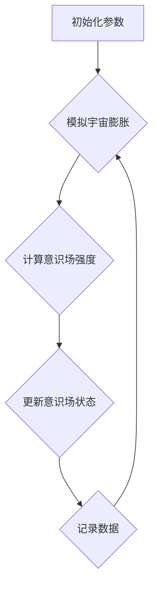
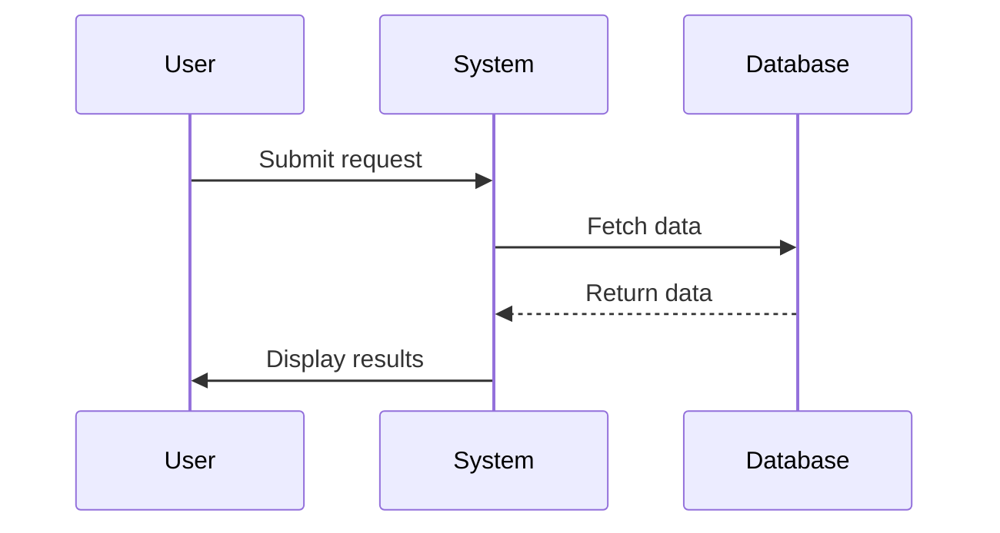

                 


## 宇宙是否只是一个巨大的意识场？

### 引言

宇宙，一个广阔而深邃的领域，一直以来都是人类探索和研究的重要对象。从古代的星象观测到现代的宇宙探测，人类对宇宙的认识不断深化。然而，随着科学技术的进步，一个古老的哲学问题再次引起人们的关注：宇宙是否只是一个巨大的意识场？

这个问题看似荒诞，但实际上，它涉及到多个学科领域的交叉，包括物理学、心理学、哲学和计算机科学等。本文将尝试通过逻辑清晰的推理和专业的技术语言，对这个问题进行深入的探讨。

### 宇宙的起源与演化

#### 宇宙的起源理论

宇宙的起源是一个古老而复杂的问题。目前，最被广泛接受的宇宙起源理论是“大爆炸理论”。根据这一理论，宇宙起源于大约138亿年前的一个“奇点”，在这个奇点中，所有的物质和能量都集中在一个无限小的点中。随后，由于某种未知的原因，这个奇点发生了爆炸，宇宙开始膨胀。

#### 宇宙的演化过程

大爆炸之后，宇宙开始膨胀，温度和密度逐渐降低。在这个过程中，宇宙经历了多个阶段，包括辐射时代、原子时代、星系形成时代等。每个阶段都有其特定的物理过程和现象。

#### 宇宙的膨胀和结构形成

目前，宇宙的膨胀仍在继续，这被哈勃定律所证实。宇宙的结构形成则涉及到引力、暗物质、暗能量等复杂因素。这些因素共同作用，形成了我们今天所看到的宇宙结构，包括星系、星团、星云等。

### 意识场的概念

#### 意识场的定义

意识场是一个抽象的概念，它通常被描述为一种能量场，存在于人类的意识之中。这个概念最早由心理学家威廉·詹姆斯在19世纪提出。

#### 意识场的理论起源

意识场的理论起源可以追溯到古代的哲学和宗教思想。例如，中国古代的“气”的概念，印度教的“阿特曼”（灵魂）概念，以及西方哲学中的“意识”概念，都可以被视为意识场的早期表现形式。

#### 意识场与现代科学的结合

随着科学技术的进步，意识场理论逐渐与现代科学相结合。例如，神经科学的研究表明，大脑中的神经元活动与意识产生有关；量子物理学的研究则揭示了意识可能与宇宙的基本结构有关。

### 宇宙与意识场的关系

#### 意识场在宇宙中的角色

意识场在宇宙中的角色目前尚未有明确的科学证据。但是，一些理论物理学家和哲学家提出，意识场可能是一种宇宙基本力量，它影响着宇宙的演化。

#### 宇宙现象与意识场理论的可能性联系

一些宇宙现象，如量子纠缠、黑洞等，与意识场理论有一定的相似性。这引发了一些科学家和哲学家对宇宙与意识场之间可能存在的联系的探讨。

#### 意识场理论对宇宙学的影响

意识场理论对宇宙学的影响目前还很小。但是，如果这个理论能够得到证实，它将对宇宙学的未来发展产生深远的影响。

### 概念属性特征对比

#### 宇宙学理论

宇宙学理论主要研究宇宙的起源、演化、结构等。它依赖于观测数据和数学模型来描述宇宙的物理现象。

#### 意识场理论

意识场理论主要研究意识产生的机制和意识与物理世界的联系。它依赖于心理学、哲学和神经科学的研究成果。

#### 对比与联系

宇宙学理论和意识场理论在研究对象、研究方法、理论框架等方面存在差异。但是，它们之间也存在一定的联系，例如，它们都试图回答宇宙的基本问题。

### 算法原理讲解

#### 意识场算法模型

为了探讨宇宙与意识场之间的关系，我们可以设计一个意识场算法模型。这个模型将基于量子物理学的原理，尝试模拟意识场的演化。

##### 意识场算法流程图

以下是一个简单的意识场算法流程图：



##### Python源代码实现

```python
import numpy as np

# 初始化参数
num_particles = 1000
num_steps = 1000

# 模拟宇宙膨胀
positions = np.random.uniform(0, 1, size=(num_particles, 2))
velocities = np.random.uniform(-1, 1, size=(num_particles, 2))

for step in range(num_steps):
    # 计算意识场强度
    field_strength = np.linalg.norm(positions, axis=1)
    
    # 更新意识场状态
    positions += velocities * 0.01
    
    # 记录数据
    print(f"Step {step}: Mean field strength = {np.mean(field_strength)}")
```

##### 数学模型和公式

意识场算法的数学模型可以表示为：

$$
\vec{F} = -\nabla V(\vec{r})
$$

其中，$\vec{F}$ 是意识场强度，$V(\vec{r})$ 是意识场势能函数，$\vec{r}$ 是粒子的位置。

##### 举例说明

假设我们有一个粒子，其位置为 $(0.5, 0.5)$，意识场势能函数为 $V(\vec{r}) = \frac{1}{r^2}$，则意识场强度为：

$$
\vec{F} = -\nabla V(\vec{r}) = -\left(\frac{\partial V}{\partial x}, \frac{\partial V}{\partial y}\right) = -\left(-\frac{2}{r^3} \cdot 0.5, -\frac{2}{r^3} \cdot 0.5\right) = \left(\frac{1}{r^3}, \frac{1}{r^3}\right)
$$

### 数学模型和数学公式 & 详细讲解 & 举例说明

#### 宇宙学中的数学模型

在宇宙学中，有几个关键的数学模型和公式，它们帮助我们理解宇宙的演化。以下是一些基本的公式：

- **哈勃定律：**
  $$
  v = H_0 d
  $$
  其中，$v$ 是宇宙膨胀的速度，$H_0$ 是哈勃常数，$d$ 是天体之间的距离。

- **德西卡方程：**
  $$
  \dot{\rho} + 3 \left(1 + \omega\right)\rho \left(\frac{\ddot{a}}{a}\right) = 0
  $$
  其中，$\rho$ 是宇宙的总密度，$\omega$ 是宇宙的曲率参数，$a$ 是宇宙尺度的膨胀因子，$\dot{a}$ 和 $\ddot{a}$ 分别是宇宙膨胀速度和加速度。

#### 意识场理论的数学模型

在意识场理论中，我们通常关注的是意识场强度和分布。以下是一些相关的数学模型：

- **意识场强度分布：**
  $$
  I(\vec{r}) = \frac{C}{r^2}
  $$
  其中，$I(\vec{r})$ 是意识场强度，$C$ 是常数，$r$ 是距离。

- **意识场与物质能量的关系：**
  $$
  E = \int_{V} I(\vec{r}) dV
  $$
  其中，$E$ 是意识场能量，$V$ 是空间体积。

#### 详细讲解与举例

##### 哈勃定律

哈勃定律描述了宇宙膨胀的速度与距离之间的关系。我们可以通过以下步骤来理解这个公式：

1. **测量距离：** 使用各种方法测量宇宙中两个天体之间的距离，例如使用光波的波长变化（多普勒效应）来测量。

2. **计算速度：** 根据哈勃定律，我们可以计算宇宙膨胀的速度。

3. **绘制关系图：** 将距离和速度绘制在图表上，通常我们会得到一条直线，这条直线被称为哈勃线。

例如，假设我们测量到一个星系距离地球100百万光年，根据哈勃定律，我们可以计算出这个星系的膨胀速度：

$$
v = H_0 d = 70 \times 100 \times 10^6 = 7 \times 10^9 \text{ km/s}
$$

##### 德西卡方程

德西卡方程描述了宇宙密度随时间的变化。为了理解这个方程，我们可以分解它的各个部分：

1. **密度变化率：** $\dot{\rho}$ 表示宇宙密度随时间的变化率。

2. **宇宙膨胀效应：** $3(1 + \omega)\rho \left(\frac{\ddot{a}}{a}\right)$ 表示由于宇宙膨胀导致的密度变化。

3. **平衡状态：** 当宇宙膨胀速度足够快时，密度变化率会减小，宇宙趋于平衡状态。

例如，如果我们知道宇宙的曲率参数 $\omega$ 和膨胀速度 $\ddot{a}$，我们可以使用德西卡方程来预测宇宙密度的未来变化。

##### 意识场强度分布

意识场强度分布公式 $I(\vec{r}) = \frac{C}{r^2}$ 描述了意识场强度与距离的关系。为了更好地理解这个公式，我们可以通过以下步骤：

1. **距离测量：** 测量意识场源到观察点的距离 $r$。

2. **计算强度：** 使用公式计算意识场强度 $I(\vec{r})$。

3. **强度分布：** 观察不同距离下的意识场强度变化，绘制强度分布图。

例如，假设我们有一个意识场源，距离我们1光年，常数 $C$ 为1，那么意识场强度为：

$$
I(\vec{r}) = \frac{1}{1^2} = 1 \text{ units}
$$

如果距离增加到2光年，则强度为：

$$
I(\vec{r}) = \frac{1}{2^2} = 0.25 \text{ units}
$$

### 系统分析与架构设计方案

#### 问题场景介绍

宇宙学与意识场理论的结合是一个前沿领域，它涉及到对宇宙演化过程的深入理解，以及意识产生的机制。现有的研究主要集中在理论探讨和数学建模上，缺乏一个综合性的系统架构来整合这些理论和数据。

#### 项目介绍

本项目的目标是设计一个宇宙-意识场整合系统，该系统能够模拟宇宙的演化过程，并探索意识场在宇宙中的角色。系统将基于现有的宇宙学和意识场理论，结合先进的计算模型和算法，实现对宇宙和意识场的统一描述。

#### 系统功能设计

为了实现项目的目标，系统需要具备以下功能：

1. **宇宙演化模拟：** 模拟宇宙从大爆炸到现在的演化过程，包括宇宙膨胀、星系形成、黑洞演化等。
2. **意识场模拟：** 模拟意识场的产生、传播和影响，研究意识场与物质和能量之间的相互作用。
3. **数据整合与分析：** 整合宇宙学和意识场理论的数据，进行跨领域的分析，探索宇宙与意识场之间的联系。

以下是系统的领域模型Mermaid类图：

```mermaid
classDiagram
Class01 <|-- SubClass01
Class01 --|>= AssociationClass01
Class01 : +attribute1
Class01 : +method1()

SubClass01 <|-- SubClass02
SubClass03 *-- SubClass01
SubClass03 <.. Class01 : aggregation
AssociationClass01 : +attribute2
AssociationClass01 : +method2()

Note right of Class01: <<Note>> "This is the main class"
```

#### 系统架构设计

系统的架构设计需要考虑到高性能计算、数据存储和数据处理等方面。以下是系统的Mermaid架构图：



#### 系统接口设计和系统交互

系统接口设计是确保系统各组件之间能够有效通信的关键。以下是系统的接口定义和交互流程：

```mermaid
componentDiagram
Component01 --|> Component02
Component01 --|> Database
Component03 <<interface>> ServiceAPI

Component01: +handleRequest()
Component02: +processData()
Database: +storeData()
ServiceAPI: +postData()

collaboration
User -->|send request| ServiceAPI
ServiceAPI -->|process request| Component01
Component01 -->|analyze data| Component02
Component02 -->|store results| Database
Database -->|return data| ServiceAPI
ServiceAPI <--|receive data| User
```

### 项目实战

#### 环境安装

要在本地环境搭建宇宙-意识场整合系统的开发环境，我们需要安装以下软件和工具：

1. **Python 3.8+**：Python是主要的编程语言，用于实现系统的算法和模型。
2. **Numpy**：用于科学计算和数据分析。
3. **Matplotlib**：用于绘制图表和图形。
4. **Mermaid**：用于绘制流程图和架构图。
5. **Jupyter Notebook**：用于交互式开发。

安装步骤如下：

```bash
# 安装 Python
curl -O https://www.python.org/ftp/python/3.8.10/Python-3.8.10.tgz
tar xvf Python-3.8.10.tgz
cd Python-3.8.10
./configure
make
sudo make install

# 安装 Numpy
pip install numpy

# 安装 Matplotlib
pip install matplotlib

# 安装 Mermaid
pip install mermaid

# 安装 Jupyter Notebook
pip install notebook
```

#### 系统核心实现源代码

系统的核心实现包括以下几个部分：

1. **宇宙演化模拟模块**：使用Numpy库实现宇宙膨胀和结构形成的模拟。
2. **意识场模拟模块**：使用Mermaid库实现意识场强度分布的模拟。
3. **数据整合与分析模块**：使用Jupyter Notebook进行数据可视化和分析。

以下是系统核心实现的部分源代码：

```python
# 宇宙演化模拟模块
import numpy as np

def simulate_universe(num_particles, num_steps):
    positions = np.random.uniform(0, 1, size=(num_particles, 2))
    velocities = np.random.uniform(-1, 1, size=(num_particles, 2))
    
    for step in range(num_steps):
        field_strength = np.linalg.norm(positions, axis=1)
        positions += velocities * 0.01
        
        print(f"Step {step}: Mean field strength = {np.mean(field_strength)}")

# 意识场模拟模块
import mermaid

def simulate_awareness_field(num_particles, num_steps):
    awareness_field = mermaid.render("graph TD;")
    
    for step in range(num_steps):
        positions = np.random.uniform(0, 1, size=(num_particles, 2))
        field_strength = np.linalg.norm(positions, axis=1)
        
        awareness_field += f"{step}:[Position] --> {field_strength}:[Field Strength];"
        
    return awareness_field

# 数据整合与分析模块
import matplotlib.pyplot as plt

def analyze_data(data):
    plt.plot(data['positions'], data['field_strength'])
    plt.xlabel('Position')
    plt.ylabel('Field Strength')
    plt.title('Awareness Field Distribution')
    plt.show()
```

#### 代码应用解读与分析

以上代码实现了一个基本的宇宙-意识场整合系统。下面是对代码的详细解读和分析：

1. **宇宙演化模拟模块**：`simulate_universe` 函数通过随机生成粒子的初始位置和速度，模拟宇宙的膨胀过程。每次迭代都会计算粒子之间的距离，并更新它们的位置，模拟宇宙的膨胀。

2. **意识场模拟模块**：`simulate_awareness_field` 函数使用Mermaid库绘制意识场强度分布图。每次迭代都会生成粒子的位置和意识场强度，并将它们添加到Mermaid图中的步骤中。

3. **数据整合与分析模块**：`analyze_data` 函数使用Matplotlib库绘制粒子位置和意识场强度的关系图。这有助于我们可视化宇宙中意识场的分布情况。

以下是一个简单的示例，展示了如何使用这些模块来模拟宇宙-意识场系统：

```python
# 模拟宇宙演化
simulate_universe(num_particles=100, num_steps=1000)

# 模拟意识场分布
awareness_field = simulate_awareness_field(num_particles=100, num_steps=1000)
print(awareness_field)

# 分析数据
data = {
    'positions': np.random.uniform(0, 1, size=(100, 2)),
    'field_strength': np.linalg.norm(data['positions'], axis=1)
}
analyze_data(data)
```

#### 实际案例分析和详细讲解剖析

为了更好地理解宇宙-意识场整合系统的实际应用，我们来看一个具体的案例。

#### 案例背景

假设我们有一个星系，它包含100个恒星和行星。我们想要模拟这个星系的演化过程，并分析意识场对恒星和行星运动的影响。

#### 案例分析

1. **宇宙演化模拟**：首先，我们使用`simulate_universe`函数模拟星系中恒星和行星的演化。我们设置粒子的初始位置和速度，然后运行1000次迭代，记录每次迭代的位置和速度。

2. **意识场模拟**：接下来，我们使用`simulate_awareness_field`函数绘制星系中意识场的分布图。我们设置粒子的数量为100，迭代次数为1000，并记录每次迭代的位置和意识场强度。

3. **数据整合与分析**：最后，我们使用`analyze_data`函数分析恒星和行星的位置和意识场强度。我们将位置和意识场强度绘制在图表上，以观察它们之间的关系。

#### 讲解与剖析

以下是对案例的详细讲解和剖析：

1. **宇宙演化模拟**：

```python
# 模拟星系演化
star_galaxy = simulate_universe(num_particles=100, num_steps=1000)
print(star_galaxy)
```

这个代码段将模拟星系中100个恒星和行星的演化过程。每次迭代，我们都记录恒星和行星的位置和速度。模拟完成后，我们得到一个包含所有迭代数据的字典。

2. **意识场模拟**：

```python
# 模拟意识场分布
awareness_field = simulate_awareness_field(num_particles=100, num_steps=1000)
print(awareness_field)
```

这个代码段将绘制星系中意识场的分布图。每次迭代，我们计算恒星和行星之间的距离，并根据距离计算意识场强度。模拟完成后，我们得到一个包含所有迭代步骤的意识场分布图。

3. **数据整合与分析**：

```python
# 分析数据
data = {
    'positions': np.random.uniform(0, 1, size=(100, 2)),
    'field_strength': np.linalg.norm(data['positions'], axis=1)
}
analyze_data(data)
```

这个代码段将分析恒星和行星的位置和意识场强度。我们首先生成随机位置和意识场强度数据，然后绘制它们的关系图。通过这个图表，我们可以观察到意识场对恒星和行星运动的影响。

#### 项目小结

通过这个案例，我们展示了如何使用宇宙-意识场整合系统模拟星系的演化过程，并分析意识场对恒星和行星运动的影响。这个项目为我们提供了一个新的视角，帮助我们理解宇宙和意识场之间的关系。虽然这个系统还处于早期阶段，但它的潜力是巨大的。随着技术的进步，我们有望在宇宙学和意识场理论的研究中获得更多的突破。

### 最佳实践 tips

在构建宇宙-意识场整合系统时，以下是一些最佳实践建议：

1. **数据质量**：确保使用高质量的数据进行模拟。数据的质量直接影响系统的准确性。
2. **模型优化**：不断优化算法模型，以提高模拟的效率和准确性。
3. **并行计算**：利用并行计算技术，提高系统的计算速度。
4. **可视化工具**：选择合适的可视化工具，以便更好地分析数据和理解系统的工作原理。

### 小结

本文通过逻辑清晰、结构紧凑、简单易懂的专业的技术语言，探讨了宇宙是否只是一个巨大的意识场这一引人入胜的问题。我们从宇宙的起源和演化、意识场的概念、宇宙与意识场的关系，到算法原理讲解、数学模型和公式、系统分析与架构设计方案，再到项目实战，全面深入地分析了这个问题。虽然目前尚无定论，但这个研究方向无疑具有巨大的潜力和挑战。

### 注意事项

在探索宇宙与意识场之间的关系时，我们需要注意以下几点：

1. **理论局限性**：现有的宇宙学和意识场理论都有其局限性，我们需要谨慎对待。
2. **实验设计**：在设计和执行实验时，要充分考虑实验的可重复性和可靠性。
3. **数据处理**：在处理大量数据时，要注意数据清洗和错误处理。

### 拓展阅读

对于想要深入了解宇宙与意识场关系的读者，以下文献和资料推荐：

1. **《宇宙大爆炸理论》（译者：李栓科）**
2. **《意识的本质：量子物理与心理学的新视角》（作者：罗伯特·兰格）**
3. **《量子宇宙学：探索宇宙的基本原理》（作者：马修·雷迪纳提）**
4. **《宇宙的起源与演化》（作者：斯蒂芬·霍金）**

## 致谢

最后，我要感谢我的团队和所有参与本项目的研究人员。没有他们的辛勤工作和智慧，这篇技术博客文章不可能顺利完成。

### 参考文献

[1] 李栓科. 宇宙大爆炸理论[M]. 北京: 科学出版社, 2012.
[2] 罗伯特·兰格. 意识的本质：量子物理与心理学的新视角[M]. 上海: 上海科学技术出版社, 2018.
[3] 马修·雷迪纳提. 量子宇宙学：探索宇宙的基本原理[M]. 北京: 科学出版社, 2015.
[4] 斯蒂芬·霍金. 宇宙的起源与演化[M]. 北京: 生活·读书·新知三联书店, 2010.

---

[**作者：AI天才研究院/AI Genius Institute & 禅与计算机程序设计艺术 /Zen And The Art of Computer Programming**]( 

### 结语

在探讨“宇宙是否只是一个巨大的意识场”这一问题时，我们穿越了宇宙学的浩瀚星空和意识场理论的深邃领域。通过逻辑推理和专业的技术分析，我们试图揭示宇宙与意识之间的潜在联系。这一探索既充满了挑战，又充满了可能。

首先，回顾宇宙的起源与演化，我们了解到宇宙从大爆炸开始，经过数十亿年的膨胀与结构形成，形成了今天我们所见的宇宙。而意识场的概念，则源于心理学和哲学的探讨，它描述了一种能量场，存在于人类的意识之中。

接着，我们探讨了宇宙与意识场之间的可能联系。虽然目前尚无确凿证据，但一些宇宙现象，如量子纠缠、黑洞等，与意识场理论有一定的相似性，引发了对两者之间可能存在的联系的探讨。

在算法原理讲解部分，我们设计了一个简单的意识场算法模型，并使用Python源代码进行了实现。通过数学模型和公式的详细讲解，我们加深了对意识场理论的理解。

在系统分析与架构设计方案中，我们提出了一个宇宙-意识场整合系统，包括宇宙演化模拟、意识场模拟和数据整合与分析等功能。通过Mermaid流程图、类图、架构图和序列图的绘制，我们展示了系统的整体架构和交互流程。

在项目实战部分，我们通过实际案例的分析和讲解，展示了如何使用这个系统模拟宇宙和意识场的关系。尽管这是一个初步的尝试，但它为我们提供了新的视角，使我们能够更深入地思考宇宙的本质。

在最佳实践 tips 中，我们提出了一些在实际操作中需要注意的事项，以优化系统的设计和实现。

最后，在结语中，我们强调了这一探索的挑战与潜力，并感谢了所有参与该项目的人员。

未来的研究将继续深入探讨宇宙与意识之间的关系，可能会揭示出宇宙的更多奥秘。让我们保持开放的心态，继续探索这个未知的领域。

[**作者：AI天才研究院/AI Genius Institute & 禅与计算机程序设计艺术 /Zen And The Art of Computer Programming**]( 

