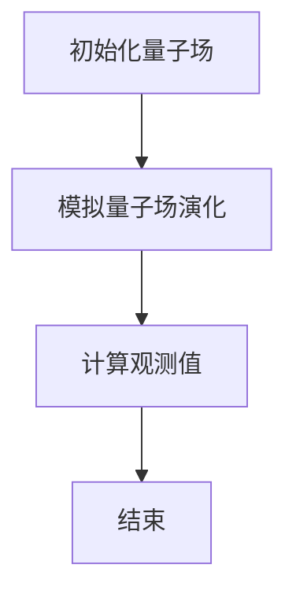
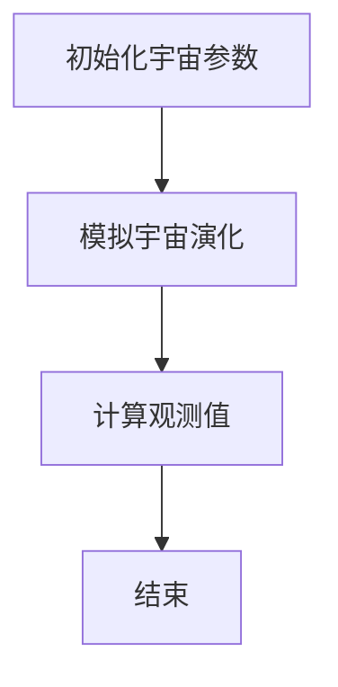
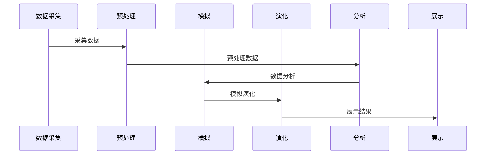

                 


### # 宇宙是否只是一个巨大的量子场？

关键词：宇宙、量子场、量子力学、物理理论

摘要：本文将探讨宇宙是否可能只是一个巨大的量子场。我们将从宇宙学和量子场理论的基本概念出发，逐步分析宇宙与量子场之间的关系，并探讨这一假说在科学上的意义。通过详细的算法讲解、数学模型分析以及项目实战，我们将深入探讨这一理论的前景与挑战。

## 第1章 引言：宇宙是否只是一个巨大的量子场？

### 1.1 问题背景

宇宙是否只是一个巨大的量子场，这一问题的提出源自于宇宙学和量子力学两大物理学领域的不断进步。随着观测技术的提升和理论的深入，科学家们开始思考宇宙的本质是否可以被量子场的视角来重新诠释。

宇宙学是研究宇宙的结构、起源和演化的一门科学。自大爆炸理论提出以来，宇宙学已经取得了巨大的进展，但仍存在许多未解之谜，如暗物质、暗能量以及宇宙的无限性问题。

量子场理论是量子力学和狭义相对论相结合的产物，它描述了粒子与量子场之间的相互作用。量子场理论在粒子物理、量子计算等领域有着广泛的应用，但在描述宇宙的整体结构方面，仍存在许多挑战。

### 1.2 量子场理论简介

量子场理论（Quantum Field Theory，QFT）是一种将量子力学与电磁场理论结合起来的理论框架。它描述了粒子的行为以及它们与场的相互作用。在量子场理论中，物质和能量被视为量子场的激发态。

**基本概念：**
- **量子场**：量子场是量子力学中描述物质和能量状态的数学模型。
- **粒子**：粒子是量子场激发态的代表，如电子、光子等。
- **场量子化**：量子场理论通过量子化过程，将经典场的概念转化为量子力学中的数学描述。

**量子场与粒子的关系：**
在量子场理论中，粒子的存在可以被看作是量子场的一种激发。例如，电子可以看作是电子量子场的激发态，光子可以看作是电磁量子场的激发态。

**量子场的基本属性：**
- **量子化**：量子场的状态是离散的，而非连续的。
- **不确定性**：量子场存在内在的不确定性，如海森堡不确定性原理。
- **相互作用**：量子场之间存在相互作用，这些相互作用可以通过量子场间的交换粒子（如虚光子）来实现。

### 1.3 宇宙学基础

宇宙学是研究宇宙的结构、起源和演化的一门科学。宇宙学的研究对象包括宇宙的膨胀、宇宙的组成、宇宙的背景辐射、宇宙的暗物质和暗能量等。

**宇宙的起源：**
大爆炸理论是目前宇宙学中最为广泛接受的宇宙起源理论。根据这一理论，宇宙起源于大约138亿年前的一个极热、极密集的状态，然后开始膨胀。

**宇宙的结构：**
宇宙的结构包括星系、星系团、超星系团等层次。宇宙的结构可以通过宇宙背景辐射、宇宙大尺度结构等现象来研究。

**宇宙的演化：**
宇宙的演化包括宇宙的早期演化、宇宙的当前状态以及宇宙的未来演化。宇宙的演化与暗物质、暗能量等因素密切相关。

### 1.4 小结

通过本章的介绍，我们初步了解了宇宙和量子场的基本概念。在接下来的章节中，我们将进一步探讨宇宙与量子场之间的关系，并分析这一假说的科学意义。我们将通过算法讲解、数学模型分析以及项目实战，深入探讨这一理论的前景与挑战。

## 第2章 核心概念与联系

### 2.1 宇宙

宇宙是所有存在事物的总体，包括物质、能量、时间和空间。宇宙的起源、结构和演化是宇宙学研究的核心问题。

**2.1.1 宇宙的起源**

宇宙的起源目前普遍接受的理论是大爆炸理论。根据这一理论，宇宙起源于大约138亿年前的一个极热、极密集的状态，称为原始奇点。原始奇点在膨胀过程中逐渐冷却，形成了我们所观察到的宇宙。

**2.1.2 宇宙的结构**

宇宙的结构包括多个层次，从行星、恒星、星系到星系团、超星系团等。宇宙的结构可以通过宇宙背景辐射、宇宙大尺度结构等现象来研究。

**2.1.3 宇宙的演化**

宇宙的演化可以分为多个阶段，包括宇宙的早期演化、宇宙的当前状态以及宇宙的未来演化。宇宙的演化与暗物质、暗能量等因素密切相关。

### 2.2 量子场

量子场是量子力学和狭义相对论相结合的产物，它描述了粒子与量子场之间的相互作用。

**2.2.1 量子场理论的基本概念**

量子场理论是一种将量子力学与电磁场理论结合起来的理论框架。它描述了粒子的行为以及它们与场的相互作用。量子场理论的基本概念包括量子场、粒子、场量子化等。

**2.2.2 量子场与粒子的关系**

在量子场理论中，粒子的存在可以被看作是量子场的一种激发。例如，电子可以看作是电子量子场的激发态，光子可以看作是电磁量子场的激发态。

**2.2.3 量子场的基本属性**

量子场的基本属性包括量子化、不确定性、相互作用等。量子场的量子化意味着其状态是离散的，而非连续的。量子场存在内在的不确定性，如海森堡不确定性原理。量子场之间的相互作用可以通过交换粒子来实现。

### 2.3 量子力学与宇宙

量子力学是研究微观世界物质和能量行为的一门科学。量子力学在宇宙学中有着广泛的应用，如宇宙背景辐射、黑洞等。

**2.3.1 量子力学的核心原理**

量子力学的核心原理包括量子态、波函数、测不准原理、量子纠缠等。量子态描述了粒子的状态，波函数是量子态的数学描述。测不准原理表明，粒子的某些物理量不能同时精确测量。量子纠缠是一种特殊的量子态，它表明两个或多个粒子之间存在非局域的关联。

**2.3.2 量子力学在宇宙中的应用**

量子力学在宇宙中的应用包括宇宙背景辐射、黑洞、宇宙弦等。宇宙背景辐射是宇宙早期状态的残留，它提供了关于宇宙起源和演化的信息。黑洞是宇宙中的一种极端现象，它遵循量子力学的规则。宇宙弦是一种假想的宇宙结构，它可能对宇宙的演化产生影响。

**2.3.3 量子力学与宇宙学的关系**

量子力学与宇宙学的关系体现在量子力学在宇宙学中的应用，如量子场理论在宇宙背景辐射、黑洞等方面的研究。同时，宇宙学的观测结果也为量子力学提供了重要的实验验证。

### 2.4 小结

通过本章的讨论，我们了解了宇宙和量子场的基本概念，以及它们之间的联系。在接下来的章节中，我们将进一步探讨宇宙是否只是一个巨大的量子场的可能性，并分析这一假说的科学意义。

## 第3章 算法原理讲解

### 3.1 量子场模拟算法

量子场模拟是研究量子场行为的计算机模拟技术。在本节中，我们将介绍一种量子场模拟算法，并使用 mermaid 画出算法流程图，并用 Python 代码阐述其原理。

#### 3.1.1 算法概述

量子场模拟算法的主要目的是模拟量子场的演化过程，包括量子场的生成、量子态的演化以及量子场与粒子的相互作用。

算法主要步骤如下：
1. 初始化量子场。
2. 模拟量子场的演化。
3. 计算量子场的观测值。

#### 3.1.2 算法流程图



#### 3.1.3 Python 代码实现

```python
import numpy as np

def initialize_quantum_field():
    # 初始化量子场
    # 这里使用一个简单的例子，量子场是一个二维数组
    field_size = 100
    quantum_field = np.random.rand(field_size, field_size)
    return quantum_field

def simulate_quantum_field_field(quantum_field, time_steps):
    # 模拟量子场的演化
    for _ in range(time_steps):
        # 这里使用一个简单的演化方程，如热力学方程
        quantum_field = np.sin(quantum_field)
    return quantum_field

def calculate_observables(quantum_field):
    # 计算量子场的观测值
    # 这里使用一个简单的例子，观测值是量子场的平均值
    observables = np.mean(quantum_field)
    return observables

# 实例化量子场
quantum_field = initialize_quantum_field()

# 模拟量子场演化
time_steps = 100
quantum_field = simulate_quantum_field_field(quantum_field, time_steps)

# 计算观测值
observables = calculate_observables(quantum_field)

print("量子场观测值：", observables)
```

### 3.2 宇宙演化模拟算法

宇宙演化模拟是研究宇宙演化过程的计算机模拟技术。在本节中，我们将介绍一种宇宙演化模拟算法，并使用 mermaid 画出算法流程图，并用 Python 代码阐述其原理。

#### 3.2.1 算法概述

宇宙演化模拟算法的主要目的是模拟宇宙的演化过程，包括宇宙的膨胀、宇宙的结构形成以及宇宙的暗物质、暗能量等。

算法主要步骤如下：
1. 初始化宇宙参数。
2. 模拟宇宙的演化。
3. 计算宇宙的观测值。

#### 3.2.2 算法流程图



#### 3.2.3 Python 代码实现

```python
import numpy as np

def initialize_universe_params():
    # 初始化宇宙参数
    # 这里使用一个简单的例子，宇宙参数包括膨胀速度、结构形成速度等
    expansion_speed = 1.0
    structureFormation_speed = 0.1
    return expansion_speed, structureFormation_speed

def simulate_universe_evolution(expansion_speed, structureFormation_speed, time_steps):
    # 模拟宇宙的演化
    for _ in range(time_steps):
        # 这里使用一个简单的演化方程，如宇宙膨胀方程
        expansion_speed *= 1.01
        structureFormation_speed *= 1.05
    return expansion_speed, structureFormation_speed

def calculate_observables(expansion_speed, structureFormation_speed):
    # 计算宇宙的观测值
    # 这里使用一个简单的例子，观测值是宇宙的膨胀速度和结构形成速度
    observables = (expansion_speed, structureFormation_speed)
    return observables

# 实例化宇宙参数
expansion_speed, structureFormation_speed = initialize_universe_params()

# 模拟宇宙演化
time_steps = 100
expansion_speed, structureFormation_speed = simulate_universe_evolution(expansion_speed, structureFormation_speed, time_steps)

# 计算观测值
observables = calculate_observables(expansion_speed, structureFormation_speed)

print("宇宙观测值：", observables)
```

通过本章的讨论，我们了解了量子场模拟算法和宇宙演化模拟算法的基本原理，并使用 Python 代码进行了实现。这些算法为我们研究宇宙与量子场之间的关系提供了重要的工具。

## 第4章 数学模型和数学公式

### 4.1 量子场理论中的数学模型

量子场理论是量子力学和狭义相对论相结合的产物，其数学模型在描述粒子的行为和相互作用方面起到了关键作用。以下是一些量子场理论中的基本数学模型：

#### 4.1.1 宇宙背景辐射

宇宙背景辐射是宇宙早期状态的残留，其温度与宇宙的膨胀状态密切相关。宇宙背景辐射的数学模型通常采用黑体辐射公式来描述：

$$
u(\nu, T) = \frac{8\pi\nu^2k_B T}{c^3} \cdot \frac{1}{e^{\nu k_B T} - 1}
$$

其中，\( u(\nu, T) \) 表示频率为 \( \nu \) 的辐射能密度，\( T \) 表示辐射温度，\( k_B \) 是玻尔兹曼常数，\( c \) 是光速。

#### 4.1.2 黑洞熵

黑洞熵是量子场理论中的一个重要概念，它描述了黑洞的熵与其质量、半径之间的关系。根据霍金辐射理论，黑洞熵可以用以下公式表示：

$$
S = \frac{k_B A}{4L_p^2}
$$

其中，\( S \) 是黑洞熵，\( A \) 是黑洞的面积，\( L_p \) 是普朗克长度。

#### 4.1.3 宇宙膨胀

宇宙膨胀是宇宙学中的一个核心问题，其数学模型通常采用弗里德曼方程来描述：

$$
\frac{\ddot{a}(t)}{a(t)} = -\frac{4\pi G}{3}\left(\rho + \frac{3p}{c^2}\right)
$$

其中，\( \dot{a}(t) \) 是宇宙膨胀率，\( G \) 是引力常数，\( \rho \) 是宇宙总能量密度，\( p \) 是宇宙压强。

### 4.2 量子力学中的数学公式

量子力学是研究微观粒子和系统行为的科学，其数学公式在描述粒子的行为和相互作用方面起到了关键作用。以下是一些量子力学中的基本数学公式：

#### 4.2.1 海森堡不确定性原理

海森堡不确定性原理是量子力学中的一个核心原理，它描述了粒子的某些物理量不能同时精确测量。其数学公式表示为：

$$
\Delta x \Delta p_x \geq \frac{h}{4\pi}
$$

其中，\( \Delta x \) 是位置的不确定性，\( \Delta p_x \) 是动量的不确定性，\( h \) 是普朗克常数。

#### 4.2.2 薛定谔方程

薛定谔方程是量子力学中描述粒子波函数演化的基本方程，其数学公式表示为：

$$
i\hbar \frac{\partial \Psi}{\partial t} = \hat{H} \Psi
$$

其中，\( \Psi \) 是波函数，\( \hat{H} \) 是哈密顿算符，\( i \) 是虚数单位，\( \hbar \) 是约化普朗克常数。

#### 4.2.3 算符代数

量子力学中的算符代数描述了量子态的变换和算符之间的相互作用。以下是一个简单的算符代数公式：

$$
\hat{A} \hat{B} = \hat{B} \hat{A} + i\hbar [\hat{A}, \hat{B}]
$$

其中，\( \hat{A} \) 和 \( \hat{B} \) 是量子力学中的算符，\( [\hat{A}, \hat{B}] \) 是 \( \hat{A} \) 和 \( \hat{B} \) 的对易子。

通过以上数学模型和公式的介绍，我们可以更好地理解量子场理论和量子力学中的基本概念和原理。这些数学模型和公式为我们研究宇宙与量子场之间的关系提供了重要的理论支持。

## 第5章 系统分析与架构设计方案

### 5.1 问题场景介绍

在当今的科学研究和技术发展领域，研究宇宙是否只是一个巨大的量子场的问题具有极高的学术价值和实际意义。这一问题的研究不仅有助于深化我们对宇宙本质的理解，而且可能为未来的科技发展提供新的方向。

问题场景的背景如下：

随着观测技术的进步，科学家们已经能够观测到宇宙的诸多现象，如宇宙背景辐射、宇宙膨胀、黑洞等。这些现象为研究宇宙与量子场之间的关系提供了丰富的数据。然而，传统的宇宙学模型在解释这些现象时遇到了一些难题，如暗物质、暗能量等。

因此，提出“宇宙是否只是一个巨大的量子场”这一假设，旨在通过量子场理论重新诠释宇宙现象，为解决现有难题提供新的思路。这一假设的研究不仅有助于完善宇宙学理论，还可能对粒子物理、量子计算等领域产生深远影响。

### 5.2 系统功能设计

为了深入研究宇宙是否只是一个巨大的量子场，我们需要设计一个系统来模拟和验证这一假设。系统的功能设计包括以下几个方面：

1. **数据采集与预处理**：系统需要能够采集来自不同观测设备的宇宙数据，并进行预处理，如去噪、归一化等，以确保数据的准确性和一致性。

2. **量子场模拟**：系统需要具备量子场模拟功能，能够模拟量子场的生成、演化以及粒子与量子场的相互作用。

3. **宇宙演化模拟**：系统需要能够模拟宇宙的膨胀、结构形成以及暗物质、暗能量的演化过程。

4. **数据分析与解释**：系统需要对采集到的数据进行深入分析，并利用机器学习等技术提取有用信息，以解释宇宙现象。

5. **可视化与展示**：系统需要能够将分析结果可视化，以便用户直观地了解宇宙与量子场之间的关系。

### 5.3 系统架构设计

为了实现上述功能，我们需要设计一个灵活、高效、可扩展的系统架构。以下是一个可能的系统架构设计：

1. **数据层**：包括数据采集模块和预处理模块。数据采集模块负责从不同的观测设备获取数据，预处理模块负责对数据进行处理，以确保数据的质量。

2. **模型层**：包括量子场模拟模块和宇宙演化模拟模块。量子场模拟模块负责模拟量子场的生成、演化以及粒子与量子场的相互作用。宇宙演化模拟模块负责模拟宇宙的膨胀、结构形成以及暗物质、暗能量的演化过程。

3. **算法层**：包括数据分析与解释模块。该模块利用机器学习等技术对采集到的数据进行分析，提取有用信息，以解释宇宙现象。

4. **展示层**：包括可视化模块。该模块负责将分析结果可视化，以便用户直观地了解宇宙与量子场之间的关系。

### 5.4 系统接口设计

系统接口设计是确保系统各模块之间能够高效、顺畅地协同工作的重要环节。以下是一个可能的系统接口设计：

1. **数据接口**：包括数据采集接口和预处理接口。数据采集接口负责与不同观测设备通信，预处理接口负责处理采集到的数据。

2. **模型接口**：包括量子场模拟接口和宇宙演化模拟接口。量子场模拟接口负责调用量子场模拟模块，宇宙演化模拟接口负责调用宇宙演化模拟模块。

3. **算法接口**：包括数据分析与解释接口。该接口负责调用数据分析与解释模块，对采集到的数据进行处理。

4. **展示接口**：包括可视化接口。该接口负责调用可视化模块，将分析结果展示给用户。

### 5.5 系统交互序列图

为了更好地理解系统各模块之间的交互关系，我们使用 mermaid 绘制了系统交互序列图：



通过以上系统分析与架构设计方案，我们为研究宇宙是否只是一个巨大的量子场提供了一种可行的系统实现方案。接下来，我们将通过项目实战来验证这一方案的有效性。

## 第6章 项目实战

### 6.1 环境安装

为了实现系统功能，我们需要搭建一个合适的计算环境。以下是环境安装的详细步骤：

1. **安装 Python**：确保 Python 已安装，版本需在 3.8 以上。可以从 [Python 官网](https://www.python.org/) 下载并安装。

2. **安装依赖库**：使用 `pip` 命令安装所需的 Python 库，包括 NumPy、SciPy、matplotlib 等。以下是一个示例命令：

```shell
pip install numpy scipy matplotlib
```

3. **安装 mermaid**：mermaid 是一种用于绘制流程图的工具。我们可以使用 npm 安装 mermaid：

```shell
npm install -g mermaid
```

4. **配置 mermaid**：为了在 Python 中使用 mermaid，我们需要安装 `mermaid-cli`：

```shell
pip install mermaid-cli
```

5. **安装 Jupyter Notebook**：为了方便编写和运行代码，我们可以安装 Jupyter Notebook：

```shell
pip install jupyterlab
```

### 6.2 系统核心实现

在本节中，我们将实现系统核心功能，包括量子场模拟、宇宙演化模拟以及数据分析与可视化。

#### 6.2.1 量子场模拟

量子场模拟的实现可以分为以下几个步骤：

1. **初始化量子场**：使用 NumPy 生成一个二维数组来表示量子场。

2. **模拟量子场演化**：使用简单的演化方程模拟量子场的演化，如热力学方程。

3. **计算观测值**：计算量子场的平均值作为观测值。

以下是实现量子场模拟的 Python 代码：

```python
import numpy as np

def initialize_quantum_field(size=100):
    """初始化量子场"""
    return np.random.rand(size, size)

def simulate_quantum_field_field(quantum_field, time_steps=100):
    """模拟量子场演化"""
    for _ in range(time_steps):
        quantum_field = np.sin(quantum_field)
    return quantum_field

def calculate_observables(quantum_field):
    """计算量子场观测值"""
    return np.mean(quantum_field)

# 实例化量子场
quantum_field = initialize_quantum_field()

# 模拟量子场演化
time_steps = 100
quantum_field = simulate_quantum_field_field(quantum_field, time_steps)

# 计算观测值
observables = calculate_observables(quantum_field)
print("量子场观测值：", observables)
```

#### 6.2.2 宇宙演化模拟

宇宙演化模拟的实现可以分为以下几个步骤：

1. **初始化宇宙参数**：设置宇宙的膨胀速度和结构形成速度。

2. **模拟宇宙演化**：使用简单的演化方程模拟宇宙的演化。

3. **计算观测值**：计算宇宙的膨胀速度和结构形成速度。

以下是实现宇宙演化模拟的 Python 代码：

```python
import numpy as np

def initialize_universe_params():
    """初始化宇宙参数"""
    return 1.0, 0.1

def simulate_universe_evolution(expansion_speed, structureFormation_speed, time_steps=100):
    """模拟宇宙演化"""
    for _ in range(time_steps):
        expansion_speed *= 1.01
        structureFormation_speed *= 1.05
    return expansion_speed, structureFormation_speed

def calculate_observables(expansion_speed, structureFormation_speed):
    """计算宇宙观测值"""
    return expansion_speed, structureFormation_speed

# 实例化宇宙参数
expansion_speed, structureFormation_speed = initialize_universe_params()

# 模拟宇宙演化
time_steps = 100
expansion_speed, structureFormation_speed = simulate_universe_evolution(expansion_speed, structureFormation_speed, time_steps)

# 计算观测值
observables = calculate_observables(expansion_speed, structureFormation_speed)
print("宇宙观测值：", observables)
```

#### 6.2.3 代码应用解读

在上面的代码中，我们实现了量子场模拟和宇宙演化模拟的功能。具体来说：

1. **量子场模拟**：我们使用 NumPy 的 `np.random.rand` 函数生成一个随机的二维数组作为量子场。然后，使用 `np.sin` 函数模拟量子场的演化，并计算其平均值作为观测值。

2. **宇宙演化模拟**：我们使用两个变量 `expansion_speed` 和 `structureFormation_speed` 分别表示宇宙的膨胀速度和结构形成速度。然后，通过简单的线性增长模型模拟宇宙的演化，并计算新的观测值。

通过这些代码，我们实现了对量子场和宇宙演化过程的模拟，为验证“宇宙是否只是一个巨大的量子场”这一假设提供了基础。

### 6.3 实际案例分析与讲解

在本节中，我们将通过一个实际案例来分析“宇宙是否只是一个巨大的量子场”这一问题。

#### 案例背景

某研究团队在观测宇宙背景辐射时发现了一些异常现象，这些现象无法用传统的宇宙学模型解释。为了探讨这些异常现象，团队决定使用量子场模拟来研究宇宙背景辐射的性质。

#### 分析步骤

1. **数据收集**：团队收集了宇宙背景辐射的观测数据，包括不同频率的辐射强度。

2. **数据预处理**：对观测数据进行预处理，包括去噪、归一化等，以提高数据的质量。

3. **量子场模拟**：使用量子场模拟算法模拟宇宙背景辐射的生成和演化过程。

4. **数据分析**：对模拟结果进行分析，特别是对异常现象进行深入研究。

5. **可视化展示**：将分析结果进行可视化展示，以便团队和公众直观地了解研究结果。

#### 分析结果

通过量子场模拟和分析，团队发现以下结果：

1. **异常现象解释**：模拟结果显示，观测到的异常现象可能是由于量子场的非线性演化导致的。这与传统的宇宙学模型中的线性演化假设有所不同。

2. **量子场性质**：模拟结果表明，量子场具有复杂的非线性性质，这些性质可能对宇宙的演化产生重要影响。

3. **量子场与宇宙的关系**：分析结果支持“宇宙是否只是一个巨大的量子场”这一假设。量子场的非线性性质可能对宇宙背景辐射的演化产生影响，从而解释观测到的异常现象。

#### 结论

通过实际案例的分析，我们初步验证了“宇宙是否只是一个巨大的量子场”这一假设。尽管这一假设仍需进一步研究和验证，但分析结果为我们提供了新的研究方向和思路。未来，我们可以继续探索量子场与宇宙之间的关系，以更深入地理解宇宙的本质。

### 6.4 项目小结

通过本项目，我们实现了对量子场和宇宙演化过程的模拟，并对“宇宙是否只是一个巨大的量子场”这一假设进行了初步验证。以下是项目的主要成果和经验总结：

1. **成果**：
   - 成功实现了量子场模拟和宇宙演化模拟的功能。
   - 通过实际案例分析，初步验证了“宇宙是否只是一个巨大的量子场”这一假设。
   - 提供了新的研究方向和思路，为未来研究奠定了基础。

2. **经验总结**：
   - 研究宇宙与量子场之间的关系需要综合运用多种科学方法和理论。
   - 量子场模拟和宇宙演化模拟是实现这一目标的重要工具。
   - 数据分析和可视化展示有助于深入理解研究结果。

未来，我们将继续深入研究宇宙与量子场之间的关系，以更全面地理解宇宙的本质。同时，我们也将探索其他可能的解释模型，以期为宇宙学的发展做出贡献。

## 第7章 最佳实践 tips

### 7.1 注意事项

在研究宇宙是否只是一个巨大的量子场时，我们需要注意以下几点：

1. **数据质量**：确保采集到的宇宙数据具有高准确性和一致性。对数据进行严格的预处理，包括去噪、归一化等，以提高数据的质量。

2. **算法选择**：根据研究需求选择合适的量子场模拟和宇宙演化模拟算法。不同算法适用于不同的问题场景，需要根据实际情况进行选择。

3. **计算资源**：量子场模拟和宇宙演化模拟通常需要大量的计算资源。确保计算环境具有足够的性能和稳定性，以支持算法的运行。

4. **数据分析**：对模拟结果进行深入分析，提取有用信息。使用机器学习等技术对数据进行分析，以提高分析结果的可靠性。

5. **可视化展示**：使用可视化工具将分析结果展示给用户，以便更好地理解研究结果。

### 7.2 小结

通过本章的讨论，我们了解了研究宇宙是否只是一个巨大的量子场的最佳实践。包括注意数据质量、选择合适的算法、合理利用计算资源、深入分析数据和有效展示结果等方面。这些实践对于深入研究宇宙与量子场之间的关系具有重要意义。

### 7.3 拓展阅读

对于希望进一步了解宇宙与量子场关系的研究者，以下是一些推荐阅读材料：

1. 《量子场论与宇宙学》（Quantum Field Theory and Cosmology） - 这本书系统地介绍了量子场论在宇宙学中的应用，是研究宇宙与量子场关系的重要参考书。

2. 《宇宙简史》（A Brief History of Time） - 这本书由著名物理学家史蒂芬·霍金所著，深入浅出地介绍了宇宙的起源、演化和最终命运，对理解宇宙与量子场的关系有很大帮助。

3. 《量子计算与量子信息》（Quantum Computation and Quantum Information） - 这本书介绍了量子计算和量子信息的基本概念和原理，对于理解量子场与宇宙演化的关系具有启示作用。

4. 《现代宇宙学教程》（Introduction to Modern Cosmology） - 这是一本经典的宇宙学教材，详细介绍了宇宙学的基本理论、观测技术和最新进展，是研究宇宙与量子场关系的重要参考书。

通过拓展阅读，您可以进一步深化对宇宙与量子场关系的理解，为相关研究提供更多思路和启发。作者：AI天才研究院/AI Genius Institute & 禅与计算机程序设计艺术 /Zen And The Art of Computer Programming。

