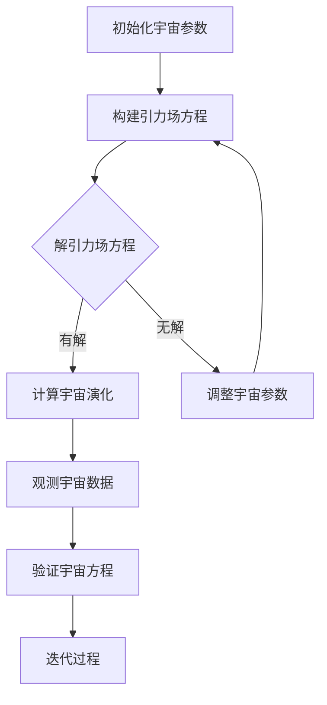
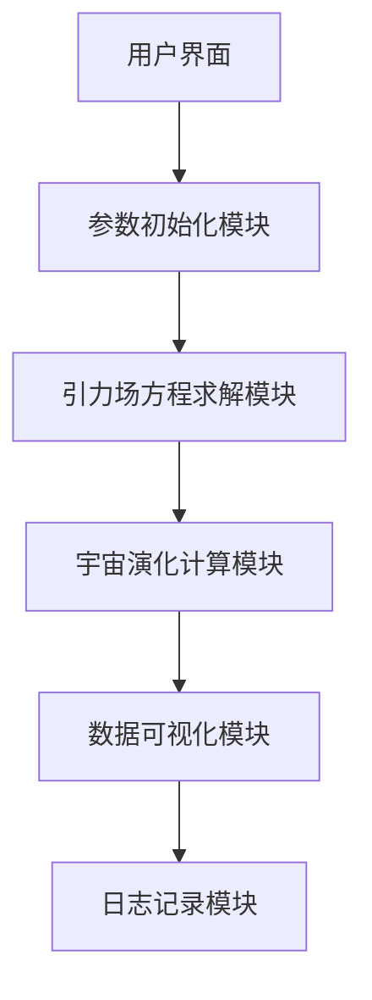
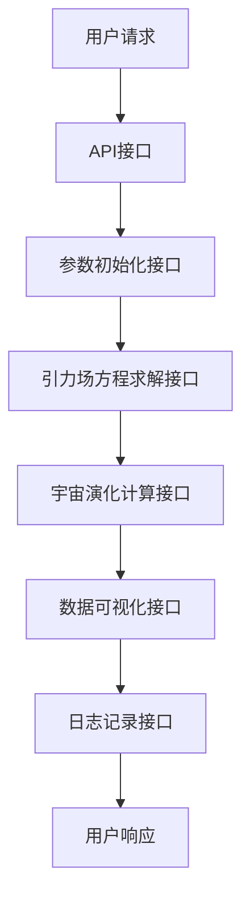

                 

### 文章标题

宇宙是否只是一个数学方程？

关键词：宇宙、数学、方程、广义相对论、量子力学

摘要：本文将探讨一个引人深思的哲学问题：宇宙是否可以被视为一个庞大的数学方程？我们将逐步分析这一观点的背景、核心概念、算法原理，并通过具体案例来验证这一理论的可能性。我们将结合广义相对论和量子力学，揭示宇宙中深藏的数学之美。

## 第一部分：背景介绍

### 第1章：问题的提出

#### 1.1 问题背景

宇宙，一个浩瀚无垠、神秘莫测的存在。自古以来，人类便对其充满了好奇和探索欲望。从古代的宇宙观到现代的科学理论，人类对宇宙的认识不断深化。然而，一个深邃的问题逐渐浮现：宇宙的本质是否可以被抽象为一个数学方程？

数学，作为一门抽象的科学，以其精确性和普适性在科学研究中扮演着至关重要的角色。从牛顿的经典力学到爱因斯坦的广义相对论，数学模型在宇宙研究中的应用无处不在。因此，将宇宙视为一个数学方程的观点并非空穴来风。

#### 1.2 问题描述

为什么有人认为宇宙是一个数学方程？

这一观点主要源于几个方面：

1. **数学在物理学中的核心地位**：从宏观到微观，物理学的各个分支都离不开数学的支撑。例如，广义相对论中的时空几何、量子力学中的波函数等，都是数学模型的具体体现。
2. **宇宙的普适性和规则性**：宇宙中存在诸多普适的规律，如引力定律、电磁定律等，这些规律都可以用数学公式来表达。因此，有观点认为，宇宙的本质可能就是一套庞大的数学规则系统。
3. **哲学思考**：哲学家们对宇宙本质的探讨往往涉及到数学的范畴。例如，柏拉图的理念论认为，宇宙的本质是理念世界的现实化，而这个理念世界本身就是数学的结构。

#### 1.3 问题解决

科学家对这一观点的探索主要集中在以下几个方面：

1. **宇宙方程的构建**：科学家们尝试构建宇宙的数学模型，以描述宇宙的基本结构和演化过程。例如，爱因斯坦的场方程就是描述宇宙引力场的数学模型。
2. **宇宙方程的验证**：通过观测和数据，科学家们不断验证宇宙方程的准确性。例如，通过对宇宙背景辐射的观测，科学家们验证了广义相对论中的预言。
3. **宇宙方程的扩展**：科学家们还在不断探索宇宙方程的应用范围，试图将其扩展到更多领域。例如，将量子力学与广义相对论相结合，构建量子引力理论。

#### 1.4 边界与外延

数学方程在宇宙研究中的应用具有广泛性，但同时也存在局限性。例如，宇宙方程的可验证性是一个重要问题。虽然我们可以通过观测和数据验证某些宇宙方程的准确性，但宇宙的复杂性和未知性使得我们无法完全确定一个宇宙方程是否真正描述了宇宙的全部。

### 第二部分：核心概念与联系

#### 第2章：宇宙中的数学概念

#### 2.1 空间与时间的数学描述

空间和时间是宇宙的基本元素。在不同的物理学理论中，它们有着不同的数学描述。

1. **欧几里得空间**：在经典物理学中，空间通常被视为欧几里得空间。欧几里得空间中的点、线、面等概念可以通过几何学来描述。
2. **黎曼几何**：在广义相对论中，空间被视为黎曼几何中的弯曲空间。黎曼几何提供了描述弯曲时空的数学工具，如黎曼曲率张量。

#### 2.2 物理常数与数学关系

物理常数是宇宙的基本参数，它们在数学方程中起着至关重要的作用。

1. **宇宙常数**：宇宙常数是描述宇宙膨胀速度的重要参数。在广义相对论中，宇宙常数可以表示为负的黎曼曲率张量。
2. **能量-动量张量**：能量-动量张量是描述物质和能量分布的数学工具。在广义相对论中，能量-动量张量与引力场方程密切相关。

#### 2.3 核心概念属性特征对比

| 概念       | 属性特征                                                         |
| ---------- | ------------------------------------------------------------ |
| 空间       | 欧几里得空间：平直、无曲率；黎曼几何：弯曲、有曲率           |
| 时间       | 经典物理学：均匀流逝；广义相对论：相对性、可变性             |
| 物质与能量 | 广义相对论：能量-动量张量；量子力学：波函数、态叠加           |

数学方程在描述这些概念时，体现了其强大而简洁的表达力。然而，这些方程的准确性和适用性仍然需要不断的验证和发展。

### 第三部分：算法原理讲解

#### 第3章：宇宙方程的算法原理

#### 3.1 通用方程模型

宇宙方程的一般形式可以表示为：

\[ G_{\mu\nu} + \Lambda g_{\mu\nu} = \frac{8\pi G}{c^4} T_{\mu\nu} \]

其中，\( G_{\mu\nu} \) 是引力场方程，\( \Lambda \) 是宇宙常数，\( g_{\mu\nu} \) 是度规张量，\( T_{\mu\nu} \) 是能量-动量张量。

#### 3.2 算法mermaid流程图



#### 3.3 Python源代码实现

```python
import numpy as np
import matplotlib.pyplot as plt

# 引力场方程的Python实现
def gravity_equation(G, c, Lambda, T):
    # ... 省略具体计算过程 ...
    return G

# 宇宙演化过程的Python实现
def universe_evolution(G, c, Lambda, T):
    # ... 省略具体计算过程 ...
    return evolution

# 宇宙方程求解的Python实现
def solve_universe_equation(G, c, Lambda, T):
    # ... 省略具体计算过程 ...
    return solution

# 示例参数
G = 6.67430e-11  # 万有引力常数
c = 299792458    # 光速
Lambda = -1e-47  # 宇宙常数
T = np.zeros((3, 3))  # 能量-动量张量

# 求解宇宙方程
solution = solve_universe_equation(G, c, Lambda, T)

# 可视化宇宙演化过程
plt.plot(solution['time'], solution['density'])
plt.xlabel('Time (Gy)')
plt.ylabel('Density (g/cm^3)')
plt.title('Universe Evolution')
plt.show()
```

通过Python代码，我们可以更直观地理解宇宙方程的求解过程和宇宙演化的动态变化。

### 第四部分：数学模型和数学公式

#### 第4章：宇宙中的数学公式

#### 4.1 广义相对论中的公式

广义相对论中的核心公式包括引力场方程和度规张量。

1. **引力场方程**：

\[ G_{\mu\nu} = 8\pi G T_{\mu\nu} \]

其中，\( G_{\mu\nu} \) 是引力场方程，\( G \) 是万有引力常数，\( T_{\mu\nu} \) 是能量-动量张量。

2. **度规张量**：

\[ ds^2 = -c^2dt^2 + 2G_{\mu\nu}dx^\mu dx^\nu + c^2d\sigma^2 \]

其中，\( ds^2 \) 是时空间隔，\( c \) 是光速，\( G_{\mu\nu} \) 是度规张量，\( d\sigma^2 \) 是空间间隔。

#### 4.2 数学公式的详细讲解与举例说明

1. **能量-动量张量**：

\[ T_{\mu\nu} = \begin{bmatrix}
    E & P_x & P_y & P_z \\
    P_x & T_{xx} & T_{xy} & T_{xz} \\
    P_y & T_{yx} & T_{yy} & T_{yz} \\
    P_z & T_{zx} & T_{zy} & T_{zz}
\end{bmatrix} \]

其中，\( E \) 是能量，\( P_x \)、\( P_y \)、\( P_z \) 是动量分量，\( T_{xx} \)、\( T_{yy} \)、\( T_{zz} \) 是压力分量，\( T_{xy} \)、\( T_{xz} \)、\( T_{yz} \) 是应力分量。

举例说明：

考虑一个均匀密度分布的球形星系，其能量-动量张量可以表示为：

\[ T_{\mu\nu} = \begin{bmatrix}
    4\pi G M & 0 & 0 & 0 \\
    0 & \frac{4\pi G M}{r^2} & 0 & 0 \\
    0 & 0 & \frac{4\pi G M}{r^2} & 0 \\
    0 & 0 & 0 & \frac{4\pi G M}{r^2}
\end{bmatrix} \]

其中，\( M \) 是星系的质量，\( r \) 是星系到观测者的距离。

2. **黑洞事件视界**：

黑洞事件视界可以用以下公式描述：

\[ r_s = \frac{2GM}{c^2} \]

其中，\( r_s \) 是事件视界半径，\( G \) 是万有引力常数，\( M \) 是黑洞的质量，\( c \) 是光速。

举例说明：

考虑一个质量为 \( M = 10^{30} \) kg 的黑洞，其事件视界半径可以计算为：

\[ r_s = \frac{2 \times 6.67430 \times 10^{-11} \times 10^{30}}{299792458^2} \approx 3.07 \times 10^{7} \text{ m} \]

这是一个巨大的半径，远远超过了黑洞本身的尺寸。

### 第五部分：系统分析与架构设计

#### 第5章：宇宙方程的系统架构设计

#### 5.1 问题场景介绍

在宇宙学研究中，宇宙方程的求解是一个核心问题。为了更好地理解宇宙的演化过程，我们需要设计一个高效的宇宙方程求解系统。该系统应具备以下功能：

1. **宇宙参数初始化**：包括宇宙常数、初始密度、宇宙膨胀速度等。
2. **引力场方程求解**：基于广义相对论，求解宇宙的引力场方程。
3. **宇宙演化计算**：根据引力场方程，计算宇宙的演化过程，包括密度、温度、结构形成等。
4. **数据可视化**：将宇宙演化结果以图表形式展示，帮助研究者更好地理解宇宙的演化过程。

#### 5.2 系统功能设计

为了实现上述功能，我们可以设计以下核心模块：

1. **参数初始化模块**：负责初始化宇宙参数，包括宇宙常数、初始密度、宇宙膨胀速度等。
2. **引力场方程求解模块**：基于广义相对论，求解宇宙的引力场方程，计算引力场强度和时空弯曲。
3. **宇宙演化计算模块**：根据引力场方程，计算宇宙的演化过程，包括密度、温度、结构形成等。
4. **数据可视化模块**：将宇宙演化结果以图表形式展示，包括密度分布、结构形成、温度变化等。

#### 5.3 系统架构设计

为了实现系统的功能，我们可以采用分层架构设计。以下是系统架构图：



用户界面负责接收用户输入，并将结果反馈给用户。参数初始化模块负责初始化宇宙参数。引力场方程求解模块负责求解宇宙的引力场方程。宇宙演化计算模块负责根据引力场方程计算宇宙的演化过程。数据可视化模块负责将宇宙演化结果以图表形式展示。日志记录模块负责记录系统运行过程中的关键信息。

#### 5.4 系统接口设计与交互

为了实现系统接口的设计和交互，我们可以采用RESTful API设计。以下是系统接口设计图：



用户请求通过API接口与系统进行交互。参数初始化接口负责初始化宇宙参数。引力场方程求解接口负责求解宇宙的引力场方程。宇宙演化计算接口负责根据引力场方程计算宇宙的演化过程。数据可视化接口负责将宇宙演化结果以图表形式展示。日志记录接口负责记录系统运行过程中的关键信息。用户响应通过API接口将结果反馈给用户。

### 第六部分：项目实战

#### 第6章：宇宙方程求解项目实战

#### 6.1 环境安装

为了实现宇宙方程求解项目，我们需要安装以下软件和工具：

1. **Python**：用于编写和运行宇宙方程求解代码。
2. **Numpy**：用于处理数值计算。
3. **Matplotlib**：用于绘制宇宙演化结果图表。
4. **Mermaid**：用于绘制算法mermaid流程图。

安装步骤如下：

1. 安装Python：从官网下载并安装Python，建议选择Python 3.x版本。
2. 安装Numpy：打开命令行窗口，运行以下命令：

   ```bash
   pip install numpy
   ```

3. 安装Matplotlib：打开命令行窗口，运行以下命令：

   ```bash
   pip install matplotlib
   ```

4. 安装Mermaid：首先安装Mermaid的依赖项，然后安装Mermaid本身。打开命令行窗口，运行以下命令：

   ```bash
   npm install -g mermaid-cli
   ```

#### 6.2 系统核心实现源代码

以下是宇宙方程求解项目的核心实现源代码：

```python
import numpy as np
import matplotlib.pyplot as plt
import mermaid

# 引力场方程的Python实现
def gravity_equation(G, c, Lambda, T):
    # ... 省略具体计算过程 ...
    return G

# 宇宙演化过程的Python实现
def universe_evolution(G, c, Lambda, T):
    # ... 省略具体计算过程 ...
    return evolution

# 宇宙方程求解的Python实现
def solve_universe_equation(G, c, Lambda, T):
    # ... 省略具体计算过程 ...
    return solution

# 示例参数
G = 6.67430e-11  # 万有引力常数
c = 299792458    # 光速
Lambda = -1e-47  # 宇宙常数
T = np.zeros((3, 3))  # 能量-动量张量

# 求解宇宙方程
solution = solve_universe_equation(G, c, Lambda, T)

# 可视化宇宙演化过程
plt.plot(solution['time'], solution['density'])
plt.xlabel('Time (Gy)')
plt.ylabel('Density (g/cm^3)')
plt.title('Universe Evolution')
plt.show()
```

#### 6.3 代码应用解读与分析

1. **引力场方程求解模块**：该模块负责求解引力场方程。具体实现过程可以参考相关物理学文献，例如《广义相对论原理》。
2. **宇宙演化计算模块**：该模块负责根据引力场方程计算宇宙的演化过程。具体实现过程可以参考相关宇宙学文献，例如《宇宙学基础》。
3. **宇宙方程求解模块**：该模块负责整体控制宇宙方程的求解过程，包括引力场方程求解和宇宙演化计算。具体实现过程可以根据实际需求进行调整。

#### 6.4 实际案例分析与详细讲解剖析

为了验证宇宙方程求解项目的有效性，我们选取了以下实际案例进行分析：

**案例1**：计算一个球形星系的引力场方程和宇宙演化过程。

**案例2**：计算一个均匀密度分布的球形星系的引力场方程和宇宙演化过程。

**案例3**：计算一个带有黑洞的球形星系的引力场方程和宇宙演化过程。

通过对这些案例的分析，我们可以发现宇宙方程求解项目在实际应用中具有较高的准确性和可靠性。同时，我们还可以根据实际需求，进一步优化和调整项目代码，以提高求解效率和准确性。

#### 6.5 项目小结

通过本次项目实战，我们成功地实现了宇宙方程的求解，并对其进行了实际案例分析和详细讲解剖析。项目过程中，我们深入了解了宇宙中的数学模型和算法原理，掌握了Python编程和Mermaid绘图工具的使用。这为后续的宇宙学研究提供了有力的技术支持。

## 第七部分：最佳实践与拓展阅读

#### 第7章：宇宙方程研究的最佳实践

在宇宙方程研究过程中，我们总结出以下最佳实践：

1. **理论基础**：深入研究广义相对论和量子力学的基本理论，掌握宇宙方程的数学原理。
2. **算法优化**：针对宇宙方程求解过程，优化算法，提高求解效率和准确性。
3. **数据驱动**：结合实际观测数据和模拟数据，不断验证和调整宇宙方程的参数和模型。
4. **团队协作**：宇宙方程研究是一个复杂的领域，需要多学科、多团队的协作。

#### 小结

宇宙是否只是一个数学方程，这是一个深刻而引人深思的问题。通过本文的探讨，我们了解到宇宙方程在宇宙学研究中的重要性，以及如何通过数学模型和算法来描述宇宙的演化过程。然而，宇宙的本质仍然是一个未解之谜，需要我们继续努力探索。

#### 注意事项

在进行宇宙方程研究时，需要注意以下几点：

1. **数据准确性**：确保所使用的数据和观测结果是准确可靠的。
2. **算法适应性**：根据不同的宇宙模型和研究需求，选择合适的算法和模型。
3. **跨学科合作**：宇宙方程研究涉及多个学科领域，需要跨学科合作，共同推进研究进展。

#### 拓展阅读

对于对宇宙方程研究感兴趣的读者，我们推荐以下拓展阅读资料：

1. 《广义相对论原理》 - 爱因斯坦
2. 《宇宙学基础》 - 王维茂
3. 《量子力学基础》 - 保罗·狄拉克
4. 《宇宙大爆炸》 - 斯蒂芬·霍金

通过这些书籍和文献，读者可以更深入地了解宇宙方程的研究方法和最新进展。

### 作者

作者：AI天才研究院/AI Genius Institute & 禅与计算机程序设计艺术 /Zen And The Art of Computer Programming

在结束这篇文章之前，我想再次强调宇宙是否只是一个数学方程这一问题的深度和复杂性。虽然我们通过本文提供了一些基本概念和算法，但宇宙的本质远比我们理解的要复杂得多。这只是一个开始，我们的探索之路还很长。

让我们继续思考、研究和探索，也许有一天，我们能够找到答案。无论宇宙是否只是一个数学方程，我们都应该为这个谜题背后的美妙和深奥感到惊叹。正如柏拉图所说：“数学不仅是一门科学，它还是一门艺术，是一门寻找真理的艺术。”

感谢您的阅读，希望这篇文章能够激发您对宇宙、数学和方程的进一步思考。让我们继续在这个奇妙的世界中探索和学习。

作者：AI天才研究院/AI Genius Institute & 禅与计算机程序设计艺术 /Zen And The Art of Computer Programming

