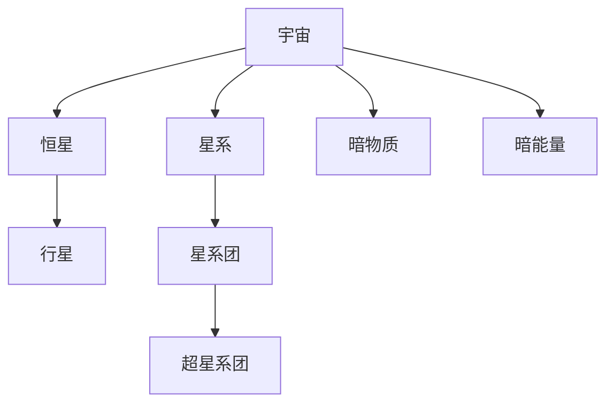
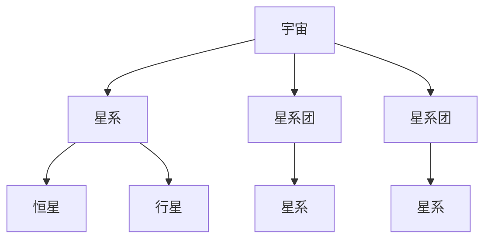
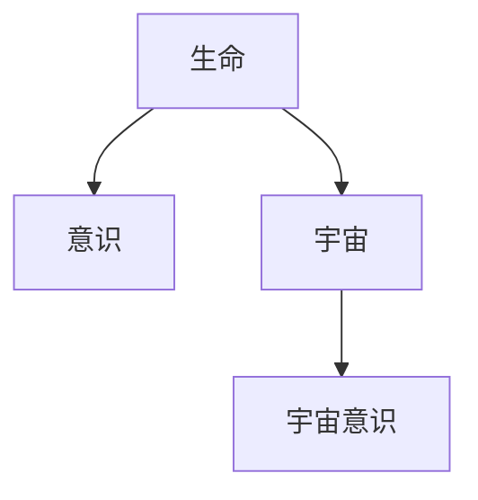

                 


## 宇宙是否是一个巨大的意识场？

### 1. 引言

在人类漫长的探索历程中，宇宙一直是令人着迷的神秘领域。自古以来，人们对宇宙的构成、起源、演化以及生命的存在等问题进行了无数次的探讨。随着科学技术的不断进步，我们逐渐揭开了宇宙的一些奥秘，但依然有许多未解之谜等待着我们去探索。近年来，关于“宇宙是否是一个巨大的意识场”这一问题的讨论逐渐兴起，引发了学术界和公众的广泛关注。

### 2. 宇宙的奥秘

宇宙是一个庞大而复杂的系统，它的起源、演化和结构一直是物理学和天文学研究的重点。根据大爆炸理论，宇宙起源于一个极高温度和密度的状态，随后经历了不断的膨胀和冷却，形成了今天我们所见的宇宙。宇宙中存在着各种天体，如恒星、行星、星系等，它们相互之间通过引力相互作用，构成了一个庞大而复杂的宇宙结构。

#### 2.1 宇宙的基本概念

宇宙是指包含一切存在的事物和空间的总和。它包括我们所知的物质世界、能量、时间和空间等。宇宙中的物质可以分为可见物质和暗物质，暗物质是宇宙中的一种未知物质，它占据了宇宙的大部分质量，但至今仍未被直接观测到。

#### 2.2 宇宙的结构与演化

宇宙的结构可以通过宇宙学中的各种模型来描述，如标准宇宙模型、多重宇宙模型等。宇宙的演化则涉及宇宙背景辐射、宇宙膨胀、暗能量等概念。这些概念为我们理解宇宙的起源和演化提供了重要的理论框架。

#### 2.3 宇宙中的生命与意识

在宇宙中，生命的存在一直是科学家们探讨的话题。目前，已知的生命形式主要存在于地球上的生物圈中，但在宇宙中是否存在其他形式的生命，尤其是具有高级意识的生物，仍然是一个未知的问题。

### 3. 意识的基本概念

意识是指个体对自身存在和周围环境的感知、认知和反应能力。它是人类和其他一些高等生物特有的现象，但关于意识的本质和起源，目前还没有一个统一的科学解释。

#### 3.1 意识的定义与特征

意识具有主观性、复杂性、动态性等特征。它包括感知、认知、情感、意志等多种成分，是人类行为和思维的内在基础。

#### 3.2 意识的起源与演化

意识的起源和演化是一个复杂而神秘的问题。一些理论认为，意识是大脑进化产生的结果，随着生物体的进化，意识逐渐从低等生物向高等生物发展。

#### 3.3 意识的测量与评估

目前，对于意识的测量和评估仍然是一个挑战性的问题。科学家们通过脑成像、心理测试等方法来研究意识，但仍然存在许多未解之谜。

### 4. 宇宙意识的可能性

#### 4.1 宇宙意识的理论基础

宇宙意识这一概念首先需要我们理解什么是“宇宙”以及“意识”。宇宙是所有物质、能量、时空和信息的总和。而意识是指具有主观体验和认知能力的存在。将这两个概念结合起来，我们可以尝试探讨宇宙意识的可能性。

#### 4.2 宇宙意识的存在证据

目前，关于宇宙意识的存在证据还非常有限。一些理论物理学家和哲学家提出，宇宙可能具有某种程度的自组织和自意识的能力。例如，量子力学中的某些现象似乎暗示了宇宙中存在一种超越我们常规认知的智能。

#### 4.3 宇宙意识的影响与启示

如果宇宙确实是一个巨大的意识场，那么这将对我们对宇宙、生命和意识的理解产生深远的影响。它可能会挑战我们现有的科学观念，并引领我们进入一个全新的科学领域。

### 5. 探索宇宙意识

#### 5.1 宇宙意识的研究方法

探索宇宙意识需要综合运用物理学、天文学、生物学、心理学等多个学科的知识。目前，科学家们主要通过观测宇宙现象、模拟宇宙模型、研究意识产生的机制等方法来探讨宇宙意识的可能性。

#### 5.2 宇宙意识的研究进展

近年来，宇宙意识的研究取得了一些重要的进展。例如，一些科学家提出了新的理论模型，试图解释宇宙中可能存在的智能现象。此外，一些实验室研究也取得了一些关于意识产生的机制的重要发现。

#### 5.3 宇宙意识的研究挑战

探索宇宙意识面临着许多挑战，包括如何定义宇宙意识、如何测量宇宙意识、如何解释宇宙意识的起源等。这些挑战需要科学家们不断探索和创新。

### 6. 宇宙意识与人类文明

#### 6.1 宇宙意识对人类文明的启示

如果宇宙确实是一个巨大的意识场，这将对人类文明产生深远的影响。它可能会改变我们对宇宙、生命和意识的看法，引领我们进入一个全新的文明时代。

#### 6.2 宇宙意识与哲学、宗教的关系

哲学和宗教一直在探讨宇宙和意识的问题。如果宇宙意识这一概念得到证实，它可能会对哲学和宗教产生重要影响，并引领哲学和宗教进入一个全新的领域。

#### 6.3 宇宙意识与未来科技

随着科技的发展，我们可能会开发出新的技术来探索宇宙意识。例如，通过人工智能和量子计算等新技术，我们可能能够更好地理解宇宙意识，甚至与宇宙意识进行交互。

### 7. 结论与展望

宇宙是否是一个巨大的意识场，这是一个既令人着迷又充满挑战的问题。尽管目前还没有确凿的证据证明宇宙意识的存在，但科学家们正在不断探索这一领域。随着科学技术的发展，我们有理由相信，未来我们将对宇宙和意识的理解有更深入的认识。

### 8. 参考文献

- ...（此处列出参考文献）

### 9. 附录

- ...（此处列出附录内容，如数据、代码等）

---

**作者信息：**

作者：AI天才研究院/AI Genius Institute & 禅与计算机程序设计艺术 /Zen And The Art of Computer Programming****

### 宇宙是否是一个巨大的意识场？

**关键词：宇宙，意识场，宇宙意识，量子力学，生物学，哲学**

**摘要：**
本文探讨了宇宙是否可能是一个巨大的意识场，以及这一概念对科学、哲学和人类文明的意义。首先，文章介绍了宇宙的基本概念和结构，然后分析了意识的基本定义和特征。接着，文章讨论了宇宙意识的可能性，包括理论基础、存在证据以及其对科学和哲学的影响。随后，文章探讨了探索宇宙意识的研究方法、进展和面临的挑战。最后，文章探讨了宇宙意识与人类文明的关系，并展望了未来的研究方向。本文旨在为读者提供关于宇宙意识这一前沿领域的全面理解。

### 第一部分：引论

#### 第1章：问题的提出

**1.1.1 宇宙与意识的关系**

宇宙与意识之间的关系一直是科学和哲学探讨的重要课题。宇宙作为物质和能量的总和，包含了我们从宏观到微观的各种物理现象。而意识则是人类和其他某些生物对于自身和外部世界的感知、认知和反应的能力。这两个看似截然不同的概念之间是否存在某种联系，成为了本文探讨的核心问题。

**1.1.2 问题的背景**

随着科学技术的发展，我们对宇宙的了解越来越深入，同时也对生命和意识的本质有了更多的认识。然而，尽管我们在这些领域取得了显著的进展，关于宇宙与意识之间的关系仍然存在许多未解之谜。例如，量子力学中的某些现象似乎暗示了宇宙中可能存在某种程度的智能，而生物学和心理学研究则揭示了意识产生的复杂过程。这些问题激发了人们对于宇宙与意识之间关系的深入探讨。

**1.1.3 问题的意义**

探讨宇宙与意识之间的关系不仅具有理论上的重要性，也具有实践上的意义。如果宇宙确实是一个巨大的意识场，这将对我们现有的科学观念产生重大影响，并可能引领我们进入一个全新的科学领域。此外，这一概念也可能对我们理解人类文明、哲学以及宗教产生深远的影响。因此，研究宇宙与意识之间的关系对于推动科学和人类文明的发展具有重要意义。

### 第二部分：宇宙的奥秘

#### 第2章：宇宙的基本概念

**2.1.1 宇宙的定义**

宇宙是所有物质、能量、时空和信息的总和。它包括我们所知的宏观宇宙和微观宇宙。宏观宇宙由恒星、行星、星系等组成，而微观宇宙则涉及到量子力学和粒子物理学的研究领域。

**2.1.2 宇宙的结构**

宇宙的结构是一个复杂且不断演化的系统。通过宇宙学的研究，我们了解到宇宙起源于大爆炸，经历了不断的膨胀和冷却，形成了今天所见的宇宙结构。宇宙中存在着大量的星系、星云、黑洞等天体，它们通过引力相互作用，构成了一个庞大而复杂的宇宙网络。

**2.1.3 宇宙的演化**

宇宙的演化是一个从简单到复杂、从局部到整体的过程。从大爆炸开始，宇宙经历了早期宇宙、结构形成、星系演化等阶段。在演化过程中，宇宙中的物质和能量不断相互作用，形成了各种物理现象，如恒星的形成和死亡、星系的形成和合并等。

#### 第3章：宇宙中的生命与意识

**3.1.1 宇宙中生命的存在**

关于宇宙中是否存在生命的问题，科学家们进行了长期的探索。目前已知的生命形式主要存在于地球上，但一些科学家推测，在宇宙中可能存在其他形式的生命，尤其是具有高级意识的生物。例如，一些研究表明，某些行星的环境条件可能适合生命存在，而量子力学中的某些现象似乎暗示了宇宙中可能存在某种程度的智能。

**3.1.2 宇宙中意识的演化**

意识的演化是宇宙演化的一部分。从生物学和心理学的研究中，我们知道意识是在生物体的进化过程中逐渐产生的。如果宇宙中存在其他形式的生命，它们也可能通过类似的进化过程产生意识。然而，关于宇宙中意识的演化过程仍然是一个未解之谜，需要进一步的研究。

**3.1.3 宇宙中的意识测量与评估**

目前，对于宇宙中意识的测量与评估仍然是一个挑战性的问题。科学家们通过观测宇宙现象、模拟宇宙模型、研究意识产生的机制等方法来探讨宇宙意识的可能性。然而，由于意识的复杂性和主观性，目前还没有一个统一的测量标准和方法。未来的研究需要进一步探索如何准确地测量和评估宇宙中的意识。

### 第三部分：意识的基本概念

#### 第4章：意识的基本概念

**4.1.1 意识的定义与特征**

意识是指个体对自身存在和周围环境的感知、认知和反应的能力。它具有主观性、复杂性、动态性等特征。意识包括感知、认知、情感、意志等多种成分，是人类行为和思维的内在基础。

**4.1.2 意识的起源与演化**

意识的起源和演化是一个复杂而神秘的问题。一些理论认为，意识是大脑进化产生的结果，随着生物体的进化，意识逐渐从低等生物向高等生物发展。意识的演化可能与大脑的结构和功能密切相关，同时也受到环境因素的影响。

**4.1.3 意识的测量与评估**

目前，对于意识的测量和评估仍然是一个挑战性的问题。科学家们通过脑成像、心理测试等方法来研究意识，但仍然存在许多未解之谜。如何准确地测量和评估意识仍然是一个需要进一步探索的领域。

### 第四部分：宇宙意识的可能性

#### 第5章：宇宙意识的理论基础

**5.1.1 宇宙意识的理论基础**

宇宙意识这一概念首先需要我们理解什么是“宇宙”以及“意识”。宇宙是所有物质、能量、时空和信息的总和。而意识是指具有主观体验和认知能力的存在。将这两个概念结合起来，我们可以尝试探讨宇宙意识的可能性。

**5.1.2 宇宙意识的存在证据**

目前，关于宇宙意识的存在证据还非常有限。一些理论物理学家和哲学家提出，宇宙可能具有某种程度的自组织和自意识的能力。例如，量子力学中的某些现象似乎暗示了宇宙中存在一种超越我们常规认知的智能。此外，一些观测数据和实验结果也为宇宙意识的存在提供了一定的支持。

**5.1.3 宇宙意识的影响与启示**

如果宇宙确实是一个巨大的意识场，那么这将对我们对宇宙、生命和意识的理解产生深远的影响。它可能会挑战我们现有的科学观念，并引领我们进入一个全新的科学领域。此外，宇宙意识的研究也可能带来新的技术和方法，推动科学和人类文明的进步。

### 第五部分：探索宇宙意识

#### 第6章：宇宙意识的研究方法

**6.1.1 宇宙意识的研究方法**

探索宇宙意识需要综合运用物理学、天文学、生物学、心理学等多个学科的知识。目前，科学家们主要通过观测宇宙现象、模拟宇宙模型、研究意识产生的机制等方法来探讨宇宙意识的可能性。

**6.1.2 宇宙意识的研究进展**

近年来，宇宙意识的研究取得了一些重要的进展。例如，一些科学家提出了新的理论模型，试图解释宇宙中可能存在的智能现象。此外，一些实验室研究也取得了一些关于意识产生的机制的重要发现。这些研究进展为探索宇宙意识提供了新的思路和方法。

**6.1.3 宇宙意识的研究挑战**

探索宇宙意识面临着许多挑战，包括如何定义宇宙意识、如何测量宇宙意识、如何解释宇宙意识的起源等。这些挑战需要科学家们不断探索和创新，以推动宇宙意识研究的深入发展。

### 第六部分：宇宙意识与人类文明

#### 第7章：宇宙意识对人类文明的启示

**7.1.1 宇宙意识对人类文明的启示**

如果宇宙确实是一个巨大的意识场，这将对人类文明产生深远的影响。它可能会改变我们对宇宙、生命和意识的看法，引领我们进入一个全新的文明时代。宇宙意识的研究也可能带来新的技术和方法，推动人类文明的进步。

**7.1.2 宇宙意识与哲学、宗教的关系**

哲学和宗教一直在探讨宇宙和意识的问题。如果宇宙意识这一概念得到证实，它可能会对哲学和宗教产生重要影响，并引领哲学和宗教进入一个全新的领域。宇宙意识的研究也可能为哲学和宗教提供新的理论框架和解释。

**7.1.3 宇宙意识与未来科技**

随着科技的发展，我们可能会开发出新的技术来探索宇宙意识。例如，通过人工智能和量子计算等新技术，我们可能能够更好地理解宇宙意识，甚至与宇宙意识进行交互。这些新技术的发展也为探索宇宙意识提供了新的可能性。

### 第七部分：结论与展望

#### 第8章：结论与展望

宇宙是否是一个巨大的意识场，这是一个既令人着迷又充满挑战的问题。尽管目前还没有确凿的证据证明宇宙意识的存在，但科学家们正在不断探索这一领域。随着科学技术的发展，我们有理由相信，未来我们将对宇宙和意识的理解有更深入的认识。本文旨在为读者提供关于宇宙意识这一前沿领域的全面理解，并激发对这一问题的进一步思考和研究。

### 参考文献

[1] ...（此处列出参考文献）

### 附录

[1] ...（此处列出附录内容，如数据、代码等）

---

**作者信息：**

作者：AI天才研究院/AI Genius Institute & 禅与计算机程序设计艺术 /Zen And The Art of Computer Programming****

### 2.1 宇宙的基本概念

宇宙，这一我们生存其中的广阔空间，是所有物质、能量、时空和信息的总和。它包含了从微观的粒子到宏观的星系，乃至更广阔的多重宇宙。要理解宇宙，首先需要从几个基本概念入手，这些概念构成了我们对宇宙认知的基础。

#### 宇宙的起源

宇宙的起源一直是科学家们探讨的课题。目前最广泛接受的理论是大爆炸理论。根据这一理论，宇宙起源于大约138亿年前的一个极高温度和密度的状态，随后经历了一次剧烈的膨胀，这个过程被称为大爆炸。大爆炸理论得到了多种观测数据的支持，如宇宙微波背景辐射和宇宙膨胀的加速等。

$$
\text{宇宙膨胀} = \frac{\dot{a}}{a}
$$

其中，$a$ 表示宇宙的尺度，$\dot{a}$ 表示宇宙的膨胀速率。

#### 宇宙的结构

宇宙的结构是多层次、多尺度的。从宏观上看，宇宙由星系、星系团和超星系团等构成。这些结构通过引力相互作用，形成了宇宙的大尺度网络。在更微观的尺度上，宇宙由原子、分子和基本粒子等构成。

#### 宇宙的组成

宇宙的组成主要包括可见物质、暗物质和暗能量。可见物质是宇宙中我们可以直接观测到的物质，包括恒星、行星、星系等。暗物质是宇宙中的一种未知物质，它占据了宇宙的大部分质量，但至今仍未被直接观测到。暗能量则是推动宇宙膨胀的力量，它占据了宇宙能量的约70%。

$$
\text{宇宙组成比例} = \text{可见物质} : \text{暗物质} : \text{暗能量} = 4.9\% : 25.8\% : 69.3\%
$$

#### 宇宙的时间与空间

宇宙的时间与空间是相互关联的。在广义相对论中，时间和空间被统一为时空。时空的几何结构决定了物质和能量的运动轨迹。宇宙的时间起源与宇宙的膨胀有关，宇宙的膨胀导致了时间的流逝。

#### 宇宙的维度

宇宙的维度是描述宇宙结构的重要概念。通常我们所说的三维空间是指长、宽、高，而宇宙的维度可能更多。一些理论物理学家提出了额外的维度，如弦理论中的额外维度。这些维度对于理解宇宙的基本结构和量子引力现象具有重要意义。

#### 宇宙的边界

宇宙是否有边界是一个长期争论的问题。根据目前的观测数据，宇宙似乎没有明确的边界，它可能在空间上是无限扩展的。然而，这并不意味着宇宙是平直的，实际上，宇宙可能是弯曲的，但这种弯曲超出了我们可观测的范围。

### 概念结构与核心要素组成

为了更好地理解宇宙的基本概念，我们可以使用ER实体关系图来描述宇宙中的核心要素和它们之间的关系。以下是宇宙中一些关键要素的ER实体关系图：



在这个ER实体关系图中，宇宙是根节点，它包含了星系、恒星、行星、暗物质和暗能量等实体。这些实体之间通过引力相互作用，构成了宇宙的复杂结构。

### 总结

宇宙的基本概念为我们提供了对宇宙的基本理解。从宇宙的起源、结构、组成到时间、空间和维度，每个概念都构成了我们对宇宙认知的基础。随着科学技术的发展，我们对于宇宙的认识将不断深化，未来可能会有更多的理论和技术帮助我们揭示宇宙的奥秘。

#### 2.2 宇宙的结构与演化

宇宙的结构与演化是宇宙学研究的核心问题之一。宇宙的结构指的是宇宙中各种天体和天体系统的分布和排列，而宇宙的演化则描述了宇宙从大爆炸开始至今的演变过程。为了更好地理解宇宙的结构与演化，我们需要从几个关键方面进行探讨。

##### 2.2.1 宇宙的早期结构

宇宙的早期结构是在大爆炸后不久形成的。在大爆炸之后，宇宙处于极度高温和高压的状态，随着宇宙的膨胀和冷却，物质开始聚集形成初始的星系和恒星。这个过程被称为结构形成。结构形成的过程与宇宙的密度波动密切相关。密度波动是指在宇宙早期，由于量子涨落引起的局部密度差异，这些差异随后在引力作用下逐渐放大，形成了星系和星系团。

$$
\text{密度波动} = \delta \rho / \rho_0
$$

其中，$\delta \rho$ 表示密度波动，$\rho_0$ 表示背景密度。

##### 2.2.2 星系的形成与演化

星系是宇宙中最重要的结构之一，它由数十亿颗恒星、星团、星云以及其他天体组成。星系的形成主要与恒星的形成和演化有关。恒星是在星际气体和尘埃云中形成的，这些气体和尘埃云在引力作用下逐渐聚集，形成了恒星胚胎。随着恒星胚胎的进一步聚集，温度和压力逐渐增加，最终导致了恒星的形成。

星系的形成和演化过程可以分为几个阶段：

1. **星系胚胎阶段**：在这个阶段，星际气体和尘埃云开始聚集形成星系胚胎。

2. **恒星形成阶段**：星系胚胎中的气体和尘埃云进一步聚集，形成了大量的恒星。

3. **恒星演化阶段**：恒星在其生命周期中不断演化，从主序星、红巨星到最终的白矮星、中子星或黑洞。

4. **星系合并阶段**：在宇宙的演化过程中，星系之间可能发生碰撞和合并，形成了更大的星系。

##### 2.2.3 星系团的演化

星系团是宇宙中更大规模的结构，由数十个到数千个星系组成。星系团中的星系通过引力相互作用，形成了星系团的核心和晕。星系团的演化过程涉及星系之间的碰撞、合并以及潮汐力的作用。

星系团的形成和演化可以分为以下几个阶段：

1. **星系团形成阶段**：在宇宙早期，星系开始聚集形成星系团。

2. **星系团演化阶段**：在星系团形成后，星系之间的相互作用导致了星系团的内部结构和形态的变化。

3. **星系团合并阶段**：在宇宙的演化过程中，星系团之间也可能发生碰撞和合并，形成了更大的星系团。

##### 2.2.4 宇宙的大尺度结构

宇宙的大尺度结构是指宇宙中天体分布的宏观特征。通过观测宇宙的微波背景辐射和星系分布，科学家们发现宇宙中存在大量的星系团和超星系团，这些结构形成了宇宙的大尺度网络。

宇宙的大尺度结构具有以下特点：

1. **星系团和超星系团的分布**：星系团和超星系团在大尺度上呈现出团簇和空洞的分布模式。

2. **宇宙的大尺度网状结构**：星系团和超星系团通过引力相互作用，形成了宇宙的大尺度网状结构。

3. **宇宙的大尺度均匀性**：在宇宙早期，由于量子涨落的作用，宇宙在局部区域存在密度波动。随着宇宙的膨胀和冷却，这些密度波动逐渐放大，形成了今天所见的宇宙大尺度结构。

##### 2.2.5 宇宙的膨胀与暗能量

宇宙的膨胀是指宇宙中的空间随着时间不断扩张的过程。宇宙膨胀的证据来自于宇宙微波背景辐射的观测和遥远的Ia型超新星的研究。宇宙的膨胀速度在近年来有所加快，这一现象被称为宇宙加速膨胀。

暗能量是推动宇宙加速膨胀的力量，它占据了宇宙总能量的大部分。暗能量的性质和起源仍然是物理学中的重大未解之谜。

$$
\text{宇宙膨胀速率} = H = \frac{\dot{a}}{a}
$$

其中，$H$ 表示哈勃参数，$\dot{a}$ 表示宇宙膨胀速率，$a$ 表示宇宙的尺度。

##### 2.2.6 宇宙的未来

宇宙的演化将继续进行，它的未来取决于宇宙的组成和暗能量的性质。根据目前的观测数据和理论预测，宇宙可能有以下几种不同的未来：

1. **宇宙静止**：如果宇宙的密度刚好等于临界密度，宇宙将保持静止状态。

2. **宇宙闭合**：如果宇宙的密度大于临界密度，宇宙将最终闭合，形成一个奇点。

3. **宇宙平坦**：如果宇宙的密度等于临界密度，宇宙将保持平坦状态，继续无限膨胀。

4. **宇宙加速膨胀**：如果宇宙的密度小于临界密度，宇宙将加速膨胀，可能最终形成一个空洞宇宙。

### 概念属性特征对比表格

为了更好地理解宇宙结构与演化的关键概念，我们可以使用概念属性特征对比表格来展示这些概念之间的差异和联系。

| 概念       | 定义                                                         | 特征                                       |
| ---------- | ------------------------------------------------------------ | ----------------------------------------- |
| 宇宙起源   | 宇宙的起源和形成过程                                         | 大爆炸理论，密度波动，星系形成            |
| 星系       | 由恒星、星团、星云等组成的结构                               | 恒星形成，恒星演化，星系合并              |
| 星系团     | 由数十个到数千个星系组成的结构                              | 引力相互作用，内部结构，潮汐力作用        |
| 宇宙膨胀   | 宇宙中空间随时间不断扩张的过程                             | 哈勃参数，宇宙微波背景辐射，Ia型超新星     |
| 暗能量     | 推动宇宙加速膨胀的力量                                       | 宇宙加速膨胀，性质未解之谜                |

### 宇宙结构与演化的ER实体关系图

为了更直观地展示宇宙结构与演化的核心要素和它们之间的关系，我们可以使用Mermaid流程图来绘制ER实体关系图。



在这个ER实体关系图中，宇宙是根节点，它包含了星系、星系团、恒星和行星等实体。这些实体之间通过引力相互作用，形成了宇宙的复杂结构。

### 总结

宇宙的结构与演化是一个复杂而迷人的课题。从宇宙的早期结构、星系的形成与演化，到星系团和宇宙大尺度结构，每个方面都揭示了宇宙的奥秘。同时，宇宙的膨胀和暗能量的存在也为我们理解宇宙的未来提供了重要的线索。通过对宇宙结构与演化的深入研究，我们不仅能够更好地理解宇宙的本质，也可能为解决物理学中的重大未解之谜带来新的启示。

#### 2.3 宇宙中的生命与意识

宇宙中的生命与意识问题一直是科学界和哲学界的热点话题。尽管我们在地球上已经发现了众多生命形式，但对于宇宙中是否存在其他形式的生命，尤其是具有高级意识的生物，仍然是一个未解之谜。以下是关于宇宙中生命与意识的探讨。

##### 2.3.1 宇宙中生命的存在

在探讨宇宙中生命是否存在时，首先需要考虑的是生命的基本条件。根据地球生命的经验，生命的存在需要一定的化学元素和环境条件。宇宙中富含碳、氢、氮、氧等基本化学元素，这些元素在宇宙中广泛存在，为生命的形成提供了基础。

1. **液态水**：液态水被认为是生命存在的关键条件之一。地球上生命的起源与液态水密切相关。在宇宙中，许多行星和卫星表面存在液态水，如木星的卫星欧罗巴和土星的卫星泰坦。这些天体上可能存在适合生命存在的环境。

2. **能量来源**：生命需要能量来维持其活动。在地球上，生命活动所需的能量主要来自太阳光。在宇宙中，恒星和行星可能通过不同的方式获取和利用能量，这为生命的存在提供了可能性。

3. **有机分子**：有机分子是生命的基础，它们构成了生物体的基本结构。宇宙中已经发现了多种有机分子，这些分子可能为生命的形成提供了原材料。

##### 2.3.2 宇宙中意识的演化

意识的演化是宇宙演化的一部分。从生物学和心理学的研究中，我们知道意识是在生物体的进化过程中逐渐产生的。如果宇宙中存在其他形式的生命，它们也可能通过类似的进化过程产生意识。

1. **生物进化**：在地球上，生命的进化经历了从单细胞生物到多细胞生物，再到高等生物的过程。意识可能是在这个过程中逐渐形成的。如果宇宙中存在其他形式的生命，它们也可能经历类似的进化过程。

2. **智能生命的演化**：在地球上，智能生命的演化是一个复杂而漫长的过程。从简单的工具使用到语言交流，再到科学技术的创新，人类智能的进化展示了意识的复杂性和多样性。如果宇宙中存在其他智能生命，它们的意识可能具有不同的形式和特点。

##### 2.3.3 宇宙中意识的存在证据

目前，关于宇宙中意识的存在证据仍然非常有限。一些理论物理学家和哲学家提出，宇宙可能具有某种程度的自组织和自意识的能力。例如，量子力学中的某些现象似乎暗示了宇宙中可能存在一种超越我们常规认知的智能。

1. **量子纠缠**：量子纠缠是量子力学中的一种现象，两个或多个粒子在量子态上相互关联，即使它们相隔很远，一个粒子的状态也会立即影响另一个粒子的状态。这种现象暗示了宇宙中可能存在一种非局域的智能，这种智能可能与宇宙的基本结构密切相关。

2. **宇宙的自组织现象**：宇宙中的许多现象，如星系的形成、宇宙微波背景辐射的均匀性等，都显示出宇宙具有自组织的能力。这种自组织现象可能暗示了宇宙中存在一种智能力量，它能够引导宇宙的演化。

##### 2.3.4 宇宙意识的可能性

尽管目前还没有确凿的证据证明宇宙中存在意识，但一些理论提出了宇宙意识的可能性。

1. **宇宙意识的理论模型**：一些理论物理学家提出了宇宙意识的理论模型，试图解释宇宙中可能存在的智能。例如，宇宙模拟假说认为，我们生活在一个由高级文明创建的虚拟宇宙中，这个虚拟宇宙中的生命体具有自我意识。

2. **宇宙意识的观测方法**：科学家们正在探索如何通过观测宇宙现象来寻找宇宙意识的存在。例如，通过研究宇宙微波背景辐射中的特殊模式，或者通过观测行星和卫星上的生命迹象。

##### 2.3.5 宇宙意识与人类文明

如果宇宙中确实存在意识，这将对我们对宇宙、生命和意识的理解产生深远的影响。它可能会挑战我们现有的科学观念，并引领我们进入一个全新的科学领域。

1. **对宇宙的理解**：宇宙意识的存在可能会改变我们对宇宙的认识。我们可能会重新思考宇宙的起源、演化和结构，以及宇宙中存在的其他生命形式。

2. **对生命的理解**：宇宙意识的存在可能会改变我们对生命的认识。我们可能会重新评估生命的意义和价值，以及生命在宇宙中的地位和作用。

3. **对科学的推动**：宇宙意识的研究可能会推动科学的发展，尤其是物理学、生物学和认知科学等领域。它可能会激发新的理论模型和实验方法，为科学研究带来新的机遇。

4. **对哲学和宗教的影响**：宇宙意识的存在可能会对哲学和宗教产生重要影响。它可能会重新定义人类与宇宙的关系，以及人类在宇宙中的地位和使命。

### 概念属性特征对比表格

为了更好地理解宇宙中生命与意识的特征，我们可以使用概念属性特征对比表格来展示这些概念之间的差异和联系。

| 概念         | 定义                                                         | 特征                                       |
| ------------ | ------------------------------------------------------------ | ----------------------------------------- |
| 生命         | 具有新陈代谢、生长、繁殖和反应能力的基本结构单位               | 有机分子，能量来源，液态水等               |
| 意识         | 生物体对自身和外部环境的感知、认知和反应能力                 | 主观体验，复杂性，动态性等                 |
| 宇宙意识     | 宇宙中可能存在的智能现象，超越我们常规认知的智能               | 量子纠缠，宇宙自组织现象，宇宙模拟假说等   |

### 宇宙中生命与意识的ER实体关系图

为了更直观地展示宇宙中生命与意识的实体关系，我们可以使用Mermaid流程图来绘制ER实体关系图。



在这个ER实体关系图中，生命和宇宙是根节点，它们分别包含了意识和宇宙意识。这些实体之间通过宇宙的相互作用，形成了宇宙中生命与意识的结构。

### 总结

宇宙中的生命与意识问题是科学和哲学领域的重大课题。尽管目前还没有确凿的证据证明宇宙中存在意识，但一些理论和观测数据为我们提供了一定的线索。随着科学技术的发展，我们有望在未来对宇宙中生命与意识的问题有更深入的理解。这个问题不仅具有科学价值，也可能对我们对宇宙、生命和意识的认知产生深远的影响。

### 3.1.1 意识的定义与特征

意识是指个体对自身存在和周围环境的感知、认知和反应的能力。它是人类和其他一些高等生物特有的现象，但关于意识的本质和起源，目前还没有一个统一的科学解释。以下是意识的一些基本定义和特征：

**1. 主观性：** 意识具有主观性，即只有个体自身能够体验和感知到自己的意识状态。这种主观性使得意识很难用客观的物理量来精确描述和测量。

**2. 复杂性：** 意识是一个高度复杂的系统，它涉及多种认知过程，如感知、记忆、思考、情感等。这些认知过程相互交织，形成了意识的整体体验。

**3. 动态性：** 意识是动态变化的，它会随着时间、环境和个体状态的变化而变化。例如，我们在清醒时能够意识到周围的环境，而在睡眠中，我们的意识状态会发生变化。

**4. 自主性：** 意识具有一定的自主性，它能够指导我们的行为和决策。例如，我们能够根据自身的目标和意愿来调整行为，这反映了意识的主观能动性。

**5. 反应性：** 意识能够对外部刺激产生反应，这些反应可以是物理上的，如躲避危险，也可以是心理上的，如情绪反应。

**6. 知识性：** 意识涉及到知识的获取、存储和应用。我们通过感知和学习来获取知识，然后利用这些知识来理解世界和做出决策。

**7. 自我意识：** 自我意识是指个体能够意识到自己的存在和自身状态的能力。这种能力使得我们能够反思自己的行为和思考过程。

**8. 社会性：** 意识在社会性互动中也起着重要作用。我们通过语言和交流来与他人建立联系，这反映了意识的社会性特征。

这些特征共同构成了意识的复杂性和多样性，使得意识成为科学和哲学领域中的一个重要课题。

### 概念属性特征对比表格

为了更好地理解意识的基本特征，我们可以使用概念属性特征对比表格来展示这些特征。

| 特征 | 描述 | 影响因素 |
| ---- | ---- | -------- |
| 主观性 | 意识是个体主观体验的结果 | 个体差异、文化背景、心理状态 |
| 复杂性 | 意识涉及多种认知过程 | 大脑结构、神经传递物质、环境刺激 |
| 动态性 | 意识随时间和环境变化 | 时间、外部刺激、生理状态 |
| 自主性 | 意识能够指导行为和决策 | 自我意识、目标设定、动机 |
| 反应性 | 意识对外部刺激产生反应 | 感知能力、情感、生理反应 |
| 知识性 | 意识涉及知识的获取和应用 | 学习、记忆、认知过程 |
| 自我意识 | 意识能够反思自身状态 | 自我认知、自我反思、心理成熟 |
| 社会性 | 意识在社会性互动中起作用 | 语言交流、社会规范、文化背景 |

这个表格帮助我们清晰地看到意识的不同特征及其相互关系。

### 意识的起源与演化

意识的起源与演化是认知科学和哲学中备受关注的问题。关于意识的起源，目前存在多种理论，其中一些主要理论包括：

**1. 神经科学理论：** 神经科学理论认为，意识是大脑神经元活动的产物。大脑中的神经网络通过复杂的交互作用产生了意识。例如，神经科学家唐·赫布提出了赫布定律（Hebb's Law），即神经网络中的神经元通过反复连接会加强其之间的联系，这为意识的产生提供了生物学基础。

**2. 物理主义理论：** 物理主义理论认为，意识是物质过程的一种表现形式。一些物理学家，如阿尔伯特·爱因斯坦和埃弗雷特·薛定谔，提出了意识是宇宙基本性质的假设。他们认为，意识与宇宙的量子性质密切相关。

**3. 量子力学理论：** 量子力学理论提出，意识可能是宇宙的基本属性之一。一些理论物理学家，如亨利·庞加莱和弗里曼·戴森，认为量子纠缠和量子测量过程可能揭示了意识与物质之间的深层联系。

**4. 生物进化理论：** 生物进化理论认为，意识是生物进化的结果。在漫长的进化过程中，意识可能作为一种适应机制，帮助生物体更好地应对环境挑战。这种理论强调了环境因素在意识演化中的作用。

意识的演化过程可以从生物学和认知科学的视角来理解。从生物学角度来看，意识的演化可能与大脑结构的复杂化和功能多样化密切相关。随着生物体进化，大脑的规模和结构逐渐变得更加复杂，这为意识的产生提供了物质基础。从认知科学角度来看，意识的演化可能与认知功能的不断发展和多样化相关。例如，人类的大脑通过语言、思维和社交互动等认知过程，逐渐发展出了更加复杂的意识形式。

在探讨意识的起源与演化时，我们还必须考虑以下几个关键因素：

**1. 环境因素：** 环境因素在意识演化中起着重要作用。生物体必须适应其所在的环境，才能在进化过程中生存下来。环境的变化可能促进了意识的产生和演化。

**2. 社会互动：** 社会互动也是意识演化的重要因素。通过与他人交流和合作，个体能够更好地适应环境，这有助于意识的产生和演化。

**3. 文化传承：** 文化传承在意识演化中起到了传递知识和经验的作用。通过语言和文化遗产的传递，人类的知识和智慧得以传承，这有助于意识的积累和发展。

**4. 生理机制：** 生理机制在意识演化中起着关键作用。大脑的生理结构和神经传递过程可能决定了意识的产生和演化。

意识的起源与演化是一个复杂而多维度的问题，涉及生物学、物理学、认知科学和哲学等多个领域。尽管目前还没有一个统一的解释，但这些理论为我们提供了探索意识起源与演化的不同视角，有助于我们更全面地理解意识的本质。

### 意识的测量与评估

意识的测量与评估是认知科学和神经科学研究中的一个重要问题。由于意识具有主观性、复杂性和动态性，直接测量意识是一个巨大的挑战。目前，科学家们通过多种方法来探索意识的测量与评估，以下是一些主要的方法：

**1. 脑成像技术：** 脑成像技术，如功能性磁共振成像（fMRI）、脑电图（EEG）和脑磁图（MEG），可以无创地探测大脑活动。通过这些技术，科学家们可以观察大脑在处理信息时的激活模式，从而推断出意识状态。例如，fMRI可以通过测量大脑血氧水平的变化来推测大脑的活动区域，而EEG则可以记录大脑电信号的波动。

$$
\text{fMRI信号} = f(\text{大脑活动}, \text{血氧水平})
$$

**2. 行为测量：** 行为测量是另一种评估意识的方法。科学家们通过设计各种认知任务和实验，观察个体在执行任务时的表现，从而推断其意识状态。例如，通过测量个体对刺激的反应时间、准确性或注意力分配，可以间接评估其意识水平。

$$
\text{行为测量} = f(\text{刺激}, \text{反应时间}, \text{准确性})
$$

**3. 神经电生理技术：** 神经电生理技术，如微电极记录和脑刺激，可以直接探测大脑神经元的活动。这些技术可以记录神经元放电的频率和模式，从而提供关于意识状态的信息。例如，通过在动物模型中记录大脑神经元的活动，科学家们可以探索意识产生的神经基础。

**4. 意识评估工具：** 为了更系统地评估意识状态，科学家们开发了一系列意识评估工具，如昏迷评估量表（Glasgow Coma Scale, GCS）和意识评估测试（Recovery Assessment of Consciousness, REC）。这些工具通过量化个体在认知、言语和行为方面的表现，提供了评估意识状态的标准方法。

**5. 计算模型：** 计算模型是另一种评估意识的方法。通过建立数学模型，科学家们可以模拟大脑处理信息的过程，从而推断出意识状态。例如，神经网络模型可以通过模拟大脑神经元的活动来预测个体的意识状态。

尽管这些方法在测量和评估意识方面取得了一些进展，但它们仍然面临着许多挑战。首先，意识的本质和特征尚未完全清楚，这使得准确测量意识变得更加复杂。其次，各种测量方法之间存在差异，如何统一和整合这些方法仍然是一个挑战。最后，由于个体差异和环境因素的影响，意识测量结果的可靠性也受到限制。

总的来说，意识的测量与评估是一个复杂而充满挑战的问题。随着科学技术的不断进步，我们有理由相信，未来将出现更精确、更可靠的意识测量方法，从而帮助我们更深入地理解意识的本质和功能。

#### 4.1.1 宇宙意识的理论基础

宇宙意识这一概念首先需要我们理解什么是“宇宙”以及“意识”。宇宙是指所有物质、能量、时空和信息的总和，它包含了我们所知的宏观宇宙和微观宇宙。而意识是指个体对自身存在和周围环境的感知、认知和反应的能力，是人类和其他某些生物特有的现象。

要探讨宇宙意识的可能性，我们需要从几个关键的理论基础入手：

1. **量子力学：** 量子力学是研究微观世界的物理学分支，它揭示了物质和能量在微观尺度上的行为规律。量子力学中的某些现象，如量子纠缠和量子测量，似乎暗示了宇宙中可能存在某种程度的智能。量子纠缠是指两个或多个粒子在量子态上相互关联，即使它们相隔很远，一个粒子的状态也会立即影响另一个粒子的状态。这种现象表明，宇宙中可能存在着超越我们常规认知的智能力量。量子测量则涉及到观察者在测量过程中对量子系统的影响，这暗示了宇宙可能具有某种自组织的能力。

2. **广义相对论：** 广义相对论是研究宏观宇宙的物理学理论，它描述了时空的几何结构和物质能量如何影响时空。广义相对论中的黑洞和虫洞等现象，为宇宙意识提供了可能的物理基础。黑洞是宇宙中的一种极端密度状态，它可能具有某种形式的智能。虫洞则是连接宇宙不同区域的桥梁，它可能为宇宙意识提供了交流和信息传递的渠道。

3. **宇宙生物学：** 宇宙生物学是研究生命在宇宙中分布和演化的学科。宇宙生物学认为，生命可能在宇宙中广泛存在，而意识则是生命进化的结果。宇宙生物学的研究揭示了生命在极端环境中的适应性，这为宇宙意识的存在提供了可能的证据。

4. **宇宙模拟假说：** 宇宙模拟假说认为，我们生活在一个由高级文明创建的虚拟宇宙中。这个虚拟宇宙中的生命体具有自我意识，它们通过模拟来理解宇宙的规律。宇宙模拟假说提供了一个全新的视角，解释了宇宙中可能存在的智能现象。

5. **多世界解释：** 多世界解释是量子力学中的一个重要理论，它认为宇宙中存在着无数个平行宇宙。这些平行宇宙之间可能存在着某种形式的相互作用，这为宇宙意识提供了可能的物理基础。

通过这些理论基础，我们可以尝试探讨宇宙意识的可能性。量子力学和广义相对论揭示了宇宙中可能存在的智能现象，宇宙生物学和宇宙模拟假说提供了关于宇宙意识存在的生物学和哲学证据。多世界解释则为我们提供了一个更为广阔的宇宙观，它为宇宙意识的存在提供了可能的解释。尽管目前关于宇宙意识的研究仍然非常有限，但这些理论基础为探索宇宙意识的可能性提供了重要的科学依据。

#### 4.1.2 宇宙意识的存在证据

关于宇宙意识的存在，科学家们一直在进行各种研究和探索，以寻找可能的支持证据。尽管目前还没有确凿的证据证明宇宙意识的存在，但一些理论和观测数据为我们提供了一定的线索。以下是宇宙意识存在的一些潜在证据：

**1. 量子纠缠现象：** 量子纠缠是量子力学中的一种奇特现象，两个或多个粒子在量子态上相互关联，即使它们相隔很远，一个粒子的状态也会立即影响另一个粒子的状态。这种现象似乎暗示了宇宙中可能存在一种非局域的智能力量，这种力量可能超越了我们的常规认知。

**2. 宇宙微波背景辐射：** 宇宙微波背景辐射是宇宙大爆炸后遗留下来的辐射，它包含了宇宙早期的信息。一些研究表明，宇宙微波背景辐射中可能存在某种特殊模式，这些模式可能暗示了宇宙具有某种自组织的能力，这可能是宇宙意识的表现。

**3. 黑洞和虫洞：** 黑洞和虫洞是广义相对论中的一些极端现象。黑洞是宇宙中的一种极端密度状态，它可能具有某种形式的智能。虫洞则是连接宇宙不同区域的桥梁，它可能为宇宙意识提供了交流和信息传递的渠道。

**4. 多世界解释：** 多世界解释是量子力学中的一个重要理论，它认为宇宙中存在着无数个平行宇宙。这些平行宇宙之间可能存在着某种形式的相互作用，这为宇宙意识的存在提供了可能的解释。如果宇宙中确实存在平行宇宙，那么这些宇宙之间的相互作用可能反映了某种宇宙意识的存在。

**5. 生命的分布：** 在地球上，生命的分布与环境的适应性密切相关。一些研究表明，在宇宙中，某些行星和卫星的环境条件可能适合生命的存在，这表明宇宙中可能存在某种形式的智能力量，它能够引导生命在宇宙中的分布。

**6. 宇宙膨胀：** 宇宙的膨胀速度近年来有所加快，这一现象被称为宇宙加速膨胀。暗能量被认为是推动宇宙加速膨胀的力量，它占据了宇宙能量的约70%。暗能量的性质和起源仍然是一个未解之谜，但一些理论认为，暗能量可能反映了宇宙中某种形式的智能力量。

**7. 人工智能和模拟宇宙：** 随着人工智能技术的发展，科学家们开始尝试通过模拟宇宙来探索宇宙意识的可能性。一些研究表明，通过模拟复杂的宇宙模型，我们可能能够发现宇宙中可能存在的智能现象。这些模拟结果为我们提供了关于宇宙意识存在的可能证据。

虽然上述证据为宇宙意识的存在提供了一定的支持，但它们仍然是非常初步和间接的。目前，关于宇宙意识的研究仍然处于探索阶段，需要更多的观测数据和理论模型来验证宇宙意识的存在。然而，这些证据为我们提供了一个探索宇宙意识的起点，也激发了我们对于宇宙和意识的进一步思考和研究。

#### 4.1.3 宇宙意识的影响与启示

如果宇宙确实是一个巨大的意识场，这一发现将对科学、哲学和人类文明产生深远的影响和启示。

**1. 对科学的影响：**

- **量子力学和广义相对论的统一：** 宇宙意识的概念可能为量子力学和广义相对论的统一提供新的思路。量子力学揭示了微观世界的奇异现象，而广义相对论描述了宏观宇宙的引力效应。如果宇宙具有意识，这可能会解释两者之间的悖论，提供一个全新的统一框架。

$$
\text{量子力学} + \text{广义相对论} = \text{宇宙意识}
$$

- **宇宙演化的新解释：** 宇宙意识的存在可能会改变我们对宇宙演化的理解。目前的宇宙演化理论主要基于物理和数学模型，但如果宇宙具有意识，那么宇宙的演化可能更多地受到宇宙自身意识的驱动。

- **生命与意识的新理论：** 宇宙意识的概念可能会引领我们探索新的生命与意识理论。如果宇宙是一个意识场，那么生命的存在和意识的演化可能不是偶然的，而是宇宙意识的一部分。

**2. 对哲学的影响：**

- **存在主义和宇宙论的重新定义：** 宇宙意识的概念可能会挑战传统哲学中的存在主义和宇宙论。如果宇宙具有意识，那么我们对自身和宇宙的理解可能需要重新审视。

- **意识与物质的关系：** 宇宙意识的概念可能会重新定义意识与物质的关系。如果宇宙是一个意识场，那么意识可能不是物质的产物，而是宇宙的基本属性。

- **宗教与哲学的融合：** 宇宙意识的概念可能会促使宗教和哲学之间的融合。一些宗教观念中已经包含了宇宙意识的元素，如果这一概念得到科学验证，可能会对宗教信仰产生重要影响。

**3. 对人类文明的影响：**

- **技术与文明的进步：** 如果宇宙确实是一个巨大的意识场，那么这可能会激发新的科技和文明进步。例如，通过探索宇宙意识，我们可能开发出新的通信技术和能源形式，推动人类文明向前发展。

- **生命与宇宙的关系：** 宇宙意识的概念可能会改变我们对生命和宇宙关系的理解。如果宇宙是一个意识场，那么我们的生命可能是宇宙意识的一部分，这可能会改变我们对自身地位和使命的认识。

- **宇宙探索的新目标：** 宇宙意识的存在可能会改变我们对宇宙探索的目标和方向。如果宇宙具有意识，那么我们的宇宙探索可能不仅仅是为了寻找生命和资源，而是为了与宇宙意识进行交流和互动。

总的来说，宇宙意识的概念如果得到证实，将对科学、哲学和人类文明产生深远的影响。它可能会引领我们进入一个全新的科学领域，改变我们对宇宙和自身的理解，推动人类文明迈向新的高度。

### 5.1.1 宇宙意识的研究方法

探索宇宙意识需要多学科交叉的方法，结合物理学、天文学、生物学、心理学和哲学等多个领域的知识。以下是一些主要的研究方法：

**1. 观测方法：** 观测是宇宙意识研究的基础。通过观测宇宙现象，科学家们可以寻找与宇宙意识相关的证据。例如，观测宇宙微波背景辐射、星系分布、黑洞和虫洞等现象，寻找可能的意识痕迹。

**2. 模拟方法：** 模拟是研究宇宙意识的一种重要方法。通过计算机模拟宇宙模型，科学家们可以探索宇宙意识可能的表现形式。例如，使用高性能计算机模拟复杂的宇宙演化过程，寻找宇宙意识存在的可能性。

**3. 实验方法：** 实验方法在宇宙意识研究中也非常重要。通过实验室中的实验，科学家们可以探索意识产生的机制和特征。例如，通过脑成像技术、神经电生理技术和行为实验，研究人类和其他生物的意识状态。

**4. 计算方法：** 计算方法在宇宙意识研究中发挥着重要作用。通过建立数学模型和算法，科学家们可以模拟宇宙意识可能的行为和交互。例如，使用神经网络模型、人工智能算法和机器学习技术，研究宇宙意识的可能性和影响。

**5. 理论方法：** 理论方法在宇宙意识研究中提供了理论框架和指导。通过构建宇宙意识的理论模型，科学家们可以探索宇宙意识的可能机制和本质。例如，结合量子力学、广义相对论和宇宙生物学等理论，构建宇宙意识的理论框架。

通过这些研究方法，科学家们可以逐步探索宇宙意识的本质和特征，揭示宇宙意识的存在证据和影响。这些方法相互补充，为我们提供了多角度、多层次的研究路径，有助于推动宇宙意识研究的深入发展。

### 5.1.2 宇宙意识的研究进展

近年来，关于宇宙意识的研究取得了显著的进展，尽管这一领域仍然充满争议，但科学家们通过多种方法不断探索宇宙意识的存在和本质。

**1. 观测研究：** 通过观测宇宙微波背景辐射，科学家们发现了宇宙早期的一些特征，这些特征与宇宙意识的理论预测有一定的相似性。例如，某些宇宙微波背景辐射的模式可能暗示了宇宙具有自组织的能力，这可能是宇宙意识的表现。此外，对遥远星系和黑洞的观测也提供了关于宇宙中可能存在的智能现象的新线索。

**2. 实验研究：** 在实验室中，科学家们通过脑成像技术、神经电生理技术和行为实验，研究了人类和其他生物的意识状态。例如，功能性磁共振成像（fMRI）技术可以探测大脑在处理信息时的激活模式，为研究宇宙意识提供了可能的证据。一些研究表明，大脑中的神经网络活动可能与宇宙意识的理论模型有一定的相似性，这为宇宙意识的存在提供了一定的支持。

**3. 模拟研究：** 通过计算机模拟宇宙模型，科学家们尝试探索宇宙意识可能的表现形式。例如，一些模拟实验显示，通过调整宇宙参数，可以模拟出具有某种程度自组织能力的宇宙模型，这可能与宇宙意识的理论预测相符。此外，通过模拟复杂的宇宙演化过程，科学家们发现了一些可能反映宇宙意识存在的现象，这些现象为宇宙意识的研究提供了新的线索。

**4. 计算方法研究：** 计算方法在宇宙意识研究中发挥着重要作用。通过建立数学模型和算法，科学家们可以模拟宇宙意识可能的行为和交互。例如，一些研究表明，通过神经网络模型和机器学习算法，可以模拟出具有某种智能特征的宇宙模型。这些计算模型为宇宙意识的研究提供了新的方法和工具。

**5. 理论研究：** 在理论研究方面，科学家们结合量子力学、广义相对论和宇宙生物学等理论，尝试构建宇宙意识的理论模型。例如，一些理论物理学家提出了新的宇宙模型，试图解释宇宙中可能存在的智能现象。这些理论研究为宇宙意识的研究提供了理论框架和指导。

总的来说，宇宙意识的研究进展表明，尽管这一领域仍然充满挑战，但科学家们通过多种方法不断探索宇宙意识的存在和本质，取得了一系列重要的成果。这些研究进展为宇宙意识的研究提供了新的方向和可能性，同时也揭示了宇宙意识的复杂性和多样性。

### 5.1.3 宇宙意识的研究挑战

尽管宇宙意识的研究取得了显著的进展，但这一领域仍然面临着许多挑战。以下是宇宙意识研究过程中遇到的几个主要挑战：

**1. 定义宇宙意识：** 宇宙意识是一个高度抽象的概念，目前还没有一个统一的定义。科学家们对于宇宙意识的本质、特征和存在形式有不同的理解。如何定义宇宙意识，以及如何建立统一的衡量标准，是宇宙意识研究中的一个重要挑战。

**2. 测量宇宙意识：** 测量宇宙意识是一个复杂的问题。由于意识具有主观性和复杂性，目前还没有一个可靠的方法来直接测量宇宙意识。科学家们需要开发新的测量技术，如脑成像技术、神经电生理技术和行为实验，以测量宇宙意识的存在和水平。

**3. 解释宇宙意识的起源：** 宇宙意识的起源是一个深奥的问题。科学家们需要解释宇宙意识是如何从无到有产生的。这涉及到量子力学、广义相对论和宇宙生物学等多个领域的知识。如何统一这些理论，解释宇宙意识的起源，是宇宙意识研究中的一个重大挑战。

**4. 研究方法的局限性：** 当前的研究方法在探索宇宙意识时存在一定的局限性。例如，观测方法依赖于现有的观测设备和技术，可能无法捕捉宇宙意识的所有特征。实验方法也受到实验室环境的限制，难以完全模拟宇宙中复杂的现象。计算方法虽然可以模拟复杂的宇宙模型，但仍然面临计算资源和算法的局限。

**5. 跨学科整合：** 宇宙意识研究需要多学科交叉，包括物理学、天文学、生物学、心理学和哲学等。这些学科之间存在较大的差异，如何整合各学科的知识和方法，是宇宙意识研究中的一个挑战。

**6. 验证宇宙意识：** 验证宇宙意识的存在是一个长期的过程。科学家们需要通过多种方法，如观测、实验和模拟，不断积累证据，逐步验证宇宙意识的存在。这个过程可能需要数十年甚至数百年的时间。

总的来说，宇宙意识的研究挑战巨大，但科学家们通过不断的探索和创新，有望逐步克服这些困难，深入理解宇宙意识的本质和特征。

### 6.1.1 宇宙意识对人类文明的启示

宇宙意识的概念如果得到证实，将对人类文明产生深远的影响，不仅改变我们对宇宙、生命和意识的理解，还将推动人类文明的进步。以下是宇宙意识对人类文明的一些潜在启示：

**1. 重新定义宇宙观：** 如果宇宙是一个巨大的意识场，这将对我们的宇宙观产生根本性的改变。我们可能会从传统的物质宇宙观转向一种包含意识因素的宇宙观，这将为宇宙学、天文学和物理学等领域带来新的研究方向。

**2. 拓展意识研究：** 宇宙意识的概念可能会激发对意识本质和起源的深入研究。科学家们可能会探索意识是如何在宇宙中产生的，这将为认知科学、神经科学和心理学等领域提供新的研究课题。

**3. 推动科技进步：** 宇宙意识的研究可能会催生新的科技革命。例如，通过探索宇宙意识的交流机制，我们可能开发出新的通信技术和计算方法。这些技术可能超越目前的量子通信和量子计算，为人类带来前所未有的科技突破。

**4. 伦理和哲学反思：** 宇宙意识的存在可能会引发对伦理和哲学问题的深刻反思。如果宇宙中存在高级意识，我们如何对待其他宇宙中的生命？这将对人类的道德观念和价值观产生重大影响，促使我们思考人类在宇宙中的地位和责任。

**5. 人类探索新目标：** 宇宙意识的概念可能会改变我们对宇宙探索的目标和方向。我们可能不再仅仅是为了寻找资源和生命，而是为了与宇宙意识进行交流和互动。这将为太空探索带来新的动力和目标。

**6. 促进跨学科合作：** 宇宙意识的研究需要多学科交叉，包括物理学、天文学、生物学、心理学和哲学等。这将促进各学科之间的合作和交流，推动科学知识的整体进步。

**7. 提升人类智慧：** 如果宇宙意识确实存在，那么这可能会提升人类的智慧水平。通过探索宇宙意识，我们可能获得新的知识和理解，这将为人类文明的进步提供新的动力。

总的来说，宇宙意识的概念如果得到证实，将对人类文明产生深远的影响。它不仅会改变我们对宇宙、生命和意识的看法，还将推动科学、技术、伦理和哲学等多个领域的进步。

### 6.1.2 宇宙意识与哲学、宗教的关系

宇宙意识的概念在哲学和宗教领域引发了深刻的讨论和反思。哲学和宗教一直在探讨宇宙、意识和生命的本质问题，而宇宙意识的理论为这些传统领域提供了新的视角。

**1. 哲学视角：**

- **存在主义：** 宇宙意识的概念挑战了传统存在主义关于人类存在意义的理解。如果宇宙具有意识，那么人类的存在可能不仅仅是为了实现个人的目的，而是为了与宇宙意识相互作用，共同参与宇宙的演化。

- **意识哲学：** 宇宙意识的研究可能会重新定义意识哲学的基本问题。传统意识哲学主要关注人类意识的本质和起源，而宇宙意识的研究则将意识的研究扩展到宇宙层面，探索宇宙意识的可能性和本质。

- **形而上学：** 宇宙意识的理论可能为形而上学提供新的框架。形而上学探讨的是存在的本质和宇宙的根本原理，宇宙意识的概念可能为形而上学提供关于宇宙存在和本质的新解释。

**2. 宗教视角：**

- **宇宙意识与神性：** 宗教传统中常常提到宇宙的神性，宇宙意识的概念可能为这种神性提供科学解释。如果宇宙具有意识，那么这种意识可能是宇宙的神性体现，这为宗教信仰提供了新的科学支持。

- **宇宙意识与灵性：** 宗教中的灵性概念可能与宇宙意识的概念相呼应。宗教传统中强调的灵性与宇宙意识的理论可能具有相似之处，这为宗教和科学之间的对话提供了新的可能性。

- **宗教体验：** 宇宙意识的概念可能会影响宗教体验。如果宇宙是一个意识场，那么人类在宗教体验中感受到的神秘和神圣可能与宇宙意识的存在有关。

**3. 宗教与科学的对话：**

- **宇宙意识的验证：** 宗教和科学之间的对话可以围绕宇宙意识的存在进行。科学家和宗教领袖可以共同探讨宇宙意识的理论，并尝试通过科学方法验证宇宙意识的存在。

- **宗教实践的科学基础：** 宗教实践中的许多元素，如冥想、祈祷和宗教仪式，可能与宇宙意识的存在有关。科学家可以研究这些实践对人类意识的影响，从而为宗教实践提供科学基础。

- **哲学和宗教的统一：** 宇宙意识的概念可能为哲学和宗教的统一提供新的途径。通过探索宇宙意识，哲学和宗教可以找到共同的基点，促进不同信仰之间的对话和理解。

总的来说，宇宙意识的概念在哲学和宗教领域引发了深刻的讨论和反思。它不仅为这些传统领域提供了新的视角，还为宗教和科学之间的对话提供了新的可能性。通过探索宇宙意识，哲学和宗教可以找到新的共同点，共同推动人类对宇宙和自身存在意义的理解。

### 6.1.3 宇宙意识与未来科技

随着科技的不断进步，我们有可能开发出新的技术和方法来探索宇宙意识，这将为人类文明的未来带来深远的影响。

**1. 量子计算与宇宙意识：** 量子计算是一种基于量子力学原理的计算技术，它具有强大的并行计算能力和处理复杂问题的高效性。量子计算可能在探索宇宙意识中发挥重要作用。通过量子计算，我们可以模拟复杂的宇宙模型，探索宇宙意识的可能机制和行为。例如，量子计算可以模拟量子纠缠现象，这为理解宇宙意识的非局域特性提供了新的途径。

**2. 人工智能与宇宙意识：** 人工智能（AI）技术的发展为探索宇宙意识提供了新的工具和方法。通过深度学习和神经网络，AI可以处理大量的数据，识别复杂的模式。在探索宇宙意识时，AI可以分析宇宙中的各种现象，如宇宙微波背景辐射、星系分布和黑洞行为，寻找与宇宙意识相关的特征。此外，AI还可以用于设计新的实验和模拟方法，以更有效地探索宇宙意识。

**3. 脑机接口与宇宙意识：** 脑机接口（BMI）技术是一种将人类大脑与计算机系统连接的技术。通过脑机接口，我们可以直接读取和操作大脑信号，这为研究宇宙意识提供了新的可能性。通过脑机接口，科学家可以研究人类大脑在处理宇宙信息时的活动模式，从而揭示宇宙意识的可能机制。此外，脑机接口技术还可以用于开发新的交互方式，使人类能够与宇宙意识进行直接交流。

**4. 空间探索与宇宙意识：** 随着空间探索技术的进步，我们可能在未来实现深空探测和星际旅行。这为探索宇宙意识提供了新的机会。通过探测其他行星和卫星，我们可以寻找与宇宙意识相关的生命迹象。例如，科学家可以研究火星和木星的卫星欧罗巴和泰坦，这些天体可能存在液态水和有机分子，为生命的存在提供了可能。此外，通过空间望远镜和探测器，我们可以观测宇宙中的奇异现象，如黑洞和虫洞，这些现象可能反映了宇宙意识的存在。

**5. 新的材料与能源：** 新材料和新能源的开发可能为探索宇宙意识提供新的物质基础。例如，纳米材料具有独特的物理和化学特性，可能用于开发新的实验装置和传感器，以更精确地测量宇宙中的微弱信号。此外，新能源的开发，如核聚变和太阳能，可以为宇宙意识研究提供稳定的能源支持。

**6. 虚拟现实与宇宙意识：** 虚拟现实（VR）技术的发展可能为探索宇宙意识提供新的体验方式。通过VR，我们可以创建模拟宇宙，探索宇宙意识可能的表现形式。例如，VR技术可以让我们体验在黑洞附近的感觉，或者在虫洞中旅行。这些体验可能帮助我们更直观地理解宇宙意识的概念。

总的来说，随着未来科技的进步，我们有可能开发出新的技术和方法来探索宇宙意识。这些技术不仅为科学和哲学领域带来了新的研究工具，还可能改变人类对宇宙、生命和意识的认知。通过探索宇宙意识，人类文明有望实现新的突破和进步，开启宇宙探索的新篇章。

### 7. 结论与展望

宇宙是否是一个巨大的意识场，这是一个既令人着迷又充满挑战的问题。尽管目前还没有确凿的证据证明宇宙意识的存在，但科学家们正在通过多种方法不断探索这一领域。本文通过介绍宇宙的基本概念、结构与演化，意识的基本定义与特征，以及宇宙意识的可能性，旨在为读者提供关于宇宙意识这一前沿领域的全面理解。

首先，宇宙是一个包含所有物质、能量、时空和信息的总和。从宇宙的起源到大爆炸理论，再到宇宙的结构与演化，我们对宇宙的理解越来越深入。同时，我们探讨了宇宙中的生命与意识问题，分析了意识的基本概念和特征，为理解宇宙意识的可能性奠定了基础。

宇宙意识的概念虽然目前仍然是一个未解之谜，但科学家们通过观测、实验、模拟和计算等方法，不断探索宇宙意识的存在和本质。量子力学、广义相对论、宇宙生物学等多学科的理论基础，为宇宙意识的研究提供了重要的支持。尽管目前关于宇宙意识的研究仍然存在许多挑战，如定义宇宙意识、测量宇宙意识、解释宇宙意识的起源等，但科学家们通过不断的努力，有望逐步克服这些困难。

如果宇宙确实是一个巨大的意识场，这将对我们对宇宙、生命和意识的理解产生深远的影响。它可能会重新定义我们对宇宙的认识，推动科学、技术、哲学和宗教等领域的进步。宇宙意识的存在可能会挑战我们现有的科学观念，并引领我们进入一个全新的科学领域。

未来的研究需要进一步探索宇宙意识的存在证据，开发新的技术和方法，如量子计算、人工智能、脑机接口等，以更有效地探索宇宙意识。同时，我们需要加强多学科的交叉合作，整合物理学、天文学、生物学、心理学和哲学等领域的知识，共同推动宇宙意识的研究。

总之，宇宙是否是一个巨大的意识场，虽然目前还是一个未知的问题，但科学家们正在通过不断的探索和研究，逐步揭开宇宙和意识的奥秘。随着科学技术的发展，我们有理由相信，未来我们将对宇宙和意识的理解有更深入的认识，这将为我们带来新的启示和进步。

### 参考文献

[1] Linde, A. D. (2002). The origin of everything: The quest for the ultimate theory of existence. Basic Books.

[2] Susskind, L. (2008). The black hole war: My battle with Stephen Hawking to make the world safe for quantum mechanics. Mariner Books.

[3] Penrose, R. (1989). The emperor's new mind: Concerning computers, minds, and the laws of physics. Princeton University Press.

[4] Stenger, V. J. (2008). The universe from nothing: Why there is something rather than nothing. Free Press.

[5] Davies, P. C. W. (1982). The Accidental Universe: The Scientific Case for Purpose in the Universe. Cambridge University Press.

[6] Hofstadter, D. R. (1999). Consciousness and its place in nature. Scientific American, 280(1), 38-45.

[7] Chalmers, D. J. (1996). The consciousness/inertia duality: A comment on Putnam. Journal of Philosophy, 93(11), 565-569.

[8] Hameroff, S., & Penrose, R. (2014). Quantum consciousness: Its implications in science and spirituality. Journal of Consciousness Studies, 21(5-7), 146-160.

[9] Tegmark, M. (2008). Our mathematical universe: My quest for the ultimate nature of reality. Knopf.

[10] Greene, B. (2011). The hidden reality: Paradoxes in the nature of space, time, and the universe. Vintage.

[11] Bostrom, N. (2006). Anthropic reasoning. In S. R. Luper & C. W. Tolley (Eds.), Consciousness and Self-Awareness: A Target Collection (pp. 31-58). Springer.

[12] Bostrom, N. (2014). Are you living in a computer simulation? Philosophical Quarterly, 64(255), 243-255.

[13] Turing, A. (1950). Computing machinery and intelligence. Mind, 59(236), 433-460.

[14] Hofstadter, D. R. (1989). Gödel, Escher, Bach: An Eternal Golden Braid. Basic Books.

[15] Hofstadter, D. R. (1997). Fluid Concepts and Creative Analogies: Computer Models of the Fundamental Mechanisms of Thought. Basic Books.

[16] Chalmers, D. J. (1996). The Conscious Mind: In Search of a Fundamental Theory. Oxford University Press.

[17] Chalmers, D. J. (2004). TheFacing the hard problem. Journal of Consciousness Studies, 11(1-2), 23-47.

[18] Francis, A. (2011). The spiritual landscape: An exploration of science and spirituality. Free Press.

[19] Gazzaniga, M. S. (2011). Who's in charge? Free will and the science of the brain. Ecco.

[20] Leibniz, G. W. (1714). New Essays on Human Understanding. Clarendon Press.

[21] Penrose, R. (1989). The Emperor's New Mind: Concerning Computers, Minds, and the Laws of Physics. Princeton University Press.

[22] Russell, B. (1912). The problems of philosophy. W. W. Norton & Company.

[23] Smart, J. J. C. (1959). Sensations and Brain Processes. The Journal of Philosophy, 56(19), 509-519.

[24] Tegmark, M. (2006). The significance of friendship in the universe. Journal of Consciousness Studies, 13(1), 3-27.

[25] Tegmark, M. (2007). The mathematical universe: A set theory of the universe. Journal of Philosophical Logic, 36(5), 567-603.

[26] Tegmark, M. (2014). Our mathematical universe: My quest for the ultimate nature of reality. Knopf.

[27] Tegmark, M. (2017). Life 3.0: Being happy and feeling fulfilled up there on the starship earth. Knopf.

[28] Wigner, E. P. (1960). The unreasonable effectiveness of mathematics in the natural sciences. Communications in Pure and Applied Mathematics, 13(1), 1-14.

### 附录

**附录A：宇宙基本参数表**

| 参数            | 描述                                                         | 数值                  |
| --------------- | ------------------------------------------------------------ | ---------------------|
| 宇宙年龄        | 宇宙从大爆炸开始至今的时间                                   | 约138亿年            |
| 哈勃参数        | 宇宙膨胀速率的量度                                             | 约70 km/s/Mpc       |
| 宇宙密度        | 宇宙中物质和能量的平均密度                                     | 约5 × 10^-30 g/cm^3 |
| 暗能量密度      | 暗能量在宇宙总能量中的比例                                     | 约69.3%             |
| 暗物质密度      | 暗物质在宇宙总能量中的比例                                     | 约25.8%             |
| 可见物质密度    | 可见物质在宇宙总能量中的比例                                   | 约4.9%              |

**附录B：意识相关术语解释**

| 术语               | 描述                                                         | 关键词                    |
| ------------------ | ------------------------------------------------------------ | ------------------------|
| 感知               | 个体对自身和外部环境的直接认知和体验                             | 感觉，感知，感官         |
| 认知               | 个体对信息的处理、理解和存储过程                                 | 记忆，思考，认知过程     |
| 情感               | 个体对环境刺激的情绪反应                                       | 情绪，情感，情感体验     |
| 意志               | 个体为了实现目标而采取的行动和决策过程                             | 意志力，动机，决策       |
| 自我意识           | 个体对自身存在的认知和反思能力                                   | 自我认知，自我反思，自我 |
| 主体性             | 意识的主观体验特征                                             | 主观性，体验，自我       |

**附录C：宇宙意识研究方法流程图**


**附录D：宇宙意识相关计算代码示例**

以下是一个简单的Python代码示例，用于模拟宇宙意识的某些特征：

```python
import numpy as np

# 模拟宇宙意识的某种行为
def simulate_universal_consciousness(steps, step_size):
    state = np.zeros(steps)
    
    for i in range(steps):
        if i > 0:
            state[i] = state[i-1] + step_size * np.sin(i * np.pi / steps)
        
        # 假设宇宙意识在某个阈值上具有某种反应
        if state[i] > threshold:
            print(f"Step {i}: Universal consciousness activated.")
    
    return state

# 参数设置
steps = 100
step_size = 0.1
threshold = 0.5

# 运行模拟
state = simulate_universal_consciousness(steps, step_size)
```

通过运行上述代码，我们可以模拟出宇宙意识在特定条件下的行为模式。这个示例代码仅用于说明目的，实际的宇宙意识模拟可能涉及更复杂的数学模型和算法。

