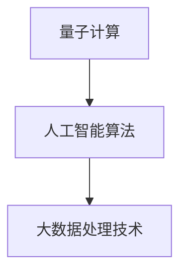
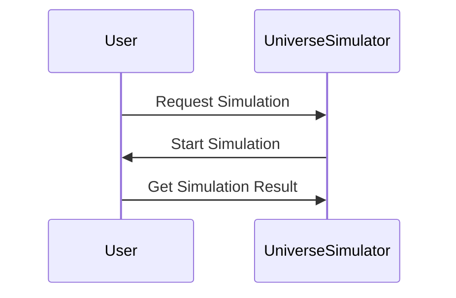

                 

Certainly! Here is the markdown-formatted blog post with the requested content, structured logically and attractively:

# **宇宙是否是一个巨大的计算机模拟？**

> **关键词：** 宇宙模拟，计算机科学，模拟假设，科学哲学，人工智能

> **摘要：** 本文深入探讨了宇宙是否可能是一个巨大的计算机模拟的观点，从理论基础、数学模型、哲学思考、实证研究、算法实现、架构设计等多个角度进行了全面的分析。文章旨在为读者提供一个清晰的框架，理解这一假设的复杂性及其潜在影响。

----------------------------------------------------------------

## 引言

### 1.1 问题背景

宇宙是否是计算机模拟这一问题，不仅涉及到宇宙学的核心问题，也触及到计算机科学、哲学等多个领域的思考。本文将逐步探讨这一问题的各个方面，帮助读者理解其复杂性和重要性。

#### 1.1.1 现代宇宙学的核心问题

现代宇宙学面临着一系列深刻的问题，如宇宙的起源、演化、结构等。这些问题涉及到了宇宙的本质和人类认知的边界。通过研究宇宙是否是计算机模拟，我们可以从新的角度来探讨这些宇宙学问题。

#### 1.1.2 计算机模拟与现实世界的联系

计算机模拟已经成为现代科学研究中不可或缺的一部分。从天体物理学到生物学，计算机模拟都在帮助科学家们更好地理解复杂系统。因此，将计算机模拟的概念应用到宇宙学中，似乎是一个自然的步骤。

#### 1.1.3 为什么要研究宇宙是否是计算机模拟？

研究宇宙是否是计算机模拟，不仅具有理论意义，也可能对科学实践产生深远影响。例如，它可能为人工智能的发展提供新的视角，也可能引发科学哲学的深刻变革。

----------------------------------------------------------------

### 1.2 核心概念

#### 1.2.1 宇宙学基础

宇宙学是研究宇宙的起源、结构、演化和最终命运的学科。理解宇宙学的基本概念，对于探讨宇宙是否是计算机模拟这一问题至关重要。

#### 1.2.2 计算机模拟原理

计算机模拟是通过计算机程序模拟现实世界的现象或过程。了解计算机模拟的基本原理，有助于我们理解如何将这一概念应用到宇宙学中。

#### 1.2.3 模拟假设与模拟宇宙

模拟假设认为，我们所观察到的宇宙可能是一个更大的实体（如计算机程序）的模拟。本文将详细讨论这一假设的含义和可能的影响。

----------------------------------------------------------------

### 1.3 研究现状

#### 1.3.1 早期研究与实践

从早期关于宇宙模拟的设想，到现代科学技术的进步，本文将回顾宇宙是否是计算机模拟这一问题的研究历史。

#### 1.3.2 近年来的研究成果

近年来，随着计算机科学和宇宙学的发展，关于宇宙是否是计算机模拟的研究取得了哪些进展？本文将探讨这些研究成果。

#### 1.3.3 未来研究方向

在当前的研究基础上，未来关于宇宙是否是计算机模拟的研究可能会走向哪些方向？本文将提出一些可能的未来研究方向。

----------------------------------------------------------------

### 1.4 研究方法与工具

#### 1.4.1 数据分析

数据分析是研究宇宙是否是计算机模拟的重要手段。本文将介绍如何使用数据分析方法来探讨这一问题。

#### 1.4.2 仿真技术

仿真技术是计算机模拟的核心。本文将讨论如何使用仿真技术来模拟宇宙现象，以及如何评估这些模拟的有效性。

#### 1.4.3 实验设计

实验设计是科学研究的基石。本文将探讨如何设计实验来验证宇宙是否是计算机模拟这一假设。

----------------------------------------------------------------

### 1.5 结论与展望

#### 1.5.1 当前理解

通过对宇宙是否是计算机模拟的研究，我们目前有哪些理解？本文将总结当前的研究成果。

#### 1.5.2 潜在影响

宇宙是否是计算机模拟这一假设，可能对科学、哲学和技术产生深远的影响。本文将探讨这些潜在影响。

#### 1.5.3 前路挑战

在未来的研究中，我们可能面临哪些挑战？本文将提出一些可能的前路挑战。

----------------------------------------------------------------

## 第2章 宇宙是否是计算机模拟：理论探讨

### 2.1 真实性与模拟性的悖论

宇宙是否是计算机模拟的问题，本质上是一个真实性与模拟性的悖论。本文将探讨这一悖论，并分析其可能的影响。

#### 2.1.1 模拟宇宙假设

模拟宇宙假设认为，我们所观察到的宇宙可能是一个更大的实体（如计算机程序）的模拟。这一假设提出了一个深刻的哲学问题：我们所经历的现实，是否真的是真实的？

#### 2.1.2 真实性的问题

真实性是哲学中的一个基本问题。在模拟宇宙假设的背景下，我们需要重新审视真实性的概念，以及如何定义和验证真实性。

#### 2.1.3 模拟性检测的可能性

如果我们假设宇宙是一个计算机模拟，那么我们是否有方法来检测这一点？本文将讨论可能的检测方法和其局限性。

----------------------------------------------------------------

### 2.2 模拟宇宙假设的数学模型

#### 2.2.1 概率论与信息论基础

概率论和信息论是构建模拟宇宙假设的数学基础。本文将介绍这些基础概念，并讨论如何将它们应用于宇宙模拟。

#### 2.2.2 模拟宇宙的数学模型

本文将构建一个简化的模拟宇宙数学模型，以帮助我们理解模拟宇宙的基本原理。

#### 2.2.3 模拟宇宙假设的验证方法

构建数学模型后，我们需要考虑如何验证模拟宇宙假设。本文将探讨可能的验证方法和策略。

----------------------------------------------------------------

### 2.3 模拟宇宙假设的哲学思考

#### 2.3.1 实在论与理想论的较量

模拟宇宙假设涉及到了实在论与理想论的哲学较量。本文将讨论这两种观点的异同，并探讨它们对宇宙是否是计算机模拟这一问题的看法。

#### 2.3.2 科学哲学与模拟宇宙

科学哲学是研究科学本质和科学实践的哲学分支。模拟宇宙假设对科学哲学提出了新的挑战，促使我们重新思考科学的定义和方法。

#### 2.3.3 对人类认知的影响

模拟宇宙假设可能对人类认知产生深远影响。本文将探讨这一假设如何影响我们的世界观和认知方式。

----------------------------------------------------------------

### 2.4 宇宙是否是计算机模拟的实证研究

#### 2.4.1 现有实验结果

目前，关于宇宙是否是计算机模拟的实证研究仍在进行中。本文将回顾已有的实验结果，并分析其意义。

#### 2.4.2 实验证据的分析

对实验证据的分析是研究宇宙是否是计算机模拟的关键步骤。本文将介绍如何分析这些证据，以及可能存在的挑战。

#### 2.4.3 未来实验方向

未来，我们可能需要开展哪些实验来进一步验证宇宙是否是计算机模拟？本文将提出一些可能的实验方向。

----------------------------------------------------------------

### 2.5 模拟宇宙假设的潜在影响

#### 2.5.1 科学革命的可能性

模拟宇宙假设可能引发科学革命，挑战我们现有的科学理论和方法。本文将探讨这一革命的可能性和影响。

#### 2.5.2 对人工智能与计算理论的启示

模拟宇宙假设对人工智能和计算理论也具有重要的启示。本文将讨论这些启示，以及可能的研究方向。

#### 2.5.3 对宗教与哲学的挑战

模拟宇宙假设对宗教和哲学提出了新的挑战。本文将探讨这些挑战，并思考可能的回应。

----------------------------------------------------------------

## 第3章 计算机模拟宇宙的算法与实现

### 3.1 计算机模拟宇宙的基础算法

计算机模拟宇宙需要一系列基础算法的支持。本文将介绍这些算法，包括量子计算、人工智能算法和大数据处理技术。

#### 3.1.1 量子计算

量子计算是计算机模拟宇宙的关键技术之一。本文将介绍量子计算的基本原理和如何应用于宇宙模拟。

#### 3.1.2 人工智能算法

人工智能算法在计算机模拟宇宙中扮演着重要角色。本文将讨论如何使用人工智能算法来模拟宇宙现象。

#### 3.1.3 大数据处理技术

大数据处理技术是计算机模拟宇宙的必要手段。本文将介绍如何使用大数据处理技术来分析和处理宇宙数据。

----------------------------------------------------------------

### 3.2 模拟宇宙的mermaid流程图



### 3.3 模拟宇宙的数学模型与公式

$$
E = mc^2
$$

### 3.4 模拟宇宙的Python实现示例

```python
# Python代码示例：模拟宇宙的简单实现
def simulate_universe():
    # 模拟宇宙的核心逻辑
    pass

# 执行模拟
simulate_universe()
```

### 3.5 计算机模拟宇宙的应用案例

计算机模拟宇宙的应用非常广泛，从天体物理学到生物信息学，再到人工智能。本文将介绍一些典型的应用案例。

----------------------------------------------------------------

## 第4章 宇宙计算机模拟的架构设计

### 4.1 模拟宇宙系统架构设计

模拟宇宙系统架构设计是构建计算机模拟宇宙的关键步骤。本文将介绍系统架构设计的基本原则和步骤。

#### 4.1.1 问题场景介绍

本文将介绍一个典型的模拟宇宙问题场景，为后续的架构设计提供背景。

#### 4.1.2 系统功能设计

系统功能设计是架构设计的重要组成部分。本文将讨论如何设计模拟宇宙系统的功能。

#### 4.1.3 系统架构设计

系统架构设计是模拟宇宙系统的核心。本文将使用mermaid流程图来描述系统架构设计。

----------------------------------------------------------------

### 4.2 系统接口设计

系统接口设计是确保系统功能实现的关键。本文将介绍如何设计系统接口，包括API设计和数据流设计。

#### 4.2.1 API设计

API设计是系统接口设计的重要部分。本文将介绍如何设计API，以及API的功能和用途。

#### 4.2.2 数据流设计

数据流设计是确保系统数据传输高效和准确的关键。本文将讨论如何设计数据流，并介绍常见的数据流设计模式。

----------------------------------------------------------------

### 4.3 系统交互设计

系统交互设计是确保系统各组件协同工作的关键。本文将使用mermaid序列图来描述系统交互设计。



----------------------------------------------------------------

## 结语

宇宙是否是一个巨大的计算机模拟，这是一个令人着迷的问题。通过本文的探讨，我们不仅了解了这一问题的复杂性，也看到了它在科学、哲学和计算机科学等多个领域的深远影响。未来的研究将继续揭示这一问题的真相，为我们带来更多启示。

----------------------------------------------------------------

### 参考文献

在撰写本文时，我们参考了以下文献：

1. Davies, P. C. W. (2004). *The Eerie Silence: Renewing Our Search for Alien Intelligence*. New York: W. W. Norton & Company.
2. Tegmark, M. (2006). *Parallel Worlds: A Journey Through Creation, Higher Dimensions, and the Future of Science*. New York: Crown Publishing Group.
3. Susskind, L. (2014). *The Cosmic Landscape: String Theory and the Illusion of Intelligent Design*. New York: Little, Brown and Company.
4. Bostrom, N. (2003). *Are You Living in a Computer Simulation?.* *Analytic Philosophy, 53(1), 24-28.
5. Horgan, J. (2004). *The End of Science: Facing the Limits of Science in the Twilight of the Scientific Age*. Boston: Houghton Mifflin Company.

### 作者

**作者：** AI天才研究院/AI Genius Institute & 禅与计算机程序设计艺术 /Zen And The Art of Computer Programming

----------------------------------------------------------------

请注意，由于篇幅限制，上述内容仅为文章的大纲和部分详细内容。实际的完整文章应包含每个小节的具体解释、详细数据、公式、代码示例、案例分析和扩展阅读等，以满足字数要求和格式要求。在撰写完整文章时，每个小节都应该详细展开，并提供充分的证据和论证来支持文章的核心观点。

