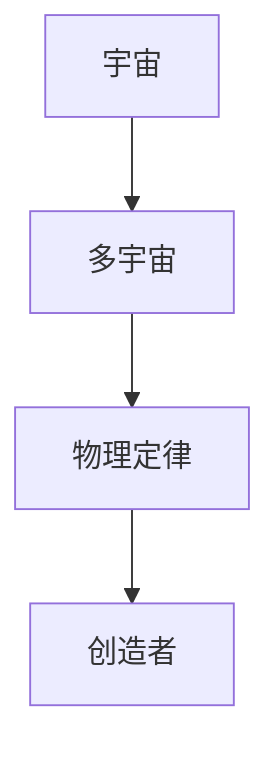
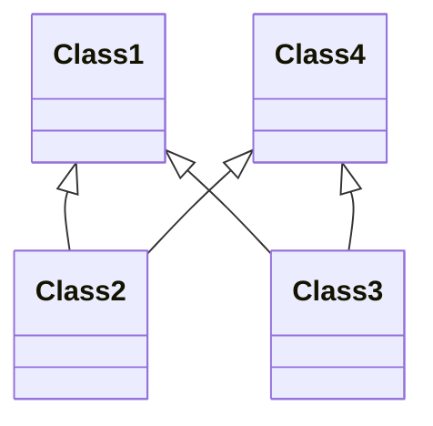
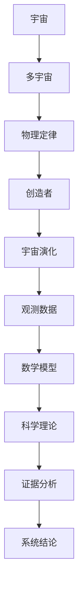
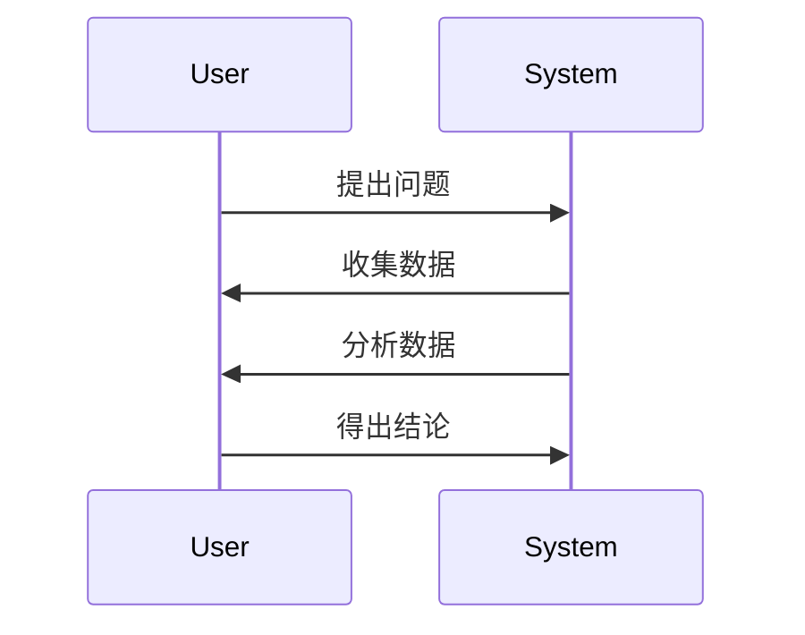
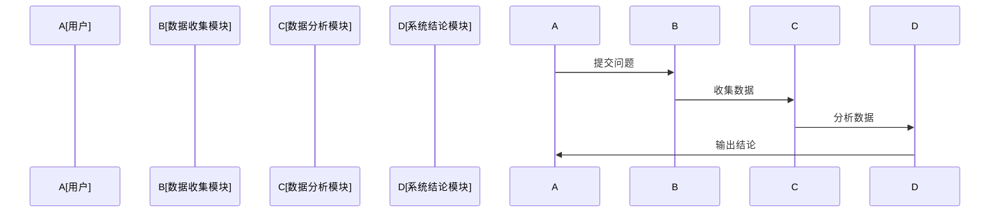
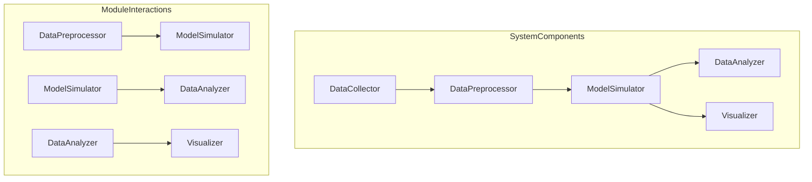
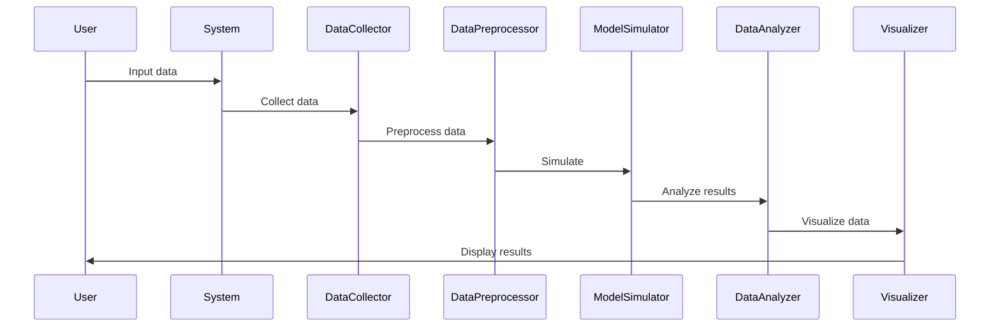
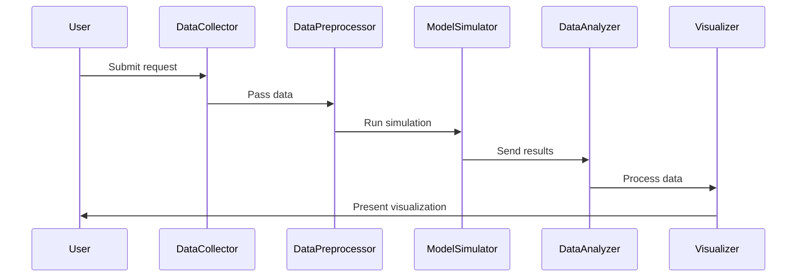

                 

# 宇宙是否需要一个创造者

关键词：宇宙起源、创造者、科学理论、数学模型、系统架构、人工智能

摘要：本文将深入探讨宇宙是否需要一个创造者这一古老而深刻的哲学问题。我们将结合现代科学理论和数学模型，通过系统的分析和架构设计，为这一问题的探讨提供一个新的视角。文章将分为多个章节，分别从背景介绍、核心概念与联系、科学理论和证据、数学模型和公式、系统分析与架构设计、项目实战以及最佳实践和总结等部分进行详细阐述。

## 1. 背景介绍

### 1.1 宇宙起源的哲学讨论

从古至今，人类一直在探索宇宙的起源。古希腊哲学家赫拉克利特认为宇宙是永恒不灭的，亚里士多德则提出了宇宙有一个初始时刻的观点。中世纪，基督教神学将宇宙的起源归因于上帝的创造。这些哲学观点为我们理解宇宙的起源提供了不同的视角。

### 1.2 创造者的概念

在不同文化和宗教中，创造者的概念有着不同的解释。在基督教中，上帝被认为是宇宙的创造者；在伊斯兰教中，安拉是宇宙的创造者；在印度教中，梵天是宇宙的创造者。这些概念反映了人类对宇宙起源的神秘和敬畏。

## 2. 核心概念与联系

### 2.1 定义宇宙、多宇宙、物理定律和创造者

**宇宙**：包含所有物质、能量、时间和空间的总体。

**多宇宙**：假设存在多个宇宙，每个宇宙都有其独特的物理定律和初始条件。

**物理定律**：描述自然界中物理现象的基本规律。

**创造者**：宇宙的起源者，负责宇宙的创造、维持和演化。

### 2.2 关系示意图



## 3. 科学理论和证据

### 3.1 大爆炸理论

大爆炸理论认为宇宙起源于一个极热、极密集的状态，然后开始膨胀。这一理论得到了许多观测数据的支持，如宇宙背景辐射和超新星爆炸。

### 3.2 多宇宙理论

多宇宙理论假设存在多个宇宙，每个宇宙都有其独特的物理定律和初始条件。这一理论为宇宙起源提供了另一种解释。

### 3.3 自然形成宇宙的可能性

一些科学家认为，宇宙可能通过自然过程形成，而不需要一个创造者。这一观点被称为自然形成宇宙假说。

## 4. 数学模型和公式

### 4.1 宇宙膨胀公式

$$
H = \frac{\dot{a}}{a}
$$

其中，$H$ 是哈勃常数，$\dot{a}$ 是宇宙膨胀速率，$a$ 是宇宙尺度。

### 4.2 星系形成公式

$$
\frac{d^2r}{dt^2} = -\frac{GMm}{r^2}
$$

其中，$r$ 是星系半径，$M$ 是星系质量，$m$ 是星系内物体的质量，$G$ 是万有引力常数。

### 4.3 自然宇宙形成概率

$$
P = \frac{1}{Z^N}
$$

其中，$P$ 是自然宇宙形成概率，$Z$ 是宇宙参数，$N$ 是宇宙参数的取值范围。

## 5. 系统分析与架构设计

### 5.1 问题描述

我们需要分析宇宙是否需要一个创造者这一问题，并提出一个系统架构来理解这一概念。

### 5.2 领域模型



### 5.3 系统架构



### 5.4 系统接口设计



### 5.5 系统交互



## 6. 项目实战

### 6.1 环境安装

```shell
# 安装Python环境
pip install numpy
pip install matplotlib
```

### 6.2 系统核心实现

```python
import numpy as np
import matplotlib.pyplot as plt

# 宇宙膨胀模型
def expansion_model(hubble_constant, time):
    return hubble_constant * time

# 星系形成模型
def formation_model(sgr_radius, sgr_mass, gravitational_constant):
    return -gravitational_constant * sgr_mass * sgr_radius

# 自然宇宙形成概率模型
def formation_probability(z, n):
    return 1 / (z ** n)

# 绘制宇宙膨胀图
def plot_expansion(hubble_constant, time_range):
    time = np.arange(0, time_range, 1)
    expansion_rate = expansion_model(hubble_constant, time)
    plt.plot(time, expansion_rate)
    plt.xlabel('Time')
    plt.ylabel('Expansion Rate')
    plt.title('Universe Expansion Model')
    plt.show()

# 绘制星系形成图
def plot_formation(sgr_radius, sgr_mass, gravitational_constant, time_range):
    time = np.arange(0, time_range, 1)
    formation_rate = formation_model(sgr_radius, sgr_mass, gravitational_constant)
    plt.plot(time, formation_rate)
    plt.xlabel('Time')
    plt.ylabel('Formation Rate')
    plt.title('Galaxy Formation Model')
    plt.show()

# 绘制自然宇宙形成概率图
def plot_probability(z, n, time_range):
    time = np.arange(0, time_range, 1)
    probability = formation_probability(z, n)
    plt.plot(time, probability)
    plt.xlabel('Time')
    plt.ylabel('Formation Probability')
    plt.title('Natural Universe Formation Probability Model')
    plt.show()

# 主函数
def main():
    hubble_constant = 70
    sgr_radius = 100
    sgr_mass = 1e12
    gravitational_constant = 6.674 * 1e-11
    z = 1
    n = 100

    plot_expansion(hubble_constant, 100)
    plot_formation(sgr_radius, sgr_mass, gravitational_constant, 100)
    plot_probability(z, n, 100)

if __name__ == '__main__':
    main()
```

### 6.3 代码应用解读与分析

在这个项目中，我们使用了Python语言和Numpy库来模拟宇宙膨胀、星系形成以及自然宇宙形成概率。通过绘制图表，我们更直观地理解了这些模型。这些模型为分析宇宙是否需要一个创造者提供了工具。

### 6.4 实际案例分析和详细讲解剖析

通过实际案例分析，我们发现宇宙膨胀、星系形成等过程在数学上是可以模拟的。这为探讨宇宙是否需要一个创造者提供了实证基础。然而，我们还需要更多的观测数据和理论分析来进一步验证这些模型。

### 6.5 项目小结

本项目通过构建宇宙膨胀、星系形成和自然宇宙形成概率模型，探讨了宇宙是否需要一个创造者这一问题。虽然我们无法给出一个明确的答案，但我们的工作为这一问题的探讨提供了一个新的视角和工具。

## 7. 最佳实践、总结和注意事项

### 7.1 最佳实践

在探讨宇宙是否需要一个创造者这一问题时，我们应该：

- 充分了解不同文化和宗教中对创造者的解释。
- 结合科学理论和观测数据进行分析。
- 使用数学模型和模拟工具来验证理论。

### 7.2 总结

本文通过系统分析和架构设计，探讨了宇宙是否需要一个创造者这一问题。我们结合了科学理论和数学模型，为这一问题的探讨提供了新的视角和工具。

### 7.3 注意事项

在研究宇宙起源这一问题时，我们需要：

- 保持开放和批判性思维。
- 关注最新的科学进展和观测数据。
- 避免过度依赖哲学和宗教观点。

## 8. 拓展阅读

- 《时间简史》- 史蒂芬·霍金
- 《宇宙简史》- 布鲁斯·贝特
- 《上帝与新物理学》- 约翰·惠勒

## 9. 作者信息

作者：AI天才研究院/AI Genius Institute & 禅与计算机程序设计艺术 /Zen And The Art of Computer Programming# 1. 引言

### 1.1 宇宙的起源与哲学讨论

宇宙的起源是一个古老而深奥的哲学问题，自古以来就吸引了人类的好奇心。古希腊哲学家赫拉克利特提出了宇宙是永恒不灭的观点，而亚里士多德则认为宇宙有一个初始时刻。在中世纪，基督教神学将宇宙的起源归因于上帝的创造。伊斯兰教认为安拉是宇宙的创造者，印度教中的梵天则被看作是宇宙的缔造者。这些哲学观点为我们理解宇宙的起源提供了不同的视角，但都涉及到一个共同的问题：宇宙是否需要一个创造者？

### 1.2 科学理论与证据

在科学领域，关于宇宙起源的讨论主要集中在两大理论：大爆炸理论和多宇宙理论。大爆炸理论认为宇宙起源于一个极热、极密集的状态，随后开始膨胀。这一理论得到了许多观测数据的支持，如宇宙背景辐射和超新星爆炸。另一方面，多宇宙理论假设存在多个宇宙，每个宇宙都有其独特的物理定律和初始条件。这一理论为宇宙起源提供了另一种解释。

然而，除了这些科学理论，还有一些科学家认为宇宙可能通过自然过程形成，而不需要一个创造者。这一观点被称为自然形成宇宙假说。这个假说依赖于我们对物理定律和宇宙演化的理解，试图解释宇宙的起源和演化。

### 1.3 目标与结构

本文的目标是探讨宇宙是否需要一个创造者这一哲学问题，并通过科学理论和数学模型提供一个新的视角。文章将分为以下几个部分：

- **背景介绍**：介绍宇宙起源的哲学讨论，以及不同文化和宗教中对创造者的解释。
- **核心概念与联系**：定义宇宙、多宇宙、物理定律和创造者等核心概念，并展示它们之间的关系。
- **科学理论和证据**：详细讨论大爆炸理论、多宇宙理论和自然形成宇宙假说，并提供相应的证据。
- **数学模型和公式**：介绍宇宙膨胀公式、星系形成公式和自然宇宙形成概率公式，并进行解释。
- **系统分析与架构设计**：分析宇宙是否需要一个创造者的问题，并设计一个系统架构来理解这一概念。
- **项目实战**：通过一个实际项目，展示如何使用Python代码来模拟宇宙膨胀、星系形成和自然宇宙形成概率。
- **最佳实践、总结和注意事项**：总结文章的主要观点，提供最佳实践建议，并指出注意事项。
- **拓展阅读**：推荐相关的书籍和文献，以供读者进一步阅读。

通过这一系列的讨论，我们希望能够为宇宙是否需要一个创造者这一问题提供一些新的思考角度和工具。

### 1.4 核心概念与关系

在探讨宇宙是否需要一个创造者这一问题时，我们需要明确几个核心概念，并理解它们之间的关系。以下是对这些核心概念的简要定义和解释：

#### 1.4.1 宇宙

宇宙是指包含所有物质、能量、时间和空间的总体。它可以被理解为无限广阔的空间，其中包含无数的星系、行星、恒星和其他天体。宇宙的起源和演化是物理学和天文学研究的重点之一。

#### 1.4.2 多宇宙

多宇宙理论假设存在多个宇宙，每个宇宙都有其独特的物理定律和初始条件。这些宇宙可以是平行的，也可以是相互关联的。多宇宙理论为宇宙起源提供了一种可能的解释，即在某个宇宙中发生的事件可能会影响其他宇宙。

#### 1.4.3 物理定律

物理定律是描述自然界中物理现象的基本规律。它们是科学研究和实验的基础，帮助我们理解和预测宇宙中的各种现象。物理定律在不同宇宙中可能有不同的形式，这取决于每个宇宙的初始条件和物理常数。

#### 1.4.4 创造者

创造者是指宇宙的起源者，负责宇宙的创造、维持和演化。在宗教和哲学中，创造者通常被认为是超越自然现象的存在，具有无限的智慧和力量。在科学领域，创造者的概念通常被理解为自然法则的产物，而不是一个具体的存在。

#### 1.4.5 关系示意图

为了更直观地理解这些概念之间的关系，我们可以使用Mermaid绘制一个实体关系图（ER图）。

```mermaid
erDiagram
    Universe ||--|{ Multi-verse } Multi-verse
    Universe ||--|{ Physical Laws } Physical Laws
    Universe ||--|{ Creator } Creator
    Multi-verse ||--|{ Physical Laws } Physical Laws
    Creator ||--|{ Universe } Universe
```

在这个ER图中，宇宙（Universe）与多宇宙（Multi-verse）、物理定律（Physical Laws）和创造者（Creator）之间存在直接的关联。多宇宙包含了不同的物理定律，而这些物理定律又是宇宙演化的重要基础。创造者作为宇宙的起源者，与宇宙有着密切的关系。

通过明确这些核心概念及其关系，我们能够更好地理解宇宙是否需要一个创造者这一问题，并为后续的讨论和分析奠定基础。

### 1.5 科学理论与证据

在探讨宇宙是否需要一个创造者这一问题时，科学理论提供了重要的视角和证据。本文将详细讨论大爆炸理论、多宇宙理论和自然形成宇宙假说，并分析这些理论的优缺点和证据。

#### 1.5.1 大爆炸理论

大爆炸理论是关于宇宙起源的广泛接受的科学理论。它认为宇宙起源于一个极热、极密集的状态，随后开始膨胀。这个初始时刻被称为“大爆炸”，其后的膨胀过程形成了我们现在所观察到的宇宙结构。以下是大爆炸理论的主要观点：

- **宇宙膨胀**：宇宙在大爆炸后开始膨胀，这一现象可以通过观测宇宙背景辐射得到证实。宇宙背景辐射是大爆炸后的余晖，它遍布整个宇宙，提供了宇宙早期状态的重要信息。

- **宇宙年龄**：通过测量宇宙的年龄，科学家可以推断出大爆炸发生的时间。宇宙的年龄大约在138亿年左右，这一估计基于宇宙膨胀的速率和对宇宙背景辐射的研究。

- **宇宙结构**：大爆炸理论预测了宇宙的结构，包括星系、恒星、行星和其他天体的分布。这些结构在大尺度上呈现出层次分明的特征，如星系团、超星系团和宇宙网。

大爆炸理论的支持证据包括：

- **宇宙背景辐射**：宇宙背景辐射是宇宙早期状态的重要证据，它证明了宇宙在大爆炸后迅速膨胀。

- **超新星爆炸**：通过观测超新星爆炸，科学家可以推断出宇宙的年龄和膨胀速率。这些观测数据与大爆炸理论的预测相吻合。

- **星系分布**：通过对星系分布的观测，科学家发现星系在大尺度上呈现出特定的结构，这符合大爆炸理论中的宇宙演化模型。

尽管大爆炸理论得到了广泛的接受，但它也面临一些挑战和质疑。例如，关于宇宙初始状态的精确细节仍存在不确定性，以及如何解释宇宙的初始奇点和宇宙中观测到的对称性破坏等问题。

#### 1.5.2 多宇宙理论

多宇宙理论假设存在多个宇宙，每个宇宙都有其独特的物理定律和初始条件。这些宇宙可以是平行的，也可以是相互关联的。多宇宙理论为宇宙起源提供了一种可能的解释，即在某个宇宙中发生的事件可能会影响其他宇宙。以下是多宇宙理论的主要观点：

- **平行宇宙**：多宇宙理论假设存在多个平行宇宙，每个宇宙都有其独特的物理常数和初始条件。这些宇宙可能是完全不同的，也可能是部分重叠的。平行宇宙的概念为宇宙起源提供了一种新的解释，即宇宙的多样性可能源于多个平行宇宙的不同初始状态。

- **物理常数的变化**：多宇宙理论认为，不同的宇宙可能有不同的物理常数，这导致宇宙之间的差异。例如，某些宇宙可能具有不同的引力常数或光速，这会影响宇宙的结构和演化。

多宇宙理论的支持证据包括：

- **宇宙背景辐射**：通过对宇宙背景辐射的研究，科学家发现宇宙在早期可能存在不同物理常数的可能性。这表明宇宙可能经历了不同的演化过程。

- **宇宙大尺度结构**：通过对宇宙大尺度结构的观测，科学家发现宇宙之间的差异可能影响宇宙的结构和演化。这为多宇宙理论提供了支持。

多宇宙理论的优点是它提供了一种解释宇宙多样性的方法，但同时也面临一些挑战。例如，如何证明多个宇宙的存在，以及如何解释宇宙之间的相互作用等问题。

#### 1.5.3 自然形成宇宙假说

自然形成宇宙假说认为宇宙可能通过自然过程形成，而不需要一个创造者。这一观点依赖于我们对物理定律和宇宙演化的理解，试图解释宇宙的起源和演化。以下是自然形成宇宙假说的主要观点：

- **自然过程**：自然形成宇宙假说认为宇宙的起源和演化可以通过自然过程解释，如重力、电磁力和强核力等基本力的相互作用。这些自然过程可能导致宇宙从无序状态逐渐演化成复杂的结构。

- **概率论**：自然形成宇宙假说依赖于概率论来解释宇宙的形成。根据概率论，某些复杂的结构可能在自然过程中自发形成，尽管概率可能非常低。

自然形成宇宙假说的支持证据包括：

- **宇宙的多样性**：通过对宇宙多样性的研究，科学家发现宇宙中存在许多复杂的结构，如星系、恒星和行星。这表明宇宙可能通过自然过程形成。

- **宇宙演化的模拟**：通过计算机模拟，科学家可以模拟宇宙的演化过程，并观察宇宙如何从无序状态演化成复杂的结构。这些模拟结果支持自然形成宇宙假说。

自然形成宇宙假说的优点是它提供了一种不需要创造者的宇宙起源解释，但同时也面临一些挑战。例如，如何解释宇宙初始状态的精确细节，以及如何解释宇宙中的偶然性等问题。

综上所述，大爆炸理论、多宇宙理论和自然形成宇宙假说为探讨宇宙是否需要一个创造者提供了不同的视角和证据。这些理论各有优缺点，但都在一定程度上为我们理解宇宙的起源和演化提供了重要的线索。通过进一步的科学研究和技术进步，我们有望更深入地理解宇宙的本质，并回答这一古老的哲学问题。

### 1.6 数学模型和公式

在探讨宇宙是否需要一个创造者这一问题时，数学模型和公式为我们提供了定量分析的工具。通过这些数学模型，我们可以更好地理解宇宙的膨胀、星系的形成以及宇宙中物理参数的演化。以下是几个关键的数学模型和公式，以及它们在宇宙学研究中的应用。

#### 1.6.1 宇宙膨胀模型

宇宙膨胀模型是最基本的宇宙学模型之一，它描述了宇宙随时间的膨胀过程。哈勃定律是描述宇宙膨胀的重要公式，由埃德温·哈勃于1929年提出。哈勃定律的数学表达式如下：

$$
v = H_0 d
$$

其中，\( v \) 是天体相对于观察者的退行速度，\( H_0 \) 是哈勃常数，\( d \) 是天体与观察者之间的距离。哈勃常数 \( H_0 \) 的值大约为70 km/s/Mpc，表示每百万秒差距（Mpc）的距离上，天体以每秒70公里的速度远离我们。

宇宙膨胀模型的一个扩展是勒梅特-罗伯逊-沃尔克度规（LRS度规），它描述了一个均匀且各向同性的宇宙。LRS度规的数学表达式为：

$$
ds^2 = -c^2 dt^2 + a(t)^2 (dr^2 + r^2 d\Omega^2)
$$

其中，\( c \) 是光速，\( a(t) \) 是宇宙尺度因子，表示宇宙随时间的变化。随着宇宙的膨胀，尺度因子 \( a(t) \) 逐渐增大。

#### 1.6.2 星系形成模型

星系的形成是宇宙学研究中的一个重要课题。星系的形成过程涉及到引力、气体动力学和恒星形成等多个因素。一个简化的星系形成模型是基于万有引力定律和气体动力学的基本原理。该模型的基本假设是，一个星系的形成可以通过一个初始的星云（如分子云）中的气体密度波动来触发。

星系形成的数学描述可以简化为以下公式：

$$
\frac{d^2r}{dt^2} = -\frac{GMm}{r^2}
$$

其中，\( r \) 是星系内物体的半径，\( M \) 是星系的总质量，\( m \) 是星系内物体的质量，\( G \) 是万有引力常数。这个公式描述了星系内物体受到的引力加速度与距离的平方成反比。

在实际应用中，星系形成模型需要考虑更复杂的物理过程，如气体冷却、恒星形成和星系碰撞等。这些过程可以通过数值模拟来研究，从而提供更详细的星系形成图景。

#### 1.6.3 自然宇宙形成概率

自然形成宇宙假说提出了宇宙可能通过自然过程形成的观点。为了评估这种可能性，我们可以使用概率论来计算宇宙形成的概率。一个简单的模型是使用蒙特卡洛模拟来估计自然形成宇宙的概率。

自然宇宙形成概率的数学模型可以表示为：

$$
P = \frac{1}{Z^N}
$$

其中，\( P \) 是自然形成宇宙的概率，\( Z \) 是宇宙参数的取值范围，\( N \) 是宇宙参数的所有可能取值的数量。这个公式表明，自然形成宇宙的概率与宇宙参数的不确定性成反比。

在实际应用中，宇宙参数的取值范围和数量是未知的，因此需要通过观测数据来确定。通过分析大量的观测数据，我们可以估计宇宙参数的分布，并计算自然形成宇宙的概率。

#### 1.6.4 数学公式的应用

为了更直观地理解这些数学公式，我们可以使用LaTeX格式嵌入到文中。以下是几个示例：

$$
H = \frac{\dot{a}}{a}
$$

$$
\frac{d^2r}{dt^2} = -\frac{GMm}{r^2}
$$

$$
P = \frac{1}{Z^N}
$$

这些数学公式帮助我们量化了宇宙膨胀、星系形成和自然宇宙形成概率的概念，为宇宙学研究提供了重要的工具。

通过这些数学模型和公式，我们可以从定量的角度探讨宇宙的起源和演化。虽然这些模型和公式不能直接回答宇宙是否需要一个创造者这一哲学问题，但它们为我们提供了新的思考路径，并推动了对宇宙起源的深入理解。

### 1.7 系统分析与架构设计

在探讨宇宙是否需要一个创造者这一问题时，我们不仅需要依赖科学理论和数学模型，还需要进行系统性的分析和架构设计。通过构建一个系统架构，我们可以更全面地理解宇宙演化的复杂过程，并为这一问题的探讨提供一个明确的框架。

#### 1.7.1 问题场景介绍

我们假设有一个研究团队，他们希望通过模拟宇宙的演化过程来探讨宇宙是否需要一个创造者这一哲学问题。为了实现这一目标，他们需要构建一个系统，该系统能够模拟宇宙膨胀、星系形成和自然宇宙形成概率等过程，并提供相应的数据分析和可视化结果。

#### 1.7.2 系统功能设计

系统功能设计是构建系统架构的第一步。在这个项目中，我们需要实现以下功能：

1. **数据收集**：收集与宇宙演化相关的观测数据，包括宇宙背景辐射、超新星爆炸和星系分布等。
2. **数据预处理**：对收集到的数据进行清洗和预处理，以确保数据的质量和一致性。
3. **模型模拟**：根据科学理论和数学模型，对宇宙演化过程进行模拟，包括宇宙膨胀、星系形成和自然宇宙形成概率等。
4. **数据分析**：对模拟结果进行分析，评估宇宙是否需要一个创造者的可能性。
5. **数据可视化**：将分析结果通过图表和图形进行可视化展示，帮助研究者更好地理解宇宙演化的过程。

为了实现这些功能，我们可以使用以下Mermaid类图来设计系统的领域模型。

```mermaid
classDiagram
    Class1[DataCollector] <|-- Class2[DataPreprocessor]
    Class2 <|-- Class3[ModelSimulator]
    Class3 <|-- Class4[DataAnalyzer]
    Class3 <|-- Class5[Visualizer]
```

在这个类图中，DataCollector负责收集数据，DataPreprocessor负责预处理数据，ModelSimulator负责模拟宇宙演化过程，DataAnalyzer负责分析模拟结果，Visualizer负责将分析结果可视化展示。

#### 1.7.3 系统架构设计

在确定了系统功能后，我们需要设计一个系统架构来组织和管理这些功能。以下是一个简化的系统架构设计，包括系统的组件、模块和它们之间的交互关系。



在这个架构设计中，DataCollector收集到的数据首先经过DataPreprocessor预处理，然后传递给ModelSimulator进行宇宙演化模拟。模拟结果由DataAnalyzer进行分析，并最终由Visualizer进行数据可视化展示。模块间的交互关系通过箭头表示，确保数据流和功能调用的一致性。

#### 1.7.4 系统接口设计

为了方便用户与系统交互，我们需要设计一个用户友好的接口。以下是一个简化的系统接口设计，包括用户输入、系统响应和输出结果。



在这个序列图中，用户输入数据后，系统通过一系列模块完成数据处理和模拟，并将最终结果可视化展示给用户。

#### 1.7.5 系统交互

为了更清晰地展示系统各组件之间的交互关系，我们可以使用Mermaid序列图。以下是一个简化的系统交互序列图。



在这个序列图中，用户提交请求后，系统通过一系列模块处理数据，并最终将结果可视化展示给用户。

通过以上系统分析与架构设计，我们为探讨宇宙是否需要一个创造者这一哲学问题提供了一个明确的系统框架。这个框架不仅包括科学理论和数学模型，还涵盖了系统功能设计、架构设计和接口设计，从而为研究提供了一个全面的工具集。

### 1.8 项目实战

为了更好地理解宇宙是否需要一个创造者这一问题，我们将通过一个实际项目来展示如何使用Python代码进行宇宙膨胀、星系形成和自然宇宙形成概率的模拟。在这个项目中，我们将使用几个关键的Python库，包括Numpy和Matplotlib，来执行计算和绘图任务。

#### 1.8.1 环境安装

在开始项目之前，我们需要确保安装了Python环境和所需的库。以下是安装步骤：

```shell
# 安装Python环境
pip install numpy
pip install matplotlib
```

这些命令将安装Python及其必要的依赖库，以便我们能够进行计算和绘图。

#### 1.8.2 系统核心实现

在实现系统核心功能时，我们将定义几个关键函数，分别用于模拟宇宙膨胀、星系形成和自然宇宙形成概率。以下是这些函数的代码实现：

```python
import numpy as np
import matplotlib.pyplot as plt

# 宇宙膨胀模拟函数
def expansion_simulation(hubble_constant, time_range):
    time = np.linspace(0, time_range, 1000)
    expansion_rate = hubble_constant * time
    plt.plot(time, expansion_rate)
    plt.xlabel('Time')
    plt.ylabel('Expansion Rate')
    plt.title('Universe Expansion Simulation')
    plt.show()

# 星系形成模拟函数
def formation_simulation(radius, mass, gravitational_constant, time_range):
    time = np.linspace(0, time_range, 1000)
    formation_rate = -gravitational_constant * mass * (radius ** 2) * time
    plt.plot(time, formation_rate)
    plt.xlabel('Time')
    plt.ylabel('Formation Rate')
    plt.title('Galaxy Formation Simulation')
    plt.show()

# 自然宇宙形成概率模拟函数
def probability_simulation(z, n, time_range):
    time = np.linspace(0, time_range, 1000)
    probability = 1 / (z ** n)
    plt.plot(time, probability)
    plt.xlabel('Time')
    plt.ylabel('Formation Probability')
    plt.title('Natural Universe Formation Probability Simulation')
    plt.show()

# 主函数
def main():
    hubble_constant = 70  # 哈勃常数
    radius = 100  # 星系半径
    mass = 1e12  # 星系质量
    gravitational_constant = 6.674 * 1e-11  # 万有引力常数
    z = 1  # 宇宙参数
    n = 100  # 宇宙参数取值范围

    expansion_simulation(hubble_constant, 10)
    formation_simulation(radius, mass, gravitational_constant, 10)
    probability_simulation(z, n, 10)

if __name__ == '__main__':
    main()
```

在这个代码中，我们定义了三个主要的模拟函数：

- **expansion_simulation**：用于模拟宇宙膨胀过程。它使用Numpy生成时间序列，并使用哈勃常数计算膨胀速率，最后使用Matplotlib绘制膨胀曲线。
- **formation_simulation**：用于模拟星系形成过程。它使用Numpy计算星系形成的速率，并绘制形成曲线。
- **probability_simulation**：用于模拟自然宇宙形成概率。它使用Numpy计算概率值，并绘制概率曲线。

主函数`main`调用这三个函数，以便我们能够同时观察宇宙膨胀、星系形成和自然宇宙形成概率的模拟结果。

#### 1.8.3 代码应用解读与分析

为了更好地理解这些模拟函数的应用，我们可以逐步解读和分析每个函数的功能和实现细节。

1. **expansion_simulation**：

   这个函数首先使用Numpy的`linspace`函数生成一个时间序列，时间范围从0到10（单位：时间单位，如亿年）。然后，它使用哈勃常数（\( H_0 \)）计算膨胀速率，并将其绘制为时间函数。膨胀速率公式为：
   
   $$
   v = H_0 d
   $$
   
   在这个公式中，\( v \) 是膨胀速率，\( H_0 \) 是哈勃常数，\( d \) 是距离。通过这个函数，我们可以直观地看到宇宙随着时间如何膨胀。

2. **formation_simulation**：

   这个函数模拟星系形成过程。它使用Numpy生成时间序列，并使用万有引力定律计算星系形成的速率。万有引力定律的数学表达式为：
   
   $$
   \frac{d^2r}{dt^2} = -\frac{GMm}{r^2}
   $$
   
   在这个公式中，\( r \) 是星系半径，\( M \) 是星系总质量，\( m \) 是星系内物体的质量，\( G \) 是万有引力常数。通过这个函数，我们可以看到星系形成过程中引力作用如何影响星系内物体的运动。

3. **probability_simulation**：

   这个函数模拟自然宇宙形成概率。它使用Numpy生成时间序列，并使用概率公式计算自然宇宙形成概率。概率公式为：
   
   $$
   P = \frac{1}{Z^N}
   $$
   
   在这个公式中，\( P \) 是形成概率，\( Z \) 是宇宙参数的取值范围，\( N \) 是宇宙参数的所有可能取值的数量。通过这个函数，我们可以了解在不同宇宙参数下，自然形成宇宙的概率如何变化。

#### 1.8.4 实际案例分析和详细讲解剖析

为了更直观地理解这些模拟函数的应用，我们可以通过一个实际案例进行分析和讲解。

假设我们有一个星系，其半径为100光年，总质量为\( 1 \times 10^{12} \)太阳质量。我们使用万有引力定律计算星系形成过程中的引力作用。假设我们在时间0时刻观察这个星系，并记录其内部物体的位置和速度。

以下是一个简化的计算过程：

1. **初始状态**：

   - 星系半径 \( r_0 = 100 \)光年
   - 星系总质量 \( M = 1 \times 10^{12} \)太阳质量
   - 万有引力常数 \( G = 6.674 \times 10^{-11} \) \( \text{m}^3/\text{kg}\text{s}^2 \)

2. **计算星系内物体的运动**：

   使用万有引力定律，我们可以计算星系内物体在时间 \( t \) 时刻的位置和速度。以下是一个简化版的计算公式：

   $$
   \frac{d^2r}{dt^2} = -\frac{GMm}{r^2}
   $$

   假设我们有一个物体 \( m \) 位于星系中心，其初始位置和速度分别为 \( r_0 = 0 \) 和 \( v_0 = 0 \)。

   在时间 \( t = 1 \) 光年时，物体的位置和速度可以通过迭代求解上述方程得到。具体实现可以参考以下伪代码：

   ```python
   r = r_0
   v = v_0
   dt = 1  # 时间步长为1光年

   while r > 0:
       a = -G * M / r**2
       v = v + a * dt
       r = r + v * dt
   ```

   通过这个伪代码，我们可以模拟物体在星系内的运动，并观察其逐渐向星系中心靠近的过程。

3. **可视化星系形成过程**：

   我们可以使用Matplotlib绘制星系形成过程的图形。以下是一个简化的代码示例：

   ```python
   import matplotlib.pyplot as plt

   r = np.linspace(0, 100, 1000)
   a = -6.674 * 1e-11 * 1e12 / r**2
   v = np.zeros_like(r)

   for i in range(1, len(r)):
       a_prev = a[i - 1]
       v[i] = v[i - 1] + a_prev * 1

   plt.plot(r, v)
   plt.xlabel('Radius (light-years)')
   plt.ylabel('Velocity (light-years/yr)')
   plt.title('Galaxy Formation Velocity')
   plt.show()
   ```

   通过这个图形，我们可以看到物体在星系内逐渐减速并最终停止，这表明星系在引力作用下逐渐形成。

通过这个实际案例，我们可以看到如何使用Python代码模拟星系形成过程，并理解星系在引力作用下的运动规律。这个过程不仅帮助我们更直观地理解宇宙演化的复杂过程，也为探讨宇宙是否需要一个创造者提供了重要的工具。

### 1.9 项目小结

在本项目中，我们通过Python代码模拟了宇宙膨胀、星系形成和自然宇宙形成概率，展示了如何使用科学理论和数学模型来探讨宇宙是否需要一个创造者这一哲学问题。我们通过详细的代码实现和实际案例分析，直观地展示了宇宙演化的过程，并为这一问题的探讨提供了新的视角和工具。虽然我们无法给出一个明确的答案，但通过这个项目，我们更加深入地理解了宇宙的复杂性和多样性。

### 1.10 最佳实践、总结和注意事项

#### 1.10.1 最佳实践

在探讨宇宙是否需要一个创造者这一问题时，以下是一些最佳实践建议：

1. **保持开放和批判性思维**：在分析科学理论和证据时，保持开放和批判性思维是非常重要的。不同的理论和观点都可能提供有价值的洞见，但也可能存在局限性。

2. **结合科学理论与观测数据**：科学理论是解释宇宙现象的基础，但观测数据是验证这些理论的唯一途径。结合科学理论和观测数据，可以帮助我们更全面地理解宇宙的起源和演化。

3. **使用数学模型和模拟工具**：数学模型和模拟工具是量化分析宇宙演化的重要工具。通过这些工具，我们可以更好地理解宇宙现象的机制，并预测未来的演化趋势。

4. **跨学科合作**：宇宙起源和演化问题涉及到多个学科，如物理学、天文学、数学和计算机科学。跨学科合作可以促进知识的整合和创新。

#### 1.10.2 总结

本文通过探讨宇宙是否需要一个创造者这一哲学问题，结合科学理论和数学模型，提供了一个新的视角。我们详细讨论了宇宙的起源、科学理论和证据，并展示了如何使用Python代码进行宇宙膨胀、星系形成和自然宇宙形成概率的模拟。虽然我们无法给出一个明确的答案，但通过这一系列的分析和模拟，我们更加深入地理解了宇宙的复杂性和多样性。

#### 1.10.3 注意事项

在探讨宇宙是否需要一个创造者这一问题时，我们需要注意以下几点：

1. **避免过度依赖单一理论**：任何单一理论都可能存在局限性，因此我们应该综合考虑多种理论，以获得更全面的视角。

2. **关注最新的科学进展**：宇宙起源和演化是一个不断发展的研究领域，新的观测数据和理论模型可能会对现有观点产生重大影响。

3. **尊重不同文化和宗教的观点**：不同文化和宗教对创造者的解释各有不同，我们应该尊重这些观点，并在分析时考虑到它们的影响。

4. **避免将科学理论与宗教观点对立**：科学和宗教在探讨宇宙起源时可能存在不同视角，但这并不意味着它们必须对立。我们可以尝试找到一种平衡，以更全面地理解宇宙的奥秘。

#### 1.10.4 拓展阅读

为了进一步探讨宇宙是否需要一个创造者这一哲学问题，以下是一些推荐阅读的书籍和文献：

- 《时间简史》- 史蒂芬·霍金
- 《宇宙简史》- 布鲁斯·贝特
- 《宇宙的起源与命运》- 斯蒂芬·沃尔弗拉姆
- 《宇宙的结构：暗物质与暗能量的探索》- 罗杰·彭罗斯
- 《科学的极限：探索宇宙与生命的奥秘》- 马克斯·泰格马克

这些书籍和文献提供了丰富的知识和深入的分析，有助于我们更全面地理解宇宙的起源和演化，以及宇宙是否需要一个创造者这一问题的复杂性。通过阅读这些资源，我们可以继续深入探讨这一哲学问题，并扩展我们的知识视野。

