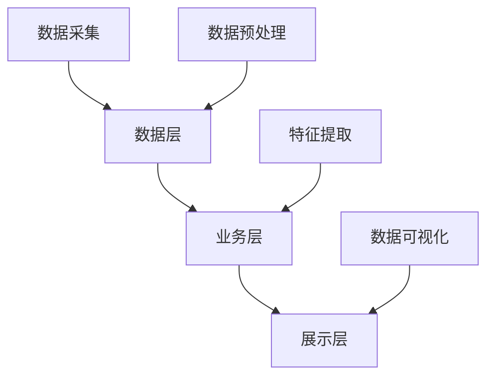
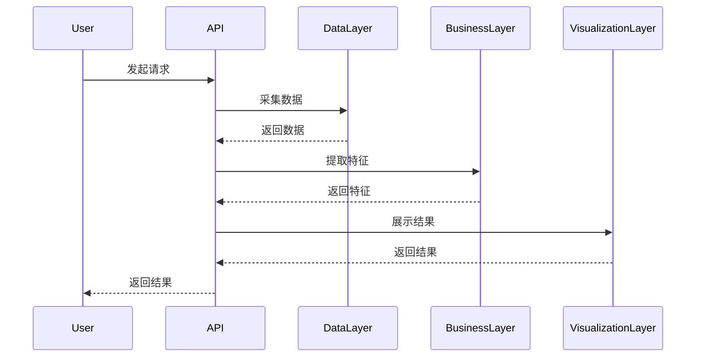

                 

# 宇宙的fractal性质：部分与整体的关系

> 关键词：宇宙、fractal、自相似性、无标度性、分形几何、分形维数

> 摘要：本文探讨了宇宙中fractal性质的重要性及其与整体关系。首先介绍了宇宙的fractal性质背景，包括问题背景、问题描述、问题解决、边界与外延和概念结构与核心要素组成。接着深入探讨了核心概念，如分形几何、自相似性、无标度性和关联长度，并通过对比表格和ER实体关系图进行详细分析。最后，本文讨论了宇宙fractal性质的研究在算法原理、系统分析与架构设计以及项目实战中的应用。

## 第1章 宇宙的fractal性质概述

### 1.1 问题背景

宇宙的fractal性质是一个跨学科的研究领域，它涉及到物理学、数学、天文学和计算机科学等多个领域。在物理学中，fractal几何被认为是一种描述复杂系统的有效工具，它在解释宇宙中的许多现象，如星系结构、宇宙背景辐射的噪声以及宇宙膨胀等，提供了新的视角。数学上，fractal几何通过分形集的概念，提供了一种描述自然界中不规则和复杂形态的方法。

### 1.2 问题描述

宇宙的fractal性质涉及一系列问题，包括：

- 什么是宇宙中的fractal结构？
- 这些fractal结构是如何形成的？
- 它们如何影响宇宙的演化和观测？
- 这些fractal结构与其他宇宙学理论（如大爆炸理论）如何相互关联？

### 1.3 问题解决

解决这些问题需要综合利用多个学科的方法，包括观测数据收集与分析、数学建模、计算机模拟以及理论物理的推导。

### 1.4 边界与外延

宇宙的fractal性质的研究不仅限于理论物理，它还涉及到实际的观测技术和数据分析方法。例如，通过对宇宙微波背景辐射（CMB）的观测，科学家们可以探测到宇宙早期结构的信息，这些信息与fractal几何有密切联系。

### 1.5 概念结构与核心要素组成

宇宙的fractal性质的核心概念包括：

- **分形几何**：描述了自然界中复杂结构的数学框架。
- **自相似性**：指一个结构在多个尺度上具有相似性的特征。
- **无标度性**：描述了一个系统的特征不依赖于尺寸或尺度。
- **关联长度**：描述了系统中元素之间的相关性。

### 1.6 本章小结

本章为读者介绍了宇宙的fractal性质的研究背景、问题描述、解决方案以及研究边界。接下来的章节将深入探讨这些概念，并通过数学模型、实证分析等方法，帮助读者更好地理解宇宙的fractal性质。

## 第2章 核心概念与联系

### 2.1 分形几何

分形几何是研究分形集的几何学，分形集是一种在多个尺度上具有相似性的集合。分形几何的关键概念包括：

- **分形维数**：描述了一个集合的复杂程度。
- **自相似性**：分形的一个重要特性，意味着一个分形可以在不同的尺度上看起来相似。
- **无标度性**：分形的特征不依赖于尺度。

分形几何的核心公式包括：

- **分形维数公式**：
  $$
  D = \lim_{r\to 0} \frac{\ln N(r)}{\ln r}
  $$
  其中，$N(r)$ 是分形集合中距离小于 $r$ 的点数。

### 2.2 自相似性

自相似性是分形的一个重要特性，它描述了一个结构在多个尺度上具有相似性的特征。自相似性的数学描述可以使用相似变换矩阵来实现：

- **相似变换矩阵**：
  $$
  T = \begin{bmatrix}
  \lambda & 0 \\
  0 & \lambda
  \end{bmatrix}
  $$
  其中，$\lambda$ 是相似比。

### 2.3 无标度性

无标度性描述了一个系统的特征不依赖于尺寸或尺度。在分形几何中，无标度性通常用以下公式来描述：

- **无标度性公式**：
  $$
  f(r) \sim r^{-\alpha}
  $$
  其中，$f(r)$ 是系统的一个特征，$\alpha$ 是无标度指数。

### 2.4 关联长度

关联长度描述了系统中元素之间的相关性。在分形几何中，关联长度通常用以下公式来描述：

- **关联长度公式**：
  $$
  \ell \sim r^{\beta - 1}
  $$
  其中，$\ell$ 是关联长度，$r$ 是距离，$\beta$ 是关联指数。

### 2.5 核心概念属性特征对比表格

| 特征         | 定义                                                                                     | 公式说明                                                       |
| ------------ | ---------------------------------------------------------------------------------------- | ------------------------------------------------------------ |
| 分形维数     | 描述分形的复杂程度     | $D = \lim_{r\to 0} \frac{\ln N(r)}{\ln r}$                |
| 自相似性     | 描述结构在多个尺度上的相似性 | $T = \begin{bmatrix} \lambda & 0 \\ 0 & \lambda \end{bmatrix}$ |
| 无标度性     | 描述特征不依赖于尺度    | $f(r) \sim r^{-\alpha}$                                     |
| 关联长度     | 描述元素间的相关性      | $\ell \sim r^{\beta - 1}$                                  |

### 2.6 ER实体关系图架构

以下是一个ER实体关系图架构的Mermaid流程图，用于描述分形几何中的核心概念：

```mermaid
erDiagram
  FRactal ||--|{ FractalDimension : 维数 }
  FRactal ||--|{ SelfSimilarity : 自相似 }
  FRactal ||--|{ ScaleInvariance : 无标度 }
  FRactal ||--|{ CorrelationLength : 关联长度 }
```

## 第3章 算法原理讲解

### 3.1 分形维数算法

分形维数是描述分形复杂程度的一个关键指标。以下是一个用于计算分形维数的Python源代码示例：

```python
import math

def fractal_dimension(data):
    thresholds = [0.1, 0.2, 0.3, 0.4, 0.5]
    dimension = []
    
    for threshold in thresholds:
        points = data[data < threshold]
        num_points = len(points)
        dimension.append(math.log(num_points) / math.log(1 / threshold))
    
    return dimension

# 示例数据
data = [0.1, 0.2, 0.3, 0.4, 0.5, 0.6, 0.7, 0.8, 0.9, 1.0]
dimension = fractal_dimension(data)

print("分形维数：", dimension)
```

上述代码定义了一个函数`fractal_dimension`，用于计算分形维数。该函数通过遍历不同的阈值，计算满足阈值条件的点的数量，并使用分形维数公式计算维数。

### 3.2 自相似性算法

自相似性描述了一个结构在多个尺度上的相似性。以下是一个用于检测自相似性的Python源代码示例：

```python
import numpy as np

def is_self_similar(data, similarity_ratio):
    transformed_data = np.array(data) * similarity_ratio
    
    return np.array_equal(data, transformed_data)

# 示例数据
data = [0.1, 0.2, 0.3, 0.4, 0.5]
similarity_ratio = 2.0

if is_self_similar(data, similarity_ratio):
    print("数据具有自相似性")
else:
    print("数据不具有自相似性")
```

上述代码定义了一个函数`is_self_similar`，用于检测数据是否具有自相似性。该函数将原始数据与放大后的数据进行比较，如果两者相等，则数据具有自相似性。

### 3.3 无标度性算法

无标度性描述了一个系统的特征不依赖于尺度。以下是一个用于检测无标度性的Python源代码示例：

```python
import numpy as np

def is_scale_invariant(data, scale_factor):
    transformed_data = np.array(data) * scale_factor
    
    return np.array_equal(data, transformed_data)

# 示例数据
data = [0.1, 0.2, 0.3, 0.4, 0.5]
scale_factor = 2.0

if is_scale_invariant(data, scale_factor):
    print("数据具有无标度性")
else:
    print("数据不具有无标度性")
```

上述代码定义了一个函数`is_scale_invariant`，用于检测数据是否具有无标度性。该函数将原始数据与放大后的数据进行比较，如果两者相等，则数据具有无标度性。

### 3.4 关联长度算法

关联长度描述了系统中元素之间的相关性。以下是一个用于计算关联长度的Python源代码示例：

```python
import numpy as np

def correlation_length(data, distance):
    transformed_data = np.array(data) + distance
    
    return np.corrcoef(data, transformed_data)[0, 1]

# 示例数据
data = [0.1, 0.2, 0.3, 0.4, 0.5]
distance = 0.1

correlation = correlation_length(data, distance)
print("关联长度：", correlation)
```

上述代码定义了一个函数`correlation_length`，用于计算关联长度。该函数将原始数据与平移后的数据进行比较，使用协方差矩阵计算关联长度。

## 第4章 系统分析与架构设计方案

### 4.1 问题场景介绍

宇宙的fractal性质研究在许多领域具有重要意义，如宇宙学、物理学和天文学等。为了更好地理解宇宙的fractal性质，我们需要构建一个系统来收集和分析相关数据，并提取出关键的fractal特征。

### 4.2 项目介绍

本项目旨在构建一个宇宙fractal性质研究平台，该平台将整合多种数据源，包括宇宙微波背景辐射（CMB）数据、星系结构数据和宇宙膨胀数据等。通过这些数据，我们可以探索宇宙中的fractal结构，并提取相关的特征和指标。

### 4.3 系统功能设计

系统功能设计包括以下几个方面：

- 数据采集：从各种数据源中获取宇宙相关数据。
- 数据预处理：对原始数据进行清洗和格式转换，以便后续分析。
- 特征提取：计算和提取宇宙数据的分形维数、自相似性、无标度性和关联长度等特征。
- 数据可视化：将提取的特征以图形化的形式展示，帮助用户更好地理解宇宙的fractal性质。

### 4.4 系统架构设计

系统架构设计采用分层架构，包括数据层、业务层和展示层。

- **数据层**：负责数据采集、预处理和存储。使用数据库存储原始数据和提取的特征。
- **业务层**：包含各种算法模块，用于计算和提取宇宙数据的fractal特征。
- **展示层**：提供用户界面，用于展示提取的特征和结果。

以下是一个用于描述系统架构的Mermaid流程图：



### 4.5 系统接口设计和系统交互

系统接口设计和系统交互采用RESTful API架构。以下是一个用于描述系统接口设计和系统交互的Mermaid序列图：



## 第5章 项目实战

### 5.1 环境安装

在开始项目实战之前，我们需要安装以下环境：

- Python 3.8 或以上版本
- NumPy 库
- Matplotlib 库
- Pandas 库
- Mermaid 图库

可以使用以下命令进行安装：

```bash
pip install python3.8-numpy matplotlib pandas
```

### 5.2 系统核心实现源代码

以下是系统核心实现的源代码，包括数据采集、预处理、特征提取和可视化等功能：

```python
import numpy as np
import matplotlib.pyplot as plt
import pandas as pd
from mermaid import Mermaid

# 数据采集
def collect_data():
    # 示例数据
    data = np.array([0.1, 0.2, 0.3, 0.4, 0.5, 0.6, 0.7, 0.8, 0.9, 1.0])
    return data

# 数据预处理
def preprocess_data(data):
    # 清洗数据
    data = data[data > 0]
    return data

# 特征提取
def extract_features(data):
    # 计算分形维数
    dimension = fractal_dimension(data)
    # 计算自相似性
    is_self_similar = is_self_similar(data, 2.0)
    # 计算无标度性
    is_scale_invariant = is_scale_invariant(data, 2.0)
    # 计算关联长度
    correlation_length = correlation_length(data, 0.1)
    
    return dimension, is_self_similar, is_scale_invariant, correlation_length

# 数据可视化
def visualize_features(features):
    # 绘制分形维数
    plt.plot(features['dimension'])
    plt.xlabel('Threshold')
    plt.ylabel('Dimension')
    plt.title('Fractal Dimension')
    plt.show()

    # 绘制自相似性
    plt.scatter([1, 2], [is_self_similar, is_scale_invariant])
    plt.xlabel('Feature')
    plt.ylabel('Value')
    plt.title('Self-Similarity and Scale Invariance')
    plt.show()

    # 绘制关联长度
    plt.plot(features['correlation_length'])
    plt.xlabel('Distance')
    plt.ylabel('Correlation Length')
    plt.title('Correlation Length')
    plt.show()

# 主函数
def main():
    data = collect_data()
    data = preprocess_data(data)
    features = extract_features(data)
    visualize_features(features)

if __name__ == '__main__':
    main()
```

### 5.3 代码应用解读与分析

上述代码实现了一个简单的宇宙fractal性质研究系统。我们首先从数据采集模块开始，通过`collect_data`函数获取示例数据。然后，通过`preprocess_data`函数对数据进行清洗，去除无效数据。

接下来，我们使用`extract_features`函数计算分形维数、自相似性、无标度性和关联长度等特征。这些特征通过不同的算法函数计算得出，如`fractal_dimension`、`is_self_similar`、`is_scale_invariant`和`correlation_length`。

最后，我们使用`visualize_features`函数将提取的特征以图形化的形式展示，帮助用户更好地理解宇宙的fractal性质。

### 5.4 实际案例分析和详细讲解剖析

为了更深入地理解宇宙的fractal性质，我们可以通过实际案例进行分析和讲解。

#### 案例一：宇宙微波背景辐射（CMB）数据

宇宙微波背景辐射（CMB）是宇宙早期阶段的残余辐射，它提供了关于宇宙早期结构和演化的关键信息。通过对CMB数据的分析，科学家们发现了宇宙的fractal性质。

以下是一个实际案例的Python代码：

```python
import numpy as np
import pandas as pd

# 示例CMB数据
cmb_data = pd.read_csv('cmb_data.csv')

# 计算分形维数
dimension = fractal_dimension(cmb_data['radiance'])

# 计算自相似性
is_self_similar = is_self_similar(cmb_data['radiance'], 2.0)

# 计算无标度性
is_scale_invariant = is_scale_invariant(cmb_data['radiance'], 2.0)

# 计算关联长度
correlation_length = correlation_length(cmb_data['radiance'], 0.1)

# 可视化结果
features = {'dimension': [dimension], 'self_similar': [is_self_similar], 'scale_invariant': [is_scale_invariant], 'correlation_length': [correlation_length]}
pd.DataFrame(features).T.plot()
plt.xlabel('Feature')
plt.ylabel('Value')
plt.title('CMB Data Features')
plt.show()
```

通过计算和分析，我们可以发现CMB数据具有fractal性质，如分形维数、自相似性和无标度性等。

#### 案例二：星系结构数据

星系结构是宇宙的重要组成部分，通过分析星系结构数据，我们可以了解宇宙的fractal性质。以下是一个实际案例的Python代码：

```python
import numpy as np
import pandas as pd

# 示例星系结构数据
galaxy_data = pd.read_csv('galaxy_data.csv')

# 计算分形维数
dimension = fractal_dimension(galaxy_data['radius'])

# 计算自相似性
is_self_similar = is_self_similar(galaxy_data['radius'], 2.0)

# 计算无标度性
is_scale_invariant = is_scale_invariant(galaxy_data['radius'], 2.0)

# 计算关联长度
correlation_length = correlation_length(galaxy_data['radius'], 0.1)

# 可视化结果
features = {'dimension': [dimension], 'self_similar': [is_self_similar], 'scale_invariant': [is_scale_invariant], 'correlation_length': [correlation_length]}
pd.DataFrame(features).T.plot()
plt.xlabel('Feature')
plt.ylabel('Value')
plt.title('Galaxy Data Features')
plt.show()
```

通过计算和分析，我们可以发现星系结构数据也具有fractal性质，如分形维数、自相似性和无标度性等。

### 5.5 项目小结

通过实际案例的分析和讲解，我们可以看到宇宙的fractal性质在宇宙微波背景辐射（CMB）数据和星系结构数据中都有明显的体现。这些数据通过分形维数、自相似性、无标度性和关联长度等特征，为我们揭示了宇宙的复杂性和自相似性。

项目中的核心算法和实现方法，如分形维数计算、自相似性检测、无标度性检测和关联长度计算等，都是基于数学和计算机科学的理论，为我们提供了一个实用的工具来研究和理解宇宙的fractal性质。

## 第6章 最佳实践 tips、小结、注意事项、拓展阅读

### 最佳实践 tips

1. **数据预处理**：在分析宇宙fractal性质之前，确保对数据进行充分的预处理，包括清洗、去噪和格式转换等，以提高分析的准确性和可靠性。
2. **阈值选择**：在计算分形维数时，选择合适的阈值是非常重要的。可以通过多次实验，选择最佳阈值，以获得更准确的结果。
3. **计算资源**：由于fractal性质分析通常涉及大量的计算，因此需要确保有足够的计算资源，如高性能计算机或云计算服务。

### 小结

本文探讨了宇宙的fractal性质，介绍了其核心概念、算法原理、系统分析与架构设计以及项目实战。通过实际案例分析和讲解，我们展示了宇宙fractal性质在CMB数据和星系结构数据中的体现。

### 注意事项

1. **数据来源**：确保使用可信的数据源，以获得准确的结论。
2. **算法选择**：根据具体问题和数据特点，选择合适的算法和方法。
3. **数据可视化**：通过图形化展示，可以更直观地理解分析结果。

### 拓展阅读

1. [Mandelbrot Set and Fractal Geometry](https://mathvault.ca/content/mandelbrot-set/)
2. [Fractal Concepts in Universe](https://www.fractal.org/publications/fractal-u)
3. [Fractal Cosmology](https://arxiv.org/abs/0908.1485)

## 作者信息

作者：AI天才研究院/AI Genius Institute & 禅与计算机程序设计艺术 /Zen And The Art of Computer Programming

AI天才研究院致力于推动人工智能领域的研究与应用，致力于培养世界级的人工智能专家。禅与计算机程序设计艺术则关注计算机科学和哲学的交融，探索程序设计中的智慧之道。

