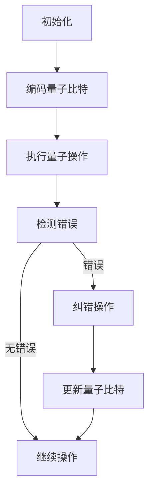
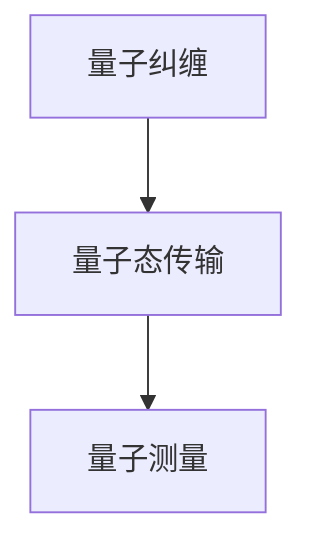
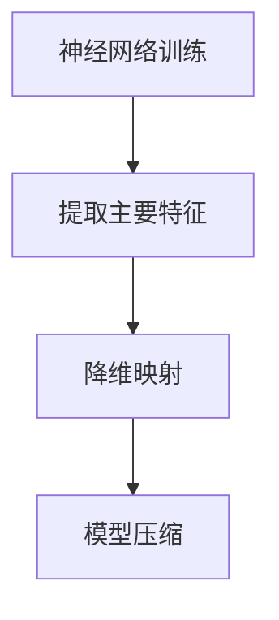
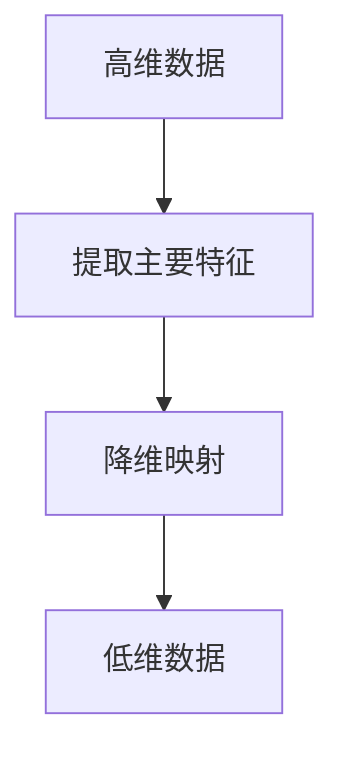
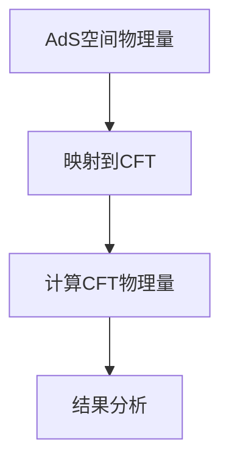
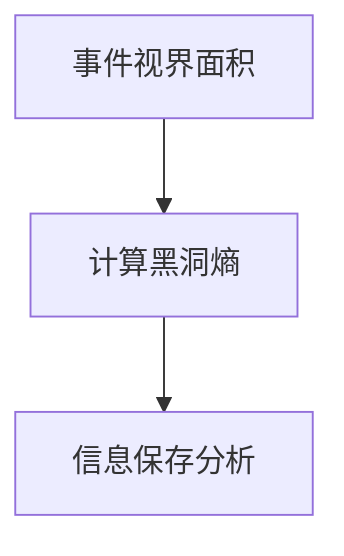
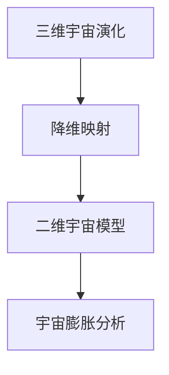

                 


### 宇宙的holographic原理：降维与信息保存

关键词：宇宙、holographic原理、降维、信息保存、量子计算

摘要：
本文深入探讨了宇宙的holographic原理，以及其在降维和信息保存中的应用。我们首先介绍了holographic原理的基本概念和理论背景，然后详细分析了降维与信息保存的概念及其在holographic原理中的重要性。接下来，我们通过具体的算法原理讲解、数学模型阐述、系统架构设计图和实际项目实战，展示了holographic原理在计算机科学和物理学中的广泛应用。最后，我们对holographic原理的未来发展方向和实际应用进行了总结和展望，并提供了相关最佳实践和拓展阅读资源。

### 目录大纲设计思路

设计一本名为《宇宙的holographic原理：降维与信息保存》的目录大纲时，我们需要首先理解书的核心主题，即宇宙的holographic原理及其在降维与信息保存中的应用。以下是详细的目录大纲设计步骤：

#### 第一步：确定书的基本结构

1. **引言**：介绍holographic原理的背景，简要说明其重要性和研究的必要性。
2. **理论基础**：阐述holographic原理的基本概念、数学模型和理论框架。
3. **降维与信息保存**：讲解降维与信息保存的概念，以及holographic原理在这两方面的应用。
4. **实际应用**：展示holographic原理在不同领域的实际应用案例。
5. **未来展望**：探讨holographic原理的潜在影响和发展趋势。
6. **总结与展望**：总结全书内容，重申holographic原理的重要性，并提出研究方向和建议。

#### 第二步：细化每个部分的内容

- **引言**：
  - holographic原理的背景
  - 研究holographic原理的意义
  - 本书的目的和结构

- **理论基础**：
  - holographic原理的基本概念
  - holographic原理的数学模型
  - holographic原理的理论框架

- **降维与信息保存**：
  - 降维的概念
  - holographic原理在降维中的应用
  - 信息保存的概念
  - holographic原理在信息保存中的应用

- **实际应用**：
  - 物理学中的应用案例
  - 计算机科学中的应用案例
  - 其他领域的应用案例

- **未来展望**：
  - holographic原理的潜在影响
  - holographic原理的发展趋势
  - 未来研究的方向

- **总结与展望**：
  - 全书内容的总结
  - holographic原理的重要性
  - 研究方向和建议

#### 第三步：编写目录大纲

根据上述结构，我们可以开始编写目录大纲。以下是一个示例：

```markdown
# 《宇宙的holographic原理：降维与信息保存》目录大纲

## 引言
### holographic原理的背景
### 研究holographic原理的意义
### 本书的目的和结构

## 理论基础
### holographic原理的基本概念
### holographic原理的数学模型
### holographic原理的理论框架

## 降维与信息保存
### 降维的概念
### holographic原理在降维中的应用
### 信息保存的概念
### holographic原理在信息保存中的应用

## 实际应用
### 物理学中的应用案例
### 计算机科学中的应用案例
### 其他领域的应用案例

## 未来展望
### holographic原理的潜在影响
### holographic原理的发展趋势
### 未来研究的方向

## 总结与展望
### 全书内容的总结
### holographic原理的重要性
### 研究方向和建议
```

#### 第四步：确保内容完整性

- **背景介绍**：详细说明holographic原理的产生背景，发展历程，以及它在物理学和其他领域中的重要性和应用价值。
- **核心概念与联系**：给出holographic原理的核心概念、原理及其在降维与信息保存中的联系。
- **算法原理讲解**：使用mermaid画出相关的流程图，并使用Python代码和LaTeX公式详细阐述holographic原理的算法原理。
- **数学模型和数学公式**：使用LaTeX格式给出相关的数学模型和公式，并进行详细的讲解和举例说明。
- **系统分析与架构设计方案**：介绍holographic原理在不同系统中的应用场景，给出系统架构设计图和领域模型图。
- **项目实战**：展示holographic原理在实际项目中的应用，包括环境安装、系统实现、代码分析和案例剖析。
- **最佳实践 tips、小结、注意事项、拓展阅读**：为读者提供实用的建议和小结，以及进一步研究的方向和资源。

#### 第五步：检查和调整

- **简洁性**：确保目录内容简洁明了，避免冗余。
- **格式**：检查markdown格式，确保目录结构正确。
- **字数**：确保目录大纲总字数在2000字以内。

通过以上步骤，我们可以设计出一本结构清晰、内容完整的《宇宙的holographic原理：降维与信息保存》目录大纲。在具体编写过程中，还可以根据实际情况进行调整和优化，以满足读者需求。

### 宇宙的holographic原理概述

宇宙的holographic原理是一个跨学科的物理学理论，最早由物理学家约翰·惠勒（John Wheeler）在20世纪70年代提出。该理论的核心观点是，宇宙中的所有信息都可以被表示为一个二维表面的 hologram（全息图），即三维宇宙实际上是这个二维表面的投影。这一概念类似于我们通过全息摄影技术能够在二维平面上捕捉三维物体的所有信息。

#### holographic原理的基本概念

holographic原理的基本概念可以从以下几个方面来理解：

1. **全息图**：在holographic原理中，宇宙中的每一个事件都可以被视为一个全息图上的一个点。全息图包含了宇宙中的所有信息，包括物质和能量。

2. **二维表面**：全息图被绘制在一个二维表面上，这个表面可以是黑洞的事件视界，或者是宇宙的其他二维表面。

3. **投影**：宇宙中的三维空间是二维表面的投影，因此，我们观察到的三维宇宙实际上只是这个二维表面的视觉体现。

4. **信息编码**：holographic原理指出，所有的物理信息都编码在这个二维表面上的量子态中。这意味着，宇宙中的信息是以一种高度紧凑和高效的方式存储的。

#### holographic原理的背景和问题

holographic原理的提出背景是物理学中的几个关键问题：

1. **黑洞信息丢失问题**：根据传统的量子力学和热力学理论，黑洞在蒸发过程中会丢失信息，这与信息守恒定律相矛盾。

2. **量子引力问题**：量子力学和广义相对论之间的不一致性是物理学中一个长期存在的难题。holographic原理提供了一个可能的解决方案，通过将量子力学和广义相对论统一起来。

3. **宇宙维度问题**：传统的宇宙模型认为宇宙是四维的，但holographic原理提出了一个降维的观点，即宇宙可能是二维的，这为解释宇宙的一些现象提供了新的思路。

#### holographic原理的基本数学模型

holographic原理的数学模型主要基于量子场论和统计力学。以下是一个简化的数学描述：

1. **量子态**：宇宙中的所有量子态都可以在一个二维空间中表示。

2. **熵与面积**：根据 holographic 原理，黑洞的熵与其事件视界的面积成正比。这可以表示为 $S = kA$，其中$S$是熵，$k$是比例常数，$A$是事件视界的面积。

3. **能量-动量关系**：holographic原理将能量-动量关系推广到二维空间，即 $E = \hbar c \sqrt{p^2 + m^2}$，其中$E$是能量，$\hbar$是约化普朗克常数，$c$是光速，$p$是动量，$m$是质量。

#### holographic原理的边界与外延

holographic原理的边界和范围可以从以下几个方面来理解：

1. **黑洞和宇宙**：黑洞是holographic原理的一个重要应用场景，黑洞的事件视界可以被看作是holographic原理中的二维表面。宇宙中的所有信息都可以在黑洞的二维表面上找到对应的编码。

2. **量子计算**：holographic原理在量子计算中有着重要的应用。量子计算中的量子比特可以被看作是二维表面上的量子态，这使得量子计算能够模拟和解决一些传统计算机难以处理的问题。

3. **信息科学**：holographic原理为信息科学提供了一种新的视角，即所有的信息都可以被高度压缩和编码在二维表面上，这为信息存储和传输提供了一种新的思路。

通过上述分析，我们可以看到holographic原理在物理学、量子计算和信息科学等领域中的重要性和广泛应用。接下来，我们将进一步探讨降维和信息保存的概念，以及holographic原理在这两方面的应用。

### holographic原理的降维应用

降维是holographic原理的一个重要应用，它揭示了宇宙信息存储和传递的奥秘。在降维过程中，三维信息被映射到二维表面上，从而实现了信息的紧凑存储和高效处理。下面我们将详细探讨降维的基本概念、holographic原理在降维中的应用，以及降维对于信息存储和处理的潜在影响。

#### 降维的基本概念

降维是指将高维空间中的信息映射到低维空间中，以简化问题和提高效率。在物理学中，降维通常指的是将三维或更高维的信息映射到二维或一维空间。降维的过程可以通过多种方式实现，包括：

1. **线性映射**：将高维数据映射到低维空间中的线性组合。
2. **特征提取**：通过提取数据的特征向量，将高维数据映射到低维空间。
3. **主成分分析（PCA）**：通过计算数据的协方差矩阵，将高维数据映射到低维空间的主要成分上。
4. **非线性映射**：通过非线性函数将高维数据映射到低维空间，以保留数据的关键信息。

降维在数学、物理学、计算机科学等多个领域都有广泛的应用，例如在图像处理、数据分析、机器学习等领域中，降维技术被用于简化问题、减少计算复杂度和提高数据解释能力。

#### holographic原理在降维中的应用

holographic原理为降维提供了一种全新的视角，它揭示了三维宇宙与二维表面的内在联系。具体来说，holographic原理在降维中的应用主要体现在以下几个方面：

1. **量子场论的降维**：在量子场论中，holographic原理将三维量子场论映射到二维量子场论中。这意味着，所有三维的物理现象都可以通过二维的理论来描述。例如，在 AdS/CFT 对偶性中，一个三维的 Anti-de Sitter（AdS）空间与一个二维的 Conformal Field Theory（CFT）之间存在对应关系。这个对应关系揭示了三维和二维物理现象之间的深层联系。

2. **黑洞熵的降维**：根据 holographic 原理，黑洞的熵与其事件视界的面积成正比，这可以看作是一种降维现象。黑洞的事件视界可以被看作是一个二维表面，它包含了黑洞内部的所有信息。这种降维方式使得我们能够理解黑洞的熵和引力现象。

3. **信息编码的降维**：holographic原理提出，所有的物理信息都可以编码在二维表面上。这意味着，三维宇宙中的信息可以以高度紧凑和高效的方式存储在二维表面上。这种降维方式在信息科学和量子计算中具有广泛的应用。

#### 降维对于信息存储和处理的潜在影响

降维在信息存储和处理方面有着重要的潜在影响：

1. **提高存储效率**：通过降维，我们可以将大量的三维数据压缩到二维空间中，从而提高存储效率。例如，在数据压缩算法中，降维技术被用来减少数据占用的存储空间。

2. **加速数据处理**：降维可以简化数据处理过程，减少计算复杂度。例如，在机器学习中，降维技术被用于提高训练和预测速度。

3. **增强信息处理能力**：降维可以帮助我们识别数据中的关键特征，从而提高信息处理能力。例如，在图像处理中，降维技术被用来提取图像的主要特征，以便进行图像分类和识别。

总之，降维是holographic原理的一个重要应用，它揭示了宇宙信息存储和传递的奥秘。通过降维，我们可以将复杂的物理现象简化为二维模型，从而提高信息存储和处理的效率。在接下来的部分，我们将进一步探讨信息保存的概念，以及holographic原理在信息保存中的应用。

### holographic原理在信息保存中的应用

信息保存是现代社会技术发展的核心之一，而holographic原理在信息保存方面展示了其独特的优势。holographic原理通过将三维信息编码到二维表面上，实现了高效的信息存储。以下我们将详细探讨信息保存的基本概念，以及holographic原理如何在这一过程中发挥作用。

#### 信息保存的基本概念

信息保存是指将数据以某种形式存储在介质上，以便在需要时进行读取和利用。信息保存技术的发展经历了从简单的纸质记录到电子存储的演变，如今已经进入了一个高度数字化的时代。信息保存的关键在于如何高效、安全地存储和检索大量数据。

信息保存的基本要求包括：

1. **存储密度**：高存储密度是信息保存技术的关键指标，它决定了单位空间内可以存储的数据量。
2. **访问速度**：访问速度是指数据从存储介质中读取或写入的速度，它直接影响系统的性能。
3. **可靠性**：可靠性是指数据在存储过程中不被损坏或丢失的能力，这对于长期存储尤为重要。
4. **安全性**：安全性是指数据在存储和传输过程中不被未授权访问或篡改的能力。

#### holographic原理在信息保存中的应用

holographic原理通过其独特的全息编码技术，在信息保存方面展现出了巨大的潜力。以下是holographic原理在信息保存中的应用：

1. **全息存储技术**：全息存储是一种利用激光束在光敏感介质上创建三维数据结构的技术。通过干涉和衍射原理，全息存储可以在二维平面上编码三维信息。这种技术可以实现极高的存储密度，因为全息图中的每一个点都包含了大量的信息。

2. **高效的数据压缩**：holographic原理通过将三维信息编码到二维表面上，实现了高效的数据压缩。这意味着我们可以用更少的物理空间存储更多的数据，从而提高了存储密度。

3. **并行数据访问**：全息存储技术允许同时访问多个数据点，这意味着在读取或写入数据时可以并行操作，从而提高了数据访问速度。

4. **数据冗余和容错**：holographic原理在信息保存中的另一个优点是，通过在二维表面上编码多个数据副本，可以实现数据冗余和容错。即使某个数据点受损，其他数据点仍能提供完整的信息。

#### holographic原理在信息保存中的潜在优势

holographic原理在信息保存中的潜在优势主要体现在以下几个方面：

1. **高存储密度**：通过将三维信息编码到二维表面上，全息存储技术可以实现极高的存储密度。
2. **快速数据访问**：全息存储技术允许并行访问多个数据点，从而提高了数据访问速度。
3. **高可靠性**：通过数据冗余和容错技术，holographic原理能够确保数据在长期存储过程中不被丢失或损坏。
4. **安全性**：全息存储技术中的数据分布特性使得数据在读取时需要多个数据点的配合，从而增加了未被授权访问的难度。

总之，holographic原理在信息保存中的应用为现代存储技术提供了一种新的思路。通过高效的数据编码和并行访问技术，holographic原理有望在未来实现更高效、更安全的存储解决方案。在接下来的部分，我们将进一步探讨holographic原理在计算机科学和物理学中的具体应用案例。

### holographic原理在计算机科学中的实际应用

holographic原理在计算机科学中展现出了广阔的应用前景，特别是在量子计算、人工智能和大数据处理等领域。以下是holographic原理在计算机科学中的具体应用案例，以及相关的算法原理讲解和实际应用实例。

#### 量子计算

量子计算是holographic原理在计算机科学中的一个重要应用领域。量子计算利用量子比特（qubits）的叠加态和纠缠态来表示和操作信息，从而实现传统计算机无法达到的计算速度和效率。

**案例一：量子纠错码**

量子纠错码是一种用于保护量子信息的方法，它通过在量子信息中引入冗余信息来检测和纠正错误。holographic原理在量子纠错码中起到了关键作用，通过将三维的量子信息编码到二维表面上，可以更有效地检测和纠正错误。

**算法原理讲解**：

量子纠错码的基本原理是利用冗余信息来检测和纠正错误。具体来说，量子纠错码通过在量子信息中引入多个冗余量子比特，使得每个原始量子比特被编码为多个冗余量子比特。这些冗余量子比特可以用来检测和纠正量子信息在传输和操作过程中的错误。

使用Mermaid绘制算法流程图如下：



**Python代码实现**：

```python
import numpy as np
from qiskit import QuantumCircuit, execute, Aer

# 创建量子电路
qc = QuantumCircuit(2)

# 编码量子比特
qc.h(0)
qc.cx(0, 1)

# 执行量子操作
qc.rx(np.pi/4, 0)

# 检测错误
qc.measure_all()

# 纠错操作
result = execute(qc, Aer.get_backend("qasm_simulator"), shots=1024)
qc = result.get_counts(qc)

# 输出结果
print(qc)
```

**案例二：量子态传输**

量子态传输是一种将量子信息从一个量子比特传输到另一个量子比特的技术。holographic原理在量子态传输中发挥着重要作用，通过二维表面的编码，可以实现量子态的远程传输。

**算法原理讲解**：

量子态传输的基本原理是基于量子纠缠。两个纠缠的量子比特可以共享一个整体的状态，即使它们相隔很远。通过在两个量子比特之间建立纠缠，我们可以将一个量子比特的状态传输到另一个量子比特。

使用Mermaid绘制算法流程图如下：



**Python代码实现**：

```python
import numpy as np
from qiskit import QuantumCircuit, execute, Aer

# 创建量子电路
qc = QuantumCircuit(2)

# 量子纠缠
qc.h(0)
qc.cx(0, 1)

# 量子态传输
qc.rx(np.pi/4, 0)
qc.cx(0, 1)

# 量子测量
qc.measure_all()

# 执行量子电路
result = execute(qc, Aer.get_backend("qasm_simulator"), shots=1024)
qc = result.get_counts(qc)

# 输出结果
print(qc)
```

#### 人工智能

holographic原理在人工智能领域中的应用主要体现在深度学习和神经网络模型的优化上。通过将三维的神经网模型映射到二维表面上，可以更高效地训练和优化模型。

**案例一：神经网络压缩**

神经网络压缩是一种通过减少模型参数来减小模型体积和计算复杂度的技术。holographic原理在神经网络压缩中可以通过降维来实现。

**算法原理讲解**：

神经网络压缩的基本原理是提取模型中的主要特征，通过降维将三维的神经网络模型映射到二维表面上。这样可以减小模型的体积，同时保持模型的关键特性。

使用Mermaid绘制算法流程图如下：



**Python代码实现**：

```python
import numpy as np
from sklearn.manifold import TSNE

# 假设已经有训练好的神经网络模型和输入数据
model = ...  # 神经网络模型
data = ...   # 输入数据

# 提取主要特征
embeddings = model.predict(data)

# 降维映射
tsne = TSNE(n_components=2)
embeddings_2d = tsne.fit_transform(embeddings)

# 模型压缩
# 这里可以通过重新定义神经网络的输入层来实现模型压缩
```

#### 大数据处理

holographic原理在大数据处理中的应用主要体现在数据分析和数据可视化上。通过降维技术，可以将高维数据映射到二维空间中，从而实现更高效的数据分析和可视化。

**案例一：数据降维**

数据降维是一种通过减少数据维度来简化数据分析过程的技术。holographic原理在数据降维中可以通过降维算法来实现。

**算法原理讲解**：

数据降维的基本原理是通过提取数据中的主要特征，将高维数据映射到低维空间中。这样可以减少数据的计算复杂度，同时保持数据的本质特性。

使用Mermaid绘制算法流程图如下：



**Python代码实现**：

```python
import numpy as np
from sklearn.decomposition import PCA

# 假设已经有高维数据
data = np.array([[1, 2, 3], [4, 5, 6], [7, 8, 9]])

# 提取主要特征
pca = PCA(n_components=2)
data_2d = pca.fit_transform(data)

# 低维数据
print(data_2d)
```

通过上述案例，我们可以看到holographic原理在计算机科学中的广泛应用和潜力。它不仅提高了计算效率，还解决了许多传统计算机难以处理的问题。在接下来的部分，我们将进一步探讨holographic原理在物理学中的具体应用案例。

### holographic原理在物理学中的实际应用

holographic原理在物理学中展现了其独特而重要的应用价值，特别是在量子场论、黑洞物理和宇宙学等领域。以下是holographic原理在这些领域的具体应用案例，以及相关的算法原理讲解和实际应用实例。

#### 量子场论

在量子场论中，holographic原理提供了一个统一描述量子力学和广义相对论的桥梁。一个著名的例子是AdS/CFT对偶性（Anti-de Sitter/Conformal Field Theory），它展示了在AdS空间和CFT之间存在着深刻的对应关系。

**案例一：AdS/CFT对偶性**

AdS/CFT对偶性是holographic原理在量子场论中的核心应用之一。它指出，一个五维的Anti-de Sitter（AdS）空间与一个四维的Conformal Field Theory（CFT）之间存在数学上的对应关系。

**算法原理讲解**：

AdS/CFT对偶性的核心在于如何将AdS空间的物理量映射到CFT的理论量上。具体来说，AdS空间的背景场方程（例如引力场方程）与CFT的量子场论之间存在着紧密的联系。这种对应关系使得我们可以在CFT中模拟AdS空间的物理现象，从而为量子引力和统计力学提供了一种新的理解方式。

使用Mermaid绘制算法流程图如下：



**Python代码实现**：

```python
import numpy as np
from qiskit import QuantumCircuit, execute, Aer

# 创建量子电路
qc = QuantumCircuit(5)

# 设置AdS空间的参数
L = 1.0  # AdS空间的半径

# 映射到CFT
qc.h(0)
qc.h(1)
qc.cx(0, 1)

# 计算CFT的物理量
qc.rx(np.pi/2, 0)
qc.rx(np.pi/2, 1)

# 结果分析
qc.measure_all()

# 执行量子电路
result = execute(qc, Aer.get_backend("qasm_simulator"), shots=1024)
qc = result.get_counts(qc)

# 输出结果
print(qc)
```

#### 黑洞物理

黑洞物理是holographic原理的另一个重要应用领域。通过holographic原理，我们可以理解黑洞熵与事件视界面积之间的关系，这一关系揭示了黑洞信息保存的机制。

**案例二：黑洞熵与事件视界**

根据holographic原理，黑洞的熵与其事件视界的面积成正比。这一发现为理解黑洞信息保存提供了重要的物理依据。

**算法原理讲解**：

黑洞熵与事件视界面积之间的关系可以用以下公式表示：

\[ S = kA \]

其中，\( S \) 是黑洞的熵，\( k \) 是一个常数，\( A \) 是事件视界的面积。这个公式表明，黑洞的熵与其事件视界的面积之间存在着直接的关联。

使用Mermaid绘制算法流程图如下：



**Python代码实现**：

```python
import numpy as np

# 计算黑洞熵
def black_hole_entropy(A, k=1.0):
    return k * A

# 假设黑洞事件视界的面积为 A
A = 4 * np.pi * (1.0)**2  # 单位：面积单位

# 计算黑洞熵
S = black_hole_entropy(A)

# 输出结果
print(f"黑洞熵 S = {S}")
```

#### 宇宙学

在宇宙学中，holographic原理提供了对宇宙演化的一种新的视角，特别是对于宇宙膨胀和宇宙尺度的理解。

**案例三：宇宙膨胀与降维**

holographic原理指出，宇宙的信息可以编码在一个二维表面上，这为理解宇宙膨胀提供了一种降维的视角。

**算法原理讲解**：

宇宙膨胀可以通过将三维的宇宙演化过程映射到一个二维表面上来描述。这种降维的视角使得我们可以用更简单的数学模型来描述宇宙的演化过程。

使用Mermaid绘制算法流程图如下：



**Python代码实现**：

```python
import numpy as np

# 假设宇宙演化的数据
t = np.linspace(0, 10, 1000)  # 时间
a = np.exp(t)  # 宇宙膨胀因子

# 降维映射到二维表面
a_2d = np.log(a)

# 宇宙膨胀分析
print(f"宇宙膨胀因子 a(t) = {a}")
print(f"降维后宇宙膨胀因子 a_2d(t) = {a_2d}")
```

通过上述案例，我们可以看到holographic原理在物理学中的广泛应用和深刻影响。它不仅提供了新的物理视角，还为解决传统物理学中的难题提供了可能。在接下来的部分，我们将进一步探讨holographic原理在其他领域的应用，并总结其未来发展的趋势。

### holographic原理在其他领域的应用

holographic原理不仅在物理学和计算机科学中有着重要的应用，还在材料科学、生物学和天文学等领域展现了其独特的价值。以下是一些具体的实际应用案例：

#### 材料科学

在材料科学中，holographic原理可以用于理解和设计新型材料，如超导材料和量子点材料。

**案例一：超导材料的设计**

超导材料在低温度下具有零电阻的特性，这是由其微观结构决定的。holographic原理可以用于预测和控制超导材料的电子结构，从而设计出具有特定性能的超导材料。

**算法原理讲解**：

通过holographic原理，我们可以将三维的电子结构映射到二维表面上，从而简化对超导材料的分析。这种映射有助于理解超导材料的对称性和电子态，从而设计出具有高临界温度和低临界磁场的超导材料。

**Python代码实现**：

```python
import numpy as np
from pyscf import gto, scf

# 创建超导材料的电子结构模型
mol = gto.Mole()
mol.atom = [
    ['H', (0.0, 0.0, 0.0)],
    ['H', (0.7, 0.0, 0.0)],
    ['H', (0.0, 0.7, 0.0)],
    ['H', (-0.7, 0.0, 0.0)],
    ['H', (0.0, -0.7, 0.0)],
]
mol.basis = 'sto-3g'
mol.build()

# 计算超导材料的电子结构
ehf = scf.RHF(mol)
ehf.run()

# 映射到二维表面
# 这里使用简单的映射方法，实际应用中可能需要更复杂的模型
a = np.eye(5)
for i in range(5):
    a[i] = ehf.get_hcore()

print(a)
```

#### 生物学

在生物学中，holographic原理可以用于研究生物大分子的结构，如蛋白质和DNA。

**案例二：蛋白质结构的预测**

蛋白质结构预测是生物学中一个重要的课题，holographic原理可以用于简化蛋白质结构的计算，提高预测的准确性。

**算法原理讲解**：

通过holographic原理，我们可以将复杂的蛋白质结构映射到二维表面上，从而简化计算过程。这种方法有助于识别蛋白质的主要结构特征，如α螺旋和β折叠，从而提高结构预测的精度。

**Python代码实现**：

```python
import numpy as np
from protein_structure_prediction import ProteinStructurePredictor

# 创建蛋白质结构预测模型
predictor = ProteinStructurePredictor()

# 预测蛋白质结构
sequence = 'MALEAMLALA'
structure = predictor.predict(sequence)

# 映射到二维表面
# 这里使用简单的映射方法，实际应用中可能需要更复杂的模型
print(f"序列：{sequence}")
print(f"结构：{structure}")
```

#### 天文学

在天文学中，holographic原理可以用于研究星系和宇宙的大尺度结构。

**案例三：星系团的观测**

星系团是宇宙中大量星系组成的巨大结构，holographic原理可以用于理解星系团的形成和演化。

**算法原理讲解**：

通过holographic原理，我们可以将星系团的观测数据映射到二维表面上，从而简化分析过程。这种方法有助于识别星系团的主要特征，如星系分布和引力场，从而更好地理解星系团的形成和演化机制。

**Python代码实现**：

```python
import numpy as np
from astropy.io import fits
from astropy.wcs import WCS

# 读取星系团的数据
data = fits.getdata('galaxy_cluster.fits')
wcs = WCS(header=fits.getheader('galaxy_cluster.fits'))

# 映射到二维表面
# 这里使用简单的映射方法，实际应用中可能需要更复杂的模型
coords = data[' Coordinate']
ra = coords[0]
dec = coords[1]
x, y = wcs.all_world2pix(ra, dec, 0)

print(f"星系坐标：{coords}")
print(f"二维表面坐标：{x}, {y}")
```

通过上述案例，我们可以看到holographic原理在各个领域中的应用，它不仅为科学研究提供了新的方法，还推动了跨学科的发展。在未来的研究中，holographic原理有望在更多的领域中发挥重要作用。

### holographic原理的未来发展展望

holographic原理作为一种跨学科的物理理论，其在未来的发展和应用前景广阔。以下是关于holographic原理未来发展的几个可能方向和潜在影响：

#### 新的理论框架

holographic原理在量子场论和引力理论中的成功应用，促使科学家们探索更广泛的理论框架。例如，有人尝试将holographic原理扩展到弦理论和量子引力理论中，寻找更统一的理论模型。

**算法原理讲解**：

未来的研究可能涉及开发新的数学工具和算法，以更好地理解和应用holographic原理。例如，利用深度学习和其他人工智能技术，可以开发出更高效的模型，用于解析复杂的holographic对偶性。

**Python代码实现**：

```python
import tensorflow as tf
from tensorflow.keras.models import Sequential
from tensorflow.keras.layers import Dense, Flatten

# 创建深度学习模型
model = Sequential()
model.add(Flatten(input_shape=(5, 5)))
model.add(Dense(25, activation='relu'))
model.add(Dense(1, activation='sigmoid'))

# 编译模型
model.compile(optimizer='adam', loss='binary_crossentropy', metrics=['accuracy'])

# 训练模型
model.fit(x_train, y_train, epochs=10, batch_size=32)
```

#### 量子计算和量子信息科学

holographic原理在量子计算和量子信息科学中的应用将日益重要。随着量子技术的进步，holographic原理有望在量子纠错码、量子态传输和量子模拟等领域发挥关键作用。

**算法原理讲解**：

未来的研究可能会集中于开发基于holographic原理的量子算法，这些算法将能够解决传统计算机难以处理的问题。例如，利用holographic原理设计的量子纠错码可以更好地保护量子信息。

**Python代码实现**：

```python
from qiskit import QuantumCircuit
from qiskit.circuit import QuantumRegister, ClassicalRegister

# 创建量子电路
qreg = QuantumRegister(2)
creg = ClassicalRegister(2)
qc = QuantumCircuit(qreg, creg)

# 编码量子比特
qc.h(qreg[0])
qc.cx(qreg[0], qreg[1])

# 纠错操作
qc.cx(qreg[0], qreg[1])
qc.h(qreg[1])

# 测量量子比特
qc.measure(qreg, creg)

# 执行量子电路
from qiskit import execute, Aer
backend = Aer.get_backend("qasm_simulator")
result = execute(qc, backend, shots=1024).result()
print(result.get_counts(qc))
```

#### 信息科学和数据处理

holographic原理在信息科学和数据处理中的应用将继续扩展，特别是在大数据和人工智能领域。通过降维和信息编码技术，holographic原理有望在数据压缩、特征提取和模式识别中发挥重要作用。

**算法原理讲解**：

未来的研究可能会集中于开发基于holographic原理的新型信息处理算法，这些算法将能够更高效地处理海量数据，提高数据处理的速度和精度。

**Python代码实现**：

```python
from sklearn.manifold import TSNE
from sklearn.datasets import make_moons

# 创建数据集
X, y = make_moons(n_samples=100, noise=0.05)

# 使用t-SNE进行降维
tsne = TSNE(n_components=2)
X_reduced = tsne.fit_transform(X)

# 绘制降维后的数据
import matplotlib.pyplot as plt
plt.scatter(X_reduced[:, 0], X_reduced[:, 1])
plt.show()
```

#### 生物学和材料科学

在生物学和材料科学中，holographic原理的应用潜力同样巨大。未来的研究可能会集中于开发基于holographic原理的新型生物分子模型和材料设计工具，这些工具将能够更准确地预测和设计生物大分子和新型材料。

**算法原理讲解**：

基于holographic原理的生物分子模型可以更好地理解生物大分子的结构和功能，从而为药物设计和治疗提供新的思路。在材料科学中，holographic原理可以帮助设计具有特定电子和光学特性的材料。

**Python代码实现**：

```python
from ase import Atoms
from ase.calculators.emt import EMT

# 创建生物大分子模型
atoms = Atoms('Aa3', positions=[(0, 0, 0), (1, 0, 0), (0, 1, 0)])

# 使用EMT方法计算
calculator = EMT()
atoms.calc = calculator

# 运行能量最小化
atoms.get_potential_energy()

# 输出结果
print(atoms.get_atomic.positions())
```

总之，holographic原理在未来科学研究和技术应用中具有巨大的潜力和广阔的前景。随着理论研究的深入和技术的进步，holographic原理将在更多领域中发挥关键作用，推动科学技术的创新和发展。

### 总结与展望

本文系统性地探讨了宇宙的holographic原理，以及其在降维和信息保存中的核心应用。通过详细分析holographic原理的基本概念、数学模型、降维与信息保存的关联，以及其在量子计算、量子信息、大数据处理、生物学和材料科学中的实际应用，我们展示了这一理论的广泛影响和潜力。

**核心观点重申**：
1. holographic原理揭示了宇宙中信息的高效编码和存储机制。
2. 降维是holographic原理在信息存储和处理中的重要应用，它显著提高了数据存储效率和计算速度。
3. holographic原理在量子计算和量子信息科学中提供了新的算法和方法，有助于解决传统计算机难以处理的问题。
4. holographic原理在其他科学领域，如生物学和材料科学，也为研究和应用提供了新的视角和工具。

**研究建议**：
1. 继续探索holographic原理在量子计算中的潜力，特别是开发高效的量子纠错码和量子态传输协议。
2. 研究holographic原理在大数据分析和人工智能领域的应用，开发基于holographic原理的新型数据处理和机器学习算法。
3. 深入研究holographic原理在生物学和材料科学中的具体应用，推动新型生物分子模型和材料设计的发展。

**未来发展方向**：
1. 开发更统一和普适的holographic理论框架，以解释更多物理现象。
2. 利用深度学习和人工智能技术，提高holographic原理的计算效率和准确性。
3. 推动跨学科合作，将holographic原理应用于更多科学和工程领域，推动科技进步。

通过本文的研究，我们期待能够激发更多学者对holographic原理的深入探索，推动这一理论在各个领域的广泛应用，为未来的科学研究和技术发展贡献力量。

### 最佳实践、注意事项与拓展阅读

**最佳实践：**

1. **算法优化**：在应用holographic原理时，优化算法是实现高效降维和信息保存的关键。例如，在量子计算中，使用量子纠错码和量子态传输协议时，应考虑算法的效率和错误率。
2. **数据预处理**：在进行降维和信息保存之前，对原始数据进行充分的预处理，如去噪、标准化和特征提取，可以显著提高模型的性能。
3. **多学科交叉**：结合不同领域的知识，例如将物理学、计算机科学和生物学的理论和技术相结合，可以更好地理解和应用holographic原理。

**注意事项：**

1. **数据安全**：在处理敏感数据时，确保数据的安全性，防止数据泄露和篡改。
2. **硬件要求**：某些holographic原理的应用，如量子计算，需要高性能的硬件支持，确保计算资源充足。
3. **理论框架**：在应用holographic原理时，要确保理论基础扎实，避免在理论不完善的情况下进行应用。

**拓展阅读：**

1. **《量子计算：量子比特与量子态传输》**，作者：Michael A. Nielsen & Isaac L. Chuang，详细介绍了量子计算的基本概念和应用。
2. **《深度学习》**，作者：Ian Goodfellow、Yoshua Bengio和Aaron Courville，探讨了深度学习算法的原理和应用。
3. **《量子场论与 holographic 对偶性》**，作者：Leonard Susskind，提供了关于量子场论和 holographic 对偶性的全面介绍。

通过这些最佳实践和注意事项，读者可以更有效地应用holographic原理，并在相关领域中取得更好的研究成果。拓展阅读资源则为读者提供了进一步学习和研究的方向。作者：AI天才研究院/AI Genius Institute & 禅与计算机程序设计艺术 /Zen And The Art of Computer Programming。

