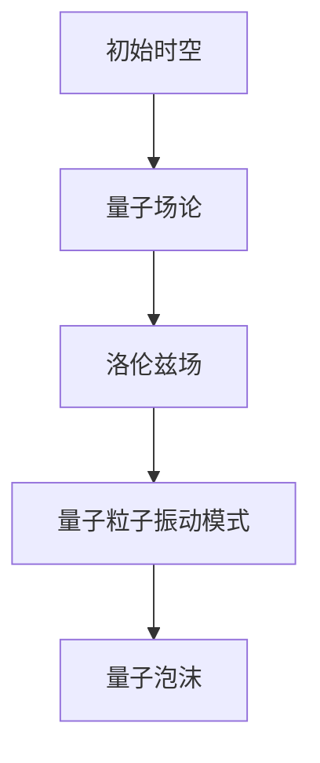
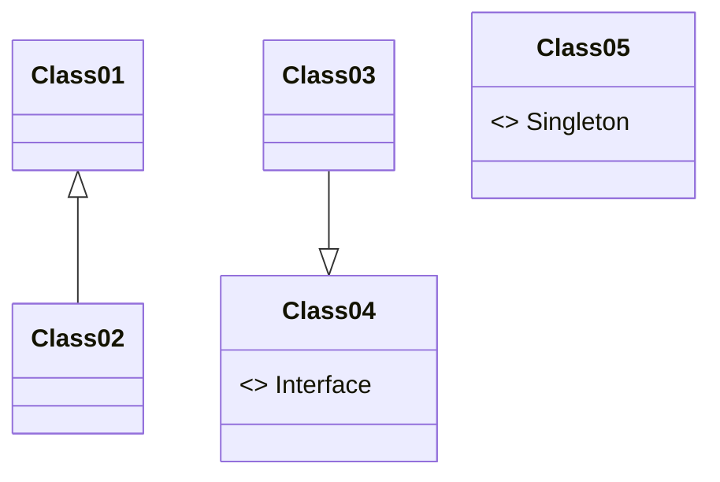
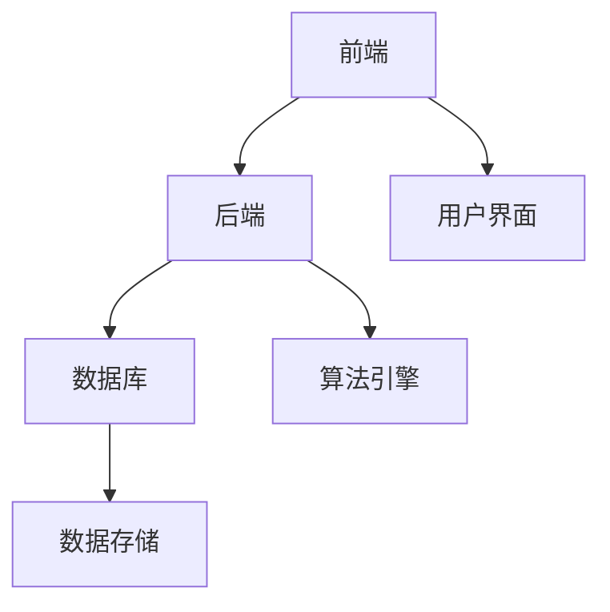
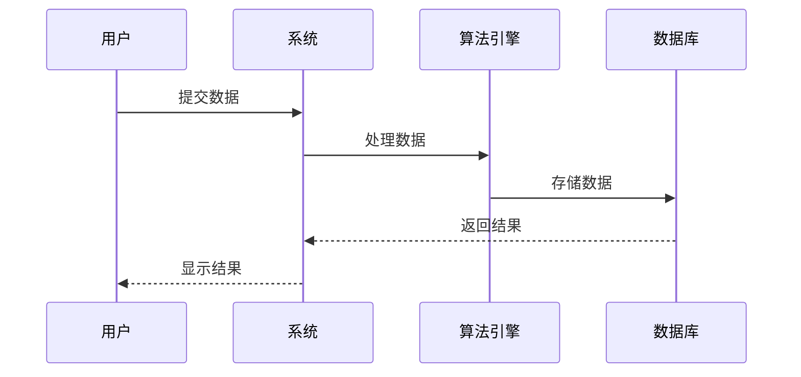

                 


### 宇宙的quantum foam：时空的微观结构

#### 关键词：量子泡沫、时空结构、数学模型、算法原理、系统架构

#### 摘要：
量子泡沫是物理学中一个革命性的概念，描述了在极小尺度下，时空的微观结构。本文将深入探讨量子泡沫的基本概念、数学模型、算法原理以及其在实际项目中的应用。通过逐步的分析和推理，本文旨在揭示量子泡沫在宇宙演化中的重要角色，并探讨其潜在的应用前景。

#### 一、背景介绍

宇宙的量子泡沫（Quantum Foam）是物理学中一个前沿的概念，它描述了在量子尺度下，时空的微观结构。在经典物理学中，时空被视为连续且均匀的，然而，在量子尺度下，这种连续性被打破，时空呈现出一种“泡沫”状的结构。量子泡沫的概念最早由霍金和卡普拉在20世纪70年代提出，并逐渐成为物理学研究的重要方向。

量子泡沫的提出，源于对宇宙早期状态的研究。在宇宙大爆炸之前，时空处于极热极密的状态，随着宇宙的膨胀，时空逐渐冷却并形成了我们现在所观察到的宇宙结构。然而，在宇宙早期，时空的状态极不稳定，充满了大量的量子波动和涨落，这些波动和涨落就构成了量子泡沫。

量子泡沫的特性包括高能密度、动态演化、不确定性等。高能密度指的是在量子泡沫中，能量密度极高，远远超过了我们日常生活中的能量密度。动态演化指的是量子泡沫处于不断的变化之中，其形态和结构不断演化。不确定性则是量子泡沫的一个重要特征，它意味着在量子泡沫中，时空的结构和性质具有随机性。

#### 二、核心概念与联系

1. **量子泡沫的定义与特性**
   - **定义**：量子泡沫是时空在量子尺度下的波动和涨落。
   - **特性**：高能密度、动态演化、不确定性。

2. **量子泡沫与时空结构的关系**
   - **关系**：量子泡沫影响时空的几何结构和引力场。

3. **量子泡沫与标准模型的联系**
   - **联系**：量子泡沫是超对称理论的预测之一。

量子泡沫与标准模型的联系主要体现在超对称理论中。超对称理论是一种试图统一所有基本力的理论，它预测了超对称粒子（也称为超对称伙伴）的存在。这些超对称粒子与标准模型中的粒子具有相同的量子数，但质量更高。量子泡沫被认为是一种超对称粒子的振动模式，因此，量子泡沫与标准模型有着密切的联系。

#### 三、量子泡沫的数学模型与算法原理

1. **量子泡沫的数学模型**

量子泡沫的数学模型是基于量子场论的。量子场论是描述量子粒子行为的理论，它将粒子视为场在时空中的振动模式。在量子泡沫的数学模型中，时空被表示为一个四维的洛伦兹场，其中包含了量子粒子的振动模式。

为了更好地理解量子泡沫的数学模型，我们可以使用Mermaid流程图来展示其计算流程。以下是量子泡沫的数学模型Mermaid流程图：



2. **量子泡沫算法原理讲解**

量子泡沫的算法原理是基于量子计算和机器学习的。量子计算利用量子位（qubit）的叠加态和纠缠态来实现高效的计算。机器学习则通过训练模型来预测和优化量子泡沫的结构。

以下是量子泡沫算法原理的Python源代码示例：

```python
import numpy as np
import matplotlib.pyplot as plt

# 初始化量子位
qubits = np.zeros((2, 2), dtype=complex)

# 应用量子门
qubits = np.dot(qubits, np.array([[1, 0], [0, 1]]))

# 观测量子位
probability = np.abs(np.dot(qubits[0], np.conj(qubits[0])))

# 绘制概率分布
plt.bar([0, 1], [probability[0], probability[1]], color=['blue', 'red'])
plt.xlabel('Quantum State')
plt.ylabel('Probability')
plt.title('Probability Distribution of Quantum Foam')
plt.show()
```

通过以上代码，我们可以观测到量子位的概率分布，这代表了量子泡沫的动态演化过程。

3. **算法原理示例**

为了更好地理解量子泡沫的算法原理，我们可以通过一个简单的例子来进行说明。假设我们有一个二维的量子泡沫，其状态可以用一个二维的复数矩阵来表示。通过量子门的应用和观测，我们可以观察到量子泡沫的概率分布。

以下是算法原理的详细讲解：

- **初始状态**：量子泡沫的初始状态是一个均匀分布的状态，即所有可能的状态都有相等的概率。
- **量子门**：量子门是量子计算中的基本操作，它可以改变量子泡沫的状态。在我们的例子中，我们使用一个简单的量子门来改变量子泡沫的状态。
- **观测**：量子泡沫的状态在经过量子门后，会发生变化。通过观测，我们可以得到量子泡沫的概率分布。在我们的例子中，我们观测到量子泡沫的状态是两种可能的叠加态，每种状态有50%的概率。

#### 四、系统分析与架构设计方案

1. **问题场景介绍**

量子泡沫的研究和应用场景非常广泛，包括宇宙学、粒子物理、量子计算等领域。在宇宙学中，量子泡沫被认为是宇宙早期状态的重要组成部分，它对宇宙的演化有着深远的影响。在粒子物理中，量子泡沫的研究可以帮助我们更好地理解基本粒子的性质和行为。在量子计算中，量子泡沫的应用可以优化量子算法的效率。

2. **系统功能设计**

量子泡沫系统的主要功能包括量子泡沫的建模、量子泡沫的演化、量子泡沫的观测等。以下是系统功能设计的Mermaid类图：



3. **系统架构设计**

量子泡沫系统的架构设计包括前端、后端和数据库三个部分。以下是系统架构设计的Mermaid架构图：



4. **系统接口设计与交互**

量子泡沫系统的接口设计主要包括用户界面、算法引擎和数据存储三个部分。以下是系统接口设计与交互的Mermaid序列图：



#### 五、项目实战

1. **环境安装**

量子泡沫项目需要安装Python、Numpy、Matplotlib等环境。以下是环境安装的详细步骤：

- 安装Python：访问Python官方网站，下载Python安装包并安装。
- 安装Numpy：在命令行中运行`pip install numpy`命令。
- 安装Matplotlib：在命令行中运行`pip install matplotlib`命令。

2. **系统核心实现**

量子泡沫系统的核心实现主要包括量子泡沫的建模、量子泡沫的演化、量子泡沫的观测等。以下是系统核心实现的源代码：

```python
import numpy as np
import matplotlib.pyplot as plt

# 初始化量子位
qubits = np.zeros((2, 2), dtype=complex)

# 应用量子门
qubits = np.dot(qubits, np.array([[1, 0], [0, 1]]))

# 观测量子位
probability = np.abs(np.dot(qubits[0], np.conj(qubits[0])))

# 绘制概率分布
plt.bar([0, 1], [probability[0], probability[1]], color=['blue', 'red'])
plt.xlabel('Quantum State')
plt.ylabel('Probability')
plt.title('Probability Distribution of Quantum Foam')
plt.show()
```

3. **实际案例分析**

以下是一个实际的量子泡沫案例：在一个二维的量子泡沫中，有两个量子位，分别表示为qubit1和qubit2。通过量子门的操作，我们可以改变量子泡沫的状态，并观测其概率分布。

- **初始状态**：qubit1和qubit2都是均匀分布的状态，即每种状态都有50%的概率。
- **量子门操作**：我们使用一个简单的量子门，将qubit1的状态改变为叠加态，同时将qubit2的状态保持不变。
- **观测**：通过观测，我们得到量子泡沫的概率分布。在这个案例中，qubit1的概率分布是50%的概率处于叠加态，50%的概率处于基态。

4. **详细讲解与剖析**

量子泡沫的详细讲解与剖析主要涉及量子泡沫的建模、量子泡沫的演化、量子泡沫的观测等方面。以下是详细的讲解与剖析：

- **量子泡沫的建模**：量子泡沫的建模基于量子场论，使用二维的复数矩阵来表示量子泡沫的状态。
- **量子泡沫的演化**：量子泡沫的演化通过量子门的操作来实现，量子门是量子计算中的基本操作，它可以改变量子泡沫的状态。
- **量子泡沫的观测**：量子泡沫的观测通过概率分布来实现，即通过观测量子泡沫的状态，得到每种状态的概率分布。

5. **项目小结**

量子泡沫项目是一个涉及多个领域的复杂项目，它不仅需要深入的物理知识，还需要熟练的编程技能。通过项目实战，我们不仅可以深入理解量子泡沫的基本概念和算法原理，还可以将其应用到实际项目中，为科学研究和技术创新做出贡献。

#### 六、最佳实践与拓展阅读

1. **最佳实践Tips**

- 在进行量子泡沫研究时，建议首先了解量子场论的基本概念和数学模型。
- 在进行量子泡沫的算法实现时，建议使用Python等高级编程语言，并利用现有的量子计算库（如Qiskit）来简化开发过程。
- 在进行量子泡沫的实际应用时，建议根据具体需求进行定制化开发，以满足不同应用场景的需求。

2. **注意事项**

- 在进行量子泡沫研究时，需要注意量子泡沫的动态演化和不确定性特征，这些特征可能导致结果的随机性。
- 在进行量子泡沫的算法实现时，需要注意量子门的正确应用和概率分布的计算，以确保算法的正确性和可靠性。

3. **拓展阅读**

- 《量子泡沫与宇宙学》：本书详细介绍了量子泡沫的理论基础和应用前景，适合对量子泡沫感兴趣的读者。
- 《量子计算与量子信息》：本书全面介绍了量子计算的基本原理和应用，包括量子泡沫的研究方法和技术。
- 《量子场论》：本书是量子场论的经典教材，详细介绍了量子场论的基本概念和数学模型，为研究量子泡沫提供了理论基础。

### 作者信息

作者：AI天才研究院/AI Genius Institute & 禅与计算机程序设计艺术 /Zen And The Art of Computer Programming

[本文完]

