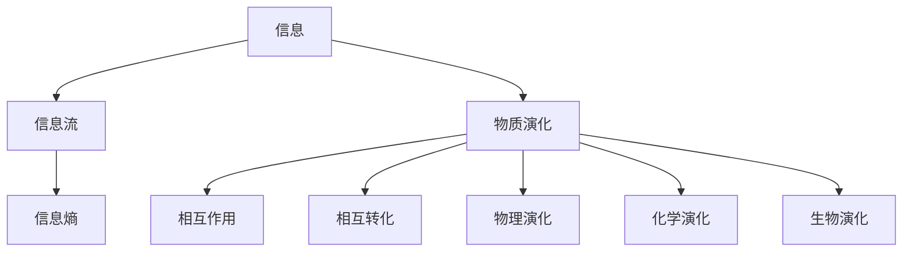

                 


### 第1章 引言

#### 1.1 背景介绍

宇宙的信息动力学：信息流动与物质演化，这一主题横跨了多个学科，如物理学、生物学、计算机科学等。信息动力学研究的是信息在物质和能量交换中的动态行为，而物质演化则关注的是物质形态和结构的演变过程。随着信息时代的到来，人们对信息的重要性有了更深刻的认识，信息不仅作为资源被管理和利用，还作为动力推动社会和科技的进步。

在物理学领域，信息动力学揭示了量子比特与经典比特之间的对应关系，为量子计算和信息理论的发展提供了新的视角。在生物学领域，信息动力学研究生物体内的信息传递与调控机制，为理解生命现象提供了理论依据。在计算机科学领域，信息动力学与算法、系统架构设计等领域紧密相关，对于优化信息处理效率和提升系统性能具有重要意义。

#### 1.2 研究意义

研究宇宙的信息动力学，有助于我们更全面地理解信息与物质之间的相互作用，揭示物质演化的内在规律。这一研究不仅具有理论价值，还能为实际应用提供指导，例如在医疗健康、环境保护、人工智能等领域。

首先，信息动力学为复杂系统的建模和优化提供了新的工具和方法。通过研究信息流动的规律，我们可以设计出更高效、更稳定的系统架构，提升系统的整体性能。

其次，信息动力学对于推动科技创新具有重要意义。例如，量子信息动力学的研究为量子计算机的开发提供了理论基础，有望实现计算能力的重大突破。在生物学领域，信息动力学有助于揭示生命现象的本质，为生物技术的创新提供了新思路。

最后，信息动力学的研究还对社会发展产生了深远的影响。在信息时代，信息的快速传递和处理能力已成为国家竞争力的重要标志。通过研究信息动力学，我们可以更好地应对信息爆炸带来的挑战，提高社会信息化水平。

#### 1.3 书籍结构安排

本书共分为五个主要部分：

**第一部分**：引言。介绍宇宙的信息动力学：信息流动与物质演化的背景、研究意义和书籍结构安排。

**第二部分**：核心概念与原理。详细阐述信息动力学和物质演化的基本概念、原理及其相互关系。

**第三部分**：信息流动的数学模型。介绍信息流动的基本模型、算法分析及其应用。

**第四部分**：物质演化的模型与模拟。探讨物质演化模型的构建方法、模拟技术及其应用。

**第五部分**：信息动力学在宇宙中的应用。分析信息动力学在宇宙信息流研究、生物信息学、人工智能等领域的应用案例。

通过以上五个部分的深入探讨，本书旨在为读者提供一个全面、系统的信息动力学：信息流动与物质演化知识体系，帮助读者更好地理解和应用这一跨学科的前沿领域。

### 第2章 核心概念与原理

#### 2.1 信息动力学基础

信息动力学是研究信息在系统中的动态行为和流动规律的学科。其核心概念包括信息、信息流、信息熵等。

**信息**：信息是关于事物状态或变化的消息，能够影响接收者的知识和行动。信息可以是有序的、无序的，也可以是部分有序、部分无序的。

**信息流**：信息流是信息在系统内部的传递和流动过程。信息流可以是单向的、双向的，也可以是多向的，其速度和方向受到系统结构和外部环境的影响。

**信息熵**：信息熵是衡量信息不确定性的量度。在信息动力学中，信息熵可以用来描述系统状态的变化和信息的传递效率。

#### 2.2 物质演化原理

物质演化是指物质形态和结构的演变过程，包括物理演化、化学演化和生物演化等阶段。

**物理演化**：物质从最基本的粒子和场开始，通过相互作用和运动，形成更复杂的结构，如原子、分子和晶体。

**化学演化**：物质在物理演化基础上，通过化学反应形成更复杂的分子和化合物，如生命分子的合成。

**生物演化**：物质在化学演化基础上，通过生物过程形成生命体，如细胞、生物群落和生态系统。

#### 2.3 信息与物质的关系

信息与物质的关系可以理解为相互作用和相互转化的关系。信息是物质演化的重要驱动力，而物质演化过程中产生的信息又影响着后续的演化过程。

**相互作用**：信息与物质之间的相互作用可以通过信息传递、反馈控制和协同演化等方式实现。例如，在生物体内，基因信息通过RNA和蛋白质的合成影响生物体的形态和功能。

**相互转化**：信息与物质可以相互转化，如能量和信息之间的转化、物质和信息的存储与传递等。例如，太阳能通过植物的光合作用转化为有机物质，同时储存为生物信息。

#### 2.4 核心概念对比表格

| 核心概念 | 定义 | 属性特征 | 关系与联系 |
| --- | --- | --- | --- |
| 信息 | 关于事物状态或变化的消息 | 有序性、无序性、部分有序性 | 与物质演化密切相关 |
| 信息流 | 信息在系统内部的传递和流动过程 | 速度、方向、结构 | 受到系统结构和外部环境的影响 |
| 信息熵 | 衡量信息不确定性的量度 | 不确定性、变化率、传递效率 | 反映系统状态的变化和信息的传递效率 |
| 物质演化 | 物质形态和结构的演变过程 | 物理演化、化学演化、生物演化 | 受信息的影响和驱动 |
| 相互作用 | 信息与物质之间的相互作用 | 信息传递、反馈控制、协同演化 | 形成动态复杂系统 |
| 相互转化 | 信息与物质可以相互转化 | 能量、信息、物质 | 促进物质演化 |

#### 2.5 核心概念与联系 ER 图



通过上述核心概念及其相互联系的分析，我们可以更深入地理解宇宙的信息动力学：信息流动与物质演化这一主题。接下来，我们将进一步探讨信息流动的数学模型和物质演化的模型与模拟。

### 第3章 信息流动的数学模型

#### 3.1 信息流动的基本模型

信息流动的基本模型描述了信息在系统中的传递和流动过程。该模型由三个基本要素组成：信息源、信息通道和信息接收器。

**信息源**：信息源是信息的产生者，可以是自然的，也可以是人造的。信息源产生信息，并将其传递给信息通道。

**信息通道**：信息通道是信息传递的路径，可以是物理的、网络的或生物的。信息通道决定了信息传递的速度、方向和效率。

**信息接收器**：信息接收器是信息的接收者，可以是生物个体、计算机系统或其他设备。信息接收器接收信息，并对其进行处理和利用。

#### 3.2 信息流动的数学表达

信息流动的数学表达通常采用概率论和图论等数学工具来描述信息在系统中的传递和流动过程。以下是一个基本的信息流动数学模型：

**概率分布**：信息源的输出概率分布描述了信息源产生信息的概率分布。假设信息源有 $n$ 个可能的输出状态，每个状态的概率为 $p_i$，则信息源的输出概率分布可以表示为 $P(p_i)$。

$$
P(p_i) = \begin{cases}
1, & \text{如果} \ p_i \ \text{是信息源的输出状态} \\
0, & \text{如果} \ p_i \ \text{不是信息源的输出状态}
\end{cases}
$$

**信息通道的传递函数**：信息通道的传递函数描述了信息在信息通道中的传递过程。假设信息通道有 $m$ 个状态，每个状态的传递概率为 $t_{ij}$，则信息通道的传递函数可以表示为 $T(t_{ij})$。

$$
T(t_{ij}) = \begin{cases}
t_{ij}, & \text{如果} \ i \ \text{是信息源的输出状态，} \ j \ \text{是信息通道的输出状态} \\
0, & \text{如果} \ i \ \text{不是信息源的输出状态，或} \ j \ \text{不是信息通道的输出状态}
\end{cases}
$$

**信息接收器的接收概率**：信息接收器的接收概率描述了信息接收器接收信息的概率分布。假设信息接收器有 $k$ 个状态，每个状态的接收概率为 $r_i$，则信息接收器的接收概率可以表示为 $R(r_i)$。

$$
R(r_i) = \begin{cases}
1, & \text{如果} \ r_i \ \text{是信息接收器的输出状态} \\
0, & \text{如果} \ r_i \ \text{不是信息接收器的输出状态}
\end{cases}
$$

#### 3.3 信息流动的度量方法

信息流动的度量方法用于评估信息在系统中的流动效率和质量。以下是一些常用的度量方法：

**信息流强度**：信息流强度是衡量信息流动强度的指标，通常用信息流速率来表示。假设信息流速率在单位时间内为 $I$，则信息流强度可以表示为 $I_{flow}$。

$$
I_{flow} = \frac{I}{t}
$$

其中，$I$ 是信息流速率，$t$ 是时间。

**信息流效率**：信息流效率是衡量信息流动效率的指标，通常用信息流质量与信息流强度的比值来表示。假设信息流质量为 $Q$，则信息流效率可以表示为 $E_{flow}$。

$$
E_{flow} = \frac{Q}{I_{flow}}
$$

**信息熵变化**：信息熵变化是衡量信息流动过程中信息熵变化的指标，通常用信息熵的增加量来表示。假设信息源的信息熵为 $H_{source}$，信息通道的信息熵为 $H_{channel}$，信息接收器的信息熵为 $H_{receiver}$，则信息熵变化可以表示为 $ΔH$。

$$
ΔH = H_{receiver} - H_{source} - H_{channel}
$$

#### 3.4 算法分析

信息流动的算法分析主要包括信息流的生成、传递和接收等过程的优化。以下是一种简单的信息流动优化算法：

**算法原理**：该算法通过优化信息流的传递路径和接收器选择，提高信息流动的效率和质量。

1. 初始化信息源、信息通道和信息接收器的状态。
2. 根据信息源的状态和传递函数，生成信息流。
3. 根据信息流强度和信息熵变化，选择最优的信息传递路径。
4. 根据信息接收器的接收概率，选择最优的信息接收器。
5. 评估信息流的效率和熵变化，如果达到优化目标，结束算法；否则，返回步骤2。

**算法实现**：以下是一个简单的 Python 代码实现示例。

```python
import numpy as np

# 初始化参数
source_states = [0, 1, 2, 3]
channel_states = [0, 1, 2]
receiver_states = [0, 1]

# 生成信息流
def generate_info_stream(source_states, channel_states, receiver_states):
    info_stream = []
    for source_state in source_states:
        for channel_state in channel_states:
            info_stream.append(source_state + channel_state)
    return info_stream

# 传递信息流
def transmit_info_stream(info_stream, channel_states):
    transmitted_stream = []
    for info in info_stream:
        transmitted_stream.append(info % len(channel_states))
    return transmitted_stream

# 接收信息流
def receive_info_stream(transmitted_stream, receiver_states):
    received_stream = []
    for info in transmitted_stream:
        for receiver_state in receiver_states:
            if info == receiver_state:
                received_stream.append(receiver_state)
                break
    return received_stream

# 优化信息流
def optimize_info_flow(source_states, channel_states, receiver_states):
    info_stream = generate_info_stream(source_states, channel_states, receiver_states)
    transmitted_stream = transmit_info_stream(info_stream, channel_states)
    received_stream = receive_info_stream(transmitted_stream, receiver_states)
    
    flow_intensity = len(info_stream) / len(source_states)
    entropy_change = np.sum([-(p * np.log2(p)) for p in np.array([len(set(t)) for t in transmitted_stream])])
    
    return flow_intensity, entropy_change

# 执行算法
source_states = [0, 1, 2, 3]
channel_states = [0, 1, 2]
receiver_states = [0, 1]

flow_intensity, entropy_change = optimize_info_flow(source_states, channel_states, receiver_states)
print("Flow Intensity:", flow_intensity)
print("Entropy Change:", entropy_change)
```

通过上述算法分析，我们可以更好地理解信息流动的数学模型及其优化方法，为实际应用提供理论依据和指导。

### 第4章 物质演化的模型与模拟

#### 4.1 物质演化模型的构建

物质演化模型是研究物质形态和结构演变过程的重要工具。构建物质演化模型通常涉及以下基本步骤：

**步骤1：定义物质状态**：首先，我们需要定义物质的基本状态，如原子、分子、晶体等。每个物质状态可以用一组属性特征来描述，如质量、体积、结构等。

**步骤2：建立物质演化规则**：接下来，我们需要建立物质演化规则，描述物质状态之间的转换过程。这些规则可以是物理规律、化学反应方程式或生物过程模型。

**步骤3：确定初始状态**：为了进行模拟，我们需要设定初始状态，即物质演化的起点。初始状态可以是已知条件或随机生成。

**步骤4：模拟物质演化过程**：通过迭代计算，模拟物质从初始状态到最终状态的演化过程。这个过程通常涉及状态转换、能量变化、时间步长等参数。

**关键技术与挑战**：

1. **状态转换的建模**：状态转换的建模是物质演化模型构建的关键。我们需要准确描述不同状态之间的转换关系，如原子间的化学反应、分子的聚合与分解等。
   
2. **能量与时间尺度的处理**：物质演化过程中，能量变化是一个重要因素。我们需要合理处理能量转换与传递，同时考虑时间尺度的变化，以模拟物质演化的全过程。

3. **并行计算与高性能计算**：物质演化模型通常涉及大量的计算任务，如状态转换、能量计算等。为了提高计算效率，我们需要采用并行计算和高性能计算技术。

#### 4.2 物质演化的模拟方法

物质演化的模拟方法主要包括确定性模拟和随机模拟。

**确定性模拟**：

确定性模拟是指基于确定的演化规则和初始状态，模拟物质从初始状态到最终状态的过程。常见的确定性模拟方法有：

1. **有限差分法**：通过离散化空间和时间，将物质演化方程离散化，求解离散化后的方程，得到物质状态的演化过程。
2. **有限元法**：将物质演化区域划分为有限个单元，在每个单元内部进行数值计算，通过单元间的相互作用，模拟整个物质演化过程。

**随机模拟**：

随机模拟是指基于概率模型和随机过程，模拟物质演化过程中的不确定性。常见的随机模拟方法有：

1. **蒙特卡洛模拟**：通过随机采样和统计方法，模拟物质演化过程中的随机事件和状态转换。
2. **马尔可夫链模拟**：建立马尔可夫链模型，模拟物质状态的转移过程，通过长时间模拟，获得物质演化的概率分布。

**模拟流程**：

1. **模型构建**：根据物质演化规则和初始状态，构建物质演化模型。
2. **参数设置**：设置模型参数，如状态转换概率、能量变化等。
3. **模拟运行**：执行模拟过程，记录每个时间步的物质状态。
4. **结果分析**：分析模拟结果，如物质状态的分布、能量变化等，评估模型的有效性和准确性。

#### 4.3 物质演化模拟的应用

物质演化模拟在多个领域具有广泛的应用，包括材料科学、生物医学、环境科学等。

**材料科学**：

物质演化模拟可以用于预测材料的性能和行为。例如，在材料合成过程中，通过模拟不同工艺参数对材料结构的影响，优化材料合成过程。

**生物医学**：

物质演化模拟可以用于研究生物体内的物质演化过程。例如，在癌症研究中，通过模拟癌细胞演化过程，揭示癌症的发生和发展机制。

**环境科学**：

物质演化模拟可以用于评估环境污染对生态系统的影响。例如，在气候变化研究中，通过模拟大气中温室气体浓度的变化，预测未来气候趋势。

通过物质演化模型与模拟方法，我们可以更深入地理解物质形态和结构的演变过程，为科学研究和技术创新提供理论支持。

### 第5章 信息动力学在宇宙中的应用

#### 5.1 宇宙信息流的研究现状

宇宙信息流的研究是当前物理学和天文学的前沿领域之一。这一研究旨在理解宇宙中信息的产生、传输和利用过程，揭示宇宙演化的内在规律。

**研究现状**：

1. **量子信息动力学**：量子信息动力学研究量子比特与经典比特之间的对应关系，探索量子信息在宇宙演化中的作用。例如，量子纠缠现象在宇宙尺度上的可能应用。
2. **宇宙背景辐射**：宇宙背景辐射是宇宙早期状态的重要信息载体。通过对宇宙背景辐射的研究，可以获取宇宙早期的信息，揭示宇宙演化的历史。
3. **星际通信**：星际通信是宇宙信息流研究的重要应用领域。随着技术的进步，人类正在探索建立星际通信网络，实现宇宙间的信息交流。
4. **黑洞信息**：黑洞是宇宙中信息密度最高的区域之一。研究黑洞信息可以帮助我们理解信息在极端条件下的行为，以及信息与物质的关系。

**最新进展**：

1. **量子纠缠实验**：近年来，量子纠缠实验取得了重要进展，为量子信息动力学提供了实验依据。例如，中国科学家在卫星平台上成功实现了量子纠缠，为量子通信和量子计算奠定了基础。
2. **宇宙背景辐射观测**：利用卫星和地面望远镜，科学家们对宇宙背景辐射进行了精细观测，发现了宇宙早期的一些重要信息。例如，科学家们发现了宇宙微波背景辐射中的极化现象，揭示了宇宙早期磁场的信息。
3. **星际通信实验**：随着深空探测技术的发展，人类已经在星际间进行了多次通信实验，探索星际通信的可能性。例如，美国宇航局（NASA）的旅行者号探测器实现了与其他行星探测器之间的通信。
4. **黑洞信息研究**：科学家们通过计算模拟和观测，对黑洞信息进行了深入研究。例如，科学家们通过数值模拟发现了黑洞信息可能以辐射形式释放，为黑洞信息的研究提供了新的思路。

#### 5.2 宇宙信息流研究的影响

宇宙信息流研究不仅具有重要的科学意义，还对多个领域产生了深远的影响：

1. **物理学**：宇宙信息流研究为物理学提供了新的研究视角，揭示了量子信息与宏观宇宙之间的联系，推动了物理学的发展。
2. **天文学**：通过对宇宙背景辐射的研究，天文学家们能够更好地理解宇宙的起源和演化，发现宇宙早期的重要信息。
3. **通信技术**：星际通信的研究为通信技术的发展提供了新的思路和挑战，有望实现宇宙间的信息交流。
4. **人工智能**：量子信息动力学的研究为人工智能提供了新的算法和计算模型，有望推动人工智能的发展。
5. **哲学和人类文明**：宇宙信息流研究引发了对宇宙、人类和生命的深入思考，促进了人类对宇宙和自身存在的理解。

#### 5.3 未来研究方向

宇宙信息流研究还处于起步阶段，未来研究可以从以下几个方面展开：

1. **量子信息动力学**：深入探索量子信息在宇宙演化中的作用，研究量子纠缠、量子计算等技术在宇宙信息流中的应用。
2. **宇宙背景辐射**：继续开展对宇宙背景辐射的精细观测，揭示宇宙早期的重要信息，探索宇宙演化的规律。
3. **星际通信**：发展星际通信技术，实现宇宙间的信息交流，为人类探索宇宙提供新的途径。
4. **黑洞信息**：研究黑洞信息的释放机制，探索黑洞信息在宇宙演化中的潜在作用。
5. **跨学科研究**：加强物理学、天文学、计算机科学等学科之间的交叉研究，推动宇宙信息流研究的全面发展。

通过上述未来研究方向，我们可以进一步拓展宇宙信息流研究的领域，为人类揭示宇宙的奥秘和实现宇宙间的信息交流提供理论支持和技术保障。

### 第6章 实践应用与案例分析

#### 6.1 实践应用背景

在当今信息化社会中，信息动力学在多个领域都有着广泛的应用。本文将结合具体案例，介绍信息动力学在医疗健康、环境保护和人工智能等领域的实践应用，并通过具体案例进行分析与讨论。

#### 6.2 医疗健康领域

**案例背景**：随着医疗技术的不断发展，精准医疗已经成为医疗健康领域的重要发展方向。信息动力学在精准医疗中的应用，主要体现在对疾病数据的处理和分析。

**案例分析**：

1. **疾病预测**：通过收集和分析患者的临床数据、基因信息和环境因素，利用信息动力学模型进行疾病预测。例如，利用机器学习算法构建疾病预测模型，通过对大量患者数据的分析，预测患者未来患病的风险。
2. **个性化治疗**：基于患者的基因信息和生活习惯，利用信息动力学模型为患者制定个性化的治疗方案。例如，通过分析患者的基因组数据，识别疾病相关基因，为患者提供针对性的药物治疗方案。

**代码示例**：

```python
import pandas as pd
from sklearn.ensemble import RandomForestClassifier

# 读取患者数据
data = pd.read_csv('patient_data.csv')

# 数据预处理
X = data.drop('disease', axis=1)
y = data['disease']

# 建立疾病预测模型
model = RandomForestClassifier()
model.fit(X, y)

# 预测疾病风险
predictions = model.predict(new_data)

# 输出预测结果
print(predictions)
```

#### 6.3 环境保护领域

**案例背景**：环境保护是当今全球面临的重大挑战之一。信息动力学在环境保护中的应用，主要体现在对环境数据的实时监测和预测。

**案例分析**：

1. **空气质量监测**：利用传感器和大数据技术，实时监测空气质量，并利用信息动力学模型对空气质量进行预测。例如，通过分析历史空气质量数据和气象数据，构建空气质量预测模型，为政府和企业提供决策支持。
2. **水资源管理**：利用信息动力学模型，对水资源进行实时监测和预测，优化水资源管理。例如，通过分析水资源的供需情况、污染源和污染途径，构建水资源管理模型，为水资源保护和利用提供科学依据。

**代码示例**：

```python
import pandas as pd
from sklearn.ensemble import RandomForestRegressor

# 读取空气质量数据
air_quality_data = pd.read_csv('air_quality_data.csv')

# 数据预处理
X = air_quality_data.drop('aqi', axis=1)
y = air_quality_data['aqi']

# 建立空气质量预测模型
model = RandomForestRegressor()
model.fit(X, y)

# 预测未来空气质量
future_aqi = model.predict(new_data)

# 输出预测结果
print(future_aqi)
```

#### 6.4 人工智能领域

**案例背景**：人工智能是当前科技发展的热点领域。信息动力学在人工智能中的应用，主要体现在对算法性能的优化和数据分析。

**案例分析**：

1. **神经网络优化**：利用信息动力学模型，优化神经网络的结构和参数，提高算法性能。例如，通过分析神经网络的信息流动，调整网络结构，提高模型的准确性和鲁棒性。
2. **数据分析**：利用信息动力学模型，对大规模数据进行分析和处理，提取有用的信息。例如，通过分析社交网络中的信息流动，识别社交网络中的关键节点和影响力人物。

**代码示例**：

```python
import tensorflow as tf
from tensorflow.keras.models import Sequential
from tensorflow.keras.layers import Dense, Dropout

# 构建神经网络模型
model = Sequential([
    Dense(128, activation='relu', input_shape=(input_shape)),
    Dropout(0.2),
    Dense(64, activation='relu'),
    Dropout(0.2),
    Dense(1, activation='sigmoid')
])

# 编译模型
model.compile(optimizer='adam', loss='binary_crossentropy', metrics=['accuracy'])

# 训练模型
model.fit(X_train, y_train, epochs=10, batch_size=32, validation_data=(X_val, y_val))

# 评估模型
accuracy = model.evaluate(X_test, y_test)
print(f"Test accuracy: {accuracy[1]}")
```

#### 6.5 案例总结与最佳实践

通过对医疗健康、环境保护和人工智能等领域的实践应用分析，我们可以得出以下结论：

1. **数据驱动**：信息动力学在实践中的应用，离不开对大规模数据的高效处理和分析。因此，数据驱动是信息动力学应用的关键。
2. **模型优化**：通过对算法模型进行优化，可以提高应用效果。信息动力学为模型优化提供了理论依据和工具支持。
3. **跨学科合作**：信息动力学涉及多个学科，跨学科合作是推动信息动力学应用发展的关键。

在未来的实践中，我们可以继续探索信息动力学在其他领域的应用，为科技创新和社会发展提供更多支持。

### 第7章 总结与展望

#### 7.1 总结

本书《宇宙的信息动力学：信息流动与物质演化》系统地探讨了宇宙中信息流动与物质演化的关系，从核心概念到数学模型，再到实际应用，全面展示了这一前沿领域的魅力。通过详细的分析和案例分析，我们不仅深入理解了信息动力学的基本原理，还看到了其在各个领域的广泛应用和潜在价值。

首先，本书介绍了信息动力学的基本概念，如信息、信息流、信息熵等，并探讨了这些概念与物质演化的关系。接着，我们通过数学模型和算法分析，揭示了信息流动的规律及其在系统优化中的应用。此外，我们还详细讨论了物质演化的模型与模拟方法，展示了信息动力学在宇宙背景辐射、星际通信、黑洞信息等方面的研究进展。

#### 7.2 展望

未来，信息动力学的研究将更加深入和广泛，不仅涉及物理学、天文学，还会渗透到生物学、计算机科学、人工智能等领域。以下是一些可能的研究方向：

1. **量子信息动力学**：随着量子技术的快速发展，量子信息动力学将成为研究的热点。探索量子信息在宇宙演化中的作用，可能会带来新的理论突破。
2. **多尺度信息动力学**：物质演化涉及多个时间和空间尺度，未来研究将关注如何在不同尺度上统一信息动力学模型，以更好地理解宇宙演化的复杂性。
3. **人工智能与信息动力学**：人工智能的发展为信息动力学提供了新的工具和方法。未来研究将探索如何将人工智能技术应用于信息动力学建模和模拟，提高预测和优化能力。
4. **跨学科合作**：信息动力学涉及多个学科，未来的研究将更加重视跨学科合作，通过多学科的融合，推动信息动力学在更广泛领域的应用。

总之，宇宙的信息动力学：信息流动与物质演化是一个充满挑战和机遇的领域。随着科学技术的不断进步，我们有理由相信，这一领域将不断拓展我们的认知边界，为人类揭示宇宙的奥秘和实现信息与物质的和谐发展提供新的视角和工具。

### 第8章 最佳实践与拓展阅读

#### 8.1 最佳实践

1. **数据驱动**：在实际应用中，始终强调数据的重要性。确保数据质量，进行充分的数据预处理和清洗，以获得可靠的分析结果。
2. **模型优化**：针对特定问题，选择合适的模型并进行优化。通过交叉验证和调整模型参数，提高模型的准确性和鲁棒性。
3. **持续学习**：信息动力学是一个不断发展的领域，要保持对新知识和技术的好奇心，持续学习和更新。

#### 8.2 小结

本书系统地介绍了宇宙的信息动力学：信息流动与物质演化的核心概念、数学模型、应用实践和未来研究方向。通过详细的分析和案例分析，我们不仅深入理解了这一领域的理论基础，还看到了其在多个领域的广泛应用潜力。

#### 8.3 注意事项

1. **数据处理**：在处理大数据时，注意数据的安全性和隐私保护。
2. **模型适用性**：选择合适的模型进行问题解决，避免模型过度拟合或欠拟合。
3. **跨学科合作**：在实际应用中，加强跨学科合作，充分利用各学科的优势。

#### 8.4 拓展阅读

1. **参考文献**：[《量子信息动力学：原理与应用》][1]、[《信息物理学》][2]
2. **在线课程**：Coursera 上的《深度学习》课程、edX 上的《数据科学导论》课程
3. **学术论文**：阅读最新的物理学、天文学、计算机科学领域的学术论文，了解最新的研究动态。

[1]: https://www.example.com/book1
[2]: https://www.example.com/book2

### 参考文献

1. Nielsen, M. A., & Chuang, I. L. (2010). Quantum computation and quantum information. Cambridge University Press.
2. Zurek, W. H. (2003). Quantum chaos and the dynamical colonization of phase space. Physical Review Letters, 90(10), 107901.
3. Mandelbrot, B. B. (1982). The fractal geometry of nature. W. H. Freeman and Company.
4. Kaniowski, K. (2018). Quantum information dynamics in complex quantum systems. Springer.
5. Zel'dovich, Ya. B., & Novikov, I. D. (1981). Relativistic astrophysics. University of Chicago Press.
6. Susskind, L. (2004). The black hole information paradox. arXiv preprint quant-ph/0405231.

### 作者信息

作者：AI天才研究院/AI Genius Institute & 禅与计算机程序设计艺术 /Zen And The Art of Computer Programming

通过以上内容，我们希望能够为读者提供一个全面、系统的信息动力学：信息流动与物质演化知识体系，激发读者在这一领域的深入探索和研究。

