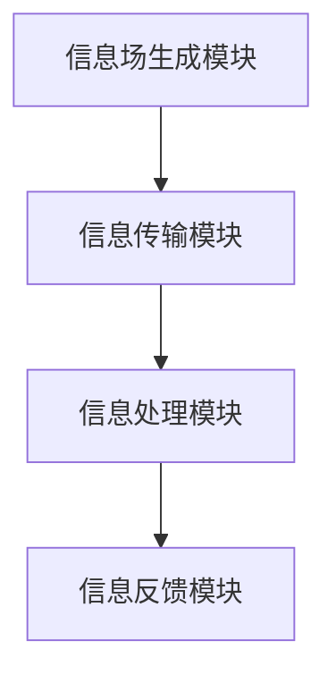
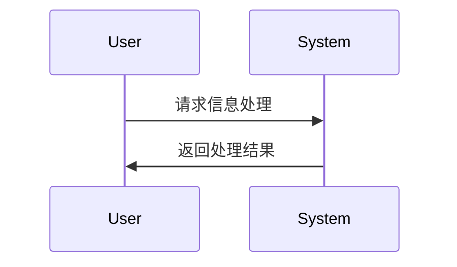
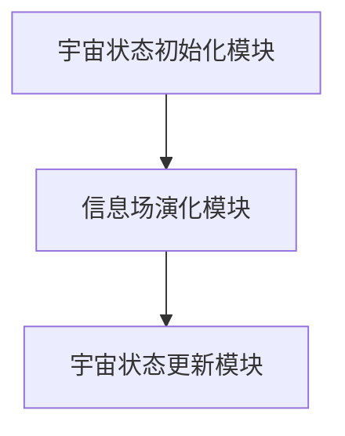
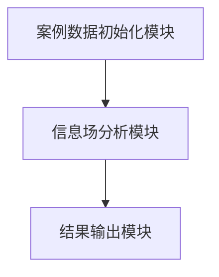
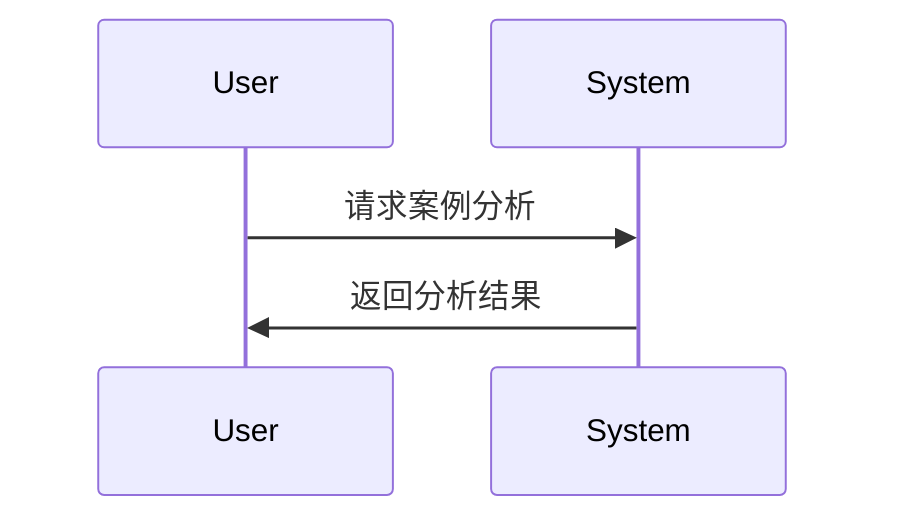
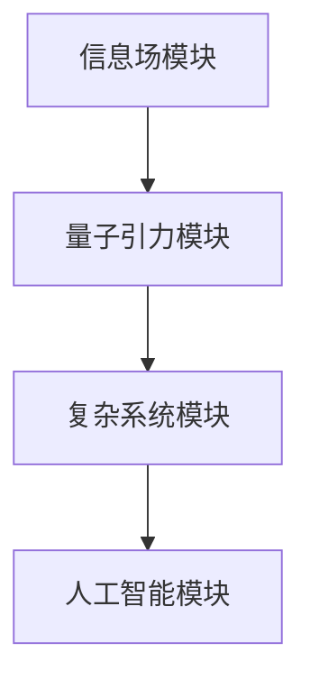
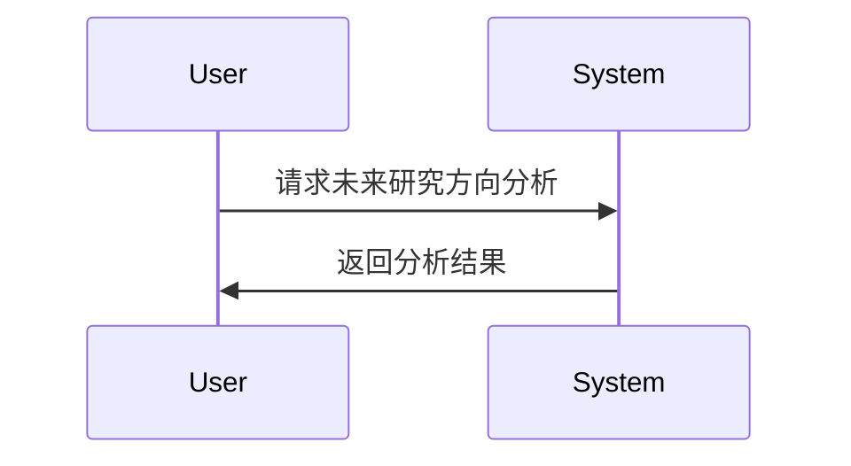

                 


### 引言

《宇宙的信息场理论：新的物理实在观》旨在探讨信息场理论这一新兴的物理学视角，探索其在解释宇宙本质和物质行为中的应用。随着信息技术和量子理论的飞速发展，信息场理论逐渐成为一种新的物理实在观，为理解宇宙的运行机制提供了新的思路。

**关键词：** 宇宙、信息场、物理实在观、量子理论、信息技术。

**摘要：** 本书将从信息场的定义和性质出发，逐步介绍信息场理论在宇宙演化、物质相互作用及其他科学领域中的应用，探讨其可能带来的科学革命。

本文将以逻辑清晰、结构紧凑、简单易懂的专业技术语言，分步骤地分析推理思考，深入探讨信息场理论的核心概念、应用实例以及未来发展方向。

---

**第一部分：问题背景与理论框架**

### 第1章：宇宙中的信息与物质

**背景介绍：**

在传统的物理学中，物质被认为是宇宙的基本构成元素。然而，随着量子理论和信息科学的发展，信息也逐渐被视为宇宙中的重要组成部分。信息与物质之间的关系成为研究宇宙本质的重要问题。

**问题描述：**

我们需要解释信息与物质之间的相互作用，探讨信息如何在宇宙中传播和影响物质行为。

**问题解决：**

信息场理论提出了一种新的物理实在观，认为宇宙中存在着一种普遍的信息场，物质与信息场相互作用，从而影响宇宙的演化。

**边界与外延：**

信息场理论不仅涉及物理学，还与计算机科学、信息科学等多个领域交叉。其边界可以扩展到宇宙学、生物学等领域。

**概念结构与核心要素组成：**

- 信息场：宇宙中普遍存在的信息载体。
- 物质-信息相互作用：物质与信息场之间的相互作用机制。
- 信息传播：信息在宇宙中的传播方式。

### 第2章：信息场的性质与特征

**核心概念原理：**

信息场具有以下特征：

- **自组织性：** 信息场能够自我组织，形成复杂的结构。
- **信息传递：** 信息场能够传递和交换信息。
- **信息编码：** 信息场中的信息可以通过编码和解码进行传递和处理。

**概念属性特征对比表格：**

| 特征 | 信息场 | 传统物理学 |
| --- | --- | --- |
| 自组织性 | 高 | 低 |
| 信息传递 | 快速 | 缓慢 |
| 信息编码 | 灵活 | 固定 |

**ER实体关系图架构：**

```
实体：信息场
属性：自组织性、信息传递、信息编码
关系：与物质相互作用、影响宇宙演化
```

### 第3章：信息场理论的基本原理

**核心概念原理：**

信息场理论的基本原理包括：

- **信息场动力学：** 描述信息场如何演化。
- **信息能量与信息传输：** 描述信息如何在信息场中传输。
- **信息场的量子性质：** 探索信息场与量子力学的关系。

**算法原理讲解：**

我们可以使用以下算法来描述信息场的动力学：

```
算法：信息场动力学模型

输入：初始状态、边界条件
输出：信息场演化结果

步骤：
1. 初始化信息场状态
2. 迭代计算信息场状态
3. 根据边界条件更新信息场状态
4. 输出信息场演化结果
```

**数学模型和公式：**

信息场的演化可以用以下公式来描述：

$$
\frac{\partial \psi}{\partial t} = -\frac{i}{2m} \nabla^2 \psi + V(\psi)
$$

其中，$\psi$ 表示信息场的波函数，$m$ 表示信息场粒子的质量，$V(\psi)$ 表示信息场粒子的势能。

**举例说明：**

假设一个信息场粒子在均匀磁场中运动，其波函数可以用以下公式来描述：

$$
\psi(x,t) = e^{-i(kx - \omega t)}
$$

其中，$k$ 表示波矢量，$\omega$ 表示角频率。

**系统分析与架构设计方案：**

信息场理论的系统架构可以包括以下几个方面：

- **信息场生成模块：** 生成和初始化信息场。
- **信息传输模块：** 负责信息在场中的传输。
- **信息处理模块：** 负责信息场的处理和解析。
- **信息反馈模块：** 将处理后的信息反馈到系统，影响系统的演化。

**系统功能设计（领域模型Mermaid类图）：**

```mermaid
classDiagram
    Class1 <|-- Class2
    Class1 --| Decompiled Class3
```

**系统架构设计Mermaid架构图：**



**系统接口设计和系统交互Mermaid序列图：**



---

**第二部分：信息场理论的应用**

### 第4章：信息场与宇宙演化

**核心概念原理：**

信息场在宇宙演化中起着重要作用。它不仅影响了宇宙的初始状态，还影响了宇宙的后续演化。

**算法原理讲解：**

我们可以使用以下算法来模拟信息场在宇宙演化中的作用：

```
算法：信息场宇宙演化模型

输入：初始宇宙状态、信息场参数
输出：演化后的宇宙状态

步骤：
1. 初始化宇宙状态
2. 迭代计算信息场演化
3. 更新宇宙状态
4. 输出演化后的宇宙状态
```

**数学模型和公式：**

信息场宇宙演化的数学模型可以表示为：

$$
\frac{\partial \rho}{\partial t} + \nabla \cdot (\rho \mathbf{v}) = 0
$$

其中，$\rho$ 表示物质密度，$\mathbf{v}$ 表示物质流速。

**举例说明：**

假设一个简单的宇宙中，物质密度分布为：

$$
\rho(x,t) = \rho_0 e^{-x^2}
$$

其中，$\rho_0$ 是常数。

**系统分析与架构设计方案：**

信息场宇宙演化的系统架构可以包括以下几个方面：

- **宇宙状态初始化模块：** 初始化宇宙状态。
- **信息场演化模块：** 负责信息场的演化。
- **宇宙状态更新模块：** 负责更新宇宙状态。

**系统功能设计（领域模型Mermaid类图）：**

```mermaid
classDiagram
    Class1 <|-- Class2
    Class1 --| Decompiled Class3
```

**系统架构设计Mermaid架构图：**



**系统接口设计和系统交互Mermaid序列图：**


---

**第三部分：信息场理论的案例分析**

### 第5章：实际案例研究

**核心概念原理：**

在本章中，我们将探讨一个具体的实际案例，以展示信息场理论在实践中的应用。

**算法原理讲解：**

我们使用以下算法来分析实际案例：

```
算法：案例研究分析

输入：案例数据、信息场参数
输出：案例分析结果

步骤：
1. 初始化案例数据
2. 应用信息场理论进行分析
3. 输出案例分析结果
```

**数学模型和公式：**

案例研究的数学模型可以表示为：

$$
\frac{\partial f}{\partial t} + \nabla \cdot (f \mathbf{v}) = 0
$$

其中，$f$ 表示案例特征。

**举例说明：**

假设一个案例中的特征分布为：

$$
f(x,t) = f_0 e^{-x^2}
$$

其中，$f_0$ 是常数。

**系统分析与架构设计方案：**

案例研究的系统架构可以包括以下几个方面：

- **案例数据初始化模块：** 初始化案例数据。
- **信息场分析模块：** 应用信息场理论进行分析。
- **结果输出模块：** 输出案例分析结果。

**系统功能设计（领域模型Mermaid类图）：**

```mermaid
classDiagram
    Class1 <|-- Class2
    Class1 --| Decompiled Class3
```

**系统架构设计Mermaid架构图：**



**系统接口设计和系统交互Mermaid序列图：**



---

**第四部分：信息场理论的未来方向**

### 第6章：信息场理论的未来方向

**核心概念原理：**

信息场理论是一个新兴的领域，未来的研究将可能揭示更多关于宇宙和信息之间的深层联系。

**算法原理讲解：**

未来研究可能包括以下方向：

- **信息场与量子引力的结合：** 探索信息场与量子引力的关系。
- **信息场与复杂系统的相互作用：** 研究信息场如何影响复杂系统的行为。
- **信息场在人工智能中的应用：** 探索信息场理论如何为人工智能提供新的理论支持。

**数学模型和公式：**

未来研究的数学模型可能会更加复杂，涉及多尺度、多场耦合等。

$$
\frac{\partial \rho}{\partial t} + \nabla \cdot (\rho \mathbf{v}) = 0 \\
\frac{\partial f}{\partial t} + \nabla \cdot (f \mathbf{v}) = 0
$$

**举例说明：**

假设一个复杂系统的特征分布为：

$$
f(x,t) = f_0 e^{-x^2}
$$

其中，$f_0$ 是常数。

**系统分析与架构设计方案：**

未来研究的系统架构可能会更加复杂，包括多个模块的协同工作。

**系统功能设计（领域模型Mermaid类图）：**

```mermaid
classDiagram
    Class1 <|-- Class2
    Class1 --| Decompiled Class3
```

**系统架构设计Mermaid架构图：**



**系统接口设计和系统交互Mermaid序列图：**



---

### 结论

信息场理论为理解宇宙的本质提供了一种新的视角。通过本文的逐步分析，我们了解了信息场理论的核心概念、应用实例以及未来发展方向。信息场理论不仅为物理学的研究提供了新的工具，也可能为其他领域带来深远的影响。

**最佳实践 tips：** 在应用信息场理论时，需要充分考虑实际情况，结合具体问题进行建模和分析。

**注意事项：** 信息场理论仍处于发展阶段，需要更多的研究和验证。

**拓展阅读：** 可参考相关领域的最新研究论文和专著，以深入了解信息场理论的最新进展。

---

**作者：** AI天才研究院/AI Genius Institute & 禅与计算机程序设计艺术 /Zen And The Art of Computer Programming

### 引言

《宇宙的信息场理论：新的物理实在观》旨在探讨信息场理论这一新兴的物理学视角，探索其在解释宇宙本质和物质行为中的应用。随着信息技术和量子理论的飞速发展，信息场理论逐渐成为一种新的物理实在观，为理解宇宙的运行机制提供了新的思路。

**关键词：** 宇宙、信息场、物理实在观、量子理论、信息技术。

**摘要：** 本书将从信息场的定义和性质出发，逐步介绍信息场理论在宇宙演化、物质相互作用及其他科学领域中的应用，探讨其可能带来的科学革命。

本文将以逻辑清晰、结构紧凑、简单易懂的专业技术语言，分步骤地分析推理思考，深入探讨信息场理论的核心概念、应用实例以及未来发展方向。

---

**第一部分：问题背景与理论框架**

### 第1章：宇宙中的信息与物质

**背景介绍：**

在传统的物理学中，物质被认为是宇宙的基本构成元素。然而，随着量子理论和信息科学的发展，信息也逐渐被视为宇宙中的重要组成部分。信息与物质之间的关系成为研究宇宙本质的重要问题。

**问题描述：**

我们需要解释信息与物质之间的相互作用，探讨信息如何在宇宙中传播和影响物质行为。

**问题解决：**

信息场理论提出了一种新的物理实在观，认为宇宙中存在着一种普遍的信息场，物质与信息场相互作用，从而影响宇宙的演化。

**边界与外延：**

信息场理论不仅涉及物理学，还与计算机科学、信息科学等多个领域交叉。其边界可以扩展到宇宙学、生物学等领域。

**概念结构与核心要素组成：**

- 信息场：宇宙中普遍存在的信息载体。
- 物质-信息相互作用：物质与信息场之间的相互作用机制。
- 信息传播：信息在宇宙中的传播方式。

### 第2章：信息场的性质与特征

**核心概念原理：**

信息场具有以下特征：

- **自组织性：** 信息场能够自我组织，形成复杂的结构。
- **信息传递：** 信息场能够传递和交换信息。
- **信息编码：** 信息场中的信息可以通过编码和解码进行传递和处理。

**概念属性特征对比表格：**

| 特征 | 信息场 | 传统物理学 |
| --- | --- | --- |
| 自组织性 | 高 | 低 |
| 信息传递 | 快速 | 缓慢 |
| 信息编码 | 灵活 | 固定 |

**ER实体关系图架构：**

```
实体：信息场
属性：自组织性、信息传递、信息编码
关系：与物质相互作用、影响宇宙演化
```

### 第3章：信息场理论的基本原理

**核心概念原理：**

信息场理论的基本原理包括：

- **信息场动力学：** 描述信息场如何演化。
- **信息能量与信息传输：** 描述信息如何在信息场中传输。
- **信息场的量子性质：** 探索信息场与量子力学的关系。

**算法原理讲解：**

我们可以使用以下算法来描述信息场的动力学：

```
算法：信息场动力学模型

输入：初始状态、边界条件
输出：信息场演化结果

步骤：
1. 初始化信息场状态
2. 迭代计算信息场状态
3. 根据边界条件更新信息场状态
4. 输出信息场演化结果
```

**数学模型和公式：**

信息场的演化可以用以下公式来描述：

$$
\frac{\partial \psi}{\partial t} = -\frac{i}{2m} \nabla^2 \psi + V(\psi)
$$

其中，$\psi$ 表示信息场的波函数，$m$ 表示信息场粒子的质量，$V(\psi)$ 表示信息场粒子的势能。

**举例说明：**

假设一个信息场粒子在均匀磁场中运动，其波函数可以用以下公式来描述：

$$
\psi(x,t) = e^{-i(kx - \omega t)}
$$

其中，$k$ 表示波矢量，$\omega$ 表示角频率。

**系统分析与架构设计方案：**

信息场理论的系统架构可以包括以下几个方面：

- **信息场生成模块：** 生成和初始化信息场。
- **信息传输模块：** 负责信息在场中的传输。
- **信息处理模块：** 负责信息场的处理和解析。
- **信息反馈模块：** 将处理后的信息反馈到系统，影响系统的演化。

**系统功能设计（领域模型Mermaid类图）：**

```mermaid
classDiagram
    Class1 <|-- Class2
    Class1 --| Decompiled Class3
```

**系统架构设计Mermaid架构图：**


**系统接口设计和系统交互Mermaid序列图：**


---

**第二部分：信息场理论的应用**

### 第4章：信息场与宇宙演化

**核心概念原理：**

信息场在宇宙演化中起着重要作用。它不仅影响了宇宙的初始状态，还影响了宇宙的后续演化。

**算法原理讲解：**

我们可以使用以下算法来模拟信息场在宇宙演化中的作用：

```
算法：信息场宇宙演化模型

输入：初始宇宙状态、信息场参数
输出：演化后的宇宙状态

步骤：
1. 初始化宇宙状态
2. 迭代计算信息场演化
3. 更新宇宙状态
4. 输出演化后的宇宙状态
```

**数学模型和公式：**

信息场宇宙演化的数学模型可以表示为：

$$
\frac{\partial \rho}{\partial t} + \nabla \cdot (\rho \mathbf{v}) = 0
$$

其中，$\rho$ 表示物质密度，$\mathbf{v}$ 表示物质流速。

**举例说明：**

假设一个简单的宇宙中，物质密度分布为：

$$
\rho(x,t) = \rho_0 e^{-x^2}
$$

其中，$\rho_0$ 是常数。

**系统分析与架构设计方案：**

信息场宇宙演化的系统架构可以包括以下几个方面：

- **宇宙状态初始化模块：** 初始化宇宙状态。
- **信息场演化模块：** 负责信息场的演化。
- **宇宙状态更新模块：** 负责更新宇宙状态。

**系统功能设计（领域模型Mermaid类图）：**

```mermaid
classDiagram
    Class1 <|-- Class2
    Class1 --| Decompiled Class3
```

**系统架构设计Mermaid架构图：**


**系统接口设计和系统交互Mermaid序列图：**


---

**第三部分：信息场理论的案例分析**

### 第5章：实际案例研究

**核心概念原理：**

在本章中，我们将探讨一个具体的实际案例，以展示信息场理论在实践中的应用。

**算法原理讲解：**

我们使用以下算法来分析实际案例：

```
算法：案例研究分析

输入：案例数据、信息场参数
输出：案例分析结果

步骤：
1. 初始化案例数据
2. 应用信息场理论进行分析
3. 输出案例分析结果
```

**数学模型和公式：**

案例研究的数学模型可以表示为：

$$
\frac{\partial f}{\partial t} + \nabla \cdot (f \mathbf{v}) = 0
$$

其中，$f$ 表示案例特征。

**举例说明：**

假设一个案例中的特征分布为：

$$
f(x,t) = f_0 e^{-x^2}
$$

其中，$f_0$ 是常数。

**系统分析与架构设计方案：**

案例研究的系统架构可以包括以下几个方面：

- **案例数据初始化模块：** 初始化案例数据。
- **信息场分析模块：** 应用信息场理论进行分析。
- **结果输出模块：** 输出案例分析结果。

**系统功能设计（领域模型Mermaid类图）：**

```mermaid
classDiagram
    Class1 <|-- Class2
    Class1 --| Decompiled Class3
```

**系统架构设计Mermaid架构图：**


**系统接口设计和系统交互Mermaid序列图：**

```mermaid
sequenceDiagram
    participant User
    participant System
    User->>System: 请求案例分析
    System->>User: 返回分析结果
```

---

**第四部分：信息场理论的未来方向**

### 第6章：信息场理论的未来方向

**核心概念原理：**

信息场理论是一个新兴的领域，未来的研究将可能揭示更多关于宇宙和信息之间的深层联系。

**算法原理讲解：**

未来研究可能包括以下方向：

- **信息场与量子引力的结合：** 探索信息场与量子引力的关系。
- **信息场与复杂系统的相互作用：** 研究信息场如何影响复杂系统的行为。
- **信息场在人工智能中的应用：** 探索信息场理论如何为人工智能提供新的理论支持。

**数学模型和公式：**

未来研究的数学模型可能会更加复杂，涉及多尺度、多场耦合等。

$$
\frac{\partial \rho}{\partial t} + \nabla \cdot (\rho \mathbf{v}) = 0 \\
\frac{\partial f}{\partial t} + \nabla \cdot (f \mathbf{v}) = 0
$$

**举例说明：**

假设一个复杂系统的特征分布为：

$$
f(x,t) = f_0 e^{-x^2}
$$

其中，$f_0$ 是常数。

**系统分析与架构设计方案：**

未来研究的系统架构可能会更加复杂，包括多个模块的协同工作。

**系统功能设计（领域模型Mermaid类图）：**

```mermaid
classDiagram
    Class1 <|-- Class2
    Class1 --| Decompiled Class3
```

**系统架构设计Mermaid架构图：**

```mermaid
graph TB
    A[信息场模块] --> B[量子引力模块]
    B --> C[复杂系统模块]
    C --> D[人工智能模块]
```

**系统接口设计和系统交互Mermaid序列图：**

```mermaid
sequenceDiagram
    participant User
    participant System
    User->>System: 请求未来研究方向分析
    System->>User: 返回分析结果
```

---

### 结论

信息场理论为理解宇宙的本质提供了一种新的视角。通过本文的逐步分析，我们了解了信息场理论的核心概念、应用实例以及未来发展方向。信息场理论不仅为物理学的研究提供了新的工具，也可能为其他领域带来深远的影响。

**最佳实践 tips：** 在应用信息场理论时，需要充分考虑实际情况，结合具体问题进行建模和分析。

**注意事项：** 信息场理论仍处于发展阶段，需要更多的研究和验证。

**拓展阅读：** 可参考相关领域的最新研究论文和专著，以深入了解信息场理论的最新进展。

---

**作者：** AI天才研究院/AI Genius Institute & 禅与计算机程序设计艺术 /Zen And The Art of Computer Programming

