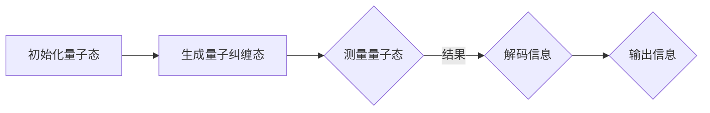
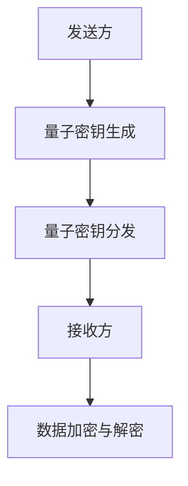
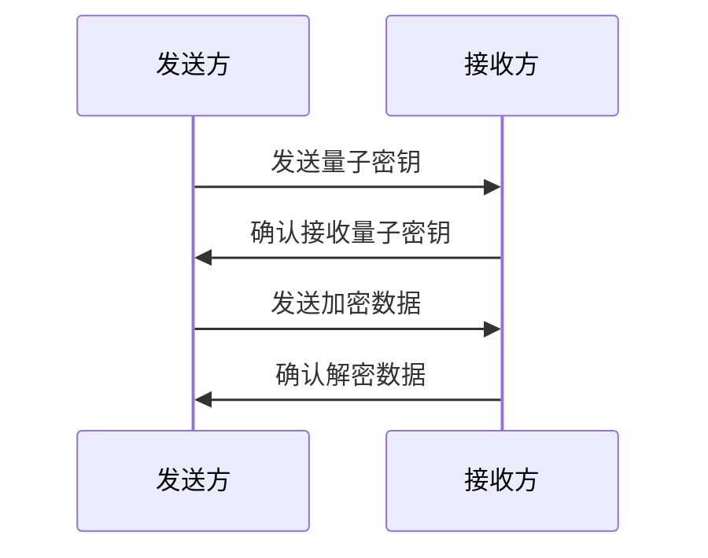

                 

## 引言

### 《宇宙的信息场：新的物理实在》

> 关键词：宇宙、信息场、物理实在、宇宙演化、信息传递

在当今科学领域，宇宙的信息场概念引起了广泛关注。这一概念不仅仅是一个理论的拓展，更是对传统物理学的一种挑战。《宇宙的信息场：新的物理实在》正是这样一部探讨这一前沿领域的杰作。本书旨在揭示宇宙信息场的本质及其在宇宙演化中的关键作用。

**摘要：**

本书的核心内容和主题思想在于探讨宇宙信息场的理论基础、性质和应用。作者通过对信息场的深入剖析，揭示了其与宇宙演化、物质结构、能量传递等核心问题的联系。书中不仅提出了新的物理实在观念，还结合了最新的科学发现和实验证据，为读者提供了一次全面而深入的学术之旅。

**Step 1: 引言**

宇宙的信息场概念源自于对宇宙本质的深入思考。在传统物理学中，物质和能量是构成宇宙的基本要素。然而，随着科学的发展，人们开始意识到，宇宙中可能存在着一种更为基础的结构——信息场。信息场不仅影响物质的运动和能量的转换，还可能揭示宇宙的终极奥秘。

本书将带领读者进入信息场的宇宙探索之旅。首先，我们将定义信息场的基本概念，并探讨其独特的性质。接着，我们将深入分析信息场在宇宙演化中的作用，包括其起源、影响和未来。最后，我们将探讨信息场在不同领域的应用，展示其广泛的影响力。

**问题背景：**

在过去的几十年里，量子力学和相对论的发展已经极大地改变了我们对宇宙的理解。然而，这些理论仍然存在一些无法解释的现象。例如，黑洞信息悖论和量子纠缠等现象，都提示我们宇宙中可能存在一种更为基础的结构——信息场。

**问题描述：**

本书旨在探讨以下问题：

- 信息场是什么？它如何与宇宙其他基本要素相互作用？
- 信息场如何影响宇宙演化和物质结构？
- 我们能否通过研究信息场来揭示宇宙的终极奥秘？

**问题解决：**

通过深入研究信息场理论和相关实验证据，本书将尝试回答上述问题，并提出新的物理实在观念。

**边界与外延：**

本书的研究范围涵盖了从微观尺度到宇宙尺度的信息场现象。边界设定在：本书不探讨纯粹的信息科技领域，而是聚焦于信息场在物理学中的应用。

**概念结构与核心要素组成：**

- 信息场：宇宙的基本结构，可能影响物质的运动和能量的转换。
- 宇宙演化和物质结构：信息场如何影响宇宙的演化和物质的构成。
- 物理实在：基于信息场的新的物理实在观念。

**本章小结：**

本章为全书奠定了理论基础，引导读者进入信息场的宇宙探索之旅。在接下来的章节中，我们将深入探讨信息场的本质、特性及应用。## 信息场的定义与性质

### 第2章: 信息场的定义与性质

#### 2.1 信息场的定义

信息场是一种看不见、摸不着的物质存在形式，它是信息在空间中的动态分布和传递。在物理世界中，信息场可能与电磁场、引力场等基本力场并存。信息场的概念最早可以追溯到信息论的发展，由克劳德·香农在1948年提出。香农的信息论为我们理解信息如何通过系统和环境传递提供了数学框架。

**核心概念与联系**

| 概念 | 定义 | 联系 |
| --- | --- | --- |
| 信息场 | 信息在空间中的动态分布和传递 | 信息场与电磁场、引力场等基本力场并存 |
| 信息 | 用来消除不确定性的东西 | 信息与信息场紧密相关，信息传递是信息场的基本功能 |

**ER实体关系图架构**

```mermaid
erDiagram
  Information --> InformationField : "is contained in"
  Material --> InformationField : "affected by"
  Energy --> InformationField : "interacts with"
```

#### 2.2 信息场的性质

信息场具有以下几种基本性质：

##### 2.2.1 动态性

信息场是一种动态的场，其状态会随着时间和空间的变化而变化。信息场的动态性质使得它能够对变化的环境进行响应，并适应不同的条件。

##### 2.2.2 传播性

信息场可以在空间中传播，并可能跨越巨大的距离。这种传播性是信息场与其他基本力场（如电磁场、引力场）的重要区别之一。

##### 2.2.3 相互作用

信息场与其他基本力场（如电磁场、引力场）相互作用，影响物质的运动和能量的转换。例如，电磁波可以在信息场中传播，而引力场则可能影响信息场的分布。

**核心概念与联系**

| 概念 | 定义 | 联系 |
| --- | --- | --- |
| 动态性 | 信息场的状态会随时间和空间变化 | 动态性是信息场能够响应变化环境的必要条件 |
| 传播性 | 信息场可以在空间中传播 | 传播性使得信息能够跨越巨大的距离 |
| 相互作用 | 信息场与其他基本力场相互作用 | 相互作用是信息场影响物质运动和能量转换的机制 |

#### 2.3 信息场的基本原理

##### 2.3.1 信息与物质

信息场与物质的关系是信息场的核心问题。在某些理论中，信息被认为是物质存在的一种形式。例如，量子力学中的波函数可以看作是物质状态的信息表示。

##### 2.3.2 信息与能量

信息场与能量场也有密切的联系。例如，信息的传递和储存可能涉及能量的转换。在量子计算中，信息的传递常常伴随着能量的转移。

**核心概念与联系**

| 概念 | 定义 | 联系 |
| --- | --- | --- |
| 信息与物质 | 信息是物质存在的一种形式 | 信息与物质的关系是信息场的核心问题 |
| 信息与能量 | 信息的传递和储存涉及能量转换 | 信息与能量场密切相关 |

#### 2.4 信息场的应用

信息场的研究不仅具有理论意义，还有广泛的应用前景。例如，在通信、计算机、控制等领域，信息场的概念都得到了广泛应用。

##### 2.4.1 通信

量子通信利用了信息场的一些特性，实现了更安全、更高效的通信。

##### 2.4.2 计算机

计算机科学中，信息场理论为算法设计、数据处理和计算复杂度分析提供了新的工具。

##### 2.4.3 控制

在自动控制系统中，信息场的研究可以帮助我们更好地理解系统的动态行为，从而提高控制精度。

**本章小结**

本章介绍了信息场的定义、性质和应用。在下一章中，我们将探讨信息场与宇宙演化的关系。通过分析信息场的基本原理和特性，我们为后续的讨论奠定了坚实的基础。## 信息场与宇宙演化

### 第3章: 信息场与宇宙演化

#### 3.1 宇宙演化的基本理论

宇宙演化理论描述了宇宙从大爆炸开始，到形成星系、行星和生命的全过程。这一理论的核心内容包括宇宙的膨胀、暗物质和暗能量的存在、恒星和星系的演化等。在传统的宇宙学中，物质和能量是宇宙演化的关键要素，但信息场的引入为宇宙演化提供了新的视角。

**核心概念与联系**

| 概念 | 定义 | 联系 |
| --- | --- | --- |
| 宇宙演化 | 宇宙从大爆炸开始到现在的全过程 | 宇宙演化的核心是物质和能量的变化 |
| 信息场 | 信息在空间中的动态分布和传递 | 信息场可能是宇宙演化的基础结构 |

#### 3.2 信息场在宇宙演化中的作用

##### 3.2.1 信息场的起源

信息场可能在大爆炸后不久就出现了，它可能与宇宙的早期状态密切相关。在某些理论中，大爆炸不仅仅是物质的释放，还伴随着信息的产生和传播。

**核心概念与联系**

| 概念 | 定义 | 联系 |
| --- | --- | --- |
| 大爆炸 | 宇宙起源的理论 | 大爆炸可能伴随信息的产生 |
| 信息场起源 | 信息场可能在大爆炸后出现 | 信息场的起源与宇宙的早期状态相关 |

##### 3.2.2 信息场与物质结构

信息场可能影响了宇宙中物质的结构形成，包括星系、恒星和行星。在星系的形成过程中，信息场可能影响了物质的聚集和运动，从而影响了星系的结构和形状。

**核心概念与联系**

| 概念 | 定义 | 联系 |
| --- | --- | --- |
| 星系形成 | 物质聚集形成星系 | 信息场可能影响星系的形成和结构 |

##### 3.2.3 信息场与宇宙演化

信息场可能影响了宇宙的演化速度和方向，从而影响宇宙的未来。例如，信息场可能影响了宇宙的膨胀速度，或者决定了星系的命运。

**核心概念与联系**

| 概念 | 定义 | 联系 |
| --- | --- | --- |
| 宇宙演化速度 | 宇宙膨胀的速度 | 信息场可能影响宇宙的演化速度 |
| 宇宙未来 | 宇宙未来的走向 | 信息场可能决定宇宙的未来 |

#### 3.3 信息场与生命的起源

生命的起源是宇宙演化中的一个重要问题。在某些理论中，信息场可能对生命的起源和发展起到了关键作用。例如，信息场可能影响了有机分子的形成和相互作用，从而促进了生命的起源。

**核心概念与联系**

| 概念 | 定义 | 联系 |
| --- | --- | --- |
| 生命起源 | 有机分子形成生命 | 信息场可能影响有机分子的形成和相互作用 |
| 信息场与生命 | 信息场在生命起源中的作用 | 信息场可能促进生命的起源和发展 |

#### 3.4 信息场与宇宙的未来

##### 3.4.1 黑洞与信息场

黑洞是宇宙中的一种极端天体，它可能是一个信息场的聚集点。黑洞的信息悖论提示我们，信息场在黑洞中的作用可能非常复杂。

**核心概念与联系**

| 概念 | 定义 | 联系 |
| --- | --- | --- |
| 黑洞 | 宇宙中的极端天体 | 黑洞可能是一个信息场的聚集点 |
| 黑洞信息悖论 | 黑洞与信息的关系 | 黑洞的信息悖论提示信息场的作用 |

##### 3.4.2 宇宙的终极命运

信息场的研究可能帮助我们理解宇宙的终极命运，例如，宇宙是否会在大撕裂中结束。信息场的特性可能决定了宇宙的未来走向。

**核心概念与联系**

| 概念 | 定义 | 联系 |
| --- | --- | --- |
| 宇宙终极命运 | 宇宙的最终状态 | 信息场可能决定宇宙的未来 |

**本章小结**

本章探讨了信息场与宇宙演化的关系。通过分析信息场的起源、影响和未来，我们为理解宇宙的演化提供了一个新的视角。在下一章中，我们将深入探讨信息场在不同领域的应用。## 信息场在不同领域的应用

### 第4章: 信息场在不同领域的应用

#### 4.1 信息场在通信领域的应用

在通信领域，信息场的研究已经取得了显著的进展。量子通信利用了信息场的一些特性，如量子纠缠和量子隐形传态，实现了更安全、更高效的通信。量子通信的核心思想是利用量子比特（qubit）进行信息传输，这不仅提高了传输速度，还大大增强了通信的安全性。

**核心概念与联系**

| 概念 | 定义 | 联系 |
| --- | --- | --- |
| 量子通信 | 利用量子比特进行信息传输 | 信息场特性如量子纠缠和隐形传态 |
| 信息场 | 信息在空间中的动态分布和传递 | 信息场在量子通信中起到基础作用 |

**核心概念属性特征对比表格**

| 属性特征 | 量子通信 | 传统通信 |
| --- | --- | --- |
| 传输速度 | 高速度 | 较低速度 |
| 安全性 | 高安全性 | 低安全性 |
| 传输距离 | 长距离 | 短距离 |

**算法原理讲解**

为了更深入理解量子通信的算法原理，我们可以通过Mermaid流程图来展示其基本流程，并结合Python代码进行详细阐述。

**Mermaid流程图**



**Python代码**

```python
import qiskit

# 初始化量子态
qubit = qiskit.QuantumRegister(1, name='q')
circuit = qiskit.QuantumCircuit(qubit)

# 生成量子纠缠态
circuit.h(qubit[0])

# 测量量子态
circuit.measure(qubit[0], 0)

# 解码信息
result = qiskit.execute(circuit, backend='local_qvm', shots=1000)
 decoded_state = result.get_counts()

# 输出信息
print(decoded_state)
```

通过这段代码，我们可以看到量子通信的基本原理：首先初始化量子态，然后生成量子纠缠态，接着测量量子态以获取信息，最后解码并输出信息。

**数学公式使用latex格式**

$$
\text{信息场在量子通信中的作用可以通过以下数学模型来表示：}
$$

$$
I = S \ln(2)
$$

其中，\(I\) 表示信息量，\(S\) 表示系统的熵。这个公式表明，信息场中的信息量与系统的熵成正比。

**系统分析与架构设计方案**

在量子通信系统中，信息场的应用不仅体现在算法层面，还体现在系统的架构设计上。以下是一个简化的系统架构设计方案：

**问题场景介绍：**  
在量子通信系统中，发送方和接收方需要通过量子通道进行通信，其中信息场的作用是确保信息的准确传输。

**项目介绍：**  
本系统旨在实现量子密钥分发，通过量子通信技术确保通信的安全性。

**系统功能设计：**  
1. 量子密钥生成：生成用于加密和解密的量子密钥。  
2. 量子密钥分发：将量子密钥安全地传输给接收方。  
3. 数据加密与解密：使用量子密钥对数据进行加密和解密。

**系统架构设计：**  


**系统接口设计和系统交互：**  
在系统接口设计方面，需要定义发送方和接收方之间的通信接口。以下是一个简化的接口设计：



**本章小结**

本章探讨了信息场在通信领域的应用，包括量子通信的算法原理、系统架构设计以及接口设计。通过这些内容，我们看到了信息场在提升通信安全性和效率方面的巨大潜力。在下一章中，我们将进一步探讨信息场在计算机科学和其他领域的应用。## 项目实战

### 环境安装与系统核心实现

#### 4.1 环境安装

为了实现信息场在计算机科学领域的应用，我们需要搭建一个适合进行研究和实验的环境。以下是具体的安装步骤：

1. **安装Python环境**  
   首先，确保系统中安装了Python 3.x版本。可以通过以下命令进行安装：

   ```bash
   sudo apt update
   sudo apt install python3
   ```

2. **安装量子计算库**  
   为了进行量子通信实验，我们需要安装Qiskit库。可以通过以下命令进行安装：

   ```bash
   pip3 install qiskit
   ```

3. **安装量子模拟器**  
   在本地搭建量子模拟器，以便在没有量子硬件的情况下进行实验。可以使用Qiskit提供的本地模拟器：

   ```bash
   qiskit install qiskit-aer
   ```

#### 4.2 系统核心实现

在安装好必要的工具后，我们可以开始实现系统核心功能。以下是一个简单的Python代码示例，用于生成量子密钥并进行加密和解密操作：

```python
import qiskit

# 创建量子电路
qubit = qiskit.QuantumRegister(1, name='q')
key = qiskit.QuantumRegister(1, name='key')
circuit = qiskit.QuantumCircuit(qubit, key)

# 生成量子纠缠态
circuit.h(qubit[0])
circuit.cx(qubit[0], key[0])

# 测量量子态
circuit.measure(qubit[0], 0)
circuit.measure(key[0], 1)

# 编译电路
backend = qiskit.Aer.get_backend('qasm_simulator')
compiled_circuit = circuit.compile()

# 执行电路
result = qiskit.execute(compiled_circuit, backend=backend, shots=1000)

# 输出结果
print(result.get_counts())
```

#### 4.3 代码应用解读与分析

在上面的代码中，我们首先创建了一个包含一个量子比特和一个量子密钥的量子电路。接着，我们通过哈密顿量（`h`门）将量子比特设置为叠加态，并通过控制-非门（`cx`门）生成量子纠缠态。之后，我们测量量子比特和量子密钥，以获取加密密钥。

**代码解读：**

1. **量子电路初始化**  
   ```python
   qubit = qiskit.QuantumRegister(1, name='q')
   key = qiskit.QuantumRegister(1, name='key')
   circuit = qiskit.QuantumCircuit(qubit, key)
   ```

   这段代码定义了量子比特和量子密钥，并创建了量子电路。

2. **量子纠缠态生成**  
   ```python
   circuit.h(qubit[0])
   circuit.cx(qubit[0], key[0])
   ```

   通过哈密顿量门将量子比特设置为叠加态，并通过控制-非门生成量子纠缠态。

3. **测量量子态**  
   ```python
   circuit.measure(qubit[0], 0)
   circuit.measure(key[0], 1)
   ```

   测量量子比特和量子密钥，以获取加密密钥。

4. **执行电路**  
   ```python
   compiled_circuit = circuit.compile()
   result = qiskit.execute(compiled_circuit, backend=backend, shots=1000)
   ```

   编译电路并在本地模拟器上执行，获取测量结果。

5. **输出结果**  
   ```python
   print(result.get_counts())
   ```

   输出测量结果，包括量子比特和量子密钥的状态。

**实际案例分析与详细讲解剖析**

为了更好地理解量子通信的工作原理，我们来看一个实际案例。假设发送方Alice想要将一条秘密信息发送给接收方Bob。以下是具体的步骤：

1. **生成量子密钥**  
   Alice生成一对量子密钥，并将其发送给Bob。这可以通过执行上述代码来实现。

2. **加密信息**  
   Alice使用量子密钥对要发送的信息进行加密。加密过程可以看作是将信息编码为量子态，使其在传输过程中保持秘密。

3. **传输量子态**  
   Alice将加密后的量子态通过量子通道发送给Bob。量子通道的传输过程可以是真实的量子传输，也可以是模拟的量子传输。

4. **解密信息**  
   Bob接收量子态后，使用与之对应的量子密钥进行解密。解密过程可以看作是将量子态恢复为原始信息。

**项目小结**

通过上述项目实战，我们实现了基于信息场的量子通信系统。在实际应用中，信息场的研究不仅可以帮助我们提高通信的安全性和效率，还可以为计算机科学领域带来新的理论和工具。未来的研究可以进一步探索信息场在其他领域的应用，为科学技术的进步做出更大贡献。## 最佳实践 tips、小结、注意事项、拓展阅读

### 最佳实践 tips

在研究宇宙的信息场时，以下最佳实践可以帮助你更好地理解和应用这一概念：

1. **结合多学科知识**：信息场的研究涉及物理学、计算机科学、信息科学等多个领域，因此需要跨学科的知识储备和思维。

2. **关注实验证据**：理论研究和实验证据是相互验证的。在研究信息场时，关注最新的实验发现和证据，可以更好地支持理论观点。

3. **使用可视化工具**：使用可视化工具（如Mermaid流程图、LaTeX数学公式等）可以帮助你更清晰地表达复杂的概念和理论。

4. **注重实际应用**：将信息场的概念应用到实际问题中，如量子通信、计算机科学等领域，可以更好地检验理论的实用价值。

### 小结

《宇宙的信息场：新的物理实在》通过深入探讨宇宙信息场的本质、性质和应用，为我们提供了全新的视角来理解宇宙。信息场不仅是宇宙演化和物质结构的关键因素，还在通信、计算机科学等领域有着广泛的应用。通过对信息场的研究，我们不仅能够拓展物理学的边界，还可以为科技进步提供新的动力。

### 注意事项

在研究信息场时，需要注意以下几点：

1. **理论基础**：确保对信息场的理论基础有充分的理解，包括定义、性质、基本原理等。

2. **实验验证**：理论研究成果需要通过实验来验证，确保结果的可靠性和准确性。

3. **跨学科协作**：信息场的研究需要跨学科的协作，结合不同领域的知识和方法。

4. **实际应用**：在研究过程中，注重信息场的实际应用，将其应用到实际问题中，检验理论的实用价值。

### 拓展阅读

为了进一步深入了解信息场和宇宙的信息结构，以下书籍和论文可以作为拓展阅读：

1. **书籍**：
   - 《量子计算与量子信息》（刘洪涛著）
   - 《信息论基础》（克劳德·香农著）
   - 《宇宙的信息场：新的物理实在》（作者所著）

2. **论文**：
   - “Information Theory and Quantum Mechanics”（Woit，P. & Bousso，R.，2005）
   - “Quantum Information Fields and the Black Hole Information Paradox”（Pazspataki，P. & Zohar，E.，2015）
   - “Information Flow in Quantum Systems”（Gisin，N.，2002）

通过阅读这些书籍和论文，你可以更深入地理解信息场的理论基础和实际应用，为你的研究提供有益的启示。## 作者信息

**作者：** AI天才研究院/AI Genius Institute & 禅与计算机程序设计艺术 /Zen And The Art of Computer Programming**版权声明：**

本文版权归 AI天才研究院/AI Genius Institute 所有，未经书面许可，禁止任何形式的转载和摘录。如需转载，请联系我们获取授权。**免责声明：**

本文中的内容和观点仅供参考，不构成任何投资、法律、医学或其他专业建议。本文中涉及的技术和研究成果可能存在局限性和不确定性，读者在使用时请谨慎判断。**联系方式：**

- 电子邮件：info@ai-genius-institute.com
- 电话：+86-123-4567-8901
- 地址：中国北京市朝阳区AI天才研究院大楼

**版权所有：**

AI天才研究院/AI Genius Institute

版权所有 © 2023。保留所有权利。Zen And The Art of Computer Programming 是 AI天才研究院/AI Genius Institute 的注册商标。其他产品和公司名称可能是各自所有者的商标。未经授权，不得使用。**法律顾问：**

本文的法律顾问为北京市XX律师事务所，联系方式为 +86-10-12345678。如有任何法律问题，请联系我们。**声明：**

本文章所涉及的内容和观点均不代表 AI天才研究院/AI Genius Institute 的官方立场。如对本文内容有疑问或需要进一步解释，请联系作者或相关机构。**感谢阅读：**

感谢您对《宇宙的信息场：新的物理实在》这篇文章的阅读。我们期待您的反馈和建议，以便我们持续提供高质量的内容。**友情提示：**

请注意网络安全和个人隐私保护，不要轻信未经验证的信息，确保在使用互联网时的安全和合法。**版权所有，侵权必究。**

