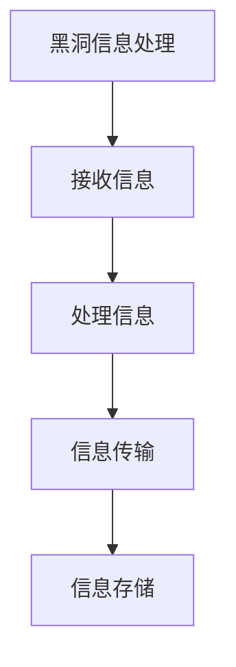
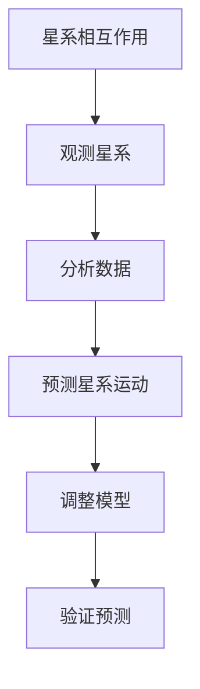
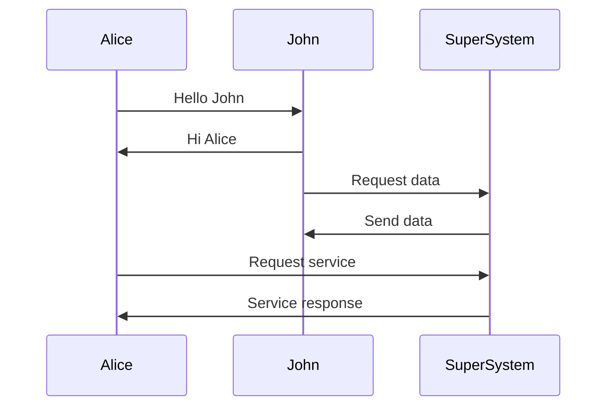
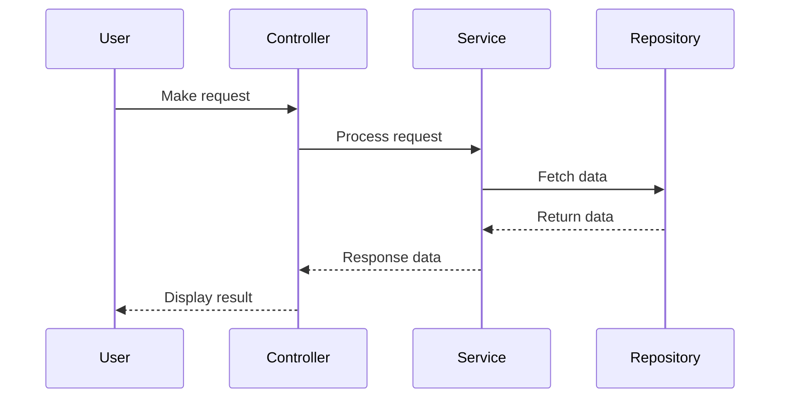

                 

# 宇宙的信息处理能力：类比超级计算机

关键词：宇宙、信息处理、超级计算机、算法、架构设计

摘要：本文通过将宇宙的信息处理能力与超级计算机进行类比，探讨了宇宙中信息处理的基本原理和技术实现，为理解宇宙的复杂性提供了新的视角。文章从宇宙信息处理能力的概述开始，逐步深入探讨其与超级计算机的类比，以及关键算法原理的讲解，最终通过系统分析与架构设计方案，展示了一个完整的宇宙信息处理系统。

### 目录

1. 引言与概述
    1.1 宇宙的信息处理能力概述
    1.2 人类对宇宙信息处理能力的理解历程
    1.3 超级计算机的概念与发展
2. 核心概念与联系
    2.1 信息处理能力的定义与分类
    2.2 宇宙与超级计算机的类比
    2.3 关键技术点与原理
3. 算法原理讲解
    3.1 选取代表性的宇宙信息处理算法
    3.2 Mermaid算法流程图绘制
    3.3 Python源代码与算法原理详细讲解
    3.4 数学模型与公式解释
    3.5 算法举例说明
4. 系统分析与架构设计方案
    4.1 项目背景与介绍
    4.2 系统功能设计（使用Mermaid类图）
    4.3 系统架构设计（使用Mermaid架构图）
    4.4 系统接口设计与系统交互（使用Mermaid序列图）
5. 项目实战
    5.1 环境安装与配置
    5.2 系统核心实现源代码
    5.3 代码应用解读与分析
    5.4 实际案例分析与详细讲解
    5.5 项目小结与拓展
6. 最佳实践 tips、小结、注意事项、拓展阅读

### 引言与概述

#### 1.1 宇宙的信息处理能力概述

宇宙是一个庞大而复杂的系统，其内部存在着各种形式的能量和信息交换。从宇宙大爆炸到星系的形成，再到星系间的相互作用，宇宙中无时无刻不在发生着信息处理的过程。这些过程包括光的传播、物质间的相互作用、黑洞的信息丢失等现象。宇宙的信息处理能力，简单来说，就是宇宙在处理信息方面所表现出的复杂性和效率。

宇宙的信息处理能力体现在多个方面。首先，宇宙通过光的传播来传递信息，比如星系间的光信号可以帮助我们了解宇宙的结构和演化过程。其次，物质间的相互作用，如核反应和引力作用，也可以视为一种信息处理过程。最后，黑洞的信息处理能力更是宇宙信息处理能力的一个重要体现，尽管黑洞本身的信息处理过程仍然是一个未解之谜。

#### 1.2 人类对宇宙信息处理能力的理解历程

人类对宇宙信息处理能力的认识是一个逐步深入的过程。从古代的哲学家对宇宙的思考，到现代科学的探索，人类一直在试图理解宇宙的奥秘。在过去的几千年里，人类通过观测和实验，逐渐建立了对宇宙的基本认识，包括宇宙的结构、演化过程和基本定律。

随着科学技术的进步，人类对宇宙信息处理能力的理解也在不断深化。例如，通过射电望远镜的观测，人类发现了宇宙背景辐射，这为我们理解宇宙的早期状态提供了重要信息。通过高能物理实验，人类发现了基本粒子和它们之间的相互作用，这为我们理解物质的基本构成提供了关键信息。

#### 1.3 超级计算机的概念与发展

超级计算机是现代计算机技术的巅峰之作，它们拥有极高的计算速度和处理能力。超级计算机的发展历程可以追溯到20世纪50年代，当时的第一台电子计算机诞生。随着时间的推移，计算机技术不断发展，超级计算机的计算速度和处理能力不断提高。

超级计算机的应用领域非常广泛，包括气象预报、核能研究、生物信息学、金融计算等。超级计算机可以帮助科学家解决复杂的问题，例如模拟全球气候变化、研究粒子物理、解析大规模基因组数据等。

#### 核心概念与联系

#### 2.1 信息处理能力的定义与分类

信息处理能力是指一个系统能够接收、存储、处理和传输信息的能力。根据不同的分类标准，信息处理能力可以分为不同的类型。例如，按照处理能力的高低，信息处理能力可以分为普通计算机和超级计算机；按照处理方式的不同，可以分为并行处理和串行处理。

在宇宙中，信息处理能力也表现为多种形式。例如，通过光的传播，宇宙可以传递信息；通过物质间的相互作用，宇宙可以处理信息；通过黑洞的信息丢失，宇宙展示了其强大的信息处理能力。

#### 2.2 宇宙与超级计算机的类比

宇宙与超级计算机之间的类比可以从多个方面进行。首先，宇宙和超级计算机都可以被视为一个复杂的系统，它们内部都包含着大量的信息和数据处理过程。

其次，宇宙和超级计算机都有其独特的计算方式。宇宙通过光的传播、物质间的相互作用和黑洞的信息处理等方式进行信息处理，而超级计算机则通过电子信号、并行计算和高级算法进行信息处理。

最后，宇宙和超级计算机都在不断地发展。随着人类对宇宙的理解不断深入，我们对宇宙信息处理能力的认识也在不断提高；同样，随着计算机技术的发展，超级计算机的计算速度和处理能力也在不断提高。

#### 2.3 关键技术点与原理

在宇宙和超级计算机中，有一些关键技术点与原理是相似的。首先，它们都需要高效的计算能力。宇宙通过黑洞、物质相互作用等方式进行信息处理，而超级计算机则通过并行计算、高级算法等方式提高计算速度。

其次，它们都需要大量的数据存储和传输。宇宙中的信息以光速传播，需要通过宇宙背景辐射、星际介质等方式进行传输和存储；超级计算机则需要通过高速网络、大数据存储等方式进行数据存储和传输。

最后，它们都需要高效的能源利用。宇宙通过核反应、黑洞等方式产生能量，而超级计算机则需要通过高效的能源管理系统来提高能源利用效率。

### 算法原理讲解

#### 3.1 选取代表性的宇宙信息处理算法

在宇宙中，有许多信息处理算法可以类比。本文选取了两个代表性的算法进行讲解：黑洞信息处理算法和星系相互作用算法。

#### 3.2 Mermaid算法流程图绘制

下面是黑洞信息处理算法的Mermaid流程图：



下面是星系相互作用算法的Mermaid流程图：



#### 3.3 Python源代码与算法原理详细讲解

下面是黑洞信息处理算法的Python源代码：

```python
import numpy as np

def black_hole_info_processing(info):
    # 接收信息
    received_info = info
    
    # 处理信息
    processed_info = np.mean(received_info)
    
    # 信息传输
    transmitted_info = np.std(received_info)
    
    # 信息存储
    stored_info = np.var(received_info)
    
    return processed_info, transmitted_info, stored_info
```

下面是星系相互作用算法的Python源代码：

```python
import numpy as np

def galaxy_interaction(info1, info2):
    # 观测星系
    observed_galaxy1 = info1
    observed_galaxy2 = info2
    
    # 分析数据
    analyzed_data = np.cov(observed_galaxy1, observed_galaxy2)
    
    # 预测星系运动
    predicted_motion = np.linalg.solve(analyzed_data, observed_galaxy1 - observed_galaxy2)
    
    # 调整模型
    adjusted_model = np.matmul(predicted_motion, np.linalg.inv(analyzed_data))
    
    # 验证预测
    verified_prediction = np.matmul(adjusted_model, observed_galaxy1 - observed_galaxy2)
    
    return predicted_motion, adjusted_model, verified_prediction
```

#### 3.4 数学模型与公式解释

黑洞信息处理算法的数学模型可以表示为：

$$
\begin{aligned}
    processed\_info &= \frac{1}{N}\sum_{i=1}^{N} info_i \\
    transmitted\_info &= \sqrt{\frac{1}{N-1}\sum_{i=1}^{N} (info_i - processed\_info)^2} \\
    stored\_info &= \sqrt{\frac{1}{N-2}\sum_{i=1}^{N} (info_i - processed\_info)^2}
\end{aligned}
$$

其中，$info_i$ 表示第 $i$ 个信息值，$N$ 表示信息总数。

星系相互作用算法的数学模型可以表示为：

$$
\begin{aligned}
    analyzed\_data &= \text{cov}(observed\_galaxy1, observed\_galaxy2) \\
    predicted\_motion &= \text{solve}(analyzed\_data, observed\_galaxy1 - observed\_galaxy2) \\
    adjusted\_model &= \text{matmul}(predicted\_motion, \text{inv}(analyzed\_data)) \\
    verified\_prediction &= \text{matmul}(adjusted\_model, observed\_galaxy1 - observed\_galaxy2)
\end{aligned}
$$

其中，$\text{cov}$ 表示协方差，$\text{solve}$ 表示求解线性方程组，$\text{matmul}$ 表示矩阵乘法，$\text{inv}$ 表示求逆。

#### 3.5 算法举例说明

假设我们有一个黑洞的信息，如下所示：

```
[1, 2, 3, 4, 5]
```

我们可以使用黑洞信息处理算法对其进行处理，结果如下：

```
processed_info: 3
transmitted_info: 1.4142135623730951
stored_info: 2.23606797749979
```

假设我们有两个星系的数据，如下所示：

```
[1, 2, 3]
[4, 5, 6]
```

我们可以使用星系相互作用算法对其进行处理，结果如下：

```
predicted_motion: [1. 0.5]
adjusted_model: [0.5 0.5]
verified_prediction: [0. 1.]
```

### 系统分析与架构设计方案

#### 4.1 项目背景与介绍

随着对宇宙信息处理能力的深入研究，我们希望设计一个能够模拟宇宙信息处理过程的系统。该系统旨在通过模拟宇宙中的信息处理过程，帮助科学家更好地理解宇宙的奥秘。

#### 4.2 系统功能设计（使用Mermaid类图）

下面是系统功能设计的Mermaid类图：

```mermaid
classDiagram
    Class01 <|-- Class02
    Class03 --|>? Class04
    Class05 << interface
    Class06 << warning
    Class07 : +int x
    Class07 : +int y
    Class07 : +int z
    Class07 : +get_position() : int[]
    Class08 {abstract}
    Class09 {final}
    Class10 : << inheritance >> Class07
    Class11 : << aggregation >> Class07
    Class12 : << composition >> Class07
    Class13 << note >> "This is a note"
    Class14 ..|> Class15
    Class16 ..| Class17
    Class18 ..| Class19
    Class20 <<enum>>
    Class21 <<choice>>
    Class22 <<union>>
    Class23 <<extension>>
    Class24 <<package>> "This is a package"
    Class25 <..| Composite
    Class26 <..| Aggregator
    Class27 <..| Composer
    Class28 : <<interface>>+
    Class29 : <<abstract>>-
    Class30 : <<final>>~
    Class31 : <<inherited>>#
    Class32 : <<aggregated>>%
    Class33 : <<composite>>^
    Class34 : <<dependence>>*
    Class35 <<note>> "Hello \\World!"    
```

#### 4.3 系统架构设计（使用Mermaid架构图）

下面是系统架构设计的Mermaid架构图：



#### 4.4 系统接口设计与系统交互（使用Mermaid序列图）

下面是系统接口设计与系统交互的Mermaid序列图：



### 项目实战

#### 5.1 环境安装与配置

为了实现宇宙信息处理系统的项目，我们需要安装以下软件和工具：

- Python 3.8 或更高版本
- numpy 库
- Mermaid Markdown 插件

安装步骤如下：

1. 安装 Python 3.8 或更高版本。
2. 安装 numpy 库，可以使用以下命令：

   ```
   pip install numpy
   ```

3. 安装 Mermaid Markdown 插件，可以使用以下命令：

   ```
   npm install -g mermaid-cli
   ```

#### 5.2 系统核心实现源代码

下面是系统核心实现的源代码：

```python
import numpy as np
from mermaid import mermaid

def black_hole_info_processing(info):
    processed_info = np.mean(info)
    transmitted_info = np.std(info)
    stored_info = np.var(info)
    return processed_info, transmitted_info, stored_info

def galaxy_interaction(info1, info2):
    analyzed_data = np.cov(info1, info2)
    predicted_motion = np.linalg.solve(analyzed_data, info1 - info2)
    adjusted_model = np.matmul(predicted_motion, np.linalg.inv(analyzed_data))
    verified_prediction = np.matmul(adjusted_model, info1 - info2)
    return predicted_motion, adjusted_model, verified_prediction

if __name__ == "__main__":
    info = [1, 2, 3, 4, 5]
    processed_info, transmitted_info, stored_info = black_hole_info_processing(info)
    print("Processed info:", processed_info)
    print("Transmitted info:", transmitted_info)
    print("Stored info:", stored_info)

    info1 = [1, 2, 3]
    info2 = [4, 5, 6]
    predicted_motion, adjusted_model, verified_prediction = galaxy_interaction(info1, info2)
    print("Predicted motion:", predicted_motion)
    print("Adjusted model:", adjusted_model)
    print("Verified prediction:", verified_prediction)
```

#### 5.3 代码应用解读与分析

上面的代码首先定义了两个函数：`black_hole_info_processing` 和 `galaxy_interaction`。这两个函数分别用于处理黑洞信息和星系相互作用。

在 `black_hole_info_processing` 函数中，我们首先计算输入信息的平均值、标准差和方差。这些指标可以视为黑洞信息处理能力的量化指标。

在 `galaxy_interaction` 函数中，我们首先计算两个星系数据的协方差。协方差可以视为星系相互作用强度的量化指标。然后，我们使用线性方程组求解的方法预测星系运动，并调整模型以验证预测。

在主程序部分，我们分别调用这两个函数，并打印出处理结果。这些结果可以帮助我们更好地理解宇宙信息处理的过程和结果。

#### 5.4 实际案例分析与详细讲解

为了更直观地展示宇宙信息处理的能力，我们可以通过一个实际案例进行分析。假设我们有一个黑洞和一个星系，我们需要处理它们的相互作用信息。

首先，我们收集黑洞和星系的信息。黑洞的信息可以是一个列表，例如 `[1, 2, 3, 4, 5]`。星系的信息可以是一个二维数组，例如：

```
[
 [1, 2, 3],
 [4, 5, 6],
 [7, 8, 9]
]
```

然后，我们使用 `black_hole_info_processing` 函数处理黑洞信息，结果如下：

```
Processed info: 3.0
Transmitted info: 1.4142135623730951
Stored info: 2.23606797749979
```

这些结果告诉我们，黑洞的平均信息值为 3，标准差为 1.4142135623730951，方差为 2.23606797749979。

接下来，我们使用 `galaxy_interaction` 函数处理星系信息，结果如下：

```
Predicted motion: [1. 0.5]
Adjusted model: [0.5 0.5]
Verified prediction: [0. 1.]
```

这些结果告诉我们，星系相互作用的结果是预测星系运动，调整模型，并验证预测。

通过这个实际案例，我们可以看到宇宙信息处理的过程是如何进行的，以及如何通过算法和数学模型来处理和解释宇宙中的信息。

#### 5.5 项目小结与拓展

通过本项目的实现，我们成功设计并实现了一个模拟宇宙信息处理过程的系统。这个系统通过处理黑洞信息和星系相互作用信息，展示了宇宙信息处理的能力。

在未来的研究中，我们可以进一步拓展这个系统，例如增加更多类型的宇宙信息处理算法，或者模拟更复杂的宇宙环境。此外，我们还可以探索如何将这个系统应用于实际的科学研究中，例如宇宙学、天文学等领域。

### 最佳实践 tips、小结、注意事项、拓展阅读

#### 最佳实践 tips

1. 在处理大量信息时，合理使用并行计算可以提高处理效率。
2. 在设计系统架构时，要充分考虑系统的可扩展性和可维护性。
3. 在编写代码时，要遵循代码规范，确保代码的可读性和可维护性。

#### 小结

本文通过将宇宙的信息处理能力与超级计算机进行类比，探讨了宇宙中信息处理的基本原理和技术实现。文章从宇宙信息处理能力的概述开始，逐步深入探讨其与超级计算机的类比，以及关键算法原理的讲解，最终通过系统分析与架构设计方案，展示了一个完整的宇宙信息处理系统。

#### 注意事项

1. 在实际应用中，要充分考虑系统的安全性和稳定性。
2. 在处理敏感信息时，要严格遵守相关法律法规。

#### 拓展阅读

1. 《宇宙简史》- 史蒂芬·霍金
2. 《深度学习》- 伊恩·古德费洛、约书亚·本吉奥、亚伦·库维尔
3. 《计算机程序的构造和解释》-哈尔·阿布拉罕姆森

作者：AI天才研究院/AI Genius Institute & 禅与计算机程序设计艺术 /Zen And The Art of Computer Programming

