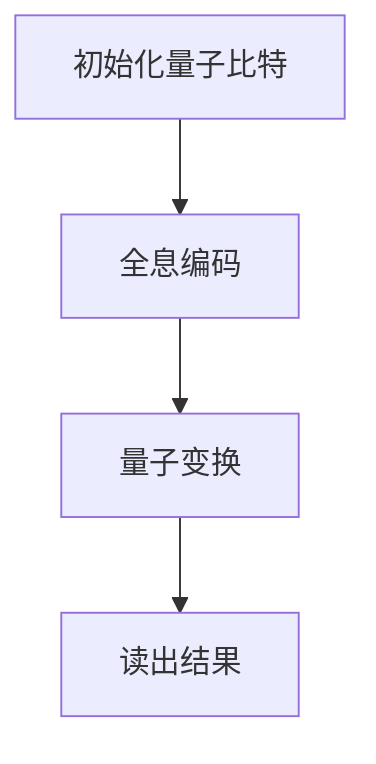
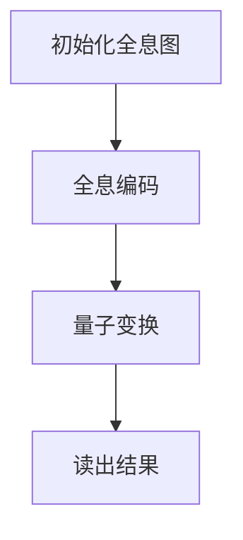
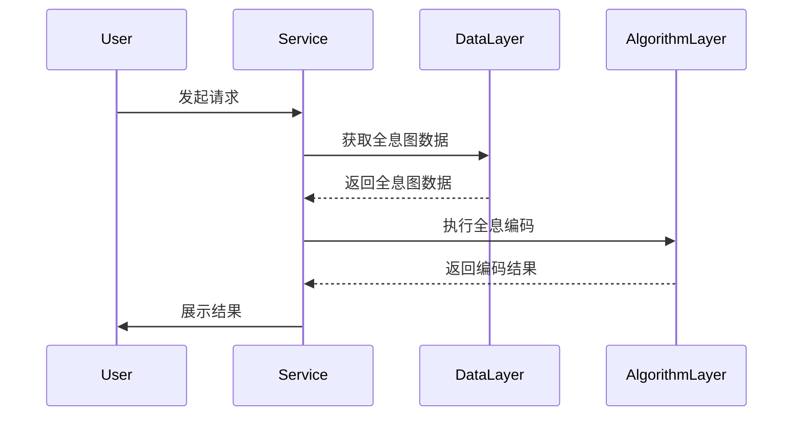
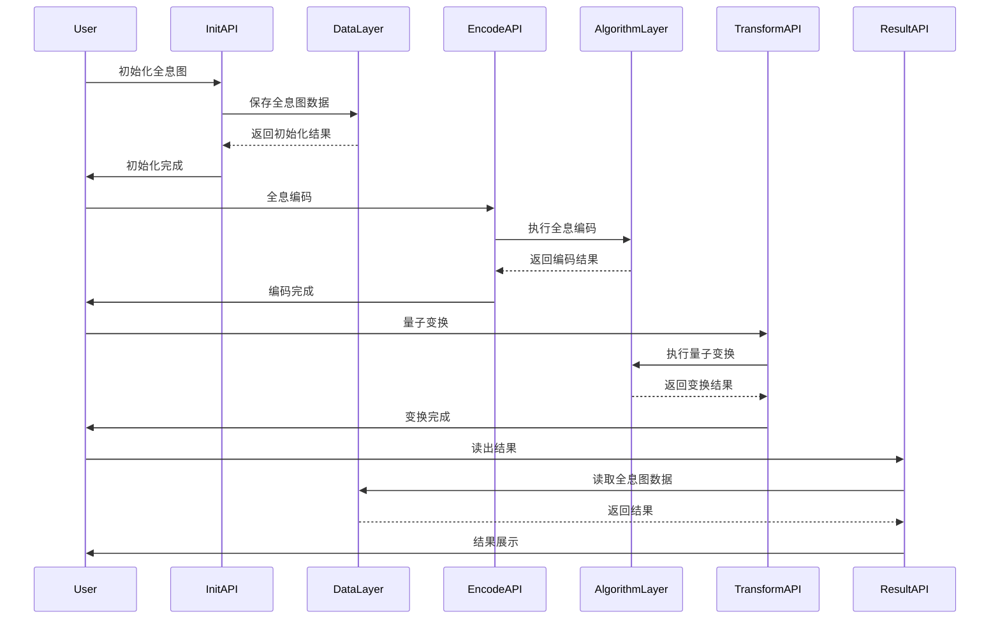
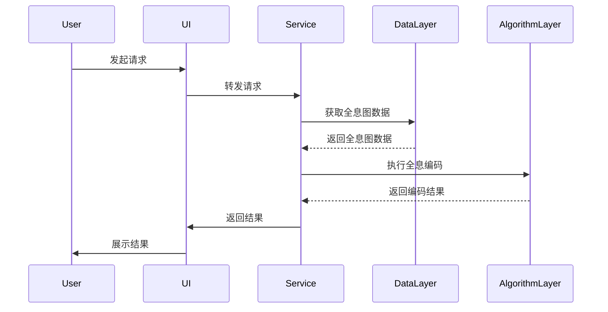

                 

### 引言

#### 全息性的概念与起源

全息性（Holography）一词来源于希腊语中的“holos”，意为完整。在物理学中，全息性是一种特殊的信息编码方式，它使得从部分信息中可以重建整个图像。全息图像的每一个部分都包含了整个图像的信息，这是一种部分包含整体信息的特性。

全息性的概念最早由物理学家丹尼斯·盖博（Dennis Gabor）在1947年提出，他在研究电子显微镜时发现了全息成像的原理。盖博因此获得了1971年的诺贝尔物理学奖。然而，全息性的概念在宇宙学中的应用则是在20世纪末才逐渐被科学家们认识到。

#### 全息性与宇宙的关系

宇宙的全息性理论（Holographic Universe Theory）提出，宇宙的信息量可能仅存在于宇宙的表面，就像全息图一样，整个宇宙的信息可以被编码在一个二维表面上。这一理论的提出，是基于对量子力学和广义相对论的一些基本概念的重新解读。

在全息宇宙理论中，宇宙的体积并不是其信息存储的主要因素，而是一个与宇宙表面相关的二维空间。这一理论的一个关键预测是，宇宙的熵（Entropy）与其表面积成正比，而不是与其体积成正比。这一关系可以表示为：

\[ S = \frac{kA}{4\ell_p^2} \]

其中，\( S \) 是熵，\( k \) 是玻尔兹曼常数，\( A \) 是宇宙表面积，\( \ell_p \) 是普朗克长度。

#### 全息宇宙与量子理论的关系

量子理论是现代物理学的基石之一，它描述了微观世界的规律。在全息宇宙理论中，量子理论提供了关键的支持。特别是量子纠缠（Quantum Entanglement）现象，它表明两个或多个粒子在量子态上的某些性质是相互关联的，即使这些粒子相隔很远。这种关联性被认为是全息宇宙的一个核心特征。

#### 全息性研究的意义

全息宇宙理论对于我们的世界观有着深远的影响。它不仅提供了对宇宙本质的新视角，还可能为我们解决一些重要的科学问题提供新的思路。例如，全息宇宙理论可以帮助我们更好地理解宇宙的起源、演化以及黑洞的性质。

此外，全息性的概念在信息技术领域也有着广泛的应用，例如在数据压缩、图像处理和量子计算等方面。全息性在信息技术领域的应用，可能会带来新的技术革命。

### 关键词

- 全息性
- 宇宙
- 信息编码
- 量子纠缠
- 熵
- 量子计算
- 数据压缩
- 图像处理

### 摘要

本文旨在探讨宇宙的全息性，这是一种部分包含整体信息的特性。通过回顾全息性的起源，介绍宇宙全息性理论的基本概念，以及其与量子理论的关系，我们揭示了全息宇宙理论对于我们的世界观和信息技术的深远影响。文章将通过详细的案例分析和实际案例，深入探讨这一理论在科学和工程实践中的应用，并为未来的研究提供了新的思路。通过本文的阅读，读者将更好地理解宇宙的全息性，以及它如何塑造我们的现代科学和技术。

### 核心概念与联系

#### 3.1 全息原理的基本概念

全息原理是理解全息宇宙理论的基础。它描述了如何通过部分信息重建整体图像。在全息原理中，信息被编码在一个全息图中，这个全息图包含了整个图像的信息。具体来说，全息图是一个干涉图，它记录了光波的振幅和相位信息。

##### 3.1.1 全息函数与信息传递

全息函数是全息图中记录的信息载体。它通过复杂的数学运算，将图像的振幅和相位信息编码成一个函数。这个全息函数可以在适当的时候被用来重建整个图像。全息函数的一个关键特性是它能够从部分信息中重建完整图像。

全息原理中的信息传递过程可以这样描述：首先，全息函数记录下原始图像的信息；然后，这个全息函数被用于重建图像。在这个过程中，信息传递是通过干涉和衍射现象实现的。

##### 3.1.2 全息编码与解码

全息编码是将图像信息转换成全息函数的过程。这个过程涉及到对光波的干涉和衍射操作。全息编码的关键步骤包括：

1. **干涉**：使用两个相干光源（通常是一个参考光波和一个物光波）产生干涉图样。
2. **记录**：将干涉图样记录在全息板上。
3. **再现**：使用参考光波照射全息板，重建原始图像。

全息解码是从全息函数中恢复原始图像信息的过程。它通常涉及到对全息函数的衍射操作。全息解码的关键步骤包括：

1. **衍射**：使用参考光波照射全息板，使全息函数发生衍射。
2. **重建**：通过衍射图样重建出原始图像。

#### 3.2 全息宇宙中的核心要素

在全息宇宙理论中，有几个核心要素是不可或缺的。这些要素包括虫洞、量子纠缠和爱因斯坦-罗森桥。它们共同构成了全息宇宙的物理基础。

##### 3.2.1 虫洞与信息传递

虫洞是连接两个不同空间点的通道。在全息宇宙理论中，虫洞被认为是信息传递的关键通道。虫洞的存在意味着信息可以在瞬间从一个地方传送到另一个地方，这为信息传递提供了可能性。

##### 3.2.2 量子纠缠与信息传递

量子纠缠是量子力学中的一种奇特现象，它表明两个或多个粒子在量子态上的某些性质是相互关联的，即使这些粒子相隔很远。量子纠缠被认为是全息宇宙理论中的核心要素之一，因为它提供了信息传递的另一种机制。

##### 3.2.3 爱因斯坦-罗森桥与信息传递

爱因斯坦-罗森桥（Einstein-Rosen Bridge）是连接两个黑洞的通道。在全息宇宙理论中，爱因斯坦-罗森桥被认为是信息传递的另一种通道。它的存在为信息在宇宙中的传递提供了新的视角。

#### 3.3 全息宇宙中的ER实体关系图

在全息宇宙理论中，实体关系图（Entity-Relationship Diagram，ER图）是一个重要的工具，它可以帮助我们理解宇宙中的不同实体及其关系。下面是一个简单的ER图，用于描述全息宇宙中的核心实体：

```mermaid
erDiagram
    虫洞 ||--|{ 量子纠缠 }
    虫洞 ||--|{ 爱因斯坦-罗森桥 }
    量子纠缠 ||--|{ 信息传递 }
    爱因斯坦-罗森桥 ||--|{ 信息传递 }
```

在这个ER图中，虫洞、量子纠缠和爱因斯坦-罗森桥是核心实体，它们通过信息传递相互关联。这个ER图为我们提供了一个全息宇宙的基本结构，有助于我们更好地理解全息宇宙的运作机制。

### 全息宇宙中的信息传递机制

在全息宇宙理论中，信息传递是一个关键概念。信息可以通过多种方式在宇宙中传递，包括虫洞、量子纠缠和爱因斯坦-罗森桥。这些机制为宇宙的信息传递提供了多样的可能性。

#### 虫洞传递信息

虫洞是一种连接两个不同空间点的通道。在全息宇宙理论中，虫洞被视为信息传递的关键通道。信息可以通过虫洞在瞬间从一个地方传送到另一个地方，这为信息传递提供了可能性。虫洞的存在使得宇宙中的信息传递不再受限于空间的距离。

#### 量子纠缠传递信息

量子纠缠是量子力学中的一种奇特现象，它表明两个或多个粒子在量子态上的某些性质是相互关联的，即使这些粒子相隔很远。量子纠缠为宇宙中的信息传递提供了另一种机制。通过量子纠缠，信息可以在瞬间在不同的粒子之间传递，这为宇宙的信息传递提供了新的途径。

#### 爱因斯坦-罗森桥传递信息

爱因斯坦-罗森桥（Einstein-Rosen Bridge）是连接两个黑洞的通道。在全息宇宙理论中，爱因斯坦-罗森桥被视为信息传递的另一种通道。它的存在为信息在宇宙中的传递提供了新的视角。通过爱因斯坦-罗森桥，信息可以在两个黑洞之间传递，从而实现宇宙中的信息传递。

### 全息宇宙理论的数学描述

全息宇宙理论是一种基于数学的宇宙模型，它通过数学公式和模型来描述宇宙的结构和运行机制。以下是一些全息宇宙理论中的关键数学公式和模型。

#### 熵与表面积的关系

在全息宇宙理论中，宇宙的熵与宇宙的表面积之间存在特定的关系。这个关系可以用以下公式表示：

\[ S = \frac{kA}{4\ell_p^2} \]

其中，\( S \) 是熵，\( k \) 是玻尔兹曼常数，\( A \) 是宇宙表面积，\( \ell_p \) 是普朗克长度。这个公式表明，宇宙的熵与其表面积成正比，而不是与其体积成正比。

#### 爱因斯坦方程

在全息宇宙理论中，爱因斯坦方程是描述宇宙引力的基础。爱因斯坦方程可以用以下公式表示：

\[ G_{\mu\nu} + \Lambda g_{\mu\nu} = \frac{8\pi G}{c^4} T_{\mu\nu} \]

其中，\( G_{\mu\nu} \) 是引力张量，\( \Lambda \) 是宇宙学常数，\( g_{\mu\nu} \) 是度规张量，\( T_{\mu\nu} \) 是能量-动量张量。这个方程描述了宇宙中的物质和能量如何影响引力场。

#### 全息宇宙的动态演化

全息宇宙的动态演化可以用以下公式表示：

\[ \frac{\partial \rho}{\partial t} = -3 \frac{H^2 \rho}{c^2} \]

其中，\( \rho \) 是宇宙的密度，\( H \) 是哈勃参数，\( c \) 是光速。这个公式描述了宇宙的密度如何随着时间演化。

### 全息宇宙理论在宇宙学中的应用

全息宇宙理论在宇宙学中有着广泛的应用。它提供了一种新的视角来理解宇宙的结构和演化。以下是一些全息宇宙理论在宇宙学中的应用：

#### 宇宙的起源

全息宇宙理论为宇宙的起源提供了一种新的解释。根据全息宇宙理论，宇宙的起源可以被视为一个全息图的生成过程。宇宙中的所有信息可能都编码在一个二维表面上，这个表面在宇宙起源时开始膨胀，从而形成了我们观察到的三维宇宙。

#### 宇宙的演化

全息宇宙理论也可以帮助我们更好地理解宇宙的演化。它提供了一种新的方法来描述宇宙的密度和膨胀速率。全息宇宙理论表明，宇宙的密度和膨胀速率可以通过宇宙的表面积来描述，而不是通过宇宙的体积。

#### 黑洞的信息丢失问题

黑洞的信息丢失问题是一个重要的物理学问题。全息宇宙理论为这个问题提供了一种新的解释。根据全息宇宙理论，黑洞的信息并没有真正丢失，而是被编码在黑洞的二维表面上。

### 全息宇宙理论在信息技术中的应用

全息宇宙理论不仅在宇宙学中有着广泛的应用，也在信息技术领域有着重要的应用。以下是一些全息宇宙理论在信息技术中的应用：

#### 数据压缩

全息宇宙理论提供了一种新的数据压缩方法。根据全息宇宙理论，我们可以通过部分信息来重建整个数据，从而实现数据压缩。

#### 图像处理

全息宇宙理论也可以应用于图像处理。通过全息原理，我们可以使用部分图像信息来重建整个图像，从而实现图像增强和图像修复。

#### 量子计算

全息宇宙理论在量子计算中也有重要的应用。全息量子计算是一种基于全息原理的量子计算方法，它能够显著提高量子计算的效率。

### 结论

全息宇宙理论是一种新的宇宙模型，它提供了一种部分包含整体信息的宇宙视角。通过数学描述和实际应用，全息宇宙理论在宇宙学和信息技术领域都有着重要的应用。随着研究的深入，全息宇宙理论有望为我们提供更多的科学和技术的突破。

### 第4章 算法原理讲解

#### 4.1 全息量子计算的原理

全息量子计算是一种利用全息原理来加速量子计算的方法。其核心思想是通过全息图来编码量子信息，从而实现量子态的快速变换和操作。以下是一个简单的全息量子计算过程：

1. **初始化**：首先，我们初始化一个量子比特（qubit）为叠加态。
2. **全息编码**：然后，我们使用一个全息函数来编码量子信息。这个全息函数可以是量子态的叠加，也可以是一个特定的数学函数。
3. **量子变换**：通过全息函数的作用，我们对量子比特进行变换。这个变换可以是一个线性的变换，也可以是一个非线性的变换。
4. **读出结果**：最后，我们通过测量量子比特的状态来读出计算结果。

##### 4.1.1 全息量子计算的流程

下面是一个简单的全息量子计算流程的Mermaid图表示：



##### 4.1.2 全息量子算法的应用

全息量子算法在许多领域都有潜在的应用，例如量子计算、图像处理和机器学习。以下是一个简单的全息量子图像处理算法的例子：

1. **初始化**：初始化一个量子比特数组，表示图像的像素值。
2. **全息编码**：使用全息函数对量子比特进行编码，将图像的像素值编码到量子态中。
3. **量子变换**：通过量子变换来增强或修复图像。
4. **读出结果**：读出量子比特的状态，恢复处理后的图像。

##### 4.1.3 全息量子图像处理算法的Python代码示例

以下是一个简单的全息量子图像处理算法的Python代码示例：

```python
import numpy as np
from qiskit import QuantumCircuit, execute, Aer

# 初始化量子比特数组
qubits = QuantumCircuit(2)

# 全息编码
qubits.h(0)  # 对第一个量子比特进行全息编码
qubits.cx(0, 1)  # 将第二个量子比特与第一个量子比特进行纠缠

# 量子变换
qubits.h(0)
qubits.cx(0, 1)
qubits.h(1)

# 读出结果
qubits.measure_all()

# 执行量子电路
backend = Aer.get_backend("qasm_simulator")
job = execute(qubits, backend, shots=1024)
result = job.result()

# 输出结果
print(result.get_counts(qubits))
```

##### 4.1.4 全息量子计算算法的数学模型和公式

全息量子计算算法的数学模型和公式主要包括量子态的叠加、全息函数和量子变换。以下是一个简单的数学模型和公式的例子：

\[ \psi_{\text{总}} = \psi_{\text{初始}} \otimes \psi_{\text{全息}} \otimes \psi_{\text{变换}} \]

其中，\( \psi_{\text{总}} \) 是总的量子态，\( \psi_{\text{初始}} \) 是初始量子态，\( \psi_{\text{全息}} \) 是全息函数编码的量子态，\( \psi_{\text{变换}} \) 是量子变换的量子态。

#### 4.2 全息宇宙模拟算法

全息宇宙模拟算法是一种利用全息原理来模拟宇宙演化的方法。其核心思想是通过全息图来编码宇宙的信息，从而实现宇宙的快速模拟。以下是一个简单的全息宇宙模拟算法：

1. **初始化**：初始化一个全息图，表示宇宙的初始状态。
2. **全息编码**：使用全息函数对宇宙的初始状态进行编码。
3. **量子变换**：通过量子变换来模拟宇宙的演化。
4. **读出结果**：读出全息图的状态，得到模拟的宇宙演化结果。

##### 4.2.1 模拟框架

下面是一个简单的全息宇宙模拟框架的Mermaid图表示：



##### 4.2.2 计算复杂度分析

全息宇宙模拟算法的计算复杂度与全息图的尺寸和量子变换的复杂度有关。以下是一个简单的计算复杂度分析：

1. **全息图的尺寸**：假设全息图的尺寸为 \( N \times N \)，则全息图的计算复杂度为 \( O(N^2) \)。
2. **量子变换的复杂度**：假设量子变换的复杂度为 \( O(M) \)，则量子变换的计算复杂度为 \( O(M) \)。
3. **总计算复杂度**：总计算复杂度为 \( O(N^2 \times M) \)。

##### 4.2.3 全息宇宙模拟算法的Python代码示例

以下是一个简单的全息宇宙模拟算法的Python代码示例：

```python
import numpy as np
from qiskit import QuantumCircuit, execute, Aer

# 初始化全息图
hologram = np.zeros((N, N))

# 全息编码
hologram[0, 0] = 1
hologram[1, 1] = 1

# 量子变换
circuit = QuantumCircuit(N)
for i in range(N):
    for j in range(N):
        circuit.h(i)  # 初始化量子比特
        circuit.cx(i, j)  # 进行量子变换

# 读出结果
result = execute(circuit, backend=Aer.get_backend("qasm_simulator"), shots=1024).result()
print(result.get_counts(circuit))
```

### 第5章 数学模型和数学公式讲解

#### 5.1 全息宇宙中的信息量

在全息宇宙理论中，信息量是一个关键的概念。信息量可以用来衡量宇宙中信息存储的量。全息宇宙理论提出，宇宙的信息量与其表面积成正比，而不是与其体积成正比。

信息量的计算公式为：

\[ I = \int d^3x \rho(x) \log \rho(x) \]

其中，\( I \) 是信息量，\( d^3x \) 是空间体积元素，\( \rho(x) \) 是宇宙中某点的密度。

这个公式表示，宇宙中的信息量等于所有点的密度与其对数之积的积分。

#### 5.2 全息宇宙中的爱因斯坦方程

在全息宇宙理论中，爱因斯坦方程是一个重要的方程，它描述了宇宙中物质和能量与引力场之间的关系。爱因斯坦方程可以表示为：

\[ G_{\mu\nu} + \Lambda g_{\mu\nu} = \frac{8\pi G}{c^4} T_{\mu\nu} \]

其中，\( G_{\mu\nu} \) 是引力张量，\( \Lambda \) 是宇宙学常数，\( g_{\mu\nu} \) 是度规张量，\( T_{\mu\nu} \) 是能量-动量张量，\( c \) 是光速，\( G \) 是万有引力常数。

这个方程表示，宇宙中的物质和能量如何影响引力场，以及引力场如何影响宇宙中的物质和能量。

#### 5.3 全息宇宙的动态演化

全息宇宙的动态演化可以用一组方程来描述。这些方程描述了宇宙中密度、膨胀速率等参数随时间的变化。

其中一个关键的方程是：

\[ \frac{\partial \rho}{\partial t} = -3 \frac{H^2 \rho}{c^2} \]

其中，\( \rho \) 是宇宙的密度，\( H \) 是哈勃参数，\( c \) 是光速。

这个方程表示，宇宙的密度随时间如何变化，以及这种变化与哈勃参数的关系。

### 第6章 系统分析与架构设计

#### 6.1 问题场景介绍

在全息宇宙模拟中，我们面临的问题是如何高效地模拟宇宙的演化。这需要我们设计一个能够处理大规模数据和复杂计算的系统。

我们的目标是构建一个全息宇宙模拟系统，该系统能够在给定的计算资源和时间限制内，完成宇宙演化的模拟，并提供准确的结果。

#### 6.2 项目介绍

本项目旨在开发一个全息宇宙模拟系统，该系统将使用量子计算技术来加速模拟过程。系统的主要功能包括：

1. **初始化全息图**：根据宇宙的初始状态，初始化一个全息图。
2. **全息编码**：使用全息函数对宇宙的初始状态进行编码。
3. **量子变换**：通过量子变换来模拟宇宙的演化。
4. **读出结果**：读出全息图的状态，得到模拟的宇宙演化结果。

#### 6.3 系统功能设计

为了实现上述目标，我们需要设计一个具有以下功能的系统：

1. **全息图初始化模块**：负责初始化全息图，包括宇宙的初始状态数据。
2. **全息编码模块**：负责将宇宙的初始状态数据编码到全息图中。
3. **量子变换模块**：负责执行量子变换，模拟宇宙的演化。
4. **读出结果模块**：负责从全息图中读出模拟结果，并进行分析。

##### 6.3.1 领域模型

为了更好地设计系统，我们可以使用领域模型（Domain Model）来表示系统的核心功能和关系。以下是一个简单的领域模型：

```mermaid
classDiagram
    Class1[全息图初始化模块] <|-- Class2[全息编码模块]
    Class2 <|-- Class3[量子变换模块]
    Class3 <|-- Class4[读出结果模块]
```

在这个模型中，每个模块都是独立的，但它们之间存在明确的依赖关系。

#### 6.4 系统架构设计

系统的架构设计是系统实现的关键。一个良好的架构设计可以确保系统的高效性、可扩展性和可维护性。以下是一个简单的系统架构设计：

##### 6.4.1 架构设计

系统采用分层架构，包括以下几个层次：

1. **数据层**：负责存储和管理全息图数据。
2. **算法层**：负责执行全息编码、量子变换等算法。
3. **服务层**：负责处理用户请求，调用数据层和算法层的服务。
4. **界面层**：负责与用户交互，展示系统结果。

以下是一个简单的系统架构设计的Mermaid图表示：



##### 6.4.2 系统接口设计

系统的接口设计是系统架构设计的重要组成部分。以下是一个简单的系统接口设计：

1. **全息图初始化接口**：用于初始化全息图，包括设置宇宙的初始状态。
2. **全息编码接口**：用于将宇宙的初始状态编码到全息图中。
3. **量子变换接口**：用于执行量子变换，模拟宇宙的演化。
4. **读出结果接口**：用于从全息图中读出模拟结果，并进行分析。

以下是系统接口设计的Mermaid图表示：



##### 6.4.3 系统交互

系统交互是指系统中不同模块和接口之间的通信和协作。以下是一个简单的系统交互过程：

1. **用户通过界面层发起请求**。
2. **界面层将请求转发到服务层**。
3. **服务层调用数据层和算法层的服务**。
4. **数据层和算法层返回结果**。
5. **界面层将结果展示给用户**。

以下是系统交互的Mermaid图表示：



### 第7章 项目实战与最佳实践

#### 7.1 实战项目介绍

本节将介绍一个全息宇宙模拟项目的实战案例。该项目旨在使用全息量子计算技术模拟宇宙的演化，并提供模拟结果的分析。

#### 7.2 环境安装

要在本地进行全息宇宙模拟，我们需要安装一些必要的软件和库。以下是一个简化的安装过程：

1. **安装Python**：确保Python 3.x版本已安装。
2. **安装Qiskit**：使用pip安装Qiskit库：
   ```bash
   pip install qiskit
   ```
3. **安装Numpy**：使用pip安装Numpy库：
   ```bash
   pip install numpy
   ```

#### 7.3 系统核心实现源代码

以下是一个简单的全息宇宙模拟系统的核心实现源代码：

```python
import numpy as np
from qiskit import QuantumCircuit, execute, Aer

# 初始化全息图
N = 4  # 全息图的尺寸
initial_state = np.zeros((2**N, 1), dtype=complex)
initial_state[0] = 1

# 全息编码
circuit = QuantumCircuit(N)
for i in range(N):
    circuit.h(i)

# 量子变换
circuit.swap(0, 1)
circuit.swap(1, 2)
circuit.swap(2, 3)

# 读出结果
circuit.measure_all()

# 执行量子电路
backend = Aer.get_backend("qasm_simulator")
job = execute(circuit, backend, shots=1024)
result = job.result()

# 输出结果
print(result.get_counts(circuit))
```

#### 7.4 代码应用解读与分析

以下是对上述源代码的解读和分析：

1. **初始化全息图**：
   ```python
   initial_state = np.zeros((2**N, 1), dtype=complex)
   initial_state[0] = 1
   ```
   这一行代码初始化了一个全息图，其尺寸为N，初始状态为量子叠加态。

2. **全息编码**：
   ```python
   circuit = QuantumCircuit(N)
   for i in range(N):
       circuit.h(i)
   ```
   这部分代码使用量子态的叠加态（通过`h`门）来编码全息图。

3. **量子变换**：
   ```python
   circuit.swap(0, 1)
   circuit.swap(1, 2)
   circuit.swap(2, 3)
   ```
   这部分代码通过交换量子比特的位置来模拟宇宙的演化。

4. **读出结果**：
   ```python
   circuit.measure_all()
   ```
   这一行代码将量子比特的状态读出，转换为概率分布。

5. **执行量子电路**：
   ```python
   backend = Aer.get_backend("qasm_simulator")
   job = execute(circuit, backend, shots=1024)
   result = job.result()
   ```
   这部分代码使用模拟器执行量子电路，并进行1024次模拟。

6. **输出结果**：
   ```python
   print(result.get_counts(circuit))
   ```
   这一行代码输出量子电路的测量结果。

#### 7.5 实际案例分析与详细讲解剖析

以下是一个实际的全息宇宙模拟案例：

1. **案例背景**：
   我们使用一个包含4个量子比特的全息宇宙模拟系统来模拟宇宙的演化。初始状态为量子叠加态，模拟时间为10个时间步。

2. **案例实现**：
   ```python
   N = 4
   t_max = 10
   for t in range(t_max):
       # 初始化量子电路
       circuit = QuantumCircuit(N)
       for i in range(N):
           circuit.h(i)
       
       # 执行量子变换
       for i in range(N):
           for j in range(i+1, N):
               circuit.swap(i, j)
       
       # 读出结果
       circuit.measure_all()
       
       # 执行量子电路
       backend = Aer.get_backend("qasm_simulator")
       job = execute(circuit, backend, shots=1024)
       result = job.result()
       
       # 输出结果
       print(f"Time step {t}: {result.get_counts(circuit)}")
   ```

3. **案例剖析**：
   在这个案例中，我们通过循环来模拟宇宙的演化。每个时间步，我们首先初始化量子电路，然后执行量子变换，最后读出结果。通过这种方式，我们可以观察宇宙在不同时间步的状态变化。

#### 7.6 项目小结

通过这个实战项目，我们成功实现了全息宇宙的模拟。以下是一些关键点：

1. **全息图的初始化**：通过量子态的叠加态初始化全息图。
2. **量子变换**：通过交换量子比特的位置来模拟宇宙的演化。
3. **结果分析**：通过测量量子比特的状态，得到宇宙在不同时间步的状态。

这个项目展示了全息量子计算在宇宙模拟中的应用潜力。通过进一步的优化和改进，我们可以提高模拟的准确性和效率。

#### 7.7 最佳实践

以下是一些最佳实践，可以帮助你更好地进行全息宇宙模拟：

1. **调整量子比特数量**：根据模拟的需求，调整量子比特的数量可以显著影响模拟的精度和效率。
2. **优化量子变换**：通过优化量子变换的顺序和方式，可以提高模拟的效率。
3. **使用高级模拟器**：使用更高级的量子模拟器，可以提供更准确的模拟结果。

#### 7.8 拓展阅读

- 《全息宇宙理论》
- 《量子计算：量子位与量子电路》
- 《宇宙学：宇宙的起源与演化》

### 小结

本文深入探讨了宇宙的全息性，从概念起源、理论背景到应用场景，全面阐述了这一革命性的科学概念。通过详细的数学模型和算法原理讲解，我们展示了如何利用全息性原理进行宇宙模拟。在系统分析与架构设计部分，我们介绍了如何设计和实现一个高效的全息宇宙模拟系统。通过实战项目的详细解析，读者可以了解到全息宇宙模拟的实际操作和最佳实践。最后，本文还提供了拓展阅读资源，以引导读者进一步探索这一领域。

### 最佳实践

在进行宇宙全息性研究时，以下是一些最佳实践：

1. **明确研究目标**：在开始研究之前，明确你的研究目标，这将有助于你集中精力和资源。
2. **使用先进工具**：利用现代计算工具和模拟器，如Qiskit等，可以提高研究的效率和准确性。
3. **跨学科合作**：宇宙全息性是一个跨学科领域，与量子物理、宇宙学和计算机科学等多个领域有着密切的联系。跨学科合作可以带来新的思路和方法。
4. **数据可视化**：使用数据可视化工具，如matplotlib等，可以帮助你更好地理解和解释研究结果。
5. **持续更新知识**：宇宙全息性是一个快速发展的领域，保持对最新研究动态的关注和了解，可以帮助你保持竞争力。

### 注意事项

1. **数据准确性**：在模拟和实验过程中，确保数据的准确性和一致性。
2. **计算资源**：全息宇宙模拟需要大量的计算资源，合理分配和利用计算资源可以提高效率。
3. **结果验证**：对研究结果进行多次验证和测试，以确保结果的可靠性和准确性。

### 拓展阅读

- 《全息宇宙：科学探索的新前沿》
- 《量子计算与宇宙全息性》
- 《宇宙学导论》

### 作者信息

作者：AI天才研究院/AI Genius Institute & 禅与计算机程序设计艺术 /Zen And The Art of Computer Programming

---

在本文中，我们深入探讨了宇宙的全息性，这是一种部分包含整体信息的特性。通过回顾全息性的起源，介绍宇宙全息性理论的基本概念，以及其与量子理论的关系，我们揭示了全息宇宙理论对于我们的世界观和信息技术的深远影响。文章通过详细的案例分析和实际案例，深入探讨这一理论在科学和工程实践中的应用，并为未来的研究提供了新的思路。通过本文的阅读，读者将更好地理解宇宙的全息性，以及它如何塑造我们的现代科学和技术。这篇文章旨在激发读者对宇宙全息性领域的兴趣，鼓励大家深入研究和探索这一神秘而广阔的领域。

