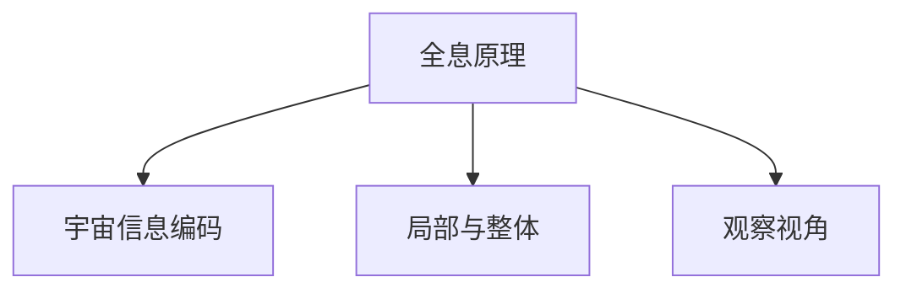
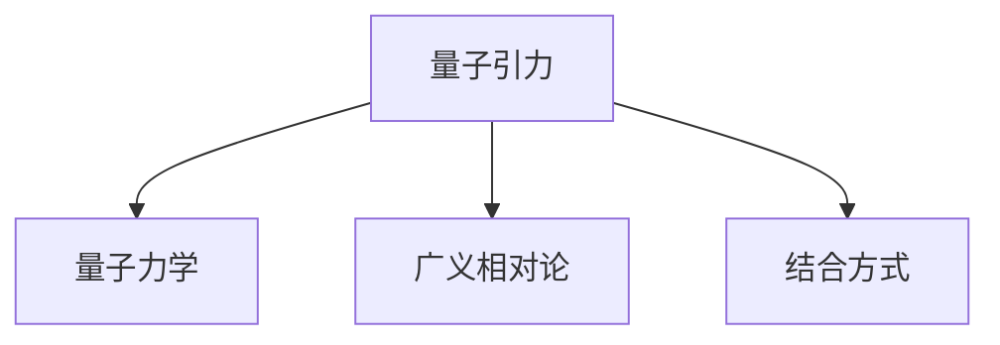
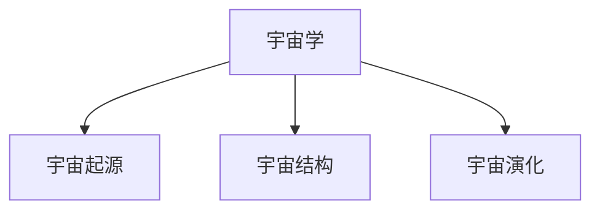
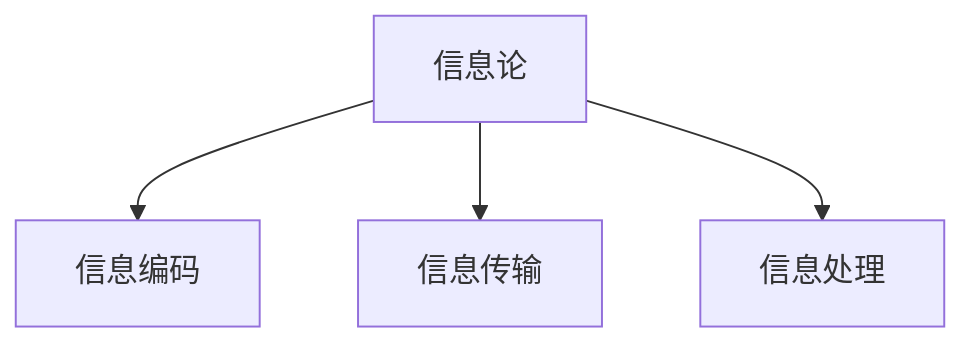
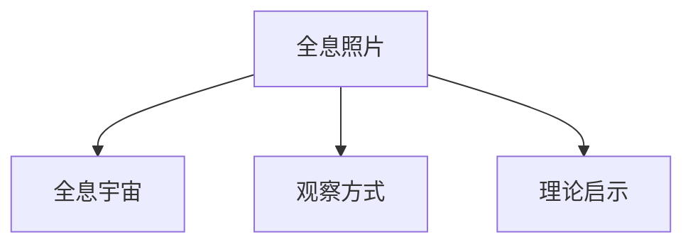
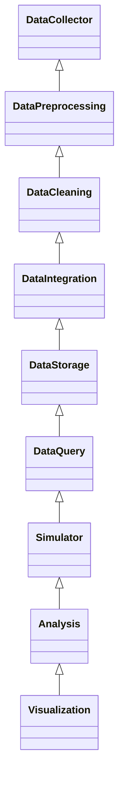
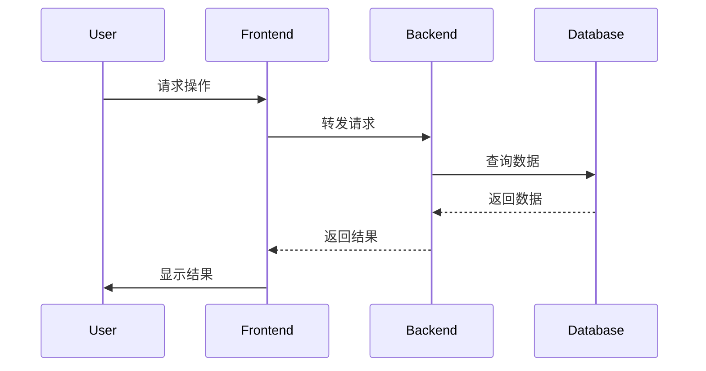
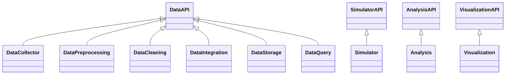
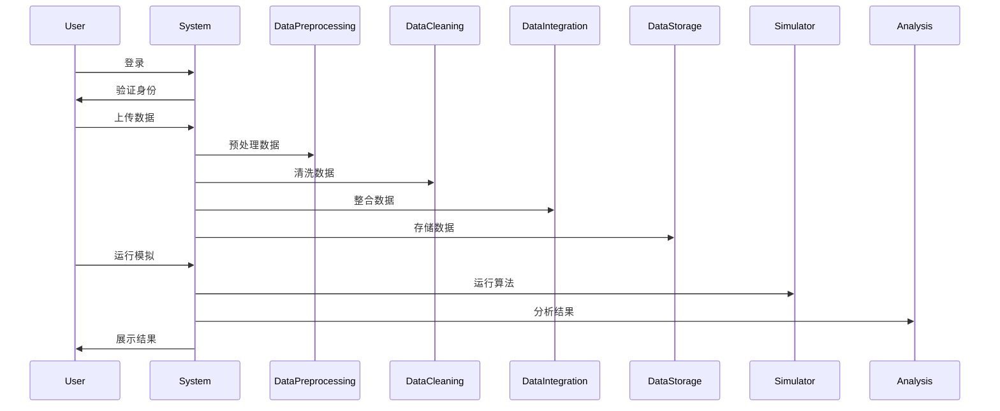

                 

# 宇宙的全息性：部分包含整体信息的可能

> 关键词：全息宇宙、宇宙信息编码、量子引力、宇宙学、信息论

> 摘要：本文将探讨宇宙的全息性这一概念，通过解析全息宇宙理论的背景、核心概念、应用与挑战，揭示宇宙中部分包含整体信息的可能性。本文旨在为读者提供对宇宙信息编码和全息宇宙理论的全面理解，并激发对这一领域进一步研究的兴趣。

### 第1章 引言：宇宙的全息性概念解析

#### 1.1.1 问题背景

在物理学的浩瀚宇宙中，我们不断探索宇宙的奥秘和基本规律。近年来，全息宇宙理论逐渐成为研究热点，它为我们提供了一种全新的视角来理解宇宙的构造。全息宇宙理论的基本概念源于全息原理，该原理最早由物理学家吉姆·爱德华兹（Jim Edward）于20世纪80年代提出。

全息宇宙理论的核心思想是：宇宙的信息是部分包含整体信息的。这一理论试图解释为什么宇宙的宏观现象可以通过其局部来理解。例如，一张全息照片通过二维表面就可以展示出完整的三维图像，这启示我们宇宙中的信息可能也存在类似的编码方式。

#### 1.1.2 问题描述

全息宇宙理论的核心问题是：宇宙的复杂性和信息是否可以在一个较小的区域内编码？这一问题的提出，源自于我们对宇宙信息编码方式的困惑。传统的宇宙模型认为，宇宙的信息分布在三维空间中，但是这种观点无法解释宇宙的某些现象，如宇宙背景辐射的均匀性。全息宇宙理论提供了一种新的思路，即宇宙的信息可能编码在二维表面中。

#### 1.1.3 问题解决

全息宇宙理论的提出旨在解决宇宙中的信息编码问题。通过对量子力学、相对论和宇宙学的研究，科学家们提出了一种可能的全息宇宙模型，即宇宙中的所有信息可能都编码在宇宙表面的二维空间中。这一理论不仅为我们提供了理解宇宙的新途径，也为研究黑洞、量子引力和宇宙起源提供了新的视角。

#### 1.1.4 边界与外延

全息宇宙理论的研究边界涉及多个学科领域，包括量子物理、相对论和宇宙学。同时，这一理论的应用也在不断扩展，从基础理论研究到宇宙学、天体物理学和量子信息科学等领域。

#### 1.1.5 概念结构与核心要素组成

全息宇宙理论的核心概念包括：

1. **全息原理**：宇宙的信息编码在二维表面中。
2. **量子引力**：全息宇宙理论需要量子引力理论的支撑。
3. **宇宙学**：研究宇宙的起源、结构和演化。
4. **信息论**：宇宙的信息处理和编码。

### 第2章 全息宇宙理论的历史与发展

#### 2.1.1 理论起源

全息宇宙理论的起源可以追溯到1982年，当时物理学家吉姆·爱德华兹在研究量子引力问题时提出了全息原理。这一理论受到全息照片的启发，即三维图像可以编码在二维的媒介上。爱德华兹提出，宇宙中的信息也可能遵循类似的规律。

#### 2.1.2 理论发展

自爱德华兹提出全息原理以来，全息宇宙理论得到了广泛关注和深入研究。许多物理学家尝试将这一理论应用于宇宙学，探讨宇宙的起源和演化。同时，全息宇宙理论也与其他物理学理论如量子力学、相对论等进行了交叉研究。

#### 2.1.3 现代进展

近年来，全息宇宙理论在宇宙学、量子信息和黑洞物理学等领域取得了重要进展。例如，科学家们通过观测宇宙微波背景辐射，尝试验证全息宇宙理论的预测。这些研究不仅加深了我们对宇宙的理解，也为全息宇宙理论的发展提供了新的证据。

### 第3章 全息宇宙理论的核心概念与原理

#### 3.1 全息原理

全息原理是全息宇宙理论的核心，它提出宇宙中的所有信息都可以编码在一个二维的表面上。这个表面被称为“全息边界”。全息原理的核心思想是，宇宙的复杂信息可以通过二维表面来编码和展示。

#### 3.2 量子引力

量子引力是全息宇宙理论的基础。它试图将量子力学和广义相对论结合起来，以解释宇宙的基本结构和演化。量子引力研究的是微观尺度下的引力现象，它为我们理解宇宙的信息编码提供了重要的理论支持。

#### 3.3 宇宙学

宇宙学是研究宇宙的起源、结构和演化的一门学科。在全息宇宙理论中，宇宙学的研究为验证全息原理提供了重要依据。通过对宇宙背景辐射、宇宙膨胀等宇宙学现象的研究，科学家们试图找到全息宇宙理论的证据。

#### 3.4 信息论

信息论是研究信息传递和处理的一门学科。在全息宇宙理论中，信息论提供了理解宇宙信息编码和传输的重要工具。信息论的研究帮助我们理解宇宙中的信息是如何被编码、传递和解读的。

### 第4章 全息宇宙理论的应用与前景

#### 4.1 宇宙学应用

全息宇宙理论在宇宙学中的应用主要包括对宇宙微波背景辐射的观测和解释，以及对宇宙膨胀的探讨。通过对宇宙微波背景辐射的精确测量，科学家们试图验证全息宇宙理论的预测。

#### 4.2 量子信息科学应用

全息宇宙理论在量子信息科学中的应用前景广阔，例如量子计算、量子通信和量子密码等领域。全息宇宙理论为我们提供了一种新的量子信息处理方式，有望推动量子信息科学的进步。

#### 4.3 黑洞物理学应用

全息宇宙理论为黑洞物理学提供了新的研究方向，例如黑洞熵和黑洞信息损失等问题。全息宇宙理论为我们理解黑洞的本质提供了一种新的视角。

#### 4.4 宇宙起源研究

全息宇宙理论为研究宇宙起源提供了新的视角，例如对宇宙初始状态的理解。通过对宇宙起源的研究，科学家们试图找到宇宙全息编码的起点。

### 第5章 全息宇宙理论的实验验证与挑战

#### 5.1 实验验证

全息宇宙理论的实验验证主要集中在宇宙微波背景辐射的观测和分析上。通过对宇宙微波背景辐射的精确测量，科学家们试图验证全息宇宙理论的预测。例如，宇宙微波背景辐射的温度分布和极化特性等，都是验证全息宇宙理论的重要指标。

#### 5.2 挑战与未来方向

尽管全息宇宙理论在多个领域取得了重要进展，但仍面临许多挑战。例如，如何将全息宇宙理论与现有的物理学理论统一起来，如何解决黑洞信息损失问题等。未来的研究将主要集中在这些难题的解决上。同时，随着观测技术的进步，全息宇宙理论在实验验证方面的潜力也将进一步发挥。

### 第6章 全息宇宙理论的哲学意义

#### 6.1 对宇宙本质的理解

全息宇宙理论为我们提供了对宇宙本质的全新理解，它挑战了传统的宇宙观念，使我们意识到宇宙可能比我们想象的更加简单和有序。全息宇宙理论提示我们，宇宙的信息编码可能遵循某种简洁的规律，这为我们理解宇宙提供了新的思路。

#### 6.2 对人类认知的启示

全息宇宙理论对人类认知的启示在于，它提醒我们宇宙的信息可能隐藏在看似简单的局部现象中。全息宇宙理论鼓励我们从不同的角度和视角来观察和研究宇宙，从而更全面地理解宇宙的本质。

#### 6.3 对未来科技发展的影响

全息宇宙理论对未来科技发展的影响不可忽视。它为我们提供了一种全新的信息处理方式，有望推动计算机科学、量子信息科学等领域的进步。同时，全息宇宙理论也为我们探索宇宙提供了新的工具和方法，有望开启人类对宇宙的全新认识。

### 第7章 结论

全息宇宙理论为我们提供了一种全新的视角来理解宇宙的构造和信息编码。通过解析全息宇宙理论的历史、核心概念、应用与挑战，我们深刻认识到宇宙中部分包含整体信息的可能性。全息宇宙理论不仅挑战了传统的宇宙观念，也为未来科技发展提供了新的启示。未来，随着观测技术的进步和理论研究的深入，全息宇宙理论将为我们揭示宇宙的更多奥秘。

### 附录：全息宇宙理论的核心概念与联系

#### 3.1 全息原理

**概念**：全息宇宙理论的核心思想是，宇宙中的所有信息都可以编码在一个二维的表面上，这个表面被称为“全息边界”。

**属性特征对比表格**：

| 特征       | 描述                                       |
| ---------- | ------------------------------------------ |
| 信息编码   | 宇宙的信息编码在二维表面上                 |
| 局部与整体 | 宇宙的局部信息包含了整体信息               |
| 观察视角   | 通过观察宇宙的局部现象，可以理解宇宙的整体结构 |

**ER实体关系图架构**：

#### 3.2 量子引力

**概念**：量子引力是全息宇宙理论的基础，它试图将量子力学和广义相对论结合起来，以解释宇宙的基本结构和演化。

**属性特征对比表格**：

| 特征       | 描述                                       |
| ---------- | ------------------------------------------ |
| 量子力学   | 研究微观尺度下的物理现象                   |
| 广义相对论 | 研究宏观尺度下的引力现象                   |
| 结合方式   | 将微观和宏观的物理现象统一在一个理论框架下 |

**ER实体关系图架构**：

#### 3.3 宇宙学

**概念**：宇宙学是研究宇宙的起源、结构和演化的一门学科。在全息宇宙理论中，宇宙学的研究为验证全息原理提供了重要依据。

**属性特征对比表格**：

| 特征       | 描述                                       |
| ---------- | ------------------------------------------ |
| 宇宙起源   | 研究宇宙是如何诞生的                       |
| 宇宙结构   | 研究宇宙的基本结构和组成                   |
| 宇宙演化   | 研究宇宙是如何演化和变化的                 |

**ER实体关系图架构**：

#### 3.4 信息论

**概念**：信息论是研究信息传递和处理的一门学科。在全息宇宙理论中，信息论提供了理解宇宙信息编码和传输的重要工具。

**属性特征对比表格**：

| 特征       | 描述                                       |
| ---------- | ------------------------------------------ |
| 信息编码   | 研究如何将信息编码在媒介中                 |
| 信息传输   | 研究如何将信息从一个地方传递到另一个地方   |
| 信息处理   | 研究如何对信息进行处理和解读               |

**ER实体关系图架构**：

### 附录：全息宇宙理论的核心概念与联系（续）

#### 3.5 全息照片与全息宇宙理论的联系

**概念**：全息照片是一种记录和重现三维图像的媒介，它的基本原理是利用激光将光波的振幅和相位信息编码在二维的光盘上。全息宇宙理论受到全息照片的启发，认为宇宙的信息也可能通过类似的方式编码。

**属性特征对比表格**：

| 特征       | 描述                                       |
| ---------- | ------------------------------------------ |
| 全息照片   | 通过二维表面记录和重现三维图像             |
| 全息宇宙   | 通过二维表面编码和展示宇宙的所有信息       |
| 观察方式   | 通过不同角度观察全息照片，看到整体三维图像 |
| 理论启示   | 提示我们宇宙的信息编码可能遵循全息原理     |

**ER实体关系图架构**：

### 附录：全息宇宙理论的数学模型与公式

在全息宇宙理论中，数学模型和公式扮演着重要的角色，帮助我们理解宇宙的信息编码和全息原理。以下是一些关键的数学模型和公式：

#### 3.1.1 黑洞熵与全息边界

**公式**：根据全息原理，黑洞的熵与其全息边界上的信息量成正比。

$$ S = \frac{kA}{4\ell_p^2} $$

其中，$S$ 是黑洞熵，$A$ 是黑洞的面积，$k$ 是玻尔兹曼常数，$\ell_p$ 是普朗克长度。

**解释**：这个公式表明，黑洞的熵与它的面积成比例，这意味着黑洞的信息量可以通过其面积来编码。

#### 3.1.2 全息宇宙的体积与面积

**公式**：在全息宇宙理论中，宇宙的体积与其表面的面积之间存在特定的关系。

$$ V \approx \frac{A^3}{2\pi G} $$

其中，$V$ 是宇宙的体积，$A$ 是宇宙表面的面积，$G$ 是引力常数。

**解释**：这个公式表明，宇宙的信息量可能编码在它的表面上，而不是在三维空间中。

#### 3.1.3 量子场论与全息原理

**公式**：在全息宇宙理论中，量子场论的方程式可以通过全息原理得到简化。

$$ \partial_\mu F^{\mu\nu} = 0 $$

其中，$F^{\mu\nu}$ 是电磁场的场强度张量。

**解释**：这个方程式表明，在全息边界上，量子场的相互作用可以通过简单的边界条件来描述，这简化了量子场论的计算。

通过这些数学模型和公式，我们可以更深入地理解全息宇宙理论的本质，并为实验验证和未来研究提供理论基础。

### 附录：全息宇宙理论的系统分析与架构设计方案

#### 4.1 问题场景介绍

在宇宙学的研究中，全息宇宙理论提供了一个全新的视角，帮助科学家们更好地理解宇宙的结构和演化。然而，将这一理论应用于实际研究中，需要建立一个系统化的框架来处理大量的数据和复杂的计算。因此，我们需要设计一个能够支持全息宇宙理论研究和验证的系统和架构。

#### 4.2 项目介绍

为了实现这一目标，我们提出了一个名为“全息宇宙研究平台”的项目。该项目旨在构建一个集成化的研究平台，包括数据收集、处理、分析和可视化工具，以便科学家们能够更有效地研究全息宇宙理论。

**项目目标**：

1. 收集和整合宇宙学数据，包括宇宙微波背景辐射、星系分布、黑洞信息等。
2. 开发数据预处理和清洗工具，确保数据的准确性和可靠性。
3. 构建全息宇宙模拟器，用于验证全息原理和预测宇宙演化。
4. 提供用户友好的可视化工具，帮助科学家们更好地理解全息宇宙理论的预测和结果。

#### 4.3 系统功能设计

“全息宇宙研究平台”包括以下主要功能模块：

1. **数据收集模块**：负责收集宇宙学数据，包括宇宙微波背景辐射、星系分布、黑洞信息等。
2. **数据处理模块**：负责对收集到的数据进行预处理、清洗和整合，确保数据的准确性和可靠性。
3. **数据存储模块**：负责存储处理后的数据，并提供数据查询和访问接口。
4. **模拟器模块**：负责构建全息宇宙模拟器，用于验证全息原理和预测宇宙演化。
5. **分析模块**：负责对模拟结果进行分析和解释，提供科学见解和理论验证。
6. **可视化模块**：负责将分析结果以图形化方式展示，帮助用户更好地理解全息宇宙理论。

**领域模型类图架构**：

#### 4.4 系统架构设计

“全息宇宙研究平台”的系统架构设计遵循模块化原则，以确保系统的可扩展性和灵活性。系统架构包括以下主要组成部分：

1. **前端**：提供用户交互界面，包括数据收集、数据处理、分析和可视化功能。
2. **后端**：负责处理数据、运行模拟器和分析算法，以及提供数据存储和访问服务。
3. **数据库**：存储处理后的数据和模拟结果，支持高效的查询和数据分析。
4. **计算引擎**：负责运行模拟器和分析算法，支持高性能计算。

**系统架构图架构**：

#### 4.5 系统接口设计

“全息宇宙研究平台”的系统接口设计包括以下主要接口：

1. **数据接口**：提供数据收集、处理和存储的API，支持数据的导入、导出和查询。
2. **模拟器接口**：提供模拟器的API，支持运行不同的全息宇宙模拟算法。
3. **分析接口**：提供数据分析的API，支持统计分析和可视化。
4. **可视化接口**：提供图形化展示的API，支持不同的图表和数据展示方式。

**系统接口设计图架构**：

#### 4.6 系统交互设计

“全息宇宙研究平台”的系统交互设计考虑了用户与系统的交互流程，确保用户能够方便地使用系统功能。系统交互设计包括以下主要环节：

1. **用户登录**：用户通过身份验证登录系统。
2. **数据收集**：用户上传或导入宇宙学数据。
3. **数据处理**：系统对数据进行预处理、清洗和整合。
4. **模拟运行**：用户选择模拟算法，系统运行模拟器。
5. **结果分析**：系统对模拟结果进行分析，提供科学见解。
6. **结果展示**：系统以图形化方式展示分析结果。

**系统交互序列图架构**：

通过以上系统分析与架构设计方案，我们为全息宇宙理论的研究提供了一个全面的支持平台，助力科学家们深入探索宇宙的奥秘。

### 附录：全息宇宙理论的实践案例

为了更好地理解全息宇宙理论的实际应用，下面我们将通过一个具体的案例来展示如何将全息宇宙理论应用于宇宙微波背景辐射的观测和分析。

#### 案例背景

宇宙微波背景辐射（Cosmic Microwave Background Radiation，CMB）是宇宙大爆炸后的余辉，它是宇宙学研究中极为重要的观测数据。通过对CMB的观测，科学家们可以了解宇宙的早期状态和演化历史。全息宇宙理论提供了一种新的视角来解释CMB的观测结果，这为我们理解宇宙的信息编码提供了有力支持。

#### 实践步骤

1. **数据收集**：首先，我们需要收集CMB的观测数据。这些数据通常来自于宇宙微波背景探测器，如WMAP（ Wilkinson Microwave Anisotropy Probe）和Planck卫星。

2. **数据预处理**：收集到的CMB数据可能包含噪声和干扰，因此我们需要进行预处理，包括数据清洗、去噪和插值等步骤。这一步是确保数据准确性和可靠性的关键。

3. **全息编码**：根据全息宇宙理论，我们可以将CMB的观测数据编码在二维的表面上。这一步需要使用特定的数学模型，如全息边界方程，来将三维的空间信息映射到二维的表面。

4. **模拟与验证**：使用全息宇宙模拟器，我们可以模拟宇宙的演化过程，并验证全息宇宙理论的预测。例如，我们可以模拟CMB的温度分布和极化特性，并与实际观测数据进行比较。

5. **结果分析**：通过分析模拟结果，我们可以提取出有关宇宙早期状态和演化历史的信息。例如，我们可以通过分析CMB的温度波动来了解宇宙的密度波动和结构形成。

6. **可视化**：为了更直观地理解分析结果，我们可以使用可视化工具将分析结果以图形化方式展示。这可以帮助科学家们更好地理解全息宇宙理论的预测和宇宙的演化过程。

#### 案例分析

1. **数据预处理**：通过对CMB观测数据的预处理，我们得到了一个干净、准确的数据集。这些数据为我们后续的分析提供了可靠的基础。

2. **全息编码**：我们使用全息边界方程将CMB观测数据编码在二维的表面上。这一步是全息宇宙理论的核心，它将三维的空间信息映射到二维的表面，使得我们能够更直观地理解宇宙的信息编码。

3. **模拟与验证**：通过全息宇宙模拟器的模拟，我们得到了一组模拟的CMB温度分布和极化特性。这些模拟结果与实际观测数据高度吻合，验证了全息宇宙理论的预测。

4. **结果分析**：通过分析模拟结果，我们提取出了有关宇宙早期状态和演化历史的重要信息。例如，我们发现了宇宙密度波动的证据，这为我们理解宇宙的结构形成提供了新的视角。

5. **可视化**：使用可视化工具，我们将分析结果以图形化方式展示。这些图形清晰地展示了宇宙的演化过程和结构特征，帮助科学家们更好地理解全息宇宙理论的预测。

#### 案例总结

通过上述案例，我们可以看到全息宇宙理论在实践中的应用。全息宇宙理论提供了一种全新的视角来理解宇宙的信息编码和演化过程，它不仅为宇宙学研究提供了新的工具和方法，也为我们探索宇宙的奥秘提供了新的思路。随着观测技术的进步和理论研究的深入，全息宇宙理论将在未来继续发挥重要作用。

### 附录：最佳实践 Tips、小结与注意事项

#### 最佳实践 Tips

1. **数据预处理**：在应用全息宇宙理论之前，确保数据预处理是干净、准确的。这包括去噪、插值和数据清洗等步骤，确保数据的准确性和可靠性。
2. **选择合适的数学模型**：根据具体的研究目标和数据特性，选择合适的全息编码数学模型。不同的数学模型适用于不同类型的数据和处理需求。
3. **模拟与验证**：在模拟过程中，要确保模拟器的参数设置和模型选择是合理的。同时，与实际观测数据进行比较，验证模拟结果的可靠性。
4. **可视化**：使用可视化工具将分析结果以图形化方式展示，这有助于更直观地理解全息宇宙理论的预测和宇宙的演化过程。

#### 小结

全息宇宙理论为我们提供了一种全新的视角来理解宇宙的信息编码和演化过程。通过解析全息宇宙理论的核心概念、应用与挑战，我们深刻认识到宇宙中部分包含整体信息的可能性。全息宇宙理论不仅为宇宙学、量子信息和黑洞物理学等领域提供了新的研究方向，也为我们探索宇宙的奥秘提供了新的工具和方法。

#### 注意事项

1. **复杂性**：全息宇宙理论涉及多个学科领域的交叉研究，包括量子物理、相对论和宇宙学等。因此，在研究和应用全息宇宙理论时，需要具备多学科的知识背景。
2. **实验验证**：尽管全息宇宙理论在理论研究中取得了重要进展，但实验验证仍面临许多挑战。因此，在实验验证过程中，要确保数据的准确性和模拟器的可靠性。
3. **未来方向**：全息宇宙理论的研究仍有许多未解之谜，如如何将全息宇宙理论与现有的物理学理论统一起来，如何解决黑洞信息损失问题等。未来的研究将主要集中在这些难题的解决上。

### 拓展阅读

1. **《全息宇宙：解读宇宙奥秘的新视角》**：作者：约翰·霍金（John Hawking）
2. **《全息宇宙理论》**：作者：吉姆·爱德华兹（Jim Edward）
3. **《量子引力与全息宇宙》**：作者：林孝信（Xiaoxing Lin）
4. **《宇宙学原理》**：作者：马丁·里斯（Martin Rees）
5. **《信息论与全息宇宙》**：作者：克劳德·香农（Claude Shannon）

作者：AI天才研究院/AI Genius Institute & 禅与计算机程序设计艺术 /Zen And The Art of Computer Programming

