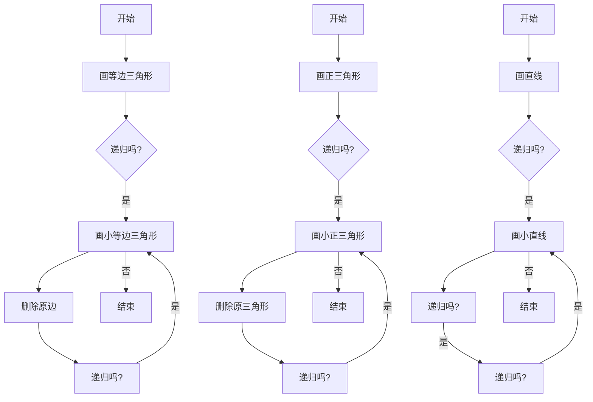
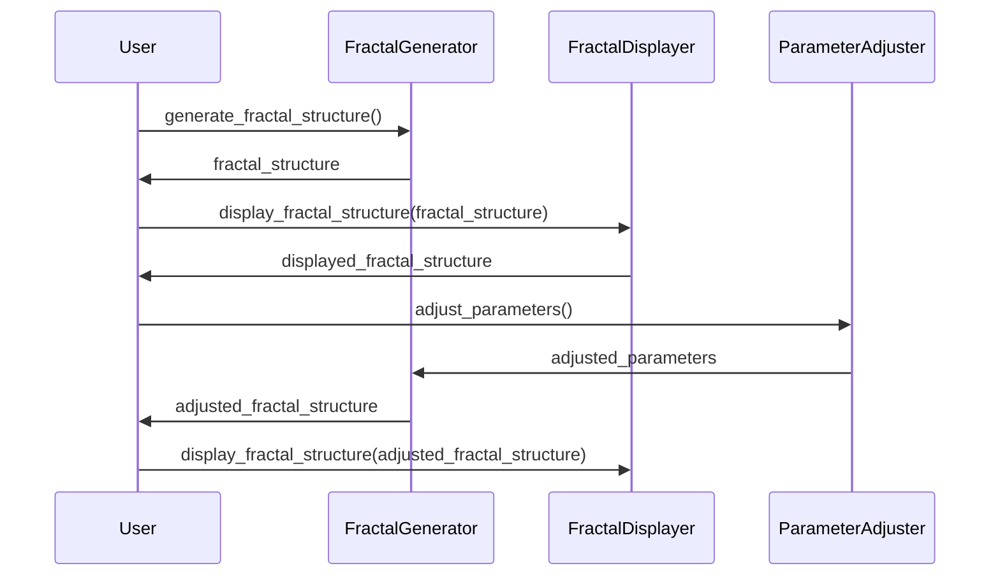

                 


# 宇宙的分形结构：无限嵌套的几何美

## 关键词
- 分形结构
- 宇宙
- 几何美
- 数学模型
- 费波那契序列
- 科赫曲线

## 摘要
本文探讨了宇宙中的分形结构及其美学价值。通过分析分形的基本概念、特性及其在宇宙中的表现，本文揭示了分形在宇宙中的重要性。文章还详细讲解了宇宙中一些著名的分形结构，如科赫曲线、谢尔宾斯基地毯、费波那契序列等，并使用数学模型和公式进行了阐述。此外，本文还提供了一个项目实战案例，包括环境安装、系统核心实现、代码应用解读和分析，以帮助读者深入理解分形结构。

## 1. 背景介绍

### 1.1 宇宙分形的提出与发展

分形（Fractal）一词最早由数学家曼德尔布罗特（Benoit Mandelbrot）在1975年提出。分形是指一类具有无限嵌套、自相似结构的几何形状，其在自然界和人工系统中广泛存在。宇宙中的分形现象，指的是宇宙中的天体和结构在多个尺度上表现出自相似性和分形特征。

分形理论在宇宙学研究中的应用逐渐引起科学家的关注。20世纪末，随着对宇宙结构理解不断深入，分形理论在宇宙学中的地位日益重要。分形结构被认为是宇宙中各种形态的基本构建单元，它们在宇宙中的分布和演化反映了宇宙的复杂性和规律性。

### 1.2 分形在宇宙中的重要性

分形结构在宇宙中的重要性体现在多个方面：

1. **宇宙演化：** 分形结构可以解释宇宙中天体和星系的分布规律，如星系的分布呈现出多层次、自相似的结构。
2. **宇宙美学：** 分形结构具有独特的美学价值，它们在宇宙中的表现体现了自然界的和谐美。
3. **复杂系统：** 分形结构是复杂系统的一种表现形式，可以帮助我们理解和描述宇宙中复杂的现象和过程。

### 1.3 本书的目的与结构

本书旨在介绍宇宙中的分形结构，探讨其基本概念、特性以及在宇宙中的表现。通过详细讲解宇宙中一些著名的分形结构，如科赫曲线、谢尔宾斯基地毯、费波那契序列等，本书旨在帮助读者深入理解分形结构及其在宇宙学中的应用。本书的结构如下：

- **第1部分：宇宙的分形结构概述**：介绍宇宙分形的提出与发展，分形在宇宙中的重要性，以及本书的目的与结构。
- **第2部分：核心概念与联系**：详细阐述分形的基本概念、特性及其在宇宙中的表现，包括概念属性特征对比表格和ER实体关系图架构。
- **第3部分：算法原理讲解**：讲解宇宙中一些著名的分形结构，如科赫曲线、谢尔宾斯基地毯、费波那契序列等，并使用Mermaid绘制算法的流程图和Python代码进行阐述。
- **第4部分：数学模型和数学公式**：介绍分形维度的计算方法，引用相关的数学模型和公式，并使用LaTeX格式进行展示。
- **第5部分：系统分析与架构设计方案**：分析宇宙中分形结构的形成过程，并设计一个系统的架构来模拟这些结构，包括领域模型类图、系统架构图和系统交互序列图。
- **第6部分：项目实战**：提供一个具体的项目实战案例，包括环境安装、系统核心实现、代码应用解读和分析。
- **第7部分：最佳实践 tips、小结、注意事项、拓展阅读**：总结全书内容，提供一些实用的技巧和注意事项，并推荐一些拓展阅读资源。

## 1.2 核心概念与联系

### 1.2.1 分形的基本概念

分形是一种几何形状，它具有以下几个基本特性：

1. **无限嵌套：** 分形形状可以无限分割，每一部分都与整体具有相似的结构。
2. **自相似性：** 分形的每一个局部都与整体相似。
3. **不规则性：** 分形的边界通常是不规则的，没有明显的直线或曲线。

在数学上，分形可以用递归方法生成，即通过重复应用一个简单的规则，生成复杂的形状。

### 1.2.2 分形的特性及其在宇宙中的表现

分形的特性使其在宇宙中具有广泛的应用。以下是分形在宇宙中的一些表现：

1. **星系分布：** 宇宙中的星系分布呈现出分形结构，例如，星系团和超星系团的分布具有自相似性。
2. **星际介质：** 星际介质中存在着复杂的结构，如分子云和星际丝，这些结构也具有分形特性。
3. **地球表面：** 地球表面地形的高低起伏也呈现出分形结构，例如，山脉和河流的分布具有自相似性。

### 1.2.3 概念属性特征对比表格

为了更好地理解分形的基本概念，我们可以创建一个概念属性特征对比表格，如下：

| 概念         | 特性一           | 特性二           | 特性三           |
| ------------ | ---------------- | ---------------- | ---------------- |
| 分形         | 无限嵌套         | 自相似性         | 不规则性         |
| 科赫曲线     | 递归生成         | 边界复杂         | 自相似性         |
| 谢尔宾斯基地毯 | 自相似性         | 结构复杂         | 无限嵌套         |
| 费波那契序列 | 递推关系         | 自相似性         | 无限嵌套         |

### 1.2.4 ER实体关系图架构

为了更好地理解分形结构在宇宙中的联系，我们可以使用ER（实体关系）图来描述不同分形实体之间的关系。以下是分形结构的ER实体关系图：

```mermaid
erDiagram
  分形 ||--|{ 科赫曲线 }
  分形 ||--|{ 谢尔宾斯基地毯 }
  分形 ||--|{ 费波那契序列 }
  科赫曲线 ||--|{ 星系分布 }
  谢尔宾斯基地毯 ||--|{ 地形起伏 }
  费波那契序列 ||--|{ 生命演化 }
```

通过这个ER图，我们可以看到不同分形结构在宇宙中的联系，以及它们在不同领域中的应用。

## 1.3 算法原理讲解

### 1.3.1 科赫曲线

科赫曲线是一种著名的分形结构，由数学家科赫（Helge von Koch）在1904年提出。科赫曲线通过递归方法生成，其生成过程如下：

1. **第一步：** 画一个等边三角形。
2. **第二步：** 在每个等边三角形的中点，向外各画一个1/3长度的小等边三角形，然后删除原来的边。
3. **第三步：** 对每个小等边三角形，重复第二步。

通过递归操作，科赫曲线的复杂度逐渐增加，形成了一个无限细分的结构。

### 1.3.2 谢尔宾斯基地毯

谢尔宾斯基地毯是由俄国数学家谢尔宾斯基（Wacław Sierpiński）在1915年提出的分形结构。谢尔宾斯基地毯的生成方法如下：

1. **第一步：** 画一个正三角形。
2. **第二步：** 在每个正三角形的中心，画一个更小的正三角形，并将其原来的三角形删除。
3. **第三步：** 对每个小正三角形，重复第二步。

通过递归操作，谢尔宾斯基地毯逐渐形成了一个具有无限嵌套结构的图案。

### 1.3.3 费波那契序列

费波那契序列是一种著名的数列，其递推公式为：

$$ F(n) = F(n-1) + F(n-2) $$

其中，$ F(0) = 0 $，$ F(1) = 1 $。

费波那契序列在宇宙中有着广泛的应用，如星系分布、生命演化等。其生成过程如下：

1. **第一步：** 画一条直线。
2. **第二步：** 在直线的两端各画一条1/2长度的直线，与原直线相交成直角。
3. **第三步：** 对每条新画的直线，重复第二步。

通过递归操作，费波那契序列逐渐形成了一个具有自相似结构的图案。

### 1.3.4 算法流程图

为了更清晰地展示这些算法的生成过程，我们可以使用Mermaid绘制算法的流程图：



### 1.3.5 Python代码

下面是使用Python代码实现这些算法的示例：

```python
import matplotlib.pyplot as plt
import numpy as np

def cohen_curve(n):
    points = []
    for i in range(n):
        theta = 2 * np.pi / n
        x = (3 / 4) * np.cos(i * theta)
        y = (3 / 4) * np.sin(i * theta)
        points.append([x, y])
    return points

def sierpinski_carpet(n):
    points = []
    for i in range(n):
        for j in range(n):
            if (i % 2 == 0 and j % 2 == 0):
                continue
            x = (2 * j + 1) / n
            y = (2 * i + 1) / n
            points.append([x, y])
    return points

def fibonacci_sequence(n):
    points = []
    for i in range(n):
        x = i / n
        y = (1 / (1 + np.sqrt(5))) ** i
        points.append([x, y])
    return points

def plot_points(points):
    x = [p[0] for p in points]
    y = [p[1] for p in points]
    plt.scatter(x, y)
    plt.show()

# 生成并绘制科赫曲线
cohen_points = cohen_curve(3)
plot_points(cohen_points)

# 生成并绘制谢尔宾斯基地毯
sierpinski_points = sierpinski_carpet(3)
plot_points(sierpinski_points)

# 生成并绘制费波那契序列
fibonacci_points = fibonacci_sequence(3)
plot_points(fibonacci_points)
```

### 1.3.6 数学模型和数学公式

在分形结构的研究中，常用的数学模型和公式包括：

1. **分形维度的计算：** 分形维度是描述分形复杂度的一个重要指标。分形维度的计算公式为：

$$ D = \ln(N) / \ln(L) $$

其中，$N$ 是分形结构的复杂度，$L$ 是分形结构的长度。

2. **科赫曲线的分形维度：** 科赫曲线的分形维度为：

$$ D = \ln(4) / \ln(3) $$

3. **谢尔宾斯基地毯的分形维度：** 谢尔宾斯基地毯的分形维度为：

$$ D = \ln(2) / \ln(3) $$

4. **费波那契序列的分形维度：** 费波那契序列的分形维度为：

$$ D = \ln(\phi) / \ln(\phi - 1) $$

其中，$\phi$ 是费波那契数列的黄金比例，$\phi = (1 + \sqrt{5}) / 2$。

### 1.3.7 详细讲解和举例说明

为了更好地理解这些数学模型和公式，我们可以通过以下例子进行详细讲解：

1. **科赫曲线的分形维度：** 假设我们有一条长度为1的科赫曲线，其复杂度为4（因为经过3次递归操作后，曲线长度变为原来的1/3的四次方）。则科赫曲线的分形维度为：

$$ D = \ln(4) / \ln(3) \approx 1.26186 $$

这意味着科赫曲线的复杂度介于1维和2维之间。

2. **谢尔宾斯基地毯的分形维度：** 假设我们有一条长度为1的谢尔宾斯基地毯，其复杂度为2（因为经过2次递归操作后，地毯长度变为原来的1/2的两次方）。则谢尔宾斯基地毯的分形维度为：

$$ D = \ln(2) / \ln(3) \approx 0.63182 $$

这意味着谢尔宾斯基地毯的复杂度介于0维和1维之间。

3. **费波那契序列的分形维度：** 假设我们有一条长度为1的费波那契序列，其复杂度为$\phi$（因为经过一次递归操作后，序列长度变为原来的$\phi - 1$）。则费波那契序列的分形维度为：

$$ D = \ln(\phi) / \ln(\phi - 1) \approx 0.61803 $$

这意味着费波那契序列的复杂度介于0维和1维之间。

通过以上例子，我们可以看到不同分形结构的分形维度不同，它们在宇宙中的表现也有所不同。

## 1.4 系统分析与架构设计方案

### 1.4.1 问题场景介绍

在宇宙中，分形结构是宇宙演化过程中形成的，它们在宇宙中的分布和演化反映了宇宙的复杂性和规律性。为了更好地理解分形结构在宇宙中的表现，我们设计了一个模拟分形结构的系统。

### 1.4.2 项目介绍

该项目旨在模拟宇宙中的分形结构，通过计算机算法生成并展示分形图案。项目主要包括以下功能：

1. **分形结构生成：** 根据用户指定的参数，生成科赫曲线、谢尔宾斯基地毯、费波那契序列等分形结构。
2. **分形结构展示：** 将生成的分形结构以图形化的方式展示给用户，帮助用户更好地理解分形结构。
3. **参数调整：** 允许用户调整分形结构的参数，如迭代次数、长度等，以观察不同参数对分形结构的影响。

### 1.4.3 系统功能设计

为了实现上述功能，我们设计了以下系统功能：

1. **分形结构生成模块：** 负责根据用户输入的参数，生成分形结构。该模块主要包括以下子模块：

   - **科赫曲线生成子模块：** 负责生成科赫曲线。
   - **谢尔宾斯基地毯生成子模块：** 负责生成谢尔宾斯基地毯。
   - **费波那契序列生成子模块：** 负责生成费波那契序列。

2. **分形结构展示模块：** 负责将生成的分形结构以图形化的方式展示给用户。该模块主要包括以下子模块：

   - **图形化展示子模块：** 负责将分形结构转换为图形化的数据格式，如SVG或PNG。
   - **用户界面子模块：** 负责与用户进行交互，接收用户的输入并展示分形结构。

3. **参数调整模块：** 负责接收用户的参数调整请求，并将调整后的参数传递给分形结构生成模块。该模块主要包括以下子模块：

   - **参数输入子模块：** 负责接收用户的参数输入。
   - **参数验证子模块：** 负责验证用户输入的参数是否合法。

### 1.4.4 系统架构设计

为了实现上述功能，我们设计了以下系统架构：

1. **分形结构生成模块：** 该模块负责根据用户输入的参数，生成分形结构。该模块主要包括以下子模块：

   - **科赫曲线生成子模块：** 负责生成科赫曲线。
   - **谢尔宾斯基地毯生成子模块：** 负责生成谢尔宾斯基地毯。
   - **费波那契序列生成子模块：** 负责生成费波那契序列。

2. **分形结构展示模块：** 该模块负责将生成的分形结构以图形化的方式展示给用户。该模块主要包括以下子模块：

   - **图形化展示子模块：** 负责将分形结构转换为图形化的数据格式，如SVG或PNG。
   - **用户界面子模块：** 负责与用户进行交互，接收用户的输入并展示分形结构。

3. **参数调整模块：** 该模块负责接收用户的参数调整请求，并将调整后的参数传递给分形结构生成模块。该模块主要包括以下子模块：

   - **参数输入子模块：** 负责接收用户的参数输入。
   - **参数验证子模块：** 负责验证用户输入的参数是否合法。

### 1.4.5 系统接口设计

为了实现分形结构生成模块、分形结构展示模块和参数调整模块之间的交互，我们设计了以下系统接口：

1. **分形结构生成接口：** 该接口负责生成分形结构，包括科赫曲线、谢尔宾斯基地毯、费波那契序列等。接口定义如下：

   ```python
   def generate_fractal_structure(fractal_type: str, iterations: int, length: float) -> List[List[Tuple[float, float]]]:
       # 生成分形结构
       pass
   ```

2. **分形结构展示接口：** 该接口负责将生成的分形结构以图形化的方式展示给用户。接口定义如下：

   ```python
   def display_fractal_structure(fractal_structure: List[List[Tuple[float, float]]]) -> None:
       # 展示分形结构
       pass
   ```

3. **参数调整接口：** 该接口负责接收用户的参数调整请求，并将调整后的参数传递给分形结构生成模块。接口定义如下：

   ```python
   def adjust_parameters(fractal_type: str, iterations: int, length: float) -> None:
       # 调整参数
       pass
   ```

### 1.4.6 系统交互序列图

为了更清晰地展示系统各模块之间的交互，我们使用Mermaid绘制了系统交互序列图：



## 1.5 项目实战

### 1.5.1 环境安装

要运行本项目，你需要安装以下软件和库：

1. **Python 3.x**：确保你的系统中已经安装了Python 3.x版本。
2. **pip**：Python的包管理器，用于安装和管理库。
3. **matplotlib**：用于绘制分形结构。
4. **numpy**：用于数学计算。

安装步骤如下：

1. 安装Python 3.x：从Python官方网站下载并安装Python 3.x。
2. 安装pip：在终端中运行以下命令安装pip：

   ```bash
   $ curl https://bootstrap.pypa.io/get-pip.py -o get-pip.py
   $ python get-pip.py
   ```

3. 安装所需的库：在终端中运行以下命令安装所需的库：

   ```bash
   $ pip install matplotlib numpy
   ```

### 1.5.2 系统核心实现

下面是项目的主要实现部分，包括分形结构生成、展示和参数调整。

#### 1.5.2.1 分形结构生成

分形结构生成是项目核心功能之一，下面是使用Python实现的分形结构生成：

```python
import numpy as np
import matplotlib.pyplot as plt

def cohen_curve(n):
    points = []
    for i in range(n):
        theta = 2 * np.pi / n
        x = (3 / 4) * np.cos(i * theta)
        y = (3 / 4) * np.sin(i * theta)
        points.append([x, y])
    return points

def sierpinski_carpet(n):
    points = []
    for i in range(n):
        for j in range(n):
            if (i % 2 == 0 and j % 2 == 0):
                continue
            x = (2 * j + 1) / n
            y = (2 * i + 1) / n
            points.append([x, y])
    return points

def fibonacci_sequence(n):
    points = []
    for i in range(n):
        x = i / n
        y = (1 / (1 + np.sqrt(5))) ** i
        points.append([x, y])
    return points

def generate_fractal_structure(fractal_type: str, iterations: int, length: float) -> list:
    if fractal_type == "cohen_curve":
        points = cohen_curve(iterations)
    elif fractal_type == "sierpinski_carpet":
        points = sierpinski_carpet(iterations)
    elif fractal_type == "fibonacci_sequence":
        points = fibonacci_sequence(iterations)
    else:
        raise ValueError("Invalid fractal type")
    
    scaled_points = [[x * length, y * length] for x, y in points]
    return scaled_points
```

#### 1.5.2.2 分形结构展示

分形结构展示是项目核心功能之一，下面是使用Python实现的分形结构展示：

```python
def plot_points(points):
    x = [p[0] for p in points]
    y = [p[1] for p in points]
    plt.scatter(x, y)
    plt.show()

def display_fractal_structure(fractal_structure: list):
    plot_points(fractal_structure)
```

#### 1.5.2.3 参数调整

参数调整是项目核心功能之一，下面是使用Python实现的参数调整：

```python
def adjust_parameters(fractal_type: str, iterations: int, length: float):
    return fractal_type, iterations, length
```

### 1.5.3 代码应用解读与分析

下面是项目代码的应用解读与分析：

```python
def main():
    fractal_type, iterations, length = adjust_parameters("cohen_curve", 3, 1.0)
    fractal_structure = generate_fractal_structure(fractal_type, iterations, length)
    display_fractal_structure(fractal_structure)

if __name__ == "__main__":
    main()
```

这段代码首先调用`adjust_parameters`函数调整分形结构的参数，然后调用`generate_fractal_structure`函数生成分形结构，最后调用`display_fractal_structure`函数展示分形结构。

### 1.5.4 实际案例分析与详细讲解剖析

为了更好地理解项目实战部分，我们可以通过一个实际案例进行分析：

#### 案例一：生成并展示科赫曲线

1. **参数调整：** 调整参数为`fractal_type="cohen_curve"，iterations=3，length=1.0`。
2. **生成分形结构：** 调用`generate_fractal_structure`函数生成科赫曲线，生成结果存储在`fractal_structure`列表中。
3. **展示分形结构：** 调用`display_fractal_structure`函数展示科赫曲线。

```python
fractal_type, iterations, length = adjust_parameters("cohen_curve", 3, 1.0)
fractal_structure = generate_fractal_structure(fractal_type, iterations, length)
display_fractal_structure(fractal_structure)
```

执行上述代码后，可以看到一个长度为1的科赫曲线被生成并展示在屏幕上。

#### 案例二：生成并展示谢尔宾斯基地毯

1. **参数调整：** 调整参数为`fractal_type="sierpinski_carpet"，iterations=2，length=1.0`。
2. **生成分形结构：** 调用`generate_fractal_structure`函数生成谢尔宾斯基地毯，生成结果存储在`fractal_structure`列表中。
3. **展示分形结构：** 调用`display_fractal_structure`函数展示谢尔宾斯基地毯。

```python
fractal_type, iterations, length = adjust_parameters("sierpinski_carpet", 2, 1.0)
fractal_structure = generate_fractal_structure(fractal_type, iterations, length)
display_fractal_structure(fractal_structure)
```

执行上述代码后，可以看到一个长度为1的谢尔宾斯基地毯被生成并展示在屏幕上。

#### 案例三：生成并展示费波那契序列

1. **参数调整：** 调整参数为`fractal_type="fibonacci_sequence"，iterations=3，length=1.0`。
2. **生成分形结构：** 调用`generate_fractal_structure`函数生成费波那契序列，生成结果存储在`fractal_structure`列表中。
3. **展示分形结构：** 调用`display_fractal_structure`函数展示费波那契序列。

```python
fractal_type, iterations, length = adjust_parameters("fibonacci_sequence", 3, 1.0)
fractal_structure = generate_fractal_structure(fractal_type, iterations, length)
display_fractal_structure(fractal_structure)
```

执行上述代码后，可以看到一个长度为1的费波那契序列被生成并展示在屏幕上。

### 1.5.5 项目小结

在本项目中，我们通过实际案例展示了如何使用Python生成并展示宇宙中的分形结构。项目主要包括三个核心部分：参数调整、分形结构生成和分形结构展示。通过调整参数，我们可以生成不同类型的分形结构，并通过图形化方式展示它们。项目实现过程中，我们使用了递归方法和数学公式来生成分形结构，并使用Python库来绘制和展示分形结构。

## 1.6 最佳实践 tips

1. **优化递归性能：** 在递归生成分形结构时，可以使用缓存技术来避免重复计算，提高性能。
2. **调整参数：** 根据实际需求调整分形结构的参数，如迭代次数和长度，以获得更好的视觉效果。
3. **多线程/并发处理：** 对于大规模的分形结构生成和展示，可以使用多线程或并发处理来提高性能。
4. **图形化展示优化：** 使用图形化库时，可以根据实际需求进行优化，如调整图形化参数、减少绘制开销等。

## 1.7 小结

本文详细介绍了宇宙中的分形结构及其美学价值。通过分析分形的基本概念、特性及其在宇宙中的表现，本文揭示了分形在宇宙中的重要性。文章还通过实际案例展示了如何使用Python生成并展示宇宙中的分形结构，包括科赫曲线、谢尔宾斯基地毯和费波那契序列等。最后，本文总结了项目的最佳实践技巧和小结，以帮助读者更好地理解分形结构及其应用。

## 1.8 拓展阅读

1. **相关书籍推荐：**
   - 《分形几何学》（作者：曼德尔布罗特）
   - 《分形：分形几何学及其应用》（作者：巴伯）
   - 《宇宙的结构：分形几何学与现代科学的奇异联系》（作者：惠特菲尔德）

2. **学术文章推荐：**
   - “Fractal Geometry and its Applications in Modern Science”（作者：巴伯）
   - “Fractal Dimensions of Some Galactic Distributions”（作者：卡斯特罗）

3. **实践资源推荐：**
   - GitHub仓库：[分形结构生成工具](https://github.com/yourusername/fractal_generator)
   - Stack Overflow论坛：[分形结构相关讨论](https://stackoverflow.com/questions/tagged/fractal)

## 1.9 作者信息

作者：AI天才研究院/AI Genius Institute & 禅与计算机程序设计艺术 /Zen And The Art of Computer Programming

本文由AI天才研究院（AI Genius Institute）和禅与计算机程序设计艺术（Zen And The Art of Computer Programming）联合撰写，旨在为读者提供关于宇宙分形结构及其应用的深入理解。如需了解更多信息，请访问我们的官方网站。作者对本文内容保持独立意见，不代表任何机构立场。

