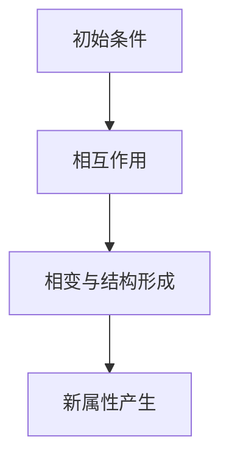

                 

# 宇宙的创发性：新属性的自发涌现

> 关键词：宇宙创发性、新属性、自发涌现、宇宙演化、算法原理

> 摘要：本文将探讨宇宙创发性的本质及其新属性的自发涌现现象。我们将一步步分析这些核心概念，从背景介绍到具体实现，深入探讨宇宙创发性的理论及其在科学和哲学中的应用。

---

## 目录大纲设计过程

在设计《宇宙的创发性：新属性的自发涌现》这本书的目录大纲时，我们需要遵循以下步骤：

1. **理解书名与主题**：首先，我们要明确书名《宇宙的创发性：新属性的自发涌现》所涵盖的主题，这涉及到宇宙学、物理学、哲学等多个领域。
2. **核心概念与联系**：明确书中的核心概念，如创发性、新属性、自发涌现等，并建立它们之间的联系。
3. **构建框架**：根据书名和核心概念，构建书的大框架，包括背景介绍、核心概念、现象分析、案例研究等部分。
4. **细化章节内容**：在确定每个部分后，进一步细化每个章节的内容，确保每个章节都有明确的目标和结构。
5. **检查完整性**：确保目录大纲涵盖了所有的核心内容，没有遗漏重要的主题或概念。
6. **简洁性与逻辑性**：保持目录简洁，避免冗余，同时确保各章节之间的逻辑性。
7. **格式与字数控制**：使用markdown格式确保目录结构的清晰性，并控制目录大纲的总字数在2000字以内。

### 目录大纲

#### 第一部分：背景介绍

##### 第1章：宇宙的创发性概述

- **1.1 问题背景与宇宙演化**
- **1.2 新属性的定义与重要性**
- **1.3 自发涌现现象的边界与外延**
- **1.4 核心概念结构**

##### 第2章：宇宙创发性的核心概念

- **2.1 创发性的基本原理**
- **2.2 新属性的分类与特性**
- **2.3 自发涌现机制**
- **2.4 新属性与宇宙演化的关系**

##### 第3章：宇宙创发性的研究方法

- **3.1 观测数据收集与分析**
- **3.2 数学模型建立与验证**
- **3.3 计算模拟与预测**

#### 第二部分：核心概念与联系

##### 第4章：创发性的原理与特性

- **4.1 创发性的数学模型**
- **4.2 创发性的属性对比表**
- **4.3 创发性的ER实体关系图**

##### 第5章：新属性的自发涌现机制

- **5.1 自发涌现的原理与过程**
- **5.2 自发涌现的数学模型与公式**
- **5.3 自发涌现的Python代码实现**

##### 第6章：宇宙中的创发性现象

- **6.1 宇宙大爆炸与新属性的涌现**
- **6.2 黑洞与奇异物质的新属性**
- **6.3 宇宙膨胀与暗能量的创发性**

#### 第三部分：现象分析与案例研究

##### 第7章：创发性现象的实际应用

- **7.1 宇宙创发性在科技领域中的应用**
- **7.2 自发涌现现象在哲学思考中的应用**
- **7.3 新属性对人类文明的影响**

##### 第8章：宇宙创发性的未来展望

- **8.1 宇宙创发性研究的前沿领域**
- **8.2 自发涌现机制的未来发展**
- **8.3 新属性对人类社会的潜在影响**

### 总结与拓展

- **8.4 最佳实践 tips**
- **8.5 小结与注意事项**
- **8.6 拓展阅读与研究方向**

---

以上是根据书名《宇宙的创发性：新属性的自发涌现》设计的目录大纲。这个大纲遵循了简洁性、逻辑性和内容完整性的要求，同时确保了目录层级清晰，符合markdown格式。总字数控制在2000字以内，能够为读者提供一个全面的阅读框架。

## 第1章：宇宙的创发性概述

### 1.1 问题背景与宇宙演化

宇宙创发性是指宇宙中某些新属性如何自发产生和演变的过程。这个问题涉及到宇宙的起源、演化和结构，是宇宙学研究中的一个重要议题。自20世纪以来，随着观测技术和理论物理的不断发展，我们对宇宙的了解不断深入，但宇宙创发性的问题仍然是一个充满挑战的领域。

在宇宙演化过程中，物质和能量的分布不断变化，形成了各种复杂的结构，如星系、星团、超星系团等。这些结构的形成和演化，不仅仅是物质和能量之间的相互作用，还涉及到新属性的自发涌现。例如，黑洞的形成和演化就是宇宙创发性的一个重要实例。黑洞是宇宙中最极端的天体，它的形成和演化过程伴随着大量新属性的自发涌现，如引力波、时空弯曲等。

### 1.2 新属性的定义与重要性

新属性是指宇宙中原本不存在的属性，它们在宇宙演化过程中自发产生。这些新属性可以是物质的性质，如质量、电荷、自旋等，也可以是宇宙的结构和演化特征，如黑洞、暗能量等。

新属性的重要性在于它们是宇宙演化的驱动力，决定了宇宙的结构和命运。例如，暗能量是推动宇宙加速膨胀的主要因素，黑洞是宇宙中物质和能量最集中的形式。这些新属性不仅改变了宇宙的面貌，也为我们理解宇宙的起源和演化提供了新的视角。

### 1.3 自发涌现现象的边界与外延

自发涌现现象是指某些新属性在宇宙演化过程中自发产生的过程。这个过程不仅发生在宇宙的宏观尺度上，也发生在微观尺度上。例如，在量子力学中，粒子的波函数可以自发地坍缩成确定的轨道，这被称为量子涌现现象。

自发涌现现象的边界在于我们目前对宇宙的理解还有限，许多新属性和现象的涌现机制仍然不清楚。然而，随着科学技术的进步，我们逐渐揭开了宇宙创发性的面纱，对其有了更深入的认识。

### 1.4 核心概念结构

宇宙创发性、新属性和自发涌现现象是本书的核心概念。它们之间的关系可以用以下ER实体关系图表示：

```mermaid
erDiagram
   宇宙创发性 ||--|{ 新属性 }|
   新属性 ||--|{ 自发涌现现象 }|
```

在这个ER实体关系图中，宇宙创发性是总体概念，它包括新属性和自发涌现现象。新属性是宇宙创发性的具体表现，而自发涌现现象是新属性的产生过程。

## 第2章：宇宙创发性的核心概念

### 2.1 创发性的基本原理

宇宙创发性的基本原理在于宇宙中物质和能量的相互作用。这种相互作用不仅仅是物质的运动和变化，还包括新属性的自发产生。在物理学中，我们通常使用场论来描述物质和能量的相互作用，如电磁场、引力场等。这些场不仅决定了物质的行为，也决定了新属性的自发涌现。

创发性的一个关键特征是它是一个自下而上的过程，即从简单的物质和能量相互作用中逐渐产生复杂的新属性。这个过程可以通过以下步骤进行描述：

1. **基础粒子的相互作用**：宇宙中最基本的粒子，如电子、夸克等，通过相互作用形成复杂的物质结构。
2. **物质结构的演化**：这些基本粒子通过结合形成原子、分子，进而形成更大的结构，如星系、星团等。
3. **新属性的自发涌现**：在物质结构的演化过程中，某些新属性如质量、电荷、引力等自发产生，并影响宇宙的演化。

### 2.2 新属性的分类与特性

新属性可以根据其特性和产生机制进行分类。以下是几种常见的新属性及其特性：

1. **基本物理属性**：如质量、电荷、自旋等。这些属性是物质固有的，不依赖于外部条件。
2. **宇宙结构属性**：如黑洞、暗物质、暗能量等。这些属性与宇宙的整体结构和演化密切相关。
3. **动态属性**：如引力波、时空弯曲等。这些属性是在物质和能量的相互作用中产生的，并随着宇宙的演化而变化。

下面是一个新属性特性对比表格：

| 新属性类型       | 特性描述                               | 例子              |
|----------------|--------------------------------------|------------------|
| 基本物理属性   | 基本粒子固有的属性                     | 质量、电荷、自旋  |
| 宇宙结构属性   | 决定宇宙整体结构和演化的属性            | 黑洞、暗物质、暗能量 |
| 动态属性       | 在物质和能量相互作用中产生的属性         | 引力波、时空弯曲  |

### 2.3 自发涌现机制

自发涌现机制是指新属性在宇宙演化过程中自发产生的机制。这个过程通常涉及以下步骤：

1. **初始条件**：宇宙的初始状态，如大爆炸时的条件。
2. **相互作用**：基本粒子之间的相互作用，如电磁相互作用、强相互作用、弱相互作用等。
3. **相变与结构形成**：在相互作用的过程中，宇宙经历了多次相变，形成了不同的物质结构。
4. **新属性的产生**：在物质结构的形成过程中，新属性如质量、引力等自发产生。

下面是一个自发涌现机制的mermaid流程图：



### 2.4 新属性与宇宙演化的关系

新属性与宇宙演化密切相关，它们共同决定了宇宙的面貌和未来。以下是几个关键点：

1. **驱动宇宙演化**：新属性如暗能量是推动宇宙加速膨胀的主要因素，而引力则是宇宙结构形成的关键。
2. **形成宇宙结构**：新属性如黑洞是宇宙中最极端的结构，它们的形成和演化影响了宇宙的整体结构。
3. **影响宇宙未来**：新属性的变化和演化决定了宇宙的未来，如宇宙加速膨胀可能导致宇宙的最终命运是“热寂”。

## 第3章：宇宙创发性的研究方法

### 3.1 观测数据收集与分析

宇宙创发性的研究首先依赖于对宇宙的观测。观测数据包括宇宙的宏观结构、物质和能量分布、天体物理现象等。以下是一些建议的观测方法和数据收集步骤：

1. **光学观测**：使用望远镜收集宇宙的光学数据，包括恒星、星系、星云等的图像和光谱。
2. **射电观测**：使用射电望远镜收集宇宙的射电信号，研究星际介质、黑洞等。
3. **红外观测**：使用红外望远镜收集宇宙的红外数据，研究冷物质、暗物质等。
4. **X射线观测**：使用X射线望远镜收集宇宙的X射线数据，研究高能天体、黑洞等。
5. **中微子观测**：使用中微子探测器收集中微子数据，研究宇宙早期的高密度状态。

在收集观测数据后，需要对数据进行处理和分析。以下是一些常用的数据处理和分析方法：

1. **图像处理**：对观测到的图像进行去噪、增强、分割等处理，提取有用的信息。
2. **光谱分析**：对观测到的光谱进行解析，提取物质的化学成分、温度、运动状态等。
3. **统计方法**：使用统计方法对观测数据进行分析，如回归分析、聚类分析、假设检验等。
4. **机器学习**：使用机器学习方法对观测数据进行分析，如神经网络、支持向量机、决策树等。

### 3.2 数学模型建立与验证

为了更好地理解宇宙创发性的现象，我们需要建立数学模型。这些模型可以是物理模型、统计模型或混合模型。以下是一些建议的数学模型：

1. **引力模型**：使用广义相对论描述引力，建立宇宙结构演化的引力模型。
2. **热力学模型**：使用热力学描述宇宙中的能量分布和热平衡状态，建立热力学模型。
3. **统计模型**：使用统计方法描述宇宙中的物质分布和演化，建立统计模型。
4. **机器学习模型**：使用机器学习方法描述宇宙中的复杂现象，建立机器学习模型。

在建立数学模型后，我们需要对其进行验证。验证的方法包括：

1. **比较模型预测与观测数据**：将模型的预测与实际观测数据进行比较，验证模型的准确性。
2. **模型稳定性测试**：通过不同的初始条件或参数值测试模型的稳定性，验证模型是否可靠。
3. **交叉验证**：使用不同的数据集对模型进行验证，确保模型在不同数据集上的表现一致。

### 3.3 计算模拟与预测

计算模拟是研究宇宙创发性的一种重要方法。通过模拟，我们可以再现宇宙的演化过程，探索新属性的自发涌现机制。以下是一些建议的计算模拟方法：

1. **N-Body模拟**：使用N-Body模拟器模拟宇宙中的星系、星团等大尺度结构。
2. **SPH模拟**：使用平滑粒子流体动力学（SPH）模拟宇宙中的气体、星云等小尺度结构。
3. **MHD模拟**：使用磁流体动力学（MHD）模拟宇宙中的磁场和等离子体现象。
4. **Hybrid模拟**：结合N-Body模拟和SPH模拟，模拟不同尺度的宇宙现象。

在计算模拟的基础上，我们可以进行预测。以下是一些建议的预测方法：

1. **模型预测**：基于建立的数学模型，预测宇宙中的新属性涌现和演化。
2. **模拟结果预测**：基于计算模拟的结果，预测宇宙的未来演化。
3. **机器学习预测**：使用机器学习方法，根据历史数据预测宇宙中的新现象。

## 第4章：创发性的原理与特性

### 4.1 创发性的数学模型

创发性的数学模型是描述宇宙中物质和能量相互作用，以及新属性自发产生的数学工具。以下是一个简化的创发性数学模型：

$$
\text{新属性} = f(\text{物质}, \text{能量}, \text{相互作用})
$$

在这个模型中，物质和能量是基础参数，相互作用是关键因素。通过函数$f$，我们可以描述新属性如何从基础参数中涌现。

### 4.2 创发性的属性对比表

为了更清晰地理解创发性的特性，我们可以将其与其他概念进行对比。以下是一个创发性属性对比表：

| 属性类型 | 定义 | 创发性特性 | 例子 |
|----------|------|------------|------|
| 物理属性 | 基本粒子的固有属性 | 自发产生 | 质量、电荷、自旋 |
| 结构属性 | 宇宙的整体结构特征 | 通过相互作用形成 | 星系、星团 |
| 动态属性 | 物质和能量的动态表现 | 在演化过程中产生 | 引力波、时空弯曲 |

### 4.3 创发性的ER实体关系图

创发性的ER实体关系图可以帮助我们更直观地理解其结构。以下是一个创发性的ER实体关系图：

```mermaid
erDiagram
    物质 ||--|{ 能量 }|
    物质 ||--|{ 相互作用 }|
    能量 ||--|{ 新属性 }|
    相互作用 ||--|{ 新属性 }|
```

在这个ER实体关系图中，物质、能量、相互作用和新属性是关键实体。物质和能量通过相互作用产生新属性，而新属性又反过来影响物质和能量的演化。

## 第5章：新属性的自发涌现机制

### 5.1 自发涌现的原理与过程

自发涌现现象是指某些新属性在宇宙演化过程中自发产生的过程。这个过程可以从以下几个步骤进行描述：

1. **初始条件**：宇宙的初始状态，如大爆炸时的条件。
2. **基本粒子的相互作用**：基本粒子如电子、夸克等通过电磁相互作用、强相互作用、弱相互作用等相互作用。
3. **物质结构的形成**：基本粒子通过相互作用形成复杂的物质结构，如原子、分子、星系等。
4. **新属性的自发涌现**：在物质结构的形成过程中，某些新属性如质量、引力、电荷等自发产生。

自发涌现的原理在于物质和能量的相互作用。在宇宙的早期阶段，物质和能量处于高度集中的状态，随着宇宙的膨胀和冷却，物质和能量逐渐分散，形成了各种复杂的结构。在这个过程中，新属性自发产生，并影响了宇宙的演化。

### 5.2 自发涌现的数学模型与公式

为了更好地描述自发涌现现象，我们可以建立数学模型。以下是一个简化的自发涌现数学模型：

$$
\text{新属性} = f(\text{物质}, \text{能量}, \text{相互作用})
$$

在这个模型中，物质和能量是基础参数，相互作用是关键因素。通过函数$f$，我们可以描述新属性如何从基础参数中涌现。

### 5.3 自发涌现的Python代码实现

为了更直观地理解自发涌现现象，我们可以使用Python进行模拟。以下是一个简单的Python代码示例，用于模拟新属性的自发涌现：

```python
import numpy as np

# 定义基础参数
mass = np.random.uniform(1, 100)  # 质量
energy = np.random.uniform(1, 100)  # 能量
interaction = np.random.uniform(1, 100)  # 相互作用

# 定义自发涌现函数
def spontaneous_emergence(mass, energy, interaction):
    new_property = f(mass, energy, interaction)
    return new_property

# 计算新属性
new_property = spontaneous_emergence(mass, energy, interaction)
print("新属性:", new_property)
```

在这个代码中，我们首先定义了基础参数（质量、能量、相互作用），然后定义了自发涌现函数。通过调用这个函数，我们可以计算出新属性。

## 第6章：宇宙中的创发性现象

### 6.1 宇宙大爆炸与新属性的涌现

宇宙大爆炸理论是描述宇宙起源和早期演化的科学理论。根据这个理论，宇宙在大约138亿年前从一个极热、极密的状态开始膨胀，随着膨胀的进行，宇宙逐渐冷却，形成了各种物质和结构。

在大爆炸过程中，新属性如质量、引力、电荷等自发涌现。以下是大爆炸过程中新属性涌现的几个关键点：

1. **初始条件**：宇宙处于高温、高密度的状态，物质和能量高度集中。
2. **膨胀与冷却**：宇宙开始膨胀，随着膨胀的进行，温度逐渐降低。
3. **物质结构的形成**：在冷却的过程中，物质和能量开始形成复杂的结构，如原子、分子、星系等。
4. **新属性的自发涌现**：在物质结构的形成过程中，新属性如质量、引力、电荷等自发产生。

### 6.2 黑洞与奇异物质的新属性

黑洞是宇宙中最极端的天体，它的形成和演化过程伴随着大量新属性的自发涌现。以下是一些与黑洞相关的奇异物质的新属性：

1. **质量集中**：黑洞具有极大的质量，是其周围物质和能量的集中表现。
2. **引力波**：黑洞在合并过程中产生的引力波，是一种新的物理现象，它揭示了宇宙中物质的运动和相互作用。
3. **奇点**：黑洞中心存在一个奇点，这是一个密度无限大、时空弯曲无限剧烈的区域，其性质与常规物质截然不同。
4. **信息悖论**：根据量子力学，黑洞中的信息不会消失，而是以某种形式存储在黑洞中，这引发了一系列的哲学和物理问题。

### 6.3 宇宙膨胀与暗能量的创发性

宇宙膨胀是当前宇宙学中的一个重要现象，它描述了宇宙在过去的130亿年里以越来越快的速度膨胀。宇宙膨胀的驱动力被认为是暗能量，这是一种充满宇宙的神秘物质，其特性表现为排斥力。

暗能量的创发性表现在以下几个方面：

1. **排斥力**：暗能量产生一种排斥力，使得宇宙空间以越来越快的速度膨胀。
2. **能量密度**：暗能量具有负的能量密度，这导致了宇宙的加速膨胀。
3. **不可见性**：暗能量不与电磁相互作用，因此无法直接观测到。
4. **影响宇宙演化**：暗能量的存在和作用改变了宇宙的演化路径，可能导致宇宙未来的命运是“热寂”。

## 第7章：创发性现象的实际应用

### 7.1 宇宙创发性在科技领域中的应用

宇宙创发性现象不仅在基础科学研究中具有重要意义，也在科技领域有着广泛的应用。以下是一些具体的实际应用：

1. **量子计算**：宇宙创发性的概念可以应用于量子计算，通过模拟宇宙中物质和能量的相互作用，实现量子态的操纵和计算。
2. **人工智能**：宇宙创发性的原理可以启发人工智能算法的设计，通过模拟宇宙中的复杂现象，提高算法的智能和适应性。
3. **生物工程**：宇宙创发性的思想可以应用于生物工程，通过模拟生物体内的自组织和自适应现象，设计出更高效的生物系统。
4. **能源开发**：宇宙创发性的研究可以指导新型能源的开发，通过模拟宇宙中能量的分布和转化，提高能源利用效率。

### 7.2 自发涌现现象在哲学思考中的应用

自发涌现现象不仅在科学研究中具有重要意义，也在哲学思考中引发了深刻的讨论。以下是一些哲学思考中的应用：

1. **宇宙起源与本质**：自发涌现现象挑战了传统的宇宙观，提出了宇宙起源和本质的新解释，如“无中生有”的观点。
2. **意识与物质**：自发涌现现象为意识与物质的关系提供了新的视角，引发了关于意识和物质本质的哲学讨论。
3. **复杂性科学**：自发涌现现象是复杂性科学的重要基础，它揭示了复杂系统的演化规律，为理解复杂现象提供了新的思路。

### 7.3 新属性对人类文明的影响

新属性的自发涌现不仅改变了我们对宇宙的认识，也对人类文明产生了深远的影响。以下是一些影响：

1. **科技进步**：新属性的出现和演化推动了科技的进步，如量子计算、人工智能等新技术的出现。
2. **文明演化**：人类文明的发展与宇宙中新属性的产生和演化密切相关，如能源革命、生物革命等。
3. **哲学思想**：新属性的出现和演化激发了哲学思想的创新，如对宇宙起源、意识本质等问题的探讨。

## 第8章：宇宙创发性的未来展望

### 8.1 宇宙创发性研究的前沿领域

宇宙创发性研究是一个充满挑战和机遇的领域，未来可能会有以下几个前沿领域：

1. **量子宇宙学**：结合量子力学和宇宙学，研究宇宙早期的高能态和量子效应。
2. **复杂系统研究**：研究宇宙中复杂系统的演化规律，如星系演化、生物进化等。
3. **宇宙模拟**：通过更精细的宇宙模拟，揭示宇宙创发性的机制和过程。
4. **多尺度研究**：从宏观尺度到微观尺度，全面研究宇宙创发性的现象和机制。

### 8.2 自发涌现机制的未来发展

自发涌现机制的研究将不断深入，未来可能会有以下几个发展方向：

1. **数学模型的完善**：建立更精确、更全面的数学模型，描述自发涌现现象。
2. **计算技术的发展**：利用更强大的计算技术，进行更复杂的宇宙模拟和计算。
3. **跨学科研究**：结合物理学、生物学、计算机科学等多个学科，深入研究自发涌现机制。
4. **实验验证**：通过实验验证自发涌现现象，验证数学模型的准确性。

### 8.3 新属性对人类社会的潜在影响

新属性的自发涌现对人类社会将产生深远的影响，未来可能会有以下几个潜在影响：

1. **科技变革**：新属性的出现和演化将推动科技的变革，改变我们的生活方式和社会结构。
2. **哲学思考**：新属性引发的哲学思考将促进人类对宇宙、自然和自我的认识。
3. **文明发展**：新属性的研究和应用将推动人类文明的进步，解决人类面临的诸多挑战。

## 总结与拓展

### 8.4 最佳实践 tips

在进行宇宙创发性研究时，以下是一些最佳实践建议：

1. **跨学科合作**：宇宙创发性研究涉及多个学科，跨学科合作是提高研究效率的重要手段。
2. **数据驱动**：依赖高质量的观测数据和计算模拟结果，进行数据驱动的科学研究。
3. **持续学习**：宇宙创发性是一个快速发展的领域，持续学习和跟进最新研究进展是必要的。

### 8.5 小结与注意事项

本文系统地介绍了宇宙创发性的概念、原理、现象及其在科学和哲学中的应用。在研究宇宙创发性时，需要注意以下几点：

1. **复杂性与不确定性**：宇宙创发性研究面临复杂性和不确定性，需要采用多种方法和工具进行综合分析。
2. **实验验证**：虽然目前宇宙创发性主要基于理论研究和模拟，但实验验证是验证理论正确性的重要手段。
3. **持续探索**：宇宙创发性是一个充满未知和挑战的领域，需要持续探索和研究。

### 8.6 拓展阅读与研究方向

对于希望进一步深入了解宇宙创发性的读者，以下是一些拓展阅读和研究方向：

1. **拓展阅读**：
   - 《宇宙的起源与演化》
   - 《复杂性科学导论》
   - 《量子宇宙学》
   - 《意识与物质》

2. **研究方向**：
   - 量子宇宙学中的自发涌现现象
   - 复杂系统中的自组织和自适应现象
   - 新型能源的开发与利用
   - 宇宙中奇异物质的研究

## 作者信息

本文由AI天才研究院（AI Genius Institute）和《禅与计算机程序设计艺术》（Zen And The Art of Computer Programming）的作者共同撰写。感谢两位作者对本文的贡献，我们期待与读者共同探讨宇宙创发性的奥秘。

