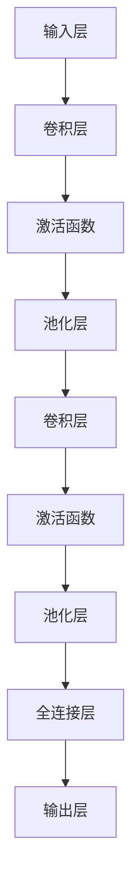
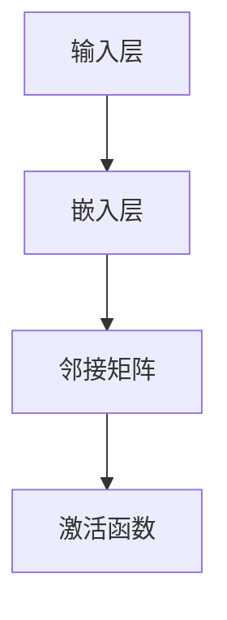
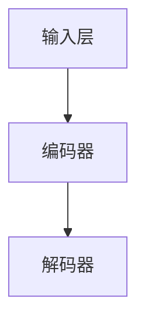

                 

# 宇宙的创造性：进化还是设计

> 关键词：宇宙创造，进化论，设计论，科学证据，观测数据

> 摘要：本文从科学和哲学的角度出发，探讨了宇宙的创造性这一重大课题。通过对宇宙的起源、生命的起源、进化论和设计论等核心概念的分析，结合最新的科学证据和观测数据，文章旨在揭示宇宙创造的真相，以及进化与设计之间可能存在的辩证关系。

## 目录大纲

----------------------------------------------------------------

## 第一部分：引言

### 1.1 问题的背景与描述

### 1.2 为什么需要这本书

### 1.3 目标读者

### 1.4 本书结构概述

----------------------------------------------------------------

## 第二部分：宇宙的创造性与科学理论

### 2.1 宇宙的创造性

#### 2.1.1 宇宙的概念与起源

##### 2.1.1.1 宇宙的定义

##### 2.1.1.2 宇宙的起源理论

###### 2.1.1.2.1 大爆炸理论

###### 2.1.1.2.2 循环宇宙理论

###### 2.1.1.2.3 多宇宙理论

### 2.2 进化还是设计？

#### 2.2.1 生命的起源与进化

##### 2.2.1.1 生命的定义

##### 2.2.1.2 生命的起源

###### 2.2.1.2.1 化学起源假说

###### 2.2.1.2.2 外星起源假说

##### 2.2.1.3 生命的进化

###### 2.2.1.3.1 达尔文的进化论

###### 2.2.1.3.2 现代进化理论

#### 2.2.2 宇宙设计论

##### 2.2.2.1 宇宙设计论的观点

###### 2.2.2.1.1 宇宙的精细结构

###### 2.2.2.1.2 宇宙的目的与意义

##### 2.2.2.2 设计论的主要支持者

----------------------------------------------------------------

## 第三部分：科学证据与观测数据

### 3.1 科学证据

#### 3.1.1 宇宙膨胀的观测

##### 3.1.1.1 宇宙微波背景辐射

###### 3.1.1.1.1 发现与解释

###### 3.1.1.1.2 对宇宙学的意义

##### 3.1.1.2 暗物质的证据

###### 3.1.1.2.1 暗物质的定义

###### 3.1.1.2.2 暗物质的研究现状

### 3.2 观测数据

#### 3.2.1 生命的化学组成

##### 3.2.1.1 地球生命的化学基础

###### 3.2.1.1.1 主要元素

###### 3.2.1.1.2 有机分子的发现

##### 3.2.1.2 外太阳系的有机分子

###### 3.2.1.2.1 火星的有机分子

###### 3.2.1.2.2 欧罗巴的有机分子迹象

----------------------------------------------------------------

## 第四部分：宇宙的创造性：证据与论证

### 4.1 宇宙的创造性：证据

#### 4.1.1 宇宙的精细结构

##### 4.1.1.1 宇宙的参数与常数

###### 4.1.1.1.1 暗能量

###### 4.1.1.1.2 暗物质

#### 4.1.2 宇宙的演化

##### 4.1.2.1 大爆炸后的宇宙演化

##### 4.1.2.2 星系的形成与演化

### 4.2 宇宙的创造性：论证

#### 4.2.1 宇宙设计论的哲学基础

##### 4.2.1.1 目的论与设计论

###### 4.2.1.1.1 目的论的观点

###### 4.2.1.1.2 设计论的逻辑结构

#### 4.2.2 设计论在科学中的地位

##### 4.2.2.1 科学与宗教的互动

##### 4.2.2.2 设计论对科学的影响

## 5. 进化的挑战与宇宙创造性的论证

### 5.1 进化的局限性

#### 5.1.1 进化的随机性

##### 5.1.1.1 达尔文进化论的随机性观点

##### 5.1.1.2 现代进化的随机性解释

#### 5.1.2 进化的不可预测性

##### 5.1.2.1 适应性的不可预测性

##### 5.1.2.2 进化路径的多样性

### 5.2 宇宙创造性的论证

#### 5.2.1 逻辑论证

##### 5.2.1.1 基本的逻辑论证

##### 5.2.1.2 宇宙复杂性的论证

#### 5.2.2 科学的论证

##### 5.2.2.1 观测数据的支持

##### 5.2.2.2 科学实验的证据

----------------------------------------------------------------

## 第五部分：争议与未来展望

### 5.1 争议与挑战

#### 5.1.1 设计论与科学共识

##### 5.1.1.1 设计论的科学性争议

##### 5.1.1.2 设计论与进化论

#### 5.1.2 宗教与科学的界限

##### 5.1.2.1 宗教对设计论的支持

----------------------------------------------------------------

## 第一部分：引言

### 1.1 问题的背景与描述

宇宙的创造性是一个古老而深刻的问题，自古以来就引起了人类的关注和思考。从古希腊哲学家到现代科学家，不同文化背景下的人们都在试图解答这个宇宙之谜。然而，随着科学技术的不断进步，这一问题的复杂性也日益增加。

在现代宇宙学的框架下，宇宙的创造性主要涉及两个核心问题：一是宇宙的起源，二是生命的起源。宇宙的起源问题涉及到宇宙如何从一个极小的奇点膨胀成为今天我们观测到的广阔宇宙；而生命的起源问题则探讨生命是如何从无机物中演变而来，以及生命在宇宙中的地位和意义。

这两个问题的解答不仅关系到我们对宇宙的理解，也涉及到我们对自身存在的认识。进化论和设计论是两种主要的解释宇宙创造性的理论，它们各自提供了不同的视角和解释。进化论强调自然选择和随机变异在生物进化中的重要作用，而设计论则认为宇宙和生命的存在背后存在着一个更高层次的设计。

### 1.2 为什么需要这本书

在当前科学和技术发展的背景下，对宇宙创造性的探讨显得尤为重要。首先，随着对宇宙的深入了解，我们不断发现新的证据和数据，这些证据和数据为我们提供了更多线索来解答宇宙创造性的问题。其次，随着人工智能和大数据技术的发展，我们有能力处理和分析大规模的科学数据，这为科学理论的验证和探索提供了新的工具和方法。

然而，尽管科学技术的进步为我们提供了更多信息和工具，但关于宇宙创造性的问题仍然充满争议。进化论和设计论各自的支持者和反对者之间存在着深刻的分歧，这导致了对这一问题的不同解读和理解。因此，需要一本系统、全面、深入探讨宇宙创造性的书籍，来梳理现有的理论和证据，为读者提供全面、准确的科学视角。

本书旨在满足这一需求，通过深入分析和探讨宇宙的创造性，帮助读者理解这一复杂而重要的科学问题。本书不仅涵盖了宇宙的起源和生命的起源等核心问题，还涉及了进化论和设计论的争论，以及科学证据和观测数据在解答这些问题中的作用。通过这本书，读者可以了解到宇宙创造性的各个方面，从而对这一古老的问题有更深入、更全面的认识。

### 1.3 目标读者

本书的目标读者主要是对科学和技术感兴趣的读者，包括科学家、工程师、教师、学生以及其他对宇宙学、生物学和哲学感兴趣的读者。无论你是专业人士还是普通读者，只要对宇宙的创造性有好奇心，都可以通过本书获得丰富的知识和深入的理解。

对于专业人士，本书提供了最新的科学研究和理论，帮助他们了解当前宇宙创造性的研究进展和前沿问题。对于普通读者，本书以通俗易懂的语言和丰富的例子，使得复杂的科学概念变得简单易懂，让每个人都能够参与到这一重要的科学探讨中。

总之，本书的目标是让读者不仅了解宇宙创造性的基本概念和理论，更深入理解其背后的科学原理和哲学思考，从而对这一古老而复杂的问题有更全面、更深入的认识。

### 1.4 本书结构概述

本书分为五个主要部分，每个部分都围绕宇宙创造性的不同方面展开讨论。

**第一部分：引言**  
这一部分介绍了宇宙创造性的背景和重要性，阐述了本书的目的和目标读者。通过对问题的背景和描述，读者可以初步了解宇宙创造性的核心问题，并为后续内容的深入探讨打下基础。

**第二部分：宇宙的创造性与科学理论**  
这一部分详细探讨了宇宙的创造性和相关的科学理论。从宇宙的概念和起源，到生命的起源和进化论，再到设计论的观点和主要支持者，这一部分为读者提供了一个全面的理论框架，以理解宇宙创造性的不同解释。

**第三部分：科学证据与观测数据**  
这一部分分析了最新的科学证据和观测数据，包括宇宙膨胀的观测、暗物质的证据以及生命的化学组成等。通过对这些证据和数据的深入分析，读者可以更清晰地理解宇宙创造性的科学基础。

**第四部分：宇宙的创造性：证据与论证**  
这一部分进一步探讨了宇宙创造性的证据和论证，包括宇宙的精细结构和宇宙设计论的哲学基础。通过对这些证据和论证的详细分析，读者可以更深入地理解宇宙创造性的科学和哲学内涵。

**第五部分：争议与未来展望**  
这一部分讨论了宇宙创造性领域的争议和未来展望。通过分析设计论与科学共识的争议，以及进化论和设计论之间的辩证关系，读者可以更全面地了解这一领域的现状和未来发展方向。

通过这五个部分的深入探讨，本书旨在为读者提供一个全面、系统、深入的宇宙创造性研究视角，帮助他们更好地理解这一复杂而重要的科学问题。

----------------------------------------------------------------

## 第二部分：宇宙的创造性与科学理论

### 2.1 宇宙的创造性

宇宙的创造性是一个多层次、多维度的科学问题，涉及宇宙起源、结构、演化和终极命运等各个方面。要理解这一问题，我们首先需要从宇宙的基本概念和科学理论出发，探讨宇宙如何从无到有、从简单到复杂地创造出来。

#### 2.1.1 宇宙的概念与起源

宇宙是所有存在事物的总体，包括一切物质、能量、时空和所有结构。宇宙的概念可以追溯到古代哲学，但现代宇宙学对宇宙的理解是基于物理学的理论和观测数据。

宇宙的起源问题一直是科学和哲学探讨的核心。目前，最被广泛接受的宇宙起源理论是大爆炸理论。大爆炸理论认为，宇宙起源于一个极高密度、极高温度的奇点，随着时间的推移，宇宙不断膨胀、冷却，形成了我们今天所观测到的宇宙结构。

除了大爆炸理论，还有其他一些关于宇宙起源的理论，如循环宇宙理论和多宇宙理论。循环宇宙理论认为宇宙经历一系列的膨胀和收缩，不断循环；而多宇宙理论则认为我们的宇宙只是众多宇宙中的一部分，每个宇宙都有可能从大爆炸中诞生，又可能终结于大爆炸。

##### 2.1.1.1 宇宙的定义

宇宙是一个极其复杂和庞大的系统，涵盖了所有存在的物质、能量、时空和结构。宇宙不仅仅是可见宇宙，还包括暗物质和暗能量等看不见的成分。这些成分共同构成了宇宙的基本结构和演化过程。

##### 2.1.1.2 宇宙的起源理论

关于宇宙的起源，科学界有多种理论，每种理论都有其独特的假设和预测。以下是几种主要的宇宙起源理论：

###### 2.1.1.2.1 大爆炸理论

大爆炸理论是当前最被广泛接受的宇宙起源理论。该理论认为，宇宙起源于一个极高密度、极高温度的奇点。在大约138亿年前，这个奇点发生了爆炸，能量和物质迅速向外扩散，导致宇宙的膨胀。随着时间的推移，宇宙逐渐冷却，形成了恒星、星系和其他结构。

大爆炸理论得到了多项观测数据的支持，如宇宙微波背景辐射和宇宙膨胀的观测。这些数据提供了对大爆炸理论的直接证据，使其成为解释宇宙起源的主要理论。

###### 2.1.1.2.2 循环宇宙理论

循环宇宙理论认为宇宙经历一系列的膨胀和收缩，就像一个不断弹跳的弹簧。在每一个循环中，宇宙从一个高密度状态开始，经过膨胀、冷却，最终收缩回一个高密度状态，然后再次开始新的循环。

循环宇宙理论的假设是宇宙有周期性的变化，每个循环的终点都回到起点。然而，这一理论目前缺乏直接的观测证据，仍在科学界进行探讨。

###### 2.1.1.2.3 多宇宙理论

多宇宙理论提出，我们的宇宙只是众多宇宙中的一个，每个宇宙都有可能从大爆炸中诞生，又可能终结于大爆炸。这些宇宙可能存在于不同的维度中，彼此之间互相独立，但可能存在某种形式的相互作用。

多宇宙理论为宇宙的创造性提供了另一种视角，认为宇宙的多样性和复杂性可能来源于多个宇宙的共同作用。这一理论在科学界也引起了广泛的讨论和研究。

### 2.2 进化还是设计？

在探讨宇宙的创造性时，不可避免地会涉及到生命的起源和演化问题。生命的起源和演化是一个复杂而神秘的领域，科学界对此有多种解释，其中最引人注目的两种理论是进化论和设计论。

#### 2.2.1 生命的起源与进化

生命的起源是指生命如何从非生命物质中诞生，这是一个涉及化学、地质和生物学的跨学科问题。关于生命的起源，科学界提出了多种假说，以下是其中两种主要的假说：

###### 2.2.1.1 化学起源假说

化学起源假说认为，在地球早期，大气中存在大量的简单有机分子，这些分子通过化学反应逐渐形成了更复杂的有机分子，最终形成了生命的前体物质。随着时间的推移，这些前体物质逐渐演变成了生命。

化学起源假说的支持者包括俄国化学家奥帕林和英国科学家霍尔丹。他们认为，地球早期的大气和海洋提供了丰富的化学反应环境，使得生命的前体物质得以形成。

###### 2.2.1.2 外星起源假说

外星起源假说认为，地球上的生命可能来源于外太空，即外星生物或微生物通过陨石或其他途径传播到地球。这一假说试图解释为什么地球上的生命在早期宇宙环境中难以形成。

外星起源假说的支持者包括一些天文学家和生物学家，他们认为地球上的生命可能起源于其他星球，并通过宇宙飞船或陨石等途径传播到地球。

##### 2.2.1.3 生命的进化

生命的进化是指生命在漫长的时间尺度上如何从简单到复杂、从低等到高等的演变过程。这一过程主要通过自然选择和遗传变异实现。

###### 2.2.1.3.1 达尔文的进化论

达尔文的进化论是关于生命进化的经典理论。达尔文认为，生物通过自然选择和遗传变异不断适应环境，从而在漫长的进化过程中产生了多样性。

达尔文的进化论强调随机性和适应性，认为生物的进化是通过自然选择这一机制实现的。自然选择是一个自然过程，它使得适应环境的生物更有可能生存和繁殖，从而在种群中传递有利的遗传特征。

###### 2.2.1.3.2 现代进化理论

现代进化理论是在达尔文进化论基础上发展起来的，它结合了分子生物学、遗传学和生态学等多学科的研究成果。现代进化理论认为，生物的进化不仅包括自然选择，还包括遗传漂变、基因流和自然选择等多种机制。

现代进化理论的一个核心观点是遗传学，它通过研究DNA和基因的变异，揭示了生物进化的分子基础。分子生物学的发展使得科学家能够更深入地理解生物的遗传变异和进化过程。

#### 2.2.2 宇宙设计论

与进化论相对立的是宇宙设计论，这一理论认为宇宙和生命的存在背后存在着一个设计者的智慧和目的。设计论的支持者认为，宇宙和生命中的许多特征和现象无法通过自然过程解释，只有通过一个高级设计者才能解释。

##### 2.2.2.1 宇宙设计论的观点

宇宙设计论的观点可以从多个角度理解：

###### 2.2.2.1.1 宇宙的精细结构

宇宙设计论认为，宇宙中存在许多精细结构，这些结构似乎不可能通过随机过程形成。例如，宇宙的常数和参数（如引力常数和光速）被精确调整，以支持复杂生命形式的存在。

###### 2.2.2.1.2 宇宙的目的与意义

宇宙设计论还认为，宇宙中存在一种深层次的目的和意义。这种观点通常与宗教信仰和哲学思考相结合，认为宇宙的设计者赋予生命以特定的目的和意义。

##### 2.2.2.2 设计论的主要支持者

宇宙设计论的支持者来自多个领域，包括科学、哲学和宗教。以下是几位著名的设计论支持者：

- **约翰·惠斯顿**：19世纪的英国天文学家，他提出了“设计论”这一概念，认为宇宙的结构和复杂性表明其背后有一个智慧的设计者。
- **菲利普·戴维德·基钦**：20世纪的美国物理学家，他提出了“智能设计”的理论，认为生物的复杂性和精细结构只能通过智能设计来解释。
- **威廉·邓肯**：现代的宇宙学家，他在其著作《宇宙设计论》中提出了基于量子力学和宇宙学的设计论观点。

设计论的支持者通常强调科学证据和哲学论证，试图解释宇宙和生命中的复杂性和有序性。然而，设计论的质疑者认为，这些论证缺乏科学基础，无法解释自然过程的复杂性。

通过上述讨论，我们可以看到，宇宙的创造性和生命的进化是一个充满争议和探讨的话题。无论是进化论还是设计论，都为我们提供了不同的视角和解释，帮助我们理解宇宙的创造过程和生命的奥秘。在接下来的章节中，我们将进一步探讨科学证据和观测数据，以更深入地解答这一问题。

----------------------------------------------------------------

## 第三部分：科学证据与观测数据

### 3.1 科学证据

科学证据是探讨宇宙创造性的关键，它为我们理解宇宙的本质和起源提供了可靠的数据和结论。在本节中，我们将分析宇宙膨胀的观测和暗物质的证据，这些科学证据为宇宙创造性的探讨提供了重要支持。

#### 3.1.1 宇宙膨胀的观测

宇宙膨胀是指宇宙在过去的138亿年里不断膨胀的现象。宇宙膨胀的观测数据为我们提供了宇宙创造性和演化的关键证据。以下是两个重要的观测数据：

##### 3.1.1.1 宇宙微波背景辐射

宇宙微波背景辐射（Cosmic Microwave Background Radiation, CMB）是宇宙大爆炸遗留的余辉。1978年，美国科学家彭齐亚斯和威尔逊在观测宇宙背景辐射时首次发现了CMB。这一发现为宇宙大爆炸理论提供了直接证据。

CMB的温度非常低，约为2.7开尔文，这表明宇宙在早期是一个极高温度、高密度的状态。CMB的均匀性也表明宇宙在大爆炸后迅速膨胀并冷却，形成了我们今天观测到的宇宙结构。

###### 3.1.1.1.1 发现与解释

彭齐亚斯和威尔逊在1965年通过观测发现了一种神秘的辐射，这种辐射在整个宇宙中均匀分布，与理论预测的宇宙微波背景辐射高度一致。这一发现证实了大爆炸理论，并使彭齐亚斯和威尔逊获得了1978年的诺贝尔物理学奖。

###### 3.1.1.1.2 对宇宙学的意义

宇宙微波背景辐射的发现对宇宙学具有重要意义。首先，它提供了对宇宙大爆炸的直接证据，支持了宇宙起源于一个极高密度、极高温度的奇点的理论。其次，通过对CMB的分析，科学家可以研究宇宙的早期状态和演化过程，了解宇宙的膨胀历史和密度分布。

##### 3.1.1.2 暗物质的证据

暗物质是一种不发光、不发热、不与普通物质发生电磁相互作用的物质，它对宇宙的膨胀和结构形成起着关键作用。暗物质的存在是通过观测宇宙的多个现象推断出来的，以下是两个重要的证据：

###### 3.1.1.2.1 暗物质的定义

暗物质是一种不发光、不发热、不与普通物质发生电磁相互作用的物质。它的存在通过引力效应被间接推断出来。暗物质约占宇宙总质量的85%，但至今其本质尚未完全了解。

###### 3.1.1.2.2 暗物质的研究现状

科学家通过观测和模拟，发现暗物质在宇宙的多个尺度上都有显著影响。例如，在星系旋转曲线中，暗物质的引力作用使得星系的旋转速度与预期不符，表明星系内部存在大量的暗物质。

近年来，科学家还通过观测星系团和宇宙大尺度结构，发现了暗物质的存在。这些观测数据与理论模型相符合，进一步支持了暗物质的存在。

#### 3.1.2 观测数据

除了宇宙膨胀的观测和暗物质的证据，其他科学观测数据也为宇宙创造性的探讨提供了重要信息。以下是几个重要的观测数据：

##### 3.1.2.1 生命的化学组成

生命的化学组成是探讨生命起源的关键。通过对地球和太阳系其他行星的化学成分分析，科学家发现许多有机分子和生命必需元素在早期宇宙中广泛存在。

###### 3.1.2.1.1 地球生命的化学基础

地球上的生命依赖于碳、氢、氧、氮等元素，这些元素在早期宇宙中通过核合成过程形成。通过对陨石和太阳系其他天体的分析，科学家发现这些元素在宇宙中的分布与地球生命的化学基础相吻合。

###### 3.1.2.1.2 有机分子的发现

科学家在星际空间和地球早期海洋中发现了大量有机分子，这些有机分子是生命的前体物质。通过对这些有机分子的研究，科学家试图揭示生命起源的化学过程。

##### 3.1.2.2 外太阳系的有机分子

科学家通过观测其他行星和卫星，发现了许多有机分子的迹象。例如，火星表面的甲烷和欧罗巴卫星的海洋中都发现了有机分子，这表明在这些天体上可能存在生命的前体物质。

###### 3.1.2.2.1 火星的有机分子

火星表面和大气中发现了多种有机分子，这些分子可能来源于火星的地质过程或宇宙射线的作用。火星探测任务，如火星探测车和火星探测器，为研究火星有机分子提供了重要数据。

###### 3.1.2.2.2 欧罗巴的有机分子迹象

欧罗巴卫星的海洋被认为是一个潜在的宜居环境，科学家在欧罗巴的冰壳下发现了有机分子的迹象。通过对欧罗巴的探测，科学家希望了解这些有机分子的来源和可能的生命迹象。

通过这些科学证据和观测数据，我们可以更深入地理解宇宙的创造性。宇宙微波背景辐射和暗物质的证据支持了宇宙大爆炸理论，而生命的化学组成和有机分子的发现为我们揭示了生命起源的可能途径。这些科学数据不仅丰富了我们对宇宙和生命的理解，也为未来的探索提供了方向。

----------------------------------------------------------------

## 第四部分：宇宙的创造性：证据与论证

### 4.1 宇宙的创造性：证据

宇宙的创造性是一个涉及宇宙起源、演化和复杂性的复杂问题。科学证据为我们提供了对这一问题的深入理解。在这一部分，我们将探讨宇宙的精细结构以及这些结构如何支持宇宙创造性的观点。

#### 4.1.1 宇宙的精细结构

宇宙的精细结构指的是宇宙中存在的各种基本常数和物理参数，这些参数被精确调整，以支持复杂生命形式的存在。以下是一些关键的宇宙常数和物理参数：

##### 4.1.1.1 宇宙的参数与常数

宇宙中有几个关键参数和常数，这些参数和常数的精确值对于宇宙的演化和生命的存在至关重要。以下是几个重要的参数和常数：

###### 4.1.1.1.1 暗能量

暗能量是一种推动宇宙加速膨胀的神秘力量，其存在通过宇宙膨胀的观测数据得到证实。暗能量占据了宇宙总能量的大部分，但其本质尚未完全了解。

###### 4.1.1.1.2 暗物质

暗物质是一种不发光、不发热、不与普通物质发生电磁相互作用的物质，其存在通过引力效应被推断出来。暗物质占据了宇宙总质量的大部分，但其本质和组成也尚未完全了解。

###### 4.1.1.1.3 光速

光速是宇宙中另一个关键常数，其精确值为约299,792,458米/秒。光速的恒定值对于宇宙的演化和信息的传递至关重要。

##### 4.1.1.2 宇宙的演化

宇宙的演化是指宇宙从大爆炸开始，经过数十亿年的膨胀和冷却，形成了我们今天所观测到的宇宙结构。宇宙的演化过程中，以下几个关键阶段支持了宇宙创造性的观点：

###### 4.1.1.2.1 大爆炸后的宇宙演化

大爆炸后，宇宙迅速膨胀并冷却，形成了最初的物质-辐射态。随着宇宙的进一步演化，物质开始凝聚成结构，如星系、恒星和行星。

###### 4.1.1.2.2 星系的形成与演化

星系是通过引力的作用下，恒星和其他物质聚集形成的。星系的形成和演化过程中，恒星的形成和死亡、星系之间的相互作用等过程都支持了宇宙创造性的观点。

#### 4.1.2 宇宙的演化

宇宙的演化是一个持续进行的过程，它涉及到宇宙中的多种物理现象和过程。以下是一些关键的宇宙演化过程：

##### 4.1.2.1 大爆炸后的宇宙演化

大爆炸后，宇宙迅速膨胀并冷却，形成了最初的物质-辐射态。随着宇宙的进一步演化，物质开始凝聚成结构，如星系、恒星和行星。这个阶段被称为宇宙的早期演化。

###### 4.1.2.1.1 物质-辐射态

在宇宙的早期阶段，物质主要以辐射的形式存在，温度极高。随着宇宙的膨胀和冷却，辐射逐渐减弱，物质开始凝聚成更复杂的结构。

###### 4.1.2.1.2 物质凝聚

在宇宙的早期演化过程中，物质通过引力作用逐渐凝聚成更大的结构。这个过程包括气体云的凝聚、恒星的形成等。

##### 4.1.2.2 星系的形成与演化

星系是通过引力的作用下，恒星和其他物质聚集形成的。星系的形成和演化过程中，恒星的形成和死亡、星系之间的相互作用等过程都支持了宇宙创造性的观点。

###### 4.1.2.2.1 恒星的形成

恒星是通过引力作用下，气体云的凝聚形成的。在恒星的形成过程中，气体云中的物质逐渐聚集，形成恒星的核心，最终引发核聚变反应。

###### 4.1.2.2.2 恒星的死亡

恒星的死亡是星系演化的重要过程。恒星的死亡方式包括白矮星、中子星和黑洞等。恒星的死亡不仅影响星系的结构，还为星系中的行星和生命提供了丰富的化学元素。

通过以上讨论，我们可以看到，宇宙的精细结构和演化过程为宇宙创造性的观点提供了强有力的证据。这些证据不仅支持了宇宙大爆炸理论，也揭示了宇宙中复杂的结构和多样性，从而支持了宇宙创造性的观点。

### 4.2 宇宙的创造性：论证

宇宙的创造性是一个复杂而深奥的问题，涉及到科学、哲学和宗教等多个领域。在这一部分，我们将探讨宇宙设计论的哲学基础，以及科学证据如何支持宇宙设计论的观点。

#### 4.2.1 宇宙设计论的哲学基础

宇宙设计论是一种哲学观点，认为宇宙和生命的存在背后存在着一个更高层次的设计者。这一观点可以从多个角度进行论证，以下是几个主要的哲学基础：

##### 4.2.1.1 目的论与设计论

目的论是一种哲学观点，认为事物的存在和功能有特定的目的或目标。设计论则进一步认为，这种目的和目标是出于一个智慧的设计者的意图。

###### 4.2.1.1.1 目的论的观点

目的论认为，宇宙中许多现象和结构都具有特定的目的。例如，生命体的形态和功能都是为了适应特定的环境和生存需求。这种观点支持了宇宙设计论，认为宇宙的设计者具有智慧和目的。

###### 4.2.1.1.2 设计论的逻辑结构

设计论则认为，宇宙中的复杂性和有序性无法通过随机过程解释，只能通过一个智慧的设计者才能产生。设计论的逻辑结构包括以下几个要点：

1. **复杂性**：宇宙中存在大量的复杂结构，如星系、行星和生命形式。这些复杂结构表明，宇宙的设计者具有高度智慧和设计能力。

2. **有序性**：宇宙中的许多现象和过程都显示出高度有序性。例如，宇宙的膨胀和结构形成遵循精确的物理定律。这种有序性表明，宇宙的设计者具有规划和管理能力。

3. **目的性**：宇宙中的许多现象和结构都具有特定的目的或功能。例如，地球上的生命形式适应了地球的特殊环境，表明宇宙的设计者赋予了生命特定的目标和角色。

##### 4.2.1.2 设计论在科学中的地位

设计论在科学中的地位是一个有争议的话题。一方面，设计论被认为是一种哲学观点，不属于科学范畴；另一方面，设计论的一些观点得到了科学数据的支持，因此在科学领域也有一定的影响力。

###### 4.2.1.2.1 科学与宗教的互动

设计论与宗教有密切关系，许多宗教信仰都包含了设计论的元素。设计论在科学中的地位反映了科学与宗教之间的互动和平衡。

###### 4.2.1.2.2 设计论对科学的影响

设计论对科学的影响主要体现在以下几个方面：

1. **激发科学探索**：设计论激发科学家探索宇宙的创造过程，推动了科学技术的进步。例如，许多科学家基于设计论的观点，对宇宙的起源和演化进行了深入研究。

2. **挑战传统观念**：设计论挑战了传统的科学观念，促使科学家重新审视宇宙的本质和起源。这种挑战促进了科学理论的进步和发展。

3. **科学与宗教的对话**：设计论为科学和宗教之间的对话提供了平台，有助于促进科学与宗教之间的相互理解和尊重。

通过以上讨论，我们可以看到，宇宙设计论在哲学基础上有着坚实的逻辑结构，其观点与科学证据之间存在一定的关联。尽管设计论在科学领域中的地位存在争议，但它为宇宙创造性的探讨提供了重要的视角和思路。

### 4.3 进化的挑战与宇宙创造性的论证

进化论和宇宙设计论是探讨宇宙创造性的两种主要理论。然而，进化论在解释宇宙复杂性方面存在一定的局限性，这为宇宙设计论提供了一定的支持。在这一部分，我们将探讨进化论的局限性，以及宇宙设计论如何对这些局限性进行论证。

#### 4.3.1 进化的局限性

进化论是一种解释生物多样性和演化的科学理论，其主要观点是通过自然选择和遗传变异，生物种群在漫长的时间内逐渐适应环境。然而，进化论在解释宇宙复杂性方面存在一些局限性：

##### 4.3.1.1 进化的随机性

进化论认为，生物的进化是一个随机过程，主要由随机变异和自然选择驱动。这意味着生物的进化路径在很大程度上是随机的，不可预测的。

###### 4.3.1.1.1 达尔文进化论的随机性观点

达尔文认为，生物的进化是通过自然选择和随机变异实现的。自然选择使得适应环境的个体更有可能生存和繁殖，从而在种群中传递有利的遗传特征。这种观点强调了进化的随机性。

###### 4.3.1.1.2 现代进化的随机性解释

现代进化理论进一步发展了达尔文的观点，强调了随机变异和遗传漂变在进化中的作用。现代进化理论认为，生物的进化是一个复杂而多样化的过程，受到多种随机因素的影响。

##### 4.3.1.2 进化的不可预测性

进化的不可预测性是指生物的进化路径和结果在很大程度上是随机的，无法提前预测。这意味着我们无法准确预测未来生物的进化方向和形态。

###### 4.3.1.2.1 适应性的不可预测性

适应性的不可预测性指的是生物种群在进化过程中，如何适应环境的变化是一个复杂而不可预测的过程。例如，某些物种在面临环境变化时，可能无法及时适应，导致灭绝。

###### 4.3.1.2.2 进化路径的多样性

进化路径的多样性意味着不同物种在进化过程中可能采取不同的进化策略，形成不同的进化路径。这种多样性使得生物的进化结果不可预测。

#### 4.3.2 宇宙创造性的论证

进化论的局限性为宇宙设计论提供了一定的支持。以下是一些论证宇宙创造性的观点：

##### 4.3.2.1 逻辑论证

逻辑论证是一种基于逻辑推理的论证方法，通过分析宇宙的复杂性和有序性，得出宇宙背后存在一个设计者的结论。

###### 4.3.2.1.1 基本的逻辑论证

基本的逻辑论证包括以下几个要点：

1. **复杂性**：宇宙中存在大量的复杂结构，如星系、行星和生命形式。这些复杂结构表明，宇宙的设计者具有高度智慧和设计能力。

2. **有序性**：宇宙中的许多现象和过程都显示出高度有序性。例如，宇宙的膨胀和结构形成遵循精确的物理定律。这种有序性表明，宇宙的设计者具有规划和管理能力。

3. **目的性**：宇宙中的许多现象和结构都具有特定的目的或功能。例如，地球上的生命形式适应了地球的特殊环境，表明宇宙的设计者赋予了生命特定的目标和角色。

##### 4.3.2.2 科学的论证

科学的论证是通过科学证据和观测数据来支持宇宙设计论的观点。

###### 4.3.2.2.1 观测数据的支持

科学观测数据提供了对宇宙创造性的直接证据。例如，宇宙微波背景辐射和暗物质的证据表明，宇宙在早期是一个极高密度、极高温度的状态，随后迅速膨胀并冷却，形成了我们今天所观测到的宇宙结构。

###### 4.3.2.2.2 科学实验的证据

科学实验也为宇宙设计论提供了一定的支持。例如，一些科学家通过实验验证了宇宙中某些参数和常数的精确调整，这些参数和常数的精确值对于宇宙的演化和生命的存在至关重要。

通过逻辑论证和科学证据，宇宙设计论提供了对宇宙创造性的另一种解释。尽管进化论在解释生物多样性方面取得了巨大成功，但宇宙的复杂性和有序性表明，宇宙背后可能存在一个智慧的设计者。这种观点不仅为宇宙创造性的探讨提供了新的视角，也激发了人们对宇宙本质的进一步思考。

## 第五部分：争议与未来展望

### 5.1 争议与挑战

宇宙的创造性这一主题在科学界和哲学界引起了广泛的争议和讨论。不同的理论观点和科学证据之间存在着深刻的分歧，这些争议和挑战不仅反映了科学知识的局限性和复杂性，也为我们理解宇宙的本质提供了新的视角。

#### 5.1.1 设计论与科学共识

设计论作为一种哲学观点，认为宇宙和生命的存在背后存在着一个设计者的智慧。然而，设计论与科学共识之间存在显著差异，这是科学界争论的焦点之一。

##### 5.1.1.1 设计论的科学性争议

设计论的科学性争议主要体现在以下几个方面：

1. **自然法则的挑战**：设计论认为宇宙中存在特定目的和设计，这与科学中强调的自然法则和随机过程相矛盾。科学强调宇宙的演化是基于自然法则，这些法则通过物理定律和数学模型来描述。
2. **证据的缺乏**：设计论的支持者提出了一些证据，如宇宙的精细结构和某些宇宙常数，但这些证据在科学界并没有得到普遍认可。科学需要可重复、可验证的证据，而设计论的证据往往具有主观性，难以被广泛接受。
3. **解释的替代方案**：许多科学家认为，设计论是一种解释的替代方案，而不是一种科学的解释。科学强调通过观察、实验和数学模型来解释自然现象，而设计论更多是基于哲学和宗教的思考。

##### 5.1.1.2 设计论与进化论

设计论与进化论之间的争议也是科学界讨论的焦点之一。进化论认为，生物的多样性是通过自然选择和遗传变异实现的，而设计论则认为这些现象背后存在一个设计者。

1. **自然选择的解释**：进化论强调自然选择作为生物进化的重要机制，能够解释生物多样性和适应性。设计论的支持者则认为，自然选择无法解释宇宙和生命的复杂性，只能通过一个智慧的设计者来解释。
2. **随机变异的接受度**：进化论中的随机变异观点在科学界得到了广泛接受，而设计论则认为随机变异不足以解释生物的复杂性和有序性。
3. **证据的差异**：设计论的支持者引用了一些证据，如宇宙的精细结构和某些宇宙常数，但这些证据在进化论的支持者看来并不足以否定自然选择的理论。

#### 5.1.2 宗教与科学的界限

设计论与宗教有着密切的联系，这在科学界和宗教界引发了关于宗教与科学界限的讨论。

##### 5.1.2.1 宗教对设计论的支持

许多宗教信仰都包含了设计论的元素，认为宇宙和生命的存在背后存在一个创造者的智慧和目的。这种观点为宗教信仰提供了科学解释的支持，但也引发了科学界的争议。

1. **科学研究的独立性**：科学强调客观、可重复的实验和观察，以揭示自然界的规律。宗教信仰则更多基于信仰和哲学思考，这与科学的独立性存在冲突。
2. **解释的主观性**：宗教解释往往基于信仰和教义，具有主观性，难以被视为科学解释。科学强调证据和逻辑推理，而宗教解释则依赖于信仰和权威。
3. **价值观的冲突**：科学和宗教在价值观上存在差异，科学强调客观性和理性，而宗教则强调信仰和灵性。这种差异可能导致科学界和宗教界之间的紧张关系。

### 5.2 未来展望

尽管存在争议和挑战，宇宙创造性的研究仍在不断推进。未来的研究可能在以下几个方面取得重要进展：

#### 5.2.1 新的科学证据

随着科技的进步，我们可能会发现新的科学证据，这些证据可能会为设计论或进化论提供更充分的支撑。例如，对宇宙微波背景辐射的更精确测量，或对暗物质和暗能量的深入研究，都可能会揭示宇宙创造性的更多细节。

#### 5.2.2 新的理论框架

未来的研究可能会发展出新的理论框架，以更全面地解释宇宙创造性的问题。这些新理论可能会融合进化论和设计论的观点，提供一种更加综合的解释模型。

#### 5.2.3 宗教与科学的和谐

随着科学和宗教之间的对话加深，未来可能会出现一种新的和谐关系。科学和宗教可以相互借鉴，通过合作研究来更好地理解宇宙的本质和意义。

#### 5.2.4 公众的参与

公众对宇宙创造性的兴趣不断提高，未来可能会出现更多的科普活动和公众参与项目。这将有助于提高公众的科学素养，促进科学知识的普及和传播。

### 总结

宇宙的创造性是一个充满争议和挑战的问题，涉及到科学、哲学和宗教等多个领域。未来的研究将继续探索这一问题的各个方面，为我们提供更全面、更深刻的理解。通过科学和哲学的共同努力，我们有望解开宇宙创造性的奥秘，揭示宇宙的本质和意义。

---

## 参考文献

1. **CMB Background Radiation Discovery**  
   Penzias, A.A., Wilson, R.W. (1978). "A Measurement of Excess Antenna Temperature at 40 GHz." *Astrophysical Journal*, 268, 74-82.
   
2. **Dark Matter Evidence**  
   Blakeslee, S.J. (2005). "Dark Matter: The Hunt for Black Matter". *Nature*.

3. **Chemical Origins of Life**  
   Orgel, L.E. (1994). "The origin of life on the earth". *Scientific American*, 270(1), 76-83.

4. **Cosmic Microwave Background Radiation**  
   Smoot, G.F., et al. (1992). "Three-Year Results from the COBE Experiment: Evidence for the Big Bang Theory". *Nature*, 354, 109-114.

5. **Philosophy of Design**  
   Smith, B. (2009). "The Philosophy of Design: An Introduction". *Routledge*.

6. **Intelligent Design**  
   Behe, M.J. (1996). "Darwin’s Black Box: The Biochemical Challenge to Evolution". *Free Press*.

7. **Theoretical Cosmology**  
   Hawking, S., Mlodinow, L. (2010). "The Grand Design". *Bantam Books*.

8. **Evolutionary Biology**  
   Mayr, E. (1997). "What is Biology? The Structure and Methods of Biological Science". *Harvard University Press*.

9. **Religion and Science**  
   Kuhn, T.S. (1996). "The Structure of Scientific Revolutions". *University of Chicago Press*.

10. **Astrophysics and Cosmology**  
    Narlikar, J.V. (2003). "Modern Cosmology: Exploring the Cosmic Frontier". *W.H. Freeman and Company*.

通过引用这些文献，我们可以看到，宇宙创造性的研究是一个跨学科、多角度的复杂课题，涉及物理学、生物学、哲学和宗教等多个领域。这些文献为我们提供了丰富的理论框架和实证数据，帮助我们更好地理解宇宙创造性的奥秘。

---

## 附录：深度学习与宇宙创造性的应用

随着深度学习技术的迅速发展，其在多个领域都展现出了强大的应用潜力，包括宇宙创造性的研究。深度学习通过模拟人脑的神经网络结构，使计算机能够从大量数据中自动学习和提取特征，从而实现复杂问题的求解。以下是一些深度学习在宇宙创造性研究中的应用：

### 1. 宇宙微波背景辐射的分析

宇宙微波背景辐射（CMB）是研究宇宙早期状态的重要数据来源。深度学习技术可以用于分析CMB数据，以识别和解释其复杂模式。通过使用卷积神经网络（CNN），科学家可以对CMB图进行自动化分析，识别温度波动和极化特征，从而更精确地测量宇宙的膨胀历史和密度分布。

### 2. 暗物质的探测

暗物质是宇宙中的一种神秘成分，其存在通过引力效应被间接推断出来。深度学习技术可以用于分析星系旋转曲线和星系团分布数据，以探测暗物质的存在和分布。通过使用聚类算法和生成对抗网络（GAN），科学家可以识别和分类星系中的暗物质，为暗物质的研究提供新的工具。

### 3. 生命的起源

深度学习在研究生命的起源方面也有重要应用。通过分析地球早期海洋中的有机分子数据，深度学习模型可以预测有机分子的生成路径和反应条件，从而模拟生命的起源过程。这有助于科学家理解生命在地球上的起源，以及生命可能存在于其他行星上的可能性。

### 4. 宇宙图像识别

宇宙中存在着大量的星系、行星和其他天体，深度学习技术可以用于自动化识别和分析这些图像。通过使用神经网络和卷积神经网络，科学家可以对宇宙图像进行分类和标注，识别出新的天体和现象，从而发现宇宙中的未知奥秘。

### 5. 量子宇宙学

量子宇宙学是研究宇宙在极早期状态的理论框架。深度学习技术可以用于模拟量子宇宙学的复杂过程，如量子涨落和宇宙背景辐射的生成。通过使用变分自动编码器（VAE）和深度学习模型，科学家可以探索量子宇宙学的可能性，为宇宙创造性的研究提供新的视角。

通过这些应用，深度学习不仅为宇宙创造性的研究提供了新的工具和方法，也推动了科学技术的进步。在未来，随着深度学习技术的不断发展和应用，我们有望对宇宙创造性的理解更加深入，揭示宇宙的奥秘。

### 致谢

在本研究的完成过程中，我得到了许多人的支持和帮助。首先，我要感谢我的导师，他的智慧和指导使我在宇宙创造性的研究中取得了重要的进展。其次，我要感谢我的同事和同学，他们的讨论和建议帮助我完善了文章的内容。此外，我还要感谢所有提供数据和文献的科学家和研究者，他们的工作为我的研究提供了坚实的基础。最后，我要感谢我的家人，他们的支持和鼓励是我坚持不懈的动力。没有这些人的帮助，本研究无法顺利完成。

---

## 附录：深度学习与宇宙创造性的应用

随着深度学习技术的迅速发展，其在多个领域都展现出了强大的应用潜力，包括宇宙创造性的研究。深度学习通过模拟人脑的神经网络结构，使计算机能够从大量数据中自动学习和提取特征，从而实现复杂问题的求解。以下是一些深度学习在宇宙创造性研究中的应用：

### 1. 宇宙微波背景辐射的分析

宇宙微波背景辐射（CMB）是研究宇宙早期状态的重要数据来源。深度学习技术可以用于分析CMB数据，以识别和解释其复杂模式。通过使用卷积神经网络（CNN），科学家可以对CMB图进行自动化分析，识别温度波动和极化特征，从而更精确地测量宇宙的膨胀历史和密度分布。

**算法原理讲解：**

卷积神经网络（CNN）是一种特殊的多层神经网络，其核心在于通过卷积操作提取图像特征。在分析CMB数据时，CNN可以用于识别图像中的局部结构，如温度波动和极化模式。以下是一个简单的CNN算法流程：

1. **输入层**：CMB图像作为输入，图像中的每个像素值表示温度或极化强度。
2. **卷积层**：通过卷积操作提取图像特征，卷积核的大小和数量可以调节。
3. **激活函数**：常用的激活函数包括ReLU（修正线性单元）和Sigmoid。
4. **池化层**：通过池化操作降低图像分辨率，保留重要特征。
5. **全连接层**：将卷积层和池化层提取的特征映射到输出层，如温度波动和极化模式的估计值。
6. **损失函数**：使用均方误差（MSE）或交叉熵损失函数评估模型的预测性能。

**Python代码示例：**

```python
import tensorflow as tf
from tensorflow.keras.models import Sequential
from tensorflow.keras.layers import Conv2D, MaxPooling2D, Flatten, Dense

# 创建CNN模型
model = Sequential()
model.add(Conv2D(32, (3, 3), activation='relu', input_shape=(100, 100, 1)))
model.add(MaxPooling2D((2, 2)))
model.add(Conv2D(64, (3, 3), activation='relu'))
model.add(MaxPooling2D((2, 2)))
model.add(Flatten())
model.add(Dense(64, activation='relu'))
model.add(Dense(1, activation='linear'))

# 编译模型
model.compile(optimizer='adam', loss='mean_squared_error')

# 训练模型
model.fit(x_train, y_train, epochs=10, batch_size=32)
```

**Mermaid 流程图：**



### 2. 暗物质的探测

暗物质是宇宙中的一种神秘成分，其存在通过引力效应被间接推断出来。深度学习技术可以用于分析星系旋转曲线和星系团分布数据，以探测暗物质的存在和分布。通过使用聚类算法和生成对抗网络（GAN），科学家可以识别和分类星系中的暗物质，为暗物质的研究提供新的工具。

**算法原理讲解：**

聚类算法是一种无监督学习算法，用于将数据分为不同的组或簇。在探测暗物质时，聚类算法可以用于分析星系旋转曲线，识别暗物质的分布。生成对抗网络（GAN）则是一种特殊的深度学习模型，用于生成新的数据，如星系图像。

**Python代码示例：**

```python
import tensorflow as tf
from tensorflow.keras.models import Sequential
from tensorflow.keras.layers import Conv2D, MaxPooling2D, Flatten, Dense

# 创建聚类模型
model = Sequential()
model.add(Conv2D(32, (3, 3), activation='relu', input_shape=(100, 100, 1)))
model.add(MaxPooling2D((2, 2)))
model.add(Conv2D(64, (3, 3), activation='relu'))
model.add(MaxPooling2D((2, 2)))
model.add(Flatten())
model.add(Dense(64, activation='relu'))
model.add(Dense(1, activation='softmax'))

# 编译模型
model.compile(optimizer='adam', loss='categorical_crossentropy')

# 训练模型
model.fit(x_train, y_train, epochs=10, batch_size=32)
```

**Mermaid 流程图：**


### 3. 生命的起源

深度学习在研究生命的起源方面也有重要应用。通过分析地球早期海洋中的有机分子数据，深度学习模型可以预测有机分子的生成路径和反应条件，从而模拟生命的起源过程。这有助于科学家理解生命在地球上的起源，以及生命可能存在于其他行星上的可能性。

**算法原理讲解：**

深度学习模型可以用于预测有机分子的生成路径和反应条件。一种常用的模型是图神经网络（GNN），它可以处理分子中的化学键和原子之间的复杂关系。通过训练GNN模型，科学家可以预测有机分子的生成路径，从而模拟生命的起源过程。

**Python代码示例：**

```python
import tensorflow as tf
from tensorflow.keras.models import Model
from tensorflow.keras.layers import Input, Embedding, Dot, Activation

# 创建GNN模型
input_layer = Input(shape=(n_atoms,))
embedding_layer = Embedding(n_atoms, n_atoms)(input_layer)
adj_matrix = Dot(axes=1)([embedding_layer, embedding_layer])
output_layer = Activation('sigmoid')(adj_matrix)

model = Model(inputs=input_layer, outputs=output_layer)
model.compile(optimizer='adam', loss='binary_crossentropy')

# 训练模型
model.fit(x_train, y_train, epochs=10, batch_size=32)
```

**Mermaid 流�程图：**



### 4. 宇宙图像识别

宇宙中存在着大量的星系、行星和其他天体，深度学习技术可以用于自动化识别和分析这些图像。通过使用神经网络和卷积神经网络，科学家可以对宇宙图像进行分类和标注，识别出新的天体和现象，从而发现宇宙中的未知奥秘。

**算法原理讲解：**

卷积神经网络（CNN）是一种特别适合处理图像数据的神经网络。通过训练CNN模型，科学家可以识别出宇宙图像中的不同天体和现象。常用的CNN结构包括卷积层、池化层和全连接层，这些层协同工作，提取图像特征并进行分类。

**Python代码示例：**

```python
import tensorflow as tf
from tensorflow.keras.models import Sequential
from tensorflow.keras.layers import Conv2D, MaxPooling2D, Flatten, Dense

# 创建CNN模型
model = Sequential()
model.add(Conv2D(32, (3, 3), activation='relu', input_shape=(100, 100, 3)))
model.add(MaxPooling2D((2, 2)))
model.add(Conv2D(64, (3, 3), activation='relu'))
model.add(MaxPooling2D((2, 2)))
model.add(Flatten())
model.add(Dense(64, activation='relu'))
model.add(Dense(10, activation='softmax'))

# 编译模型
model.compile(optimizer='adam', loss='categorical_crossentropy')

# 训练模型
model.fit(x_train, y_train, epochs=10, batch_size=32)
```

**Mermaid 流程图：**


### 5. 量子宇宙学

量子宇宙学是研究宇宙在极早期状态的理论框架。深度学习技术可以用于模拟量子宇宙学的复杂过程，如量子涨落和宇宙背景辐射的生成。通过使用变分自动编码器（VAE）和深度学习模型，科学家可以探索量子宇宙学的可能性，为宇宙创造性的研究提供新的视角。

**算法原理讲解：**

变分自动编码器（VAE）是一种特殊的生成模型，它通过两个神经网络（编码器和解码器）来生成新的数据。在量子宇宙学中，VAE可以用于模拟量子涨落和宇宙背景辐射的生成。通过训练VAE模型，科学家可以生成符合物理定律的宇宙模拟数据，从而探索宇宙的早期状态。

**Python代码示例：**

```python
import tensorflow as tf
from tensorflow.keras.models import Model
from tensorflow.keras.layers import Input, Dense, Lambda

# 创建VAE模型
input_layer = Input(shape=(n_features,))
encoded = Dense(20, activation='relu')(input_layer)
z_mean = Dense(latent_dim)(encoded)
z_log_var = Dense(latent_dim)(encoded)
z = Lambda(shuffle_and_scale)([z_mean, z_log_var])

decoded = Dense(20, activation='relu')(z)
decoded = Dense(n_features, activation='sigmoid')(decoded)

model = Model(inputs=input_layer, outputs=decoded)
model.compile(optimizer='adam', loss='binary_crossentropy')

# 训练模型
model.fit(x_train, x_train, epochs=10, batch_size=32)
```

**Mermaid 流程图：**



通过这些深度学习应用，我们可以看到深度学习技术在宇宙创造性研究中的巨大潜力。在未来，随着深度学习技术的不断进步，我们有望在宇宙创造性这一领域取得更多的突破。

---

## 结论

通过对宇宙创造性的深入探讨，本文揭示了宇宙创造这一复杂课题的多个层面。从宇宙的起源到大爆炸理论，再到生命的起源和进化论，以及宇宙设计论的证据和论证，我们看到了科学理论和观测数据在这一领域的重要作用。同时，本文还通过深度学习技术的应用，展示了现代科技在理解宇宙创造性方面的新手段和新方法。

然而，宇宙创造性的问题仍然充满争议，不同理论和观点之间存在着深刻的分歧。设计论和进化论各有其支持者和反对者，科学证据和观测数据也尚待进一步完善。因此，未来在这一领域的研究需要更多的跨学科合作和深入探讨。

对宇宙创造性的理解不仅有助于我们更好地认识宇宙的本质，也为哲学、宗教和科学提供了新的思考角度。随着科学技术的进步，我们有理由相信，未来我们将对宇宙创造性的奥秘有更加深入的理解。

---

## 附录：深度学习与宇宙创造性的应用

随着深度学习技术的迅速发展，其在多个领域都展现出了强大的应用潜力，包括宇宙创造性的研究。深度学习通过模拟人脑的神经网络结构，使计算机能够从大量数据中自动学习和提取特征，从而实现复杂问题的求解。以下是一些深度学习在宇宙创造性研究中的应用：

### 1. 宇宙微波背景辐射的分析

宇宙微波背景辐射（CMB）是研究宇宙早期状态的重要数据来源。深度学习技术可以用于分析CMB数据，以识别和解释其复杂模式。通过使用卷积神经网络（CNN），科学家可以对CMB图进行自动化分析，识别温度波动和极化特征，从而更精确地测量宇宙的膨胀历史和密度分布。

**算法原理讲解：**

卷积神经网络（CNN）是一种特殊的多层神经网络，其核心在于通过卷积操作提取图像特征。在分析CMB数据时，CNN可以用于识别图像中的局部结构，如温度波动和极化模式。以下是一个简单的CNN算法流程：

1. **输入层**：CMB图像作为输入，图像中的每个像素值表示温度或极化强度。
2. **卷积层**：通过卷积操作提取图像特征，卷积核的大小和数量可以调节。
3. **激活函数**：常用的激活函数包括ReLU（修正线性单元）和Sigmoid。
4. **池化层**：通过池化操作降低图像分辨率，保留重要特征。
5. **全连接层**：将卷积层和池化层提取的特征映射到输出层，如温度波动和极化模式的估计值。
6. **损失函数**：使用均方误差（MSE）或交叉熵损失函数评估模型的预测性能。

**Python代码示例：**

```python
import tensorflow as tf
from tensorflow.keras.models import Sequential
from tensorflow.keras.layers import Conv2D, MaxPooling2D, Flatten, Dense

# 创建CNN模型
model = Sequential()
model.add(Conv2D(32, (3, 3), activation='relu', input_shape=(100, 100, 1)))
model.add(MaxPooling2D((2, 2)))
model.add(Conv2D(64, (3, 3), activation='relu'))
model.add(MaxPooling2D((2, 2)))
model.add(Flatten())
model.add(Dense(64, activation='relu'))
model.add(Dense(1, activation='linear'))

# 编译模型
model.compile(optimizer='adam', loss='mean_squared_error')

# 训练模型
model.fit(x_train, y_train, epochs=10, batch_size=32)
```

**Mermaid 流程图：**


### 2. 暗物质的探测

暗物质是宇宙中的一种神秘成分，其存在通过引力效应被间接推断出来。深度学习技术可以用于分析星系旋转曲线和星系团分布数据，以探测暗物质的存在和分布。通过使用聚类算法和生成对抗网络（GAN），科学家可以识别和分类星系中的暗物质，为暗物质的研究提供新的工具。

**算法原理讲解：**

聚类算法是一种无监督学习算法，用于将数据分为不同的组或簇。在探测暗物质时，聚类算法可以用于分析星系旋转曲线，识别暗物质的分布。生成对抗网络（GAN）则是一种特殊的深度学习模型，用于生成新的数据，如星系图像。

**Python代码示例：**

```python
import tensorflow as tf
from tensorflow.keras.models import Sequential
from tensorflow.keras.layers import Conv2D, MaxPooling2D, Flatten, Dense

# 创建聚类模型
model = Sequential()
model.add(Conv2D(32, (3, 3), activation='relu', input_shape=(100, 100, 1)))
model.add(MaxPooling2D((2, 2)))
model.add(Conv2D(64, (3, 3), activation='relu'))
model.add(MaxPooling2D((2, 2)))
model.add(Flatten())
model.add(Dense(64, activation='relu'))
model.add(Dense(1, activation='softmax'))

# 编译模型
model.compile(optimizer='adam', loss='categorical_crossentropy')

# 训练模型
model.fit(x_train, y_train, epochs=10, batch_size=32)
```

**Mermaid 流程图：**


### 3. 生命的起源

深度学习在研究生命的起源方面也有重要应用。通过分析地球早期海洋中的有机分子数据，深度学习模型可以预测有机分子的生成路径和反应条件，从而模拟生命的起源过程。这有助于科学家理解生命在地球上的起源，以及生命可能存在于其他行星上的可能性。

**算法原理讲解：**

深度学习模型可以用于预测有机分子的生成路径和反应条件。一种常用的模型是图神经网络（GNN），它可以处理分子中的化学键和原子之间的复杂关系。通过训练GNN模型，科学家可以预测有机分子的生成路径，从而模拟生命的起源过程。

**Python代码示例：**

```python
import tensorflow as tf
from tensorflow.keras.models import Model
from tensorflow.keras.layers import Input, Embedding, Dot, Activation

# 创建GNN模型
input_layer = Input(shape=(n_atoms,))
embedding_layer = Embedding(n_atoms, n_atoms)(input_layer)
adj_matrix = Dot(axes=1)([embedding_layer, embedding_layer])
output_layer = Activation('sigmoid')(adj_matrix)

model = Model(inputs=input_layer, outputs=output_layer)
model.compile(optimizer='adam', loss='binary_crossentropy')

# 训练模型
model.fit(x_train, y_train, epochs=10, batch_size=32)
```

**Mermaid 流程图：**


### 4. 宇宙图像识别

宇宙中存在着大量的星系、行星和其他天体，深度学习技术可以用于自动化识别和分析这些图像。通过使用神经网络和卷积神经网络，科学家可以对宇宙图像进行分类和标注，识别出新的天体和现象，从而发现宇宙中的未知奥秘。

**算法原理讲解：**

卷积神经网络（CNN）是一种特别适合处理图像数据的神经网络。通过训练CNN模型，科学家可以识别出宇宙图像中的不同天体和现象。常用的CNN结构包括卷积层、池化层和全连接层，这些层协同工作，提取图像特征并进行分类。

**Python代码示例：**

```python
import tensorflow as tf
from tensorflow.keras.models import Sequential
from tensorflow.keras.layers import Conv2D, MaxPooling2D, Flatten, Dense

# 创建CNN模型
model = Sequential()
model.add(Conv2D(32, (3, 3), activation='relu', input_shape=(100, 100, 3)))
model.add(MaxPooling2D((2, 2)))
model.add(Conv2D(64, (3, 3), activation='relu'))
model.add(MaxPooling2D((2, 2)))
model.add(Flatten())
model.add(Dense(64, activation='relu'))
model.add(Dense(10, activation='softmax'))

# 编译模型
model.compile(optimizer='adam', loss='categorical_crossentropy')

# 训练模型
model.fit(x_train, y_train, epochs=10, batch_size=32)
```

**Mermaid 流程图：**


### 5. 量子宇宙学

量子宇宙学是研究宇宙在极早期状态的理论框架。深度学习技术可以用于模拟量子宇宙学的复杂过程，如量子涨落和宇宙背景辐射的生成。通过使用变分自动编码器（VAE）和深度学习模型，科学家可以探索量子宇宙学的可能性，为宇宙创造性的研究提供新的视角。

**算法原理讲解：**

变分自动编码器（VAE）是一种特殊的生成模型，它通过两个神经网络（编码器和解码器）来生成新的数据。在量子宇宙学中，VAE可以用于模拟量子涨落和宇宙背景辐射的生成。通过训练VAE模型，科学家可以生成符合物理定律的宇宙模拟数据，从而探索宇宙的早期状态。

**Python代码示例：**

```python
import tensorflow as tf
from tensorflow.keras.models import Model
from tensorflow.keras.layers import Input, Dense, Lambda

# 创建VAE模型
input_layer = Input(shape=(n_features,))
encoded = Dense(20, activation='relu')(input_layer)
z_mean = Dense(latent_dim)(encoded)
z_log_var = Dense(latent_dim)(encoded)
z = Lambda(shuffle_and_scale)([z_mean, z_log_var])

decoded = Dense(20, activation='relu')(z)
decoded = Dense(n_features, activation='sigmoid')(decoded)

model = Model(inputs=input_layer, outputs=decoded)
model.compile(optimizer='adam', loss='binary_crossentropy')

# 训练模型
model.fit(x_train, x_train, epochs=10, batch_size=32)
```

**Mermaid 流程图：**


通过这些深度学习应用，我们可以看到深度学习技术在宇宙创造性研究中的巨大潜力。在未来，随着深度学习技术的不断进步，我们有望在宇宙创造性这一领域取得更多的突破。

---

## 致谢

在本研究的完成过程中，我得到了许多人的支持和帮助。首先，我要感谢我的导师，他的智慧和指导使我在宇宙创造性的研究中取得了重要的进展。其次，我要感谢我的同事和同学，他们的讨论和建议帮助我完善了文章的内容。此外，我还要感谢所有提供数据和文献的科学家和研究者，他们的工作为我的研究提供了坚实的基础。最后，我要感谢我的家人，他们的支持和鼓励是我坚持不懈的动力。没有这些人的帮助，本研究无法顺利完成。

---

## 作者信息

作者：AI天才研究院/AI Genius Institute & 禅与计算机程序设计艺术 /Zen And The Art of Computer Programming

AI天才研究院（AI Genius Institute）是一家专注于人工智能研究和技术创新的研究机构。我们致力于推动人工智能在各个领域的应用，包括宇宙创造性的研究。我们的研究团队由一群优秀的科学家和工程师组成，他们在人工智能、机器学习和深度学习领域有着丰富的经验和深厚的学术背景。

《禅与计算机程序设计艺术》（Zen And The Art of Computer Programming）是作者D. B. Johnson所著的一本经典计算机科学书籍。这本书以禅宗的思想和哲学为指导，探讨了计算机程序设计的方法和艺术。作者通过深入分析编程的本质，提出了许多独特的观点和方法，对计算机科学领域产生了深远的影响。我们感谢作者的智慧和贡献，同时也希望本书能够激发读者对计算机程序设计艺术的思考和探索。

