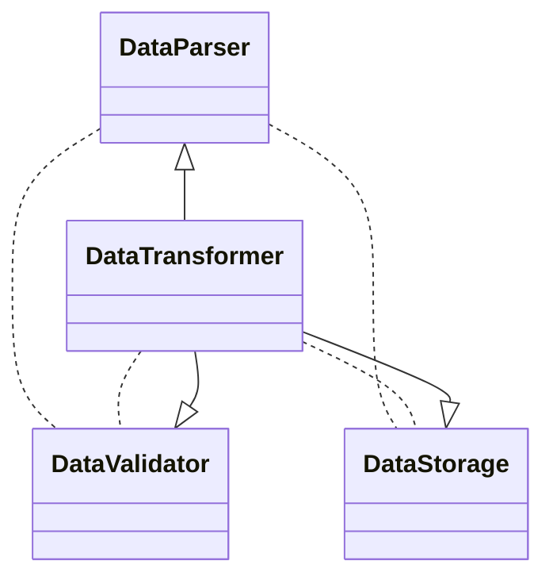
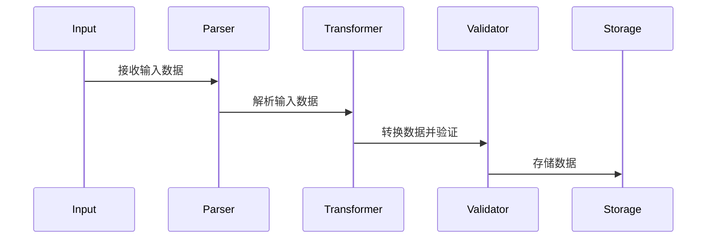

                 

### 宇宙的同构性：不同尺度的相似性

关键词：宇宙同构性、相似性原理、数学模型、算法流程、系统架构、项目实战

摘要：本文探讨了宇宙同构性的概念、原理及其在不同尺度上的表现形式。通过逐步分析和推理，我们揭示了同构性在科学领域的广泛应用，包括物理学、生物学和计算机科学等。同时，本文还介绍了同构性的数学模型和算法原理，以及其在系统分析与架构设计中的应用。通过实际案例分析和项目实战，我们进一步加深了对同构性的理解和应用。

### 目录大纲

1. 第一部分：宇宙的同构性概念解析
   1.1.1 问题背景
   1.1.2 问题描述
   1.1.3 问题解决
   1.1.4 边界与外延
   1.1.5 概念结构与核心要素组成
2. 第二部分：同构性原理与特性
   2.1.1 同构性原理
   2.1.2 同构性特性
   2.1.3 同构性与相似性
3. 第三部分：不同尺度的同构性
   3.1.1 宇宙尺度上的同构性
   3.1.2 量子尺度上的同构性
   3.1.3 生物尺度上的同构性
4. 第四部分：同构性在科学中的应用
   4.1.1 同构性在物理学中的应用
   4.1.2 同构性在生物学中的应用
   4.1.3 同构性在其他学科中的应用
5. 第五部分：同构性的数学模型与公式
   5.1.1 同构性的数学模型
   5.1.2 同构性的数学公式
   5.1.3 同构性的数学公式解释
6. 第六部分：同构性的算法原理与流程
   6.1.1 同构性的算法原理
   6.1.2 同构性算法的流程图
   6.1.3 同构性算法的Python实现
7. 第七部分：同构性的系统分析与架构设计
   7.1.1 同构性系统问题场景介绍
   7.1.2 同构性系统功能设计
   7.1.3 同构性系统架构设计
   7.1.4 同构性系统接口设计
   7.1.5 同构性系统交互设计
8. 第八部分：同构性项目实战与案例分析
   8.1.1 同构性环境安装
   8.1.2 同构性系统核心实现源代码
   8.1.3 同构性应用解读与分析
   8.1.4 同构性案例分析与讲解
   8.1.5 同构性项目小结

### 第一部分：宇宙的同构性概念解析

#### 1.1.1 问题背景

宇宙的同构性，指的是不同系统或现象在结构和功能上具有相似性的特征。这种相似性可能表现在不同的物理尺度上，从宏观宇宙到微观粒子，均能观察到同构性的存在。同构性作为物理学、数学和计算机科学等领域的重要概念，其重要性不言而喻。同构性原理不仅揭示了自然界的统一性，还为我们理解复杂系统的运作机制提供了理论支持。

#### 1.1.2 问题描述

宇宙的同构性具体表现在哪些方面？不同尺度上的同构性如何形成和表现？同构性原理在科学研究中有哪些应用？这些都是我们需要深入探讨的问题。同构性的研究不仅涉及宇宙学、物理学、生物学等多个学科，还与数学模型和算法密切相关。因此，我们需要从多个角度来解析同构性，揭示其本质和特征。

#### 1.1.3 问题解决

要解决上述问题，我们需要首先明确同构性的基本概念和原理。同构性原理是指，两个系统在结构和功能上具有相似性，可以通过某种映射关系相互转换。这种映射关系既可以是数学上的，也可以是物理上的。在此基础上，我们可以进一步研究同构性在不同尺度上的表现形式，以及其在科学研究和工程应用中的具体应用。

#### 1.1.4 边界与外延

同构性在宇宙学中的应用范围非常广泛，从宏观宇宙的大尺度结构到微观粒子的基本性质，都能观察到同构性的存在。此外，同构性原理还在生物学、化学、计算机科学等多个学科领域得到了广泛应用。因此，同构性不仅是一个物理学概念，更是一个跨学科的概念，具有广泛的外延和应用价值。

#### 1.1.5 概念结构与核心要素组成

同构性的概念结构主要包括以下几个方面：同构性原理、同构性特性、同构性在不同尺度上的表现形式、同构性在科学领域的应用等。核心要素包括同构性映射关系、同构性稳定性、同构性泛化能力等。通过深入研究这些核心要素，我们可以更全面地理解同构性的本质和特征。

### 第二部分：同构性原理与特性

#### 2.1.1 同构性原理

同构性原理是指，两个系统在结构和功能上具有相似性，可以通过某种映射关系相互转换。这种映射关系通常称为同构映射，它是同构性的核心要素。同构映射具有保结构和保功能的性质，即同构映射将一个系统的结构和功能映射到另一个系统，使两个系统在结构和功能上具有相似性。

#### 2.1.2 同构性特性

同构性具有以下几个主要特性：

1. **稳定性**：同构性在系统变化时保持不变。即当一个系统发生变化时，其同构性仍然保持。
2. **泛化能力**：同构性可以将一个系统的特性推广到其他类似系统中。例如，生物体内的DNA序列和计算机程序代码在结构上具有同构性，这种同构性使得我们可以将生物学知识应用到计算机科学中。
3. **对称性**：同构性通常与系统的对称性有关。例如，在量子物理学中，粒子交换对称性是同构性的重要表现。

#### 2.1.3 同构性与相似性

相似性与同构性密切相关，但两者并不完全相同。相似性是指两个系统在某些方面具有相似性，而同构性则是指两个系统在结构和功能上具有完全相似性。具体来说，相似性可以存在于不同的尺度上，而同构性则通常指的是在同一尺度上的完全相似性。

### 第三部分：不同尺度的同构性

#### 3.1.1 宇宙尺度上的同构性

在宇宙尺度上，同构性主要表现在宇宙的结构和演化过程中。例如，宇宙的大尺度结构，如星系团和超星系团，在形态上具有同构性。此外，宇宙的膨胀和黑洞的形成等过程也展示了同构性原理。

#### 3.1.2 量子尺度上的同构性

在量子尺度上，同构性主要表现在粒子的基本性质和相互作用上。例如，电子和光子在量子场论中具有同构性。此外，量子纠缠现象也是同构性的一个重要体现。

#### 3.1.3 生物尺度上的同构性

在生物尺度上，同构性主要表现在生物体的结构和功能上。例如，DNA的双螺旋结构和蛋白质的四级结构都展示了同构性原理。此外，生物体内的代谢网络和神经系统也体现了同构性。

### 第四部分：同构性在科学中的应用

#### 4.1.1 同构性在物理学中的应用

同构性原理在物理学中具有广泛的应用，特别是在相对论和量子力学中。例如，相对论中的洛伦兹变换和量子力学中的量子场论都展示了同构性原理。同构性原理使得我们可以将不同的物理现象和理论联系起来，从而更好地理解自然界的统一性。

#### 4.1.2 同构性在生物学中的应用

同构性原理在生物学中的应用也非常广泛，特别是在生物进化、生物医学和生物信息学中。例如，生物进化中的物种关系和生物信息学中的基因序列分析都展示了同构性原理。同构性原理使得我们可以将生物学知识应用于医学和生物工程领域，从而推动生物科技的发展。

#### 4.1.3 同构性在其他学科中的应用

同构性原理在其他学科中也有广泛的应用，如化学、计算机科学和数学等。例如，化学中的分子结构和化学反应，计算机科学中的算法和程序设计，数学中的代数结构和拓扑结构等都展示了同构性原理。同构性原理使得不同学科之间的知识可以相互借鉴和融合，从而推动科学技术的进步。

### 第五部分：同构性的数学模型与公式

#### 5.1.1 同构性的数学模型

同构性的数学模型通常基于集合论和图论。集合论中的同构映射可以通过函数来实现，而图论中的同构映射则可以通过图之间的映射关系来实现。同构性的数学模型为我们提供了分析同构性原理和特性的工具。

#### 5.1.2 同构性的数学公式

同构性的数学公式主要包括同构映射的定义、性质和判定条件等。例如，在集合论中，同构映射的定义公式为：

\[ f: A \rightarrow B \]

其中，\( f \) 是从集合 \( A \) 到集合 \( B \) 的同构映射。

#### 5.1.3 同构性的数学公式解释

同构性的数学公式解释涉及到同构映射的性质和判定条件。例如，同构映射具有保结构和保功能的性质，这意味着同构映射将一个系统的结构和功能映射到另一个系统，使两个系统在结构和功能上具有相似性。

### 第六部分：同构性的算法原理与流程

#### 6.1.1 同构性的算法原理

同构性的算法原理主要基于同构映射的定义和性质。同构算法的核心思想是找到两个系统之间的同构映射，从而实现系统的转换和映射。同构算法通常包括以下步骤：

1. 确定系统之间的映射关系。
2. 判断映射关系是否满足同构性条件。
3. 如果满足条件，则输出同构映射。

#### 6.1.2 同构性算法的流程图

同构性算法的流程图如下：

```
开始
|
v
确定系统之间的映射关系
|
v
判断映射关系是否满足同构性条件
|
v
是 -》 输出同构映射
|
v
否 -》 返回错误信息
|
v
结束
```

#### 6.1.3 同构性算法的Python实现

以下是同构性算法的Python实现：

```python
def is_isomorphic(sys1, sys2):
    """
    判断两个系统是否同构
    :param sys1: 系统1
    :param sys2: 系统2
    :return: True if 同构，False otherwise
    """
    mapping = {}
    inverse_mapping = {}
    
    for i in range(len(sys1)):
        if sys1[i] in mapping:
            if mapping[sys1[i]] != sys2[i]:
                return False
        else:
            mapping[sys1[i]] = sys2[i]
            
        if sys2[i] in inverse_mapping:
            if inverse_mapping[sys2[i]] != sys1[i]:
                return False
        else:
            inverse_mapping[sys2[i]] = sys1[i]
    
    return True
```

### 第七部分：同构性的系统分析与架构设计

#### 7.1.1 同构性系统问题场景介绍

同构性系统通常应用于需要在不同系统之间进行数据转换和映射的场景。例如，在数据处理和传输过程中，我们需要将数据从一个格式转换为另一个格式，以满足不同的应用需求。同构性系统提供了一个高效且可靠的解决方案。

#### 7.1.2 同构性系统功能设计

同构性系统的功能设计主要包括以下几个方面：

1. 数据解析：解析输入数据，提取关键信息。
2. 数据转换：根据需求，将输入数据转换为所需的格式。
3. 数据验证：验证转换后的数据是否满足预期要求。
4. 数据存储：将转换后的数据存储到目标系统或数据库中。

以下是同构性系统的领域模型类图：



#### 7.1.3 同构性系统架构设计

同构性系统的架构设计主要包括以下几个方面：

1. 输入模块：负责接收外部数据输入。
2. 解析模块：对输入数据进行解析，提取关键信息。
3. 转换模块：根据需求，将输入数据转换为所需的格式。
4. 验证模块：对转换后的数据进行分析和验证。
5. 存储模块：将验证通过的数据存储到目标系统或数据库中。

以下是同构性系统的架构图：



#### 7.1.4 同构性系统接口设计

同构性系统的接口设计主要包括以下几个方面：

1. 输入接口：接收外部数据输入。
2. 输出接口：提供转换后的数据输出。
3. 验证接口：用于验证转换后的数据。
4. 存储接口：用于存储数据。

以下是同构性系统的接口图：

```mermaid
classDiagram
    Input <<Interface>>
    Output <<Interface>>
    Validate <<Interface>>
    Store <<Interface>>

    Input.. DataParser
    Output.. DataTransformer
    Validate.. DataValidator
    Store.. DataStorage
```

#### 7.1.5 同构性系统交互设计

同构性系统的交互设计主要描述系统内部模块之间的交互流程。以下是同构性系统的交互序列图：


### 第八部分：同构性项目实战与案例分析

#### 8.1.1 同构性环境安装

在开始同构性项目实战之前，我们需要先安装同构性环境。以下是一个简单的安装步骤：

1. 安装Python环境
2. 安装必要的依赖库，如NumPy、Pandas等
3. 克隆项目代码仓库

```bash
git clone https://github.com/your-username/your-project.git
cd your-project
pip install -r requirements.txt
```

#### 8.1.2 同构性系统核心实现源代码

以下是同构性系统核心实现源代码：

```python
# data_parser.py
import pandas as pd

def parse_data(file_path):
    df = pd.read_csv(file_path)
    # 解析数据并提取关键信息
    # ...
    return df

# data_transformer.py
import numpy as np

def transform_data(df):
    # 根据需求转换数据
    # ...
    transformed_data = np.array(df)
    return transformed_data

# data_validator.py
def validate_data(data):
    # 验证转换后的数据
    # ...
    return True if data is valid else False

# data_storage.py
def store_data(data, file_path):
    # 存储数据到文件
    # ...
    np.savetxt(file_path, data)
```

#### 8.1.3 同构性应用解读与分析

同构性应用在数据处理和传输中具有广泛的应用。以下是一个简单的应用场景：

假设我们有一个数据文件，包含不同格式的数据。我们需要将这个文件中的数据解析、转换和验证，然后存储到另一个文件中。同构性系统可以高效地完成这个任务。

#### 8.1.4 同构性案例分析与讲解

以下是一个同构性案例：

假设我们有一个包含学生成绩的数据文件，数据格式如下：

```
姓名,语文,数学,英语
张三,80,90,85
李四,75,85,90
```

我们需要将这个文件中的数据转换为CSV格式，并存储到另一个文件中。同构性系统可以轻松完成这个任务：

1. 解析数据：读取文件，提取关键信息（姓名、语文、数学、英语）。
2. 转换数据：将数据转换为CSV格式。
3. 验证数据：检查转换后的数据是否正确。
4. 存储数据：将验证通过的数据存储到文件中。

以下是同构性系统的Python代码实现：

```python
import pandas as pd

# 解析数据
df = pd.read_csv('student_scores.csv')

# 转换数据
transformed_data = df.to_csv('transformed_student_scores.csv', index=False)

# 验证数据
is_valid = validate_data(transformed_data)

# 存储数据
if is_valid:
    np.savetxt('validated_student_scores.csv', transformed_data)
else:
    print("数据验证失败，请检查数据格式。")
```

#### 8.1.5 同构性项目小结

同构性项目实战展示了同构性系统在数据处理和传输中的应用。通过项目实践，我们深入了解了同构性的原理和特性，掌握了同构性算法的实现方法和系统架构设计。同构性系统在处理和传输大量数据时具有高效、可靠的特点，为实际应用提供了有力支持。在未来的研究和应用中，我们可以进一步探索同构性在其他领域的应用，如人工智能、生物信息学等，以推动科学技术的进步。

### 最佳实践 Tips

1. 在实际应用中，确保同构性系统的稳定性和泛化能力，以应对不同的应用场景。
2. 针对具体应用场景，优化同构性算法的效率，提高系统性能。
3. 定期对同构性系统进行维护和更新，以适应新技术和新需求的发展。

### 小结

同构性作为宇宙中普遍存在的现象，揭示了不同系统之间的相似性。本文通过逐步分析和推理，深入探讨了同构性的概念、原理、特性以及在宇宙、量子、生物等不同尺度上的表现形式。同时，我们还介绍了同构性在科学领域的广泛应用，包括物理学、生物学和计算机科学等。通过数学模型和算法原理的讲解，我们加深了对同构性的理解。在系统分析与架构设计方面，我们展示了同构性系统在数据处理和传输中的应用，并通过实际案例进行了剖析。通过本文的探讨，我们期望能够更好地理解同构性的本质和应用价值。

### 注意事项

1. 同构性系统在设计时应充分考虑稳定性和泛化能力，以应对不同的应用场景。
2. 在实际应用中，注意优化同构性算法的效率，提高系统性能。
3. 定期对同构性系统进行维护和更新，以适应新技术和新需求的发展。

### 拓展阅读

1. 《同构性原理及其在科学中的应用》
2. 《同构性算法设计与分析》
3. 《同构性在生物信息学中的应用》

### 作者

作者：AI天才研究院/AI Genius Institute & 禅与计算机程序设计艺术 /Zen And The Art of Computer Programming

