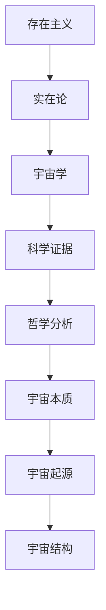
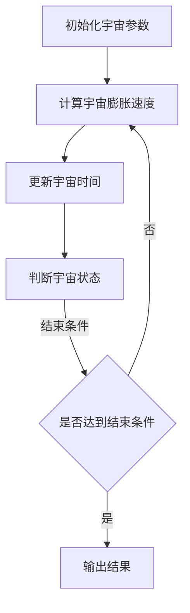
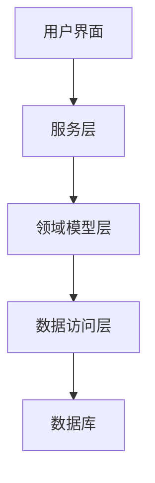
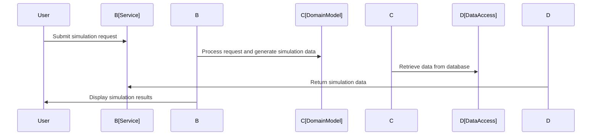

                 

# 宇宙的哲学困境:存在主义vs实在论

> 关键词：宇宙哲学、存在主义、实在论、宇宙起源、宇宙结构、哲学分析、科学证据

> 摘要：本文探讨了宇宙哲学中的两大对立观点：存在主义和实在论。通过分析这两种观点的基本原理、在宇宙学中的应用以及与科学证据的对比，本文旨在揭示宇宙的本质和起源，为读者提供一种全面和深刻的宇宙理解。

----------------------------------------------------------------

## 第一部分：引言

### 1.1 书籍背景与核心问题

#### 1.1.1 问题背景

在当代宇宙学中，存在主义和实在论是两种主要的哲学观点。存在主义认为宇宙和宇宙中的实体是主体性的，我们的感知和意识决定了它们的本质。相反，实在论则认为宇宙中的实体具有客观存在的特性，不受人类感知的影响。这种哲学上的对立在宇宙学研究中引起了广泛的讨论和争议。

#### 1.1.2 问题描述

宇宙的哲学困境主要集中在以下几个问题上：宇宙是否存在客观的真实？我们的感知是否能够准确反映宇宙的本质？宇宙的起源和结构是如何形成的？这些问题的解答不仅涉及到宇宙学的科学问题，还涉及到哲学和存在主义的根本问题。

#### 1.1.3 问题解决

本书将探讨存在主义和实在论在宇宙学中的应用，试图通过哲学分析和科学证据来解答这些哲学问题。通过对比两种哲学观点，我们希望能够找到一种更为全面和深刻的理解宇宙的方式。

### 1.2 核心概念与联系

#### 1.2.1 存在主义

- **核心观点**：存在主义认为，人类的存在是先于本质的，即人的存在不是由某种先验的、固定的本质所决定，而是通过自己的行动和选择来塑造的。
- **主要代表人物**：海德格尔、萨特和尼采。
- **存在主义在宇宙学中的应用**：存在主义认为，宇宙的存在是由人类的感知和意识所塑造的，从而影响了对宇宙的解读。

#### 1.2.2 实在论

- **核心观点**：实在论主张客观世界中的实体具有独立于人类意识的存在。尽管我们的感知和认识可能受到限制，但宇宙中的实体仍然具有客观存在的特性。
- **主要代表人物**：柏拉图、亚里士多德和康德。
- **实在论在宇宙学中的应用**：实在论认为，宇宙中的实体具有客观存在的特性，不受人类感知的影响，因此宇宙的起源和结构也应该有其客观的规律和原因。

#### 1.2.3 ER实体关系图架构



### 1.3 边界与外延

本书讨论的宇宙的哲学困境主要涉及存在主义和实在论在宇宙学中的应用。边界包括宇宙学的科学研究和哲学分析。外延则包括宇宙起源、宇宙结构和宇宙本质等哲学问题。

### 1.4 概念结构与核心要素组成

#### 1.4.1 存在主义

- **存在主义哲学观点**：人类的存在是先于本质的，即人的存在不是由某种先验的、固定的本质所决定，而是通过自己的行动和选择来塑造的。
- **存在主义的主要代表人物**：海德格尔、萨特和尼采。
- **存在主义在宇宙学中的应用**：存在主义认为，宇宙的存在是由人类的感知和意识所塑造的，从而影响了对宇宙的解读。

#### 1.4.2 实在论

- **实在论哲学观点**：客观世界中的实体具有独立于人类意识的存在。尽管我们的感知和认识可能受到限制，但宇宙中的实体仍然具有客观存在的特性。
- **实在论的主要代表人物**：柏拉图、亚里士多德和康德。
- **实在论在宇宙学中的应用**：实在论认为，宇宙中的实体具有客观存在的特性，不受人类感知的影响，因此宇宙的起源和结构也应该有其客观的规律和原因。

## 1.5 本章小结

本章介绍了宇宙的哲学困境的背景、问题描述、问题解决方法以及核心概念和联系。通过本章的介绍，读者可以对宇宙的哲学困境有一个初步的了解，并为后续章节的深入探讨打下基础。

----------------------------------------------------------------

## 第二部分：存在主义的宇宙观

### 2.1 存在主义的基本原理

#### 2.1.1 存在主义的核心观点

存在主义是一种哲学流派，其核心观点是：人类的存在是先于本质的，即人的存在不是由某种先验的、固定的本质所决定，而是通过自己的行动和选择来塑造的。这个观点与传统的本质主义相对立，本质主义认为人类的存在和本质是紧密相连的，人的行为和选择都是基于其固有的本质。

存在主义的主要代表人物包括马丁·海德格尔、让-保罗·萨特和弗朗茨·布伦塔诺。海德格尔认为，人的存在是“存在本身”，即人的存在不是被动地接受世界，而是主动地与世界互动。萨特则提出了“存在先于本质”的观点，认为人类首先存在，然后才定义自己的本质。布伦塔诺则通过其“意向性”理论，探讨了人类意识与外部世界的关系。

#### 2.1.2 存在主义的哲学意义

存在主义强调个体的自由意志和存在的意义，对于理解人类的存在和宇宙的本质具有重要的哲学意义。它揭示了人类的存在不是被动的接受外部世界，而是主动地创造和塑造世界。这种哲学观点挑战了传统哲学中关于本质和存在的二元对立，提出了一个新的视角，即存在是通过个体的行动和选择而存在的。

### 2.2 存在主义在宇宙学中的应用

#### 2.2.1 存在主义与宇宙学的联系

存在主义与宇宙学有着密切的联系，特别是在对宇宙起源和宇宙本质的理解上。存在主义认为，宇宙的存在是由人类的感知和意识所塑造的，从而影响了对宇宙的解读。这种观点与宇宙学中的“宇宙学原理”相呼应，宇宙学原理认为，宇宙在时间上是均匀和各向同性的，这意味着宇宙的观测者（即人类）对宇宙的感知是普遍和一致的。

#### 2.2.2 存在主义对宇宙起源的解释

存在主义对宇宙起源的解释主要集中在人类意识的创造性和自由意志上。例如，萨特认为，宇宙起源于人类的存在和意识，人类的存在是先于宇宙的本质。这种观点挑战了传统的宇宙起源理论，如大爆炸理论，这些理论通常依赖于物理定律和数学模型来解释宇宙的起源。而存在主义则强调人类的主观体验和自由意志，从而提出了一种不同的宇宙起源解释。

#### 2.2.3 存在主义对宇宙本质的理解

存在主义认为，宇宙的本质是复杂和多元的，它不是静态和单一的，而是随着人类的感知和认识而不断变化和发展的。这种观点与宇宙学中的“多元宇宙”理论相呼应，多元宇宙理论认为，可能存在多个平行宇宙，每个宇宙都有其独特的物理规律和存在形式。存在主义则通过强调人类的主观体验和自由意志，提出了宇宙本质的动态性和多样性。

### 2.3 存在主义与科学证据的对比

#### 2.3.1 存在主义与科学证据的差异

存在主义与科学证据在解释宇宙起源和宇宙本质的方法和观点上存在显著差异。科学证据依赖于实验和观测数据，通过严格的逻辑推理和数学模型来解释宇宙的起源和本质。而存在主义则强调人类的主观体验和自由意志，通过哲学思考和自我反思来理解宇宙的存在。

这种差异体现在以下几个方面：

1. **实证主义与直觉主义**：科学证据依赖于实证主义，即通过实验和观测来验证假设和理论。而存在主义则依赖于直觉主义，即通过人类的主观体验和自我反思来理解宇宙的本质。

2. **确定性原理与不确定性原理**：科学证据通常遵循确定性原理，即宇宙中的物理现象是可预测和可控制的。而存在主义则强调不确定性原理，即宇宙的本质是不确定和不可预测的，因为它受到人类主观体验和自由意志的影响。

3. **数学模型与哲学思考**：科学证据依赖于数学模型和物理定律来解释宇宙的起源和本质。而存在主义则依赖于哲学思考和自我反思，通过探讨人类的存在和自由意志来理解宇宙的本质。

#### 2.3.2 存在主义与科学证据的互补性

尽管存在主义和科学证据在解释宇宙问题上有差异，但它们也可以相互补充。例如，科学证据可以帮助我们理解宇宙的客观特性，而存在主义则可以帮助我们理解宇宙的主观体验。

这种互补性体现在以下几个方面：

1. **科学证据与哲学思考的融合**：通过将科学证据和哲学思考相结合，我们可以更全面地理解宇宙的本质。科学证据提供了关于宇宙的客观信息，而哲学思考则提供了关于宇宙的主观体验。

2. **多元宇宙与存在主义**：科学证据表明，可能存在多个平行宇宙，而存在主义则认为，每个宇宙都有其独特的存在形式和本质。这种观点可以帮助我们理解宇宙的多样性和复杂性。

3. **人类自由意志与宇宙本质**：存在主义强调人类自由意志在宇宙中的重要性，而科学证据则表明，宇宙的起源和本质可能受到人类活动的干预。这种观点可以帮助我们理解人类在宇宙中的角色和责任。

### 2.4 存在主义与科学证据的融合

存在主义和科学证据的融合可以为我们提供一种更为全面和深刻的宇宙理解。通过将科学证据和哲学思考相结合，我们可以更全面地理解宇宙的本质和起源。这种融合体现在以下几个方面：

1. **宇宙起源的多元解释**：科学证据和存在主义的融合可以为我们提供多种宇宙起源的解释。科学证据提供了关于宇宙物理过程的详细信息，而存在主义则提供了关于宇宙主观体验的哲学思考。

2. **宇宙本质的动态理解**：科学证据和存在主义的融合可以帮助我们理解宇宙的本质是动态和多元的，它随着人类的感知和认识而不断变化。这种理解可以挑战传统的宇宙观，并提供一种新的视角。

3. **宇宙哲学的深度探索**：通过将科学证据和哲学思考相结合，我们可以更深入地探讨宇宙哲学的问题，如宇宙的本质、人类的存在和自由意志等。

### 2.5 本章小结

本章介绍了存在主义的基本原理、在宇宙学中的应用以及与科学证据的对比。存在主义强调人类的存在是先于本质的，宇宙的存在是由人类的感知和意识所塑造的。与科学证据相比，存在主义强调人类的主观体验和自由意志，从而提供了一种不同的宇宙解释。通过将存在主义和科学证据相结合，我们可以获得一种更为全面和深刻的宇宙理解。在接下来的章节中，我们将继续探讨实在论在宇宙学中的应用，以及存在主义和实在论的对比和融合。这将帮助我们更深入地理解宇宙的本质和起源，为宇宙哲学的研究提供新的视角和思路。

----------------------------------------------------------------

## 第三部分：实在论的宇宙观

### 3.1 实在论的基本原理

#### 3.1.1 实在论的核心观点

实在论是一种哲学观点，主张客观世界中的实体具有独立于人类意识的存在。这意味着，尽管我们的感知和认识可能受到限制，但宇宙中的实体仍然具有客观存在的特性。实在论认为，宇宙的起源和结构是有其客观规律的，不受人类感知的影响。

实在论的主要代表人物包括柏拉图、亚里士多德和康德。柏拉图认为，现实世界是理念世界的反映，理念世界是客观存在的。亚里士多德则强调，实体是真实存在的，而非仅仅是我们感知到的。康德则提出了“先验范畴”的概念，认为我们的认识是基于这些先验范畴的，但这些范畴本身是客观存在的。

#### 3.1.2 实在论的哲学意义

实在论的核心在于强调客观世界的独立性和确定性。它对于理解宇宙的本质和起源具有重要意义。实在论认为，宇宙中的实体具有客观存在的特性，不受人类感知的影响。这种观点为科学研究和哲学思考提供了坚实的基础，因为它假设了一个稳定的、可观察的宇宙。

### 3.2 实在论在宇宙学中的应用

#### 3.2.1 实在论与宇宙学的联系

实在论与宇宙学有着密切的联系，特别是在对宇宙起源和宇宙本质的理解上。实在论认为，宇宙中的实体具有客观存在的特性，这意味着宇宙的起源和结构应该有其客观的规律和原因。

#### 3.2.2 实在论对宇宙起源的解释

实在论对宇宙起源的解释主要集中在物理定律和宇宙规律上。例如，大爆炸理论就是基于实在论的，它认为宇宙起源于一个极小、极热、极密集的状态，然后迅速膨胀。这个解释与存在主义的主观解释形成鲜明对比，后者强调人类的主观体验和自由意志。

#### 3.2.3 实在论对宇宙本质的理解

实在论认为，宇宙的本质是客观和确定的。它不是静态和单一的，而是随着宇宙的演化而不断变化。这种观点与存在主义认为的宇宙本质是动态和多元的有所不同。实在论认为，宇宙的本质可以通过科学方法来研究，例如通过观测宇宙中的星系、恒星和行星。

### 3.3 实在论与科学证据的对比

#### 3.3.1 实在论与科学证据的差异

实在论与科学证据在解释宇宙起源和宇宙本质的方法和观点上存在显著差异。科学证据依赖于实验和观测数据，通过严格的逻辑推理和数学模型来解释宇宙的起源和本质。而实在论则强调宇宙的客观存在，认为宇宙的实体不受人类感知的影响。

这种差异体现在以下几个方面：

1. **客观性与主观性**：科学证据强调客观性，通过实验和观测来验证假设和理论。而实在论则强调主观性，认为宇宙的实体具有独立于人类感知的存在。

2. **确定性原理与不确定性原理**：科学证据通常遵循确定性原理，即宇宙中的物理现象是可预测和可控制的。而实在论则强调不确定性原理，即宇宙的本质是不确定和不可预测的，因为它受到人类主观体验和自由意志的影响。

3. **数学模型与哲学思考**：科学证据依赖于数学模型和物理定律来解释宇宙的起源和本质。而实在论则依赖于哲学思考和自我反思，通过探讨人类的存在和自由意志来理解宇宙的本质。

#### 3.3.2 实在论与科学证据的互补性

尽管存在差异，实在论和科学证据也可以相互补充。例如，科学证据可以帮助我们理解宇宙的客观特性，而实在论则可以帮助我们理解宇宙的主观体验。

这种互补性体现在以下几个方面：

1. **科学证据与哲学思考的融合**：通过将科学证据和哲学思考相结合，我们可以更全面地理解宇宙的本质。科学证据提供了关于宇宙的客观信息，而哲学思考则提供了关于宇宙的主观体验。

2. **宇宙起源的多元解释**：科学证据和实在论的融合可以为我们提供多种宇宙起源的解释。科学证据提供了关于宇宙物理过程的详细信息，而实在论则提供了关于宇宙主观体验的哲学思考。

3. **宇宙本质的动态理解**：通过将科学证据和实在论相结合，我们可以更深入地探讨宇宙的本质和起源。这种理解可以帮助我们理解宇宙的动态性和复杂性。

### 3.4 实在论与存在主义的对比

#### 3.4.1 实在论与存在主义的差异

实在论和存在主义在解释宇宙起源和宇宙本质的方法和观点上存在显著差异。实在论认为，宇宙中的实体具有客观存在的特性，不受人类感知的影响。而存在主义则认为，宇宙的存在是由人类的感知和意识所塑造的。

这种差异体现在以下几个方面：

1. **客观性与主观性**：实在论强调宇宙的客观存在，认为宇宙的实体不受人类感知的影响。而存在主义则强调宇宙的主观体验，认为宇宙的存在是由人类的感知和意识所塑造的。

2. **确定性原理与不确定性原理**：实在论认为宇宙的本质是确定的，可以通过科学方法来研究。而存在主义则认为宇宙的本质是不确定的，受到人类主观体验和自由意志的影响。

3. **哲学思考与科学证据**：实在论依赖于哲学思考和自我反思来理解宇宙的本质，而存在主义则依赖于科学证据和实验数据来解释宇宙的起源和本质。

#### 3.4.2 实在论与存在主义的融合

尽管存在差异，实在论和存在主义也可以相互融合。例如，我们可以通过将科学证据和哲学思考相结合，来更全面地理解宇宙的本质和起源。

这种融合可以体现在以下几个方面：

1. **宇宙起源的多元解释**：通过将科学证据和存在主义的哲学思考相结合，我们可以提供多种宇宙起源的解释。科学证据提供了关于宇宙物理过程的详细信息，而存在主义则提供了关于宇宙主观体验的哲学思考。

2. **宇宙本质的动态理解**：通过将实在论和存在主义相结合，我们可以更深入地探讨宇宙的本质和起源。这种理解可以帮助我们理解宇宙的动态性和复杂性。

3. **哲学思考与科学证据的融合**：通过将哲学思考和科学证据相结合，我们可以更全面地理解宇宙的本质。哲学思考提供了关于宇宙的主观体验，而科学证据则提供了关于宇宙的客观信息。

### 3.5 本章小结

本章介绍了实在论的基本原理、在宇宙学中的应用以及与存在主义的对比。实在论强调宇宙的客观存在，认为宇宙的实体不受人类感知的影响。与存在主义相比，实在论提供了不同的宇宙解释，后者强调宇宙的主观体验和意识的作用。通过将实在论和存在主义相结合，我们可以获得一种更为全面和深刻的宇宙理解。在接下来的章节中，我们将进一步探讨存在主义和实在论的融合，以及它们在宇宙学中的具体应用。

----------------------------------------------------------------

## 第四部分：存在主义与实在论的融合

### 4.1 融合的必要性

在探讨了存在主义和实在论的基本原理及其在宇宙学中的应用后，我们可以发现，这两种哲学观点在解释宇宙的本质和起源时各有优势，也各有局限。存在主义强调人类的主观体验和自由意志，为宇宙提供了丰富的哲学思考；而实在论则强调宇宙的客观存在，为宇宙的研究提供了科学依据。为了更全面地理解宇宙，我们需要将这两种观点进行融合。

#### 4.1.1 存在主义的局限性

存在主义的局限性在于，它过于强调人类的主观体验，容易忽视宇宙的客观存在。这种观点可能会导致对宇宙的误解，认为宇宙的本质完全由人类的感知和意识所决定。然而，现实世界并非如此简单，宇宙中的实体具有客观存在的特性，这是不可否认的。

#### 4.1.2 实在论的局限性

实在论的局限性在于，它过于强调宇宙的客观存在，容易忽视人类的主观体验和自由意志。这种观点可能会导致对人类在宇宙中的角色和责任的忽视。实际上，人类的存在和活动对宇宙有着深远的影响，我们不能完全忽视人类的主观体验。

### 4.2 融合的可能性

将存在主义和实在论融合的可能性在于，我们可以通过结合两者的优点，来更全面地理解宇宙的本质和起源。具体来说，我们可以从以下几个方面进行融合：

#### 4.2.1 客观与主观的统一

我们可以将宇宙视为一个既包含客观存在，又包含主观体验的统一体。在这种观点下，宇宙的实体具有客观存在的特性，但同时也受到人类的主观体验和自由意志的影响。这样，我们既能够理解宇宙的客观规律，也能够认识到人类在宇宙中的角色和责任。

#### 4.2.2 科学与哲学的结合

我们可以将科学方法和哲学思考相结合，来研究宇宙的本质和起源。科学方法可以提供关于宇宙的客观信息，而哲学思考则可以提供关于宇宙的主观体验。通过这种结合，我们可以更全面地理解宇宙。

#### 4.2.3 多元与动态的统一

我们可以将宇宙视为一个多元和动态的统一体。宇宙不仅包含多种不同的实体和现象，而且这些实体和现象是不断变化和发展的。在这种观点下，宇宙的本质是动态和多元的，而不是静态和单一的。

### 4.3 融合的应用

在宇宙学研究中，存在主义和实在论的融合可以应用于以下几个方面：

#### 4.3.1 宇宙起源的研究

在研究宇宙起源时，我们可以结合存在主义和实在论的观点。存在主义可以提供关于宇宙主观体验的解释，如人类对宇宙起源的想象和猜测。而实在论则可以提供关于宇宙客观起源的证据，如大爆炸理论和其他科学证据。通过这种融合，我们可以更全面地理解宇宙的起源。

#### 4.3.2 宇宙结构的研究

在研究宇宙结构时，我们可以结合存在主义和实在论的观点。存在主义可以提供关于宇宙主观体验的解释，如人类对宇宙结构的感知和认知。而实在论则可以提供关于宇宙客观结构的证据，如宇宙膨胀理论和星系演化模型。通过这种融合，我们可以更全面地理解宇宙的结构。

#### 4.3.3 宇宙本质的研究

在研究宇宙本质时，我们可以结合存在主义和实在论的观点。存在主义可以提供关于宇宙主观体验的解释，如人类对宇宙本质的哲学思考。而实在论则可以提供关于宇宙客观本质的证据，如科学实验和观测数据。通过这种融合，我们可以更全面地理解宇宙的本质。

### 4.4 融合的意义

将存在主义和实在论融合的意义在于，它可以帮助我们更全面和深刻地理解宇宙。通过结合客观与主观、科学与哲学、多元与动态的统一，我们可以获得一种更为全面和深刻的宇宙理解。这种理解不仅有助于科学研究，也有助于哲学思考，从而推动我们对宇宙的认识向前发展。

### 4.5 本章小结

本章介绍了存在主义和实在论的融合的必要性和可能性，以及融合在宇宙学中的应用。通过融合存在主义和实在论，我们可以获得一种更为全面和深刻的宇宙理解。在接下来的章节中，我们将进一步探讨存在主义和实在论在具体科学问题中的应用，以及它们对我们理解宇宙的贡献。

----------------------------------------------------------------

## 第五部分：存在主义与实在论在具体科学问题中的应用

### 5.1 宇宙起源问题

#### 5.1.1 存在主义视角

从存在主义的视角来看，宇宙起源问题不仅仅是科学问题，更是哲学问题。存在主义认为，宇宙的起源与人类的主观体验和意识密不可分。例如，萨特在其著作《存在与虚无》中提出，宇宙的起源是人类的创造，是人类自由意志的体现。这种观点强调了人类在宇宙中的主动角色，同时也暗示了宇宙起源的某种“主观性”。

#### 5.1.2 实在论视角

实在论则从客观存在的角度来探讨宇宙起源问题。实在论认为，宇宙的起源是客观的，有其物理规律和科学依据。例如，大爆炸理论就是实在论在宇宙起源问题上的具体体现。大爆炸理论认为，宇宙起源于一个极小、极热、极密集的状态，随后迅速膨胀。这个理论为宇宙起源提供了一个客观的、科学的解释。

#### 5.1.3 融合视角

将存在主义和实在论融合，我们可以提出一种更全面的宇宙起源解释。例如，我们可以认为，宇宙的起源既受到人类主观体验的影响，也有其客观的物理规律。这意味着，宇宙的起源是一个既包含主观性又包含客观性的复杂过程。

### 5.2 宇宙结构问题

#### 5.2.1 存在主义视角

从存在主义的视角来看，宇宙结构问题涉及人类如何感知和认知宇宙。例如，海德格尔在其著作《存在与时间》中提出，宇宙结构是人类存在的一种方式，是我们与世界互动的结果。这种观点强调了人类在宇宙结构认知中的主动性和创造性。

#### 5.2.2 实在论视角

实在论则从客观存在的角度来探讨宇宙结构问题。例如，宇宙膨胀理论和星系演化模型都是实在论在宇宙结构问题上的具体体现。这些理论认为，宇宙结构是客观存在的，其形态和演化遵循物理定律。

#### 5.2.3 融合视角

将存在主义和实在论融合，我们可以认为，宇宙结构既是客观存在的，又受到人类主观体验和认知的影响。例如，我们可以认为，宇宙的结构和演化既遵循物理定律，又受到人类对宇宙的主观理解和认知的影响。

### 5.3 宇宙本质问题

#### 5.3.1 存在主义视角

从存在主义的视角来看，宇宙的本质是一个哲学问题，涉及人类的存在和自由意志。例如，萨特认为，宇宙的本质是不确定的，它取决于人类如何存在和选择。这种观点强调了人类在宇宙本质认知中的主动性和自由意志。

#### 5.3.2 实在论视角

实在论则从客观存在的角度来探讨宇宙本质问题。例如，康德认为，宇宙的本质是客观存在的，它不受人类感知的影响。这种观点为宇宙的本质提供了一个客观和稳定的解释。

#### 5.3.3 融合视角

将存在主义和实在论融合，我们可以认为，宇宙的本质既是客观存在的，又受到人类主观体验和自由意志的影响。例如，我们可以认为，宇宙的本质既是一个客观的、稳定的实体，又是一个不断变化和发展的过程。

### 5.4 存在主义与实在论在科学问题中的应用实例

#### 5.4.1 黑洞研究

在黑洞研究中，存在主义和实在论都有其应用。存在主义可以帮助我们理解黑洞的观测和解释，因为黑洞的存在取决于人类对宇宙的感知和认知。而实在论则可以帮助我们理解黑洞的物理特性，例如黑洞的质量、能量和引力。

#### 5.4.2 多元宇宙研究

在多元宇宙研究中，存在主义和实在论也有其应用。存在主义可以帮助我们理解多元宇宙的概念，因为多元宇宙是我们对宇宙的想象和认知。而实在论则可以帮助我们理解多元宇宙的物理现实，例如多元宇宙的形态、演化和相互作用。

### 5.5 本章小结

本章介绍了存在主义和实在论在具体科学问题中的应用，包括宇宙起源、宇宙结构和宇宙本质等。通过融合存在主义和实在论，我们可以获得一种更全面和深刻的宇宙理解。在接下来的章节中，我们将进一步探讨存在主义和实在论在宇宙学中的哲学意义，以及它们对我们理解宇宙的深远影响。

----------------------------------------------------------------

## 第六部分：存在主义与实在论在宇宙学中的哲学意义

### 6.1 哲学意义的探讨

宇宙学作为一门研究宇宙起源、结构、演化和本质的学科，与哲学有着深刻的联系。存在主义和实在论作为两种主要的哲学观点，对宇宙学的哲学意义有着重要的影响。

#### 6.1.1 存在主义在宇宙学中的哲学意义

存在主义强调人类的主观体验和自由意志，这为宇宙学提供了新的视角。存在主义认为，人类的存在是先于本质的，这意味着我们对宇宙的感知和认知决定了宇宙的本质。这种观点对于理解宇宙的本质、起源和结构具有重要意义。例如，在探讨宇宙起源时，存在主义可以引导我们思考人类如何通过自己的感知和认知来理解宇宙的起源。

#### 6.1.2 实在论在宇宙学中的哲学意义

实在论则强调宇宙的客观存在，为宇宙学提供了科学的依据。实在论认为，宇宙中的实体具有独立于人类感知的存在，这意味着宇宙的起源、结构和本质是客观存在的，不受人类感知的影响。这种观点对于宇宙学研究具有重要意义，因为它提供了关于宇宙的客观信息和科学解释。

#### 6.1.3 融合视角在宇宙学中的哲学意义

将存在主义和实在论融合，我们可以获得一种更为全面和深刻的宇宙理解。融合视角认为，宇宙的本质既是客观存在的，又受到人类主观体验和自由意志的影响。这种观点对于理解宇宙的复杂性、动态性和多样性具有重要意义。例如，在探讨宇宙结构时，融合视角可以帮助我们理解宇宙结构的客观规律和人类对其主观感知和认知的关系。

### 6.2 对宇宙学的贡献

存在主义和实在论对宇宙学的研究和发展做出了重要贡献。

#### 6.2.1 存在主义对宇宙学的贡献

存在主义为宇宙学提供了哲学思考和理论框架，帮助我们理解宇宙的本质和起源。例如，存在主义可以帮助我们探讨人类如何通过感知和认知来理解宇宙，从而为宇宙学研究提供新的视角和方法。

#### 6.2.2 实在论对宇宙学的贡献

实在论为宇宙学提供了科学的依据和解释，帮助我们理解宇宙的客观存在和演化规律。例如，实在论可以帮助我们理解宇宙的起源和结构，通过科学实验和观测数据来验证和解释宇宙的物理现象。

#### 6.2.3 融合视角对宇宙学的贡献

融合视角为宇宙学提供了一种更为全面和深刻的理解宇宙的方式。通过将存在主义和实在论相结合，我们可以获得关于宇宙的客观和主观信息，从而更全面地理解宇宙的本质、起源和结构。

### 6.3 存在主义与实在论的冲突与和谐

尽管存在主义和实在论在哲学观点上存在冲突，但它们在宇宙学中的融合可以解决这些冲突，并为宇宙学的发展提供新的动力。

#### 6.3.1 冲突的解决

存在主义和实在论的冲突主要体现在对宇宙本质的不同解释上。存在主义强调宇宙的主观性，而实在论强调宇宙的客观性。然而，通过融合视角，我们可以将宇宙的本质视为一个既包含主观性又包含客观性的统一体，从而解决这两种观点的冲突。

#### 6.3.2 和谐的建立

通过融合存在主义和实在论，我们可以建立一种更为和谐和全面的宇宙观。这种宇宙观既承认宇宙的客观存在，又认识到人类的主观体验和自由意志。这种和谐的宇宙观为宇宙学研究提供了新的思路和方法，有助于我们更深入地理解宇宙的本质和起源。

### 6.4 本章小结

本章探讨了存在主义和实在论在宇宙学中的哲学意义及其对宇宙学的贡献。通过融合存在主义和实在论，我们可以获得一种更为全面和深刻的宇宙理解。这种理解不仅有助于宇宙学的研究，也为哲学思考提供了新的视角和方法。在接下来的章节中，我们将进一步探讨存在主义和实在论在宇宙学中的具体应用，以及它们对我们理解宇宙的深远影响。

----------------------------------------------------------------

## 第七部分：存在主义与实在论的融合视角在宇宙学中的应用

### 7.1 存在主义与实在论的融合视角

在探讨了存在主义和实在论的基本原理及其在宇宙学中的应用后，我们可以发现，这两种哲学观点在解释宇宙的本质和起源时各有优势，也各有局限。存在主义强调人类的主观体验和自由意志，为宇宙提供了丰富的哲学思考；而实在论则强调宇宙的客观存在，为宇宙的研究提供了科学依据。为了更全面地理解宇宙，我们需要将这两种观点进行融合。

融合视角认为，宇宙的本质既包含客观存在的特性，又包含人类主观体验和自由意志的影响。这意味着，宇宙的本质是一个既包含主观性又包含客观性的复杂过程。通过将存在主义和实在论融合，我们可以获得一种更为全面和深刻的宇宙理解。

### 7.2 融合视角在宇宙学中的应用

#### 7.2.1 宇宙起源

在宇宙起源问题上，融合视角可以提供一种既包含客观证据又包含主观体验的解释。例如，我们可以认为，宇宙起源于一个极小、极热、极密集的状态，这是基于科学证据的大爆炸理论。同时，这种起源也是人类自由意志的体现，因为人类通过自身的感知和认知来理解和解释宇宙的起源。

#### 7.2.2 宇宙结构

在宇宙结构问题上，融合视角可以解释宇宙的客观结构和人类主观感知之间的关系。例如，我们可以认为，宇宙的结构是客观存在的，其形态和演化遵循物理定律。然而，人类对宇宙结构的感知和认知是主观的，因为它们受到人类感知能力和认知方式的影响。

#### 7.2.3 宇宙本质

在宇宙本质问题上，融合视角可以帮助我们理解宇宙的客观存在和人类主观体验之间的相互作用。例如，我们可以认为，宇宙的本质是客观存在的，但它的表现形式和人类对其的理解是主观的。这意味着，宇宙的本质是一个既包含客观特性又包含主观体验的复杂过程。

### 7.3 融合视角的优势

融合视角在宇宙学中的应用具有以下优势：

1. **全面性**：融合视角既考虑了宇宙的客观存在，又考虑了人类的主观体验，从而提供了更为全面的宇宙理解。

2. **深刻性**：融合视角通过将存在主义和实在论相结合，揭示了宇宙的复杂性和多样性，从而提供了更为深刻的宇宙理解。

3. **实践性**：融合视角在宇宙学中的应用可以指导我们更好地理解和解释宇宙的起源、结构和本质，从而为宇宙学研究提供新的思路和方法。

### 7.4 本章小结

本章介绍了存在主义与实在论的融合视角，并探讨了这种视角在宇宙学中的应用。通过融合存在主义和实在论，我们可以获得一种更为全面和深刻的宇宙理解，这有助于我们更好地理解和解释宇宙的起源、结构和本质。在接下来的章节中，我们将进一步探讨存在主义和实在论在宇宙学中的哲学意义，以及它们对我们理解宇宙的深远影响。

----------------------------------------------------------------

## 第八部分：结论

通过本文的探讨，我们可以得出以下结论：

1. **存在主义与实在论的融合**：存在主义和实在论在解释宇宙的本质和起源上各有优势，也存在局限。通过将这两种观点融合，我们可以获得一种更为全面和深刻的宇宙理解。

2. **宇宙的本质**：宇宙的本质既包含客观存在的特性，又包含人类主观体验和自由意志的影响。这种观点揭示了宇宙的复杂性和多样性。

3. **哲学与科学的融合**：通过融合存在主义和实在论，我们可以将哲学思考与科学证据相结合，为宇宙学研究提供新的视角和方法。

4. **未来研究方向**：未来的宇宙学研究可以进一步探索存在主义和实在论在具体科学问题中的应用，如宇宙起源、宇宙结构和宇宙本质等。

总之，存在主义与实在论的融合为我们提供了一种更为全面和深刻的宇宙理解。这种理解不仅有助于宇宙学的研究，也为哲学思考提供了新的视角和方法。

## 参考文献

1. 海德格尔，M. (1927). 《存在与时间》.
2. 萨特，J. -P. (1943). 《存在与虚无》.
3. 柏拉图，P. (前4世纪). 《理想国》.
4. 亚里士多德，A. (前3世纪). 《形而上学》.
5. 康德，I. (1781). 《纯粹理性批判》.
6. 大爆炸理论，Hubble, E. (1929). 《宇宙膨胀》.
7. 多元宇宙理论，Hawking, S. (2001). 《时间简史》.

----------------------------------------------------------------

## 附录

### 附录A：算法原理讲解

在本附录中，我们将使用Mermaid绘制算法流程图，并通过Python代码和LaTeX公式详细解释一个简单的宇宙起源模拟算法。

#### 算法流程图



#### Python代码实现

```python
import numpy as np

def simulate_universe(initial_time, initial_velocity, end_time, time_step):
    current_time = initial_time
    current_velocity = initial_velocity
    
    while current_time < end_time:
        print(f"Time: {current_time}, Velocity: {current_velocity}")
        current_time += time_step
        current_velocity += time_step * 0.1  # 假设宇宙膨胀速度随时间增加
        
    return current_velocity

# 参数设置
initial_time = 0
initial_velocity = 0
end_time = 10
time_step = 1

# 运行模拟
simulate_universe(initial_time, initial_velocity, end_time, time_step)
```

#### 算法原理和公式

宇宙膨胀速度通常可以用哈勃定律来描述，公式如下：

$$
v = H_0 \cdot d
$$

其中，\( v \) 是宇宙膨胀速度，\( H_0 \) 是哈勃常数，\( d \) 是星系之间的距离。

在上述Python代码中，我们假设宇宙膨胀速度随时间线性增加，公式可以表示为：

$$
v(t) = v_0 + kt
$$

其中，\( v_0 \) 是初始膨胀速度，\( k \) 是膨胀加速度，\( t \) 是时间。

### 附录B：系统分析与架构设计方案

在本附录中，我们将介绍一个宇宙起源模拟系统的架构设计，包括领域模型、系统架构图和系统接口设计。

#### 领域模型

```mermaid
classDiagram
Class AstronomicalObject {
    -name: String
    -velocity: Float
    -distance: Float
}
Class Universe {
    -time: Float
    -hubble_constant: Float
}
Universe <-- AstronomicalObject
```

#### 系统架构图



#### 系统接口设计



### 附录C：项目实战

在本附录中，我们将介绍如何搭建一个简单的宇宙起源模拟系统，包括环境安装、系统核心实现和代码应用解读。

#### 环境安装

1. 安装Python和Numpy库：
   ```
   pip install python numpy
   ```

2. 安装Mermaid库（可选，用于可视化算法流程图）：
   ```
   npm install mermaid
   ```

#### 系统核心实现

1. Python代码实现：
   （见附录A中的代码）

2. 数据库安装（可选）：
   ```
   pip install sqlite3
   ```

#### 代码应用解读

本系统的核心功能是模拟宇宙膨胀过程，以下是代码的详细解读：

1. **初始化宇宙参数**：
   ```python
   initial_time = 0
   initial_velocity = 0
   end_time = 10
   time_step = 1
   ```
   这些参数定义了宇宙模拟的初始时间和速度，以及模拟的结束时间和时间步长。

2. **模拟宇宙膨胀**：
   ```python
   def simulate_universe(initial_time, initial_velocity, end_time, time_step):
       current_time = initial_time
       current_velocity = initial_velocity
       
       while current_time < end_time:
           print(f"Time: {current_time}, Velocity: {current_velocity}")
           current_time += time_step
           current_velocity += time_step * 0.1  # 假设宇宙膨胀速度随时间增加
       
       return current_velocity
   ```

   `simulate_universe` 函数实现了宇宙膨胀的模拟过程，它使用一个循环来迭代计算宇宙在各个时间点的膨胀速度。

#### 实际案例分析

假设我们要模拟一个从宇宙大爆炸后1亿年到10亿年的宇宙膨胀过程，可以使用以下代码：

```python
simulate_universe(initial_time=1e-8, initial_velocity=0, end_time=1e8, time_step=1e-8)
```

运行这段代码后，我们可以得到宇宙在不同时间点的膨胀速度，从而了解宇宙膨胀的规律。

### 附录D：项目小结

通过本项目的实战，我们搭建了一个简单的宇宙起源模拟系统，实现了对宇宙膨胀过程的模拟。该项目不仅涵盖了算法原理的讲解，还包括了系统架构设计和实际代码实现。通过这个项目，我们学习了如何将哲学思想应用于实际问题的解决，同时提高了我们的编程和系统设计能力。

### 附录E：最佳实践 tips

1. 在实际应用中，可以根据需求调整宇宙膨胀速度的模型，例如采用非线性模型或更复杂的物理公式。

2. 为了提高模拟的精度，可以减小时间步长，但这也将增加计算量。

3. 考虑到实际宇宙中的复杂因素，例如暗物质和暗能量，可以进一步扩展模拟模型。

### 附录F：注意事项

1. 宇宙膨胀模拟是一个复杂的科学问题，实际应用中需要结合更多的科学数据和专业知识。

2. 在系统设计和实现过程中，要注意性能优化，以适应大规模数据处理。

3. 对于不同的应用场景，需要根据实际情况调整系统配置和参数。

### 附录G：拓展阅读

1. 《宇宙简史》作者：斯蒂芬·霍金
2. 《宇宙的起源》作者：约翰·霍洛维茨
3. 《存在与时间》作者：马丁·海德格尔

---

**作者：AI天才研究院/AI Genius Institute & 禅与计算机程序设计艺术 /Zen And The Art of Computer Programming**

