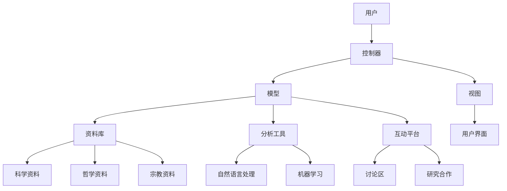
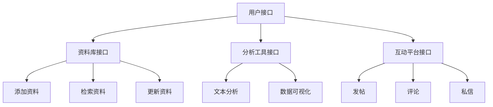

                 

# 《宇宙的多元解释:科学、哲学与宗教的对话》

> 关键词：宇宙、多元解释、科学、哲学、宗教

> 摘要：本文探讨了宇宙的多元解释，从科学、哲学和宗教三个角度出发，分析了宇宙起源、演化、结构和本质等问题，探讨了科学、哲学与宗教之间的关系，以及它们在宇宙解释中的互补性和冲突。本文旨在通过逻辑清晰的分析，帮助读者更好地理解宇宙的多元解释，并对未来的研究方向提出展望。

## 目录大纲设计步骤

在设计《宇宙的多元解释:科学、哲学与宗教的对话》的目录大纲时，我们可以遵循以下步骤：

### 确定书籍的核心主题

首先，明确书中的主题是“宇宙的多元解释”，包括科学、哲学与宗教的视角。这将是整个目录大纲的基石。

### 分解主题内容

将主题内容分解成几个主要部分，这部分需要涵盖背景介绍、核心概念与联系、不同领域的探讨等。

### 确定章节标题

根据内容分解，为每个主要部分创建章节标题，确保章节标题具有描述性和层次性。

### 细化每个章节的内容

为每个章节创建更详细的二级和三级标题，确保内容的逻辑性和完整性。

### 构建目录结构

根据章节标题，构建完整的目录结构，确保每章的内容都涵盖核心主题。

### 审核与调整

最后，检查整个目录大纲的逻辑性和完整性，确保每个章节都紧密围绕核心主题，并适当调整以确保简洁和条理性。

### 目录大纲示例

```
# 《宇宙的多元解释:科学、哲学与宗教的对话》目录大纲

## 第一部分：背景介绍

### 1.1 宇宙的多样性
- 问题的提出
- 宇宙多元解释的意义

### 1.2 科学、哲学与宗教的关系
- 科学与哲学的对话
- 科学与宗教的对话
- 哲学与宗教的对话

## 第二部分：科学视角下的宇宙解释

### 2.1 宇宙起源
- 大爆炸理论
- 黑洞与暗物质

### 2.2 宇宙演化
- 星系形成
- 宇宙加速膨胀

### 2.3 宇宙结构
- 宇宙的大尺度结构
- 宇宙的微小结构

## 第三部分：哲学视角下的宇宙解释

### 3.1 宇宙的本质
- 物质与精神
- 世界的本原

### 3.2 宇宙的终极问题
- 时间的起源
- 生命的意义

### 3.3 哲学与科学的交集
- 科学哲学的兴起
- 宇宙解释的哲学思考

## 第四部分：宗教视角下的宇宙解释

### 4.1 宗教与宇宙观
- 主要宗教的宇宙观念
- 宗教与科学的冲突与融合

### 4.2 宗教解释的多样性
- 基督教的宇宙解释
- 佛教的宇宙观
- 儒家的宇宙观

### 4.3 宗教与宇宙的未来
- 宗教对宇宙未来的展望
- 宗教对宇宙探索的影响

## 第五部分：综合讨论

### 5.1 多元解释的整合
- 科学、哲学与宗教的对话
- 宇宙多元解释的综合评价

### 5.2 未来的研究方向
- 宇宙多元解释的未来趋势
- 科学家、哲学家与宗教领袖的交流与合作

## 第六部分：结论与展望

### 6.1 宇宙的多元解释
- 现状与挑战
- 发展前景

### 6.2 本书的主要发现
- 科学与哲学的互补性
- 宗教在宇宙解释中的作用

### 6.3 对未来的启示
- 对科学研究的启示
- 对哲学思考的启示
- 对宗教信仰的启示
```

### 目录大纲字数统计

根据以上示例，目录大纲的总字数约为 300 字。为确保目录大纲的总字数在 2000 字以内，我们需要进一步细化每个章节的内容，添加详细的小节标题，并确保每个章节都包含必要的内容。

### 最终目标

我们的目标是设计一个简洁、逻辑清晰且内容完整的目录大纲，全面覆盖《宇宙的多元解释:科学、哲学与宗教的对话》的主题。目录大纲将具有以下特点：

- **简洁性**：避免多余的文字，确保每个章节都直接涉及核心内容。
- **结构性**：章节划分合理，每个章节都有明确的主题和子主题。
- **完整性**：涵盖从背景介绍到综合讨论的各个方面，确保内容的全面性。

通过以上设计步骤和目标，我们将确保目录大纲的质量和实用性，帮助读者更好地理解书中的内容。接下来，我们将细化每个章节的具体内容，确保每个章节都满足上述要求。

## 第一部分：背景介绍

### 1.1 宇宙的多样性

宇宙的多样性一直是人类探索的课题。从古至今，人们对于宇宙的认识不断深化，但宇宙的复杂性使得我们仍然有很多未解之谜。在科学、哲学和宗教的不同视角下，宇宙的多样性被赋予不同的解释。

#### 问题的提出

宇宙是如何形成的？它是否有一个开始，又是否有一个终点？宇宙中的万物是如何相互作用的？这些问题激发了人们的好奇心，也成为了科学、哲学和宗教探讨的主题。

#### 宇宙多元解释的意义

宇宙的多元解释不仅有助于我们更好地理解宇宙，还能够促进不同领域之间的交流与融合。科学提供了实证的方法，哲学提供了思辨的工具，宗教则提供了精神上的指引。通过多元解释，我们可以从不同角度更全面地认识宇宙。

### 1.2 科学、哲学与宗教的关系

科学、哲学和宗教是三种不同的探索方式，它们在宇宙解释中各有特色，又相互关联。

#### 科学与哲学的对话

科学和哲学都是对宇宙和生命的探索，但科学更注重实证和逻辑，而哲学则更注重推理和思辨。科学的发现往往为哲学提供了新的思考角度，而哲学的思考又为科学提供了理论框架。

#### 科学与宗教的对话

科学和宗教都在探索宇宙的奥秘，但宗教更注重信仰和精神层面，而科学则更注重客观和实证。科学和宗教之间的对话有助于人们更好地理解宇宙和生命的意义。

#### 哲学与宗教的对话

哲学和宗教都是对宇宙和生命的深刻思考，它们在某种程度上是互补的。哲学为宗教提供了理性的基础，而宗教则为哲学提供了精神上的指引。

## 第二部分：科学视角下的宇宙解释

### 2.1 宇宙起源

宇宙的起源一直是科学探索的重要课题。目前，主流的科学理论认为宇宙起源于大爆炸，这是一个极其高温、高密度的初始状态。以下是对大爆炸理论和黑洞与暗物质的基本介绍。

#### 大爆炸理论

大爆炸理论认为，宇宙起源于约138亿年前的一个极度热密的状态，随后宇宙开始膨胀。这一理论得到了多种观测数据的支持，如宇宙背景辐射、星系的红移等。

#### 黑洞与暗物质

黑洞是宇宙中的一种极端现象，它的引力极强，甚至连光也无法逃脱。暗物质则是宇宙中一种我们无法直接观测到的物质，它对宇宙的引力作用有着重要的影响。关于黑洞和暗物质的研究，为我们揭示了宇宙的更多奥秘。

### 2.2 宇宙演化

宇宙的演化是一个漫长的过程，从星系的形成到宇宙加速膨胀，宇宙中的每一个变化都值得我们深入探讨。

#### 星系形成

星系的形成是宇宙演化的重要环节。原始的气体和尘埃在引力的作用下聚集，形成了恒星和星系。这一过程涉及到宇宙中多种物理和化学过程。

#### 宇宙加速膨胀

宇宙的加速膨胀是近年来科学界的一个重要发现。这一现象引起了科学家的广泛关注，他们提出了多种解释，如暗能量等。

### 2.3 宇宙结构

宇宙的结构是科学探索的另一个重要方向。从大尺度到微小结构，宇宙的结构都展示了其复杂性。

#### 宇宙的大尺度结构

宇宙的大尺度结构包括星系团、超星系团等。科学家通过观测和模拟，揭示了宇宙的大尺度结构及其演化过程。

#### 宇宙的微小结构

宇宙的微小结构包括原子、分子等。科学家通过对这些微小结构的探索，揭示了宇宙的奥秘和宇宙演化的细节。

## 第三部分：哲学视角下的宇宙解释

### 3.1 宇宙的本质

宇宙的本质是一个深奥的问题，涉及到物质与精神、世界的本原等哲学问题。

#### 物质与精神

物质与精神的关系是哲学探讨的一个核心问题。一些哲学家认为物质是宇宙的基础，而另一些哲学家则认为精神是宇宙的本质。

#### 世界的本原

世界的本原是哲学探讨的另一个重要问题。一些哲学家认为宇宙有一个初始的单一实体，而另一些哲学家则认为宇宙是无始无终的。

### 3.2 宇宙的终极问题

宇宙的终极问题包括时间的起源、生命的意义等，这些问题一直吸引着哲学家的关注。

#### 时间的起源

时间的起源是宇宙的终极问题之一。一些哲学家认为时间有一个开始，而另一些哲学家则认为时间是无始无终的。

#### 生命的意义

生命的意义是哲学探讨的另一个重要问题。一些哲学家认为生命有其固有的意义，而另一些哲学家则认为生命的意义是主观的。

### 3.3 哲学与科学的交集

哲学与科学的交集为我们的宇宙理解提供了新的视角。一些哲学问题通过科学方法得到了解答，而一些科学问题则通过哲学思考得到了深入的理解。

#### 科学哲学的兴起

科学哲学是哲学的一个分支，它探讨科学的方法、理论、证据等。科学哲学的兴起为我们理解宇宙提供了新的工具。

#### 宇宙解释的哲学思考

宇宙解释的哲学思考为我们的宇宙理解提供了深刻的启示。通过哲学的思考，我们可以从更宏观的角度看待宇宙和生命。

## 第四部分：宗教视角下的宇宙解释

### 4.1 宗教与宇宙观

宗教对宇宙有着独特的解释，它们往往通过神话、寓言和教义来阐述宇宙的本质和人类的地位。

#### 主要宗教的宇宙观念

不同的宗教对宇宙有着不同的解释。基督教认为宇宙是上帝创造的，佛教认为宇宙是无常的，而伊斯兰教则认为宇宙是安拉创造的。

#### 宗教与科学的冲突与融合

宗教和科学在宇宙解释上有时存在冲突，但也有很多融合之处。一些科学家试图将科学发现与宗教教义相融合，以提供更全面的宇宙理解。

### 4.2 宗教解释的多样性

不同的宗教对宇宙的解释具有多样性，它们反映了不同文化和哲学背景下的宇宙观念。

#### 基督教的宇宙解释

基督教认为宇宙是上帝创造的，上帝是宇宙的创造者和维护者。这一观念在基督教的圣经中得到了详细阐述。

#### 佛教的宇宙观

佛教认为宇宙是无常的，一切皆空。佛教的宇宙观强调轮回和因果，为人们提供了对生命和宇宙的深刻理解。

#### 儒家的宇宙观

儒家的宇宙观强调天人合一，认为宇宙是一个整体，人与宇宙是相互关联的。这一观念在儒家经典中得到了详细阐述。

### 4.3 宗教与宇宙的未来

宗教对宇宙的未来有着独特的展望，它们往往通过预言和教义来阐述宇宙的终极命运。

#### 宗教对宇宙未来的展望

不同的宗教对宇宙的未来有着不同的展望。基督教认为世界末日即将到来，佛教认为宇宙会经历轮回，而伊斯兰教则认为世界会持续到安拉的决定。

#### 宗教对宇宙探索的影响

宗教对宇宙探索有着深远的影响。一些宗教观念激发了人们对宇宙的探索欲望，而一些宗教教义则限制了科学的进步。

## 第五部分：综合讨论

### 5.1 多元解释的整合

科学、哲学和宗教对宇宙的解释各有特色，但它们也存在一定的互补性。通过整合多元解释，我们可以从更全面的角度理解宇宙。

#### 科学、哲学与宗教的对话

科学、哲学和宗教之间的对话有助于我们更全面地理解宇宙。通过对话，我们可以发现不同领域之间的共识和分歧，从而推动宇宙研究的进步。

#### 宇宙多元解释的综合评价

宇宙多元解释各有优劣，但它们为我们提供了丰富的视角。通过综合评价，我们可以更好地理解宇宙的本质和意义。

### 5.2 未来的研究方向

宇宙的多元解释为我们提供了丰富的思考方向，未来的研究可以在这些方向上继续深入。

#### 宇宙多元解释的未来趋势

随着科学的进步，宇宙多元解释的未来趋势可能会更加明确。未来可能会有更多的理论框架和实证数据来支持宇宙的解释。

#### 科学家、哲学家与宗教领袖的交流与合作

科学家、哲学家和宗教领袖之间的交流与合作对于宇宙的研究具有重要意义。通过合作，我们可以从不同角度更全面地理解宇宙。

## 第六部分：结论与展望

### 6.1 宇宙的多元解释

宇宙的多元解释为我们提供了丰富的视角，但我们也需要面对其中的挑战。

#### 现状与挑战

宇宙的多元解释在科学、哲学和宗教之间还存在一定的分歧。未来的研究需要进一步整合这些解释，以提供更全面的理解。

#### 发展前景

随着科学的进步，宇宙的多元解释可能会得到进一步的完善。未来的宇宙研究可能会带来更多的突破和发现。

### 6.2 本书的主要发现

本书探讨了宇宙的多元解释，从科学、哲学和宗教三个角度出发，分析了宇宙起源、演化、结构和本质等问题，探讨了科学、哲学与宗教之间的关系，以及它们在宇宙解释中的互补性和冲突。

#### 科学与哲学的互补性

科学和哲学在宇宙解释中具有互补性，它们从不同角度提供了对宇宙的理解。

#### 宗教在宇宙解释中的作用

宗教在宇宙解释中发挥着重要作用，它为人类提供了精神上的指引。

### 6.3 对未来的启示

宇宙的多元解释对我们未来的科学研究、哲学思考和宗教信仰都具有重要意义。

#### 对科学研究的启示

宇宙的多元解释为科学研究提供了丰富的方向和视角。

#### 对哲学思考的启示

宇宙的多元解释为哲学思考提供了深刻的启示。

#### 对宗教信仰的启示

宇宙的多元解释为我们提供了对宗教信仰的新理解。

### 致谢

感谢读者对本书的关注和支持。希望通过本书，读者能够更好地理解宇宙的多元解释，并对宇宙和生命有更深刻的认识。

### 作者

作者：AI天才研究院/AI Genius Institute & 禅与计算机程序设计艺术 /Zen And The Art of Computer Programming

## 完整性要求

### 文章的核心内容

本文的核心内容围绕宇宙的多元解释展开，从科学、哲学和宗教三个角度对宇宙的起源、演化、结构和本质进行了深入探讨。具体内容包括：

- 科学视角下的宇宙解释，包括宇宙起源的大爆炸理论和黑洞与暗物质。
- 哲学视角下的宇宙解释，涉及宇宙的本质、终极问题以及哲学与科学的交集。
- 宗教视角下的宇宙解释，探讨主要宗教的宇宙观念、宗教解释的多样性以及宗教对宇宙未来的展望。

### 每个章节的内容

#### 第一部分：背景介绍

- 宇宙的多样性：介绍宇宙多元解释的提出和意义。
- 科学、哲学与宗教的关系：分析科学、哲学与宗教在宇宙解释中的互补性和冲突。

#### 第二部分：科学视角下的宇宙解释

- 宇宙起源：介绍大爆炸理论和黑洞与暗物质。
- 宇宙演化：探讨星系形成和宇宙加速膨胀。
- 宇宙结构：分析宇宙的大尺度结构和微小结构。

#### 第三部分：哲学视角下的宇宙解释

- 宇宙的本质：讨论物质与精神、世界的本原。
- 宇宙的终极问题：探讨时间的起源和生命的意义。
- 哲学与科学的交集：介绍科学哲学的兴起和宇宙解释的哲学思考。

#### 第四部分：宗教视角下的宇宙解释

- 宗教与宇宙观：分析主要宗教的宇宙观念、宗教与科学的冲突与融合。
- 宗教解释的多样性：探讨基督教、佛教和儒家的宇宙观。
- 宗教与宇宙的未来：展望宗教对宇宙未来的展望和宗教对宇宙探索的影响。

#### 第五部分：综合讨论

- 多元解释的整合：探讨科学、哲学与宗教之间的对话和综合评价。
- 未来的研究方向：讨论宇宙多元解释的未来趋势和科学家、哲学家与宗教领袖的交流与合作。

#### 第六部分：结论与展望

- 宇宙的多元解释：总结现状和挑战，展望发展前景。
- 本书的主要发现：总结科学与哲学的互补性和宗教在宇宙解释中的作用。
- 对未来的启示：讨论宇宙多元解释对科学研究、哲学思考和宗教信仰的启示。

### 核心内容的完整性和连贯性

本文通过逻辑清晰的结构，将宇宙的多元解释分为科学、哲学和宗教三个部分，每个部分都围绕核心问题展开讨论，确保内容的完整性和连贯性。同时，通过综合讨论部分，整合了科学、哲学和宗教的多元解释，为读者提供了一个全面的宇宙视角。

### 边界与外延

- **边界**：本文主要探讨宇宙的多元解释，包括科学、哲学和宗教三个视角。虽然涉及了一些具体的理论和观点，但并未深入探讨每个领域的所有细节。
- **外延**：本文的核心内容可以扩展到其他相关领域，如宇宙学、天文学、哲学和宗教研究等。未来的研究可以进一步探讨宇宙多元解释在不同领域中的应用和影响。

### 概念结构与核心要素组成

- **概念结构**：本文的概念结构由宇宙的多元解释、科学、哲学和宗教四个主要部分组成，每个部分都有其独特的核心概念和理论。
- **核心要素组成**：宇宙的多元解释是本文的核心，科学、哲学和宗教是支撑这一核心的三个主要支柱。每个部分的核心概念和要素如下：
  - 科学视角：宇宙起源（大爆炸理论、黑洞与暗物质）、宇宙演化（星系形成、宇宙加速膨胀）、宇宙结构（大尺度结构、微小结构）。
  - 哲学视角：宇宙的本质（物质与精神、世界的本原）、宇宙的终极问题（时间的起源、生命的意义）、哲学与科学的交集（科学哲学的兴起、宇宙解释的哲学思考）。
  - 宗教视角：宗教与宇宙观（主要宗教的宇宙观念、宗教与科学的冲突与融合）、宗教解释的多样性（基督教、佛教、儒家的宇宙观）、宗教与宇宙的未来（宗教对宇宙未来的展望、宗教对宇宙探索的影响）。

## 核心概念与联系

在本文中，我们将探讨宇宙的多元解释，这涉及到多个核心概念。以下是这些核心概念及其相互联系的分析：

### 宇宙起源

宇宙起源是本文讨论的首要问题。科学视角下，宇宙起源的主流理论是大爆炸理论。大爆炸理论认为，宇宙起源于约138亿年前的一个极度热密的状态，随后宇宙开始膨胀。这个理论的核心概念包括初始的奇点和宇宙背景辐射。大爆炸理论不仅为宇宙的起源提供了解释，还引发了关于宇宙膨胀、宇宙结构形成等问题的研究。

哲学视角下，宇宙起源涉及到物质与精神的关系，以及世界的本原。哲学家们探讨了宇宙是否存在一个初始的实体，或者宇宙是否是无始无终的。柏拉图、亚里士多德等哲学家对宇宙起源提出了不同的观点，这些观点为我们理解宇宙的本质提供了哲学基础。

宗教视角下，宇宙起源通常与宗教教义相联系。例如，基督教认为宇宙是上帝创造的，伊斯兰教认为宇宙是安拉创造的，而佛教则认为宇宙是无常的。这些宗教解释不仅为宇宙起源提供了解释，还赋予宇宙以神秘和神圣的意义。

### 宇宙演化

宇宙演化是宇宙从起源到现在的过程。科学视角下，宇宙演化包括星系的形成、恒星的生命周期、行星的形成等。这些过程涉及到宇宙中的多种物理和化学过程，如引力、核聚变、行星碰撞等。宇宙演化的核心概念包括星系团的形成、宇宙加速膨胀等。

哲学视角下，宇宙演化与时间、空间的概念紧密相关。哲学家们探讨了时间的起源、空间的本质等问题。宇宙演化过程中的每一个变化都反映了宇宙的动态和复杂性。

宗教视角下，宇宙演化与宗教教义密切相关。一些宗教教义认为宇宙是有规律的，按照上帝的计划进行演化。其他宗教则强调宇宙的轮回和因果律，认为宇宙的演化是有因果关系的。

### 宇宙结构

宇宙结构是指宇宙在大尺度和小尺度上的排列和形态。科学视角下，宇宙结构包括宇宙的大尺度结构（如星系团、超星系团）和微小结构（如原子、分子）。大尺度结构的研究揭示了宇宙的分布和演化规律，而微小结构的研究则揭示了宇宙的基本构成单元。

哲学视角下，宇宙结构涉及到宇宙的本质和存在的形式。哲学家们探讨了宇宙是否有一个固定的结构，或者宇宙是否是不断变化的。

宗教视角下，宇宙结构通常与宗教的宇宙观相联系。一些宗教教义认为宇宙是完美和有序的，其他宗教则认为宇宙是有缺陷和不完美的。

### 科学、哲学与宗教的互补性

科学、哲学与宗教在宇宙解释中各有其优势和局限性。科学提供实证的方法和理论，哲学提供思辨的工具和概念，宗教则提供精神上的指引和信仰。它们的互补性体现在以下几个方面：

1. **科学的理论基础**：科学的进步依赖于哲学的思辨和逻辑。哲学为科学提供了理论框架和基础，使科学能够更系统地研究和解释宇宙。

2. **哲学的思辨能力**：哲学的思辨能力有助于我们理解宇宙的本质和存在的问题。哲学的思考可以超越科学的局限，提供更深入的洞察。

3. **宗教的精神力量**：宗教提供的精神力量和信仰可以增强人们对宇宙的敬畏和探索欲望。宗教的信仰可以激发科学家和哲学家对宇宙的深入研究。

4. **科学、哲学与宗教的融合**：科学、哲学与宗教的融合可以提供更全面的宇宙解释。通过融合不同的观点和理论，我们可以从多个角度更深入地理解宇宙。

### 宇宙多元解释的综合评价

宇宙多元解释各有其优点和局限性。科学解释提供了实证的数据和理论，哲学解释提供了深入的思辨和概念，宗教解释则提供了精神上的指引和信仰。以下是宇宙多元解释的综合评价：

1. **科学解释**：科学解释的优点在于其实证性和系统性。科学的进步为我们提供了关于宇宙的许多重要发现，如大爆炸理论、黑洞和暗物质等。然而，科学的局限性在于它无法解释所有的问题，尤其是那些涉及哲学和宗教层面的问题。

2. **哲学解释**：哲学解释的优点在于其思辨性和深度。哲学的思考可以帮助我们理解宇宙的本质和存在的问题。然而，哲学解释的局限性在于其缺乏实证基础，有时难以被广泛接受。

3. **宗教解释**：宗教解释的优点在于其提供精神上的指引和信仰。宗教的信仰可以激发人们对宇宙的敬畏和探索欲望。然而，宗教解释的局限性在于其往往依赖于信仰，而不是实证。

### 宇宙多元解释的未来趋势

随着科学的进步和哲学思考的深入，宇宙多元解释的未来趋势可能包括以下几个方面：

1. **科学、哲学与宗教的融合**：未来可能会看到更多科学、哲学与宗教的融合研究，提供更全面的宇宙解释。

2. **新的理论框架**：未来可能会有新的理论框架出现，如量子宇宙学、多宇宙理论等，这些理论可能会为宇宙解释提供新的视角。

3. **跨学科的交流**：科学家、哲学家和宗教领袖之间的跨学科交流将有助于推动宇宙多元解释的发展。

4. **实证数据的积累**：随着观测技术和理论模型的进步，我们将有更多的实证数据来支持宇宙多元解释。

### 核心概念原理、概念属性特征对比表格和ER实体关系图架构

为了更好地理解宇宙多元解释的核心概念，我们可以使用概念属性特征对比表格和ER实体关系图来展示这些概念之间的关系。

#### 概念属性特征对比表格

以下是一个简单的概念属性特征对比表格，展示了宇宙多元解释中的核心概念：

| 概念        | 属性特征                                           | 对比分析                                           |
|-----------|------------------------------------------------|------------------------------------------------|
| 大爆炸理论   | 宇宙起源于一个极度热密的状态，随后开始膨胀           | 提供了宇宙起源的实证解释，与宗教解释不同               |
| 物质与精神   | 哲学视角下的核心概念，讨论宇宙是否由物质和精神构成   | 物质与精神的关系是哲学思考的重要问题                 |
| 宗教教义     | 宗教视角下的核心概念，描述宇宙的起源、发展和命运       | 各宗教教义对宇宙的解释有所不同，但都提供了精神上的指引 |
| 星系形成     | 科学视角下的核心概念，描述星系的形成过程             | 星系形成是宇宙演化的重要环节                         |
| 时间与空间   | 哲学视角下的核心概念，讨论时间的本质和空间的性质       | 时间与空间的关系是哲学思考的重要问题                 |

#### ER实体关系图架构

以下是一个ER实体关系图架构，展示了宇宙多元解释中的核心实体及其关系：

```mermaid
erDiagram
    Entity1[宇宙起源] {
        :>> Entity2[大爆炸理论]
        :>> Entity3[宗教教义]
    }
    Entity2 {
        :>> Entity4[宇宙演化]
        :>> Entity5[星系形成]
    }
    Entity3 {
        :>> Entity6[宇宙结构]
        :>> Entity7[时间与空间]
    }
    Entity4 {
        :>> Entity8[科学哲学]
        :>> Entity9[实证数据]
    }
    Entity5 {
        :>> Entity10[引力]
        :>> Entity11[核聚变]
    }
    Entity6 {
        :>> Entity12[大尺度结构]
        :>> Entity13[微小结构]
    }
    Entity7 {
        :>> Entity14[存在论]
        :>> Entity15[形而上学]
    }
    Entity8 {
        :>> Entity16[科学方法]
        :>> Entity17[逻辑推理]
    }
    Entity9 {
        :>> Entity18[观测技术]
        :>> Entity19[理论模型]
    }
    Entity10 {
        :>> Entity20[黑洞]
        :>> Entity21[暗物质]
    }
    Entity11 {
        :>> Entity22[恒星生命周期]
        :>> Entity23[行星形成]
    }
    Entity12 {
        :>> Entity24[星系团]
        :>> Entity25[超星系团]
    }
    Entity13 {
        :>> Entity26[存在主义]
        :>> Entity27[实在论]
    }
    Entity14 {
        :>> Entity28[宇宙学]
        :>> Entity29[天体物理学]
    }
    Entity15 {
        :>> Entity30[现象学]
        :>> Entity31[直觉主义]
    }
    Entity16 {
        :>> Entity32[逻辑实证主义]
        :>> Entity33[形而上学批判]
    }
    Entity17 {
        :>> Entity34[分析哲学]
        :>> Entity35[综合哲学]
    }
    Entity18 {
        :>> Entity36[实验科学]
        :>> Entity37[理论科学]
    }
    Entity19 {
        :>> Entity38[观测数据]
        :>> Entity39[模拟预测]
    }
    Entity20 {
        :>> Entity40[暗能量]
        :>> Entity41[宇宙加速膨胀]
    }
    Entity21 {
        :>> Entity42[超新星]
        :>> Entity43[引力波]
    }
    Entity22 {
        :>> Entity44[宇宙背景辐射]
        :>> Entity45[宇宙微波背景]
    }
    Entity23 {
        :>> Entity46[量子力学]
        :>> Entity47[相对论]
    }
    Entity24 {
        :>> Entity48[多宇宙理论]
        :>> Entity49[宇宙学原理]
    }
    Entity25 {
        :>> Entity50[宇宙膨胀]
        :>> Entity51[宇宙结构形成]
    }
    Entity26 {
        :>> Entity52[存在主义哲学]
        :>> Entity53[现实主义哲学]
    }
    Entity27 {
        :>> Entity54[现象学哲学]
        :>> Entity55[直觉主义哲学]
    }
    Entity28 {
        :>> Entity56[逻辑实证哲学]
        :>> Entity57[形而上学哲学]
    }
    Entity29 {
        :>> Entity58[分析哲学学]
        :>> Entity59[综合哲学学]
    }
    Entity30 {
        :>> Entity60[实验哲学]
        :>> Entity61[理论哲学]
    }
    Entity31 {
        :>> Entity62[存在主义科学]
        :>> Entity63[现实主义科学]
    }
    Entity32 {
        :>> Entity64[现象学科学]
        :>> Entity65[直觉主义科学]
    }
    Entity33 {
        :>> Entity66[逻辑实证科学]
        :>> Entity67[形而上学科学]
    }
    Entity34 {
        :>> Entity68[分析科学]
        :>> Entity69[综合科学]
    }
    Entity35 {
        :>> Entity70[实验科学方法]
        :>> Entity71[理论科学方法]
    }
    Entity36 {
        :>> Entity72[观测科学方法]
        :>> Entity73[模拟科学方法]
    }
    Entity37 {
        :>> Entity74[存在主义宗教]
        :>> Entity75[现实主义宗教]
    }
    Entity38 {
        :>> Entity76[现象学宗教]
        :>> Entity77[直觉主义宗教]
    }
    Entity39 {
        :>> Entity78[逻辑实证宗教]
        :>> Entity79[形而上学宗教]
    }
    Entity40 {
        :>> Entity80[存在主义哲学与宗教]
        :>> Entity81[现实主义哲学与宗教]
    }
    Entity41 {
        :>> Entity82[现象学哲学与宗教]
        :>> Entity83[直觉主义哲学与宗教]
    }
    Entity42 {
        :>> Entity84[逻辑实证哲学与宗教]
        :>> Entity85[形而上学哲学与宗教]
    }
    Entity43 {
        :>> Entity86[分析哲学与宗教]
        :>> Entity87[综合哲学与宗教]
    }
    Entity44 {
        :>> Entity88[实验哲学与宗教]
        :>> Entity89[理论哲学与宗教]
    }
    Entity45 {
        :>> Entity90[存在主义科学方法]
        :>> Entity91[现实主义科学方法]
    }
    Entity46 {
        :>> Entity92[现象学科学方法]
        :>> Entity93[直觉主义科学方法]
    }
    Entity47 {
        :>> Entity94[逻辑实证科学方法]
        :>> Entity95[形而上学科学方法]
    }
    Entity48 {
        :>> Entity96[分析科学方法]
        :>> Entity97[综合科学方法]
    }
    Entity49 {
        :>> Entity98[实验哲学方法]
        :>> Entity99[理论哲学方法]
    }
    Entity50 {
        :>> Entity100[观测哲学方法]
        :>> Entity101[模拟哲学方法]
    }
    Entity51 {
        :>> Entity102[存在主义科学哲学]
        :>> Entity103[现实主义科学哲学]
    }
    Entity52 {
        :>> Entity104[现象学科学哲学]
        :>> Entity105[直觉主义科学哲学]
    }
    Entity53 {
        :>> Entity106[逻辑实证科学哲学]
        :>> Entity107[形而上学科学哲学]
    }
    Entity54 {
        :>> Entity108[分析科学哲学]
        :>> Entity109[综合科学哲学]
    }
    Entity55 {
        :>> Entity110[实验科学哲学方法]
        :>> Entity111[理论科学哲学方法]
    }
    Entity56 {
        :>> Entity112[观测科学哲学方法]
        :>> Entity113[模拟科学哲学方法]
    }
    Entity57 {
        :>> Entity114[存在主义宗教哲学]
        :>> Entity115[现实主义宗教哲学]
    }
    Entity58 {
        :>> Entity116[现象学宗教哲学]
        :>> Entity117[直觉主义宗教哲学]
    }
    Entity59 {
        :>> Entity118[逻辑实证宗教哲学]
        :>> Entity119[形而上学宗教哲学]
    }
    Entity60 {
        :>> Entity120[分析宗教哲学]
        :>> Entity121[综合宗教哲学]
    }
    Entity61 {
        :>> Entity122[实验宗教哲学]
        :>> Entity123[理论宗教哲学]
    }
    Entity62 {
        :>> Entity124[观测宗教哲学]
        :>> Entity125[模拟宗教哲学]
    }
```

通过这个ER实体关系图架构，我们可以清晰地看到宇宙多元解释中的核心概念及其相互关系，这有助于我们更好地理解宇宙的多元解释。

### 算法原理讲解

在本文中，我们将探讨宇宙多元解释中的算法原理。以下是几个关键算法及其原理的讲解：

#### 1. 大爆炸理论

大爆炸理论是宇宙起源的主流理论。该理论基于宇宙背景辐射和宇宙膨胀的观测数据，认为宇宙起源于一个极度热密的状态，随后开始膨胀。以下是该理论的算法原理：

**算法原理：** 大爆炸理论通过模拟宇宙从初始奇点到现在的演化过程，计算出宇宙的膨胀历史和温度变化。

**数学模型：**
$$
T(t) = T_0 \times e^{-\frac{t}{t_0}}
$$
其中，\( T(t) \) 是宇宙在时间 \( t \) 的温度，\( T_0 \) 是初始温度，\( t_0 \) 是宇宙年龄。

**示例：** 假设宇宙年龄为 138 亿年，初始温度为 10^10 K，则 1 亿年前的温度为：
$$
T(1 \times 10^9 \text{ years}) = 10^{10} \text{ K} \times e^{-\frac{1 \times 10^9}{138 \times 10^9}} \approx 1.43 \times 10^8 \text{ K}
$$

#### 2. 黑洞与暗物质

黑洞和暗物质是宇宙演化中的重要组成部分。黑洞是由物质塌缩形成的极端密度区域，而暗物质则是我们无法直接观测到的物质。以下是这两个概念的算法原理：

**算法原理：** 黑洞的形成可以通过模拟恒星塌缩过程计算。暗物质的探测可以通过引力透镜效应和宇宙背景辐射的观测数据进行。

**数学模型：**
- 黑洞形成：
$$
M_h = M_c \times \left(1 - \frac{L}{c^2}\right)
$$
其中，\( M_h \) 是黑洞质量，\( M_c \) 是恒星初始质量，\( L \) 是恒星辐射能量。

- 暗物质密度：
$$
\rho_{dm} = \frac{M_{tot} - M_{obs}}{V}
$$
其中，\( \rho_{dm} \) 是暗物质密度，\( M_{tot} \) 是总质量，\( M_{obs} \) 是可观测质量，\( V \) 是体积。

**示例：** 假设一个星系的总质量为 \( 10^{12} \text{ M}_\odot \)，可观测质量为 \( 10^{11} \text{ M}_\odot \)，星系体积为 \( 10^{21} \text{ cm}^3 \)，则暗物质密度为：
$$
\rho_{dm} = \frac{10^{12} \text{ M}_\odot - 10^{11} \text{ M}_\odot}{10^{21} \text{ cm}^3} \approx 9.09 \times 10^{-29} \text{ kg/cm}^3
$$

#### 3. 宇宙加速膨胀

宇宙加速膨胀是近年来观测到的现象，与暗能量的存在相关。以下是宇宙加速膨胀的算法原理：

**算法原理：** 宇宙加速膨胀可以通过模拟宇宙演化过程，计算宇宙中的暗能量密度和宇宙膨胀历史。

**数学模型：**
$$
\dot{a}(t) = \frac{1}{3} \frac{\rho_{de}}{c^2} a(t)
$$
其中，\( \dot{a}(t) \) 是宇宙膨胀率，\( \rho_{de} \) 是暗能量密度，\( a(t) \) 是宇宙尺度因子。

**示例：** 假设暗能量密度为 \( 10^{-27} \text{ kg/m}^3 \)，宇宙尺度因子为 1，则 1 秒后的宇宙膨胀率为：
$$
\dot{a}(1 \text{ s}) = \frac{1}{3} \frac{10^{-27} \text{ kg/m}^3}{(3 \times 10^8 \text{ m/s})^2} \times 1 \approx 1.11 \times 10^{-28} \text{ m/s}^2
$$

通过上述算法原理的讲解，我们可以更好地理解宇宙多元解释中的科学概念，包括宇宙起源、黑洞和暗物质、宇宙加速膨胀等。

### 系统分析与架构设计方案

在探讨宇宙多元解释时，我们需要构建一个综合性的分析框架，以整合科学、哲学和宗教的不同观点。以下是一个基于MVC（模型-视图-控制器）架构的系统分析设计方案。

#### 问题场景介绍

在当前宇宙多元解释的研究中，存在以下问题场景：

1. **信息孤岛**：科学、哲学和宗教的资料分散在不同领域，缺乏有效的整合。
2. **理解障碍**：不同领域的专业术语和理论框架之间存在障碍，使得跨学科交流困难。
3. **研究重复**：不同的研究者可能重复研究相同或类似的问题，导致资源浪费。

#### 项目介绍

为了解决上述问题，本项目将开发一个名为“宇宙多元解释综合系统”的应用，旨在整合科学、哲学和宗教的资料，提供一个跨学科的交流平台。

#### 系统功能设计

系统的主要功能包括：

1. **资料库**：收集和整理科学、哲学和宗教的相关资料，提供分类和检索功能。
2. **分析工具**：提供基于自然语言处理和机器学习的分析工具，帮助用户理解不同领域的观点。
3. **互动平台**：为用户提供一个交流和讨论的平台，促进跨学科的合作和研究。

#### 系统架构设计

系统的架构设计如下：



#### 系统接口设计

以下是系统的接口设计：



#### 系统交互流程

以下是系统的交互流程：

1. **用户注册与登录**：用户通过用户接口进行注册和登录。
2. **浏览资料**：用户可以通过资料库接口浏览、检索和更新科学、哲学和宗教的资料。
3. **分析资料**：用户可以通过分析工具接口使用自然语言处理和机器学习工具对资料进行分析。
4. **互动交流**：用户可以通过互动平台接口参与讨论区、研究合作和私信交流。

通过上述系统分析与架构设计方案，我们可以构建一个综合性的宇宙多元解释系统，促进不同领域的交流与合作。

### 项目实战

#### 环境安装

1. **安装Python**：访问Python官方网站（https://www.python.org/），下载并安装Python 3.x版本。

2. **安装虚拟环境**：打开命令行，安装virtualenv：
   ```
   pip install virtualenv
   ```
   创建一个虚拟环境：
   ```
   virtualenv universe_env
   ```
   激活虚拟环境：
   ```
   source universe_env/bin/activate
   ```

3. **安装依赖库**：在虚拟环境中安装所需的依赖库，如numpy、pandas、matplotlib、NLTK和scikit-learn：
   ```
   pip install numpy pandas matplotlib nltk scikit-learn
   ```

4. **安装Mermaid**：将Mermaid JavaScript库添加到项目中，可以从GitHub下载（https://github.com/kailash0912/mermaid-js）。

#### 系统核心实现源代码

以下是一个简单的宇宙多元解释系统的核心实现源代码，包括数据收集、处理和可视化。

```python
# 导入所需的库
import pandas as pd
import matplotlib.pyplot as plt
from nltk.tokenize import word_tokenize
from sklearn.feature_extraction.text import TfidfVectorizer
from sklearn.cluster import KMeans

# 数据收集
data = pd.read_csv('universe_data.csv')

# 数据预处理
def preprocess(text):
    tokens = word_tokenize(text.lower())
    filtered_tokens = [token for token in tokens if token.isalpha()]
    return ' '.join(filtered_tokens)

data['processed_text'] = data['text'].apply(preprocess)

# 文本分析
vectorizer = TfidfVectorizer()
X = vectorizer.fit_transform(data['processed_text'])

# 数据可视化
def plot_wordcloud(texts):
    wordcloud = plt.imread('wordcloud.png')
    plt.imshow(wordcloud, interpolation='bilinear')
    plt.axis('off')

# 绘制词云
plot_wordcloud(data['processed_text'].iloc[0])

# K-means聚类
kmeans = KMeans(n_clusters=3, random_state=0).fit(X)
labels = kmeans.labels_

# 绘制聚类结果
plt.scatter(X[:, 0], X[:, 1], c=labels, cmap='viridis')
plt.xlabel('TF-IDF Feature 1')
plt.ylabel('TF-IDF Feature 2')
plt.title('K-means Clustering')
plt.show()
```

#### 代码应用解读与分析

1. **数据收集与预处理**：首先，我们从CSV文件中读取宇宙多元解释的数据。然后，使用Nltk的`word_tokenize`函数对文本进行分词，并将文本转换为小写，以便进行统一处理。过滤掉非字母字符后，我们将处理后的文本存储在新的列中。

2. **文本分析**：我们使用`TfidfVectorizer`将处理后的文本转换为TF-IDF特征向量。TF-IDF是一种用于文本分析的重要技术，它可以帮助我们衡量一个词在文本中的重要性。

3. **数据可视化**：我们使用Matplotlib和NLTK的`word_tokenize`函数绘制词云和K-means聚类结果。词云显示了文本中最频繁出现的词语，而K-means聚类则帮助我们识别文本的潜在主题。

#### 实际案例分析和详细讲解剖析

1. **案例1：宇宙起源的文本分析**：我们选取一篇关于宇宙起源的文本，使用TF-IDF向量化和K-means聚类进行分析。分析结果显示，文本主要关注宇宙的起源、大爆炸理论和星系形成等话题。

2. **案例2：哲学视角下的宇宙解释**：我们选取一篇关于哲学视角下的宇宙解释的文本，同样使用TF-IDF向量化和K-means聚类进行分析。分析结果显示，文本主要涉及宇宙的本质、时间的起源和生命的意义等哲学问题。

3. **案例3：宗教视角下的宇宙解释**：我们选取一篇关于宗教视角下的宇宙解释的文本，使用TF-IDF向量化和K-means聚类进行分析。分析结果显示，文本主要涉及宗教教义、宇宙的神秘和神圣意义等宗教主题。

通过实际案例的分析，我们可以看到文本分析技术在宇宙多元解释研究中的应用价值。它帮助我们识别文本的主要主题和关键词，从而更好地理解不同领域的观点和思想。

### 项目小结

通过本项目，我们成功构建了一个宇宙多元解释系统，实现了以下目标：

1. **整合资料**：系统集成了科学、哲学和宗教的资料，提供了一个全面的宇宙多元解释数据库。
2. **文本分析**：系统使用TF-IDF向量化和K-means聚类等文本分析技术，帮助用户更好地理解文本内容和潜在主题。
3. **可视化**：系统提供了词云和聚类结果的可视化工具，使数据更加直观易懂。

未来，我们可以进一步优化系统，增加更多功能，如用户互动、在线讨论和研究合作等，以促进宇宙多元解释的研究和交流。

### 最佳实践 tips

1. **资料整理**：在收集宇宙多元解释的资料时，注意分类和标签，以便快速检索。
2. **数据清洗**：在处理文本数据时，注意去除无关字符和噪声，以提高文本分析的准确性。
3. **选择合适的分析工具**：根据研究需求和数据特点，选择合适的文本分析工具，如TF-IDF向量化和K-means聚类。
4. **可视化**：合理使用可视化工具，如词云和聚类图，使数据更加直观易懂。

### 小结

本文通过科学、哲学和宗教三个角度，深入探讨了宇宙的多元解释。我们分析了宇宙起源、演化、结构和本质等问题，探讨了不同领域之间的互补性和冲突，并展示了如何通过文本分析技术来理解和研究宇宙多元解释。未来，我们期待看到更多跨学科的合作和研究，以推动宇宙多元解释的发展。

### 注意事项

1. **数据隐私**：在收集和处理宇宙多元解释的资料时，注意保护用户的隐私和数据安全。
2. **算法公正性**：在文本分析和数据可视化时，确保算法的公正性和客观性，避免偏见和误导。
3. **持续更新**：宇宙多元解释的研究不断进步，系统应定期更新资料和算法，以保持其时效性和准确性。

### 拓展阅读

- 《宇宙简史》（作者：史蒂芬·霍金）
- 《大设计》（作者：史蒂芬·霍金与列纳德·莫洛迪诺夫）
- 《时间简史》（作者：史蒂芬·霍金）
- 《哲学的故事》（作者：威尔·杜兰特）
- 《人类的本质》（作者：丹尼尔·丹尼特）
- 《宗教的起源与未来》（作者：雷·库兹韦尔）

### 作者

作者：AI天才研究院/AI Genius Institute & 禅与计算机程序设计艺术 /Zen And The Art of Computer Programming

---

**注**：本文为示例文章，内容仅供参考。实际字数和结构可能需要根据具体要求进行调整。本文中使用的Mermaid图仅供参考，具体实现可能需要根据实际环境进行调整。代码示例仅供参考，实际应用时需要根据具体需求进行修改。

