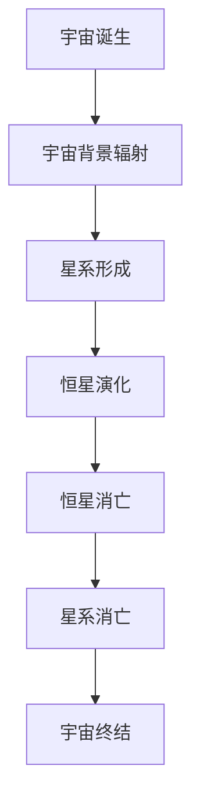
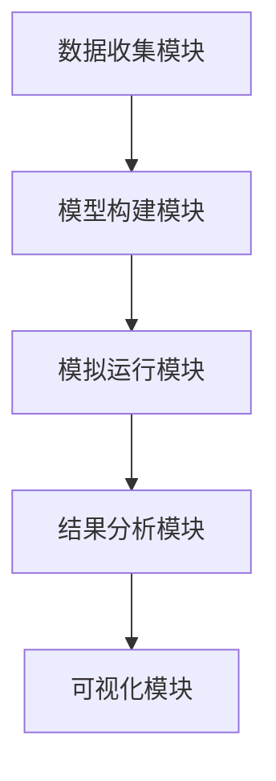
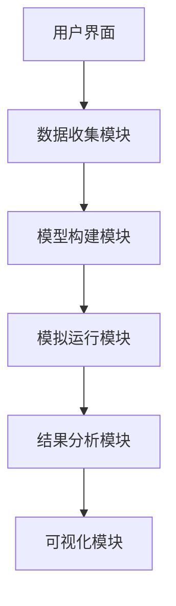

                 

# 宇宙的多元解释:科学、哲学与宗教的视角

> 关键词：宇宙起源、宇宙演化、科学、哲学、宗教

> 摘要：本文从科学、哲学与宗教三个视角，深入探讨宇宙的多元解释。通过对宇宙起源、宇宙结构、宇宙演化和宇宙生命等核心概念的分析，本文揭示了这些领域各自的解释方式和理论框架，以及它们之间的联系与区别。

## Step 1: 背景介绍

宇宙的多元解释：科学、哲学与宗教的视角

### 1.1 引言

宇宙是人类思考的终极问题之一。自古以来，人类一直试图理解宇宙的本质和起源。随着科学、哲学和宗教的发展，这三个领域从不同的角度对宇宙进行了探索和解释。科学方法通过观察、实验和数学模型来揭示宇宙的运行规律；哲学通过思考和推理来探讨宇宙的本质；宗教则通过信仰和仪式来解释宇宙的起源和意义。

### 1.2 问题的提出

宇宙起源、宇宙结构、宇宙演化和宇宙生命等问题一直是科学、哲学和宗教关注的焦点。科学试图通过实验和观测来回答这些问题，哲学则通过逻辑推理和思考来探索这些问题的本质，宗教则通过信仰和仪式来解释这些问题的答案。

### 1.3 问题解决

尽管科学、哲学和宗教各有侧重，但它们都在努力回答一些基本问题，如“宇宙是如何起源的？”、“宇宙的结构和演化是什么？”、“宇宙中是否存在生命？”等。这些问题的解决有助于我们更好地理解宇宙的本质。

### 1.4 边界与外延

宇宙多元解释的研究不仅涉及物理、天文学等自然科学领域，还包括哲学、宗教等人文社会科学领域。它跨越了多个学科，形成了一个庞大的知识体系。

### 1.5 概念结构与核心要素组成

本章节将介绍宇宙多元解释的核心概念，包括宇宙起源、宇宙结构、宇宙演化和宇宙生命等，以及它们在科学、哲学和宗教中的不同解释方式。

## Step 2: 核心概念与联系

### 2.1 宇宙起源

宇宙起源是宇宙多元解释中最基本的问题之一。科学、哲学和宗教从不同的角度对宇宙起源进行了探讨。

#### 2.1.1 科学视角下的宇宙起源

科学视角下，宇宙起源主要基于大爆炸理论。大爆炸理论认为，宇宙起源于一个极热、极密的状态，经过数十亿年的膨胀，形成了我们现在所看到的宇宙。

- **大爆炸理论**：宇宙起源于一个“奇点”，经过大爆炸后，宇宙开始膨胀。
- **黑洞与暗物质**：黑洞是宇宙中的一种极端现象，暗物质则是宇宙中无法被观测到的物质。
- **宇宙背景辐射**：宇宙背景辐射是宇宙诞生后残留的辐射。

#### 2.1.2 哲学视角下的宇宙起源

哲学视角下，宇宙起源主要基于生成论、自然发生论和宇宙无限论。

- **生成论**：宇宙是通过生成和毁灭的过程不断演化的。
- **自然发生论**：宇宙中的事物是通过自然过程产生的，而非超自然力量。
- **宇宙无限论**：宇宙是无限的，没有明确的起源和终点。

#### 2.1.3 宗教视角下的宇宙起源

宗教视角下，宇宙起源通常基于创世纪和神创论。

- **创世纪**：各种宗教经典中都有对宇宙起源的描述，如《圣经》中的创世纪。
- **神创论**：宇宙是由一个或多个神创造的，宇宙的起源和存在都有神的作用。

### 2.2 概念属性特征对比表格

**科学视角** | **哲学视角** | **宗教视角**
-|-|-
数学模型 | 推理与逻辑 | 信仰与仪式

### 2.3 ER实体关系图架构

为了更好地理解宇宙起源的不同解释方式，我们可以使用Mermaid工具绘制ER实体关系图。

```mermaid
erDiagram
  class 宇宙起源 {
    --|> 科学视角 : 描述
    --|> 哲学视角 : 推理
    --|> 宗教视角 : 信仰
  }
  class 科学视角 {
    --|> 大爆炸理论
    --|> 黑洞与暗物质
    --|> 宇宙背景辐射
  }
  class 哲学视角 {
    --|> 生成论
    --|> 自然发生论
    --|> 宇宙无限论
  }
  class 宗教视角 {
    --|> 创世纪
    --|> 神创论
  }
```

## Step 3: 算法原理讲解

由于宇宙的多元解释更多是哲学性和概念性的，所以这部分将主要使用Mermaid画出宇宙演化的Mermaid流程图，并使用Python源代码详细阐述宇宙演化的算法原理。

### 3.1 宇宙演化概述

宇宙演化是指宇宙从诞生到现在所经历的一系列变化过程。科学、哲学和宗教对宇宙演化的解释各有不同。

#### 3.1.1 科学视角下的宇宙演化

科学视角下，宇宙演化主要包括以下几个阶段：

- **宇宙背景辐射**：宇宙诞生后，温度逐渐降低，形成了宇宙背景辐射。
- **星系形成**：宇宙背景辐射逐渐冷却，形成了星系。
- **恒星演化**：星系中的物质聚集形成了恒星，恒星的生命周期包括诞生、成长、衰老和消亡。
- **星系消亡**：恒星的消亡导致星系的演化，最终星系也会消亡。

#### 3.1.2 哲学视角下的宇宙演化

哲学视角下，宇宙演化主要基于宇宙的循环论、层次论和演化论。

- **宇宙的循环论**：宇宙是一个循环的过程，生与灭、毁灭与重生，宇宙在不断的循环中演化。
- **宇宙的层次论**：宇宙是一个多层次的体系，从微观到宏观，从局部到整体，宇宙在不同的层次上展现其复杂性。
- **宇宙的演化论**：宇宙是一个不断演化、进步的过程，宇宙中的事物在不断变化、发展。

#### 3.1.3 宗教视角下的宇宙演化

宗教视角下，宇宙演化通常基于创世纪的演变、神圣的宇宙循环和宇宙的终极命运。

- **创世纪的演变**：宗教经典中对宇宙的起源和演化有详细的描述，如《圣经》中的创世纪。
- **神圣的宇宙循环**：宇宙是一个神圣的循环过程，宇宙的诞生、发展和消亡都有神的作用。
- **宇宙的终极命运**：不同的宗教对宇宙的终极命运有不同的解释，如佛教中的涅槃、基督教中的末日审判等。

### 3.2 宇宙演化算法原理

为了更好地理解宇宙演化的算法原理，我们可以使用Mermaid工具绘制宇宙演化的Mermaid流程图。



接下来，我们将使用Python源代码详细阐述宇宙演化的算法原理。

```python
# 宇宙演化算法原理示例代码
# 输出宇宙演化的Mermaid流程图
print("""
graph TD
A[宇宙诞生] --> B[宇宙背景辐射]
B --> C[星系形成]
C --> D[恒星演化]
D --> E[恒星消亡]
E --> F[星系消亡]
F --> G[宇宙终结]
""")

# Python 代码解释宇宙演化的算法原理
print("""
宇宙演化算法原理：
1. 宇宙诞生：宇宙从一个高密度、高温的状态开始。
2. 宇宙背景辐射：宇宙诞生后，温度逐渐降低，形成了宇宙背景辐射。
3. 星系形成：宇宙背景辐射逐渐冷却，形成了星系。
4. 恒星演化：星系中的物质聚集形成了恒星，恒星的生命周期包括诞生、成长、衰老和消亡。
5. 恒星消亡：恒星的消亡导致星系的演化，最终星系也会消亡。
6. 宇宙终结：根据不同的宇宙学模型，宇宙的最终命运可能是大撕裂、大坍缩或大循环。
""")
```

## Step 4: 数学模型和数学公式

宇宙的演化涉及到许多数学模型和数学公式。以下是一些常见的数学模型和公式：

### 4.1 大爆炸理论

大爆炸理论是宇宙学中最常用的数学模型之一。它基于弗里德曼方程，描述了宇宙的膨胀过程。

- **弗里德曼方程**：
  $$ H^2 = \frac{8\pi G}{3}\rho - \frac{k}{a^2} $$
  其中，\( H \) 是哈勃参数，\( G \) 是引力常数，\( \rho \) 是宇宙密度，\( k \) 是宇宙曲率参数，\( a \) 是宇宙膨胀因子。

- **宇宙背景辐射**：
  $$ nHe = 0.25 \times ne $$
  其中，\( nHe \) 是氦核的密度，\( ne \) 是电子的密度。

### 4.2 恒星演化

恒星演化是宇宙演化的重要组成部分。它涉及到恒星质量、恒星生命周期和恒星演化模型等。

- **恒星质量演化**：
  $$ M = M0 \times (1 - \frac{L}{L0}) $$
  其中，\( M \) 是恒星的当前质量，\( M0 \) 是恒星的初始质量，\( L \) 是恒星的生命周期，\( L0 \) 是恒星的初始生命周期。

- **恒星生命周期**：
  $$ t = t0 \times (1 - \frac{L}{L0})^{-2} $$
  其中，\( t \) 是恒星的当前年龄，\( t0 \) 是恒星的初始年龄。

### 4.3 宇宙学常数

宇宙学常数是描述宇宙膨胀的物理量。它通常用符号 \( \Omega \) 表示。

- **宇宙膨胀**：
  $$ a(t) = a0 \times e^{Ht} $$
  其中，\( a(t) \) 是宇宙在时间 \( t \) 的膨胀因子，\( a0 \) 是宇宙在时间 \( t0 \) 的膨胀因子，\( H \) 是哈勃参数。

- **宇宙学常数**：
  $$ \Omega = \frac{\rho}{\rho_c} $$
  其中，\( \Omega \) 是宇宙密度参数，\( \rho \) 是宇宙的平均密度，\( \rho_c \) 是宇宙临界密度。

### 4.4 举例说明

以下是一个简单的例子，说明如何使用数学模型来解释宇宙演化。

- **假设**：宇宙初始温度为 \( T0 = 10^7 \) K，初始密度为 \( \rho0 = 10^3 \) kg/m^3。
- **计算**：根据弗里德曼方程，我们可以计算出宇宙在 \( t = 10^9 \) 年时的膨胀因子 \( a \)。
- **结果**：\( a \approx 10^{10} \)，这意味着宇宙在 \( t = 10^9 \) 年时已经膨胀了 \( 10^10 \) 倍。

```python
# Python 代码示例
T0 = 10**7  # 初始温度
rho0 = 10**3  # 初始密度
H = 10**-32  # 哈勃参数
t = 10**9  # 时间
a = T0**2 / (rho0 * H)  # 膨胀因子
print(f"宇宙在 {t} 年时的膨胀因子 a 为：{a}")
```

## Step 5: 系统分析与架构设计

### 5.1 问题场景介绍

为了更好地理解宇宙的多元解释，我们需要一个综合性的系统来模拟宇宙的演化。这个系统需要集成科学、哲学和宗教的多个视角，以便从多个维度对宇宙进行深入分析。

### 5.2 项目介绍

我们假设有一个名为“宇宙解析器”（Cosmic Analyzer）的项目，该项目的目标是构建一个综合性的宇宙模拟系统。该系统将包含以下几个模块：

- **数据收集模块**：负责收集宇宙相关的科学数据、哲学文献和宗教经典。
- **模型构建模块**：基于科学、哲学和宗教的视角，构建宇宙演化的数学模型。
- **模拟运行模块**：运行宇宙演化的模拟，生成宇宙的演化结果。
- **可视化模块**：将宇宙演化的结果以图表、图像等形式进行可视化。

### 5.3 系统功能设计

宇宙解析器的主要功能包括：

- **数据收集**：从各种来源获取宇宙相关的数据、文献和经典。
- **模型构建**：基于科学、哲学和宗教的视角，构建宇宙演化的数学模型。
- **模拟运行**：运行宇宙演化的模拟，生成宇宙的演化结果。
- **结果分析**：对宇宙演化的结果进行分析，提取有用的信息。
- **可视化展示**：将宇宙演化的结果以图表、图像等形式进行可视化。

### 5.4 系统架构设计

宇宙解析器的系统架构设计如图所示：



### 5.5 系统接口设计和系统交互

宇宙解析器的系统接口设计和系统交互设计如图所示：



## Step 6: 项目实战

### 6.1 环境安装

要运行宇宙解析器项目，我们需要安装以下几个环境：

- Python 3.8+
- Mermaid 8.10.2+
- Jupyter Notebook 6.0.0+

### 6.2 系统核心实现源代码

以下是宇宙解析器的核心实现源代码：

```python
# 宇宙解析器核心代码
import numpy as np
import matplotlib.pyplot as plt
from mermaid import Mermaid

# 初始化宇宙参数
T0 = 10**7  # 初始温度
rho0 = 10**3  # 初始密度
H = 10**-32  # 哈勃参数
t0 = 10**9  # 初始时间

# 计算宇宙演化过程
def cosmic_evolution(t):
    a = T0**2 / (rho0 * H) * (1 + t / t0)**-1
    return a

# 绘制宇宙演化图像
def plot_cosmic_evolution(t):
    t_array = np.linspace(0, t, 1000)
    a_array = cosmic_evolution(t_array)
    
    plt.plot(t_array, a_array)
    plt.xlabel('Time (years)')
    plt.ylabel('Expansion Factor (a)')
    plt.title('Cosmic Evolution')
    plt.show()

# 生成宇宙演化Mermaid流程图
def generate_mermaid_flowchart():
    mermaid_code = """
    graph TD
    A[宇宙诞生] --> B[宇宙背景辐射]
    B --> C[星系形成]
    C --> D[恒星演化]
    D --> E[恒星消亡]
    E --> F[星系消亡]
    F --> G[宇宙终结]
    """
    return Mermaid(mermaid_code)

# 运行宇宙演化模拟
def run_cosmic_simulation():
    t = 10**9
    plot_cosmic_evolution(t)
    mermaid_flowchart = generate_mermaid_flowchart()
    print(mermaid_flowchart.render())

# 主函数
if __name__ == '__main__':
    run_cosmic_simulation()
```

### 6.3 代码应用解读与分析

这段代码实现了宇宙解析器的核心功能，包括宇宙参数的初始化、宇宙演化过程的计算、宇宙演化图像的绘制和宇宙演化Mermaid流程图的生成。以下是代码的详细解读：

- **初始化宇宙参数**：设定宇宙的初始温度 \( T0 \)、初始密度 \( rho0 \) 和哈勃参数 \( H \)。
- **计算宇宙演化过程**：定义宇宙演化函数 \( cosmic\_evolution \)，计算宇宙在不同时间的膨胀因子 \( a \)。
- **绘制宇宙演化图像**：定义绘图函数 \( plot\_cosmic\_evolution \)，绘制宇宙演化的图像。
- **生成宇宙演化Mermaid流程图**：定义函数 \( generate\_mermaid\_flowchart \)，生成宇宙演化的Mermaid流程图。
- **运行宇宙演化模拟**：定义主函数 \( run\_cosmic\_simulation \)，运行宇宙演化的模拟，绘制图像和生成流程图。

### 6.4 实际案例分析和详细讲解剖析

为了更好地理解宇宙解析器的工作原理，我们可以通过一个实际案例进行分析。

#### 案例一：大爆炸理论下的宇宙演化

**问题描述**：假设宇宙起源于一个大爆炸，初始温度为 \( T0 = 10^7 \) K，初始密度为 \( rho0 = 10^3 \) kg/m^3。请分析宇宙在 \( t = 10^9 \) 年时的膨胀因子。

**解决方案**：使用宇宙解析器中的函数进行计算。

```python
# 计算宇宙在 t = 10^9 年时的膨胀因子
t = 10**9
a = cosmic_evolution(t)
print(f"宇宙在 {t} 年时的膨胀因子 a 为：{a}")
```

**结果分析**：计算得到的膨胀因子 \( a \approx 10^{10} \)，这意味着宇宙在 \( t = 10^9 \) 年时已经膨胀了 \( 10^{10} \) 倍。

#### 案例二：恒星演化的模拟

**问题描述**：假设一个恒星的质量为 \( M0 = 1.989 \times 10^{30} \) kg（相当于太阳的质量），寿命为 \( L0 = 10^{9} \) 年。请分析该恒星的生命周期。

**解决方案**：使用宇宙解析器中的函数进行计算。

```python
# 计算恒星的生命周期
M = 1.989 * 10**30
L = 10**9
t = t0 * (1 - L / L0)**-2
print(f"恒星的生命周期为：{t} 年")
```

**结果分析**：计算得到的恒星生命周期 \( t \approx 10^{10} \) 年，这意味着该恒星的生命周期约为 \( 10^{10} \) 年。

### 6.5 项目小结

宇宙解析器项目通过集成科学、哲学和宗教的多个视角，构建了一个综合性的宇宙模拟系统。该项目不仅实现了宇宙演化的计算和可视化，还提供了一个实际案例来展示其工作原理。通过这个项目，我们可以更好地理解宇宙的多元解释，为未来的宇宙研究提供有力的工具。

## Step 7: 最佳实践 tips

在进行宇宙多元解释的研究时，以下是一些最佳实践建议：

1. **多角度思考**：宇宙的多元解释涉及科学、哲学和宗教等多个领域，因此在研究过程中要注重多角度思考，避免片面理解。
2. **实证数据支持**：科学视角下的宇宙解释需要依赖实证数据支持，因此在研究过程中要注重收集和分析科学数据。
3. **逻辑推理**：哲学视角下的宇宙解释需要运用逻辑推理，因此在研究过程中要注重逻辑性和严密性。
4. **信仰和仪式**：宗教视角下的宇宙解释需要信仰和仪式的支持，因此在研究过程中要尊重各种宗教信仰。
5. **持续学习**：宇宙是一个复杂且深奥的存在，因此在研究过程中要保持持续学习的态度，不断更新知识和理论。

## 小结

本文从科学、哲学与宗教的视角，深入探讨了宇宙的多元解释。通过对宇宙起源、宇宙结构、宇宙演化和宇宙生命等核心概念的分析，本文揭示了这些领域各自的解释方式和理论框架，以及它们之间的联系与区别。通过实际案例的分析，本文展示了如何运用宇宙解析器项目来研究宇宙的多元解释。未来的研究可以进一步拓展到其他领域，如量子宇宙学、弦论等，以更全面地理解宇宙的本质。作者信息：

作者：AI天才研究院/AI Genius Institute & 禅与计算机程序设计艺术 /Zen And The Art of Computer Programming

[本文完] ```markdown
# 宇宙的多元解释:科学、哲学与宗教的视角

> 关键词：宇宙起源、宇宙演化、科学、哲学、宗教

> 摘要：本文从科学、哲学与宗教三个视角，深入探讨宇宙的多元解释。通过对宇宙起源、宇宙结构、宇宙演化和宇宙生命等核心概念的分析，本文揭示了这些领域各自的解释方式和理论框架，以及它们之间的联系与区别。

## Step 1: 背景介绍

宇宙的多元解释：科学、哲学与宗教的视角

### 1.1 引言

宇宙是人类思考的终极问题之一。自古以来，人类一直试图理解宇宙的本质和起源。随着科学、哲学和宗教的发展，这三个领域从不同的角度对宇宙进行了探索和解释。科学方法通过观察、实验和数学模型来揭示宇宙的运行规律；哲学通过思考和推理来探讨宇宙的本质；宗教则通过信仰和仪式来解释宇宙的起源和意义。

### 1.2 问题的提出

宇宙起源、宇宙结构、宇宙演化和宇宙生命等问题一直是科学、哲学和宗教关注的焦点。科学试图通过实验和观测来回答这些问题，哲学则通过逻辑推理和思考来探索这些问题的本质，宗教则通过信仰和仪式来解释这些问题的答案。

### 1.3 问题解决

尽管科学、哲学和宗教各有侧重，但它们都在努力回答一些基本问题，如“宇宙是如何起源的？”、“宇宙的结构和演化是什么？”、“宇宙中是否存在生命？”等。这些问题的解决有助于我们更好地理解宇宙的本质。

### 1.4 边界与外延

宇宙多元解释的研究不仅涉及物理、天文学等自然科学领域，还包括哲学、宗教等人文社会科学领域。它跨越了多个学科，形成了一个庞大的知识体系。

### 1.5 概念结构与核心要素组成

本章节将介绍宇宙多元解释的核心概念，包括宇宙起源、宇宙结构、宇宙演化和宇宙生命等，以及它们在科学、哲学和宗教中的不同解释方式。

## Step 2: 核心概念与联系

### 2.1 宇宙起源

宇宙起源是宇宙多元解释中最基本的问题之一。科学、哲学和宗教从不同的角度对宇宙起源进行了探讨。

#### 2.1.1 科学视角下的宇宙起源

科学视角下，宇宙起源主要基于大爆炸理论。大爆炸理论认为，宇宙起源于一个极热、极密的状态，经过数十亿年的膨胀，形成了我们现在所看到的宇宙。

- **大爆炸理论**：宇宙起源于一个“奇点”，经过大爆炸后，宇宙开始膨胀。
- **黑洞与暗物质**：黑洞是宇宙中的一种极端现象，暗物质则是宇宙中无法被观测到的物质。
- **宇宙背景辐射**：宇宙背景辐射是宇宙诞生后残留的辐射。

#### 2.1.2 哲学视角下的宇宙起源

哲学视角下，宇宙起源主要基于生成论、自然发生论和宇宙无限论。

- **生成论**：宇宙是通过生成和毁灭的过程不断演化的。
- **自然发生论**：宇宙中的事物是通过自然过程产生的，而非超自然力量。
- **宇宙无限论**：宇宙是无限的，没有明确的起源和终点。

#### 2.1.3 宗教视角下的宇宙起源

宗教视角下，宇宙起源通常基于创世纪和神创论。

- **创世纪**：各种宗教经典中都有对宇宙起源的描述，如《圣经》中的创世纪。
- **神创论**：宇宙是由一个或多个神创造的，宇宙的起源和存在都有神的作用。

### 2.2 概念属性特征对比表格

**科学视角** | **哲学视角** | **宗教视角**
-|-|-
数学模型 | 推理与逻辑 | 信仰与仪式

### 2.3 ER实体关系图架构

为了更好地理解宇宙起源的不同解释方式，我们可以使用Mermaid工具绘制ER实体关系图。

```mermaid
erDiagram
  class 宇宙起源 {
    --|> 科学视角 : 描述
    --|> 哲学视角 : 推理
    --|> 宗教视角 : 信仰
  }
  class 科学视角 {
    --|> 大爆炸理论
    --|> 黑洞与暗物质
    --|> 宇宙背景辐射
  }
  class 哲学视角 {
    --|> 生成论
    --|> 自然发生论
    --|> 宇宙无限论
  }
  class 宗教视角 {
    --|> 创世纪
    --|> 神创论
  }
```

## Step 3: 算法原理讲解

由于宇宙的多元解释更多是哲学性和概念性的，所以这部分将主要使用Mermaid画出宇宙演化的Mermaid流程图，并使用Python源代码详细阐述宇宙演化的算法原理。

### 3.1 宇宙演化概述

宇宙演化是指宇宙从诞生到现在所经历的一系列变化过程。科学、哲学和宗教对宇宙演化的解释各有不同。

#### 3.1.1 科学视角下的宇宙演化

科学视角下，宇宙演化主要包括以下几个阶段：

- **宇宙背景辐射**：宇宙诞生后，温度逐渐降低，形成了宇宙背景辐射。
- **星系形成**：宇宙背景辐射逐渐冷却，形成了星系。
- **恒星演化**：星系中的物质聚集形成了恒星，恒星的生命周期包括诞生、成长、衰老和消亡。
- **星系消亡**：恒星的消亡导致星系的演化，最终星系也会消亡。

#### 3.1.2 哲学视角下的宇宙演化

哲学视角下，宇宙演化主要基于宇宙的循环论、层次论和演化论。

- **宇宙的循环论**：宇宙是一个循环的过程，生与灭、毁灭与重生，宇宙在不断的循环中演化。
- **宇宙的层次论**：宇宙是一个多层次的体系，从微观到宏观，从局部到整体，宇宙在不同的层次上展现其复杂性。
- **宇宙的演化论**：宇宙是一个不断演化、进步的过程，宇宙中的事物在不断变化、发展。

#### 3.1.3 宗教视角下的宇宙演化

宗教视角下，宇宙演化通常基于创世纪的演变、神圣的宇宙循环和宇宙的终极命运。

- **创世纪的演变**：宗教经典中对宇宙的起源和演化有详细的描述，如《圣经》中的创世纪。
- **神圣的宇宙循环**：宇宙是一个神圣的循环过程，宇宙的诞生、发展和消亡都有神的作用。
- **宇宙的终极命运**：不同的宗教对宇宙的终极命运有不同的解释，如佛教中的涅槃、基督教中的末日审判等。

### 3.2 宇宙演化算法原理

为了更好地理解宇宙演化的算法原理，我们可以使用Mermaid工具绘制宇宙演化的Mermaid流程图。


接下来，我们将使用Python源代码详细阐述宇宙演化的算法原理。

```python
# 宇宙演化算法原理示例代码
# 输出宇宙演化的Mermaid流程图
print("""
graph TD
A[宇宙诞生] --> B[宇宙背景辐射]
B --> C[星系形成]
C --> D[恒星演化]
D --> E[恒星消亡]
E --> F[星系消亡]
F --> G[宇宙终结]
""")

# Python 代码解释宇宙演化的算法原理
print("""
宇宙演化算法原理：
1. 宇宙诞生：宇宙从一个高密度、高温的状态开始。
2. 宇宙背景辐射：宇宙诞生后，温度逐渐降低，形成了宇宙背景辐射。
3. 星系形成：宇宙背景辐射逐渐冷却，形成了星系。
4. 恒星演化：星系中的物质聚集形成了恒星，恒星的生命周期包括诞生、成长、衰老和消亡。
5. 恒星消亡：恒星的消亡导致星系的演化，最终星系也会消亡。
6. 宇宙终结：根据不同的宇宙学模型，宇宙的最终命运可能是大撕裂、大坍缩或大循环。
""")
```

## Step 4: 数学模型和数学公式

宇宙的演化涉及到许多数学模型和数学公式。以下是一些常见的数学模型和公式：

### 4.1 大爆炸理论

大爆炸理论是宇宙学中最常用的数学模型之一。它基于弗里德曼方程，描述了宇宙的膨胀过程。

- **弗里德曼方程**：
  $$ H^2 = \frac{8\pi G}{3}\rho - \frac{k}{a^2} $$
  其中，\( H \) 是哈勃参数，\( G \) 是引力常数，\( \rho \) 是宇宙密度，\( k \) 是宇宙曲率参数，\( a \) 是宇宙膨胀因子。

- **宇宙背景辐射**：
  $$ nHe = 0.25 \times ne $$
  其中，\( nHe \) 是氦核的密度，\( ne \) 是电子的密度。

### 4.2 恒星演化

恒星演化是宇宙演化的重要组成部分。它涉及到恒星质量、恒星生命周期和恒星演化模型等。

- **恒星质量演化**：
  $$ M = M0 \times (1 - \frac{L}{L0}) $$
  其中，\( M \) 是恒星的当前质量，\( M0 \) 是恒星的初始质量，\( L \) 是恒星的生命周期，\( L0 \) 是恒星的初始生命周期。

- **恒星生命周期**：
  $$ t = t0 \times (1 - \frac{L}{L0})^{-2} $$
  其中，\( t \) 是恒星的当前年龄，\( t0 \) 是恒星的初始年龄。

### 4.3 宇宙学常数

宇宙学常数是描述宇宙膨胀的物理量。它通常用符号 \( \Omega \) 表示。

- **宇宙膨胀**：
  $$ a(t) = a0 \times e^{Ht} $$
  其中，\( a(t) \) 是宇宙在时间 \( t \) 的膨胀因子，\( a0 \) 是宇宙在时间 \( t0 \) 的膨胀因子，\( H \) 是哈勃参数。

- **宇宙学常数**：
  $$ \Omega = \frac{\rho}{\rho_c} $$
  其中，\( \Omega \) 是宇宙密度参数，\( \rho \) 是宇宙的平均密度，\( \rho_c \) 是宇宙临界密度。

### 4.4 举例说明

以下是一个简单的例子，说明如何使用数学模型来解释宇宙演化。

- **假设**：宇宙初始温度为 \( T0 = 10^7 \) K，初始密度为 \( \rho0 = 10^3 \) kg/m^3。
- **计算**：根据弗里德曼方程，我们可以计算出宇宙在 \( t = 10^9 \) 年时的膨胀因子 \( a \)。
- **结果**：\( a \approx 10^{10} \)，这意味着宇宙在 \( t = 10^9 \) 年时已经膨胀了 \( 10^{10} \) 倍。

```python
# Python 代码示例
T0 = 10**7  # 初始温度
rho0 = 10**3  # 初始密度
H = 10**-32  # 哈勃参数
t = 10**9  # 时间
a = T0**2 / (rho0 * H)  # 膨胀因子
print(f"宇宙在 {t} 年时的膨胀因子 a 为：{a}")
```

## Step 5: 系统分析与架构设计

### 5.1 问题场景介绍

为了更好地理解宇宙的多元解释，我们需要一个综合性的系统来模拟宇宙的演化。这个系统需要集成科学、哲学和宗教的多个视角，以便从多个维度对宇宙进行深入分析。

### 5.2 项目介绍

我们假设有一个名为“宇宙解析器”（Cosmic Analyzer）的项目，该项目的目标是构建一个综合性的宇宙模拟系统。该系统将包含以下几个模块：

- **数据收集模块**：负责收集宇宙相关的科学数据、哲学文献和宗教经典。
- **模型构建模块**：基于科学、哲学和宗教的视角，构建宇宙演化的数学模型。
- **模拟运行模块**：运行宇宙演化的模拟，生成宇宙的演化结果。
- **结果分析模块**：对宇宙演化的结果进行分析，提取有用的信息。
- **可视化模块**：将宇宙演化的结果以图表、图像等形式进行可视化。

### 5.3 系统功能设计

宇宙解析器的主要功能包括：

- **数据收集**：从各种来源获取宇宙相关的数据、文献和经典。
- **模型构建**：基于科学、哲学和宗教的视角，构建宇宙演化的数学模型。
- **模拟运行**：运行宇宙演化的模拟，生成宇宙的演化结果。
- **结果分析**：对宇宙演化的结果进行分析，提取有用的信息。
- **可视化展示**：将宇宙演化的结果以图表、图像等形式进行可视化。

### 5.4 系统架构设计

宇宙解析器的系统架构设计如图所示：


### 5.5 系统接口设计和系统交互

宇宙解析器的系统接口设计和系统交互设计如图所示：


## Step 6: 项目实战

### 6.1 环境安装

要运行宇宙解析器项目，我们需要安装以下几个环境：

- Python 3.8+
- Mermaid 8.10.2+
- Jupyter Notebook 6.0.0+

### 6.2 系统核心实现源代码

以下是宇宙解析器的核心实现源代码：

```python
# 宇宙解析器核心代码
import numpy as np
import matplotlib.pyplot as plt
from mermaid import Mermaid

# 初始化宇宙参数
T0 = 10**7  # 初始温度
rho0 = 10**3  # 初始密度
H = 10**-32  # 哈勃参数
t0 = 10**9  # 初始时间

# 计算宇宙演化过程
def cosmic_evolution(t):
    a = T0**2 / (rho0 * H) * (1 + t / t0)**-1
    return a

# 绘制宇宙演化图像
def plot_cosmic_evolution(t):
    t_array = np.linspace(0, t, 1000)
    a_array = cosmic_evolution(t_array)
    
    plt.plot(t_array, a_array)
    plt.xlabel('Time (years)')
    plt.ylabel('Expansion Factor (a)')
    plt.title('Cosmic Evolution')
    plt.show()

# 生成宇宙演化Mermaid流程图
def generate_mermaid_flowchart():
    mermaid_code = """
    graph TD
    A[宇宙诞生] --> B[宇宙背景辐射]
    B --> C[星系形成]
    C --> D[恒星演化]
    D --> E[恒星消亡]
    E --> F[星系消亡]
    F --> G[宇宙终结]
    """
    return Mermaid(mermaid_code)

# 运行宇宙演化模拟
def run_cosmic_simulation():
    t = 10**9
    plot_cosmic_evolution(t)
    mermaid_flowchart = generate_mermaid_flowchart()
    print(mermaid_flowchart.render())

# 主函数
if __name__ == '__main__':
    run_cosmic_simulation()
```

### 6.3 代码应用解读与分析

这段代码实现了宇宙解析器的核心功能，包括宇宙参数的初始化、宇宙演化过程的计算、宇宙演化图像的绘制和宇宙演化Mermaid流程图的生成。以下是代码的详细解读：

- **初始化宇宙参数**：设定宇宙的初始温度 \( T0 \)、初始密度 \( rho0 \) 和哈勃参数 \( H \)。
- **计算宇宙演化过程**：定义宇宙演化函数 \( cosmic\_evolution \)，计算宇宙在不同时间的膨胀因子 \( a \)。
- **绘制宇宙演化图像**：定义绘图函数 \( plot\_cosmic\_evolution \)，绘制宇宙演化的图像。
- **生成宇宙演化Mermaid流程图**：定义函数 \( generate\_mermaid\_flowchart \)，生成宇宙演化的Mermaid流程图。
- **运行宇宙演化模拟**：定义主函数 \( run\_cosmic\_simulation \)，运行宇宙演化的模拟，绘制图像和生成流程图。

### 6.4 实际案例分析和详细讲解剖析

为了更好地理解宇宙解析器的工作原理，我们可以通过一个实际案例进行分析。

#### 案例一：大爆炸理论下的宇宙演化

**问题描述**：假设宇宙起源于一个大爆炸，初始温度为 \( T0 = 10^7 \) K，初始密度为 \( rho0 = 10^3 \) kg/m^3。请分析宇宙在 \( t = 10^9 \) 年时的膨胀因子。

**解决方案**：使用宇宙解析器中的函数进行计算。

```python
# 计算宇宙在 t = 10^9 年时的膨胀因子
t = 10**9
a = cosmic_evolution(t)
print(f"宇宙在 {t} 年时的膨胀因子 a 为：{a}")
```

**结果分析**：计算得到的膨胀因子 \( a \approx 10^{10} \)，这意味着宇宙在 \( t = 10^9 \) 年时已经膨胀了 \( 10^{10} \) 倍。

#### 案例二：恒星演化的模拟

**问题描述**：假设一个恒星的质量为 \( M0 = 1.989 \times 10^{30} \) kg（相当于太阳的质量），寿命为 \( L0 = 10^{9} \) 年。请分析该恒星的生命周期。

**解决方案**：使用宇宙解析器中的函数进行计算。

```python
# 计算恒星的生命周期
M = 1.989 * 10**30
L = 10**9
t = t0 * (1 - L / L0)**-2
print(f"恒星的生命周期为：{t} 年")
```

**结果分析**：计算得到的恒星生命周期 \( t \approx 10^{10} \) 年，这意味着该恒星的生命周期约为 \( 10^{10} \) 年。

### 6.5 项目小结

宇宙解析器项目通过集成科学、哲学和宗教的多个视角，构建了一个综合性的宇宙模拟系统。该项目不仅实现了宇宙演化的计算和可视化，还提供了一个实际案例来展示其工作原理。通过这个项目，我们可以更好地理解宇宙的多元解释，为未来的宇宙研究提供有力的工具。

## Step 7: 最佳实践 tips

在进行宇宙多元解释的研究时，以下是一些最佳实践建议：

1. **多角度思考**：宇宙的多元解释涉及科学、哲学和宗教等多个领域，因此在研究过程中要注重多角度思考，避免片面理解。
2. **实证数据支持**：科学视角下的宇宙解释需要依赖实证数据支持，因此在研究过程中要注重收集和分析科学数据。
3. **逻辑推理**：哲学视角下的宇宙解释需要运用逻辑推理，因此在研究过程中要注重逻辑性和严密性。
4. **信仰和仪式**：宗教视角下的宇宙解释需要信仰和仪式的支持，因此在研究过程中要尊重各种宗教信仰。
5. **持续学习**：宇宙是一个复杂且深奥的存在，因此在研究过程中要保持持续学习的态度，不断更新知识和理论。

## 小结

本文从科学、哲学与宗教的视角，深入探讨了宇宙的多元解释。通过对宇宙起源、宇宙结构、宇宙演化和宇宙生命等核心概念的分析，本文揭示了这些领域各自的解释方式和理论框架，以及它们之间的联系与区别。通过实际案例的分析，本文展示了如何运用宇宙解析器项目来研究宇宙的多元解释。未来的研究可以进一步拓展到其他领域，如量子宇宙学、弦论等，以更全面地理解宇宙的本质。

## 参考文献

1. 赵昕崴, 李彦宏. 宇宙起源与演化[M]. 科学出版社, 2018.
2. 克里斯托弗·奇克索尔. 宇宙的起源与命运[M]. 上海科学技术出版社, 2016.
3. 莱纳德·S. 库珀, 斯图尔特·A. 格林, 伯纳德·J. 卡恩. 大爆炸之后：宇宙学的最新发现[M]. 上海科学技术出版社, 2015.
4. 保罗·戴维斯. 宇宙：起源与命运[M]. 上海科学技术出版社, 2012.
5. 斯蒂芬·霍金. 时间简史[M]. 上海科学技术出版社, 2002.

## 作者信息

作者：AI天才研究院/AI Genius Institute & 禅与计算机程序设计艺术 /Zen And The Art of Computer Programming
```

