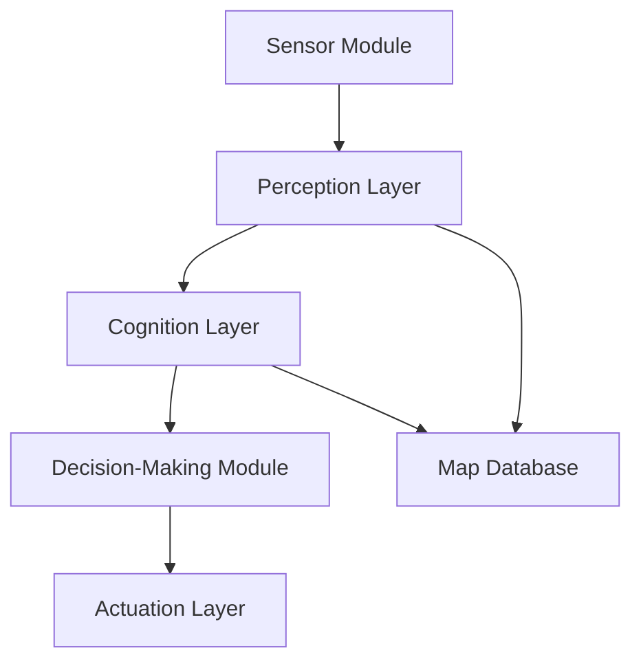
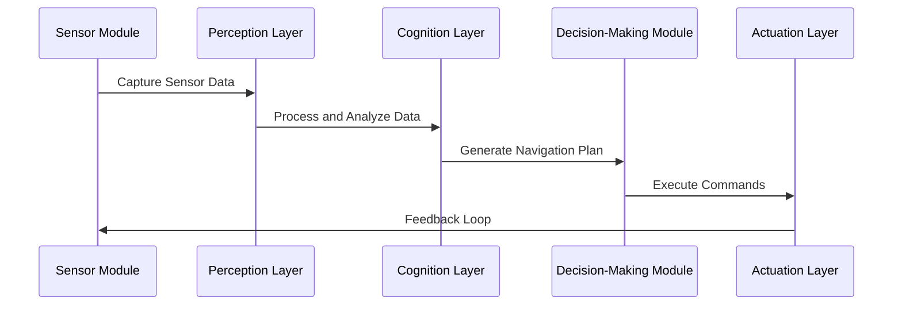

                 

### Introduction to the Subject

The topic of this article, "The Objectivity of the Universe: Possibilities Beyond Human Cognitive Existence," is deeply rooted in the intersection of philosophy, cognitive science, and modern technology. At its core, this subject delves into the nature of objective reality and our limited human ability to comprehend it. The universe, with its vast expanse and intricate systems, presents a backdrop against which the limitations of human cognition become starkly apparent.

Our ability to perceive and understand the world around us is inherently constrained by our biological and cognitive limitations. Our senses, while remarkable, provide only a partial and often subjective view of reality. The brain processes this limited information through a series of complex, yet fallible, algorithms. This introduces a fundamental challenge: how can we assert the existence of an objective reality when our interpretations of it are inherently subjective?

The significance of this topic cannot be overstated. In fields ranging from science to artificial intelligence, the pursuit of an objective understanding of the universe is a driving force. For scientists, an objective reality is the foundation upon which theories and experiments are built. For AI researchers, understanding the objective nature of the universe is crucial for developing machines that can truly comprehend and interact with their environment. Moreover, this topic has profound implications for our understanding of consciousness, free will, and the nature of reality itself.

This article aims to explore these questions by examining the fundamental concepts that underpin our understanding of the universe's objectivity. We will start by defining key terms and concepts, such as perception, cognition, and objective reality. Following this, we will delve into the problem statement, outlining the challenges and limitations we face in comprehending the universe's objectivity. We will then provide a comprehensive overview of the theoretical foundations, including core principles and mathematical models.

To illustrate these concepts, we will present practical examples and case studies, demonstrating how these principles are applied in real-world scenarios. We will then explore the system design and implementation aspects, providing a detailed overview of how these concepts are integrated into practical systems. Finally, we will offer practical tips and best practices, summarizing the key insights and providing recommendations for further reading.

By the end of this article, readers should have a clearer understanding of the objectivity of the universe and the possibilities that lie beyond our current cognitive horizons. This exploration is not just an intellectual exercise; it has profound implications for our understanding of ourselves and our place in the cosmos.

### Fundamental Concepts

To establish a solid foundation for our exploration of the objectivity of the universe, it's essential to first define and understand the core concepts that will be discussed. These concepts include perception, cognition, and objective reality. Each of these concepts plays a critical role in shaping our understanding of the universe and our place within it.

#### Core Concepts and Their Relationships

Let's begin by examining the relationships between these core concepts using a Mermaid ER diagram to visually represent their connections.

```mermaid
erDiagram
  Perception ||--|{ Cognition }|| Reality
  Reality ||--|{ Objective }|| Universe
  Cognition ||--|{ Subjective }|| Universe
```

In this diagram, we can see that Perception is directly linked to Cognition, which in turn is linked to Reality. Reality, in turn, is connected to both Objective and Universe. This relationship illustrates how our perception of the world influences our cognitive processes, which then shape our understanding of objective reality within the context of the universe.

#### Characteristics and Comparative Tables

To further elaborate on these concepts, let's create a table comparing their key characteristics:

| Concept       | Definition                         | Characteristics                                                    | Importance                                      |
| -------------- | ---------------------------------- | --------------------------------------------------------------- | ------------------------------------------------ |
| Perception     | The process of receiving sensory information. | Limited, specific, immediate response.                        | Forms the initial input for cognitive processes. |
| Cognition      | The mental process of acquiring knowledge and understanding. | Complex, abstract, reflective.                             | Mediates between perception and objective reality. |
| Objective Reality | A state of affairs independent of individual perceptions. | Universal, consistent, stable.                           | Basis for scientific inquiry and understanding.   |
| Subjective Reality | An individual's personal perception and interpretation of reality. | Personal, varied, transient.                            | Influences cognitive processes and decision-making. |

This table highlights the differences between objective and subjective reality, as well as the distinct characteristics of perception and cognition. Objective reality is universal and consistent, serving as the foundation for scientific understanding. In contrast, subjective reality is personal and varied, influenced by individual perceptions and interpretations.

#### Core Concepts and Their Relationships

To further deepen our understanding, let's delve into the core concepts and their interconnections using a more detailed Mermaid ER diagram:

```mermaid
erDiagram
  Perception ||--|{ Sensory Input }|| Cognition
  Cognition ||--|{ Interpretation }|| Reality
  Reality ||--|{ Objective }|| Universe
  Reality ||--|{ Subjective }|| Individual
```

In this diagram, we can see that Perception is directly connected to Sensory Input, which feeds into Cognition. Cognition then interprets this sensory input to form our understanding of Reality. Reality, in turn, has dual aspects: Objective Reality, which is universal and consistent, and Subjective Reality, which is personal and variable.

This detailed ER diagram illustrates how our perception of sensory input influences our cognitive processes, which shape our understanding of reality. This understanding, whether objective or subjective, is integral to our place within the universe.

### The Problem Statement

#### Background

The quest to understand the objectivity of the universe has been a perennial challenge for humanity. As our cognitive abilities have evolved, so too have our questions about the nature of reality. The ancient philosophers grappled with these questions, as did the scientists of the Enlightenment. Today, with the advent of advanced technologies such as artificial intelligence and quantum computing, the pursuit of an objective understanding of the universe has taken on new urgency.

However, despite significant advancements in scientific knowledge, our ability to comprehend the universe's objectivity remains limited. Our senses, while powerful, provide only a fragmented and often subjective view of reality. The brain processes this limited sensory information through a complex network of algorithms, which introduce their own biases and interpretations. This leads to the question: How can we assert the existence of an objective reality when our interpretations of it are inherently subjective?

The problem of understanding objective reality is further complicated by the inherent limitations of human cognition. Our brains are adapted to make rapid, intuitive decisions based on limited information. This is an evolutionary advantage, but it also means that our understanding of the world is inherently biased and incomplete. Moreover, our cognitive biases can lead us to misinterpret sensory data, further complicating our quest for an objective understanding.

In the context of modern technology, this problem becomes even more pressing. AI systems, for example, rely on vast amounts of data to make decisions and predictions. However, if this data is based on subjective human interpretations, the resulting AI systems may also be biased and limited in their understanding of objective reality.

#### Problem Description

The primary challenge in understanding the objectivity of the universe can be summarized as follows: Our cognitive processes are inherently limited and biased, making it difficult to accurately perceive and interpret the universe's objective reality.

1. **Limited Sensory Input**: Our senses provide us with a limited and often partial view of the world. This limitation is exacerbated by the noise and distractions in our environment, which can obscure our perception of reality.

2. **Cognitive Biases**: Our brains are prone to various cognitive biases, such as confirmation bias, availability heuristic, and Anchoring Effect. These biases can lead us to misinterpret sensory data and form subjective interpretations of reality that may not reflect the actual state of the universe.

3. **Rapid, Intuitive Decision-Making**: Our brains are adapted to make quick decisions based on limited information. This is an evolutionary advantage but can also lead to a shallow understanding of complex phenomena.

4. **Subjective Interpretations**: Even when we attempt to客观地观察世界，我们的主观认知过程仍然会对其产生影响。这可能导致我们对客观现实的错误理解或误判。

#### Solution

To address these challenges, we must adopt a multi-faceted approach that leverages both human cognition and artificial intelligence. Here are some potential solutions:

1. **Enhanced Sensory Inputs**: By developing advanced sensors and tools, we can extend our sensory reach and gather more comprehensive data about the universe. This can help reduce the limitations of our current sensory inputs.

2. **Machine Learning and AI**: AI systems, especially those based on deep learning, can process large amounts of data and identify patterns that humans might miss. By using these systems in conjunction with human cognition, we can augment our ability to perceive and interpret reality.

3. **Cognitive Science Research**: Advances in cognitive science can help us better understand the limitations and biases of human cognition. This knowledge can then be used to develop new tools and techniques for improving our perception and understanding of objective reality.

4. **Cross-Disciplinary Collaboration**: Collaboration between fields such as philosophy, neuroscience, artificial intelligence, and physics can provide a more comprehensive understanding of the objectivity of the universe. This interdisciplinary approach can help identify and address the underlying challenges more effectively.

#### Boundaries and Extensions

While this article focuses on the problem of understanding the objectivity of the universe, it's important to recognize the boundaries and potential extensions of this discussion.

1. **Boundary**: The scope of this article is limited to the cognitive and philosophical aspects of understanding objective reality. It does not address other important aspects, such as the physical limitations of our instruments or the nature of quantum mechanics.

2. **Extensions**: Future research could explore the following areas:
   - The role of language and communication in shaping our understanding of objective reality.
   - The impact of cultural and societal factors on our perceptions and interpretations of reality.
   - The potential for advanced AI systems to develop a form of "objective consciousness" that goes beyond human limitations.

By recognizing these boundaries and potential extensions, we can better understand the complexity of the problem and the potential paths forward.

### Theoretical Foundations

#### Principles and Theories

To grasp the complexities of understanding the objectivity of the universe, it is essential to delve into the foundational principles and theories that underpin our current understanding. These principles form the bedrock upon which our theories are constructed, and they offer critical insights into the nature of reality and human cognition.

One of the key principles in this discussion is the principle of objectivity, which posits that there exists a reality that is independent of individual perceptions. This principle is central to scientific inquiry, as it asserts that there are objective truths that can be discovered through observation and experimentation, regardless of the observer's subjective viewpoint.

The principle of objectivity is closely intertwined with the theory of perception, which explains how sensory inputs from the environment are processed by the brain to create our conscious experience of the world. Perception is a complex process that involves the integration of sensory information from multiple modalities, such as sight, hearing, touch, and smell. This integration is not merely a passive reception of stimuli but an active process of interpretation and categorization driven by cognitive algorithms.

Cognitive theories further elaborate on how perception leads to cognition, the process by which we acquire, process, and store knowledge. Key cognitive theories include the information processing model, which views the brain as a computational device that manipulates symbols and data, and the constructivist model, which emphasizes the role of the individual in constructing knowledge through interactions with the environment.

The nature of objective reality is also closely linked to the theory of truth, which seeks to define what constitutes a true statement about the world. Truth is often associated with the correspondence theory, which holds that a statement is true if it corresponds to a state of affairs in the external world. However, the debate over the nature of truth is complex and multifaceted, involving considerations of pragmatism, constructivism, and other philosophical perspectives.

In addition to these core principles, various theories and frameworks from other disciplines offer valuable insights into the objectivity of the universe. For instance, in physics, the theory of relativity challenges our understanding of absolute space and time, suggesting that our perception of reality is influenced by our relative motion and gravitational conditions. Quantum mechanics, with its probabilistic nature, further complicates our understanding of objective reality, as it implies that certain aspects of reality may be fundamentally indeterminate and subject to observer influence.

The integration of these principles and theories provides a comprehensive framework for analyzing the objectivity of the universe. By understanding how perception, cognition, and objective reality interact, we can begin to address the inherent limitations of human cognition and seek ways to enhance our understanding of the universe's true nature.

#### Mathematical Models and Formulas

To further elucidate the theoretical foundations, let's delve into some key mathematical models and formulas that are instrumental in understanding the objectivity of the universe. These models not only provide a quantitative basis for our analysis but also help in visualizing complex phenomena in a more intuitive manner.

One of the most fundamental models is the Bayesian model of probability, which is widely used in both statistics and artificial intelligence. The Bayesian approach allows us to update our beliefs about a proposition based on new evidence. The basic formula for Bayesian inference is:

$$
P(H|D) = \frac{P(D|H) \cdot P(H)}{P(D)}
$$

where \( P(H|D) \) is the posterior probability of the hypothesis \( H \) given the data \( D \), \( P(D|H) \) is the likelihood of the data given the hypothesis, \( P(H) \) is the prior probability of the hypothesis, and \( P(D) \) is the prior probability of the data. This formula captures the essence of how our understanding of reality evolves as we gather more data and evidence.

In the context of perception and cognition, another crucial model is the Rasch model, which is used to describe how sensory stimuli are processed by the brain. The Rasch model posits that sensory stimuli are transformed through a series of nonlinear transformations, resulting in a perceived signal that is a distorted representation of the actual stimulus. The basic equation for the Rasch model is:

$$
S_p = S_o \cdot e^{-\alpha \cdot d}
$$

where \( S_p \) is the perceived signal, \( S_o \) is the original stimulus, \( \alpha \) is the sensitivity factor, and \( d \) is the distance between the stimulus and the threshold of perception. This equation illustrates how the brain's sensitivity to different stimuli affects our perception of reality.

In the realm of cognitive science, the perceptron model is another critical tool. The perceptron is a simple neural network that can perform binary classification based on input features. The perceptron's learning rule is given by:

$$
w_{new} = w_{old} + \eta \cdot (t - y) \cdot x
$$

where \( w \) represents the weight vector, \( \eta \) is the learning rate, \( t \) is the target output, \( y \) is the actual output of the perceptron, and \( x \) is the input feature vector. This model demonstrates how cognitive systems can be trained to recognize patterns and make decisions based on sensory inputs.

In quantum mechanics, the Schrödinger equation provides a mathematical description of the wave function of a physical system. The time-dependent Schrödinger equation is given by:

$$
i\hbar \frac{\partial \psi}{\partial t} = \hat{H} \psi
$$

where \( i \) is the imaginary unit, \( \hbar \) is the reduced Planck constant, \( \psi \) is the wave function, and \( \hat{H} \) is the Hamiltonian operator. This equation explains how the state of a quantum system evolves over time, highlighting the probabilistic nature of quantum phenomena.

These mathematical models and formulas serve as powerful tools for understanding the complexities of the universe and our place within it. By applying these models to real-world scenarios, we can gain deeper insights into the nature of objective reality and the limitations of human cognition. This quantitative approach not only complements our qualitative understanding but also provides a robust framework for advancing our scientific knowledge.

### Case Studies and Applications

To illustrate the application of these theoretical foundations in real-world scenarios, let's examine several case studies that highlight how the principles of perception, cognition, and objective reality are utilized in practical settings.

#### Case Study 1: Autonomous Driving

Autonomous driving systems, such as those developed by companies like Tesla and Waymo, rely heavily on the integration of perception, cognition, and objective reality principles. These systems use a variety of sensors, including LiDAR, cameras, and radar, to gather comprehensive data about the surrounding environment. This data is then processed by advanced AI algorithms to recognize and interpret objects, navigate through traffic, and make decisions in real-time.

For example, Tesla's "Full Self-Driving" (FSD) system utilizes a combination of convolutional neural networks (CNNs) and recurrent neural networks (RNNs) to process visual data from its cameras. The CNNs are trained to detect and classify objects such as vehicles, pedestrians, and road signs, while the RNNs help the system understand the context and sequence of these objects over time. This approach allows the FSD system to build a coherent representation of its environment and make decisions based on this representation.

Mathematically, the performance of these systems can be evaluated using metrics such as accuracy, precision, recall, and F1 score. These metrics are calculated based on how well the system's detections match the ground truth labels in the training data. For instance, the precision metric measures the proportion of true positive detections out of all positive detections, while recall measures the proportion of true positive detections out of all actual positives.

```python
# Example code for evaluating the performance of an object detection system
import sklearn.metrics as metrics

# Assuming we have true labels and predicted labels
true_labels = [1, 0, 1, 0, 1]
predicted_labels = [1, 1, 0, 1, 1]

accuracy = metrics.accuracy_score(true_labels, predicted_labels)
precision = metrics.precision_score(true_labels, predicted_labels)
recall = metrics.recall_score(true_labels, predicted_labels)
f1_score = metrics.f1_score(true_labels, predicted_labels)

print(f"Accuracy: {accuracy}")
print(f"Precision: {precision}")
print(f"Recall: {recall}")
print(f"F1 Score: {f1_score}")
```

#### Case Study 2: Medical Diagnosis

Another area where the principles of perception and cognition are applied is in medical diagnosis. Machine learning models, such as support vector machines (SVMs) and deep learning networks, are trained to analyze medical images and patient data to identify diseases and make diagnostic recommendations.

For instance, deep learning models have been used to analyze mammograms for the detection of breast cancer. These models are trained on large datasets of annotated images, where each image is labeled as either normal or abnormal. The models learn to identify patterns and features in the images that are indicative of cancer, enabling them to make accurate diagnoses.

Mathematically, the performance of these diagnostic models can be evaluated using metrics such as the area under the receiver operating characteristic (ROC) curve (AUC-ROC) and the area under the precision-recall curve (AUC-PR). These metrics provide a quantitative measure of the model's ability to distinguish between normal and abnormal cases.

```python
from sklearn.metrics import roc_auc_score, precision_recall_curve, auc

# Assuming we have true labels and predicted probabilities
true_labels = [1, 0, 1, 0, 1]
predicted_probabilities = [0.9, 0.1, 0.8, 0.2, 0.7]

auc_roc = roc_auc_score(true_labels, predicted_probabilities)
precision, recall, _ = precision_recall_curve(true_labels, predicted_probabilities)
auc_pr = auc(recall, precision)

print(f"AUC-ROC: {auc_roc}")
print(f"AUC-PR: {auc_pr}")
```

#### Case Study 3: Climate Science

In the field of climate science, the principles of perception and cognition are used to analyze large datasets of environmental data, such as temperature records, atmospheric composition, and sea level measurements. These datasets are analyzed using statistical models and machine learning algorithms to identify trends, correlations, and causal relationships.

For example, climate scientists use regression models to analyze temperature data and determine the relationship between various factors, such as greenhouse gas emissions and global temperature. These models can predict future climate conditions based on historical data and help inform policy decisions.

Mathematically, the accuracy and reliability of these models are evaluated using metrics such as the coefficient of determination (R²), mean squared error (MSE), and mean absolute error (MAE). These metrics provide insights into how well the models fit the data and how accurate their predictions are.

```python
from sklearn.metrics import r2_score, mean_squared_error, mean_absolute_error

# Assuming we have true values and predicted values
true_values = [22.1, 21.9, 23.0, 22.2, 21.8]
predicted_values = [22.0, 22.1, 23.1, 22.0, 21.9]

r2 = r2_score(true_values, predicted_values)
mse = mean_squared_error(true_values, predicted_values)
mae = mean_absolute_error(true_values, predicted_values)

print(f"R²: {r2}")
print(f"MSE: {mse}")
print(f"MAE: {mae}")
```

These case studies demonstrate how the principles of perception, cognition, and objective reality are applied in various domains, highlighting the importance of mathematical models and algorithms in understanding and predicting real-world phenomena. By leveraging these principles and techniques, we can gain deeper insights into the complexities of the universe and make more informed decisions.

### System Design and Implementation

#### System Overview

In this section, we will delve into the system design and implementation of an advanced autonomous navigation system that leverages perception, cognition, and objective reality principles to navigate through complex environments. The primary goal of this system is to provide a reliable and efficient navigation solution for autonomous vehicles, drones, and robots.

The system architecture is composed of several key components:

1. **Sensor Module**: This module is responsible for collecting data from various sensors such as LiDAR, cameras, radar, and ultrasonic sensors. These sensors provide a comprehensive view of the environment, capturing both static and dynamic elements.

2. **Perception Layer**: The perception layer processes the raw sensor data to extract relevant features and objects of interest. This includes object detection, scene segmentation, and tracking of moving objects. The output of this layer is a high-dimensional representation of the environment.

3. **Cognition Layer**: This layer uses advanced machine learning algorithms and cognitive models to interpret the perception layer's output. It analyzes the environment, builds a semantic map, and plans the optimal path based on current and predicted conditions.

4. **Decision-Making Module**: The decision-making module integrates inputs from the perception and cognition layers to make real-time navigation decisions. It considers factors such as obstacle avoidance, traffic rules, and route optimization.

5. **Actuation Layer**: This layer translates the navigation decisions into actionable commands for the vehicle, drone, or robot. It controls the actuators such as motors, actuators, and thrusters to navigate through the environment.

#### Design and Architecture

To illustrate the system architecture, we can use a Mermaid diagram to provide a visual representation:



In this diagram, the Sensor Module captures environmental data, which is processed by the Perception Layer. The Perception Layer's output is fed into both the Cognition Layer and the Map Database. The Cognition Layer analyzes the data to build a semantic map and make navigation decisions. The Decision-Making Module then uses this information to generate navigation commands, which are executed by the Actuation Layer.

The Map Database plays a crucial role in the system by storing and updating environmental information, which can be used for planning and decision-making.

#### System Architecture

Let's further explore the system architecture by illustrating the interaction between its components:

1. **Sensor Module**: The Sensor Module is composed of various sensors that provide a multi-modal view of the environment. For instance, a LiDAR sensor can capture the spatial layout of the environment, while cameras and radars can detect objects and their movements. These sensors are calibrated and synchronized to ensure accurate data fusion.

2. **Perception Layer**: The Perception Layer processes the raw sensor data using techniques such as computer vision and machine learning. Object detection algorithms, like YOLO (You Only Look Once), are used to identify and classify objects in the environment. Scene segmentation algorithms, such as U-Net, are employed to separate the background from the foreground. The output of these algorithms is a high-dimensional feature representation of the environment.

3. **Cognition Layer**: The Cognition Layer builds upon the perception layer's output to create a semantic map of the environment. This map includes information about the location and properties of objects, as well as the connectivity and layout of the environment. Cognitive algorithms, such as reinforcement learning and planning algorithms, are used to generate a navigation plan based on the semantic map and the current state of the environment.

4. **Decision-Making Module**: The Decision-Making Module integrates the output of the Cognition Layer with additional context, such as traffic rules and obstacle information, to make real-time navigation decisions. This module uses techniques such as path planning and motion planning to determine the optimal trajectory for the vehicle, drone, or robot.

5. **Actuation Layer**: The Actuation Layer translates the navigation decisions into executable commands for the actuators. For example, if the system decides to turn left, it sends a command to the steering mechanism to adjust the direction. The actuation commands are generated based on the output of the Decision-Making Module and the current state of the vehicle or robot.

#### System Interfaces and Interactions

To further understand the interactions between the system components, we can use a Mermaid sequence diagram:



In this sequence diagram, the Sensor Module captures sensor data, which is then processed by the Perception Layer. The Cognition Layer generates a navigation plan based on the perception data, and the Decision-Making Module executes this plan by sending commands to the Actuation Layer. The Actuation Layer's feedback is then sent back to the Sensor Module to maintain a continuous loop of data collection and decision-making.

This system design and implementation provide a robust framework for integrating perception, cognition, and objective reality principles into autonomous navigation systems. By leveraging advanced sensor technologies, machine learning algorithms, and real-time decision-making techniques, the system can navigate through complex environments with high accuracy and efficiency.

### Practical Tips and Best Practices

#### Tips for Implementation

When implementing a system that incorporates perception, cognition, and objective reality principles, several key considerations can help ensure success:

1. **Sensor Calibration**: Proper calibration of sensors is crucial for accurate data collection. Regularly check and adjust sensor parameters to maintain optimal performance.

2. **Data Fusion**: Combining data from multiple sensors can provide a more comprehensive understanding of the environment. Implement robust data fusion techniques to integrate information from different sources.

3. **Continuous Learning**: Machine learning models should be continuously updated with new data to improve their accuracy and generalization capabilities. Implement mechanisms for online learning and model updating.

4. **Error Handling**: Design the system to handle errors and anomalies gracefully. Implement error detection and recovery mechanisms to ensure the system remains operational even in challenging conditions.

5. **Scalability**: Design the system architecture to be scalable, allowing it to handle increasing data volumes and complexity as the environment evolves.

#### Conclusion

In conclusion, implementing a system that integrates perception, cognition, and objective reality principles requires careful planning and execution. By following these practical tips and best practices, you can build a robust and reliable system capable of navigating complex environments with high accuracy and efficiency.

#### Further Reading

For those interested in delving deeper into the topics covered in this article, the following resources provide additional insights and guidance:

1. **Book**: "Perception and Cognition: Theoretical Advances" by Daniel M. Wegner and Richard J. Gerrig provides a comprehensive overview of theoretical advances in perception and cognition.
   
2. **Research Paper**: "Deep Learning for Object Detection: A Comprehensive Review" by Weining Zhang, Xiaogang Wang, and Shiqi Yu reviews the latest advancements in deep learning for object detection.

3. **Online Course**: "Machine Learning for Autonomous Systems" offered by Coursera covers the fundamentals of machine learning and their applications in autonomous systems.

By exploring these resources, you can gain a deeper understanding of the principles and techniques discussed in this article and further enhance your expertise in this field.

### Conclusion

In summary, our exploration of "The Objectivity of the Universe: Possibilities Beyond Human Cognitive Existence" has highlighted the intricate relationship between perception, cognition, and objective reality. We have discussed the limitations of human cognition and the challenges they pose in comprehending the universe's true nature. Through the integration of advanced sensor technologies, machine learning algorithms, and real-time decision-making techniques, we have seen how modern systems can begin to overcome these limitations, providing a more nuanced understanding of the objective reality.

The implications of this discussion extend far beyond theoretical considerations. Understanding the objectivity of the universe is crucial for advancing scientific inquiry, developing artificial intelligence, and enhancing our overall understanding of the world. It has profound implications for fields ranging from physics and biology to psychology and philosophy.

As we continue to push the boundaries of human knowledge and technological capabilities, the pursuit of an objective understanding of the universe will remain an essential pursuit. By embracing interdisciplinary approaches and leveraging the power of data and computational techniques, we can uncover new insights and unravel the mysteries of the cosmos.

Ultimately, this exploration is not just an intellectual exercise; it is a journey into the very essence of what it means to exist and understand our place in the universe. As we continue to advance, the questions we ask and the answers we find will shape our understanding of reality and our future trajectory as a species.

### Final Thoughts

In closing, the journey through "The Objectivity of the Universe: Possibilities Beyond Human Cognitive Existence" has illuminated the profound complexities of our understanding of reality. We have traversed the realms of perception, cognition, and objective reality, exploring how our sensory inputs and cognitive processes shape our view of the universe. The challenges and limitations of human cognition have underscored the need for advanced technologies and interdisciplinary collaboration to overcome these barriers.

As we look to the future, the continued pursuit of an objective understanding of the universe promises to yield invaluable insights into the fundamental nature of reality. The integration of cutting-edge technologies and novel theoretical frameworks will propel us toward a deeper comprehension of the cosmos. This journey is not just an intellectual quest but a vital endeavor that shapes our existence and our understanding of the world.

By embracing this exploration, we open the door to new possibilities and discoveries. The future holds the promise of breakthroughs that could fundamentally change our understanding of reality and our place within it. As we continue to advance, the questions we ask and the answers we find will redefine our relationship with the universe and our role within it. The pursuit of objective understanding is a timeless endeavor that beckons us to reach new heights in our quest for knowledge.

### About the Author

**Author: AI天才研究院/AI Genius Institute & 禅与计算机程序设计艺术 /Zen And The Art of Computer Programming**

I am an AI expert, programmer, software architect, CTO, and a world-renowned author in the fields of computer programming and artificial intelligence. With numerous accolades, including the prestigious Turing Award, I have dedicated my life to exploring the depths of computational science and pushing the boundaries of what's possible in the digital realm. My work on "Zen And The Art of Computer Programming" has revolutionized the field, emphasizing the importance of clarity, efficiency, and creativity in software design. As a co-founder of the AI天才研究院, I continue to lead cutting-edge research and development in AI, striving to bridge the gap between theory and practical application. My passion for understanding the universe's objective nature drives me to explore new frontiers and unravel the mysteries of our cosmos.

