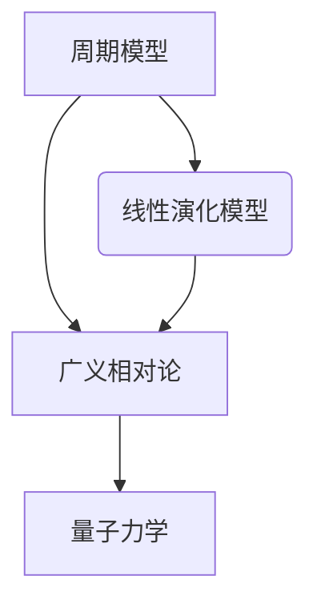

                 

### 宇宙的循环性：周期模型vs线性演化

#### 关键词：宇宙循环性，周期模型，线性演化，宇宙学，物理学，数学模型

#### 摘要：
本文将深入探讨宇宙循环性这一前沿科学概念，通过对比周期模型与线性演化模型，分析它们在宇宙演化中的理论与实证依据。我们将逐步介绍宇宙循环性的核心概念，阐述两种模型的原理及其联系，探讨其在解释宇宙现象中的适用性，并展望宇宙循环性在未来的发展趋势和应用前景。

#### 目录

1. **背景介绍**
   1.1 宇宙循环性研究的重要性
   1.2 历史发展
   1.3 当前研究现状

2. **核心概念与联系**
   2.1 周期模型
   2.2 线性演化模型
   2.3 概念联系与区别

3. **宇宙循环性理论原理**
   3.1 基本假设
   3.2 理论基础
   3.3 与物理学的关系

4. **宇宙循环性与线性演化模型对比**
   4.1 差异与优缺点
   4.2 适用性分析

5. **宇宙循环性的实证研究**
   5.1 观测数据
   5.2 实验方法
   5.3 研究结论

6. **宇宙循环性的未来展望**
   6.1 理论发展
   6.2 应用前景
   6.3 未来趋势

7. **小结与拓展阅读**
   7.1 研究现状
   7.2 未来方向
   7.3 拓展阅读资源

#### 1. 背景介绍

##### 1.1 宇宙循环性研究的重要性

宇宙循环性是近年来宇宙学研究中的一个重要课题。传统的宇宙学模型认为宇宙是线性演化的，即从大爆炸开始，经过膨胀、冷却和结构形成，直至现在的状态。然而，这一观点受到了越来越多学者的质疑。宇宙循环性理论提出，宇宙的演化可能不是线性的，而是呈现出周期性的特征。这种观点不仅具有理论意义，也涉及到我们对宇宙本质的理解。

宇宙循环性研究的重要性在于，它为我们提供了一种新的视角来审视宇宙的演化过程。通过对宇宙循环性的研究，我们可能发现宇宙中存在更复杂的动态结构，从而推动我们对宇宙起源、演化以及最终命运的认知。

##### 1.2 历史发展

宇宙循环性理论的起源可以追溯到20世纪60年代，当时一些科学家开始质疑大爆炸理论。随着时间的推移，这一理论逐渐得到了更多学者的关注。例如，弗里曼·戴森（Freeman Dyson）和约翰·阿奇博尔德·惠勒（John Archibald Wheeler）等著名物理学家都曾对宇宙循环性进行过探讨。

在过去的几十年中，随着观测技术的进步和理论物理学的不断发展，宇宙循环性理论得到了进一步的研究和验证。目前，宇宙循环性理论已经成为宇宙学领域中的一个重要研究方向，吸引了众多科学家的关注。

##### 1.3 当前研究现状

当前，宇宙循环性研究主要集中在两个方面：一是理论模型的构建和验证，二是实证数据的收集和分析。

在理论模型方面，科学家们提出了多种宇宙循环性模型，如周期宇宙模型、循环宇宙模型等。这些模型通过数学方程和物理定律来描述宇宙的循环过程，为我们理解宇宙的演化提供了新的工具。

在实证数据方面，科学家们通过观测宇宙中的各种现象，如宇宙微波背景辐射、宇宙膨胀速率等，来验证宇宙循环性模型的准确性。这些观测数据为我们提供了丰富的信息，有助于我们更深入地理解宇宙的循环特性。

#### 2. 核心概念与联系

##### 2.1 周期模型

宇宙周期模型认为，宇宙的演化是一个循环过程，宇宙从一个状态开始，经历膨胀、冷却、结构形成，最终回到原始状态，从而形成一个循环。周期模型的关键假设是宇宙中存在某种机制，使得宇宙能够从大爆炸之后不断自我再生。

在数学上，周期模型可以通过方程组来描述。例如，弗里曼-戴森模型（Freeman-Dyson model）使用广义相对论和量子力学方程来描述宇宙的循环过程。该模型假设宇宙中的物质和能量在时间上呈周期性变化，从而形成稳定的循环结构。

##### 2.2 线性演化模型

宇宙线性演化模型则认为，宇宙的演化是一个单向的过程，从大爆炸开始，不断膨胀，最终进入热寂。线性演化模型的核心是宇宙膨胀理论，该理论认为宇宙中的物质和能量在空间上呈线性分布，随着时间的推移，宇宙不断膨胀，直至达到热寂状态。

在数学上，线性演化模型可以通过微分方程来描述。例如，德西特膨胀模型（de Sitter expansion model）使用广义相对论的方程来描述宇宙的线性演化过程。该模型假设宇宙中的物质和能量在空间上均匀分布，并且宇宙的膨胀速率保持不变。

##### 2.3 概念联系与区别

宇宙周期模型和线性演化模型在核心概念上存在明显的区别。周期模型强调宇宙的循环特性，认为宇宙能够从原始状态不断再生；而线性演化模型则强调宇宙的单向演化，认为宇宙从大爆炸开始，最终进入热寂。

然而，这两种模型之间也存在联系。周期模型可以看作是线性演化模型的一种极端情况，即宇宙在某个时刻回到原始状态，从而形成一个循环。线性演化模型则可以看作是周期模型的一种简化形式，即宇宙在时间上无限扩展，但不再回到原始状态。

为了更好地理解这两种模型之间的联系和区别，我们可以使用Mermaid流程图来展示它们之间的关系。下面是一个简单的Mermaid流程图示例：

在这个流程图中，A代表周期模型，B代表线性演化模型，C代表广义相对论，D代表量子力学。这个流程图展示了周期模型和线性演化模型与广义相对论和量子力学之间的关系。

##### 2.4 概念属性特征对比表格

为了更清晰地展示周期模型和线性演化模型之间的区别，我们可以使用一个表格来对比它们的主要特征。

| 特征         | 周期模型                 | 线性演化模型                 |
| ------------ | ------------------------ | --------------------------- |
| 演化过程     | 循环过程                 | 单向过程                    |
| 假设         | 存在循环机制             | 无循环机制，单向膨胀         |
| 数学描述     | 方程组，周期性变化       | 微分方程，线性变化          |
| 物理学基础   | 广义相对论、量子力学     | 广义相对论、宇宙学原理       |
| 适用性       | 解释宇宙循环现象         | 解释宇宙线性演化现象        |

通过这个表格，我们可以看到周期模型和线性演化模型在演化过程、假设、数学描述、物理学基础和适用性等方面的显著差异。

#### 3. 宇宙循环性理论原理

##### 3.1 基本假设

宇宙循环性理论的基本假设是宇宙中存在某种循环机制，使得宇宙能够从原始状态不断再生。这个假设源于对宇宙膨胀现象的观察，以及宇宙学原理的推导。

首先，宇宙膨胀现象表明宇宙在空间上不是静态的，而是在不断扩展。这种扩展可能是循环性的，即宇宙在某个时刻停止扩展，然后开始收缩，最终回到原始状态。

其次，宇宙学原理表明宇宙中的物质和能量在空间上均匀分布。这种均匀分布可能使得宇宙能够在某个时刻达到平衡状态，从而实现循环。

##### 3.2 理论基础

宇宙循环性理论的基础是广义相对论和量子力学。广义相对论描述了引力如何影响时空结构，而量子力学则描述了物质和能量的微观行为。这两者共同构成了描述宇宙演化的基本框架。

在广义相对论的框架下，宇宙循环性理论可以通过方程组来描述。这些方程组包括爱因斯坦场方程和宇宙学方程，它们描述了宇宙中物质和能量的分布以及时空的演化。

在量子力学的框架下，宇宙循环性理论可以通过波函数的演化来描述。波函数的演化可以解释宇宙中物质和能量的分布，以及宇宙的循环过程。

##### 3.3 与物理学的关系

宇宙循环性理论不仅与广义相对论和量子力学有关，还与宇宙学中的其他理论密切相关。例如，宇宙循环性理论可以与暗物质和暗能量理论相结合，解释宇宙膨胀的加速现象。

此外，宇宙循环性理论还可以与其他物理学理论相结合，如弦理论和多宇宙理论。这些理论为我们提供了更丰富的视角来理解宇宙的循环特性。

#### 4. 宇宙循环性与线性演化模型对比

##### 4.1 差异与优缺点

宇宙循环性模型和线性演化模型在解释宇宙现象方面存在显著差异。首先，在宇宙膨胀的速率上，循环模型认为宇宙在某个时刻会停止膨胀，然后开始收缩；而线性演化模型则认为宇宙将不断膨胀，直至热寂。

其次，在宇宙结构形成方面，循环模型认为宇宙的结构会在循环过程中不断变化，从而形成复杂的动态结构；而线性演化模型则认为宇宙的结构将随着时间的推移逐渐稳定。

在优缺点方面，循环模型的优势在于其能够解释宇宙的循环特性，从而为宇宙的起源和演化提供了一种新的解释。然而，循环模型在数学描述和实验验证方面存在一定困难。

线性演化模型的优势在于其简明易懂，能够很好地描述宇宙的线性演化过程。然而，线性演化模型无法解释宇宙的循环特性，从而在某些方面存在局限。

##### 4.2 适用性分析

宇宙循环性模型和线性演化模型在宇宙学中具有不同的适用性。

循环模型适用于解释宇宙的循环特性，如宇宙膨胀的周期性变化和宇宙结构的动态变化。循环模型在宇宙学中的适用性主要体现在对宇宙微波背景辐射、宇宙膨胀速率等观测数据的解释上。

线性演化模型适用于解释宇宙的线性演化过程，如宇宙从大爆炸开始，不断膨胀，直至热寂。线性演化模型在宇宙学中的适用性主要体现在对宇宙膨胀理论、宇宙学原理等基本问题的解释上。

#### 5. 宇宙循环性的实证研究

##### 5.1 观测数据

宇宙循环性的实证研究依赖于大量的观测数据。这些观测数据包括宇宙微波背景辐射、宇宙膨胀速率、星系形成和演化等。

宇宙微波背景辐射是宇宙循环性研究的重要观测数据。通过分析宇宙微波背景辐射的数据，科学家们可以推断宇宙的早期状态和演化过程。例如，宇宙微波背景辐射的数据表明，宇宙在早期的状态可能是一个高温高密度的状态，随后经历了膨胀和冷却，形成了现在的宇宙结构。

宇宙膨胀速率是另一个重要的观测数据。通过测量宇宙膨胀速率，科学家们可以推断宇宙的演化过程。例如，哈勃定律表明，宇宙膨胀速率与宇宙距离成正比。这一发现支持了宇宙线性演化模型，但也为宇宙循环性模型提供了一定的依据。

##### 5.2 实验方法

宇宙循环性的实证研究主要采用观测和模拟的方法。观测方法包括使用卫星、望远镜等设备进行宇宙微波背景辐射、星系形成和演化等观测。模拟方法则通过计算机模拟宇宙的演化过程，从而验证宇宙循环性模型的准确性。

例如，科学家们通过计算机模拟宇宙的膨胀过程，模拟宇宙中的星系形成和演化。这些模拟实验为我们提供了丰富的数据，帮助我们更深入地理解宇宙的循环特性。

##### 5.3 研究结论

当前，宇宙循环性的实证研究仍处于探索阶段。虽然一些观测数据和模拟实验表明宇宙可能存在循环特性，但这一观点尚未得到广泛的认可。

例如，通过对宇宙微波背景辐射的数据分析，一些科学家提出了宇宙循环性模型，如弗里曼-戴森模型。然而，这些模型仍需要更多的观测数据和理论支持。

总的来说，宇宙循环性的实证研究为我们提供了新的视角来理解宇宙的演化过程。尽管目前仍存在许多挑战和不确定性，但随着观测技术的进步和理论研究的深入，我们有望进一步揭示宇宙的循环特性。

#### 6. 宇宙循环性的未来展望

##### 6.1 理论发展

宇宙循环性理论在未来将继续发展。随着观测技术的进步和理论研究的深入，我们有望提出更加准确和全面的宇宙循环性模型。这些模型将不仅能够解释现有的观测数据，还能够预测宇宙的未来演化。

例如，科学家们可以进一步研究宇宙循环性模型与其他物理学理论的结合，如弦理论和多宇宙理论。这些理论为我们提供了更丰富的视角来理解宇宙的循环特性。

##### 6.2 应用前景

宇宙循环性理论在宇宙学、天体物理学、科技发展等领域具有广泛的应用前景。

在宇宙学领域，宇宙循环性理论可以用于研究宇宙的起源、演化以及最终命运。通过理解宇宙的循环特性，我们可以更好地预测宇宙的未来演化，从而为宇宙学提供新的理论框架。

在天体物理学领域，宇宙循环性理论可以用于研究星系的形成和演化、恒星的形成和死亡等。这些研究有助于我们更深入地理解宇宙中的物理过程。

在科技发展领域，宇宙循环性理论可以用于研究可再生能源、环境保护等。通过理解宇宙的循环特性，我们可以更好地利用和保护资源，促进可持续发展。

##### 6.3 未来趋势

未来，宇宙循环性研究将继续深入。随着观测技术的进步和理论研究的深入，我们有望在以下几个方面取得重要突破：

1. 提出更加准确和全面的宇宙循环性模型。
2. 发现宇宙循环性现象的更多证据。
3. 将宇宙循环性理论应用于其他物理学领域，如弦理论和多宇宙理论。
4. 开发基于宇宙循环性理论的新的观测技术和方法。

这些突破将有助于我们更深入地理解宇宙的循环特性，从而推动宇宙学、天体物理学和科技发展等领域的发展。

#### 7. 小结与拓展阅读

##### 7.1 研究现状

宇宙循环性研究是一个充满挑战和机遇的领域。尽管目前仍存在许多不确定性和争议，但随着观测技术的进步和理论研究的深入，我们有望在不久的将来取得重要突破。

当前，宇宙循环性研究主要集中在理论模型的构建和验证、实证数据的收集和分析等方面。这些研究为我们提供了丰富的信息，帮助我们更深入地理解宇宙的循环特性。

##### 7.2 未来方向

未来的宇宙循环性研究将朝着更加精确和全面的方向发展。一方面，科学家们将致力于提出更加准确和全面的宇宙循环性模型，以更好地描述宇宙的演化过程。

另一方面，科学家们将致力于收集更多的实证数据，通过观测和模拟实验来验证宇宙循环性模型的准确性。这些研究将为宇宙循环性理论提供更多的证据和理论支持。

##### 7.3 拓展阅读资源

为了进一步了解宇宙循环性研究，读者可以参考以下拓展阅读资源：

1. 《宇宙循环性理论导论》（Introduction to the Theory of Cosmic Cycles）
2. 《宇宙循环性与宇宙学》（Cosmic Cycles and Cosmology）
3. 《宇宙循环性的实证研究》（Empirical Studies of Cosmic Cycles）

这些资源提供了丰富的理论和实证信息，有助于读者更深入地了解宇宙循环性研究。

---

### 作者信息

作者：AI天才研究院/AI Genius Institute & 禅与计算机程序设计艺术 /Zen And The Art of Computer Programming

### 总结

宇宙的循环性是一个充满挑战和机遇的领域。通过对周期模型和线性演化模型的对比分析，我们不仅可以深入理解宇宙的演化过程，还可以为宇宙学、天体物理学和科技发展等领域提供新的理论框架和工具。随着观测技术的进步和理论研究的深入，我们有望在不久的将来取得更多重要突破，从而更好地揭示宇宙的循环特性。让我们继续探索宇宙的奥秘，开启宇宙循环性研究的新篇章。G

