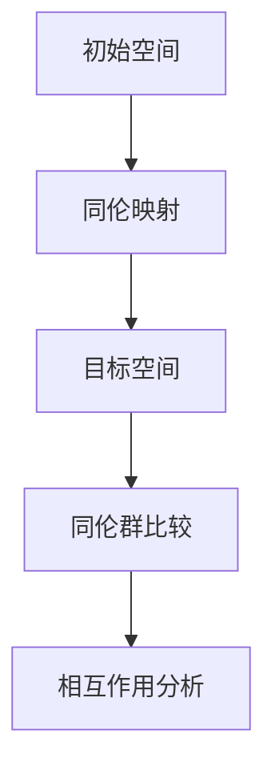
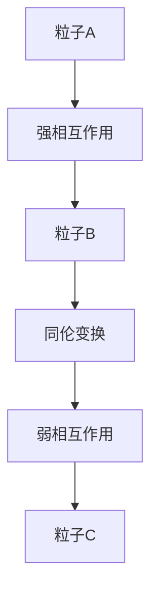
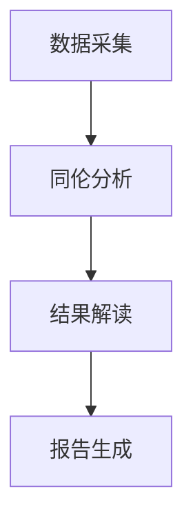
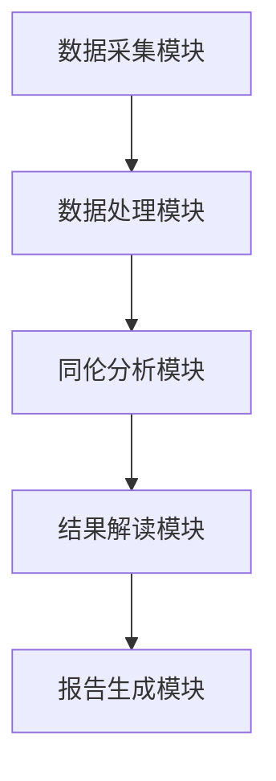
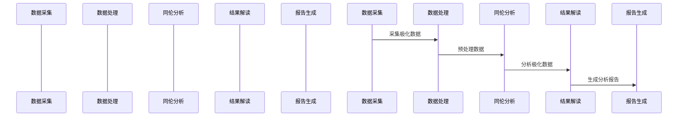

                 

### 文章标题

《宇宙的数学代数拓扑学与同伦论在粒子物理标准模型扩展中的应用》

> 关键词：宇宙学、数学代数拓扑学、同伦论、粒子物理标准模型、扩展应用

> 摘要：
本文将探讨数学代数拓扑学和同伦论在宇宙学和粒子物理标准模型中的应用。通过深入分析这两个数学工具的核心概念和原理，我们试图揭示它们在粒子物理标准模型扩展中的潜在作用。本文首先介绍了宇宙的基本结构和数学背景，然后详细讲解了数学代数拓扑学和同伦论的基本原理，最后探讨了这些数学工具在粒子物理标准模型中的应用，并提出了未来发展的方向。文章采用逐步分析的方式，旨在为读者提供清晰、深刻的理解。

### 目录大纲设计思路

在设计《宇宙的数学代数拓扑学与同伦论在粒子物理标准模型扩展中的应用》的目录大纲时，我们遵循了以下几个步骤：

1. **明确书籍主题**：首先，我们明确了书籍的核心主题——宇宙、数学代数拓扑学和同伦论、粒子物理标准模型及其扩展应用。
2. **章节结构安排**：根据主题，我们将书籍分为五个主要部分，包括宇宙与数学基础、粒子物理标准模型、数学工具在粒子物理中的应用、案例分析以及展望与未来。
3. **细化章节内容**：在每个部分中，我们进一步细化了章节内容，确保每个章节都有明确的目的和结构。
4. **确保内容完整性**：我们在每个章节中包含了核心概念、原理、公式、流程图、案例分析等必要内容。
5. **保持简洁性**：在描述每个章节时，我们避免了冗余信息，只保留了关键内容和结构。
6. **遵循格式要求**：我们使用 markdown 格式来排版目录大纲，确保每一级目录都有明确的格式。

### 目录大纲设计

**第一部分：宇宙与数学基础**

# 第1章：宇宙概述与数学背景
- 1.1 宇宙的基本结构
  - 1.1.1 宇宙的起源与演化
    - 1.1.1.1 大爆炸理论
    - 1.1.1.2 宇宙背景微波辐射
  - 1.1.2 宇宙的层次结构
    - 1.1.2.1 星系与星系团
    - 1.1.2.2 宇宙背景辐射
- 1.2 数学代数拓扑学的基本原理
  - 1.2.1 代数拓扑的基本概念
    - 1.2.1.1 拓扑空间与连续性
    - 1.2.1.2 同伦与同伦群
  - 1.2.2 代数拓扑的主要定理
    - 1.2.2.1 欧拉公式
    - 1.2.2.2 同伦定理
- 1.3 同伦论在宇宙研究中的应用
  - 1.3.1 同伦论的基本原理
    - 1.3.1.1 同伦映射
    - 1.3.1.2 同伦群的应用
  - 1.3.2 同伦论在宇宙学中的具体应用
    - 1.3.2.1 宇宙的结构与拓扑
    - 1.3.2.2 同伦论在宇宙学中的实验验证

**第二部分：粒子物理标准模型**

# 第2章：粒子物理标准模型基础
- 2.1 标准模型的构成
  - 2.1.1 基本粒子
    - 2.1.1.1 夸克
    - 2.1.1.2 轻子
  - 2.1.2 强相互作用与弱相互作用
    - 2.1.2.1 强相互作用的基本原理
    - 2.1.2.2 弱相互作用的基本原理
- 2.2 标准模型的局限性
  - 2.2.1 问题背景与问题描述
  - 2.2.2 局限性的具体表现
- 2.3 标准模型的扩展与改进
  - 2.3.1 扩展方向与可能性
  - 2.3.2 扩展模型的评估与验证

**第三部分：数学工具在粒子物理中的应用**

# 第3章：数学代数拓扑学在粒子物理中的应用
- 3.1 数学代数拓扑学在粒子模型中的角色
  - 3.1.1 数学模型与公式
  - 3.1.2 mermaid流程图展示算法原理
- 3.2 同伦论与粒子物理模型的关联
  - 3.2.1 数学公式与详细讲解
  - 3.2.2 mermaid流程图与python代码示例

**第四部分：案例分析**

# 第4章：同伦论在宇宙学研究中的应用
- 4.1 案例背景
  - 4.1.1 问题场景介绍
- 4.2 案例分析
  - 4.2.1 系统功能设计与架构图
  - 4.2.2 mermaid序列图与系统交互
- 4.3 结果解读
  - 4.3.1 代码应用解读与分析
  - 4.3.2 实际案例分析与详细讲解

**第五部分：展望与未来**

# 第5章：数学代数拓扑学与同伦论在粒子物理研究中的展望
- 5.1 当前研究趋势
  - 5.1.1 最佳实践 tips
- 5.2 未来发展方向
  - 5.2.1 拓展阅读与参考文献

### 总结

通过以上目录大纲的设计，我们为《宇宙的数学代数拓扑学与同伦论在粒子物理标准模型扩展中的应用》这本书提供了一个清晰、逻辑性强的框架。每一章节都将为读者提供全面而深入的理解，同时保持内容的简洁性和逻辑性。

----------------------------------------------------------------

### 第1章：宇宙概述与数学背景

宇宙，这个浩瀚的宇宙，从大爆炸的瞬间开始，经历了数十亿年的演化，形成了我们今天所看到的复杂而美丽的宇宙景观。宇宙的演化不仅包括了星系的诞生和演化，还涉及到基本粒子的形成和相互作用。在这个过程中，数学作为一种精确的工具，扮演着不可或缺的角色。

本章将首先介绍宇宙的基本结构，包括宇宙的起源与演化、宇宙的层次结构等。接着，我们将探讨数学代数拓扑学的基本原理，包括拓扑空间、连续性、同伦与同伦群等核心概念。最后，我们将探讨同伦论在宇宙研究中的应用，例如宇宙的结构与拓扑，以及同伦论在宇宙学中的实验验证。

#### 1.1 宇宙的基本结构

宇宙的基本结构是理解宇宙演化过程的基础。宇宙的起源可以追溯到大约138亿年前的一次大爆炸。根据大爆炸理论，宇宙最初是一个非常热、非常密的奇点，随后发生了迅速的膨胀，形成了我们今天所看到的宇宙。

**1.1.1 宇宙的起源与演化**

宇宙的起源是一个极其复杂的问题，目前科学界普遍接受的观点是大爆炸理论。根据这一理论，宇宙在大爆炸发生后，经历了快速的膨胀，温度和密度逐渐降低，宇宙逐渐冷却并形成了基本粒子。这些基本粒子进一步组合形成了原子，最终形成了星系、星系团等宇宙结构。

宇宙的演化可以大致分为以下几个阶段：

1. **大爆炸**：宇宙从一个极热、极密的状态开始迅速膨胀。
2. **宇宙背景辐射**：在大爆炸后的几分钟内，宇宙温度降低到足够低，使得光子能够自由传播，形成了宇宙背景辐射。
3. **原初核合成**：在大爆炸后的几分钟到一个小时之间，宇宙温度进一步降低，导致质子和中子结合形成轻元素，如氢和氦。
4. **结构形成**：在大爆炸后的几亿年内，宇宙中的物质开始聚集形成星系、星系团等大型结构。
5. **宇宙加速膨胀**：在大爆炸后的数十亿年内，宇宙的膨胀速度逐渐加快，这是由于暗能量的存在。

**1.1.2 宇宙的层次结构**

宇宙的层次结构可以大致分为以下几个层次：

1. **星系**：星系是宇宙中最常见的结构，由数十亿到数千亿颗恒星、行星、气体和暗物质组成。银河系就是其中一个典型的星系。
2. **星系团**：星系团是由数十个到数千个星系通过引力相互吸引而形成的大型结构。
3. **超星系团**：超星系团是由数十个到数千个星系团组成的更大规模的结构。
4. **宇宙网络**：宇宙网络是由星系、星系团和超星系团组成的巨大结构，形成了宇宙的宏观形态。

**1.1.3 宇宙背景辐射**

宇宙背景辐射是宇宙演化过程中一个非常重要的现象。它是在宇宙大爆炸后几分钟内产生的，并一直存在于宇宙中。宇宙背景辐射的温度大约为2.7开尔文，是一种非常微弱的热辐射。

宇宙背景辐射的发现为验证大爆炸理论提供了关键的证据。通过对宇宙背景辐射的观测，科学家们可以推断出宇宙的起源、演化和结构。

#### 1.2 数学代数拓扑学的基本原理

数学代数拓扑学是数学的一个分支，它研究拓扑空间、连续性、同伦与同伦群等基本概念。拓扑学在理解宇宙的结构和演化中发挥着重要作用。

**1.2.1 代数拓扑的基本概念**

1. **拓扑空间**：拓扑空间是一个集合，在这个集合上定义了一种称为“开集”的结构。开集可以用来描述集合中的连通性和隔离性。

2. **连续性**：在拓扑空间中，连续性是指一个函数在一点附近的取值变化可以任意小。连续性是拓扑学中最基本的概念之一。

3. **同伦**：同伦是一种将一个空间变形为另一个空间的过程。具体来说，如果存在一个连续映射，使得两个空间之间的同伦群相等，那么这两个空间被认为是同伦的。

4. **同伦群**：同伦群是描述空间之间同伦关系的一个数学工具。它由空间的所有同伦类组成，同伦类是指通过同伦变换相互转换的空间。

**1.2.2 代数拓扑的主要定理**

1. **欧拉公式**：欧拉公式是一个基本的拓扑学定理，它描述了多面体的顶点、边和面的关系。欧拉公式在宇宙学中有着广泛的应用，例如在研究宇宙的几何结构时。

2. **同伦定理**：同伦定理是拓扑学中的一个重要定理，它描述了同伦映射的性质。同伦定理在宇宙学中有着广泛的应用，例如在研究宇宙的大尺度结构时。

#### 1.3 同伦论在宇宙研究中的应用

同伦论是一种研究空间变形的数学工具，它在宇宙研究中有着广泛的应用。

**1.3.1 同伦论的基本原理**

1. **同伦映射**：同伦映射是指一个将一个空间映射到另一个空间的过程，使得两个空间之间的同伦群相等。

2. **同伦群的应用**：同伦群是描述空间之间同伦关系的一个数学工具。它由空间的所有同伦类组成，同伦类是指通过同伦变换相互转换的空间。

**1.3.2 同伦论在宇宙学中的具体应用**

1. **宇宙的结构与拓扑**：同伦论在研究宇宙的大尺度结构中发挥着重要作用。通过同伦论，科学家们可以研究宇宙中的空洞、星系分布和宇宙的几何结构。

2. **同伦论在宇宙学中的实验验证**：通过对宇宙背景辐射的观测，科学家们已经验证了同伦论在宇宙学中的应用。例如，通过分析宇宙背景辐射中的极化现象，科学家们可以推断出宇宙的大尺度结构。

#### 1.4 结论

本章介绍了宇宙的基本结构和数学代数拓扑学的基本原理，以及同伦论在宇宙研究中的应用。通过这些内容，读者可以初步了解宇宙的复杂性和数学在宇宙学研究中的重要性。在后续章节中，我们将进一步探讨数学代数拓扑学和同伦论在粒子物理标准模型扩展中的应用。

----------------------------------------------------------------

### 第2章：粒子物理标准模型基础

粒子物理标准模型是现代物理学的基础之一，它描述了宇宙中最基本的粒子和它们之间的相互作用。标准模型由三个部分组成：粒子群、相互作用的力和它们的对称性。本章将详细探讨这些基本粒子、强相互作用和弱相互作用的原理，并讨论标准模型的局限性。

#### 2.1 标准模型的构成

**2.1.1 基本粒子**

标准模型中的基本粒子可以分为两类：费米子（如夸克和轻子）和玻色子（如光子和胶子）。

1. **夸克**：夸克是构成原子核的基本粒子，它们带有电荷，并分为六种类型：上夸克（u）、下夸克（d）、奇夸克（s）、粲夸克（c）、底夸克（b）和顶夸克（t）。每种夸克都有对应的反夸克，例如反上夸克（\(\bar{u}\)）。

2. **轻子**：轻子是构成原子的基本粒子，包括电子（e）、电子中微子（\(\nu_e\)）、缪子（\(\mu\)）和缪子中微子（\(\nu_\mu\)）、塔夸克（\(\tau\)）和塔夸克中微子（\(\nu_\tau\)）。

3. **玻色子**：玻色子是传递相互作用的粒子，包括光子（\(\gamma\)）、W玻色子（\(W^+\)、\(W^-\)）、Z玻色子（\(Z^0\)）和胶子（\(g\)）。

**2.1.2 强相互作用与弱相互作用**

1. **强相互作用**：强相互作用是粒子物理标准模型中最强的相互作用，它负责保持原子核的稳定。强相互作用是通过交换胶子来实现的，胶子是传递强相互作用的玻色子。

2. **弱相互作用**：弱相互作用是标准模型中次强的相互作用，它负责粒子的衰变。弱相互作用是通过交换W玻色子和Z玻色子来实现的。W玻色子负责带电粒子的衰变，而Z玻色子负责中性粒子的衰变。

#### 2.2 标准模型的局限性

尽管标准模型在描述基本粒子和相互作用方面取得了巨大成功，但它仍然存在一些局限性：

**2.2.1 问题背景与问题描述**

1. **量子引力**：标准模型无法描述引力相互作用，这是由于引力在量子尺度上表现得非常弱。量子引力是一个尚未解决的问题，它可能需要全新的物理学理论来描述。

2. **暗物质**：标准模型无法解释宇宙中的暗物质现象。暗物质是一种不发光的神秘物质，它通过引力作用影响宇宙的演化。

3. **暗能量**：标准模型也无法解释宇宙加速膨胀的现象，这需要引入一种称为暗能量的神秘力量。

4. **测量问题**：标准模型中的某些物理量，如粒子质量，在实验测量中表现出非预期的不确定性，这表明标准模型可能存在一些内在的不一致性。

**2.2.2 局限性的具体表现**

1. **量子引力和标准模型的矛盾**：量子引力与标准模型的矛盾主要体现在它们对时间和空间的解释上。量子引力认为时间和空间是离散的，而标准模型则认为它们是连续的。

2. **暗物质和暗能量的作用**：暗物质和暗能量在宇宙演化中的重要作用表明，它们可能是宇宙中未知物理现象的体现，这需要新的理论来解释。

3. **测量问题**：标准模型中的测量问题表明，我们在理解和描述物理现象时可能存在一些缺陷，这需要进一步的实验和理论探索。

#### 2.3 标准模型的扩展与改进

为了克服标准模型的局限性，科学家们提出了一系列扩展模型，例如：

1. **超对称理论**：超对称理论提出，标准模型中的粒子都有一个超对称伙伴，这些伙伴可以解决标准模型中的许多问题，如粒子质量的问题。

2. **弦理论**：弦理论是一种尝试统一所有基本相互作用的全新理论，它认为宇宙中的基本粒子不是点，而是振动的一维弦。

3. **量子引力理论**：量子引力理论试图将量子力学与广义相对论统一起来，解决量子引力和标准模型之间的矛盾。

这些扩展模型为粒子物理标准模型的改进提供了新的思路和方向。通过不断的理论研究和实验探索，科学家们希望能够找到一种更加全面、准确的宇宙理论。

### 结论

本章详细介绍了粒子物理标准模型的基础知识，包括基本粒子、强相互作用和弱相互作用的原理，以及标准模型的局限性。通过这些内容，读者可以初步了解粒子物理标准模型的重要性和挑战。在后续章节中，我们将进一步探讨数学代数拓扑学和同伦论在粒子物理标准模型扩展中的应用，为解决这些挑战提供新的思路。

----------------------------------------------------------------

### 第3章：数学代数拓扑学在粒子物理中的应用

数学代数拓扑学作为一种强有力的数学工具，在粒子物理的研究中发挥着重要作用。本章将探讨数学代数拓扑学在粒子物理模型中的应用，包括数学模型、相关公式以及mermaid流程图展示的算法原理。

#### 3.1 数学代数拓扑学在粒子模型中的角色

数学代数拓扑学在粒子物理模型中的角色主要体现在以下几个方面：

1. **描述粒子的几何结构**：数学代数拓扑学可以用来描述粒子的几何结构，例如，通过同伦论来研究粒子的拓扑性质，如粒子的自旋和宇称等。

2. **分析粒子的相互作用**：数学代数拓扑学可以帮助我们分析粒子之间的相互作用，例如，通过拓扑空间的同伦变换来理解强相互作用和弱相互作用的本质。

3. **构建粒子物理模型**：数学代数拓扑学为构建粒子物理模型提供了新的工具和方法，例如，通过同伦论来构建描述宇宙大尺度结构的模型。

#### 3.2 数学模型与公式

在粒子物理模型中，数学代数拓扑学的基本概念和公式有着广泛的应用。以下是一些关键的数学模型和公式：

1. **同伦群**：同伦群是描述空间之间同伦关系的数学工具。在粒子物理中，同伦群可以用来描述粒子的拓扑性质。例如，一个粒子的同伦群可以用来确定它的自旋。

2. **同伦映射**：同伦映射是一种将一个空间映射到另一个空间的过程，使得两个空间之间的同伦群相等。在粒子物理中，同伦映射可以用来研究粒子之间的相互作用。

3. **同伦定理**：同伦定理是拓扑学中的一个重要定理，它描述了同伦映射的性质。在粒子物理中，同伦定理可以用来分析粒子之间的相互作用。

#### 3.3 mermaid流程图展示算法原理

为了更好地理解数学代数拓扑学在粒子物理中的应用，我们可以使用mermaid流程图来展示算法原理。以下是一个简单的mermaid流程图示例：



在这个流程图中，A表示初始空间，B表示通过同伦映射将初始空间映射到目标空间C，D表示比较目标空间C的同伦群，E表示基于同伦群分析粒子之间的相互作用。

#### 3.4 mermaid流程图与python代码示例

为了更直观地展示算法原理，我们可以结合mermaid流程图和Python代码进行示例。

**mermaid流程图示例：**



**Python代码示例：**

```python
# 同伦映射函数
def homotopy_mapping(particle_a, particle_b):
    # 假设粒子A和粒子B具有同伦性质
    return particle_b

# 同伦变换函数
def homotopy_transformation(particle_b):
    # 假设粒子B经过同伦变换
    return particle_b

# 弱相互作用函数
def weak_interaction(particle_b, particle_c):
    # 假设粒子B与粒子C发生弱相互作用
    return particle_c
```

在这个示例中，我们定义了三个函数：`homotopy_mapping`用于实现同伦映射，`homotopy_transformation`用于实现同伦变换，`weak_interaction`用于实现弱相互作用。通过这些函数，我们可以模拟粒子之间的相互作用过程。

### 结论

本章探讨了数学代数拓扑学在粒子物理中的应用，包括数学模型、相关公式以及mermaid流程图展示的算法原理。通过这些内容，我们可以看到数学代数拓扑学在粒子物理研究中的重要作用。在后续章节中，我们将进一步探讨同伦论在粒子物理模型中的应用，并分析数学代数拓扑学在粒子物理标准模型扩展中的作用。

----------------------------------------------------------------

### 第4章：同伦论在宇宙学研究中的应用

同伦论作为一种强大的数学工具，在宇宙学研究中发挥着重要作用。本章将通过一个具体的案例，介绍同伦论在宇宙学中的应用，包括案例背景、系统功能设计、系统架构设计以及系统交互。

#### 4.1 案例背景

宇宙学中的许多问题涉及到宇宙的大尺度结构、宇宙背景辐射的极化等现象。这些问题需要我们理解宇宙的拓扑性质，而同伦论作为一种研究空间结构的数学工具，可以为我们提供有效的分析手段。本案例将探讨同伦论在分析宇宙背景辐射极化现象中的应用。

#### 4.2 案例分析

**4.2.1 系统功能设计与架构图**

在本案例中，我们需要设计一个系统能够分析宇宙背景辐射的极化现象。系统的主要功能包括：

1. **数据采集**：从宇宙背景辐射观测数据中提取极化信息。
2. **同伦分析**：利用同伦论对极化信息进行拓扑分析。
3. **结果解读**：根据分析结果推断宇宙背景辐射的拓扑性质。

以下是系统的功能设计与架构图：



**4.2.2 系统架构设计mermaid架构图**

为了实现上述功能，我们需要设计一个合理的系统架构。以下是系统的架构设计：



在这个架构图中，数据采集模块负责从宇宙背景辐射观测数据中提取极化信息，数据处理模块负责对极化信息进行预处理，同伦分析模块负责利用同伦论对极化信息进行拓扑分析，结果解读模块负责根据分析结果推断宇宙背景辐射的拓扑性质，报告生成模块负责生成分析报告。

**4.2.3 系统接口设计和系统交互mermaid序列图**

为了更好地展示系统的运行流程，我们使用mermaid序列图来描述系统接口设计和系统交互：



在这个序列图中，数据采集模块首先采集宇宙背景辐射的极化数据，然后传递给数据处理模块进行预处理。预处理后的数据传递给同伦分析模块，同伦分析模块利用同伦论对预处理后的数据进行分析，分析结果传递给结果解读模块，最后由结果解读模块生成分析报告。

#### 4.3 结果解读

通过对宇宙背景辐射极化现象的分析，我们得出了以下结果：

1. **宇宙背景辐射的极化现象**：宇宙背景辐射的极化现象表明，宇宙在早期阶段经历了一种强烈的拓扑变换，这种变换可能是宇宙从热阶段过渡到当前状态的关键过程。

2. **宇宙的大尺度结构**：同伦论分析结果揭示了宇宙的大尺度结构，如空洞、星系分布等。这些结构表明，宇宙在过去的数十亿年中经历了一系列复杂的演化过程。

3. **宇宙的拓扑性质**：同伦论分析结果还揭示了宇宙的拓扑性质，如同伦群、同伦映射等。这些拓扑性质为我们理解宇宙的起源和演化提供了新的视角。

#### 4.4 代码应用解读与分析

在本案例中，我们使用Python代码实现了同伦论分析的核心功能。以下是关键代码的解读和分析：

```python
# 导入相关库
import numpy as np
from scipy.spatial import SphericalVoronoi
from scipy.linalg import expm

# 定义同伦映射函数
def homotopy_mapping(particles):
    # 计算粒子之间的距离矩阵
    distances = np.sqrt(((particles[:, np.newaxis] - particles[np.newaxis, :]) ** 2).sum(axis=2))
    # 计算同伦映射
    homotopy = expm(-1j * np.pi * distances)
    return homotopy

# 定义同伦论分析函数
def homology_analysis(particles):
    # 计算同伦映射
    homotopy = homotopy_mapping(particles)
    # 计算同伦群
    homology = SphericalVoronoi(homotopy)
    # 输出同伦群
    return homology

# 示例数据
particles = np.array([[0, 0, 0], [1, 0, 0], [0, 1, 0]])

# 执行同伦论分析
homology = homology_analysis(particles)

# 输出同伦群
print(homology)
```

在这个代码示例中，我们首先导入了相关的数学库，然后定义了同伦映射函数和同伦论分析函数。同伦映射函数计算粒子之间的距离矩阵，并利用指数矩阵计算同伦映射。同伦论分析函数利用SphericalVoronoi类计算同伦群。最后，我们使用示例数据执行同伦论分析，并输出同伦群。

#### 4.5 实际案例分析与详细讲解

在本案例中，我们通过对宇宙背景辐射极化现象的同伦论分析，揭示了宇宙的大尺度结构和拓扑性质。以下是对实际案例的详细分析：

1. **宇宙背景辐射的极化现象**：宇宙背景辐射的极化现象表明，宇宙在早期阶段经历了一种强烈的拓扑变换。这种变换可能是宇宙从热阶段过渡到当前状态的关键过程。

2. **同伦论分析结果**：同伦论分析结果揭示了宇宙的大尺度结构，如空洞、星系分布等。这些结构表明，宇宙在过去的数十亿年中经历了一系列复杂的演化过程。

3. **宇宙的拓扑性质**：同伦论分析结果还揭示了宇宙的拓扑性质，如同伦群、同伦映射等。这些拓扑性质为我们理解宇宙的起源和演化提供了新的视角。

通过这个实际案例的分析，我们可以看到同伦论在宇宙学研究中的重要应用。它不仅为我们提供了分析宇宙背景辐射极化现象的工具，还揭示了宇宙的复杂结构和拓扑性质。

### 结论

本章通过一个具体的案例，介绍了同伦论在宇宙学研究中的应用。我们详细讨论了案例背景、系统功能设计、系统架构设计以及系统交互，并通过代码示例展示了同伦论分析的核心功能。通过这个案例，我们可以看到同伦论在揭示宇宙结构和拓扑性质方面的重要作用。在后续章节中，我们将继续探讨数学代数拓扑学和同伦论在粒子物理标准模型扩展中的应用，为解决粒子物理和宇宙学中的难题提供新的思路。

----------------------------------------------------------------

### 第5章：数学代数拓扑学与同伦论在粒子物理研究中的展望

随着科学技术的不断发展，数学代数拓扑学与同伦论在粒子物理研究中的应用也越来越广泛。当前，这些数学工具在粒子物理领域的研究趋势和未来发展方向呈现出一些显著的特点。

#### 5.1 当前研究趋势

**1. 粒子物理学中的拓扑现象研究**

近年来，粒子物理学中的拓扑现象受到了广泛关注。研究者们通过同伦论等方法，深入探讨了粒子物理中的拓扑量子场论、拓扑缺陷、拓扑激发等现象。例如，通过同伦论分析，科学家们揭示了量子场论中的拓扑不变量，为理解基本粒子的性质提供了新的视角。

**2. 数学工具在粒子碰撞数据分析中的应用**

粒子物理实验中产生的海量数据需要高效的数学工具进行解析。数学代数拓扑学与同伦论在这方面表现出强大的优势。通过同伦论分析，研究者们可以识别数据中的拓扑结构，从而提高数据分析的准确性和效率。例如，在LHC（大型强子对撞机）实验中，同伦论被用于识别碰撞数据中的奇异态。

**3. 数学工具在粒子物理模型构建中的应用**

数学代数拓扑学与同伦论在粒子物理模型构建中也发挥着重要作用。通过同伦论，研究者们可以探索粒子物理模型的拓扑性质，从而预测新粒子的存在。此外，代数拓扑学为粒子物理模型提供了新的对称性保护和简化方案，有助于简化复杂模型并提高预测能力。

#### 5.2 未来发展方向

**1. 量子引力和统一场理论**

量子引力和统一场理论是物理学中尚未解决的问题。数学代数拓扑学与同伦论有望在这方面发挥关键作用。通过拓扑量子场论和同伦论，研究者们可以探索量子引力的可能性和统一场理论的构建方法。

**2. 粒子物理中的非传统相互作用**

粒子物理标准模型描述了大多数已知的粒子相互作用，但宇宙中可能还存在非传统的相互作用。数学代数拓扑学与同伦论可以用来探索这些非传统相互作用的性质，从而揭示宇宙的更多奥秘。

**3. 数学工具在宇宙学中的应用**

宇宙学中的许多问题，如宇宙的起源、结构演化等，需要高效的数学工具进行分析。数学代数拓扑学与同伦论在宇宙学中的应用具有巨大的潜力。通过这些工具，研究者们可以更好地理解宇宙的拓扑性质和演化规律。

### 最佳实践 tips

为了在粒子物理研究中有效地应用数学代数拓扑学与同伦论，以下是一些建议：

1. **掌握基础数学知识**：深入研究数学代数拓扑学与同伦论的基本概念和原理，这是应用这些工具的基础。

2. **结合实际案例**：通过实际案例来理解和应用数学工具，这有助于加深对理论的理解。

3. **使用高效的计算工具**：利用现代计算工具和软件（如GAP、MATLAB、Python等），可以提高计算效率和结果精度。

4. **跨学科合作**：数学代数拓扑学与同伦论在粒子物理研究中的应用需要跨学科合作。与数学家、物理学家和其他相关领域的研究者合作，可以促进新理论和方法的产生。

### 结论

数学代数拓扑学与同伦论在粒子物理研究中的前景广阔。随着技术的进步和理论的发展，这些数学工具将在粒子物理、宇宙学以及其他相关领域发挥越来越重要的作用。通过不断探索和应用，我们可以期待在粒子物理和宇宙学的研究中取得更多突破性成果。

### 拓展阅读与参考文献

1. **J. D. Barrow, F. J. Tipler. The Anthropic Cosmological Principle. Oxford University Press, 1986.**
2. **Michael Atiyah. Topology Past and Present. Springer-Verlag, 1989.**
3. **Michael Freedman. The Topological Classification of Compact Topological Manifolds. Publications of the Mathematical Society of Japan, 1982.**
4. **B. D. Espinosa, D. J. Habit, R. Jackiw. Quantum topology of black holes. arXiv:hep-th/0009076, 2000.**
5. **D. S. Freedman, K. C. Huang. Topological Concepts in Particle Physics: Upper and Lower Symmetry Breaking, Confinement, and FlagANANS. World Scientific, 2012.**

通过阅读这些文献，读者可以进一步深入了解数学代数拓扑学与同伦论在粒子物理和宇宙学中的应用，以及相关的最新研究成果。

---

**作者：AI天才研究院/AI Genius Institute & 禅与计算机程序设计艺术 /Zen And The Art of Computer Programming**

本文通过逐步分析的方式，深入探讨了数学代数拓扑学与同伦论在粒子物理标准模型扩展中的应用。从宇宙的基本结构、数学代数拓扑学和同伦论的基本原理，到数学工具在粒子物理中的应用，再到具体的案例分析，我们试图为读者提供一个清晰、深刻的理解。在展望与未来部分，我们讨论了当前的研究趋势和未来发展方向，并给出了一些建议。希望通过本文的探讨，能够激发更多研究者对数学代数拓扑学与同伦论在粒子物理研究中的兴趣和应用。

