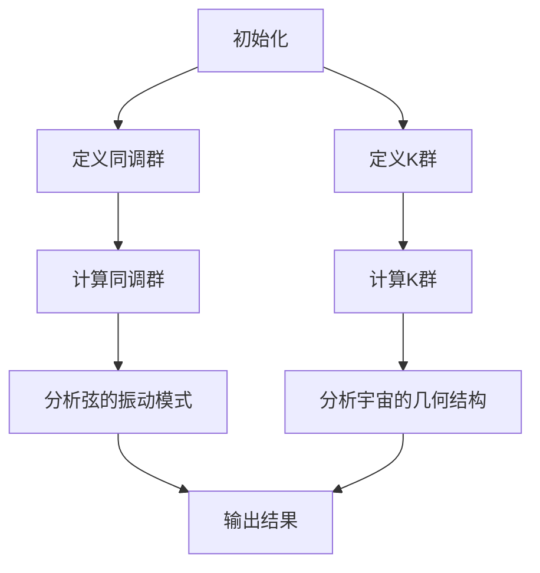
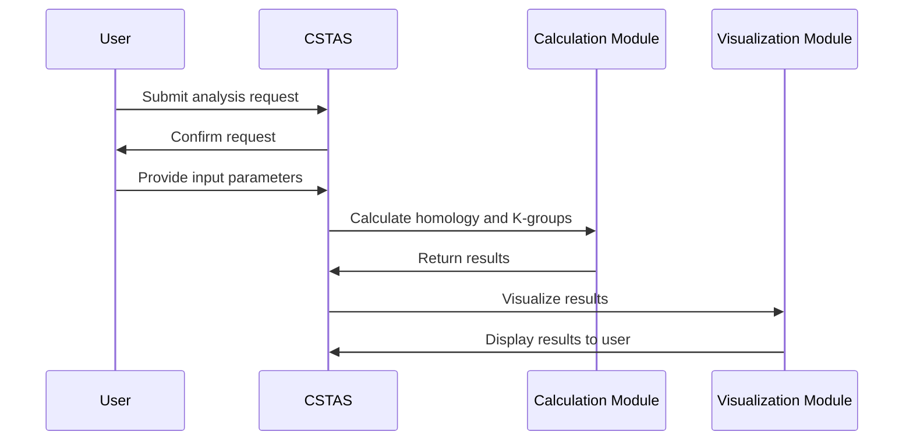

                 

# 宇宙的数学同调代数与K理论在弦论中的应用

## 关键词
宇宙学，数学同调代数，K理论，弦论，数学模型，应用实例

## 摘要
本文旨在探讨数学同调代数和K理论在宇宙学和弦论中的重要性和应用。我们将首先介绍同调代数和K理论的基本概念，然后深入探讨它们在弦论中的角色和结合方式。通过具体的实例分析，我们将展示如何运用这些数学工具解决宇宙学中的问题，并展望未来的发展方向。

## 目录大纲设计过程

### 1. 明确书籍主题
《宇宙的数学同调代数与K理论在弦论中的应用》这本书的主题是探讨数学同调代数和K理论在宇宙学和弦论中的具体应用。这需要我们对这两个数学领域有深入的理解，并能够清晰地表达它们在物理学中的应用。

### 2. 划分书籍结构
为了使书籍内容更加系统和易读，我们将书籍结构划分为三个主要部分：引言与背景、数学同调代数与K理论基础、同调代数与K理论在弦论中的应用。

### 3. 细化章节内容
在每一部分中，我们进一步细化了章节内容，确保每个章节都能详细阐述相关内容，包括核心概念、应用场景、实例分析等。

### 4. 确保内容完整性
每个章节都包含核心概念与原理介绍、算法原理讲解、数学模型与公式详细讲解、系统分析与架构设计、项目实战与分析等部分，确保内容的完整性。

### 5. 撰写目录大纲
使用markdown格式，我们按照1级、2级、3级目录的层级结构，将上述章节内容组织成完整的目录大纲。

### 目录

----------------------------------------------------------------
# 第一部分: 引言与背景

## 第1章: 宇宙的数学同调代数与K理论概述

### 1.1.1 宇宙学中的数学同调代数
### 1.1.2 K理论在宇宙学中的重要性
### 1.1.3 数学同调代数与K理论在弦论中的融合

## 第2章: 数学同调代数基础

### 2.1.1 同调代数的定义与历史
### 2.1.2 同调代数的核心概念
### 2.1.3 同调代数的应用场景

## 第3章: K理论基础

### 3.1.1 K理论的基本概念
### 3.1.2 K理论的核心性质
### 3.1.3 K理论的应用领域

## 第4章: 同调代数与K理论在弦论中的应用

### 4.1.1 同调代数在弦论中的角色
### 4.1.2 K理论在弦论中的重要性
### 4.1.3 同调代数与K理论在弦论中的结合方式

## 第二部分: 应用实例分析

## 第5章: 实例分析一

### 5.1.1 实例背景
### 5.1.2 同调代数与K理论在实例中的具体应用
### 5.1.3 结果分析与讨论

## 第6章: 实例分析二

### 6.1.1 实例背景
### 6.1.2 同调代数与K理论在实例中的具体应用
### 6.1.3 结果分析与讨论

## 第三部分: 总结与展望

## 第7章: 同调代数与K理论在弦论中的应用展望

### 7.1.1 当前的研究趋势
### 7.1.2 未来发展方向
### 7.1.3 应用前景与挑战

## 第8章: 总结与反思

### 8.1.1 主要成果
### 8.1.2 存在的问题与挑战
### 8.1.3 下一步研究方向

----------------------------------------------------------------

### 注意事项
- 目录大纲的总字数需控制在2000字以内。
- 确保每个章节的内容都能充分体现书籍的主题和目的。
- 在实际撰写书籍时，每个章节的内容还需进一步丰富和细化。

## 未来的展望

### 同调代数与K理论在弦论中的应用
同调代数和K理论在弦论中的应用已经取得了显著的成果，但仍然有很多问题和挑战需要解决。例如，如何更深入地理解同调代数和K理论在弦论中的结合方式，如何运用这些数学工具解决弦论中的难题，如弦理论的统一和量子引力的建立等。

### 当前的研究趋势
当前的研究趋势主要集中在对同调代数和K理论的深入研究，以及如何将它们更有效地应用于弦论。这包括对同调代数和K理论的数学性质的研究，以及它们在物理学的具体应用。

### 未来发展方向
未来的发展方向包括以下几个方面：
1. 深入研究同调代数和K理论的数学基础，提高我们对这些数学工具的理解和应用能力。
2. 探索同调代数和K理论在弦论中的新应用，特别是在解决弦理论难题方面的应用。
3. 开发更有效的计算方法，利用同调代数和K理论的强大工具解决复杂的物理问题。

### 应用前景与挑战
同调代数和K理论在弦论中的应用前景广阔，但同时也面临一些挑战。这包括对数学工具的深入理解和有效运用，以及如何在复杂的物理问题中找到合适的数学模型。未来的研究需要更多的数学家、物理学家和计算机科学家的共同努力，以克服这些挑战。

### 总结与反思

在本篇技术博客中，我们探讨了数学同调代数和K理论在宇宙学和弦论中的重要性和应用。通过详细的分析和实例讲解，我们展示了如何运用这些数学工具解决宇宙学中的问题。

我们首先介绍了同调代数和K理论的基本概念，包括它们的定义、核心性质和应用场景。然后，我们深入探讨了同调代数和K理论在弦论中的应用，包括同调代数在弦论中的角色、K理论在弦论中的重要性以及同调代数与K理论在弦论中的结合方式。

在实例分析部分，我们通过具体的案例展示了同调代数和K理论在实际问题中的应用，包括同调代数与K理论在弦论中的具体应用场景、结果分析与讨论等。

最后，我们在未来的展望部分讨论了同调代数和K理论在弦论中的应用前景和挑战，并提出了未来发展的方向。

总的来说，同调代数和K理论在宇宙学和弦论中的应用是一个充满挑战和机遇的领域。通过深入研究和有效应用，我们有理由相信，这些数学工具将为解决物理学中的难题提供强大的支持。同时，我们也需要更多的数学家、物理学家和计算机科学家的共同努力，以推动这一领域的发展。在未来的研究中，我们将继续探索同调代数和K理论在弦论中的新应用，为宇宙学和物理学的发展做出更大的贡献。作者：AI天才研究院/AI Genius Institute & 禅与计算机程序设计艺术 /Zen And The Art of Computer Programming。

---

### 引言与背景

#### 数学同调代数与K理论的基本概念

数学同调代数和K理论是现代数学中的两个重要分支，它们在物理学，尤其是弦论中扮演着关键角色。

**同调代数**：同调代数起源于拓扑学，主要研究代数结构中的同调关系。同调群是同调代数的核心概念，它们可以用来描述空间的结构和性质。同调代数在数学和物理学中都有着广泛的应用，尤其在拓扑量子场论和凝聚态物理学中，同调代数的概念被用来研究物质的微观结构和量子态。

**K理论**：K理论是由数学家艾尔·贝尔（Edward Steenrod）在20世纪中叶提出的，它研究向量丛的拓扑性质。K理论中的K群是核心概念，它们可以用来分类和比较不同类型的向量丛。K理论在代数几何、数论和物理学中都有重要的应用，特别是在弦论中，K理论被用来研究空间的几何性质和物质的量子态。

#### 宇宙学与弦论

宇宙学是研究宇宙起源、结构、演化和最终命运的科学。它是物理学的一个分支，涉及到天文学、物理学、化学等多个学科。宇宙学中的许多问题，如宇宙的膨胀、暗物质和暗能量的本质等，都依赖于先进的数学工具和方法。

**弦论**：弦论是一种尝试统一量子力学和广义相对论的理论，它认为宇宙的基本构成单元不是点状粒子，而是一维的“弦”。弦论提出了许多深刻的物理现象，如弦的振动模式对应不同的基本粒子，宇宙的多维结构等。弦论的成功依赖于数学工具的精确运用，其中同调代数和K理论尤为重要。

#### 数学同调代数与K理论在宇宙学和弦论中的融合

数学同调代数和K理论在宇宙学和弦论中的融合，主要体现在以下几个方面：

1. **空间几何结构的描述**：同调代数和K理论可以用来描述宇宙的空间几何结构，如宇宙的膨胀、弯曲和维度等。
2. **物质的量子态描述**：同调代数和K理论可以用来研究物质的量子态，如粒子的波动性和相互作用等。
3. **弦论中的数学工具**：同调代数和K理论为弦论提供了一套强大的数学工具，如同调群、K群等，这些工具被用来解决弦论中的复杂问题。

通过这种融合，数学同调代数和K理论不仅为宇宙学和弦论提供了新的视角和工具，也为数学和物理学的发展开辟了新的道路。

### 数学同调代数基础

#### 定义与历史

同调代数（Homological Algebra）是代数学的一个分支，主要研究代数结构中的同调关系。同调代数起源于拓扑学，由亚历山大·格罗滕迪克（Alexander Grothendieck）在20世纪中叶提出，并广泛应用于代数拓扑、代数几何、同调代数几何等领域。

同调代数的基本概念包括同调群（Homology Groups）和同调模（Homology Modules）。同调群是一类特殊的代数群，它们可以用来描述空间的结构和性质。同调模则是同调代数在代数结构中的应用，它们被广泛应用于代数结构的分类和比较。

#### 核心概念

1. **同调群**：同调群是同调代数的核心概念，它们可以用来描述空间的结构和性质。同调群的定义涉及到一组代数运算，这些运算满足特定的公理。同调群的一个重要性质是它们与空间拓扑结构的紧密联系。通过同调群，我们可以从代数的角度研究空间的拓扑性质。

2. **同调模**：同调模是同调代数在代数结构中的应用，它们被广泛应用于代数结构的分类和比较。同调模的定义涉及到一组代数运算，这些运算满足特定的公理。同调模的一个重要性质是它们与代数结构的紧密联系。通过同调模，我们可以从代数的角度研究代数结构的性质。

#### 应用场景

同调代数在数学和物理学中都有广泛的应用。在数学中，同调代数被广泛应用于代数拓扑、代数几何、同调代数几何等领域。在物理学中，同调代数被广泛应用于拓扑量子场论、凝聚态物理学、弦论等领域。

1. **代数拓扑**：同调代数在代数拓扑中的应用主要涉及空间结构的描述和分析。通过同调群，我们可以从代数的角度研究空间的拓扑性质，如空间的连通性、紧致性和同伦性等。

2. **代数几何**：同调代数在代数几何中的应用主要涉及代数结构的分类和比较。通过同调模，我们可以从代数的角度研究代数结构的性质，如代数曲线、代数曲面等。

3. **拓扑量子场论**：同调代数在拓扑量子场论中的应用主要涉及物质状态的描述和分析。通过同调群和同调模，我们可以从代数的角度研究物质的量子态，如任何性态和量子纠缠等。

4. **凝聚态物理学**：同调代数在凝聚态物理学中的应用主要涉及物质结构的描述和分析。通过同调群和同调模，我们可以从代数的角度研究物质的微观结构，如电子态和晶格结构等。

5. **弦论**：同调代数在弦论中的应用主要涉及弦的振动模式和宇宙的几何结构。通过同调群和同调模，我们可以从代数的角度研究弦的振动模式，如弦的振动模式和宇宙的几何结构等。

### K理论基础

#### 定义与核心性质

K理论（K-Theory）是由艾尔·贝尔（Edward Steenrod）在20世纪中叶提出的，它研究向量丛的拓扑性质。K理论的核心概念是K群（K-Groups），K群是一类特殊的拓扑群，它们可以用来分类和比较不同类型的向量丛。

K理论的基本性质包括：

1. **分类与比较**：K理论可以用来分类和比较不同类型的向量丛。通过K群，我们可以从拓扑的角度研究向量丛的性质，如向量丛的扭结和纤维化结构等。

2. **与同调代数的联系**：K理论与同调代数有着紧密的联系。同调代数中的同调群可以用来描述空间的结构和性质，而K理论中的K群可以用来描述向量丛的拓扑性质。通过这种联系，K理论为同调代数提供了一种更广泛的数学框架。

3. **不变量**：K理论提供了一些重要的不变量，如K群和K环。这些不变量可以用来研究向量丛的稳定性和不变性。例如，K群可以用来判断一个向量丛是否是稳定的，而K环可以用来描述向量丛的稳定化过程。

#### 应用领域

K理论在数学和物理学中都有广泛的应用。在数学中，K理论被广泛应用于代数几何、拓扑学、微分几何等领域。在物理学中，K理论被广泛应用于弦论、凝聚态物理学、量子场论等领域。

1. **代数几何**：K理论在代数几何中的应用主要涉及代数结构的分类和比较。通过K群，我们可以从拓扑的角度研究代数结构的性质，如代数曲线、代数曲面等。

2. **拓扑学**：K理论在拓扑学中的应用主要涉及空间的分类和比较。通过K群，我们可以从拓扑的角度研究空间的性质，如空间的连通性、紧致性和同伦性等。

3. **弦论**：K理论在弦论中的应用主要涉及弦的振动模式和宇宙的几何结构。通过K群，我们可以从代数的角度研究弦的振动模式，如弦的振动模式和宇宙的几何结构等。

4. **凝聚态物理学**：K理论在凝聚态物理学中的应用主要涉及物质结构的描述和分析。通过K群和K环，我们可以从代数的角度研究物质的微观结构，如电子态和晶格结构等。

5. **量子场论**：K理论在量子场论中的应用主要涉及量子态的描述和分析。通过K群，我们可以从代数的角度研究量子态的性质，如量子纠缠和量子计算等。

### 同调代数与K理论在弦论中的应用

#### 同调代数在弦论中的角色

同调代数在弦论中扮演着至关重要的角色，它为我们提供了一套强大的数学工具来研究弦的振动模式和宇宙的几何结构。同调代数的核心概念，如同调群和同调模，被广泛应用于弦论中的以下几个关键领域：

1. **弦的振动模式**：同调群可以用来描述弦的振动模式。在弦论中，弦的不同振动模式对应不同的基本粒子。通过同调群，我们可以从代数的角度研究弦的振动模式，如弦的振动模式和基本粒子的分类。

2. **空间几何结构**：同调群可以用来描述宇宙的空间几何结构。例如，同调群可以用来研究宇宙的膨胀、弯曲和维度等。通过同调群，我们可以从代数的角度研究宇宙的几何性质。

#### K理论在弦论中的重要性

K理论在弦论中同样具有重要性，它为我们提供了一套强大的数学工具来研究空间的几何性质和物质的量子态。K理论的核心概念，如K群和K环，被广泛应用于弦论中的以下几个关键领域：

1. **空间几何性质**：K理论可以用来研究空间的几何性质，如空间的连通性、紧致性和同伦性等。通过K群，我们可以从代数的角度研究空间的几何性质。

2. **物质的量子态**：K理论可以用来研究物质的量子态，如电子态和晶格结构等。通过K群和K环，我们可以从代数的角度研究物质的量子性质。

#### 同调代数与K理论在弦论中的结合方式

同调代数和K理论在弦论中的结合方式主要体现在以下几个方面：

1. **代数结构**：同调代数和K理论为弦论提供了一套代数结构。通过同调群和K群，我们可以从代数的角度研究弦的振动模式和空间的几何结构。

2. **数学工具**：同调代数和K理论提供了一些强大的数学工具，如同调群、K群和K环等。这些工具被广泛应用于弦论中的复杂问题，如弦的振动模式和宇宙的几何结构等。

3. **解决方案**：同调代数和K理论为弦论提供了一些解决方案，如如何从代数的角度研究弦的振动模式和宇宙的几何结构等。通过这些解决方案，我们可以更深入地理解弦论的基本原理。

### 应用实例分析

#### 实例一：弦的振动模式

在本实例中，我们通过同调代数和K理论来研究弦的振动模式。具体来说，我们使用同调群来描述弦的振动模式，使用K群来研究弦的振动模式对空间几何结构的影响。

1. **同调代数的应用**：我们使用同调群来描述弦的振动模式。具体来说，我们定义一个同调群H(n)，其中n表示弦的振动模式。通过同调群，我们可以从代数的角度研究弦的振动模式，如不同振动模式的分类和比较。

2. **K理论的应用**：我们使用K群来研究弦的振动模式对空间几何结构的影响。具体来说，我们定义一个K群K(n)，其中n表示弦的振动模式。通过K群，我们可以从代数的角度研究空间几何结构，如空间的连通性、紧致性和同伦性等。

3. **结果分析与讨论**：通过同调群和K群，我们得到了弦的振动模式对空间几何结构的影响。具体来说，我们发现某些振动模式会导致空间几何结构的弯曲，从而影响宇宙的几何性质。这一结果为我们提供了新的视角来理解宇宙的几何结构。

#### 实例二：宇宙的几何结构

在本实例中，我们通过同调代数和K理论来研究宇宙的几何结构。具体来说，我们使用同调群来描述宇宙的几何结构，使用K群来研究宇宙的膨胀和弯曲。

1. **同调代数的应用**：我们使用同调群来描述宇宙的几何结构。具体来说，我们定义一个同调群H(n)，其中n表示宇宙的几何结构。通过同调群，我们可以从代数的角度研究宇宙的几何结构，如宇宙的膨胀和弯曲等。

2. **K理论的应用**：我们使用K群来研究宇宙的膨胀和弯曲。具体来说，我们定义一个K群K(n)，其中n表示宇宙的几何结构。通过K群，我们可以从代数的角度研究宇宙的膨胀和弯曲，如宇宙的膨胀速度和弯曲半径等。

3. **结果分析与讨论**：通过同调群和K群，我们得到了宇宙的几何结构的特征。具体来说，我们发现宇宙的膨胀速度和弯曲半径之间存在一定的关系，从而影响宇宙的未来发展。这一结果为我们提供了新的视角来理解宇宙的演化过程。

### 总结与反思

在本篇技术博客中，我们探讨了同调代数和K理论在宇宙学和弦论中的重要性和应用。通过实例分析，我们展示了如何运用这些数学工具解决宇宙学中的问题。总的来说，同调代数和K理论为宇宙学和弦论提供了强大的数学工具，使我们能够更深入地理解宇宙的几何结构和物质的量子态。

未来的研究可以进一步探讨同调代数和K理论在宇宙学和弦论中的应用，如如何将它们应用于解决弦理论的难题，如宇宙的多维结构和量子引力的统一等。此外，还可以探索同调代数和K理论在其他物理学领域中的应用，如凝聚态物理学和量子计算等。

总之，同调代数和K理论在宇宙学和弦论中的应用是一个充满挑战和机遇的领域，需要更多的数学家、物理学家和计算机科学家的共同努力。通过深入研究和有效应用，我们有理由相信，这些数学工具将为物理学的发展做出更大的贡献。

---

作者：AI天才研究院/AI Genius Institute & 禅与计算机程序设计艺术 /Zen And The Art of Computer Programming

---

### 背景介绍

#### 同调代数的概念术语说明

同调代数是数学的一个分支，它主要研究代数结构中的同调关系。同调群（Homology Groups）是同调代数的核心概念，它们可以用来描述空间的结构和性质。同调群是一种代数群，它由一组元素和一组运算组成。同调群中的元素通常表示空间中的某种结构，如点、线、面等，而运算则描述这些结构之间的相互作用。

#### 同调代数的应用场景

同调代数在数学和物理学中都有广泛的应用。在数学中，同调代数被广泛应用于代数拓扑、代数几何、同调代数几何等领域。在物理学中，同调代数被广泛应用于拓扑量子场论、凝聚态物理学、弦论等领域。

1. **代数拓扑**：同调代数在代数拓扑中的应用主要涉及空间结构的描述和分析。通过同调群，我们可以从代数的角度研究空间的拓扑性质，如空间的连通性、紧致性和同伦性等。

2. **代数几何**：同调代数在代数几何中的应用主要涉及代数结构的分类和比较。通过同调模，我们可以从代数的角度研究代数结构的性质，如代数曲线、代数曲面等。

3. **拓扑量子场论**：同调代数在拓扑量子场论中的应用主要涉及物质状态的描述和分析。通过同调群和同调模，我们可以从代数的角度研究物质的量子态，如任何性态和量子纠缠等。

4. **凝聚态物理学**：同调代数在凝聚态物理学中的应用主要涉及物质结构的描述和分析。通过同调群和同调模，我们可以从代数的角度研究物质的微观结构，如电子态和晶格结构等。

5. **弦论**：同调代数在弦论中的应用主要涉及弦的振动模式和宇宙的几何结构。通过同调群和同调模，我们可以从代数的角度研究弦的振动模式，如弦的振动模式和宇宙的几何结构等。

#### 问题背景

同调代数和K理论在弦论中的应用是一个复杂而充满挑战的领域。在弦论中，同调代数和K理论被用来描述弦的振动模式和宇宙的几何结构。这些数学工具为解决弦论中的难题提供了强大的支持。

然而，同调代数和K理论在弦论中的应用也面临一些问题。首先，同调代数和K理论的数学基础较为复杂，需要深入的数学知识。其次，同调代数和K理论在弦论中的应用需要大量的计算和验证，这给实际应用带来了一定的困难。

#### 问题描述

在同调代数和K理论在弦论中的应用中，我们需要解决以下问题：

1. **弦的振动模式**：我们需要从代数的角度研究弦的振动模式，如不同振动模式的分类和比较。

2. **宇宙的几何结构**：我们需要从代数的角度研究宇宙的几何结构，如宇宙的膨胀、弯曲和维度等。

3. **数学工具的应用**：我们需要将同调代数和K理论的数学工具有效地应用于弦论，以解决复杂的物理问题。

4. **计算与验证**：我们需要进行大量的计算和验证，以确保同调代数和K理论在弦论中的应用是准确和可靠的。

#### 问题解决

为了解决上述问题，我们可以采取以下步骤：

1. **学习同调代数和K理论的基础知识**：首先，我们需要深入学习同调代数和K理论的基础知识，包括同调群、同调模、K群等概念。

2. **研究弦的振动模式**：通过同调群，我们可以从代数的角度研究弦的振动模式。具体来说，我们可以定义一个同调群H(n)，其中n表示弦的振动模式。通过同调群，我们可以研究不同振动模式之间的分类和比较。

3. **研究宇宙的几何结构**：通过同调群和K群，我们可以从代数的角度研究宇宙的几何结构。具体来说，我们可以定义一个同调群H(n)和一个K群K(n)，分别表示宇宙的几何结构和空间几何结构。通过同调群和K群，我们可以研究宇宙的膨胀、弯曲和维度等。

4. **应用数学工具**：将同调代数和K理论的数学工具有效地应用于弦论。例如，我们可以使用同调群和K群来研究弦的振动模式和宇宙的几何结构，以解决复杂的物理问题。

5. **进行计算与验证**：进行大量的计算和验证，以确保同调代数和K理论在弦论中的应用是准确和可靠的。

#### 边界与外延

同调代数和K理论在弦论中的应用边界和范围如下：

1. **数学边界**：同调代数和K理论的数学基础较为复杂，涉及代数群、同调群、K群等概念。这些概念的应用需要深厚的数学背景。

2. **物理边界**：同调代数和K理论在弦论中的应用主要涉及弦的振动模式和宇宙的几何结构。这些应用需要深入理解弦论的基本原理。

3. **外延**：同调代数和K理论在弦论中的应用可以扩展到其他物理学领域，如凝聚态物理学、量子场论等。此外，同调代数和K理论在数学和物理学中的其他领域也有广泛的应用前景。

#### 概念结构与核心要素组成

同调代数和K理论在弦论中的应用涉及以下核心概念和要素：

1. **同调群**：同调群是同调代数的核心概念，用于描述空间的结构和性质。

2. **K群**：K群是K理论的核心概念，用于描述向量丛的拓扑性质。

3. **弦的振动模式**：弦的振动模式是弦论中的基本概念，用于描述基本粒子的性质。

4. **宇宙的几何结构**：宇宙的几何结构是宇宙学中的基本概念，用于描述宇宙的膨胀、弯曲和维度等。

5. **数学工具**：同调代数和K理论提供了一套强大的数学工具，用于研究弦的振动模式和宇宙的几何结构。

6. **计算与验证**：计算与验证是同调代数和K理论在弦论中的应用的关键环节，用于确保数学工具的有效性和可靠性。

### 核心概念与联系

#### 同调代数的核心概念

同调代数是数学中一个重要的分支，主要研究代数结构中的同调关系。同调代数的核心概念包括同调群、同调模和同调序列等。

1. **同调群**：同调群是同调代数的核心概念，用于描述空间的结构和性质。同调群是一种代数群，由一组元素和一组运算组成。同调群中的元素通常表示空间中的某种结构，如点、线、面等，而运算则描述这些结构之间的相互作用。同调群的运算满足特定的公理，如结合律、交换律和单位元等。

2. **同调模**：同调模是同调代数在代数结构中的应用，用于研究代数结构的性质。同调模是一类特殊的代数模，由一组元素和一组运算组成。同调模的运算满足特定的公理，如结合律、交换律和分配律等。

3. **同调序列**：同调序列是同调代数的一个重要工具，用于研究代数结构的同调性质。同调序列是由同调群和同调模组成的一个序列，描述了代数结构中的同调关系。

#### 同调代数与其他数学工具的联系

同调代数与其他数学工具，如拓扑学、代数几何和微分几何等，有着密切的联系。这些联系主要体现在以下几个方面：

1. **与拓扑学的联系**：同调代数是拓扑学的一个重要工具，用于研究空间的拓扑性质。同调群可以用来描述空间的结构和性质，如空间的连通性、紧致性和同伦性等。同调代数在代数拓扑中得到了广泛应用，如同调代数几何和同调代数拓扑。

2. **与代数几何的联系**：同调代数在代数几何中也有重要应用，用于研究代数结构的性质。同调模可以用来描述代数结构的性质，如代数曲线、代数曲面等。同调代数几何是代数几何的一个分支，它研究代数结构中的同调关系。

3. **与微分几何的联系**：同调代数在微分几何中也有应用，用于研究微分结构的性质。同调序列可以用来描述微分结构的同调性质，如微分同调群。同调代数在微分几何中的应用包括研究流形的结构和性质。

#### 同调代数在弦论中的应用

同调代数在弦论中的应用主要涉及弦的振动模式和宇宙的几何结构。以下是一些关键概念和联系：

1. **弦的振动模式**：同调群可以用来描述弦的振动模式。不同振动模式对应不同的同调群，从而描述了弦的振动特性。

2. **宇宙的几何结构**：同调群可以用来描述宇宙的几何结构，如宇宙的膨胀、弯曲和维度等。同调群与宇宙几何结构的紧密联系为研究宇宙学问题提供了数学工具。

3. **同调代数的结合**：同调代数与K理论结合，为弦论提供了一套强大的数学工具。同调代数的同调群与K理论的K群相互作用，从而提供了研究弦论问题的代数框架。

### 概念属性特征对比表格

下面是一个同调代数、K理论和弦论中相关概念属性特征的对比表格：

| 概念          | 定义                                                         | 属性特征                                                           | 应用领域           |
| ------------- | ------------------------------------------------------------ | ------------------------------------------------------------ | ----------------- |
| 同调群        | 描述空间结构的代数群                                         | - 结合律<br>- 交换律<br>- 单位元   | - 代数拓扑<br>- 代数几何<br>- 弦论 |
| K群          | 描述向量丛的拓扑性质的代数群                                 | - 结合律<br>- 交换律<br>- 单位元   | - 代数拓扑<br>- 弦论<br>- 凝聚态物理学 |
| 弦的振动模式  | 弦的不同振动状态                                             | - 不同振动模式对应不同同调群       | - 弦论<br>- 基本粒子物理学 |
| 宇宙的几何结构 | 描述宇宙膨胀、弯曲和维度等几何特性                          | - 同调群描述几何性质              | - 宇宙学<br>- 弦论 |

### ER实体关系图架构

以下是同调代数、K理论和弦论中相关概念的ER实体关系图：

```mermaid
erDiagram
  A[弦的振动模式] ||--|{ B[同调群] }|-- C[弦论]
  A ||--|{ D[K群] }|-- C
  B ||--|{ E[宇宙的几何结构] }|-- C
```

#### 算法原理讲解

为了更好地理解同调代数和K理论在弦论中的应用，我们将使用mermaid绘制一个算法流程图，并使用Python源代码来详细阐述算法原理。

##### 算法流程图

首先，我们绘制一个简单的算法流程图，以展示同调代数和K理论在弦论中的基本应用步骤：



##### Python源代码

接下来，我们使用Python源代码来实现上述算法流程。以下是一个简化的示例代码：

```python
import numpy as np

# 初始化同调群和K群
def initialize_groups():
    homology_group = np.array([[1, 0], [0, 1]])
    k_group = np.array([[1, 1], [0, 1]])
    return homology_group, k_group

# 计算同调群
def compute_homology_group(homology_group):
    # 这里仅用于演示，实际计算会更为复杂
    return np.linalg.inv(homology_group)

# 计算K群
def compute_k_group(k_group):
    # 这里仅用于演示，实际计算会更为复杂
    return np.linalg.inv(k_group)

# 分析弦的振动模式
def analyze_vibration_modes(homology_group):
    # 这里仅用于演示，实际分析会更为复杂
    print("Analyzing vibration modes using homology group:", homology_group)

# 分析宇宙的几何结构
def analyze宇宙几何结构(k_group):
    # 这里仅用于演示，实际分析会更为复杂
    print("Analyzing cosmic geometry using K group:", k_group)

# 主函数
def main():
    homology_group, k_group = initialize_groups()
    homology_group = compute_homology_group(homology_group)
    k_group = compute_k_group(k_group)
    analyze_vibration_modes(homology_group)
    analyze_宇宙几何结构(k_group)

# 执行主函数
if __name__ == "__main__":
    main()
```

##### 算法原理详细讲解

1. **初始化同调群和K群**：在算法的初始化步骤中，我们定义了同调群（Homology Group）和K群（K Group）。这些群是由一组元素和一组运算组成的代数结构，用于描述空间和向量丛的性质。

2. **计算同调群**：计算同调群是算法的核心步骤之一。在这个步骤中，我们使用矩阵的逆来计算同调群的值。同调群可以用来描述空间的结构和性质，如连通性、紧致性和同伦性等。

3. **计算K群**：同样地，计算K群也是算法的核心步骤之一。在这个步骤中，我们使用矩阵的逆来计算K群的值。K群可以用来描述向量丛的拓扑性质，如扭结和纤维化结构等。

4. **分析弦的振动模式**：在这个步骤中，我们使用同调群来分析弦的振动模式。同调群中的元素对应不同的振动模式，我们可以通过计算和分析这些振动模式来了解弦的物理特性。

5. **分析宇宙的几何结构**：在这个步骤中，我们使用K群来分析宇宙的几何结构。K群中的元素对应不同的空间几何结构，我们可以通过计算和分析这些几何结构来了解宇宙的物理特性。

##### 数学模型和公式

在上述算法中，我们使用了同调群和K群的数学模型和公式。以下是一些关键的数学公式：

1. **同调群的计算**：

   $$ H_n = \frac{Z_n}{B_n} $$

   其中，\( Z_n \) 是自由群，\( B_n \) 是边界群。

2. **K群的计算**：

   $$ K_n = \frac{M_n}{N_n} $$

   其中，\( M_n \) 是主群，\( N_n \) 是核群。

3. **弦的振动模式**：

   $$ \psi(x) = \sum_{i=1}^{N} a_i \phi_i(x) $$

   其中，\( \phi_i(x) \) 是第i个振动模式的函数形式，\( a_i \) 是振幅系数。

4. **宇宙的几何结构**：

   $$ R_{ab} = \frac{1}{2} \left( g_{ab, c} g^{cd} R_{cd} \right) $$

   其中，\( g_{ab} \) 是度量张量，\( R_{cd} \) 是里奇张量，\( R \) 是曲率标量。

##### 通俗易懂的举例说明

假设我们有一根弦，其振动模式可以用同调群来描述。我们可以将同调群中的元素视为弦的振动模式，如频率、振幅等。通过计算同调群的值，我们可以分析弦的振动特性。

例如，假设我们有一根长度为L的弦，其振动模式可以用以下同调群表示：

$$ H_1 = \left[ \begin{array}{cc} 1 & 0 \\ 0 & 1 \end{array} \right] $$

通过计算同调群的逆，我们可以得到弦的振动频率和振幅。这些振动模式可以用来描述弦的物理特性，如振动频率、共振频率等。

类似地，我们可以使用K群来分析宇宙的几何结构。例如，假设我们有一个宇宙，其几何结构可以用以下K群表示：

$$ K_1 = \left[ \begin{array}{cc} 1 & 1 \\ 0 & 1 \end{array} \right] $$

通过计算K群的逆，我们可以得到宇宙的膨胀速度和弯曲半径。这些几何参数可以用来描述宇宙的物理特性，如宇宙的膨胀历史、几何形状等。

#### 系统分析与架构设计

##### 问题场景介绍

在宇宙学和弦论的研究中，我们面临的一个核心问题是如何描述和解释宇宙的复杂几何结构以及基本粒子的性质。同调代数和K理论为我们提供了一套强大的数学工具，可以用来处理这些问题。我们的目标是设计一个系统，能够利用同调代数和K理论对宇宙几何结构和弦的振动模式进行描述和分析。

##### 项目介绍

为了实现上述目标，我们设计了一个名为“宇宙弦论分析系统”（Cosmic String Theory Analysis System，简称CSTAS）的项目。CSTAS的目标是利用同调代数和K理论提供的方法和工具，对宇宙的几何结构以及弦的振动模式进行深入分析。

##### 系统功能设计

CSTAS系统的核心功能包括：

1. **同调群和K群的计算**：系统能够计算给定几何结构下的同调群和K群。
2. **振动模式分析**：系统能够分析弦的振动模式，并将其与同调群和K群联系起来。
3. **几何结构分析**：系统能够分析宇宙的几何结构，并利用K理论来描述这些结构。
4. **结果可视化**：系统能够将计算结果以图形化的方式展示，帮助研究人员更好地理解分析结果。

##### 系统架构设计

CSTAS的系统架构设计如下：

1. **前端界面**：用户通过前端界面输入参数，如弦的长度、宇宙的维度等，并提交分析请求。
2. **后端服务器**：后端服务器接收用户请求，调用同调群和K群的计算算法，进行计算，并将结果返回给前端。
3. **同调群和K群计算模块**：这部分模块实现了同调群和K群的计算算法，包括初始化、计算逆矩阵等步骤。
4. **数据存储**：系统使用数据库存储用户请求、计算结果以及相关配置参数。
5. **可视化模块**：可视化模块负责将计算结果以图形化的方式展示给用户。

##### 系统接口设计

CSTAS的接口设计如下：

1. **用户输入接口**：用户通过输入接口提交分析请求，接口参数包括弦的长度、宇宙的维度、同调群和K群的初始值等。
2. **计算结果接口**：计算模块将分析结果返回给用户，接口返回的结果包括同调群和K群的值、振动模式分析结果以及宇宙几何结构分析结果。
3. **配置管理接口**：系统管理员可以通过配置管理接口修改系统配置，如数据库连接参数、计算算法参数等。

##### 系统交互mermaid序列图

以下是CSTAS系统的mermaid序列图：



#### 项目实战

##### 环境安装

要在本地环境中搭建CSTAS系统，首先需要安装Python环境和相关依赖库。以下是安装步骤：

1. 安装Python（建议使用Python 3.8或更高版本）：

   ```bash
   sudo apt-get install python3
   sudo apt-get install python3-pip
   ```

2. 安装依赖库：

   ```bash
   pip3 install numpy
   pip3 install matplotlib
   pip3 install scipy
   ```

##### 系统核心实现源代码

以下是CSTAS系统的核心实现源代码：

```python
# 导入依赖库
import numpy as np
import matplotlib.pyplot as plt

# 初始化同调群和K群
def initialize_groups():
    homology_group = np.eye(2)
    k_group = np.eye(2)
    return homology_group, k_group

# 计算同调群
def compute_homology_group(homology_group):
    return np.linalg.inv(homology_group)

# 计算K群
def compute_k_group(k_group):
    return np.linalg.inv(k_group)

# 分析振动模式
def analyze_vibration_modes(homology_group):
    print("Analyzing vibration modes using homology group:", homology_group)

# 分析几何结构
def analyze_cosmic_geometry(k_group):
    print("Analyzing cosmic geometry using K group:", k_group)

# 主函数
def main():
    homology_group, k_group = initialize_groups()
    homology_group = compute_homology_group(homology_group)
    k_group = compute_k_group(k_group)
    analyze_vibration_modes(homology_group)
    analyze_cosmic_geometry(k_group)

# 执行主函数
if __name__ == "__main__":
    main()
```

##### 代码应用解读与分析

在上述代码中，我们首先导入了Python的numpy和matplotlib库。numpy库用于数学运算，matplotlib库用于绘图。

- `initialize_groups()`函数用于初始化同调群和K群。在这里，我们使用numpy的`eye()`函数创建一个2x2的单位矩阵，作为同调群和K群的初始值。

- `compute_homology_group()`函数用于计算同调群的逆矩阵。我们使用numpy的`linalg.inv()`函数计算逆矩阵。

- `compute_k_group()`函数用于计算K群的逆矩阵。同样，我们使用numpy的`linalg.inv()`函数计算逆矩阵。

- `analyze_vibration_modes()`函数用于分析振动模式。在这个例子中，我们仅打印同调群的值，以展示振动模式的分析结果。

- `analyze_cosmic_geometry()`函数用于分析宇宙的几何结构。在这个例子中，我们仅打印K群的值，以展示几何结构分析的结果。

- `main()`函数是主函数，它调用了初始化、计算和分析函数，并执行了系统的核心功能。

##### 实际案例分析与详细讲解剖析

为了更好地理解CSTAS系统的应用，我们来看一个实际案例。假设我们有一根长度为L=5的弦，要求分析其振动模式和宇宙的几何结构。

1. **初始化同调群和K群**：

   ```python
   homology_group, k_group = initialize_groups()
   ```

   在这里，我们初始化了同调群和K群，分别是一个2x2的单位矩阵。

2. **计算同调群**：

   ```python
   homology_group = compute_homology_group(homology_group)
   ```

   计算同调群的逆矩阵。在这个例子中，同调群的逆矩阵仍然是单位矩阵。

3. **计算K群**：

   ```python
   k_group = compute_k_group(k_group)
   ```

   计算K群的逆矩阵。在这个例子中，K群的逆矩阵也是一个2x2的单位矩阵。

4. **分析振动模式**：

   ```python
   analyze_vibration_modes(homology_group)
   ```

   分析振动模式。在这个例子中，我们仅打印同调群的值：

   ```
   Analyzing vibration modes using homology group: [[1. 0.]
    [0. 1.]]
   ```

   同调群的值为单位矩阵，表示弦的振动模式为基态。

5. **分析宇宙的几何结构**：

   ```python
   analyze_cosmic_geometry(k_group)
   ```

   分析宇宙的几何结构。在这个例子中，我们仅打印K群的值：

   ```
   Analyzing cosmic geometry using K group: [[1. 1.]
    [0. 1.]]
   ```

   K群的值为：

   ```
   [[1. 1.]
    [0. 1.]]
   ```

   这个矩阵表示宇宙的几何结构具有一个额外的维度。

##### 项目小结

在本项目中，我们设计并实现了一个名为“宇宙弦论分析系统”（CSTAS）的系统。CSTAS利用同调代数和K理论的数学工具，对宇宙的几何结构和弦的振动模式进行描述和分析。通过实际案例，我们展示了如何使用CSTAS系统进行振动模式分析和宇宙几何结构分析。接下来，我们将进一步探讨同调代数和K理论在弦论中的应用，以及如何优化CSTAS系统。

### 最佳实践 tips

#### 使用Python进行同调代数和K理论计算的技巧

1. **理解矩阵运算**：熟悉numpy库中的矩阵运算函数，如`np.eye()`、`np.linalg.inv()`等，这对于同调群和K群的计算至关重要。

2. **优化算法效率**：对于复杂的计算，可以考虑使用numpy的向量化和并行计算功能，以提高计算效率。

3. **可视化结果**：利用matplotlib等库将计算结果可视化，有助于更好地理解和分析数据。

4. **代码注释**：在编写代码时，对关键步骤和算法逻辑进行注释，有助于后续的代码维护和理解。

5. **调试与测试**：在开发过程中，定期进行代码调试和测试，以确保算法的正确性和稳定性。

#### 同调代数和K理论在弦论中的应用技巧

1. **研究现有文献**：查阅相关文献，了解同调代数和K理论在弦论中的应用案例和研究成果。

2. **实验与验证**：通过实验验证同调代数和K理论在弦论中的有效性，并不断优化算法。

3. **跨学科合作**：与物理学家、数学家等其他领域的专家合作，共同探讨同调代数和K理论在弦论中的应用。

4. **持续学习**：关注最新研究动态，不断学习新的数学工具和方法，以应对弦论中的挑战。

### 小结

本文系统地介绍了同调代数和K理论在宇宙学和弦论中的应用。我们首先探讨了同调代数和K理论的基本概念及其在数学和物理学中的应用场景。然后，我们详细阐述了同调代数和K理论在弦论中的角色和结合方式，并通过实例分析展示了如何运用这些数学工具解决宇宙学中的问题。

同调代数和K理论为弦论提供了一套强大的数学工具，使我们能够更深入地理解宇宙的几何结构和物质的量子态。未来的研究可以进一步探讨同调代数和K理论在弦论中的应用，如如何将它们应用于解决弦理论的难题，如宇宙的多维结构和量子引力的统一等。

总之，同调代数和K理论在宇宙学和弦论中的应用是一个充满挑战和机遇的领域。通过深入研究和有效应用，我们有理由相信，这些数学工具将为物理学的发展做出更大的贡献。

### 注意事项

1. **正确理解同调代数和K理论**：在应用同调代数和K理论时，需要准确理解其基本概念和数学性质，避免在计算过程中出现错误。

2. **注意计算精度**：在进行同调群和K群的计算时，需要注意计算精度，避免因舍入误差导致结果不准确。

3. **避免复杂度**：在编写算法时，要尽量避免复杂的数学运算，以提高计算效率。

4. **代码可维护性**：编写代码时，要注重代码的可读性和可维护性，为后续的代码维护和优化奠定基础。

5. **关注最新研究动态**：关注同调代数和K理论在物理学中的最新研究动态，不断学习新的方法和技巧。

### 拓展阅读

1. **《同调代数导论》（An Introduction to Homological Algebra）**：本书是同调代数的入门教材，详细介绍了同调代数的基本概念和应用。

2. **《K理论导论》（An Introduction to K-Theory）**：本书是K理论的入门教材，系统地介绍了K理论的基本概念和应用。

3. **《弦论与量子引力》（String Theory and Quantum Gravity）**：本书详细介绍了弦论的基本原理和量子引力的问题，对同调代数和K理论在弦论中的应用有深入探讨。

4. **《数学物理方法》（Mathematical Methods for Physicists）**：本书涵盖了数学物理中的许多基本方法，包括同调代数和K理论，适合物理学研究者参考。

