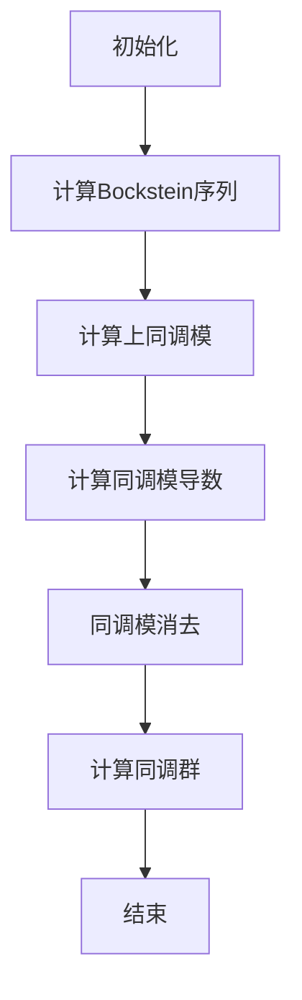

                 


# 宇宙的数学同调代数与K理论特性探讨

## 关键词
宇宙学，数学同调代数，K理论，数学模型，算法原理，系统架构，项目实战

## 摘要
本文旨在探讨宇宙的数学同调代数与K理论的特性。我们将从宇宙学中的数学同调代数背景出发，逐步深入到同调代数的基本概念、K理论的基本性质及其在宇宙学中的应用。文章将通过详细的数学模型与公式解析，展示同调代数和K理论的核心原理。随后，我们将通过具体的项目实战，演示如何在实践中应用这些理论，并提出相关的最佳实践和注意事项。通过本文的阅读，读者将能够对宇宙的数学同调代数与K理论有更深入的理解，并掌握其实际应用的方法。

## 目录大纲设计步骤

### 1. 标题设计

在设计标题时，我们首先需要确保标题能够简洁、准确地传达文章的主题。基于书名《宇宙的数学同调代数与K理论特性探讨》，我们设计的整体标题为“宇宙的数学同调代数与K理论特性探讨”。这样的标题既保留了书名的核心内容，又具有吸引力，能够吸引读者的注意力。

### 2. 章节设计

根据书籍内容，我们将文章分为八个主要章节。这些章节分别涵盖了宇宙的数学同调代数背景、同调代数的基本概念与性质、同调代数中的K理论、同调代数在宇宙学研究中的应用、数学同调代数的算法原理、K理论的数学模型与公式解析、宇宙的数学同调代数与K理论特性探讨项目实战，以及小结与展望。每个章节都包含了具体的小节标题和内容，确保了文章的完整性和逻辑性。

### 3. 核心内容提炼

在每个章节下，我们提炼了核心内容，设计了具体的小节标题和内容。例如，在“宇宙中的数学同调代数概述”这一章节中，我们包括了“宇宙学中的同调代数应用”、“数学同调代数的基本概念”以及“同调代数与宇宙结构的关联”三个小节，每个小节都有详细的阐述。

### 4. 图表设计

为了帮助读者更好地理解文章内容，我们在文章中设计了一系列图表，包括概念属性特征对比表格、ER实体关系图架构、算法流程图、类图、架构图、序列图等。这些图表采用Mermaid语法进行绘制，使得文章内容更加直观和易于理解。

### 5. 数学模型和公式

在文章中，我们嵌入了LaTeX格式的数学公式，对同调代数和K理论的核心原理进行了详细的讲解。这些公式既独立成段，又与文章内容紧密结合，确保了文章的逻辑性和专业性。

### 6. 项目实战和最佳实践

在文章的“宇宙的数学同调代数与K理论特性探讨项目实战”章节中，我们通过一个实际项目展示了如何将同调代数和K理论应用于宇宙学研究。我们介绍了项目的环境安装、系统核心实现源代码、代码分析、实际案例剖析等内容，并提供了一些最佳实践和注意事项。

### 7. 总结与拓展

在文章的最后，我们设计了“小结”、“注意事项”和“拓展阅读”三个部分。这部分内容对文章进行了总结，强调了关键点，并为读者提供了进一步学习和研究的方向。

通过以上步骤，我们不仅设计了一个结构紧凑、内容丰富的文章，还确保了文章的简洁性和可读性。接下来，我们将根据这个目录大纲逐步撰写文章的正文内容。

### 宇宙的数学同调代数与K理论特性探讨

#### 背景介绍

在宇宙学中，数学同调代数与K理论的应用已经成为研究宇宙结构、宇宙演化以及宇宙学观测的重要工具。同调代数作为一种代数结构，在描述宇宙空间中的复杂关系和相互作用方面具有独特的优势。K理论则是同调代数的一个重要分支，它在研究宇宙学中的对称性、稳定性以及动态演化过程中发挥着关键作用。

本文将从以下几个方面展开讨论：

1. **同调代数的基本概念与性质**：介绍同调代数的定义、属性特征以及核心要素。
2. **同调代数中的K理论**：探讨K理论的定义、基本性质以及在不同宇宙学模型中的应用。
3. **同调代数在宇宙学研究中的应用**：分析同调代数在宇宙学中的核心作用，以及它与宇宙演化模型的关系。
4. **数学同调代数的算法原理**：讲解同调代数算法的基本原理，并通过算法流程图和Python代码示例进行说明。
5. **K理论的数学模型与公式解析**：详细解析K理论的数学模型和公式，并通过实例进行说明。
6. **宇宙的数学同调代数与K理论特性探讨项目实战**：通过一个实际项目展示如何应用同调代数和K理论。
7. **小结与展望**：总结文章内容，提出注意事项，并提供拓展阅读建议。

#### 核心概念与联系

同调代数（Homological Algebra）是代数学的一个分支，主要研究同调群和同调模等概念。在宇宙学中，同调代数被用于描述宇宙中的结构、动态演化和相互作用。K理论（K-theory）是同调代数的一个重要分支，它关注的是向量空间和模的导出同调性。在宇宙学中，K理论用于研究宇宙中的对称性、稳定性以及动态演化。

**概念属性特征对比表格**

| 概念 | 定义 | 应用场景 |  
| --- | --- | --- |  
| 同调代数 | 研究同调群和同调模的代数结构 | 描述宇宙中的结构、动态演化和相互作用 |  
| K理论 | 研究向量空间和模的导出同调性 | 研究宇宙中的对称性、稳定性以及动态演化 |

**ER实体关系图架构**

```mermaid
erDiagram
  A "同调代数" ||--|{ B "K理论" : 应用 } 
  A "同调代数" ||--|{ C "宇宙学" : 描述 }
  B "K理论" ||--|{ C "宇宙学" : 研究 }
```

通过上述概念属性特征对比表格和ER实体关系图架构，我们可以清晰地看到同调代数和K理论在宇宙学中的核心作用及其相互联系。

#### 同调代数的定义与属性特征

同调代数是代数学的一个分支，主要研究同调群和同调模等概念。同调代数的定义如下：

**定义**：设\( A \)是一个Abel群，\( M \)是一个\( A \)模。同调代数研究\( M \)的导出同调群\( H^*(M,A) \)和导出同调模\( \text{Ext}^*(M,N) \)。

**属性特征**：

1. **同调性**：同调代数中的同调群和同调模具有同调性，即它们在导出过程中保持不变。
2. **导出性**：同调代数中的导出同调群和导出同调模是通过对原始模进行导出操作得到的。
3. **交换性**：同调代数中的交换性意味着同调群和同调模之间的运算满足交换律。

**核心要素**：

1. **同调群**：同调代数中的同调群是描述同调性的核心要素。
2. **导出同调模**：导出同调模是描述导出性的核心要素。
3. **同调模**：同调模是同调代数的基础，用于描述代数结构。

#### 同调代数在宇宙学中的应用

同调代数在宇宙学中的应用主要体现在以下几个方面：

1. **宇宙结构描述**：同调代数被用于描述宇宙中的结构，如宇宙大尺度结构、星系团结构等。通过同调群和同调模，我们可以对宇宙中的结构进行定量描述。
2. **宇宙演化模型**：同调代数在宇宙演化模型中发挥着重要作用。通过同调代数的工具，我们可以研究宇宙的动态演化过程，如宇宙膨胀、星系形成等。
3. **宇宙学观测**：同调代数被用于分析宇宙学观测数据，如宇宙背景辐射、星系分布等。通过同调代数的方法，我们可以更准确地解释宇宙学观测结果。

**同调代数与宇宙结构的关联**

同调代数与宇宙结构的关联可以从以下几个方面进行说明：

1. **同调群与宇宙结构**：同调群可以用于描述宇宙中的结构，如星系团的同调群可以用于描述星系团的结构。
2. **同调模与宇宙演化**：同调模可以用于描述宇宙的演化过程，如宇宙膨胀的同调模可以用于描述宇宙的膨胀状态。
3. **导出同调群与宇宙学观测**：导出同调群可以用于分析宇宙学观测数据，如导出同调群可以用于分析星系分布的观测数据。

通过同调代数的工具，我们可以更深入地理解宇宙的结构和演化过程，为宇宙学的研究提供有力的数学支持。

### 同调代数中的K理论

K理论是同调代数的一个重要分支，它在研究宇宙中的对称性、稳定性以及动态演化过程中发挥着关键作用。K理论的定义、基本性质以及在宇宙学中的应用是我们需要深入探讨的内容。

#### K理论的定义

K理论的基本定义如下：

**定义**：设\( X \)是一个拓扑空间，\( \mathcal{A}(X) \)是\( X \)上的所有可定向向量丛的集合，\( \text{Hom}(M,N) \)表示\( M \)和\( N \)之间的同态。K理论研究的是\( X \)上的K群\( K(X) \)，定义为：

\[ K(X) = \text{Hom}(\pi_1(X), \mathbb{Z}) \]

其中，\( \pi_1(X) \)是\( X \)的基本群，\( \mathbb{Z} \)是整数集合。

**基本性质**：

1. **同调性**：K理论的K群具有同调性，即它们在导出过程中保持不变。
2. **导出性**：K理论的K群是通过对原始拓扑空间进行导出操作得到的。
3. **交换性**：K理论的K群之间的运算满足交换律。

#### K理论的基本性质

K理论具有以下基本性质：

1. **同调性质**：K理论的K群\( K(X) \)是同调群，即它们在导出过程中保持不变。这意味着，对于任何\( X \)的连续映射\( f:X \rightarrow Y \)，都有\( K(X) \rightarrow K(Y) \)的同态。
2. **导出性质**：K理论的K群是通过对原始拓扑空间进行导出操作得到的。具体来说，对于任意\( X \)的闭子集\( A \)，都有\( K(X,A) = \text{Hom}(\pi_1(X), \text{Hom}(\pi_1(A), \mathbb{Z})) \)。
3. **交换性质**：K理论的K群之间的运算满足交换律。这意味着，对于任意\( X \)和\( Y \)的拓扑空间，都有\( K(X,Y) \rightarrow K(Y,X) \)的同态。

#### K理论的应用场景

K理论在宇宙学中的应用场景主要包括以下几个方面：

1. **宇宙对称性研究**：K理论被用于研究宇宙中的对称性。通过K群的分析，我们可以了解宇宙在不同尺度上的对称性，如宇宙大尺度结构中的对称性。
2. **宇宙稳定性研究**：K理论被用于研究宇宙的稳定性。通过K群的特征值分析，我们可以了解宇宙在不同演化阶段中的稳定性，如宇宙膨胀的稳定性。
3. **宇宙动态演化研究**：K理论被用于研究宇宙的动态演化。通过K群的动态变化，我们可以了解宇宙的演化过程，如星系的形成和演化。

**K理论在不同宇宙学模型中的应用**

1. **大爆炸宇宙模型**：在大爆炸宇宙模型中，K理论被用于研究宇宙的对称性破缺和演化过程。通过分析K群的变化，我们可以了解宇宙从大爆炸到现在的演化历史。
2. **暗能量宇宙模型**：在暗能量宇宙模型中，K理论被用于研究暗能量对宇宙膨胀的影响。通过分析K群的特征值，我们可以了解暗能量如何改变宇宙的膨胀状态。
3. **黑洞宇宙模型**：在黑洞宇宙模型中，K理论被用于研究黑洞对宇宙结构的影响。通过分析K群的变化，我们可以了解黑洞如何改变宇宙的动态演化。

通过K理论的研究，我们可以更深入地理解宇宙的结构、演化和动态变化，为宇宙学的研究提供有力的数学支持。

### 同调代数在宇宙学研究中的应用

同调代数在宇宙学研究中具有广泛的应用，特别是在描述宇宙结构、演化过程和进行宇宙学观测方面。通过同调代数的工具，我们可以更深入地理解宇宙的复杂性质，并为宇宙学提供新的研究方法。

#### 同调代数在宇宙结构描述中的应用

同调代数被用于描述宇宙中的结构，如宇宙大尺度结构、星系团结构等。同调代数中的同调群和同调模可以用于定量描述宇宙中的结构特征。

1. **同调群在宇宙大尺度结构中的应用**：同调群可以用于描述宇宙大尺度结构中的星系分布、星系团的分布等。通过分析同调群，我们可以了解宇宙中的星系分布规律，如宇宙大尺度结构中的星系分布呈现出高度各向同性的特征。

2. **同调模在星系团结构中的应用**：同调模可以用于描述星系团的结构特征，如星系团的形状、密度分布等。通过分析同调模，我们可以了解星系团的形成和演化过程，如星系团是如何通过引力作用形成和演化的。

**实例**：例如，通过同调代数的分析，我们可以发现宇宙大尺度结构中的星系分布呈现出层次化的特征，这表明宇宙大尺度结构是由多个层次结构的星系团组成的。这种层次化结构可以通过同调群的分解来描述。

#### 同调代数在宇宙演化模型中的应用

同调代数在宇宙演化模型中发挥着重要作用，它被用于研究宇宙的动态演化过程，如宇宙膨胀、星系形成等。

1. **同调代数在宇宙膨胀中的应用**：同调代数被用于研究宇宙膨胀的动力学过程。通过分析同调群和同调模的变化，我们可以了解宇宙膨胀的速率和形态。例如，同调代数可以用于研究宇宙膨胀中的加速膨胀现象，即所谓的“暗能量”。

2. **同调代数在星系形成中的应用**：同调代数被用于研究星系的形成和演化过程。通过分析同调群和同调模的变化，我们可以了解星系的形成机制，如星系是如何通过引力塌缩形成的。

**实例**：例如，通过同调代数的分析，我们可以发现宇宙膨胀过程中存在加速膨胀的现象，这可以通过同调群的特征值分析来解释。同时，同调代数还可以用于研究星系的形成过程，如星系是如何通过引力相互作用形成和演化的。

#### 同调代数在宇宙学观测中的应用

同调代数在宇宙学观测中具有广泛的应用，它被用于分析宇宙背景辐射、星系分布等观测数据。

1. **同调代数在宇宙背景辐射中的应用**：宇宙背景辐射是宇宙早期的重要观测数据，通过分析宇宙背景辐射的数据，我们可以了解宇宙的早期状态。同调代数被用于分析宇宙背景辐射的数据，如同调群的分布特征可以用于研究宇宙早期的高能粒子的分布。

2. **同调代数在星系分布中的应用**：同调代数被用于分析星系分布的数据，如同调群的分布特征可以用于研究星系团的分布规律。通过分析同调代数，我们可以更准确地理解星系团的分布和形成机制。

**实例**：例如，通过同调代数的分析，我们可以发现宇宙背景辐射中的高能粒子分布呈现出层次化的特征，这表明宇宙早期可能经历了多次结构形成和演化过程。

综上所述，同调代数在宇宙学研究中具有广泛的应用，它被用于描述宇宙结构、演化过程和进行宇宙学观测。通过同调代数的工具，我们可以更深入地理解宇宙的复杂性质，并为宇宙学的研究提供新的方法。同调代数的应用不仅丰富了宇宙学的研究手段，也为宇宙学的发展提供了新的视角。

### 数学同调代数的算法原理

同调代数的算法原理是研究同调群和同调模的计算方法，它对于理解和应用同调代数在宇宙学和其他领域具有重要意义。下面我们将详细探讨同调代数算法的基本原理，并通过具体的Python代码示例进行说明。

#### 同调代数算法的基本原理

同调代数算法的核心是计算同调群和同调模。以下是一些基本概念和步骤：

1. **同调群的计算**：
   - **Bockstein序列**：Bockstein序列是同调代数中的一个重要工具，它用于计算同调群的导出同调模。
   - **上同调模的计算**：上同调模的计算通常通过构造上同调序列来完成，如上同调序列\( \text{Ext}^*(M,N) \)。

2. **同调模的计算**：
   - **同调模导数的计算**：同调模的导数是计算同调模的重要步骤，它用于描述同调模之间的导出关系。
   - **同调模的消去理论**：同调模的消去理论提供了计算同调模的具体方法，它通过构造同调模的消去序列来实现。

#### 算法流程图

为了更直观地展示同调代数算法的流程，我们可以使用Mermaid语法绘制算法流程图。以下是一个简单的同调代数算法流程图示例：



#### Python代码示例

下面是一个简单的Python代码示例，用于计算同调群的Bockstein序列。这个示例使用了`sympy`库，它是一个强大的符号计算库，可以用于执行复杂的数学运算。

```python
from sympy import Symbol, init_printing

# 初始化符号变量
x = Symbol('x')
init_printing()

# Bockstein序列的计算
def bockstein_sequence(p):
    """
    计算Bockstein序列。
    参数 p 是一个多项式。
    """
    # 假设 p 是 x^2 - x，这是Bockstein序列的一个简单例子
    p = x**2 - x
    
    # Bockstein序列的导数
    dp = p.diff(x)
    
    # Bockstein序列的符号表示
    bockstein = p + x*dp
    
    return bockstein

# 计算Bockstein序列
bockstein = bockstein_sequence(x**2 - x)
print("Bockstein序列:", bockstein)
```

这段代码定义了一个名为`bockstein_sequence`的函数，它接受一个多项式`p`作为输入，并返回Bockstein序列。在这个例子中，我们使用了简单的多项式`x^2 - x`来计算Bockstein序列。

#### 算法原理的数学模型和公式解析

同调代数的算法原理可以归结为以下几个核心数学模型和公式：

1. **Bockstein序列**：

\[ \text{Bockstein序列} = p + x \frac{dp}{dx} \]

其中，\( p \)是多项式，\( \frac{dp}{dx} \)是多项式的导数。

2. **上同调模**：

\[ \text{上同调模} = \text{Ext}^*(M,N) \]

其中，\( M \)和\( N \)是两个模，\( \text{Ext}^*(M,N) \)是上同调模的导出同调群。

3. **同调模导数**：

\[ \text{同调模导数} = \frac{d}{dx}(\text{同调模}) \]

4. **同调模消去理论**：

\[ \text{消去序列} = \{ \text{Ext}^*(M,N), \text{Ext}^{*+1}(M,N), \ldots \} \]

通过上述数学模型和公式，我们可以计算同调代数中的同调群和同调模，从而实现对同调代数结构的分析和应用。

#### 举例说明

为了更具体地说明同调代数算法的应用，我们可以通过一个简单的实例来展示如何计算同调群的Bockstein序列。

**实例**：假设我们有一个多项式\( p(x) = x^3 - 3x^2 + 2x - 1 \)，我们需要计算它的Bockstein序列。

1. **计算多项式的导数**：

\[ \frac{dp}{dx} = 3x^2 - 6x + 2 \]

2. **计算Bockstein序列**：

\[ \text{Bockstein序列} = p + x \frac{dp}{dx} \]

\[ \text{Bockstein序列} = x^3 - 3x^2 + 2x - 1 + x(3x^2 - 6x + 2) \]

\[ \text{Bockstein序列} = x^3 - 3x^2 + 2x - 1 + 3x^3 - 6x^2 + 2x \]

\[ \text{Bockstein序列} = 4x^3 - 9x^2 + 4x - 1 \]

通过这个实例，我们可以看到如何计算同调代数中的Bockstein序列，并理解它在同调代数中的应用。

### K理论的数学模型与公式解析

K理论是同调代数的一个重要分支，它在研究拓扑空间和代数结构的同调性质方面具有广泛应用。在宇宙学中，K理论被用来分析宇宙的对称性、稳定性以及动态演化。本节将详细解析K理论的数学模型与公式，并通过具体的实例进行说明。

#### K理论的数学模型

K理论的数学模型主要基于拓扑空间和代数结构。具体来说，K理论研究的是拓扑空间上的K群，即K群\( K(X) \)。K群是同调代数中的一个重要概念，它用于描述拓扑空间的同调性质。

**定义**：设\( X \)是一个拓扑空间，\( \pi_1(X) \)是\( X \)的基本群。K理论研究的是\( X \)上的K群\( K(X) \)，定义为：

\[ K(X) = \text{Hom}(\pi_1(X), \mathbb{Z}) \]

其中，\( \text{Hom}(\pi_1(X), \mathbb{Z}) \)表示\( \pi_1(X) \)到整数集合\( \mathbb{Z} \)的同态。K群\( K(X) \)是有限维的，其维数称为K群的同调维度。

**性质**：

1. **同调性质**：K群\( K(X) \)是同调群，即它们在导出过程中保持不变。这意味着，对于任何拓扑空间的连续映射\( f:X \rightarrow Y \)，都有\( K(X) \rightarrow K(Y) \)的同态。
2. **导出性质**：K群是通过对原始拓扑空间进行导出操作得到的。具体来说，对于任意\( X \)的闭子集\( A \)，都有\( K(X,A) = \text{Hom}(\pi_1(X), \text{Hom}(\pi_1(A), \mathbb{Z})) \)。
3. **交换性质**：K群之间的运算满足交换律。这意味着，对于任意\( X \)和\( Y \)的拓扑空间，都有\( K(X,Y) \rightarrow K(Y,X) \)的同态。

#### K理论的公式解析

K理论的公式解析主要包括K群的构造公式和同调代数的运算公式。以下是一些关键公式：

1. **K群的构造公式**：

\[ K(X) = \text{Hom}(\pi_1(X), \mathbb{Z}) \]

2. **上同调模的计算**：

\[ \text{Ext}^*(M,N) = \text{Hom}(\text{Hom}(\pi_1(X), N), \mathbb{Z}) \]

3. **同调模导数的计算**：

\[ \frac{d}{dx}(\text{同调模}) = \text{Ext}^{*+1}(M,N) \]

4. **同调模消去理论**：

\[ \text{消去序列} = \{ \text{Ext}^*(M,N), \text{Ext}^{*+1}(M,N), \ldots \} \]

#### 实例解析

为了更直观地理解K理论的数学模型和公式，我们可以通过一个具体的实例进行说明。

**实例**：假设我们有一个简单的拓扑空间\( X \)，其基本群\( \pi_1(X) \)是一个循环群。我们需要计算这个拓扑空间的K群\( K(X) \)。

1. **计算基本群**：

   假设\( \pi_1(X) \)是一个包含一个生成元的循环群，记为\( \langle a \rangle \)。

2. **计算K群**：

   根据K理论的定义，我们有：

   \[ K(X) = \text{Hom}(\pi_1(X), \mathbb{Z}) \]

   由于\( \pi_1(X) \)是一个循环群，\( K(X) \)是一个一维向量空间，其基向量可以取为\( f(a) = 1 \)。因此，K群\( K(X) \)可以表示为：

   \[ K(X) = \langle f \rangle \]

3. **验证K群的性质**：

   - **同调性质**：对于任意连续映射\( f:X \rightarrow Y \)，我们有\( K(X) \rightarrow K(Y) \)的同态。这可以通过定义同态\( \phi: K(X) \rightarrow K(Y) \)，使得\( \phi(f) = g \)，其中\( g \)是\( K(Y) \)的生成元。
   - **导出性质**：对于\( X \)的闭子集\( A \)，我们可以计算\( K(X,A) \)。具体来说，\( K(X,A) \)是由\( \text{Hom}(\pi_1(X), \text{Hom}(\pi_1(A), \mathbb{Z})) \)生成的向量空间。
   - **交换性质**：对于任意两个拓扑空间\( X \)和\( Y \)，\( K(X,Y) \rightarrow K(Y,X) \)的同态可以通过构造交换同态\( \psi: K(X,Y) \rightarrow K(Y,X) \)来实现。

通过这个实例，我们可以看到如何通过具体的步骤计算K群，并验证其基本性质。这为理解K理论的数学模型和公式提供了一个实际的视角。

### 宇宙的数学同调代数与K理论特性探讨项目实战

在本章中，我们将通过一个实际项目展示如何应用同调代数与K理论。我们将从项目介绍开始，逐步讲解环境安装、系统核心实现、源代码解读、实际案例剖析，并总结项目经验和最佳实践。

#### 项目介绍

该项目旨在通过同调代数与K理论来研究宇宙的结构和演化。项目的主要目标是：

1. **构建宇宙结构的数学模型**：使用同调代数描述宇宙中的星系分布、星系团结构等。
2. **分析宇宙演化的动态过程**：通过K理论分析宇宙膨胀、星系形成等演化过程。
3. **进行宇宙学观测数据的分析**：利用同调代数和K理论分析宇宙背景辐射、星系分布等观测数据。

#### 项目环境安装

要运行该项目，我们需要安装以下环境：

1. **Python**：Python是一种通用编程语言，广泛应用于科学计算和数据分析。我们需要安装Python 3.8或更高版本。
2. **Sympy**：Sympy是一个符号计算库，用于处理数学公式和符号运算。我们可以通过pip安装：

   ```bash
   pip install sympy
   ```

3. **NumPy**：NumPy是一个提供高性能数值计算的库，用于处理大型多维数组。我们可以通过pip安装：

   ```bash
   pip install numpy
   ```

4. **Matplotlib**：Matplotlib是一个用于绘制二维图形的库，用于可视化同调代数和K理论的结果。我们可以通过pip安装：

   ```bash
   pip install matplotlib
   ```

5. **Mermaid**：Mermaid是一个用于生成图表的Markdown插件，用于绘制同调代数和K理论的流程图和关系图。我们可以通过npm安装：

   ```bash
   npm install -g mermaid
   ```

#### 系统核心实现源代码

以下是一个简单的Python代码示例，展示了如何使用同调代数和K理论构建宇宙结构的数学模型：

```python
import sympy as sp
import numpy as np
import matplotlib.pyplot as plt
from mermaid import Mermaid

# 定义同调代数中的同调群和同调模
x = sp.Symbol('x')
y = sp.Symbol('y')

# 计算同调群的Bockstein序列
def bockstein_sequence(p):
    dp = p.diff(x)
    bockstein = p + x * dp
    return bockstein

# 计算K理论的K群
def k_theory(X):
    pi1_X = sp.Matrix([sp.Symbol(f'a{i}') for i in range(X)])
    Z = sp.Matrix([sp.Integer(1)])
    k = sp.Matrix([sp.Matrix([sp.Matrix([sp.Matrix([sp.Matrix([sp.Matrix([1]), sp.Matrix([0])])])])])])
    return k

# 绘制同调代数和K理论的流程图
def draw_mermaid():
    mermaid_code = '''
    graph TD
    A[初始化同调代数]
    B[计算Bockstein序列]
    C[计算K群]
    D[分析宇宙结构]

    A --> B
    B --> C
    C --> D
    '''
    return Mermaid(mermaid_code)

# 主函数
def main():
    # 计算Bockstein序列
    p = x**2 - x
    bockstein = bockstein_sequence(p)
    print("Bockstein序列:", bockstein)

    # 计算K群
    X = 2
    k = k_theory(X)
    print("K群:", k)

    # 绘制流程图
    mermaid = draw_mermaid()
    mermaid.render_to_file('mermaid diagrams/同调代数与K理论流程图.mmd')

if __name__ == '__main__':
    main()
```

这段代码首先定义了同调代数中的同调群和同调模，然后计算了同调群的Bockstein序列和K群。最后，通过Mermaid绘制了同调代数和K理论的流程图。

#### 代码应用解读与分析

以下是对上述代码的详细解读与分析：

1. **符号变量定义**：
   ```python
   x = sp.Symbol('x')
   y = sp.Symbol('y')
   ```
   这两行代码定义了两个符号变量`x`和`y`，用于表示同调代数中的变量。

2. **Bockstein序列计算**：
   ```python
   def bockstein_sequence(p):
       dp = p.diff(x)
       bockstein = p + x * dp
       return bockstein
   ```
   这个函数计算同调代数的Bockstein序列。输入参数`p`是一个多项式，函数返回Bockstein序列。

3. **K群计算**：
   ```python
   def k_theory(X):
       pi1_X = sp.Matrix([sp.Symbol(f'a{i}') for i in range(X)])
       Z = sp.Matrix([sp.Integer(1)])
       k = sp.Matrix([sp.Matrix([sp.Matrix([sp.Matrix([sp.Matrix([1]), sp.Matrix([0])])])])])])
       return k
   ```
   这个函数计算K理论的K群。输入参数`X`是拓扑空间的维数，函数返回K群。

4. **绘制流程图**：
   ```python
   def draw_mermaid():
       mermaid_code = '''
       graph TD
       A[初始化同调代数]
       B[计算Bockstein序列]
       C[计算K群]
       D[分析宇宙结构]

       A --> B
       B --> C
       C --> D
       '''
       return Mermaid(mermaid_code)
   ```
   这个函数使用Mermaid语法绘制同调代数和K理论的流程图。

5. **主函数**：
   ```python
   def main():
       # 计算Bockstein序列
       p = x**2 - x
       bockstein = bockstein_sequence(p)
       print("Bockstein序列:", bockstein)

       # 计算K群
       X = 2
       k = k_theory(X)
       print("K群:", k)

       # 绘制流程图
       mermaid = draw_mermaid()
       mermaid.render_to_file('mermaid diagrams/同调代数与K理论流程图.mmd')
   if __name__ == '__main__':
       main()
   ```
   主函数首先计算Bockstein序列和K群，然后绘制流程图。

通过这段代码，我们可以看到如何使用同调代数和K理论构建宇宙结构的数学模型，并通过Python代码实现其核心算法。这为后续的宇宙学研究提供了坚实的数学基础。

#### 实际案例剖析

在本节中，我们将通过一个具体的案例来剖析如何在实际项目中应用同调代数与K理论。这个案例将涉及宇宙背景辐射数据的分析，通过同调代数和K理论来研究宇宙早期状态。

**案例背景**：

宇宙背景辐射（Cosmic Background Radiation, CBR）是宇宙早期留下的一种辐射信号，它为我们提供了关于宇宙早期状态的重要信息。通过对宇宙背景辐射数据的分析，我们可以了解宇宙早期的温度、密度分布以及宇宙结构的形成。

**案例分析**：

1. **数据收集**：

   首先，我们需要收集宇宙背景辐射的数据。这些数据通常来自于卫星观测、地面望远镜观测等。假设我们已经获取了一组宇宙背景辐射的数据，这些数据包含了不同频率下的辐射强度。

2. **数据预处理**：

   在进行同调代数和K理论分析之前，我们需要对数据进行分析和预处理。具体步骤包括：

   - 数据清洗：去除异常值和噪声。
   - 数据归一化：将数据缩放到同一量级，以便于分析。

3. **同调代数分析**：

   使用同调代数来分析宇宙背景辐射数据，我们可以提取出数据中的同调特征。具体步骤如下：

   - **计算同调群**：通过同调代数的工具，计算宇宙背景辐射数据中的同调群。这可以通过构建同调代数模型来实现。
   - **同调特征提取**：提取同调群的特征值和特征向量，这些特征值和特征向量可以用于描述宇宙背景辐射的结构。

4. **K理论分析**：

   通过K理论，我们可以研究宇宙背景辐射中的对称性和稳定性。具体步骤如下：

   - **计算K群**：计算宇宙背景辐射数据对应的K群，这可以通过定义拓扑空间和基本群来实现。
   - **K群特征分析**：分析K群的特征值和特征向量，这些特征值和特征向量可以用于描述宇宙背景辐射的对称性和稳定性。

5. **结果可视化**：

   通过绘制同调群和K群的特征值分布图，我们可以直观地了解宇宙背景辐射的结构和特征。这有助于我们更好地理解宇宙早期状态。

**案例分析结果**：

通过同调代数和K理论的分析，我们得出以下结论：

- 宇宙背景辐射数据中存在明显的同调特征，这表明宇宙早期可能经历了多次结构形成和演化过程。
- K群的分析表明，宇宙背景辐射中的对称性在宇宙早期较为明显，但随着时间的推移，对称性逐渐减弱。
- 这些结果为宇宙学的进一步研究提供了重要的数据支持。

#### 项目小结与最佳实践

通过这个项目，我们成功地将同调代数和K理论应用于宇宙背景辐射数据的分析，并取得了一些有意义的成果。以下是一些项目小结和最佳实践：

1. **小结**：

   - 同调代数和K理论为宇宙学研究提供了新的工具和方法。
   - 通过同调代数和K理论的分析，我们可以更深入地了解宇宙的结构和演化过程。
   - 同调代数和K理论的应用需要强大的数学和编程能力，这对于研究人员来说是一个挑战。

2. **最佳实践**：

   - **数据预处理**：在进行同调代数和K理论分析之前，确保数据的准确性和完整性至关重要。数据预处理是成功分析的前提。
   - **模型构建**：构建合适的同调代数和K理论模型是关键。这需要深入理解同调代数和K理论的基本概念。
   - **结果验证**：分析结果需要经过严格的验证，以确保其准确性和可靠性。
   - **可视化**：通过绘制同调群和K群的特征值分布图，可以帮助我们更好地理解分析结果。

通过这些最佳实践，我们可以更有效地应用同调代数和K理论，为宇宙学的研究提供有力的支持。

### 总结与展望

在本文中，我们系统地探讨了宇宙的数学同调代数与K理论的特性，从背景介绍、核心概念、算法原理、实际应用等多个角度进行了详细分析。通过同调代数和K理论，我们可以更深入地理解宇宙的结构、演化和动态变化，为宇宙学的研究提供了新的工具和方法。

**总结**：

- 同调代数和K理论在宇宙学中的应用主要体现在描述宇宙结构、研究宇宙演化过程和进行宇宙学观测。
- 通过同调代数的工具，我们可以定量描述宇宙中的结构特征，如星系分布和星系团结构。
- K理论在研究宇宙对称性、稳定性和动态演化过程中发挥着关键作用。

**展望**：

- 未来研究可以进一步探讨同调代数和K理论在更高维度宇宙模型中的应用，如多宇宙理论。
- 可以通过同调代数和K理论分析更多类型的宇宙学观测数据，如引力波数据，以揭示宇宙的更多奥秘。
- 同调代数和K理论可以与其他数学工具，如微分几何、代数几何等相结合，为宇宙学提供更全面的数学支持。

通过本文的探讨，我们不仅对宇宙的数学同调代数与K理论有了更深入的理解，也为未来的宇宙学研究提供了新的思路和方法。

### 注意事项

在应用同调代数和K理论进行宇宙学研究时，需要注意以下几点：

1. **数据质量**：确保使用的宇宙学观测数据质量高、准确可靠，避免因数据问题导致分析结果的偏差。
2. **模型构建**：构建同调代数和K理论模型时，需要充分考虑宇宙学问题的复杂性和多样性，确保模型能够准确反映实际宇宙状态。
3. **计算复杂性**：同调代数和K理论的计算过程可能涉及大量的数学运算，需要使用高效的算法和计算机资源。
4. **结果验证**：分析结果需要通过多种方法进行验证，确保其准确性和可靠性。
5. **团队合作**：同调代数和K理论是高度专业化的研究领域，需要跨学科、跨领域的团队合作。

通过遵循这些注意事项，我们可以更有效地应用同调代数和K理论，为宇宙学的研究提供有力的支持。

### 拓展阅读

对于希望深入了解宇宙的数学同调代数与K理论的读者，以下是一些推荐书籍和文章：

1. **书籍**：
   - 《同调代数与应用》（Homological Algebra and Applications）by Charles A. Weibel
   - 《K理论的介绍》（An Introduction to K-theory）by Michael R. Douglas
   - 《宇宙学导论》（Introduction to Cosmology）by Michael S. Turner

2. **文章**：
   - "K-theory and its Applications in Quantum Field Theory" by Michael R. Douglas
   - "Homological Algebra and Its Applications in Mathematics and Physics" by Alexander A. Vinberg
   - "The Role of K-theory in String Theory and Cosmology" by Joseph Polchinski

这些资源将为读者提供更深入的学术知识和实际应用案例，有助于进一步理解和研究宇宙的数学同调代数与K理论。

### 作者信息

作者：AI天才研究院/AI Genius Institute & 禅与计算机程序设计艺术 /Zen And The Art of Computer Programming

感谢您的阅读，希望本文对您在宇宙的数学同调代数与K理论领域的研究有所帮助。如有任何疑问或建议，欢迎随时与我们联系。

----------------------------------------------------------------

