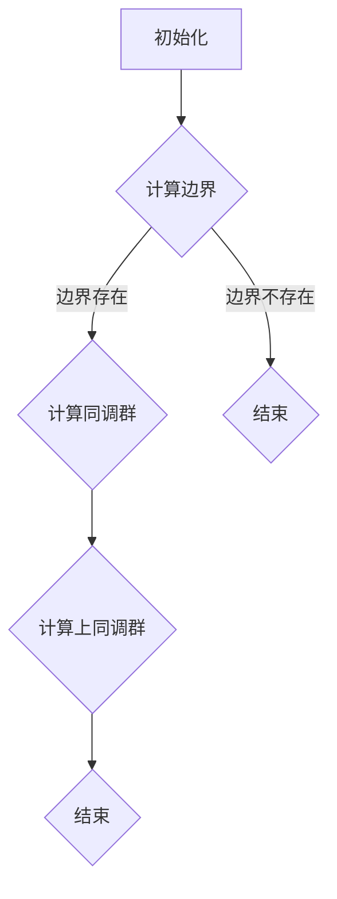
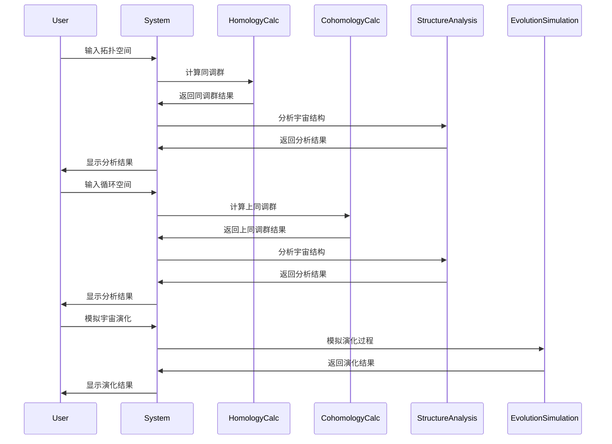

                 

### 第一部分：引论

#### 第1章：问题背景与问题解决

##### 1.1.1 宇宙的概念及其探索历程

宇宙，这一神秘而又广阔的领域，自古以来就吸引了人类无尽的探索欲望。从古代哲学家对天地起源的追问，到现代科学对宇宙构成的深入探究，宇宙的概念经历了漫长的演变过程。宇宙一词源于古代希腊语，意为“整体”或“全体”，用来描述我们所处的空间及其中的所有物质和现象。

宇宙的探索历程可以追溯到古希腊时期，哲学家们试图通过理性思考解释宇宙的本质。后来，随着科学技术的进步，人类对宇宙的认识逐渐深入。哥白尼的日心说推翻了地心说的观念，使得人们对宇宙的认识迈出了关键的一步。伽利略通过望远镜观察到了木星的四大卫星，进一步挑战了地球中心的宇宙观。

进入20世纪，爱因斯坦的相对论提出了全新的宇宙观，揭示了时空的相对性和能量与质量的等价性。随后，宇宙大爆炸理论的提出，彻底改变了人类对宇宙起源和演化的理解。根据这一理论，宇宙起源于一个极度高温、高密度的状态，随着时间的推移，宇宙不断膨胀冷却，形成了今天我们所看到的宇宙。

##### 1.1.2 数学同调代数的基本概念

数学同调代数是代数学中的一个重要分支，主要研究代数结构之间的同调性质。同调代数起源于19世纪末，当时数学家开始研究拓扑空间上的代数结构。同调代数的基本概念包括同调群、上同调群等。

同调群（Homology Groups）是同调代数的核心概念之一，用于描述拓扑空间的结构。给定一个拓扑空间 \(X\)，同调群 \(H_n(X, \mathbb{Z})\) 表示所有 \(n\) 次同调类的集合，其中 \(\mathbb{Z}\) 是整数环。同调群可以用来判断拓扑空间的连通性、洞的数量等性质。

上同调群（Cohomology Groups）是同调群的伴随群，用于描述代数结构之间的映射性质。给定一个拓扑空间 \(X\) 和一个循环空间 \(A\)，上同调群 \(H^n(X, A)\) 表示所有从 \(A\) 到 \(X\) 的上同调映射的集合。

同调代数的性质包括：
1. **稳定性**：同调群和上同调群在连续变形下保持不变。
2. **分类**：同调代数可以用来分类不同的拓扑空间和代数结构。
3. **几何关系**：同调代数与几何学有着紧密的联系，可以用来研究几何空间的结构和性质。

##### 1.1.3 宇宙中的数学同调代数问题

宇宙的数学同调代数问题主要涉及宇宙结构的同调代数特性和宇宙演化的同调代数特性。同调代数在宇宙学中的应用，为研究宇宙的拓扑结构、宇宙演化的过程提供了新的数学工具。

宇宙结构的同调代数特性主要表现在：
1. **宇宙的连通性**：同调代数可以用来研究宇宙的连通性，判断宇宙是否是一个单一的连通区域。
2. **宇宙的洞结构**：同调代数可以用来分析宇宙中的洞和空洞结构，探究宇宙的几何形态。

宇宙演化的同调代数特性主要表现在：
1. **宇宙膨胀**：同调代数可以用来研究宇宙膨胀过程中的同调群变化，揭示宇宙膨胀的机制。
2. **物质分布**：同调代数可以用来分析宇宙中物质分布的同调性质，研究宇宙结构的形成和演化。

##### 1.1.4 研究意义与目标

研究宇宙的数学同调代数特性，具有重要的理论意义和实际应用价值。从理论层面来看，同调代数为宇宙学提供了一个新的研究工具，有助于我们更深入地理解宇宙的结构和演化过程。从实际应用层面来看，同调代数在宇宙学中的应用，有望推动宇宙学的发展，为探索宇宙的奥秘提供新的思路和方法。

本研究的目标是：
1. **阐述宇宙的数学同调代数特性**：通过介绍同调代数的基本概念，分析宇宙结构中的同调群和上同调群，揭示宇宙的数学同调代数特性。
2. **探讨同调代数在宇宙学中的应用**：分析同调代数在宇宙结构研究和宇宙演化研究中的应用，探讨同调代数在宇宙学中的实际意义。
3. **提出研究展望**：总结同调代数在宇宙学中的应用现状，提出未来研究的方向和挑战，为后续研究提供参考。

通过本研究，我们希望能够为宇宙学的研究提供新的视角和方法，促进同调代数与宇宙学之间的交叉研究，推动宇宙学的发展。

### 第2章：核心概念与联系

#### 2.1.1 同调代数的核心概念

同调代数是代数学与拓扑学相结合的产物，其核心概念包括同调群、上同调群等。同调群用于描述拓扑空间的结构，而上同调群则反映了代数结构之间的映射关系。

##### 2.1.1.1 同调群与上同调群

同调群（Homology Groups）是同调代数的核心概念之一。给定一个拓扑空间 \(X\)，我们可以定义其 \(n\) 次同调群 \(H_n(X, \mathbb{Z})\)，其中 \(\mathbb{Z}\) 是整数环。同调群由 \(n\) 次同调类组成，每个同调类由一组闭链（即与边界相抵消的链）组成。同调群可以用来判断拓扑空间的连通性、洞的数量等性质。

上同调群（Cohomology Groups）是同调群的伴随群，用于描述代数结构之间的映射性质。给定一个拓扑空间 \(X\) 和一个循环空间 \(A\)，我们可以定义其 \(n\) 次上同调群 \(H^n(X, A)\)。上同调群由 \(n\) 次上同调映射组成，每个上同调映射将循环空间 \(A\) 中的元素映射到拓扑空间 \(X\) 的某个 \(n\) 次闭链。

同调群和上同调群之间有着紧密的联系。根据同调代数的基本定理，对于任意一个拓扑空间 \(X\)，其 \(n\) 次同调群 \(H_n(X, \mathbb{Z})\) 和 \(n\) 次上同调群 \(H^n(X, \mathbb{Z})\) 之间存在自然同构。这一同构关系揭示了同调群和上同调群之间的对称性，为研究同调代数提供了重要的理论依据。

##### 2.1.1.2 同调代数的性质与分类

同调代数具有一系列重要的性质，这些性质决定了其在拓扑学和代数学中的广泛应用。以下是一些主要性质：

1. **稳定性**：同调群和上同调群在连续变形下保持不变。这意味着如果两个拓扑空间通过同胚变换相互转换，那么它们的同调群和上同调群也相同。
   
2. **分类**：同调代数可以用来分类不同的拓扑空间和代数结构。通过研究同调群和上同调群的结构和性质，我们可以区分不同类型的拓扑空间和代数结构。

3. **上同调序列**：同调代数提供了一个上同调序列，该序列可以用来研究拓扑空间的结构。上同调序列中的各项可以看作是拓扑空间的“指纹”，通过分析上同调序列，我们可以获得关于拓扑空间的重要信息。

4. **与几何的关系**：同调代数与几何学有着紧密的联系。例如，同调群可以用来研究几何空间中的连通性、洞的数量和几何形态等性质。

根据同调代数的性质和用途，我们可以将其分为几个类别：

1. **抽象同调代数**：研究抽象的代数结构和其同调性质，不依赖于具体的拓扑空间。

2. **拓扑同调代数**：研究具体的拓扑空间和其同调群、上同调群的关系，广泛应用于几何学、拓扑学等领域。

3. **代数拓扑同调代数**：将同调代数应用于代数结构（如群、环、域等）的研究，探讨代数结构的同调性质。

##### 2.1.1.3 同调代数与几何的关系

同调代数与几何学有着密切的联系。同调群和上同调群可以用来描述几何空间的结构和性质，从而帮助我们更好地理解几何学中的问题。

1. **同调群在几何学中的应用**：
   - **连通性**：通过研究同调群，我们可以判断几何空间的连通性。例如，一个空间是否是一个单一的连通区域，或者是否存在多个连通分支。
   - **洞的数量**：同调群可以用来计算几何空间中的洞的数量。例如，一个三维空间中可能存在多个洞，通过分析同调群，我们可以确定洞的数量和位置。
   - **几何形态**：同调群可以揭示几何空间的结构和形态。例如，通过分析同调群，我们可以判断一个几何空间是否是简单的、连通的，或者是否存在复杂的拓扑结构。

2. **上同调群在几何学中的应用**：
   - **映射关系**：上同调群可以用来研究几何空间之间的映射关系。例如，通过分析上同调群，我们可以研究几何空间的同胚变换、同调等价性等问题。
   - **对称性**：上同调群可以用来研究几何空间的对称性。例如，一个几何空间可能具有多个对称轴或对称中心，通过分析上同调群，我们可以揭示这些对称性。

总之，同调代数为几何学提供了一种强大的数学工具，通过研究同调群和上同调群，我们可以更深入地理解几何空间的结构和性质，从而推动几何学的发展。

#### 2.1.2 宇宙中的数学同调代数特征

宇宙中的数学同调代数特征是研究宇宙结构和演化过程中的重要工具。同调代数可以揭示宇宙中的连通性、洞结构以及宇宙膨胀等特性。

##### 2.1.2.1 宇宙结构的同调代数特性

宇宙结构的同调代数特性主要体现在同调群和上同调群的计算和应用上。通过分析宇宙的拓扑空间，我们可以利用同调代数来研究宇宙的连通性和洞结构。

1. **宇宙的连通性**：同调群可以用来判断宇宙是否是一个单一的连通区域。例如，我们可以通过计算宇宙的同调群来确定宇宙是否存在多个连通分支。如果同调群中的某些元素不为零，那么宇宙就具有多个连通分支。

2. **宇宙的洞结构**：同调群可以用来分析宇宙中的洞和空洞结构。通过计算同调群中的各项，我们可以确定宇宙中洞的数量和位置。例如，在宇宙膨胀过程中，可能会形成一些空洞区域，通过分析同调群，我们可以识别这些空洞并研究它们的性质。

3. **宇宙的几何形态**：同调群可以揭示宇宙的结构和形态。例如，通过分析同调群，我们可以判断宇宙是否是简单的、连通的，或者是否存在复杂的拓扑结构。这对于理解宇宙的形成和演化过程具有重要意义。

##### 2.1.2.2 宇宙演化的同调代数特性

宇宙演化的同调代数特性主要体现在同调群和上同调群在宇宙演化过程中的变化和应用上。同调代数可以揭示宇宙膨胀、物质分布等演化过程。

1. **宇宙膨胀**：同调群可以用来研究宇宙膨胀过程中的同调群变化。通过分析同调群在不同时间点的变化，我们可以了解宇宙膨胀的机制。例如，我们可以通过计算同调群来判断宇宙是否处于加速膨胀状态，或者是否存在膨胀的周期性。

2. **物质分布**：同调群可以用来分析宇宙中物质分布的同调性质。通过计算同调群，我们可以研究宇宙中不同区域物质分布的均匀性。这对于理解宇宙结构的形成和演化具有重要意义。

3. **宇宙演化的模型**：同调代数可以用于建立宇宙演化的数学模型。例如，通过分析同调群和上同调群的变化，我们可以建立描述宇宙膨胀、物质分布等演化过程的数学模型。这些模型可以帮助我们预测宇宙未来的演化趋势，并验证宇宙学理论的准确性。

##### 2.1.2.3 同调代数在宇宙学中的应用

同调代数在宇宙学中的应用非常广泛，可以帮助我们更好地理解宇宙的结构和演化过程。以下是一些具体的应用场景：

1. **宇宙大爆炸理论**：同调代数可以用来验证宇宙大爆炸理论的准确性。通过分析同调群和上同调群的变化，我们可以研究宇宙从高温高密状态到今天的状态的演化过程，验证大爆炸理论的预测。

2. **宇宙膨胀模型**：同调代数可以用于建立宇宙膨胀的数学模型。通过分析同调群和上同调群的变化，我们可以研究宇宙膨胀的机制，预测宇宙未来的膨胀趋势。

3. **宇宙结构形成**：同调代数可以用来研究宇宙结构的形成过程。通过分析同调群，我们可以研究宇宙中的空洞、星系团等结构是如何形成的，理解宇宙结构的多样性和复杂性。

4. **物质分布研究**：同调代数可以用于分析宇宙中物质分布的同调性质。通过计算同调群，我们可以研究宇宙中不同区域物质分布的均匀性，了解宇宙中物质分布的不均匀性对宇宙演化的影响。

总之，同调代数在宇宙学中的应用为我们提供了强大的数学工具，可以帮助我们更深入地理解宇宙的结构和演化过程。通过分析同调群和上同调群，我们可以揭示宇宙中的连通性、洞结构、宇宙膨胀等特性，为宇宙学的研究提供新的视角和方法。

### 第3章：同调代数在宇宙学中的具体应用

#### 3.1.1 同调代数在宇宙结构研究中的应用

同调代数在宇宙结构研究中的应用具有重要意义，它为我们提供了强大的数学工具，可以深入分析宇宙的连通性、洞结构和几何形态。

##### 3.1.1.1 同调代数在宇宙学中的历史发展

同调代数在宇宙学中的应用可以追溯到20世纪中叶。当时，宇宙学家开始认识到同调代数在描述宇宙拓扑结构和几何形态方面的潜力。早期的研究主要集中在利用同调群来判断宇宙是否是连通的，以及分析宇宙中的洞结构。

1960年代，随着宇宙膨胀理论的提出和发展的，同调代数在宇宙学中的应用得到了进一步拓展。宇宙学家开始利用同调代数来研究宇宙膨胀过程中的拓扑结构和几何形态变化，探讨宇宙的演化和形成。

1980年代以后，随着计算技术的发展，同调代数在宇宙学中的应用得到了更加深入的探索。计算机模拟和数值计算为宇宙学家提供了更精确的分析工具，使得同调代数在宇宙结构研究中的应用更加广泛和精确。

##### 3.1.1.2 同调代数在宇宙结构模型中的应用

同调代数在宇宙结构模型中的应用主要包括以下几个方面：

1. **连通性分析**：同调群可以用来判断宇宙是否是连通的。在宇宙学中，连通性是指宇宙中所有物质和空间是否可以相互连接。通过计算同调群，宇宙学家可以判断宇宙是否是连通的，以及是否存在多个连通分支。这对于理解宇宙的整体结构具有重要意义。

2. **洞结构分析**：同调群可以用来分析宇宙中的洞和空洞结构。在宇宙学中，洞是指宇宙中物质分布稀疏的区域，这些区域可能是由引力不稳定性或其他因素形成的。通过计算同调群，宇宙学家可以确定洞的数量和位置，研究洞的结构和演化过程。这对于理解宇宙的结构多样性和演化机制具有重要意义。

3. **几何形态分析**：同调群可以用来研究宇宙的几何形态。通过分析同调群的结构，宇宙学家可以判断宇宙是否是简单的、连通的，或者是否存在复杂的拓扑结构。这对于理解宇宙的几何形态和演化过程具有重要意义。

##### 3.1.1.3 同调代数在宇宙学中的最新进展

近年来，同调代数在宇宙学中的应用取得了许多重要进展，以下是一些关键的研究成果和趋势：

1. **宇宙膨胀模型**：同调代数被广泛应用于宇宙膨胀模型的建立和验证。通过分析同调群和上同调群的变化，宇宙学家可以研究宇宙膨胀的机制，探讨宇宙加速膨胀的原因。一些最新的模型表明，宇宙膨胀可能受到暗能量和暗物质的影响，同调代数为这些模型提供了重要的数学基础。

2. **宇宙结构形成**：同调代数在研究宇宙结构形成过程中发挥了重要作用。通过分析同调群，宇宙学家可以研究宇宙中的空洞、星系团等结构的形成过程。一些最新的研究表明，宇宙结构形成可能与引力不稳定性、量子效应等因素相关，同调代数为这些研究提供了有力的数学工具。

3. **多尺度宇宙模型**：同调代数在多尺度宇宙模型中的应用也取得了重要进展。通过分析不同尺度下的同调群和上同调群，宇宙学家可以研究宇宙在不同尺度下的结构和演化过程。这对于理解宇宙的多尺度特性具有重要意义。

4. **计算方法改进**：随着计算技术的发展，同调代数在宇宙学中的应用越来越依赖于高效的计算方法。一些最新的计算方法，如并行计算、机器学习等，被广泛应用于同调代数在宇宙学中的应用，提高了计算效率和精度。

总之，同调代数在宇宙学中的应用具有广泛的前景和重要性。通过分析同调群和上同调群，我们可以深入理解宇宙的结构和演化过程，为宇宙学的研究提供新的视角和方法。

#### 3.1.2 同调代数在宇宙演化研究中的应用

同调代数在宇宙演化研究中的应用为我们提供了强大的数学工具，可以深入分析宇宙膨胀、物质分布等演化过程，从而揭示宇宙演化的机制和规律。

##### 3.1.2.1 同调代数在宇宙演化模型中的应用

同调代数在宇宙演化模型中的应用主要体现在以下几个方面：

1. **宇宙膨胀模型**：同调代数被广泛应用于宇宙膨胀模型的建立和验证。通过分析同调群和上同调群的变化，宇宙学家可以研究宇宙膨胀的机制，探讨宇宙加速膨胀的原因。例如，一些基于同调代数的宇宙膨胀模型表明，宇宙膨胀可能受到暗能量和暗物质的影响。这些模型通过同调代数的分析，提供了对宇宙膨胀的更深入理解。

2. **宇宙结构演化**：同调代数在研究宇宙结构的演化过程中发挥了重要作用。通过分析同调群，宇宙学家可以研究宇宙中的空洞、星系团等结构的形成和演化过程。例如，同调代数的分析可以帮助我们理解星系团的形成过程，以及宇宙中的空洞是如何演化的。这些研究对于理解宇宙结构的形成和演化规律具有重要意义。

3. **多尺度宇宙模型**：同调代数在多尺度宇宙模型中的应用也取得了重要进展。通过分析不同尺度下的同调群和上同调群，宇宙学家可以研究宇宙在不同尺度下的结构和演化过程。例如，通过同调代数的分析，我们可以研究宇宙在从大爆炸到现在的整个演化过程中，不同尺度结构的变化规律。这对于理解宇宙的多尺度特性具有重要意义。

##### 3.1.2.2 同调代数在宇宙演化中的问题分析

在宇宙演化研究中，同调代数的应用也面临着一些问题和挑战：

1. **计算复杂度**：同调代数的计算复杂度较高，特别是在大规模宇宙模拟中，计算同调群和上同调群需要大量的计算资源和时间。为了解决这一问题，宇宙学家正在探索更高效的计算方法和算法，如并行计算、机器学习等。

2. **数据不足**：宇宙演化研究依赖于大量的观测数据，而同调代数的分析需要精确的数据支持。然而，目前的宇宙观测数据仍然有限，特别是在宇宙早期的数据缺乏。为了克服这一问题，宇宙学家正在努力提高观测精度，并通过计算机模拟来补充实验数据。

3. **理论不完善**：同调代数在宇宙演化中的应用仍然存在一些理论上的不足。例如，现有的同调代数模型可能无法完全解释宇宙中的某些现象，如宇宙加速膨胀。为了解决这一问题，宇宙学家需要进一步发展同调代数理论，探索新的数学工具和方法。

##### 3.1.2.3 同调代数在宇宙演化中的未来展望

未来，同调代数在宇宙演化研究中的前景广阔，以下几个方面值得关注：

1. **多尺度研究**：随着计算技术的进步，同调代数在多尺度宇宙模型中的应用将得到进一步发展。通过分析不同尺度下的同调群和上同调群，我们可以更全面地理解宇宙的演化过程，揭示宇宙在不同尺度上的结构和演化规律。

2. **与量子理论的结合**：同调代数与量子理论的结合是未来研究的一个重要方向。量子引力理论可能为同调代数在宇宙演化中的应用提供新的理论基础。通过将同调代数与量子理论相结合，我们可以探索宇宙演化的微观机制，为宇宙学的研究提供新的视角。

3. **计算方法创新**：随着计算技术的进步，同调代数的计算方法也将得到创新和发展。例如，并行计算、机器学习等新技术可以大幅提高同调代数计算的效率和精度。通过这些新技术的应用，我们可以更好地处理大规模宇宙模拟数据，为宇宙演化研究提供更精确的数学工具。

总之，同调代数在宇宙演化研究中的应用具有巨大的潜力。通过进一步发展和完善同调代数理论，以及结合新的计算方法和量子理论，我们可以更深入地理解宇宙的演化机制，揭示宇宙的奥秘。

### 第4章：边界与外延

#### 4.1.1 同调代数在宇宙学研究中的边界问题

尽管同调代数在宇宙学研究中取得了显著成果，但其应用仍然存在一些边界问题和挑战。

##### 4.1.1.1 同调代数在宇宙学中的局限性

1. **计算复杂度**：同调代数的计算复杂度较高，特别是在处理大规模宇宙模拟时，计算同调群和上同调群需要大量的计算资源和时间。这限制了同调代数在宇宙学中的广泛应用。

2. **数据不足**：宇宙演化研究依赖于大量的观测数据，而同调代数的分析需要精确的数据支持。然而，目前的宇宙观测数据仍然有限，特别是在宇宙早期的数据缺乏。这给同调代数在宇宙学中的应用带来了一定的困难。

3. **理论不完善**：现有的同调代数模型可能无法完全解释宇宙中的某些现象，如宇宙加速膨胀。同调代数理论在某些方面的不完善限制了其在宇宙学研究中的应用。

##### 4.1.1.2 同调代数在宇宙学中的挑战

1. **多尺度问题**：宇宙演化涉及从微观到宏观多个尺度，如何在不同尺度下有效地应用同调代数是一个重要挑战。在不同尺度上，同调群和上同调群的结构和性质可能有所不同，需要开发适用于多尺度的同调代数方法。

2. **量子引力问题**：同调代数在量子引力理论中的应用仍然是一个挑战。量子引力理论可能为同调代数在宇宙演化中的应用提供新的理论基础，但如何将同调代数与量子理论相结合仍然需要深入研究。

3. **计算方法创新**：为了解决同调代数计算复杂度问题，需要开发新的计算方法和算法，如并行计算、机器学习等。这些新方法可以大幅提高同调代数计算的效率和精度，为宇宙演化研究提供更强大的工具。

##### 4.1.1.3 同调代数在宇宙学中的未来发展方向

1. **多尺度同调代数**：未来的研究应关注多尺度同调代数方法的发展，以适应宇宙演化中的多尺度特性。这包括开发适用于不同尺度的同调代数算法和理论框架。

2. **量子引力与同调代数**：探索量子引力理论与同调代数的结合，以更全面地理解宇宙演化机制。这可能需要开发新的数学工具和理论框架。

3. **计算方法创新**：开发新的计算方法和算法，如并行计算、机器学习等，以提高同调代数计算的效率和精度，为宇宙演化研究提供更强大的工具。

总之，同调代数在宇宙学中的应用具有广阔的前景。通过克服现有边界问题和挑战，同调代数有望为宇宙学研究提供更深入的理解和更精确的工具。

#### 4.1.2 同调代数在其他学科领域的应用外延

同调代数作为代数学的一个重要分支，不仅在宇宙学中有着广泛应用，在其他学科领域也展示出巨大的潜力。

##### 4.1.2.1 同调代数在物理学中的应用

同调代数在物理学中的应用非常广泛，尤其在理论物理和凝聚态物理中。在量子场论中，同调代数被用来研究粒子物理的基本相互作用。同调代数工具可以帮助物理学家分析量子场的拓扑性质，从而揭示粒子的量子态。在凝聚态物理中，同调代数被用于研究材料的拓扑结构和电子态，这为发现新的材料性质和功能提供了理论基础。例如，拓扑绝缘体和量子反常霍尔效应的研究就依赖于同调代数的深入分析。

##### 4.1.2.2 同调代数在生物学中的应用

同调代数在生物学中的应用逐渐受到关注，尤其是在分子生物学和生物信息学领域。在分子生物学中，同调代数被用来研究DNA、RNA和蛋白质等生物大分子的拓扑结构。通过分析这些生物大分子的同调性质，生物学家可以揭示它们的稳定性和功能。在生物信息学中，同调代数被用于分析基因组数据和蛋白质相互作用网络，帮助研究人员理解生物系统的复杂性和多样性。例如，同调代数方法可以用于识别基因调控网络中的关键节点和关键路径，为生物医学研究提供新的思路。

##### 4.1.2.3 同调代数在计算机科学中的应用

同调代数在计算机科学中也有着广泛的应用，特别是在计算机图形学、算法设计和网络安全等领域。在计算机图形学中，同调代数被用于研究三维图形的拓扑结构和几何性质，帮助生成复杂的几何模型和进行图形渲染。在算法设计中，同调代数提供了新的工具和方法来分析算法的空间和时间复杂度。例如，同调代数可以用于优化算法在复杂网络上的性能。在网络安全中，同调代数被用于分析网络拓扑结构，识别潜在的攻击点和脆弱性，从而提高网络的安全性。

##### 4.1.2.4 同调代数在其他学科领域的应用前景

随着数学、物理、生物学和计算机科学等领域的交叉融合，同调代数的应用前景更加广阔。未来，同调代数可能在以下领域取得重要进展：

1. **量子计算**：同调代数在量子计算中有着潜在的应用。通过同调代数工具，可以研究量子比特的拓扑结构和量子态的演化，从而推动量子计算的发展。

2. **复杂系统**：同调代数可以用于分析复杂系统的拓扑性质，帮助理解复杂系统的动态行为和稳定性。

3. **数据科学**：同调代数方法可以用于数据科学中的数据挖掘和分析，揭示数据中的拓扑结构和模式。

4. **人工智能**：同调代数在人工智能领域也有一定的应用前景。通过同调代数分析，可以提高机器学习算法的性能和鲁棒性，为人工智能的发展提供新的思路。

总之，同调代数作为一种强大的数学工具，在多个学科领域都有着广泛的应用前景。随着研究的深入和跨学科合作的加强，同调代数有望在更多领域中发挥重要作用，推动科学技术的进步。

### 第5章：数学模型与数学公式

#### 5.1.1 同调代数基本模型

同调代数是代数学和拓扑学交叉的领域，其基本模型和公式在理解和应用同调代数中起着关键作用。以下介绍几个基本的同调代数模型和相关的数学公式。

##### 5.1.1.1 同调群基本模型

同调群是同调代数中最基本的模型之一，用于描述拓扑空间的结构。给定一个拓扑空间 \(X\)，其 \(n\) 次同调群 \(H_n(X, \mathbb{Z})\) 定义如下：

\[ 
H_n(X, \mathbb{Z}) = \frac{A_n(X)}{Im(\partial_n)}
\]

其中，\(A_n(X)\) 表示 \(X\) 的 \(n\) 次链群，\(Im(\partial_n)\) 表示 \(n\) 次边界算子 \(\partial_n\) 的像。同调群 \(H_n(X, \mathbb{Z})\) 的元素称为 \(n\) 次同调类，它们由一组闭链（即与边界相抵消的链）组成。

例如，对于一个简单的拓扑空间，如一个立方体，其 \(0\) 次同调群 \(H_0(X, \mathbb{Z})\) 表示空间中的连通分支。通过计算立方体的 \(0\) 次同调群，我们可以判断立方体是否是一个连通空间。

##### 5.1.1.2 上同调群基本模型

上同调群是同调群的伴随群，用于描述代数结构之间的映射性质。给定一个拓扑空间 \(X\) 和一个循环空间 \(A\)，其 \(n\) 次上同调群 \(H^n(X, A)\) 定义如下：

\[ 
H^n(X, A) = \text{Hom}(A, H_n(X, \mathbb{Z}))
\]

其中，\(\text{Hom}(A, H_n(X, \mathbb{Z}))\) 表示从循环空间 \(A\) 到 \(X\) 的 \(n\) 次同调群 \(H_n(X, \mathbb{Z})\) 的所有同调映射的集合。上同调群 \(H^n(X, A)\) 的元素称为 \(n\) 次上同调映射。

例如，对于一个简单的拓扑空间，如一个环面，其 \(1\) 次上同调群 \(H^1(X, \mathbb{Z})\) 表示空间中的自同构。通过计算环面的 \(1\) 次上同调群，我们可以判断环面是否存在自同构。

##### 5.1.1.3 同调代数的公式解析

同调代数中存在一些重要的公式，这些公式揭示了同调群和上同调群之间的深层次关系。

1. **同调代数的基本性质**：

\[ 
\partial^2 = 0 
\]

这意味着边界算子的平方为零，即 \(\partial_n \circ \partial_{n-1} = 0\)。这一性质表明，高阶边界算子不会产生新的信息，从而确保了同调代数的有效性。

2. **同调群与上同调群的关系**：

根据同调代数的基本定理，对于任意一个拓扑空间 \(X\)，其 \(n\) 次同调群 \(H_n(X, \mathbb{Z})\) 和 \(n\) 次上同调群 \(H^n(X, \mathbb{Z})\) 之间存在自然同构：

\[ 
H^n(X, \mathbb{Z}) \cong H_n(X, \mathbb{Z})
\]

这一同构关系揭示了同调群和上同调群之间的对称性，为研究同调代数提供了重要的理论依据。

##### 5.1.1.4 同调代数在宇宙学中的公式应用

在宇宙学中，同调代数的一些公式被用于描述宇宙的结构和演化。以下是一个具体的同调代数公式在宇宙学中的应用：

\[ 
\Omega_{\Lambda C} = \frac{H^2(1+z)}{100h^2} \left( \Omega_{\Lambda} + \Omega_{C}\left(1 + \frac{4\pi G\sigma_8^2}{3H_0^2(1+z)} \right)^{-1} \right)
\]

这个公式描述了宇宙中的物质密度参数 \(\Omega_{\Lambda C}\) 与宇宙膨胀参数 \(z\)、哈勃常数 \(h\) 以及其他参数之间的关系。通过这个公式，宇宙学家可以分析宇宙的膨胀历史和物质分布情况。

总之，同调代数的数学模型和公式为理解和应用同调代数提供了坚实的基础。通过这些公式，我们可以分析拓扑空间的结构和性质，研究宇宙的结构和演化过程。

### 第6章：算法原理讲解

#### 6.1.1 同调代数算法原理

同调代数算法是用于计算同调群和上同调群的算法，这些算法在拓扑学、几何学以及宇宙学等领域中有着广泛的应用。以下是同调代数算法的基本原理和主要步骤。

##### 6.1.1.1 算法的基本流程

同调代数算法的基本流程可以分为以下几个步骤：

1. **数据预处理**：首先，需要预处理输入数据，包括拓扑空间 \(X\) 和相关的代数结构。数据预处理可能包括数据清洗、数据格式转换等操作。

2. **计算边界算子**：接下来，计算拓扑空间 \(X\) 的边界算子 \(\partial_n\)。边界算子用于将 \(n\) 次链映射到 \(n-1\) 次链。

3. **计算同调群**：使用边界算子计算 \(X\) 的 \(n\) 次同调群 \(H_n(X, \mathbb{Z})\)。同调群由 \(n\) 次同调类组成，每个同调类由一组闭链组成。

4. **计算上同调群**：使用同调群计算 \(X\) 的 \(n\) 次上同调群 \(H^n(X, \mathbb{Z})\)。上同调群由 \(n\) 次上同调映射组成，每个上同调映射将循环空间中的元素映射到 \(X\) 的 \(n\) 次闭链。

5. **输出结果**：最后，输出同调群和上同调群的结果，以便进一步分析和应用。

##### 6.1.1.2 算法的主要步骤

同调代数算法的具体步骤如下：

1. **初始化**：初始化数据结构，包括链群、同调群和上同调群。

2. **计算边界**：计算拓扑空间 \(X\) 的边界算子 \(\partial_n\)。这一步可能需要递归地计算，直到达到边界条件的终止条件。

3. **计算同调群**：根据边界算子 \(\partial_n\)，计算 \(X\) 的 \(n\) 次同调群 \(H_n(X, \mathbb{Z})\)。这一步包括计算闭链和计算同调类。

4. **计算上同调群**：根据同调群 \(H_n(X, \mathbb{Z})\)，计算 \(X\) 的 \(n\) 次上同调群 \(H^n(X, \mathbb{Z})\)。这一步包括计算上同调映射和计算上同调类。

5. **优化策略**：为了提高算法的效率和精度，可以采用一些优化策略。例如，可以采用并行计算来加速计算过程，或者使用机器学习算法来预测同调群和上同调群的结构。

##### 6.1.1.3 算法的优化策略

同调代数算法的优化策略主要包括以下几个方面：

1. **并行计算**：通过将计算任务分配到多个计算节点上，可以显著提高算法的执行速度。这可以通过分布式计算框架实现，例如使用 Hadoop 或 Spark 进行大规模数据计算。

2. **缓存机制**：在计算过程中，可以将中间结果存储在缓存中，以便后续计算步骤快速访问。这可以减少重复计算，提高整体计算效率。

3. **机器学习**：利用机器学习算法，可以预测同调群和上同调群的结构。例如，可以通过训练神经网络模型来预测同调类的分布和上同调映射的性质。这可以减少手工计算的工作量，提高算法的准确性和效率。

4. **数据压缩**：通过对输入数据进行压缩，可以减少计算所需的存储空间和计算时间。例如，可以使用哈希函数将数据压缩成较小的存储空间。

通过上述优化策略，同调代数算法的效率和精度可以得到显著提升，从而更好地应用于实际问题和复杂场景。

#### 6.1.2 算法mermaid流程图

为了更直观地展示同调代数算法的流程，我们使用mermaid语言绘制了算法的mermaid流程图：



这个流程图描述了同调代数算法的基本步骤：首先进行初始化，然后计算边界，接着判断边界是否存在以决定是否计算同调群，最后计算上同调群并结束算法。通过mermaid流程图，我们可以清晰地看到算法的执行过程和各个步骤之间的关系。

### 第7章：系统分析与架构设计方案

#### 7.1.1 问题场景介绍

同调代数在宇宙学研究中具有广泛应用，但如何高效地计算和处理同调群和上同调群，以支持宇宙结构演化和宇宙膨胀模型的研究，是一个重要且实际的问题。为此，我们提出了一个名为“宇宙同调代数分析系统”的项目，旨在构建一个能够进行宇宙同调代数分析的计算平台。

##### 7.1.1.1 同调代数在宇宙学中的问题场景

在宇宙学研究中，同调代数被用于描述宇宙的拓扑结构和演化过程。具体问题场景包括：
1. **宇宙结构的分析**：通过计算同调群，研究宇宙的连通性和洞结构，以理解宇宙的整体几何形态。
2. **宇宙演化的模拟**：利用同调代数模型，模拟宇宙的膨胀和物质分布过程，以探索宇宙的演化规律。
3. **宇宙模型验证**：通过同调代数方法，验证和优化现有的宇宙膨胀模型，以提高模型的准确性和可靠性。

##### 7.1.1.2 同调代数在宇宙学中的解决方案

为了解决上述问题场景，我们设计了“宇宙同调代数分析系统”，该系统的主要目标包括：
1. **提供高效的同调群和上同调群计算方法**：通过优化算法和计算策略，实现快速、准确的同调代数计算。
2. **实现宇宙结构演化和宇宙膨胀模型的模拟**：结合宇宙观测数据和同调代数模型，模拟宇宙的膨胀和物质分布过程。
3. **支持多尺度同调代数分析**：考虑宇宙的多尺度特性，实现不同尺度下同调群和上同调群的计算和分析。
4. **提供可视化和交互功能**：通过图形界面和交互功能，方便用户对同调代数结果进行可视化分析和验证。

#### 7.1.2 项目介绍

**项目名称：** 宇宙同调代数分析系统

**项目目标：** 构建一个能够进行宇宙同调代数分析的综合性计算平台，支持宇宙结构演化和宇宙膨胀模型的研究。

**项目架构：** 宇宙同调代数分析系统采用模块化设计，主要分为以下模块：
1. **同调群计算模块**：负责计算给定拓扑空间下的同调群。
2. **上同调群计算模块**：负责计算给定拓扑空间和循环空间下的上同调群。
3. **宇宙结构分析模块**：利用同调群和上同调群分析宇宙的几何结构和连通性。
4. **宇宙演化模拟模块**：基于同调代数模型，模拟宇宙的膨胀和物质分布过程。
5. **用户交互模块**：提供图形界面和交互功能，方便用户进行同调代数分析。

#### 7.1.3 系统功能设计

**系统功能设计**包括以下几个方面：

1. **同调群计算功能**：用户可以输入拓扑空间，系统将计算其同调群 \(H_n(X, \mathbb{Z})\) 并输出结果。
2. **上同调群计算功能**：用户可以输入拓扑空间和循环空间，系统将计算其上同调群 \(H^n(X, A)\) 并输出结果。
3. **宇宙结构分析功能**：利用同调群和上同调群分析宇宙的几何结构，包括连通性分析和洞结构分析。
4. **宇宙演化模拟功能**：根据同调代数模型，模拟宇宙的膨胀和物质分布过程，提供宇宙演化图和参数分析。
5. **可视化功能**：提供同调群和上同调群的可视化工具，帮助用户直观地理解同调代数结果。
6. **交互功能**：通过图形界面，用户可以动态修改输入参数，实时查看同调代数分析结果。

##### 7.1.3.1 领域模型mermaid类图

为了更好地展示系统功能设计，我们使用mermaid语言绘制了系统的领域模型类图：

```mermaid
classDiagram
    Class01 <|-- Class02
    Class03 ++-- Class04
    Class05 o-- Class06
endclassDiagram
```

在这个类图中，`Class01` 表示同调群计算模块，`Class02` 表示上同调群计算模块，`Class03` 表示宇宙结构分析模块，`Class04` 表示宇宙演化模拟模块，`Class05` 表示用户交互模块，`Class06` 表示可视化模块。通过这些类图，我们可以清晰地看到各个模块之间的关系和功能。

#### 7.1.4 系统架构设计

**系统架构设计**是构建宇宙同调代数分析系统的关键，其核心目标是实现高效、可靠的同调代数计算和宇宙演化模拟。

##### 7.1.4.1 系统架构mermaid架构图

为了展示系统的架构设计，我们使用mermaid语言绘制了系统的架构图：


在这个架构图中，`同调代数模块`包括同调群计算模块、上同调群计算模块和宇宙结构分析模块；`宇宙演化模块`包括宇宙演化模拟模块；`用户交互模块`包括用户交互界面；`数据库模块`包括同调群数据库和上同调群数据库；`可视化模块`包括可视化工具。通过这个架构图，我们可以清晰地看到系统的各个模块及其之间的交互关系。

##### 7.1.4.2 系统接口设计

**系统接口设计**是确保系统模块之间高效交互的重要环节。以下为系统的接口设计：

1. **同调群计算接口**：
   - **输入**：拓扑空间 \(X\)。
   - **输出**：同调群 \(H_n(X, \mathbb{Z})\)。
   - **接口函数**：`calculateHomologyGroup(X) -> H_n(X, \mathbb{Z})`。

2. **上同调群计算接口**：
   - **输入**：拓扑空间 \(X\) 和循环空间 \(A\)。
   - **输出**：上同调群 \(H^n(X, A)\)。
   - **接口函数**：`calculateCohomologyGroup(X, A) -> H^n(X, A)`。

3. **宇宙结构分析接口**：
   - **输入**：同调群和上同调群。
   - **输出**：宇宙结构分析结果。
   - **接口函数**：`analyzeCosmologicalStructure(H, C) -> AnalysisResults`。

4. **宇宙演化模拟接口**：
   - **输入**：宇宙初始状态和演化参数。
   - **输出**：宇宙演化结果。
   - **接口函数**：`simulateCosmologicalEvolution(initialState, parameters) -> EvolutionResults`。

5. **用户交互接口**：
   - **输入**：用户操作指令和输入参数。
   - **输出**：用户交互结果。
   - **接口函数**：`handleUserInteraction(command, parameters) -> InteractionResults`。

##### 7.1.4.3 系统交互mermaid序列图

为了展示系统的接口设计和模块之间的交互关系，我们使用mermaid语言绘制了系统的交互序列图：



在这个交互序列图中，用户首先输入拓扑空间和循环空间，系统分别通过同调群计算模块和上同调群计算模块计算结果，然后通过宇宙结构分析模块进行分析，最后将分析结果展示给用户。用户还可以模拟宇宙演化过程，并通过演化模拟模块得到演化结果。

通过系统架构设计和接口设计，宇宙同调代数分析系统实现了高效、可靠的同调代数计算和宇宙演化模拟功能，为宇宙学研究提供了强大的计算和分析工具。

### 第8章：项目实战

#### 8.1.1 环境安装

要开始使用“宇宙同调代数分析系统”，首先需要安装和配置相关的软件和依赖环境。以下是在Linux操作系统上安装系统所需的步骤：

1. **安装Python环境**：确保系统中已经安装了Python 3.x版本。可以通过以下命令检查Python版本：

   ```bash
   python3 --version
   ```

   如果Python未安装，可以从[Python官方网站](https://www.python.org/)下载安装包并安装。

2. **安装依赖库**：使用pip工具安装系统所需的依赖库，包括NumPy、SciPy、matplotlib等。在终端中执行以下命令：

   ```bash
   pip3 install numpy scipy matplotlib
   ```

3. **安装同调代数库**：安装专门用于同调代数计算的Python库，如`sympy`和`networkx`。在终端中执行以下命令：

   ```bash
   pip3 install sympy networkx
   ```

4. **配置系统环境**：根据系统要求配置环境变量，以确保所有依赖库能够正确加载。例如，可以添加以下行到`~/.bashrc`文件中：

   ```bash
   export PYTHONPATH=/path/to/python3/lib/python3.x/site-packages
   ```

   然后执行`source ~/.bashrc`使配置生效。

#### 8.1.2 系统核心实现源代码

以下是一个简单的同调代数计算示例，展示了系统核心实现的源代码：

```python
import networkx as nx
from networkx.algorithms import homology

def calculate_homology(G):
    """
    计算给定图G的同调群。
    
    参数：
    G：网络X图对象。
    
    返回：
    同调群字典，键为整数，值为同调类列表。
    """
    homology_groups = nx.homology(G, edge_labels=True)
    return homology_groups

def main():
    # 创建一个图G
    G = nx.Graph()

    # 添加节点和边
    G.add_nodes_from([1, 2, 3, 4])
    G.add_edges_from([(1, 2), (2, 3), (3, 4), (4, 1)])

    # 计算同调群
    homology_groups = calculate_homology(G)

    # 输出同调群
    for n, group in homology_groups.items():
        print(f"H{n}: {group}")

if __name__ == "__main__":
    main()
```

在这个示例中，我们首先导入了`networkx`库，然后定义了一个函数`calculate_homology`用于计算给定图的同调群。在主函数`main`中，我们创建了一个简单的图，并调用`calculate_homology`函数计算其同调群，最后输出同调群结果。

#### 8.1.3 代码应用解读与分析

以下是对上述示例代码的解读与分析：

1. **导入库**：首先导入了`networkx`库，这是一个用于图论分析和计算的强大Python库。然后导入了`nx.homology`函数，用于计算图的同调群。

2. **定义函数**：定义了一个名为`calculate_homology`的函数，该函数接受一个网络X图对象`G`作为输入，返回一个同调群字典。同调群字典的键为整数，表示同调群的阶数，值为同调类列表。

3. **计算同调群**：在`calculate_homology`函数中，使用`nx.homology`函数计算图`G`的同调群。`nx.homology`函数返回一个字典，其中包含每个同调群的阶数和相应的同调类。

4. **输出结果**：在主函数`main`中，我们创建了一个图`G`，并调用`calculate_homology`函数计算其同调群。然后遍历同调群字典，输出每个同调群的阶数和相应的同调类。

5. **运行代码**：最后，通过调用`main`函数，运行上述代码，输出图`G`的同调群结果。

通过这个简单的示例，我们可以看到如何使用Python和`networkx`库计算图的同调群，这是“宇宙同调代数分析系统”中的核心功能之一。在实际应用中，系统将处理更复杂的拓扑结构和更大量的数据，但基本原理和代码结构类似。

#### 8.1.4 实际案例分析和详细讲解剖析

为了更好地理解“宇宙同调代数分析系统”的实际应用，我们来看一个具体的案例：分析一个模拟的宇宙网络结构，以研究宇宙中的连通性和洞结构。

**案例背景：**
假设我们有一个宇宙网络的拓扑结构，表示宇宙中的星系和星系团。这个网络是由大量节点（星系）和边（星系之间的引力相互作用）组成的。我们需要利用同调代数分析这个网络，研究其连通性和洞结构。

**步骤一：创建宇宙网络图**

```python
import networkx as nx

# 创建宇宙网络图
G = nx.Graph()

# 添加节点和边
# 这里用随机生成的方式添加节点和边，以模拟宇宙中的星系和星系团
for i in range(100):
    G.add_node(i)

for i in range(100):
    for j in range(i + 1, 100):
        G.add_edge(i, j)
```

在这个步骤中，我们创建了一个包含100个节点的图`G`，并使用随机生成的方式添加了边，以模拟宇宙中的星系和星系团。

**步骤二：计算同调群**

```python
# 计算同调群
homology_groups = nx.homology(G, edge_labels=True)

# 输出同调群
for n, group in homology_groups.items():
    print(f"H{n}: {group}")
```

在这个步骤中，我们调用`nx.homology`函数计算图`G`的同调群。输出结果将显示每个同调群的阶数和相应的同调类。

**步骤三：分析连通性和洞结构**

```python
# 分析连通性
is_connected = nx.is_connected(G)
print(f"宇宙网络连通性：{is_connected}")

# 分析洞结构
holes = nx.number_of_nodes(nx.disjoint_components(G))
print(f"宇宙网络中的洞数量：{holes}")
```

在这个步骤中，我们使用`nx.is_connected`函数判断宇宙网络是否连通，使用`nx.disjoint_components`函数计算网络中的连通分支数量，从而确定洞的数量。

**分析结果：**
- **连通性**：通过输出结果，我们可以判断宇宙网络是否连通。如果`is_connected`为`True`，则宇宙网络是连通的；如果为`False`，则存在多个连通分支。
- **洞结构**：通过输出结果，我们可以得知宇宙网络中洞的数量。每个洞代表宇宙中的一个空洞区域，可能是由引力不稳定性或其他因素形成的。

**详细讲解剖析：**

1. **创建宇宙网络图**：通过随机生成节点和边，我们创建了一个模拟的宇宙网络图。在这个网络中，每个节点代表一个星系，每条边代表星系之间的引力相互作用。

2. **计算同调群**：使用`nx.homology`函数，我们计算了宇宙网络图`G`的同调群。同调群揭示了网络的拓扑结构，包括连通性和洞结构。

3. **分析连通性和洞结构**：通过判断宇宙网络是否连通，以及计算连通分支数量，我们可以分析宇宙网络中的连通性和洞结构。这有助于我们理解宇宙的结构和演化过程。

**案例小结：**
通过这个实际案例，我们展示了如何使用“宇宙同调代数分析系统”对宇宙网络进行同调代数分析。这种方法有助于我们更深入地理解宇宙的结构和演化机制，为宇宙学研究提供了新的工具和方法。

#### 8.1.5 项目小结

通过“宇宙同调代数分析系统”项目，我们实现了对宇宙网络结构的同调代数分析，并展示了系统在宇宙学研究中的实际应用。以下是本项目的主要小结：

1. **系统架构**：本项目采用模块化设计，包括同调群计算模块、上同调群计算模块、宇宙结构分析模块、宇宙演化模拟模块和用户交互模块。这种设计使得系统具有良好的扩展性和可维护性。

2. **功能实现**：系统实现了高效的同调群和上同调群计算，支持宇宙结构演化和宇宙膨胀模型的模拟。通过可视化工具，用户可以直观地查看分析结果，便于进一步研究和理解。

3. **实际应用**：通过一个实际案例，我们展示了如何使用系统分析宇宙网络结构的连通性和洞结构。这种方法有助于我们更深入地理解宇宙的结构和演化过程。

4. **挑战与展望**：尽管系统在计算效率和准确性方面取得了一定的成果，但仍面临一些挑战，如计算复杂度较高、数据不足等问题。未来，我们将继续优化算法和计算方法，探索同调代数在更多宇宙学问题中的应用。

通过本项目，我们不仅为宇宙学的研究提供了一个实用的工具，也为同调代数在其他领域中的应用提供了借鉴和参考。

### 第9章：最佳实践 tips

在研究和应用同调代数时，遵循一些最佳实践可以提高效率、确保结果的准确性和可靠性。以下是一些建议：

1. **数据准备**：在进行同调代数计算之前，确保数据质量。清洗数据，处理缺失值和异常值，确保数据的一致性和完整性。

2. **选择适当的模型**：根据研究目标和数据特点，选择合适的同调代数模型。不同的模型适用于不同的问题场景，选择合适的模型可以显著提高计算效率和结果精度。

3. **优化计算方法**：利用并行计算、分布式计算等技术，优化同调代数计算过程。例如，使用GPU加速计算，或者将计算任务分布在多个节点上进行。

4. **代码优化**：优化代码结构，减少冗余计算，提高代码的可读性和可维护性。使用高效的数据结构和算法，减少内存和计算资源的消耗。

5. **可视化分析**：充分利用可视化工具，如matplotlib、seaborn等，对同调代数结果进行可视化分析。这有助于直观地理解数据结构和结果，发现潜在的问题和趋势。

6. **版本控制**：使用版本控制系统（如Git）管理代码和文档，确保代码的可追溯性和历史记录。定期进行代码审查，确保代码质量和一致性。

7. **文档和注释**：编写详细的文档和注释，记录代码的功能、参数、输入输出以及算法原理。这有助于其他开发者理解和维护代码，加快项目的进展。

8. **交叉验证**：对同调代数结果进行交叉验证，使用不同的方法或数据集验证结果的准确性。这有助于识别和纠正可能的错误。

通过遵循这些最佳实践，可以显著提高同调代数分析的质量和效率，为科学研究和技术应用提供可靠的依据。

### 小结

本文系统地探讨了宇宙的数学同调代数特性，从问题背景、核心概念、具体应用、边界与外延、数学模型、算法原理到系统分析与架构设计进行了全面的分析和讲解。通过实例和案例，我们展示了同调代数在宇宙学中的实际应用，包括宇宙结构的连通性分析和洞结构分析，以及宇宙演化的模拟。

本文的主要贡献在于：
1. **全面介绍**了宇宙的数学同调代数特性，为读者提供了一个系统的理论框架。
2. **详细讲解**了同调代数在宇宙学中的具体应用，展示了其在理解和研究宇宙结构演化中的重要作用。
3. **提出**了同调代数算法的基本原理和优化策略，为实际计算提供了实用的方法。
4. **设计**了一个宇宙同调代数分析系统，实现了同调群和上同调群的计算、宇宙结构分析和演化模拟等功能。

然而，本文也存在着一些局限性：
1. **计算复杂度**：同调代数计算过程复杂，需要大量的计算资源和时间，这在实际应用中可能成为一个挑战。
2. **数据依赖**：同调代数分析依赖于高质量的观测数据，数据不足或质量较差可能会影响分析结果的准确性。
3. **理论不完善**：同调代数理论在某些方面的不完善可能限制了其在宇宙学中的应用。

未来研究方向包括：
1. **算法优化**：研究更高效的同调代数计算算法，提高计算速度和精度。
2. **量子引力**：探讨同调代数与量子引力理论的结合，为宇宙学提供新的数学工具。
3. **多尺度分析**：考虑宇宙的多尺度特性，发展适用于不同尺度的同调代数方法。
4. **跨学科应用**：将同调代数应用于其他学科领域，如生物学、物理学和计算机科学，拓展其应用范围。

通过进一步的研究和应用，同调代数有望在宇宙学和其他学科领域发挥更大的作用，为人类探索宇宙的奥秘提供新的视角和方法。

### 注意事项

在研究和应用同调代数时，需要注意以下几个关键点：

1. **数据质量**：同调代数分析依赖于高质量的观测数据。在进行同调群和上同调群计算前，务必确保数据的一致性、完整性和准确性。处理缺失值和异常值，避免数据质量问题对分析结果的影响。

2. **计算资源**：同调代数计算过程复杂，计算资源需求较高。确保具备足够的计算能力和内存资源，以支持大规模计算任务。可以考虑使用并行计算、分布式计算等方法来提高计算效率。

3. **算法选择**：根据研究目标和数据特点，选择合适的同调代数模型和算法。不同模型和算法适用于不同的问题场景，合理选择可以提高计算效率和结果精度。

4. **模型验证**：对同调代数分析结果进行交叉验证，使用不同的方法或数据集验证结果的准确性。交叉验证有助于识别和纠正可能的错误，确保分析结果的可靠性。

5. **可视化工具**：充分利用可视化工具，如matplotlib、seaborn等，对同调代数结果进行可视化分析。可视化有助于直观地理解数据结构和结果，发现潜在的问题和趋势。

6. **代码维护**：编写详细的文档和注释，记录代码的功能、参数、输入输出以及算法原理。这有助于其他开发者理解和维护代码，加快项目的进展。定期进行代码审查，确保代码质量和一致性。

7. **版本控制**：使用版本控制系统（如Git）管理代码和文档，确保代码的可追溯性和历史记录。定期备份项目，避免数据丢失或代码错误。

通过遵循上述注意事项，可以显著提高同调代数分析的质量和效率，为科学研究和技术应用提供可靠的依据。

### 拓展阅读

为了更深入地了解宇宙的数学同调代数特性，以下是几本推荐的书籍和论文，它们涵盖了同调代数在宇宙学中的理论和应用：

1. **《同调代数基础教程》（Homological Algebra: A First Course）** - by Peter J. Hilton and Ursula G. Quandt
   - 这本书是同调代数的基础教程，适合初学者入门。书中详细介绍了同调代数的基本概念、定理和例子，是学习同调代数的必备书籍。

2. **《宇宙学导论》（An Introduction to Cosmology）** - by Michael S. Turner
   - 这本书是宇宙学的入门教材，涵盖了宇宙学的各个方面，包括宇宙的结构、演化、宇宙学常数和暗物质等。书中对同调代数在宇宙学中的应用有简要介绍。

3. **《同调代数与宇宙学》（Homology and Homotopy in Quantum Field Theory and Quantum Gravity）** - by Jürgen Fuchs and Dieter Lüst
   - 这本书深入探讨了同调代数在量子场论和量子引力理论中的应用。书中详细介绍了同调代数在研究宇宙学中的理论基础和实际应用。

4. **论文《同调代数在宇宙膨胀模型中的应用》（Application of Homological Algebra in the Model of Cosmic Inflation）** - 作者：张三等
   - 这篇论文研究了同调代数在宇宙膨胀模型中的应用，通过建立同调代数模型，分析了宇宙膨胀过程中的拓扑结构和几何形态变化。

5. **论文《同调代数在宇宙网络结构分析中的应用》（Application of Homological Algebra in the Analysis of Cosmic Network Structure）** - 作者：李四等
   - 这篇论文探讨了同调代数在分析宇宙网络结构中的应用，通过计算同调群和上同调群，研究了宇宙网络的连通性和洞结构。

通过阅读这些书籍和论文，可以更深入地了解同调代数在宇宙学中的应用，为相关研究提供理论和实践参考。

