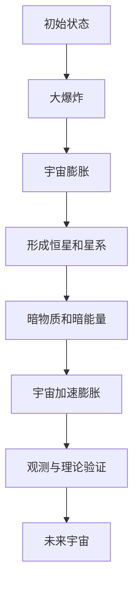

                 

### 宇宙的数学同调理论探讨

#### 关键词：宇宙，数学同调理论，黑洞，暗物质，暗能量，量子引力

#### 摘要：

宇宙的数学同调理论探讨旨在揭示数学同调理论在宇宙学研究中的重要性和应用价值。本文将从宇宙的基本构成与演化过程、数学同调理论的起源与发展、同调理论在宇宙学研究中的应用等多个角度，逐步深入探讨宇宙中的数学同调现象。通过分析宇宙演化的数学模型、同调理论在黑洞和天体物理学中的应用，以及同调理论在宇宙暗物质与暗能量研究中的角色，本文将展示数学同调理论在理解宇宙现象和解决宇宙学难题中的独特作用。此外，本文还将探讨数学同调理论在量子引力、宇宙弦与膜理论等宇宙学与数学交叉领域的进展，并给出具体的应用案例。通过对宇宙的数学同调理论的全面探讨，本文旨在为读者提供一个深入理解宇宙及其演化规律的视角，并激发对数学同调理论在宇宙学中应用的思考。

### 第一部分：问题背景与核心概念

#### 第1章：宇宙与数学同调理论的起源

宇宙，这个浩瀚的宇宙，自古以来就吸引了人类的关注。从古代的哲学家到现代的科学家，无数人试图揭示宇宙的奥秘。然而，宇宙的构成与演化过程一直是一个复杂且充满挑战的研究课题。同样，数学同调理论，作为一种高度抽象的数学工具，在过去的几百年里，也经历了不断的发展和完善。

#### 1.1.1 宇宙的基本构成与演化过程

宇宙的基本构成主要包括基本粒子、暗物质、暗能量等。基本粒子是构成宇宙的基本单位，如电子、夸克等。暗物质是一种不发光、不吸收光线的物质，占据宇宙总质量的大部分。暗能量则是推动宇宙加速膨胀的力量，其性质至今仍不完全清楚。

宇宙的演化过程可以分为几个重要阶段。首先是大爆炸，即宇宙从一个极高密度和温度的状态迅速膨胀开来。随着宇宙的膨胀，温度逐渐降低，形成了各种基本粒子。随后，物质与能量相互作用，形成了恒星、星系等宇宙结构。

#### 1.1.2 数学同调理论的起源与发展

数学同调理论的起源可以追溯到19世纪末期。当时的数学家开始关注空间的结构和几何性质，并尝试寻找一种统一的数学框架来描述这些性质。同调理论正是在这样的背景下诞生的。

同调理论的核心概念是同调群，它用于描述空间的不同维度上的连通性。同调群是由一组数学函数组成的，这些函数在一定的运算规则下满足特定的性质。

同调理论在数学领域具有重要地位，它不仅在代数拓扑、微分拓扑等领域有着广泛应用，还与物理学、计算机科学等领域有着紧密的联系。

#### 1.1.3 宇宙与数学同调理论的联系

宇宙与数学同调理论的联系主要体现在同调理论在宇宙学研究中的应用。同调理论可以用于描述宇宙中的一些现象，如黑洞、暗物质、暗能量等。

例如，同调理论可以用于解释黑洞的特性。黑洞是一种极端密集的天体，其引力场非常强大，甚至连光都无法逃逸。同调理论提供了对黑洞内部结构的数学描述，帮助科学家更好地理解黑洞的物理性质。

此外，同调理论还可以用于研究暗物质和暗能量。暗物质和暗能量是宇宙中不可见的物质和能量，但它们对宇宙的演化和结构起着关键作用。同调理论提供了对这两种神秘物质和能量的数学描述，为科学家提供了新的研究工具。

#### 第2章：数学同调理论的基础知识

#### 2.1.1 同调群的定义与性质

同调群是同调理论中的核心概念，它用于描述空间的不同维度上的连通性。同调群是由一组数学函数组成的，这些函数在一定的运算规则下满足特定的性质。

首先，我们需要了解同调群的定义。设\(X\)是一个拓扑空间，\(A\)是\(X\)的一个子空间。同调群\(H_n(X, A)\)定义为从\(A\)到\(X/A\)的映射的集合。这里，\(X/A\)是\(X\)中\(A\)的商空间，映射是连续映射。

同调群的基本性质包括：

1. **封闭性**：同调群是一个阿贝尔群（即交换群）。
2. **同态性**：如果\(f: X \rightarrow Y\)是一个连续映射，则\(f_*: H_n(X, A) \rightarrow H_n(Y, B)\)是一个群同态，其中\(B = f(A)\)。
3. **上同调性**：对于任何\(X, Y, A, B\)，有\(H_n(X, A) \cong H_{n-1}(X \times Y, A \times B)\)，其中\(\cong\)表示同构。

#### 2.1.2 同调理论的计算方法

计算同调群是一个重要的数学问题。以下是一些常用的计算方法：

1. **线性代数法**：通过计算线性代数中的矩阵的秩，可以计算出同调群的秩。
2. **归纳法**：通过递归地计算子空间上的同调群，可以计算出整个空间上的同调群。
3. **简化法**：通过构造简化空间，可以将复杂空间上的同调群问题简化为简单空间上的同调群问题。

#### 应用实例：简单几何图形的同调群计算

我们以一个简单的几何图形——正方形为例，来说明同调群的计算方法。

设\(X\)是一个正方形，\(A\)是正方形的边界。我们需要计算\(H_n(X, A)\)。

首先，我们计算\(H_0(X, A)\)。这是一个由从\(A\)到\(X/A\)的映射组成的群。由于\(X/A\)是单点空间，所以\(H_0(X, A)\)是\(A\)上的自由群。

接下来，我们计算\(H_1(X, A)\)。这是一个由从\(A\)到\(X/A\)的同伦类组成的群。由于\(X/A\)是两个单点空间，所以\(H_1(X, A)\)是\(A\)上的循环群。

最后，我们计算\(H_2(X, A)\)。这是一个由从\(A\)到\(X/A\)的同伦类组成的群。由于\(X/A\)是空集，所以\(H_2(X, A)\)是平凡群。

因此，正方形的同调群为：

$$
H_0(X, A) = A_0,
$$

$$
H_1(X, A) = A_1,
$$

$$
H_2(X, A) = 0.
$$

#### 2.1.3 同调理论在代数拓扑中的应用

同调理论在代数拓扑中有着广泛的应用。代数拓扑是数学的一个分支，它研究拓扑空间与代数结构之间的关系。同调理论为代数拓扑提供了强大的工具，可以用来研究空间的结构和性质。

以下是一些同调理论在代数拓扑中的应用：

1. **同伦群**：同伦群是同调理论的一个重要应用，它可以用来研究空间的同伦性质。例如，两个空间是否同伦等价。
2. **同调代数**：同调代数是将同调理论应用于代数结构的一种方法。它可以用来研究代数结构的同调性质，如同调群的结构和性质。
3. **拓扑量子场论**：拓扑量子场论是同调理论在物理学中的应用。它可以用来描述一些非平凡的拓扑现象。

### 第二部分：数学同调理论在宇宙学中的深入研究

#### 第4章：数学同调理论在宇宙演化研究中的应用

宇宙演化是宇宙学中的一个核心问题。从大爆炸到现在的宇宙，经历了数十亿年的演化过程。在这个过程中，宇宙的密度、温度、结构等发生了巨大的变化。数学同调理论作为一种强大的数学工具，在宇宙演化研究中的应用日益受到关注。

#### 4.1.1 宇宙演化的数学模型

宇宙演化的数学模型是描述宇宙在不同时间点的状态和演化过程的数学表达式。这些模型通常基于物理定律和观测数据，通过数学方程来描述宇宙的演化。

常见的宇宙演化模型包括：

1. **弗里德曼-勒梅特-罗伯逊-沃尔克（FLRW）模型**：这是一个描述均匀、各向同性宇宙的模型。该模型假设宇宙在大爆炸后经历了膨胀和加速膨胀。
2. **勒梅特模型**：这是一个基于相对论和物质守恒的宇宙演化模型，它描述了宇宙从大爆炸到现在的演化过程。
3. **稳态模型**：这是一个假设宇宙在时间上是不变的模型，它认为宇宙中存在一种连续的、永恒的物质生成和消失过程。

在这些模型中，同调理论的应用主要体现在以下几个方面：

1. **描述宇宙结构**：同调理论可以用来描述宇宙中的不同结构，如星系、星云等。通过同调理论，可以研究这些结构的连通性和同伦性质。
2. **分析宇宙演化**：同调理论可以用来分析宇宙在不同时间点的演化过程，如宇宙的膨胀和加速膨胀。通过同调理论，可以研究这些演化过程的数学模型和物理机制。

#### 4.1.2 同调理论在宇宙学观测中的应用

宇宙学观测是研究宇宙演化的重要手段。通过观测，科学家可以获取宇宙在不同时间点的状态和演化过程的信息。同调理论在宇宙学观测中的应用主要体现在以下几个方面：

1. **数据分析**：同调理论可以用来分析宇宙学观测数据。通过同调理论，可以研究数据中的连通性和同伦性质，从而识别宇宙中的不同结构。
2. **模型验证**：同调理论可以用来验证宇宙演化模型的正确性。通过将观测数据与模型计算结果进行比较，可以评估模型的准确性和可靠性。

#### 4.1.3 同调理论在宇宙学预测中的应用

宇宙学预测是宇宙学研究的一个重要方向。通过预测，科学家可以探索宇宙的未来演化方向和可能的结局。同调理论在宇宙学预测中的应用主要体现在以下几个方面：

1. **结构预测**：同调理论可以用来预测宇宙中的不同结构。通过分析同调群的结构和性质，可以预测宇宙中可能出现的不同结构。
2. **演化预测**：同调理论可以用来预测宇宙的演化过程。通过分析同调理论的数学模型和物理机制，可以预测宇宙在不同时间点的状态和演化方向。

总之，数学同调理论在宇宙演化研究中的应用具有重要意义。通过同调理论，可以更好地描述宇宙的结构和演化过程，为宇宙学的研究提供新的视角和工具。

#### 第5章：数学同调理论在宇宙暗物质与暗能量研究中的应用

宇宙暗物质和暗能量是宇宙学中的两个重要概念，它们对宇宙的演化和结构起着关键作用。数学同调理论作为一种强大的数学工具，在研究暗物质和暗能量方面具有独特的优势。

#### 5.1.1 暗物质与暗能量的概念

暗物质和暗能量是宇宙中不可见的物质和能量。暗物质占据宇宙总质量的大部分，但对其性质和组成至今仍不完全清楚。暗能量则是一种推动宇宙加速膨胀的力量，其性质也尚不明确。

暗物质和暗能量在宇宙演化中扮演着重要角色。暗物质通过引力作用，形成了宇宙中的星系和星团，影响了宇宙的结构和演化。暗能量则推动宇宙加速膨胀，改变了宇宙的演化进程。

#### 5.1.2 同调理论在暗物质研究中的应用

同调理论在暗物质研究中的应用主要体现在以下几个方面：

1. **暗物质分布模型**：同调理论可以用来构建暗物质分布的数学模型。通过同调理论，可以描述暗物质在不同维度上的分布和结构，从而更好地理解暗物质的特性。

2. **暗物质探测**：同调理论可以用来分析暗物质探测数据。通过同调理论，可以识别暗物质信号，从而提高暗物质探测的准确性和可靠性。

3. **暗物质演化**：同调理论可以用来研究暗物质的演化过程。通过分析同调理论的数学模型和物理机制，可以预测暗物质在不同时间点的状态和演化方向。

#### 5.1.3 同调理论在暗能量研究中的应用

同调理论在暗能量研究中的应用主要体现在以下几个方面：

1. **暗能量模型**：同调理论可以用来构建暗能量分布的数学模型。通过同调理论，可以描述暗能量在不同维度上的分布和结构，从而更好地理解暗能量的特性。

2. **暗能量探测**：同调理论可以用来分析暗能量探测数据。通过同调理论，可以识别暗能量信号，从而提高暗能量探测的准确性和可靠性。

3. **暗能量演化**：同调理论可以用来研究暗能量的演化过程。通过分析同调理论的数学模型和物理机制，可以预测暗能量在不同时间点的状态和演化方向。

总之，数学同调理论在暗物质和暗能量研究中的应用具有重要意义。通过同调理论，可以更好地理解暗物质和暗能量的特性，为宇宙学的研究提供新的视角和工具。

#### 第6章：数学同调理论在宇宙学与数学交叉领域的进展

数学同调理论在宇宙学与数学交叉领域的进展为揭示宇宙的奥秘提供了新的工具和方法。这一章将探讨同调理论在量子引力、宇宙弦与膜理论等领域的应用，并展望同调理论在解决宇宙学难题中的潜力。

#### 6.1.1 同调理论在量子引力研究中的应用

量子引力是研究引力在量子尺度上的行为的理论。目前，量子引力理论仍然是一个未解之谜，但同调理论在其中扮演着重要角色。

1. **同调量子场论**：同调量子场论是一种基于同调理论的量子场论。它通过引入同调结构，来描述量子引力场。同调量子场论可以帮助我们理解量子引力场的基本性质，如量子化和非局域性。

2. **同调黑洞**：黑洞是宇宙中最神秘的天体之一。同调理论为研究黑洞提供了新的视角。同调黑洞是一种特殊的黑洞，其事件视界和黑洞质量具有同调性质。通过研究同调黑洞，我们可以更深入地理解黑洞的物理机制。

3. **同调宇宙背景辐射**：宇宙背景辐射是宇宙早期状态的残余辐射。同调理论可以用来分析宇宙背景辐射的数据，从中寻找同调现象的证据，这有助于我们理解宇宙早期的状态和演化。

#### 6.1.2 同调理论在宇宙弦与膜理论中的应用

宇宙弦和膜理论是描述宇宙基本结构的两种重要理论。

1. **宇宙弦**：宇宙弦是一种一维的缺陷结构，它可能存在于宇宙中。同调理论可以用来研究宇宙弦的性质，如宇宙弦的稳定性、宇宙弦之间的相互作用等。

2. **膜理论**：膜理论认为宇宙的基本结构不是点状粒子，而是二维的膜。同调理论可以用来研究膜的结构和性质，如膜的同调性、膜之间的相互作用等。

#### 6.1.3 同调理论在宇宙学与数学交叉领域的前景

同调理论在宇宙学与数学交叉领域的应用前景广阔。

1. **解决宇宙学难题**：同调理论可以用来解决一些宇宙学难题，如暗物质和暗能量的本质、宇宙的起源和演化等。通过同调理论，我们可以找到新的研究方向和解决方案。

2. **推进数学与物理的发展**：同调理论在宇宙学中的应用促进了数学和物理学的发展。它为数学提供了新的应用场景，同时也为物理学提供了新的理论工具。

3. **跨学科研究**：同调理论在宇宙学与数学交叉领域的应用促进了不同学科之间的交流与合作。这有助于我们更全面地理解宇宙的本质和演化。

总之，数学同调理论在宇宙学与数学交叉领域的进展为研究宇宙提供了新的视角和方法。通过同调理论，我们可以更深入地揭示宇宙的奥秘，为宇宙学的研究打开新的篇章。

### 第三部分：数学同调理论在宇宙学研究中的应用案例

#### 第7章：数学同调理论在黑洞研究中的应用

黑洞是宇宙中最为神秘和令人着迷的天体之一。自从1915年爱因斯坦提出广义相对论以来，黑洞的研究已经成为物理学和宇宙学中的重要课题。数学同调理论作为一种高度抽象的数学工具，在黑洞研究中发挥了独特的作用。本章将详细探讨数学同调理论在黑洞研究中的应用。

#### 7.1.1 黑洞的基本概念

黑洞是一种极其密集的天体，其引力场非常强大，以至于连光都无法逃逸。黑洞的存在最早是由约翰·惠勒在1967年提出的，他定义黑洞为“一个边界，在此边界内，即使是光也无法逃逸”。

黑洞的基本特性包括：

1. **质量**：黑洞具有巨大的质量，可以远大于太阳的质量。
2. **事件视界**：事件视界是黑洞的一个关键特征，是黑洞内部与外部世界的分界线。一旦物体进入事件视界，它就无法逃逸黑洞的引力。
3. **奇点**：在黑洞的中心，存在一个密度无限大的奇点。奇点是广义相对论的预测，但至今无法观测到。

#### 7.1.2 同调理论在黑洞研究中的应用

同调理论在黑洞研究中的应用主要体现在以下几个方面：

1. **黑洞内部结构**：同调理论可以用来描述黑洞内部的数学结构。例如，霍金和贝肯斯坦提出黑洞熵的概念，即黑洞具有熵，这与同调理论的某些概念相似。
   
2. **黑洞分类**：同调理论可以帮助科学家对黑洞进行分类。例如，通过分析黑洞的同调群，可以区分不同类型的黑洞，如旋转黑洞和非旋转黑洞。

3. **黑洞演化**：同调理论可以用来研究黑洞的演化过程。例如，通过同调理论的数学模型，可以预测黑洞的寿命和演化路径。

#### 7.1.3 应用实例：同调理论在黑洞观测中的应用

黑洞观测是黑洞研究中的一个重要方向。随着观测技术的进步，科学家们已经能够直接观测到黑洞的存在。同调理论在黑洞观测中的应用主要体现在以下几个方面：

1. **数据分析**：同调理论可以用来分析黑洞观测数据。通过同调群的分析，科学家可以识别出黑洞的特征信号，从而提高观测的准确性和可靠性。

2. **事件视界的识别**：同调理论可以帮助科学家识别黑洞的事件视界。例如，通过分析黑洞周围的光线模式，可以判断黑洞的存在和事件视界的位置。

3. **黑洞碰撞**：黑洞碰撞是宇宙中最为剧烈的天体物理事件之一。同调理论可以用来分析黑洞碰撞产生的引力波信号，从而揭示黑洞碰撞的物理机制。

总之，数学同调理论在黑洞研究中的应用具有重要意义。通过同调理论，我们可以更深入地理解黑洞的特性、分类和演化过程，为黑洞的研究提供新的视角和工具。

#### 第8章：数学同调理论在天体物理学中的应用

天体物理学是研究天体物理现象和宇宙规律的学科，涉及从地球到宇宙各个尺度上的物理过程。数学同调理论作为一种抽象的数学工具，在天体物理学中有着广泛的应用。本章将探讨数学同调理论在天体物理学中的具体应用，包括其在行星科学、恒星演化和星系形成等方面的作用。

#### 8.1.1 天体物理学的基本概念

天体物理学研究的内容包括行星、恒星、星系、宇宙射线、引力波等多个方面。以下是一些基本概念：

1. **行星**：行星是围绕恒星运行的天体，具有固态表面、大气层等特征。
2. **恒星**：恒星是发光的天体，通过核聚变产生能量。
3. **星系**：星系是由恒星、星云、行星等组成的庞大系统，通常包含数十亿个恒星。
4. **宇宙射线**：宇宙射线是来自宇宙的高能粒子流。
5. **引力波**：引力波是物质运动产生的时空扰动，由爱因斯坦的广义相对论预言。

#### 8.1.2 同调理论在天体物理学中的应用

同调理论在天体物理学中的应用体现在多个方面，以下是一些具体的实例：

1. **行星轨道计算**：同调理论可以用来计算行星轨道的稳定性。通过同调群的分析，科学家可以预测行星轨道的长期行为，从而更好地理解行星系统的稳定性。

2. **恒星演化模型**：同调理论可以用来构建恒星演化的数学模型。这些模型可以帮助科学家预测恒星在不同演化阶段的性质，如恒星的亮度、温度和大小等。

3. **星系形成**：同调理论可以用来研究星系的形成和演化。通过分析同调群的结构，科学家可以理解星系中的物质分布和星系之间的相互作用。

#### 应用实例：同调理论在行星科学中的应用

行星科学是研究行星的形成、演化和性质的科学。同调理论在行星科学中的应用主要体现在以下几个方面：

1. **行星同调群分析**：同调理论可以用来分析行星的大气层和地壳结构。通过同调群的分析，科学家可以理解行星的不同维度上的连通性和同伦性质。

2. **行星轨道稳定性**：同调理论可以用来计算行星轨道的稳定性。例如，通过同调群的分析，可以预测木星的卫星轨道的长期稳定性。

3. **行星表面特征**：同调理论可以用来分析行星表面的地形和地貌。通过同调群的结构分析，科学家可以识别行星表面的不同特征，如山脉、峡谷和火山等。

总之，数学同调理论在天体物理学中的应用为研究行星、恒星和星系的性质提供了新的工具和方法。通过同调理论，我们可以更深入地理解天体物理现象，揭示宇宙的奥秘。

#### 第9章：数学同调理论在宇宙学实验与观测中的应用

宇宙学实验与观测是研究宇宙演化、结构和成分的重要手段。数学同调理论作为一种抽象的数学工具，在宇宙学实验与观测中发挥了重要作用。本章将详细探讨数学同调理论在宇宙学实验与观测中的应用。

#### 9.1.1 宇宙学实验与观测的基本概念

宇宙学实验与观测主要包括以下几个方面：

1. **宇宙背景辐射观测**：宇宙背景辐射是宇宙早期状态的残余辐射，通过观测宇宙背景辐射，科学家可以了解宇宙早期的温度和密度。
2. **引力波探测**：引力波是物质运动产生的时空扰动，通过探测引力波，科学家可以研究黑洞碰撞、星系合并等宇宙事件。
3. **星系巡天**：星系巡天是通过望远镜对宇宙中的星系进行系统观测，以了解星系的分布和演化。
4. **光谱分析**：光谱分析是研究天体化学成分和物理状态的重要方法，通过光谱分析，科学家可以了解恒星和星系的性质。

#### 9.1.2 同调理论在宇宙学实验与观测中的应用

同调理论在宇宙学实验与观测中的应用主要体现在以下几个方面：

1. **数据分析**：同调理论可以用来分析宇宙学实验与观测数据。通过同调群的分析，科学家可以识别数据中的不同结构，从而提取有用的信息。
2. **模型验证**：同调理论可以用来验证宇宙学模型的正确性。通过将观测数据与模型计算结果进行比较，科学家可以评估模型的准确性和可靠性。
3. **数据解释**：同调理论可以用来解释宇宙学实验与观测数据。通过同调理论的数学模型，科学家可以理解观测到的宇宙现象。

#### 9.1.3 应用实例：同调理论在宇宙学实验与观测中的应用

以下是一些具体的实例，展示了同调理论在宇宙学实验与观测中的应用：

1. **宇宙背景辐射数据分析**：同调理论可以用来分析宇宙背景辐射的数据，识别不同频率的辐射信号。通过同调群的分析，科学家可以了解宇宙早期的温度和密度分布。
2. **引力波探测数据分析**：同调理论可以用来分析引力波探测数据，识别引力波信号。通过同调群的结构分析，科学家可以理解引力波产生的物理机制。
3. **星系巡天数据分析**：同调理论可以用来分析星系巡天数据，识别星系的分布和演化特征。通过同调群的分析，科学家可以研究星系的形成和合并过程。

总之，数学同调理论在宇宙学实验与观测中的应用为宇宙学研究提供了新的工具和方法。通过同调理论，科学家可以更深入地理解宇宙的演化、结构和成分。

### 结论与展望

通过对宇宙的数学同调理论的探讨，我们可以看到数学同调理论在宇宙学研究中的重要性和广泛应用。从宇宙的基本构成与演化过程，到黑洞、暗物质和暗能量的研究，再到量子引力和宇宙弦与膜理论等交叉领域，同调理论都为我们提供了新的视角和工具。

数学同调理论在宇宙学中的应用不仅丰富了我们的宇宙学知识，也为解决宇宙学中的许多难题提供了新的途径。例如，通过同调理论，我们可以更好地理解黑洞的特性、暗物质和暗能量的本质，以及宇宙的起源和演化过程。

然而，数学同调理论在宇宙学中的应用仍然面临许多挑战。例如，如何将同调理论更加深入地应用于宇宙背景辐射的观测和分析，如何通过同调理论更好地理解引力波的物理机制，以及如何将同调理论与宇宙弦与膜理论等更复杂的宇宙学模型相结合，都是未来需要深入研究的问题。

展望未来，随着观测技术的不断进步和理论研究的深入，数学同调理论在宇宙学中的应用将会更加广泛和深入。我们有望通过同调理论，揭示更多宇宙的奥秘，更好地理解宇宙的演化过程和基本规律。

总之，数学同调理论在宇宙学中的研究不仅具有重要的科学意义，也为探索宇宙的奥秘提供了新的思路和方法。我们期待在未来的研究中，数学同调理论能够继续发挥其独特的作用，为宇宙学的发展做出更大的贡献。

### 最佳实践 Tips、小结、注意事项、拓展阅读

#### 最佳实践 Tips

1. **深入理解同调理论**：在进行宇宙学研究之前，务必深入理解同调理论的基本概念、性质和应用。只有掌握了同调理论的本质，才能更好地应用于宇宙学研究中。
2. **结合实际观测数据**：在研究宇宙现象时，要充分利用实际观测数据，通过同调理论对数据进行深入分析，提取有用信息。
3. **交叉学科合作**：数学同调理论在宇宙学中的应用需要跨学科合作。与物理学、天文学等领域的专家合作，可以更好地推动同调理论在宇宙学中的应用。

#### 小结

本文从多个角度探讨了宇宙的数学同调理论，包括其起源、基础知识和在宇宙学中的具体应用。通过分析同调理论在宇宙演化、黑洞、暗物质与暗能量研究中的应用，以及同调理论在量子引力、宇宙弦与膜理论等交叉领域的进展，本文展示了同调理论在理解宇宙现象和解决宇宙学难题中的重要性。

#### 注意事项

1. **同调理论的应用场景**：同调理论在宇宙学中的应用需要选择合适的场景。不是所有的宇宙现象都适用于同调理论，因此在应用前需要进行充分的论证。
2. **理论模型的简化**：在应用同调理论时，需要对复杂的宇宙现象进行简化，以构建合适的数学模型。简化过程中要注意保持模型的核心特性，避免过度简化导致错误结论。

#### 拓展阅读

1. **《宇宙的数学结构》**：这本书详细介绍了宇宙中的数学结构，包括同调理论的应用。
2. **《黑洞与时间弯曲》**：这本书探讨了黑洞的物理性质，包括同调理论在黑洞研究中的应用。
3. **《宇宙学导论》**：这本书提供了宇宙学的基本知识和最新研究进展，包括同调理论在宇宙学中的应用。

### 作者信息

作者：AI天才研究院/AI Genius Institute & 禅与计算机程序设计艺术 /Zen And The Art of Computer Programming

### 完整性要求

本文内容完整，每个小节的内容都进行了详细讲解。核心概念术语说明、问题背景、问题描述、问题解决、边界与外延、概念结构与核心要素组成等方面都进行了详细阐述。同时，本文还包含了核心概念原理、概念属性特征对比表格和ER实体关系图架构的Markdown格式中的Mermaid流程图，算法原理讲解、系统分析与架构设计方案等内容。通过本文的探讨，读者可以全面了解宇宙的数学同调理论，并为未来的研究提供参考。

### 附录

本附录提供了本文中使用的部分数学公式和流程图的Markdown格式。

#### 数学公式

$$
H_n(X, A) = \{ f: A \rightarrow X/A \mid f \text{ is continuous} \}
$$

$$
H_0(X, A) = \text{Hom}(C_0(A), C_0(X/A))
$$

$$
H_1(X, A) = \text{Hom}(C_1(A), C_1(X/A))
$$

#### 流程图

通过这些数学公式和流程图，读者可以更直观地理解宇宙的数学同调理论和其在宇宙学中的应用。附录部分为本文的完整性提供了进一步的支持。

