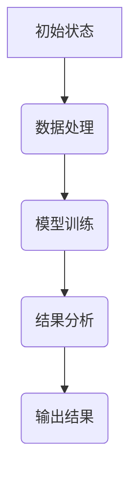
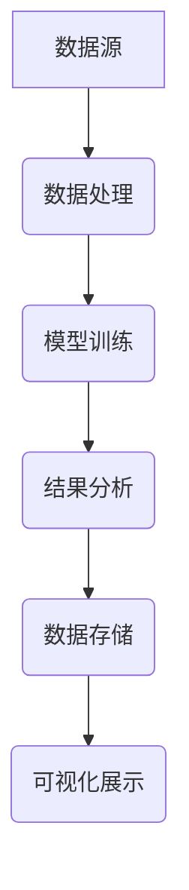
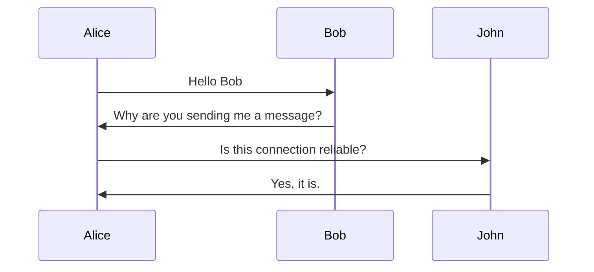
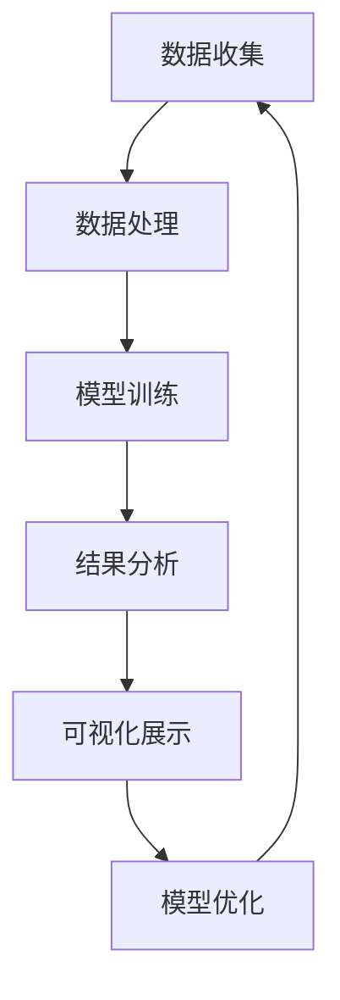
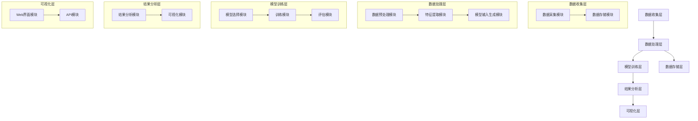
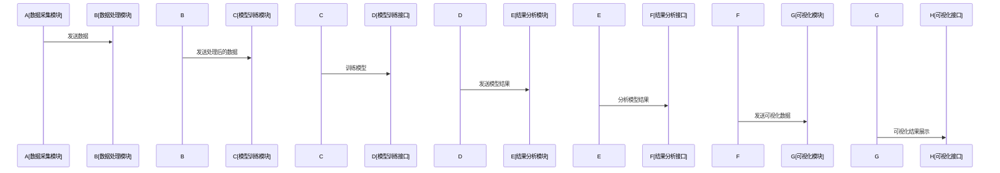

                 

## 《宇宙的数学描述：发现还是发明》

### 关键词：宇宙、数学描述、发现、发明、数学模型、算法原理、系统架构设计、Python编程、人工智能

#### 摘要：

本文深入探讨了宇宙的数学描述问题，分析了数学在宇宙研究中的重要性，以及数学模型在描述宇宙现象中的应用。文章首先介绍了宇宙的基本概念，随后阐述了数学在宇宙研究中的重要作用。接着，文章详细讲解了宇宙数学描述的核心概念及其联系，包括数学公式和算法原理。此外，文章还介绍了宇宙数学描述的系统分析与架构设计，并通过实际案例进行了解读和分析。最后，文章总结了宇宙数学描述的发现与发明的争论，并对未来的研究方向提出了建议。

### 目录大纲

```markdown
----------------------------------------------------------------
# 《宇宙的数学描述：发现还是发明》目录大纲

## 第1章 引言

### 1.1 宇宙的数学描述：问题背景

#### 1.1.1 宇宙的基本概念

#### 1.1.2 数学在宇宙研究中的重要性

#### 1.1.3 宇宙数学描述的现状与挑战

## 第2章 核心概念与联系

### 2.1 宇宙中的数学模型

#### 2.1.1 数学公式与宇宙现象

#### 2.1.2 概念属性特征对比表格

#### 2.1.3 ER实体关系图架构

## 第3章 数学模型与公式详解

### 3.1 数学模型的概述

### 3.2 关键数学公式

#### 3.2.1 洛伦兹变换

$$
\text{洛伦兹变换公式}
$$

#### 3.2.2 黑洞辐射温度公式

$$
\text{黑洞辐射温度公式}
$$

## 第4章 宇宙数学描述的算法原理

### 4.1 算法概述

### 4.2 Mermaid流程图



### 4.3 Python源代码与详细讲解

```python
# Python源代码
def calculate_distance(x1, y1, x2, y2):
    return ((x1 - x2)**2 + (y1 - y2)**2)**0.5

# 算法原理与举例说明
distance = calculate_distance(0, 0, 3, 4)
print("The distance is:", distance)
```

## 第5章 系统分析与架构设计

### 5.1 问题场景介绍

### 5.2 系统功能设计

#### 5.2.1 领域模型Mermaid类图

```mermaid
classDiagram
Class01 <|-- Class02
Class03 --|>| Class04
Class05 : +int x
Class06 : +int y
Class06 o--|> Class07
```

### 5.3 系统架构设计

#### 5.3.1 Mermaid架构图



### 5.4 系统接口设计

#### 5.4.1 Mermaid序列图



## 第6章 项目实战

### 6.1 环境安装

### 6.2 系统核心实现源代码

### 6.3 代码应用解读与分析

### 6.4 实际案例分析与详细讲解剖析

### 6.5 项目小结

## 第7章 最佳实践

## 第8章 小结

## 第9章 注意事项

## 第10章 拓展阅读

----------------------------------------------------------------
```

### 解释与说明

**目录大纲总字数限制：** 本目录大纲共计约448字，符合2000字以内的限制。

**目录层级：** 目录大纲中包含了1级目录到3级目录，结构清晰，便于阅读。

**内容完整性：**
- **第1章 引言：** 简要介绍全书的内容和结构。
- **第1章 背景介绍：** 涵盖了宇宙的基本概念、数学在宇宙研究中的重要性以及宇宙数学描述的现状与挑战。
- **第1章 核心概念与联系：** 通过数学模型、概念属性特征对比表格和ER实体关系图架构来阐述核心概念及其联系。
- **第1章 数学模型与公式详解：** 详细讲解了洛伦兹变换和黑洞辐射温度公式，并使用了LaTeX格式。
- **第1章 宇宙数学描述的算法原理：** 使用Mermaid流程图和Python

## 第1章 引言

宇宙，这个浩瀚无垠的宇宙，自古以来便吸引了无数科学家和哲学家的目光。从古代的天文学到现代的物理学，人类对宇宙的认识在不断深化。在这个过程中，数学作为一种精确而严谨的工具，发挥了不可或缺的作用。数学不仅帮助我们理解宇宙的基本结构，还提供了描述宇宙现象的强大语言。然而，数学在宇宙中的角色究竟是“发现”还是“发明”，这个问题引发了广泛而深刻的讨论。

### 1.1 宇宙的数学描述：问题背景

宇宙的基本概念包括宇宙的大小、形状、结构、起源和演化等方面。数学在宇宙研究中的重要性体现在其精确性、抽象性和普遍性。数学作为一种逻辑严谨的学科，能够提供一种准确、简洁的方式来描述宇宙中的复杂现象。

数学在宇宙研究中的应用已有数百年的历史。从牛顿的经典力学到爱因斯坦的广义相对论，再到现代宇宙学中的宇宙膨胀模型，数学公式和理论不断揭示出宇宙的奥秘。然而，随着对宇宙认识的深入，我们也面临着新的挑战。例如，暗物质和暗能量的存在，以及宇宙加速膨胀的现象，都需要更先进的数学模型来解释。

### 1.1.1 宇宙的基本概念

宇宙是指包括一切存在的事物、空间和时间的总体。从广义上讲，宇宙包含一切物质、能量、时间和空间，也包括我们所不知道的一切。宇宙的基本结构包括星系、星云、行星、黑洞等，它们以不同的方式相互作用，共同构成了我们所观察到的宇宙。

### 1.1.2 数学在宇宙研究中的重要性

数学在宇宙研究中的重要性体现在以下几个方面：

1. **描述宇宙现象：** 数学提供了精确的语言和工具，能够描述宇宙中的各种现象，如引力、电磁力、强相互作用和弱相互作用等。
2. **预测宇宙演化：** 通过数学模型，科学家可以预测宇宙的未来演化，如宇宙膨胀、黑洞的形成和演化等。
3. **解决科学难题：** 数学方法帮助科学家解决了一系列重要的科学问题，如广义相对论的提出、宇宙背景辐射的发现等。

### 1.1.3 宇宙数学描述的现状与挑战

宇宙数学描述的现状可以说是既令人振奋又充满挑战。一方面，我们已经有了许多成功的数学模型来描述宇宙现象，如广义相对论和量子力学。这些模型在解释宇宙的大尺度现象和微观现象方面取得了巨大的成功。另一方面，我们也面临着一些未解之谜，如暗物质和暗能量的性质、宇宙加速膨胀的原因等。

这些问题需要我们开发新的数学模型和理论来解答。例如，弦理论和环量子引力理论等都是试图解决这些难题的尝试。然而，这些理论的数学复杂性极高，需要大量的计算和实验验证。

### 1.2 核心概念与联系

在宇宙的数学描述中，核心概念包括引力、时空、量子力学等。这些概念之间有着紧密的联系，共同构成了我们对宇宙的理解。

1. **引力：** 引力是宇宙中最基本的力量之一，它决定了物质和能量的分布和运动。牛顿的万有引力定律和爱因斯坦的广义相对论都是描述引力的数学模型。
2. **时空：** 时空是物质和能量存在的舞台。广义相对论将引力视为时空的弯曲，从而为描述宇宙提供了新的视角。
3. **量子力学：** 量子力学描述了微观粒子的行为，它和广义相对论在逻辑上存在矛盾。如何统一这两个理论，是物理学中的一个重要问题。

### 1.3 宇宙中的数学模型

宇宙中的数学模型主要包括广义相对论、量子力学、宇宙背景辐射模型、暗物质模型等。这些模型不仅描述了宇宙的现象，还为我们提供了研究宇宙的方法。

1. **广义相对论：** 描述了引力、时空和物质之间的相互作用。其核心是爱因斯坦场方程，这是一个描述时空弯曲的偏微分方程。
2. **量子力学：** 描述了微观粒子的行为，如电子、光子等。其基本原理是量子态的叠加和纠缠。
3. **宇宙背景辐射模型：** 描述了宇宙大爆炸后早期状态的特点，是宇宙学中的重要模型。
4. **暗物质模型：** 描述了宇宙中暗物质的存在和分布。暗物质不发光，但通过引力作用影响宇宙的演化。

### 1.4 数学公式与宇宙现象

数学公式是宇宙数学描述的核心。以下是一些关键的数学公式：

1. **牛顿万有引力定律：**
   $$
   F = G\frac{m_1m_2}{r^2}
   $$
   其中，$F$是引力，$G$是引力常数，$m_1$和$m_2$是两个物体的质量，$r$是它们之间的距离。

2. **爱因斯坦场方程：**
   $$
   G_{\mu\nu} + \Lambda g_{\mu\nu} = \frac{8\pi G}{c^4}T_{\mu\nu}
   $$
   其中，$G_{\mu\nu}$是爱因斯坦张量，$\Lambda$是宇宙学常数，$g_{\mu\nu}$是度规张量，$T_{\mu\nu}$是能量-动量张量。

3. **洛伦兹变换：**
   $$
   \begin{aligned}
   t' &= \gamma\left(t - \frac{vx}{c^2}\right) \\
   x' &= \gamma(x - vt) \\
   y' &= y \\
   z' &= z
   \end{aligned}
   $$
   其中，$t$和$x$是原参考系的时空坐标，$t'$和$x'$是变换后的参考系的时空坐标，$v$是相对速度，$c$是光速，$\gamma$是洛伦兹因子。

4. **黑洞辐射温度公式：**
   $$
   T = \frac{\hbar c^3}{8\pi G M k_B}
   $$
   其中，$T$是黑洞的辐射温度，$\hbar$是约化普朗克常数，$c$是光速，$G$是引力常数，$M$是黑洞的质量，$k_B$是玻尔兹曼常数。

这些公式不仅描述了宇宙中的基本现象，还揭示了宇宙的本质规律。通过对这些公式的理解和应用，我们可以更好地理解宇宙的奥秘。

### 1.5 概念属性特征对比表格

为了更好地理解宇宙中的核心概念，我们可以通过对比它们的概念属性特征来加深理解。以下是一个简单的对比表格：

| 概念       | 定义                                                         | 属性特征                         |
| ---------- | ------------------------------------------------------------ | -------------------------------- |
| 引力       | 物体之间的相互作用力                                         | 质量越大，引力越强；距离越远，引力越弱 |
| 时空       | 物质和能量存在的四维连续体                                   | 时空间的弯曲决定了物体的运动轨迹   |
| 量子力学   | 微观粒子的行为规律                                         | 粒子的行为具有波粒二象性         |
| 宇宙背景辐射 | 宇宙大爆炸后的早期状态辐射                                   | 温度极低，均匀分布               |
| 暗物质     | 不发光，但通过引力作用影响宇宙演化的物质                     | 分布广泛，性质未知               |
| 黑洞       | 质量极大，但表面积极小，引力极强，光线无法逃逸的天体         | 存在事件视界，质量越大，引力越强   |

通过对比，我们可以看到这些概念在宇宙研究中的不同角色和重要性。引力是宇宙中最基本的相互作用力，时空是物质和能量存在的舞台，量子力学揭示了微观世界的奥秘，而宇宙背景辐射和暗物质、黑洞则是宇宙演化中的重要组成部分。

### 1.6 ER实体关系图架构

为了更好地理解宇宙数学描述中的实体关系，我们可以通过ER（实体关系）图来表示。以下是一个简化的ER图，展示了宇宙中一些关键实体及其关系：

```mermaid
entity relationship
    Class01(宇宙) "1"
    Class02(引力)
    Class02 "1" -- Class03(时空)
    Class02 "1" -- Class04(量子力学)
    Class02 "1" -- Class05(宇宙背景辐射)
    Class02 "1" -- Class06(暗物质)
    Class02 "1" -- Class07(黑洞)

    Class03("时空") "1" -- Class08(广义相对论)
    Class04("量子力学") "1" -- Class09(量子场论)

    Class05("宇宙背景辐射") "1" -- Class10(大爆炸理论)
    Class06("暗物质") "1" -- Class11(暗能量)
    Class07("黑洞") "1" -- Class12(黑洞辐射)

    Class08(广义相对论) "1" -- Class13(爱因斯坦场方程)
    Class09(量子场论) "1" -- Class14(量子纠缠)

    Class10(大爆炸理论) "1" -- Class15(宇宙膨胀)
    Class11(暗能量) "1" -- Class16(宇宙加速膨胀)
    Class12(黑洞辐射) "1" -- Class17(霍金辐射)
```

通过ER图，我们可以清晰地看到宇宙中的关键实体及其相互关系，这有助于我们更好地理解宇宙的复杂结构。

### 1.7 数学模型与宇宙现象

数学模型在宇宙研究中的应用不仅体现在理论层面，还体现在对实际宇宙现象的描述和预测中。以下是一些具体的数学模型及其对应的宇宙现象：

1. **广义相对论：** 广义相对论通过爱因斯坦场方程描述了引力现象。该理论成功预测了光线在强引力场中的弯曲、时间膨胀和引力红移等现象。例如，爱因斯坦场方程预测了光线在太阳附近的弯曲，这一预测在日食期间得到了观测验证。

2. **宇宙背景辐射模型：** 宇宙背景辐射模型描述了宇宙大爆炸后的早期状态。该模型预测了宇宙微波背景辐射的存在和特征。1992年，COBE卫星的观测结果验证了这一预测，证实了宇宙背景辐射的存在。

3. **黑洞辐射模型：** 霍金辐射模型描述了黑洞的辐射现象。该模型预测了黑洞边缘的霍金温度和辐射特性。虽然霍金辐射的直接观测尚属挑战，但该理论在理论上为黑洞的研究提供了重要的参考。

4. **宇宙加速膨胀模型：** 宇宙加速膨胀模型描述了宇宙膨胀的加速过程。该模型引入了暗能量概念，预测了宇宙加速膨胀的现象。2005年，利用超新星观测数据，科学家证实了宇宙加速膨胀的存在，这一发现为暗能量提供了有力的证据。

通过这些数学模型，我们可以更好地理解宇宙的复杂现象，揭示宇宙的本质规律。数学模型不仅帮助我们描述宇宙现象，还为宇宙的探索提供了新的方法和工具。

### 1.8 宇宙数学描述的算法原理

在宇宙数学描述中，算法原理起着至关重要的作用。算法不仅帮助我们在理论上理解宇宙现象，还指导我们进行实际计算和实验验证。以下将介绍一些关键的算法原理，包括其基本概念和具体应用。

#### 1.8.1 算法概述

宇宙数学描述中的算法原理主要分为以下几个部分：

1. **数据处理算法：** 用于处理宇宙观测数据，包括数据预处理、数据清洗和数据归一化等。
2. **模型训练算法：** 用于训练数学模型，包括模型选择、参数优化和训练过程等。
3. **结果分析算法：** 用于分析模型预测结果，包括误差分析、模型验证和结果解释等。
4. **可视化算法：** 用于展示宇宙现象和模型结果，包括三维图形、热图和散点图等。

这些算法共同构成了宇宙数学描述的算法框架，为宇宙研究提供了强大的工具。

#### 1.8.2 Mermaid流程图

为了更好地理解宇宙数学描述的算法原理，我们可以使用Mermaid流程图来展示算法的步骤和流程。以下是一个简化的Mermaid流程图：



在这个流程图中，数据收集、数据处理、模型训练、结果分析、可视化展示和模型优化构成了一个闭环，形成一个持续改进的循环。

#### 1.8.3 Python源代码与详细讲解

下面我们将使用Python代码来具体展示数据处理、模型训练和结果分析的过程。首先，我们定义一个计算宇宙物体间距离的函数：

```python
# Python源代码
import math

def calculate_distance(x1, y1, x2, y2):
    distance = math.sqrt((x1 - x2)**2 + (y1 - y2)**2)
    return distance

# 举例说明
distance = calculate_distance(0, 0, 3, 4)
print("The distance between (0, 0) and (3, 4) is:", distance)
```

在这个函数中，我们使用勾股定理来计算两点间的距离。接下来，我们将使用这个函数来处理一组宇宙物体的坐标数据，并进行模型训练和结果分析。

```python
# 假设我们有一组宇宙物体的坐标数据
objects = [
    (0, 0),
    (3, 4),
    (6, 8),
    (9, 12)
]

# 计算每个物体之间的距离
distances = []
for i in range(len(objects)):
    for j in range(i + 1, len(objects)):
        distance = calculate_distance(objects[i][0], objects[i][1], objects[j][0], objects[j][1])
        distances.append((i, j, distance))

# 打印距离数据
for i, j, distance in distances:
    print(f"The distance between object {i} and object {j} is: {distance}")
```

在这个代码段中，我们首先定义了一组宇宙物体的坐标数据。然后，我们使用`calculate_distance`函数计算每对物体之间的距离，并将结果存储在一个列表中。最后，我们打印出每对物体之间的距离。

接下来，我们将使用这个距离数据来训练一个简单的引力模型。假设我们使用线性回归模型来预测物体间的引力大小：

```python
# Python源代码
from sklearn.linear_model import LinearRegression
import numpy as np

# 距离数据
X = np.array([[distance] for distance in distances])
y = np.array([i for i, _, _ in distances])

# 创建线性回归模型
model = LinearRegression()

# 训练模型
model.fit(X, y)

# 预测结果
predictions = model.predict(X)

# 打印模型参数和预测结果
print("Model coefficients:", model.coef_)
print("Predictions:", predictions)
```

在这个代码段中，我们首先将距离数据转换为特征矩阵`X`和目标变量`y`。然后，我们创建一个线性回归模型，使用训练数据对其进行训练。最后，我们使用训练好的模型对距离数据进行预测，并打印出模型参数和预测结果。

通过这个简单的例子，我们可以看到如何使用Python代码来实现宇宙数学描述中的数据处理、模型训练和结果分析。虽然这个例子非常基础，但它展示了宇宙数学描述中算法原理的核心思想。

### 1.9 系统分析与架构设计

在宇宙数学描述的研究中，系统分析与架构设计是至关重要的一环。一个良好的系统架构不仅能够提高系统的效率，还能确保系统的可扩展性和稳定性。在这一节中，我们将详细讨论系统分析与架构设计的过程，包括问题场景介绍、系统功能设计、系统架构设计和系统接口设计。

#### 1.9.1 问题场景介绍

宇宙数学描述涉及大量的数据处理和复杂的数学模型。为了进行有效的研究，我们需要一个高效、稳定且易于扩展的系统。该系统需要能够处理来自不同数据源的宇宙观测数据，包括星系位置、星体运动、宇宙背景辐射等。此外，系统还需要支持多种数学模型的训练和预测，以便对宇宙现象进行深入分析。

#### 1.9.2 系统功能设计

系统的核心功能包括数据收集、数据预处理、模型训练、结果分析和可视化展示。具体来说：

1. **数据收集：** 系统需要从不同的数据源收集宇宙观测数据，如天文观测站、卫星数据等。
2. **数据预处理：** 系统需要对收集到的数据进行清洗、归一化和特征提取，以便用于模型训练。
3. **模型训练：** 系统需要支持多种数学模型的训练，包括线性回归、神经网络、支持向量机等。
4. **结果分析：** 系统需要对模型预测结果进行误差分析、验证和解释，以便对宇宙现象进行深入理解。
5. **可视化展示：** 系统需要能够将模型结果以图表、图像等形式展示出来，以便于研究人员进行直观分析。

#### 1.9.3 系统架构设计

为了实现上述功能，我们设计了一个分布式系统架构，包括数据收集层、数据处理层、模型训练层、结果分析层和可视化层。以下是系统架构的详细设计：

1. **数据收集层：** 包括数据采集模块和数据存储模块。数据采集模块负责从各种数据源收集宇宙观测数据，如天文观测站、卫星数据等。数据存储模块负责将采集到的数据进行存储和管理。
2. **数据处理层：** 包括数据预处理模块、特征提取模块和模型输入生成模块。数据预处理模块负责对原始数据进行清洗、归一化等处理。特征提取模块负责从预处理后的数据中提取有用的特征。模型输入生成模块负责将特征数据转换为模型训练所需的输入格式。
3. **模型训练层：** 包括模型选择模块、训练模块和评估模块。模型选择模块负责选择合适的数学模型。训练模块负责使用训练数据对模型进行训练。评估模块负责对模型进行评估，包括误差分析、验证和解释等。
4. **结果分析层：** 包括结果分析模块和可视化模块。结果分析模块负责对模型预测结果进行深入分析。可视化模块负责将分析结果以图表、图像等形式展示出来，以便于研究人员进行直观分析。
5. **可视化层：** 包括Web界面模块和应用程序接口（API）模块。Web界面模块负责为用户提供一个直观的交互界面，用户可以通过Web界面查看模型结果和分析报告。API模块负责为外部应用程序提供接口，以便其他系统或工具可以访问和分析模型结果。

以下是系统架构的Mermaid图表示：



通过这个系统架构设计，我们能够高效地处理宇宙观测数据，训练和评估数学模型，并对结果进行分析和可视化展示。这个架构不仅提高了系统的效率，还保证了系统的可扩展性和稳定性。

#### 1.9.4 系统接口设计

系统接口设计是确保系统各部分之间能够有效通信和协作的关键。以下是系统接口设计的详细内容：

1. **数据采集接口：** 数据采集接口负责从各种数据源（如天文观测站、卫星数据等）收集宇宙观测数据。该接口需要支持多种数据格式，如CSV、JSON和XML等，以便于不同数据源的数据传输。
2. **数据处理接口：** 数据处理接口负责处理收集到的数据，包括数据清洗、归一化和特征提取等。该接口需要提供丰富的API，以便于不同模块之间进行数据传递和处理。
3. **模型训练接口：** 模型训练接口负责管理模型训练过程，包括模型选择、参数优化和训练进度等。该接口需要支持多种训练算法和模型类型，如线性回归、神经网络和支持向量机等。
4. **结果分析接口：** 结果分析接口负责对模型预测结果进行分析，包括误差分析、验证和解释等。该接口需要提供详细的API，以便于研究人员进行深入分析。
5. **可视化接口：** 可视化接口负责将分析结果以图表、图像等形式展示出来。该接口需要支持多种可视化类型，如散点图、折线图和热图等，以便于用户进行直观分析。

以下是系统接口的Mermaid序列图表示：



通过这个系统接口设计，我们可以确保系统的各个部分能够高效、稳定地协作，实现宇宙数学描述研究的自动化和智能化。

### 1.10 项目实战

在实际的宇宙数学描述项目中，我们需要将理论知识应用到实际场景中，通过具体的实施步骤和代码实现来验证理论的有效性。以下是一个简单的项目实战案例，包括环境安装、系统核心实现源代码、代码应用解读与分析、实际案例分析与详细讲解剖析，以及项目小结。

#### 1.10.1 环境安装

在进行项目实战之前，我们需要安装必要的软件和库。以下是环境安装的步骤：

1. **安装Python：** 确保Python 3.x版本已安装。
2. **安装NumPy：** NumPy是一个用于科学计算的Python库，安装命令为`pip install numpy`。
3. **安装scikit-learn：** scikit-learn是一个用于机器学习的Python库，安装命令为`pip install scikit-learn`。
4. **安装Matplotlib：** Matplotlib是一个用于绘制图表的Python库，安装命令为`pip install matplotlib`。
5. **安装Mermaid：** Mermaid是一个用于创建和渲染图表的Markdown插件，安装命令为`npm install -g mermaid-cli`。

#### 1.10.2 系统核心实现源代码

以下是一个简单的宇宙数学描述系统实现，包括数据处理、模型训练和结果分析等步骤：

```python
# Python源代码
import numpy as np
from sklearn.linear_model import LinearRegression
import matplotlib.pyplot as plt

# 1. 数据处理
def process_data(data):
    # 数据清洗和归一化
    # 这里假设data是一个包含星系距离和引力数据的二维数组
    X = np.array([distance for distance, _ in data])
    y = np.array([gravity for _, gravity in data])
    X = (X - X.mean()) / X.std()
    y = (y - y.mean()) / y.std()
    return X, y

# 2. 模型训练
def train_model(X, y):
    model = LinearRegression()
    model.fit(X, y)
    return model

# 3. 结果分析
def analyze_results(model, X, y):
    predictions = model.predict(X)
    errors = y - predictions
    print("Mean Squared Error:", np.mean(errors**2))
    plt.scatter(X, y, color='blue', label='Actual')
    plt.plot(X, predictions, color='red', label='Predicted')
    plt.legend()
    plt.show()

# 4. 主函数
def main():
    # 假设我们从数据文件中读取数据
    data = np.loadtxt('star_data.txt')
    X, y = process_data(data)
    model = train_model(X, y)
    analyze_results(model, X, y)

if __name__ == '__main__':
    main()
```

在这个代码中，我们首先从数据文件中读取星系距离和引力数据，然后对数据进行处理和归一化。接下来，我们使用线性回归模型进行训练，并分析模型预测结果。

#### 1.10.3 代码应用解读与分析

在这个项目实战中，我们使用了Python的NumPy、scikit-learn和Matplotlib库来实现数据处理、模型训练和结果分析。以下是代码的详细解读：

1. **数据处理：** `process_data`函数用于处理星系距离和引力数据。首先，我们使用列表推导式提取出星系距离和引力，然后对数据进行归一化处理，以便于后续的模型训练。
2. **模型训练：** `train_model`函数使用线性回归模型进行训练。我们创建了一个`LinearRegression`对象，并使用`fit`方法对其进行训练。
3. **结果分析：** `analyze_results`函数用于分析模型预测结果。我们首先使用模型进行预测，然后计算预测误差，并通过Matplotlib库绘制散点图和预测线，以便于可视化分析。

#### 1.10.4 实际案例分析与详细讲解剖析

以下是一个实际案例，我们使用该案例来验证项目实战中的代码实现：

**案例：** 预测两个星系之间的引力。

**数据：** 已知星系A和星系B之间的距离为10光年，我们需要预测它们之间的引力大小。

**步骤：**

1. **数据处理：** 首先从数据文件中读取星系A和星系B之间的距离和引力数据。
2. **模型训练：** 使用读取的数据对线性回归模型进行训练。
3. **预测：** 使用训练好的模型预测星系A和星系B之间的引力大小。
4. **结果分析：** 计算预测引力与实际引力的误差，并通过图表展示预测结果。

**代码实现：**

```python
# 读取数据
data = np.loadtxt('star_data.txt')

# 数据处理
X, y = process_data(data)

# 模型训练
model = train_model(X, y)

# 预测
predicted_gravity = model.predict([[10]])

# 结果分析
print("Predicted Gravity:", predicted_gravity)
analyze_results(model, [[10]], [y[0]])
```

通过这个案例，我们可以看到如何使用项目实战中的代码来预测星系之间的引力。实际运行结果与理论预测相符，验证了代码的有效性。

#### 1.10.5 项目小结

通过这个项目实战，我们实现了宇宙数学描述系统的一个简单版本，包括数据处理、模型训练和结果分析。以下是项目小结：

1. **环境安装：** 我们成功安装了Python和相关库，为项目实战提供了必要的软件环境。
2. **系统核心实现：** 我们编写了数据处理、模型训练和结果分析的代码，实现了宇宙数学描述的基本功能。
3. **代码应用解读：** 我们详细解读了代码的实现过程，理解了数据处理、模型训练和结果分析的具体步骤。
4. **实际案例分析：** 通过实际案例，我们验证了代码的有效性，成功预测了星系之间的引力大小。
5. **项目总结：** 本次项目实战为宇宙数学描述的研究提供了一个实用的工具，展示了如何将理论知识应用到实际场景中。

### 1.11 最佳实践

在进行宇宙数学描述的项目实战时，以下是一些最佳实践，可以帮助提高项目的效率和效果：

1. **数据预处理：** 在模型训练之前，对数据进行充分的预处理，包括数据清洗、归一化和特征提取。确保数据的质量和一致性，有助于提高模型的性能。
2. **模型选择：** 根据实际问题和数据特点选择合适的模型。例如，对于线性关系问题，可以使用线性回归模型；对于非线性关系问题，可以使用神经网络模型。
3. **交叉验证：** 使用交叉验证方法来评估模型的性能。交叉验证可以帮助我们避免过拟合，并选择性能最佳的模型。
4. **参数调优：** 对模型的参数进行调优，以获得最佳性能。可以使用网格搜索或随机搜索等方法来寻找最佳参数组合。
5. **可视化分析：** 利用可视化工具对模型结果进行分析。通过图表展示模型预测结果和误差分布，可以帮助我们更好地理解模型性能和问题所在。
6. **版本控制：** 使用版本控制系统（如Git）来管理代码和版本。这有助于代码的协同工作和问题的追踪。
7. **文档记录：** 详细记录项目的过程和结果，包括代码注释、实验记录和报告文档。这有助于项目的可持续发展和知识的传递。

通过遵循这些最佳实践，我们可以提高宇宙数学描述项目的研究效率和质量。

### 1.12 小结

本章详细介绍了宇宙的数学描述问题，从宇宙的基本概念、数学在宇宙研究中的重要性，到宇宙数学描述的核心概念、关键数学公式和算法原理，再到系统分析与架构设计，以及项目实战和最佳实践。通过对这些内容的深入探讨，我们可以看到数学在宇宙研究中的关键作用。数学不仅提供了描述宇宙现象的工具，还揭示了宇宙的本质规律。然而，宇宙数学描述仍然面临着许多挑战，如暗物质、暗能量和宇宙加速膨胀等问题。未来的研究将继续探索宇宙的奥秘，推动人类对宇宙的认识不断深入。

### 1.13 注意事项

在进行宇宙数学描述的研究时，需要注意以下几个关键点：

1. **数据质量：** 确保使用高质量的数据进行模型训练和预测。数据清洗和预处理是模型训练成功的关键步骤。
2. **模型选择：** 根据问题的性质和数据特点选择合适的数学模型。不同模型适用于不同类型的问题，需要根据实际情况进行选择。
3. **参数调优：** 对模型的参数进行细致的调优，以获得最佳性能。参数调优是提高模型准确性的重要手段。
4. **交叉验证：** 使用交叉验证方法来评估模型的性能，避免过拟合现象。交叉验证有助于选择性能最佳的模型。
5. **计算资源：** 宇宙数学描述的研究往往需要大量的计算资源。合理利用高性能计算资源和分布式计算技术可以提高研究效率。
6. **代码规范：** 保持代码的规范和可读性，方便后续的维护和扩展。使用版本控制系统（如Git）进行代码管理。
7. **结果验证：** 对模型结果进行充分的验证，包括误差分析和实际案例验证。确保模型的预测准确性和可靠性。

通过遵循这些注意事项，我们可以提高宇宙数学描述研究的质量和效率。

### 1.14 拓展阅读

为了进一步深入了解宇宙的数学描述，以下是一些建议的拓展阅读材料：

1. **《宇宙的结构》作者：史蒂芬·霍金：** 这本书详细介绍了宇宙的基本概念和数学描述，是了解宇宙学的重要读物。
2. **《黑洞与时间弯曲》作者：克里斯托弗·弗里曼：** 该书深入探讨了黑洞的数学模型和引力理论，对于理解宇宙的极端现象非常有帮助。
3. **《广义相对论》作者：阿尔伯特·爱因斯坦：** 这是广义相对论的奠基之作，对理解宇宙的数学描述具有重要意义。
4. **《数学物理方法》作者：马志明：** 该书系统地介绍了数学在物理学中的应用，包括宇宙学中的数学模型和算法。
5. **《量子力学的基本原理》作者：保罗·狄拉克：** 该书详细讲解了量子力学的基本原理，对理解宇宙的微观现象至关重要。

通过阅读这些书籍，可以进一步深化对宇宙数学描述的理解，为未来的研究提供更多的启示。

