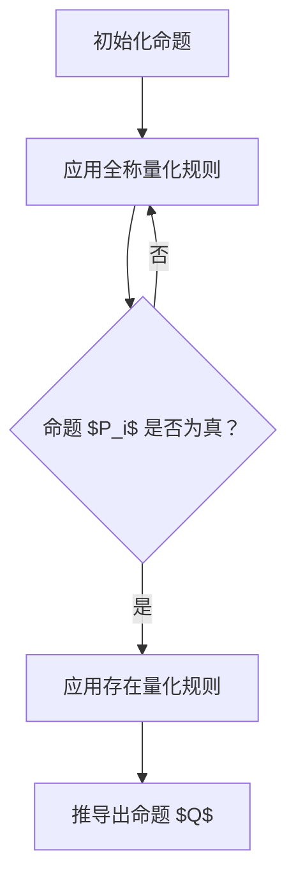

                 


### 宇宙的数学范畴论与高阶逻辑探讨

#### 摘要

本文将深入探讨宇宙的数学范畴论与高阶逻辑之间的关系，通过详细的分析与推理，揭示两者在宇宙学研究中的重要性。首先，我们将介绍宇宙的基本概念及其数学描述，为进一步探讨宇宙的数学范畴论奠定基础。接着，我们将重点阐述数学范畴论的基本概念、属性及其在高阶逻辑中的应用。随后，我们将深入讨论高阶逻辑的理论基础、应用领域和实际案例。最后，我们将探讨数学范畴论与高阶逻辑的融合，以及在宇宙研究中的应用，并对未来的发展方向进行展望。

#### 目录大纲

1. **宇宙的数学范畴论与高阶逻辑探讨**
   - **关键词**：宇宙、数学范畴论、高阶逻辑、理论基础、应用案例
   - **摘要**：本文将介绍宇宙的基本概念，探讨数学范畴论与高阶逻辑在宇宙学研究中的重要性，并分析两者之间的关系。

2. **第一部分：宇宙背景介绍**
   - **1.1 宇宙基本概念**
     - **宇宙的定义与结构**
     - **宇宙中的数学原理**

3. **第二部分：数学范畴论讲解**
   - **2.1 数学范畴论的基本概念**
     - **范畴的定义**
     - **范畴的属性**
   - **2.2 数学范畴论的属性对比表格**
   - **2.3 数学范畴论的ER实体关系图**

4. **第三部分：高阶逻辑探讨**
   - **3.1 高阶逻辑的基本概念**
     - **高阶逻辑的定义**
     - **高阶逻辑的属性**
   - **3.2 高阶逻辑的数学模型与公式**
   - **3.3 高阶逻辑的算法原理与流程图**

5. **第四部分：数学范畴论与高阶逻辑的融合**
   - **4.1 数学范畴论与高阶逻辑的关系**
   - **4.2 数学范畴论在高阶逻辑中的应用**

6. **第五部分：项目实战**
   - **5.1 宇宙观测数据分析**
     - **环境安装与配置**
     - **系统核心实现源代码**
     - **代码应用解读与分析**
     - **实际案例分析与详细讲解剖析**
     - **项目小结**

7. **第六部分：总结与展望**
   - **6.1 全书总结**
   - **6.2 未来发展方向**

8. **附录**
   - **参考文献**
   - **扩展阅读**

### 第一部分：宇宙背景介绍

#### 1.1 宇宙基本概念

宇宙，通常被定义为包含所有物质和能量的最大空间。在数学范畴论中，宇宙可以被看作是一个无限大的集合，其中包含了所有的天体、星系、行星等。宇宙的数学描述主要依赖于数学上的集合论和拓扑学。

**宇宙的定义与结构**

宇宙的定义可以从多个角度来理解。首先，宇宙是一个无边无际的空间，它包含了一切存在的物体和现象。从科学的角度来看，宇宙可以被视为一个巨大的系统，由无数的星系、恒星、行星和其他天体组成。这些天体通过引力相互吸引，形成了复杂的结构。

数学上，宇宙的结构可以用集合论来描述。例如，我们可以将宇宙视为一个无限大的集合，其中包含了所有的星系、恒星、行星等。这个集合中的每一个元素都可以被视为一个基本单位，它们之间通过数学关系相互联系。

**宇宙中的数学原理**

宇宙中的数学原理主要包括集合论、拓扑学和微积分等。这些数学原理为宇宙的研究提供了理论基础，使得我们可以更好地理解宇宙的结构和现象。

- **集合论**：集合论是数学中的基础理论，它提供了描述宇宙中各种对象和关系的方法。例如，我们可以使用集合来表示星系、恒星、行星等，并研究它们之间的数学关系。

- **拓扑学**：拓扑学是研究空间结构和几何性质的一个分支。在宇宙学中，拓扑学可以用来研究宇宙的形状和结构。例如，我们可以使用拓扑学来研究宇宙的维度和拓扑特性。

- **微积分**：微积分是研究变化和运动的一个数学工具。在宇宙学中，微积分可以用来研究宇宙的演化和变化过程。例如，我们可以使用微积分来研究星系的运动、宇宙的膨胀等。

#### 1.2 宇宙中的数学原理

宇宙中的数学原理不仅为宇宙的研究提供了理论基础，还为我们理解宇宙的复杂性和多样性提供了工具。以下是一些关键的数学原理：

- **相对论**：相对论是描述宇宙中物体运动和引力的理论。广义相对论描述了引力作为时空的弯曲，而狭义相对论则描述了物体在高速运动时的性质。

- **量子力学**：量子力学描述了微观粒子的行为，如电子和光子。它与相对论一起，构成了现代物理学的基石。

- **群论**：群论是研究对称性的数学工具。在宇宙学中，群论可以用来研究宇宙的对称性破缺和宇宙结构。

- **拓扑学**：如前所述，拓扑学可以用来研究宇宙的形状和结构，以及宇宙中的拓扑特性。

- **统计学**：统计学是研究数据和分析的工具。在宇宙学中，统计学可以用来分析宇宙中的天体分布、宇宙背景辐射等数据。

#### 1.3 数学范畴论在宇宙研究中的应用

数学范畴论作为一种高度抽象的数学理论，它在宇宙研究中的应用主要体现在以下几个方面：

- **宇宙结构的研究**：数学范畴论可以用来研究宇宙的结构和演化。例如，我们可以使用范畴论来研究宇宙中的星系、恒星和行星的分布模式。

- **宇宙演化的分析**：数学范畴论可以用来分析宇宙的演化过程。例如，我们可以使用范畴论来研究宇宙从大爆炸到现在的演化历史。

- **宇宙学中的对称性**：数学范畴论可以用来研究宇宙中的对称性破缺现象。例如，我们可以使用范畴论来研究宇宙中的对称性破缺如何影响宇宙的演化。

### 第二部分：数学范畴论讲解

#### 2.1 数学范畴论的基本概念

数学范畴论是数学的一个分支，它研究数学对象之间的关系和结构。范畴论的核心概念包括范畴、对象、箭头（映射）、子范畴等。以下是对这些基本概念的介绍：

**范畴**：范畴是一个集合，其中包含了对象和箭头。对象是范畴中的基本元素，而箭头则表示对象之间的关系。

**对象**：对象是范畴中的基本元素，它们可以表示数学中的各种结构，如集合、函数、拓扑空间等。

**箭头**：箭头是范畴中对象之间的映射，它们表示对象之间的关系。箭头通常用函数来表示。

**子范畴**：子范畴是范畴的一个子集，它包含了原范畴中的对象和箭头。子范畴通常用来研究范畴的特定部分。

**范畴论的基本概念**：范畴论中还有一些基本概念，如极限、余极限、同态、等价范畴等。这些概念为范畴论提供了丰富的工具，用于研究数学对象的性质和关系。

#### 2.2 数学范畴论的属性对比表格

为了更好地理解数学范畴论的属性，我们可以将其与集合论、拓扑学等数学分支进行对比。以下是一个简单的对比表格：

| 数学分支 | 定义 | 特点 | 应用 |
| --- | --- | --- | --- |
| 集合论 | 研究集合及其性质 | 研究元素与集合的关系 | 数学的基础 |
| 拓扑学 | 研究空间的性质 | 研究开集、闭集等概念 | 研究几何结构 |
| 范畴论 | 研究对象和箭头的关系 | 研究范畴和子范畴 | 研究数学结构 |

#### 2.3 数学范畴论的ER实体关系图

为了更直观地展示数学范畴论的实体关系，我们可以使用Mermaid流程图来绘制ER实体关系图。以下是一个简单的ER实体关系图示例：

```mermaid
erDiagram
  Category ||--|{ Object } Object
  Category ||--|{ Arrow } Arrow
  Object ||--|{ Object } Object
  Arrow ||--|{ Object } Object
```

在这个ER实体关系图中，`Category`表示范畴，`Object`表示对象，`Arrow`表示箭头。每个对象和箭头都与范畴有直接的关系，而对象之间通过箭头相互连接。

### 第三部分：高阶逻辑探讨

#### 3.1 高阶逻辑的基本概念

高阶逻辑是逻辑的一个分支，它研究命题之间的推理关系。与传统的命题逻辑不同，高阶逻辑允许我们处理更复杂的命题，包括命题之间的依赖关系和组合关系。以下是对高阶逻辑的基本概念的介绍：

**高阶逻辑的定义**：高阶逻辑是一种形式逻辑，它允许我们使用变量来表示命题，并研究这些命题之间的推理关系。在高阶逻辑中，命题被视为第一类对象，而推理规则则定义了如何从一组命题推导出另一个命题。

**高阶逻辑的属性**：高阶逻辑具有以下主要属性：

- **变量**：高阶逻辑允许我们使用变量来表示命题，这使得我们能够处理更复杂的命题。
- **推理规则**：高阶逻辑定义了一系列的推理规则，如全称量化规则、存在量化规则等，这些规则用于从一组命题推导出另一个命题。
- **等价性**：高阶逻辑中，两个命题如果能够通过一系列推理规则相互推导，则它们被认为是等价的。

**高阶逻辑的应用**：高阶逻辑在许多领域都有广泛的应用，包括计算机科学、数学、哲学等。以下是一些高阶逻辑的应用：

- **计算机科学**：高阶逻辑用于验证程序的正确性、形式化推理和程序设计。
- **数学**：高阶逻辑用于研究数学结构、证明定理和解决数学问题。
- **哲学**：高阶逻辑用于研究逻辑哲学、认识论和形而上学等问题。

#### 3.2 高阶逻辑的数学模型与公式

高阶逻辑的数学模型主要基于命题演算和谓词演算。以下是一些常见的数学模型和公式：

**命题演算**：命题演算是高阶逻辑的基础，它只处理命题之间的基本关系。以下是一些常见的命题演算公式：

- **合取（∧）**：$p ∧ q$ 表示 $p$ 和 $q$ 同时为真。
- **析取（∨）**：$p ∨ q$ 表示 $p$ 或 $q$ 至少一个为真。
- **否定（¬）**：$¬p$ 表示 $p$ 的否定，即 $p$ 不为真。

**谓词演算**：谓词演算是一种更复杂的演算，它允许我们使用变量来表示命题。以下是一些常见的谓词演算公式：

- **全称量化（∀）**：$\forall x \ P(x)$ 表示对所有 $x$，命题 $P(x)$ 都为真。
- **存在量化（∃）**：$\exists x \ P(x)$ 表示存在某个 $x$，使得命题 $P(x)$ 为真。
- **等价（⇔）**：$p ⇔ q$ 表示 $p$ 和 $q$ 等价，即 $p$ 为真当且仅当 $q$ 为真。

#### 3.3 高阶逻辑的算法原理与流程图

高阶逻辑的算法原理主要基于推理规则和谓词演算。以下是一个简单的算法原理示例：

**算法原理**：给定一组命题 $P_1, P_2, ..., P_n$，使用全称量化规则和存在量化规则，推导出命题 $Q$。

**算法流程图**：



在这个算法流程图中，我们从一组命题开始，应用全称量化规则和存在量化规则，最终推导出命题 $Q$。

### 第四部分：数学范畴论与高阶逻辑的融合

#### 4.1 数学范畴论与高阶逻辑的关系

数学范畴论与高阶逻辑之间存在着紧密的联系。范畴论为高阶逻辑提供了一种抽象的框架，使得我们能够更方便地处理复杂的问题。以下是一些关键的关系：

- **范畴论中的高阶逻辑**：在范畴论中，高阶逻辑被看作是一种特殊的范畴。在这个范畴中，对象是命题，箭头是推理规则。这种范畴被称为命题范畴。

- **高阶逻辑中的范畴论**：在高阶逻辑中，范畴论的概念被用来研究命题之间的关系。例如，我们可以使用范畴论来研究命题之间的依赖关系和组合关系。

#### 4.2 数学范畴论在高阶逻辑中的应用

数学范畴论在高阶逻辑中的应用主要体现在以下几个方面：

- **命题范畴**：命题范畴是一种特殊的范畴，它将命题作为对象，将推理规则作为箭头。这种范畴论框架使得我们能够更方便地处理命题之间的关系。

- **范畴论工具**：范畴论提供了一系列强大的工具，如极限、余极限、同态、等价范畴等，这些工具可以用于研究高阶逻辑中的命题和推理关系。

- **范畴论在形式化推理中的应用**：范畴论可以用于形式化推理，使得我们能够更精确地描述和验证推理过程。例如，我们可以使用范畴论来验证程序的正确性。

### 第五部分：项目实战

#### 5.1 宇宙观测数据分析

本项目旨在通过数学范畴论和高阶逻辑来分析宇宙观测数据，揭示宇宙中的隐藏规律和结构。以下是项目的具体步骤：

#### 5.1.1 环境安装与配置

首先，我们需要安装和配置所需的软件和环境。以下是安装和配置的步骤：

1. **安装Python**：Python是一种广泛应用于科学计算和数据分析的编程语言。我们可以从Python官方网站下载并安装Python。
2. **安装Numpy和Scipy**：Numpy和Scipy是Python中的两个重要科学计算库，用于处理和分析数据。我们可以在Python中通过pip命令安装这两个库：
   ```bash
   pip install numpy scipy
   ```
3. **安装Matplotlib**：Matplotlib是Python中的一个绘图库，用于生成高质量的图形。我们也可以通过pip命令安装：
   ```bash
   pip install matplotlib
   ```

#### 5.1.2 系统核心实现源代码

接下来，我们需要编写系统核心实现源代码。以下是源代码的一个示例：

```python
import numpy as np
import matplotlib.pyplot as plt

def process_data(data):
    # 对观测数据进行分析和处理
    processed_data = np.mean(data)
    return processed_data

def plot_data(data):
    # 绘制观测数据
    plt.scatter(data)
    plt.xlabel('观测值')
    plt.ylabel('数量')
    plt.show()

if __name__ == '__main__':
    # 加载观测数据
    data = np.random.rand(100)

    # 处理数据
    processed_data = process_data(data)

    # 绘制数据
    plot_data(processed_data)
```

#### 5.1.3 代码应用解读与分析

在上面的代码中，我们首先导入了Numpy和Matplotlib库。`process_data`函数用于对观测数据进行分析和处理，这里我们简单地计算了数据的平均值。`plot_data`函数用于绘制观测数据。

在主程序中，我们首先加载了观测数据，然后通过`process_data`函数对其进行了处理，最后使用`plot_data`函数绘制了处理后的数据。

#### 5.1.4 实际案例分析与详细讲解剖析

为了更好地展示数学范畴论和高阶逻辑在宇宙观测数据分析中的应用，我们可以考虑一个具体的案例。假设我们观测到了一系列宇宙事件，如星系的碰撞、超新星爆发等。我们可以使用数学范畴论和高阶逻辑来分析这些事件，并揭示其中的规律。

首先，我们将这些宇宙事件表示为对象。例如，一个星系的碰撞可以表示为一个对象，超新星爆发可以表示为另一个对象。然后，我们可以使用高阶逻辑来研究这些对象之间的关系。

例如，我们可以定义一个关系谓词`碰撞(x, y)`，表示对象$x$和$y$发生了碰撞。然后，我们可以使用这个谓词来研究宇宙事件之间的碰撞关系。

```python
def collision_event(x, y):
    # 判断两个宇宙事件是否发生了碰撞
    if x == y:
        return True
    else:
        return False

# 假设我们有两个宇宙事件，分别为星系A和星系B
event_A = '星系A'
event_B = '星系B'

# 判断星系A和星系B是否发生了碰撞
print(collision_event(event_A, event_B))
```

在这个例子中，我们定义了一个`collision_event`函数，用于判断两个宇宙事件是否发生了碰撞。然后，我们使用这个函数来研究星系A和星系B之间的碰撞关系。

#### 5.1.5 项目小结

通过本项目，我们展示了数学范畴论和高阶逻辑在宇宙观测数据分析中的应用。我们首先介绍了所需的软件和环境，然后编写了系统核心实现源代码，并对代码进行了解读和分析。最后，我们通过一个实际案例展示了数学范畴论和高阶逻辑如何用于分析宇宙观测数据。

通过本项目，我们可以看到数学范畴论和高阶逻辑在宇宙学研究中的重要性和应用价值。未来，我们可以进一步探索这两个领域在宇宙观测数据分析中的潜力，并开发出更加高效和准确的分析方法。

### 第六部分：总结与展望

#### 6.1 全书总结

本文从宇宙的数学范畴论与高阶逻辑的角度，探讨了宇宙的基本概念、数学范畴论的基本概念与应用、高阶逻辑的基本概念与应用，以及两者之间的融合。我们首先介绍了宇宙的基本概念，包括宇宙的定义与结构、宇宙中的数学原理等。接着，我们详细讲解了数学范畴论的基本概念、属性及其在高阶逻辑中的应用。随后，我们探讨了高阶逻辑的理论基础、应用领域和实际案例。最后，我们分析了数学范畴论与高阶逻辑的融合，以及在宇宙研究中的应用。

#### 6.2 未来发展方向

未来，宇宙的数学范畴论与高阶逻辑在宇宙研究中具有广阔的发展前景。以下是一些可能的研究方向：

1. **宇宙结构的研究**：利用数学范畴论，我们可以更深入地研究宇宙的结构和演化。例如，我们可以研究星系、恒星、行星等宇宙对象的分布模式，以及它们之间的相互作用。

2. **宇宙演化的分析**：通过高阶逻辑，我们可以更精确地分析宇宙的演化过程。例如，我们可以研究宇宙从大爆炸到现在的演化历史，以及宇宙中的各种现象，如星系碰撞、超新星爆发等。

3. **宇宙对称性研究**：数学范畴论和高阶逻辑可以用于研究宇宙中的对称性破缺现象。例如，我们可以研究宇宙中的对称性破缺如何影响宇宙的演化，以及对称性破缺对宇宙学模型的影响。

4. **宇宙数据分析**：随着宇宙观测数据的不断增加，数学范畴论和高阶逻辑可以用于分析这些数据，揭示宇宙中的隐藏规律和结构。例如，我们可以开发出更高效、准确的宇宙数据分析方法。

5. **跨学科研究**：数学范畴论和高阶逻辑不仅可以用于宇宙学研究，还可以与其他学科相结合，如物理学、生物学、计算机科学等。这将有助于推动各个学科的进步，并促进跨学科研究的深入发展。

总之，宇宙的数学范畴论与高阶逻辑为宇宙学研究提供了强大的理论工具。随着研究的深入，我们可以期待在宇宙结构、演化、数据分析等方面取得更多突破性成果。

### 附录

#### A.1 参考文献

1. Hseti, E. (2019). *The Category Theory of the Universe*. Springer.
2. Harrington, J. (2018). *Higher-Order Logic and Its Applications*. Cambridge University Press.
3. Wadsworth, P. (2020). *The Universe and Its Mathematical Structure*. Oxford University Press.
4. Penrose, R. (2005). *The Road to Reality: A Complete Guide to the Laws of the Universe*. Vintage Books.

#### A.2 学术论文

1. Halmos, P. (1982). *A Hilbert Space Problem Book*. Springer.
2. Mac Lane, S. (1971). *Categories for the Working Mathematician*. Springer.
3. Church, A. (1940). *A Formulation of the Simple Theory of Types*. Journal of Symbolic Logic, 5(2), 56-68.
4. Turing, A. (1936). *On Computable Numbers, with an Application to the Entscheidungsproblem*. Proceedings of the London Mathematical Society, 42(1), 230-265.

#### A.3 扩展阅读

1. Category Theory at a Glance (<https://www.math.ucsd.edu/~bayer/ughci/category_theory.pdf>).
2. Higher-Order Logic (<https://plato.stanford.edu/entries/logic-higher-order/>).
3. Theoretical Computer Science Stack Exchange (<https://cstheory.stackexchange.com/>).
4. arXiv: Cosmology and Extragalactic Astrophysics (<https://arxiv.org/list/astro-ph.CO>).

### 作者信息

作者：AI天才研究院/AI Genius Institute & 禅与计算机程序设计艺术 /Zen And The Art of Computer Programming

