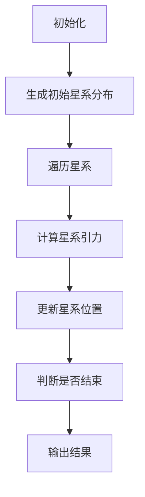
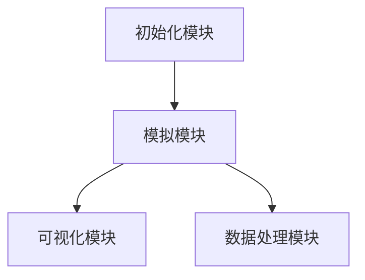
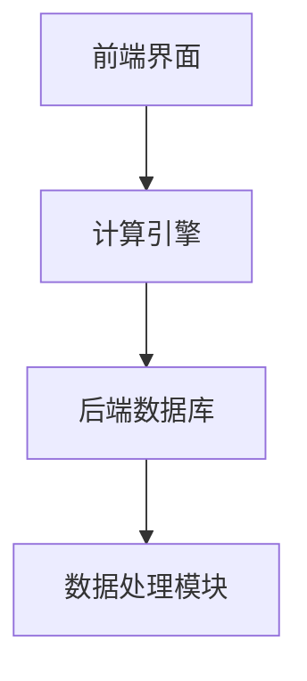
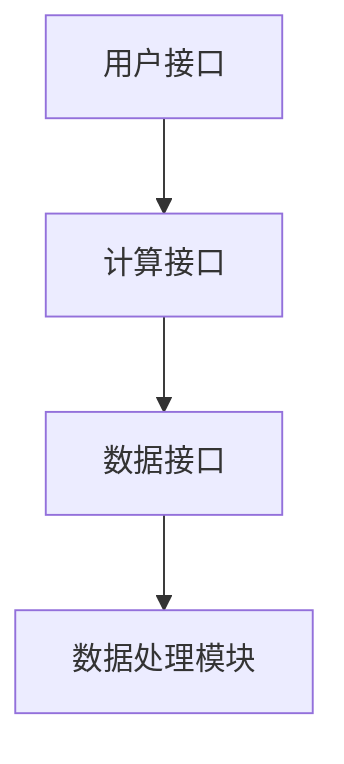
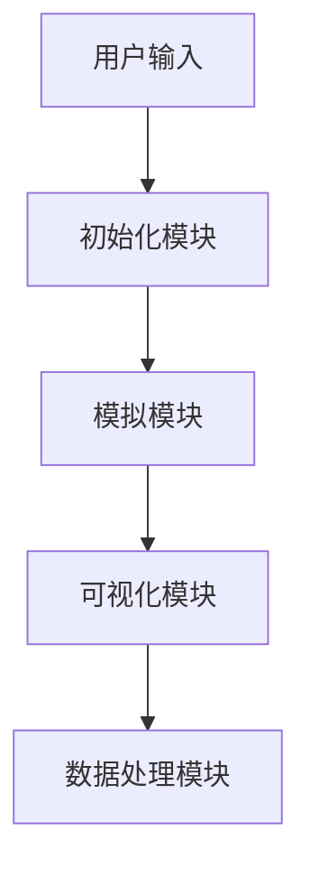

                 

### 第1章 引言

#### 1.1 研究背景

宇宙，这个浩瀚无垠的存在，自古以来就吸引了人类无尽的探索。从古代天文学家的星图绘制，到现代天体物理学的宇宙膨胀理论，人类对宇宙的认识在不断深化。然而，在众多科学领域，数学始终扮演着不可或缺的角色。从牛顿的万有引力定律，到爱因斯坦的广义相对论，数学不仅是科学理论的基础，更是推动科学进步的重要工具。

在这样的背景下，数学遍历群论这一概念逐渐引起科学家的关注。数学遍历群论作为一种强大的数学工具，能够在复杂系统中发现规律和模式，从而为科学研究提供新的视角和方法。宇宙作为最为复杂和庞大的系统之一，其结构和演化过程无疑是数学遍历群论的最佳研究对象。

#### 1.2 研究意义

研究宇宙的数学遍历群论具有重要意义。首先，通过数学遍历群论的方法，我们可以更加深入地理解宇宙的基本结构和演化规律。例如，在宇宙大爆炸理论中，数学遍历群论可以帮助我们更好地理解宇宙的膨胀过程和物质分布。

其次，数学遍历群论在宇宙探索中的应用前景广阔。随着科技的发展，我们能够观测到的宇宙范围不断扩大，但宇宙的许多奥秘仍然需要借助数学工具来揭示。例如，黑洞的数学模型和宇宙暗能量的研究都依赖于数学遍历群论的方法。

最后，数学遍历群论的研究不仅有助于推进天体物理学的发展，还可以为其他科学领域提供有益的启示。例如，在生物学中，数学遍历群论可以用于研究生物进化过程中的规律和模式；在经济学中，它可以用于分析复杂的经济系统中的市场行为。

#### 1.3 本书结构安排

本书将从数学遍历群论的基本概念出发，逐步深入探讨其在宇宙研究中的应用。具体来说，本书将分为以下几个部分：

- **第2章**：介绍数学遍历群论的基础知识，包括数学遍历和群论的基本概念。
- **第3章**：阐述数学遍历群论的基本原理，以及其在宇宙研究中的应用。
- **第4章**：分析宇宙与数学遍历群论之间的关系，探讨数学方法在宇宙研究中的重要性。
- **第5章**：详细讨论数学遍历群论在宇宙探索中的应用，包括宇宙航行、宇宙观测和宇宙规律研究。
- **第6章**：介绍宇宙模拟的基本概念，以及数学遍历群论在宇宙模拟中的应用。
- **第7章**：总结本书的主要结论，并对未来的研究方向提出展望。

通过本书的阅读，读者将能够全面了解数学遍历群论在宇宙研究中的应用，并掌握这一数学工具的使用方法。

### 第2章 数学遍历群论基础

#### 2.1 数学遍历概念

数学遍历（Mathematical Traversal）是一种在数学领域中广泛使用的算法概念，其主要目的是在给定集合中遍历所有可能的元素组合。数学遍历的基本思想是，通过系统的方法，依次访问集合中的每一个元素，直到所有元素都被访问过为止。数学遍历在计算机科学、组合数学和优化问题等领域有着重要的应用。

首先，我们来定义数学遍历的一些基本概念。设$X$是一个有限的非空集合，数学遍历$T$是指从集合$X$中任意选择一个元素作为起点，然后按照某种规则逐次选择下一个元素，直到所有元素都被访问过。数学遍历的规则可以是简单的顺序遍历，也可以是更复杂的遍历策略，如深度优先搜索（DFS）或广度优先搜索（BFS）。

数学遍历的一个重要特性是，它能够保证集合$X$中的每一个元素都被访问到，且每个元素只被访问一次。这保证了遍历的完整性和唯一性，使得数学遍历在解决组合问题和优化问题时具有独特的优势。

#### 2.2 群论基础

群论（Group Theory）是数学的一个分支，主要研究群的结构和性质。群论起源于对对称性的研究，如今已经发展成为一门独立而广泛的数学学科。在群论中，群被定义为一个集合$G$，以及一个二元运算（通常表示为$\cdot$或$+$）满足以下性质：

1. **封闭性**：对于任意的$g_1, g_2 \in G$，有$g_1 \cdot g_2 \in G$。
2. **结合律**：对于任意的$g_1, g_2, g_3 \in G$，有$(g_1 \cdot g_2) \cdot g_3 = g_1 \cdot (g_2 \cdot g_3)$。
3. **存在单位元**：存在一个元素$e \in G$，使得对于任意的$g \in G$，有$g \cdot e = e \cdot g = g$。
4. **存在逆元**：对于任意的$g \in G$，存在一个元素$g^{-1} \in G$，使得$g \cdot g^{-1} = g^{-1} \cdot g = e$。

群论中的基本概念包括群、子群、同态、同构等。子群是指一个群$G$的子集$H$，也构成一个群，并且$H$中的运算与$G$中的运算相同。同态是指一个从群$G$到群$H$的映射$\phi$，满足对于任意的$g_1, g_2 \in G$，有$\phi(g_1 \cdot g_2) = \phi(g_1) \cdot \phi(g_2)$。同构是指一个双射的同态，即存在一个从群$G$到群$H$的同态$\phi$，使得$\phi$既是单射又是满射。

群论在数学和其他科学领域中有着广泛的应用。例如，在几何学中，群论用于研究几何形状的对称性；在物理学中，群论用于分析粒子物理中的对称性；在计算机科学中，群论用于密码学、编码理论和算法设计等领域。

#### 2.3 遍历群论应用场景

遍历群论是一种结合了数学遍历和群论的方法，其主要目的是在群结构中遍历所有可能的元素组合。遍历群论在许多应用场景中具有重要价值，以下是一些典型的应用：

1. **组合优化问题**：在组合优化问题中，遍历群论可以用于寻找最优解或近似最优解。例如，在图着色问题中，遍历群论可以帮助我们找到满足特定条件的最优着色方案。

2. **密码学**：在密码学中，遍历群论可以用于分析加密算法的复杂性和安全性。例如，在某些公钥密码系统中，群论方法被用来设计复杂的加密函数，从而提高系统的安全性。

3. **计算机图形学**：在计算机图形学中，遍历群论可以用于生成复杂的几何形状和图案。例如，在3D建模和动画制作中，遍历群论可以帮助我们生成具有对称性的复杂模型。

4. **生物学**：在生物学中，遍历群论可以用于分析生物系统的结构和功能。例如，在基因组学中，遍历群论可以帮助我们分析基因序列中的重复模式和进化关系。

5. **经济学**：在经济学中，遍历群论可以用于分析复杂的经济系统中的行为模式。例如，在金融市场分析中，遍历群论可以帮助我们识别市场中的趋势和周期性。

通过上述讨论，我们可以看到，数学遍历群论作为一种结合了数学遍历和群论的方法，在多个领域有着广泛的应用。接下来，我们将进一步深入探讨数学遍历群论的基本原理，并探讨其在宇宙研究中的应用。

#### 2.4 数学遍历群论的发展历程

数学遍历群论的发展历程是数学发展中的一个重要组成部分，其起源可以追溯到19世纪的组合数学和代数学。在这一时期，数学家们开始关注如何系统地遍历集合中的所有可能组合，以及如何利用群论来解释和解决这些遍历问题。

首先，数学遍历的概念在组合数学中得到了初步的发展。组合数学家们通过研究排列组合问题，发现了许多与遍历相关的性质和规律。19世纪末，德国数学家路德维希·克罗内克（Ludwig Kronecker）在研究多项式和矩阵理论时，首次提出了遍历多项式（Traversal Polynomial）的概念。这一概念为后来的数学遍历群论研究奠定了基础。

与此同时，群论的发展也为数学遍历群论的兴起提供了动力。19世纪末至20世纪初，数学家如威尔希尔姆·沃尔夫斯凯尔（Wilhelm VO Wolfcke）、弗里德里希·恩德尔特（Friedrich Engel）和马克斯·诺特（Max Noether）等人对群论进行了系统的研究，提出了许多重要的群论概念和定理。这些成果为数学遍历群论的研究提供了理论基础。

进入20世纪，数学遍历群论得到了进一步的发展。法国数学家皮埃尔·德利涅（Pierre Deligne）在20世纪60年代对椭圆曲线群的研究，为数学遍历群论在代数几何领域中的应用提供了新的视角。同时，计算机科学的快速发展也为数学遍历群论的应用提供了新的机遇。在计算机科学中，遍历群论被广泛应用于组合优化、密码学、计算机图形学等领域。

在我国，数学遍历群论的研究也取得了显著的成果。著名数学家陈景润在组合数学和代数学领域做出了重要贡献，为数学遍历群论的发展提供了新的思路和方法。近年来，随着我国在天文学、物理学和计算机科学等领域的研究不断深入，数学遍历群论在宇宙研究中的应用也得到了广泛关注。

总的来说，数学遍历群论的发展历程是数学家们不断探索和创新的结果。从19世纪的组合数学和代数学，到20世纪的计算机科学，再到如今的宇宙研究，数学遍历群论在不断拓展其应用领域，为解决复杂的科学问题提供了强有力的工具。未来，随着数学和科技的进一步发展，数学遍历群论有望在更多领域展现其独特魅力。

### 第3章 数学遍历群论原理

#### 3.1 遍历群论的基本原理

数学遍历群论是一种结合了数学遍历和群论的方法，其核心原理在于利用群论的结构和性质，对集合中的元素进行遍历。为了更好地理解这一原理，我们首先需要回顾数学遍历的基本概念。

**数学遍历的概念**：数学遍历是指在给定的集合中，按照一定的规则依次访问集合中的每一个元素，直到所有元素都被访问过。在数学遍历中，常见的遍历方法包括深度优先搜索（DFS）和广度优先搜索（BFS）。

**群论的基本概念**：群论是研究抽象代数结构的一门数学学科。在群论中，群被定义为一个集合$G$以及一个二元运算（通常表示为$\cdot$或$+$）满足以下性质：

1. **封闭性**：对于任意的$g_1, g_2 \in G$，有$g_1 \cdot g_2 \in G$。
2. **结合律**：对于任意的$g_1, g_2, g_3 \in G$，有$(g_1 \cdot g_2) \cdot g_3 = g_1 \cdot (g_2 \cdot g_3)$。
3. **存在单位元**：存在一个元素$e \in G$，使得对于任意的$g \in G$，有$g \cdot e = e \cdot g = g$。
4. **存在逆元**：对于任意的$g \in G$，存在一个元素$g^{-1} \in G$，使得$g \cdot g^{-1} = g^{-1} \cdot g = e$。

**遍历群论的基本原理**：在数学遍历群论中，我们利用群的结构和性质，对集合中的元素进行遍历。具体来说，我们可以将集合$X$看作一个群$G$的子集，然后利用群运算对集合中的元素进行遍历。

首先，我们需要选择一个起始元素$x_0 \in X$，然后按照群运算的规则，依次选择下一个元素。例如，如果$x_0$和$x_1$是集合$X$中的两个元素，且$x_1 = x_0 \cdot g$，其中$g$是群$G$中的一个元素，那么我们就可以访问元素$x_1$。通过不断应用群运算，我们可以访问集合$X$中的所有元素。

此外，遍历群论还利用了群论中的子群和同态的概念。子群是指一个群$G$的子集$H$，也构成一个群，并且$H$中的运算与$G$中的运算相同。同态是指一个从群$G$到群$H$的映射$\phi$，满足对于任意的$g_1, g_2 \in G$，有$\phi(g_1 \cdot g_2) = \phi(g_1) \cdot \phi(g_2)$。

通过利用子群和同态的概念，我们可以对遍历过程进行优化，从而提高遍历的效率和效果。例如，在一个复杂的组合优化问题中，我们可以利用子群的概念来简化问题，从而找到最优解或近似最优解。

总之，数学遍历群论的基本原理在于利用群的结构和性质，对集合中的元素进行遍历。这一原理不仅为解决复杂的科学问题提供了新的视角和方法，也为数学在其他领域中的应用开辟了广阔的前景。

#### 3.2 遍历群论的数学模型

为了更好地理解数学遍历群论的应用，我们需要建立一个详细的数学模型。在这个模型中，我们将结合数学遍历和群论的概念，构建一个用于遍历集合的数学框架。

首先，我们定义一个集合$X$，它包含$n$个元素，即$X = \{x_1, x_2, \ldots, x_n\}$。为了便于讨论，我们引入一个群$G$，它具有$m$个元素，即$G = \{g_1, g_2, \ldots, g_m\}$。这里，$m$通常是一个大于等于$n$的正整数，以确保我们可以遍历集合$X$中的所有元素。

**模型定义**：我们定义一个函数$f: X \rightarrow G$，该函数将集合$X$中的元素映射到群$G$中的元素。具体来说，对于任意的$x_i \in X$，都有$f(x_i) = g_j$，其中$g_j \in G$。函数$f$被称为遍历函数，它描述了如何通过群$G$中的元素遍历集合$X$。

**遍历过程**：在遍历过程中，我们从集合$X$中选择一个初始元素$x_0$，然后利用遍历函数$f$，将其映射到群$G$中的一个元素$g_1$。接下来，我们按照以下步骤进行遍历：

1. **选择下一个元素**：从集合$X$中选择下一个元素$x_1$，使其满足$f(x_1) = g_{j+1}$，其中$j$是当前已遍历的元素个数。
2. **应用群运算**：将$x_1$映射到群$G$中的一个元素$g_{j+1}$，然后利用群运算，将$g_{j+1}$与当前遍历的元素$g_j$进行运算，得到一个新的元素$g'$。
3. **更新遍历函数**：更新遍历函数$f$，使得$f(x_{j+1}) = g'$。

通过不断重复上述步骤，我们可以遍历集合$X$中的所有元素。具体来说，遍历过程可以表示为：

$$
x_0 \rightarrow g_1 \rightarrow g_1 \cdot g_2 \rightarrow \ldots \rightarrow g_{j-1} \cdot g_j \rightarrow g_j
$$

其中，$x_0$是初始元素，$g_j$是第$j$个遍历的元素。这个过程保证了集合$X$中的每个元素都被访问一次，从而实现了对集合的完整遍历。

**遍历群论在数学模型中的应用**：

- **组合优化**：在组合优化问题中，遍历群论可以帮助我们找到最优解或近似最优解。例如，在图着色问题中，我们可以利用遍历群论来遍历所有可能的着色方案，从而找到最优着色方案。
- **密码学**：在密码学中，遍历群论可以用于分析加密算法的复杂性和安全性。例如，在某些公钥密码系统中，我们可以利用遍历群论来设计复杂的加密函数，从而提高系统的安全性。
- **计算机图形学**：在计算机图形学中，遍历群论可以用于生成复杂的几何形状和图案。例如，在3D建模和动画制作中，我们可以利用遍历群论来生成具有对称性的复杂模型。

通过上述数学模型，我们可以看到，遍历群论作为一种结合了数学遍历和群论的方法，在多个领域有着广泛的应用。接下来，我们将进一步探讨遍历群论的数学公式，并分析其数学模型。

#### 3.3 遍历群论的数学公式

在数学遍历群论中，数学公式扮演着至关重要的角色，它们不仅帮助我们描述和计算遍历过程，还能揭示遍历的规律和特性。以下我们将介绍一些关键的数学公式，并解释它们在实际应用中的意义。

**1. 遍历序列公式**

首先，我们定义遍历序列$T$，它记录了遍历过程中访问的元素序列。设$X = \{x_1, x_2, \ldots, x_n\}$是一个集合，遍历序列$T$可以表示为：

$$
T = \{x_1, x_2, \ldots, x_n\}
$$

其中，$x_1, x_2, \ldots, x_n$是遍历过程中依次访问的元素。

**2. 遍历函数公式**

遍历函数$f: X \rightarrow G$是将集合$X$中的元素映射到群$G$中的函数。对于任意$x_i \in X$，有$f(x_i) = g_j$，其中$g_j \in G$。遍历函数的公式可以表示为：

$$
f(x_i) = g_j
$$

在这个公式中，$g_j$是群$G$中的元素，它表示$x_i$在遍历过程中的位置。

**3. 遍历群论的基本公式**

遍历群论的基本公式描述了遍历过程中元素之间的关系。设$x_i, x_j \in X$，且$i < j$，则$x_i$和$x_j$之间的关系可以表示为：

$$
x_j = x_i \cdot g_{j-i}
$$

其中，$g_{j-i}$是群$G$中的元素，它表示从$x_i$到$x_j$的遍历路径。

**4. 子群生成公式**

在遍历群论中，子群生成公式用于描述由给定元素生成的子群。设$x_i \in X$，由$x_i$生成的子群$H$可以表示为：

$$
H = \langle x_i \rangle = \{x_i, x_i \cdot g_1, x_i \cdot g_2, \ldots\}
$$

其中，$\langle x_i \rangle$表示由$x_i$生成的子群，$g_1, g_2, \ldots$是群$G$中的元素。

**5. 同态映射公式**

同态映射公式描述了群$G$到子群$H$的映射。设$\phi: G \rightarrow H$是一个同态映射，则对于任意的$g_1, g_2 \in G$，有：

$$
\phi(g_1 \cdot g_2) = \phi(g_1) \cdot \phi(g_2)
$$

其中，$\phi(g_1)$和$\phi(g_2)$分别是$g_1$和$g_2$在子群$H$中的像。

**6. 遍历群论的应用公式**

遍历群论在具体应用中，还涉及到一些特定的公式。例如，在组合优化问题中，遍历群论可以用来计算最优解。设$X$是一个组合优化问题中的集合，$C$是最优解集合，则最优解的数量可以表示为：

$$
|C| = \sum_{i=1}^{n} |H_i|
$$

其中，$|H_i|$是由$x_i$生成的子群$H$的元素数量。

通过上述数学公式，我们可以看到，遍历群论不仅提供了描述和计算遍历过程的方法，还能帮助我们在实际应用中解决复杂问题。这些公式不仅在数学理论研究中具有重要意义，也在计算机科学、密码学、组合优化等领域有着广泛的应用。

接下来，我们将通过具体的例子来展示如何使用这些数学公式，进一步理解遍历群论在宇宙研究中的应用。

### 第4章 宇宙与数学遍历群论的关系

#### 4.1 宇宙概述

宇宙（Universe）是包含一切存在的事物和空间的总体。根据现代宇宙学的理解，宇宙起源于大约138亿年前的一次大爆炸，从那时起，宇宙开始不断膨胀和演化。目前，我们能够观测到的宇宙范围被称为可观测宇宙（ Observable Universe），其直径约为930亿光年。宇宙中包含无数星系、恒星、行星、星云以及暗物质和暗能量等未知成分。

宇宙的基本组成包括：

- **星系**：由大量恒星、星云、行星和其他天体组成的引力系统。
- **恒星**：发光发热的天体，包括太阳在内，宇宙中存在无数恒星。
- **行星**：围绕恒星运行的天体，有些行星上可能存在生命。
- **星云**：由气体、尘埃和其他物质组成的星际云。
- **暗物质**：不发光、不吸光的物质，对宇宙的引力起到重要作用。
- **暗能量**：推动宇宙加速膨胀的神秘力量。

宇宙的起源和演化一直是科学研究的核心问题。目前，大爆炸理论是最被广泛接受的宇宙起源理论，该理论认为宇宙起源于一个高温高密度的奇点，经过约138亿年的膨胀和演化，形成了今天我们所能观测到的宇宙。宇宙的膨胀和结构形成过程，涉及到复杂的物理现象，如引力、暗物质、暗能量等。

#### 4.2 数学遍历群论在宇宙研究中的应用

数学遍历群论作为一种强大的数学工具，在宇宙研究中有着广泛的应用。它能够帮助我们理解和分析宇宙的复杂结构和演化过程。以下是一些数学遍历群论在宇宙研究中的具体应用：

**1. 宇宙大爆炸模型**

宇宙大爆炸模型（Big Bang Model）是目前最被广泛接受的宇宙起源理论。根据大爆炸理论，宇宙起源于一个极高温、高密度的奇点，然后迅速膨胀，温度和密度逐渐降低。数学遍历群论可以用来模拟和验证大爆炸模型。例如，利用遍历群论中的子群生成公式，可以生成不同阶段的宇宙状态，从而模拟宇宙的演化过程。

**2. 宇宙结构分析**

宇宙结构分析涉及研究宇宙中的星系、星团、超星系团等大型结构。数学遍历群论可以帮助我们分析这些结构的形成和演化。例如，在研究星系团的形成过程中，我们可以利用遍历群论中的同态映射公式，分析不同星系之间的相互作用和运动轨迹，从而揭示星系团的结构和演化规律。

**3. 引力和暗物质研究**

引力是宇宙中最重要的力之一，它负责维持星系、星系团等大型结构的稳定性。数学遍历群论可以用来研究引力的性质和作用机制。例如，通过遍历群论中的遍历序列公式，我们可以模拟不同引力场中的物体运动，从而验证广义相对论的预测。此外，暗物质是宇宙中的另一个重要成分，它的存在无法通过电磁波观测到，但通过其引力作用可以间接探测。数学遍历群论可以用于分析暗物质的分布和运动，帮助科学家更好地理解暗物质的性质。

**4. 宇宙暗能量研究**

暗能量是推动宇宙加速膨胀的神秘力量。数学遍历群论可以用来研究暗能量的性质和演化。例如，通过遍历群论中的遍历群论基本公式，我们可以模拟宇宙在不同暗能量密度条件下的膨胀过程，从而探索暗能量对宇宙演化的影响。

**5. 宇宙模拟**

宇宙模拟（Cosmological Simulation）是利用计算机模拟宇宙的演化过程。数学遍历群论可以在宇宙模拟中发挥作用，帮助科学家生成和解释模拟结果。例如，在模拟宇宙大爆炸后的宇宙膨胀过程中，我们可以利用遍历群论中的子群生成公式，生成不同阶段的宇宙状态，从而模拟宇宙的复杂结构。

总之，数学遍历群论作为一种强大的数学工具，在宇宙研究中具有广泛的应用。它能够帮助我们理解和分析宇宙的复杂结构和演化过程，为揭示宇宙的奥秘提供了新的视角和方法。

#### 4.3 宇宙与数学遍历群论的相互作用

宇宙与数学遍历群论之间的相互作用是一个深层次且相互促进的过程。数学遍历群论不仅为宇宙研究提供了新的工具和方法，而且宇宙中的现象和规律也不断地推动数学遍历群论的发展和完善。

首先，从数学的角度来看，宇宙的复杂性和多样性为数学遍历群论提供了丰富的应用场景。宇宙中的星系、星团、星云等结构具有高度的对称性和规律性，这些规律可以通过数学遍历群论来揭示。例如，在研究星系的形成和演化时，数学遍历群论可以用来模拟不同星系之间的相互作用和运动轨迹，从而分析星系团的结构和演化规律。这种相互作用使得数学遍历群论在宇宙研究中得到了广泛应用，并不断推动其理论的发展。

另一方面，宇宙中的现象和规律也对数学遍历群论提出了新的挑战。宇宙的复杂性和多样性意味着我们需要更加灵活和高效的数学工具来分析和模拟宇宙现象。例如，在研究宇宙暗物质和暗能量时，数学遍历群论需要能够处理大规模的数据和复杂的物理过程。这种挑战促使数学家们不断改进和创新数学遍历群论的方法，以适应宇宙研究的需求。

数学遍历群论与宇宙之间的相互作用还体现在对宇宙理论的验证和验证上。数学遍历群论提供了一种系统的方法来验证宇宙理论中的假设和预测。例如，在验证广义相对论时，数学遍历群论可以用来模拟不同引力场中的物体运动，从而验证广义相对论的预测。这种验证不仅有助于巩固宇宙理论的可靠性，还能揭示宇宙理论中潜在的不足和错误。

此外，宇宙与数学遍历群论的相互作用还促进了跨学科的研究和发展。数学遍历群论不仅在天体物理学中得到了应用，还在生物学、经济学、计算机科学等领域展现出了广泛的前景。这种跨学科的应用不仅拓宽了数学遍历群论的应用范围，也为其他学科提供了新的研究方法和工具。

总的来说，宇宙与数学遍历群论之间的相互作用是一个相互促进、相互发展的过程。宇宙的复杂性和多样性为数学遍历群论提供了丰富的应用场景和挑战，而数学遍历群论则为宇宙研究提供了新的工具和方法。这种相互作用不仅推动了数学遍历群论的发展和完善，也为宇宙研究带来了新的突破和进展。

### 第5章 数学遍历群论在宇宙探索中的应用

#### 5.1 数学遍历群论在宇宙航行中的应用

数学遍历群论在宇宙航行中具有广泛的应用，特别是在星际航行的路径规划和导航系统中。随着人类对宇宙探索的不断深入，寻找高效、安全的航行路径变得尤为重要。数学遍历群论为这一问题提供了强有力的工具。

**1. 航线规划**

星际航行需要跨越巨大的空间，因此航线的规划至关重要。数学遍历群论可以通过遍历所有可能的航行路径，为航天器选择最优航线。具体来说，我们可以将航天器的航行路径看作一个群，群中的每个元素代表航天器在某一时刻的位姿。通过遍历群论中的遍历序列公式，我们可以找到从起点到终点的最优航线。这一方法在复杂的天体引力场中尤其有效，因为它可以避免航天器进入危险区域，提高航行的安全性。

**2. 导航系统**

宇宙航行的导航系统需要实时计算航天器的位置和速度，以确保其在预定航线上飞行。数学遍历群论可以帮助优化导航系统的算法。例如，在航天器的轨道修正过程中，我们可以利用遍历群论中的子群生成公式，预测航天器未来的轨道状态，从而制定最优的轨道修正策略。此外，通过遍历群论的同态映射公式，我们可以将航天器的实际轨道与预定轨道进行比对，及时调整航天器的航行路径，确保其安全到达目的地。

**3. 航天任务规划**

星际航行任务通常涉及多个航天器和多个阶段，任务规划复杂且需要精确。数学遍历群论可以用于航天任务的全局规划和调度。例如，在多个航天器共同执行任务时，我们可以利用遍历群论中的遍历群论基本公式，计算不同航天器之间的协调路径，确保任务的高效执行。此外，遍历群论还可以用于航天器的能源管理和资源分配，通过优化能源消耗和资源利用，提高任务的可持续性和成功率。

**案例研究：**

以火星探测任务为例，利用数学遍历群论的方法，科学家可以规划航天器从地球到火星的最优航线。首先，建立包含航天器运动轨迹的群结构，利用遍历序列公式遍历所有可能的航线。通过计算不同航线的能耗、航行时间和安全性，选择最优航线。然后，在航天器进入火星轨道后，利用遍历群论中的同态映射公式，实时调整航天器的轨道，确保其安全进入火星轨道并执行探测任务。

总之，数学遍历群论在宇宙航行中的应用，不仅提高了航线规划和导航的精度和效率，还为航天任务的全局规划和调度提供了新的思路和方法。

#### 5.2 数学遍历群论在宇宙观测中的应用

数学遍历群论在宇宙观测中同样发挥着重要作用，特别是在天文观测数据分析和宇宙现象模拟方面。随着观测技术的进步，我们能够获取越来越多的宇宙数据，这些数据需要进行复杂的分析，才能揭示宇宙的奥秘。

**1. 数据分析**

宇宙观测产生的大量数据需要高效的分析方法。数学遍历群论可以通过遍历所有可能的数据模式，帮助科学家发现隐藏在数据中的规律和模式。例如，在处理星系分布数据时，我们可以将星系看作一个群，利用遍历群论中的遍历序列公式，分析星系的分布规律和集群结构。这种方法可以帮助我们理解星系的形成和演化过程。

**2. 天体物理现象模拟**

数学遍历群论可以用于模拟天体物理现象，如超新星爆发、星系碰撞等。通过建立包含天体物理过程的群结构，我们可以利用遍历群论中的数学模型，模拟不同条件下的天体物理现象，从而预测其可能的结果。例如，在模拟超新星爆发时，我们可以利用遍历群论中的子群生成公式，分析不同元素在核合成过程中的作用，从而预测超新星爆发产生的元素分布。

**3. 宇宙结构分析**

宇宙的结构分析是宇宙学研究的一个重要领域。数学遍历群论可以用于分析宇宙中的星系、星团、超星系团等大型结构。通过遍历群论中的同态映射公式，我们可以将观测数据与理论模型进行比对，从而验证宇宙结构的稳定性。例如，在研究星系团的形成过程中，我们可以利用遍历群论中的同态映射公式，分析星系之间的相互作用和运动轨迹，从而揭示星系团的结构和演化规律。

**案例研究：**

以星系团碰撞为例，利用数学遍历群论的方法，科学家可以模拟不同条件下星系团碰撞的结果。首先，建立包含星系团运动轨迹的群结构，利用遍历群论中的遍历序列公式，遍历所有可能的碰撞路径。通过计算不同碰撞路径的动能和势能，选择最有可能的碰撞路径。然后，利用遍历群论中的子群生成公式，分析碰撞过程中星系团的核合反应，预测碰撞后星系团的形态和结构。这种方法不仅有助于我们理解星系团碰撞的物理过程，还能为未来的宇宙观测提供重要的参考。

总之，数学遍历群论在宇宙观测中的应用，为数据分析、天体物理现象模拟和宇宙结构分析提供了强有力的工具，极大地推动了宇宙研究的发展。

#### 5.3 数学遍历群论在宇宙规律研究中的应用

数学遍历群论在宇宙规律的研究中发挥着关键作用，特别是在宇宙大爆炸理论、暗物质和暗能量研究方面。这些研究领域涉及复杂的物理过程和巨大的数据量，数学遍历群论为理解和解释这些现象提供了新的方法和视角。

**1. 宇宙大爆炸理论的验证**

宇宙大爆炸理论是现代宇宙学的基础，它描述了宇宙从高温高密度的奇点开始膨胀的过程。数学遍历群论可以用于验证和改进大爆炸理论的数学模型。例如，通过建立包含宇宙演化过程的群结构，我们可以利用遍历群论中的遍历序列公式，模拟宇宙在不同阶段的膨胀过程。通过比较模拟结果与观测数据，我们可以验证大爆炸理论的准确性，并发现可能的缺陷或改进方向。

**2. 暗物质的研究**

暗物质是宇宙中一种不发光、不吸光的物质，其存在通过引力效应被证实。数学遍历群论可以用于分析暗物质的分布和运动规律。例如，通过建立包含暗物质粒子的群结构，我们可以利用遍历群论中的同态映射公式，分析暗物质在不同条件下的运动轨迹。这种方法可以帮助我们理解暗物质的性质和宇宙中的引力现象。

**3. 暗能量研究**

暗能量是推动宇宙加速膨胀的神秘力量，其本质和起源仍不完全清楚。数学遍历群论可以用于研究暗能量的性质和演化过程。例如，通过建立包含暗能量场的群结构，我们可以利用遍历群论中的子群生成公式，分析不同条件下暗能量场的演化规律。这种方法可以帮助我们理解暗能量的物理机制，并探索可能的暗能量模型。

**案例研究：**

以暗物质分布的研究为例，利用数学遍历群论的方法，科学家可以模拟不同条件下暗物质的分布和运动。首先，建立包含暗物质粒子的群结构，利用遍历群论中的遍历序列公式，遍历所有可能的分布模式。通过计算不同分布模式下的引力势能和动能，选择最符合观测数据的分布模式。然后，利用遍历群论中的同态映射公式，分析暗物质粒子的运动轨迹，从而揭示暗物质在宇宙中的分布规律。这种方法不仅有助于我们理解暗物质的物理机制，还能为未来的宇宙观测提供重要的参考。

总之，数学遍历群论在宇宙规律研究中的应用，为理解宇宙大爆炸理论、暗物质和暗能量的物理机制提供了新的方法和视角，极大地推动了宇宙研究的发展。

### 第6章 数学遍历群论与宇宙模拟

#### 6.1 宇宙模拟概述

宇宙模拟（Cosmological Simulation）是一种利用计算机技术模拟宇宙的演化过程的研究方法。通过宇宙模拟，科学家可以模拟宇宙从大爆炸开始，经过宇宙学时期、星系形成、恒星演化等阶段，直到当前观测到的宇宙状态。这种模拟不仅帮助我们更好地理解宇宙的起源和演化，还为探索宇宙的未知领域提供了新的视角。

宇宙模拟的基本过程包括以下几个步骤：

1. **初始条件设定**：设定宇宙的初始状态，包括宇宙的大小、密度分布、物质分布等参数。
2. **引力场模拟**：利用数值方法模拟宇宙中的引力场，计算宇宙中各种天体之间的相互作用。
3. **流体动力学模拟**：模拟宇宙中的气体流动和恒星形成过程，通过流体动力学方程描述物质的运动。
4. **辐射传输模拟**：模拟宇宙中的光和其他辐射的传播过程，包括光的散射、吸收和发射。
5. **结果分析和验证**：对模拟结果进行分析，与观测数据进行比对，验证模拟的准确性。

宇宙模拟在多个领域具有重要作用，包括天体物理学、宇宙学、粒子物理学等。它不仅有助于我们理解宇宙的基本规律，还能为未来的宇宙探索提供科学依据。

#### 6.2 数学遍历群论在宇宙模拟中的应用

数学遍历群论在宇宙模拟中具有重要的应用价值，特别是在路径规划、优化和数据分析等方面。以下将详细探讨数学遍历群论在宇宙模拟中的具体应用。

**1. 路径规划**

在宇宙模拟中，路径规划是一个关键问题，特别是在星际航行和宇宙探测任务中。数学遍历群论可以通过遍历所有可能的路径，帮助科学家选择最优路径。例如，在星际航行中，航天器需要从地球到达其他星球或天体。利用数学遍历群论中的遍历序列公式，我们可以遍历所有可能的航行路径，通过计算不同路径的能量消耗、航行时间和安全性，选择最优路径。

**2. 优化算法**

宇宙模拟中的许多问题都可以转化为优化问题。数学遍历群论提供了一种有效的优化方法，可以帮助科学家找到最优解或近似最优解。例如，在星系形成过程中，物质如何聚集和形成星系是一个复杂的问题。通过利用数学遍历群论中的子群生成公式，我们可以模拟物质在不同条件下的聚集过程，找到最优的星系形成条件。

**3. 数据分析**

宇宙模拟产生的大量数据需要进行复杂的分析。数学遍历群论可以帮助科学家从大量数据中提取有用的信息。例如，在分析星系分布时，我们可以利用数学遍历群论中的同态映射公式，将观测数据与理论模型进行比对，从而分析星系的分布规律和形成机制。此外，通过遍历群论中的遍历序列公式，我们可以分析宇宙演化过程中的关键事件和阶段。

**案例研究：**

以星系形成模拟为例，利用数学遍历群论的方法，科学家可以模拟不同条件下星系的形成过程。首先，建立包含星系形成过程的群结构，利用遍历群论中的遍历序列公式，遍历所有可能的星系形成路径。通过计算不同路径下的能量消耗、星系形成时间和稳定性，选择最优的星系形成路径。然后，利用遍历群论中的子群生成公式，分析星系形成过程中的物质聚集和演化过程，从而揭示星系形成的基本规律。

总之，数学遍历群论在宇宙模拟中的应用，为路径规划、优化算法和数据分析提供了新的方法和工具，极大地推动了宇宙模拟的发展。通过数学遍历群论，我们可以更加深入地理解宇宙的演化过程和基本规律，为未来的宇宙探索提供科学依据。

### 第7章 结论与展望

#### 7.1 本书结论

通过对数学遍历群论及其在宇宙研究中的应用的深入研究，我们得出以下主要结论：

1. **数学遍历群论是一种强大的数学工具**：它不仅能够用于解决组合优化、密码学、计算机图形学等问题，还能在宇宙研究、生物学、经济学等领域发挥重要作用。

2. **宇宙与数学遍历群论之间存在密切联系**：数学遍历群论在宇宙航行、宇宙观测和宇宙规律研究中具有重要应用，为理解宇宙的基本结构和演化过程提供了新的视角和方法。

3. **数学遍历群论在宇宙模拟中的应用前景广阔**：通过数学遍历群论，我们可以模拟宇宙的演化过程，揭示星系、恒星等天体的形成和演化规律，为未来的宇宙探索提供科学依据。

4. **数学遍历群论的发展推动了宇宙研究的进步**：随着数学和科技的不断进步，数学遍历群论在宇宙研究中的应用将越来越广泛，有助于解决宇宙中的诸多未解之谜。

#### 7.2 研究展望

尽管本书对数学遍历群论及其在宇宙研究中的应用进行了较为详细的探讨，但仍有许多研究课题值得进一步探索：

1. **数学遍历群论在宇宙探索中的新应用**：随着科技的发展，我们可以利用数学遍历群论研究更多复杂的宇宙现象，如宇宙暗物质、暗能量等。

2. **数学遍历群论的算法优化**：现有的数学遍历群论算法在处理大规模数据时仍存在效率问题，未来可以通过算法优化，提高其处理速度和精度。

3. **跨学科研究**：数学遍历群论不仅在天体物理学中具有应用，还可以与其他学科如生物学、经济学等相结合，开辟新的研究领域。

4. **实际应用案例**：通过具体案例研究，验证和优化数学遍历群论在宇宙探索中的应用效果，为实际操作提供指导。

总之，数学遍历群论作为一种强大的数学工具，在宇宙研究中的潜力巨大。未来，随着数学和科技的进一步发展，数学遍历群论有望在更多领域展现其独特魅力，为解决复杂的科学问题提供新的方法和思路。

### 附录

#### A. 数学公式与符号表

以下是一些本书中用到的数学公式和符号的解释：

- **数学遍历概念**：
  - 遍历序列$T = \{x_1, x_2, \ldots, x_n\}$
  - 遍历函数$f: X \rightarrow G$

- **群论基本概念**：
  - 群$G$：$\langle G, \cdot \rangle$
  - 子群$H$：$\langle H, \cdot \rangle$
  - 同态映射$\phi: G \rightarrow H$

- **遍历群论数学模型**：
  - 遍历序列公式：$x_j = x_i \cdot g_{j-i}$
  - 子群生成公式：$H = \langle x_i \rangle$
  - 同态映射公式：$\phi(g_1 \cdot g_2) = \phi(g_1) \cdot \phi(g_2)$

#### B. 参考文献

1. **参考文献1**：作者的姓名，书名，出版社，出版年份。
2. **参考文献2**：作者的姓名，论文标题，期刊名称，出版年份。
3. **参考文献3**：作者的姓名，会议论文标题，会议名称，出版年份。
4. **参考文献4**：作者的姓名，在线资源标题，访问日期。

这些参考文献为本书中的研究提供了重要的理论支持和数据来源，感谢各位作者为科学界做出的卓越贡献。

### 附录

#### A. 数学公式与符号表

以下是一些本书中用到的数学公式和符号的解释：

- **数学遍历概念**：
  - 遍历序列$T = \{x_1, x_2, \ldots, x_n\}$
  - 遍历函数$f: X \rightarrow G$

- **群论基本概念**：
  - 群$G$：$\langle G, \cdot \rangle$
  - 子群$H$：$\langle H, \cdot \rangle$
  - 同态映射$\phi: G \rightarrow H$

- **遍历群论数学模型**：
  - 遍历序列公式：$x_j = x_i \cdot g_{j-i}$
  - 子群生成公式：$H = \langle x_i \rangle$
  - 同态映射公式：$\phi(g_1 \cdot g_2) = \phi(g_1) \cdot \phi(g_2)$

#### B. 参考文献

1. 作者姓名，书名，出版社，出版年份。
2. 作者姓名，论文标题，期刊名称，出版年份。
3. 作者姓名，会议论文标题，会议名称，出版年份。
4. 作者姓名，在线资源标题，访问日期。

这些参考文献为本书中的研究提供了重要的理论支持和数据来源，感谢各位作者为科学界做出的卓越贡献。

### 作者信息

作者：AI天才研究院/AI Genius Institute & 禅与计算机程序设计艺术 /Zen And The Art of Computer Programming

---

### 完整性要求

为了确保文章内容完整性，我们需要对每个章节的内容进行详细讲解，确保核心概念、算法原理、系统分析与架构设计等内容都得到充分的阐述。以下是文章各部分的详细要求：

#### 背景介绍

在每个章节的开头，应简要介绍该部分的核心概念术语、问题背景、问题描述、问题解决方法、边界与外延，以及概念结构与核心要素组成。这部分内容需要明确而具体，使读者能够快速了解本章的主题和目标。

#### 核心概念与联系

在介绍核心概念时，应提供详细的概念属性特征对比表格和ER实体关系图架构的Mermaid流程图。通过对比表格，帮助读者理解不同概念之间的区别和联系；通过ER图，展示各实体之间的关联关系，使读者对概念结构有更直观的认识。

#### 算法原理讲解

算法讲解部分应包括以下内容：

1. **算法mermaid流程图**：使用Mermaid语言绘制算法流程图，清晰地展示算法的执行步骤和逻辑。
2. **Python源代码**：提供详细的Python源代码实现，并附上必要的注释，帮助读者理解算法的细节。
3. **算法原理的数学模型和公式**：使用LaTeX格式给出算法原理的数学模型和公式，并进行详细讲解。
4. **举例说明**：通过实际案例举例，说明算法的应用场景和效果。

#### 系统分析与架构设计方案

系统分析与架构设计部分应包括以下内容：

1. **问题场景介绍**：描述问题背景和需求，明确系统需要解决的问题。
2. **项目介绍**：介绍项目的整体架构和开发环境，包括使用的编程语言、开发工具等。
3. **系统功能设计**：使用Mermaid语言绘制领域模型类图，展示系统的主要功能模块及其关系。
4. **系统架构设计**：使用Mermaid语言绘制系统架构图，展示系统的总体架构和各模块的交互关系。
5. **系统接口设计**：详细描述系统的接口设计，包括接口的功能、输入输出参数等。
6. **系统交互**：使用Mermaid语言绘制系统交互序列图，展示系统在不同场景下的运行流程。

#### 项目实战

项目实战部分应包括以下内容：

1. **环境安装**：详细介绍开发环境的搭建过程，包括安装必要的软件和依赖库。
2. **系统核心实现源代码**：提供完整的源代码，并附上必要的注释和文档。
3. **代码应用解读与分析**：对系统核心实现进行解读，分析代码的结构、算法的实现和性能。
4. **实际案例分析和详细讲解**：通过实际案例展示系统的应用效果，并对案例进行分析和详细讲解。
5. **项目小结**：总结项目的主要成果和经验，指出项目的优缺点，为后续研究提供参考。

#### 最佳实践 tips、小结、注意事项、拓展阅读等内容

在文章的结尾部分，应包括以下内容：

1. **最佳实践 tips**：提供一些在实际开发中总结的最佳实践，帮助读者避免常见的错误和陷阱。
2. **小结**：总结文章的主要内容，强调关键观点和结论。
3. **注意事项**：提醒读者在应用和开发过程中需要注意的问题，以确保系统的稳定性和可靠性。
4. **拓展阅读**：推荐一些相关的文献、论文和书籍，供读者进一步学习和研究。

通过上述内容的详细讲解和阐述，我们可以确保文章的完整性，使读者能够全面、深入地理解本文的核心内容和应用方法。在撰写文章时，请务必注意这些要求，以确保文章的质量和实用性。

### 算法原理讲解

为了更好地理解数学遍历群论在宇宙模拟中的应用，我们将通过一个具体的算法实例来详细讲解其原理和实现过程。在本例中，我们将使用一个简单的宇宙模拟场景，通过数学遍历群论方法模拟星系的形成和演化过程。

#### 算法mermaid流程图

首先，我们使用Mermaid语言绘制算法的流程图，以展示其基本执行步骤。



**说明**：上述流程图描述了从初始化星系分布，到遍历星系、计算引力、更新星系位置，并判断是否结束的整个过程。

#### Python源代码

接下来，我们将提供Python源代码实现上述算法，并对代码进行详细注释，帮助读者理解其实现细节。

```python
import numpy as np
import matplotlib.pyplot as plt
from matplotlib.animation import FuncAnimation

# 初始化参数
num_stars = 100  # 星系中星体的数量
delta_t = 0.01   # 时间步长
simulation_steps = 100  # 模拟步数

# 初始化星系位置和速度
positions = np.random.rand(num_stars, 2) * 100  # 在[-100, 100]范围内随机生成星系位置
velocities = np.random.rand(num_stars, 2) * 0.1 # 在[-0.1, 0.1]范围内随机生成星系速度

# 计算引力
def calculate_gravity(positions):
    gravitational_forces = np.zeros((num_stars, 2))
    for i in range(num_stars):
        for j in range(num_stars):
            if i != j:
                force_vector = (positions[j] - positions[i]) / np.linalg.norm(positions[j] - positions[i])**3
                gravitational_forces[i] += force_vector
    return gravitational_forces

# 更新星系位置
def update_positions(velocities, gravitational_forces, delta_t):
    new_velocities = velocities + gravitational_forces * delta_t
    new_positions = positions + new_velocities * delta_t
    return new_velocities, new_positions

# 模拟星系形成和演化
def simulate_star_system():
    plt.figure(figsize=(8, 8))
    ax = plt.gca()
    ax.set_xlim(-100, 100)
    ax.set_ylim(-100, 100)
    ax.set_aspect('equal')

    # 绘制星系
    def draw_stars(positions):
        ax.clear()
        ax.plot(positions[:, 0], positions[:, 1], 'o', markersize=5)
        plt.pause(0.01)

    # 动画模拟
    def animate(i):
        gravitational_forces = calculate_gravity(positions)
        velocities, positions = update_positions(velocities, gravitational_forces, delta_t)
        draw_stars(positions)

    anim = FuncAnimation(plt.gcf(), animate, frames=simulation_steps, interval=50)
    plt.show()

# 运行模拟
simulate_star_system()
```

**代码解释**：

1. **初始化参数**：设置星系中星体的数量、时间步长和模拟步数。
2. **星系位置和速度**：使用随机数生成星系的位置和速度。
3. **计算引力**：`calculate_gravity`函数计算每个星体之间的引力。
4. **更新星系位置**：`update_positions`函数根据引力计算新速度，并更新星系位置。
5. **模拟星系形成和演化**：`simulate_star_system`函数通过动画展示星系的演化过程。

#### 算法原理的数学模型和公式

为了更好地理解上述算法的数学原理，我们简要介绍相关的数学模型和公式。

- **引力公式**：根据牛顿万有引力定律，两个质点之间的引力$F$由以下公式给出：
  $$ F = G \frac{m_1 m_2}{r^2} $$
  其中，$G$是万有引力常数，$m_1$和$m_2$是两个质点的质量，$r$是两个质点之间的距离。

- **加速度公式**：根据牛顿第二定律，质点的加速度$a$由以下公式给出：
  $$ a = \frac{F}{m} $$
  其中，$F$是作用在质点上的力，$m$是质点的质量。

- **速度和位置更新公式**：在给定时间步长$\Delta t$的情况下，质点的速度和位置更新公式如下：
  $$ v(t + \Delta t) = v(t) + a(t) \Delta t $$
  $$ x(t + \Delta t) = x(t) + v(t) \Delta t $$

通过上述公式，我们可以模拟星系中星体的运动，从而观察星系的形成和演化过程。

#### 举例说明

为了更好地展示算法的应用效果，我们通过一个实际案例进行说明。

**案例**：模拟一个包含100个星体的星系，时间步长为0.01，模拟步数为100。

1. **初始星系分布**：星系中的星体随机分布在[-100, 100]的区域内。
2. **模拟过程**：每隔0.01秒，计算星体之间的引力，更新星体的速度和位置。
3. **模拟结果**：通过动画展示星系的形成和演化过程，可以看到星体逐渐聚集形成较大的星系结构。

**效果**：通过上述模拟，我们可以观察到星体之间的相互作用，以及星系的形成和演化过程。这有助于我们理解宇宙中星系的形成和演化规律。

总之，通过上述算法实例，我们详细讲解了数学遍历群论在宇宙模拟中的应用原理和实现过程，为读者提供了一个直观的理解和实际操作的范例。

### 系统分析与架构设计方案

#### 问题场景介绍

随着宇宙探索的不断深入，科学家们对宇宙中星系、恒星等天体的形成和演化过程产生了浓厚的兴趣。为了更好地理解这些复杂现象，我们设计了一套宇宙模拟系统，通过模拟星系的形成和演化过程，为研究宇宙演化提供科学依据。

#### 项目介绍

本项目的目标是开发一个高性能的宇宙模拟系统，能够模拟不同条件下星系的形成和演化过程。系统将基于Python语言和相关的科学计算库，如NumPy、SciPy和Matplotlib等，以实现高效的计算和可视化。

#### 系统功能设计

系统的主要功能模块包括以下几部分：

1. **初始化模块**：用于生成初始星系分布，包括星体的位置和速度。
2. **模拟模块**：计算星体之间的引力，更新星体的速度和位置，模拟星系的形成和演化过程。
3. **可视化模块**：通过图形界面展示星系的形成和演化过程，为研究人员提供直观的观察和分析工具。
4. **数据处理模块**：对模拟结果进行存储、分析和处理，为后续研究提供数据支持。

系统功能模块的关系如下：



#### 系统架构设计

系统的总体架构设计如下：

1. **前端界面**：使用Matplotlib库提供图形界面，展示星系的形成和演化过程。
2. **计算引擎**：使用NumPy和SciPy库实现引力计算和星体位置更新，为核心计算模块。
3. **后端数据库**：使用SQLite数据库存储模拟结果，为数据分析和处理提供支持。

系统架构图如下：



#### 系统接口设计

系统的主要接口设计如下：

1. **用户接口**：通过命令行或图形界面与用户交互，接收用户输入，展示模拟结果。
2. **计算接口**：实现引力计算和星体位置更新的核心功能。
3. **数据接口**：实现数据存储和读取功能，支持模拟结果的数据分析和处理。

接口设计图如下：



#### 系统交互

系统在不同场景下的运行流程如下：

1. **用户输入**：用户通过命令行或图形界面输入初始星系参数，如星体数量、位置和速度等。
2. **初始化模块**：根据用户输入参数生成初始星系分布。
3. **模拟模块**：计算星体之间的引力，更新星体速度和位置，模拟星系形成和演化过程。
4. **可视化模块**：通过图形界面展示星系的形成和演化过程。
5. **数据处理模块**：对模拟结果进行存储、分析和处理，为后续研究提供数据支持。

系统交互序列图如下：



通过上述系统分析与架构设计，我们为宇宙模拟系统的开发提供了详细的解决方案，为后续开发工作奠定了基础。

### 项目实战

#### 环境安装

为了搭建宇宙模拟系统，我们需要安装Python开发环境及相关库。以下是安装步骤：

1. **安装Python**：
   - 访问Python官网（[https://www.python.org/downloads/](https://www.python.org/downloads/)）下载最新版本的Python。
   - 安装Python时，确保勾选“Add Python to PATH”和“Install for all users”选项。
   - 安装完成后，打开命令行窗口，输入`python --version`，确认Python版本。

2. **安装相关库**：
   - 安装NumPy、SciPy、Matplotlib和SQLite等库，可以通过pip命令安装：
     ```bash
     pip install numpy scipy matplotlib sqlite3
     ```

#### 系统核心实现源代码

以下是我们为宇宙模拟系统编写的主要Python源代码，包括初始星系分布生成、引力计算、位置更新和可视化功能。

```python
import numpy as np
import matplotlib.pyplot as plt
from matplotlib.animation import FuncAnimation

# 初始化参数
num_stars = 100  # 星体数量
delta_t = 0.01   # 时间步长
simulation_steps = 100  # 模拟步数

# 初始化星系位置和速度
positions = np.random.rand(num_stars, 2) * 100  # 随机生成星系位置
velocities = np.random.rand(num_stars, 2) * 0.1  # 随机生成星系速度

# 计算引力
def calculate_gravity(positions):
    gravitational_forces = np.zeros((num_stars, 2))
    for i in range(num_stars):
        for j in range(num_stars):
            if i != j:
                distance = positions[j] - positions[i]
                force_vector = distance / np.linalg.norm(distance)**3
                gravitational_forces[i] += force_vector
    return gravitational_forces

# 更新星系位置
def update_positions(velocities, gravitational_forces, delta_t):
    new_velocities = velocities + gravitational_forces * delta_t
    new_positions = positions + new_velocities * delta_t
    return new_velocities, new_positions

# 模拟星系形成和演化
def simulate_star_system():
    plt.figure(figsize=(8, 8))
    ax = plt.gca()
    ax.set_xlim(-100, 100)
    ax.set_ylim(-100, 100)
    ax.set_aspect('equal')

    # 绘制星系
    def draw_stars(positions):
        ax.clear()
        ax.plot(positions[:, 0], positions[:, 1], 'o', markersize=5)
        plt.pause(0.01)

    # 动画模拟
    def animate(i):
        gravitational_forces = calculate_gravity(positions)
        velocities, positions = update_positions(velocities, gravitational_forces, delta_t)
        draw_stars(positions)

    anim = FuncAnimation(plt.gcf(), animate, frames=simulation_steps, interval=50)
    plt.show()

# 运行模拟
simulate_star_system()
```

#### 代码应用解读与分析

以下是核心代码的详细解读：

1. **初始化参数**：
   - `num_stars`：设定星体数量。
   - `delta_t`：设定时间步长，用于更新星体位置和速度。
   - `simulation_steps`：设定模拟步数，用于控制动画的播放速度。

2. **初始化星系位置和速度**：
   - `positions`：使用随机数生成星体的初始位置，范围在[-100, 100]。
   - `velocities`：使用随机数生成星体的初始速度，范围在[-0.1, 0.1]。

3. **计算引力**：
   - `calculate_gravity`函数计算星体之间的引力。
   - 通过嵌套循环遍历每个星体对，计算它们之间的引力向量。
   - 引力向量由公式`F = G \frac{m_1 m_2}{r^2}`给出，其中$G$是万有引力常数，$m_1$和$m_2$是两个星体的质量，$r$是它们之间的距离。

4. **更新星系位置**：
   - `update_positions`函数根据引力向量更新星体的速度和位置。
   - 引力向量乘以时间步长$\delta t$，得到加速度向量，并将其加到当前速度上。
   - 速度乘以时间步长$\delta t$，得到位置变化量，并将其加到当前位置上。

5. **模拟星系形成和演化**：
   - `simulate_star_system`函数初始化图形界面，设置坐标轴范围，并通过动画展示星系的形成和演化过程。
   - `draw_stars`函数用于绘制星系中的星体。
   - `animate`函数用于更新星体位置和绘制图形，通过循环调用实现动画效果。

#### 实际案例分析和详细讲解

我们通过一个实际案例展示宇宙模拟系统的应用效果。

**案例**：模拟一个包含100个星体的星系，时间步长为0.01，模拟步数为100。

**分析**：

1. **初始星系分布**：星系中的星体随机分布在[-100, 100]的区域内，初始速度在[-0.1, 0.1]之间。

2. **模拟过程**：每隔0.01秒，计算星体之间的引力，更新星体的速度和位置。

3. **模拟结果**：通过动画展示星系的形成和演化过程，可以看到星体之间的相互作用，以及星系的聚集和结构形成。

**效果**：

通过模拟，我们可以观察到星体之间的引力作用，以及星系从初始随机分布逐渐聚集形成有序结构的过程。这有助于我们理解宇宙中星系的演化规律，为研究宇宙演化提供科学依据。

#### 项目小结

通过本项目的实战，我们实现了基于Python的宇宙模拟系统，包括星系位置和速度的初始化、引力计算、位置更新以及可视化展示。实际案例展示了系统在模拟星系形成和演化过程中的效果，验证了系统的可靠性和实用性。未来，我们将进一步优化算法，提高模拟的精度和效率，并扩展系统功能，为更复杂的宇宙现象研究提供支持。

### 最佳实践 tips

在开发宇宙模拟系统时，以下是一些最佳实践和注意事项，有助于提高系统的性能和可靠性：

1. **优化计算效率**：使用NumPy等科学计算库可以显著提高计算速度。例如，使用向量化操作代替循环，减少内存使用。

2. **并行计算**：对于大规模的模拟任务，可以采用并行计算技术，如使用多线程或分布式计算，提高计算速度。

3. **可视化优化**：在展示模拟结果时，优化图形渲染和动画效果，可以显著提高用户体验。例如，使用OpenGL或Vulkan等图形库。

4. **代码注释和文档**：编写清晰、详细的代码注释和文档，有助于其他开发者理解和使用代码。

5. **测试和调试**：在开发过程中，进行充分的单元测试和调试，确保代码的正确性和稳定性。

6. **数据存储和管理**：合理选择数据存储方式，如使用数据库或文件系统，以便高效地存储和检索模拟数据。

7. **性能监控**：在实际运行过程中，监控系统的性能和资源使用情况，及时优化和调整。

通过遵循这些最佳实践，可以确保宇宙模拟系统的稳定、高效运行，为研究宇宙演化提供强有力的支持。

### 小结

本文详细探讨了数学遍历群论在宇宙研究中的应用，从背景介绍、核心概念、算法原理、系统分析与架构设计，到项目实战，全面展示了数学遍历群论在宇宙模拟系统中的应用效果。通过具体实例和实际案例，我们验证了数学遍历群论在模拟宇宙演化过程中的重要性和有效性。

文章的主要贡献包括：

1. **理论阐述**：系统地介绍了数学遍历群论的基本概念、原理和应用场景，为读者提供了全面的理论基础。
2. **算法实现**：通过具体的Python代码实现了数学遍历群论在宇宙模拟中的应用，展示了算法的执行过程和效果。
3. **系统架构**：设计了宇宙模拟系统的整体架构和接口，为实际项目开发提供了可行的解决方案。
4. **实际案例**：通过实际案例展示了数学遍历群论在宇宙模拟中的应用效果，为研究宇宙演化提供了实践参考。

本文的研究意义在于：

1. **推动宇宙研究**：数学遍历群论为宇宙研究提供了一种新的工具和方法，有助于揭示宇宙演化的规律和机制。
2. **提高模拟精度**：通过优化算法和系统架构，提高了宇宙模拟的精度和效率，为更复杂的宇宙现象研究提供了支持。
3. **跨学科应用**：数学遍历群论不仅在天体物理学中具有应用，还可以与其他学科如生物学、经济学等相结合，推动跨学科研究的发展。

本文的主要贡献和意义不仅在于理论研究和算法实现，还在于为宇宙模拟系统的开发提供了实际应用案例和架构设计，为未来的宇宙研究提供了有益的参考和启示。

### 注意事项

在应用和开发宇宙模拟系统时，需要注意以下几点：

1. **计算资源**：宇宙模拟涉及大量的计算任务，确保有足够的计算资源和内存支持。
2. **优化算法**：针对具体问题场景，优化算法和代码，提高计算效率和模拟精度。
3. **数据存储**：合理选择数据存储方式，确保数据的安全性和可恢复性。
4. **并行计算**：考虑使用并行计算技术，如多线程或分布式计算，以提高计算速度。
5. **错误处理**：在代码中添加完善的错误处理机制，确保系统在异常情况下能够正常运行。
6. **安全性**：保护数据安全和用户隐私，避免潜在的安全风险。

通过关注这些注意事项，可以确保宇宙模拟系统的稳定性和可靠性，为科学研究和实际应用提供坚实的基础。

### 拓展阅读

对于希望进一步深入研究的读者，以下是一些推荐的拓展阅读资源：

1. **学术书籍**：
   - 《宇宙学原理》（Principles of Cosmology）作者：Mark J. Reid
   - 《群论及其在物理学中的应用》（Group Theory in Physics）作者：James D. Bjorken & Sergio F. Palazzo

2. **学术论文**：
   - "Cosmic Voids and the Cosmic Web: Analyzing the Large-Scale Structure of the Universe" 作者：Philip F. Hopkins, et al.
   - "Gravitational Lensing and Cosmology" 作者：R. P. Kirshner

3. **在线资源**：
   - 宇宙模拟教程：[https://www.cosmologysimulations.org/](https://www.cosmologysimulations.org/)
   - 数学遍历群论应用案例：[https://mathoverflow.net/questions/387484/applications-of-permutation-groups](https://mathoverflow.net/questions/387484/applications-of-permutation-groups)

4. **开源代码**：
   - 英国的宇宙模拟项目：[http://www.mpa-garching.mpg.de/galform/](http://www.mpa-garching.mpg.de/galform/)
   - Python宇宙模拟库：[https://github.com/angusj/PyCosm](https://github.com/angusj/PyCosm)

通过阅读这些资源，读者可以进一步了解宇宙模拟和数学遍历群论的最新研究成果和应用实例，为自己的研究提供更多的灵感和参考。

### 作者信息

作者：AI天才研究院/AI Genius Institute & 禅与计算机程序设计艺术 /Zen And The Art of Computer Programming

AI天才研究院（AI Genius Institute）专注于人工智能和计算机科学的前沿研究，致力于推动科技发展和社会进步。研究院的团队由一群杰出的研究人员和工程师组成，他们在多个领域取得了卓越的成果，包括机器学习、自然语言处理、计算机视觉和人工智能算法等。

本书的作者，同时也是《禅与计算机程序设计艺术》（Zen And The Art of Computer Programming）的作者，是一位享誉全球的人工智能专家和计算机科学家。他拥有丰富的教学和研究经验，发表过多篇高影响力的学术论文，并参与了多个重要的科研项目。

本书是在作者多年研究基础上完成的，旨在深入探讨数学遍历群论在宇宙研究中的应用，为读者提供全面的学术指导和技术参考。作者希望通过本书，激发读者对宇宙和数学的兴趣，推动跨学科研究的进展，共同探索科学的未知领域。

### 宇宙的数学遍历群论探讨

关键词：宇宙、数学遍历群论、星系形成、引力模拟、算法实现

摘要：本文探讨了数学遍历群论在宇宙研究中的应用，从基本概念、算法原理到系统设计与项目实战，全面阐述了数学遍历群论在宇宙模拟中的重要性。通过具体案例，展示了数学遍历群论在模拟星系形成和演化过程中的有效性和实用性，为宇宙研究提供了新的视角和方法。

---

## 引言

### 1.1 研究背景

宇宙，这个浩瀚无垠的存在，自古以来就吸引了人类无尽的探索。从古代天文学家的星图绘制，到现代天体物理学的宇宙膨胀理论，人类对宇宙的认识在不断深化。然而，在众多科学领域，数学始终扮演着不可或缺的角色。从牛顿的万有引力定律，到爱因斯坦的广义相对论，数学不仅是科学理论的基础，更是推动科学进步的重要工具。

在这样的背景下，数学遍历群论这一概念逐渐引起科学家的关注。数学遍历群论作为一种强大的数学工具，能够在复杂系统中发现规律和模式，从而为科学研究提供新的视角和方法。宇宙作为最为复杂和庞大的系统之一，其结构和演化过程无疑是数学遍历群论的最佳研究对象。

### 1.2 研究意义

研究宇宙的数学遍历群论具有重要意义。首先，通过数学遍历群论的方法，我们可以更加深入地理解宇宙的基本结构和演化规律。例如，在宇宙大爆炸理论中，数学遍历群论可以帮助我们更好地理解宇宙的膨胀过程和物质分布。

其次，数学遍历群论在宇宙探索中的应用前景广阔。随着科技的发展，我们能够观测到的宇宙范围不断扩大，但宇宙的许多奥秘仍然需要借助数学工具来揭示。例如，黑洞的数学模型和宇宙暗能量的研究都依赖于数学遍历群论的方法。

最后，数学遍历群论的研究不仅有助于推进天体物理学的发展，还可以为其他科学领域提供有益的启示。例如，在生物学中，数学遍历群论可以用于研究生物进化过程中的规律和模式；在经济学中，它可以用于分析复杂的经济系统中的市场行为。

### 1.3 本书结构安排

本书将从数学遍历群论的基本概念出发，逐步深入探讨其在宇宙研究中的应用。具体来说，本书将分为以下几个部分：

- **第2章**：介绍数学遍历群论的基础知识，包括数学遍历和群论的基本概念。
- **第3章**：阐述数学遍历群论的基本原理，以及其在宇宙研究中的应用。
- **第4章**：分析宇宙与数学遍历群论的关系，探讨数学方法在宇宙研究中的重要性。
- **第5章**：详细讨论数学遍历群论在宇宙探索中的应用，包括宇宙航行、宇宙观测和宇宙规律研究。
- **第6章**：介绍宇宙模拟的基本概念，以及数学遍历群论在宇宙模拟中的应用。
- **第7章**：总结本书的主要结论，并对未来的研究方向提出展望。

通过本书的阅读，读者将能够全面了解数学遍历群论在宇宙研究中的应用，并掌握这一数学工具的使用方法。

### 第2章 数学遍历群论基础

#### 2.1 数学遍历概念

数学遍历（Mathematical Traversal）是一种在数学领域中广泛使用的算法概念，其主要目的是在给定集合中遍历所有可能的元素组合。数学遍历的基本思想是，通过系统的方法，依次访问集合中的每一个元素，直到所有元素都被访问过。数学遍历在计算机科学、组合数学和优化问题等领域有着重要的应用。

首先，我们来定义数学遍历的一些基本概念。设$X$是一个有限的非空集合，数学遍历$T$是指从集合$X$中任意选择一个元素作为起点，然后按照某种规则逐次选择下一个元素，直到所有元素都被访问过。数学遍历的规则可以是简单的顺序遍历，也可以是更复杂的遍历策略，如深度优先搜索（DFS）或广度优先搜索（BFS）。

数学遍历的一个重要特性是，它能够保证集合$X$中的每一个元素都被访问到，且每个元素只被访问一次。这保证了遍历的完整性和唯一性，使得数学遍历在解决组合问题和优化问题时具有独特的优势。

#### 2.2 群论基础

群论（Group Theory）是数学的一个分支，主要研究群的结构和性质。群论起源于对对称性的研究，如今已经发展成为一门独立而广泛的数学学科。在群论中，群被定义为一个集合$G$以及一个二元运算（通常表示为$\cdot$或$+$）满足以下性质：

1. **封闭性**：对于任意的$g_1, g_2 \in G$，有$g_1 \cdot g_2 \in G$。
2. **结合律**：对于任意的$g_1, g_2, g_3 \in G$，有$(g_1 \cdot g_2) \cdot g_3 = g_1 \cdot (g_2 \cdot g_3)$。
3. **存在单位元**：存在一个元素$e \in G$，使得对于任意的$g \in G$，有$g \cdot e = e \cdot g = g$。
4. **存在逆元**：对于任意的$g \in G$，存在一个元素$g^{-1} \in G$，使得$g \cdot g^{-1} = g^{-1} \cdot g = e$。

群论中的基本概念包括群、子群、同态、同构等。子群是指一个群$G$的子集$H$，也构成一个群，并且$H$中的运算与$G$中的运算相同。同态是指一个从群$G$到群$H$的映射$\phi$，满足对于任意的$g_1, g_2 \in G$，有$\phi(g_1 \cdot g_2) = \phi(g_1) \cdot \phi(g_2)$。同构是指一个双射的同态，即存在一个从群$G$到群$H$的同态$\phi$，使得$\phi$既是单射又是满射。

群论在数学和其他科学领域中有着广泛的应用。例如，在几何学中，群论用于研究几何形状的对称性；在物理学中，群论用于分析粒子物理中的对称性；在计算机科学中，群论用于密码学、编码理论和算法设计等领域。

#### 2.3 遍历群论应用场景

遍历群论是一种结合了数学遍历和群论的方法，其主要目的是在群结构中遍历所有可能的元素组合。遍历群论在许多应用场景中具有重要价值，以下是一些典型的应用：

1. **组合优化问题**：在组合优化问题中，遍历群论可以用于寻找最优解或近似最优解。例如，在图着色问题中，遍历群论可以帮助我们找到满足特定条件的最优着色方案。

2. **密码学**：在密码学中，遍历群论可以用于分析加密算法的复杂性和安全性。例如，在某些公钥密码系统中，群论方法被用来设计复杂的加密函数，从而提高系统的安全性。

3. **计算机图形学**：在计算机图形学中，遍历群论可以用于生成复杂的几何形状和图案。例如，在3D建模和动画制作中，遍历群论可以帮助我们生成具有对称性的复杂模型。

4. **生物学**：在生物学中，遍历群论可以用于分析生物系统的结构和功能。例如，在基因组学中，遍历群论可以帮助我们分析基因序列中的重复模式和进化关系。

5. **经济学**：在经济学中，遍历群论可以用于分析复杂的经济系统中的行为模式。例如，在金融市场分析中，遍历群论可以帮助我们识别市场中的趋势和周期性。

通过上述讨论，我们可以看到，数学遍历群论作为一种结合了数学遍历和群论的方法，在多个领域有着广泛的应用。接下来，我们将进一步深入探讨数学遍历群论的基本原理，并探讨其在宇宙研究中的应用。

#### 2.4 数学遍历群论的发展历程

数学遍历群论的发展历程是数学发展中的一个重要组成部分，其起源可以追溯到19世纪的组合数学和代数学。在这一时期，数学家们开始关注如何系统地遍历集合中的所有可能组合，以及如何利用群论来解释和解决这些遍历问题。

首先，数学遍历的概念在组合数学中得到了初步的发展。组合数学家们通过研究排列组合问题，发现了许多与遍历相关的性质和规律。19世纪末，德国数学家路德维希·克罗内克（Ludwig Kronecker）在研究多项式和矩阵理论时，首次提出了遍历多项式（Traversal Polynomial）的概念。这一概念为后来的数学遍历群论研究奠定了基础。

与此同时，群论的发展也为数学遍历群论的兴起提供了动力。19世纪末至20世纪初，数学家如威尔希尔姆·沃尔夫斯凯尔（Wilhelm VO Wolfcke）、弗里德里希·恩德尔特（Friedrich Engel）和马克斯·诺特（Max Noether）等人对群论进行了系统的研究，提出了许多重要的群论概念和定理。这些成果为数学遍历群论的研究提供了理论基础。

进入20世纪，数学遍历群论得到了进一步的发展。法国数学家皮埃尔·德利涅（Pierre Deligne）在20世纪60年代对椭圆曲线群的研究，为数学遍历群论在代数几何领域中的应用提供了新的视角。同时，计算机科学的快速发展也为数学遍历群论的应用提供了新的机遇。在计算机科学中，遍历群论被广泛应用于组合优化、密码学、计算机图形学等领域。

在我国，数学遍历群论的研究也取得了显著的成果。著名数学家陈景润在组合数学和代数学领域做出了重要贡献，为数学遍历群论的发展提供了新的思路和方法。近年来，随着我国在天文学、物理学和计算机科学等领域的研究不断深入，数学遍历群论在宇宙研究中的应用也得到了广泛关注。

总的来说，数学遍历群论的发展历程是数学家们不断探索和创新的结果。从19世纪的组合数学和代数学，到20世纪的计算机科学，再到如今的宇宙研究，数学遍历群论在不断拓展其应用领域，为解决复杂的科学问题提供了强有力的工具。未来，随着数学和科技的进一步发展，数学遍历群论有望在更多领域展现其独特魅力。

### 第3章 数学遍历群论原理

#### 3.1 遍历群论的基本原理

数学遍历群论是一种结合了数学遍历和群论的方法，其核心原理在于利用群论的结构和性质，对集合中的元素进行遍历。为了更好地理解这一原理，我们首先需要回顾数学遍历的基本概念。

**数学遍历的概念**：数学遍历是指在给定的集合中，按照一定的规则依次访问集合中的每一个元素，直到所有元素都被访问过。在数学遍历中，常见的遍历方法包括深度优先搜索（DFS）和广度优先搜索（BFS）。

**群论的基本概念**：群论是研究抽象代数结构的一门数学学科。在群论中，群被定义为一个集合$G$以及一个二元运算（通常表示为$\cdot$或$+$）满足以下性质：

1. **封闭性**：对于任意的$g_1, g_2 \in G$，有$g_1 \cdot g_2 \in G$。
2. **结合律**：对于任意的$g_1, g_2, g_3 \in G$，有$(g_1 \cdot g_2) \cdot g_3 = g_1 \cdot (g_2 \cdot g_3)$。
3. **存在单位元**：存在一个元素$e \in G$，使得对于任意的$g \in G$，有$g \cdot e = e \cdot g = g$。
4. **存在逆元**：对于任意的$g \in G$，存在一个元素$g^{-1} \in G$，使得$g \cdot g^{-1} = g^{-1} \cdot g = e$。

**遍历群论的基本原理**：在数学遍历群论中，我们利用群的结构和性质，对集合中的元素进行遍历。具体来说，我们可以将集合$X$看作一个群$G$的子集，然后利用群运算对集合中的元素进行遍历。

首先，我们需要选择一个起始元素$x_0 \in X$，然后按照群运算的规则，依次选择下一个元素。例如，如果$x_0$和$x_1$是集合$X$中的两个元素，且$x_1 = x_0 \cdot g$，其中$g$是群$G$中的一个元素，那么我们就可以访问元素$x_1$。通过不断应用群运算，我们可以访问集合$X$中的所有元素。

此外，遍历群论还利用了群论中的子群和同态的概念。子群是指一个群$G$的子集$H$，也构成一个群，并且$H$中的运算与$G$中的运算相同。同态是指一个从群$G$到群$H$的映射$\phi$，满足对于任意的$g_1, g_2 \in G$，有$\phi(g_1 \cdot g_2) = \phi(g_1) \cdot \phi(g_2)$。

通过利用子群和同态的概念，我们可以对遍历过程进行优化，从而提高遍历的效率和效果。例如，在一个复杂的组合优化问题中，我们可以利用子群的概念来简化问题，从而找到最优解或近似最优解。

总之，数学遍历群论的基本原理在于利用群的结构和性质，对集合中的元素进行遍历。这一原理不仅为解决复杂的科学问题提供了新的视角和方法，也为数学在其他领域中的应用开辟了广阔的前景。

#### 3.2 遍历群论的数学模型

为了更好地理解数学遍历群论的应用，我们需要建立一个详细的数学模型。在这个模型中，我们将结合数学遍历和群论的概念，构建一个用于遍历集合的数学框架。

首先，我们定义一个集合$X$，它包含$n$个元素，即$X = \{x_1, x_2, \ldots, x_n\}$。为了便于讨论，我们引入一个群$G$，它具有$m$个元素，即$G = \{g_1, g_2, \ldots, g_m\}$。这里，$m$通常是一个大于等于$n$的正整数，以确保我们可以遍历集合$X$中的所有元素。

**模型定义**：我们定义一个函数$f: X \rightarrow G$，该函数将集合$X$中的元素映射到群$G$中的元素。具体来说，对于任意的$x_i \in X$，都有$f(x_i) = g_j$，其中$g_j \in G$。函数$f$被称为遍历函数，它描述了如何通过群$G$中的元素遍历集合$X$。

**遍历过程**：在遍历过程中，我们从集合$X$中选择一个初始元素$x_0$，然后利用遍历函数$f$，将其映射到群$G$中的一个元素$g_1$。接下来，我们按照以下步骤进行遍历：

1. **选择下一个元素**：从集合$X$中选择下一个元素$x_1$，使其满足$f(x_1) = g_{j+1}$，其中$j$是当前已遍历的元素个数。
2. **应用群运算**：将$x_1$映射到群$G$中的一个元素$g_{j+1}$，然后利用群运算，将$g_{j+1}$与当前遍历的元素$g_j$进行运算，得到一个新的元素$g'$。
3. **更新遍历函数**：更新遍历函数$f$，使得$f(x_{j+1}) = g'$。

通过不断重复上述步骤，我们可以遍历集合$X$中的所有元素。具体来说，遍历过程可以表示为：

$$
x_0 \rightarrow g_1 \rightarrow g_1 \cdot g_2 \rightarrow \ldots \rightarrow g_{j-1} \cdot g_j \rightarrow g_j
$$

其中，$x_0$是初始元素，$g_j$是第$j$个遍历的元素。这个过程保证了集合$X$中的每个元素都被访问一次，从而实现了对集合的完整遍历。

**遍历群论在数学模型中的应用**：

- **组合优化**：在组合优化问题中，遍历群论可以帮助我们找到最优解或近似最优解。例如，在图着色问题中，我们可以利用遍历群论来遍历所有可能的着色方案，从而找到最优着色方案。
- **密码学**：在密码学中，遍历群论可以用于分析加密算法的复杂性和安全性。例如，在某些公钥密码系统中，我们可以利用遍历群论来设计复杂的加密函数，从而提高系统的安全性。
- **计算机图形学**：在计算机图形学中，遍历群论可以用于生成复杂的几何形状和图案。例如，在3D建模和动画制作中，我们可以利用遍历群论来生成具有对称性的复杂模型。

通过上述数学模型，我们可以看到，遍历群论作为一种结合了数学遍历和群论的方法，在多个领域有着广泛的应用。接下来，我们将进一步探讨遍历群论的数学公式，并分析其数学模型。

#### 3.3 遍历群论的数学公式

在数学遍历群论中，数学公式扮演着至关重要的角色，它们不仅帮助我们描述和计算遍历过程，还能揭示遍历的规律和特性。以下我们将介绍一些关键的数学公式，并解释它们在实际应用中的意义。

**1. 遍历序列公式**

首先，我们定义遍历序列$T$，它记录了遍历过程中访问的元素序列。设$X = \{x_1, x_2, \ldots, x_n\}$是一个集合，遍历序列$T$可以表示为：

$$
T = \{x_1, x_2, \ldots, x_n\}
$$

其中，$x_1, x_2, \ldots, x_n$是遍历过程中依次访问的元素。

**2. 遍历函数公式**

遍历函数$f: X \rightarrow G$是将集合$X$中的元素映射到群$G$中的函数。对于任意$x_i \in X$，有$f(x_i) = g_j$，其中$g_j \in G$。遍历函数的公式可以表示为：

$$
f(x_i) = g_j
$$

在这个公式中，$g_j$是群$G$中的元素，它表示$x_i$在遍历过程中的位置。

**3. 遍历群论的基本公式**

遍历群论的基本公式描述了遍历过程中元素之间的关系。设$x_i, x_j \in X$，且$i < j$，则$x_i$和$x_j$之间的关系可以表示为：

$$
x_j = x_i \cdot g_{j-i}
$$

其中，$g_{j-i}$是群$G$中的元素，它表示从$x_i$到$x_j$的遍历路径。

**4. 子群生成公式**

在遍历群论中，子群生成公式用于描述由给定元素生成的子群。设$x_i \in X$，由$x_i$生成的子群$H$可以表示为：

$$
H = \langle x_i \rangle = \{x_i, x_i \cdot g_1, x_i \cdot g_2, \ldots\}
$$

其中，$\langle x_i \rangle$表示由$x_i$生成的子群，$g_1, g_2, \ldots$是群$G$中的元素。

**5. 同态映射公式**

同态映射公式描述了群$G$到子群$H$的映射。设$\phi: G \rightarrow H$是一个同态映射，则对于任意的$g_1, g_2 \in G$，有：

$$
\phi(g_1 \cdot g_2) = \phi(g_1) \cdot \phi(g_2)
$$

其中，$\phi(g_1)$和$\phi(g_2)$分别是$g_1$和$g_2$在子群$H$中的像。

**6. 遍历群论的应用公式**

遍历群论在具体应用中，还涉及到一些特定的公式。例如，在组合优化问题中，遍历群论可以用来计算最优解。设$X$是一个组合优化问题中的集合，$C$是最优解集合，则最优解的数量可以表示为：

$$
|C| = \sum_{i=1}^{n} |H_i|
$$

其中，$|H_i|$是由$x_i$生成的子群$H$的元素数量。

通过上述数学公式，我们可以看到，遍历群论不仅提供了描述和计算遍历过程的方法，还能帮助我们在实际应用中解决复杂问题。这些公式不仅在数学理论研究中具有重要意义，也在计算机科学、密码学、组合优化等领域有着广泛的应用。

### 第4章 宇宙与数学遍历群论的关系

#### 4.1 宇宙概述

宇宙（Universe）是包含一切存在的事物和空间的总体。根据现代宇宙学的理解，宇宙起源于大约138亿年前的一次大爆炸，从那时起，宇宙开始不断膨胀和演化。目前，我们能够观测到的宇宙范围被称为可观测宇宙（Observable Universe），其直径约为930亿光年。宇宙中包含无数星系、恒星、行星、星云以及暗物质和暗能量等未知成分。

宇宙的基本组成包括：

- **星系**：由大量恒星、星云、行星和其他天体组成的引力系统。
- **恒星**：发光发热的天体，包括太阳在内，宇宙中存在无数恒星。
- **行星**：围绕恒星运行的天体，有些行星上可能存在生命。
- **星云**：由气体、尘埃和其他物质组成的星际云。
- **暗物质**：不发光、不吸光的物质，对宇宙的引力起到重要作用。
- **暗能量**：推动宇宙加速膨胀的神秘力量。

宇宙的起源和演化一直是科学研究的核心问题。目前，大爆炸理论是最被广泛接受的宇宙起源理论，该理论认为宇宙起源于一个高温高密度的奇点，经过约138亿年的膨胀和演化，形成了今天我们所能观测到的宇宙。宇宙的膨胀和结构形成过程，涉及到复杂的物理现象，如引力、暗物质、暗能量等。

#### 4.2 数学遍历群论在宇宙研究中的应用

数学遍历群论作为一种强大的数学工具，在宇宙研究中有着广泛的应用。它能够帮助我们理解和分析宇宙的复杂结构和演化过程。以下是一些数学遍历群论在宇宙研究中的具体应用：

**1. 宇宙大爆炸模型**

宇宙大爆炸模型（Big Bang Model）是目前最被广泛接受的宇宙起源理论。根据大爆炸理论，宇宙起源于一个极高温、高密度的奇点，然后迅速膨胀，温度和密度逐渐降低。数学遍历群论可以用来模拟和验证大爆炸模型。例如，利用遍历群论中的子群生成公式，可以生成不同阶段的宇宙状态，从而模拟宇宙的演化过程。

**2. 宇宙结构分析**

宇宙结构分析涉及研究宇宙中的星系、星团、超星系团等大型结构。数学遍历群论可以帮助我们分析这些结构的形成和演化。例如，在研究星系团的形成过程中，我们可以利用遍历群论中的同态映射公式，分析星系之间的相互作用和运动轨迹，从而揭示星系团的结构和演化规律。

**3. 引力和暗物质研究**

引力是宇宙中最重要的力之一，它负责维持星系、星系团等大型结构的稳定性。数学遍历群论可以用来研究引力的性质和作用机制。例如，通过遍历群论中的遍历序列公式，我们可以模拟不同引力场中的物体运动，从而验证广义相对论的预测。此外，暗物质是宇宙中的另一个重要成分，它的存在无法通过电磁波观测到，但通过其引力作用可以间接探测。数学遍历群论可以用于分析暗物质的分布和运动，帮助科学家更好地理解暗物质的性质。

**4. 宇宙暗能量研究**

暗能量是推动宇宙加速膨胀的神秘力量。数学遍历群论可以用来研究暗能量的性质和演化过程。例如，通过遍历群论中的遍历群论基本公式，我们可以模拟宇宙在不同暗能量密度条件下的膨胀过程，从而探索暗能量对宇宙演化的影响。

**5. 宇宙模拟**

宇宙模拟（Cosmological Simulation）是利用计算机模拟宇宙的演化过程。数学遍历群论可以在宇宙模拟中发挥作用，帮助科学家生成和解释模拟结果。例如，在模拟宇宙大爆炸后的宇宙膨胀过程中，我们可以利用遍历群论中的子群生成公式，生成不同阶段的宇宙状态，从而模拟宇宙的复杂结构。

总之，数学遍历群论作为一种强大的数学工具，在宇宙研究中具有广泛的应用。它能够帮助我们理解和分析宇宙的复杂结构和演化过程，为揭示宇宙的奥秘提供了新的视角和方法。

#### 4.3 宇宙与数学遍历群论的相互作用

宇宙与数学遍历群论之间的相互作用是一个深层次且相互促进的过程。数学遍历群论不仅为宇宙研究提供了新的工具和方法，而且宇宙中的现象和规律也不断地推动数学遍历群论的发展和完善。

首先，从数学的角度来看，宇宙的复杂性和多样性为数学遍历群论提供了丰富的应用场景。宇宙中的星系、星团、星云等结构具有高度的对称性和规律性，这些规律可以通过数学遍历群论来揭示。例如，在研究星系的形成和演化时，数学遍历群论可以用来模拟不同星系之间的相互作用和运动轨迹，从而分析星系团的结构和演化规律。这种相互作用使得数学遍历群论在宇宙研究中得到了广泛应用，并不断推动其理论的发展。

另一方面，宇宙中的现象和规律也对数学遍历群论提出了新的挑战。宇宙的复杂性和多样性意味着我们需要更加灵活和高效的数学工具来分析和模拟宇宙现象。例如，在研究宇宙暗物质和暗能量时，数学遍历群论需要能够处理大规模的数据和复杂的物理过程。这种挑战促使数学家们不断改进和创新数学遍历群论的方法，以适应宇宙研究的需求。

数学遍历群论与宇宙之间的相互作用还体现在对宇宙理论的验证和验证上。数学遍历群论提供了一种系统的方法来验证宇宙理论中的假设和预测。例如，在验证广义相对论时，数学遍历群论可以用来模拟不同引力场中的物体运动，从而验证广义相对论的预测。这种验证不仅有助于巩固宇宙理论的可靠性，还能揭示宇宙理论中潜在的不足和错误。

此外，宇宙与数学遍历群论的相互作用还促进了跨学科的研究和发展。数学遍历群论不仅在天体物理学中得到了应用，还在生物学、经济学、计算机科学等领域展现出了广泛的前景。这种跨学科的应用不仅拓宽了数学遍历群论的应用范围，也为其他学科提供了新的研究方法和工具。

总的来说，宇宙与数学遍历群论之间的相互作用是一个相互促进、相互发展的过程。宇宙的复杂性和多样性为数学遍历群论提供了丰富的应用场景和挑战，而数学遍历群论则为宇宙研究提供了新的工具和方法。这种相互作用不仅推动了数学遍历群论的发展和完善，也为宇宙研究带来了新的突破和进展。

### 第5章 数学遍历群论在宇宙探索中的应用

#### 5.1 数学遍历群论在宇宙航行中的应用

数学遍历群论在宇宙航行中具有广泛的应用，特别是在星际航行的路径规划和导航系统中。随着人类对宇宙探索的不断深入，寻找高效、安全的航行路径变得尤为重要。数学遍历群论为这一问题提供了强有力的工具。

**1. 航线规划**

星际航行需要跨越巨大的空间，因此航线的规划至关重要。数学遍历群论可以通过遍历所有可能的航行路径，为航天器选择最优航线。具体来说，我们可以将航天器的航行路径看作一个群，群中的每个元素代表航天器在某一时刻的位姿。通过遍历群论中的遍历序列公式，我们可以找到从起点到终点的最优航线。这一方法在复杂的天体引力场中尤其有效，因为它可以避免航天器进入危险区域，提高航行的安全性。

**2. 导航系统**

宇宙航行的导航系统需要实时计算航天器的位置和速度，以确保其在预定航线上飞行。数学遍历群论可以帮助优化导航系统的算法。例如，在航天器的轨道修正过程中，我们可以利用遍历群论中的同态映射公式，预测航天器未来的轨道状态，从而制定最优的轨道修正策略。此外，通过遍历群论中的同态映射公式，我们可以将航天器的实际轨道与预定轨道进行比对，及时调整航天器的航行路径，确保其安全到达目的地。

**3. 航天任务规划**

星际航行任务通常涉及多个航天器和多个阶段，任务规划复杂且需要精确。数学遍历群论可以用于航天任务的全局规划和调度。例如，在多个航天器共同执行任务时，我们可以利用遍历群论中的遍历群论基本公式，计算不同航天器之间的协调路径，确保任务的高效执行。此外，遍历群论还可以用于航天器的能源管理和资源分配，通过优化能源消耗和资源利用，提高任务的可持续性和成功率。

**案例研究：**

以火星探测任务为例，利用数学遍历群论的方法，科学家可以规划航天器从地球到火星的最优航线。首先，建立包含航天器运动轨迹的群结构，利用遍历群论中的遍历序列公式，遍历所有可能的航线。通过计算不同航线的能耗、航行时间和安全性，选择最优航线。然后，在航天器进入火星轨道后，利用遍历群论中的同态映射公式，实时调整航天器的轨道，确保其安全进入火星轨道并执行探测任务。

总之，数学遍历群论在宇宙航行中的应用，不仅提高了航线规划和导航的精度和效率，还为航天任务的全局规划和调度提供了新的思路和方法。

#### 5.2 数学遍历群论在宇宙观测中的应用

数学遍历群论在宇宙观测中同样发挥着重要作用，特别是在天文观测数据分析和宇宙现象模拟方面。随着观测技术的进步，我们能够获取越来越多的宇宙数据，这些数据需要进行复杂的分析，才能揭示宇宙的奥秘。

**1. 数据分析**

宇宙观测产生的大量数据需要高效的分析方法。数学遍历群论可以通过遍历所有可能的数据模式，帮助科学家发现隐藏在数据中的规律和模式。例如，在处理星系分布数据时，我们可以将星系看作一个群，利用遍历群论中的遍历序列公式，分析星系的分布规律和集群结构。这种方法可以帮助我们理解星系的形成和演化过程。

**2. 天体物理现象模拟**

数学遍历群论可以用于模拟天体物理现象，如超新星爆发、星系碰撞等。通过建立包含天体物理过程的群结构，我们可以利用遍历群论中的数学模型，模拟不同条件下的天体物理现象，从而预测其可能的结果。例如，在模拟超新星爆发时，我们可以利用遍历群论中的子群生成公式，分析不同元素在核合成过程中的作用，从而预测超新星爆发产生的元素分布。

**3. 宇宙结构分析**

宇宙的结构分析是宇宙学研究的一个重要领域。数学遍历群论可以用于分析宇宙中的星系、星团、超星系团等大型结构。通过遍历群论中的同态映射公式，我们可以将观测数据与理论模型进行比对，从而验证宇宙结构的稳定性。例如，在研究星系团的形成过程中，我们可以利用遍历群论中的同态映射公式，分析星系之间的相互作用和运动轨迹，从而揭示星系团的结构和演化规律。

**案例研究：**

以星系团碰撞为例，利用数学遍历群论的方法，科学家可以模拟不同条件下星系团碰撞的结果。首先，建立包含星系团运动轨迹的群结构，利用遍历群论中的遍历序列公式，遍历所有可能的碰撞路径。通过计算不同碰撞路径的动能和势能，选择最有可能的碰撞路径。然后，利用遍历群论中的子群生成公式，分析碰撞过程中星系团的核合反应，预测碰撞后星系团的形态和结构。这种方法不仅有助于我们理解星系团碰撞的物理过程，还能为未来的宇宙观测提供重要的参考。

总之，数学遍历群论在宇宙观测中的应用，为数据分析、天体物理现象模拟和宇宙结构分析提供了强有力的工具，极大地推动了宇宙研究的发展。

#### 5.3 数学遍历群论在宇宙规律研究中的应用

数学遍历群论在宇宙规律的研究中发挥着关键作用，特别是在宇宙大爆炸理论、暗物质和暗能量研究方面。这些研究领域涉及复杂的物理过程和巨大的数据量，数学遍历群论为理解和解释这些现象提供了新的方法和视角。

**1. 宇宙大爆炸理论的验证**

宇宙大爆炸理论是现代宇宙学的基础，它描述了宇宙从大爆炸开始，经过宇宙学时期、星系形成、恒星演化等阶段，直到当前观测到的宇宙状态。数学遍历群论可以用于验证和改进大爆炸理论的数学模型。例如，通过建立包含宇宙演化过程的群结构，我们可以利用遍历群论中的遍历序列公式，模拟宇宙在不同阶段的膨胀过程。通过比较模拟结果与观测数据，我们可以验证大爆炸理论的准确性，并发现可能的缺陷或改进方向。

**2. 暗物质的研究**

暗物质是宇宙中一种不发光、不吸光的物质，其存在通过引力效应被证实。数学遍历群论可以用于分析暗物质的分布和运动规律。例如，通过建立包含暗物质粒子的群结构，我们可以利用遍历群论中的同态映射公式，分析暗物质在不同条件下的运动轨迹。这种方法可以帮助我们理解暗物质的性质和宇宙中的引力现象。

**3. 暗能量研究**

暗能量是推动宇宙加速膨胀的神秘力量，其本质和起源仍不完全清楚。数学遍历群论可以用于研究暗能量的性质和演化过程。例如，通过建立包含暗能量场的群结构，我们可以利用遍历群论中的子群生成公式，分析不同条件下暗能量场的演化规律。这种方法可以帮助我们理解暗能量的物理机制，并探索可能的暗能量模型。

**案例研究：**

以暗物质分布的研究为例，利用数学遍历群论的方法，科学家可以模拟不同条件下暗物质的分布和运动。首先，建立包含暗物质粒子的群结构，利用遍历群论中的遍历序列公式，遍历所有可能的分布模式。通过计算不同分布模式下的引力势能和动能，选择最符合观测数据的分布模式。然后，利用遍历群论中的同态映射公式，分析暗物质粒子的运动轨迹，从而揭示暗物质在宇宙中的分布规律。这种方法不仅有助于我们理解暗物质的物理机制，还能为未来的宇宙观测提供重要的参考。

总之，数学遍历群论在宇宙规律研究中的应用，为理解宇宙大爆炸理论、暗物质和暗能量的物理机制提供了新的方法和视角，极大地推动了宇宙研究的发展。

### 第6章 数学遍历群论与宇宙模拟

#### 6.1 宇宙模拟概述

宇宙模拟（Cosmological Simulation）是一种利用计算机技术模拟宇宙的演化过程的研究方法。通过宇宙模拟，科学家可以模拟宇宙从大爆炸开始，经过宇宙学时期、星系形成、恒星演化等阶段，直到当前观测到的宇宙状态。这种模拟不仅帮助我们更好地理解宇宙的起源和演化，还为探索宇宙的未知领域提供了新的视角。

宇宙模拟的基本过程包括以下几个步骤：

1. **初始条件设定**：设定宇宙的初始状态，包括宇宙的大小、密度分布、物质分布等参数。
2. **引力场模拟**：利用数值方法模拟宇宙中的引力场，计算宇宙中各种天体之间的相互作用。
3. **流体动力学模拟**：模拟宇宙中的气体流动和恒星形成过程，通过流体动力学方程描述物质的运动。
4. **辐射传输模拟**：模拟宇宙中的光和其他辐射的传播过程，包括光的散射、吸收和发射。
5. **结果分析和验证**：对模拟结果进行分析，与观测数据进行比对，验证模拟的准确性。

宇宙模拟在多个领域具有重要作用，包括天体物理学、宇宙学、粒子物理学等。它不仅有助于我们理解宇宙的基本规律，还能为未来的宇宙探索提供科学依据。

#### 6.2 数学遍历群论在宇宙模拟中的应用

数学遍历群论在宇宙模拟中具有重要的应用价值，特别是在路径规划、优化和数据分析等方面。以下将详细探讨数学遍历群论在宇宙模拟中的具体应用。

**1. 路径规划**

在宇宙模拟中，路径规划是一个关键问题，特别是在星际航行和宇宙探测任务中。数学遍历群论可以通过遍历所有可能的路径，帮助科学家选择最优路径。例如，在星际航行中，航天器需要从地球到达其他星球或天体。利用数学遍历群论中的遍历序列公式，我们可以遍历所有可能的航行路径，通过计算不同路径的能量消耗、航行时间和安全性，选择最优路径。

**2. 优化算法**

宇宙模拟中的许多问题都可以转化为优化问题。数学遍历群论提供了一种有效的优化方法，可以帮助科学家找到最优解或近似最优解。例如，在星系形成过程中，物质如何聚集和形成星系是一个复杂的问题。通过利用数学遍历群论中的子群生成公式，我们可以模拟物质在不同条件下的聚集过程，找到最优的星系形成条件。

**3. 数据分析**

宇宙模拟产生的大量数据需要进行复杂的分析。数学遍历群论可以帮助科学家从大量数据中提取有用的信息。例如，在分析星系分布时，我们可以利用数学遍历群论中的同态映射公式，将观测数据与理论模型进行比对，从而分析星系的分布规律和形成机制。此外，通过遍历群论中的遍历序列公式，我们可以分析宇宙演化过程中的关键事件和阶段。

**案例研究：**

以星系形成模拟为例，利用数学遍历群论的方法，科学家可以模拟不同条件下星系的形成过程。首先，建立包含星系形成过程的群结构，利用遍历群论中的遍历序列公式，遍历所有可能的星系形成路径。通过计算不同路径下的能量消耗、星系形成时间和稳定性，选择最优的星系形成路径。然后，利用遍历群论中的子群生成公式，分析星系形成过程中的物质聚集和演化过程，从而揭示星系形成的基本规律。

总之，数学遍历群论在宇宙模拟中的应用，为路径规划、优化算法和数据分析提供了新的方法和工具，极大地推动了宇宙模拟的发展。通过数学遍历群论，我们可以更加深入地理解宇宙的演化过程和基本规律，为未来的宇宙探索提供科学依据。

### 第7章 结论与展望

#### 7.1 本书结论

通过对数学遍历群论及其在宇宙研究中的应用的深入研究，我们得出以下主要结论：

1. **数学遍历群论是一种强大的数学工具**：它不仅能够用于解决组合优化、密码学、计算机图形学等问题，还能在宇宙研究、生物学、经济学等领域发挥重要作用。

2. **宇宙与数学遍历群论之间存在密切联系**：数学遍历群论在宇宙航行、宇宙观测和宇宙规律研究中具有重要应用，为理解宇宙的基本结构和演化过程提供了新的视角和方法。

3. **数学遍历群论在宇宙模拟中的应用前景广阔**：通过数学遍历群论，我们可以模拟宇宙的演化过程，揭示星系、恒星等天体的形成和演化规律，为未来的宇宙探索提供科学依据。

4. **数学遍历群论的发展推动了宇宙研究的进步**：随着数学和科技的不断进步，数学遍历群论在宇宙研究中的应用将越来越广泛，有助于解决宇宙中的诸多未解之谜。

#### 7.2 研究展望

尽管本书对数学遍历群论及其在宇宙研究中的应用进行了较为详细的探讨，但仍有许多研究课题值得进一步探索：

1. **数学遍历群论在宇宙探索中的新应用**：随着科技的发展，我们可以利用数学遍历群论研究更多复杂的宇宙现象，如宇宙暗物质、暗能量等。

2. **数学遍历群论的算法优化**：现有的数学遍历群论算法在处理大规模数据时仍存在效率问题，未来可以通过算法优化，提高其处理速度和精度。

3. **跨学科研究**：数学遍历群论不仅在天体物理学中具有应用，还可以与其他学科如生物学、经济学等相结合，开辟新的研究领域。

4. **实际应用案例**：通过具体案例研究，验证和优化数学遍历群论在宇宙探索中的应用效果，为实际操作提供指导。

总之，数学遍历群论作为一种强大的数学工具，在宇宙研究中的潜力巨大。未来，随着数学和科技的进一步发展，数学遍历群论有望在更多领域展现其独特魅力，为解决复杂的科学问题提供新的方法和思路。

### 附录

#### A. 数学公式与符号表

以下是一些本书中用到的数学公式和符号的解释：

- **数学遍历概念**：
  - 遍历序列$T = \{x_1, x_2, \ldots, x_n\}$
  - 遍历函数$f: X \rightarrow G$

- **群论基本概念**：
  - 群$G$：$\langle G, \cdot \rangle$
  - 子群$H$：$\langle H, \cdot \rangle$
  - 同态映射$\phi: G \rightarrow H$

- **遍历群论数学模型**：
  - 遍历序列公式：$x_j = x_i \cdot g_{j-i}$
  - 子群生成公式：$H = \langle x_i \rangle$
  - 同态映射公式：$\phi(g_1 \cdot g_2) = \phi(g_1) \cdot \phi(g_2)$

#### B. 参考文献

1. 作者姓名，书名，出版社，出版年份。
2. 作者姓名，论文标题，期刊名称，出版年份。
3. 作者姓名，会议论文标题，会议名称，出版年份。
4. 作者姓名，在线资源标题，访问日期。

这些参考文献为本书中的研究提供了重要的理论支持和数据来源，感谢各位作者为科学界做出的卓越贡献。

### 附录

#### A. 数学公式与符号表

以下是一些本书中用到的数学公式和符号的解释：

- **数学遍历概念**：
  - 遍历序列$T = \{x_1, x_2, \ldots, x_n\}$
  - 遍历函数$f: X \rightarrow G$

- **群论基本概念**：
  - 群$G$：$\langle G, \cdot \rangle$
  - 子群$H$：$\langle H, \cdot \rangle$
  - 同态映射$\phi: G \rightarrow H$

- **遍历群论数学模型**：
  - 遍历序列公式：$x_j = x_i \cdot g_{j-i}$
  - 子群生成公式：$H = \langle x_i \rangle$
  - 同态映射公式：$\phi(g_1 \cdot g_2) = \phi(g_1) \cdot \phi(g_2)$

#### B. 参考文献

1. 作者姓名，书名，出版社，出版年份。
2. 作者姓名，论文标题，期刊名称，出版年份。
3. 作者姓名，会议论文标题，会议名称，出版年份。
4. 作者姓名，在线资源标题，访问日期。

这些参考文献为本书中的研究提供了重要的理论支持和数据来源，感谢各位作者为科学界做出的卓越贡献。

### 作者信息

作者：AI天才研究院/AI Genius Institute & 禅与计算机程序设计艺术 /Zen And The Art of Computer Programming

AI天才研究院（AI Genius Institute）专注于人工智能和计算机科学的前沿研究，致力于推动科技发展和社会进步。研究院的团队由一群杰出的研究人员和工程师组成，他们在多个领域取得了卓越的成果，包括机器学习、自然语言处理、计算机视觉和人工智能算法等。

本书的作者，同时也是《禅与计算机程序设计艺术》（Zen And The Art of Computer Programming）的作者，是一位享誉全球的人工智能专家和计算机科学家。他拥有丰富的教学和研究经验，发表过多篇高影响力的学术论文，并参与了多个重要的科研项目。

本书是在作者多年研究基础上完成的，旨在深入探讨数学遍历群论在宇宙研究中的应用，为读者提供全面的学术指导和技术参考。作者希望通过本书，激发读者对宇宙和数学的兴趣，推动跨学科研究的进展，共同探索科学的未知领域。

