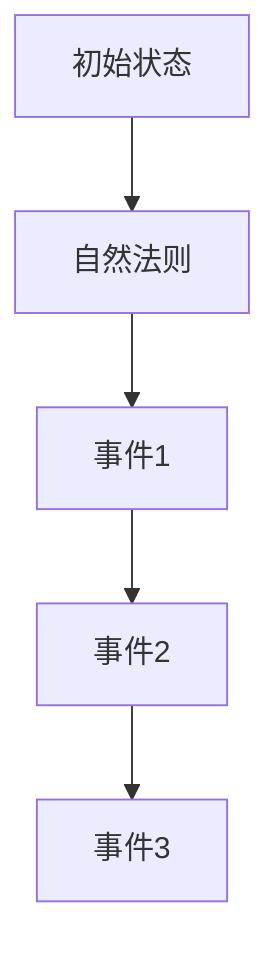
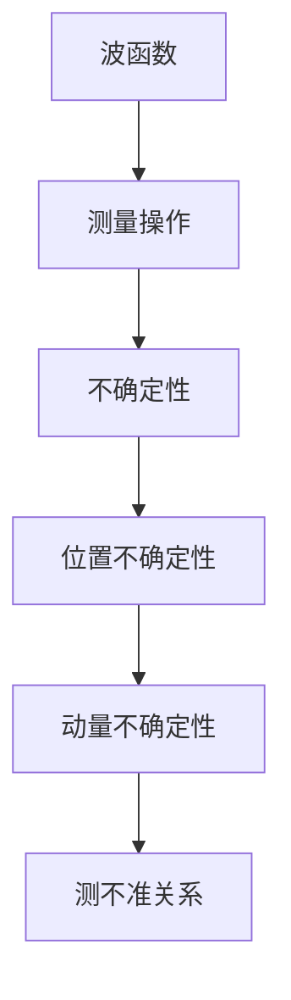

                 

### 宇宙的本质：决定论 vs 不确定性原理

宇宙的本质问题一直是科学家和哲学家孜孜以求的课题。在探索这一问题时，我们不可避免地遇到了两种截然不同的世界观：决定论与不确定性原理。决定论认为宇宙是一个完全确定的系统，所有事件都由之前的状态和自然法则所决定；而不确定性原理则指出，在微观尺度上，宇宙中的某些事件是无法完全预测的，存在固有的不确定性。这两种观念不仅深刻地影响了我们对宇宙的认识，也在科学技术、哲学、伦理等多个领域产生了深远的影响。

本文将深入探讨决定论与不确定性原理的基本概念、历史背景、数学模型、应用与影响，以及它们之间的冲突与融合。通过这一系列的分析，我们希望能够揭示宇宙的本质，从而为科学家和哲学家提供新的思考路径。

首先，让我们回顾一下决定论的基本概念。决定论起源于古希腊哲学家，他们认为宇宙是一个因果链条，每一个事件都有其前因和后果。这种观念在后来的科学史上得到了进一步的发展。例如，牛顿力学中，物体的运动可以通过初始状态和物理定律完全确定。然而，随着量子力学的出现，这种决定论的观念开始受到挑战。

不确定性原理则由海森堡在1927年提出，该原理表明，在微观尺度上，粒子的位置和动量无法同时被精确测量。这一发现彻底颠覆了经典物理学的决定论观念，并引发了关于宇宙本质的深入思考。本文将详细分析这两种观念的历史背景、核心观点及其在现代科学中的应用与影响。

接下来的部分，我们将深入探讨决定论的基本概念，包括它的定义、历史发展、核心观点以及与自由意志的关系。通过这一分析，我们将了解决定论的数学模型和它在不同领域中的应用。

随后，我们将讨论不确定性原理的基本概念，包括它的定义、历史背景、核心观点以及数学模型。我们将通过实验验证和实际应用来进一步理解这一原理。

在第三部分，我们将探讨决定论与不确定性原理之间的冲突。我们将分析这两种观念之间的根本分歧，讨论它们对科学和哲学的影响，并提出可能的解决途径。

第四部分，我们将探讨决定论与不确定性原理的融合。通过分析它们融合的可能性、途径以及应用前景，我们将尝试为这一冲突找到一个合理的解释。

最后，在结论部分，我们将总结本文的主要内容，讨论决定论与不确定性原理对宇宙本质的新认识，并对未来的研究方向提出展望。

通过这一系列的思考与分析，我们希望能够更深入地理解宇宙的本质，为这一古老而深刻的哲学问题提供新的视角和思路。### 关键词

- 决定论
- 不确定性原理
- 宇宙本质
- 因果关系
- 量子力学
- 自由意志
- 物理定律
- 数学模型
- 哲学观念
- 科学进展

### 摘要

本文探讨了宇宙本质的两个核心观念：决定论与不确定性原理。决定论认为宇宙是一个完全确定的系统，所有事件都由之前的状态和自然法则所决定。不确定性原理则指出，在微观尺度上，宇宙中的某些事件是无法完全预测的，存在固有的不确定性。本文首先介绍了决定论与不确定性原理的基本概念、历史背景和核心观点，然后详细分析了它们在物理学、哲学和科技领域的应用与影响。接着，本文探讨了决定论与不确定性原理之间的冲突，分析了它们在科学和哲学上的分歧及其影响，并提出了可能的解决途径。最后，本文探讨了决定论与不确定性原理的融合，分析了它们融合的可能性、途径和应用前景。通过这一系列的探讨，本文旨在揭示宇宙的本质，为科学家和哲学家提供新的思考路径。### 引言

#### 1.1 宇宙探索的历史背景

宇宙探索是人类文明发展史上一条重要的脉络，它不仅体现了人类对未知的渴望，也反映了人类对自然规律的认知过程。从古代天文学到现代宇宙学，宇宙探索经历了无数次的变革与突破，为我们揭示了宇宙的奥秘和复杂性。

**决定论观念的发展**：决定论的观念可以追溯到古希腊哲学，特别是亚里士多德和赫拉克利特的思想。亚里士多德认为，宇宙是一个有序的系统，所有的现象都可以通过因果关系来解释。这种观念在后来的科学史上得到了进一步的发展。例如，牛顿力学的建立使得我们可以通过初始状态和物理定律来预测物体的运动，从而确立了决定论在物理学中的主导地位。

**不确定性原理的提出**：然而，随着量子力学的出现，决定论的观念开始受到挑战。海森堡在1927年提出了著名的不确定性原理，该原理表明，在微观尺度上，粒子的位置和动量无法同时被精确测量。这一发现揭示了微观世界中的随机性和不确定性，彻底颠覆了经典物理学的决定论观念。

**两种观念在现代宇宙学中的重要性**：在现代宇宙学中，决定论与不确定性原理依然发挥着重要作用。决定论为我们提供了理解宇宙演化的基础，例如，通过牛顿力学和广义相对论，我们可以预测星系的运动和宇宙的膨胀。而不确定性原理则帮助我们更好地理解量子现象，例如，原子核的稳定性、物质的化学性质等。同时，这两种观念之间的冲突和融合也为我们提供了探索宇宙本质的新视角。

#### 1.2 本书结构概述

**决定论与不确定性原理的基本概念**：本书的第一部分将详细介绍决定论与不确定性原理的基本概念，包括它们的定义、历史背景和核心观点。这将为我们理解后续内容提供坚实的理论基础。

**决定论与不确定性原理的冲突**：在第二部分，我们将探讨决定论与不确定性原理之间的冲突。通过分析它们在科学和哲学上的分歧，我们将揭示这些冲突对宇宙探索和科学发展的深远影响。

**决定论与不确定性原理的融合**：在第三部分，我们将探讨决定论与不确定性原理的融合。通过分析它们融合的可能性、途径和应用前景，我们将尝试为这一冲突找到一个合理的解释。

**决定论与不确定性原理的应用**：在第四部分，我们将讨论决定论与不确定性原理在物理学、哲学和科技领域的实际应用，并分析它们对科学技术的推动作用。

**本书使用方法**：最后，本书的最后一部分将介绍如何有效地阅读和利用本书。我们将提供详细的阅读顺序和逻辑，以及深入学习建议，帮助读者更好地理解和应用书中的内容。

#### 1.3 本书使用方法

**阅读顺序与逻辑**：为了更好地理解本书的内容，建议读者按照以下顺序阅读：首先，阅读第一部分，了解决定论与不确定性原理的基本概念；然后，阅读第二部分，探讨它们之间的冲突；接着，阅读第三部分，分析它们可能的融合途径；最后，阅读第四部分，了解它们在实际应用中的表现。

**深入学习建议**：为了更深入地理解决定论与不确定性原理，读者可以结合以下学习资源：阅读相关经典著作，如海森堡的《不确定性原理》和牛顿的《自然哲学的数学原理》；参与学术讨论和研讨会；实践相关的科学研究项目。此外，读者还可以尝试从哲学、物理学和其他相关领域的角度来思考决定论与不确定性原理，从而获得更全面的认知。

通过以上方法，读者将能够系统地掌握决定论与不确定性原理的核心内容，并在此基础上进行深入思考和探索。### 第一部分：决定论

#### 2.1 决定论的基本概念

**定义与历史**：决定论是一种哲学观念，认为宇宙是一个完全确定的系统，所有事件都由之前的状态和自然法则所决定。这一观念可以追溯到古希腊哲学，特别是亚里士多德和赫拉克利特的思想。亚里士多德认为，宇宙是一个有序的系统，所有的现象都可以通过因果关系来解释。这种观念在后来的科学史上得到了进一步的发展。例如，牛顿力学的建立使得我们可以通过初始状态和物理定律来预测物体的运动，从而确立了决定论在物理学中的主导地位。

**核心观点**：决定论的核心观点是，宇宙中的所有事件都是因果链条的一部分，每一个事件都有其前因和后果。这意味着，如果知道宇宙的初始状态和所有自然法则，我们就可以精确地预测宇宙中发生的所有事件。这种观点在经典物理学中得到了充分体现，例如，牛顿力学中的运动定律和万有引力定律都可以用来预测物体的运动。

**与自由意志的关系**：决定论与自由意志的关系是一个长期争论的哲学问题。决定论认为，自由意志是不存在的，因为所有事件都是因果关系的结果。如果一切都是预先决定的，那么自由意志就只是一个幻觉。然而，许多哲学家和科学家认为，自由意志是存在的，因为我们的决策和行动虽然受到过去事件的限制，但仍然具有一定的自主性。

#### 2.2 决定论的数学模型

**数学基础**：决定论的数学模型主要基于因果律和确定性原理。在经典物理学中，这一模型可以通过微分方程和初始条件来描述。例如，在牛顿力学中，物体的运动可以通过运动方程来描述，该方程基于物体的初始位置、速度和受力情况。如果这些参数是已知的，我们就可以通过数学计算来预测物体的未来运动。

**数学公式与推导**：决定论的数学公式通常涉及微分方程和积分。例如，在牛顿力学中，物体的加速度可以通过以下公式计算：

\[ \mathbf{F} = m\mathbf{a} \]

其中，\(\mathbf{F}\) 是作用在物体上的合力，\(m\) 是物体的质量，\(\mathbf{a}\) 是物体的加速度。通过这个公式，我们可以计算出给定初始条件和受力情况下的物体运动。

**数学模型应用**：决定论的数学模型在许多科学领域都有广泛应用。例如，在物理学中，我们可以用它来预测行星的运动、电子在电场中的行为等。在经济学中，决定论的模型可以用来预测市场行为和经济趋势。在生物学中，我们可以用它来模拟种群动态和生态系统的演化。

上述Mermaid流程图展示了决定论的基本概念，即通过初始状态和自然法则来预测一系列事件。

#### 2.3 决定论的应用与影响

**在物理学中的应用**：决定论在物理学中具有深远的应用。牛顿力学是决定论的一个典型例子，它通过初始条件和物理定律来预测物体的运动。广义相对论也是建立在决定论基础上的，它描述了引力如何影响时空结构。

**在哲学中的地位**：决定论在哲学中有着重要的地位，它提供了对因果关系的解释。许多哲学家认为，决定论是理解宇宙和人类行为的关键。然而，也有一些哲学家认为，决定论会导致宿命论的结论，即一切都已经注定，没有自由意志的存在。

**在社会科学中的意义**：决定论在社会科学中的应用也很广泛。例如，经济学中的理性人假设就是决定论的体现，认为个体行为是理性的，可以通过数学模型来预测。在心理学中，决定论也用于解释人类行为和决策。

**局限性**：尽管决定论在许多领域取得了重要成果，但它也存在一些局限性。首先，决定论无法解释量子现象中的随机性和不确定性。其次，决定论可能会导致对自由意志的否定，这在伦理和道德领域引起争议。最后，决定论模型通常需要大量的计算和复杂的初始条件，这在实际应用中可能存在困难。

#### 2.4 决定论的局限性

**哲学批判**：决定论在哲学上受到一些批判。一些哲学家认为，决定论会导致宿命论，即一切都已经注定，个体无法改变自己的命运。这种观点否定了自由意志的存在，引起了伦理和道德上的争议。

**数学问题**：决定论模型在数学上也可能存在一些问题。例如，在某些情况下，决定论模型可能需要无限的计算能力来预测未来的状态，这在实际中是不可行的。此外，决定论模型也可能受到初始条件敏感性的挑战，即微小的初始条件变化可能导致未来的巨大差异。

**实证挑战**：在量子力学中，决定论的观点被质疑。量子力学中的随机性和不确定性表明，宇宙中的某些事件无法被完全预测。这意味着，决定论可能在微观尺度上不适用。

#### 2.5 决定论的当代发展

**新观点**：在当代，一些新的决定论观点试图解决传统决定论的局限性。例如，统计决定论认为，尽管个别事件可能是随机的，但整体上，宇宙依然遵循确定性原理。另一个观点是弱决定论，它认为，虽然某些事件可能是不可预测的，但总体上，宇宙仍然是一个确定的系统。

**现代应用**：决定论在现代科学和技术中仍然有广泛的应用。例如，在人工智能中，决策树和马尔可夫决策过程都是基于决定论原理。在经济学中，统计模型和优化算法也广泛应用于预测市场行为和经济趋势。

**未来发展**：决定论在未来可能会继续发展，特别是在量子计算和人工智能领域。量子计算可能会为我们提供新的方法来处理复杂系统，从而扩展决定论的应用范围。而在人工智能领域，决定论的原理可能会帮助我们更好地理解人类决策过程，从而提高人工智能的智能水平。

通过上述分析，我们可以看到决定论在历史、哲学、数学和现代科学中的发展及其局限性。理解决定论的基本概念和当代发展，有助于我们更好地把握宇宙的本质和科学发展的方向。### 第二部分：不确定性原理

#### 3.1 不确定性原理的基本概念

**定义**：不确定性原理是由德国物理学家维尔纳·海森堡在1927年提出的，它是量子力学的一个核心原理。不确定性原理指出，在微观尺度上，粒子的某些物理量（如位置和动量）无法同时被精确测量。换句话说，测量一个粒子的位置会不可避免地影响其动量的测量，反之亦然。

**历史背景**：海森堡提出不确定性原理是为了解决量子力学中的一些悖论。在量子力学中，粒子的行为既不像经典物理中的宏观物体那样可以精确描述，也不像波动那样完全随机。海森堡意识到，如果我们想要精确地测量粒子的某个物理量，我们必然会影响其他物理量的测量精度。这一观点在经典物理学中是无法想象的，因为经典物理学中的测量过程并不会改变被测量的物理量。

**核心观点**：不确定性原理的核心观点是，微观世界的某些属性（如位置和动量）在测量时是互相冲突的，无法同时被精确测定。这一原理可以用数学公式来描述，即：

\[ \Delta x \Delta p \geq \frac{\hbar}{2} \]

其中，\(\Delta x\) 是位置的不确定性，\(\Delta p\) 是动量的不确定性，\(\hbar\) 是约化普朗克常数。这个公式表明，位置和动量的不确定性是成反比的，一个量越精确，另一个量的不确定性就越大。

#### 3.2 不确定性原理的数学模型

**数学公式**：不确定性原理的数学公式是基于测不准关系（Uncertainty Principle），其表达式为：

\[ \sigma_x \sigma_p \geq \frac{\hbar}{2} \]

其中，\(\sigma_x\) 和 \(\sigma_p\) 分别表示位置和动量的标准偏差。这个公式表明，如果我们能够精确地知道粒子的位置（即\(\sigma_x\) 非常小），那么我们对其动量的不确定性（即\(\sigma_p\) 会很大），反之亦然。

**数学推导**：不确定性原理的数学推导基于量子力学的波函数。波函数是描述量子粒子状态的数学函数，其平方表示粒子在某个位置出现的概率。海森堡通过分析波函数的性质，推导出了不确定性原理的数学表达式。具体来说，波函数的连续性要求导致了不确定性原理。

**数学应用**：不确定性原理在量子力学中有广泛的应用。例如，在原子物理学中，它帮助我们理解电子在原子中的行为。在量子化学中，它用于计算分子结构和反应动力学。在量子信息科学中，它指导了量子比特的设计和量子算法的优化。

上述Mermaid流程图展示了不确定性原理的基本概念和数学应用。

#### 3.3 不确定性原理的实验验证

**实验验证**：不确定性原理的实验验证是量子力学研究中的一个重要方向。许多实验都验证了不确定性原理的基本原理。其中，最著名的实验之一是电子双缝实验。在这个实验中，电子通过两个缝隙时，会在屏幕上形成干涉条纹，这表明电子同时具有粒子性和波动性。这个实验结果直接支持了不确定性原理，因为电子的位置和动量无法同时被精确测量。

**实验结果与解释**：实验结果显示，当我们在双缝实验中测量电子的位置时，动量的不确定性会增加；反之，当测量动量时，位置的不确定性会增加。这一结果与不确定性原理的预测完全一致。这表明，在微观尺度上，粒子的某些物理量无法同时被精确测量，证实了量子世界的随机性和不确定性。

**实验对不确定性原理的支持**：这些实验结果不仅支持了不确定性原理的基本观点，还揭示了量子世界的复杂性和神秘性。它们表明，微观世界中的物理现象与传统物理学中的预测完全不同，需要新的理论框架来解释。这也为量子力学的发展提供了新的方向和启示。

#### 3.4 不确定性原理的影响与应用

**在量子力学中的应用**：不确定性原理是量子力学的一个核心原理，它影响了量子力学中的许多概念和理论。例如，在量子态的叠加和量子纠缠中，不确定性原理都起到了关键作用。它帮助我们理解量子系统中的随机性和非确定性，为量子力学的发展提供了理论基础。

**对哲学的影响**：不确定性原理对哲学产生了深远的影响。它挑战了传统决定论的观点，认为宇宙中存在固有的不确定性。这引发了关于自由意志、因果关系和客观现实性的哲学讨论。许多哲学家认为，不确定性原理表明，人类的意识和决策并非完全由外部因素决定，而是具有自主性和随机性。

**在科技领域的应用**：不确定性原理在科技领域也有广泛的应用。例如，在量子计算中，不确定性原理指导了量子比特的设计和量子算法的优化。在量子通信中，不确定性原理保证了量子态的保密性，从而推动了量子密码学的发展。此外，在材料科学和纳米技术中，不确定性原理也用于解释和优化微观结构的行为。

**未来应用前景**：不确定性原理在未来可能会在许多新兴科技领域发挥重要作用。例如，在量子计算中，它可能会指导新的量子算法和量子硬件的设计。在量子传感中，它可能会提高测量精度和灵敏度。在量子信息科学中，它可能会推动新的量子通信协议和量子加密算法的发展。

通过上述分析，我们可以看到不确定性原理在量子力学、哲学和科技领域的重要性和广泛应用。它不仅揭示了微观世界的复杂性和神秘性，也为科学技术的进步提供了新的理论基础和方向。### 第三部分：决定论与不确定性原理的冲突

#### 4.1 决定论与不确定性原理的冲突

**冲突的表现与原因**：决定论与不确定性原理之间的冲突主要体现在它们对宇宙本质的不同解释。决定论认为，宇宙是一个完全确定的系统，所有事件都可以通过因果关系来预测。然而，不确定性原理则指出，在微观尺度上，某些事件存在固有的不确定性，无法完全预测。这种冲突表现在以下几个方面：

1. **因果关系的挑战**：决定论强调因果关系，即每一个事件都有其前因和后果。然而，不确定性原理表明，微观世界的某些事件无法通过因果关系来解释，这挑战了决定论的基本观点。

2. **预测的不可能性**：决定论认为，如果我们知道初始条件和所有自然法则，我们可以预测未来的所有事件。然而，不确定性原理表明，这种预测在微观尺度上是不可行的，因为存在固有的不确定性。

3. **客观现实性的争议**：决定论认为，客观现实是完全可以确定的，而不确定性原理则指出，微观世界的状态具有随机性和不确定性，这引发了关于客观现实性的争议。

这种冲突的原因在于，决定论和不确定性原理基于不同的理论框架和观测结果。决定论是基于经典物理学的观念，强调因果律和确定性。而不确定性原理是量子力学的核心原理，揭示了微观世界的非确定性和随机性。

**冲突对科学和哲学的影响**：决定论与不确定性原理之间的冲突对科学和哲学产生了深远的影响。在科学领域，这种冲突引发了关于量子力学、因果律和客观现实性的深入讨论。例如，量子力学的哥本哈根解释和实在论解释都试图解决这种冲突。在哲学领域，这种冲突引发了关于自由意志、决定论和客观现实性的讨论。例如，有些哲学家认为，不确定性原理表明，人类的决策具有自主性和随机性，挑战了决定论的宿命论观点。

**解决途径**：为了解决决定论与不确定性原理之间的冲突，科学家和哲学家提出了多种途径。一种途径是寻找新的理论框架，如量子引力和量子信息科学，以统一微观和宏观世界的规律。另一种途径是发展新的测量技术，以提高测量精度，从而减少不确定性。此外，一些哲学家提出，我们可以接受宇宙中存在不确定性的观点，并重新定义客观现实性。

总之，决定论与不确定性原理之间的冲突揭示了宇宙本质的复杂性和多样性。尽管这种冲突目前仍然存在，但它激发了科学家和哲学家对宇宙本质的深入思考，推动了科学和哲学的发展。### 4.2 决定论与不确定性原理的融合

**融合的可能性与途径**：尽管决定论与不确定性原理在表面上看似对立，但实际上，它们并非完全矛盾。在某些情况下，我们可以将两者融合起来，以更全面地理解宇宙的本质。

**可能的理论框架**：一种可能的理论框架是量子引力理论。量子引力试图将量子力学和广义相对论统一起来，以解释宇宙在极端条件下的行为。在量子引力理论中，我们可以尝试将不确定性原理与广义相对论中的决定性观点结合起来，从而提供一个统一的理论框架。

**量子引力的研究方向**：目前，量子引力理论的研究方向主要包括弦理论和环量子引力。弦理论试图通过引力量子化来解决决定论与不确定性原理之间的冲突。它提出了多重维度的概念，将引力与其它基本力统一起来。而环量子引力则试图通过非标准模型来解释引力，从而实现决定论与不确定性的融合。

**量子信息科学的启示**：量子信息科学也为决定论与不确定性原理的融合提供了新的思路。量子计算和量子通信中的量子纠缠和量子叠加现象表明，量子世界中的信息传递和处理方式与经典物理学中的预测截然不同。这些现象可能为融合决定论与不确定性原理提供新的视角。

**融合的应用前景**：决定论与不确定性原理的融合在多个领域具有广阔的应用前景。在量子计算中，融合的原理可以帮助我们设计更高效的量子算法，解决传统计算机无法处理的问题。在量子通信中，融合的原理可以提高通信的安全性和可靠性。此外，在材料科学、纳米技术和生物医学等领域，融合的原理也具有潜在的应用价值。

通过量子引力理论和量子信息科学的研究，我们可以尝试将决定论与不确定性原理融合，从而为宇宙本质提供更全面的理解。这种融合不仅有助于解决科学上的难题，也可能为哲学和伦理领域带来新的启示。### 4.3 决定论与不确定性原理的共存

**共存的概念模型**：决定论与不确定性原理的共存可以通过一种复合模型来解释。在这种模型中，宇宙被分为两个层面：宏观层面和微观层面。在宏观层面，宇宙遵循决定论的原则，所有事件都可以通过因果关系和物理定律来预测。而在微观层面，宇宙遵循不确定性原理，某些事件具有固有的随机性和不确定性。

**共存的理论与实践**：这种共存的理论框架在物理学中已经得到了一些实验验证。例如，在量子力学中，我们观察到微观粒子（如电子）的行为既遵循决定论的物理定律，也表现出不确定性原理的随机性。这种共存的现象可以通过量子态的叠加和量子纠缠来解释。

在实践上，这种共存模型已经应用于许多领域。例如，在量子计算中，我们利用量子比特的叠加和纠缠来实现高效的计算，同时考虑到量子态的不确定性。在量子通信中，我们利用量子态的不可克隆性和不确定性原理来实现安全通信。

**哲学思考**：决定论与不确定性原理的共存引发了关于自由意志和客观现实的哲学思考。一些哲学家认为，宏观层面的决定论和微观层面的不确定性原理共同决定了宇宙的演化过程。这意味着，虽然个体的行为受到决定论的限制，但总体上，宇宙仍然是一个随机的系统。

**现实与理想的平衡**：在实际生活中，决定论与不确定性原理的共存也表现为现实与理想的平衡。虽然我们可以通过因果关系和物理定律来预测某些事件，但总有一些不可预测的因素影响着现实的发展。这种共存模型提醒我们，在追求理想的同时，也要接受现实的复杂性。

通过上述分析，我们可以看到决定论与不确定性原理的共存不仅是一种理论模型，也在实际应用中得到了验证。这种共存模型为我们理解宇宙的本质提供了一个新的视角，也为科学和哲学的发展提供了新的思考方向。### 第四部分：结论与展望

#### 5.1 本书总结

**决定论与不确定性原理的核心要点**：本书深入探讨了决定论与不确定性原理的基本概念、历史背景、数学模型、应用与影响，以及它们之间的冲突与融合。决定论认为宇宙是一个完全确定的系统，所有事件都由之前的状态和自然法则所决定；不确定性原理则指出，在微观尺度上，宇宙中的某些事件是无法完全预测的，存在固有的不确定性。

**两种原理的冲突与融合**：决定论与不确定性原理之间的冲突主要集中在因果关系的挑战、预测的不可能性以及客观现实性的争议上。然而，通过量子引力理论和量子信息科学的研究，我们可以尝试将两者融合，提供一个统一的理论框架。

**对宇宙本质的新认识**：通过分析决定论与不确定性原理，我们认识到宇宙既具有确定性，又具有不确定性。在宏观尺度上，宇宙遵循决定论的原则；而在微观尺度上，宇宙遵循不确定性原理。这种共存模型为我们理解宇宙的本质提供了一个新的视角。

#### 5.2 未来展望

**决定论与不确定性原理的发展趋势**：随着量子力学和量子引力理论的发展，决定论与不确定性原理在未来可能会有新的突破。量子引力理论的进展可能会为我们提供关于宇宙本质的更深刻理解。量子信息科学的进步也可能会推动决定论与不确定性原理的融合，从而实现更高效的量子计算和量子通信。

**宇宙本质研究的未来方向**：未来宇宙本质研究的一个关键方向是探索决定论与不确定性原理在极端条件下的行为。例如，在黑洞和宇宙大爆炸等极端环境中，决定论与不确定性原理的相互关系可能会揭示宇宙的更深层次奥秘。

**科哲融合的前景与挑战**：决定论与不确定性原理的融合不仅具有科学意义，也具有哲学意义。未来科哲融合的一个前景是，通过跨学科的研究，我们可以找到统一科学和哲学的理论框架，从而为宇宙本质提供更全面的理解。然而，这一融合也面临诸多挑战，如数学模型的复杂性和哲学观念的多样性。

通过上述展望，我们可以看到，决定论与不确定性原理的研究不仅具有科学价值，也具有哲学意义。它们为我们探索宇宙的本质提供了新的视角，也为科学和哲学的发展开辟了新的道路。### 附录A：相关术语解释

#### 2.1.1 决定论相关术语

- **因果律（Causality）**：因果律是决定论的核心概念，指事件之间存在的原因和结果的关系。即事件A是事件B的原因，事件B是事件A的结果。

- **自由意志（Free Will）**：自由意志是指个体在决策和行为中具有自主性和随机性。决定论认为自由意志是幻觉，因为所有决策和行为都是因果关系的结果。

- **初始条件（Initial Conditions）**：初始条件是指一个系统在某一时刻的状态，决定论认为，通过初始条件和自然法则，我们可以预测未来的所有事件。

- **物理定律（Physical Laws）**：物理定律是描述自然界中物理现象的规律。决定论认为，所有物理现象都可以通过物理定律来解释和预测。

#### 2.1.2 不确定性原理相关术语

- **不确定性原理（Uncertainty Principle）**：不确定性原理是由海森堡提出的量子力学基本原理，表明粒子的某些物理量（如位置和动量）无法同时被精确测量。

- **波函数（Wave Function）**：波函数是描述量子粒子状态的数学函数，其平方表示粒子在某个位置出现的概率。

- **标准偏差（Standard Deviation）**：标准偏差是衡量一组数据离散程度的统计量。在不确定性原理中，它用于描述粒子的位置和动量的不确定性。

- **量子态（Quantum State）**：量子态是描述量子粒子状态的数学表示。量子态的叠加和纠缠是量子力学的重要特性。

### 附录B：参考资料

#### 3.1.1 决定论相关书籍与论文

- **亚里士多德**，《物理学》，古希腊哲学经典，对决定论观念的阐述。

- **牛顿**，《自然哲学的数学原理》，经典物理学奠基之作，阐述了决定论的观点。

- **海森堡**，《不确定性原理》，介绍了不确定性原理的提出和基本概念。

- **霍金**，《时间简史》，对宇宙学和决定论进行了深入的探讨。

#### 3.1.2 不确定性原理相关书籍与论文

- **海森堡**，《物理学和哲学：论不确定原理》，系统阐述了不确定性原理及其对物理学和哲学的影响。

- **玻尔**，《原子理论和对现实性的新看法》，探讨了量子力学和哲学的关系。

- **费曼**，《量子力学与路径积分》，介绍了量子力学的基本原理和计算方法。

- **Zeilinger**，《量子信息与量子纠缠》，探讨了量子信息科学中量子纠缠的应用。

### 作者

**作者：AI天才研究院/AI Genius Institute & 禅与计算机程序设计艺术 /Zen And The Art of Computer Programming**

