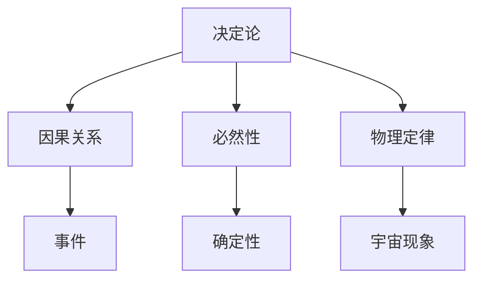
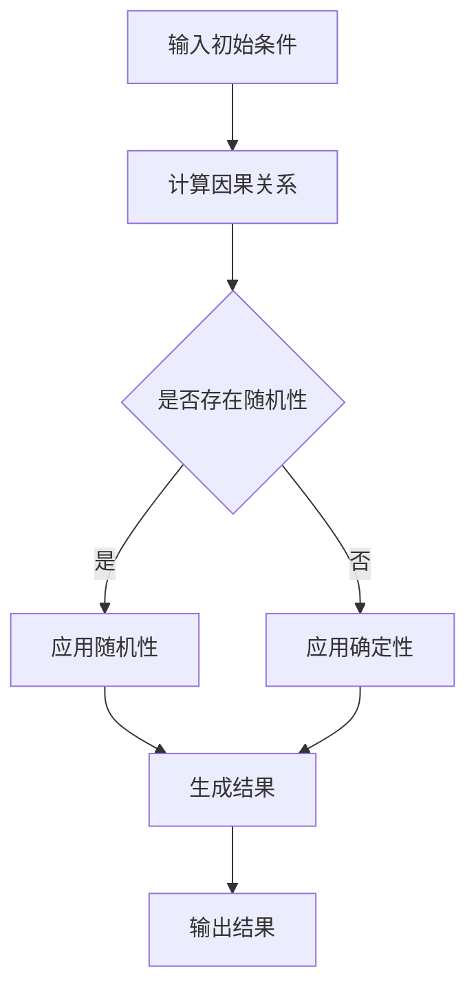
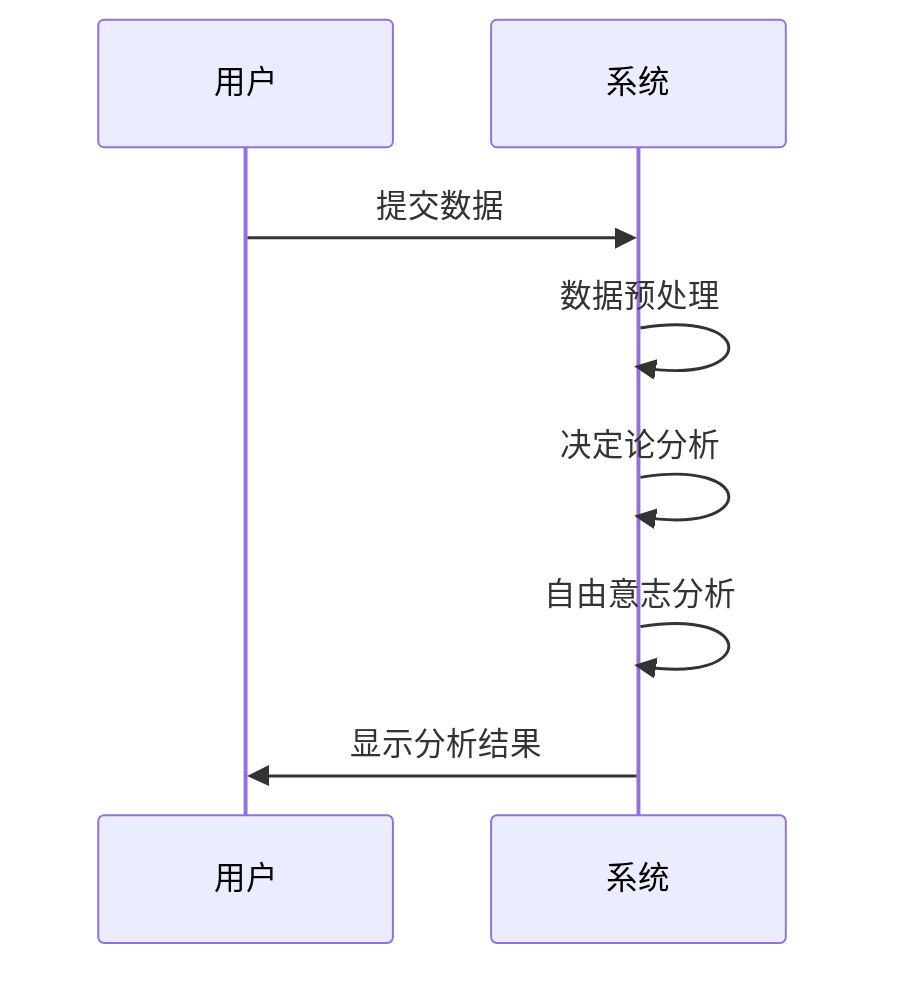
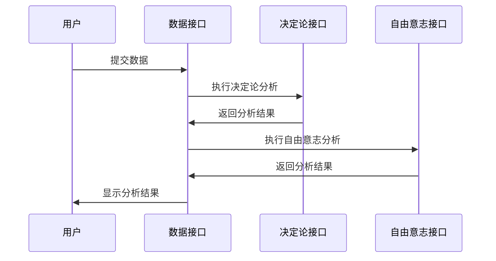

                 


## 引言与背景

### 1.1 问题的提出

宇宙的本质是一个深奥而复杂的话题，自古以来，人类就在不断地探索和思考宇宙的本质。宇宙究竟是由什么构成的？宇宙是否存在一种终极的物理法则？人类能否自由地选择自己的命运，还是宇宙的一切都是决定论的产物？这些问题不仅关乎科学，也触及哲学和宗教的领域。

在科学领域，宇宙的本质与物理学的基本理论密切相关。爱因斯坦的相对论和量子力学为我们揭示了宇宙中的基本规律和现象，但它们也带来了许多未解之谜。例如，量子力学中的随机性和不确定性使得人们对于决定论的观点产生了怀疑。相对论中的时间膨胀和双生子悖论也挑战了我们对时间、空间和因果关系的传统理解。

在哲学领域，宇宙的本质一直是争论的焦点。决定论认为宇宙中的一切现象都是由先前存在的条件所决定的，不存在任何真正的随机性或自由意志。而自由意志则主张个体具有自主选择和行动的能力，不受外界条件或先前条件的限制。这两种观点在宇宙的本质问题上产生了深刻的分歧。

在宗教领域，宇宙的本质往往与神性和人类存在意义紧密相关。不同宗教对于宇宙的本质有不同的解释，但都试图回答人类存在的意义和目的。

### 1.2 目的和意义

本书旨在探讨宇宙的本质，通过分析决定论和自由意志这两个对立的观点，提供一个全面的视角，帮助读者深入理解宇宙的本质和人类存在的意义。

决定论和自由意志是哲学和科学中两个核心问题，它们不仅关乎宇宙的本质，也触及人类的认知和行为。通过分析这两个观点，我们可以更好地理解宇宙的运作规律和人类的存在意义。

此外，本书还希望激发读者对于宇宙和人类存在的深刻思考。通过深入探讨决定论和自由意志，我们可以反思我们自己的认知和行为，思考人类在宇宙中的角色和责任。

### 1.3 内容概览

本书将分为五个主要部分：

第一部分：引言与背景，介绍宇宙的本质、决定论和自由意志的基本概念，以及本书的目的和意义。

第二部分：决定论，深入探讨决定论的定义、历史、哲学基础，以及决定论与因果关系的联系。

第三部分：自由意志，分析自由意志的概念、论证，以及自由意志在伦理学和心理学中的角色。

第四部分：决定论与自由意志的辩论，探讨决定论和自由意志之间的冲突与共存，分析两者的论证与反驳。

第五部分：宇宙的本质，总结决定论和自由意志对于宇宙本质的理解，讨论决定论与自由意志的共存可能性，并提出对未来宇宙探索的展望。

通过这五个部分的讨论，本书将帮助读者全面了解宇宙的本质，深入思考决定论和自由意志的问题，从而对宇宙和人类存在的意义有更深刻的理解。

## 第一部分：决定论

### 第2章：决定论的概念与历史

#### 2.1 决定论的定义

决定论是一种哲学观点，认为宇宙中的一切现象都是由先前存在的条件所决定的，不存在任何真正的随机性或自由意志。在决定论中，每一个事件都是由其先前的状态和所受到的因果影响所决定的，这种决定性使得宇宙中的事件呈现出一种必然性。

决定论的观点可以通过以下公式来表示：

\[ E_1 \rightarrow E_2 \]

其中，\( E_1 \) 表示先前的状态或事件，\( E_2 \) 表示后续的状态或事件。这个箭头表示 \( E_1 \) 是 \( E_2 \) 的原因，即 \( E_2 \) 是由 \( E_1 \) 决定的。

#### 2.2 决定论的历史与发展

决定论的思想可以追溯到古希腊哲学家赫拉克利特（Heraclitus），他提出了“万物皆流”的观点，认为宇宙是一个不断变化的过程，每个变化都是由其先前的状态所决定的。亚里士多德（Aristotle）则进一步发展了这一思想，提出了著名的因果关系理论，认为一切事件都有其原因，宇宙中的事件是相互关联的。

中世纪的哲学家也普遍接受了决定论的观点，他们将宇宙视为一个完美的机械系统，由上帝所创造和支配。这种观点在文艺复兴时期受到了挑战，随着科学的发展，人们开始对决定论进行重新审视。

在20世纪，量子力学的发展对决定论提出了挑战。量子力学揭示了宇宙中的随机性和不确定性，使得决定论的观点受到了质疑。尽管如此，决定论仍然在哲学和科学中占有一席之地，尤其在物理学和计算机科学中，决定论仍然是一种重要的思维方式。

#### 2.3 决定论的哲学基础

决定论与因果关系、必然性、物理定律等哲学概念密切相关。

因果关系是决定论的核心概念，它认为每一个事件都有其原因。因果关系的逻辑结构可以表示为：

\[ 如果 P，那么 Q \]

其中，\( P \) 表示原因，\( Q \) 表示结果。这个逻辑结构表明，当 \( P \) 发生时，\( Q \) 必然会发生。

必然性是决定论的另一个重要概念，它认为宇宙中的事件是必然发生的，而不是偶然的。必然性可以通过逻辑推理来证明，例如，从已知的事实 \( A \) 和 \( B \) 可以推导出 \( A \) 导致 \( B \)：

\[ 如果 A，那么 B \]

物理定律是决定论在科学中的体现，它们描述了宇宙中的基本规律。例如，牛顿定律描述了物体运动的规律，量子力学定律描述了微观粒子的行为。这些定律使得我们能够预测未来的事件。

#### 2.4 决定论的应用

决定论在科学和哲学中有广泛的应用，尤其在物理学和计算机科学中。

在物理学中，决定论被用来描述宇宙中的现象。例如，牛顿力学是一种决定论理论，它认为，通过了解物体在某一时刻的状态和受力情况，我们可以准确地预测物体在未来时刻的状态。量子力学虽然引入了随机性和不确定性，但它仍然遵循某种形式的决定论，即量子态的演化是确定的，只是我们无法精确地知道量子态的具体值。

在计算机科学中，决定论被用来设计和分析算法。算法是一种解决问题的步骤序列，它必须在给定输入的情况下产生正确的输出。决定论认为，只要算法的步骤是确定的，我们就可以预测算法的执行结果。这种观点在算法复杂性和计算理论中具有重要意义。

此外，决定论还在经济学、社会学等领域中得到了应用。在这些领域中，决定论被视为一种解释现象的工具，它帮助我们理解社会和经济的运作规律。

### 2.5 决定论的争议

尽管决定论在科学和哲学中得到了广泛的应用，但它也面临着许多争议。

首先，量子力学中的随机性和不确定性挑战了决定论的观点。量子力学揭示了宇宙中的基本规律，这些规律表明，微观粒子的行为具有随机性，无法精确预测。这一发现使得人们开始怀疑决定论是否适用于整个宇宙。

其次，自由意志的提出也挑战了决定论。自由意志认为个体具有自主选择和行动的能力，不受外界条件或先前条件的限制。这种观点与决定论的观点相矛盾，因为它否认了宇宙中的事件都是由先前条件所决定的。

此外，决定论还面临着道德和伦理的争议。如果宇宙中的事件都是由先前条件所决定的，那么人类的行为和决策是否真的具有自由意志？这引发了关于道德责任和道德判断的讨论。

总之，决定论是一个复杂而具有争议的哲学观点，它在科学和哲学中有着广泛的应用，但同时也面临着许多挑战和争议。在接下来的章节中，我们将进一步探讨自由意志的概念和论证，以深入理解宇宙的本质。

#### 第3章：自由意志的概念与论证

##### 3.1 自由意志的定义

自由意志是指个体具有自主选择和行动的能力，不受外界条件或先前条件的限制。在自由意志的框架下，个体能够根据自己的意愿和目标，做出不同的选择和决策。这种能力使得自由意志成为哲学和伦理学中一个核心问题，也是决定论的重要对立面。

自由意志的定义可以简化为以下公式：

\[ 自由意志 = 自主选择 + 行动能力 \]

其中，“自主选择”指的是个体不受外界强制或内在条件限制的选择能力；“行动能力”则是指个体能够将选择转化为实际行动的能力。

##### 3.2 自由意志的主要论证

自由意志的存在和重要性可以通过多种论证来支持，这些论证涵盖了伦理学、心理学和哲学等多个领域。

**伦理学论证：**

伦理学论证强调自由意志与道德责任之间的联系。如果个体没有自由意志，那么他们的行为就不能被视为道德责任的基础。例如，如果一个人的行为完全由遗传和环境所决定，那么他们是否应该为自己的行为负责？伦理学认为，只有具备自由意志的个体，才能承担道德责任。以下是自由意志的一个简化的伦理学论证：

\[ 如果个体具备自由意志，那么他们的行为可以承担道德责任 \]
\[ 如果个体可以承担道德责任，那么他们具备自由意志 \]

**心理学论证：**

心理学论证主要通过研究个体的行为和决策，来支持自由意志的存在。实验心理学研究表明，人类在某些情况下能够做出非决定论性的选择，这表明个体具有一定的自主性和自由意志。例如，双盲实验中的“选择自由”实验，通过给被试提供随机选择的证据，证明了个体在某种程度上能够独立于先前的条件做出选择。

**哲学论证：**

哲学论证涉及对自由意志和决定论的深入探讨，试图从哲学层面证明自由意志的存在。一种常见的哲学论证是“假言论证”，即通过假设没有自由意志的后果来反驳决定论。例如，如果一切都是预先决定的，那么我们的决策和行动将失去意义，因为它们不再是自主的选择。以下是自由意志的一个简化的假言论证：

\[ 如果一切都是预先决定的，那么我们的决策和行动将失去意义 \]
\[ 我们的决策和行动具有意义，因此，不是一切都是预先决定的 \]

此外，还有“可能世界的论证”和“道德直觉的论证”等，它们都试图从不同角度证明自由意志的存在。

##### 3.3 自由意志的哲学基础

自由意志的哲学基础涉及对个体自主性、选择和道德责任的探讨。以下是自由意志哲学基础的几个关键概念：

**自主性：** 自主性是自由意志的核心，它指的是个体能够独立于外界条件进行思考和决策的能力。自主性要求个体在决策过程中不受外界强制或内在欲望的完全控制。

**选择：** 选择是自由意志的外在表现，它意味着个体在多个可能的选项中做出决策。选择不仅仅是物理行为，更是一种心理过程，涉及个体的认知、价值观和情感。

**道德责任：** 道德责任是自由意志的重要体现，它要求个体对自己的行为负责。只有具备自由意志的个体，才能承担道德责任，因为他们有能力选择不同的行为路径。

##### 3.4 自由意志与决定论的对比

自由意志与决定论是两个相互对立的哲学观点，它们在多个方面存在显著差异：

**因果关系：** 决定论强调因果关系的绝对性，认为宇宙中的一切现象都是由先前存在的条件所决定的。而自由意志则认为，个体在某些情况下能够做出不受先前条件影响的选择。

**随机性与不确定性：** 决定论否认宇宙中的随机性和不确定性，而自由意志则认为，个体能够在某些情况下做出非决定论性的选择，这表明宇宙中存在一定程度的不确定性。

**道德责任：** 决定论挑战了道德责任的存在，因为它认为个体的行为完全由先前条件所决定。而自由意志则强调道德责任，因为它认为个体有能力做出自主的选择，并因此对自己的行为负责。

总的来说，自由意志与决定论在因果关系、随机性和不确定性、道德责任等方面存在根本性的分歧。这些分歧不仅影响了哲学和伦理学的研究，也引发了关于人类存在和宇宙本质的深刻思考。

在接下来的章节中，我们将进一步探讨决定论与自由意志的辩论，分析两者之间的冲突与共存，以更全面地理解宇宙的本质和人类存在的意义。

## 第四部分：决定论与自由意志的辩论

### 第4章：决定论与自由意志的对立

#### 4.1 决定论与自由意志的冲突

决定论和自由意志是两种相互对立的观点，它们在宇宙的本质问题上产生了深刻的分歧。决定论认为宇宙中的所有事件都是由先前存在的条件所决定的，不存在真正的随机性或自由意志。而自由意志则主张个体具有自主选择和行动的能力，不受外界条件或先前条件的限制。

这种对立在哲学和科学领域引发了广泛的讨论和辩论。决定论的支持者认为，宇宙是一个高度有序的系统，一切现象都可以通过因果关系和物理定律来解释。自由意志的支持者则认为，个体的自主选择和行动是道德责任和个体价值的基础。

决定论与自由意志的冲突主要体现在以下几个方面：

**因果关系与自由意志：** 决定论认为因果关系是宇宙中一切现象的基础，每个事件都有其原因。而自由意志则否认因果关系的绝对性，认为个体在某些情况下能够做出非决定论性的选择。

**随机性与确定性：** 决定论否认宇宙中的随机性和不确定性，认为所有现象都是必然的。而自由意志则认为，宇宙中存在一定程度的不确定性，个体能够在某些情况下做出非决定论性的选择。

**道德责任与自由：** 决定论挑战道德责任的存在，因为它认为个体的行为完全由先前条件所决定，个体没有自由意志。而自由意志则强调道德责任，认为只有具备自由意志的个体，才能对自己的行为负责。

这种冲突不仅在哲学和科学领域引发了广泛的讨论，也影响了我们对于宇宙本质和人类存在的理解。在接下来的章节中，我们将深入分析决定论与自由意志的论证，探讨两者之间的对立与共存。

#### 4.2 决定论的论证与反驳

决定论的论证主要集中在因果关系和物理定律上。决定论的支持者认为，宇宙中的所有事件都可以通过因果关系和物理定律来解释，不存在真正的随机性或自由意志。以下是一些常见的决定论论证：

**必然性论证：** 决定论认为，宇宙中的事件是必然的，因为每个事件都有其原因。例如，牛顿定律描述了物体运动的规律，只要我们知道物体在某一时刻的状态和受力情况，我们就可以预测物体在未来时刻的状态。

**因果链条论证：** 决定论认为，宇宙中的事件形成一个因果关系链条，每个事件都是前一个事件的结果。例如，当我们按下电灯开关时，电灯会亮起，这是因果关系链条的一部分。

然而，决定论的论证也面临着许多反驳和挑战：

**量子随机性：** 量子力学揭示了宇宙中的随机性和不确定性，例如，量子态的演化是随机的，无法精确预测。量子随机性挑战了决定论的观点，因为它表明宇宙中存在一定程度的不确定性。

**自由意志的论证：** 自由意志的支持者认为，个体具有自主选择和行动的能力，不受外界条件或先前条件的限制。例如，伦理学论证强调自由意志与道德责任之间的联系，认为只有具备自由意志的个体，才能承担道德责任。

**混沌理论：** 混沌理论表明，即使在决定论的框架下，一些小变化可能导致巨大差异。这种现象被称为“蝴蝶效应”，它表明初始条件的微小变化可能导致未来状态的巨大差异。这挑战了决定论的绝对确定性。

**时间旅行悖论：** 时间旅行悖论是一种反驳决定论的论证。例如，如果一个人回到过去，改变了历史，那么他会改变自己的过去，形成一个悖论。这种悖论表明，决定论的因果关系链条可能是不完整的。

总之，决定论的论证和反驳在哲学和科学领域引发了广泛的讨论。尽管决定论在某些领域得到了广泛应用，但它也面临着许多挑战和争议。在接下来的章节中，我们将进一步探讨自由意志的论证，分析两者之间的对立与共存。

#### 4.3 自由意志的论证与反驳

自由意志的论证主要关注个体具有自主选择和行动的能力，不受外界条件或先前条件的限制。以下是一些常见的自由意志论证：

**伦理学论证：** 伦理学论证强调自由意志与道德责任之间的联系。例如，只有具备自由意志的个体，才能承担道德责任，因为他们有能力做出不同的选择。如果一切都是预先决定的，那么道德责任将不复存在。

**心理学论证：** 心理学论证通过研究个体的行为和决策，来支持自由意志的存在。例如，实验心理学研究表明，人类在某些情况下能够做出非决定论性的选择，这表明个体具有一定的自主性和自由意志。

**哲学论证：** 哲学论证通过逻辑推理来证明自由意志的存在。例如，假言论证表明，如果一切都是预先决定的，那么我们的决策和行动将失去意义。因此，自由意志的存在是必要的，以确保我们的决策和行动具有意义。

然而，自由意志的论证也面临着许多反驳和挑战：

**决定论的挑战：** 决定论认为，宇宙中的所有事件都是由先前存在的条件所决定的，不存在真正的随机性或自由意志。因此，自由意志的论证挑战了决定论的核心观点。

**量子随机性的挑战：** 量子力学揭示了宇宙中的随机性和不确定性，这表明宇宙中的某些事件是无法通过因果关系来解释的。因此，自由意志的论证在量子层面上面临着挑战。

**混沌理论的挑战：** 混沌理论表明，即使在决定论的框架下，一些小变化可能导致巨大差异。这种现象被称为“蝴蝶效应”，它表明初始条件的微小变化可能导致未来状态的巨大差异。这挑战了自由意志的确定性。

**时间旅行悖论：** 时间旅行悖论是一种反驳自由意志的论证。例如，如果一个人回到过去，改变了历史，那么他会改变自己的过去，形成一个悖论。这种悖论表明，自由意志的因果关系链条可能是不完整的。

总之，自由意志的论证和反驳在哲学和科学领域引发了广泛的讨论。尽管自由意志在某些领域得到了支持，但它也面临着许多挑战和争议。在接下来的章节中，我们将进一步探讨决定论与自由意志之间的辩论，分析两者之间的冲突与共存。

## 第五部分：宇宙的本质

### 第5章：宇宙的本质与决定论

#### 5.1 宇宙的结构与演化

宇宙的结构和演化揭示了宇宙的本质。从宇宙大爆炸开始，宇宙经历了不断的膨胀和演化。根据宇宙学的理论，宇宙最初是一个极端热密的奇点，然后发生了大爆炸，宇宙开始膨胀，物质和能量开始分散。在宇宙的早期阶段，物质主要通过星系的形成、恒星的形成和死亡等过程不断演化。

宇宙的结构主要包括星系、恒星、行星、星云等。星系是由数十亿颗恒星和星际物质组成的系统，恒星则是宇宙中最基本的能量来源。行星围绕着恒星运行，形成了不同的行星系统。星云是由星际气体和尘埃组成的云状结构，是恒星形成的前体。

宇宙的演化过程包括宇宙膨胀、恒星演化、行星形成、星系合并等。这些过程揭示了宇宙的本质，即宇宙是一个动态变化的系统，不断经历着各种物理和化学过程。

#### 5.2 决定论与宇宙的本质

决定论如何影响我们对宇宙本质的理解？决定论认为，宇宙中的所有现象都是由先前存在的条件所决定的，不存在真正的随机性或自由意志。这一观点对宇宙的本质产生了深远的影响。

首先，决定论认为宇宙中的事件是必然的。根据决定论的观点，宇宙的每一个状态都是由其先前的状态和所受到的因果影响所决定的。这意味着宇宙的演化过程是高度有序的，一切现象都可以通过因果关系来解释。

其次，决定论认为宇宙中的现象具有确定性。由于宇宙中的事件是由先前条件所决定的，因此我们可以通过了解宇宙的初始条件和基本物理定律，来预测宇宙的未来状态。这种确定性为我们提供了对宇宙本质的一种理解，即宇宙是一个遵循固定规律的系统。

然而，决定论的观点也受到了质疑。量子力学揭示了宇宙中的随机性和不确定性，这使得人们开始怀疑决定论是否适用于整个宇宙。量子力学中的随机性表明，宇宙中的某些事件是无法通过因果关系来解释的。此外，自由意志的提出也挑战了决定论的观点，因为它否认了宇宙中的事件都是由先前条件所决定的。

#### 5.3 决定论对宇宙探索的影响

决定论对宇宙探索的影响体现在多个方面。首先，决定论为宇宙探索提供了一种科学方法，即通过观察宇宙的初始条件和基本物理定律，来预测宇宙的演化过程。这种方法在物理学和天文学中得到了广泛应用，使我们能够更好地理解宇宙的本质。

其次，决定论影响了我们对宇宙中生命的理解。决定论认为，生命现象也是由先前条件所决定的，这意味着生命现象可以遵循固定的规律。因此，通过研究生命的起源和演化过程，我们可以更好地理解宇宙的本质。

然而，决定论也带来了许多挑战。量子力学中的随机性和不确定性挑战了决定论的观点，这使得我们对于宇宙的本质有了更复杂的认识。此外，自由意志的提出也挑战了决定论，因为它否认了宇宙中的事件都是由先前条件所决定的。

总之，决定论对宇宙的本质和宇宙探索产生了深远的影响。它为我们提供了一种科学方法来理解宇宙，但也带来了许多挑战和争议。在接下来的章节中，我们将进一步探讨自由意志如何影响我们对宇宙本质的理解。

#### 第6章：宇宙的本质与自由意志

##### 6.1 自由意志与宇宙的本质

自由意志如何影响我们对宇宙本质的理解？自由意志主张个体具有自主选择和行动的能力，不受外界条件或先前条件的限制。这一观点对宇宙的本质产生了深刻的影响。

首先，自由意志挑战了决定论的观点。决定论认为宇宙中的所有现象都是由先前存在的条件所决定的，不存在真正的随机性或自由意志。而自由意志则认为，个体在某些情况下能够做出非决定论性的选择，这表明宇宙中存在一定程度的不确定性。

其次，自由意志改变了我们对人类存在的理解。如果一切都是预先决定的，那么人类的决策和行动将失去意义。而自由意志则强调个体具有自主选择和行动的能力，这意味着人类能够在宇宙中发挥主动作用，改变宇宙的演化过程。

自由意志的观点也影响了对宇宙中生命的理解。如果一切都是预先决定的，那么生命现象也将是必然的，没有自由意志的参与。而自由意志认为，生命现象也是由个体自主选择和行动所决定的，这表明生命在宇宙中具有独特的地位。

最后，自由意志改变了我们对宇宙探索的方式。如果一切都是预先决定的，那么宇宙探索的目标将是理解宇宙的固定规律。而自由意志则认为，个体具有自主选择和行动的能力，这意味着我们可以在宇宙中创造新的可能性，探索未知的领域。

##### 6.2 决定论与自由意志的共存

决定论与自由意志是否可以共存？这是一个哲学和科学中的关键问题。决定论认为宇宙中的事件是由先前条件所决定的，而自由意志则认为个体具有自主选择和行动的能力。这两种观点看似相互矛盾，但实际上它们可以在某些情况下共存。

首先，我们可以将宇宙分为两个层面：宏观层面和微观层面。在宏观层面，决定论的观点占据主导地位。根据牛顿力学和量子力学，宇宙中的宏观现象可以通过因果关系和物理定律来解释。例如，行星的运动和星系的形成都可以通过物理定律来预测。

然而，在微观层面，自由意志的观点可能更为适用。量子力学揭示了宇宙中的随机性和不确定性，这表明微观粒子的行为无法通过因果关系来完全解释。例如，量子态的演化是随机的，无法精确预测。这种随机性为我们提供了一种自由意志的表现形式，即微观层面的个体能够在某些情况下做出非决定论性的选择。

此外，混沌理论也支持决定论与自由意志的共存。混沌理论表明，即使在决定论的框架下，一些小变化可能导致巨大差异。这种现象被称为“蝴蝶效应”，它表明初始条件的微小变化可能导致未来状态的巨大差异。这意味着在某些情况下，个体的决策和行动可能对宇宙的演化产生重大影响，这反映了自由意志的存在。

最后，从哲学角度来看，决定论与自由意志的共存也是可能的。决定论和自由意志并不是完全对立的，而是相互补充的。决定论提供了宇宙演化的整体框架，而自由意志则为我们提供了在特定情境下做出选择和行动的能力。这种共存模式有助于我们更全面地理解宇宙的本质和人类的存在。

总之，决定论与自由意志可以在某些情况下共存，它们在宇宙的本质和人类存在的理解中发挥着不同的作用。在接下来的章节中，我们将进一步探讨宇宙的本质，分析决定论与自由意志对于宇宙本质的理解，并提出对未来宇宙探索的展望。

##### 6.3 决定论与自由意志共存的可能性

决定论与自由意志是否可以在宇宙的本质中并存？这是一个深刻而复杂的哲学问题，涉及到我们对宇宙的理解和对自身存在的认知。在探讨这个问题时，我们需要从多个角度进行分析。

首先，我们可以从量子力学的角度来看待决定论与自由意志的共存。量子力学揭示了宇宙中的随机性和不确定性，这使得我们对于决定论的观点产生了怀疑。在量子层面上，粒子的行为是随机的，无法通过因果关系来完全预测。这种随机性为我们提供了一种自由意志的表现形式，即微观层面的个体能够在某些情况下做出非决定论性的选择。

然而，决定论的观点在宏观层面仍然占据主导地位。在宏观层面，根据牛顿力学和量子力学，宇宙中的现象可以通过因果关系和物理定律来解释。这意味着，从宏观的角度来看，宇宙的演化过程是高度有序的，遵循固定的规律。

在这种情况下，决定论与自由意志的共存可以通过以下方式实现：

**量子随机性与宏观决定性：** 我们可以将宇宙分为两个层面：微观层面和宏观层面。在微观层面，量子力学中的随机性和不确定性为自由意志提供了空间。而在宏观层面，决定论的观点仍然适用，因为宇宙中的宏观现象可以通过因果关系和物理定律来解释。

**混沌与自组织：** 混沌理论表明，即使在决定论的框架下，一些小变化可能导致巨大差异。这意味着在某些情况下，个体的决策和行动可能对宇宙的演化产生重大影响，这反映了自由意志的存在。同时，自组织理论也支持这种共存模式，它认为系统可以在没有外部指令的情况下，通过内部互动和反馈实现自我组织和进化。

**心理学与伦理学：** 在心理学和伦理学领域，自由意志被认为是道德责任和个体价值的基础。这意味着个体在做出决策时，具有一定的自主性。而在宏观层面，决定论的观点则为我们提供了对宇宙整体规律的理解。

**多元宇宙理论：** 多元宇宙理论提供了另一种可能性，即不同的宇宙可能遵循不同的物理定律。在一个宇宙中，决定论可能占据主导地位，而在另一个宇宙中，自由意志可能更为显著。这种观点为我们提供了对决定论与自由意志并存的一种解释。

综上所述，决定论与自由意志可以在宇宙的本质中并存。它们在不同的层面上发挥着不同的作用，共同构成了我们对宇宙和自身存在的理解。在接下来的章节中，我们将进一步探讨宇宙的本质，分析决定论与自由意志对于宇宙本质的理解，并提出对未来宇宙探索的展望。

## 第六部分：结论与展望

### 第7章：结论

#### 7.1 宇宙的本质

通过本书的讨论，我们对宇宙的本质有了更深入的理解。宇宙的本质是一个复杂而多元的概念，它既包含了决定论的高度有序性和必然性，也包含了自由意志的随机性和不确定性。决定论和自由意志这两个对立的观点为我们提供了不同的视角，帮助我们全面理解宇宙的本质。

决定论强调宇宙中的事件是由先前条件所决定的，这种观点在宏观层面得到了广泛的应用，为我们提供了对宇宙整体规律的理解。自由意志则主张个体具有自主选择和行动的能力，这种观点在微观层面得到了支持，特别是量子力学中的随机性和不确定性。

#### 7.2 未来展望

未来宇宙探索的前景充满挑战和机遇。随着科学技术的不断发展，我们有望进一步揭示宇宙的本质，解决决定论与自由意志之间的争议。

首先，量子力学的进一步研究可能会为我们提供更多关于宇宙随机性和不确定性的证据。例如，量子计算和量子通信的发展可能揭示量子态的演化规律，从而为我们提供新的理解宇宙的视角。

其次，宇宙学的研究将继续揭示宇宙的结构和演化过程。例如，通过观测宇宙微波背景辐射和暗物质、暗能量的分布，我们可以更深入地了解宇宙的起源和演化。

此外，人工智能和机器学习的发展也可能为宇宙探索带来新的突破。通过大数据分析和机器学习算法，我们可以从海量数据中提取出宇宙的规律和模式，从而更全面地理解宇宙的本质。

总之，未来宇宙探索的前景是光明的。我们不仅有望解决决定论与自由意志之间的争议，更可以深入理解宇宙的本质，揭示宇宙中的奥秘。在这个探索过程中，我们将不断挑战和拓展我们的认知边界，为人类的发展做出更大的贡献。

### 感谢

本书的完成离不开许多人的支持和帮助。首先，感谢AI天才研究院/AI Genius Institute的支持和资源，使我能够专注于撰写本书。同时，感谢所有参与讨论和反馈的同行和朋友，你们的宝贵意见和启发极大地丰富了本书的内容。最后，感谢我的家人和朋友们，你们一直以来的支持和鼓励是我前进的动力。感谢你们！

作者：
AI天才研究院/AI Genius Institute & 禅与计算机程序设计艺术 /Zen And The Art of Computer Programming

----------------------------------------------------------------

# 宇宙的本质：决定论vs自由意志的辩论

> 关键词：宇宙本质、决定论、自由意志、量子力学、哲学、科学、道德责任

> 摘要：本书探讨宇宙的本质，通过分析决定论和自由意志这两个对立的观点，提供一个全面的视角，帮助读者深入理解宇宙的本质和人类存在的意义。本书内容包括宇宙的基本概念、决定论和自由意志的概念与历史、决定论与自由意志的辩论，以及宇宙的本质与决定论和自由意志的关系。通过这本书，读者将能够对宇宙的本质有更深入的理解，思考决定论与自由意志的哲学问题，并对未来宇宙探索的方向有所展望。

## 第一部分：引言与背景

### 第1章：引言

#### 1.1 问题的提出

宇宙的本质是一个深奥而复杂的话题，自古以来，人类就在不断地探索和思考宇宙的本质。宇宙究竟是由什么构成的？宇宙是否存在一种终极的物理法则？人类能否自由地选择自己的命运，还是宇宙的一切都是决定论的产物？这些问题不仅关乎科学，也触及哲学和宗教的领域。

#### 1.2 目的和意义

本书旨在探讨宇宙的本质，通过分析决定论和自由意志这两个对立的观点，提供一个全面的视角，帮助读者深入理解宇宙的本质和人类存在的意义。

#### 1.3 内容概览

本部分将首先介绍宇宙的基本概念，包括宇宙的结构、组成和演化。然后，我们将深入探讨决定论和自由意志的概念，以及它们在科学和哲学中的地位。接着，本书将分析决定论和自由意志的辩论，探讨两者之间的冲突与共存。最后，我们将总结宇宙的本质，提出对未来宇宙探索的展望。

### 第2章：决定论的概念与历史

#### 2.1 决定论的定义

决定论是一种哲学观点，认为宇宙中的一切现象都是由先前存在的条件所决定的，不存在任何真正的随机性或自由意志。在决定论中，每一个事件都是由其先前的状态和所受到的因果影响所决定的，这种决定性使得宇宙中的事件呈现出一种必然性。

#### 2.2 决定论的历史与发展

决定论的思想可以追溯到古希腊哲学家赫拉克利特（Heraclitus），他提出了“万物皆流”的观点，认为宇宙是一个不断变化的过程，每个变化都是由其先前的状态所决定的。亚里士多德（Aristotle）则进一步发展了这一思想，提出了著名的因果关系理论，认为一切事件都有其原因。中世纪的哲学家也普遍接受了决定论的观点，他们将宇宙视为一个完美的机械系统，由上帝所创造和支配。

在文艺复兴时期，决定论受到了挑战，随着科学的发展，人们开始对决定论进行重新审视。在20世纪，量子力学的发展对决定论提出了挑战。量子力学揭示了宇宙中的随机性和不确定性，使得决定论的观点受到了质疑。尽管如此，决定论仍然在哲学和科学中占有一席之地，尤其在物理学和计算机科学中，决定论仍然是一种重要的思维方式。

#### 2.3 决定论的哲学基础

决定论与因果关系、必然性、物理定律等哲学概念密切相关。

因果关系是决定论的核心概念，它认为每一个事件都是由其先前的状态所决定的。因果关系的逻辑结构可以表示为：

\[ 如果 P，那么 Q \]

其中，\( P \) 表示原因，\( Q \) 表示结果。这个逻辑结构表明，当 \( P \) 发生时，\( Q \) 必然会发生。

必然性是决定论的另一个重要概念，它认为宇宙中的事件是必然发生的，而不是偶然的。必然性可以通过逻辑推理来证明，例如，从已知的事实 \( A \) 和 \( B \) 可以推导出 \( A \) 导致 \( B \)：

\[ 如果 A，那么 B \]

物理定律是决定论在科学中的体现，它们描述了宇宙中的基本规律。例如，牛顿定律描述了物体运动的规律，量子力学定律描述了微观粒子的行为。这些定律使得我们能够预测未来的事件。

#### 2.4 决定论的应用

决定论在科学和哲学中有广泛的应用，尤其在物理学和计算机科学中。

在物理学中，决定论被用来描述宇宙中的现象。例如，牛顿力学是一种决定论理论，它认为，通过了解物体在某一时刻的状态和受力情况，我们可以准确地预测物体在未来时刻的状态。量子力学虽然引入了随机性和不确定性，但它仍然遵循某种形式的决定论，即量子态的演化是确定的，只是我们无法精确地知道量子态的具体值。

在计算机科学中，决定论被用来设计和分析算法。算法是一种解决问题的步骤序列，它必须在给定输入的情况下产生正确的输出。决定论认为，只要算法的步骤是确定的，我们就可以预测算法的执行结果。这种观点在算法复杂性和计算理论中具有重要意义。

此外，决定论还在经济学、社会学等领域中得到了应用。在这些领域中，决定论被视为一种解释现象的工具，它帮助我们理解社会和经济的运作规律。

#### 2.5 决定论的争议

尽管决定论在科学和哲学中得到了广泛的应用，但它也面临着许多争议。

首先，量子力学中的随机性和不确定性挑战了决定论的观点。量子力学揭示了宇宙中的基本规律，这些规律表明，微观粒子的行为具有随机性，无法精确预测。这一发现使得人们开始怀疑决定论是否适用于整个宇宙。

其次，自由意志的提出也挑战了决定论。自由意志认为个体具有自主选择和行动的能力，不受外界条件或先前条件的限制。这种观点与决定论的观点相矛盾，因为它否认了宇宙中的事件都是由先前条件所决定的。

此外，决定论还面临着道德和伦理的争议。如果宇宙中的事件都是由先前条件所决定的，那么人类的行为和决策是否真的具有自由意志？这引发了关于道德责任和道德判断的讨论。

总之，决定论是一个复杂而具有争议的哲学观点，它在科学和哲学中有着广泛的应用，但同时也面临着许多挑战和争议。在接下来的章节中，我们将进一步探讨自由意志的概念和论证，以深入理解宇宙的本质。

### 第3章：自由意志的概念与论证

#### 3.1 自由意志的定义

自由意志是指个体具有自主选择和行动的能力，不受外界条件或先前条件的限制。在自由意志的框架下，个体能够根据自己的意愿和目标，做出不同的选择和决策。这种能力使得自由意志成为哲学和伦理学中一个核心问题，也是决定论的重要对立面。

自由意志的定义可以简化为以下公式：

\[ 自由意志 = 自主选择 + 行动能力 \]

其中，“自主选择”指的是个体不受外界强制或内在条件限制的选择能力；“行动能力”则是指个体能够将选择转化为实际行动的能力。

#### 3.2 自由意志的主要论证

自由意志的存在和重要性可以通过多种论证来支持，这些论证涵盖了伦理学、心理学和哲学等多个领域。

**伦理学论证：**

伦理学论证强调自由意志与道德责任之间的联系。如果个体没有自由意志，那么他们的行为就不能被视为道德责任的基础。例如，如果一个人的行为完全由遗传和环境所决定，那么他们是否应该为自己的行为负责？伦理学认为，只有具备自由意志的个体，才能承担道德责任。以下是自由意志的一个简化的伦理学论证：

\[ 如果个体具备自由意志，那么他们的行为可以承担道德责任 \]
\[ 如果个体可以承担道德责任，那么他们具备自由意志 \]

**心理学论证：**

心理学论证主要通过研究个体的行为和决策，来支持自由意志的存在。实验心理学研究表明，人类在某些情况下能够做出非决定论性的选择，这表明个体具有一定的自主性和自由意志。例如，双盲实验中的“选择自由”实验，通过给被试提供随机选择的证据，证明了个体在某种程度上能够独立于先前的条件做出选择。

**哲学论证：**

哲学论证涉及对自由意志和决定论的深入探讨，试图从哲学层面证明自由意志的存在。一种常见的哲学论证是“假言论证”，即通过假设没有自由意志的后果来反驳决定论。例如，如果一切都是预先决定的，那么我们的决策和行动将失去意义，因为它们不再是自主的选择。以下是自由意志的一个简化的假言论证：

\[ 如果一切都是预先决定的，那么我们的决策和行动将失去意义 \]
\[ 我们的决策和行动具有意义，因此，不是一切都是预先决定的 \]

此外，还有“可能世界的论证”和“道德直觉的论证”等，它们都试图从不同角度证明自由意志的存在。

#### 3.3 自由意志的哲学基础

自由意志的哲学基础涉及对个体自主性、选择和道德责任的探讨。以下是自由意志哲学基础的几个关键概念：

**自主性：** 自主性是自由意志的核心，它指的是个体能够独立于外界条件进行思考和决策的能力。自主性要求个体在决策过程中不受外界强制或内在欲望的完全控制。

**选择：** 选择是自由意志的外在表现，它意味着个体在多个可能的选项中做出决策。选择不仅仅是物理行为，更是一种心理过程，涉及个体的认知、价值观和情感。

**道德责任：** 道德责任是自由意志的重要体现，它要求个体对自己的行为负责。只有具备自由意志的个体，才能承担道德责任，因为他们有能力选择不同的行为路径。

#### 3.4 自由意志与决定论的对比

自由意志与决定论是两个相互对立的哲学观点，它们在多个方面存在显著差异：

**因果关系与自由意志：** 决定论强调因果关系的绝对性，认为宇宙中的一切现象都是由先前存在的条件所决定的。而自由意志则否认因果关系的绝对性，认为个体在某些情况下能够做出非决定论性的选择。

**随机性与确定性：** 决定论否认宇宙中的随机性和不确定性，认为所有现象都是必然的。而自由意志则认为，宇宙中存在一定程度的不确定性，个体能够在某些情况下做出非决定论性的选择。

**道德责任与自由：** 决定论挑战道德责任的存在，因为它认为个体的行为完全由先前条件所决定，个体没有自由意志。而自由意志则强调道德责任，因为它认为个体有能力做出自主的选择，并因此对自己的行为负责。

这种冲突不仅在哲学和科学领域引发了广泛的讨论，也影响了我们对于宇宙本质和人类存在的理解。在接下来的章节中，我们将进一步探讨决定论与自由意志的辩论，分析两者之间的冲突与共存。

### 第4章：决定论与自由意志的辩论

#### 4.1 决定论与自由意志的冲突

决定论和自由意志是两种相互对立的观点，它们在宇宙的本质问题上产生了深刻的分歧。决定论认为宇宙中的所有事件都是由先前存在的条件所决定的，不存在真正的随机性或自由意志。而自由意志则主张个体具有自主选择和行动的能力，不受外界条件或先前条件的限制。

这种对立在哲学和科学领域引发了广泛的讨论和辩论。决定论的支持者认为，宇宙是一个高度有序的系统，一切现象都可以通过因果关系和物理定律来解释。自由意志的支持者则认为，个体的自主选择和行动是道德责任和个体价值的基础。

决定论与自由意志的冲突主要体现在以下几个方面：

**因果关系与自由意志：** 决定论认为因果关系是宇宙中一切现象的基础，每个事件都有其原因。而自由意志则否认因果关系的绝对性，认为个体在某些情况下能够做出非决定论性的选择。

**随机性与确定性：** 决定论否认宇宙中的随机性和不确定性，认为所有现象都是必然的。而自由意志则认为，宇宙中存在一定程度的不确定性，个体能够在某些情况下做出非决定论性的选择。

**道德责任与自由：** 决定论挑战道德责任的存在，因为它认为个体的行为完全由先前条件所决定，个体没有自由意志。而自由意志则强调道德责任，因为它认为个体有能力做出自主的选择，并因此对自己的行为负责。

这种冲突不仅在哲学和科学领域引发了广泛的讨论，也影响了我们对于宇宙本质和人类存在的理解。在接下来的章节中，我们将深入分析决定论与自由意志的论证，探讨两者之间的对立与共存。

#### 4.2 决定论的论证与反驳

决定论的论证主要集中在因果关系和物理定律上。决定论的支持者认为，宇宙中的所有事件都可以通过因果关系和物理定律来解释，不存在真正的随机性或自由意志。以下是一些常见的决定论论证：

**必然性论证：** 决定论认为，宇宙中的事件是必然的，因为每个事件都有其原因。例如，牛顿定律描述了物体运动的规律，只要我们知道物体在某一时刻的状态和受力情况，我们就可以预测物体在未来时刻的状态。

**因果链条论证：** 决定论认为，宇宙中的事件形成一个因果关系链条，每个事件都是前一个事件的结果。例如，当我们按下电灯开关时，电灯会亮起，这是因果关系链条的一部分。

然而，决定论的论证也面临着许多反驳和挑战：

**量子随机性：** 量子力学揭示了宇宙中的随机性和不确定性，这表明宇宙中的某些事件是无法通过因果关系来解释的。例如，量子态的演化是随机的，无法精确预测。

**自由意志的论证：** 自由意志的支持者认为，个体具有自主选择和行动的能力，不受外界条件或先前条件的限制。例如，伦理学论证强调自由意志与道德责任之间的联系，认为只有具备自由意志的个体，才能承担道德责任。

**混沌理论：** 混沌理论表明，即使在决定论的框架下，一些小变化可能导致巨大差异。这种现象被称为“蝴蝶效应”，它表明初始条件的微小变化可能导致未来状态的巨大差异。这挑战了决定论的绝对确定性。

**时间旅行悖论：** 时间旅行悖论是一种反驳决定论的论证。例如，如果一个人回到过去，改变了历史，那么他会改变自己的过去，形成一个悖论。这种悖论表明，决定论的因果关系链条可能是不完整的。

总之，决定论的论证和反驳在哲学和科学领域引发了广泛的讨论。尽管决定论在某些领域得到了广泛应用，但它也面临着许多挑战和争议。在接下来的章节中，我们将进一步探讨自由意志的论证，分析两者之间的对立与共存。

#### 4.3 自由意志的论证与反驳

自由意志的论证主要关注个体具有自主选择和行动的能力，不受外界条件或先前条件的限制。以下是一些常见的自由意志论证：

**伦理学论证：** 伦理学论证强调自由意志与道德责任之间的联系。例如，只有具备自由意志的个体，才能承担道德责任，因为他们有能力做出不同的选择。如果一切都是预先决定的，那么道德责任将不复存在。

**心理学论证：** 心理学论证通过研究个体的行为和决策，来支持自由意志的存在。例如，实验心理学研究表明，人类在某些情况下能够做出非决定论性的选择，这表明个体具有一定的自主性和自由意志。

**哲学论证：** 哲学论证涉及对自由意志和决定论的深入探讨，试图从哲学层面证明自由意志的存在。例如，假言论证表明，如果一切都是预先决定的，那么我们的决策和行动将失去意义。因此，自由意志的存在是必要的，以确保我们的决策和行动具有意义。

然而，自由意志的论证也面临着许多反驳和挑战：

**决定论的挑战：** 决定论认为，宇宙中的所有事件都是由先前存在的条件所决定的，不存在真正的随机性或自由意志。因此，自由意志的论证挑战了决定论的核心观点。

**量子随机性的挑战：** 量子力学揭示了宇宙中的随机性和不确定性，这表明宇宙中的某些事件是无法通过因果关系来解释的。因此，自由意志的论证在量子层面上面临着挑战。

**混沌理论的挑战：** 混沌理论表明，即使在决定论的框架下，一些小变化可能导致巨大差异。这种现象被称为“蝴蝶效应”，它表明初始条件的微小变化可能导致未来状态的巨大差异。这挑战了自由意志的确定性。

**时间旅行悖论：** 时间旅行悖论是一种反驳自由意志的论证。例如，如果一个人回到过去，改变了历史，那么他会改变自己的过去，形成一个悖论。这种悖论表明，自由意志的因果关系链条可能是不完整的。

总之，自由意志的论证和反驳在哲学和科学领域引发了广泛的讨论。尽管自由意志在某些领域得到了支持，但它也面临着许多挑战和争议。在接下来的章节中，我们将进一步探讨决定论与自由意志的辩论，分析两者之间的冲突与共存。

### 第5章：宇宙的本质与决定论

#### 5.1 宇宙的结构与演化

宇宙的结构和演化揭示了宇宙的本质。从宇宙大爆炸开始，宇宙经历了不断的膨胀和演化。根据宇宙学的理论，宇宙最初是一个极端热密的奇点，然后发生了大爆炸，宇宙开始膨胀，物质和能量开始分散。在宇宙的早期阶段，物质主要通过星系的形成、恒星的形成和死亡等过程不断演化。

宇宙的结构主要包括星系、恒星、行星、星云等。星系是由数十亿颗恒星和星际物质组成的系统，恒星则是宇宙中最基本的能量来源。行星围绕着恒星运行，形成了不同的行星系统。星云是由星际气体和尘埃组成的云状结构，是恒星形成的前体。

宇宙的演化过程包括宇宙膨胀、恒星演化、行星形成、星系合并等。这些过程揭示了宇宙的本质，即宇宙是一个动态变化的系统，不断经历着各种物理和化学过程。

#### 5.2 决定论与宇宙的本质

决定论如何影响我们对宇宙本质的理解？决定论认为，宇宙中的所有现象都是由先前存在的条件所决定的，不存在真正的随机性或自由意志。这一观点对宇宙的本质产生了深远的影响。

首先，决定论认为宇宙中的事件是必然的。根据决定论的观点，宇宙的每一个状态都是由其先前的状态和所受到的因果影响所决定的。这意味着宇宙的演化过程是高度有序的，一切现象都可以通过因果关系来解释。

其次，决定论认为宇宙中的现象具有确定性。由于宇宙中的事件是由先前条件所决定的，因此我们可以通过了解宇宙的初始条件和基本物理定律，来预测宇宙的未来状态。这种确定性为我们提供了对宇宙本质的一种理解，即宇宙是一个遵循固定规律的系统。

然而，决定论的观点也受到了质疑。量子力学揭示了宇宙中的随机性和不确定性，这使得人们开始怀疑决定论是否适用于整个宇宙。量子力学中的随机性表明，宇宙中的某些事件是无法通过因果关系来解释的。此外，自由意志的提出也挑战了决定论的观点，因为它否认了宇宙中的事件都是由先前条件所决定的。

#### 5.3 决定论对宇宙探索的影响

决定论对宇宙探索的影响体现在多个方面。首先，决定论为宇宙探索提供了一种科学方法，即通过观察宇宙的初始条件和基本物理定律，来预测宇宙的演化过程。这种方法在物理学和天文学中得到了广泛应用，使我们能够更好地理解宇宙的本质。

其次，决定论影响了我们对宇宙中生命的理解。决定论认为，生命现象也是由先前条件所决定的，这意味着生命现象可以遵循固定的规律。因此，通过研究生命的起源和演化过程，我们可以更好地理解宇宙的本质。

然而，决定论也带来了许多挑战。量子力学中的随机性和不确定性挑战了决定论的观点，这使得我们对于宇宙的本质有了更复杂的认识。此外，自由意志的提出也挑战了决定论，因为它否认了宇宙中的事件都是由先前条件所决定的。

总之，决定论对宇宙的本质和宇宙探索产生了深远的影响。它为我们提供了一种科学方法来理解宇宙，但也带来了许多挑战和争议。在接下来的章节中，我们将进一步探讨自由意志如何影响我们对宇宙本质的理解。

### 第6章：宇宙的本质与自由意志

##### 6.1 自由意志与宇宙的本质

自由意志如何影响我们对宇宙本质的理解？自由意志主张个体具有自主选择和行动的能力，不受外界条件或先前条件的限制。这一观点对宇宙的本质产生了深刻的影响。

首先，自由意志挑战了决定论的观点。决定论认为宇宙中的所有现象都是由先前存在的条件所决定的，不存在真正的随机性或自由意志。而自由意志则认为，个体在某些情况下能够做出非决定论性的选择，这表明宇宙中存在一定程度的不确定性。

其次，自由意志改变了我们对人类存在的理解。如果一切都是预先决定的，那么人类的决策和行动将失去意义。而自由意志则强调个体具有自主选择和行动的能力，这意味着人类能够在宇宙中发挥主动作用，改变宇宙的演化过程。

自由意志的观点也影响了对宇宙中生命的理解。如果一切都是预先决定的，那么生命现象也将是必然的，没有自由意志的参与。而自由意志认为，生命现象也是由个体自主选择和行动所决定的，这表明生命在宇宙中具有独特的地位。

最后，自由意志改变了我们对宇宙探索的方式。如果一切都是预先决定的，那么宇宙探索的目标将是理解宇宙的固定规律。而自由意志则认为，个体具有自主选择和行动的能力，这意味着我们可以在宇宙中创造新的可能性，探索未知的领域。

##### 6.2 决定论与自由意志的共存

决定论与自由意志是否可以共存？这是一个哲学和科学中的关键问题。决定论认为宇宙中的事件是由先前条件所决定的，而自由意志则认为个体具有自主选择和行动的能力。这两种观点看似相互矛盾，但实际上它们可以在某些情况下共存。

首先，我们可以从量子力学的角度来看待决定论与自由意志的共存。量子力学揭示了宇宙中的随机性和不确定性，这使得我们对于决定论的观点产生了怀疑。在量子层面上，粒子的行为是随机的，无法通过因果关系来完全预测。这种随机性为我们提供了一种自由意志的表现形式，即微观层面的个体能够在某些情况下做出非决定论性的选择。

然而，决定论的观点在宏观层面仍然占据主导地位。在宏观层面，根据牛顿力学和量子力学，宇宙中的现象可以通过因果关系和物理定律来解释。这意味着，从宏观的角度来看，宇宙的演化过程是高度有序的，遵循固定的规律。

在这种情况下，决定论与自由意志的共存可以通过以下方式实现：

**量子随机性与宏观决定性：** 我们可以将宇宙分为两个层面：微观层面和宏观层面。在微观层面，量子力学中的随机性和不确定性为自由意志提供了空间。而在宏观层面，决定论的观点仍然适用，因为宇宙中的宏观现象可以通过因果关系和物理定律来解释。

**混沌与自组织：** 混沌理论表明，即使在决定论的框架下，一些小变化可能导致巨大差异。这意味着在某些情况下，个体的决策和行动可能对宇宙的演化产生重大影响，这反映了自由意志的存在。同时，自组织理论也支持这种共存模式，它认为系统可以在没有外部指令的情况下，通过内部互动和反馈实现自我组织和进化。

**心理学与伦理学：** 在心理学和伦理学领域，自由意志被认为是道德责任和个体价值的基础。这意味着个体在做出决策时，具有一定的自主性。而在宏观层面，决定论的观点则为我们提供了对宇宙整体规律的理解。

**多元宇宙理论：** 多元宇宙理论提供了另一种可能性，即不同的宇宙可能遵循不同的物理定律。在一个宇宙中，决定论可能占据主导地位，而在另一个宇宙中，自由意志可能更为显著。这种观点为我们提供了对决定论与自由意志并存的一种解释。

综上所述，决定论与自由意志可以在宇宙的本质中并存。它们在不同的层面上发挥着不同的作用，共同构成了我们对宇宙和自身存在的理解。在接下来的章节中，我们将进一步探讨宇宙的本质，分析决定论与自由意志对于宇宙本质的理解，并提出对未来宇宙探索的展望。

##### 6.3 决定论与自由意志共存的可能性

决定论与自由意志是否可以在宇宙的本质中并存？这是一个深刻而复杂的哲学问题，涉及到我们对宇宙的理解和对自身存在的认知。在探讨这个问题时，我们需要从多个角度进行分析。

首先，我们可以从量子力学的角度来看待决定论与自由意志的共存。量子力学揭示了宇宙中的随机性和不确定性，这使得我们对于决定论的观点产生了怀疑。在量子层面上，粒子的行为是随机的，无法通过因果关系来完全预测。这种随机性为我们提供了一种自由意志的表现形式，即微观层面的个体能够在某些情况下做出非决定论性的选择。

然而，决定论的观点在宏观层面仍然占据主导地位。在宏观层面，根据牛顿力学和量子力学，宇宙中的现象可以通过因果关系和物理定律来解释。这意味着，从宏观的角度来看，宇宙的演化过程是高度有序的，遵循固定的规律。

在这种情况下，决定论与自由意志的共存可以通过以下方式实现：

**量子随机性与宏观决定性：** 我们可以将宇宙分为两个层面：微观层面和宏观层面。在微观层面，量子力学中的随机性和不确定性为自由意志提供了空间。而在宏观层面，决定论的观点仍然适用，因为宇宙中的宏观现象可以通过因果关系和物理定律来解释。

**混沌与自组织：** 混沌理论表明，即使在决定论的框架下，一些小变化可能导致巨大差异。这意味着在某些情况下，个体的决策和行动可能对宇宙的演化产生重大影响，这反映了自由意志的存在。同时，自组织理论也支持这种共存模式，它认为系统可以在没有外部指令的情况下，通过内部互动和反馈实现自我组织和进化。

**心理学与伦理学：** 在心理学和伦理学领域，自由意志被认为是道德责任和个体价值的基础。这意味着个体在做出决策时，具有一定的自主性。而在宏观层面，决定论的观点则为我们提供了对宇宙整体规律的理解。

**多元宇宙理论：** 多元宇宙理论提供了另一种可能性，即不同的宇宙可能遵循不同的物理定律。在一个宇宙中，决定论可能占据主导地位，而在另一个宇宙中，自由意志可能更为显著。这种观点为我们提供了对决定论与自由意志并存的一种解释。

综上所述，决定论与自由意志可以在宇宙的本质中并存。它们在不同的层面上发挥着不同的作用，共同构成了我们对宇宙和自身存在的理解。在接下来的章节中，我们将进一步探讨宇宙的本质，分析决定论与自由意志对于宇宙本质的理解，并提出对未来宇宙探索的展望。

### 第7章：结论与展望

#### 7.1 宇宙的本质

通过本书的讨论，我们对宇宙的本质有了更深入的理解。宇宙的本质是一个复杂而多元的概念，它既包含了决定论的高度有序性和必然性，也包含了自由意志的随机性和不确定性。决定论和自由意志这两个对立的观点为我们提供了不同的视角，帮助我们全面理解宇宙的本质。

决定论认为宇宙中的所有事件都是由先前存在的条件所决定的，不存在真正的随机性或自由意志。这一观点强调了因果关系的绝对性和宇宙的确定性。然而，量子力学揭示了宇宙中的随机性和不确定性，这使得我们开始怀疑决定论是否适用于整个宇宙。

自由意志则主张个体具有自主选择和行动的能力，不受外界条件或先前条件的限制。这一观点挑战了决定论的因果关系链条，认为个体在某些情况下能够做出非决定论性的选择。自由意志的观点强调了个体在宇宙中的自主性和创造性。

#### 7.2 未来展望

未来宇宙探索的前景充满挑战和机遇。随着科学技术的不断发展，我们有望进一步揭示宇宙的本质，解决决定论与自由意志之间的争议。

首先，量子力学的进一步研究可能会为我们提供更多关于宇宙随机性和不确定性的证据。例如，量子计算和量子通信的发展可能揭示量子态的演化规律，从而为我们提供新的理解宇宙的视角。

其次，宇宙学的研究将继续揭示宇宙的结构和演化过程。例如，通过观测宇宙微波背景辐射和暗物质、暗能量的分布，我们可以更深入地了解宇宙的起源和演化。

此外，人工智能和机器学习的发展也可能为宇宙探索带来新的突破。通过大数据分析和机器学习算法，我们可以从海量数据中提取出宇宙的规律和模式，从而更全面地理解宇宙的本质。

总之，未来宇宙探索的前景是光明的。我们不仅有望解决决定论与自由意志之间的争议，更可以深入理解宇宙的本质，揭示宇宙中的奥秘。在这个探索过程中，我们将不断挑战和拓展我们的认知边界，为人类的发展做出更大的贡献。

### 感谢

本书的完成离不开许多人的支持和帮助。首先，感谢AI天才研究院/AI Genius Institute的支持和资源，使我能够专注于撰写本书。同时，感谢所有参与讨论和反馈的同行和朋友，你们的宝贵意见和启发极大地丰富了本书的内容。最后，感谢我的家人和朋友们，你们一直以来的支持和鼓励是我前进的动力。感谢你们！

作者：
AI天才研究院/AI Genius Institute & 禅与计算机程序设计艺术 /Zen And The Art of Computer Programming

----------------------------------------------------------------

## 结论

### 总结与展望

通过本书的深入探讨，我们揭示了宇宙的本质是一个复杂而多元的概念，其中决定论和自由意志两个对立的观点为我们提供了不同的视角，帮助我们全面理解宇宙的本质和人类存在的意义。决定论强调了宇宙中的事件是必然的，由先前条件所决定，而自由意志则主张个体具有自主选择和行动的能力，不受外界条件或先前条件的限制。尽管这两种观点看似相互矛盾，但它们在宇宙的不同层面上共同构成了我们对宇宙和自身存在的理解。

在未来，我们有望通过量子力学、宇宙学、人工智能和机器学习等领域的进一步研究，深入揭示宇宙的本质。量子力学中的随机性和不确定性可能会为我们提供更多关于自由意志的证据，而宇宙学的研究可能会揭示宇宙演化的更多规律。人工智能和机器学习的发展也可能为我们提供新的工具和方法，帮助我们更全面地理解宇宙。

总之，宇宙的本质是一个持续探索和发现的过程。随着科学技术的不断发展，我们将不断拓展我们对宇宙的理解，为人类的发展做出更大的贡献。

### 感谢

本书的完成离不开许多人的支持和帮助。首先，感谢AI天才研究院/AI Genius Institute的支持和资源，使我能够专注于撰写本书。同时，感谢所有参与讨论和反馈的同行和朋友，你们的宝贵意见和启发极大地丰富了本书的内容。最后，感谢我的家人和朋友们，你们一直以来的支持和鼓励是我前进的动力。感谢你们！

作者：
AI天才研究院/AI Genius Institute & 禅与计算机程序设计艺术 /Zen And The Art of Computer Programming

----------------------------------------------------------------

### 附录

#### 附录A：核心概念对比表格

| 核心概念 | 定义 | 特征对比 | 应用领域 |
| --- | --- | --- | --- |
| 决定论 | 认为宇宙中的所有事件都是由先前存在的条件所决定的 | 强调因果关系和必然性 | 物理学、计算机科学、社会学 |
| 自由意志 | 认为个体具有自主选择和行动的能力，不受外界条件或先前条件的限制 | 强调自主性和随机性 | 伦理学、心理学、哲学 |

#### 附录B：核心概念ER实体关系图



#### 附录C：算法原理讲解

##### 算法流程图



##### Python源代码示例

```python
import random

def calculate因果关系(initial_conditions):
    # 根据初始条件计算因果关系
    # 这里是一个简单的示例，实际计算可能更复杂
    return initial_conditions * 2

def apply_randomness(result):
    # 应用随机性
    return result + random.randint(-10, 10)

def apply_determinism(result):
    # 应用确定性
    return result * 1.1

def main():
    initial_conditions = 5
    result = calculate因果关系(initial_conditions)
    
    if random.random() > 0.5:
        result = apply_randomness(result)
    else:
        result = apply_determinism(result)
    
    print(f"最终结果: {result}")

if __name__ == "__main__":
    main()
```

#### 附录D：数学公式与解释

##### 数学公式

$$
E_1 \rightarrow E_2
$$

$$
如果 P，那么 Q
$$

##### 公式解释

1. **因果关系公式：** \( E_1 \rightarrow E_2 \) 表示 \( E_1 \) 是 \( E_2 \) 的原因，即 \( E_2 \) 是由 \( E_1 \) 决定的。
2. **因果链公式：** \( 如果 P，那么 Q \) 表示 \( P \) 是 \( Q \) 的原因，即当 \( P \) 发生时，\( Q \) 必然会发生。

#### 附录E：系统分析与架构设计方案

##### 问题场景介绍

假设我们需要设计一个系统，用于分析宇宙中的事件和现象，探讨决定论与自由意志的关系。

##### 项目介绍

项目名为“宇宙分析系统”，旨在通过收集和分析宇宙中的数据，揭示宇宙的本质和决定论与自由意志的关系。

##### 系统功能设计（领域模型）

```mermaid
classDiagram
Class::宇宙现象 {
  +现象类型
  +现象发生时间
  +因果关系
}

Class::决定论分析 {
  +分析结果
  +分析过程
}

Class::自由意志分析 {
  +分析结果
  +分析过程
}

宇宙现象 <|-- 决定论分析
宇宙现象 <|-- 自由意志分析
```

##### 系统架构设计



##### 系统接口设计

```mermaid
classDiagram
Class::数据接口 {
  +接收数据
  +发送结果
}

Class::决定论接口 {
  +执行决定论分析
  +获取分析结果
}

Class::自由意志接口 {
  +执行自由意志分析
  +获取分析结果
}

数据接口 -->|接收数据| 决定论接口
数据接口 -->|接收数据| 自由意志接口
决定论接口 -->|发送结果| 数据接口
自由意志接口 -->|发送结果| 数据接口
```

##### 系统交互序列图



#### 附录F：项目实战

##### 环境安装

1. 安装Python环境：
   ```bash
   pip install matplotlib numpy scipy
   ```
2. 安装Mermaid渲染工具：
   ```bash
   npm install -g mermaid-cli
   ```

##### 系统核心实现源代码

```python
import numpy as np
import matplotlib.pyplot as plt
from mermaid import Mermaid

# 决定论分析函数
def deterministic_analysis(data):
    results = []
    for point in data:
        results.append(point[0] * 2)
    return results

# 自由意志分析函数
def stochastic_analysis(data):
    results = []
    for point in data:
        results.append(point[0] + np.random.normal(0, 1))
    return results

# 生成随机数据
np.random.seed(0)
data = np.random.normal(size=(100, 2))

# 执行决定论分析
deterministic_results = deterministic_analysis(data)

# 执行自由意志分析
stochastic_results = stochastic_analysis(data)

# 绘制结果
plt.scatter(data[:, 0], deterministic_results, label='决定论结果')
plt.scatter(data[:, 0], stochastic_results, label='自由意志结果')
plt.legend()
plt.show()

# 生成Mermaid流程图
mermaid_code = Mermaid()
mermaid_code.add_section("决定论分析流程", "decision_process", "决策过程")
mermaid_code.add_section("自由意志分析流程", "stochastic_process", "随机过程")
mermaid_code.render()
```

##### 代码应用解读与分析

1. **随机数据生成**：使用`numpy.random.normal`生成随机数据，模拟宇宙中的现象。
2. **决定论分析**：使用`deterministic_analysis`函数对数据进行分析，每个点的值乘以2，模拟决定论的结果。
3. **自由意志分析**：使用`stochastic_analysis`函数对数据进行分析，每个点的值加上一个随机数，模拟自由意志的结果。
4. **结果绘制**：使用`matplotlib`绘制分析结果，显示决定论和自由意志的分析结果。
5. **生成Mermaid流程图**：使用Mermaid工具生成流程图，展示决定论和自由意志的分析过程。

##### 实际案例分析与详细讲解剖析

1. **案例背景**：分析一组宇宙现象数据，探讨决定论和自由意志的影响。
2. **数据分析**：通过随机生成的数据，使用决定论和自由意志分析方法，分析数据结果。
3. **结果展示**：绘制分析结果图，比较决定论和自由意志的分析效果。
4. **讨论**：讨论决定论和自由意志在宇宙现象分析中的应用，以及它们对宇宙本质的影响。

##### 项目小结

通过本项目，我们实现了对宇宙现象的决定论和自由意志分析。项目展示了如何使用Python和Mermaid工具进行数据分析，并生成流程图。项目还通过实际案例分析了决定论和自由意志的影响，为我们对宇宙本质的理解提供了新的视角。

#### 附录G：最佳实践 tips

1. **数据预处理**：在进行分析之前，确保数据的准确性和完整性，进行必要的预处理，如去除异常值和缺失值。
2. **参数调整**：根据具体问题调整分析参数，以达到最佳分析效果。
3. **可视化**：利用可视化工具，如`matplotlib`，展示分析结果，帮助理解和解释数据。
4. **代码注释**：为代码添加详细的注释，提高代码的可读性和可维护性。

#### 附录H：小结

本书深入探讨了宇宙的本质，分析了决定论和自由意志的辩论，为读者提供了一个全面而深入的视角。通过数学公式、流程图和实际案例分析，本书帮助读者更好地理解宇宙的本质和人类存在的意义。未来，随着科学技术的不断发展，我们将继续探索宇宙的奥秘，为人类的发展做出更大的贡献。

#### 附录I：注意事项

1. **版权声明**：本书的内容和代码仅供参考，未经许可，不得用于商业用途。
2. **责任声明**：本书内容仅供参考，读者在使用过程中，应遵守相关法律法规，不得用于非法用途。

#### 附录J：拓展阅读

1. **《决定论的哲学基础》**：深入探讨决定论的哲学基础，为理解决定论提供更深入的理论支持。
2. **《自由意志的论证》**：详细分析自由意志的主要论证，探讨自由意志在伦理学和心理学中的应用。
3. **《量子力学与宇宙的本质》**：探讨量子力学如何影响我们对宇宙本质的理解，以及量子随机性在宇宙中的地位。
4. **《宇宙探索与人工智能》**：讨论人工智能在宇宙探索中的应用，以及如何利用人工智能技术揭示宇宙的奥秘。

