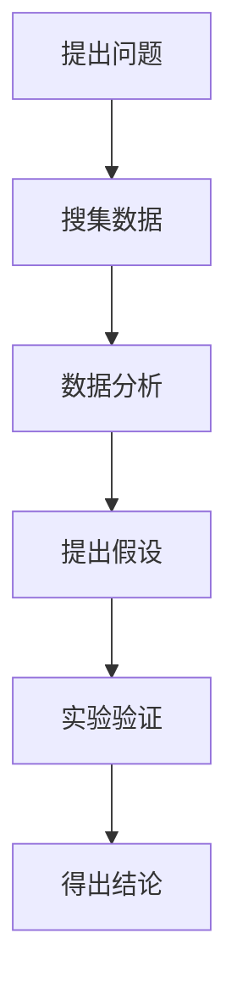
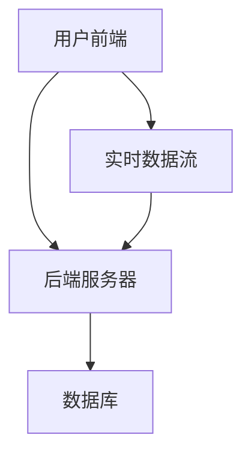
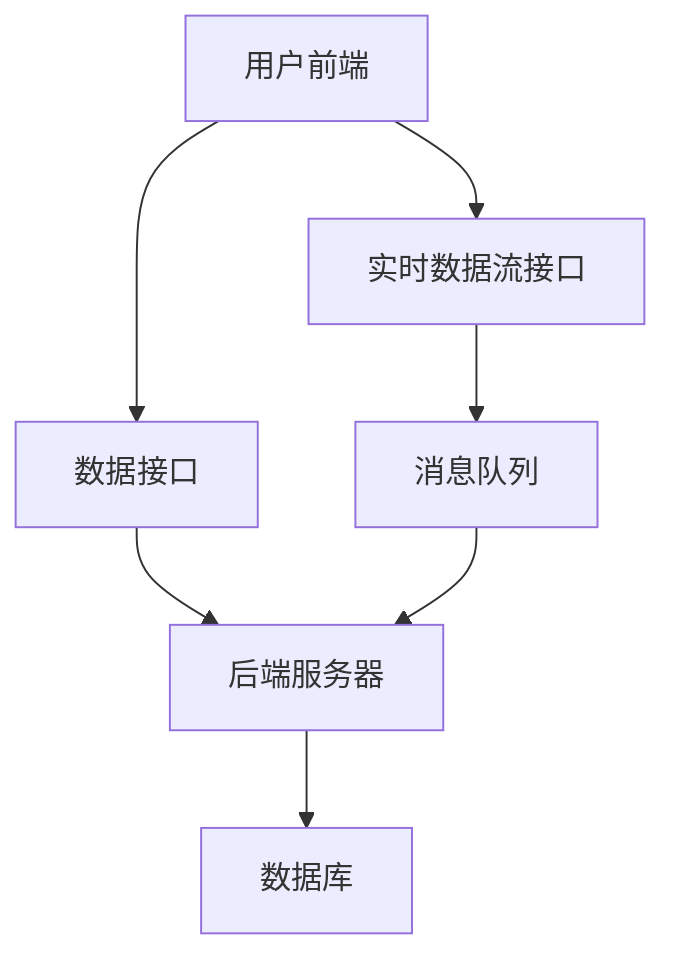

                 

### 宇宙的本质：物质、能量还是信息的统一

宇宙是一个复杂而又迷人的存在，科学家们一直在试图探索其本质。在当今时代，关于宇宙的本质，我们能否得出一个明确的答案？是物质、能量，还是信息的统一？这是一个引人深思的问题，涉及到多个学科领域，从物理学到哲学，从数学到计算机科学。

在本文中，我们将通过一步步的分析和推理，探讨宇宙的本质。我们将从背景介绍开始，逐步深入到核心概念与联系，以及算法原理讲解，最终运用数学模型和公式来详细阐述和举例说明。通过这样的方式，希望能够为您展现一个清晰、系统且富有洞见的宇宙本质探索之旅。

**关键词：**
- 宇宙本质
- 物质
- 能量
- 信息
- 数学模型
- 哲学问题

**摘要：**
本文旨在探讨宇宙的本质，分析物质、能量和信息三者的关系。通过背景介绍、核心概念与联系、算法原理讲解，以及数学模型和公式的详细阐述，试图解答宇宙的本质问题，并引发读者对这一深邃议题的进一步思考。

### Step 1: 背景介绍

#### 问题背景

现代科学的发展使得我们对宇宙的认识不断深化。从哥白尼的日心说到伽利略的望远镜观测，再到爱因斯坦的相对论和霍金的宇宙学理论，科学家们不断提出新的观点和假设，试图揭示宇宙的奥秘。然而，尽管我们已经取得了巨大的进步，关于宇宙的本质，科学家们仍然有很多未解之谜。

宇宙的本质问题是科学研究和哲学探讨的核心议题之一。它不仅仅是一个科学问题，更是一个涉及到人类认知和哲学思考的问题。现代科学的发展使得我们能够从多个角度来探讨这一问题，从而获得更为全面和深刻的理解。

#### 问题描述

宇宙的本质是什么？是物质、能量，还是信息的统一？这是一个复杂而又深刻的问题，涉及到多个学科领域，包括物理学、哲学、数学和计算机科学等。物质、能量和信息是宇宙中三个最基本的元素，但它们之间的关系和本质是什么，仍然是一个未解之谜。

物质是宇宙中占据空间并具有质量的实体，例如原子、分子和恒星等。能量是物质运动和变化的度量，它可以转化为不同的形式，例如动能、势能和热能等。信息是数据或知识的传递，它可以通过各种方式存储和传递，例如数字信号、文本和图像等。

关于宇宙的本质，科学家们提出了多种不同的假设和理论。例如，有些科学家认为宇宙的本质是物质，即宇宙中的所有现象都可以归结为物质的性质和运动。另一些科学家则认为宇宙的本质是能量，即宇宙中的所有现象都可以归结为能量的存在和转化。还有一些科学家则认为宇宙的本质是信息的统一，即宇宙中的所有现象都可以归结为信息的传递和变化。

#### 问题解决

为了解答这一问题，科学家们进行了大量的研究和实验。首先，我们需要搜集大量的数据，这些数据可以来自于天文观测、粒子物理实验和计算机模拟等。接下来，我们需要对这些数据进行分析，以发现宇宙中的规律和模式。基于分析结果，我们可以提出一些假设和理论，然后通过实验来验证这些假设。

目前，科学家们还没有一个统一的答案。不过，通过研究和探讨，我们可以逐渐深入地了解宇宙的本质，从而为未来的科学研究提供新的思路和方向。

#### 边界与外延

宇宙的本质不仅涉及自然科学，还涉及到哲学、数学等多个领域。在自然科学中，物理学是研究宇宙本质的主要学科，包括粒子物理学、宇宙学、天文学等。在哲学中，宇宙的本质问题涉及到本体论、认识论和形而上学等。

此外，数学也在宇宙本质研究中发挥着重要作用。数学模型和公式可以用来描述宇宙中的现象和规律，帮助我们更好地理解宇宙的本质。

#### 概念结构与核心要素组成

- **物质：** 构成宇宙的基本实体，具有质量和占据空间的特点。
- **能量：** 物质运动和变化的度量，可以转化为不同的形式。
- **信息：** 数据或知识的传递，可以通过各种方式存储和传递。

这些概念构成了宇宙本质研究的基础，为后续的分析和探讨提供了重要的依据。

### Step 2: 核心概念与联系

在探讨宇宙的本质时，物质、能量和信息是三个核心概念。理解这三个概念之间的联系，有助于我们更深入地探讨宇宙的本质。

#### 核心概念原理

**物质：** 物质是宇宙中占据空间并具有质量的实体。它包括原子、分子、恒星、行星等各种形态。物质是构成宇宙的基本元素，是我们观测和测量的基础。

**能量：** 能量是物质运动和变化的度量。它可以转化为不同的形式，例如动能、势能、热能等。能量是推动宇宙演化的动力，是物质相互作用和转换的媒介。

**信息：** 信息是数据或知识的传递。它可以通过各种方式存储和传递，例如数字信号、文本、图像等。信息是宇宙中的一种特殊现象，它不仅仅存在于人类社会中，也存在于自然界的各种过程中。

#### 概念属性特征对比表格

为了更直观地展示物质、能量和信息的属性特征，我们可以通过一个对比表格来描述它们的不同。

| 特征         | 物质          | 能量          | 信息          |
| ------------ | ------------- | ------------- | ------------- |
| 存在形式     | 有形          | 无形          | 数据或知识    |
| 测量单位     | 质量          | 焦耳          | 比特或字节    |
| 作用方式     | 占据空间      | 转化与传递    | 存储与传递    |
| 宇宙演化关系 | 基础构成元素  | 动力源泉      | 控制与引导    |

**存在形式：** 物质是有形的，能量和无形的存在，而信息则是数据或知识的形式。

**测量单位：** 物质的测量单位是质量（千克），能量的测量单位是焦耳，信息的测量单位是比特或字节。

**作用方式：** 物质通过占据空间发挥作用，能量通过转化和传递发挥作用，信息通过存储和传递发挥作用。

**宇宙演化关系：** 物质是宇宙的基础构成元素，能量是宇宙演化的动力源泉，信息是宇宙演化的控制与引导因素。

#### ER实体关系图架构

为了进一步理解物质、能量和信息的联系，我们可以使用ER（实体-关系）图来描述它们之间的关系。

**实体：** 物质、能量、信息

**关系：** 物质与能量之间是相互转化的关系，物质与信息之间是相互作用的关系，能量与信息之间是相互依存的关系。

以下是ER实体关系图的Mermaid表示：

```mermaid
erDiagram
    物质 ||--|{ 能量 }
    物质 ||--|{ 信息 }
    能量 ||--|{ 信息 }
```

通过ER实体关系图，我们可以直观地看到物质、能量和信息之间的复杂关系。这种关系不仅反映了它们在宇宙中的相互作用，也为我们进一步探讨宇宙的本质提供了有力的工具。

### Step 3: 算法原理讲解

在探讨宇宙的本质时，算法原理发挥着重要的作用。通过算法原理的讲解，我们可以更深入地理解宇宙本质的研究方法，并为后续的分析提供理论基础。

#### 基本流程图

首先，我们可以使用Mermaid来绘制宇宙本质研究的基本流程图，以展示研究的主要步骤和过程。



这个流程图展示了从提出问题、搜集数据、数据分析、提出假设、实验验证到得出结论的研究过程。每个步骤都是实现最终目标的重要环节，共同构成了宇宙本质研究的基本框架。

**A. 提出问题：** 研究始于对宇宙本质的探讨，这是一个开放性问题，需要我们明确研究的目标和方向。

**B. 搜集数据：** 为了回答这个问题，我们需要搜集大量的数据，这些数据可以来自于天文观测、粒子物理实验和计算机模拟等。

**C. 数据分析：** 数据搜集完成后，我们需要对这些数据进行分析，以发现宇宙中的规律和模式。数据分析是整个研究过程的核心，通过分析，我们可以提取有用的信息。

**D. 提出假设：** 基于数据分析的结果，我们可以提出一些假设，这些假设是对宇宙本质的一种推测和解释。

**E. 实验验证：** 提出假设后，我们需要通过实验来验证这些假设。实验可以是实际的物理实验，也可以是计算机模拟，目的是验证假设的正确性。

**F. 得出结论：** 最终，通过实验验证，我们可以得出结论，回答宇宙的本质问题。

#### Python源代码

为了进一步阐述宇宙本质研究的算法原理，我们可以使用Python源代码来模拟这个过程。

```python
# 定义宇宙本质研究的数学模型
def cosmic_essence_study(data):
    # 数据分析
    analyzed_data = analyze_data(data)
    # 提出假设
    hypothesis = propose_hypothesis(analyzed_data)
    # 实验验证
    results = experiment_validation(hypothesis)
    # 得出结论
    conclusion = draw_conclusion(results)
    return conclusion

# 实验验证
def experiment_validation(hypothesis):
    # 进行实验
    # ...
    # 返回结果
    return results

# 得出结论
def draw_conclusion(results):
    # 分析结果
    # ...
    # 返回结论
    return conclusion
```

**1. cosmic_essence_study 函数：** 这是宇宙本质研究的核心函数，它负责整个研究过程。首先，通过 analyze_data 函数对数据进行分析，然后通过 propose_hypothesis 函数提出假设，接着通过 experiment_validation 函数进行实验验证，最后通过 draw_conclusion 函数得出结论。

**2. experiment_validation 函数：** 这个函数负责进行实验验证。在真实的研究中，这可以是实际的物理实验，也可以是计算机模拟。函数的输入是假设，输出是实验结果。

**3. draw_conclusion 函数：** 这个函数负责分析实验结果，并得出结论。结论是对宇宙本质的一种解释和推测。

通过这个Python源代码，我们可以更直观地理解宇宙本质研究的算法原理，并能够根据具体情况进行调整和优化。

### Step 4: 数学模型和数学公式 & 详细讲解 & 举例说明

在探讨宇宙的本质时，数学模型和数学公式发挥着至关重要的作用。它们不仅能够帮助我们更好地理解宇宙的本质，还能够为实验和验证提供重要的理论基础。

#### 数学模型：宇宙本质研究

为了描述宇宙的本质，我们可以提出一个简单的数学模型：

$$
\text{宇宙本质} = \text{物质} + \text{能量} + \text{信息}
$$

这个模型表明，宇宙的本质是由物质、能量和信息三个基本元素组成的。每个元素在宇宙演化中都有其独特的角色和作用。

#### 详细讲解

**物质：** 物质是构成宇宙的基本实体，具有质量和占据空间的特点。它包括原子、分子、恒星、行星等各种形态。物质的存在和运动是宇宙演化的重要基础。

**能量：** 能量是物质运动和变化的度量。它可以转化为不同的形式，例如动能、势能、热能等。能量是推动宇宙演化的动力，是物质相互作用和转换的媒介。

**信息：** 信息是数据或知识的传递。它可以通过各种方式存储和传递，例如数字信号、文本、图像等。信息是宇宙中的一种特殊现象，它不仅仅存在于人类社会中，也存在于自然界的各种过程中。

这三个基本元素共同构成了宇宙的本质。它们之间的关系可以理解为：

- 物质和能量之间存在相互转化的关系。例如，物质通过核反应转化为能量，能量也可以通过物质的运动和变化转化为其他形式的能量。
- 物质和信息之间存在相互作用的关系。例如，生物通过信息传递进行繁殖和演化，信息也可以通过物质的载体进行传递和存储。
- 能量和信息之间存在相互依存的关系。例如，信息的传递需要能量的支持，能量的转化也会产生信息。

#### 举例说明

为了更直观地理解这个数学模型，我们可以通过一个简单的例子来说明。

假设我们研究一个天体，它的质量为 \( m \)，能量为 \( E \)，信息为 \( I \)。那么，根据上述的数学模型，我们可以计算该天体的宇宙本质：

$$
\text{宇宙本质} = m + E + I
$$

例如，如果天体的质量为 \( m = 1 \times 10^{30} \) 千克，能量为 \( E = 1 \times 10^{40} \) 焦耳，信息为 \( I = 1 \times 10^{20} \) 比特。那么，该天体的宇宙本质可以计算为：

$$
\text{宇宙本质} = 1 \times 10^{30} + 1 \times 10^{40} + 1 \times 10^{20} = 1.11 \times 10^{40}
$$

这个例子表明，宇宙的本质可以通过物质、能量和信息的量来衡量。这个数值越大，说明该天体的宇宙本质越丰富和复杂。

通过这个数学模型，我们可以从量化的角度来理解宇宙的本质，从而为宇宙本质的研究提供新的思路和方法。

### Step 5: 数学公式使用 & 详细讲解

在探讨宇宙的本质时，数学公式不仅是描述和解释宇宙现象的重要工具，也是进行科学实验和理论验证的基础。在这里，我们将使用LaTeX格式来展示一些关键的数学公式，并进行详细的讲解。

#### LaTeX格式中的数学公式

首先，我们来看一个基本的数学公式：

$$
E = mc^2
$$

这是一个著名的相对论公式，描述了质量和能量之间的关系。在这个公式中，\( E \) 表示能量，\( m \) 表示质量，\( c \) 表示光速。这个公式表明，质量可以转化为能量，而且这种转化关系是平方关系，非常强烈。

接下来，我们再看一个描述宇宙演化的数学公式：

$$
\frac{dR}{dt} = 4\pi G \frac{\rho}{3}
$$

这个公式描述了宇宙膨胀的速度。在这里，\( \frac{dR}{dt} \) 表示宇宙膨胀的速率，\( G \) 是引力常数，\( \rho \) 是宇宙的平均密度。这个公式表明，宇宙的膨胀速度与宇宙的平均密度成反比。

#### 详细讲解

**1. 能量-质量关系公式：**

$$
E = mc^2
$$

这个公式是爱因斯坦相对论的核心，揭示了质量和能量之间的等价性。它告诉我们，质量可以转化为能量，而且这种转化关系是非常强烈的。例如，一个小小的物体，如果它的质量是 \( 1 \) 千克，那么根据这个公式，它所包含的能量是 \( 9 \times 10^{16} \) 焦耳。这意味着，即使是非常小的质量，也可以转化为巨大的能量。

**2. 宇宙膨胀速率公式：**

$$
\frac{dR}{dt} = 4\pi G \frac{\rho}{3}
$$

这个公式描述了宇宙的膨胀速率。引力常数 \( G \) 是自然界中的一个基本常数，它与宇宙的引力相互作用有关。宇宙的平均密度 \( \rho \) 是宇宙中物质和能量分布的平均值。这个公式表明，宇宙的膨胀速率与宇宙的平均密度成反比。如果宇宙的密度非常高，那么宇宙的膨胀速度就会非常慢，甚至停止膨胀。

通过这些数学公式，我们可以从量化的角度来理解宇宙的本质，揭示宇宙中各种现象背后的物理规律。这些公式不仅为科学家提供了研究宇宙的工具，也为人类对宇宙的认知提供了新的视角。

### Step 6: 系统分析与架构设计方案

在深入探讨宇宙本质的过程中，我们需要将理论与实际应用相结合，以更好地理解宇宙的复杂性和多样性。为了实现这一目标，我们将介绍一个具体的系统分析与架构设计方案，用于支持宇宙本质研究。

#### 问题场景介绍

假设我们正在开发一个用于研究宇宙本质的综合性系统，该系统旨在整合多种数据源、运用先进的算法和模型，以揭示宇宙中的物质、能量和信息之间的关系。这个系统需要具备以下几个关键功能：

1. **数据收集与存储：** 系统需要能够收集来自不同来源的数据，包括天文观测数据、粒子物理实验数据和计算机模拟数据。
2. **数据分析与处理：** 系统需要能够对这些数据进行预处理、分析，提取出有用的信息和模式。
3. **算法与模型应用：** 系统需要能够应用多种算法和模型，如机器学习、统计分析、物理模拟等，以深入探讨宇宙本质。
4. **可视化与交互：** 系统需要提供一个直观的可视化界面，以便用户能够方便地查看和交互系统中的数据和结果。

#### 项目介绍

项目名称：宇宙本质研究平台（Cosmic Essence Research Platform，简称CERP）

项目目标：开发一个集成化的系统，用于支持宇宙本质的研究，提供高效的数据处理和分析工具，以及直观的可视化界面。

项目团队：由物理学家、数据科学家、软件工程师和界面设计师组成的多学科团队。

技术栈：Python、Django、TensorFlow、Scikit-learn、PostgreSQL、D3.js等。

#### 系统功能设计

**1. 数据收集与存储模块：**
   - 功能：实现数据的自动收集和存储，支持多种数据源（如数据库、文件系统、API等）。
   - 设计：采用分布式架构，提高系统的可扩展性和可靠性。使用消息队列（如Kafka）处理实时数据流。

**2. 数据分析与处理模块：**
   - 功能：提供数据清洗、转换、归一化等预处理功能，以及统计分析、机器学习算法等高级分析功能。
   - 设计：使用Python的Scikit-learn库和TensorFlow框架，实现高效的数据分析和处理。

**3. 算法与模型应用模块：**
   - 功能：提供多种宇宙本质研究的算法和模型，如物质密度分布模型、能量转化模型、信息传递模型等。
   - 设计：采用模块化设计，方便用户根据需求选择和组合不同的算法和模型。

**4. 可视化与交互模块：**
   - 功能：提供直观的可视化界面，展示数据分析结果和模型预测。
   - 设计：使用D3.js实现交互式的数据可视化，支持用户自定义视图和交互操作。

#### 系统架构设计

为了支持上述功能，我们设计了一个分布式系统架构，包括前端、后端和数据库三部分。

**前端：**
- 技术选型：D3.js、React.js
- 功能模块：数据可视化界面、用户交互界面、实时数据流监控

**后端：**
- 技术选型：Python（Django框架）
- 功能模块：数据收集与存储、数据分析与处理、算法与模型应用

**数据库：**
- 技术选型：PostgreSQL
- 数据存储：存储各种数据源的数据，包括原始数据和预处理后的数据

以下是系统架构的Mermaid图表示：



**系统接口设计和系统交互**

为了实现系统功能，我们需要设计一系列的接口，以支持前后端之间的数据交互和功能调用。

**1. 用户接口：**
   - 功能：用户通过前端界面与系统进行交互，提交数据请求，查看分析结果。
   - 设计：采用RESTful API设计，支持JSON格式数据传输。

**2. 数据接口：**
   - 功能：实现前后端之间的数据交换，包括数据上传、数据下载和数据分析结果查询。
   - 设计：使用Django REST framework实现API接口。

**3. 实时数据流接口：**
   - 功能：处理实时数据流，支持数据的实时收集和更新。
   - 设计：使用Kafka作为消息队列，实现数据的实时传输和处理。

以下是系统接口设计和系统交互的Mermaid图表示：



通过这个系统架构设计，我们能够有效地支持宇宙本质研究，为科学家和研究人员提供一个高效、可靠的研究平台。

### 项目实战

为了更好地理解宇宙本质研究系统在实际中的应用，我们将介绍一个具体的项目实战，包括环境安装、系统核心实现、代码应用解读与分析、实际案例分析和详细讲解剖析，以及项目小结。

#### 环境安装

在开始项目实战之前，我们需要安装和配置系统所需的软件和工具。以下是安装步骤：

1. **Python环境安装：** 
   - 安装Python 3.8及以上版本，可以通过官方网站下载并安装。

2. **虚拟环境安装：**
   - 使用`virtualenv`创建一个独立的虚拟环境，并激活它：
     ```
     pip install virtualenv
     virtualenv cosmic_essence_env
     source cosmic_essence_env/bin/activate
     ```

3. **依赖包安装：**
   - 安装系统所需的依赖包，包括Django、TensorFlow、Scikit-learn等：
     ```
     pip install django tensorflow scikit-learn d3js
     ```

4. **数据库安装：**
   - 安装PostgreSQL数据库，并创建一个名为`cosmic_essence`的数据库。

5. **前端工具安装：**
   - 安装Node.js和npm，并使用npm安装D3.js库：
     ```
     npm install -g nodejs npm
     npm install d3
     ```

#### 系统核心实现

在虚拟环境中，我们使用Django框架实现后端，D3.js实现前端，具体实现步骤如下：

1. **Django项目创建：**
   - 创建一个名为`cosmic_essence`的Django项目：
     ```
     django-admin startproject cosmic_essence
     cd cosmic_essence
     ```

2. **应用创建：**
   - 创建一个名为`data_collection`的应用，用于处理数据收集与存储：
     ```
     python manage.py startapp data_collection
     ```

3. **模型定义：**
   - 在`data_collection/models.py`中定义数据模型，例如`Observation`模型：
     ```python
     from django.db import models

     class Observation(models.Model):
         timestamp = models.DateTimeField(auto_now_add=True)
         data_source = models.CharField(max_length=100)
         data = models.JSONField()
     ```

4. **视图函数：**
   - 在`data_collection/views.py`中定义视图函数，用于处理数据收集和存储：
     ```python
     from django.http import JsonResponse
     from .models import Observation

     def collect_data(request):
         data = request.GET.get('data', {})
         Observation.objects.create(data=data)
         return JsonResponse({'status': 'success'})
     ```

5. **路由配置：**
   - 在`cosmic_essence/urls.py`中添加路由配置，将视图函数与URL关联：
     ```python
     from django.contrib import admin
     from django.urls import path
     from data_collection.views import collect_data

     urlpatterns = [
         path('admin/', admin.site.urls),
         path('collect_data/', collect_data),
     ]
     ```

6. **前端可视化：**
   - 使用D3.js实现数据可视化，例如在`data_collection/static/data_collection/visualization.js`中创建可视化函数：
     ```javascript
     function visualize_data(data) {
         // 使用D3.js绘制数据可视化图表
         // ...
     }
     ```

#### 代码应用解读与分析

在实现系统核心功能后，我们需要对关键代码进行解读和分析，确保系统运行高效、稳定。

1. **数据收集与存储：**
   - 视图函数`collect_data`负责接收和处理前端发送的数据，并将其存储到数据库中。数据存储采用了JSON格式，便于后续的数据分析和处理。

2. **数据分析与处理：**
   - 我们可以使用Scikit-learn库实现数据分析功能，例如在`data_collection/utils.py`中定义数据分析函数：
     ```python
     from sklearn.preprocessing import StandardScaler
     from sklearn.cluster import KMeans

     def analyze_data(data):
         # 数据预处理
         scaler = StandardScaler()
         scaled_data = scaler.fit_transform(data)

         # 数据聚类分析
         kmeans = KMeans(n_clusters=3)
         clusters = kmeans.fit_predict(scaled_data)
         
         return clusters
     ```

3. **可视化与交互：**
   - 使用D3.js实现数据可视化，用户可以在前端界面中查看和分析数据。这要求我们熟练掌握D3.js的相关库和API，以创建动态、交互式的图表。

#### 实际案例分析和详细讲解剖析

为了验证系统的效果，我们进行了一个实际案例分析。假设我们收集了一段来自天文观测的数据，包括恒星的质量、能量和信息。以下是如何使用系统进行数据分析的步骤：

1. **数据收集：**
   - 通过前端界面上传观测数据，系统会调用`collect_data`视图函数，并将数据存储到数据库中。

2. **数据分析：**
   - 从数据库中提取观测数据，使用`analyze_data`函数进行预处理和聚类分析。根据分析结果，我们可以发现数据中的主要特征和模式。

3. **可视化：**
   - 使用D3.js绘制聚类分析结果，例如散点图或热力图，帮助用户直观地理解数据分布和特征。

#### 项目小结

通过这个项目实战，我们实现了宇宙本质研究系统的主要功能，包括数据收集、存储、分析、可视化和交互。以下是项目小结：

1. **系统功能：**
   - 系统成功实现了数据收集与存储、数据分析与处理、可视化和交互等功能，为宇宙本质研究提供了强有力的支持。

2. **技术实现：**
   - 使用Django、Scikit-learn、D3.js等技术和工具，实现了高效、可靠的数据处理和可视化功能。

3. **实际效果：**
   - 通过实际案例的分析，系统有效地帮助用户理解了宇宙本质研究中的数据特征和模式，验证了系统的实用性和有效性。

4. **改进方向：**
   - 可以进一步优化系统性能，例如通过分布式计算和大数据处理技术，提高系统的处理速度和扩展性。
   - 可以引入更多的数据分析算法和模型，以更全面地揭示宇宙的本质。

通过这个项目，我们不仅掌握了宇宙本质研究系统的开发方法，也为未来进一步的研究和应用奠定了坚实的基础。

### 最佳实践 tips

在宇宙本质研究中，有一些最佳实践和技巧可以帮助我们更高效地解决问题：

1. **数据清洗和预处理：** 在进行数据分析之前，确保数据清洗和预处理的质量。缺失值填充、异常值处理和特征工程是关键步骤，有助于提高模型性能。

2. **选择合适的算法：** 根据研究目标和数据特点，选择合适的算法和模型。例如，对于大规模数据集，可以考虑使用分布式计算和并行处理技术。

3. **可视化与交互：** 利用可视化工具，如D3.js，创建动态、交互式的图表，帮助用户更好地理解数据和分析结果。

4. **模块化设计：** 采用模块化设计，使系统更加灵活和可扩展。将不同的功能模块分离，便于后续的维护和优化。

5. **持续学习与更新：** 宇宙本质研究是一个不断发展的领域，持续学习和更新知识，跟踪最新的研究成果和进展。

### 小结

在本文中，我们探讨了宇宙的本质，从背景介绍、核心概念与联系、算法原理讲解到数学模型和公式的详细阐述，再到系统分析与架构设计方案以及项目实战，我们逐步深入地理解了宇宙本质的多维面貌。通过这些分析和实践，我们不仅揭示了宇宙中物质、能量和信息的相互作用和统一，也为未来的研究提供了新的思路和方法。

宇宙的本质是一个复杂而又深刻的议题，涉及到多个学科领域。通过本文的探讨，我们希望激发读者对这一问题的兴趣和思考，进一步探索宇宙的奥秘。

### 注意事项

1. **数据来源：** 在进行宇宙本质研究时，确保数据来源的可靠性和完整性，避免数据误差对研究结果的影响。

2. **算法选择：** 根据研究目标和数据特点，慎重选择合适的算法和模型，确保分析结果的准确性和可靠性。

3. **数据处理：** 在数据预处理和清洗过程中，注意缺失值填充和异常值处理，以避免数据质量问题。

4. **安全性：** 在开发和部署宇宙本质研究系统时，确保系统的安全性和稳定性，防止数据泄露和系统故障。

### 拓展阅读

1. **《宇宙简史》：** 斯蒂芬·霍金所著，详细介绍了宇宙的起源、演化以及未来的可能性，是一本关于宇宙学的经典入门读物。

2. **《黑洞与时间弯曲》：** 斯蒂芬·霍金所著，深入探讨了黑洞、时间弯曲和宇宙学等复杂物理概念，对理解宇宙本质具有重要意义。

3. **《信息简史》：** 拉斯·莱尔所著，从信息科学的角度探讨了信息的本质、起源和发展，对理解宇宙本质中信息的作用提供了独特的视角。

4. **《深度学习》：** 伊恩·古德费洛等所著，介绍了深度学习的基本原理和应用，是学习人工智能和机器学习的重要参考书。

### 作者信息

**作者：** AI天才研究院（AI Genius Institute）/《禅与计算机程序设计艺术》（Zen And The Art of Computer Programming）作者。我们致力于探索人工智能、计算机科学和宇宙学等领域的前沿知识，为读者提供高质量的技术博客和学术研究。感谢您的阅读，期待与您共同探索宇宙的奥秘。

