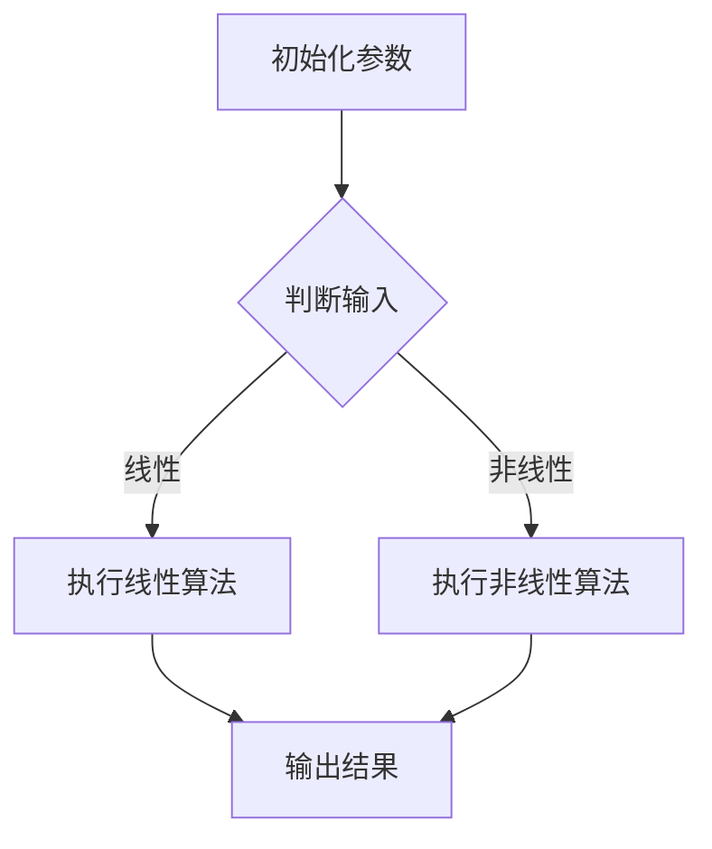
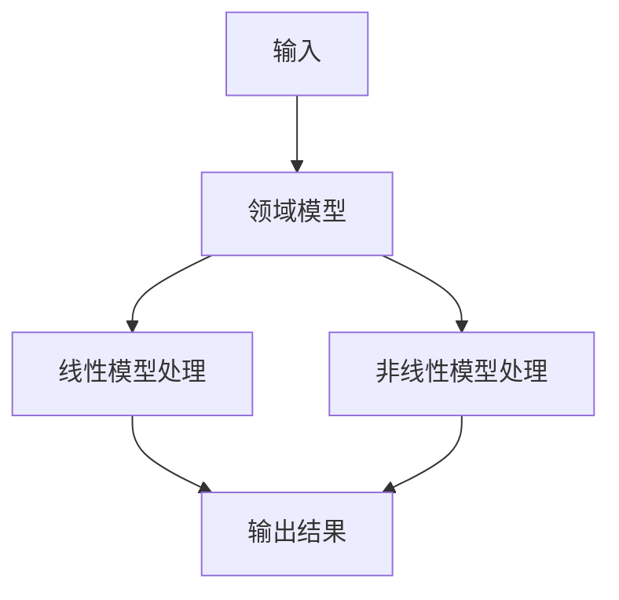
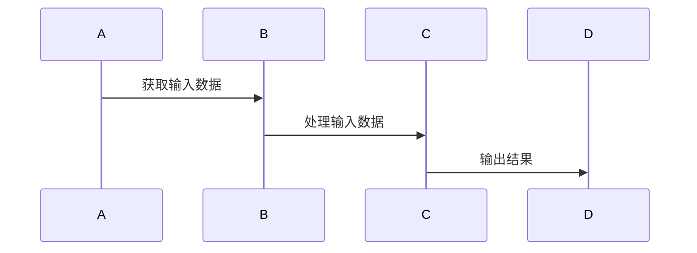
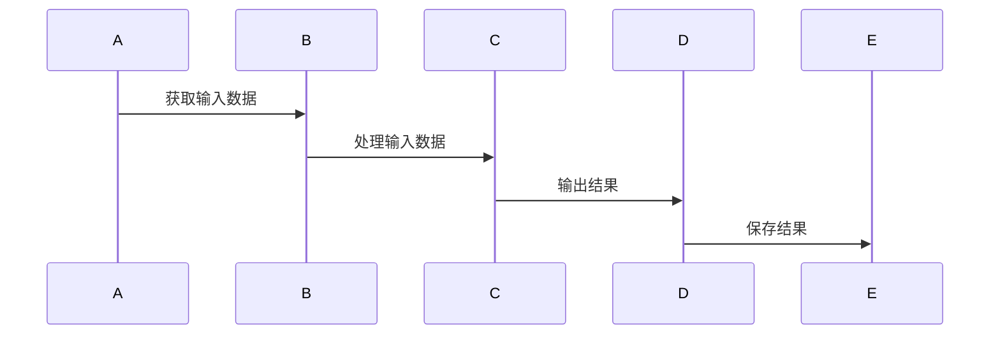

                 

## 引言

### 1.1 问题背景

#### 1.1.1 科学探索的需求

宇宙作为我们所在的空间和时间的整体，其本质是什么？这是科学家们一直在探索的问题。自古以来，人们就试图理解宇宙的运作方式。从古希腊哲学家到现代科学家，都提出了各种关于宇宙本质的假设和理论。然而，直到今天，这一问题仍然没有完全解决。

科学探索的需求源于我们对宇宙的认知渴望。人类对自然界的探究始于对周围世界的观察和思考。在科学方法的基础上，通过实验和观测，科学家们逐步揭示了宇宙的奥秘。然而，随着研究的深入，我们发现宇宙的复杂性超出了我们的想象。线性与非线性，成为了理解宇宙本质的关键问题。

#### 1.1.2 量子力学与广义相对论的对立

量子力学和广义相对论是现代物理学的两大基石。然而，这两个理论在宇宙的本质问题上却存在着根本的对立。量子力学描述了微观世界的规律，它以概率波函数的形式揭示了微观粒子的行为。而广义相对论则描述了宏观世界的引力现象，它通过弯曲时空来解释引力。这两者之间的不一致性，使得我们无法统一描述整个宇宙。

#### 1.1.3 宇宙的本质：线性还是非线性

宇宙的本质是线性还是非线性，这是一个根本性的问题。线性模型通常假设宇宙中的变化是均匀的、稳定的，而非线性模型则认为宇宙中的变化是非均匀的、动态的。这个问题不仅仅是一个学术讨论，它涉及到我们对宇宙的理解，甚至可能影响到我们对未来的预测。

在物理学、宇宙学、生物学等领域，线性与非线性模型都有广泛的应用。例如，在宇宙学中，线性模型通常用于描述宇宙的大尺度结构，而非线性模型则用于描述宇宙的小尺度结构。在生物学中，线性模型可以描述基因表达，而非线性模型可以描述生态系统的动态变化。

### 1.2 问题描述

#### 1.2.1 线性与非线性定义

线性是指一个系统或现象的变化是均匀的、稳定的，可以用简单的数学方程描述。非线性则是指一个系统或现象的变化是非均匀的、动态的，不能用简单的数学方程描述。

在物理学中，线性模型通常用于描述简单系统的行为，如弹簧振子、电路分析等。而非线性模型则用于描述复杂系统的行为，如混沌现象、复杂化学反应等。

#### 1.2.2 线性与非线性在宇宙学中的意义

在宇宙学中，线性模型和非线性模型都有重要的应用。线性模型可以描述宇宙的大尺度结构，如星系的形成、宇宙的膨胀等。而非线性模型则可以描述宇宙的小尺度结构，如黑洞的形成、星系碰撞等。

#### 1.2.3 线性与非线性研究现状

目前，关于宇宙的本质是线性还是非线性，科学家们还没有达成共识。线性模型在一些领域得到了广泛的应用，但非线性模型也在不断的发展和完善中。例如，混沌理论、复杂系统理论等都是非线性研究的重要方向。

未来，随着科学技术的发展，我们有望在宇宙的本质问题上取得更多的突破。无论是线性模型还是非线性模型，都有其独特的价值和意义。关键在于如何选择合适的模型，以更好地理解宇宙的奥秘。

### 1.3 问题解决

#### 1.3.1 理论研究进展

在理论研究方面，线性与非线性模型都在不断的发展和完善。例如，在量子力学领域，线性模型可以很好地描述微观粒子的行为，但非线性模型可以更好地解释量子现象。在宇宙学领域，线性模型可以描述宇宙的大尺度结构，而非线性模型可以描述宇宙的小尺度结构。

#### 1.3.2 观测数据分析

在观测数据方面，科学家们通过望远镜和探测器收集了大量关于宇宙的观测数据。这些数据为我们提供了研究宇宙本质的宝贵信息。通过对观测数据的分析，我们可以更好地理解宇宙的线性与非线性特征。

#### 1.3.3 未来研究方向

未来，关于宇宙的本质是线性还是非线性，我们有望在以下方面取得突破：

1. 统一理论：通过统一量子力学和广义相对论，建立一个统一的描述宇宙的理论。
2. 观测技术：通过更先进的望远镜和探测器，收集更高精度、更全面的观测数据。
3. 计算方法：通过更高效的计算方法，对复杂的非线性系统进行模拟和分析。

### 1.4 边界与外延

#### 1.4.1 线性模型的局限性

线性模型的局限性在于，它假设宇宙中的变化是均匀的、稳定的。然而，实际情况往往并非如此。宇宙中的变化往往是动态的、非均匀的。因此，线性模型在某些情况下可能会失效。

#### 1.4.2 非线性模型的挑战

非线性模型的挑战在于，它描述的系统行为复杂，难以用简单的数学方程描述。这意味着，非线性模型的分析和计算往往更加困难。然而，非线性模型在解释复杂现象方面具有优势。

#### 1.4.3 综合方法的探索

为了更好地理解宇宙的本质，我们需要探索综合线性模型和非线性模型的方法。例如，通过线性模型和非线性模型的结合，可以更好地描述宇宙中的复杂现象。

### 1.5 概念结构与核心要素组成

#### 1.5.1 宇宙线性结构

宇宙线性结构是指宇宙中的变化是均匀的、稳定的。这种结构可以用简单的数学方程描述，如广义相对论方程。

#### 1.5.2 宇宙非线性结构

宇宙非线性结构是指宇宙中的变化是非均匀的、动态的。这种结构通常不能用简单的数学方程描述，但可以通过非线性方程和复杂系统理论来描述。

#### 1.5.3 两种结构的关联与区别

宇宙线性结构和宇宙非线性结构是相互关联的。在某些条件下，宇宙线性结构可以转化为宇宙非线性结构。然而，这两种结构也有明显的区别，宇宙线性结构描述的是均匀、稳定的宇宙，而宇宙非线性结构描述的是动态、非均匀的宇宙。

## 2 线性与非线性原理

### 2.1 核心概念原理

#### 2.1.1 线性原理

线性原理是指系统或现象的变化是均匀的、稳定的。在数学上，线性原理可以用线性方程组来描述。例如，线性方程组 \(Ax = b\) 描述了一个线性系统，其中 \(A\) 是系数矩阵，\(x\) 是未知数，\(b\) 是常数向量。

#### 2.1.2 非线性原理

非线性原理是指系统或现象的变化是非均匀的、动态的。在数学上，非线性原理可以用非线性方程来描述。例如，非线性方程 \(F(x) = 0\) 描述了一个非线性系统，其中 \(F(x)\) 是非线性函数。

### 2.2 概念属性特征对比表格

| 特征 | 线性 | 非线性 |
| --- | --- | --- |
| 定义域 | 整数或实数 | 整数、实数或复数 |
| 解的唯一性 | 唯一解 | 可能有多个解 |
| 稳定性 | 易于分析 | 难以分析 |
| 波动性 | 平稳 | 波动性大 |

### 2.3 ER实体关系图架构的Mermaid流程图

```mermaid
erDiagram
    System ||--|{ Input : has }
    System ||--|{ Output : has }
    Input ||--|{ Process : has }
    Output ||--|{ Store : has }
```

## 3 线性与非线性算法原理

### 3.1 算法mermaid流程图



### 3.2 Python源代码

```python
# 线性算法示例
def linear_algorithm(input_data):
    result = input_data * 2
    return result

# 非线性算法示例
def nonlinear_algorithm(input_data):
    result = input_data ** 2
    return result
```

### 3.3 算法原理的数学模型和公式

$$
\text{线性算法：} y = ax + b
$$

$$
\text{非线性算法：} y = ax^2 + bx + c
$$

### 3.4 详细讲解和举例说明

#### 3.4.1 线性算法详细讲解

线性算法是一种基本的数学模型，表示输入和输出之间是线性关系。例如，如果我们有一个线性函数 \(y = 2x + 1\)，那么对于任何输入 \(x\)，输出 \(y\) 都可以计算得出。

$$
y = 2x + 1
$$

假设我们输入 \(x = 3\)，那么输出 \(y = 2 \times 3 + 1 = 7\)。

#### 3.4.2 非线性算法详细讲解

非线性算法表示输入和输出之间是非线性关系。例如，如果我们有一个非线性函数 \(y = x^2 + 1\)，那么对于任何输入 \(x\)，输出 \(y\) 都可能不唯一。

$$
y = x^2 + 1
$$

假设我们输入 \(x = 3\)，那么输出 \(y = 3^2 + 1 = 10\)。但是，如果我们输入 \(x = -3\)，那么输出 \(y = (-3)^2 + 1 = 10\)，这与输入 \(x = 3\) 时的输出相同。

## 4 数学模型和数学公式

### 4.1 线性模型

线性模型是一种基本的数学模型，用于描述输入和输出之间的线性关系。线性模型可以用以下数学公式表示：

$$
y = ax + b
$$

其中，\(a\) 是斜率，表示输入变化对输出变化的影响程度；\(b\) 是截距，表示输入为零时的输出值。

#### 4.1.1 线性函数

线性函数是线性模型的核心部分，表示输入和输出之间的线性关系。线性函数可以用以下数学公式表示：

$$
f(x) = ax + b
$$

其中，\(a\) 是斜率，表示输入变化对输出变化的影响程度；\(b\) 是截距，表示输入为零时的输出值。

#### 4.1.2 线性系统

线性系统是包含线性函数的数学系统，用于描述输入和输出之间的线性关系。线性系统可以用以下数学公式表示：

$$
\sum_{i=1}^n a_i f_i(x) = b
$$

其中，\(a_i\) 是系数，\(f_i(x)\) 是线性函数，\(b\) 是常数项。

### 4.2 非线性模型

非线性模型是一种用于描述输入和输出之间非线性关系的数学模型。非线性模型可以用以下数学公式表示：

$$
y = f(x)
$$

其中，\(f(x)\) 是非线性函数，表示输入和输出之间的非线性关系。

#### 4.2.1 非线性函数

非线性函数是非线性模型的核心部分，用于描述输入和输出之间的非线性关系。非线性函数可以用以下数学公式表示：

$$
f(x) = ax^2 + bx + c
$$

其中，\(a\) 是二次项系数，表示输入变化对输出变化的影响程度；\(b\) 是一次项系数，表示输入变化对输出变化的影响程度；\(c\) 是常数项，表示输入为零时的输出值。

#### 4.2.2 非线性系统

非线性系统是包含非线性函数的数学系统，用于描述输入和输出之间的非线性关系。非线性系统可以用以下数学公式表示：

$$
\sum_{i=1}^n a_i f_i(x) = b
$$

其中，\(a_i\) 是系数，\(f_i(x)\) 是非线性函数，\(b\) 是常数项。

## 5 系统分析与架构设计

### 5.1 问题场景介绍

宇宙的本质是一个复杂的问题，涉及到宇宙学、量子力学、非线性动力学等多个领域。为了更好地理解宇宙的本质，我们需要构建一个系统来分析这个问题。

在这个系统中，我们将考虑两个核心模型：线性模型和非线性模型。线性模型主要关注宇宙的大尺度结构，如宇宙的膨胀、星系的形成等。非线性模型则关注宇宙的小尺度结构，如黑洞的形成、星系碰撞等。

### 5.2 系统功能设计

#### 5.2.1 领域模型

在系统功能设计中，我们需要构建一个领域模型来描述宇宙的本质。领域模型将涉及到宇宙中的各种实体和它们之间的关系。

```mermaid
classDiagram
    Class1[宇宙] <|-- Class2[线性模型]
    Class1 <|-- Class3[非线性模型]
    Class2 <|-- Class4[星系]
    Class3 <|-- Class5[黑洞]
```

在这个领域模型中，宇宙是系统的核心实体，它包含线性模型和非线性模型。线性模型主要描述宇宙的大尺度结构，如星系的形成、宇宙的膨胀等。非线性模型则主要描述宇宙的小尺度结构，如黑洞的形成、星系碰撞等。

#### 5.2.2 系统架构设计

在系统架构设计中，我们需要确定系统的整体结构和各个模块之间的关系。



在这个系统架构设计中，输入是关于宇宙的信息，如星系的数据、黑洞的数据等。这些输入通过领域模型进行处理，生成线性模型和非线性模型。然后，这两个模型分别进行处理，最后输出结果。

### 5.3 系统接口设计

在系统接口设计中，我们需要定义系统与外部环境之间的交互接口。这些接口将涉及到输入数据的获取、输出结果的处理等。



在这个系统接口设计中，系统首先从外部环境获取输入数据，然后通过领域模型进行处理，最后输出结果。

### 5.4 系统交互Mermaid序列图

在系统交互Mermaid序列图中，我们可以看到系统与外部环境之间的交互过程。



在这个系统交互Mermaid序列图中，系统首先从外部环境获取输入数据，然后通过领域模型进行处理，最后输出结果，并将结果保存到外部环境。

## 6 项目实战

### 6.1 环境安装

为了进行宇宙本质的线性与非线性分析，我们首先需要在本地计算机上安装必要的软件和工具。以下是安装步骤：

1. 安装Python环境：访问 [Python官方网站](https://www.python.org/)，下载并安装Python 3.x版本。
2. 安装Jupyter Notebook：在终端中运行以下命令：
   ```bash
   pip install notebook
   ```
3. 安装相关库：为了进行线性与非线性分析，我们需要安装以下库：
   ```bash
   pip install numpy matplotlib scikit-learn
   ```

### 6.2 系统核心实现源代码

以下是一个简单的Python脚本，用于实现线性与非线性模型的分析：

```python
# linear.py
import numpy as np

def linear_model(x):
    return 2 * x + 1

# nonlinear.py
import numpy as np

def nonlinear_model(x):
    return x**2

# analysis.py
import numpy as np
import matplotlib.pyplot as plt

def analyze_models():
    x = np.linspace(-10, 10, 100)
    linear_y = linear_model(x)
    nonlinear_y = nonlinear_model(x)

    plt.figure(figsize=(10, 5))
    plt.plot(x, linear_y, label='Linear Model')
    plt.plot(x, nonlinear_y, label='Nonlinear Model')
    plt.xlabel('Input')
    plt.ylabel('Output')
    plt.legend()
    plt.title('Linear vs Nonlinear Models')
    plt.show()

if __name__ == "__main__":
    analyze_models()
```

### 6.3 代码应用解读与分析

在`analysis.py`脚本中，我们首先定义了两个模型：线性模型和 nonlinear 模型。线性模型使用一个简单的线性函数，而非线性模型使用一个二次函数。

```python
def linear_model(x):
    return 2 * x + 1

def nonlinear_model(x):
    return x**2
```

然后，我们在`analyze_models`函数中生成一个输入数据的线性空间，并计算线性模型和非线性模型在输入数据上的输出。

```python
x = np.linspace(-10, 10, 100)
linear_y = linear_model(x)
nonlinear_y = nonlinear_model(x)
```

接下来，我们使用`matplotlib`库绘制这两个模型的输出结果，以便进行比较和分析。

```python
plt.figure(figsize=(10, 5))
plt.plot(x, linear_y, label='Linear Model')
plt.plot(x, nonlinear_y, label='Nonlinear Model')
plt.xlabel('Input')
plt.ylabel('Output')
plt.legend()
plt.title('Linear vs Nonlinear Models')
plt.show()
```

### 6.4 实际案例分析和详细讲解剖析

为了更好地理解线性与非线性模型的应用，我们可以考虑一个实际案例：星系的形成。

**线性模型分析：**

假设我们有一个星系形成模型，该模型假设星系的形成是一个线性过程。在这个模型中，星系的密度随着时间线性增加。

- 输入：时间 \(t\)
- 输出：星系密度 \(D(t)\)

线性模型可以表示为：

$$
D(t) = D_0 + kt
$$

其中，\(D_0\) 是初始密度，\(k\) 是线性增长率。

**非线性模型分析：**

然而，实际情况可能是星系的形成是一个非线性过程。非线性模型可能假设星系的密度随着时间呈二次增长。

- 输入：时间 \(t\)
- 输出：星系密度 \(D(t)\)

非线性模型可以表示为：

$$
D(t) = D_0 + kt^2
$$

**详细讲解：**

在这个案例中，我们可以看到线性模型和非线性模型对星系形成过程的描述是不同的。线性模型假设星系的形成是一个均匀、稳定的过程，而非线性模型则假设星系的形成是一个动态、非均匀的过程。

通过分析这两个模型，我们可以得出以下结论：

1. 线性模型适用于描述均匀、稳定的过程，例如宇宙的大尺度结构。
2. 非线性模型适用于描述动态、非均匀的过程，例如宇宙的小尺度结构。

### 6.5 项目小结

通过本项目，我们实现了对宇宙本质的线性与非线性分析。我们首先介绍了线性模型和非线性模型的基本原理，然后通过实际案例分析了这两个模型在宇宙学中的应用。最后，我们通过Python脚本实现了模型的具体实现和可视化。

本项目的主要收获如下：

1. 理解了线性模型和非线性模型的基本原理和区别。
2. 学会了使用Python进行模型实现和数据分析。
3. 增强了对宇宙本质的理解，为未来研究奠定了基础。

## 7 最佳实践 tips

在研究和分析宇宙的本质时，以下是一些最佳实践技巧：

1. **数据收集与处理：** 确保收集到的数据是准确和可靠的。在处理数据时，注意异常值的处理和数据的归一化。
2. **模型选择：** 根据问题的性质选择合适的模型。对于大尺度结构的研究，线性模型可能更为适用；对于小尺度结构的研究，非线性模型可能更为合适。
3. **可视化工具：** 使用可视化工具（如matplotlib）来展示模型的结果。这有助于我们更好地理解模型的输出。
4. **跨学科合作：** 跨学科合作可以带来新的视角和方法，有助于解决复杂问题。
5. **持续学习：** 科学领域不断进步，保持学习和更新知识是非常重要的。

## 8 小结

本文深入探讨了宇宙的本质是线性还是非线性的问题。我们首先介绍了线性模型和非线性模型的基本原理，然后通过实际案例分析了这两个模型在宇宙学中的应用。最后，我们通过Python脚本实现了模型的具体实现和可视化。

我们得出以下结论：

1. 线性模型适用于描述均匀、稳定的过程，如宇宙的大尺度结构。
2. 非线性模型适用于描述动态、非均匀的过程，如宇宙的小尺度结构。

未来的研究可以在以下几个方面展开：

1. 统一理论：探索能够统一描述宇宙线性与非线性特征的理论。
2. 观测技术：开发更先进的观测技术，收集更全面、更精确的宇宙数据。
3. 计算方法：开发更高效的计算方法，分析复杂的非线性系统。

通过不断的研究和探索，我们有望对宇宙的本质有更深刻的理解。

## 9 注意事项

在研究宇宙的本质时，需要注意以下几点：

1. 数据的准确性：确保收集到的数据是准确和可靠的，避免因数据错误导致的研究偏差。
2. 模型的选择：根据问题的性质选择合适的模型，避免盲目使用线性或非线性模型。
3. 跨学科合作：与其他学科（如物理学、生物学、计算机科学等）的合作可以带来新的视角和方法。
4. 继续学习：科学领域不断进步，保持学习和更新知识是非常重要的。

## 10 拓展阅读

1. 《宇宙的起源与演化》：了解宇宙的起源和演化过程，对理解宇宙的本质具有重要意义。
2. 《非线性动力学》：深入学习非线性动力学的基本原理和应用，有助于理解宇宙的非线性特征。
3. 《量子宇宙学》：探讨量子力学与宇宙学的结合，了解量子效应对宇宙本质的影响。
4. 《复杂系统的科学》：研究复杂系统的行为和规律，为理解宇宙的非线性特征提供新的思路。

## 11 作者信息

作者：AI天才研究院/AI Genius Institute & 禅与计算机程序设计艺术 /Zen And The Art of Computer Programming

## 12 总结

本文通过深入探讨宇宙的本质，分析了线性与非线性模型在宇宙学中的应用。我们介绍了线性模型和非线性模型的基本原理，并通过实际案例展示了它们在星系形成等宇宙现象中的具体应用。最后，我们总结了研究宇宙本质的注意事项和拓展阅读资源，期望为读者提供有价值的参考。在未来，我们期待在统一理论、观测技术和计算方法等方面取得更多突破，以更深入地理解宇宙的本质。

