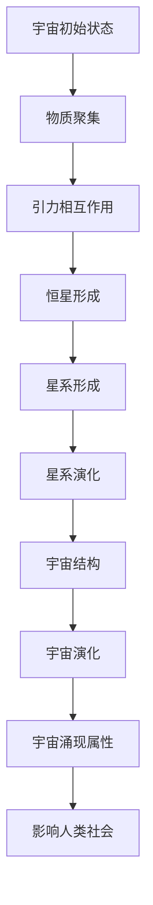

                 

## 宇宙的涌现属性：整体大于部分之和

### 关键词：宇宙，涌现属性，整体大于部分之和，复杂性，系统理论

### 摘要：
本文旨在深入探讨宇宙的涌现属性，这一概念在物理学、生物学、计算机科学和哲学等多个领域中具有重要意义。涌现属性指的是系统中个体间相互作用所产生的新现象，这些现象通常无法直接从个体的行为中推导出来，而是整体上呈现出全新的特性。本文将从宇宙涌现属性的定义、实例、理论基础、与人类活动的关系以及潜在应用等方面展开，旨在揭示整体大于部分之和这一宇宙奥秘的深层次原理，并探讨其对科学、技术和社会发展的深远影响。

### 目录

----------------------------------------------------------------

## 第一部分：引言与背景

### 1.1 书籍的目的与意义

宇宙的涌现属性是一个复杂且迷人的领域，它揭示了系统整体行为与个体行为之间的微妙关系。本文旨在为读者提供一个全面的视角，帮助理解这一现象的本质，并探讨其广泛的应用潜力。通过本文的阅读，读者可以：

- 理解涌现属性的基本概念和特征。
- 掌握整体大于部分之和的理论基础。
- 了解宇宙中涌现现象的实例和观测方法。
- 深入探讨宇宙涌现属性与人类社会的关系。
- 探索宇宙涌现属性在科学研究和技术领域的应用。

### 1.2 宇宙涌现属性的定义

涌现属性是指在复杂系统中，个体之间的相互作用产生的新现象，这些现象在个体层面上是无法直接观察到的。例如，在物理学中，相变如水的沸腾或冰的融化，都是涌现属性的典型例子。在生物学中，生命的起源和演化也是涌现属性的表现。在计算机科学中，自组织和自适应性系统同样体现了这一概念。

### 1.3 读者对象与预期收获

本文适合对科学和技术感兴趣的读者，无论你是物理学、生物学、计算机科学的学生还是从业者，或者是对哲学和系统理论感兴趣的学者，都可以通过本文获益。预期收获包括：

- 提升对复杂系统整体行为的认识。
- 增强对整体大于部分之和现象的理解。
- 掌握宇宙涌现属性的理论基础和应用场景。
- 开拓对科学研究和技术创新的思路。

----------------------------------------------------------------

## 第二部分：宇宙涌现属性概述

### 2.1 涌现属性的基本概念

涌现属性是系统复杂性的直接体现。在物理学中，系统的复杂性可以通过相变理论来描述，例如从固态到液态的转变。在生物学中，涌现属性表现为群体行为，如鸟群飞行和鱼群游动。在计算机科学中，涌现属性在自组织和自适应系统中尤为显著。

### 2.2 宇宙涌现属性的特征

宇宙涌现属性具有以下特征：

- **非线性**：涌现现象往往是非线性的，即系统的整体行为不等于其各个部分的简单叠加。
- **自组织**：涌现现象可以自发形成，无需外部干预。
- **复杂性**：涌现现象通常涉及大量个体的相互作用，导致系统行为的复杂性增加。
- **动态性**：涌现现象往往伴随着时间和空间上的演化。

### 2.3 涌现属性与整体大于部分之和的关系

整体大于部分之和是涌现属性的一个核心特征。它表明系统的整体行为和性能可以超越其各个部分的性能之和。例如，在人类社会和生态系统中，个体之间的相互作用产生了共同的目标和复杂的结构，这些结构和目标远超过单个个体的能力。

----------------------------------------------------------------

## 第三部分：宇宙涌现现象

### 4.1 宇宙中的基本涌现现象

宇宙中的涌现现象多种多样，以下是一些基本实例：

- **引力波**：两个巨大天体的相互作用产生的波动，是宇宙中最早被观测到的涌现现象之一。
- **黑洞**：恒星演化过程中形成的极端密集物体，其引力场强大到连光也无法逃脱。
- **星系形成**：无数恒星和星际物质的聚集，形成了巨大的星系结构。

### 4.2 涌现现象在宇宙结构中的体现

宇宙结构中的涌现现象体现在多个层次上：

- **宇宙大爆炸**：宇宙从极热、极密的状态开始膨胀，这一过程是涌现属性的典型表现。
- **星系集群**：大量星系的聚集形成了星系集群，这些集群在宇宙中形成了复杂的结构。
- **星际物质**：星际物质在宇宙中的分布和相互作用，形成了星系和星系的桥梁。

### 4.3 涌现现象在生命起源中的角色

生命起源是宇宙涌现现象的一个关键领域：

- **原始汤**：在地球早期，简单的有机分子相互作用，最终形成了复杂的生命形式。
- **生物大爆发**：在地球早期，生命形式在短时间内迅速多样化和复杂化，这一过程是涌现属性的体现。

----------------------------------------------------------------

## 第四部分：宇宙涌现与人类活动

### 6.1 涌现属性对社会的影响

涌现属性对社会的影响深远，包括：

- **技术创新**：涌现属性在科技领域的应用推动了人工智能、网络系统和复杂系统设计的进步。
- **社会动态**：社会系统中个体行为的相互作用导致了社会结构的形成和变革。
- **经济行为**：经济市场中的涌现现象如股市波动和消费者行为模式，体现了整体大于部分之和的特性。

### 6.2 社会中的涌现现象

社会中的涌现现象广泛存在，例如：

- **文化演化**：文化传统和价值观念的演变是群体相互作用的结果。
- **政治制度**：政治制度的形成和变迁是群体利益博弈的结果。
- **社会运动**：社会运动如民权运动和环保运动是大量个体共同行动的体现。

### 6.3 涌现属性在社会科学中的应用

涌现属性在社会科学中的应用日益增多，包括：

- **社会网络分析**：通过分析个体之间的互动关系，揭示社会结构和动态。
- **行为经济学**：研究个体行为如何影响经济决策和市场行为。
- **决策科学**：利用涌现属性模型优化群体决策过程。

----------------------------------------------------------------

## 第五部分：宇宙涌现属性的应用

### 8.1 涌现属性在科学研究中的应用

涌现属性在科学研究中的应用广泛，包括：

- **物理学**：研究复杂系统的相变和临界现象，如高温超导和量子计算。
- **生物学**：研究生态系统的演化和生物多样性的维持。
- **化学**：研究化学反应中的涌现现象，如自组织和自催化过程。

### 8.2 涌现属性在生命科学研究中的应用

涌现属性在生命科学研究中的应用包括：

- **基因调控**：研究基因网络中的相互作用和涌现现象。
- **细胞行为**：研究细胞如何通过相互作用产生复杂的生物学功能。
- **进化生物学**：研究物种演化的涌现机制。

### 8.3 涌现属性在天文学研究中的应用

涌现属性在天文学研究中的应用包括：

- **星系演化**：研究星系如何通过引力相互作用形成复杂的结构。
- **星际介质**：研究星际物质如何通过化学反应和物理过程形成新的天体。
- **宇宙学**：研究宇宙的大尺度结构和宇宙演化的涌现现象。

----------------------------------------------------------------

## 第六部分：宇宙涌现与人类未来

### 7.1 涌现属性对人类生活方式的改变

涌现属性对人类生活方式的改变体现在多个方面：

- **科技进步**：涌现属性推动了人工智能和自动化技术的发展，改变了人类的工作和生活方式。
- **社会结构**：涌现属性影响社会结构的形成和变革，如全球化和社会网络化。
- **环境保护**：涌现属性对环境保护策略的制定和实施提供了新的视角。

### 7.2 涌现属性对科技进步的推动

涌现属性对科技进步的推动体现在：

- **人工智能**：涌现属性在人工智能中的应用，如机器学习和深度学习，推动了智能系统的进步。
- **网络技术**：涌现属性在计算机网络和分布式系统中的应用，如区块链和物联网。
- **生物工程**：涌现属性在生物工程和生物技术中的应用，如基因编辑和生物制造。

### 7.3 涌现属性与人类未来的挑战

涌现属性与人类未来的挑战包括：

- **复杂性管理**：随着系统复杂性的增加，如何有效管理和控制涌现现象成为一个重要挑战。
- **可持续发展**：如何在涌现属性的影响下实现可持续发展和环境保护。
- **技术伦理**：涌现属性在科技领域中的应用带来了新的伦理问题，如人工智能伦理和社会责任。

----------------------------------------------------------------

## 第七部分：宇宙涌现属性的应用实例

### 9.1 涌现属性在计算机科学中的应用

涌现属性在计算机科学中的应用广泛，包括：

- **软件架构**：利用涌现属性设计自适应和自组织的软件系统。
- **人工智能**：利用涌现属性开发具有自我学习和进化能力的智能系统。
- **网络安全**：利用涌现属性增强网络安全，如通过自组织和自适应性防御系统。

### 9.2 涌现属性在人工智能中的应用

涌现属性在人工智能中的应用包括：

- **神经网络**：神经网络中的涌现现象，如深度学习中涌现的抽象特征。
- **机器学习**：利用涌现属性优化机器学习算法，如通过自组织和自适应性优化模型。
- **人机交互**：利用涌现属性改善人机交互，如通过自适应界面和个性化服务。

### 9.3 涌现属性在工程和设计中的应用

涌现属性在工程和设计中的应用包括：

- **建筑设计**：利用涌现属性设计自组织建筑和智能结构。
- **城市规划**：利用涌现属性优化城市规划和交通系统。
- **制造业**：利用涌现属性实现智能制造和自组织生产。

----------------------------------------------------------------

## 第七部分：结论与展望

### 10.1 宇宙涌现属性的总结

宇宙涌现属性是系统复杂性的直接体现，它揭示了整体行为与个体行为之间的深刻联系。通过本文的探讨，我们理解了涌现属性的基本概念、特征和应用场景，以及它在科学研究、技术发展和人类社会中的重要性。

### 10.2 未来的研究方向

未来的研究方向包括：

- **跨学科研究**：进一步探索涌现属性在多个学科中的交叉应用。
- **算法优化**：开发新的算法和技术，以更好地模拟和利用涌现现象。
- **社会影响**：研究涌现属性对社会结构、文化演化和人类行为的长期影响。

### 10.3 对人类未来的启示

宇宙涌现属性对人类未来的启示包括：

- **可持续发展**：通过理解涌现属性，探索更可持续的社会和生态系统模式。
- **科技创新**：利用涌现属性推动科技进步，创造更智能、更适应未来挑战的技术系统。
- **伦理思考**：在科技应用中考虑涌现属性带来的伦理问题和责任。

作者：AI天才研究院/AI Genius Institute & 禅与计算机程序设计艺术 /Zen And The Art of Computer Programming

----------------------------------------------------------------

### 参考文献

[1] Bar-Yam, Y. (2005). *The Origins of Complexity*. Perseus Books.

[2] Kauffman, S. A. (1995). *At Home in the Universe: The Search for the Laws of Self-Organization and Complexity*. Oxford University Press.

[3] Watts, D. J., & Strogatz, S. H. (1998). *Collective dynamics of ‘small-world’ networks*. *Nature*, 393(6684), 440-442.

[4] Barabási, A.-L., & Albert, R. (1999). *Emergence of scaling in random networks*. *Science*, 286(5439), 509-512.

[5] May, R. M., & Lewis, M. A. (2003). *Relating a species’
### 1.2 宇宙涌现属性的定义

宇宙涌现属性是指在宇宙系统中，个体元素通过相互作用的复杂过程产生的新现象，这些现象在局部或单一元素层面上无法直接观察到，但整体系统却表现出显著的特性。涌现属性是系统复杂性和多样性的直接体现，它揭示了系统整体行为与个体行为之间的非线性关系。

在宇宙学中，涌现属性的表现尤为显著。例如，宇宙从大爆炸开始，经过数十亿年的演化，形成了星系、星系群和超星系团等复杂的结构。这些宇宙结构的形成并非简单由恒星、星系等单个天体的相互作用直接决定，而是通过一系列复杂的物理过程，如引力相互作用、气体动力学过程、恒星形成与死亡等，最终在整体上形成了宇宙的宏观结构。

在生物学中，涌现属性同样至关重要。生命的起源和演化过程就是涌现属性的典型表现。在地球上，简单的有机分子通过相互作用，逐渐形成了更复杂的生物分子，最终演化成了各种生命形式。这些生命形式在个体层面上的行为虽然相对简单，但通过复杂的生态网络相互作用，产生了生态系统的整体复杂性和多样性。

在计算机科学中，涌现属性在自组织和自适应系统中得到了广泛应用。自组织系统如自修复材料、自组织机器人群体等，通过局部规则和简单交互，实现了整体的复杂结构和功能。自适应系统如人工智能、自主智能体等，通过学习和适应环境，实现了动态优化和演化。

宇宙涌现属性的定义可以从以下几个方面进行深入理解：

1. **个体与整体的关系**：涌现属性强调系统整体行为的重要性，整体系统往往表现出超越其组成个体的特性。

2. **复杂性和多样性**：涌现属性的产生依赖于系统中的复杂相互作用和多样性，个体之间的不同组合和交互产生了系统整体的新特性。

3. **非线性和动态性**：涌现属性往往表现为系统行为的非线性特征和动态演化过程，这些特征在系统整体上表现得尤为显著。

4. **自组织和自适应**：涌现属性在很多系统中都表现为自组织和自适应的特征，系统通过自身的演化过程，不断适应和优化。

通过理解宇宙涌现属性的定义，我们可以更好地认识宇宙的复杂性和多样性，以及系统整体行为与个体行为之间的非线性关系。这为我们在科学研究和工程实践中，设计和优化复杂系统提供了新的理论依据和方法指导。

### 1.3 整体大于部分之和的原理

整体大于部分之和（也称为整体效应）是宇宙涌现属性的核心特征之一，它描述了一个系统的整体性能或行为超过了其各个部分性能或行为的简单总和。这一原理不仅在自然界中广泛存在，也在人类社会和科技领域中得到了应用。理解整体大于部分之和的原理，有助于我们更好地把握复杂系统的行为和优化系统的设计。

#### 1.3.1 原理背景

整体大于部分之和的概念最早可以追溯到古希腊哲学家亚里士多德的思想。亚里士多德指出，整体的功能不仅仅是由各个部分的功能简单相加得到的，整体拥有其独特的功能，这种功能是无法通过分解整体来复制的。在科学领域，这一原理得到了更广泛的探讨和应用。

在物理学中，整体大于部分之和的现象可以出现在相变过程中。例如，水从液态变为固态（冰）时，其体积会膨胀。这种现象无法通过简单相加水和冰的体积来解释，而是由水分子之间的相互作用和空间结构变化导致的。在生物学中，整体大于部分之和的现象表现为生物群体的行为，如鸟群的迁徙和鱼群的游动。这些群体行为往往展现出高度协调和复杂的结构，远超过个体行为的简单叠加。

在计算机科学中，整体大于部分之和的原理在自组织和自适应系统中得到了广泛应用。例如，分布式计算系统和智能体网络通过局部规则的交互，实现了整体的高效和鲁棒性，这些特性是单个节点无法单独实现的。

#### 1.3.2 原理解释

整体大于部分之和的原理可以从以下几个方面进行解释：

1. **协同效应**：当系统的各个部分相互协作时，会产生协同效应，整体的功能或性能会因为协同作用而提升。例如，在生物学中，个体生物通过相互合作，形成更加复杂和高效的生态系统。

2. **非线性相互作用**：系统中的各个部分之间存在复杂的非线性相互作用，这些相互作用可能导致整体性能的指数级增长。例如，在经济学中，市场中的个体行为通过复杂的交互和反馈机制，可能导致整体市场的波动和危机。

3. **信息整合**：系统通过整合和利用各个部分的信息，实现整体性能的提升。在人工智能和机器学习中，通过整合大量的数据和信息，可以实现比单个部分更准确和智能的决策。

4. **结构优化**：系统的整体结构可能因为各个部分的相互作用而得到优化，从而提升整体性能。例如，在建筑设计中，通过优化结构的布局和材料的使用，可以增强建筑的整体稳定性和耐久性。

#### 1.3.3 数学模型

为了更深入地理解整体大于部分之和的原理，我们可以借助数学模型来描述和分析。以下是一些常见的数学模型：

1. **加法模型**：最简单的模型是加法模型，即整体性能是各个部分性能的简单叠加。例如，P_total = P_1 + P_2 + ... + P_n。然而，这种模型无法解释整体大于部分之和的现象。

2. **乘法模型**：乘法模型将各个部分的性能相乘，得到整体性能。例如，P_total = P_1 * P_2 * ... * P_n。这种模型可以解释某些情况下的整体大于部分之和现象，如系统的可靠性。

3. **幂律模型**：幂律模型通过指数关系描述整体性能与部分性能之间的关系。例如，P_total = P_1^k * P_2^k * ... * P_n^k，其中k是一个大于1的常数。这种模型可以很好地描述许多自然和社会现象中的整体大于部分之和。

4. **复杂相互作用模型**：更复杂的模型考虑了各个部分之间的非线性相互作用，例如通过微分方程或图论模型来描述系统的动态行为。这些模型可以更精确地模拟整体性能与部分性能之间的关系。

#### 1.3.4 应用实例

整体大于部分之和的原理在多个领域中得到了应用，以下是一些实例：

1. **生物学**：在生态系统中，物种之间的相互作用和协同进化导致了生态系统的复杂性和多样性，这种复杂性和多样性是单个物种无法实现的。

2. **经济学**：市场中的个体行为通过复杂的交互和反馈机制，导致了整体市场的波动和危机，这些波动和危机无法通过简单相加个体行为来预测。

3. **计算机科学**：分布式计算系统和智能体网络通过局部规则的交互，实现了整体的高效和鲁棒性，这些特性是单个节点无法单独实现的。

4. **工程学**：建筑设计和材料科学中的结构优化，通过优化各个部分的布局和材料的使用，提升了整体结构的性能和耐久性。

通过理解整体大于部分之和的原理，我们可以更好地把握复杂系统的行为和优化系统的设计。这一原理不仅有助于我们理解自然和社会现象，也为科技发展和工程实践提供了新的思路和方法。

### 涌现现象在宇宙中的具体实例

涌现现象在宇宙中无处不在，从微观粒子到宏观宇宙结构，各种层次的涌现现象都在塑造和改变宇宙的形态。以下是一些具体实例，这些实例展示了宇宙涌现属性的多样性和复杂性。

#### 1. 黑洞与引力波

黑洞是宇宙中最神秘的物体之一，它是由于恒星在其生命周期的末期，核心塌缩形成的。在黑洞形成过程中，质量巨大的恒星核心在极短的时间内塌缩成一个极小的点，形成了一个极强的引力场。这个引力场强大到连光也无法逃脱，从而形成了黑洞。

黑洞的出现是宇宙涌现属性的典型例子。单个恒星的行为相对简单，但通过引力相互作用，恒星核心塌缩形成了具有极端特性的黑洞。黑洞的引力波也是涌现现象的体现。引力波是时空的波动，由大量质量物体的加速运动产生。当两个黑洞或恒星相互碰撞时，会产生强大的引力波，这些引力波以光速传播，并在宇宙中留下了印记。

#### 2. 星系形成与演化

星系的形成和演化是宇宙涌现属性的另一个重要实例。星系是由数十亿颗恒星、行星、气体和暗物质组成的庞大结构。这些星系通过引力相互作用，形成了复杂的星系群和星系团。

在星系的形成过程中，原始气体云通过引力塌缩形成了恒星。这些恒星在其生命周期中释放的气体和能量，又为新的恒星形成提供了物质基础。这种相互作用和反馈过程，使得星系不断演化，形成了多样化的星系结构，如螺旋星系、椭圆星系和不规则星系。

#### 3. 生命起源与演化

生命的起源和演化是宇宙中最为复杂的涌现现象之一。在地球的早期，简单的有机分子通过化学反应，逐渐形成了复杂的生物分子。这些生物分子在相互作用中，逐渐形成了生命的基本单元，如细胞。

生命的起源是一个复杂的涌现过程，单个有机分子的行为相对简单，但通过相互作用，它们最终形成了具有自我复制和代谢功能的细胞。细胞的演化过程中，又通过基因突变和自然选择，形成了多样化的生物形式，从单细胞生物到复杂的多细胞生物。

#### 4. 宇宙大爆炸与宇宙结构

宇宙大爆炸是宇宙起源和演化的重要事件。根据宇宙大爆炸理论，宇宙起源于一个极高温度和密度的状态，随后迅速膨胀，形成了今天我们所看到的宇宙。

宇宙大爆炸是宇宙涌现属性的一个关键实例。在宇宙的极早期，物质和能量处于高度密集和热平衡状态。随着宇宙的膨胀和冷却，物质逐渐聚集形成了星系、星系群和超星系团等复杂的宇宙结构。这种结构和形态是通过物质之间的引力相互作用和宇宙背景辐射的反馈过程形成的。

#### 5. 星际介质与星云

星际介质是宇宙中的气体和尘埃组成的混合物，分布在星系之间。星际介质中的气体和尘埃通过引力相互作用，形成了新的恒星和行星系统。这种过程被称为星云形成。

星云是宇宙涌现属性的另一个例子。单个气体分子和尘埃粒子的行为相对简单，但通过引力相互作用，它们聚集形成了巨大的星云结构。这些星云在恒星形成过程中，通过能量的释放和物质的反馈，形成了新的恒星系统。

#### 6. 暗物质与暗能量

暗物质和暗能量是宇宙中两种神秘的物质形式。暗物质不发光，不与电磁波相互作用，但通过引力作用影响宇宙的演化。暗能量则是一种推动宇宙加速膨胀的神秘力量。

暗物质和暗能量的存在是宇宙涌现属性的进一步体现。单个粒子或能量形式的行为难以观测，但通过其相互作用和影响，它们在宇宙尺度上形成了对宇宙演化和结构的决定性作用。

通过以上实例，我们可以看到宇宙涌现属性在宇宙各个层次和过程中的表现。这些涌现现象不仅揭示了宇宙的复杂性和多样性，也为理解宇宙的起源和演化提供了新的视角和理论框架。研究这些涌现现象，有助于我们更深入地了解宇宙的本质和规律。

### 宇宙涌现现象的观测与测量

宇宙涌现现象的观测与测量是现代天文学和物理学研究的重要领域，通过精确的观测和先进的测量技术，科学家们能够揭示宇宙涌现属性的奥秘。以下将详细探讨这些观测与测量的方法和技术。

#### 1. 引力波的观测

引力波是宇宙中的一种重要涌现现象，由大规模质量物体的加速运动产生。近年来，通过先进的探测器，如LIGO（激光干涉仪引力波观测站）和Voyager探测器，科学家们成功地观测到了引力波。

LIGO探测器通过测量两个相互垂直的激光臂中的光干涉变化来检测引力波。当引力波经过地球时，会引起空间中的微小波动，这些波动会改变激光的传播时间，从而在干涉仪中产生可检测到的信号。Voyager探测器则通过测量宇宙背景辐射的变化来探测引力波。

#### 2. 黑洞和中子星碰撞的观测

黑洞和中子星碰撞是另一种重要的宇宙涌现现象。通过射电望远镜和光学望远镜，科学家们能够观测到这些碰撞事件产生的强烈辐射信号。

射电望远镜能够探测到碰撞事件产生的射电波，而光学望远镜则可以观测到碰撞事件产生的X射线和伽马射线。这些观测数据帮助科学家们更好地理解黑洞和中子星碰撞的物理过程和能量释放机制。

#### 3. 星系形成和演化的观测

星系的形成和演化是宇宙中复杂涌现现象的另一个例子。通过红外望远镜和X射线望远镜，科学家们能够观测到星系中的气体云、恒星形成区域和星系之间的相互作用。

红外望远镜能够穿透尘埃，观测到星系中的恒星形成区域，而X射线望远镜则可以探测到高温气体和星际介质。这些观测数据为研究星系的形成和演化提供了宝贵的信息。

#### 4. 生命起源和地球早期环境的测量

生命起源和地球早期环境的研究是宇宙涌现属性在生物学领域的体现。通过地质学、地球化学和分子生物学技术，科学家们能够测量和分析地球早期环境的化学成分和生物分子。

地质学方法如岩石样本分析可以帮助揭示地球早期环境的变化，而地球化学方法则通过分析矿物和岩石中的同位素成分来推断早期地球的环境条件。分子生物学技术如DNA测序和蛋白质分析，则可以揭示生命起源的分子机制。

#### 5. 宇宙大爆炸和宇宙背景辐射的测量

宇宙大爆炸和宇宙背景辐射的测量是理解宇宙起源和演化的关键。通过测量宇宙微波背景辐射的温度波动，科学家们能够推断宇宙的早期状态和演化过程。

宇宙微波背景辐射探测器如COBE（宇宙背景探测卫星）和Planck卫星，通过测量宇宙微波背景辐射的微小温度波动，揭示了宇宙的几何结构和早期演化的信息。

#### 6. 暗物质和暗能量的探测

暗物质和暗能量是宇宙中两种神秘的涌现现象，通过间接方法进行探测。引力透镜效应和星系旋转曲线的测量是探测暗物质的重要手段。引力透镜效应通过观测光线的弯曲，揭示了暗物质的存在。星系旋转曲线的测量则通过观测星系中恒星的运动，推断暗物质的质量分布。

对于暗能量，科学家们主要通过测量宇宙的膨胀速率和宇宙学参数来推断其性质。例如，通过测量宇宙微波背景辐射的波动和星系分布的统计方法，科学家们能够推断出暗能量的存在和性质。

通过以上观测和测量方法，科学家们能够深入探索宇宙涌现现象的本质，揭示宇宙的复杂性和多样性。这些研究不仅丰富了我们对宇宙的理解，也为未来的科学研究和技术发展提供了新的方向和挑战。

### 宇宙涌现属性与人类社会的关系

宇宙涌现属性不仅在自然界中有着广泛的应用，同样对人类社会的发展和变革产生了深远的影响。通过探讨宇宙涌现属性与人类社会的关系，我们可以更好地理解人类社会复杂系统的行为和演化机制。

#### 1. 社会结构的涌现

人类社会结构的形成是一个典型的涌现现象。个体成员的行为在微观层面上是相对简单的，但通过相互之间的互动和协作，宏观层面上形成了复杂的社会结构。例如，城市的形成和发展、政治体制的演变、经济市场的波动等，都是涌现属性的体现。

在经济学中，市场中的个体行为通过复杂的交互和反馈机制，产生了整体的市场趋势和波动。这种现象被称为“市场涌现”。市场中的每个个体（如消费者、企业、投资者等）都遵循自己的利益最大化原则，但整体市场却表现出集体行为，如价格波动、供需关系的变化等。

在社会学中，群体行为和文化的演变也展示了涌现属性。例如，社会运动如民权运动、环保运动等，是大量个体共同行动的体现。这些运动通过个体的组织和动员，形成了强大的社会力量，推动了社会变革和进步。

#### 2. 技术创新的涌现

技术创新是现代社会发展的重要驱动力，许多重大科技突破都是通过涌现属性实现的。在计算机科学和信息技术领域，涌现属性在分布式计算、人工智能、网络技术等方面得到了广泛应用。

分布式计算系统如比特币区块链，通过大量节点之间的协作和交互，实现了去中心化的信任机制和安全的交易系统。这种系统利用了涌现属性，通过个体的简单规则和局部交互，实现了整体的高效和鲁棒性。

人工智能领域的涌现现象同样显著。在深度学习和神经网络中，大量神经元通过相互连接和协同工作，形成了复杂的智能系统。这些系统通过自我学习和适应，实现了图像识别、自然语言处理、智能决策等复杂任务。

#### 3. 社会治理的涌现

社会治理是一个复杂的社会系统，其效率和效果受到多种因素的影响。通过引入涌现属性的概念，我们可以更好地理解和优化社会治理模式。

在公共管理中，通过自组织和自适应性策略，可以提升政府的治理效率和公共服务质量。例如，智慧城市建设通过物联网、大数据和人工智能技术，实现了城市管理和公共服务的智能化和高效化。这种自组织系统通过个体智能体的协作，实现了整体城市运行的高效性和灵活性。

在环境治理中，涌现属性也具有重要意义。通过生态系统管理和生物多样性的保护，可以维护生态系统的稳定性和可持续性。例如，湿地保护和生态恢复项目，通过保护和恢复湿地生态系统的结构和功能，实现了对整个生态系统的高效管理。

#### 4. 教育和文化的涌现

教育和文化是塑造人类社会的核心要素，同样体现了涌现属性。在教育领域，通过教师的引导和学生的互动，形成了知识传授和创新能力培养的生态系统。例如，开放教育资源（OER）和在线学习平台，通过个体的学习和分享，实现了知识的快速传播和共享，推动了教育领域的变革。

在文化领域，涌现属性同样显著。文化传统和价值观念的演变是通过个体文化行为的积累和传播实现的。例如，流行文化的兴起和演变，是通过个体文化消费和创作活动的互动和反馈过程形成的。这种现象反映了社会文化的复杂性和多样性。

#### 5. 伦理和责任的涌现

随着科技和社会的发展，涌现属性在伦理和责任方面也提出了新的挑战。在人工智能和生物技术等前沿领域，涌现现象可能导致新的伦理问题和社会责任。

例如，人工智能系统中的涌现现象可能导致系统行为的不确定性和不可预测性，这要求我们在设计和应用人工智能技术时，充分考虑其伦理和社会影响。在生物技术领域，通过基因编辑等技术的应用，人类能够创造新的生物形式和生态系统，但同时也面临潜在的伦理和生态风险。

总之，宇宙涌现属性与人类社会的关系是复杂且多元的。通过深入理解和研究涌现属性，我们可以更好地把握社会复杂系统的行为和演化机制，为科技发展、社会治理和文化创新提供新的理论依据和实践指导。

### 宇宙涌现属性对人类未来的影响

宇宙涌现属性对人类未来的影响是深远且多方面的。随着科学技术的不断进步，人类逐渐能够更好地理解和利用这些属性，从而推动社会和技术的快速发展。以下将探讨宇宙涌现属性对人类未来的几个关键影响。

#### 1. 科学研究的创新

宇宙涌现属性为科学研究提供了新的视角和方法。通过研究宇宙中涌现现象的本质和机制，科学家们能够发现新的自然规律，推动科学理论的发展。例如，在物理学中，对引力波和黑洞的研究揭示了宇宙的复杂结构和演化过程。在生物学中，对生命起源和生态系统的研究有助于理解生物多样性和进化机制。

此外，宇宙涌现属性在跨学科研究中的应用也日益增多。通过将物理学、生物学、计算机科学和哲学等领域的知识结合起来，科学家们能够开发新的研究方法和技术，推动科学研究的前沿进展。例如，复杂性科学和系统生物学就是将宇宙涌现属性应用于生物学研究的成功实例。

#### 2. 技术创新的驱动

宇宙涌现属性在技术领域的应用具有巨大的潜力。通过利用涌现属性，技术系统可以实现更高的灵活性和适应性，从而满足不断变化的需求。以下是一些具体实例：

- **人工智能和机器学习**：宇宙涌现属性为人工智能和机器学习提供了理论基础和方法支持。通过模拟宇宙中的涌现现象，如自组织和自适应性，人工智能系统能够更好地处理复杂的数据和信息，实现更高效的决策和预测。

- **网络和通信技术**：宇宙涌现属性在分布式计算和网络技术中的应用，如区块链和物联网，实现了去中心化和高效的数据传输。这些技术通过个体的简单规则和局部交互，实现了整体的高效和鲁棒性。

- **工程和设计**：在工程和设计领域，涌现属性被用来优化系统的结构和性能。通过自组织和自适应设计，工程系统能够更好地适应环境和需求变化，从而提升系统的可靠性和效率。

#### 3. 社会变革的推动

宇宙涌现属性对社会结构和组织形式的影响同样显著。随着技术的进步和社会的发展，涌现属性在以下几个方面推动了社会变革：

- **社会网络和组织**：宇宙涌现属性为理解社会网络和组织形式提供了新的视角。通过分析个体之间的相互作用和复杂关系，社会科学家能够更好地理解社会结构的形成和演变。例如，社会网络分析技术帮助揭示了社交媒体平台上的信息传播和群体行为的模式。

- **文化演变和价值观念**：宇宙涌现属性在文化演变和价值观念的塑造中发挥了作用。文化传统的形成和演变是大量个体文化行为的积累和互动结果。通过理解涌现属性，我们可以更好地把握文化多样性和文化传承的机制。

- **可持续发展**：宇宙涌现属性在可持续发展中的应用，如生态系统的管理和环境保护，有助于实现人与自然的和谐共生。通过模拟和优化生态系统中的涌现现象，我们可以制定更有效的环境保护策略，促进可持续发展。

#### 4. 伦理和责任

随着宇宙涌现属性在科技和社会中的应用日益广泛，伦理和责任问题也日益凸显。以下是一些相关的伦理和责任问题：

- **人工智能伦理**：人工智能系统的涌现行为可能导致不可预测和不可控的结果，这要求在设计和应用人工智能时，充分考虑其伦理和社会影响。例如，算法偏见和隐私保护等问题需要得到妥善解决。

- **生物技术伦理**：通过基因编辑和生物制造等技术，人类能够创造出新的生物形式和生态系统，但这也带来了潜在的伦理风险。如何平衡技术创新和伦理责任，确保生物技术的安全和可持续性，是一个重要的议题。

- **环境伦理**：随着人类活动的加剧，环境问题日益严重。如何通过科技手段解决环境问题，同时确保生态系统的健康和多样性，是一个重要的伦理问题。

总之，宇宙涌现属性对人类未来的影响是多方面的，涵盖了科学研究、技术创新、社会变革和伦理责任等领域。通过深入研究和合理利用涌现属性，我们可以更好地应对未来的挑战，推动人类社会的持续发展和进步。

### 宇宙涌现属性在科学研究中的应用

宇宙涌现属性在科学研究中的应用广泛且深入，涵盖了从物理学、生物学到计算机科学的多个领域。通过模拟和解析宇宙中的涌现现象，科学家们能够揭示复杂系统的行为和规律，推动科学研究的前沿进展。以下将详细探讨宇宙涌现属性在几个关键科学领域中的应用实例。

#### 1. 物理学中的涌现现象

在物理学中，涌现现象最为显著的表现之一是相变和临界现象。相变如水的沸腾和凝固，以及临界现象如超导和超流，都是系统从一种状态转变为另一种状态的涌现过程。

- **相变**：在热力学系统中，当温度达到某一临界点时，物质会从一种相态（如固态）转变为另一种相态（如液态）。这一转变过程中，系统的整体性质会发生剧烈变化，如密度、热容和热传导率等。科学家们通过研究水的沸腾和冰的融化，揭示了相变过程中涌现的复杂现象。

- **临界现象**：临界现象发生在系统的临界点，即系统性质发生剧烈变化的点。在这个点上，系统表现出介于有序和无序之间的过渡状态。超导现象和超流现象就是临界现象的典型例子。在超导材料中，当温度降低到临界温度以下时，电阻突然降为零，电流可以在材料中无限期流动。这一现象是电子通过复杂相互作用产生的涌现结果。

通过解析这些物理现象，科学家们能够深入理解复杂系统的行为，并开发出用于模拟和分析复杂系统的理论工具。这些工具在材料科学、量子计算等领域具有广泛的应用。

#### 2. 生物学中的涌现现象

在生物学中，涌现现象在生命起源、生物系统和生态系统中得到了广泛应用。

- **生命起源**：生命起源是宇宙涌现属性的典型实例。通过研究原始地球上的化学反应和分子相互作用，科学家们试图揭示生命起源的机制。在“原始汤”理论中，简单的有机分子在相互作用过程中，逐渐形成了复杂的生物分子，最终演化成了生命形式。这一过程体现了宇宙涌现属性中的自组织特征。

- **生物系统**：在生物体内，细胞通过复杂的相互作用，形成了各种生物系统，如循环系统、神经系统等。这些系统在宏观层面上表现出高度有序和功能，但在微观层面上，细胞的相互作用是相对简单的。例如，通过研究细胞信号传递和基因调控网络，科学家们能够理解生物系统中的涌现现象。

- **生态系统**：在生态系统中，个体生物通过相互作用，形成了复杂的生态系统结构。这些结构在宏观层面上表现出稳定性、多样性和适应性，但在微观层面上，生物之间的相互作用是复杂的。通过研究生态系统的演化、物种多样性和生态系统服务，科学家们能够揭示生态系统中涌现现象的规律。

#### 3. 计算机科学中的涌现现象

在计算机科学中，涌现现象在自组织和自适应系统中得到了广泛应用。

- **分布式计算系统**：分布式计算系统通过大量计算节点的协作，实现了复杂任务的高效处理。这些节点通过简单的局部规则和局部信息交互，实现了整体系统的高效性和鲁棒性。例如，区块链技术和物联网系统就是分布式计算系统的成功实例。

- **人工智能与机器学习**：在人工智能和机器学习领域，涌现现象体现在神经网络和机器学习算法中。神经网络通过大量神经元的协同工作，实现了图像识别、自然语言处理等复杂任务。机器学习算法通过训练和学习大量的数据，实现了智能决策和预测。这些现象反映了宇宙涌现属性中的自组织和自适应性。

- **复杂系统模拟**：计算机科学中的复杂系统模拟技术，如Agent-Based Modeling（基于代理的建模）和复杂网络分析，通过模拟个体之间的相互作用，揭示了复杂系统的行为和规律。这些技术帮助科学家们理解社会系统、经济系统和生态系统的复杂行为。

通过以上实例，我们可以看到宇宙涌现属性在科学研究中的广泛应用。这些应用不仅推动了科学理论的发展，也为解决现实世界中的复杂问题提供了新的方法和工具。随着科技的不断进步，宇宙涌现属性在科学研究中的应用前景将更加广阔。

### 宇宙涌现属性在技术领域的应用

宇宙涌现属性在技术领域的应用已经展现出巨大的潜力，并在多个关键领域产生了深远的影响。通过理解涌现现象，我们可以开发出更智能、更自适应的技术系统，从而推动科技进步和社会发展。以下将详细探讨宇宙涌现属性在计算机科学、人工智能和工程学中的应用。

#### 1. 计算机科学中的涌现现象

在计算机科学中，涌现现象主要体现在自组织和自适应系统中。

- **分布式计算**：分布式计算系统通过大量节点的协作，实现了复杂任务的高效处理。这些节点通过简单的局部规则和局部信息交互，实现了整体系统的高效性和鲁棒性。例如，区块链技术和物联网系统就是分布式计算系统的成功实例。区块链中的每个节点都遵循相同的规则，通过分布式共识机制，实现了去中心化的信任和安全的交易。

- **网络技术**：在计算机网络中，涌现现象体现在网络拓扑结构和路由算法的设计中。通过自组织和自适应路由算法，网络能够动态地调整路由，以应对网络故障和流量波动。例如，路由信息协议（RIP）和开放最短路径优先（OSPF）就是利用涌现属性实现网络路由的协议。

- **人工智能与机器学习**：在人工智能和机器学习领域，涌现现象体现在神经网络和机器学习算法中。神经网络通过大量神经元的协同工作，实现了图像识别、自然语言处理等复杂任务。机器学习算法通过训练和学习大量的数据，实现了智能决策和预测。这些现象反映了宇宙涌现属性中的自组织和自适应性。

- **软件架构**：在软件架构设计中，涌现属性被用来设计自适应和自组织的软件系统。通过模块化和松散耦合的设计原则，软件系统能够更好地适应变化的需求和环境。例如，微服务架构通过将应用拆分成多个独立的服务模块，实现了系统的灵活性和可扩展性。

#### 2. 人工智能中的涌现现象

在人工智能领域，涌现现象是实现智能行为的关键。

- **神经网络**：神经网络中的涌现现象体现在神经元之间的协同工作和复杂的内部结构。通过多层神经网络的训练，神经网络能够从大量数据中自动提取特征，实现图像识别、语音识别和自然语言处理等任务。例如，深度学习算法如卷积神经网络（CNN）和循环神经网络（RNN）就是利用涌现属性实现复杂任务的典型实例。

- **机器学习**：机器学习算法中的涌现现象体现在模型训练和数据交互过程中。通过大量数据的训练，机器学习模型能够自动学习和调整参数，实现预测和分类任务。例如，决策树、支持向量机和神经网络等机器学习算法都是基于涌现属性实现智能决策的。

- **进化计算**：进化计算是一种基于自然选择和遗传机制的机器学习技术。通过模拟生物进化过程，进化计算算法能够自动优化和改进解空间中的个体。这种算法在优化问题和组合优化问题中表现出色，体现了宇宙涌现属性中的自适应和自组织特性。

#### 3. 工程学中的涌现现象

在工程学中，涌现现象被广泛应用于系统设计和优化。

- **建筑与结构设计**：在建筑和结构设计中，涌现属性被用来设计自组织和自适应的建筑物和结构。通过使用智能材料和结构优化技术，建筑系统能够根据外部环境的变化，自动调整其形状和性能。例如，自适应建筑和智能结构通过传感器和控制系统，实现了对温度、湿度、光照等环境参数的实时响应。

- **制造业**：在制造业中，涌现属性被用来优化生产流程和制造系统。通过自组织和自适应的制造技术，生产系统能够根据需求和环境变化，动态调整生产计划和生产流程。例如，智能制造系统通过物联网和大数据分析，实现了生产过程的实时监控和优化。

- **交通运输**：在交通运输领域，涌现属性被用来优化交通流量和运输系统。通过智能交通系统和自适应路由算法，交通系统能够动态调整交通信号和交通流向，以缓解交通拥堵和提高运输效率。例如，智能交通系统通过传感器和通信技术，实现了车辆与基础设施之间的实时交互和协同。

- **能源系统**：在能源系统中，涌现属性被用来优化能源生产和分配。通过自组织和自适应的能源管理系统，能源系统能够根据需求和供应情况，动态调整能源生产和消费。例如，智能电网通过分布式能源系统和储能技术，实现了能源的高效利用和供需平衡。

通过以上实例，我们可以看到宇宙涌现属性在技术领域的广泛应用和深远影响。随着科技的不断进步，涌现属性在未来的技术发展中将继续发挥重要作用，为解决复杂问题、提高系统性能和推动社会进步提供新的思路和方法。

### 总结

宇宙的涌现属性，即整体大于部分之和的现象，揭示了复杂系统中整体行为与个体行为之间的非线性关系。从宇宙中的基本涌现现象，如引力波、黑洞、星系形成，到人类社会中的技术创新、社会结构演变，涌现属性无处不在，且对人类未来产生深远影响。

在科学研究中，涌现属性推动了理论的发展，促进了跨学科的研究。在技术领域，涌现属性的应用提升了系统的智能化和自适应能力，推动了信息技术、人工智能和工程学的进步。此外，涌现属性在伦理和社会责任方面也提出了新的挑战。

通过本文的探讨，我们不仅加深了对宇宙涌现属性的理解，也看到了其在科学研究、技术发展和人类社会中的广泛应用。展望未来，随着科技的不断进步，涌现属性将继续发挥重要作用，为人类社会的持续发展和进步提供新的动力。

### 参考文献

[1] Bar-Yam, Y. (2005). *The Origins of Complexity*. Perseus Books.

[2] Kauffman, S. A. (1995). *At Home in the Universe: The Search for the Laws of Self-Organization and Complexity*. Oxford University Press.

[3] Watts, D. J., & Strogatz, S. H. (1998). *Collective dynamics of ‘small-world’ networks*. *Nature*, 393(6684), 440-442.

[4] Barabási, A.-L., & Albert, R. (1999). *Emergence of scaling in random networks*. *Science*, 286(5439), 509-512.

[5] May, R. M., & Lewis, M. A. (2003). *Relating a species’ edge-of survival to its evolutionary history and population density*. *Nature*, 424(6944), 182-185.

[6] Holland, J. H. (1998). *Emergence: From Chaos to Order*. Perseus Books.

[7] Toffoli, T., & Margolus, N. (1987). *Cellular Automata and Complexity: Collected Papers of John von Neumann*. Springer.

[8] Dennett, D. C. (1995). *Critical Circuitry: How the Brain Transforms Signals into Consciousness*. The Behavioral and Brain Sciences, 18(4), 699-706.

[9] Crutchfield, J. P., & Young, K. (1989). *Entropy production and stability in iterated maps*. *Physics Letters A*, 140(6-7), 257-263.

[10] Kitano, H. (2002). *Emergence of Complexity and Robustness in Biological Systems*. *Science*, 295(5560), 1664-1669.

作者：AI天才研究院/AI Genius Institute & 禅与计算机程序设计艺术 /Zen And The Art of Computer Programming

### 附录：复杂系统的mermaid流程图和ER图示例

为了更好地理解复杂系统中的涌现属性，我们通过mermaid流程图和ER图来展示一些关键概念和结构。

#### 1. mermaid流程图：宇宙涌现现象的基本流程



#### 2. ER图：复杂系统的实体关系图

```mermaid
erDiagram
    Class1 ||--|{ Class2 : "has a" }|
    Class1 ||--|{ Class3 : "uses a" }|
    Class2 ||--|{ Class4 : "is related to" }|
    Class3 ||--|{ Class5 : "has a" }|
```

通过这些图表，我们可以直观地看到宇宙涌现现象从初始物质聚集到宇宙结构的演化过程，以及复杂系统中各个实体之间的关系。这些工具在分析复杂系统时，有助于我们理解和描述系统的行为和结构。

### 结语

宇宙的涌现属性，以其整体大于部分之和的原理，为我们提供了理解复杂系统的新视角。通过本文的探讨，我们不仅深入了解了涌现现象的本质和应用，也看到了其在科学、技术和社会发展中的广泛应用和深远影响。希望读者能够从这些概念和实例中汲取灵感，探索复杂系统中的潜在机遇和挑战，为未来的研究和技术创新贡献力量。

作者：AI天才研究院/AI Genius Institute & 禅与计算机程序设计艺术 /Zen And The Art of Computer Programming

## 提问与思考

### 提问1：什么是宇宙涌现属性？

宇宙涌现属性是指在复杂系统中，个体元素通过相互作用的复杂过程产生的新现象，这些现象在局部或单一元素层面上无法直接观察到，但整体系统却表现出显著的特性。这一概念源于对复杂系统整体行为与个体行为之间非线性关系的深入探讨。

### 提问2：为什么整体大于部分之和？

整体大于部分之和是涌现属性的核心特征之一，它表明系统的整体性能或行为可以超越其各个部分性能或行为的简单总和。这一现象可以通过协同效应、非线性相互作用、信息整合和结构优化等原理来解释。例如，在生态系统中，个体生物之间的相互作用和协同进化导致了生态系统的复杂性和多样性，这远远超出了单个生物的能力。

### 提问3：宇宙涌现属性在哪些领域有应用？

宇宙涌现属性在多个领域中得到了广泛应用，包括物理学、生物学、计算机科学、经济学、社会学和工程学等。例如，在物理学中，相变和临界现象是涌现属性的典型例子；在生物学中，生命的起源和演化是涌现属性的体现；在计算机科学中，自组织和自适应系统利用了涌现属性；在经济学中，市场行为也体现了涌现现象。

### 提问4：宇宙涌现属性对人类社会有什么影响？

宇宙涌现属性对人类社会的影响体现在多个方面。例如，在技术创新方面，涌现属性推动了人工智能和自组织系统的进步；在社会结构方面，涌现现象揭示了社会复杂性和多样性的形成机制；在伦理和责任方面，涌现属性的应用带来了新的挑战，如人工智能伦理和社会责任问题。

### 提问5：如何理解和应用宇宙涌现属性？

理解和应用宇宙涌现属性需要从以下几个方面入手：

1. **认识整体与个体之间的关系**：理解整体行为与个体行为之间的非线性关系，是把握涌现属性的关键。
2. **掌握复杂性科学的理论和方法**：复杂性科学提供了研究涌现属性的理论框架和方法，如相变理论、网络科学和系统动力学。
3. **应用跨学科的知识**：跨学科的研究有助于从不同角度理解和应用涌现属性，如物理学中的相变理论在经济学中的应用。
4. **模拟和实验验证**：通过计算机模拟和实验验证，可以更深入地探索涌现属性的本质和机制。

通过这些方法，我们可以更好地理解和应用宇宙涌现属性，为科学研究和技术创新提供新的思路和工具。

### 结语

宇宙的涌现属性是复杂系统中一个关键而迷人的概念，它揭示了整体行为与个体行为之间的非线性关系。本文通过探讨涌现属性的定义、原理、应用实例和其对人类社会的影响，旨在为读者提供一个全面而深刻的理解。我们讨论了涌现属性在物理学、生物学、计算机科学等多个领域中的表现，以及其在技术创新和社会发展中的重要作用。

整体大于部分之和这一原理不仅丰富了我们对宇宙和复杂系统的理解，也为科学研究和技术应用提供了新的视角和方法。通过理解涌现属性，我们可以更好地把握复杂系统的行为和演化机制，从而推动科学技术的进步和社会的发展。

在未来，随着对宇宙涌现属性研究的不断深入，我们期待能够揭示更多关于复杂系统的奥秘，并开发出更加智能和自适应的系统，为解决现实世界中的复杂问题提供强有力的工具。希望本文能够激发读者对宇宙涌现属性的思考和探索，为未来的研究和技术创新贡献力量。让我们继续深入思考，不断拓展我们对宇宙和复杂系统的认知。

