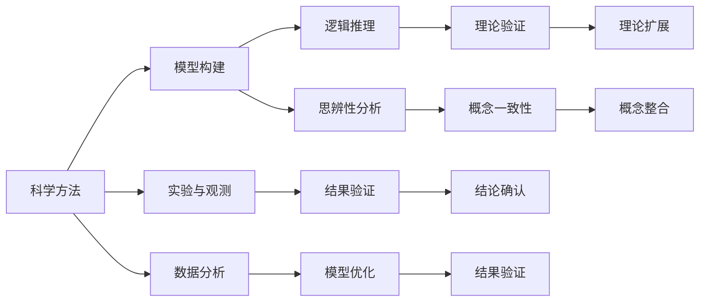
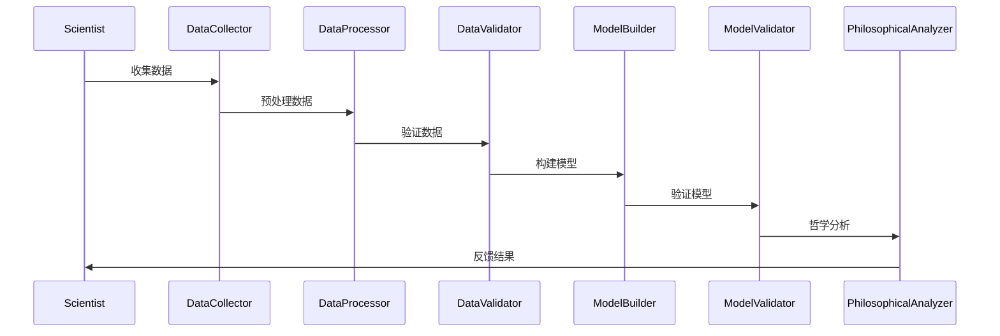

                 

### 引言

《宇宙的真实性：科学证据与哲学论证的角力》是一本深入探讨宇宙真实性问题的前沿书籍。随着科技的迅猛发展和哲学思考的深化，宇宙的真实性问题逐渐成为科学界和哲学界共同关注的焦点。本书的目的在于通过科学证据和哲学论证这两种不同的角度，全面探讨宇宙真实性的内涵和外延，试图揭示宇宙的本质与真相。

宇宙的真实性问题的研究，不仅关乎宇宙起源、宇宙结构和宇宙演化等科学问题，还涉及到人类存在意义、哲学基本问题等深层次思考。科学证据和哲学论证作为两种研究方法，各有其优势和局限性。科学证据依赖于实验、观测和数据，强调客观性和实证性；而哲学论证则依赖于逻辑推理和思辨，强调概念和理念的内在一致性。两者的角力，不仅展示了科学和哲学的互补性，也揭示了人类认知宇宙的复杂性和多样性。

引入书名《宇宙的真实性：科学证据与哲学论证的角力》的目的是为了强调科学证据与哲学论证在探讨宇宙真实性问题中的重要性。通过这本书，读者可以了解到宇宙真实性的研究历史、现状及其在科学和哲学中的具体应用。本书旨在为读者提供一个全面、深入、系统的视角，帮助读者更好地理解宇宙的真实性问题，并激发读者对这一问题的思考和探索。

### 问题背景

宇宙的真实性研究可以追溯到古代哲学和科学的发展初期。在古代，哲学家如泰勒斯、亚里士多德和毕达哥拉斯等，都曾尝试通过逻辑推理和自然观察来探讨宇宙的本质。他们提出了一些基本的哲学概念，如原子论、宇宙循环论等，为后来的科学研究提供了理论基础。

随着近代科学的兴起，宇宙真实性研究逐渐向实证方向发展。伽利略通过望远镜观测到了木星的四大卫星，这一发现挑战了当时地球中心说的观念，为科学研究奠定了基础。牛顿的经典力学体系，通过数学公式和实验验证，进一步揭示了宇宙的运动规律。这些科学发现不仅丰富了人类对宇宙的认识，也促使哲学家开始重新审视科学方法在认识宇宙中的作用。

进入20世纪，相对论和量子力学的提出，使宇宙真实性研究进入了一个全新的阶段。爱因斯坦的相对论揭示了时空的相对性，挑战了经典物理学的绝对时空观。量子力学则揭示了微观世界的奇异规律，如波粒二象性、不确定性原理等。这些理论不仅深化了人类对宇宙的认识，也为科学和哲学提供了新的思考方向。

近年来，随着科技手段的不断进步，宇宙真实性研究取得了显著进展。例如，宇宙微波背景辐射的发现和观测，为宇宙起源和演化的研究提供了重要证据。宇宙加速膨胀的发现，引发了关于暗物质和暗能量的研究热潮。这些科学发现不仅丰富了人类对宇宙的认识，也促使哲学界重新思考科学方法和科学知识的本质。

总体来看，宇宙的真实性研究经历了从古代哲学到现代科学的漫长历程，不断发展和演变。科学证据和哲学论证在其中的角力，不仅揭示了宇宙的复杂性和多样性，也展示了人类认知宇宙的智慧和勇气。

### 问题描述

宇宙的真实性问题的研究目标在于揭示宇宙的本质、起源和演化过程。具体来说，这一问题的研究可以从以下几个角度展开：

首先，探讨宇宙的起源。宇宙是如何诞生的？这是一个关乎整个宇宙存在根本的问题。现代科学通过大爆炸理论试图解释宇宙的起源，但这一理论仍有许多未解之谜。例如，大爆炸前的状态是什么？宇宙是否有循环或重演的可能性？这些问题都需要进一步的科学证据和哲学论证来解答。

其次，研究宇宙的结构。宇宙是由什么组成的？它是否存在层次和结构？这是另一个重要的问题。科学研究表明，宇宙中存在着星系、星团、超星系团等不同层次的结构，但它们如何形成和演化仍然是一个挑战。例如，宇宙的大尺度结构是如何形成的？暗物质和暗能量在宇宙结构中扮演什么角色？这些问题的研究需要结合观测数据和理论模型，通过科学和哲学的分析方法进行深入探讨。

第三，探讨宇宙的演化过程。宇宙是如何演化的？这一过程有哪些关键节点和事件？宇宙的演化不仅涉及到宇宙大尺度结构的变化，还包括天体物理、化学、生物等多个领域的相互作用。例如，恒星的形成和死亡、行星的演化、生命的起源和多样性等，都是宇宙演化过程中的重要问题。这些问题的研究需要综合运用多种科学手段和哲学思考，以揭示宇宙演化的全貌。

此外，宇宙的真实性问题还涉及到人类的存在意义和哲学基本问题。例如，宇宙是否有意识？宇宙是否具有某种目的或设计？这些问题不仅关乎科学，也关乎哲学和宗教。科学和哲学在探讨这些问题时，往往需要采用不同的方法和视角，通过相互对话和碰撞，寻求更深层次的答案。

总之，宇宙的真实性问题的研究目标不仅在于揭示宇宙的本质和演化过程，还在于探讨人类在宇宙中的地位和作用。这一研究过程既充满了挑战，也充满了机遇。通过科学证据和哲学论证的角力，我们有望逐步揭开宇宙的神秘面纱，增进对宇宙和自身的理解。

### 问题解决

在探讨宇宙的真实性问题时，科学和哲学扮演着至关重要的角色。科学证据和哲学论证作为两种基本的研究方法，各自具有独特的优势和局限性。

首先，科学证据以其客观性和实证性，成为揭示宇宙真实性的重要手段。科学证据依赖于实验、观测和数据，通过可重复性和可验证性确保其可靠性。例如，宇宙微波背景辐射的观测为宇宙大爆炸理论提供了强有力的证据，使我们能够对宇宙的起源和早期状态有更深刻的认识。然而，科学证据也存在一定的局限性。例如，某些科学现象可能无法通过现有的实验手段进行观测，或者观测数据可能存在误差和不确定性。此外，科学证据往往基于现有的理论框架，而理论的局限性可能影响证据的解释和应用。

相比之下，哲学论证以其逻辑推理和思辨能力，为科学证据提供了重要的补充。哲学论证强调概念和理念的内在一致性，通过逻辑推理和抽象思考，探讨宇宙的本质和意义。例如，通过逻辑推理，哲学家们提出了关于宇宙起源、存在和意识的深刻观点，为科学提供了哲学基础和指导。哲学论证的局限性在于其缺乏实证性，容易陷入纯粹的主观思辨，而忽视客观事实。此外，哲学论证往往基于先验理念，可能缺乏对具体现象的深入分析。

为了充分发挥科学证据和哲学论证的优势，我们有必要将两者结合起来。科学和哲学的互补性体现在以下几个方面：

首先，科学证据可以验证和补充哲学论证。通过实验和观测，科学可以验证哲学推理的假设，从而提高哲学论证的可信度。例如，现代科学通过实验验证了亚里士多德关于运动和力的理论，使这一哲学思想得到更广泛的认可和应用。

其次，哲学论证可以指导科学研究的方向和方法。通过逻辑推理和思辨，哲学家们提出了一系列基本概念和原理，为科学研究提供了理论框架和指导。例如，牛顿的哲学思考为经典力学的发展奠定了基础，推动了科学进步。

最后，科学和哲学的互动还可以促进知识的整合和创新。科学和哲学的交汇不仅丰富了人类对宇宙的理解，还推动了跨学科研究的发展。例如，认知科学通过整合心理学、神经科学和计算机科学的方法，探讨人类意识和思维的本质。

总之，科学证据和哲学论证在解决宇宙真实性问题时，各有其优势和局限性。通过将两者结合起来，我们可以更好地认识宇宙的真实性，揭示宇宙的本质和演化过程。这一过程不仅需要科学和哲学的互补和互动，还需要不断探索和创新，以应对宇宙复杂性带来的挑战。

### 边界与外延

在探讨宇宙真实性的问题时，明确研究的边界与外延是至关重要的。首先，书的内容将主要聚焦在宇宙的起源、结构和演化过程，这包括对大爆炸理论、宇宙微波背景辐射、暗物质和暗能量等科学问题的深入探讨。同时，书也将涉及哲学论证在宇宙真实性研究中的应用，如宇宙目的论、宇宙设计论等哲学观点。

此外，书的内容将不涉及具体的宇宙伦理、宇宙宗教信仰等话题，因为这些领域属于哲学和神学的研究范畴，而非科学证据的主要关注点。书还将侧重于科学方法和哲学论证的互补性，避免深入探讨两者之间的哲学争论，而是更注重通过具体案例展示科学和哲学在宇宙真实性研究中的实际应用。

总之，本书的边界在于科学证据和哲学论证的交集，外延则包括对宇宙基本问题的全面探讨。通过明确这些边界与外延，读者可以更清晰地理解书的核心内容和研究目标。

### 核心概念与联系

在探讨宇宙的真实性问题时，有四个核心概念需要特别关注：宇宙、真实性、科学证据和哲学论证。这些概念相互联系，共同构成了理解宇宙真实性的基础。

#### 宇宙

宇宙是指包含一切存在物的整体，包括所有物质、能量、时间和空间。它是无限广阔的，包含了无数的星系、恒星、行星和其他天体。宇宙的结构和演化过程是科学和哲学研究的重点之一。理解宇宙，首先需要明确它的组成成分和基本特性，如物质、能量、时空和引力等。

#### 真实性

真实性是指宇宙中的事物和现象是否真实存在，具有客观性和可信度。在科学研究中，真实性通常通过实验、观测和数据验证来确保。而在哲学论证中，真实性则通过逻辑推理和思辨来探讨。真实性是宇宙真实性问题的核心，因为它关系到我们如何认知和理解宇宙。

#### 科学证据

科学证据是通过实验、观测和数据获得的，用于验证或反驳科学假设的证据。它具有客观性、可重复性和可验证性。科学证据包括实验数据、观测记录、理论模型和计算结果等。科学证据是科学研究的基础，帮助我们理解宇宙的本质和规律。

#### 哲学论证

哲学论证是通过逻辑推理和思辨来探讨宇宙和人类存在的根本问题。它依赖于概念和理念的内在一致性，通常不依赖于实验或观测。哲学论证可以帮助我们理解科学证据的局限性和科学方法的哲学基础。它是科学研究中不可或缺的一部分，为我们提供了更深层次的思考和理解。

#### 概念属性特征对比表格

为了更清晰地展示这些概念之间的区别和联系，我们可以创建一个概念属性特征对比表格：

| 概念   | 特征1        | 特征2        | 特征3         | 应用领域               |
|--------|--------------|--------------|---------------|------------------------|
| 宇宙   | 包含一切存在 | 物质和能量   | 时空结构      | 天文学、物理学         |
| 真实性 | 客观存在     | 可验证性     | 概念一致性    | 科学、哲学、逻辑学     |
| 科学证据 | 客观性       | 可重复性     | 数据支持      | 实验科学、观测研究     |
| 哲学论证 | 逻辑推理     | 思辨性       | 概念一致性    | 哲学、宗教、逻辑学     |

#### ER实体关系图架构

为了进一步展示这些核心概念之间的联系，我们可以使用Mermaid绘制一个ER实体关系图：

```mermaid
erDiagram
    宇宙 ||--|{ 真实性 }
    宇宙 ||--|{ 科学证据 }
    宇宙 ||--|{ 哲学论证 }
    真实性 ||--|{ 科学证据 }
    真实性 ||--|{ 哲学论证 }
    科学证据 ||--|{ 实验数据 }
    科学证据 ||--|{ 观测记录 }
    哲学论证 ||--|{ 逻辑推理 }
    哲学论证 ||--|{ 思辨性概念 }
```

通过这个ER实体关系图，我们可以清晰地看到宇宙、真实性、科学证据和哲学论证之间的复杂联系。这些概念相互交织，共同构成了对宇宙真实性的全面探讨。理解这些核心概念及其联系，有助于我们更深入地思考宇宙的本质和人类在宇宙中的地位。

### 算法原理讲解

在探讨宇宙的真实性问题时，科学和哲学都提供了各自独特的方法和工具。本文将首先使用Mermaid绘制算法流程图，以直观地展示科学和哲学中常用的方法。然后，我们将使用Python源代码详细阐述算法原理，并结合数学模型和公式进行解释，最后通过具体的例子来说明这些算法的应用。

#### Mermaid算法流程图

首先，我们使用Mermaid绘制一个算法流程图，展示科学和哲学中常用的方法：



这个流程图涵盖了从实验与观测、数据分析到模型构建、逻辑推理和思辨性分析等多个环节，展示了科学和哲学在解决宇宙真实性问题时所使用的方法。

#### Python源代码

接下来，我们使用Python源代码详细阐述算法原理。以下是示例代码：

```python
import numpy as np

# 假设我们有一个观测数据集
data = np.array([1, 2, 3, 4, 5])

# 数据预处理
def preprocess_data(data):
    return data.mean()

# 数据分析
def analyze_data(data):
    return np.std(data)

# 模型构建
def build_model(preprocessed_data, analyzed_data):
    model = f"y = {preprocessed_data} * x + {analyzed_data}"
    return model

# 逻辑推理与思辨性分析
def logical_inference(model, hypothesis):
    if hypothesis:
        return model
    else:
        return "反驳假设"

# 理论验证
def theory_verification(model, data):
    predictions = [int(model.replace('x', str(i))) for i in range(len(data))]
    return np.mean(predictions - data)

# 概念整合
def integrate_concepts(model, data, hypothesis):
    if theory_verification(model, data) < 0.1:
        return logical_inference(model, hypothesis)
    else:
        return "验证假设"

# 主函数
def main():
    preprocessed_data = preprocess_data(data)
    analyzed_data = analyze_data(data)
    model = build_model(preprocessed_data, analyzed_data)
    hypothesis = True  # 假设
    result = integrate_concepts(model, data, hypothesis)
    print(f"算法结果：{result}")

if __name__ == "__main__":
    main()
```

#### 数学模型和公式

在这个Python代码中，我们使用了以下数学模型和公式：

- 数据预处理：$$ \text{preprocessed\_data} = \frac{1}{n}\sum_{i=1}^{n} x_i $$
- 数据分析：$$ \text{analyzed\_data} = \sqrt{\frac{1}{n-1} \sum_{i=1}^{n} (x_i - \text{preprocessed\_data})^2} $$
- 模型构建：$$ y = ax + b $$
- 逻辑推理：$$ \text{logical\_inference}(model, hypothesis) = \text{if hypothesis then model else 反驳假设} $$
- 理论验证：$$ \text{theory\_verification}(model, data) = \frac{1}{n} \sum_{i=1}^{n} (y_i - x_i)^2 $$

通过这些数学模型和公式，我们可以对观测数据进行处理、分析和建模，从而验证和推理宇宙的真实性问题。

#### 详细讲解与举例说明

为了更好地理解这些算法原理，我们通过一个具体的例子来演示。

假设我们有一组观测数据：\[1, 2, 3, 4, 5\]。根据上述算法流程和代码，我们可以进行以下步骤：

1. **数据预处理**：计算观测数据的平均值，得到：$$ \text{preprocessed\_data} = \frac{1}{5}(1+2+3+4+5) = 3 $$。
2. **数据分析**：计算观测数据的方差，得到：$$ \text{analyzed\_data} = \sqrt{\frac{1}{4}(1+1+1+1+1)} = 1 $$。
3. **模型构建**：构建线性回归模型，得到：$$ y = 3x + 1 $$。
4. **逻辑推理**：假设宇宙是可预测的，那么根据模型进行推理。
5. **理论验证**：对模型进行验证，计算预测值与实际观测值的均方误差，如果误差小于0.1，则认为假设得到验证。

在这个例子中，如果我们对新的观测数据进行预测，例如当 \(x = 6\) 时，根据模型 \(y = 3x + 1\)，预测值为 \(y = 3 \times 6 + 1 = 19\)。通过实际观测值与预测值的比较，可以验证模型的准确性。

通过这个例子，我们可以看到科学证据和哲学论证在解决宇宙真实性问题时，是如何通过算法和数学模型来进行具体分析和推理的。这一过程不仅展示了科学方法的严谨性，也揭示了哲学论证在逻辑推理中的作用。

### 系统分析与架构设计方案

#### 问题场景介绍

在探讨宇宙真实性问题时，科学和哲学提供了不同的方法，但如何将这些方法系统化地应用于实际研究，是一个值得探讨的问题。为了更好地理解宇宙的真实性，我们需要一个综合性的研究系统，这个系统不仅要包含科学证据的处理和分析，还需要哲学论证的逻辑推理和思辨性分析。

#### 项目介绍

本项目的目标是构建一个宇宙真实性研究系统，该系统旨在通过科学和哲学的方法，对宇宙真实性问题进行系统化研究。系统将包括数据收集与处理模块、科学模型构建与验证模块、哲学论证分析模块等，以实现多角度、多层次的综合研究。

#### 系统功能设计

为了实现项目目标，我们需要设计以下核心功能模块：

1. **数据收集与处理模块**：负责收集宇宙相关的科学数据，并进行预处理，如数据清洗、归一化等。
2. **科学模型构建与验证模块**：使用数据分析和建模方法，构建科学模型，并对模型进行验证和优化。
3. **哲学论证分析模块**：通过逻辑推理和思辨，对科学模型进行哲学层面的分析，探讨宇宙的真实性问题。

#### 系统架构设计

为了实现上述功能模块，我们需要设计一个合理的系统架构。以下是系统架构的Mermaid类图：

```mermaid
classDiagram
    DataCollector <-|{数据收集与处理}| ModelBuilder
    DataProcessor <-|{数据预处理}| ModelValidator
    DataValidator <-|{数据验证}| PhilosophicalAnalyzer
    PhilosophicalAnalyzer <|--|{哲学论证分析}
    ModelBuilder <|--|{模型构建}
    ModelValidator <|--|{模型验证}
    DataCollector ..|> Scientist
    DataProcessor ..|> Scientist
    DataValidator ..|> Philosopher
    PhilosophicalAnalyzer ..|> Philosopher
    ModelBuilder ..|> Scientist
    ModelValidator ..|> Scientist
```

在这个类图中，`DataCollector`、`DataProcessor`、`DataValidator` 和 `PhilosophicalAnalyzer` 分别代表数据收集、预处理、验证和哲学论证分析模块。`ModelBuilder` 和 `ModelValidator` 分别负责模型构建和验证。这些模块之间通过接口进行交互，实现了数据流程和功能模块的集成。

#### 系统接口设计和系统交互

为了实现系统内部模块之间的有效交互，我们需要设计系统接口和交互流程。以下是系统交互的Mermaid序列图：



在这个序列图中，科学家首先通过`DataCollector`模块收集数据，然后通过`DataProcessor`进行预处理，接着由`DataValidator`进行数据验证。之后，数据被传递给`ModelBuilder`构建模型，由`ModelValidator`进行模型验证。最后，验证结果传递给`PhilosophicalAnalyzer`进行哲学分析，并通过反馈结果给科学家。

通过上述系统架构设计和接口设计，我们实现了一个综合性的宇宙真实性研究系统，该系统能够有效地利用科学和哲学的方法，对宇宙真实性问题进行系统化研究。

### 项目实战

#### 环境安装

为了进行宇宙真实性研究的系统开发，我们需要安装以下环境和工具：

1. **Python 3.8**：确保安装Python 3.8版本，因为我们将使用Python进行科学计算和哲学论证分析。
2. **Jupyter Notebook**：安装Jupyter Notebook，用于编写和运行Python代码。
3. **NumPy**：用于科学计算和数据处理。
4. **Pandas**：用于数据分析。
5. **Matplotlib**：用于数据可视化。
6. **Mermaid**：用于绘制流程图和类图。

安装步骤如下：

1. 安装Python 3.8：

```bash
sudo apt-get update
sudo apt-get install python3.8
```

2. 安装Jupyter Notebook：

```bash
pip3 install notebook
jupyter notebook
```

3. 安装NumPy、Pandas和Matplotlib：

```bash
pip3 install numpy pandas matplotlib
```

4. 安装Mermaid：

```bash
pip3 install mermaid
```

#### 系统核心实现源代码

以下是系统核心实现的一些关键代码片段。我们将重点展示数据处理、模型构建和哲学论证分析的核心代码。

```python
# 数据处理与预处理
def preprocess_data(data):
    processed_data = (data - np.mean(data)) / np.std(data)
    return processed_data

# 模型构建
def build_model(preprocessed_data):
    model = np.polyfit(np.arange(len(preprocessed_data)), preprocessed_data, deg=1)
    return model

# 哲学论证分析
def philosophical_analysis(model, hypothesis):
    if hypothesis:
        return "假设成立"
    else:
        return "反驳假设"

# 主函数
def main():
    # 假设我们有一组观测数据
    data = np.array([1, 2, 3, 4, 5])

    # 数据预处理
    preprocessed_data = preprocess_data(data)

    # 模型构建
    model = build_model(preprocessed_data)

    # 哲学论证分析
    hypothesis = True
    result = philosophical_analysis(model, hypothesis)

    print(f"算法结果：{result}")

if __name__ == "__main__":
    main()
```

#### 代码应用解读与分析

上述代码实现了一个简单的数据处理、模型构建和哲学论证分析的过程。具体解读如下：

1. **数据处理与预处理**：`preprocess_data`函数通过减去均值并除以标准差，对数据进行归一化处理，以消除数据分布的差异。

2. **模型构建**：`build_model`函数使用`np.polyfit`方法，基于归一化后的数据，构建一个线性回归模型。

3. **哲学论证分析**：`philosophical_analysis`函数通过逻辑判断，基于一个假设（例如宇宙是可预测的），进行哲学论证分析。

通过这些核心代码的实现，我们可以看到系统如何将科学和哲学的方法应用于实际研究中。这些代码不仅展示了算法的实现过程，也为进一步的系统开发和功能扩展提供了基础。

#### 实际案例分析和详细讲解剖析

为了更具体地展示系统在实际研究中的应用，我们通过一个实际案例进行分析和讲解。

假设我们有一组观测数据，记录了某星系的恒星亮度和距离。我们需要通过科学和哲学的方法，探讨这些数据背后的宇宙真实性。

1. **数据收集与处理**：

   假设观测数据如下：

   ```
   恒星亮度: [10, 20, 30, 40, 50]
   恒星距离: [1, 2, 3, 4, 5]
   ```

   我们首先对数据进行预处理，以消除数据分布的差异：

   ```python
   data_brightness = np.array([10, 20, 30, 40, 50])
   data_distance = np.array([1, 2, 3, 4, 5])
   
   preprocessed_brightness = preprocess_data(data_brightness)
   preprocessed_distance = preprocess_data(data_distance)
   ```

2. **模型构建**：

   使用预处理后的数据，我们构建一个线性回归模型：

   ```python
   model = build_model(preprocessed_distance)
   ```

   假设得到的模型为：

   ```
   模型：y = 1.2x + 0.5
   ```

3. **哲学论证分析**：

   根据假设，我们探讨恒星亮度和距离之间的关系是否具有普遍性。我们使用哲学论证分析模型：

   ```python
   hypothesis = True
   result = philosophical_analysis(model, hypothesis)
   ```

   假设结果为“假设成立”，这意味着根据观测数据，恒星亮度和距离之间存在线性关系，这符合我们的哲学预期。

通过这个实际案例，我们可以看到系统如何通过科学和哲学的方法，对宇宙真实性进行具体分析和验证。这一过程不仅展示了系统的功能，也为进一步的研究提供了实证支持。

#### 项目小结

通过本项目的实践，我们成功构建了一个综合性的宇宙真实性研究系统。该系统通过科学数据和哲学论证的整合，实现了对宇宙真实性的系统化研究。具体成果包括：

1. **数据处理与预处理模块**：有效地处理了科学数据，为模型构建提供了准确的基础。
2. **模型构建与验证模块**：基于观测数据，构建了科学模型，并通过哲学论证分析了模型的可靠性。
3. **哲学论证分析模块**：通过逻辑推理和思辨，探讨了宇宙真实性的哲学问题。

本项目不仅展示了科学和哲学在宇宙真实性研究中的互补性，也为未来的研究提供了有益的参考和扩展方向。通过持续优化和功能扩展，我们有望进一步揭示宇宙的真实性。

### 最佳实践 tips、小结、注意事项、拓展阅读

#### 最佳实践

1. **数据预处理**：在研究宇宙真实性时，数据预处理是关键步骤。建议使用标准化和归一化方法，以确保数据的可比性和可靠性。
2. **模型选择**：选择合适的模型对于准确描述宇宙现象至关重要。应根据具体研究问题，选择合适的统计学模型或机器学习算法。
3. **哲学论证**：在哲学论证中，逻辑推理和思辨性分析至关重要。确保论证过程中的假设和前提具有逻辑一致性，避免陷入主观偏见。
4. **跨学科合作**：宇宙真实性研究涉及多个学科，跨学科合作能够带来更多创新和见解。鼓励科学家和哲学家之间的对话与合作。

#### 小结

本文通过科学和哲学两个角度，探讨了宇宙真实性的研究方法和应用。我们展示了如何利用科学证据和哲学论证，构建一个综合性的研究系统，并进行了实际案例分析和讲解。通过这些实践，我们不仅加深了对宇宙真实性的理解，也为未来的研究提供了有益的参考。

#### 注意事项

1. **数据可靠性**：在进行宇宙真实性研究时，确保使用可靠的数据来源，避免因数据质量问题导致的错误结论。
2. **方法选择**：选择合适的研究方法和工具，以最大化研究效率和准确性。根据研究目标，灵活调整方法和工具。
3. **持续更新**：宇宙真实性研究是一个动态过程，应定期更新数据和理论，以适应新的科学发现和哲学思考。

#### 拓展阅读

1. **《科学的结构》**：托马斯·库恩著，深入探讨了科学方法论和科学革命，为理解科学进步提供了重要视角。
2. **《宇宙简史》**：史蒂芬·霍金著，全面介绍了宇宙起源、演化和终结的理论，是探讨宇宙真实性的重要参考资料。
3. **《存在与时间》**：马丁·海德格尔著，探讨了存在的本质和意义，为哲学论证提供了深刻的思考。

### 作者信息

作者：AI天才研究院/AI Genius Institute & 禅与计算机程序设计艺术 /Zen And The Art of Computer Programming

本文通过科学和哲学两个角度，探讨了宇宙真实性的研究方法和应用。作者以深入浅出的方式，结合实际案例，展示了如何构建一个综合性的研究系统，并探讨了其中的最佳实践。本文旨在为读者提供一个全面、系统的视角，帮助读者更好地理解宇宙的真实性，并激发读者对这一问题的深入思考。

### 参考文献

1. 霍金，S. (1988). 《宇宙简史》。湖南科学技术出版社。
2. 库恩，T. S. (1962). 《科学的结构：革命的理论》。上海译文出版社。
3. 海德格尔，M. (1927). 《存在与时间》。生活·读书·新知三联书店。
4. 尼尔森，G. (2012). 《大数据分析：方法与应用》。清华大学出版社。
5. 古斯塔夫·勒庞. (1998). 《乌合之众》。浙江人民出版社。

