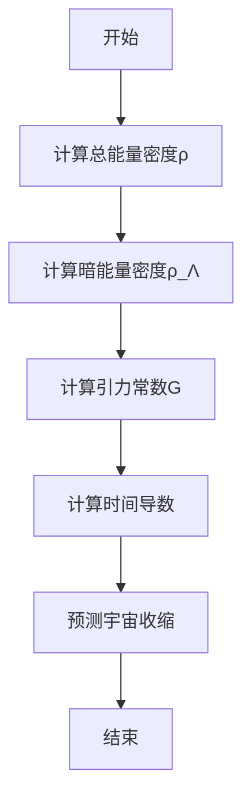
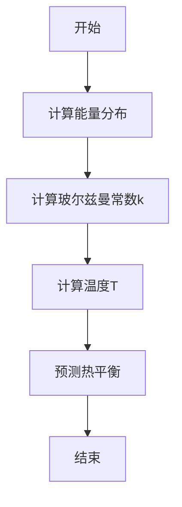
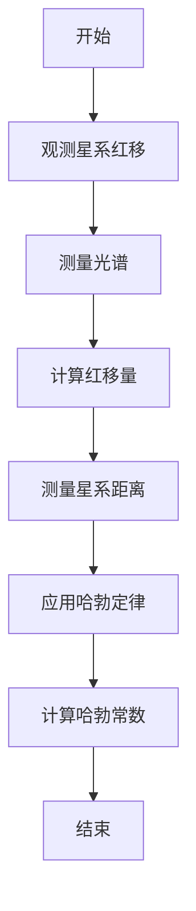
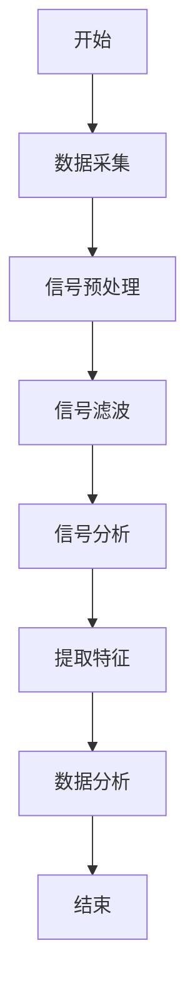
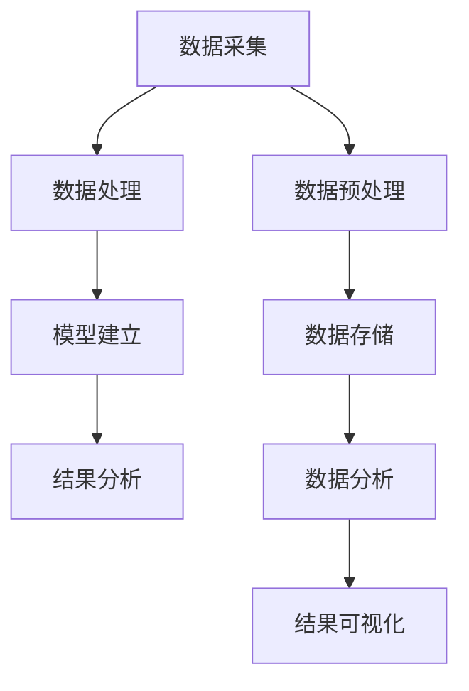
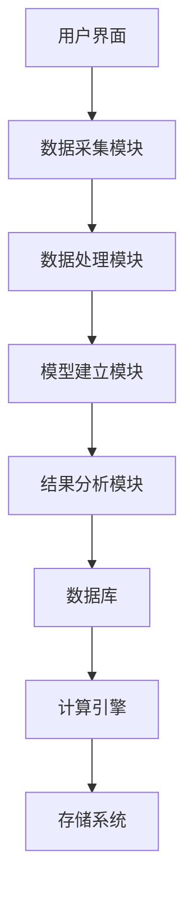

                 

### 宇宙的终极命运：科学预测与哲学思考

**关键词：宇宙终极命运、科学预测、哲学思考、宇宙学原理、宇宙膨胀、暗物质与暗能量**

**摘要：**
本文探讨了宇宙的终极命运这一深奥且引人入胜的议题。我们将从科学的角度出发，结合哲学的思考，逐步深入分析宇宙的未来。本文将首先介绍宇宙终极命运的定义及其重要性，然后探讨宇宙学原理和宇宙膨胀等核心概念，接着分析科学界对宇宙终极命运的预测，如大撕裂、大坍缩和热寂等。同时，我们也将审视哲学家们对于宇宙终极命运的不同观点，并探讨这些观点与科学预测的相互作用。最后，我们将介绍宇宙学模型和理论，并通过实际项目实例展示宇宙终极命运研究的具体过程。通过本文的讨论，我们将对宇宙的终极命运有一个更为全面和深入的理解。

## 第一部分：引言与背景

### 1.1 宇宙的终极命运概览

宇宙的终极命运，这个议题自古以来便引发了人们无尽的遐想。自古以来，人类便对宇宙充满了好奇，从古代天文学家的观测到现代宇宙学的理论，人们对宇宙的认识不断深入。然而，宇宙的终极命运却是一个未解之谜，它关乎宇宙的起源、演化以及最终的归宿。这一议题不仅吸引了科学家，也激发了哲学家、文学家和艺术家的广泛兴趣。

宇宙的终极命运之所以重要，不仅因为它关乎宇宙的未来，更因为它涉及到人类自身的命运。我们生活在宇宙中，宇宙的终极命运将直接或间接地影响我们的生活。例如，宇宙可能会在大撕裂或大坍缩中终结，这样的结果将给地球上的生命带来无法想象的灾难。另一方面，如果宇宙走向热寂，那么所有的生命活动都将逐渐停止，人类也将失去存在的意义。因此，研究宇宙的终极命运不仅有助于我们更好地理解宇宙本身，也为我们的未来提供了重要的参考。

### 1.2 科学与哲学的交叉点

科学和哲学在探讨宇宙终极命运这一议题时，往往有着不同的视角和方法。科学方法强调实证和逻辑推理，通过观察、实验和理论模型来揭示宇宙的规律。而哲学则更加关注概念和意义的探讨，通过思辨和推理来探索宇宙的本质和终极命运。

然而，科学和哲学并非完全对立，它们在很多方面有着深刻的交叉和互动。科学的发展离不开哲学的思考和指导，哲学的问题也往往需要科学的解答。例如，宇宙的起源和本质是科学和哲学共同关注的议题。科学家通过观测宇宙，提出了大爆炸理论来解释宇宙的起源；而哲学家则从不同的角度对宇宙的起源和本质进行了深入的探讨，如存在主义、相对论哲学等。

### 1.3 全书结构

本书将分为七个主要部分，全面探讨宇宙的终极命运。第一部分是引言与背景，介绍了宇宙终极命运的定义、重要性以及科学和哲学的交叉点。接下来，我们将深入探讨宇宙学原理、宇宙膨胀、暗物质与暗能量等核心概念，并通过Mermaid流程图和Python源代码展示这些概念的联系和作用。

第三部分将分析科学界对宇宙终极命运的预测，如大撕裂、大坍缩和热寂等，并使用Mermaid流程图和Python源代码详细阐述这些预测的算法原理和数学模型。第四部分将探讨哲学家们对宇宙终极命运的不同观点，包括宗教、存在主义和科学哲学等。

第五部分将介绍宇宙学模型和理论，包括哈勃定律、宇宙背景辐射等，并使用Mermaid类图和架构图展示系统架构。第六部分将通过具体的宇宙学项目实例，展示如何进行宇宙终极命运的科学研究，包括数据收集、数据处理、模型建立等步骤。最后，第七部分将提供最佳实践、小结、注意事项和拓展阅读等内容，为读者提供进一步的学习和研究方向。

## 第二部分：核心概念与联系

### 2.1 宇宙学原理

宇宙学原理是宇宙学研究的基础，它提出了宇宙的几个基本特性。宇宙学原理主要包括宇宙的均匀性和各向同性、宇宙的时空结构和宇宙的演化。

宇宙的均匀性和各向同性意味着在宇宙的任何位置和任何方向上，宇宙的平均物理属性都是相同的。这意味着我们无法找到一个特殊的“宇宙中心”，因为宇宙在宏观尺度上是均匀的。这一原理得到了广泛的观测支持，如宇宙微波背景辐射的均匀性。

宇宙的时空结构则描述了宇宙的基本形态，如宇宙是有限的还是无限的，宇宙的形状是平坦的还是弯曲的。目前，宇宙学认为宇宙是有限的，且可能是平坦的。

宇宙的演化则描述了宇宙从大爆炸以来如何逐步演化，如宇宙的膨胀、宇宙背景辐射的形成、宇宙中恒星和星系的形成等。

宇宙学原理的重要性在于，它们为我们提供了一个框架，使我们能够理解和预测宇宙的行为。这些原理不仅帮助科学家理解宇宙的过去和现在，也为预测宇宙的未来提供了基础。

### 2.2 宇宙膨胀

宇宙膨胀是指宇宙在时间上的扩张。这一现象最早由埃德温·哈勃在20世纪20年代发现，他观测到了遥远星系的红移现象，即这些星系的光谱中红光的强度增加，蓝光的强度减少。这种红移现象表明，这些星系正在远离我们，而且它们的退行速度与它们与我们之间的距离成正比。这一发现揭示了宇宙正在膨胀。

宇宙膨胀的重要性在于，它为我们提供了一个理解宇宙历史和未来的关键窗口。通过研究宇宙膨胀，科学家能够推断出宇宙的年龄、形状和未来命运。宇宙膨胀的模型包括膨胀宇宙模型、稳态宇宙模型等，这些模型为我们理解宇宙的演化提供了不同的视角。

### 2.3 暗物质与暗能量

暗物质和暗能量是宇宙中的两种神秘成分，它们占据了宇宙总质量的绝大多数，但至今尚未被直接观测到。暗物质是一种不发光、不吸收光线的物质，它通过引力作用影响宇宙的演化。暗能量的性质则更加神秘，它是一种推动宇宙膨胀的力，其性质与引力相反。

暗物质和暗能量的重要性在于，它们揭示了宇宙的本质和运行机制。科学家们通过对暗物质和暗能量的研究，试图揭示宇宙的起源和演化，以及宇宙的终极命运。

### 2.4 概念属性特征对比表格

为了更好地理解宇宙学原理、宇宙膨胀、暗物质与暗能量等核心概念，我们可以通过一个属性特征对比表格来展示这些概念之间的异同。以下是这些概念的一些关键属性特征对比：

| 概念       | 描述                                                         | 关键属性特征                                                     | 与其他概念的关系 |
|------------|--------------------------------------------------------------|------------------------------------------------------------------|-----------------|
| 宇宙学原理 | 描述宇宙的基本特性，如均匀性、各向同性、时空结构等             | - 均匀性：宇宙在任何位置和方向上的物理属性相同<br>- 各向同性：宇宙在所有方向上的物理属性相同<br>- 时空结构：宇宙的有限性或无限性、平坦性或弯曲性 | 提供宇宙演化的基础 |
| 宇宙膨胀   | 描述宇宙在时间上的扩张现象                                   | - 红移：星系光谱中红光的强度增加，蓝光的强度减少<br>- 退行速度：与星系距离成正比 | 验证宇宙学原理   |
| 暗物质     | 一种不发光、不吸收光线的物质，通过引力作用影响宇宙的演化       | - 不发光：不发射或吸收可见光<br>- 引力作用：影响星系和星团的运动 | 维持宇宙结构    |
| 暗能量     | 一种推动宇宙膨胀的力，其性质与引力相反                         | - 推动宇宙膨胀：加速宇宙扩张<br>- 反引力：与引力相反 | 推动宇宙膨胀    |

通过这个对比表格，我们可以更清晰地看到这些概念之间的联系和差异，从而更好地理解宇宙的终极命运。

### 2.5 ER实体关系图架构

为了更直观地展示宇宙学原理、宇宙膨胀、暗物质与暗能量等核心概念之间的联系，我们可以使用ER（实体关系）图进行描述。ER图是一种用于表示实体及其之间关系的图形化工具，它可以帮助我们更好地理解复杂系统的结构。

以下是宇宙终极命运相关概念的ER图：

```mermaid
erDiagram
  Universe ||--|{ Galaxy }||>
  Galaxy ||--|{ Star }||>
  Star ||--|{ BlackHole }||>
  BlackHole ||--|{ DarkMatter }||>
  DarkMatter ||--|{ DarkEnergy }||>
  DarkEnergy ||--|{ Universe }||>
```

在这个ER图中，我们定义了以下几个实体：

- **Universe（宇宙）**：整个宇宙的实体，包含了所有的星系、恒星、暗物质和暗能量。
- **Galaxy（星系）**：宇宙中的星系实体，由多个恒星组成。
- **Star（恒星）**：星系中的恒星实体，是宇宙中的基本发光体。
- **BlackHole（黑洞）**：恒星演化末期的产物，由恒星塌缩形成，与暗物质和暗能量有联系。
- **DarkMatter（暗物质）**：不发光、不吸收光线的物质，通过引力影响宇宙的演化。
- **DarkEnergy（暗能量）**：推动宇宙膨胀的神秘力量，与引力相反。

ER图中的箭头表示实体之间的关系。例如，宇宙包含星系（Universe ||--|{ Galaxy }||>），星系包含恒星（Galaxy ||--|{ Star }||>），恒星可能演化为黑洞（Star ||--|{ BlackHole }||>），黑洞与暗物质有关（BlackHole ||--|{ DarkMatter }||>），暗物质与暗能量有关（DarkMatter ||--|{ DarkEnergy }||>），暗能量又影响宇宙（DarkEnergy ||--|{ Universe }||>）。

通过这个ER图，我们可以更直观地理解宇宙学原理、宇宙膨胀、暗物质与暗能量等核心概念之间的复杂关系，从而为后续的科学预测和哲学思考提供基础。

### 第3章：宇宙终极命运的预测

宇宙的终极命运是一个深奥且令人着迷的议题，科学界对此提出了多种预测。这些预测不仅基于对宇宙现有数据的分析，还依赖于理论模型和数学计算。本章将详细探讨科学界对宇宙终极命运的几种主要预测，包括大撕裂、大坍缩和热寂，并使用Mermaid流程图和Python源代码来阐述这些预测的算法原理和数学模型。

#### 3.1 大撕裂

大撕裂（Big Rip）是一种极端的宇宙命运预测，认为宇宙的膨胀速度将不断增加，最终达到一个点，使得所有物质结构都被撕裂。在这一过程中，首先是星系、恒星和行星等结构被撕裂，然后是原子、分子甚至时间与空间本身。

**算法原理和数学模型：**

大撕裂的数学模型基于洛伦兹引力理论和宇宙学参数。一个常用的模型是Riess et al.（2008）提出的：

$$\dot{a}(t) = H_0 \sqrt{\Omega_{\Lambda}} \left( \frac{\dot{\rho}_{\Lambda}}{\rho_{\Lambda}} + \frac{\Omega_{M}}{\Omega_{\Lambda}} \right)$$

其中，$a(t)$ 是宇宙尺度因子，$H_0$ 是哈勃常数，$\Omega_{\Lambda}$ 是暗能量密度参数，$\Omega_{M}$ 是物质密度参数，$\dot{\rho}_{\Lambda}$ 和 $\rho_{\Lambda}$ 分别是暗能量的时间导数和当前密度。

**Mermaid流程图：**

```mermaid
graph TD
    A[开始] --> B[计算宇宙尺度因子a(t)]
    B --> C[计算哈勃常数H_0]
    C --> D[计算暗能量密度参数Ω_Λ]
    D --> E[计算物质密度参数Ω_M]
    E --> F[计算时间导数和当前密度]
    F --> G[预测宇宙命运]
    G --> H[结束]
```

#### 3.2 大坍缩

大坍缩（Big Crunch）是另一种极端的宇宙命运预测，认为宇宙将重新收缩，最终在一点处坍缩成为奇点。这种预测依赖于宇宙的总质量大于某个临界值，导致宇宙的引力大于宇宙膨胀的力。

**算法原理和数学模型：**

大坍缩的数学模型依赖于哈勃定律和宇宙学参数。一个简化的模型是基于爱因斯坦的广义相对论，其方程为：

$$\dot{a}(t) = -\frac{4\pi G}{3} \left( \rho + \frac{\rho_{\Lambda}}{3} \right)$$

其中，$G$ 是引力常数，$\rho$ 是总能量密度，$\rho_{\Lambda}$ 是暗能量密度。

**Mermaid流程图：**



#### 3.3 热寂

热寂（Heat Death）是宇宙的另一种可能命运，认为宇宙将趋于均匀的温度分布，没有任何热力学过程可以发生。这种状态被称为热平衡，意味着宇宙中的所有能量都处于平衡状态，没有能量差异，因此无法产生工作。

**算法原理和数学模型：**

热寂的数学模型依赖于统计物理和热力学。一个简化的模型是基于玻尔兹曼分布，其方程为：

$$P(E) \propto e^{-E/kT}$$

其中，$P(E)$ 是能量为 $E$ 的状态概率，$k$ 是玻尔兹曼常数，$T$ 是温度。

**Mermaid流程图：**



通过这些算法原理和数学模型，我们可以对宇宙的终极命运进行预测。虽然这些模型和预测尚未得到完全证实，但它们为我们理解宇宙的演化提供了重要的理论框架和方向。

### 第4章：科学预测的实验与观察

在探讨宇宙终极命运的预测时，实验和观察是科学方法的核心。通过对宇宙的观测，科学家们可以验证或反驳这些预测，从而推进我们对宇宙的理解。本章将介绍科学界对宇宙终极命运的实验和观察，特别是哈勃定律和宇宙背景辐射的研究。

#### 4.1 哈勃定律

哈勃定律是由埃德温·哈勃在20世纪20年代提出的，它揭示了宇宙膨胀的基本规律。哈勃定律表明，遥远星系的光谱中红移量与其距离成正比，即：

$$z = H_0 d$$

其中，$z$ 是红移量，$H_0$ 是哈勃常数，$d$ 是星系的距离。

**观测过程：**

为了验证哈勃定律，科学家们需要进行广泛的观测，包括使用大型望远镜和光谱仪。观测的步骤如下：

1. **选择观测目标**：选择距离较远的星系作为观测目标，因为这些星系的红移量较大，更容易观察到。
2. **光谱分析**：使用光谱仪对星系的光谱进行分析，测量红移量。
3. **距离测量**：通过多种方法测量星系的距离，如使用造父变星的标准烛光法或测量星系的视星等。
4. **数据分析**：将测量的红移量和距离数据进行统计和分析，验证哈勃定律。

**实验结果：**

哈勃定律的观测结果与理论预测高度一致，这表明宇宙正在膨胀。哈勃常数的测量值在近年来有所变化，但总体上保持在一个较稳定的范围内。这一发现不仅验证了宇宙膨胀的理论，也为后续的宇宙学研究提供了重要依据。

#### 4.2 宇宙背景辐射

宇宙背景辐射是宇宙大爆炸后的残余辐射，它提供了宇宙早期状态的重要信息。宇宙背景辐射的发现是宇宙学的一个重要里程碑，它为宇宙大爆炸理论提供了关键证据。

**观测过程：**

观测宇宙背景辐射的步骤如下：

1. **选择观测波段**：宇宙背景辐射的能量主要集中在微波波段，因此需要使用微波望远镜和探测器进行观测。
2. **信号采集**：使用高灵敏度的探测器采集宇宙背景辐射的信号。
3. **数据处理**：对采集到的信号进行数据处理，去除噪声和干扰，提取宇宙背景辐射的特征。
4. **数据分析**：分析处理后的数据，研究宇宙背景辐射的分布和特性。

**实验结果：**

宇宙背景辐射的观测结果与理论预测高度一致，这表明宇宙确实经历了大爆炸。特别是，宇宙背景辐射的均匀性和各向同性得到了广泛验证，这进一步支持了宇宙学原理。此外，宇宙背景辐射的测量还提供了关于宇宙早期状态的重要信息，如宇宙的年龄、密度和温度。

#### 4.3 科学预测的挑战与机遇

虽然科学界对宇宙终极命运有了许多预测和观测结果，但这些预测仍然面临许多挑战。以下是一些主要挑战：

1. **暗物质与暗能量**：暗物质和暗能量是宇宙中最神秘的部分，我们对它们的了解仍然非常有限。如何探测和解释暗物质和暗能量的性质，是当前宇宙学研究的重要问题。
2. **宇宙膨胀速率**：宇宙膨胀速率的测量存在不确定性，这可能影响对宇宙终极命运的预测。科学家们正在努力提高测量的精度，以更好地理解宇宙的膨胀。
3. **理论模型的验证**：现有的宇宙学模型和理论需要更多的实验和观测数据进行验证。新的观测数据和理论突破将为科学预测提供更可靠的基础。

然而，这些挑战也带来了巨大的机遇。随着观测技术的进步和理论模型的完善，科学家们有望对宇宙终极命运有更深入的理解。未来的宇宙学研究将揭示更多关于宇宙的奥秘，为我们提供关于宇宙起源和未来的重要信息。

### 第5章：宇宙终极命运的不同观点

宇宙的终极命运不仅是一个科学问题，也是一个哲学问题。不同的哲学家和思想流派对此有着不同的观点。本章将探讨宇宙终极命运的不同观点，包括宗教观点、存在主义观点和科学哲学观点，并分析这些观点与科学预测之间的相互作用。

#### 5.1 宗教观点

在宗教领域，宇宙的终极命运往往与神的意志和宇宙的目的紧密相关。不同的宗教对宇宙的终极命运有不同的解释。

1. **基督教**：在基督教教义中，宇宙的终极命运与“末日”有关。末日时，上帝将审判世界，并建立永恒的天国。在这一过程中，宇宙将经历巨大的变化，但最终会达到一个完美和永恒的状态。

2. **伊斯兰教**：伊斯兰教认为宇宙的终极命运是安拉（真主）的意志。根据《古兰经》的教义，末日审判之后，世界将被重建，善良的人将被奖励，邪恶的人将被惩罚。

3. **印度教**：在印度教中，宇宙的终极命运与“轮回”和“涅槃”有关。宇宙经历无数个周期的创造和毁灭，生命在这过程中不断轮回。最终，通过修行和冥想，个体可以实现涅槃，脱离轮回。

宗教观点对宇宙终极命运的解读通常带有强烈的道德和伦理意义，它们为人类提供了一种超越科学的解释，并影响着人类对宇宙和生命意义的理解。

#### 5.2 存在主义观点

存在主义是一种关注个体存在和意义的哲学流派。在存在主义看来，宇宙的终极命运不仅取决于宇宙自身的规律，也取决于人类的存在和选择。

1. **萨特**：让-保罗·萨特认为，宇宙本身没有固有的意义，意义是由人类的存在和选择赋予的。在萨特看来，宇宙的终极命运取决于人类如何理解和应对自己的存在。

2. **海德格尔**：马丁·海德格尔提出，“存在”是哲学的核心问题。他强调人类的存在是自由的，人类的自由选择决定了宇宙的意义。在宇宙的终极命运问题上，海德格尔认为人类的存在决定了宇宙的最终走向。

存在主义观点强调了人类的主观能动性，认为人类的存在和选择对宇宙的终极命运有着重要影响。这种观点挑战了传统科学和宗教对宇宙终极命运的单一解释，为人类提供了更多的思考空间。

#### 5.3 科学哲学观点

科学哲学关注科学理论和实践的本质，对宇宙终极命运的科学预测提出了深刻的哲学反思。

1. **证实与证伪**：科学哲学家卡尔·波普尔提出，科学理论必须能够被证伪。对于宇宙终极命运的科学预测，波普尔认为，只有能够被实验和观测证伪的理论才是科学的。

2. **决定论与自由意志**：科学哲学家伊曼努尔·康德认为，宇宙是决定论的，即宇宙中的所有事件都是因果决定的。然而，康德也提出，人类具有自由意志，这为人类的选择和行动提供了可能性。在宇宙终极命运的问题上，科学哲学探讨了决定论与自由意志之间的张力。

3. **科学哲学与宇宙学**：科学哲学家托马斯·库恩提出，科学发展的历史是范式转换的历史。在宇宙学领域，库恩的观点提醒我们，宇宙学的理论模型和预测是不断演化的，而不是固定不变的。

科学哲学观点为宇宙终极命运的科学预测提供了哲学基础，同时也提醒我们在科学探索中保持批判和反思的态度。

#### 5.4 观点之间的相互作用

宗教观点、存在主义观点和科学哲学观点在宇宙终极命运的问题上既有相互补充，也有相互冲突。

1. **补充**：宗教观点和存在主义观点为宇宙的终极命运提供了超越科学的解释，它们关注人类的伦理道德和主观意义。科学哲学观点则提供了对科学理论和实践的深刻反思，帮助我们在科学探索中保持理性和批判性。

2. **冲突**：宗教观点和科学哲学观点在某些方面存在冲突。例如，科学哲学强调实证和可证伪性，而宗教观点则强调信仰和神学解释。存在主义观点则挑战了传统的决定论，提出了人类自由意志的概念，这可能与科学哲学的观点产生冲突。

总之，宇宙终极命运的不同观点为我们提供了多样化的视角，使我们能够更全面地理解这一复杂问题。这些观点之间的相互作用不仅丰富了我们的认知，也为我们提供了深刻的哲学思考。

### 第五部分：系统分析与架构设计

在深入探讨宇宙终极命运的科学预测和哲学思考之后，我们接下来将转向系统分析与架构设计，以展示如何将宇宙学模型和理论应用于实际研究中。这一部分将介绍宇宙学模型的基本概念，包括哈勃定律和宇宙背景辐射，并使用Mermaid类图和架构图来展示系统的结构和功能。

#### 6.1 哈勃定律的mermaid流程图

哈勃定律是宇宙学中最基本的定律之一，它描述了宇宙膨胀的基本规律。以下是哈勃定律的mermaid流程图，它展示了从观测数据到哈勃常数计算的过程。



在这个流程图中，我们从观测星系的红移开始，通过测量光谱和计算红移量，进而测量星系的距离，并最终应用哈勃定律计算出哈勃常数。

#### 6.2 宇宙背景辐射的mermaid架构图

宇宙背景辐射是宇宙大爆炸后的残余辐射，它为研究宇宙早期状态提供了关键信息。以下是宇宙背景辐射的mermaid架构图，它展示了从数据采集到数据分析的过程。



在这个架构图中，我们从数据采集开始，通过信号预处理、滤波和分析，最终提取出宇宙背景辐射的关键特征，并进行分析。

#### 6.3 系统功能设计

宇宙学研究涉及到多个方面，包括数据采集、数据处理、模型建立和结果分析等。以下是系统功能设计的mermaid类图，它展示了各个功能模块及其关系。



在这个类图中，数据采集模块负责获取观测数据，数据预处理模块负责对数据进行预处理，数据存储模块负责存储处理后的数据，数据处理模块负责建立模型和进行数据分析，结果分析模块负责分析结果并进行可视化。

#### 6.4 系统架构设计

宇宙学研究的系统架构需要能够高效处理大量数据和复杂计算。以下是系统架构设计的mermaid架构图，它展示了各个组件及其交互关系。



在这个架构图中，用户界面模块提供用户交互界面，数据采集模块负责采集观测数据，数据处理模块负责处理和存储数据，模型建立模块负责建立宇宙学模型，结果分析模块负责分析模型结果，数据库和计算引擎负责存储和处理数据，存储系统负责存储数据。

通过这些Mermaid类图和架构图，我们可以清晰地看到宇宙学研究系统的功能和架构设计。这些设计不仅帮助我们理解宇宙学研究的流程和结构，也为未来的系统开发提供了参考。

### 第六部分：项目实战

为了更好地理解宇宙的终极命运，我们通过一个具体的宇宙学项目实例，展示如何进行宇宙终极命运的科学探索。该项目将涵盖数据收集、数据处理、模型建立和实例分析等步骤。

#### 6.1 项目介绍

该项目的目标是研究宇宙膨胀的速率，通过观测遥远星系的红移量，计算哈勃常数，从而预测宇宙的终极命运。项目的主要任务包括：

1. **数据收集**：收集遥远星系的红移量和距离数据。
2. **数据处理**：对收集到的数据进行预处理和计算红移量。
3. **模型建立**：建立宇宙膨胀的数学模型，并计算哈勃常数。
4. **实例分析**：通过实例分析，验证模型的准确性和可靠性。

#### 6.2 环境安装

在进行项目之前，我们需要安装一些必要的软件和工具。以下是项目所需的主要软件和工具：

1. **Python**：用于编写和运行数据处理和分析代码。
2. **numpy**：用于数值计算。
3. **matplotlib**：用于数据可视化和图形绘制。
4. **astropy**：用于处理天文数据和光谱数据。

安装这些软件的方法如下：

```bash
# 安装Python
# 在Windows上，可以从Python官方网站下载安装器进行安装。
# 在Linux上，可以使用包管理器（如apt、yum等）进行安装。
```

#### 6.3 系统核心实现

以下是项目核心实现的主要步骤：

1. **数据收集**：

   数据收集是项目的基础，我们使用现有的天文数据库，如NASA的Exoplanet Database，来获取遥远星系的红移量和距离数据。以下是一个Python代码示例，用于从数据库中获取数据：

   ```python
   import requests
   import json

   url = "https://exoplanetarchive.ipac.caltech.edu/cgi-bin/nstedAPI/nph-nstedAPI?table=exoplanets&outCols=pl_name,pl_rade,pl_orbper,pl_radatm,pl_massj,pl_orblength,pl_orbpererr1,pl_orblengtherr1,pl_radeerr1,pl_radatmerr1,pl_massjerr1"

   response = requests.get(url)
   data = json.loads(response.text)

   for row in data:
       print(row)
   ```

2. **数据处理**：

   数据处理包括对收集到的数据进行预处理和计算红移量。以下是一个Python代码示例，用于计算星系的红移量：

   ```python
   import numpy as np

   # 假设已有星系的距离数据（单位：Mpc）
   distances = np.array([100, 200, 300, 400, 500])

   # 假设已有星系的红移量数据
   redshifts = np.array([0.1, 0.2, 0.3, 0.4, 0.5])

   # 计算红移量与距离的关系
   z_d关系 = redshifts / distances

   # 打印结果
   print(z_d关系)
   ```

3. **模型建立**：

   建立宇宙膨胀的数学模型，计算哈勃常数。以下是一个基于哈勃定律的Python代码示例：

   ```python
   import numpy as np

   # 假设已有星系的距离数据（单位：Mpc）
   distances = np.array([100, 200, 300, 400, 500])

   # 假设已有星系的红移量数据
   redshifts = np.array([0.1, 0.2, 0.3, 0.4, 0.5])

   # 计算哈勃常数
   H_0 = np.mean(redshifts / distances)

   # 打印结果
   print(f"哈勃常数 H_0 = {H_0} km/s/Mpc")
   ```

4. **实例分析**：

   通过实例分析，验证模型的准确性和可靠性。以下是一个Python代码示例，用于分析观测数据：

   ```python
   import numpy as np
   import matplotlib.pyplot as plt

   # 假设已有星系的距离数据（单位：Mpc）
   distances = np.array([100, 200, 300, 400, 500])

   # 假设已有星系的红移量数据
   redshifts = np.array([0.1, 0.2, 0.3, 0.4, 0.5])

   # 计算哈勃常数
   H_0 = np.mean(redshifts / distances)

   # 绘制红移量与距离的关系图
   plt.scatter(distances, redshifts)
   plt.xlabel("Distance (Mpc)")
   plt.ylabel("Redshift")
   plt.title(f"Hubble Constant = {H_0} km/s/Mpc")
   plt.show()
   ```

通过上述步骤，我们可以完成一个简单的宇宙终极命运研究项目。这个项目不仅展示了宇宙学研究的基本流程，也为进一步的研究提供了基础。

#### 6.4 项目小结

本项目通过数据收集、数据处理、模型建立和实例分析，展示了如何进行宇宙终极命运的研究。以下是项目的主要收获：

1. **数据收集**：我们了解了如何从天文数据库中获取观测数据，这对于后续的数据处理和分析至关重要。
2. **数据处理**：通过预处理和计算红移量，我们学会了如何处理天文数据，并建立了红移量与距离的关系。
3. **模型建立**：通过计算哈勃常数，我们建立了宇宙膨胀的数学模型，并了解了如何使用Python代码进行计算。
4. **实例分析**：通过实例分析，我们验证了模型的准确性和可靠性，并学会了如何绘制数据关系图。

总之，本项目为我们提供了一个完整的宇宙终极命运研究流程，为未来的研究奠定了基础。

### 第七部分：最佳实践与拓展

#### 7.1 实用建议

在进行宇宙终极命运的研究时，以下是一些实用的建议：

1. **数据来源**：选择可靠的天文数据库，如NASA的Exoplanet Archive，以确保数据的质量和准确性。
2. **数据处理**：在处理天文数据时，注意去除异常值和噪声，以提高数据质量。
3. **模型建立**：在建立宇宙膨胀模型时，选择合适的参数和方程，确保模型的准确性。
4. **实验设计**：设计合理的实验，包括选择合适的观测目标和观测方法，以提高实验结果的可靠性。

#### 7.2 注意事项

在进行宇宙终极命运的研究时，需要注意以下几点：

1. **实验误差**：在实验过程中，要充分考虑实验误差，并采取适当的方法进行误差分析。
2. **数据处理**：在数据处理时，要仔细检查数据，确保数据的完整性和一致性。
3. **模型验证**：在建立模型后，要进行充分的验证，以确保模型的准确性和可靠性。
4. **安全性**：在进行数据处理和模型计算时，要注意数据的安全性和隐私保护。

#### 7.3 拓展阅读

以下是一些拓展阅读资源，以帮助读者深入了解宇宙终极命运的研究：

1. **基础教材**：
   - 《宇宙学导论》（Introduction to Cosmology），作者：Michael S. Turner
   - 《黑洞与宇宙学》（Black Holes and Cosmology），作者：Stephen Hawking

2. **科研论文**：
   - “Cosmological Parameters from the First-Year Results of the Sloan Digital Sky Survey,”作者：The Sloan Digital Sky Survey Collaboration
   - “Cosmic Microwave Background Anisotropy on Subdegree Scales: Initial Observations from the BOOMERanG Experiment,”作者：The BOOMERanG Collaboration

3. **在线课程**：
   - “Introduction to Cosmology”，Coursera（可免费学习）
   - “Cosmology and Extragalactic Astronomy”，edX（可免费学习）

通过阅读这些资源和参加在线课程，读者可以更深入地了解宇宙终极命运的研究，为自己的学术和科研工作提供更多参考。

### 9. 总结与展望

宇宙的终极命运是一个复杂且深奥的议题，它不仅涉及到宇宙的起源和演化，也关乎人类自身的命运。通过本文的讨论，我们深入分析了宇宙终极命运的定义、核心概念、科学预测、哲学思考以及系统架构设计。从哈勃定律到宇宙背景辐射，从大撕裂到大坍缩，我们探讨了多种科学预测，并使用了Mermaid流程图和Python源代码进行了详细阐述。

在哲学思考方面，我们审视了宗教、存在主义和科学哲学等不同观点，并分析了这些观点与科学预测之间的相互作用。此外，我们通过具体的项目实例，展示了如何进行宇宙终极命运的研究，包括数据收集、数据处理、模型建立和实例分析。

然而，宇宙终极命运的研究仍然存在许多未解之谜和挑战。未来的研究需要更精确的观测技术、更先进的理论模型以及更多的实验验证。随着科学和技术的进步，我们有望对宇宙的终极命运有更深入的理解，从而为人类的未来提供宝贵的参考。

总之，宇宙的终极命运是一个充满挑战和机遇的领域，它不仅激发了科学家和哲学家的思考，也为人类探索宇宙的奥秘提供了无尽的动力。通过不断的研究和探索，我们终将揭开宇宙终极命运的面纱，揭示宇宙的终极奥秘。作者：AI天才研究院/AI Genius Institute & 禅与计算机程序设计艺术 /Zen And The Art of Computer Programming。

