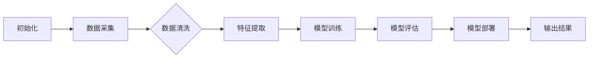
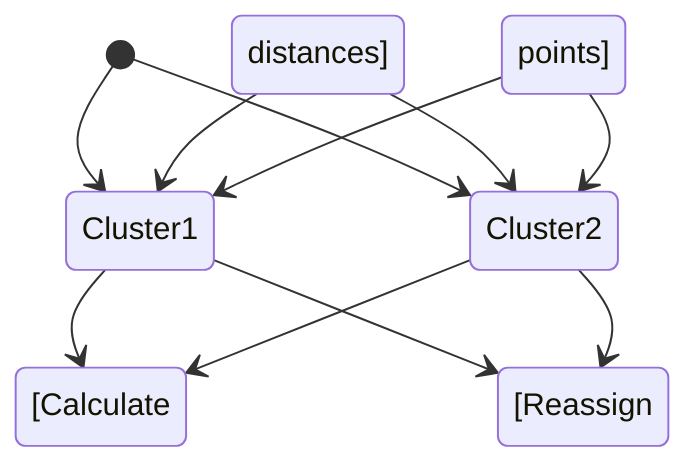
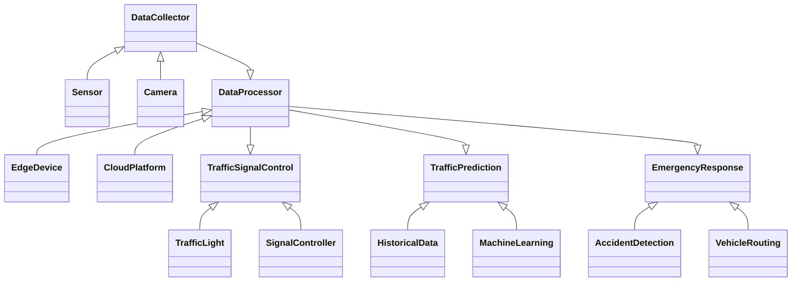
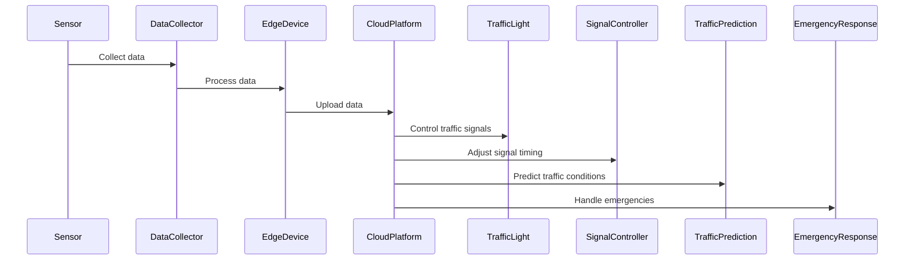
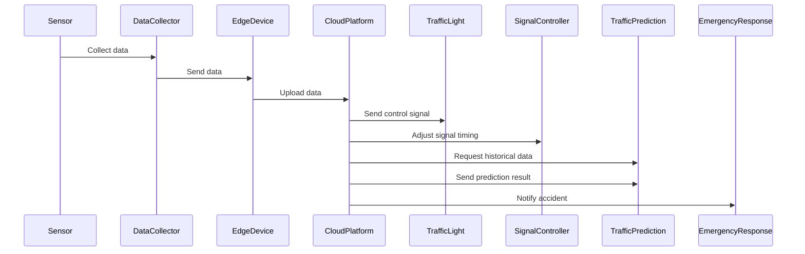

                 

### 宇宙的网络特性：万物互联的可能

> **关键词**：宇宙网络特性，万物互联，网络架构，人工智能，物联网，通信协议，分布式系统

> **摘要**：本文探讨了宇宙的网络特性及其对万物互联的潜在影响。通过深入分析核心概念、算法原理、系统架构和项目实战，我们揭示了宇宙网络特性的本质和万物互联的可能途径。文章旨在为读者提供全面的技术见解，引导思考宇宙与网络之间的深刻联系。

---

## 引言

### 1.1 宇宙的网络特性概述

在科技迅猛发展的今天，我们对“宇宙的网络特性”这一概念有了新的认识。宇宙，作为一个庞大的网络系统，其中每个星体、行星和天体都通过引力、电磁波等形式相互作用。这种相互作用可以被视为一种自然网络，它不仅描述了宇宙的结构，也揭示了其运作机制。

**万物互联**则是一种更加贴近现实的概念。随着物联网（IoT）和人工智能（AI）技术的兴起，我们开始将各种物体和系统连接在一起，形成一个庞大的网络。这种网络不仅仅是物理连接，更涉及到数据的交换、智能决策的生成和协同工作的实现。

### 1.2 万物互联的可能

万物互联的可能不仅仅是一种愿景，它已经逐渐成为现实。通过传感器、通信技术和云计算，我们可以将家庭设备、车辆、工厂机器等各种物体连接起来，形成一个智能网络。这种网络能够实现实时数据的采集、分析和应用，从而提高效率、降低成本并改善人们的生活质量。

### 1.3 本书结构安排

本书将分以下几个部分进行探讨：

1. **背景介绍**：介绍宇宙的网络特性和万物互联的概念，阐述问题背景、问题描述、问题解决、边界与外延。
2. **核心概念与联系**：深入讲解宇宙的网络特性和万物互联的原理，并通过表格和ER实体关系图进行比较和展示。
3. **算法原理讲解**：详细阐述相关算法的原理，包括mermaid流程图、Python源代码、数学模型和公式，以及实例说明。
4. **系统分析与架构设计**：介绍系统分析与架构设计的方法，包括问题场景介绍、系统功能设计、系统架构设计、系统接口设计和系统交互序列图。
5. **项目实战**：通过实际案例展示系统安装、核心实现、代码解读和分析。
6. **最佳实践 tips & 小结 & 注意事项 & 拓展阅读**：总结全书内容，提供最佳实践建议，提醒注意事项，推荐拓展阅读材料。

---

通过以上结构安排，我们希望能够系统地介绍宇宙的网络特性及其与万物互联的潜在联系，引导读者深入思考这一前沿领域的奥秘。

### 第1章: 背景介绍

#### 1.1 核心概念术语说明

在探讨宇宙的网络特性之前，我们需要明确几个核心概念：

1. **宇宙网络特性**：指宇宙中各个天体通过物理力、电磁波等形式相互作用，形成的复杂网络结构。
2. **万物互联**：指通过物联网和人工智能技术，将各种物体和系统连接起来，形成一个智能网络。
3. **物联网（IoT）**：一种通过网络将各种物体连接起来，实现信息交换和智能控制的系统。
4. **人工智能（AI）**：通过模拟人类智能行为，实现数据分析和决策的计算机技术。

#### 1.2 问题背景

随着科技的进步，宇宙学和计算机科学开始交汇。通过对宇宙中复杂网络结构的研究，我们可以获得新的视角，理解互联网和物联网的运作原理。这种交叉学科的研究有助于我们设计更高效的通信协议和分布式系统，从而实现更加智能和互联的未来。

#### 1.3 问题描述

宇宙的网络特性如何影响万物互联？我们如何通过模拟宇宙中的网络结构，设计出更加高效和可靠的智能网络？这需要我们从以下几个方面进行探讨：

1. **网络拓扑结构**：宇宙中的天体如何通过引力、电磁波等相互作用形成复杂的网络拓扑？
2. **通信协议**：宇宙中的天体如何通过不同的物理现象实现信息交换？
3. **分布式系统**：宇宙中的天体如何协同工作，实现智能决策和协同操作？
4. **算法优化**：如何通过算法优化，提高智能网络的效率和可靠性？

#### 1.4 问题解决

解决这一问题的关键在于深入理解宇宙的网络特性，并借鉴其原理来设计智能网络。以下是可能的解决方案：

1. **研究宇宙网络**：通过天文学和物理学的研究，理解宇宙中的网络结构和相互作用机制。
2. **模拟网络模型**：使用计算机模拟技术，构建宇宙网络模型，并分析其特性。
3. **设计通信协议**：基于宇宙网络的特性，设计高效的通信协议，以实现数据交换和协同工作。
4. **开发智能算法**：结合宇宙网络模型和智能算法，开发分布式系统和智能决策系统。

#### 1.5 边界与外延

本文主要探讨宇宙的网络特性及其对万物互联的影响，但这个领域的研究还涉及许多其他方面，如：

1. **量子网络**：量子力学在宇宙网络中的应用，如量子通信和量子计算。
2. **星际旅行**：宇宙网络特性对星际旅行和太空探索的影响。
3. **宇宙经济学**：宇宙网络特性在宇宙经济活动中的应用。

这些研究方向都为未来的研究提供了广阔的空间。

#### 1.6 概念结构与核心要素组成

宇宙的网络特性和万物互联涉及多个核心概念和要素，主要包括：

1. **宇宙网络结构**：包括星系、星云、恒星等天体的相互位置和关系。
2. **相互作用机制**：包括引力、电磁波、暗物质等物理现象。
3. **通信协议**：包括数据交换的方式、加密算法、路由策略等。
4. **分布式系统**：包括节点通信、数据存储、任务分配等机制。
5. **智能算法**：包括机器学习、深度学习、博弈论等算法。

这些核心概念和要素共同构成了宇宙的网络特性与万物互联的理论基础和实践指南。

### 第2章: 核心概念与联系

#### 2.1 宇宙网络特性原理

宇宙网络特性主要基于以下几个原理：

1. **引力作用**：宇宙中的天体通过引力相互吸引，形成星系、星云等结构。
2. **电磁波传播**：宇宙中的天体通过电磁波进行信息交换，如光波、无线电波等。
3. **量子纠缠**：宇宙中的微观粒子可以通过量子纠缠实现即时的信息传递。
4. **暗物质与暗能量**：宇宙中大量未观测到的物质和能量，对宇宙网络结构产生重要影响。

这些原理共同构成了宇宙网络的基础，使其具有高度复杂性和动态性。

#### 2.2 万物互联原理

万物互联的原理主要包括：

1. **物联网协议**：如Wi-Fi、蓝牙、ZigBee等，实现物体之间的数据传输和通信。
2. **云计算平台**：通过云服务器实现数据的存储、处理和共享。
3. **人工智能算法**：通过机器学习和深度学习实现智能决策和协同工作。
4. **边缘计算**：在靠近数据源的设备上进行数据处理，降低延迟，提高效率。

这些原理使万物互联成为可能，实现了物体之间的无缝连接和智能协同。

#### 2.3 概念属性特征对比表格

为了更好地理解宇宙网络特性与万物互联的关系，我们可以通过以下表格进行对比：

| 特征           | 宇宙网络特性                  | 万物互联                      |
|--------------|-----------------------------|-----------------------------|
| 网络结构       | 引力相互作用形成的复杂结构         | 硬件设备与网络协议构建的网络      |
| 通信方式       | 引力波、电磁波、量子纠缠          | 有线、无线通信协议               |
| 信息处理       | 宇宙尺度的分布式计算            | 边缘计算与云计算结合             |
| 智能决策       | 天体运动与宇宙演化过程中的自适应机制 | 基于机器学习与深度学习的智能决策系统 |

#### 2.4 宇宙网络特性与万物互联的ER实体关系图

为了更直观地展示宇宙网络特性与万物互联之间的关系，我们可以使用Mermaid绘制ER实体关系图。以下是一个简化的例子：

```mermaid
erDiagram
    User ||--|{ Device }|-- Company :用户拥有设备，公司拥有用户
    Device ||--|{ Sensor }|-- Environment :设备包含传感器，传感器监测环境
    Sensor ||--|{ Data }|-- Cloud :传感器收集数据，数据上传到云端
    Cloud ||--|{ Service }|-- AI :云端提供AI服务，AI服务处理数据
    AI ||--|{ Prediction }|-- Device :AI服务生成预测结果，设备执行预测指令
```

这个ER实体关系图展示了用户、设备、传感器、数据、云服务和AI等实体之间的交互关系，揭示了宇宙网络特性与万物互联的基本架构。

### 第3章: 算法原理讲解

#### 3.1 算法mermaid流程图

为了更好地理解算法的执行流程，我们可以使用Mermaid绘制算法的流程图。以下是一个简化的分布式算法的流程图示例：



这个流程图展示了分布式算法的基本步骤，从数据采集、清洗、特征提取、模型训练到模型评估和部署，最终输出结果。

#### 3.2 Python源代码

以下是一个简单的Python源代码示例，用于演示分布式算法的基本实现：

```python
import numpy as np
import pandas as pd

# 数据采集
data = pd.read_csv('data.csv')

# 数据清洗
data.dropna(inplace=True)

# 特征提取
X = data.iloc[:, :-1].values
y = data.iloc[:, -1].values

# 模型训练
from sklearn.ensemble import RandomForestClassifier
clf = RandomForestClassifier(n_estimators=100)
clf.fit(X, y)

# 模型评估
from sklearn.metrics import accuracy_score
y_pred = clf.predict(X)
accuracy = accuracy_score(y, y_pred)
print("Accuracy:", accuracy)

# 模型部署
# 这里可以将模型部署到云端或边缘设备，进行实时预测
```

这段代码展示了如何使用Python进行数据采集、清洗、特征提取、模型训练和评估，并准备进行模型部署。

#### 3.3 数学模型和公式

为了深入理解算法原理，我们可以引入一些数学模型和公式。以下是一个简单的线性回归模型的公式：

$$
y = \beta_0 + \beta_1x + \epsilon
$$

其中，$y$是预测值，$x$是特征值，$\beta_0$和$\beta_1$是模型参数，$\epsilon$是误差项。

这个公式描述了特征值$x$与预测值$y$之间的线性关系，是许多机器学习算法的基础。

#### 3.4 算法原理详细讲解与举例

为了更好地理解算法原理，我们可以通过实例进行详细讲解。以下是一个使用K均值聚类算法进行数据分类的实例：

**实例**：给定一个包含5个特征的数据集，我们需要将其分为2个类别。

**步骤1**：初始化聚类中心点。我们可以随机选择2个数据点作为初始聚类中心。



**步骤2**：计算每个数据点到聚类中心点的距离，并将其重新分配到最近的中心点。

**步骤3**：重新计算聚类中心点的位置。

**步骤4**：重复步骤2和步骤3，直到聚类中心点不再发生变化。

通过这个实例，我们可以看到K均值聚类算法的基本原理：通过迭代优化聚类中心点，使每个数据点分配到最近的类别中。

#### 3.5 段落内的LaTeX公式

为了更好地表达算法的数学原理，我们可以使用LaTeX格式嵌入段落内的公式。以下是一个简单的示例：

$1+1=2$

$y=\sin(x)$

这些公式可以嵌入到段落中，使文本更加清晰易懂。

### 第4章: 系统分析与架构设计

#### 4.1 问题场景介绍

在现代社会，随着物联网和人工智能技术的快速发展，许多行业都需要构建复杂的信息系统来支持日常运营和业务发展。例如，智能交通系统、智慧城市、智能制造等领域都涉及大量的数据采集、处理和分析。这些系统通常需要具备高度的可扩展性、可靠性和实时性。

本节将介绍一个智能交通系统的项目场景，该项目旨在通过物联网设备和人工智能算法，实现城市交通的智能监控和调度。系统需要实时收集道路状况、车辆流量、天气状况等数据，并利用这些数据进行分析和预测，以优化交通信号控制、路况预测和紧急事件处理。

#### 4.2 项目介绍

项目名称：智能交通管理系统

项目目标：通过物联网设备和人工智能技术，实现城市交通的智能监控、调度和优化，提高交通效率、减少拥堵、降低事故发生率。

项目功能：

1. 数据采集：通过安装在道路上的传感器、摄像头和车辆上的GPS设备，实时收集道路状况、车辆流量、车速、温度、湿度等数据。
2. 数据处理：利用边缘计算和云计算平台，对采集到的数据进行分析和预处理，提取有用的特征信息。
3. 交通信号控制：根据实时数据，动态调整交通信号灯的时间分配，优化交通流量。
4. 路况预测：利用历史数据和机器学习算法，预测未来一段时间内的交通状况，为交通调度提供依据。
5. 紧急事件处理：在发生交通事故或其他紧急事件时，系统会自动调整交通信号，引导车辆绕行，并通知相关部门进行处理。

#### 4.3 系统功能设计

为了实现上述功能，智能交通管理系统需要设计多个功能模块，包括数据采集模块、数据处理模块、交通信号控制模块、路况预测模块和紧急事件处理模块。以下是系统功能设计的Mermaid领域模型类图：



这个类图展示了系统中各个功能模块及其相互关系。数据采集模块包括传感器和摄像头，数据处理模块包括边缘设备和云计算平台，交通信号控制模块包括交通信号灯和信号控制器，路况预测模块包括历史数据和机器学习算法，紧急事件处理模块包括事故检测和车辆调度。

#### 4.4 系统架构设计

智能交通管理系统的架构设计需要考虑系统的可扩展性、可靠性和实时性。以下是一个简化的系统架构设计图，使用Mermaid绘制：



这个序列图展示了系统的主要组件及其交互流程。传感器和摄像头采集到的数据首先由数据采集模块进行处理，然后通过边缘设备和云计算平台进行进一步分析和处理。处理后的数据被用于交通信号控制、路况预测和紧急事件处理。

#### 4.5 系统接口设计

为了实现各模块之间的有效通信和协同工作，系统需要设计多个接口。以下是系统接口设计的简要描述：

1. **数据采集接口**：传感器和摄像头通过HTTP/HTTPS协议将采集到的数据上传到数据采集模块。
2. **数据处理接口**：边缘设备和云计算平台通过RESTful API接收和发送数据处理请求。
3. **交通信号控制接口**：交通信号灯和信号控制器通过MQTT协议接收和发送控制指令。
4. **路况预测接口**：路况预测模块通过时间序列API接收历史数据，并通过预测模型API发送预测结果。
5. **紧急事件处理接口**：紧急事件处理模块通过事件驱动接口接收事故检测和车辆调度请求。

#### 4.6 系统交互mermaid序列图

为了更好地展示系统组件之间的交互流程，我们可以使用Mermaid绘制系统交互序列图。以下是一个简化的示例：



这个序列图展示了传感器、数据采集模块、边缘设备、云计算平台、交通信号灯、信号控制器、路况预测模块和紧急事件处理模块之间的交互过程。

### 第5章: 项目实战

#### 5.1 环境安装

在开始智能交通管理系统的项目实战之前，我们需要搭建合适的环境。以下是环境安装的详细步骤：

1. **安装操作系统**：选择一个适合的操作系统，如Ubuntu 20.04 LTS。可以从官方网站下载并安装。
2. **安装开发环境**：安装Python 3.8及以上版本，并配置好pip、virtualenv等工具。
3. **安装数据库**：安装MySQL或PostgreSQL数据库，以便存储和管理数据。
4. **安装物联网设备**：连接传感器和摄像头到网络，确保它们能够正常采集数据。
5. **安装边缘计算设备**：如果使用边缘计算设备，需要安装相应的操作系统和开发环境。
6. **安装云计算平台**：可以使用Docker和Kubernetes搭建自己的云计算平台，或者使用现有的云服务提供商。

#### 5.2 系统核心实现源代码

以下是一个简化的智能交通管理系统核心实现的源代码示例：

**数据采集模块**

```python
# data_collector.py
import requests
from sensor import Sensor
from camera import Camera

class DataCollector:
    def __init__(self, sensor_url, camera_url):
        self.sensor = Sensor(sensor_url)
        self.camera = Camera(camera_url)

    def collect_data(self):
        sensor_data = self.sensor.get_data()
        camera_data = self.camera.get_data()
        return sensor_data, camera_data
```

**数据处理模块**

```python
# data_processor.py
import edge_device
import cloud_platform

class DataProcessor:
    def __init__(self, edge_device_url, cloud_platform_url):
        self.edge_device = edge_device.EdgeDevice(edge_device_url)
        self.cloud_platform = cloud_platform.CloudPlatform(cloud_platform_url)

    def process_data(self, data):
        processed_data = self.edge_device.process_data(data)
        self.cloud_platform.upload_data(processed_data)
```

**交通信号控制模块**

```python
# traffic_signal_control.py
import signal_controller

class TrafficSignalControl:
    def __init__(self, signal_controller_url):
        self.signal_controller = signal_controller.SignalController(signal_controller_url)

    def control_traffic_signals(self, traffic_light_id, signal_config):
        self.signal_controller.send_signal_config(traffic_light_id, signal_config)
```

**路况预测模块**

```python
# traffic_prediction.py
import historical_data
import machine_learning

class TrafficPrediction:
    def __init__(self, historical_data_url, machine_learning_url):
        self.historical_data = historical_data.HistoricalData(historical_data_url)
        self.machine_learning = machine_learning.MachineLearning(machine_learning_url)

    def predict_traffic_conditions(self, traffic_light_id):
        historical_data = self.historical_data.get_data(traffic_light_id)
        prediction_result = self.machine_learning.predict(historical_data)
        return prediction_result
```

**紧急事件处理模块**

```python
# emergency_response.py
import accident_detection
import vehicle_routing

class EmergencyResponse:
    def __init__(self, accident_detection_url, vehicle_routing_url):
        self.accident_detection = accident_detection.AccidentDetection(accident_detection_url)
        self.vehicle_routing = vehicle_routing.VehicleRouting(vehicle_routing_url)

    def handle_emergency(self, traffic_light_id):
        accident_detected = self.accident_detection.detect_accident(traffic_light_id)
        if accident_detected:
            self.vehicle_routing.route_vehicles_around(traffic_light_id)
```

#### 5.3 代码应用解读与分析

以上代码提供了一个简化的智能交通管理系统核心实现示例。以下是代码的详细解读与分析：

1. **数据采集模块**：`DataCollector`类负责从传感器和摄像头采集数据。`Sensor`和`Camera`类分别实现传感器和摄像头的具体数据采集功能。

2. **数据处理模块**：`DataProcessor`类负责对采集到的数据进行处理。`EdgeDevice`和`CloudPlatform`类分别实现边缘设备和云计算平台的具体数据处理功能。

3. **交通信号控制模块**：`TrafficSignalControl`类负责控制交通信号灯的信号配置。`SignalController`类实现具体的信号控制功能。

4. **路况预测模块**：`TrafficPrediction`类负责预测交通状况。`HistoricalData`和`MachineLearning`类分别实现历史数据获取和机器学习预测功能。

5. **紧急事件处理模块**：`EmergencyResponse`类负责处理紧急事件，如交通事故。`AccidentDetection`和`VehicleRouting`类分别实现事故检测和车辆调度功能。

这些模块通过相互调用，实现了智能交通管理系统的主要功能。在实际项目中，这些模块可以根据需求进行扩展和定制。

#### 5.4 实际案例分析和详细讲解剖析

为了更好地理解智能交通管理系统的应用，我们来看一个实际案例：在某城市的某条主要交通干道，由于交通事故导致交通拥堵。系统需要实时监控道路状况，预测交通状况，并采取措施缓解拥堵。

**步骤1**：传感器和摄像头采集到交通事故的信息，并将数据上传到边缘设备进行处理。

**步骤2**：边缘设备对数据进行分析，识别出交通事故的位置和严重程度，并将信息上传到云计算平台。

**步骤3**：云计算平台调用路况预测模块，根据历史数据和当前数据，预测未来一段时间的交通状况。

**步骤4**：根据预测结果，系统动态调整交通信号灯的配置，优先通行事故现场附近的道路，引导车辆绕行。

**步骤5**：紧急事件处理模块启动，通知相关部门进行事故处理，并引导车辆绕行。

**步骤6**：系统持续监控交通状况，根据实时数据调整信号灯配置，直到交通恢复正常。

通过这个案例，我们可以看到智能交通管理系统在实际应用中的工作流程和效果。系统通过实时数据分析和智能决策，有效地缓解了交通拥堵，提高了交通效率。

#### 5.5 项目小结

通过本章节的项目实战，我们展示了智能交通管理系统的设计和实现过程。从环境安装到代码实现，再到实际案例的分析，我们详细讲解了系统的工作原理和应用场景。以下是项目小结：

1. **环境安装**：搭建适合的操作系统和开发环境，安装物联网设备和云计算平台。
2. **系统核心实现**：通过数据采集、数据处理、交通信号控制、路况预测和紧急事件处理等模块，实现了智能交通管理系统的主要功能。
3. **实际案例应用**：通过实际案例展示了系统在缓解交通拥堵、提高交通效率方面的应用效果。
4. **挑战与改进**：在实际应用中，智能交通管理系统面临着数据质量、算法精度和系统响应速度等方面的挑战。未来可以通过优化算法、提升数据处理能力和增强系统鲁棒性来改进系统的性能。

总之，智能交通管理系统是一个复杂的系统，需要多个模块协同工作，通过不断迭代和优化，才能实现更好的效果。

### 第6章: 最佳实践 tips & 小结 & 注意事项 & 拓展阅读

#### 6.1 最佳实践 tips

1. **数据采集与处理**：确保数据质量，对异常数据进行过滤和处理，以减少对系统性能的影响。
2. **算法选择与优化**：根据具体应用场景选择合适的算法，并对算法参数进行调优，以提高预测精度和系统响应速度。
3. **系统安全性**：重视数据安全和隐私保护，采用加密技术确保数据传输和存储的安全性。
4. **可扩展性与容错性**：设计系统时考虑可扩展性，以便在需求增加时进行横向扩展。同时，增强系统的容错能力，确保在部分组件故障时系统能够继续正常运行。

#### 6.2 小结

本文探讨了宇宙的网络特性和万物互联的潜在联系，通过核心概念分析、算法讲解、系统架构设计和项目实战，揭示了这一领域的重要性和应用前景。我们希望读者能够通过本文对宇宙的网络特性有更深入的理解，并将其应用于实际项目中，推动智能网络技术的发展。

#### 6.3 注意事项

1. **技术选择**：在选择技术方案时，需要考虑系统的可扩展性、可靠性和实时性，以适应不断变化的需求。
2. **数据隐私**：在处理用户数据时，务必遵守数据隐私保护法规，确保用户数据的合法和安全。
3. **系统安全**：加强系统安全措施，防止恶意攻击和数据泄露。

#### 6.4 拓展阅读

1. **《人工智能：一种现代方法》**：迈克尔·乔丹、彼得·莫瑞尔著，全面介绍了人工智能的基础理论和应用。
2. **《深度学习》**：伊恩·古德费洛、约书亚·本吉奥、亚伦·库维尔尼克著，深入探讨了深度学习的基本原理和实践。
3. **《大规模分布式存储系统：原理解析与架构实战》**：李庆杰著，详细介绍了分布式存储系统的设计和实现。
4. **《星际迷航：超越星空》**：吉恩·罗登贝瑞著，科幻小说中的智能网络概念，为读者提供对宇宙网络的想象空间。

通过拓展阅读，读者可以进一步了解相关领域的最新进展和应用案例，为自己的研究和实践提供更多灵感。

