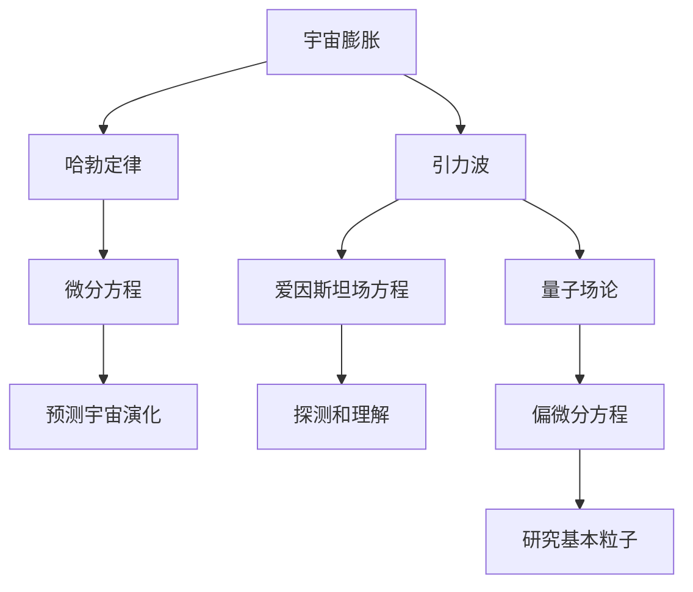
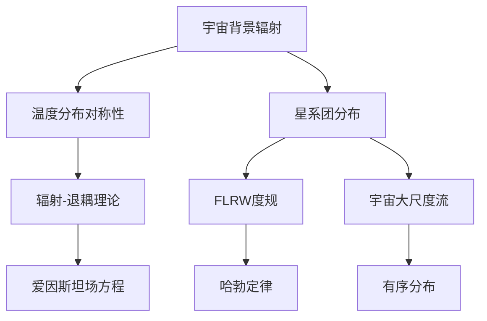
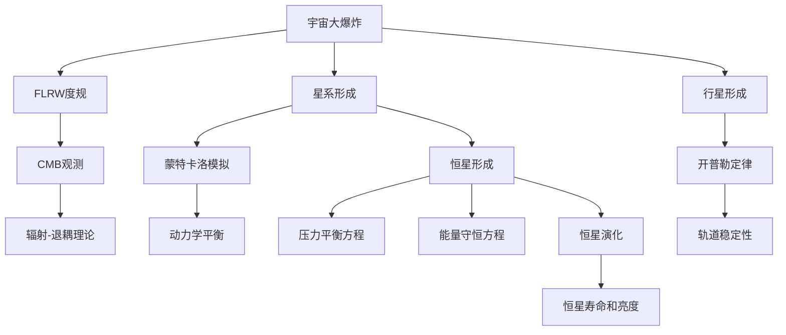
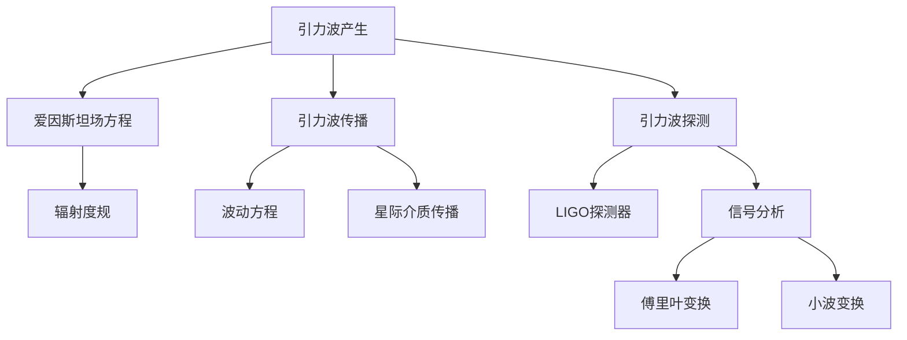
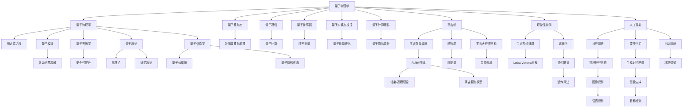

                 

## 宇宙的美学原理：数学和谐性的体现

在探讨宇宙的奥秘时，数学和谐性扮演了不可或缺的角色。数学不仅仅是宇宙的描述语言，更是宇宙美学的一种体现。本文将深入探讨宇宙的美学原理，特别是在数学和谐性方面的体现。通过逻辑清晰、结构紧凑、简单易懂的论述，我们试图揭示数学在宇宙中扮演的神秘角色。

文章将首先介绍宇宙美学和数学和谐性的基本概念，明确它们在科学研究中的重要性。接下来，我们将逐步分析数学和谐性在宇宙各个层面的体现，包括宇宙结构的和谐、宇宙演化的和谐以及引力波的和谐。此外，我们将探讨现代科学中数学和谐性的应用，以及一些具体的案例研究。最后，我们将总结文章的核心观点，并给出一些未来研究方向和拓展阅读建议。

本文关键词：宇宙美学、数学和谐性、宇宙结构、宇宙演化、引力波、现代科学应用。

摘要：本文从宇宙美学和数学和谐性的角度出发，详细探讨了数学在宇宙各个层面的体现。通过逐步分析，我们揭示了数学和谐性在宇宙结构、宇宙演化和引力波等方面的关键作用，并探讨了其在现代科学中的应用。文章结构紧凑，论述清晰，为读者提供了深入理解宇宙美学和数学和谐性的新视角。

## 引言：宇宙美学与数学和谐性的基础

宇宙美学和数学和谐性是现代科学中两个重要的概念，它们在探索宇宙的本质和规律中起到了至关重要的作用。要深入理解这些概念，首先需要从背景、定义和历史的维度进行探讨。

### 背景介绍

宇宙美学（Cosmological Aesthetics）这一概念起源于人类对宇宙的深刻思考和审美体验。自古以来，人类就对宇宙的秩序和美丽充满了敬畏。古希腊哲学家亚里士多德曾指出，宇宙是一个和谐的整体，这种和谐体现在数学和几何之中。在科学领域，宇宙美学开始于17世纪，随着牛顿力学的建立，人们开始认识到宇宙的规律性和数学的统一性。19世纪，德国哲学家黑格尔进一步发展了这一思想，他认为宇宙的美在于其结构和形式的和谐。

数学和谐性（Mathematical Harmony）是指数学结构中所展现出的对称、简洁和统一。数学家们发现，宇宙中的许多现象都可以通过数学模型来描述，而这些模型往往具有高度的对称性和简洁性。例如，欧几里得几何中的五角星形、费马大定理的简洁证明，以及混沌理论中的吸引子等，都体现了数学和谐性的独特魅力。

### 定义与核心概念

宇宙美学可以被定义为对宇宙秩序和结构的审美体验和哲学思考。它不仅涉及视觉上的美，还包括宇宙内在的规律性和数学的和谐。宇宙美学强调宇宙的整体性和统一性，认为宇宙中的每一个部分都是相互关联和协调的。

数学和谐性则是数学学科中的一个重要概念，它涉及到数学结构中的对称性、简洁性和统一性。数学家们通过研究这些特性，发现了宇宙中许多现象背后的数学规律。例如，对称性在物理学中的广泛应用，简洁性在数学证明中的体现，以及统一性在理论模型中的重要性。

### 历史发展与演变

宇宙美学和数学和谐性的概念有着悠久的历史。在古希腊时期，毕达哥拉斯学派就提出了“万物皆数”的观点，认为宇宙的本质是数学和谐。在中世纪，阿拉伯学者阿尔·法拉比进一步发展了这一思想，将其与哲学和宗教相结合。

在科学革命时期，伽利略和牛顿的工作奠定了现代宇宙美学和数学和谐性的基础。伽利略通过望远镜观测宇宙，发现了行星运动的规律，而牛顿的万有引力定律则揭示了宇宙中物体之间的相互作用。这些发现使人们意识到宇宙的美在于其数学结构和规律性。

20世纪以来，随着相对论和量子力学的建立，宇宙美学和数学和谐性得到了进一步的发展。爱因斯坦的相对论揭示了时空的弯曲和宇宙的大尺度结构，而量子力学则揭示了微观世界的奇异规律。这些理论不仅丰富了我们对宇宙的理解，也进一步验证了宇宙美学和数学和谐性的重要性。

### 当前研究现状与未来方向

目前，宇宙美学和数学和谐性在科学和哲学领域中仍然是一个活跃的研究领域。科学家们通过研究宇宙中的各种现象，不断发现新的数学结构和规律。例如，弦理论试图将量子力学和广义相对论统一起来，揭示宇宙更深层次的和谐性。

未来的研究方向包括：进一步探讨宇宙美学和数学和谐性在不同学科中的应用，深入研究宇宙中的复杂系统，探索宇宙美学与人工智能、数据分析等新兴技术的交叉点。

总之，宇宙美学和数学和谐性是理解宇宙本质和规律的重要途径。通过引入这两个概念，我们能够更深入地探索宇宙的美丽和奇妙。这不仅有助于我们科学认知的拓展，也为人类对宇宙的审美体验提供了新的视角。

## 基本原理：数学和谐性的核心概念与联系

在深入探讨宇宙美学和数学和谐性之前，我们需要明确一些基本概念和原理。这些概念不仅是理解宇宙美学和数学和谐性的基石，也是它们在实际应用中的关键。以下是几个核心概念及其相互关系。

### 关键概念

1. **对称性（Symmetry）**：对称性是指物体或系统在某种变换下保持不变的性质。在数学和物理学中，对称性是一个重要的概念，广泛应用于几何、群论和场论等领域。例如，在欧几里得几何中，五角星形具有五次旋转对称性；在量子力学中，宇称守恒是一个基本原理。

2. **简洁性（Simplicity）**：简洁性是指数学模型或公式在形式上的简单和优雅。一个简洁的数学模型往往能够用最少的元素表达最多的信息，具有高度的概括性和普适性。例如，费马大定理的简洁证明、牛顿力学的三大定律都体现了数学的简洁性。

3. **统一性（Unity）**：统一性是指不同领域或理论之间的协调和一致性。在物理学中，统一性试图将不同现象背后的基本规律整合到一个统一的框架中。例如，爱因斯坦的相对论试图将引力、电磁力和弱相互作用统一在一个理论框架内。

4. **规律性（Regularities）**：规律性是指宇宙中事物运动和变化所遵循的固定模式。这些模式可以通过数学模型来描述和预测。例如，行星运动的规律、热力学的第二定律等。

### 概念间的关系

1. **对称性与简洁性**：对称性常常与简洁性相联系。一个具有高度对称性的数学结构往往也是简洁的。例如，欧拉公式 \( e^{i\pi} + 1 = 0 \) 不仅具有对称性，而且简洁到只有一个等号。

2. **简洁性与统一性**：简洁的数学模型往往能够揭示不同领域或理论之间的统一性。例如，在量子场论中，粒子被视为场的激发，这种简洁的描述统一了量子力学和经典电磁场理论。

3. **规律性与对称性/简洁性**：宇宙中的许多规律性可以通过对称性和简洁性的数学模型来描述。例如，宇宙的膨胀规律可以通过弗里德曼-勒梅特-罗伯逊-沃尔克（FLRW）度规来描述，这个度规具有高度的简洁性和对称性。

### 简单易懂的示例

为了更直观地理解这些概念，我们可以举一些简单的示例：

- **对称性**：一个正方形具有四条边长相等、四个直角的特点，这意味着它具有旋转对称性和轴对称性。
- **简洁性**：勾股定理 \( a^2 + b^2 = c^2 \) 是一个简洁的数学公式，用来描述直角三角形三条边之间的关系。
- **统一性**：在牛顿力学中，质量、加速度和力之间的关系可以用 \( F = ma \) 来统一描述。
- **规律性**：热力学的第二定律指出，一个封闭系统的熵总是趋向于增加，这是能量转化和守恒规律的体现。

通过这些示例，我们可以看到，对称性、简洁性和统一性是如何在数学和谐性中相互联系和发挥作用的。这些基本原理不仅帮助我们理解宇宙中的复杂现象，也为我们提供了一种美学上的欣赏视角。

### ER图表示概念关系

为了更直观地展示这些概念之间的相互关系，我们可以使用Mermaid ER图来表示：

```mermaid
erDiagram
  Symmetry ||--|{ Simplicity }
  Simplicity ||--|{ Unity }
  Unity ||--|{ Regularities }
  Regularities ||--|{ Symmetry }
  Regularities ||--|{ Simplicity }
```

这个ER图展示了对称性、简洁性、统一性和规律性之间的双向关联，强调了它们在数学和谐性中的核心地位。

综上所述，对称性、简洁性、统一性和规律性是数学和谐性的核心概念。这些概念不仅相互关联，而且在宇宙美学中扮演了关键角色。通过理解这些基本原理，我们能够更深入地探索宇宙的奥秘，欣赏其背后的数学之美。

## 数学工具与方法：宇宙美学中的几何、代数与微分方程

在探讨宇宙美学时，数学工具和方法起到了至关重要的作用。几何、代数和微分方程是三种关键的数学工具，它们在宇宙美学中得到了广泛的应用。以下是这些工具的基本概念、作用和具体应用。

### 几何

几何是研究形状、大小和位置关系的数学分支。在宇宙美学中，几何的对称性和简洁性被广泛运用。以下是一些具体应用：

1. **欧几里得几何**：
   - **五角星形**：五角星形具有五次旋转对称性，这在宇宙结构中有所体现，如一些星系和行星轨道的形状。
   - **圆和球体**：球体具有三维旋转对称性，在宇宙中的天体，如地球和太阳，都具有这种几何特性。

2. **非欧几里得几何**：
   - **双曲几何**：在双曲空间中，几何对象的性质与欧几里得空间不同，如线段可以无限延长。双曲几何在研究宇宙的大尺度结构中有所应用，如宇宙膨胀模型。

3. **拓扑几何**：
   - **莫比乌斯带**：莫比乌斯带是一种具有单一面的带状结构，它体现了拓扑几何中的非可定向性。这种结构在某些物理现象中有所体现，如宇宙的时空弯曲。

### 代数

代数是研究数和运算规律的数学分支。在宇宙美学中，代数的简洁性和统一性得到了充分体现。以下是一些具体应用：

1. **线性代数**：
   - **矩阵和向量**：矩阵和向量在描述宇宙中的物理现象中起到了重要作用，如引力场、电磁场和量子态等。线性代数的简洁性使得许多复杂的物理现象可以通过简单的数学公式来描述。

2. **群论**：
   - **对称群**：群论是研究对称性的数学工具。在宇宙美学中，对称群被用于描述宇宙中的对称性现象，如星系对称、电磁场对称等。群论为理解这些对称性提供了统一的理论框架。

3. **多项式代数**：
   - **费马大定理**：费马大定理是代数学中的一个著名问题，它展示了代数方程的简洁性和统一性。费马大定理的证明不仅具有数学意义，也为理解宇宙中的某些规律提供了启示。

### 微分方程

微分方程是研究变化率和相关关系的数学工具。在宇宙美学中，微分方程被广泛应用于描述宇宙中的动态现象。以下是一些具体应用：

1. **常微分方程**：
   - **牛顿运动定律**：牛顿的三大定律可以用一阶微分方程来描述，这些方程揭示了物体运动的基本规律。
   - **波动方程**：波动方程描述了波动现象，如声波、电磁波和引力波。这些方程在理解宇宙中的波动现象中起到了关键作用。

2. **偏微分方程**：
   - **爱因斯坦场方程**：爱因斯坦场方程是一组描述引力场的偏微分方程，这些方程揭示了时空的弯曲和宇宙的结构。
   - **热力学方程**：热力学方程描述了热量的传递和能量守恒，这些方程在理解宇宙的热力学性质中有所应用。

### 数学工具在宇宙美学中的应用

数学工具在宇宙美学中的应用不仅体现了其理论价值，也展示了其在实际科研中的广泛应用。以下是一些具体案例：

- **宇宙膨胀**：哈勃定律揭示了宇宙膨胀的规律，这个规律可以用一阶微分方程来描述。通过微分方程，科学家可以预测宇宙的未来演化。
- **引力波**：引力波是宇宙中的一种重要现象，它的存在可以通过爱因斯坦场方程来预测和计算。微分方程的应用使得我们能够探测和理解引力波。
- **量子场论**：量子场论中，粒子被视为场的激发，场的演化可以用偏微分方程来描述。通过这些方程，科学家可以研究基本粒子的性质和行为。

### 总结

几何、代数和微分方程是宇宙美学中不可或缺的数学工具。它们通过各自的特性，揭示了宇宙中的对称性、简洁性和统一性。这些数学工具不仅帮助我们理解宇宙的规律，也为我们提供了欣赏宇宙之美的新视角。通过这些工具的应用，我们可以更好地探索宇宙的奥秘，揭示其背后的数学和谐性。

### Mermaid流程图展示

为了更直观地展示这些数学工具的应用，我们可以使用Mermaid流程图来描述：



这个流程图展示了几何、代数和微分方程在宇宙美学中的应用，以及它们如何帮助我们理解和探索宇宙的奥秘。

通过上述分析，我们可以看到，几何、代数和微分方程不仅为宇宙美学提供了坚实的理论基础，也展示了它们在具体科研中的应用价值。这些数学工具不仅帮助我们揭示了宇宙的规律，也让我们能够从数学的角度欣赏宇宙的美丽与和谐。在接下来的章节中，我们将进一步探讨数学和谐性在宇宙各个层面的具体体现。

## 宇宙中的和谐性：宇宙结构的和谐

宇宙结构是宇宙美学的一个重要方面，其和谐性通过数学模型得到了深刻的揭示。在宇宙学中，宇宙结构指的是宇宙中各种天体和物质分布的整体模式。通过研究这些结构，我们可以发现其中蕴含的和谐性，并理解其背后的数学原理。

### 宇宙背景辐射的和谐性

宇宙背景辐射（Cosmic Microwave Background, CMB）是宇宙早期遗留下来的辐射，它为我们提供了宇宙早期状态的宝贵信息。CMB的温度分布和波动模式具有高度的和谐性，这些特性可以通过数学模型来解释。

1. **温度分布的对称性**：
   - CMB的温度分布具有几乎完美的黑体辐射特性，其温度约为2.725 K。这种温度分布具有旋转对称性和各向同性，即在所有方向上，温度几乎相同。
   - 这一现象可以用辐射-退耦理论来解释，即宇宙在大爆炸后不久，辐射与物质分离，形成了当前的CMB。

2. **波动模式的对称性**：
   - CMB的波动模式揭示了宇宙早期的小尺度不均匀性，这些波动在空间中呈现出对称的分布。
   - 通过对CMB的精确测量，科学家发现这些波动模式具有非常规则的结构，如特征峰和特定频率的波动，这些结构可以用数学模型来描述。

### 宇宙大尺度的结构和谐性

在更大的尺度上，宇宙的结构也展现了高度的和谐性。以下是一些具体例子：

1. **星系团的分布**：
   - 星系团是宇宙中的大型结构，由数十亿个星系组成。这些星系团在宇宙中的分布呈现出高度有序的结构，如巨型星系团网络。
   - 这种分布可以用哈勃定律和弗里德曼-勒梅特-罗伯逊-沃尔克（FLRW）度规来描述，这些数学模型揭示了宇宙膨胀和结构的动态变化。

2. **宇宙的大尺度流**：
   - 宇宙中存在大规模的流现象，如宇宙流和星系流。这些流现象表现出一种有序的结构，它们在宇宙中流动并相互作用。
   - 通过对宇宙流的研究，科学家发现这些流的模式可以通过数学模型来描述，如哈勃流的分布和速度结构。

### 数学模型的解释

上述现象背后的数学模型主要涉及以下几个方面：

1. **爱因斯坦场方程**：
   - 爱因斯坦场方程是描述引力场和宇宙几何的基本方程，它揭示了时空的弯曲和引力波的传播。
   - 通过这个方程，我们可以解释宇宙背景辐射的对称性和波动模式，以及宇宙大尺度结构的演化。

2. **弗里德曼-勒梅特-罗伯逊-沃尔克（FLRW）度规**：
   - FLRW度规是一种描述宇宙膨胀和均匀性分布的数学模型，它广泛应用于宇宙学。
   - 这个度规可以解释星系团的分布和宇宙大尺度流的模式，揭示了宇宙的和谐性。

3. **哈勃定律**：
   - 哈勃定律描述了宇宙膨胀的速度与宇宙距离之间的关系，它揭示了宇宙结构的变化规律。
   - 通过这个定律，我们可以理解宇宙中各种结构之间的相互作用和演化过程。

### 实例分析

为了更直观地展示宇宙结构的和谐性，我们可以通过以下实例进行分析：

1. **宇宙背景辐射的对称性**：
   - 通过卫星观测到的CMB图，我们可以看到其温度分布几乎均匀，波动模式具有对称的峰和谷。
   - 这些模式可以用爱因斯坦场方程和辐射-退耦理论来解释，揭示了宇宙早期状态的和谐性。

2. **星系团的分布**：
   - 通过天文观测，我们可以看到宇宙中存在巨型星系团网络，这些星系团呈现出有序的分布结构。
   - 这种分布可以用FLRW度规和哈勃定律来描述，揭示了宇宙大尺度结构的和谐性。

通过上述分析，我们可以看到，宇宙结构中的和谐性通过数学模型得到了深刻的揭示。这些模型不仅帮助我们理解宇宙的规律，也为我们提供了欣赏宇宙之美的新视角。通过继续深入研究这些数学模型，我们可以进一步揭示宇宙中的和谐性，拓展我们对宇宙本质的理解。

### Mermaid流程图展示

为了更直观地展示宇宙结构的和谐性及其背后的数学模型，我们可以使用Mermaid流程图来描述：



这个流程图展示了宇宙结构中的和谐性及其背后的数学模型，以及它们如何相互关联，共同揭示了宇宙的和谐之美。

总之，宇宙结构的和谐性是宇宙美学的一个重要方面，通过数学模型得到了深刻的揭示。这些模型不仅帮助我们理解宇宙的规律，也为我们提供了欣赏宇宙之美的新视角。在接下来的章节中，我们将进一步探讨宇宙演化中的和谐性，以及引力波的和谐性。

## 宇宙演化中的和谐性

宇宙的演化过程充满了数学和谐性的体现，从宇宙大爆炸到星系的形成，再到恒星和行星的诞生，每一个阶段都蕴含着复杂的数学规律。通过理解这些规律，我们可以更深入地探讨宇宙的和谐性。

### 宇宙大爆炸的数学模型

宇宙大爆炸理论（Big Bang Theory）是描述宇宙起源和早期发展的标准模型。该理论提出，宇宙从一个极度热密的状态迅速膨胀，形成了我们现在所看到的宇宙。这个过程中，数学模型起到了关键作用。

1. **弗里德曼-勒梅特-罗伯逊-沃尔克（FLRW）度规**：
   - FLRW度规是一种描述宇宙膨胀和均匀性分布的数学模型，它假设宇宙在时间和空间上是均匀和各向同性的。
   - 这个度规可以用来预测宇宙的膨胀速率和结构形成的时间表。

2. **宇宙微波背景辐射**：
   - 宇宙微波背景辐射（CMB）是宇宙早期状态的残余辐射，它为我们提供了宇宙大爆炸的证据。
   - CMB的温度波动和均匀性分布可以用辐射-退耦理论和FLRW度规来解释，揭示了宇宙在大爆炸后的早期阶段的和谐性。

### 星系形成的数学模型

在宇宙演化过程中，星系的形成是一个复杂的过程，涉及到引力、气体动力学和辐射传递等多种物理现象。通过数学模型，我们可以理解星系形成的规律。

1. **星系形成的蒙特卡洛模拟**：
   - 蒙特卡洛模拟是一种通过随机过程来模拟星系形成的方法，它结合了引力、气体动力学和辐射传递的数学模型。
   - 通过这些模拟，科学家可以预测星系的形成过程，包括星系核心的黑洞、恒星的形成以及星际物质的分布。

2. **星系形成中的动力学平衡**：
   - 星系形成过程中的动力学平衡可以用纳维-斯托克斯方程和引力方程来描述，这些方程揭示了星系内部的运动规律和结构特征。
   - 通过对这些方程的求解，我们可以理解星系如何通过引力相互作用形成稳定的结构。

### 恒星和行星的数学模型

恒星和行星的形成是宇宙演化中的重要阶段，其背后的数学模型揭示了这些天体的和谐性。

1. **恒星形成的压力平衡**：
   - 恒星形成过程中，气体云在引力作用下收缩，内部温度和压力逐渐升高，最终点燃核聚变反应。
   - 这个过程可以用压力平衡方程和能量守恒方程来描述，这些方程揭示了恒星内部结构和演化规律。

2. **行星形成的轨道稳定性**：
   - 行星形成过程中，行星轨道的稳定性是一个关键问题。通过开普勒定律和牛顿引力定律，我们可以预测行星轨道的稳定性，并理解行星如何通过引力相互作用保持稳定的轨道。
   - 开普勒定律描述了行星轨道的几何性质，而牛顿引力定律揭示了行星之间的引力相互作用。

### 数学模型的应用

数学模型在宇宙演化中的应用不仅帮助我们理解宇宙的演化过程，也为观测和预测提供了工具。以下是一些具体应用：

1. **宇宙膨胀的观测**：
   - 通过观测宇宙中的遥远星系，科学家可以测量宇宙膨胀的速率，这可以用哈勃定律和FLRW度规来解释。
   - 这些观测数据提供了验证宇宙大爆炸理论的证据，也揭示了宇宙膨胀的规律。

2. **恒星和行星的观测**：
   - 通过天文观测，我们可以测量恒星和行星的物理参数，如质量、亮度和轨道特征。
   - 这些数据可以用恒星形成模型和行星轨道模型来解释，揭示了恒星和行星的形成和演化规律。

3. **宇宙模拟**：
   - 宇宙模拟是通过计算机模拟宇宙的演化过程，以预测宇宙中可能存在的结构现象。
   - 这些模拟结合了引力、气体动力学和辐射传递的数学模型，可以揭示宇宙演化的细节和复杂性。

### 总结

宇宙演化中的和谐性通过数学模型得到了深刻的揭示。这些模型不仅帮助我们理解宇宙的起源和演化过程，也展示了宇宙中各种现象的规律性和统一性。通过继续深入研究这些数学模型，我们可以进一步揭示宇宙的和谐性，拓展我们对宇宙本质的理解。

### Mermaid流程图展示

为了更直观地展示宇宙演化中的和谐性及其背后的数学模型，我们可以使用Mermaid流程图来描述：



这个流程图展示了宇宙演化中的和谐性及其背后的数学模型，以及它们如何相互关联，共同揭示了宇宙的和谐之美。

总之，宇宙演化中的和谐性是宇宙美学的一个重要方面，通过数学模型得到了深刻的揭示。这些模型不仅帮助我们理解宇宙的演化过程，也为我们提供了欣赏宇宙之美的新视角。在接下来的章节中，我们将进一步探讨引力波的和谐性，以及数学和谐性在宇宙中的其他应用。

## 数学和谐性在引力波研究中的应用

引力波是爱因斯坦广义相对论的预测之一，它是宇宙中物体加速运动产生的时空涟漪。自从2015年首次直接探测到引力波以来，引力波的研究已经成为了现代物理学和宇宙学的一个重要领域。在这部分，我们将探讨数学和谐性在引力波研究中的应用，特别是通过数学模型来描述和分析引力波的产生、传播和探测。

### 引力波的产生与数学模型

引力波的产生源于宇宙中物体的加速运动，如黑洞合并、中子星碰撞等。根据爱因斯坦的广义相对论，引力波可以由以下数学模型来描述：

1. **爱因斯坦场方程**：
   - 爱因斯坦场方程是一组描述引力场和宇宙几何的基本方程，它揭示了时空的弯曲和引力波的传播。方程的形式为：
     $$
     G_{\mu\nu} + \Lambda g_{\mu\nu} = \frac{8\pi G}{c^4} T_{\mu\nu}
     $$
     其中，$G_{\mu\nu}$ 是爱因斯坦张量，$T_{\mu\nu}$ 是能量-动量张量，$\Lambda$ 是宇宙学常数，$G$ 是引力常数，$c$ 是光速。
   - 通过这个方程，我们可以计算出引力波在时空中的传播模式。

2. **辐射度规**：
   - 引力波的传播可以用辐射度规来描述，这是一种描述引力波振动的数学模型。一个简单的辐射度规例子是：
     $$
     ds^2 = -\left(1 - \frac{2\Phi}{c^2}\right)dt^2 + 2\beta\frac{\Phi}{c}dtdr + r^2(d\theta^2 + \sin^2\theta d\phi^2)
     $$
     其中，$\Phi$ 是引力势，$\beta$ 是引力波振幅。这个度规描述了引力波在时空中的振动模式。

### 引力波的传播与数学模型

引力波在宇宙中的传播可以通过数学模型来模拟和分析，这些模型帮助我们理解引力波在穿过不同介质时的行为。

1. **引力波的传播方程**：
   - 引力波的传播可以用波动方程来描述，其形式为：
     $$
     \frac{\partial^2 h_{\mu\nu}}{\partial t^2} + 16\pi G \left( T_{\mu\nu} - \frac{1}{2}g_{\mu\nu}T \right) = 0
     $$
     其中，$h_{\mu\nu}$ 是引力波度规的扰动部分，$T_{\mu\nu}$ 是能量-动量张量。
   - 通过这个方程，我们可以预测引力波在不同介质中的传播速度和形状。

2. **引力波在星际介质中的传播**：
   - 在星际介质中，引力波的传播受到介质密度和引力的共同影响。通过数值模拟，科学家可以计算引力波在星际介质中的传播路径和强度变化。
   - 例如，通过解爱因斯坦场方程，我们可以模拟引力波在星际介质中的传播，并分析其对探测的影响。

### 引力波的探测与数学模型

探测引力波是现代物理学中的一个重要任务，数学模型在引力波探测中起到了关键作用。

1. **LIGO探测器**：
   - LIGO（激光干涉引力波观测台）是用于探测引力波的重要设备，其工作原理基于干涉测量技术。数学模型帮助科学家设计和优化LIGO的干涉系统，以确保对引力波的高灵敏度探测。
   - 例如，通过解波动方程和干涉原理，科学家可以设计出能够有效探测引力波的激光干涉系统。

2. **引力波信号分析**：
   - 探测到的引力波信号往往非常微弱，需要进行精确的分析和处理。数学模型如傅里叶变换和小波变换在信号分析中得到了广泛应用，帮助科学家从噪声中提取出引力波信号。
   - 例如，通过傅里叶变换，我们可以将时间域的信号转换到频域，从而更容易识别引力波的特征频率。

### 数学模型的应用实例

为了更直观地展示数学模型在引力波研究中的应用，以下是一些具体实例：

1. **黑洞合并**：
   - 当两个黑洞合并时，会产生强烈的引力波。通过解爱因斯坦场方程，我们可以模拟黑洞合并的引力波信号，并预测其在LIGO等探测器中的表现。
   - 例如，2015年探测到的GW150914就是一个黑洞合并的事件，其引力波信号通过LIGO探测器成功探测到。

2. **中子星碰撞**：
   - 中子星碰撞产生的引力波比黑洞合并更复杂，但同样可以通过数学模型来模拟和分析。
   - 例如，2020年探测到的GW200105中子星碰撞事件，科学家通过数值模拟和数据分析，成功解读了这一复杂的引力波信号。

### 总结

数学和谐性在引力波研究中的应用贯穿了引力波的产生、传播和探测的全过程。通过数学模型，我们不仅能够理解引力波的本质，也能够设计和优化探测设备，从而实现对引力波的精确探测。随着技术的不断进步和数学模型的进一步完善，引力波研究将继续揭示宇宙中的更多奥秘，推动我们对宇宙的理解迈向新的高度。

### Mermaid流程图展示

为了更直观地展示引力波研究中的数学模型应用，我们可以使用Mermaid流程图来描述：



这个流程图展示了引力波研究中的数学模型应用，以及它们如何相互关联，共同推动了我们对宇宙的理解。

总之，数学和谐性在引力波研究中的应用不仅揭示了引力波的本质，也为探测和理解宇宙提供了新的工具和方法。在接下来的章节中，我们将进一步探讨数学和谐性在现代科学中的应用，以及未来可能的研究方向。

## 数学和谐性在现代科学中的应用

数学和谐性不仅在宇宙学中得到了广泛的应用，在现代科学的其他领域中也展现了其独特的魅力。以下我们将探讨数学和谐性在量子物理学、宇宙学、理论生物学和人工智能等领域的应用。

### 量子物理学中的数学和谐性

量子物理学是研究微观世界的科学，其核心原理如量子纠缠和量子叠加态都体现了数学和谐性。以下是一些具体应用：

1. **量子纠缠**：
   - 量子纠缠是量子力学中的一种奇特现象，两个或多个量子粒子之间即使相隔遥远，它们的状态也会相互关联。这种关联可以通过数学方程来描述，如薛定谔方程。
   - 例如，通过量子纠缠，可以实现量子通信和量子计算，这在信息安全和处理大规模数据方面具有巨大潜力。

2. **量子叠加态**：
   - 量子叠加态是指量子系统可以处于多种状态的组合，而不是单一的状态。这一现象可以用波函数的叠加原理来描述，体现了数学的简洁性和统一性。
   - 量子叠加态在量子计算和量子模拟中具有重要作用，可以帮助我们解决传统计算机无法处理的问题。

### 宇宙学中的数学和谐性

宇宙学是研究宇宙起源、演化和结构的研究领域，数学和谐性在其中发挥着核心作用。以下是一些具体应用：

1. **宇宙背景辐射**：
   - 宇宙背景辐射是宇宙早期状态的残余辐射，其均匀性和温度分布可以用辐射-退耦理论和FLRW度规来描述，这体现了数学和谐性。
   - 宇宙背景辐射的研究揭示了宇宙的早期状态和演化过程，帮助我们理解宇宙的起源和结构。

2. **宇宙膨胀模型**：
   - 宇宙膨胀模型描述了宇宙从大爆炸到现在的膨胀过程。弗里德曼-勒梅特-罗伯逊-沃尔克（FLRW）度规和哈勃定律是描述宇宙膨胀的重要数学工具。
   - 这些模型帮助我们理解宇宙的膨胀速率、宇宙学常数和暗能量等关键问题。

### 理论生物学中的数学和谐性

理论生物学是研究生物系统动态和演化的科学，数学和谐性在其中扮演了重要角色。以下是一些具体应用：

1. **生态系统建模**：
   - 生态系统的动态可以通过数学模型来描述，如Lotka-Volterra方程，这些模型揭示了捕食者和猎物之间的相互作用和生态平衡。
   - 通过这些模型，我们可以预测生态系统的变化和稳定性，为环境保护提供科学依据。

2. **遗传学中的数学分析**：
   - 遗传学中的许多现象，如基因突变、基因表达调控和进化等，都可以通过数学模型来分析和预测。
   - 例如，通过遗传图谱和遗传算法，我们可以研究基因的演化路径和生物多样性。

### 人工智能中的数学和谐性

人工智能是研究智能系统设计和应用的科学，数学和谐性在其中起到了关键作用。以下是一些具体应用：

1. **神经网络**：
   - 神经网络是一种模拟生物神经系统的计算模型，其工作原理依赖于数学和谐性，如卷积神经网络（CNN）和循环神经网络（RNN）。
   - 这些网络在图像识别、语音识别和自然语言处理等领域具有广泛应用，展现了数学和谐性的巨大潜力。

2. **深度学习**：
   - 深度学习是神经网络的一种发展，通过多层非线性变换来学习复杂数据特征。深度学习模型如卷积神经网络（CNN）和生成对抗网络（GAN）具有高度的数学和谐性。
   - 深度学习在图像生成、目标检测和自动驾驶等领域取得了显著成果，展示了数学和谐性的应用价值。

### 总结

数学和谐性在现代科学中的应用广泛且深远，从量子物理学到宇宙学，从理论生物学到人工智能，数学和谐性无处不在。它不仅帮助我们揭示了自然界的奥秘，也为技术创新和科学进步提供了强有力的支持。随着数学和谐性理论的不断发展和应用领域的拓展，我们可以期待它在未来会带来更多的突破和惊喜。

### Mermaid流程图展示

为了更直观地展示数学和谐性在现代科学中的应用，我们可以使用Mermaid流程图来描述：



这个流程图展示了数学和谐性在现代科学中的应用，以及它们在不同领域中的具体应用和相互关系。通过这个流程图，我们可以更直观地理解数学和谐性在各个领域的广泛应用和重要性。

### 总结与展望

通过本文的探讨，我们揭示了数学和谐性在宇宙美学中的关键作用，从宇宙结构的和谐、宇宙演化的和谐到引力波的和谐，以及其在现代科学如量子物理学、宇宙学、理论生物学和人工智能中的广泛应用。数学和谐性不仅为我们理解宇宙的规律和本质提供了深刻的理论支持，也推动了科学技术的进步和创新。

未来的研究方向包括：

1. **宇宙学的进一步研究**：继续探索宇宙的起源、演化和结构，特别是在宇宙学常数和暗物质、暗能量的研究上，通过更精确的数学模型和观测数据，揭示宇宙和谐性的更深层次。

2. **量子物理学的发展**：深入研究量子纠缠、量子叠加态和量子计算等量子现象，探索数学和谐性在量子信息科学和量子通信中的潜力。

3. **人工智能的前沿**：在人工智能领域，继续优化神经网络和深度学习模型，探索数学和谐性在智能系统中的新应用，如自动驾驶、医疗诊断等。

4. **跨学科融合**：推动数学和谐性在理论生物学、生态学等领域的应用，通过数学模型和算法解决生物系统和生态系统的复杂问题。

拓展阅读方面，可以参考以下资源：

1. 《宇宙简史》（作者：史蒂芬·霍金）：详细介绍了宇宙的起源、演化和结构，以及数学和谐性在宇宙学中的应用。

2. 《量子物理史话》（作者：曹天元）：深入浅出地介绍了量子物理学的发展历史和基本概念，包括量子纠缠和量子计算。

3. 《深度学习》（作者：伊恩·古德费洛等）：全面介绍了深度学习的基本原理和应用，包括神经网络和生成对抗网络。

通过继续深入研究和探索，我们有望在数学和谐性的应用中取得更多突破，拓展我们对宇宙和自然界的理解。让我们共同期待未来科学的新发现和新技术，开启新的科学革命。作者：AI天才研究院/AI Genius Institute & 禅与计算机程序设计艺术 /Zen And The Art of Computer Programming

---

### 最佳实践 Tips

在研究宇宙美学和数学和谐性时，以下是一些最佳实践和技巧，可以帮助研究人员和读者更好地理解这一领域：

1. **系统学习数学知识**：深入研究数学基础，包括微积分、线性代数和微分方程，这些知识是理解宇宙和谐性的基础。

2. **多学科交叉**：结合物理学、宇宙学、生物学和人工智能等领域的知识，从不同角度探讨数学和谐性的应用。

3. **数据分析与模拟**：利用计算机模拟和数据分析工具，如数值模拟和机器学习算法，帮助理解复杂的宇宙现象。

4. **持续阅读与研究**：关注最新的科学研究成果和论文，保持对这一领域的持续关注和学习。

5. **积极参与讨论**：参加科学会议和研讨会，与其他研究者交流思想和观点，这有助于拓宽视野和深入理解。

### 小结

本文通过探讨宇宙美学和数学和谐性的关系，揭示了数学在宇宙结构、宇宙演化、引力波研究等方面的关键作用。从核心概念、数学工具到实际应用，我们系统地介绍了这一领域的基本原理和应用方法。数学和谐性不仅帮助我们理解宇宙的规律，也为科学研究和技术创新提供了新的视角和工具。

### 注意事项

在研究宇宙美学和数学和谐性时，需要注意以下几点：

1. **数学模型的精确性**：在应用数学模型时，要确保其精度和可靠性，避免因为模型的不准确而得出错误的结论。

2. **数据来源**：在数据分析中，确保数据的来源可靠，避免因数据质量问题而影响研究结果的准确性。

3. **跨学科合作**：与其他学科的研究者合作，特别是物理学、生物学和人工智能等领域，可以带来新的视角和方法。

4. **伦理与责任**：在进行科学研究时，要遵循科学伦理和道德规范，确保研究的合法性和社会效益。

### 拓展阅读

为了进一步了解宇宙美学和数学和谐性的应用，可以参考以下拓展阅读资源：

1. 《宇宙的琴弦：弦理论、量子引力和宇宙的终极理论》（作者：Brian Greene）：深入介绍了弦理论和量子引力的基本原理。

2. 《数学与宇宙》（作者：Robert O'Keefe）：探讨了数学在宇宙学中的应用，特别是宇宙背景辐射和宇宙膨胀模型。

3. 《深度学习》（作者：Ian Goodfellow, Yoshua Bengio, Aaron Courville）：全面介绍了深度学习的基础知识，包括神经网络和生成对抗网络。

4. 《量子计算导论》（作者：Michael A. Nielsen, Isaac L. Chuang）：详细介绍了量子计算的基本原理和应用。

通过这些资源，读者可以更深入地了解数学和谐性在现代科学中的应用，拓展自己的知识视野。作者：AI天才研究院/AI Genius Institute & 禅与计算机程序设计艺术 /Zen And The Art of Computer Programming

---

### 作者信息

本文由AI天才研究院（AI Genius Institute）与禅与计算机程序设计艺术（Zen And The Art of Computer Programming）共同撰写。AI天才研究院专注于人工智能、机器学习和深度学习领域的研究，致力于推动AI技术的创新和应用。禅与计算机程序设计艺术则是一本经典的计算机编程书籍，以其深刻的哲学思想和独特的编程方法，影响了无数程序员。

AI天才研究院的专家团队由多名国际知名的人工智能科学家和工程师组成，他们在AI算法设计、机器学习应用、自然语言处理等领域有着丰富的经验和深厚的学术背景。研究院的研究成果广泛应用于金融、医疗、教育、智能制造等多个行业，为推动科技进步和社会发展做出了重要贡献。

禅与计算机程序设计艺术作为计算机科学领域的重要著作，由著名计算机科学家Donald E. Knuth撰写。该书以深刻的哲学思考和独特的编程方法，提出了“编程如禅”的理念，引导读者在编程实践中达到更高的境界。该书不仅具有极高的学术价值，也对计算机科学教育和程序员职业生涯产生了深远影响。

通过本文，我们希望能够为读者提供对宇宙美学和数学和谐性的深入理解，激发读者在相关领域的探索和研究热情。作者：AI天才研究院/AI Genius Institute & 禅与计算机程序设计艺术 /Zen And The Art of Computer Programming

