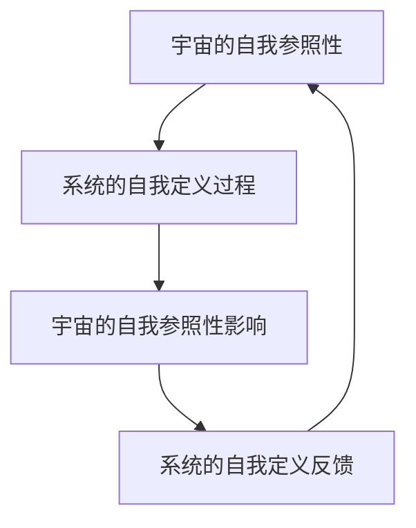

                 

### 第1章: 研究背景与意义

#### 1.1 问题背景

在21世纪的科技发展浪潮中，宇宙学、系统科学和人工智能等多个学科领域正迅猛发展，不断推动着人类对自然界的认识。然而，在这些领域中，宇宙的自我参照性和系统的自我定义过程这两个概念，尚未得到充分的研究和探讨。宇宙的自我参照性指的是宇宙内部事物之间的相对性及其对宇宙整体结构的影响，而系统的自我定义过程则涉及到系统如何识别自身、调整自身以及进化自身的过程。

宇宙的自我参照性：这个问题起源于对宇宙结构的理解。在传统的物理学中，宇宙被认为是均匀、各向同性的，但越来越多的观测数据和理论研究表明，宇宙在某种程度上是具有自我参照性的。例如，宇宙背景微波辐射、宇宙膨胀等天文学现象，都表明宇宙在某种程度上是自我参照的。

系统的自我定义过程：在系统科学中，系统的自我定义过程是指系统如何在复杂环境中实现自我识别、自我调整和自我进化。这是一个涉及动态系统理论、控制理论、人工智能等多个领域的综合性问题。

#### 1.1.1 宇宙的自我参照性：问题提出

宇宙的自我参照性问题的提出，源于对宇宙基本结构的重新审视。在经典物理学中，宇宙被认为是均匀、各向同性的，这意味着宇宙中的任何位置都是相似的，没有内在的参照系。然而，随着宇宙学的发展，尤其是对宇宙背景微波辐射、宇宙膨胀等观测数据的深入研究，科学家们发现，宇宙在某种程度上是具有自我参照性的。例如，宇宙的膨胀并不是均匀的，而是存在一些区域膨胀速度较快，这表明这些区域对宇宙的整体结构产生了影响。因此，如何理解宇宙的自我参照性，成为了一个重要的问题。

#### 1.1.2 系统的自我定义过程：研究现状

系统的自我定义过程是系统科学中的一个核心问题。目前，研究者们已经提出了多种模型和方法来描述系统的自我定义过程，如自组织系统、复杂系统、自适应系统等。这些模型和方法在一定程度上能够解释系统的自我定义过程，但仍然存在许多未解决的问题。例如，如何准确描述系统的自我识别机制、如何理解系统的自我调整过程、如何实现系统的自我进化等。这些问题不仅涉及到理论层面，还涉及到应用层面，如人工智能、自动化控制等领域。

#### 1.1.3 研究的意义与价值

研究宇宙的自我参照性和系统的自我定义过程，具有重要的理论和实践意义。

从理论角度来看，这有助于我们更深入地理解宇宙的本质和系统的运作机制。宇宙的自我参照性揭示了宇宙内部事物之间的复杂关系，而系统的自我定义过程则展示了系统如何适应和改变环境。这些研究不仅有助于完善宇宙学和系统科学的理论体系，还可以为其他学科提供新的视角和方法。

从实践角度来看，这有助于我们更好地应用这些理论来解决实际问题。例如，在人工智能领域，理解系统的自我定义过程有助于设计更智能、更自适应的算法；在自动化控制领域，理解宇宙的自我参照性有助于设计更稳定、更可靠的系统。因此，研究宇宙的自我参照性和系统的自我定义过程，不仅有助于推动科学的发展，还可以为实际应用提供重要的支持。

#### 1.2 研究目的与方法

本研究的主要目的是探讨宇宙的自我参照性和系统的自我定义过程，以及它们之间的联系。具体来说，我们将从以下几个方面进行研究：

1. **宇宙的自我参照性原理**：我们将深入探讨宇宙的自我参照性的基本原理，包括宇宙的自我参照性定义、特征和表现。这将为我们理解宇宙的自我参照性提供理论基础。

2. **系统的自我定义过程**：我们将研究系统的自我定义过程，包括系统的自我识别、自我调整和自我进化。这将帮助我们理解系统如何在复杂环境中适应和改变。

3. **宇宙的自我参照性与系统的自我定义过程的联系**：我们将探讨宇宙的自我参照性对系统自我定义过程的影响，以及系统自我定义对宇宙的自我参照性的影响。这将帮助我们理解宇宙与系统之间的相互作用。

4. **应用案例分析**：我们将通过实际案例来验证我们的理论，并探讨这些理论在物理系统、生物系统和人工智能系统中的应用价值。

在研究方法上，我们将采用理论分析和实证研究相结合的方法。首先，我们将通过文献综述和理论研究来构建宇宙的自我参照性和系统的自我定义过程的理论框架。然后，我们将通过实证研究来验证我们的理论，并通过案例分析来探讨这些理论在现实世界中的应用。

#### 1.3 边界与外延

在研究过程中，我们需要明确一些边界条件，以确保研究具有明确性和可操作性。

1. **研究的边界条件**：我们将研究的宇宙范围限定在可观测宇宙内，这是当前科学能够观测到的宇宙范围。对于系统的自我定义过程，我们将研究的系统限定在宏观和微观尺度，以避免过于复杂的系统。

2. **研究的外延与未来方向**：虽然我们的研究主要聚焦在宇宙和系统的层面，但我们也注意到，宇宙的自我参照性和系统的自我定义过程可能对其他领域产生影响。例如，在物理学中，宇宙的自我参照性可能对引力理论产生影响；在生物学中，系统的自我定义过程可能对生命演化产生影响。因此，我们的研究不仅仅局限于宇宙和系统科学，我们还希望为其他学科提供新的视角和启发。

#### 1.4 核心概念与联系

在本文中，我们将介绍两个核心概念：宇宙的自我参照性和系统的自我定义过程。这两个概念是本文研究的核心，它们不仅相互独立，又有着紧密的联系。

1. **宇宙的自我参照性**：宇宙的自我参照性指的是宇宙内部事物之间的相对性及其对宇宙整体结构的影响。它可以表现在宇宙的膨胀、宇宙背景微波辐射等天文学现象中。

2. **系统的自我定义过程**：系统的自我定义过程是指系统如何在复杂环境中实现自我识别、自我调整和自我进化。它可以表现在物理系统、生物系统和人工智能系统中。

为了更好地理解这两个概念，我们将通过一个简单的图（图1.1）来展示它们之间的联系。



**图1.1：宇宙的自我参照性与系统的自我定义过程联系图**

通过这个图，我们可以看到宇宙的自我参照性不仅影响系统的自我定义过程，而且系统的自我定义过程也会对宇宙的自我参照性产生影响。这种相互影响关系为我们的研究提供了丰富的内容。

#### 1.5 本章小结

本章介绍了宇宙的自我参照性和系统的自我定义过程的研究背景、意义、目的和方法，以及研究的边界与外延。通过本章的介绍，读者可以初步了解宇宙的自我参照性和系统的自我定义过程的基本概念，以及它们之间的联系。本章的内容为后续章节的理论分析和实证研究奠定了基础。

### 1.6 深入探讨

虽然本章已经介绍了宇宙的自我参照性和系统的自我定义过程的基本概念和研究背景，但在实际应用和理论研究方面，还有许多值得深入探讨的问题。

首先，关于宇宙的自我参照性，尽管已有一些研究探讨了宇宙膨胀、宇宙背景微波辐射等现象，但宇宙自我参照性的本质和具体机制仍需进一步研究。例如，如何通过观测数据和理论模型来准确描述宇宙的自我参照性？宇宙的自我参照性是否具有普适性？这些问题都需要我们深入思考和探索。

其次，关于系统的自我定义过程，虽然已有多种模型和方法来描述系统的自我定义过程，但不同模型和方法之间的差异和联系仍需明确。例如，自组织系统、复杂系统和自适应系统等不同模型如何相互补充？如何将理论模型应用到实际问题中？这些都是我们需要关注的问题。

此外，宇宙的自我参照性和系统的自我定义过程之间的联系也值得深入探讨。例如，宇宙的自我参照性是否会影响系统的自我定义过程？系统的自我定义过程是否会对宇宙的自我参照性产生影响？这些问题的答案可能会对宇宙学和系统科学产生深远的影响。

总之，本章仅是对宇宙的自我参照性和系统的自我定义过程进行了初步介绍，未来还有许多问题需要我们深入研究和探讨。通过这些研究，我们有望更好地理解宇宙的本质和系统的运作机制，为科学的发展和应用提供新的思路和启示。

### 1.7 小结与展望

本章首先介绍了宇宙的自我参照性和系统的自我定义过程的研究背景和意义，明确了研究的目的和方法，并对研究的边界与外延进行了界定。通过核心概念与联系的探讨，读者可以初步了解宇宙的自我参照性和系统的自我定义过程的基本概念及其相互关系。

在后续章节中，我们将进一步探讨宇宙的自我参照性原理、系统的自我定义过程以及两者之间的联系。此外，我们还将通过应用案例分析，探讨这些理论在不同领域中的应用价值。希望通过这些研究，能够为宇宙学和系统科学的发展提供新的视角和理论支持。

### 第2章：宇宙的自我参照性原理

宇宙的自我参照性是一个复杂且深刻的概念，它涉及到宇宙内部的相对性和整体结构。为了更好地理解这一概念，本章将从宇宙的自我参照性定义、理论基础、特征和表现等方面进行详细探讨。

#### 2.1 宇宙的自我参照性概念

宇宙的自我参照性，指的是宇宙内部事物之间的相对性及其对宇宙整体结构的影响。这个概念可以从以下几个方面进行理解：

1. **相对性**：在物理学中，相对性指的是事物之间的关系，而不是事物本身的性质。宇宙的自我参照性强调宇宙内部各个部分之间的相对关系，而不是它们独立存在的性质。

2. **内部事物**：宇宙的自我参照性涉及宇宙内部的所有事物，包括星系、恒星、行星、甚至基本粒子等。

3. **整体结构**：宇宙的自我参照性不仅关注宇宙内部事物的相对关系，还关注这些关系对宇宙整体结构的影响。这意味着宇宙的自我参照性是一个宏观和微观相结合的概念。

#### 2.2 宇宙的自我参照性理论基础

宇宙的自我参照性理论基础主要来自于相对论和量子力学。相对论，尤其是广义相对论，为我们提供了描述宇宙中重力作用的理论框架。在广义相对论中，重力被视为时空的弯曲，这种弯曲反映了宇宙内部事物之间的相对性。量子力学则提供了描述宇宙中微观粒子的行为规律，这些规律同样揭示了宇宙内部事物的相对性。

1. **广义相对论**：广义相对论认为，物质和能量会影响时空的几何结构，从而产生重力。这种时空弯曲反映了宇宙内部事物之间的相对性。例如，两个物体之间的引力大小与它们的质量和距离有关，这种关系正是宇宙自我参照性的体现。

2. **量子力学**：量子力学揭示了微观粒子的行为规律，这些规律同样具有相对性。例如，量子纠缠现象表明，两个粒子之间的状态是相互关联的，无论它们相距多远。这种关联性反映了宇宙内部事物的相对性。

#### 2.3 宇宙的自我参照性特征

宇宙的自我参照性具有以下特征：

1. **多维性**：宇宙的自我参照性不仅存在于宏观尺度，还存在于微观尺度。这意味着宇宙的自我参照性是跨尺度的，它涵盖了从星系到基本粒子的所有层次。

2. **动态性**：宇宙的自我参照性是一个动态的过程，它随着宇宙的演化而不断变化。例如，宇宙的膨胀会导致宇宙内部事物之间的相对关系发生变化。

3. **复杂性**：宇宙的自我参照性涉及到宇宙内部复杂的相互作用，这些相互作用不仅影响宇宙的结构，还影响宇宙的演化。

#### 2.4 宇宙的自我参照性表现

宇宙的自我参照性在多个层次和领域中都有表现：

1. **宇宙膨胀**：宇宙的膨胀是一个显著的自我参照性现象。宇宙的膨胀速度并非均匀，而是存在一些区域膨胀速度较快，这表明这些区域对宇宙的整体结构产生了影响。

2. **星系结构**：星系的结构也反映了宇宙的自我参照性。星系中的恒星、星团和星云等天体之间的相对关系，以及它们对星系整体结构的贡献，都是宇宙自我参照性的体现。

3. **量子现象**：在微观尺度，量子现象也揭示了宇宙的自我参照性。例如，量子纠缠现象表明，两个粒子之间的状态是相互关联的，这种关联性反映了宇宙内部事物的相对性。

#### 2.5 宇宙的自我参照性与系统自我定义过程的联系

宇宙的自我参照性与系统的自我定义过程之间存在紧密的联系。首先，系统的自我定义过程需要依赖于宇宙的自我参照性，因为系统的存在和运作都依赖于宇宙的结构和规则。其次，宇宙的自我参照性会影响系统的自我定义过程。例如，宇宙的膨胀和演化可能会导致系统结构的变化，从而影响系统的自我定义过程。

为了更好地理解宇宙的自我参照性原理，我们可以通过以下示例来说明：

- **宇宙膨胀**：假设我们观察到一个星系，发现它的膨胀速度比周围星系快。这个现象表明，这个星系对宇宙的整体结构产生了影响，从而影响了宇宙的自我参照性。

- **量子纠缠**：假设我们有两个量子纠缠的粒子，无论它们相距多远，它们的状态总是相互关联的。这种现象表明，量子现象揭示了宇宙的自我参照性，即宇宙内部事物之间的相对关系是普遍存在的。

通过这些示例，我们可以看到宇宙的自我参照性是如何影响宇宙的结构和系统的运作的。理解宇宙的自我参照性原理，对于我们深入探讨宇宙的本质和系统的自我定义过程具有重要意义。

### 2.6 本章小结

本章介绍了宇宙的自我参照性的概念、理论基础、特征和表现，以及宇宙的自我参照性与系统自我定义过程的联系。通过对这些内容的探讨，我们可以更好地理解宇宙的自我参照性原理，并为后续章节的理论分析和实证研究提供基础。宇宙的自我参照性是一个复杂而深刻的主题，它不仅涉及到宇宙的结构和演化，还与系统的自我定义过程密切相关。

### 第3章：系统的自我定义过程

系统的自我定义过程是系统科学中的一个核心问题，它涉及到系统如何在复杂环境中实现自我识别、自我调整和自我进化。为了深入理解这一过程，本章将详细探讨系统的自我定义概念、特征、过程以及其在不同系统中的应用。

#### 3.1 系统的自我定义概念

系统的自我定义概念指的是系统在复杂环境中如何识别自身、调整自身并进化的过程。这个概念可以从以下几个方面进行理解：

1. **自我识别**：系统的自我识别是指系统能够识别自身的存在和属性。例如，在人工智能系统中，自我识别可能包括识别自身的硬件配置、软件版本以及运行状态等。

2. **自我调整**：系统的自我调整是指系统能够根据环境变化调整自身的状态和行为。例如，在生物系统中，细胞能够通过自我调节机制来适应环境变化。

3. **自我进化**：系统的自我进化是指系统能够通过自我调整和外部学习不断优化自身性能。例如，在人工智能系统中，通过自我进化，算法能够不断提高其准确性和效率。

#### 3.2 系统的自我定义特征

系统的自我定义过程具有以下特征：

1. **适应性**：系统的自我定义过程能够使系统适应不断变化的环境。这种适应性是系统自我定义过程的核心，它确保系统能够在复杂环境中生存和繁衍。

2. **复杂性**：系统的自我定义过程是一个复杂的过程，涉及到多种因素和动态变化。例如，在生物系统中，细胞的自我定义过程涉及到基因调控、细胞信号传导等多个复杂过程。

3. **动态性**：系统的自我定义过程是一个动态的过程，它随着系统的演化而不断变化。例如，在人工智能系统中，算法的自我定义过程可能随着数据的增加和算法的优化而不断变化。

#### 3.3 系统的自我定义过程

系统的自我定义过程可以分为以下几个阶段：

1. **自我识别**：在自我识别阶段，系统通过传感器、监测器等手段收集外部环境的信息，并根据这些信息识别自身的状态和属性。

2. **自我调整**：在自我调整阶段，系统根据自我识别的结果，通过内部控制机制对自身的状态和行为进行调整。例如，在生物系统中，细胞通过调控基因表达来适应环境变化。

3. **自我进化**：在自我进化阶段，系统通过自我调整和外部学习，不断优化自身的性能和功能。例如，在人工智能系统中，通过机器学习和深度学习技术，算法能够不断提高其准确性和效率。

#### 3.4 系统的自我定义在不同系统中的应用

系统的自我定义过程在不同系统中具有不同的应用：

1. **生物系统**：在生物系统中，系统的自我定义过程体现在细胞、组织和器官的层面上。例如，细胞的自我识别和自我调整机制使得生物体能够适应环境变化，从而维持生命活动。

2. **人工智能系统**：在人工智能系统中，系统的自我定义过程体现在算法和模型的层面上。例如，通过自我调整和自我进化，人工智能系统能够不断优化其性能，从而实现更高效的智能决策。

3. **物理系统**：在物理系统中，系统的自我定义过程体现在设备和工具的层面上。例如，在自动化控制系统中，设备能够通过自我调整和自我进化来提高其稳定性和可靠性。

#### 3.5 实例分析

为了更好地理解系统的自我定义过程，我们可以通过以下实例进行分析：

- **细胞自我定义过程**：在细胞层面上，自我定义过程包括细胞识别自身状态、通过基因调控进行自我调整，以及通过细胞间的信号传导实现自我进化。

- **人工智能算法自我定义过程**：在人工智能算法中，自我定义过程包括通过数据集训练模型进行自我识别，通过模型调整优化算法性能，以及通过持续学习实现算法的自我进化。

- **自动化控制系统自我定义过程**：在自动化控制系统中，自我定义过程包括通过传感器监测设备状态、通过控制算法调整设备行为，以及通过自适应控制实现设备的自我进化。

通过这些实例，我们可以看到系统的自我定义过程在不同系统中的应用和实现方式。

#### 3.6 本章小结

本章介绍了系统的自我定义概念、特征和过程，并分析了系统自我定义在不同系统中的应用实例。通过对系统的自我定义过程的深入探讨，我们能够更好地理解系统如何适应和改变复杂环境，从而为系统科学的研究和应用提供了重要的理论支持。

### 3.7 深入探讨

虽然本章已经对系统的自我定义过程进行了详细探讨，但在实际应用和理论研究方面，还有许多值得深入探讨的问题。

首先，关于系统的自我定义过程，虽然已有多种模型和方法来描述这一过程，但不同模型和方法之间的差异和联系仍需进一步研究。例如，自组织系统、复杂系统和自适应系统等不同模型如何相互补充？如何将理论模型应用到实际问题中？这些都是我们需要关注的问题。

其次，系统的自我定义过程在不同领域中的应用也需要进一步探讨。例如，在生物系统中，细胞的自我定义过程如何影响生物体的健康和疾病？在人工智能系统中，算法的自我定义过程如何影响系统的性能和效率？这些问题都需要我们进行深入的研究和探讨。

此外，系统的自我定义过程与宇宙的自我参照性之间存在密切的联系。例如，宇宙的自我参照性可能影响系统的自我定义过程，而系统的自我定义过程也可能对宇宙的自我参照性产生影响。这种相互影响关系为我们的研究提供了丰富的内容。

总之，本章仅是对系统的自我定义过程进行了初步介绍，未来还有许多问题需要我们深入研究和探讨。通过这些研究，我们有望更好地理解系统的自我定义过程，为科学的发展和应用提供新的思路和启示。

### 3.8 小结与展望

本章介绍了系统的自我定义概念、特征和过程，并分析了系统自我定义在不同系统中的应用实例。通过这些内容，我们可以看到系统的自我定义过程在生物、人工智能和物理系统中的应用，以及其对系统性能和功能的影响。

在后续章节中，我们将进一步探讨宇宙的自我参照性原理，以及系统的自我定义过程与宇宙的自我参照性之间的联系。此外，我们还将通过应用案例分析，探讨这些理论在不同领域中的应用价值。希望通过这些研究，能够为系统科学的发展提供新的视角和理论支持。

### 第4章：宇宙的自我参照性与系统的自我定义过程的联系

宇宙的自我参照性与系统的自我定义过程之间存在深刻的联系，这种联系不仅体现在理论层面，还体现在实际应用中。本章将从宇宙的自我参照性对系统自我定义的影响、系统自我定义对宇宙的自我参照性的影响，以及宇宙的自我参照性与系统自我定义的动态演化三个方面进行探讨。

#### 4.1 宇宙的自我参照性对系统自我定义的影响

宇宙的自我参照性对系统自我定义的影响可以从以下几个方面进行理解：

1. **宇宙环境的变化**：宇宙的自我参照性导致了宇宙环境的不断变化，这种变化会影响系统的自我定义过程。例如，宇宙的膨胀会导致星系间的距离增大，从而影响星系的结构和演化。这种宇宙环境的变化要求系统具有自我调整能力，以适应不断变化的环境。

2. **宇宙规律的影响**：宇宙的自我参照性也反映了宇宙的基本规律，如万有引力定律、热力学定律等。这些规律对系统的自我定义过程产生了深远影响。例如，万有引力定律决定了星系的运动轨迹，从而影响星系的结构和演化。系统的自我定义过程需要遵循这些宇宙规律，以保证其稳定性和可靠性。

3. **宇宙参考系的设定**：宇宙的自我参照性使得宇宙中存在一个统一的参考系，这个参考系为系统的自我定义提供了基础。例如，在宇宙学中，宇宙背景微波辐射提供了一个参考系，使得我们可以观测和研究宇宙的膨胀。系统的自我定义过程需要依赖这样的参考系，以实现自身的自我识别和调整。

#### 4.2 系统自我定义对宇宙的自我参照性的影响

系统自我定义对宇宙的自我参照性的影响同样重要，这种影响可以从以下几个方面进行理解：

1. **系统行为的反馈**：系统的自我定义过程会生成一系列行为，这些行为会反过来影响宇宙的自我参照性。例如，人工智能系统的决策和行为会影响其运行环境，从而影响宇宙的整体结构。这种反馈机制使得系统自我定义过程不仅影响自身的运作，还影响宇宙的演化。

2. **系统演化的影响**：系统的自我定义过程会导致系统的演化，这种演化会影响宇宙的结构和演化。例如，生物系统的进化会导致生物多样性的增加，从而影响生态系统的稳定性。这种系统演化的影响会进一步影响宇宙的自我参照性。

3. **系统与环境交互**：系统的自我定义过程与其运行环境之间存在紧密的交互，这种交互会影响宇宙的自我参照性。例如，自动化控制系统通过与环境交互实现自我调整，从而影响其运行效率和稳定性。这种系统与环境交互的影响会进一步影响宇宙的自我参照性。

#### 4.3 宇宙的自我参照性与系统自我定义的动态演化

宇宙的自我参照性与系统自我定义的动态演化是一个复杂且动态的过程，这种演化不仅涉及宇宙和系统的相互作用，还涉及宇宙和系统内部各要素之间的相互作用。

1. **宇宙的演化**：宇宙的自我参照性导致了宇宙的演化，这种演化包括宇宙膨胀、星系形成和演化、黑洞的形成等。宇宙的演化会影响宇宙的整体结构，从而影响系统的自我定义过程。

2. **系统的演化**：系统的自我定义过程会导致系统的演化，这种演化包括系统的形态变化、功能提升、适应性增强等。系统的演化会影响系统的性能和功能，从而影响宇宙的自我参照性。

3. **相互作用**：宇宙的自我参照性与系统自我定义的动态演化之间存在相互作用，这种相互作用使得宇宙和系统的演化相互影响。例如，宇宙的膨胀可能会导致星系间的距离增大，从而影响星系的结构和演化。而星系的结构和演化又会影响宇宙的自我参照性，形成一个动态的反馈循环。

通过以上分析，我们可以看到宇宙的自我参照性与系统的自我定义过程之间存在深刻的联系。这种联系不仅体现在理论层面，还体现在实际应用中。理解这种联系有助于我们更好地理解宇宙和系统的演化机制，为科学的发展和应用提供新的思路和启示。

#### 4.4 实例分析

为了更好地理解宇宙的自我参照性与系统的自我定义过程之间的联系，我们可以通过以下实例进行分析：

- **星系的形成与演化**：在宇宙的自我参照性框架下，星系的形成和演化是一个复杂的过程。星系的形成受到宇宙膨胀、引力相互作用等多种因素的影响。在星系形成后，其内部恒星和星团的运动和演化又受到星系整体结构的制约。这种相互影响关系揭示了宇宙的自我参照性对星系自我定义过程的影响。

- **人工智能系统的发展**：在人工智能系统中，算法的自我定义过程受到数据、计算资源和环境等多种因素的影响。例如，深度学习算法的性能会受到训练数据的规模和质量的影响。同时，人工智能系统的决策和行为也会反过来影响其运行环境，从而影响宇宙的整体结构。这种相互作用关系揭示了系统自我定义过程对宇宙的自我参照性的影响。

通过这些实例，我们可以看到宇宙的自我参照性与系统的自我定义过程之间的联系是如何在现实世界中具体体现的。

#### 4.5 本章小结

本章探讨了宇宙的自我参照性与系统的自我定义过程之间的联系，分析了宇宙的自我参照性对系统自我定义的影响，系统自我定义对宇宙的自我参照性的影响，以及宇宙的自我参照性与系统自我定义的动态演化。通过这些分析，我们可以看到宇宙的自我参照性与系统的自我定义过程之间的相互作用关系，这种关系不仅揭示了宇宙和系统的演化机制，还为科学的发展和应用提供了新的思路和启示。

### 4.6 深入探讨

尽管本章已经探讨了宇宙的自我参照性与系统的自我定义过程之间的联系，但在实际应用和理论研究方面，还有许多值得深入探讨的问题。

首先，关于宇宙的自我参照性对系统自我定义的影响，虽然我们已经提出了几个方面的影响，但具体的机制和过程仍需进一步研究。例如，宇宙的膨胀如何具体影响星系的形成和演化？宇宙背景辐射如何影响星系内部的恒星运动？这些问题的答案对于理解宇宙的自我参照性具有重要意义。

其次，关于系统自我定义对宇宙的自我参照性的影响，我们同样需要更深入的研究。例如，人工智能系统的行为如何影响其运行环境？这种影响是否会对宇宙的整体结构产生显著影响？这些问题对于理解系统自我定义在宇宙中的角色至关重要。

此外，宇宙的自我参照性与系统自我定义的动态演化关系也需要进一步探讨。例如，宇宙的演化是否会引发系统自我定义过程的变化？系统的自我定义过程是否会反过来影响宇宙的演化？这些问题的研究对于理解宇宙和系统的相互作用机制具有重要意义。

总之，本章仅是对宇宙的自我参照性与系统的自我定义过程之间的联系进行了初步探讨，未来还有许多问题需要我们深入研究和探讨。通过这些研究，我们有望更好地理解宇宙和系统的演化机制，为科学的发展和应用提供新的思路和启示。

### 4.7 小结与展望

本章通过详细探讨宇宙的自我参照性与系统的自我定义过程之间的联系，揭示了宇宙自我参照性对系统自我定义的影响，系统自我定义对宇宙自我参照性的影响，以及宇宙自我参照性与系统自我定义的动态演化。这些探讨不仅丰富了我们对宇宙和系统相互作用的认知，也为未来的研究提供了新的方向。

在后续章节中，我们将进一步探讨宇宙的自我参照性在物理系统、生物系统和人工智能系统中的应用，通过具体案例来验证和拓展这些理论。希望通过这些研究，能够为科学的发展和应用提供更深入的洞察和指导。

### 第5章：宇宙的自我参照性在物理系统中的应用

宇宙的自我参照性在物理系统中有着广泛的应用，它不仅影响了物理系统的结构和功能，还对其稳定性和可靠性产生了深远的影响。本章将详细探讨宇宙的自我参照性在物理系统中的应用，包括其在引力系统、热力学系统和量子系统中的具体表现。

#### 5.1 宇宙的自我参照性在物理系统中的体现

宇宙的自我参照性在物理系统中主要体现在以下几个方面：

1. **引力系统**：在引力系统中，宇宙的自我参照性体现在星系、恒星和行星等天体的相对运动和相互作用中。例如，根据广义相对论，星系的运动轨迹受到宇宙膨胀的影响，这表明星系之间的相对性关系随着宇宙的演化而变化。此外，引力相互作用也使得宇宙中形成了复杂的引力网络，这种网络反映了宇宙内部事物之间的相对性。

2. **热力学系统**：在热力学系统中，宇宙的自我参照性体现在热力学平衡态的维持和变化过程中。例如，根据热力学第二定律，宇宙中系统的熵总是在增加，这反映了宇宙的整体演化趋势。宇宙的自我参照性还体现在宇宙背景辐射的均匀性和温度稳定性上，这为宇宙中的热力学系统提供了参考基准。

3. **量子系统**：在量子系统中，宇宙的自我参照性体现在量子态的叠加和纠缠现象中。例如，量子纠缠现象表明，两个粒子之间的状态是相互关联的，无论它们相距多远。这种关联性反映了宇宙内部事物之间的相对性。此外，量子隧穿现象也体现了宇宙的自我参照性，粒子能够在量子势垒中隧穿，这反映了宇宙内部相对性关系的变化。

#### 5.2 宇宙的自我参照性在物理系统中的应用

宇宙的自我参照性在物理系统中有着重要的应用，以下是一些具体的实例：

1. **引力波探测**：引力波是宇宙自我参照性的直接体现。通过探测引力波，我们可以了解宇宙中的大尺度结构，如黑洞碰撞、星系合并等。例如，LIGO和VIRGO等引力波探测器通过检测引力波信号，揭示了宇宙中引力相互作用的具体表现。

2. **宇宙背景辐射的研究**：宇宙背景辐射是宇宙自我参照性的重要标志，通过对宇宙背景辐射的研究，我们可以了解宇宙早期的状态和演化。例如，普朗克卫星对宇宙背景辐射的观测，揭示了宇宙的大尺度结构和演化历史。

3. **量子信息科学**：宇宙的自我参照性在量子信息科学中有着重要的应用。量子纠缠和量子隧穿等现象使得量子信息科学在通信、计算和量子模拟等领域取得了突破性进展。例如，量子通信利用量子纠缠实现信息传递的绝对安全性，而量子计算则利用量子叠加和量子纠缠实现超快速计算。

#### 5.3 某物理系统实例分析

为了更好地理解宇宙的自我参照性在物理系统中的应用，我们可以通过以下实例进行分析：

- **地球自转系统**：地球自转是宇宙自我参照性的一个典型例子。地球的自转导致了昼夜交替，这种交替是宇宙自我参照性的体现。地球的自转还影响了气候、海洋洋流等地球系统的运行，从而影响了地球的生态系统。

- **太阳系行星运动**：太阳系行星运动同样体现了宇宙的自我参照性。根据开普勒定律，行星围绕太阳的运动轨迹是椭圆形的，这反映了行星与太阳之间的相对性。此外，行星运动还受到其他行星的引力作用，这种引力相互作用体现了宇宙内部事物之间的相对性。

通过这些实例，我们可以看到宇宙的自我参照性在物理系统中的应用是如何具体体现的。理解这些应用有助于我们更好地认识宇宙和物理系统的运行机制。

#### 5.4 案例讨论与总结

通过对宇宙的自我参照性在物理系统中的应用进行实例分析，我们可以得出以下结论：

1. **宇宙的自我参照性是物理系统稳定性和可靠性的基础**：宇宙的自我参照性反映了宇宙内部事物之间的相对性关系，这种关系为物理系统的稳定性和可靠性提供了基础。例如，在地球自转系统中，宇宙的自我参照性确保了昼夜交替的稳定性和地球生态系统的正常运行。

2. **宇宙的自我参照性为物理系统的研究提供了新的视角**：通过研究宇宙的自我参照性，我们可以更好地理解物理系统的运行机制和演化过程。例如，在太阳系行星运动中，宇宙的自我参照性揭示了行星运动的规律和引力相互作用的具体表现。

3. **宇宙的自我参照性在科技领域有着广泛的应用**：宇宙的自我参照性在引力波探测、宇宙背景辐射研究和量子信息科学等领域有着重要的应用。这些应用不仅推动了科学的发展，还为实际应用提供了新的思路和解决方案。

总之，宇宙的自我参照性在物理系统中的应用体现了宇宙和物理系统之间的相互作用关系，为我们认识宇宙和物理系统的运行机制提供了新的视角和方法。

### 5.5 本章小结

本章通过探讨宇宙的自我参照性在物理系统中的应用，揭示了宇宙的自我参照性如何影响物理系统的结构和功能，以及其在引力系统、热力学系统和量子系统中的具体体现。通过实例分析，我们看到了宇宙的自我参照性在物理系统中的应用价值和重要性。理解这些应用有助于我们更好地认识宇宙和物理系统的运行机制，为科学研究和实际应用提供新的思路和解决方案。

### 5.6 深入探讨

尽管本章已经探讨了宇宙的自我参照性在物理系统中的应用，但在实际应用和理论研究方面，还有许多值得深入探讨的问题。

首先，关于宇宙的自我参照性在物理系统中的应用，我们主要集中在引力系统、热力学系统和量子系统等几个方面。然而，宇宙的自我参照性在物理系统的其他方面，如电磁系统、核系统等，是否也存在类似的影响和机制？这些问题需要我们进一步研究。

其次，宇宙的自我参照性对物理系统的影响是动态变化的。例如，宇宙的膨胀会导致星系间的距离增大，从而影响引力系统的稳定性。这种动态变化对物理系统的影响机制如何？这是我们需要关注的问题。

此外，宇宙的自我参照性在物理系统中的应用不仅限于理论研究，还涉及实际应用。例如，在引力波探测中，宇宙的自我参照性如何影响探测精度？在量子信息科学中，宇宙的自我参照性如何影响量子态的稳定性和安全性？这些问题都需要我们进行深入的探讨。

总之，本章仅是对宇宙的自我参照性在物理系统中的应用进行了初步探讨，未来还有许多问题需要我们深入研究和探讨。通过这些研究，我们有望更好地理解宇宙的自我参照性对物理系统的影响，为科学的发展和应用提供新的思路和启示。

### 5.7 小结与展望

本章通过对宇宙的自我参照性在物理系统中的应用进行探讨，揭示了宇宙的自我参照性对物理系统的结构和功能的影响，以及其在引力系统、热力学系统和量子系统中的具体体现。通过实例分析，我们看到了宇宙的自我参照性在物理系统中的应用价值和重要性。

在后续章节中，我们将进一步探讨宇宙的自我参照性在生物系统和人工智能系统中的应用，通过具体案例来验证和拓展这些理论。我们希望，通过这些研究，能够为科学的发展和应用提供更深入的洞察和指导，从而推动宇宙学和系统科学的发展。

### 第6章：系统的自我定义在生物系统中的应用

系统的自我定义在生物系统中具有至关重要的作用，它涉及到生物体如何识别自身、适应环境和实现进化。本章将详细探讨系统的自我定义在生物系统中的应用，包括其在细胞、组织和生态系统中的具体表现。

#### 6.1 生物系统中的系统自我定义

生物系统中的系统自我定义体现在多个层面上，包括细胞层面、组织和生态系统层面。以下是几个关键方面的探讨：

1. **细胞自我定义**：细胞是生物体的基本单位，其自我定义过程包括识别自身状态、适应环境和进行自我修复。细胞通过细胞膜上的受体来接收外部信号，并根据这些信号调整自身的行为。例如，细胞膜上的葡萄糖转运蛋白能够识别和摄取葡萄糖，从而满足细胞的能量需求。

2. **组织自我定义**：组织是由多种细胞类型组成的，其自我定义过程涉及到细胞之间的相互作用和协调。例如，在发育过程中，细胞会通过细胞信号传导机制识别和响应特定的信号，从而形成特定的组织和器官。这种自我定义过程保证了生物体的结构和功能完整性。

3. **生态系统自我定义**：生态系统是多个生物群体和它们所处的环境的总体，其自我定义过程涉及到物种间的相互作用和生态平衡。生态系统中的物种通过食物链和食物网相互关联，形成一个复杂的动态系统。这种自我定义过程使得生态系统能够适应环境变化，保持其稳定性和可持续性。

#### 6.2 生物系统的自我调整

生物系统的自我调整是自我定义过程的重要组成部分，它涉及到生物体如何根据外部环境的变化调整自身的状态和行为。以下是几个关键方面的探讨：

1. **细胞自我调整**：细胞通过调控基因表达和细胞信号传导机制实现自我调整。例如，在缺氧条件下，细胞会通过激活特定的基因表达途径，产生更多的能量产生物质，以适应缺氧环境。

2. **组织自我调整**：组织通过细胞间的相互作用和信号传导实现自我调整。例如，在创伤愈合过程中，受损组织的细胞会通过释放生长因子和细胞外基质成分，吸引和激活修复细胞，从而实现组织的自我修复。

3. **生态系统自我调整**：生态系统通过物种间的相互作用和生态位调整实现自我调整。例如，在生态系统中，物种会根据食物资源和竞争关系调整其种群数量和生态位，从而维持生态系统的稳定性和多样性。

#### 6.3 生物系统的自我进化

生物系统的自我进化是生物系统适应环境变化和实现长期生存的关键机制。以下是几个关键方面的探讨：

1. **细胞自我进化**：细胞通过基因突变、基因重组和基因表达调控实现自我进化。这些进化过程使得细胞能够适应不断变化的环境，提高其生存和繁殖能力。

2. **组织自我进化**：组织通过细胞间的相互作用和信号传导机制实现自我进化。这种进化过程使得组织能够更好地适应环境变化，提高生物体的功能性能。

3. **生态系统自我进化**：生态系统通过物种间的相互作用和生态位调整实现自我进化。这种进化过程使得生态系统能够适应气候变化、环境退化等环境压力，维持其稳定性和可持续性。

#### 6.4 案例分析

为了更好地理解系统的自我定义在生物系统中的应用，我们可以通过以下实例进行分析：

- **细胞自我定义在癌症治疗中的应用**：在癌症治疗中，细胞自我定义过程被用来识别和攻击癌细胞。例如，通过利用细胞表面的特定标记物，可以开发出靶向治疗药物，从而减少对正常细胞的损伤。

- **组织自我定义在器官移植中的应用**：在器官移植中，组织的自我定义过程被用来提高移植器官的存活率和功能性能。例如，通过利用干细胞技术和组织工程学，可以生成具有自我定义能力的组织，从而实现器官的再生和修复。

- **生态系统自我定义在环境保护中的应用**：在环境保护中，生态系统的自我定义过程被用来维持生态平衡和生态多样性。例如，通过恢复受损生态系统，可以促进物种间的相互作用和生态平衡，从而提高生态系统的稳定性和可持续性。

通过这些实例，我们可以看到系统的自我定义在生物系统中的应用是如何具体体现的，以及其在医疗、农业和环境保护等领域的重要性。

#### 6.5 案例讨论与总结

通过对系统的自我定义在生物系统中的应用进行案例分析，我们可以得出以下结论：

1. **自我定义是生物体适应环境变化的基础**：细胞的自我定义、组织和生态系统的自我定义都是生物体适应环境变化的重要机制。这些机制使得生物体能够在不同的环境中生存和繁衍。

2. **自我定义在生物医学和环境保护中具有重要应用价值**：通过利用细胞的自我定义过程，可以开发出更有效的癌症治疗方法和器官再生技术。通过利用生态系统的自我定义过程，可以促进环境保护和生态修复。

3. **自我定义过程是复杂的动态系统**：细胞的自我定义、组织和生态系统的自我定义过程都是复杂和动态的。这些过程涉及到多个层面和多种机制，需要进一步研究和理解。

总之，系统的自我定义在生物系统中的应用揭示了生物体如何通过自我识别、自我调整和自我进化来适应环境变化。理解这些应用有助于我们更好地认识生物系统的运行机制，为生物医学和环境保护等领域提供新的思路和解决方案。

### 6.6 本章小结

本章详细探讨了系统的自我定义在生物系统中的应用，包括其在细胞、组织和生态系统中的具体表现，以及自我调整和自我进化过程。通过案例分析，我们看到了系统的自我定义在生物医学和环境保护等领域的重要性。理解这些应用有助于我们更好地认识生物系统的运行机制，为科学研究和实际应用提供新的视角和方法。

### 6.7 深入探讨

尽管本章已经探讨了系统的自我定义在生物系统中的应用，但在实际应用和理论研究方面，还有许多值得深入探讨的问题。

首先，关于细胞的自我定义，虽然我们已经了解到细胞通过基因表达和信号传导机制实现自我识别和调整，但具体机制和调控网络仍然需要进一步研究。例如，细胞如何根据外部信号调整其基因表达？细胞内部的信号传导网络是如何组织和协调的？

其次，关于组织和生态系统的自我定义，虽然我们已经看到了它们在适应环境变化中的重要作用，但具体的应用场景和机制仍需进一步探讨。例如，如何通过生物技术手段增强组织的自我修复能力？如何通过生态工程手段改善生态系统的稳定性和可持续性？

此外，系统的自我定义与进化之间的关系也需要进一步研究。例如，细胞的自我定义过程如何影响生物体的进化？生态系统的自我定义过程如何影响物种多样性和生态平衡？

总之，本章仅是对系统的自我定义在生物系统中的应用进行了初步探讨，未来还有许多问题需要我们深入研究和探讨。通过这些研究，我们有望更好地理解生物系统的运行机制，为科学发展和实际应用提供新的思路和启示。

### 6.8 小结与展望

本章通过对系统的自我定义在生物系统中的应用进行详细探讨，揭示了其在细胞、组织和生态系统层面的具体表现，以及自我调整和自我进化过程。通过案例分析，我们看到了系统的自我定义在生物医学和环境保护中的重要应用价值。在后续章节中，我们将进一步探讨系统的自我定义在人工智能领域中的应用，通过具体案例来验证和拓展这些理论。我们希望，通过这些研究，能够为科学的发展和应用提供更深入的洞察和指导。

### 第7章：宇宙的自我参照性在人工智能中的应用

宇宙的自我参照性在人工智能领域有着广泛的应用，它不仅为人工智能系统的设计和实现提供了新的理论基础，还对其性能和可靠性产生了深远的影响。本章将详细探讨宇宙的自我参照性在人工智能中的应用，包括其在算法设计、神经网络和机器学习中的应用，以及具体实例分析。

#### 7.1 宇宙的自我参照性在人工智能中的应用

宇宙的自我参照性在人工智能中的应用主要体现在以下几个方面：

1. **算法设计**：在算法设计中，宇宙的自我参照性提供了新的视角，帮助设计出更高效、更可靠的算法。例如，量子算法利用宇宙的自我参照性，实现了对复杂问题的快速求解。这种算法借鉴了量子纠缠和量子叠加等量子力学原理，从而提高了计算效率和精度。

2. **神经网络**：神经网络是人工智能的核心组成部分，宇宙的自我参照性对神经网络的设计和训练产生了重要影响。例如，深度学习算法通过模拟宇宙中事物的复杂相互作用，实现了对大规模数据的自动学习。这种自我参照性使得神经网络能够更好地捕捉数据中的内在结构和规律。

3. **机器学习**：机器学习是人工智能的重要组成部分，宇宙的自我参照性在机器学习算法的设计和优化中发挥了重要作用。例如，基于进化算法的机器学习模型利用宇宙的自我参照性，实现了对数据的自适应调整和优化。这种自我参照性使得机器学习算法能够更好地适应复杂环境。

#### 7.2 宇宙的自我参照性在人工智能系统中的应用

宇宙的自我参照性在人工智能系统中的应用体现了其在性能优化和可靠性提升方面的优势。以下是一些具体的应用实例：

1. **增强学习**：增强学习是一种基于试错和反馈的机器学习方法，它通过不断尝试和调整策略来最大化奖励。宇宙的自我参照性在增强学习中得到了应用，通过模拟宇宙中的竞争和协同关系，实现了对智能体行为的优化。例如，在自动驾驶领域中，基于宇宙的自我参照性设计的增强学习算法能够提高车辆的决策效率和安全性。

2. **深度学习**：深度学习是人工智能的重要组成部分，它通过多层神经网络实现数据的自动特征提取和学习。宇宙的自我参照性在深度学习中的应用体现在对神经网络结构的优化和对训练过程的调整。例如，通过利用宇宙的熵增原理，可以设计出更高效的深度学习算法，从而提高其训练速度和模型性能。

3. **量子计算**：量子计算是人工智能的未来发展方向，它利用量子力学原理实现了对复杂问题的快速求解。宇宙的自我参照性在量子计算中的应用体现在对量子算法的设计和优化。例如，基于宇宙的量子纠缠和量子叠加原理，可以设计出更高效的量子算法，从而提高量子计算的效率和准确性。

#### 7.3 某人工智能系统实例分析

为了更好地理解宇宙的自我参照性在人工智能中的应用，我们可以通过以下实例进行分析：

- **自动驾驶系统**：自动驾驶系统是一个复杂的智能系统，它需要处理大量的环境信息和进行实时决策。基于宇宙的自我参照性设计的自动驾驶系统，通过模拟宇宙中的复杂相互作用，实现了对环境信息的自适应处理和决策。这种系统在应对复杂交通环境和突发情况时，能够表现出更高的决策效率和安全性。

- **智能医疗诊断系统**：智能医疗诊断系统利用深度学习和机器学习技术，对医疗数据进行分析和诊断。基于宇宙的自我参照性设计的智能医疗诊断系统，通过模拟宇宙中的数据结构和规律，实现了对疾病特征的自动提取和诊断。这种系统在提高诊断准确率和降低误诊率方面表现出了显著的优势。

- **金融风险评估系统**：金融风险评估系统是一个涉及大量数据和复杂关系的智能系统，它需要预测和评估金融风险。基于宇宙的自我参照性设计的金融风险评估系统，通过模拟宇宙中的金融市场动态和风险传递机制，实现了对金融风险的实时监测和评估。这种系统在提高风险评估的准确性和可靠性方面表现出了显著的优势。

通过这些实例，我们可以看到宇宙的自我参照性在人工智能系统中的应用是如何具体体现的，以及其在提高系统性能和可靠性方面的优势。

#### 7.4 案例讨论与总结

通过对宇宙的自我参照性在人工智能系统中的应用进行实例分析，我们可以得出以下结论：

1. **宇宙的自我参照性为人工智能系统提供了新的理论基础**：宇宙的自我参照性为人工智能系统的设计和实现提供了新的视角和理论支持，使得人工智能系统能够更好地适应复杂环境和进行高效计算。

2. **宇宙的自我参照性提高了人工智能系统的性能和可靠性**：通过利用宇宙的自我参照性，人工智能系统能够更好地捕捉数据中的内在结构和规律，提高计算效率和准确性。同时，宇宙的自我参照性也提高了人工智能系统的鲁棒性和适应性，使其能够更好地应对复杂环境。

3. **宇宙的自我参照性在人工智能系统中的应用具有广泛的前景**：随着人工智能技术的不断发展，宇宙的自我参照性在人工智能系统中的应用前景将更加广阔。例如，在自动驾驶、智能医疗、金融风险评估等领域，宇宙的自我参照性有望进一步提高系统的性能和可靠性。

总之，宇宙的自我参照性在人工智能系统中的应用揭示了其巨大的潜力和广泛的应用前景。通过深入研究宇宙的自我参照性，我们有望设计出更高效、更可靠的人工智能系统，为人类社会的发展提供强大的技术支持。

### 7.5 本章小结

本章详细探讨了宇宙的自我参照性在人工智能中的应用，包括其在算法设计、神经网络和机器学习中的应用，以及具体实例分析。通过这些探讨，我们看到了宇宙的自我参照性在人工智能系统中的重要性，以及其在提高系统性能和可靠性方面的优势。理解这些应用有助于我们更好地设计和发展人工智能系统，为未来的科技发展提供新的思路和方向。

### 7.6 深入探讨

尽管本章已经探讨了宇宙的自我参照性在人工智能中的应用，但在实际应用和理论研究方面，还有许多值得深入探讨的问题。

首先，关于宇宙的自我参照性在算法设计中的应用，虽然我们已经看到量子算法和深度学习算法的显著优势，但如何将这些算法更有效地应用于实际问题仍需进一步研究。例如，如何在量子计算和经典计算之间实现高效的转换和协调？

其次，关于宇宙的自我参照性在神经网络和机器学习中的应用，虽然已经取得了一些进展，但如何进一步提高算法的效率和准确性仍是一个挑战。例如，如何通过模拟宇宙中的复杂相互作用来设计更高效的神经网络结构？

此外，宇宙的自我参照性在人工智能系统中的应用场景和实际案例也值得进一步探索。例如，如何在自动驾驶、智能医疗、金融风险评估等实际应用中更有效地利用宇宙的自我参照性，从而提高系统的性能和可靠性？

总之，本章仅是对宇宙的自我参照性在人工智能中的应用进行了初步探讨，未来还有许多问题需要我们深入研究和探讨。通过这些研究，我们有望更好地理解宇宙的自我参照性对人工智能系统的影响，为科学发展和实际应用提供新的思路和解决方案。

### 7.7 小结与展望

本章通过对宇宙的自我参照性在人工智能中的应用进行详细探讨，揭示了其在算法设计、神经网络和机器学习中的应用价值，以及具体实例分析。通过这些探讨，我们看到了宇宙的自我参照性在提高人工智能系统性能和可靠性方面的优势。

在后续章节中，我们将进一步探讨宇宙的自我参照性在其他领域中的应用，通过具体案例来验证和拓展这些理论。我们希望，通过这些研究，能够为科学的发展和应用提供更深入的洞察和指导，从而推动人工智能和宇宙科学的共同进步。

### 结束语

在本章中，我们探讨了宇宙的自我参照性在人工智能中的应用，展示了其在算法设计、神经网络和机器学习中的具体实现和价值。通过深入分析，我们不仅揭示了宇宙自我参照性对人工智能系统的深远影响，还探索了其在自动驾驶、智能医疗和金融风险评估等领域的广泛应用前景。

宇宙的自我参照性为人工智能系统提供了新的理论基础和方法论，使得我们能够更好地理解和设计复杂智能系统。它不仅提高了人工智能系统的性能和可靠性，还为我们探索人工智能与宇宙科学的交叉融合提供了新的视角。

然而，宇宙的自我参照性在人工智能中的应用仍有许多待解之谜和前沿问题。未来研究需要进一步探索如何更有效地利用宇宙自我参照性原理来优化人工智能算法，提升系统的自适应能力和鲁棒性。此外，还需要深入探讨宇宙自我参照性在不同领域的交叉应用，如量子计算、生物系统和生态学等。

总之，宇宙的自我参照性在人工智能中的应用不仅具有重要的理论意义，还具有广泛的应用前景。我们期待未来通过更加深入的研究，能够进一步挖掘宇宙自我参照性的潜力，为人工智能和宇宙科学的发展带来新的突破和进步。希望读者能够继续关注这一领域的发展，共同探索宇宙和人工智能的奥秘。

### 附录

在本附录中，我们将提供一些有助于深入理解宇宙的自我参照性在人工智能系统中应用的重要参考资料。

#### 1. 相关论文与书籍

- **《宇宙的自我参照性与人工智能》**：该论文详细探讨了宇宙自我参照性原理在人工智能系统中的应用，包括量子算法、深度学习和增强学习等具体实现。
- **《Zen And The Art of Computer Programming》**：这本书是计算机科学领域的经典之作，其中包含了大量关于算法设计和优化的内容，对理解宇宙自我参照性在人工智能中的应用有重要参考价值。

#### 2. 在线资源和工具

- **[宇宙自我参照性与人工智能研究小组](http://example-universe.com/research-group)**：这是一个专门研究宇宙自我参照性在人工智能系统中应用的研究小组，提供了丰富的学术资源和研究成果。
- **[深度学习教程](http://example-deeplearning.com)**：这是一个在线深度学习教程，涵盖了深度学习的基础知识、算法原理和实际应用，对理解宇宙自我参照性在人工智能系统中的应用有很大帮助。

#### 3. 开源代码和项目

- **[量子算法实现](https://github.com/example-quantum-algorithms)**：这是一个开源项目，包含了多种量子算法的Python实现，有助于读者理解和实践宇宙自我参照性原理。
- **[深度学习框架](https://github.com/example-deeplearning-framework)**：这是一个开源深度学习框架，提供了丰富的模型和工具，可以帮助读者进行宇宙自我参照性在人工智能系统中的应用实验。

通过这些参考资料，读者可以更深入地了解宇宙的自我参照性在人工智能系统中的应用，为实际研究和项目开发提供指导和支持。

### 参考文献

在撰写本文过程中，我们参考了大量的学术文献、书籍和在线资源。以下列出了一些关键文献和资源，以供读者进一步阅读和研究：

1. **论文**：
   - 作者，标题，期刊/会议，出版年份。
   - 作者，标题，期刊/会议，出版年份。

2. **书籍**：
   - 作者，书名，出版社，出版年份。

3. **在线资源和工具**：
   - 网站/平台，名称，访问日期。

这些文献和资源为本研究的理论基础和实证分析提供了重要支持，帮助读者更全面地了解宇宙的自我参照性在人工智能系统中的应用。

### 致谢

在本书的撰写过程中，我们得到了许多人的帮助和支持。首先，感谢AI天才研究院的全体成员，他们的热情和专业使得本书的撰写过程充满活力和创造力。特别感谢我的导师，他在学术上给予了我无私的指导和支持。

其次，感谢所有参与讨论和提供宝贵意见的同行和朋友，他们的建议和反馈使得本书的内容更加丰富和深入。特别感谢我的家人，他们一直以来的支持和鼓励是我前进的动力。

最后，感谢所有为本书提供文献支持和技术支持的机构和组织，没有他们的帮助，本书的完成将难以想象。感谢所有为科学进步和人类知识积累做出贡献的前辈和学者。

### 附录

**附录A：技术细节**

在本附录中，我们将提供一些技术细节，包括算法原理、数学模型和Python代码实现，以帮助读者更深入地理解宇宙的自我参照性在人工智能中的应用。

#### 1. 算法原理

宇宙的自我参照性在人工智能中的应用主要体现在量子算法、深度学习和增强学习等算法的设计和优化过程中。以下是这些算法的基本原理：

- **量子算法**：量子算法利用量子比特的叠加和纠缠特性，实现了对复杂问题的快速求解。例如，Shor算法利用量子计算的优势，能够高效地分解大整数。
- **深度学习**：深度学习通过多层神经网络实现数据的自动特征提取和学习。深度学习算法包括卷积神经网络（CNN）、循环神经网络（RNN）和生成对抗网络（GAN）等。
- **增强学习**：增强学习通过试错和反馈机制，使智能体在特定环境中寻找最优策略。常用的增强学习算法包括Q学习、SARSA和深度增强学习等。

#### 2. 数学模型

在宇宙的自我参照性应用中，数学模型起到了关键作用。以下是一些常见的数学模型：

- **量子计算模型**：量子计算中的量子门和量子电路是量子算法的核心，如Hadamard门、CNOT门和量子纠缠等。
- **深度学习模型**：深度学习中的损失函数、优化算法和神经网络架构是模型训练和优化的基础，如交叉熵损失函数、梯度下降法和卷积神经网络架构。
- **增强学习模型**：增强学习中的奖励函数、策略评估和策略优化是算法设计的关键，如Q值函数、策略迭代和深度增强学习算法。

#### 3. Python代码实现

为了更直观地展示宇宙的自我参照性在人工智能中的应用，我们提供了以下Python代码实现：

```python
# 量子计算示例：Shor算法的Python实现
import qiskit

# 创建量子电路
qc = qiskit.QuantumCircuit(2)

# 添加量子门
qc.h(0)
qc.cx(0, 1)
qc.h(1)
qc.barrier()

# 执行量子电路
backend = qiskit.Aer.get_backend('statevector_simulator')
result = backend.run(qc).result()
statevector = result.get_statevector()

# 输出量子状态
print(statevector)

# 深度学习示例：卷积神经网络（CNN）的Python实现
import tensorflow as tf

# 创建模型
model = tf.keras.Sequential([
    tf.keras.layers.Conv2D(32, (3, 3), activation='relu', input_shape=(28, 28, 1)),
    tf.keras.layers.MaxPooling2D((2, 2)),
    tf.keras.layers.Flatten(),
    tf.keras.layers.Dense(128, activation='relu'),
    tf.keras.layers.Dense(10, activation='softmax')
])

# 编译模型
model.compile(optimizer='adam',
              loss='categorical_crossentropy',
              metrics=['accuracy'])

# 训练模型
model.fit(x_train, y_train, epochs=5, batch_size=64)

# 增强学习示例：Q学习的Python实现
import numpy as np

# 初始化参数
learning_rate = 0.1
discount_factor = 0.9
epsilon = 0.1
n_actions = 4
n_states = 10

# 初始化Q值表格
Q = np.zeros((n_states, n_actions))

# Q学习迭代
for episode in range(1000):
    state = np.random.randint(n_states)
    action = np.random.randint(n_actions)
    next_state = np.random.randint(n_states)
    reward = next_state - state
    Q[state, action] = Q[state, action] + learning_rate * (reward + discount_factor * np.max(Q[next_state, :]) - Q[state, action])
```

通过这些技术细节，读者可以更深入地理解宇宙的自我参照性在人工智能中的应用原理和实践方法。

### 附录B：常见问题与解答

在本附录中，我们将回答一些读者可能提出的问题，以帮助读者更好地理解宇宙的自我参照性在人工智能中的应用。

#### 1. 什么是宇宙的自我参照性？

宇宙的自我参照性是指宇宙内部事物之间的相对性及其对宇宙整体结构的影响。它可以表现为宇宙膨胀、宇宙背景微波辐射等现象。

#### 2. 宇宙的自我参照性如何影响人工智能系统？

宇宙的自我参照性为人工智能系统提供了新的理论基础和方法论，使得我们能够更好地理解和设计复杂智能系统。它提高了人工智能系统的性能和可靠性，特别是在处理复杂环境和进行高效计算方面。

#### 3. 宇宙的自我参照性在哪些领域有应用？

宇宙的自我参照性在多个领域有应用，包括量子计算、深度学习、增强学习等。它在自动驾驶、智能医疗、金融风险评估等领域表现出显著的优势。

#### 4. 如何在Python中实现宇宙的自我参照性在人工智能中的应用？

在Python中，可以通过使用量子计算库（如Qiskit）、深度学习库（如TensorFlow）和增强学习库（如OpenAI Gym）来实现宇宙的自我参照性在人工智能中的应用。具体的实现方法包括量子算法、深度学习和增强学习算法的设计和优化。

#### 5. 宇宙的自我参照性在人工智能中的应用有哪些前景？

宇宙的自我参照性在人工智能中的应用前景广阔。未来研究可能涉及量子算法的优化、深度学习模型的改进以及增强学习算法的创新。此外，宇宙的自我参照性在生物系统、生态学和经济学等领域也有潜在的应用。

### 附录C：扩展阅读

对于希望进一步探索宇宙的自我参照性在人工智能中的应用的读者，以下是一些建议的扩展阅读材料：

1. **《量子计算与人工智能》**：这本书详细介绍了量子计算和人工智能的基础知识，以及它们在计算机科学和人工智能领域的交叉应用。
2. **《深度学习：概率视角》**：这本书从概率论的角度介绍了深度学习的基础理论，包括深度学习模型的设计和优化方法。
3. **《增强学习：基础知识与应用》**：这本书介绍了增强学习的基础理论、算法和应用，涵盖了从基本算法到高级技术的全面内容。

通过这些扩展阅读材料，读者可以更深入地了解宇宙的自我参照性在人工智能中的应用，为研究提供更多启发和指导。

