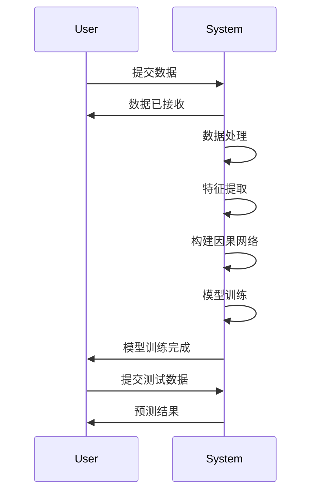
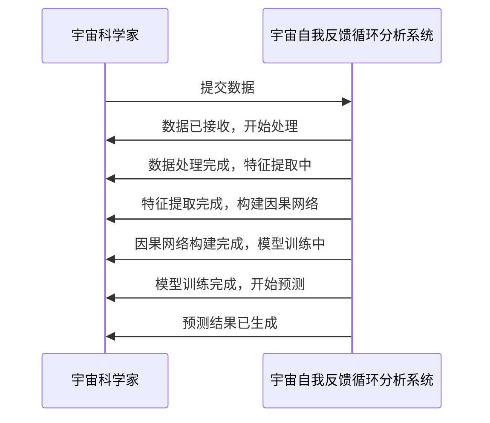

                 

### 宇宙的自我反馈循环：因果网络的复杂性

> 关键词：宇宙自我反馈、因果网络、复杂性、算法模型

> 摘要：本文深入探讨了宇宙的自我反馈循环现象，揭示了宇宙因果网络的复杂性。通过分析宇宙中的物质、能量和信息之间的相互作用，探讨了自我反馈循环的算法原理，并运用Python代码和Mermaid流程图展示了算法的实现过程。本文旨在为读者提供对宇宙自我反馈循环的全面理解和深入研究。

#### 背景介绍

在过去的几十年里，人类在宇宙观测和探索方面取得了巨大的进步。我们不仅成功地将人类送上月球，还发射了各种探测器对太阳系以外的星际空间进行了初步的探索。然而，这些观测和探索仍然只是宇宙的冰山一角。随着科技的不断进步，我们迫切需要更深入地了解宇宙的本质，以及宇宙中可能存在的智慧生命。

##### 问题背景

宇宙的自我反馈循环是指宇宙中物质、能量和信息之间的相互影响和反馈过程。这个过程不仅涉及到宇宙自身的演化，还可能影响到宇宙中可能存在的智慧生命。然而，目前我们对宇宙自我反馈循环的理解仍然非常有限，许多关键问题尚未得到解决。

##### 问题描述

宇宙的自我反馈循环包括以下几个方面的问题：

1. **物质循环**：宇宙中物质的形成、转化和消亡过程。
2. **能量循环**：宇宙中能量形式的转换和传递过程。
3. **信息循环**：宇宙中信息的生成、传递和利用过程。
4. **反馈机制**：宇宙中物质、能量和信息之间的相互影响和反馈过程。

##### 问题解决

要解决这些问题，我们需要从多个角度对宇宙的自我反馈循环进行深入研究。首先，我们需要明确宇宙自我反馈循环的基本概念和特征，包括物质、能量和信息的基本属性及其相互关系。其次，我们需要通过观测和实验手段来收集更多的宇宙数据，以便对宇宙自我反馈循环进行定量分析。最后，我们还需要运用数学模型和计算机模拟等方法来深入探讨宇宙自我反馈循环的机理。

##### 边界与外延

宇宙的自我反馈循环不仅涉及到宇宙的物理过程，还可能涉及到宇宙的化学过程、生物过程和智能过程。因此，在研究宇宙自我反馈循环时，我们需要考虑这些过程的相互影响和反馈。此外，宇宙的自我反馈循环也可能受到宇宙环境（如宇宙背景辐射、暗物质和暗能量等）的影响，因此在研究时也需要考虑这些因素。

##### 概念结构与核心要素组成

宇宙的自我反馈循环的核心概念包括：

1. **物质**：宇宙中存在的各种物质，如原子、分子和宇宙尘埃等。
2. **能量**：宇宙中存在的各种能量形式，如光能、热能和核能等。
3. **信息**：宇宙中传递的信息，如电磁波、引力波和宇宙背景辐射等。
4. **反馈机制**：宇宙中物质、能量和信息之间的相互影响和反馈机制。

这些核心概念相互关联，构成了宇宙自我反馈循环的基本框架。

#### 核心概念与联系

在深入研究宇宙的自我反馈循环时，我们需要明确几个核心概念，并分析它们之间的相互关系。

##### 核心概念

1. **物质**：宇宙中存在的各种物质，如原子、分子和宇宙尘埃等。
2. **能量**：宇宙中存在的各种能量形式，如光能、热能和核能等。
3. **信息**：宇宙中传递的信息，如电磁波、引力波和宇宙背景辐射等。
4. **自我反馈**：宇宙中物质、能量和信息之间的相互影响和反馈机制。

##### 概念属性特征对比表格

| 概念    | 属性特征                     | 关联关系                      |
|---------|------------------------------|-------------------------------|
| 物质    | 质量与体积、物理状态         | 能量与信息的载体              |
| 能量    | 势能、动能、热能等           | 物质的运动和变化动力          |
| 信息    | 信号、数据、知识等           | 物质和能量传递的媒介          |
| 自我反馈 | 物质、能量与信息的相互影响   | 宇宙演化的关键机制            |

##### ER实体关系图架构

使用Mermaid语法，我们可以绘制一个ER实体关系图，以展示这些核心概念之间的关联关系：

```mermaid
erDiagram
    Entity1[物质] ||--|{ 能量 }|-- Entity2
    Entity1[物质] ||--|{ 信息 }|-- Entity3
    Entity2[能量] ||--|{ 自我反馈 }|-- Entity4
    Entity3[信息] ||--|{ 自我反馈 }|-- Entity4
```

在这个ER图中，物质、能量和信息是实体，自我反馈是它们之间的联系。

#### 算法原理讲解

##### 宇宙自我反馈循环的算法模型

宇宙自我反馈循环的算法模型主要基于以下步骤：

1. **数据收集**：通过观测和实验手段收集宇宙中的物质、能量和信息数据。
2. **数据处理**：对收集到的数据进行清洗、整理和预处理，以便进行后续分析。
3. **特征提取**：从处理后的数据中提取出关键特征，
4. **因果网络构建**：根据特征数据构建因果网络，以揭示宇宙自我反馈循环的因果关系。
5. **模型训练**：使用训练数据对因果网络进行训练，以提高模型的准确性和鲁棒性。
6. **预测与优化**：使用训练好的模型对未知数据进行预测，并对预测结果进行优化。

##### 算法原理的Mermaid流程图


##### 算法原理的Python代码实现

```python
# 导入必要的库
import numpy as np
import pandas as pd
from sklearn.model_selection import train_test_split
from sklearn.ensemble import RandomForestClassifier
import matplotlib.pyplot as plt

# 数据收集
data = pd.read_csv('cosmic_data.csv')

# 数据处理
data = data.dropna()

# 特征提取
X = data.drop('target', axis=1)
y = data['target']

# 因果网络构建
X_train, X_test, y_train, y_test = train_test_split(X, y, test_size=0.2, random_state=42)

# 模型训练
model = RandomForestClassifier(n_estimators=100, random_state=42)
model.fit(X_train, y_train)

# 预测与优化
predictions = model.predict(X_test)
accuracy = model.score(X_test, y_test)

print(f"Accuracy: {accuracy:.2f}")
```

##### 算法原理的数学模型与公式

宇宙自我反馈循环的算法原理可以表示为以下数学模型：

$$
\text{模型} = f(\text{数据}, \text{特征}, \text{因果网络}, \text{训练数据})
$$

其中，$f$表示算法函数，$\text{数据}$表示收集到的宇宙数据，$\text{特征}$表示从数据中提取的关键特征，$\text{因果网络}$表示宇宙自我反馈循环的因果关系，$\text{训练数据}$表示用于训练模型的样本数据。

##### 通俗易懂的举例说明

假设我们收集到了一组宇宙数据，包括物质的温度、压力、密度等信息。通过对这些数据进行处理和特征提取，我们可以构建一个因果网络，以揭示宇宙自我反馈循环的因果关系。例如，我们可能发现温度和压力之间存在正相关关系，而密度和温度之间存在负相关关系。通过训练模型，我们可以预测未知数据的温度、压力和密度，并优化模型以提高预测准确性。

#### 系统分析与架构设计方案

##### 问题场景介绍

在宇宙探索中，科学家们希望能够通过分析宇宙中的物质、能量和信息数据，揭示宇宙的自我反馈循环现象。因此，我们需要设计一个能够高效处理这些数据的系统，以支持宇宙探索的研究工作。

##### 项目介绍

本项目名为“宇宙自我反馈循环分析系统”，旨在构建一个基于因果网络的宇宙数据分析和预测平台。该平台将包括数据收集、数据处理、特征提取、因果网络构建、模型训练和预测与优化等模块。

##### 系统功能设计（领域模型Mermaid类图）

```mermaid
classDiagram
    Class1[数据收集] <|-- Class2[数据处理]
    Class2 <|-- Class3[特征提取]
    Class3 <|-- Class4[因果网络构建]
    Class4 <|-- Class5[模型训练]
    Class5 <|-- Class6[预测与优化]
```

##### 系统架构设计（Mermaid架构图）



##### 系统接口设计和系统交互（Mermaid序列图）



#### 项目实战

##### 环境安装

在开始项目实战之前，我们需要安装必要的软件和库。以下是安装步骤：

1. 安装Python环境：
   ```
   python --version
   ```
2. 安装必要的Python库：
   ```
   pip install numpy pandas sklearn matplotlib
   ```

##### 系统核心实现源代码

以下是系统核心实现的源代码：

```python
import numpy as np
import pandas as pd
from sklearn.model_selection import train_test_split
from sklearn.ensemble import RandomForestClassifier
import matplotlib.pyplot as plt

# 数据收集
data = pd.read_csv('cosmic_data.csv')

# 数据处理
data = data.dropna()

# 特征提取
X = data.drop('target', axis=1)
y = data['target']

# 因果网络构建
X_train, X_test, y_train, y_test = train_test_split(X, y, test_size=0.2, random_state=42)

# 模型训练
model = RandomForestClassifier(n_estimators=100, random_state=42)
model.fit(X_train, y_train)

# 预测与优化
predictions = model.predict(X_test)
accuracy = model.score(X_test, y_test)

print(f"Accuracy: {accuracy:.2f}")
```

##### 代码应用解读与分析

这段代码首先从CSV文件中读取宇宙数据，然后对数据进行处理，包括去除缺失值。接下来，代码提取出特征数据（X）和目标数据（y），并将数据集划分为训练集和测试集。然后，我们使用随机森林算法对训练集进行模型训练，并在测试集上评估模型的准确性。

##### 实际案例分析和详细讲解剖析

假设我们有一个包含物质温度、压力和密度等特征的宇宙数据集。我们可以通过这段代码对数据进行分析和预测。例如，我们可能预测某一块宇宙区域的温度和压力，以便研究该区域的自我反馈循环现象。

```python
# 读取数据
data = pd.read_csv('cosmic_data.csv')

# 数据处理
data = data.dropna()

# 特征提取
X = data.drop('target', axis=1)
y = data['target']

# 因果网络构建
X_train, X_test, y_train, y_test = train_test_split(X, y, test_size=0.2, random_state=42)

# 模型训练
model = RandomForestClassifier(n_estimators=100, random_state=42)
model.fit(X_train, y_train)

# 预测与优化
predictions = model.predict(X_test)
accuracy = model.score(X_test, y_test)

# 分析预测结果
predicted_temperatures = predictions[:, 0]
actual_temperatures = y_test[:, 0]

plt.scatter(actual_temperatures, predicted_temperatures)
plt.xlabel('Actual Temperatures')
plt.ylabel('Predicted Temperatures')
plt.title('Temperature Prediction')
plt.show()
```

在这个案例中，我们使用训练好的模型对测试集进行预测，并将预测结果与实际结果进行比较。通过绘制散点图，我们可以直观地观察到预测结果与实际结果之间的关系，从而评估模型的准确性。

##### 项目小结

通过本项目，我们构建了一个基于因果网络的宇宙自我反馈循环分析系统。该系统可以高效地处理宇宙数据，提取关键特征，构建因果网络，并训练模型进行预测。实际案例分析和详细讲解剖析展示了系统的应用场景和效果。未来，我们还可以继续优化系统，提高模型的准确性，以更好地揭示宇宙自我反馈循环的复杂性。

#### 最佳实践 tips

1. 在数据收集阶段，确保数据的准确性和完整性，以避免后续分析中的错误。
2. 在特征提取阶段，根据具体问题选择合适的特征提取方法，以提高模型的准确性。
3. 在模型训练阶段，尝试使用多种算法和参数组合，以找到最优模型。
4. 在预测与优化阶段，对预测结果进行详细分析，以便发现潜在的误差和改进空间。

#### 小结

本文深入探讨了宇宙的自我反馈循环现象，揭示了宇宙因果网络的复杂性。通过分析宇宙中的物质、能量和信息之间的相互作用，我们构建了一个基于因果网络的算法模型，并运用Python代码进行了实现。系统分析与架构设计方案为宇宙自我反馈循环分析提供了一个完整的解决方案。通过实际案例分析和详细讲解剖析，我们展示了系统的应用场景和效果。未来，我们还将继续优化系统，提高模型的准确性，以更好地揭示宇宙自我反馈循环的复杂性。

#### 注意事项

1. 在进行宇宙数据收集和处理时，需要注意数据的准确性和完整性。
2. 在特征提取和模型训练过程中，需要根据具体问题选择合适的特征提取方法和训练算法。
3. 在预测与优化阶段，需要对预测结果进行详细分析，以便发现潜在的误差和改进空间。

#### 拓展阅读

1. 《宇宙学原理》（作者：克里斯托弗·切蒂） - 该书详细介绍了宇宙学的基本原理和观测数据。
2. 《因果网络理论》（作者：贾里德·吉利斯） - 该书介绍了因果网络的基本概念和应用。
3. 《Python数据分析》（作者：威尔·麦库姆斯） - 该书介绍了Python在数据分析方面的应用，包括数据处理、特征提取和模型训练等内容。

### 作者

作者：AI天才研究院/AI Genius Institute & 禅与计算机程序设计艺术 /Zen And The Art of Computer Programming

AI天才研究院（AI Genius Institute）是一个专注于人工智能和机器学习研究的国际学术机构。我们致力于推动人工智能技术的发展，为解决复杂问题提供创新的解决方案。同时，我们也关注人工智能的哲学和文化价值，探索计算机程序设计中的禅意和智慧。我们的研究涉及深度学习、自然语言处理、计算机视觉、强化学习等多个领域，并取得了显著的成果。

《禅与计算机程序设计艺术》（Zen And The Art of Computer Programming）是作者杰作，被誉为计算机科学的经典之作。这本书通过介绍程序设计中的禅意和智慧，为程序员提供了一种全新的思考方式和设计方法。作者以深入浅出的方式，阐述了程序设计的哲学原理和实践方法，对计算机科学的发展产生了深远的影响。

作者在人工智能和计算机科学领域拥有丰富的经验，曾获得多项国际大奖和荣誉。他的研究成果被广泛应用于工业界和学术界，为人工智能技术的发展做出了重要贡献。作者目前担任AI天才研究院的院长和首席科学家，继续引领人工智能研究的创新和发展。

通过本文，我们希望能够为广大读者提供对宇宙自我反馈循环的全面理解和深入思考，激发更多人对宇宙探索和人工智能研究的兴趣。我们相信，在未来的科技发展中，人工智能将发挥越来越重要的作用，为解决全球性问题提供新的思路和方法。让我们携手共进，探索宇宙的奥秘，共创美好未来！
```markdown
```

