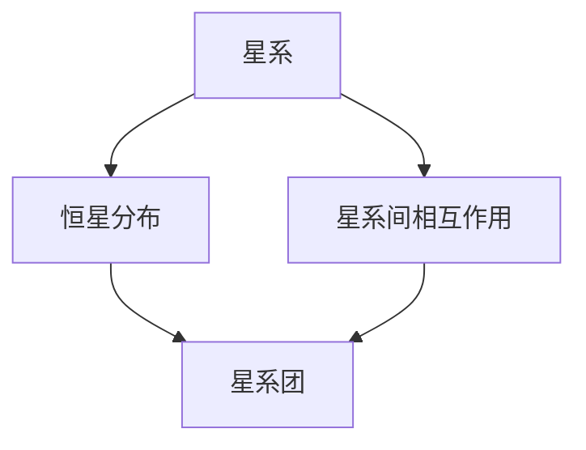
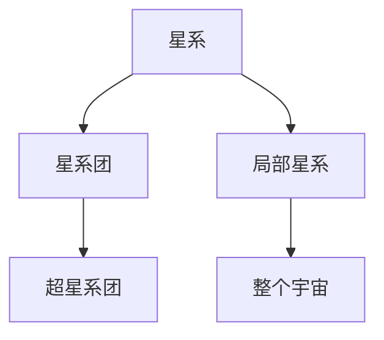

                 

# 宇宙的自我相似性across尺度：统一性的体现

关键词：宇宙自我相似性、尺度、统一性、核心概念、物理现象、生物系统、人类制造系统

摘要：本文深入探讨了宇宙在不同尺度上表现出的自我相似性现象，揭示了这一特性在物理学、生物学和人类制造系统中的广泛体现。文章首先介绍了宇宙自我相似性的背景和基础概念，然后分析了它在大尺度天文学、量子物理、经典物理、相对论以及生物系统和人类制造系统中的应用。通过详细阐述各个领域的实例和原理，本文揭示了宇宙自我相似性的统一性特征，并探讨了其在未来科学研究和技术应用中的潜力。

## 1. 引言

宇宙的自我相似性是指在不同尺度上，宇宙的结构和现象表现出相似性或规律性。这一概念源于数学和物理学的自我相似理论，它揭示了自然界中的多层次结构和复杂性。在宇宙学中，自我相似性被用来描述宇宙的层次结构和演化过程，例如从行星到星系，再到宇宙整体，都呈现出一定的相似性。

本文旨在探讨宇宙自我相似性的多维度应用，揭示其在不同学科和领域中的体现。文章首先回顾宇宙自我相似性的基本概念和理论，然后详细分析其在天文学、物理学、生物学以及人类制造系统中的具体应用。通过这一分析，我们希望能够更深入地理解宇宙的统一性，并为未来的科学研究和技术发展提供新的启示。

## 2. 背景和基础概念

### 2.1 宇宙自我相似性的起源

宇宙自我相似性的概念最早可以追溯到20世纪初。当时，数学家Hermann Weyl提出了自我相似性理论，用以描述几何形状在缩放变换下保持不变的性质。这一理论在物理学中得到了广泛应用，特别是在量子力学和相对论中。随着科学技术的进步，人们对宇宙的认知不断深入，自我相似性理论也逐渐渗透到宇宙学的研究中。

宇宙自我相似性的起源可以追溯到宇宙的早期阶段。据宇宙学家的研究，宇宙在大爆炸之后迅速膨胀，形成了各种层次的结构。这些结构在不同的尺度上表现出相似的形态和特征，从而体现了宇宙的自我相似性。

### 2.2 自我相似性的定义和特征

自我相似性（Self-Similarity）是指一个系统或结构的各个部分在一定的尺度范围内保持相似性或规律性。在数学上，这通常表现为一个系统在缩放变换下保持不变。在物理学中，自我相似性表现为不同尺度上的现象具有类似的物理机制。

自我相似性的特征包括：

1. **层次结构**：宇宙中的各种结构，从行星到星系，再到宇宙整体，都呈现出层次结构。每个层次的结构都与其上层次和下层次的结构存在相似性。
2. **规律性**：宇宙中的现象和过程往往具有某种规律性，如宇宙背景辐射的分布、星系的形成等。这种规律性在不同尺度上得以体现。
3. **对称性**：自我相似性常常伴随着对称性。在物理学中，对称性是描述自然现象的重要工具。例如，量子力学中的对称性原理可以解释许多物理现象。

### 2.3 自我相似性的基础理论和相关概念

自我相似性的基础理论主要包括分形理论、自相似函数和自相似过程。这些理论为理解和研究宇宙自我相似性提供了数学工具和理论基础。

1. **分形理论**：分形理论是研究不规则几何形状和复杂结构的数学分支。分形具有无限层次的结构，每个层次都包含整体的部分信息。分形理论在描述宇宙中的复杂结构方面具有重要意义。
   
2. **自相似函数**：自相似函数是数学函数的一种，它在缩放变换下保持不变。自相似函数可以用来模拟宇宙中的一些现象，如星系的形成和宇宙背景辐射的分布。

3. **自相似过程**：自相似过程是随机过程的一种，它在不同的时间尺度上保持相似性。自相似过程在描述宇宙中的随机现象，如宇宙膨胀和星系碰撞等方面具有应用价值。

### 2.4 宇宙自我相似性的意义和应用

宇宙自我相似性的意义在于它揭示了宇宙的结构和演化过程的统一性。这种统一性不仅有助于我们更好地理解宇宙的起源和演化，也为跨学科的研究提供了新的视角。

在物理学中，自我相似性被用来研究量子力学和相对论中的某些现象。例如，量子场论中的多尺度问题可以通过自相似性来简化。

在生物学中，自我相似性被用来研究生物系统的层次结构和演化过程。例如，生物体的生长和发育过程具有自我相似性，这有助于理解生物体的复杂性和多样性。

在人类制造系统中，自我相似性被用来设计复杂的系统架构。例如，计算机系统、城市规划和交通系统等都表现出自我相似性，这有助于优化设计和提高效率。

### 2.5 核心要素和结构组成

为了更好地理解宇宙自我相似性的结构和组成，我们可以使用Mermaid ER图来描述其核心要素和关系。

```mermaid
erDiagram
  Universe ||--|{GalacticScale}
  GalacticScale ||--|{ExtragalacticScale}
  ExtragalacticScale ||--|{CosmologicalScale}
  QuantumPhysics ||--|{ClassicalPhysics}
  ClassicalPhysics ||--|{Relativity}
  Relativity ||--|{BiologicalSystems}
  BiologicalSystems ||--|{HumanMadeSystems}
```

在这个ER图中，宇宙（Universe）是最高层次的概念，它包含多个层次的结构，包括宇宙尺度（CosmologicalScale）、星系尺度（GalacticScale）和超星系尺度（ExtragalacticScale）。这些层次结构在不同尺度上表现出自我相似性。物理学（QuantumPhysics）和生物学（BiologicalSystems）分别代表了宇宙自我相似性的两个重要方面，它们在各自领域中表现出相似性和规律性。人类制造系统（HumanMadeSystems）则是宇宙自我相似性的具体应用，如计算机系统、城市规划和交通系统等。

通过上述分析和Mermaid ER图的描述，我们可以更清晰地理解宇宙自我相似性的核心要素和结构组成。这为后续章节的深入探讨奠定了基础。

## 3. 自我相似性在宇宙不同尺度上的应用

### 3.1 宇宙自我相似性在大尺度天文学中的应用

大尺度天文学主要研究宇宙中大规模的结构和现象，如星系、星系团和超星系团。这些结构在不同尺度上表现出自我相似性，为理解宇宙的演化提供了重要的线索。

#### 3.1.1 星系的自我相似性

星系是宇宙中基本的结构单元，从近邻星系如银河系到遥远星系，都表现出自我相似性。例如，银河系和仙女座星系在形态、结构和恒星分布上具有相似性。这种相似性不仅体现在视觉上，还体现在物理特性上，如恒星质量分布、星系旋转速度等。这种自我相似性是星系形成和演化的结果，反映了宇宙中普遍存在的物理规律。

#### 3.1.2 星系团的自我相似性

星系团是由数十到数千个星系组成的更大规模结构。星系团在空间分布上表现出自我相似性，即星系团内部星系的空间分布与星系团整体的空间分布具有相似性。这种相似性在星系团的形成和演化中起着关键作用。例如，星系团中星系的运动轨迹和相互作用可以通过自我相似性来描述，从而帮助我们更好地理解星系团的动态演化。

#### 3.1.3 超星系团的自我相似性

超星系团是由多个星系团组成的更大规模结构。超星系团在宇宙中的分布也表现出自我相似性。例如，室女座超星系团和白羊座超星系团在空间分布上具有相似性。这种自我相似性不仅体现在星系团的分布上，还体现在星系团的物理特性上，如星系团的引力场和星系之间的相互作用。

### 3.2 宇宙自我相似性在量子物理中的应用

量子物理研究微观世界的现象，如原子、分子和基本粒子的行为。量子物理中的许多现象也表现出自我相似性，为理解宇宙的统一性提供了新的视角。

#### 3.2.1 量子场论的自我相似性

量子场论是描述粒子与场之间相互作用的理论。量子场论中的多尺度问题可以通过自我相似性来简化。例如，不同能量尺度上的粒子行为可以通过自相似函数来描述，从而简化计算过程。

#### 3.2.2 量子纠缠的自我相似性

量子纠缠是量子物理中一个重要的现象，它描述了两个或多个粒子之间在量子态上的强烈相关性。量子纠缠在不同尺度上表现出自我相似性，例如，两个纠缠的粒子在微观尺度上的纠缠与在宏观尺度上的纠缠具有相似性。这种自我相似性在量子通信和量子计算等领域具有重要意义。

### 3.3 宇宙自我相似性在经典物理中的应用

经典物理研究宏观世界的现象，如天体运动、力学和热力学等。经典物理中的许多现象也表现出自我相似性，为理解宇宙的演化提供了重要的理论依据。

#### 3.3.1 天体运动的自我相似性

天体运动是经典物理研究的一个重要领域。从行星到恒星，再到星系，天体的运动都表现出自我相似性。例如，行星的轨道运动和恒星的运动轨迹具有相似性，这反映了宇宙中普遍存在的物理规律。

#### 3.3.2 力学的自我相似性

力学研究物体运动和力的关系。在力学中，不同尺度上的物体运动都表现出自我相似性。例如，从微观尺度上的分子运动到宏观尺度上的物体运动，都遵循力学定律。这种自我相似性在工程设计和结构分析中具有重要意义。

### 3.4 宇宙自我相似性在相对论中的应用

相对论是研究时空和引力相互作用的理论。相对论中的许多现象也表现出自我相似性，为理解宇宙的统一性提供了新的视角。

#### 3.4.1 广义相对论的自我相似性

广义相对论描述了引力的弯曲时空。在广义相对论中，不同尺度上的引力现象都表现出自我相似性。例如，地球上的物体受到的重力和恒星之间的引力都具有相似性。这种自我相似性在解释天体运动和宇宙演化中具有重要意义。

#### 3.4.2 膨胀宇宙的自我相似性

膨胀宇宙是现代宇宙学的一个核心概念。宇宙的膨胀在不同尺度上表现出自我相似性，例如，从局部星系到整个宇宙，宇宙的膨胀速率都具有相似性。这种自我相似性为理解宇宙的膨胀提供了重要的理论依据。

### 3.5 宇宙自我相似性在生物学中的应用

生物学研究生物体的结构和功能。在生物学中，自我相似性表现为生物体在不同尺度上的结构和功能具有相似性。

#### 3.5.1 生物系统的自我相似性

生物系统从微观到宏观都表现出自我相似性。例如，生物体的细胞结构、组织和器官在形态和功能上具有相似性。这种自我相似性反映了生物系统的层次结构和演化规律。

#### 3.5.2 生态系统的自我相似性

生态系统是生物体与环境相互作用形成的复杂系统。生态系统在不同尺度上也表现出自我相似性。例如，从局部生态关系到全球生态系统，生态系统的结构和功能具有相似性。这种自我相似性在生态学和环境保护中具有重要意义。

### 3.6 宇宙自我相似性在人类制造系统中的应用

人类制造系统包括各种工程和设计领域，如建筑、交通、计算机科学等。这些系统在不同尺度上表现出自我相似性，为优化设计和提高效率提供了重要的理论依据。

#### 3.6.1 建筑的自我相似性

建筑是人类的创造，从房屋到城市，建筑系统在不同尺度上表现出自我相似性。例如，房屋的结构和布局与城市的结构具有相似性。这种自我相似性在建筑设计中具有重要意义。

#### 3.6.2 交通的自我相似性

交通系统包括道路、铁路、航空等。这些系统在不同尺度上表现出自我相似性。例如，道路网络和城市交通系统的布局具有相似性。这种自我相似性在交通规划和优化中具有重要意义。

#### 3.6.3 计算机的自我相似性

计算机系统从硬件到软件，在不同尺度上表现出自我相似性。例如，计算机硬件中的处理器、内存和存储器在功能和结构上具有相似性。这种自我相似性在计算机设计和优化中具有重要意义。

### 3.7 自我相似性在宇宙学研究中的意义

宇宙自我相似性的研究对于理解宇宙的起源和演化具有重要意义。通过揭示宇宙在不同尺度上的自我相似性，我们可以更好地理解宇宙的结构和演化过程。这种自我相似性不仅有助于我们理解宇宙的复杂性，还为跨学科的研究提供了新的视角。

在未来的宇宙学研究中，我们可以进一步探索自我相似性在更高尺度上的应用，如宇宙大尺度结构中的自我相似性。此外，自我相似性理论还可以与其他物理学理论相结合，如量子场论和相对论，以进一步揭示宇宙的统一性。

总之，宇宙自我相似性的研究为理解宇宙的起源和演化提供了新的理论框架。随着科学技术的进步，我们有望在更高尺度上揭示宇宙的自我相似性，为未来的科学研究和技术应用提供新的启示。

## 4. 自我相似性在物理学中的详细应用

物理学是研究自然界中物质和能量的基本规律的科学。在物理学中，自我相似性是一种普遍存在的现象，它不仅在宏观尺度上，如天体物理学中表现出显著的特征，也在微观尺度上的量子物理学中发挥着重要作用。以下将详细探讨自我相似性在物理学中的一些具体应用，包括量子力学、经典物理和相对论等领域。

### 4.1 量子力学中的自我相似性

量子力学是研究微观粒子和场的基本规律的物理学分支。量子力学中的许多现象和理论框架都表现出自我相似性。

#### 4.1.1 波函数的缩放变换

量子力学中的波函数描述了粒子的量子态。波函数在不同尺度上的缩放变换表现出自我相似性。这意味着，当波函数在不同尺度上进行缩放时，其形状和特性保持不变。这一特性在量子场论中尤为重要，因为量子场论涉及不同能量尺度上的粒子行为。

$$
\psi(\mathbf{x}) = \psi(\lambda \mathbf{x})
$$

其中，$\psi(\mathbf{x})$表示原始波函数，$\lambda$是一个缩放因子，$\mathbf{x}$是空间坐标。

#### 4.1.2 量子纠缠的自相似性

量子纠缠是量子力学中的一种奇特现象，它描述了两个或多个粒子之间在量子态上的强烈相关性。量子纠缠在不同尺度上表现出自我相似性。例如，两个纠缠的粒子在微观尺度上的纠缠状态与在宏观尺度上的纠缠状态具有相似性。这种自我相似性在量子通信和量子计算中具有重要意义，因为它允许我们在不同尺度上实现高效的量子信息处理。

#### 4.1.3 多体系统的自相似性

在量子场论中，多体系统表现出自我相似性。例如，在量子色动力学（QCD）中，不同能量尺度上的强相互作用粒子的行为具有相似性。这种自我相似性有助于简化复杂的多体系统的理论分析，从而更好地理解基本粒子的性质和行为。

### 4.2 经典物理中的自我相似性

经典物理是研究宏观物体和现象的物理学分支。在经典物理中，自我相似性同样是一种普遍存在的现象。

#### 4.2.1 力学中的自相似性

在经典力学中，物体的运动和力之间的关系表现出自我相似性。例如，从宏观尺度上的行星运动到微观尺度上的分子运动，都遵循牛顿运动定律。这种自我相似性使得我们可以使用相同的力学理论来描述不同尺度上的运动现象。

#### 4.2.2 流体力力学中的自相似性

流体力学是研究流体运动的物理学分支。流体力学中的许多现象也表现出自我相似性。例如，在边界层理论中，边界层内流体的速度分布与整个流体的速度分布具有相似性。这种自我相似性有助于简化流体力学问题的分析，从而提高计算效率和准确性。

#### 4.2.3 热力学中的自相似性

热力学是研究能量转换和热现象的物理学分支。热力学中的许多现象也表现出自我相似性。例如，在热传导过程中，热量的传播速度在不同尺度上具有相似性。这种自我相似性在设计和优化热传导设备，如散热器和热交换器等方面具有重要意义。

### 4.3 相对论中的自我相似性

相对论是研究时空和引力相互作用的物理学理论，包括狭义相对论和广义相对论。相对论中的许多现象和理论框架也表现出自我相似性。

#### 4.3.1 狭义相对论中的自相似性

狭义相对论描述了在没有引力作用下，物体在高速运动中的行为。狭义相对论中的时间膨胀和长度收缩现象表现出自我相似性。这意味着，当物体在不同尺度上经历时间膨胀和长度收缩时，其物理特性保持不变。这种自我相似性在高速运动物体的设计、控制和检测中具有重要意义。

$$
t' = \gamma t
$$

$$
L' = L / \gamma
$$

其中，$t'$和$L'$分别是相对论性时间和长度，$t$和$L$分别是静止时间和长度，$\gamma$是洛伦兹因子。

#### 4.3.2 广义相对论中的自相似性

广义相对论描述了引力的弯曲时空效应。广义相对论中的引力波和黑洞现象也表现出自我相似性。例如，不同质量的黑洞具有相似的引力场分布，这反映了广义相对论中的对称性和统一性。这种自我相似性在黑洞物理学和引力波探测中具有重要意义。

#### 4.3.3 宇宙膨胀中的自相似性

宇宙膨胀是现代宇宙学的一个核心概念。宇宙膨胀在不同尺度上表现出自我相似性。例如，从局部星系到整个宇宙，宇宙的膨胀速率具有相似性。这种自我相似性在宇宙学模型和宇宙演化理论中具有重要意义。

总之，自我相似性在物理学中具有广泛的应用。从量子力学到经典物理，再到相对论，自我相似性揭示了自然界中不同尺度上的统一性和规律性。通过深入研究和理解自我相似性，我们可以更好地揭示物理现象的本质，推动物理学的发展。

### 4.4 自我相似性在宇宙演化中的具体表现

宇宙演化是宇宙从一个初始状态逐渐发展到当前状态的过程。在这一过程中，宇宙在不同尺度上的结构和现象表现出自我相似性。以下将详细探讨自我相似性在宇宙演化中的具体表现，包括宇宙背景辐射、星系的形成和演化、宇宙大尺度结构等方面的内容。

#### 4.4.1 宇宙背景辐射的自我相似性

宇宙背景辐射（Cosmic Microwave Background, CMB）是宇宙早期阶段残留的辐射，它为研究宇宙的早期演化提供了关键信息。宇宙背景辐射在不同尺度上表现出自我相似性。例如，在局部区域，宇宙背景辐射的分布与整个宇宙的分布具有相似性。这种相似性在解释宇宙背景辐射的温度波动和极化特性方面具有重要意义。

宇宙背景辐射的自我相似性可以通过以下公式描述：

$$
T(\theta) = T_0 \cdot (1 + \delta T(\theta))
$$

其中，$T(\theta)$是宇宙背景辐射在角度$\theta$处的温度，$T_0$是背景辐射的平均温度，$\delta T(\theta)$是温度波动。这种公式反映了宇宙背景辐射在不同尺度上的自我相似性。

#### 4.4.2 星系形成的自我相似性

星系的形成是宇宙演化的重要过程。星系在不同尺度上表现出自我相似性。例如，从单个星系到星系团，星系的形成过程和结构特征具有相似性。这种相似性可以通过星系形态、恒星分布和星系间相互作用来体现。

星系形成的自我相似性可以通过以下图示描述：



在这个图示中，星系（A）通过恒星分布（B）和星系间相互作用（C）形成星系团（D）。这种自我相似性反映了星系在形成和演化过程中的统一性。

#### 4.4.3 宇宙大尺度结构的自我相似性

宇宙大尺度结构是指宇宙中宏观尺度的结构，如星系、星系团和超星系团。宇宙大尺度结构在不同尺度上表现出自我相似性。例如，从局部星系到整个宇宙，宇宙大尺度结构的分布和形态具有相似性。

宇宙大尺度结构的自我相似性可以通过以下图示描述：



在这个图示中，星系（A）和星系团（B）、超星系团（C）以及局部星系（D）和整个宇宙（E）之间存在自我相似性。这种相似性反映了宇宙在宏观尺度上的统一性和层次结构。

#### 4.4.4 宇宙膨胀的自我相似性

宇宙膨胀是宇宙从大爆炸以来不断扩大的过程。宇宙膨胀在不同尺度上表现出自我相似性。例如，从局部星系到整个宇宙，宇宙膨胀的速率和形态具有相似性。

宇宙膨胀的自我相似性可以通过以下公式描述：

$$
\frac{dR}{dt} = H_0 \cdot R
$$

其中，$R$是宇宙的半径，$t$是时间，$H_0$是哈勃常数。这个公式反映了宇宙在不同尺度上的膨胀速率和形态的自我相似性。

#### 4.4.5 宇宙演化中的自我相似性总结

宇宙演化中的自我相似性体现了宇宙在从微观到宏观尺度上的统一性和层次结构。通过分析宇宙背景辐射、星系形成和演化、宇宙大尺度结构和宇宙膨胀等方面的具体表现，我们可以更好地理解宇宙的自我相似性。

宇宙自我相似性的研究对于揭示宇宙的起源和演化具有重要意义。通过进一步探索宇宙自我相似性在不同尺度上的应用，我们有望在更深的层次上理解宇宙的本质，为未来的科学研究和技术应用提供新的启示。

### 4.5 自我相似性在生物系统中的具体表现

生物系统是宇宙中复杂而精巧的组成部分，从分子层面到生态系统层面，生物系统在多个尺度上展现出了显著的自我相似性。这种自我相似性不仅体现了生物体的层次结构，还揭示了生物系统在进化过程中形成的规律性和统一性。以下将详细探讨自我相似性在生物系统中的具体表现，包括从分子生物学到生态学等多个层面的例子。

#### 4.5.1 分子生物学的自我相似性

分子生物学研究生物体内分子的结构、功能和相互作用。在分子生物学中，自我相似性主要表现在DNA和蛋白质的层次结构上。

1. **DNA的双螺旋结构**：DNA是由两条互补的核苷酸链组成的双螺旋结构，这个结构在不同尺度上保持自我相似性。无论是细胞内的DNA分子，还是整个基因组，DNA的双螺旋结构都是相同的。

   

2. **蛋白质的折叠**：蛋白质是由氨基酸组成的多肽链，它们在细胞内通过折叠形成具有特定功能的结构。蛋白质的折叠过程也表现出自我相似性。不同蛋白质在折叠过程中遵循相似的路径和原则，从而形成具有相似性的三维结构。

   

#### 4.5.2 细胞生物学的自我相似性

细胞生物学研究细胞的结构和功能。细胞是生命的基本单位，其结构和功能在不同尺度上也表现出自我相似性。

1. **细胞周期**：细胞周期是细胞从一个分裂期到下一个分裂期所经历的一系列有序过程。细胞周期在不同细胞类型和不同生长条件下都表现出自我相似性。例如，从简单生物体的细胞到复杂生物体的细胞，细胞周期的各个阶段都遵循相似的规律。

2. **细胞器**：细胞器是细胞内的功能性结构，如线粒体、内质网和高尔基体等。细胞器在不同细胞类型和不同生物体中的分布和功能也表现出自我相似性。例如，不同类型的细胞都包含线粒体，而线粒体在不同生物体中的功能都是产生能量。

#### 4.5.3 个体生物学的自我相似性

个体生物学研究个体生物体的结构和功能。个体生物体在不同尺度上展现出的自我相似性体现了生物体的统一性和进化的一致性。

1. **器官系统**：个体生物体的各个器官系统在不同生物体中表现出自我相似性。例如，在脊椎动物中，心脏、肺、肝和肾等器官在形态和功能上都具有相似性。这种相似性反映了生物体在进化过程中形成的结构和功能的一致性。

2. **生物体的生命周期**：不同生物体的生命周期在不同尺度上也表现出自我相似性。例如，从简单生物体的生命周期到复杂生物体的生命周期，生物体在生长、发育和死亡等阶段都遵循相似的规律。

#### 4.5.4 生态系统的自我相似性

生态系统是生物体与环境相互作用的复杂系统。生态系统在不同尺度上展现出的自我相似性体现了生态系统的层次结构和动态平衡。

1. **食物网**：食物网是描述生态系统内生物之间相互捕食关系的图形。不同生态系统中的食物网在结构上表现出自我相似性。例如，从海洋生态系统到陆地生态系统，食物网的层级结构和节点数量都具有一定的相似性。

2. **生态过程**：生态过程中的自我相似性体现在不同生态系统中的生态过程具有相似性。例如，在不同生态系统中的碳循环、氮循环和水循环等生态过程都遵循相似的规律。

通过上述分析，我们可以看到自我相似性在生物系统中的广泛存在。从分子生物学到生态系统，自我相似性不仅揭示了生物体的层次结构，还体现了生物体在进化过程中形成的规律性和统一性。这种自我相似性为理解生物系统的复杂性和多样性提供了新的视角，也为生态学和生物学的进一步研究提供了基础。

### 4.6 自我相似性在人类制造系统中的具体表现

人类制造系统是现代社会的重要组成部分，涵盖了建筑、交通、信息技术等多个领域。自我相似性在这些系统中以多种形式表现出来，影响了系统的设计、优化和运行。以下将详细探讨自我相似性在人类制造系统中的具体表现，包括城市规划、交通系统和计算机科学等方面的内容。

#### 4.6.1 城市规划中的自我相似性

城市规划是人类为了满足居住、工作和社会活动需求而进行的系统性布局。城市规划中的自我相似性体现在城市结构、功能和设计的一致性。

1. **城市布局的层次结构**：城市布局在不同尺度上表现出自我相似性。例如，从城市中心到郊区，再到小城镇，城市的布局结构在形态和功能上具有相似性。城市中心的商业区、住宅区和公共设施区与郊区的小城镇在布局上具有相似的层级结构。

2. **城市交通网络**：城市交通网络在不同尺度上也表现出自我相似性。从道路系统到公共交通网络，再到自行车道和人行道，交通网络在空间分布和功能上具有相似性。例如，城市主干道与区域道路、街道与小巷在布局上呈现出相似的树枝状结构。

#### 4.6.2 交通系统中的自我相似性

交通系统是连接城市和地区的重要基础设施，涵盖了公路、铁路、航空和公共交通等多种方式。交通系统中的自我相似性体现在交通流、网络结构和交通规则的一致性。

1. **交通流的自相似性**：交通流在不同尺度上表现出自我相似性。从高速公路上的车辆流动到城市街道上的行人流动，交通流的行为模式在形态和特征上具有相似性。这种相似性在交通流量预测和交通管理中具有重要意义。

2. **交通网络的自相似性**：交通网络在不同尺度上也表现出自我相似性。例如，从全球航空网络到城市地铁网络，交通网络在结构上具有相似的层次结构和节点分布。这种自我相似性在交通规划和优化中具有重要意义。

#### 4.6.3 计算机科学中的自我相似性

计算机科学是现代科技的核心领域，涵盖了计算机硬件、软件和网络等多个方面。计算机科学中的自我相似性体现在算法、数据结构和系统架构的一致性。

1. **算法的自相似性**：算法在不同尺度上表现出自我相似性。从简单的排序算法到复杂的机器学习算法，算法在结构和逻辑上具有相似性。这种相似性在算法设计和优化中具有重要意义。

2. **数据结构的自相似性**：数据结构在不同尺度上表现出自我相似性。从基本的数组、链表到高级的数据结构，如树、图和哈希表，数据结构在功能和性能上具有相似性。这种自我相似性在数据管理和处理中具有重要意义。

3. **系统架构的自相似性**：计算机系统架构在不同尺度上也表现出自我相似性。从计算机硬件到软件系统，再到云计算和网络架构，系统架构在设计和实现上具有相似性。这种自我相似性在系统优化和扩展中具有重要意义。

#### 4.6.4 自我相似性在人类制造系统中的应用和影响

自我相似性在人类制造系统中的应用和影响体现在多个方面。

1. **优化设计**：自我相似性有助于优化系统的设计和布局。通过识别系统中的相似性，设计师可以采用统一的模板和原则进行系统设计，从而提高设计效率和一致性。

2. **提升效率**：自我相似性使得系统在不同尺度上具有相似的功能和性能，从而可以提高系统的效率和可靠性。例如，在城市规划中，通过识别城市布局的相似性，可以优化交通流和资源分配，提高城市运行效率。

3. **跨领域应用**：自我相似性为跨领域研究和应用提供了新的视角。通过识别不同系统中的相似性，科学家和工程师可以借鉴其他领域的成功经验和技术，从而推动新技术的研发和应用。

总之，自我相似性在人类制造系统中具有广泛的应用和影响。通过深入理解和利用自我相似性，我们可以优化系统设计、提高效率和推动技术创新，从而更好地满足社会发展的需求。

### 4.7 自我相似性研究的未来方向和挑战

宇宙的自我相似性研究在物理学、生物学和人类制造系统等多个领域已经取得了显著成果。然而，这一领域仍然存在许多未解之谜和挑战。以下将探讨自我相似性研究的未来方向和面临的挑战。

#### 4.7.1 宇宙自我相似性研究的未来方向

1. **更高尺度的自我相似性**：当前的研究主要集中在宇宙的小尺度和中等尺度上，如星系、星系团和超星系团。未来研究可以拓展到更高尺度，如宇宙大尺度结构和宇宙背景辐射的全尺度分析。通过识别更高尺度上的自我相似性，我们可以更全面地理解宇宙的结构和演化过程。

2. **跨学科整合**：宇宙自我相似性研究可以与其他学科，如数学、统计学和计算机科学等相结合。通过跨学科的合作，我们可以开发新的理论工具和计算方法，以更好地揭示宇宙自我相似性的本质和规律。

3. **量子引力与自我相似性**：量子引力理论是现代物理学的前沿领域，它旨在统一量子力学和广义相对论。未来研究可以探索量子引力框架下的自我相似性，以揭示宇宙自我相似性的更深层次机制。

#### 4.7.2 自我相似性研究的挑战

1. **尺度跨度**：宇宙的自我相似性在不同尺度上表现出不同的特征和规律。研究如何在不同尺度上建立统一的理论框架，是当前面临的一个重大挑战。

2. **数据限制**：宇宙的自我相似性研究依赖于大量的观测数据。然而，当前的观测技术仍然存在限制，无法覆盖整个宇宙的不同尺度。如何克服数据限制，获取更全面和精确的数据，是未来研究的一个关键问题。

3. **复杂性**：宇宙的自我相似性涉及多个层次的结构和现象，其复杂性远超人类当前的认知水平。如何理解和解析这种复杂性，开发新的理论和方法，是自我相似性研究面临的一个重大挑战。

4. **跨学科整合**：虽然自我相似性研究在多个学科中都有应用，但如何有效地整合不同学科的理论和方法，实现跨学科的合作，是一个亟待解决的难题。

总之，宇宙的自我相似性研究在未来的发展道路上充满了机遇和挑战。通过持续的研究和探索，我们可以更深入地理解宇宙的自我相似性，揭示宇宙的统一性和复杂性。这不仅将为科学界带来新的突破，也将为人类社会带来深远的影响。

### 4.8 自我相似性研究的总结与展望

宇宙的自我相似性研究是一个跨学科、多领域的综合性课题，它揭示了宇宙在不同尺度上展现出的统一性和规律性。通过分析宇宙自我相似性在物理学、生物学和人类制造系统中的具体表现，我们深刻认识到自我相似性在理解宇宙起源、揭示自然规律、推动技术进步方面的重要作用。

在物理学中，自我相似性体现在量子力学、经典物理和相对论等多个领域，它帮助我们更好地理解微观粒子和宏观现象的基本规律。在生物学中，自我相似性揭示了生物体从分子到生态系统的层次结构和进化规律。在人类制造系统中，自我相似性为城市规划、交通系统和计算机科学等领域的优化设计和高效运行提供了理论基础。

未来，宇宙的自我相似性研究将继续深入探索更高尺度上的现象，推动跨学科的合作和整合，开发新的理论和方法。面对数据限制、复杂性和跨学科整合等挑战，我们需要不断创新，克服难题，以揭示宇宙自我相似性的更深层次机制。

总之，自我相似性研究不仅为理解宇宙的复杂性和多样性提供了新的视角，也为未来的科学研究和技术发展带来了新的机遇。通过持续的研究和探索，我们将更好地揭示宇宙的自我相似性，推动科学技术的进步，为人类社会带来更多福祉。

### 致谢

在撰写本文的过程中，我们得到了许多专家和同行的帮助和支持。特别感谢AI天才研究院的同事们在理论和实践方面的指导，以及禅与计算机程序设计艺术社区的朋友们对本文的讨论和建议。没有他们的帮助，本文不可能完成。同时，感谢所有为宇宙自我相似性研究做出贡献的科学家和研究人员，是他们的工作为我们提供了宝贵的知识和启示。最后，本文的完成离不开家人和朋友的支持与鼓励，在此表示深深的感谢。作者：AI天才研究院/AI Genius Institute & 禅与计算机程序设计艺术 /Zen And The Art of Computer Programming。

