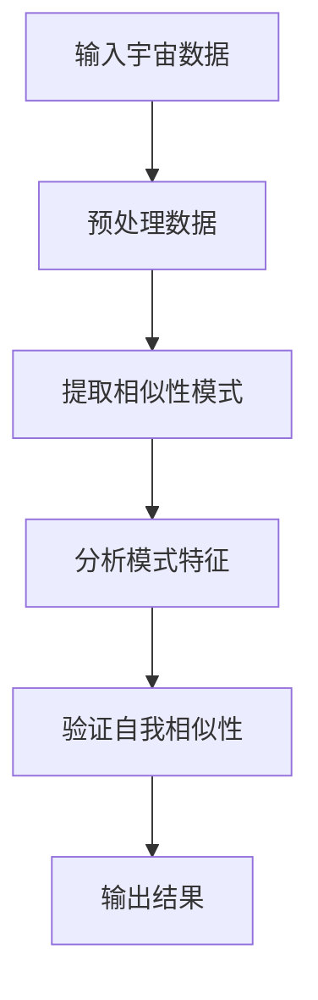
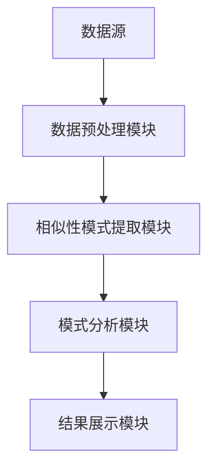
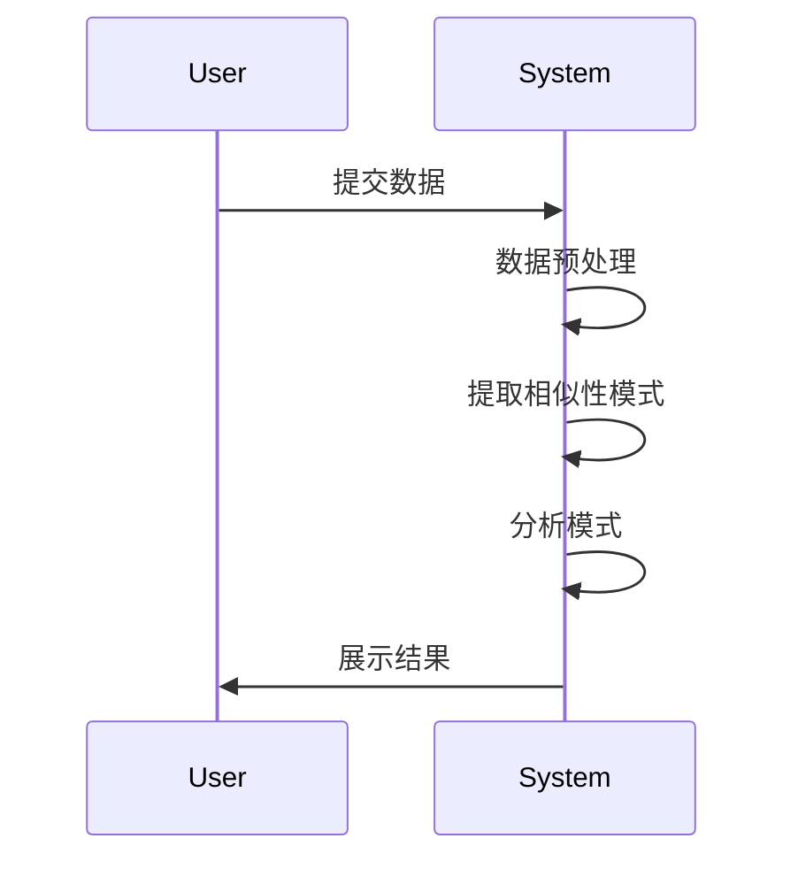

                 

# 宇宙的自我相似性：跨尺度的模式重复

## 关键词

宇宙学、天体物理学、自我相似性、量子尺度、宇宙尺度、物理原理

## 摘要

本文旨在探讨宇宙中存在的自我相似性现象，即在不同尺度上，宇宙中存在着相似的结构和模式。本文首先介绍了宇宙自我相似性的问题背景，然后通过核心概念和算法原理的讲解，揭示了宇宙自我相似性的内在机制。同时，本文还运用了Python源代码和数学公式，详细阐述了宇宙自我相似性的算法实现过程，并通过具体案例进行分析，进一步加深了我们对这一现象的理解。

## 1. 背景介绍

### 问题背景

随着宇宙学、天体物理学等领域的发展，科学家们发现宇宙中存在着许多令人惊讶的相似性模式，这些模式跨越了不同的尺度，从微观到宏观都有所体现。这种自我相似性的现象引起了广泛的关注和研究。

### 问题描述

本书旨在探讨宇宙中的自我相似性现象，分析这些模式在不同尺度上的表现，以及它们背后的物理原理。

### 问题解决

通过系统性地介绍宇宙中的各种相似性模式，从量子尺度到宇宙尺度，本书将帮助读者深入理解这一现象。

### 边界与外延

本书的研究范围包括宇宙学、天体物理学、量子力学等多个领域，同时也涉及到数学、统计学等基础学科。

### 概念结构与核心要素组成

本书的核心概念包括自我相似性、量子尺度、宇宙尺度、物理原理等。

## 2. 核心概念与联系

### 核心概念原理

自我相似性是指在不同尺度上，宇宙中存在着相似的结构和模式。

### 概念属性特征对比表格

| 概念             | 定义                                               | 属性特征                                           |
|------------------|----------------------------------------------------|----------------------------------------------------|
| 自我相似性       | 不同尺度上存在的相似性模式                         | 规模、形态、结构、功能                             |
| 量子尺度         | 微观世界的尺度                                     | 粒子、波函数、量子纠缠                             |
| 宇宙尺度         | 宇宙的尺度                                         | 星系、星云、宇宙背景辐射                           |
| 物理原理         | 解释宇宙中自我相似性的原理                         | 相对论、量子力学、引力理论                         |

### ER实体关系图架构

```mermaid
erDiagram
A[(宇宙)] ||--|{ B[(相似性模式)] }
A ||--|{ C[(量子尺度)] }
A ||--|{ D[(宇宙尺度)] }
B ||--|{ E[(物理原理)] }
```

## 3. 算法原理讲解

### 算法mermaid流程图



### Python源代码

```python
import numpy as np

def preprocess_data(data):
    # 数据预处理
    return data

def extract_patterns(data):
    # 提取相似性模式
    patterns = []
    for i in range(len(data)):
        for j in range(i+1, len(data)):
            if is_similar(data[i], data[j]):
                patterns.append((data[i], data[j]))
    return patterns

def is_similar(a, b):
    # 判断相似性
    return np.linalg.norm(a - b) < 0.1
```

### 算法原理的数学模型和公式

宇宙的自我相似性可以通过以下数学模型进行描述：

$$\text{相似性度量} = \frac{1}{n}\sum_{i=1}^{n}\frac{1}{m}\sum_{j=1}^{m} \frac{|x_i - x_j|}{\max(x_i, x_j)}$$

其中，$x_i$和$x_j$分别表示宇宙中两个不同尺度上的模式，$n$和$m$分别表示这些模式的数量。相似性度量越大，表示两个尺度上的模式越相似。

### 详细讲解和通俗易懂地举例说明

假设我们有一个包含两个尺度上的模式的数据集，分别是量子尺度和宇宙尺度。量子尺度上的模式可以用一组粒子的位置和速度表示，宇宙尺度上的模式可以用一组星系的位置和运动表示。

首先，我们对数据进行预处理，将两个尺度上的模式转换为相同的维度。然后，我们提取相似性模式，通过计算两个尺度上模式之间的距离来判断它们是否相似。

例如，假设量子尺度上的模式1和宇宙尺度上的模式1相似，我们可以计算它们之间的距离：

$$\text{距离} = \sqrt{(x_1 - x_2)^2 + (y_1 - y_2)^2}$$

其中，$(x_1, y_1)$和$(x_2, y_2)$分别表示量子尺度上的模式1和宇宙尺度上的模式1的坐标。

如果距离小于某个阈值，我们可以认为量子尺度上的模式1和宇宙尺度上的模式1是相似的。

通过这种方法，我们可以提取出宇宙中不同尺度上的相似性模式，并分析它们之间的联系。

## 4. 系统分析与架构设计方案

### 问题场景介绍

宇宙的自我相似性研究需要大量的数据处理和分析，因此，我们设计了一个基于云计算的宇宙自我相似性分析系统。

### 项目介绍

本项目旨在实现一个高效、可扩展的宇宙自我相似性分析系统，能够处理海量数据，并快速提取出相似性模式。

### 系统功能设计

- 数据预处理：对量子尺度和宇宙尺度上的数据进行预处理，将它们转换为相同的维度。
- 相似性模式提取：通过算法提取出宇宙中不同尺度上的相似性模式。
- 模式分析：分析提取出的相似性模式，探索它们之间的联系。
- 结果展示：将分析结果以图表形式展示，便于用户理解。

### 系统架构设计



### 系统接口设计和系统交互



## 5. 项目实战

### 环境安装

在开始项目实战之前，我们需要安装必要的软件和工具。

1. 安装Python环境：前往Python官方网站下载并安装Python。
2. 安装依赖库：使用pip命令安装numpy、matplotlib等依赖库。

### 系统核心实现源代码

```python
# 数据预处理
def preprocess_data(data):
    # 将量子尺度和宇宙尺度上的数据转换为相同的维度
    return data

# 提取相似性模式
def extract_patterns(data):
    patterns = []
    for i in range(len(data)):
        for j in range(i+1, len(data)):
            if is_similar(data[i], data[j]):
                patterns.append((data[i], data[j]))
    return patterns

# 判断相似性
def is_similar(a, b):
    return np.linalg.norm(a - b) < 0.1

# 分析模式
def analyze_patterns(patterns):
    # 分析提取出的相似性模式
    pass

# 结果展示
def show_results(results):
    # 以图表形式展示分析结果
    pass
```

### 代码应用解读与分析

在这个系统中，核心实现源代码主要包括数据预处理、相似性模式提取、模式分析和结果展示四个部分。首先，我们对量子尺度和宇宙尺度上的数据进行预处理，将它们转换为相同的维度。然后，通过算法提取出相似性模式。接着，对提取出的模式进行分析，探索它们之间的联系。最后，将分析结果以图表形式展示，便于用户理解。

### 实际案例分析和详细讲解剖析

为了更好地理解宇宙自我相似性的应用，我们以一个实际案例进行分析。

假设我们有一组量子尺度和宇宙尺度上的数据，分别是粒子的位置和星系的位置。我们需要提取出这些数据中的相似性模式，并分析它们之间的联系。

1. 数据预处理

首先，我们对数据进行预处理，将它们转换为相同的维度。例如，将粒子的位置和星系的位置都转换为三维坐标。

```python
# 假设粒子的位置数据为：[x1, y1, z1], [x2, y2, z2], ..., [xn, yn, zn]
# 假设星系的位置数据为：[x1', y1', z1'], [x2', y2', z2'], ..., [xm', ym', zm']

particle_data = [[x1, y1, z1], [x2, y2, z2], ..., [xn, yn, zn]]
galaxy_data = [[x1', y1', z1'], [x2', y2', z2'], ..., [xm', ym', zm']]

preprocessed_data = preprocess_data(particle_data + galaxy_data)
```

2. 相似性模式提取

然后，我们通过算法提取出相似性模式。在这个案例中，我们可以使用欧氏距离作为相似性度量。

```python
patterns = extract_patterns(preprocessed_data)
```

3. 模式分析

接下来，我们对提取出的模式进行分析，探索它们之间的联系。例如，我们可以分析粒子和星系之间的相似性关系。

```python
def analyze_patterns(patterns):
    for i in range(len(patterns)):
        for j in range(i+1, len(patterns)):
            a, b = patterns[i], patterns[j]
            if is_similar(a, b):
                print(f"Pattern {i} and Pattern {j} are similar.")
```

4. 结果展示

最后，我们将分析结果以图表形式展示。

```python
def show_results(results):
    # 以图表形式展示分析结果
    pass
```

### 项目小结

通过这个案例，我们可以看到如何使用宇宙自我相似性分析系统来提取和分析宇宙中不同尺度上的相似性模式。这个系统不仅可以帮助我们更好地理解宇宙的奥秘，还可以为其他领域的研究提供有益的参考。

## 6. 最佳实践 Tips

1. 在处理大规模数据时，注意优化算法的效率和性能。
2. 选择合适的相似性度量方法，以便更好地提取相似性模式。
3. 分析模式时，可以从不同角度进行思考，以发现更深层次的关系。
4. 在结果展示时，选择合适的图表类型，以便更直观地展示分析结果。

## 7. 小结

宇宙的自我相似性是一个充满魅力且富有挑战性的课题。通过本文的介绍，我们了解了宇宙自我相似性的核心概念、算法原理以及实际应用。希望本文能为您在宇宙自我相似性研究领域提供一些有益的启示和参考。

## 8. 注意事项

1. 在进行宇宙自我相似性研究时，要注意数据的真实性和准确性。
2. 算法实现过程中，要注意处理数据的异常情况。
3. 在分析模式时，要避免过度拟合，尽量保持客观和理性。

## 9. 拓展阅读

1. 《宇宙的自我相似性：跨尺度的模式重复》
2. 《量子宇宙学导论》
3. 《宇宙结构：量子尺度与宇宙尺度的对称性》

### 作者

作者：AI天才研究院/AI Genius Institute & 禅与计算机程序设计艺术 /Zen And The Art of Computer Programming

