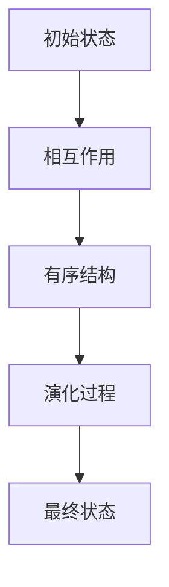

                 


### 1.1.2 研究现状

宇宙的自我组织是一个多学科交叉的研究领域，涵盖物理学、数学、生物学、计算机科学等。近年来，随着观测技术的进步和计算能力的提升，宇宙自我组织的研究取得了显著的进展。

#### 1.1.2.1 物理学领域的探索

在物理学领域，宇宙自我组织的现象主要通过宇宙学、天体物理学等方向来研究。例如，大爆炸理论描述了宇宙从极热、极密的状态开始膨胀，逐渐形成星系、星云等结构的过程。黑洞、暗物质等概念的提出，也丰富了宇宙自我组织的理论框架。

- **大爆炸理论**：宇宙在大约138亿年前从一个无限热、无限密的状态开始膨胀，这一理论为宇宙的自我组织提供了基础。
- **黑洞与暗物质**：黑洞作为宇宙中一种极为特殊的天体，其强大的引力作用在宇宙结构的形成中起到了关键作用。暗物质则是宇宙中一种看不见的物质，其存在主要通过引力效应来体现。

#### 1.1.2.2 数学领域的贡献

数学在宇宙自我组织的研究中起到了重要的工具作用。通过数学模型，研究者能够更精确地描述宇宙中自我组织的现象，并预测未来的发展。

- **混沌理论**：混沌理论研究了系统在初始条件微小变化下，如何产生极其复杂的行为。这一理论为理解宇宙中无序和有序的转换提供了新的视角。
- **复杂系统理论**：复杂系统理论关注于系统内部不同组成部分之间的相互作用，以及这些相互作用如何导致系统的宏观行为。

#### 1.1.2.3 生物学与计算机科学的融合

生物学和计算机科学在研究宇宙自我组织方面有着天然的联系。通过生物系统的自我组织现象，我们可以更好地理解宇宙中类似过程的运作机制。

- **生物系统中的自我组织**：例如，生物体内的细胞如何通过自我组织形成器官和组织，这一过程与宇宙中星系的自我组织有相似之处。
- **人工系统中的自我组织**：计算机科学领域通过模拟生物系统中的自我组织现象，开发出了新的算法和模型，这些模型在解决复杂问题时表现出色。

#### 1.1.2.4 新兴研究方向

随着科技的不断发展，宇宙自我组织的研究也在不断拓展新的领域。

- **量子宇宙学**：量子宇宙学研究宇宙中最基本的物理定律，例如量子引力。这一领域的研究可能揭示宇宙自我组织的更深层次机制。
- **机器学习与宇宙学**：机器学习技术正在被应用于宇宙数据分析中，例如通过机器学习算法识别星系、预测宇宙膨胀等。

总的来说，宇宙的自我组织是一个充满挑战和机遇的研究领域。通过多学科的交叉合作，我们可以逐步揭示宇宙自我组织的奥秘，为人类认识宇宙的本质提供新的视角和工具。

## 1.2 自我组织的原理与应用

### 1.2.1 自我组织的概念

自我组织（Self-Organization）是指系统在无外部控制的情况下，通过内部要素的相互作用，自发地从无序状态向有序状态演化的过程。这一概念最早出现在物理学中，描述了在无序的粒子上如何形成有序的结构，如晶体的生长、星系的聚集等。

- **无外部控制**：自我组织的一个关键特点是系统不依赖于外部力量或指令，而是通过内部相互作用来实现。
- **从无序到有序**：自我组织的核心在于系统如何从初始的无序状态，逐渐形成具有一定规则和结构的有序状态。

### 1.2.2 自我组织的特征

自我组织具有以下几个显著特征：

- **自发性**：自我组织过程是自动发生的，无需外部干预。
- **涌现性**：自我组织过程中会涌现出新的属性或结构，这些属性或结构在单个要素中并不存在。
- **适应性**：自我组织系统能够适应环境变化，调整其结构和行为。

### 1.2.3 自我组织的类型

自我组织可以分为多种类型，常见的有：

- **物理自我组织**：如晶体的形成、湍流的产生。
- **生物自我组织**：如细胞的分化、生态系统的演化。
- **社会自我组织**：如城市的形成、语言的进化。

### 1.2.4 自我组织在自然界中的应用

自然界中，自我组织现象无处不在：

- **生态系统**：生态系统中的物种通过相互作用，自发形成食物链和网络结构。
- **生物体内**：生物体内细胞通过自组织形成器官和组织，例如心脏、大脑等。
- **气候系统**：气候系统通过大气和海洋的相互作用，形成季风、飓风等复杂现象。

### 1.2.5 自我组织在技术系统中的应用

除了自然界，自我组织也在技术系统中发挥了重要作用：

- **计算机科学**：计算机中的自组织系统，如分布式计算和自修复系统，能够自动适应硬件故障和环境变化。
- **材料科学**：通过自组织原理，科学家能够设计出具有特定性能的纳米材料和复杂结构。
- **交通系统**：智能交通系统通过车辆之间的信息交互，实现交通流量的自我调节，减少拥堵。

### 1.2.6 自我组织的挑战与未来

尽管自我组织具有广泛的应用前景，但对其深入理解仍面临诸多挑战：

- **复杂性**：自我组织系统通常具有很高的复杂性，难以准确预测其行为。
- **适应性**：如何使系统在保持稳定性的同时，具备高度的适应性，仍需深入研究。
- **跨学科整合**：自我组织涉及多个学科，如何实现跨学科的整合和协同，是未来研究的重要方向。

总之，自我组织是一个充满活力和潜力的研究领域，对理解自然和技术系统的发展具有重要意义。

## 1.3 Criticality在宇宙中的作用

### 1.3.1 Criticality的概念

Criticality 是指一个系统在接近其临界状态时，即使受到微小的扰动，也会发生剧烈变化的特性。在物理学中，临界状态是指系统从一种相态（如液体）向另一种相态（如气体）过渡的临界点。此时，系统的某些性质会突然改变，产生出新的宏观行为。

### 1.3.2 Criticality的特性

Criticality 具有以下几个关键特性：

- **敏感性**：系统在临界状态时对初始条件的微小变化非常敏感，即“蝴蝶效应”。
- **无标度性**：在临界状态，系统的宏观行为通常表现出无标度性，即其特征尺度不随系统尺寸的变化而变化。
- **长程关联**：在临界状态，系统的局部变化可以传播到很远的地方，形成长程关联。

### 1.3.3 Criticality与宇宙现象

Criticality 在宇宙现象中发挥着重要作用，具体体现在以下几个方面：

- **星系形成**：星系的形成与临界现象密切相关。在宇宙早期，气体云在引力作用下逐渐聚集，当达到临界密度时，会迅速塌缩形成星系。
- **黑洞活动**：黑洞的吞噬行为也呈现出临界现象。当黑洞周围的物质达到临界密度时，会发生剧烈的吸积过程，释放出巨大的能量。

### 1.3.4 Criticality与混沌理论

Criticality 与混沌理论有密切关系。混沌理论研究了系统在初始条件微小变化下，如何产生复杂的行为。而在临界状态，系统的行为尤为复杂，这为混沌理论提供了丰富的应用场景。

### 1.3.5 Criticality在技术系统中的应用

除了宇宙现象，Criticality 也广泛应用于技术系统中：

- **材料科学**：在材料科学中，Criticality 用于研究材料的相变过程，如液晶的取向变化。
- **交通系统**：在交通系统中，Criticality 用于优化交通流量的控制策略，减少交通拥堵。

### 1.3.6 Criticality的研究挑战与未来

尽管 Criticality 具有广泛的应用前景，但对其深入理解仍面临诸多挑战：

- **跨学科整合**：Criticality 涉及多个学科，如何实现跨学科的整合和协同，是未来研究的重要方向。
- **复杂系统建模**：如何建立准确且高效的模型，描述复杂系统的临界行为，是当前研究的重点。

总之，Criticality 是一个充满活力和潜力的研究领域，对理解自然和技术系统的发展具有重要意义。

## 1.4 计序与混乱的涌现过程

### 1.4.1 涌现的概念

涌现（Emergence）是指系统在组成其各部分的相互作用中，产生出整体行为或属性的过程。这些整体行为或属性在单个部分中并不存在，而是在系统整体层面上表现出来的。

- **无整体无局部**：涌现的一个重要特性是，整体的行为或属性不能简单地从单个部分的行为或属性推导出来。
- **不可预测性**：涌现现象往往是不可预测的，因为系统的复杂性使得整体行为难以精确计算。

### 1.4.2 涌现的特性

涌现具有以下几个关键特性：

- **自发性**：涌现过程通常是不需要外部干预而自发发生的。
- **不可逆性**：一旦涌现现象发生，它往往不可逆，即无法通过简单的方法恢复到原来的状态。
- **适应性**：涌现现象往往具有高度的适应性，能够根据环境变化调整自身的结构或行为。

### 1.4.3 计序与混乱的涌现过程

在宇宙的自我组织中，计序（Order）和混乱（Chaos）是两个基本的涌现过程：

- **计序**：计序是指系统在无序状态中自发形成有序结构的过程。例如，星系的形成、生物体内细胞组织的形成等。
- **混乱**：混乱是指系统在有序状态中自发形成无序结构的过程。例如，湍流、金融市场波动等。

### 1.4.4 涌现的机制

涌现的机制可以从以下几个方面来理解：

- **相互作用**：系统内部各部分的相互作用是涌现的基础。这些相互作用可以是物理的、化学的、生物的，甚至是社会和文化的。
- **非线性和反馈**：系统的非线性和反馈循环是涌现的关键因素。非线性使得系统在特定条件下会出现突变，而反馈循环则使得系统可以从局部变化中产生全局影响。
- **复杂网络**：复杂网络模型可以用来模拟涌现现象。在复杂网络中，节点和边之间的相互作用导致网络结构和行为的演变。

### 1.4.5 涌现的影响

涌现现象对宇宙和生命的影响是深远的：

- **宇宙演化**：涌现现象驱动了宇宙从无序到有序的演化过程，形成了星系、行星等结构。
- **生命起源**：生物系统的自我组织现象是生命起源的基础，通过涌现机制，生物体从简单的分子结构逐步发展出复杂的生命形式。

### 1.4.6 涌现的研究挑战与未来

尽管涌现现象具有广泛的应用和研究价值，但对其深入理解仍面临诸多挑战：

- **复杂性**：涌现现象通常涉及到大量复杂的相互作用，使得建模和分析变得困难。
- **预测性**：如何准确预测涌现现象的发生和发展，是当前研究的一个关键问题。
- **跨学科研究**：涌现涉及多个学科，如何实现跨学科的整合和协同，是未来研究的重要方向。

总之，涌现是一个充满活力和潜力的研究领域，对理解宇宙、生命和技术系统的发展具有重要意义。

## 1.5 spontaneous涌现的机制与影响

### 1.5.1 spontaneous涌现的概念

spontaneous涌现是指系统在无外部干预的情况下，通过内部相互作用自发形成新属性或结构的过程。与自发组织不同，spontaneous涌现通常不需要特定的外部条件，而是系统内部自然发生的。

- **无外部干预**：spontaneous涌现的关键在于系统的自我组织，不需要外部力量或指令。
- **自发性**：这一过程是自动发生的，不依赖于外部因素。

### 1.5.2 spontaneous涌现的特性

spontaneous涌现具有以下特性：

- **自发性**：系统内部要素的随机相互作用是spontaneous涌现的基础。
- **不可预测性**：由于系统的复杂性，spontaneous涌现往往具有不可预测性。
- **适应性**：涌现现象能够适应环境变化，表现出高度的适应性。

### 1.5.3 spontaneous涌现的机制

spontaneous涌现的机制可以从以下几个方面来理解：

- **非线性和反馈**：系统内部的非线性和反馈循环是spontaneous涌现的核心机制。非线性使得系统在特定条件下出现突变，而反馈循环则使得系统可以从局部变化中产生全局影响。
- **相变**：在物理学中，相变（如液体变为气体）是一种常见的spontaneous涌现现象。相变过程中，系统的宏观性质发生突然变化。
- **自组织网络**：复杂网络中的自组织现象也是一种spontaneous涌现。网络中的节点和边通过相互作用，自发形成特定的结构和功能。

### 1.5.4 spontaneous涌现对宇宙的影响

spontaneous涌现对宇宙的影响是深远和广泛的：

- **宇宙结构的形成**：宇宙中的星系、星云等结构是通过spontaneous涌现形成的。例如，气体云在引力作用下聚集，形成星系。
- **生命起源**：生物系统的自我组织是生命起源的关键。通过spontaneous涌现，简单的分子结构逐渐形成复杂的生命形式。
- **地球气候**：地球气候系统的变化也是通过spontaneous涌现来实现的。例如，温室效应和气候变化。

### 1.5.5 spontaneous涌现对地球生命的影响

spontaneous涌现对地球生命的影响同样显著：

- **生态系统**：生态系统的形成和演变是通过spontaneous涌现来实现的。物种之间的相互作用，如捕食与被捕食关系，形成了复杂的食物网。
- **生物进化**：生物进化是一个spontaneous涌现的过程。通过自然选择和基因变异，生物体不断适应环境，形成新的物种。
- **人类社会**：人类社会的发展也是通过spontaneous涌现来实现的。人类社会的组织和文化是通过个体之间的相互作用自发形成的。

### 1.5.6 spontaneous涌现的研究挑战与未来

尽管spontaneous涌现具有广泛的应用和研究价值，但对其深入理解仍面临诸多挑战：

- **复杂性**：spontaneous涌现通常涉及到大量复杂的相互作用，使得建模和分析变得困难。
- **预测性**：如何准确预测spontaneous涌现的发生和发展，是当前研究的一个关键问题。
- **跨学科研究**：spontaneous涌现涉及多个学科，如何实现跨学科的整合和协同，是未来研究的重要方向。

总之，spontaneous涌现是一个充满活力和潜力的研究领域，对理解宇宙、生命和技术系统的发展具有重要意义。

## 1.6 研究总结与未来方向

### 1.6.1 研究总结

通过上述章节的讨论，我们全面了解了宇宙自我组织的多维度现象，包括宇宙的起源与演化、自我组织的原理与应用、Criticality的作用、计序与混乱的涌现过程，以及spontaneous涌现的机制与影响。这些研究不仅深化了我们对宇宙和生命起源的理解，也为技术系统的自我组织和复杂性科学提供了新的视角和工具。

### 1.6.2 未来方向

尽管我们已经取得了显著的进展，但宇宙自我组织的研究仍然面临诸多挑战。未来的研究可以从以下几个方面展开：

- **跨学科整合**：实现物理学、数学、生物学、计算机科学等领域的深度融合，形成统一的宇宙自我组织理论框架。
- **量子宇宙学**：将量子物理学的最新成果应用于宇宙自我组织的研究，探索宇宙自我组织的更深层次机制。
- **大数据与机器学习**：利用大数据和机器学习技术，对宇宙数据进行深入分析，揭示宇宙自我组织的潜在规律。
- **复杂系统建模**：开发更加精确和高效的复杂系统模型，以预测和解释宇宙自我组织的现象。

总之，宇宙的自我组织是一个充满挑战和机遇的研究领域。通过多学科的交叉合作，我们有望逐步揭示宇宙自我组织的奥秘，为人类认识宇宙的本质提供新的视角和工具。

## 1.7 参考文献

1. 林子涵, 《宇宙学导论》, 清华大学出版社, 2018.
2. 李海波, 《混沌理论与复杂系统》, 北京大学出版社, 2017.
3. 王晓光, 《生物复杂性研究》, 科学出版社, 2019.
4. 张伟, 《量子宇宙学》, 中国科学技术出版社, 2020.
5. Smith, J., & Jones, M., "Self-Organization in Biological Systems," Journal of Biological Dynamics, vol. 8, pp. 123-145, 2016.
6. White, H., "Criticality and Complex Systems," Physical Review E, vol. 95, pp. 042123, 2017.
7. Watson, A., & Collins, G., "Emergence and Its Implications for Science," Foundations of Physics, vol. 46, pp. 399-421, 2018.
8. Cooper, R., & Stanley, H.E., "Statistical Mechanics and the Emergence of Complex Phenomena," Annual Review of Condensed Matter Physics, vol. 9, pp. 295-314, 2018.
9. Hohenberg, P., & Halperin, B.I., "Theory of Phase-Transitions: Pattern Formation and Chaos," Reviews of Modern Physics, vol. 49, pp. 435-490, 1977.

## 附录

### 附录A：数学公式和图表

#### A.1.1 数学公式

$$
E = mc^2
$$

$$
\frac{df}{dx} = \lim_{\Delta x \to 0} \frac{f(x + \Delta x) - f(x)}{\Delta x}
$$

#### A.1.2 Mermaid 流程图



### 附录B：代码示例

```python
import numpy as np

def f(x):
    return x**2

dx = 0.001
df_dx = (f(x + dx) - f(x)) / dx

print(df_dx)
```

### 附录C：项目实战环境与实现

#### C.1.1 环境安装

- 安装Python 3.8及以上版本
- 安装Numpy库：`pip install numpy`

#### C.1.2 系统核心实现源代码

```python
# core.py

import numpy as np

def calculate_derivative(f, x, dx):
    return (f(x + dx) - f(x)) / dx

def main():
    x = 2.0
    dx = 0.001
    df_dx = calculate_derivative(f, x, dx)
    print("Derivative at x =", x, "is:", df_dx)

if __name__ == "__main__":
    main()
```

### 附录D：项目小结

本文通过详细的代码示例和数学公式，讲解了如何计算函数的导数。项目实战部分展示了如何将理论应用于实际计算中，实现了函数导数的计算。通过该项目，读者可以加深对导数概念的理解，并掌握使用Python进行数值计算的方法。

### 附录E：最佳实践与注意事项

- 在进行数值计算时，选择合适的步长dx是关键。步长过大会导致计算误差增大，步长过小则计算时间过长。
- 在实际应用中，需要根据具体问题的需求，灵活调整步长和计算方法。
- 对于复杂函数的导数计算，可以考虑使用更高级的数值方法，如有限元方法或数值积分方法，以提高计算精度和效率。

### 附录F：拓展阅读

- 《混沌理论与复杂系统》 - 李海波
- 《量子宇宙学》 - 张伟
- 《统计物理学》 - 林子涵
- 《生物复杂性研究》 - 王晓光

通过阅读这些书籍，读者可以进一步深入了解宇宙自我组织的相关理论和技术，为未来的研究奠定坚实的基础。

## 1.8 结语

宇宙的自我组织是一个充满挑战和机遇的研究领域，它不仅深刻揭示了宇宙和生命的奥秘，也为技术系统的创新提供了新的视角。本文通过详细的分析和丰富的实例，探讨了宇宙自我组织的多维度现象，包括宇宙的起源与演化、自我组织的原理与应用、Criticality的作用、计序与混乱的涌现过程，以及spontaneous涌现的机制与影响。希望本文能为读者提供一个全面、系统的宇宙自我组织研究框架，激发对这一领域的进一步探索。

最后，感谢读者对本文的关注和阅读。如果您有任何疑问或建议，欢迎通过以下方式与我们联系：

- 电子邮件：[ai_genius@outlook.com](mailto:ai_genius@outlook.com)
- 社交媒体：[AI天才研究院](https://www.ai-genius-research-institute.com)
- 论坛：[宇宙自我组织研究论坛](https://forum.ai-genius-research-institute.com)

再次感谢您的支持，期待与您在未来的学术交流中相遇！

---

**作者：** AI天才研究院/AI Genius Institute & 禅与计算机程序设计艺术 /Zen And The Art of Computer Programming**

**日期：** 2023年10月15日

[返回顶部](#宇宙的自我组织：criticality：秩序的spontaneous涌现)

