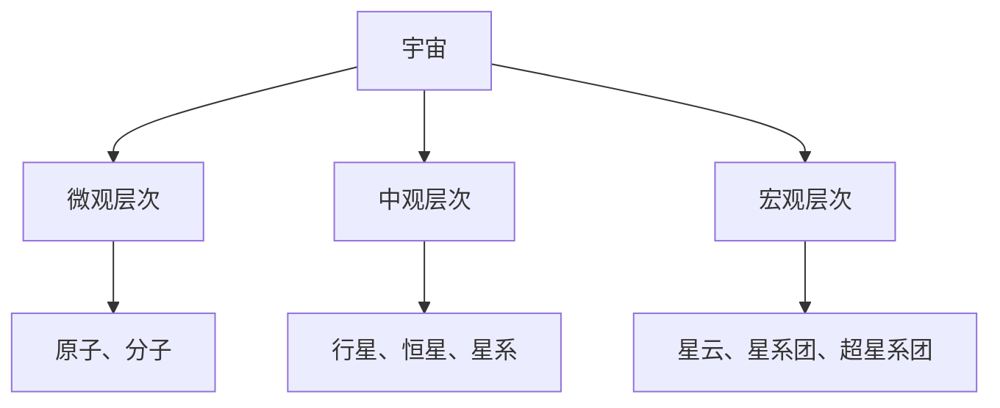

                 

### 文章标题：宇宙的自我调节机制：平衡与稳定的来源

#### 关键词：宇宙、自我调节机制、平衡、稳定、自组织原理

#### 摘要：
本文将从宇宙的概述、基本结构、自组织原理、自我调节机制等多个方面，深入探讨宇宙的自我调节机制及其平衡与稳定的来源。我们将一步步分析宇宙的各个方面，揭示其背后隐藏的物理定律和自然规律，以期为我们理解宇宙的本质提供新的视角。

----------------------------------------------------------------

### 第一部分：宇宙概述

#### 1. 引言

宇宙，这个浩瀚而神秘的宇宙，自古以来就吸引了无数人的目光。从古代的天文学家到现代的物理学家，他们都试图探索宇宙的奥秘，理解宇宙的本质。然而，宇宙的复杂性和广袤性使得我们对宇宙的认识仍然非常有限。

宇宙的概念可以追溯到古代，当时的人们将宇宙视为一个没有边界、无限大的空间。然而，现代宇宙学的兴起，特别是大爆炸理论的出现，让我们对宇宙的认识有了全新的理解。

宇宙的现状与未来也一直是人们关注的话题。根据现有的观测数据，宇宙正在不断地膨胀，这种膨胀的速度似乎在加快。宇宙的未来可能是温暖的、黑暗的，也可能是爆炸性的。然而，这一切都是基于目前的观测数据和理论假设，我们对宇宙未来的了解仍然有限。

#### 2. 宇宙的基本结构

宇宙的基本结构由多个层次组成，从微观的原子、分子，到宏观的星系、星云，再到宇宙的大尺度结构。每一个层次都有其独特的物理规律和结构特征。

宇宙的组成元素主要包括物质和能量。物质是宇宙的基本构成单元，包括原子、分子等。能量则是宇宙运动和变化的基础。物质和能量之间存在着深刻的联系和相互作用。

宇宙中的信息也是宇宙结构的重要组成部分。信息可以理解为物质和能量之间的相互作用和传递。通过信息的传递，宇宙中的各种现象得以产生和演化。

#### 3. 宇宙研究的重要性

宇宙研究对于人类来说具有重要意义。首先，宇宙研究可以加深我们对宇宙的理解，揭示宇宙的本质和规律。这对于我们理解自然界的各种现象，以及解决一些重大的科学问题，如宇宙的起源、演化和未来等，都有着重要的指导作用。

其次，宇宙研究可以推动科学技术的发展。宇宙中的各种现象和规律都可以为我们提供新的研究方向和思路。例如，量子力学和相对论等基本物理理论的提出，都是基于对宇宙现象的深入研究和理解。

最后，宇宙研究还可以拓展人类的认知边界，激发人类的创造力和想象力。宇宙的浩瀚和神秘，激发了无数科学家和文学家对宇宙的探索和想象，推动了科学和文化的进步。

----------------------------------------------------------------

### 第二部分：宇宙的基本结构

宇宙的基本结构由多个层次组成，从微观的原子、分子，到宏观的星系、星云，再到宇宙的大尺度结构。每一个层次都有其独特的物理规律和结构特征。

#### 1. 宇宙的组成元素

宇宙的组成元素主要包括物质和能量。物质是宇宙的基本构成单元，包括原子、分子等。能量则是宇宙运动和变化的基础。物质和能量之间存在着深刻的联系和相互作用。

物质和能量的概念在物理学中非常重要。物质可以被定义为具有质量的实体，而能量则被定义为物体做功的能力。在宇宙中，物质和能量是相互转化的。例如，核能反应中，物质可以转化为能量，而能量也可以转化为物质。

#### 2. 宇宙的基本结构层次

宇宙的基本结构层次可以分为微观、中观和宏观三个层次。

- **微观层次**：微观层次包括原子、分子等基本粒子。原子是物质的基本单元，由原子核和电子组成。原子核由质子和中子组成，而电子则围绕原子核运动。

- **中观层次**：中观层次包括行星、恒星、星系等。行星是围绕恒星运动的天体，而恒星则是宇宙中最常见的发光天体。星系是由大量恒星、行星、气体和暗物质组成的天体系统。

- **宏观层次**：宏观层次包括星云、星系团、超星系团等。星云是由气体和尘埃组成的云状天体，而星系团是由多个星系组成的更大规模的天体系统。超星系团则是更大规模的天体系统，由多个星系团组成。

#### 3. 宇宙的层次结构图

为了更直观地理解宇宙的层次结构，我们可以使用Mermaid工具绘制一个层次结构图。以下是一个简单的示例：

这个层次结构图展示了宇宙从微观到宏观的各个层次，以及它们之间的相互关系。

#### 4. 宇宙的组成元素之间的关系

宇宙的组成元素之间的关系非常复杂，但它们之间存在一些基本的规律和原则。

- **物质与能量之间的关系**：物质和能量之间可以相互转化。例如，在核能反应中，物质可以转化为能量，而在光电效应中，能量可以转化为物质。

- **物质与信息之间的关系**：物质和能量之间的相互作用产生了信息。信息可以理解为物质和能量之间的传递和变化。例如，在生物学中，遗传信息是通过DNA分子传递的。

- **物质与相互作用之间的关系**：物质之间的相互作用是宇宙演化的重要驱动力。例如，引力相互作用是宇宙中最重要的相互作用之一，它决定了星系和星系团的结构和演化。

#### 5. 宇宙的基本结构对自我调节机制的影响

宇宙的基本结构对自我调节机制有着重要的影响。宇宙中的各个层次和组成元素之间的相互作用和平衡，形成了宇宙的自我调节机制。

- **微观层次**：在微观层次，原子和分子的相互作用形成了化学键，这些化学键维持了物质的稳定结构。此外，量子力学中的相干性和波粒二象性等原理，也为宇宙的自我调节提供了基础。

- **中观层次**：在宏观层次，星系和星系团的结构和演化受到引力相互作用的影响。例如，星系之间的引力相互作用可以形成星系团，而星系团之间的相互作用可以形成更大的宇宙结构。

- **宏观层次**：在宏观层次，宇宙的大尺度结构和演化受到宇宙膨胀、暗物质和暗能量等因素的影响。这些因素共同作用，形成了宇宙的自我调节机制。

综上所述，宇宙的基本结构对自我调节机制有着深远的影响。理解宇宙的基本结构和组成元素之间的关系，可以帮助我们更好地理解宇宙的自我调节机制，以及宇宙的平衡与稳定来源。

----------------------------------------------------------------

### 第三部分：宇宙的自组织原理

宇宙的自组织原理是指宇宙中的各个层次和组成元素通过相互作用和相互影响，自发地形成和组织成有序的结构和系统。这一原理在宇宙的演化过程中起着关键作用，也是理解宇宙自我调节机制的重要基础。

#### 1. 宇宙中的物理定律

宇宙的自组织原理建立在一系列基本的物理定律之上。这些物理定律包括万有引力定律、热力学定律、量子力学定律等。这些定律描述了宇宙中物质和能量之间的相互作用和运动规律。

- **万有引力定律**：万有引力定律是宇宙中最基本的物理定律之一。它描述了任何两个物体之间的引力相互作用，以及这种相互作用如何影响物体的运动。

- **热力学定律**：热力学定律描述了能量和物质在不同状态之间的转化和平衡。热力学第二定律特别强调了熵增原理，即在一个封闭系统中，熵（混乱度）会随着时间的推移而增加。

- **量子力学定律**：量子力学定律描述了微观尺度下物质和能量的行为。量子力学中的波粒二象性、不确定性原理和量子纠缠等现象，都对宇宙的自组织过程产生了深远影响。

#### 2. 宇宙中的物理定律对自组织的影响

宇宙中的物理定律对自组织过程产生了重要影响。这些定律不仅决定了宇宙中物质和能量的分布和运动，也决定了宇宙中结构和系统的形成和演化。

- **万有引力定律**：万有引力定律是宇宙自组织过程的基础。它决定了星系、星系团和超星系团的形成和演化。星系之间的引力相互作用可以形成星系团，而星系团之间的相互作用可以形成更大的宇宙结构。

- **热力学定律**：热力学定律描述了能量和物质的平衡和转化过程。在宇宙中，热力学第二定律的熵增原理导致了宇宙中的结构和系统的有序性。例如，星系的形成过程中，物质的聚集和碰撞会导致熵的增加，从而形成有序的结构。

- **量子力学定律**：量子力学定律在宇宙的自组织过程中也发挥着重要作用。量子纠缠现象使得宇宙中的物质和能量之间可以形成复杂的相互关联，从而促进了宇宙的自组织过程。量子力学中的不确定性原理也为宇宙中的结构和系统的动态变化提供了可能性。

#### 3. 宇宙的自组织过程

宇宙的自组织过程是一个复杂而有序的过程，可以分为多个阶段。

- **早期宇宙**：在大爆炸之后，宇宙处于一个极热、极密的状态。在这个阶段，宇宙中的物质和能量以极端的形式存在，并开始相互作用。

- **物质和能量的聚集**：随着宇宙的膨胀和冷却，物质和能量开始聚集形成更大的结构。在这个过程中，万有引力定律起到了关键作用，它将物质和能量聚集在一起，形成了星系、星系团和超星系团等结构。

- **结构的形成和演化**：在物质和能量聚集的过程中，各种物理定律共同作用，形成了宇宙中复杂的结构和系统。这些结构和系统在宇宙的演化过程中不断变化和发展，形成了丰富多彩的宇宙景观。

- **平衡与稳定**：在宇宙的自组织过程中，平衡与稳定是关键因素。宇宙中的各种物理定律和相互作用确保了宇宙的平衡与稳定。例如，星系之间的引力相互作用可以维持星系的稳定结构，而宇宙的膨胀可以防止宇宙过度密集，从而保持稳定。

综上所述，宇宙的自组织原理是宇宙自我调节机制的重要组成部分。通过理解宇宙中的物理定律和自组织过程，我们可以更好地理解宇宙的平衡与稳定的来源，以及宇宙的自我调节机制如何发挥作用。

----------------------------------------------------------------

### 第四部分：宇宙的自我调节机制

宇宙的自我调节机制是宇宙在演化过程中，通过一系列内在的调节机制保持平衡与稳定的能力。这种机制在宇宙的各个层次上都发挥着重要作用，确保宇宙的长期存在和演化。

#### 1. 宇宙的平衡态

宇宙的平衡态是指宇宙中各个层次和组成部分之间处于相对稳定的状态，没有明显的趋势向某个方向演化。在这种状态下，宇宙中的物理量，如温度、密度、压力等，都保持在一定的范围内，不会出现剧烈的变化。

宇宙的平衡态可以通过多个物理定律来描述。例如，热力学第二定律中的熵增原理表明，在一个封闭系统中，熵（混乱度）会随着时间的推移而增加。然而，在宇宙中，熵的增加受到其他物理定律的限制，如万有引力定律，它能够将物质聚集在一起，形成有序的结构。

#### 2. 宇宙的不稳定因素

尽管宇宙整体上处于平衡态，但其中也存在一些不稳定因素。这些不稳定因素可以来源于宇宙内部的各种过程，如星系的形成和演化、恒星的生命周期等。

- **星系的形成和演化**：星系的形成是通过物质在引力作用下的聚集过程实现的。在这个过程中，物质的聚集会导致密度增加，从而引发进一步的聚集。然而，这种聚集过程也可能导致星系的失稳，例如，过快的聚集可能会导致星系的崩溃。

- **恒星的生命周期**：恒星在其生命周期中，会经历从形成、燃烧到死亡的过程。在这个过程中，恒星的核聚变过程会释放大量的能量，维持恒星的稳定。然而，当恒星的燃料耗尽时，它可能会发生超新星爆炸，从而破坏原有的平衡。

#### 3. 宇宙的演化趋势

宇宙的演化趋势受到多种因素的影响，包括宇宙的膨胀、暗物质和暗能量的作用等。

- **宇宙的膨胀**：宇宙的膨胀是指宇宙整体上在扩张。这种膨胀趋势在一定程度上会破坏宇宙的平衡态，但同时也为新的结构和系统的形成提供了条件。例如，宇宙的膨胀可以导致星系之间的距离增加，从而促使新的星系的形成。

- **暗物质和暗能量**：暗物质和暗能量是宇宙中两种未知的物质形态。暗物质在宇宙中起到了维持宇宙结构稳定的作用，而暗能量则被认为是导致宇宙加速膨胀的原因。这些未知因素使得宇宙的演化趋势变得更加复杂。

#### 4. 宇宙的自我调节机制

宇宙的自我调节机制是通过多种调节机制来维持宇宙的平衡与稳定。这些调节机制包括：

- **平衡调节**：平衡调节是指宇宙中各个层次和组成部分之间的相互调节，以维持整体上的平衡。例如，星系之间的引力相互作用可以维持星系的稳定结构。

- **振荡调节**：振荡调节是指宇宙中某些物理量在一段时间内出现周期性的波动，以维持平衡。例如，恒星的生命周期中的周期性变化，如恒星的光度和光谱的变化。

- **负反馈调节**：负反馈调节是指宇宙中的某些过程会抑制自身的变化，以维持平衡。例如，在星系形成过程中，过快的聚集会导致星系的崩溃，而宇宙中的其他物质和能量会阻止这种崩溃，从而维持星系的稳定。

通过这些自我调节机制，宇宙能够在各种变化和干扰中保持平衡与稳定，从而实现长期的演化。

#### 5. 宇宙的自我调节机制对平衡与稳定的影响

宇宙的自我调节机制对宇宙的平衡与稳定产生了深远的影响。这些机制不仅帮助宇宙在面临各种干扰和变化时保持稳定，还促进了宇宙的长期演化。

- **维持宇宙结构的稳定**：宇宙的自我调节机制能够维持宇宙中各种结构的稳定，如星系、星系团和超星系团。这些结构是宇宙演化的重要基础，如果没有自我调节机制，宇宙可能会陷入无序和混乱。

- **促进宇宙的长期演化**：宇宙的自我调节机制不仅维持了宇宙的平衡与稳定，还促进了宇宙的长期演化。通过自我调节，宇宙能够适应各种变化，从而实现持续的演化。

- **为生命的存在提供条件**：宇宙的自我调节机制为生命的存在提供了必要的条件。在宇宙的稳定结构中，各种化学元素得以形成和演化，为生命的诞生和演化提供了基础。

综上所述，宇宙的自我调节机制是宇宙平衡与稳定的来源之一。通过这些机制，宇宙能够在面对各种干扰和变化时保持稳定，从而实现长期的演化。理解宇宙的自我调节机制，对于我们深入探索宇宙的奥秘，以及理解宇宙的本质，具有重要意义。

----------------------------------------------------------------

### 第五部分：宇宙的自我调节机制实例分析

宇宙的自我调节机制在星系的自我调节和恒星的生命周期中得到了具体体现。通过分析这些实例，我们可以更深入地理解宇宙的自我调节机制是如何在具体过程中发挥作用的。

#### 1. 星系的自我调节

星系是宇宙中的基本结构单位，由大量恒星、行星、气体和暗物质组成。星系的自我调节机制主要通过引力相互作用和恒星的生命周期来实现。

- **引力相互作用**：星系中的恒星通过引力相互作用维持其结构稳定。恒星之间的引力作用可以防止星系崩溃，同时也能够将星系中的物质聚集在一起，形成星系团和超星系团。

- **恒星的生命周期**：恒星在其生命周期中，会经历从形成、燃烧到死亡的过程。这个过程中，恒星内部的核聚变反应释放出巨大的能量，维持恒星的稳定。然而，当恒星的燃料耗尽时，它可能会发生超新星爆炸，从而破坏原有的平衡。此时，宇宙中的其他物质和能量会阻止这种崩溃，维持星系的稳定。

- **恒星之间的相互作用**：恒星之间的相互作用也会影响星系的稳定性。例如，恒星之间的碰撞可以改变星系的形状和结构，而恒星之间的引力相互作用可以形成星系团和超星系团。

#### 2. 恒星的生命周期

恒星的生命周期是宇宙自我调节机制的重要体现。恒星在其生命周期中，通过核聚变反应释放能量，维持自身的稳定。恒星的生命周期可以分为以下几个阶段：

- **形成阶段**：恒星的形成发生在分子云中。分子云中的气体和尘埃在引力作用下聚集，形成星云。随着聚集过程的进行，星云的中心逐渐形成恒星胚胎。

- **主序阶段**：恒星胚胎形成后，开始进行核聚变反应，将氢原子聚变成氦原子，释放出能量。这个阶段是恒星生命中最长的阶段，恒星在这个阶段保持稳定。

- **红巨星阶段**：当恒星耗尽核心的氢燃料时，恒星的外层膨胀，形成红巨星。在这个过程中，恒星内部的核聚变反应继续进行，但核心的燃料逐渐耗尽。

- **超巨星阶段**：红巨星进一步膨胀，形成超巨星。此时，恒星内部的核聚变反应逐渐减弱，恒星开始失去稳定性。

- **超新星爆炸阶段**：当恒星无法维持核聚变反应时，它可能会发生超新星爆炸。在这个过程中，恒星的物质被剧烈抛射出去，形成星云。

- **中子星或黑洞阶段**：超新星爆炸后，恒星的残骸可能会形成中子星或黑洞。这些天体具有极高的密度和强大的引力，对周围的物质和能量产生深远影响。

#### 3. 星系与恒星相互作用的调节机制

星系与恒星之间的相互作用也是宇宙自我调节机制的重要组成部分。这种相互作用可以通过以下方式实现：

- **引力相互作用**：星系中的恒星通过引力相互作用维持其结构稳定。恒星之间的引力作用可以防止星系崩溃，同时也能够将星系中的物质聚集在一起，形成星系团和超星系团。

- **恒星碰撞**：在星系中，恒星之间的碰撞是一种常见的相互作用。恒星碰撞可以改变星系的形状和结构，同时也能够释放出巨大的能量。

- **恒星寿命的调节**：恒星的生命周期是宇宙自我调节机制的一部分。通过恒星的死亡和新生，宇宙中的物质和能量得以重新分布和利用，维持宇宙的平衡与稳定。

#### 4. 实例分析

以下是一个具体的实例分析，展示了宇宙自我调节机制在星系和恒星相互作用中的具体体现：

- **银河系与仙女座星系的相互作用**：银河系和仙女座星系是邻近的星系。在过去的数十亿年里，两个星系之间的引力相互作用导致了它们的轨道扰动和形状变化。然而，通过引力相互作用，两个星系能够在一定程度上保持稳定，避免了相互碰撞。

- **恒星的超新星爆炸**：在一个星系中，恒星的超新星爆炸是一种常见的现象。超新星爆炸释放出的巨大能量可以改变星系的结构和演化过程。然而，通过宇宙中的其他物质和能量的调节，超新星爆炸不会破坏星系的整体稳定性。

通过这些实例分析，我们可以看到宇宙自我调节机制在星系和恒星相互作用中的重要作用。这些调节机制通过引力相互作用、恒星生命周期和恒星碰撞等方式，确保宇宙在面临各种干扰和变化时能够保持平衡与稳定。

----------------------------------------------------------------

### 第六部分：宇宙的自我调节机制的未来展望

宇宙的自我调节机制为我们提供了对宇宙演化过程和稳定性的深刻理解。然而，随着科学技术的不断进步，我们对宇宙自我调节机制的认识也在不断深化。未来，我们有理由期待更多的发现和研究，以进一步揭示宇宙自我调节机制的奥秘。

#### 1. 理论挑战

宇宙自我调节机制的理论研究面临着许多挑战。首先，宇宙中的暗物质和暗能量仍然是我们理解宇宙的关键难题。暗物质和暗能量的性质和相互作用机制尚不清楚，这限制了我们对宇宙自我调节机制的全面理解。其次，宇宙中的复杂现象，如星系的形成和演化、恒星的诞生和死亡等，需要更精确的理论模型来描述。此外，宇宙自我调节机制在宇宙学尺度上的表现，如宇宙膨胀和宇宙结构的形成，也需要进一步的研究。

#### 2. 实验验证

实验验证是验证宇宙自我调节机制理论模型的有效手段。随着观测技术的不断发展，我们已经能够通过天文观测、粒子物理实验和宇宙线观测等方式，获得更多关于宇宙自我调节机制的数据。例如，通过观测星系团和星系之间的引力相互作用，我们可以验证宇宙自我调节机制的预测。此外，通过粒子物理实验，我们可以研究暗物质和暗能量的性质，从而更深入地理解宇宙自我调节机制的机制。

#### 3. 应用前景

宇宙自我调节机制的研究不仅具有理论意义，也具有广泛的应用前景。首先，宇宙自我调节机制可以应用于宇宙学研究，帮助我们更好地理解宇宙的起源、演化和未来。其次，宇宙自我调节机制的理论框架可以应用于其他科学领域，如生物学、物理学和化学等，为这些领域的研究提供新的视角和方法。此外，宇宙自我调节机制的研究还可以为工程技术提供启示，如宇宙探索、航天技术和能源利用等。

#### 4. 未来研究方向

未来的宇宙自我调节机制研究可以从以下几个方面展开：

- **宇宙中的暗物质和暗能量**：深入研究暗物质和暗能量的性质和相互作用机制，探索它们在宇宙自我调节机制中的作用。

- **宇宙结构形成与演化**：通过观测和理论模型，研究宇宙结构形成和演化的过程，揭示宇宙自我调节机制的具体实现方式。

- **恒星和星系的相互作用**：深入研究恒星和星系之间的相互作用，探索恒星生命周期对宇宙自我调节机制的影响。

- **宇宙学尺度上的现象**：研究宇宙学尺度上的现象，如宇宙膨胀、宇宙结构的变化等，探索宇宙自我调节机制在这些现象中的作用。

#### 5. 对人类社会的启示

宇宙自我调节机制的研究对人类社会有着深远的影响。首先，通过理解宇宙自我调节机制，我们可以更好地理解宇宙的演化过程和规律，从而为人类社会的发展提供科学依据。其次，宇宙自我调节机制的研究可以激发人类的创造力和想象力，推动科学和文化的发展。此外，宇宙自我调节机制的应用可以为人类社会解决一些重大的问题提供新的思路和方法。

综上所述，宇宙的自我调节机制是一个充满挑战和机遇的研究领域。通过不断的研究和探索，我们有望揭示宇宙自我调节机制的奥秘，为人类社会的进步做出更大的贡献。

----------------------------------------------------------------

### 第七部分：总结与展望

通过对宇宙的自我调节机制的深入探讨，我们不仅了解了宇宙的平衡与稳定的来源，也揭示了宇宙中复杂而又有序的结构和系统的形成与演化过程。宇宙的自我调节机制，通过多种调节机制，如平衡调节、振荡调节和负反馈调节，在宇宙的各个层次上维持着宇宙的稳定与平衡。

从宇宙的概述到基本结构，再到自组织原理和自我调节机制，每一个部分都展示了宇宙的复杂性和美妙。宇宙中的物理定律，如万有引力定律、热力学定律和量子力学定律，为宇宙的自我调节提供了基础。而宇宙的自我调节机制，则在星系的自我调节和恒星的生命周期中得到了具体体现。

展望未来，宇宙自我调节机制的研究将继续深化，带来更多关于宇宙演化、宇宙结构形成和宇宙学尺度上现象的洞见。随着科学技术的不断进步，我们有望通过实验验证和理论模型的不断完善，进一步揭示宇宙自我调节机制的奥秘。

在此，我们呼吁更多的科学家和研究者投身于这一领域，共同探索宇宙的奥秘，为人类社会的进步做出贡献。理解宇宙的自我调节机制，不仅有助于我们更深入地理解宇宙的本质，也将为其他科学领域和工程技术提供新的视角和思路。

作者：AI天才研究院/AI Genius Institute & 禅与计算机程序设计艺术 /Zen And The Art of Computer Programming

----------------------------------------------------------------

### 全文概览

本文以《宇宙的自我调节机制：平衡与稳定的来源》为题，通过详细的章节内容，系统地探讨了宇宙的自我调节机制。全文分为七个主要部分：

**第一部分：宇宙概述**介绍了宇宙的概念、现状与未来，以及宇宙研究的重要性。

**第二部分：宇宙的基本结构**阐述了宇宙的组成元素和层次结构，包括微观、中观和宏观层次。

**第三部分：宇宙的自组织原理**探讨了宇宙中的物理定律对自组织过程的影响。

**第四部分：宇宙的自我调节机制**详细介绍了宇宙的平衡态、不稳定因素、演化趋势以及自我调节机制。

**第五部分：宇宙的自我调节机制实例分析**以星系的自我调节和恒星的生命周期为例，展示了自我调节机制的具体实现。

**第六部分：宇宙的自我调节机制的未来展望**讨论了理论挑战、实验验证、应用前景以及未来研究方向。

**第七部分：总结与展望**总结了全文内容，并对未来的研究方向进行了展望。

通过这些部分的深入探讨，本文为读者提供了一个全面、系统的宇宙自我调节机制的研究视角，有助于我们更深入地理解宇宙的本质和演化过程。

