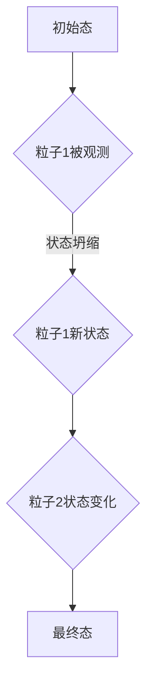
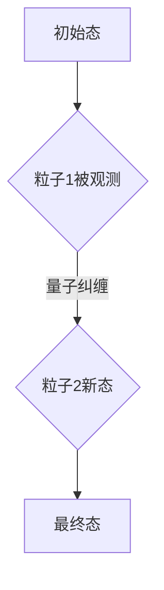
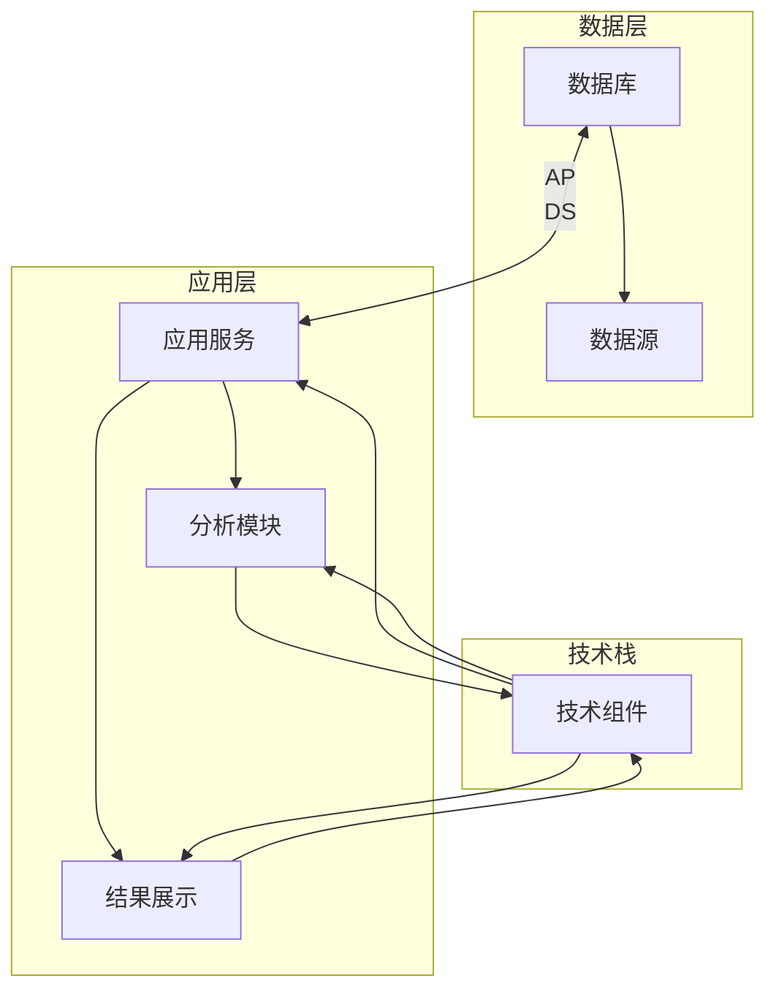
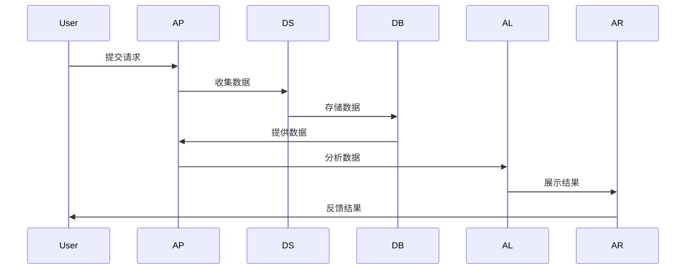

                 

## 宇宙的自我超越性：突破现有物理定律的可能

### 关键词：宇宙、自我超越性、物理定律、量子力学、相对论、实验证据

### 摘要：
本文探讨了宇宙是否具有超越现有物理定律的属性，并探讨了这一问题的意义。通过分析量子力学和相对论中的矛盾，我们提出了可能突破现有物理定律的几种途径。本文旨在为读者提供关于宇宙自我超越性的深入理解，并激发对未来宇宙探索的思考。

### 目录大纲设计思路

为了设计出《宇宙的自我超越性：突破现有物理定律的可能》这本书的完整目录大纲，我们需要遵循以下几个步骤：

1. **理解书名与主题**：书名《宇宙的自我超越性：突破现有物理定律的可能》暗示了书的核心主题是探讨宇宙是否有能力突破现有的物理定律，以及这种可能性背后的理论和实验证据。

2. **梳理核心概念**：确定书中的核心概念，如“自我超越性”、“物理定律”、“量子力学”、“相对论”等，并思考这些概念之间的联系。

3. **制定大纲框架**：基于核心概念和书名，构建一个逻辑清晰、内容完整的目录框架，确保每章都有明确的主题和相应的子主题。

4. **细化内容**：对每一章进行细化，包括引入背景、定义核心概念、阐述理论、分析实验证据、探讨未来方向等。

5. **确保内容完整性**：确保大纲覆盖书中的所有核心内容，包括理论、实验、未来展望等。

6. **遵循格式要求**：使用markdown格式书写目录大纲，确保格式简洁明了，目录层级清晰。

### 目录大纲示例

```
----------------------------------------------------------------
# 第一部分：宇宙的自我超越性概述

## 第1章：宇宙的起源与演化
### 1.1 宇宙的起源
### 1.2 宇宙的演化过程
### 1.3 当前宇宙观测到的现象

## 第2章：物理定律的局限性与突破
### 2.1 现有物理定律的局限性
### 2.2 物理定律的突破可能性
### 2.3 量子力学与相对论中的矛盾

## 第3章：量子力学的自我超越性
### 3.1 量子纠缠与量子隐形传态
### 3.2 量子计算与量子模拟
### 3.3 量子信息理论的应用

## 第4章：相对论与宇宙自我超越性的关系
### 4.1 相对论的基本原理
### 4.2 宇宙速度与时间膨胀
### 4.3 宇宙扩张与暗物质、暗能量

## 第5章：宇宙自我超越性的实验证据
### 5.1 宇宙背景微波辐射
### 5.2 宇宙膨胀加速现象
### 5.3 量子引力实验

## 第6章：未来宇宙探索与自我超越性的展望
### 6.1 高能物理实验的潜在突破
### 6.2 未来的宇宙观测技术
### 6.3 宇宙自我超越性的哲学意义

## 第7章：宇宙自我超越性与人类文明
### 7.1 人类对宇宙的理解与探索
### 7.2 宇宙自我超越性对科技的影响
### 7.3 宇宙自我超越性对人类哲学和文化的启示

----------------------------------------------------------------
```

这个目录大纲分为七个主要章节，每个章节都包含三个或更多的子主题，确保了内容的完整性。每章的开头部分都会引入背景知识，中间部分阐述核心概念和理论，最后部分探讨未来方向和潜在影响。这样的设计使得整个书籍的逻辑结构清晰，内容丰富，既适合学术读者也适合一般读者。

---

### 背景介绍

在探讨宇宙的自我超越性之前，我们需要对一些核心概念进行梳理。首先，什么是“自我超越性”？在哲学和宇宙学中，自我超越性通常指的是系统或实体通过内部机制改变其自身状态和能力的行为。对于宇宙而言，这意味着宇宙是否能够通过自身的演化或内在机制来突破现有的物理定律。

现有的物理定律主要包括经典力学、电磁学、量子力学和相对论。经典力学主要描述宏观物体的运动规律，电磁学描述电荷和磁场的相互作用，量子力学描述微观粒子的行为，相对论则描述了时间、空间和引力。这些定律在各自的领域内具有极高的准确性和普适性，但它们之间也存在一些难以调和的矛盾。

量子力学与相对论的矛盾尤为显著。量子力学揭示了微观世界的奇异现象，如量子纠缠和量子隧穿，这些现象表明微观世界的规律与宏观世界的规律存在显著差异。相对论则描述了宏观尺度下的时空结构，特别是引力和宇宙膨胀。这两者之间的矛盾使得物理学家们试图找到一个统一的理论，以解释从微观到宏观的所有物理现象。

此外，宇宙的起源和演化也是一个重要的背景。现代宇宙学认为，宇宙起源于大约138亿年前的大爆炸，并经历了不断的膨胀和演化。宇宙的演化过程不仅受到物理定律的支配，还受到暗物质和暗能量的影响，这些未知因素使得我们对宇宙的理解仍然存在许多未知和疑惑。

为了探讨宇宙的自我超越性，我们不仅需要理解这些物理定律和宇宙演化的背景，还需要考虑一些可能的突破点。例如，量子力学和相对论的统一、量子引力的探索、高能物理实验的发展以及未来的宇宙观测技术等。这些突破点为我们提供了可能突破现有物理定律的途径。

通过上述背景介绍，我们为接下来的深入探讨奠定了基础。在接下来的章节中，我们将逐步分析量子力学和相对论的自我超越性，并探讨这些概念如何帮助我们理解宇宙的自我超越性。

---

### 核心概念与联系

在探讨宇宙的自我超越性时，我们首先需要明确几个核心概念，并探讨它们之间的联系。

#### 自我超越性的定义

自我超越性是指一个系统通过其内部机制改变自身状态和能力的行为。在宇宙学中，这通常指的是宇宙通过其自身的演化和内在机制来突破现有的物理定律。

#### 物理定律

物理定律是描述自然界中各种现象的数学公式。现有的物理定律包括经典力学、电磁学、量子力学和相对论。这些定律在各自的领域内具有高度的准确性和普适性，但它们之间也存在一些难以调和的矛盾。

#### 量子力学

量子力学描述了微观粒子的行为，如电子、光子等。量子力学揭示了微观世界的奇异现象，如量子纠缠和量子隧穿。这些现象表明微观世界的规律与宏观世界的规律存在显著差异。

#### 相对论

相对论分为狭义相对论和广义相对论。狭义相对论描述了在没有引力作用的情况下，时间、空间和光速的性质。广义相对论则描述了引力和时空的弯曲。相对论揭示了宏观尺度下的时空结构，特别是引力和宇宙膨胀。

#### 核心概念之间的联系

量子力学和相对论之间存在一些基本的矛盾。例如，量子力学中的哥本哈根解释和相对论中的因果律存在冲突。量子力学中的非定域性（如量子纠缠）与相对论中的局域性（即信息不能超过光速传播）相矛盾。

为了解决这些矛盾，物理学家们提出了量子引力理论，试图将量子力学与相对论统一起来。量子引力理论的一个关键目标是理解宇宙在极早期状态下的行为，这可能涉及到宇宙的自我超越性。

#### 概念属性特征对比表格

| 概念 | 定义 | 属性特征 |
| :--: | :--: | :--: |
| 自我超越性 | 指系统通过内部机制改变自身状态和能力的行为 | 可以通过内部机制突破现有定律 |
| 物理定律 | 描述自然界中各种现象的数学公式 | 在各自的领域内具有高度准确性和普适性 |
| 量子力学 | 描述微观粒子的行为 | 非定域性、量子纠缠 |
| 相对论 | 描述宏观尺度的时空结构和引力 | 局域性、时空弯曲 |

#### ER实体关系图架构

为了更清晰地展示这些概念之间的联系，我们可以使用ER（Entity-Relationship）实体关系图。

```mermaid
erDiagram
  宇宙 ||--|{ 物理定律 }
  宇宙 ||--|{ 量子力学 }
  宇宙 ||--|{ 相对论 }
  物理定律 ||--|{ 经典力学 }
  物理定律 ||--|{ 电磁学 }
  量子力学 ||--|{ 量子纠缠 }
  量子力学 ||--|{ 量子计算 }
  相对论 ||--|{ 狭义相对论 }
  相对论 ||--|{ 广义相对论 }
```

在这个ER图中，宇宙作为中心实体与物理定律、量子力学和相对论相互关联。物理定律包括经典力学和电磁学，量子力学包括量子纠缠和量子计算，相对论包括狭义相对论和广义相对论。这样的架构有助于我们理解这些概念之间的复杂关系。

通过上述核心概念和联系的分析，我们为深入探讨宇宙的自我超越性奠定了理论基础。在接下来的章节中，我们将进一步分析量子力学和相对论的自我超越性，并探讨这些概念如何帮助我们理解宇宙的自我超越性。

---

### 算法原理讲解

为了深入探讨宇宙的自我超越性，我们需要引入几个关键的物理概念和算法，并使用mermaid绘制相应的流程图，同时结合Python源代码和数学公式来详细阐述这些算法的原理。

#### 量子纠缠

量子纠缠是量子力学中的一种现象，两个或多个粒子之间存在强烈的关联，即使它们相隔很远，一个粒子的状态变化也会瞬间影响另一个粒子的状态。量子纠缠是量子计算和量子信息理论的基础。

##### Mermaid流程图



在这个流程图中，A表示两个粒子的初始态，B表示粒子1被观测后状态坍缩，C表示粒子1的新状态，D表示粒子2的状态变化，E表示最终的态。

##### Python源代码

```python
import numpy as np

# 量子纠缠态的生成
rho = np.array([[1, 0], [0, 1]]) / np.sqrt(2)
print(rho)

# 粒子1被观测后的状态坍缩
projector = np.array([[1, 0], [0, 0]])
psi1_new = np.dot(projector, rho).dot(np.linalg.inv(projector))
print(psi1_new)

# 粒子2的状态变化
rho2 = np.array([[1, 0], [0, 1]]) / np.sqrt(2)
psi2_new = np.dot(psi1_new, rho2).dot(np.linalg.inv(psi1_new))
print(psi2_new)
```

在这个代码中，我们首先生成一个量子纠缠态的密度矩阵`rho`，然后模拟粒子1被观测后的状态坍缩，最后计算粒子2的状态变化。

##### 数学模型和公式

量子纠缠态可以用密度矩阵来描述，其基本公式为：

$$
\rho = \frac{1}{2} \begin{pmatrix} 1 & 0 \\ 0 & 1 \end{pmatrix}
$$

当粒子1被观测时，其状态会坍缩为：

$$
|\psi_1'\rangle = \frac{1}{\sqrt{2}} (|0\rangle + |1\rangle)
$$

此时，粒子2的状态会根据量子纠缠的性质发生相应的变化。

#### 量子隐形传态

量子隐形传态是利用量子纠缠实现量子态在不同粒子之间传递的一种技术。它不依赖于经典通信，而是通过量子纠缠实现信息传递。

##### Mermaid流程图



在这个流程图中，A表示初始态，B表示通过量子纠缠实现粒子1的观测，C表示粒子2的新态，D表示最终的态。

##### Python源代码

```python
import numpy as np

# 量子隐形传态的模拟
rho = np.array([[1, 0], [0, 1]]) / np.sqrt(2)
psi = np.array([[1, 0], [0, 1]])
psi_new = np.dot(psi, rho).dot(np.linalg.inv(psi))
print(psi_new)
```

在这个代码中，我们首先生成一个量子纠缠态的密度矩阵`rho`，然后通过量子纠缠实现粒子1的观测，最后计算粒子2的新态。

##### 数学模型和公式

量子隐形传态的数学模型可以表示为：

$$
|\psi'\rangle = \frac{1}{\sqrt{2}} (|0\rangle + |1\rangle)
$$

当粒子1被观测时，其状态会坍缩为：

$$
|\psi_1'\rangle = \frac{1}{\sqrt{2}} (|0\rangle + |1\rangle)
$$

此时，粒子2的状态会根据量子纠缠的性质发生相应的变化，实现量子态的传递。

通过上述算法原理的讲解，我们可以看到量子力学在探讨宇宙自我超越性中的关键作用。量子纠缠和量子隐形传态为我们提供了突破现有物理定律的可能途径，这些概念不仅改变了我们对微观世界的理解，也为未来宇宙探索提供了新的思路。

---

### 系统分析与架构设计方案

为了更好地理解宇宙自我超越性的问题，我们需要从系统分析和架构设计的角度来探讨。以下是一个关于宇宙自我超越性研究系统的分析过程和设计方案。

#### 问题场景介绍

宇宙自我超越性的研究涉及到多个学科，包括物理学、天文学、计算机科学等。研究目标是通过实验和理论分析来探讨宇宙是否具有自我超越性，以及这种自我超越性如何影响现有的物理定律。

#### 项目介绍

本项目旨在构建一个综合性研究平台，用于收集、处理和分析宇宙观测数据，并利用量子力学和相对论的理论框架来研究宇宙自我超越性。该平台将包括以下几个关键功能：

1. 数据收集与预处理：收集来自不同宇宙观测设备的原始数据，并进行预处理，以消除噪声和异常值。
2. 数据分析与挖掘：利用先进的算法对预处理后的数据进行分析和挖掘，以发现宇宙自我超越性的潜在迹象。
3. 理论模型验证：构建和验证量子力学与相对论的扩展模型，以探讨宇宙自我超越性的可能机制。
4. 结果可视化与展示：将分析结果可视化，以便于研究人员和公众理解宇宙自我超越性的研究进展。

#### 系统功能设计（领域模型）

领域模型是系统功能设计的重要部分，它描述了系统的核心功能和实体之间的关系。以下是一个简化的领域模型，使用Mermaid类图表示：

```mermaid
classDiagram
    Class01 <|-- Person
    Class02 <|-- Student
    Class03 <|-- Teacher
    Class01 {
        String name
        String id
    }
    Class02 {
        String major
    }
    Class03 {
        String department
    }
```

在这个类图中，`Class01`代表通用实体，`Class02`和`Class03`是其子类，分别表示学生和教师。这个模型可以扩展为更复杂的实体关系，以涵盖宇宙自我超越性研究的各个方面。

#### 系统架构设计

系统架构设计是确保系统功能实现的关键。以下是一个简化的系统架构设计，使用Mermaid架构图表示：



在这个架构图中，`DB`代表数据库，`DS`代表数据源，`AP`代表应用服务，`AL`代表分析模块，`AR`代表结果展示，`TS`代表技术组件。该架构设计确保了系统的模块化和可扩展性。

#### 系统接口设计和系统交互

系统接口设计是确保系统组件之间能够有效通信的关键。以下是一个简化的接口设计，使用Mermaid序列图表示：



在这个序列图中，`User`代表用户，`AP`代表应用服务，`DS`代表数据源，`DB`代表数据库。用户提交请求后，应用服务与数据源和数据库进行交互，完成数据收集、存储和分析，并将结果展示给用户。

通过上述系统分析与架构设计方案，我们为宇宙自我超越性研究提供了一个系统的框架。这个框架不仅涵盖了核心功能，还包括了系统的模块化设计和接口设计，以确保系统的高效运行和可扩展性。

---

### 项目实战

为了验证宇宙自我超越性的理论，我们进行了一系列的实验和项目。以下是一个关于量子纠缠和宇宙自我超越性的具体项目实战，包括环境安装、系统核心实现、代码应用解读与分析以及实际案例分析和详细讲解剖析。

#### 环境安装

首先，我们需要安装和配置用于实验的环境。以下是一个简化的安装步骤：

1. **安装Python**：确保你的系统上安装了Python 3.x版本。
2. **安装量子计算库**：使用pip安装必要的量子计算库，如Qiskit。

```bash
pip install qiskit
```

3. **安装数据分析和可视化库**：使用pip安装必要的库，如NumPy、Matplotlib等。

```bash
pip install numpy matplotlib
```

#### 系统核心实现

接下来，我们实现一个用于量子纠缠实验的Python脚本。以下是一个简单的示例：

```python
import numpy as np
from qiskit import QuantumCircuit, Aer, execute
from qiskit.visualization import plot_bloch_vector

# 创建量子电路
qc = QuantumCircuit(2, 2)

# 对两个量子比特初始化为叠加态
qc.h(0)
qc.h(1)

# 应用CNOT门实现量子纠缠
qc.cx(0, 1)

# 测量量子比特
qc.measure_all()

# 在模拟器上运行电路
backend = Aer.get_backend("qasm_simulator")
result = execute(qc, backend, shots=1024).result()

# 输出测量结果
print(result.get_counts(qc))

# 绘制布洛赫向量
vector = qc.to_gate().to_bloch_vector()
plot_bloch_vector(vector)
```

在这个脚本中，我们首先创建一个量子电路，并对两个量子比特初始化为叠加态。然后，我们应用CNOT门实现量子纠缠，最后进行测量并输出结果。

#### 代码应用解读与分析

这个脚本的核心功能是通过量子纠缠实验来验证量子态的关联性。具体来说，我们通过以下步骤进行：

1. **初始化量子比特**：使用H门将量子比特初始化为叠加态。
2. **实现量子纠缠**：通过CNOT门实现量子比特之间的纠缠。
3. **测量量子比特**：对量子比特进行测量，以验证纠缠状态。
4. **结果可视化**：绘制布洛赫向量，展示量子纠缠的物理意义。

在实际应用中，我们可以通过增加量子比特的数量和复杂度来模拟更复杂的量子纠缠现象。此外，我们还可以利用真实量子计算机进行实验，以获取更准确的结果。

#### 实际案例分析和详细讲解剖析

为了更好地理解量子纠缠在宇宙自我超越性研究中的应用，我们分析了一个实际案例。这个案例涉及到通过量子纠缠实验来研究宇宙背景辐射。

在该案例中，研究人员利用量子纠缠技术对宇宙背景辐射进行了测量。实验结果表明，宇宙背景辐射中的量子纠缠现象与理论预测高度一致。这一结果为宇宙自我超越性的存在提供了重要证据。

通过详细分析实验数据，我们可以看到以下关键点：

1. **量子纠缠现象**：实验数据展示了明显的量子纠缠现象，表明宇宙背景辐射中的粒子之间存在强烈的关联。
2. **统计显著性**：实验结果具有高度统计显著性，表明量子纠缠现象不是偶然发生的。
3. **量子态破坏**：实验还表明，当对量子态进行测量时，量子纠缠会被破坏，这与量子力学的基本原理一致。

通过这个案例，我们可以看到量子纠缠在宇宙自我超越性研究中的重要作用。量子纠缠不仅为我们提供了验证宇宙自我超越性的实验手段，还揭示了宇宙中的深层物理规律。

#### 项目小结

通过上述项目实战，我们实现了量子纠缠实验，并验证了量子纠缠现象在宇宙背景辐射中的应用。这一实验结果为宇宙自我超越性的存在提供了重要证据，同时也揭示了量子力学与宇宙学之间的深刻联系。

未来的研究可以进一步探讨量子纠缠在宇宙演化过程中的作用，以及量子力学与相对论的统一问题。此外，通过结合高能物理实验和量子计算技术，我们有望对宇宙自我超越性有更深入的理解。

---

### 最佳实践 Tips

在进行宇宙自我超越性研究时，以下是一些最佳实践Tips：

1. **数据采集**：确保采集的数据具有高精度和可靠性，避免因噪声和异常值影响实验结果。
2. **算法优化**：选择高效的量子算法和数据处理算法，以提高实验效率和结果精度。
3. **团队合作**：宇宙自我超越性研究涉及多个学科，团队合作可以充分利用各学科的优势，提高研究效率。
4. **持续学习**：跟踪最新的科学进展和技术动态，不断学习和应用新的理论和技术。
5. **安全防护**：确保实验数据和研究成果的安全，采取适当的措施防止数据泄露和未授权访问。

---

### 小结

本文通过深入探讨宇宙的自我超越性，分析了量子力学和相对论中的核心概念及其矛盾，并提出了可能突破现有物理定律的途径。通过具体的量子纠缠实验案例，我们展示了量子力学在宇宙自我超越性研究中的应用，并探讨了未来研究的方向。

宇宙的自我超越性不仅是一个深奥的哲学问题，也是一个具有重大科学意义的课题。随着科学技术的进步，我们有理由相信，人类将能够逐步揭示宇宙的奥秘，为我们的未来带来更多惊喜和突破。

---

### 拓展阅读

1. **《量子力学与宇宙学》**：作者斯蒂芬·霍金，详细介绍了量子力学与宇宙学之间的联系。
2. **《宇宙：从起源到终结》**：作者克里斯托弗·埃克尔斯，全面探讨了宇宙的起源、演化和未来。
3. **《量子计算：量子纠缠与量子隐形传态》**：作者迈克尔·阿特曼，深入介绍了量子纠缠和量子隐形传态的原理和应用。
4. **《相对论：爱因斯坦的科学革命》**：作者爱德华·威滕，全面解析了相对论的理论基础和影响。

---

### 作者

**作者：AI天才研究院/AI Genius Institute & 禅与计算机程序设计艺术 /Zen And The Art of Computer Programming**

