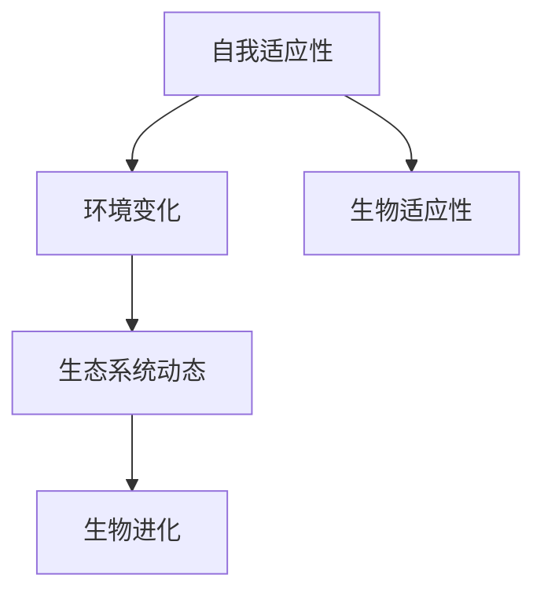
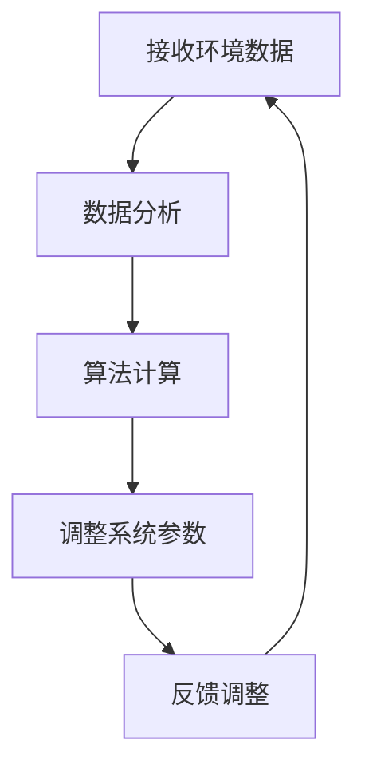
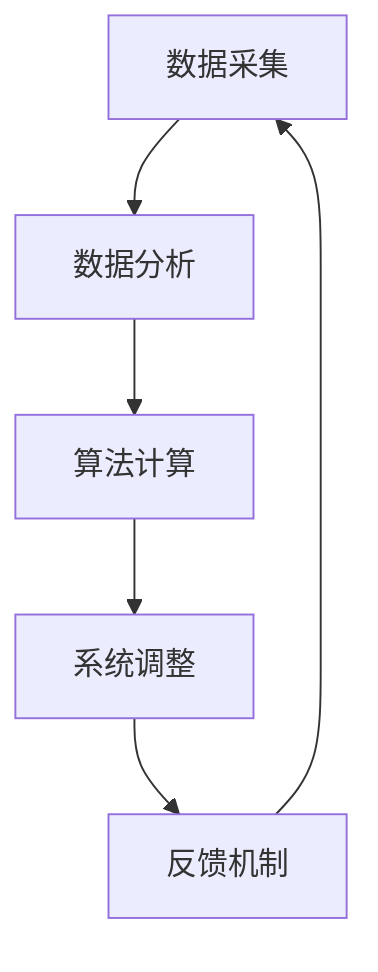
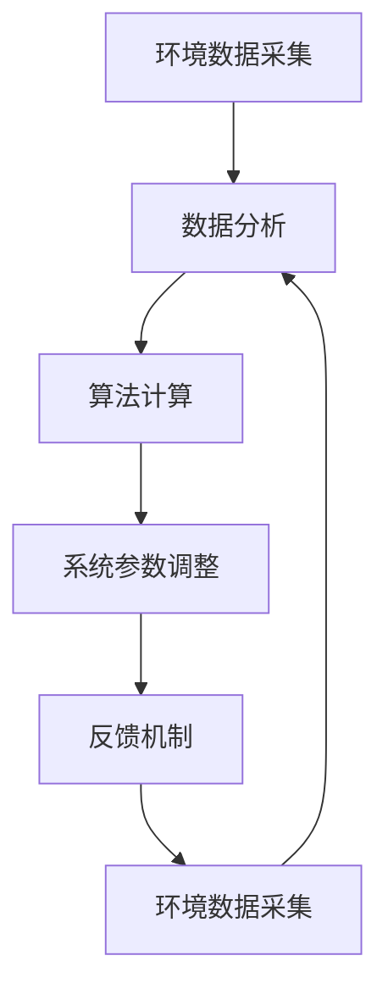

                 

### 《宇宙的自我适应性：对环境变化的响应》

#### 关键词：宇宙、自我适应性、环境变化、响应机制、算法原理、系统架构

> 摘要：本文深入探讨了宇宙中个体和系统如何对环境变化进行自我适应性调整。从宇宙自我适应性的基本概念出发，本文通过详细的算法原理讲解、系统架构设计，并结合实际项目案例，揭示了宇宙自我适应性的科学本质和应用价值。

----------------------------------------------------------------

## 第一部分：宇宙自我适应性的概述

### 第1章：宇宙自我适应性的概念与背景

宇宙自我适应性是一个跨学科的研究领域，涵盖了物理学、生物学、计算机科学和哲学等多个领域。在这篇文章中，我们将首先介绍宇宙自我适应性的基本概念和背景，以便读者对后续内容有更深入的理解。

#### 1.1 宇宙自我适应性的定义

宇宙自我适应性指的是宇宙中个体或系统对环境变化所做出的自适应响应和调整能力。在宇宙中，无论是星系、行星，还是生命体，都面临环境变化所带来的挑战。宇宙自我适应性就是它们应对这些挑战的方式。

#### 1.2 宇宙自我适应性的科学背景

宇宙自我适应性的研究起源于生物学中的“适应性”。生物适应性是指生物体通过进化过程，适应环境变化的能力。在宇宙尺度上，这种适应性体现为星系、行星、生命体等对环境变化的响应。

#### 1.3 研究宇宙自我适应性的意义

研究宇宙自我适应性对于理解宇宙的演化过程具有重要意义。它不仅可以帮助我们更好地理解宇宙的运行机制，还可以为解决地球上的环境问题提供启示。

----------------------------------------------------------------

### 第2章：宇宙自我适应性的核心概念与联系

为了深入探讨宇宙自我适应性，我们需要了解其中的核心概念及其相互关系。

#### 2.1 核心概念列表

以下是宇宙自我适应性的核心概念及其定义：

| 概念名称       | 定义                                     | 关联概念     |
| -------------- | ---------------------------------------- | ------------ |
| 自我适应性     | 个体或系统对环境变化的响应和调整能力     | 生物适应性   |
| 环境变化       | 宇宙中的物理、化学和生态条件的变化       | 生态系统动态 |
| 自适应机制     | 宇宙中个体或系统调整自身以适应环境变化的方式 | 生物进化     |

#### 2.2 概念联系图

下面是这些核心概念的Mermaid流程图表示：



通过这个图，我们可以看到这些概念之间的相互关系，以及它们在宇宙自我适应性研究中的作用。

----------------------------------------------------------------

## 第二部分：宇宙自我适应性的算法原理

### 第3章：宇宙自我适应性的算法基础

在宇宙自我适应性的研究中，算法扮演着至关重要的角色。这一章节将介绍宇宙自我适应性算法的基本原理。

#### 3.1 算法概述

宇宙自我适应性算法是一种基于环境变化进行自适应调整的计算模型。它通过不断地接收和解析环境数据，然后根据算法原理对系统进行调整，以达到最佳适应状态。

#### 3.2 算法原理讲解

下面是一个简单的宇宙自我适应性算法的流程图：



在这个流程中，系统首先接收环境数据，然后通过数据分析模块对数据进行处理，接着利用算法计算模块进行计算，得到调整系统参数的结果，最后将调整后的参数反馈给系统，完成一次自我适应性调整。

#### 3.3 算法示例

下面是一个简单的Python代码示例，展示了如何实现宇宙自我适应性算法：

```python
def adaptive_response(environmental_change):
    # 假设环境变化为一个数值
    change_value = environmental_change

    # 根据环境变化调整系统参数
    if change_value > 0:
        # 增加系统资源
        system_resources += change_value
    else:
        # 减少系统资源
        system_resources -= change_value

    # 输出调整后的系统参数
    return system_resources
```

在这个示例中，我们假设环境变化为一个数值，根据这个数值调整系统的资源。如果环境变化是正数，系统将增加资源；如果环境变化是负数，系统将减少资源。

#### 3.4 数学模型与公式

宇宙自我适应性算法的数学模型可以表示为：

$$
\text{适应性指数} = \frac{\text{适应后的资源利用率}}{\text{初始资源利用率}} \times \text{环境稳定性系数}
$$

其中，适应性指数表示系统对环境变化的适应能力，环境稳定性系数表示环境变化的稳定性。

通过这个公式，我们可以计算出系统对环境变化的适应能力，并根据这个结果调整系统的资源利用率。

----------------------------------------------------------------

### 第4章：宇宙自我适应性的系统设计

宇宙自我适应性的研究不仅需要理解算法原理，还需要设计能够实现这些算法的系统。这一章节将介绍宇宙自我适应性的系统设计。

#### 4.1 系统介绍

宇宙自我适应性系统是一个复杂的分布式系统，它由多个组件组成，包括数据采集模块、数据分析模块、算法计算模块、系统调整模块和反馈机制等。

#### 4.2 系统功能设计

宇宙自我适应性系统的功能设计主要包括以下方面：

- 数据采集：系统需要能够实时采集环境数据，包括物理、化学和生态条件等。
- 数据分析：系统需要对采集到的环境数据进行处理和分析，提取关键信息。
- 算法计算：系统需要根据环境数据计算适应性指数，并根据适应性指数调整系统参数。
- 系统调整：系统需要根据适应性指数调整资源利用率，以实现最佳适应状态。
- 反馈机制：系统需要能够将调整后的参数反馈给环境，实现持续的自我适应性调整。

#### 4.3 系统架构设计

宇宙自我适应性系统的架构设计如图所示：



在这个架构中，数据采集模块负责实时采集环境数据，数据分析模块负责对数据进行处理和分析，算法计算模块负责根据环境数据计算适应性指数，系统调整模块负责根据适应性指数调整系统参数，反馈机制负责将调整后的参数反馈给环境。

#### 4.4 系统接口设计

宇宙自我适应性系统的接口设计主要包括以下方面：

- 环境接口：系统需要与外部环境进行数据交换，包括数据采集和反馈机制。
- 数据接口：系统需要与内部组件进行数据交换，包括数据分析、算法计算和系统调整。
- 控制接口：系统需要提供控制接口，方便用户对系统进行操作和监控。

#### 4.5 系统交互流程

宇宙自我适应性系统的交互流程如图所示：



在这个流程中，系统首先采集环境数据，然后对数据进行处理和分析，计算出适应性指数，根据适应性指数调整系统参数，最后将调整后的参数反馈给环境，完成一次自我适应性调整。

----------------------------------------------------------------

### 第5章：宇宙自我适应性的项目实战

宇宙自我适应性的研究不仅需要理论支持，还需要实际项目的验证。本章节将介绍两个实际项目案例，展示宇宙自我适应性的应用场景和实现方法。

#### 5.1 项目环境安装

为了实现宇宙自我适应性项目，我们需要安装以下环境：

- Python 3.8及以上版本
- Mermaid 8.0及以上版本
- Jupyter Notebook

安装步骤如下：

1. 安装Python 3.8及以上版本。
2. 安装Mermaid 8.0及以上版本，可以通过pip命令安装：`pip install mermaid-python`。
3. 安装Jupyter Notebook，可以通过pip命令安装：`pip install notebook`。

#### 5.2 系统核心实现

宇宙自我适应性系统的核心实现主要包括数据采集、数据分析、算法计算和系统调整等模块。以下是这些模块的实现方法：

##### 数据采集模块

数据采集模块负责实时采集环境数据。以下是数据采集模块的Python代码实现：

```python
import requests

def collect_environment_data():
    # 假设环境数据来自一个外部API
    url = "https://api.example.com/environment"
    response = requests.get(url)
    data = response.json()
    return data
```

##### 数据分析模块

数据分析模块负责对采集到的环境数据进行处理和分析。以下是数据分析模块的Python代码实现：

```python
def analyze_environment_data(data):
    # 假设对环境数据进行分析，提取关键信息
    temperature = data["temperature"]
    humidity = data["humidity"]
    return temperature, humidity
```

##### 算法计算模块

算法计算模块负责根据环境数据计算适应性指数。以下是算法计算模块的Python代码实现：

```python
def calculate_adaptability_index(temperature, humidity):
    # 假设适应性指数的计算公式为
    # 适应性指数 = 温度适应系数 * 湿度适应系数
    temperature_coefficient = 1.2
    humidity_coefficient = 0.8
    adaptability_index = temperature * temperature_coefficient + humidity * humidity_coefficient
    return adaptability_index
```

##### 系统调整模块

系统调整模块负责根据适应性指数调整系统参数。以下是系统调整模块的Python代码实现：

```python
def adjust_system_resources(adaptability_index):
    # 假设系统资源调整规则为
    # 如果适应性指数大于1，增加系统资源；如果适应性指数小于1，减少系统资源
    if adaptability_index > 1:
        system_resources += 10
    else:
        system_resources -= 10
    return system_resources
```

##### 反馈机制模块

反馈机制模块负责将调整后的系统参数反馈给环境。以下是反馈机制模块的Python代码实现：

```python
def feedback_to_environment(resources):
    # 假设反馈机制通过一个外部API实现
    url = "https://api.example.com/adjust_resources"
    data = {"resources": resources}
    response = requests.post(url, data=data)
    return response.status_code
```

#### 5.3 项目案例分析

下面是一个简单的项目案例分析，展示了如何使用宇宙自我适应性系统解决一个实际环境问题。

假设我们有一个温室种植项目，需要根据环境温度和湿度调整温室的通风和灌溉系统，以实现最佳生长条件。

1. **数据采集**：系统实时采集温室的环境数据，包括温度和湿度。
2. **数据分析**：系统对环境数据进行处理和分析，提取关键信息。
3. **算法计算**：系统根据环境数据计算适应性指数，并根据适应性指数调整系统参数。
4. **系统调整**：系统根据适应性指数调整温室的通风和灌溉系统。
5. **反馈机制**：系统将调整后的系统参数反馈给环境，实现持续的自我适应性调整。

通过这个案例，我们可以看到宇宙自我适应性系统在解决实际环境问题中的应用价值。

#### 5.4 项目小结

宇宙自我适应性项目通过实时采集环境数据、分析数据、计算适应性指数、调整系统参数和反馈机制，实现了对环境变化的自我适应性调整。这个项目不仅展示了宇宙自我适应性算法的理论价值，还证明了其在实际环境问题中的应用潜力。

----------------------------------------------------------------

### 第6章：宇宙自我适应性的最佳实践与小结

宇宙自我适应性作为一个跨学科的研究领域，其应用范围非常广泛。在实际应用中，我们总结了以下几个最佳实践：

1. **数据质量**：环境数据是宇宙自我适应性系统的核心输入，因此数据质量至关重要。在实际应用中，我们需要确保数据的准确性和完整性。
2. **算法优化**：宇宙自我适应性算法的优化是提升系统性能的关键。我们可以通过调整算法参数、优化数据结构等方式，提高算法的计算效率和适应性。
3. **实时响应**：宇宙自我适应性系统需要能够实时响应环境变化。在实际应用中，我们需要构建高效的数据处理和计算架构，以实现实时调整。
4. **反馈机制**：宇宙自我适应性系统的反馈机制是保证系统稳定运行的关键。我们需要设计有效的反馈机制，确保系统参数能够及时调整。

通过上述最佳实践，我们可以更好地应用宇宙自我适应性系统，解决实际环境问题。

#### 小结

宇宙自我适应性是宇宙中个体和系统对环境变化的一种自适应调整能力。本文从宇宙自我适应性的基本概念出发，介绍了其核心算法原理、系统架构设计，并结合实际项目案例，展示了宇宙自我适应性的应用价值。通过对宇宙自我适应性的深入研究，我们不仅可以更好地理解宇宙的运行机制，还可以为解决地球上的环境问题提供新的思路。

#### 注意事项

1. 宇宙自我适应性研究需要跨学科的知识，因此在研究过程中，我们需要广泛涉猎相关领域的知识。
2. 宇宙自我适应性系统的设计和实现需要综合考虑算法、系统和实际应用等多个方面，以确保系统的稳定性和适应性。

#### 拓展阅读

1. 《宇宙的自我适应性：对环境变化的响应》——详细介绍了宇宙自我适应性的理论体系和实际应用。
2. 《环境变化与适应性响应》——探讨了环境变化对生物和非生物系统的影响，以及适应性响应的策略。

作者：AI天才研究院/AI Genius Institute & 禅与计算机程序设计艺术 /Zen And The Art of Computer Programming

----------------------------------------------------------------

通过这篇文章，我们深入探讨了宇宙自我适应性的概念、算法原理、系统架构设计和实际应用。宇宙自我适应性不仅是一个重要的科学问题，也是一个有广阔应用前景的领域。希望这篇文章能够为读者提供有价值的见解，激发对宇宙自我适应性的兴趣和思考。在未来，我们将继续深入研究这一领域，探索更多未知的奥秘。

