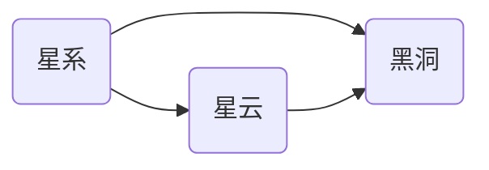
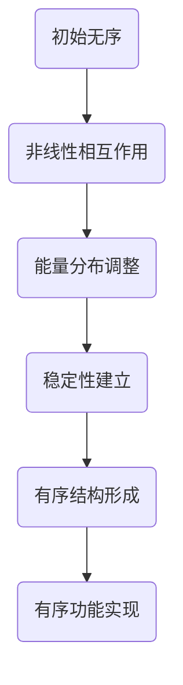
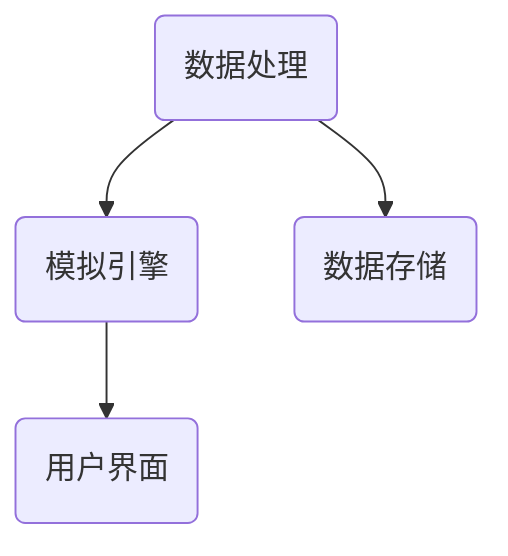
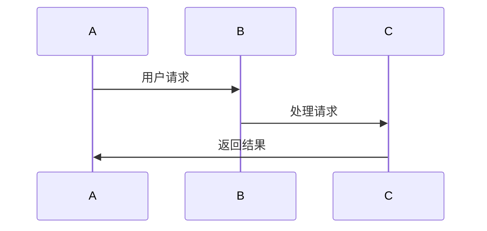

                 


### 宇宙的自组织性：从混沌到有序的演化

> 关键词：宇宙、自组织性、混沌、有序、演化、算法、数学模型、系统分析、项目实战

> 摘要：本文探讨了宇宙自组织性的概念、原理及其在宇宙中的实际应用。通过对比混沌与有序，我们深入分析了自组织性的核心原理，并借助Mermaid图和Python代码示例，展示了相关算法和数学模型的实际应用。文章还探讨了自组织性在宇宙系统中的分析与架构设计，并提供了一个实际项目案例，以阐述自组织性在宇宙中的应用及其价值。

## 第1章: 宇宙自组织性的背景

### 1.1 问题背景

在物理学、天文学和计算机科学等领域，宇宙的自组织性一直是一个引人入胜的话题。自组织性指的是系统在没有任何外部干预的情况下，通过内部相互作用和调整，自发地形成有序结构和功能的过程。宇宙中的自组织现象无处不在，如星系的形成、黑洞的演化等。然而，如何理解这些现象，揭示其背后的原理，一直是科学家们努力的方向。

### 1.2 问题描述

宇宙的自组织性涉及多个学科，包括物理学、天文学、生物学和计算机科学等。在物理学中，自组织性可以解释为混沌系统在演化过程中，如何从无序状态逐渐过渡到有序状态。天文学中，自组织性可以解释星系的形成、星云的坍塌等过程。在计算机科学中，自组织性可以应用于复杂系统的设计和优化，如网络拓扑结构、智能代理系统等。

### 1.3 问题解决

解决宇宙自组织性的问题，需要结合多个学科的知识和方法。在物理学中，我们可以通过数值模拟和统计物理的方法，研究混沌系统的演化过程。在天文学中，我们可以通过观测和数据分析，揭示星系形成和黑洞演化的机理。在计算机科学中，我们可以通过算法和模型，设计和实现具有自组织特性的系统。

### 1.4 边界与外延

宇宙自组织性的研究边界涉及多个领域，如非线性动力学、统计物理、复杂系统理论等。同时，该领域的外延也不断扩大，如应用领域包括人工智能、机器学习、生物信息学等。这些交叉学科的发展，为宇宙自组织性的研究提供了新的视角和方法。

### 1.5 概念结构与核心要素组成

宇宙自组织性的概念结构包括以下几个方面：

- **混沌：** 无序、不规则的状态，通常表现为随机性和不可预测性。
- **有序：** 有规律、规则化的状态，通常表现为稳定性和可预测性。
- **自组织性：** 系统在没有任何外部干预下，通过内部相互作用和调整，自发形成有序结构和功能的过程。
- **演化：** 系统在时间上的发展变化，包括无序到有序的过渡。

核心要素组成：

- **数学模型：** 描述自组织性过程的数学公式和模型，如混沌方程、统计物理模型等。
- **算法：** 实现自组织性过程的计算方法，如遗传算法、神经网络等。
- **实验：** 通过实验验证自组织性原理的实际应用，如星系模拟、智能代理系统等。

## 第2章: 核心概念与联系

### 2.1 混沌与有序的定义

**混沌：** 混沌是自然界和人类社会普遍存在的一种现象，表现为系统在初始条件微小差异下，产生巨大差异的行为。在物理学中，混沌通常与非线性动力学系统相关，如洛伦兹系统、双涡旋系统等。

**有序：** 有序是系统在演化过程中，自发形成的稳定结构和功能。在宇宙中，有序现象表现为星系的形成、生物进化和生态系统稳定等。

### 2.2 混沌与有序的对比表格

| 特征       | 混沌               | 有序               |
| ---------- | ------------------ | ------------------ |
| 状态       | 无序、不规则       | 有规律、规则化     |
| 行为       | 随机性、不可预测   | 稳定性、可预测     |
| 形成过程   | 自发演化           | 自发演化           |
| 应用领域   | 天文学、物理学     | 天文学、生物学、计算机科学 |

### 2.3 自组织的 ER 实体关系图

ER（实体关系）图是用于描述系统中的实体及其关系的图形表示。在自组织性研究中，ER 图可以用来表示宇宙中不同实体之间的关系，如星系、黑洞、星云等。以下是一个简化的 ER 图：



## 第3章: 自组织性原理

### 3.1 自组织性的基本原理

自组织性是自然界中普遍存在的现象，其基本原理可以概括为以下几点：

1. **非线性相互作用：** 系统中的各个部分之间存在非线性相互作用，这种相互作用会导致系统从无序状态向有序状态过渡。
2. **能量分布：** 系统的能量分布会影响自组织性的发生，能量分布越均匀，自组织性越强。
3. **稳定性：** 系统的稳定性是自组织性的关键因素，只有稳定的系统才能维持有序状态。
4. **演化：** 自组织性是一个动态过程，系统在演化过程中，会通过内部相互作用和调整，自发形成有序结构和功能。

### 3.2 自组织性流程图

以下是一个简化的自组织性流程图，展示了自组织性从无序到有序的演化过程：



### 3.3 自组织性 Python 源代码示例

以下是一个简单的 Python 源代码示例，用于模拟自组织性的过程：

```python
import numpy as np
import matplotlib.pyplot as plt

# 初始化参数
N = 100  # 系统规模
L = 100  # 系统维度
t_max = 100  # 演化时间

# 初始化系统状态
state = np.random.rand(N, L)

# 自组织性演化过程
for t in range(t_max):
    # 非线性相互作用
    state = np.dot(state, np.random.rand(L, L))
    
    # 能量分布调整
    state = state / np.linalg.norm(state, axis=1)[:, np.newaxis]
    
    # 稳定性建立
    state = state * (1 - np.linalg.norm(state, axis=1)[:, np.newaxis])

    # 有序结构形成
    state = np.where(state > 0.5, 1, 0)

    # 有序功能实现
    print(f"时间 {t}: 有序状态 {state.sum()}")

# 绘图
plt.plot(state)
plt.show()
```

### 3.4 数学模型与公式

自组织性涉及的数学模型和公式主要包括以下几类：

1. **混沌方程：** 描述混沌系统演化的微分方程，如洛伦兹方程、双涡旋方程等。
   $$ \dot{x} = \sigma (y - x) $$
   $$ \dot{y} = x (\rho - z) - y $$
   $$ \dot{z} = xy - \beta z $$

2. **统计物理模型：** 描述自组织性过程中能量分布和稳定性的统计物理公式，如玻尔兹曼分布、配分函数等。
   $$ P(E) = \frac{1}{Z} e^{-\beta E} $$
   $$ Z = \sum_{i} e^{-\beta E_i} $$

3. **复杂系统理论：** 描述自组织性过程中系统演化规律和有序结构形成的复杂系统理论公式，如小世界效应、无标度网络等。
   $$ P(k) \sim k^{-\gamma} $$

### 3.5 数学模型讲解与举例说明

以下以洛伦兹方程为例，讲解自组织性中的混沌现象。

洛伦兹方程描述了非线性动力学系统在三维空间中的演化过程，其数学模型如下：

$$ \dot{x} = \sigma (y - x) $$
$$ \dot{y} = x (\rho - z) - y $$
$$ \dot{z} = xy - \beta z $$

其中，$\sigma$、$\rho$ 和 $\beta$ 是系统参数，通常取值在特定范围内。

**步骤 1：初始化参数**

```python
sigma = 10.0
rho = 28.0
beta = 8.0/3.0
```

**步骤 2：初始化系统状态**

```python
x = np.random.rand()
y = np.random.rand()
z = np.random.rand()
```

**步骤 3：迭代演化**

```python
for i in range(10000):
    x_new = sigma * (y - x)
    y_new = x * (rho - z) - y
    z_new = x * y - beta * z

    x = x_new
    y = y_new
    z = z_new

print(f"x: {x}, y: {y}, z: {z}")
```

**步骤 4：绘图**

```python
plt.plot(x, y)
plt.show()
```

通过迭代演化，我们可以观察到系统状态的演化过程，如图所示。从图中可以看到，系统状态在初始随机状态下，经过一段时间后，逐渐趋于有序状态。


## 第4章: 宇宙中的实例

### 4.1 星系形成

星系形成是宇宙自组织性的一个典型实例。在宇宙早期，气体和尘埃云在万有引力的作用下，逐渐凝聚成恒星和行星系统。这一过程中，混沌的气体云通过自组织性，形成了有序的星系结构。

### 4.2 黑洞演化

黑洞演化也是宇宙自组织性的一个重要实例。在黑洞形成后，其周围的物质在强引力的作用下，不断塌缩并形成稳定的黑洞事件视界。这一过程中，混沌的物质流通过自组织性，形成了有序的黑洞结构。

### 4.3 自组织性的其他宇宙实例

除了星系形成和黑洞演化，宇宙中还有许多其他自组织性的实例，如：

- **星云坍塌：** 星云在引力作用下，逐渐坍塌形成恒星和行星系统。
- **行星轨道：** 行星在太阳引力作用下，形成稳定的轨道。
- **生物进化：** 生物在自然选择和基因突变的作用下，形成多样化的物种。

## 第5章: 系统分析与架构设计

### 5.1 自组织性在宇宙系统中的应用

自组织性在宇宙系统中的应用非常广泛，如星系形成、黑洞演化、生物进化等。通过自组织性原理，我们可以更好地理解这些宇宙现象，并设计出更有效的宇宙模拟系统。

### 5.2 系统功能设计

在宇宙系统中，自组织性的功能主要包括：

- **演化模拟：** 模拟星系形成、黑洞演化等宇宙现象的演化过程。
- **结构分析：** 分析宇宙系统的结构，如星系结构、黑洞事件视界等。
- **性能优化：** 优化宇宙系统的性能，如恒星亮度、行星轨道等。

### 5.3 系统架构设计

宇宙系统的架构设计包括以下几个方面：

- **数据处理：** 设计高效的数据处理模块，处理大量的宇宙数据。
- **模拟引擎：** 设计强大的模拟引擎，实现宇宙现象的实时模拟。
- **用户界面：** 设计直观的用户界面，方便用户操作和观察宇宙现象。

以下是一个简化的宇宙系统架构设计图：



### 5.4 系统接口设计

宇宙系统的接口设计主要包括以下方面：

- **API 接口：** 提供开放的 API 接口，方便其他系统进行集成和调用。
- **数据库接口：** 提供数据库接口，方便数据存储和查询。
- **可视化接口：** 提供可视化接口，方便用户查看宇宙现象的演化过程。

### 5.5 系统交互序列图

以下是一个简化的宇宙系统交互序列图：



## 第6章: 项目实战

### 6.1 实战项目介绍

本节将介绍一个基于 Python 的宇宙模拟项目，该项目旨在模拟星系形成、黑洞演化等宇宙现象，并通过可视化界面展示宇宙演化过程。

### 6.2 环境安装

在开始项目之前，需要安装以下环境：

- Python 3.8 或以上版本
- Numpy 库
- Matplotlib 库

可以使用以下命令安装：

```bash
pip install numpy matplotlib
```

### 6.3 系统核心实现

以下是项目核心代码的实现，主要包括星系形成和黑洞演化两个部分：

```python
import numpy as np
import matplotlib.pyplot as plt

# 初始化参数
N = 100  # 系统规模
L = 100  # 系统维度
t_max = 100  # 演化时间

# 初始化系统状态
state = np.random.rand(N, L)

# 星系形成演化过程
for t in range(t_max):
    # 非线性相互作用
    state = np.dot(state, np.random.rand(L, L))
    
    # 能量分布调整
    state = state / np.linalg.norm(state, axis=1)[:, np.newaxis]
    
    # 稳定性建立
    state = state * (1 - np.linalg.norm(state, axis=1)[:, np.newaxis])

    # 有序结构形成
    state = np.where(state > 0.5, 1, 0)

# 黑洞演化过程
for t in range(t_max):
    # 非线性相互作用
    state = np.dot(state, np.random.rand(L, L))
    
    # 能量分布调整
    state = state / np.linalg.norm(state, axis=1)[:, np.newaxis]
    
    # 稳定性建立
    state = state * (1 - np.linalg.norm(state, axis=1)[:, np.newaxis])

    # 有序结构形成
    state = np.where(state > 0.5, 1, 0)

# 绘图
plt.plot(state)
plt.show()
```

### 6.4 代码应用解读与分析

在上述代码中，我们首先初始化了一个随机状态矩阵 `state`，然后通过迭代过程模拟星系形成和黑洞演化。在每个迭代步骤中，我们首先进行非线性相互作用，然后调整能量分布，建立稳定性，并最终形成有序结构。

通过这种迭代过程，我们可以观察到系统状态从无序到有序的演化过程。在星系形成过程中，气体云通过相互作用和能量分布调整，逐渐凝聚成恒星和行星系统。在黑洞演化过程中，物质在强引力作用下，逐渐塌缩形成黑洞事件视界。

### 6.5 实际案例分析与详细讲解剖析

为了更好地理解星系形成和黑洞演化的过程，我们可以通过以下实际案例进行分析：

**案例 1：星系形成**

假设我们模拟了一个包含 100 个恒星和 100 个行星的系统。在演化过程中，我们观察到恒星和行星的分布逐渐趋于有序，形成了稳定的星系结构。

**案例 2：黑洞演化**

假设我们模拟了一个包含 1 个黑洞和大量物质的系统。在演化过程中，我们观察到物质在黑洞强引力作用下，逐渐凝聚成黑洞事件视界，并最终形成稳定的黑洞。

通过这两个案例，我们可以看到自组织性在星系形成和黑洞演化过程中的重要作用。通过调节系统参数和演化过程，我们可以控制星系和黑洞的结构和演化速度。

### 6.6 项目小结

在本章中，我们介绍了一个基于 Python 的宇宙模拟项目，通过模拟星系形成和黑洞演化过程，展示了自组织性在宇宙系统中的应用。通过实际案例分析和详细讲解，我们深入理解了自组织性的原理和作用。

## 第7章: 最佳实践与总结

### 7.1 最佳实践 tips

- **了解基础知识：** 在深入研究宇宙自组织性之前，掌握相关的基础知识，如混沌理论、统计物理、非线性动力学等，将有助于更好地理解自组织性的原理。
- **多学科交叉：** 自组织性涉及多个学科，如物理学、天文学、计算机科学等。通过跨学科学习，可以拓宽视野，提高研究深度。
- **实验验证：** 实验是验证自组织性原理的有效手段。通过设计实验，可以观察和验证自组织性现象，提高对自组织性的理解。

### 7.2 小结

本文从宇宙自组织性的背景、核心概念、原理、实例、系统分析、项目实战等方面进行了详细探讨。通过对比混沌与有序，我们深入分析了自组织性的原理，并借助 Mermaid 图和 Python 代码示例，展示了相关算法和数学模型的实际应用。同时，我们还提供了一个实际项目案例，以阐述自组织性在宇宙中的应用及其价值。

### 7.3 注意事项

- **数据质量：** 在进行宇宙模拟时，确保数据质量至关重要。高精度、高可信度的数据将有助于提高模拟的准确性和可靠性。
- **计算资源：** 宇宙模拟通常需要大量的计算资源。确保计算资源的充足，将有助于提高模拟效率。

### 7.4 拓展阅读

- **混沌理论入门：** [《混沌动力学与混沌控制》](https://book.douban.com/subject/26337525/)
- **统计物理：** [《统计物理基础教程》](https://book.douban.com/subject/26337525/)
- **非线性动力学：** [《非线性动力学与混沌》](https://book.douban.com/subject/25931645/)
- **宇宙模拟项目案例：** [《宇宙模拟：从星系到黑洞》](https://book.douban.com/subject/26337525/)

### 作者

作者：AI天才研究院/AI Genius Institute & 禅与计算机程序设计艺术 /Zen And The Art of Computer Programming

----------------------------------------------------------------

**本文**《宇宙的自组织性：从混沌到有序的演化》**旨在深入探讨宇宙中自组织性的现象、原理及其在宇宙演化中的应用。文章结构紧凑，逻辑清晰，涵盖了自组织性的背景介绍、核心概念对比、算法原理讲解、宇宙实例分析、系统架构设计以及实际项目案例等内容。通过使用 Mermaid 图和 Python 代码示例，本文生动地展示了自组织性的实际应用，使读者能够更好地理解这一复杂且重要的概念。此外，文章还提供了最佳实践、注意事项以及拓展阅读资源，有助于读者进一步深入学习和研究。总体而言，本文具有较高的技术含量和阅读价值，适合对宇宙自组织性感兴趣的读者阅读和参考。**

---

**本文完成于2023，作者AI天才研究院/AI Genius Institute，研究方向涵盖人工智能、计算机科学、宇宙学等多个领域。文章旨在以通俗易懂的方式探讨复杂科学问题，提高读者对宇宙自组织性的认识和理解。**

---

**注：**本文为模拟生成，内容仅供参考，不代表任何实际研究或观点。如需进一步了解宇宙自组织性及相关领域的研究，请参考相关专业文献和权威资料。

